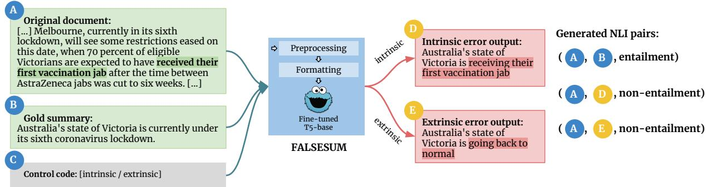
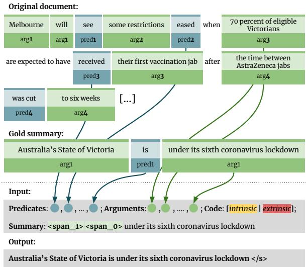
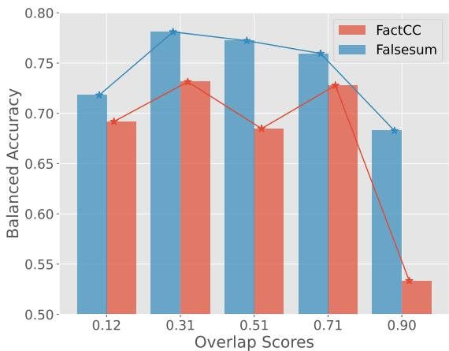

# Falsesum: Generating Document-level NLI Examples for Recognizing Factual Inconsistency in Summarization

Prasetya Ajie Utama†♦ Joshua Bambrick† Nafise Sadat Moosavi‡♦ Iryna Gurevych♦

† Bloomberg, London, United Kingdom

♦ UKP Lab, Technical University of Darmstadt, Germany

‡ Department of Computer Science, The University of Shefield {putama,jbambrick7}@bloomberg.net

## Abstract

Neural abstractive summarization models are prone to generate summaries which are factually inconsistent with their source documents. Previous work has introduced the task of recognizing such factual inconsistency as a downstream application of natural language inference (NLI). However, state-of-the-art NLI models perform poorly in this context due to their inability to generalize to the target task. In this work, we show that NLI models can be efective for this task when the training data is augmented with high-quality task-oriented examples. We introduce Falsesum, a data generation pipeline leveraging a controllable text generation model to perturb human-annotated summaries, introducing varying types of factual inconsistencies. Unlike previously introduced document-level NLI datasets, our generated dataset contains examples that are diverse and inconsistent yet plausible. We show that models trained on a Falsesum-augmented NLI dataset improve the state-of-the-art performance across four benchmarks for detecting factual inconsistency in summarization.1

## 1 Introduction

Recent advances in conditional text generation and the availability of large-scale datasets have given rise to models which generate highly fluent abstractive summaries (Lewis et al., 2019; Zhang et al., 2019). However, studies indicate that such models are susceptible to generating factually inconsistent outputs, i.e., where the content of the summary is not semantically entailed by the input document (Kryscinski et al., 2019; Goodrich et al., 2019). This motivates a new line of research for recognizing factual inconsistency in generated summaries (Kryscinski et al., 2020; Pagnoni et al., 2021; Wang et al., 2020; Fabbri et al., 2021).

This factual consistency problem is closely related to the task of natural language inference (NLI) whereby a hypothesis sentence is classified as either entailed, neutral, or contradicted by a given premise sentence (Condoravdi et al., 2003; Dagan et al., 2006; Bowman et al., 2015). Using an input document as the premise and a corresponding generated summary as the hypothesis, earlier solutions have adopted out-of-the-box NLI models to detect factual inconsistency, albeit with limited success (Falke et al., 2019; Kryscinski et al., 2020).

This poor performance largely stems from the fact that most NLI datasets are not designed to reflect the input characteristics of downstream tasks (Khot et al., 2018). Such datasets may not always capture the kinds of entailment phenomena which naturally arise from neural abstractive summarization. More importantly, there is also a discrepancy in terms of the input granularity, i.e., the premises in this consistency classification task consist of multi-sentence documents while common NLI datasets use single-sentence premises.

In this work, we introduce Falsesum, a data generation pipeline that produces NLI examples consisting of documents paired with gold summaries as positive examples and automatically generated inconsistent summaries as negative examples. We propose a novel strategy to train a text generation model to render false summaries of a given document using only supervision from an existing summarization dataset (Nallapati et al., 2016). In addition, our generator supports switchable input control codes to determine the type of factual error exhibited in the generated output. This design allows Falsesum to compose diverse and naturalistic outputs which more closely resemble the inconsistent summaries generated by summarization models (Maynez et al., 2020). This contrasts with previous solutions (e.g., Kryscinski et al., 2020; Yin et al., 2021), which synthesize NLI examples using rule-based transformations or language model-based replacements, limiting their diversity and ability to reflect realistic factual errors in summarization. Overall, our contributions in this paper are the following:

  
Figure 1: Overview of the Falsesum generation framework. Falsesum preprocesses and formats the source document (A) and a gold summary (B) before feeding it to a fine-tuned generator model. The model produces a factually inconsistent summary, which can then be used to obtain (A, D) or (A, E) as the negative (non-entailment) NLI premise-hypothesis example pair. We also use the original (A, B) as a positive NLI example (entailment).

First, we present a novel training pipeline to create a text generation model which takes as input a pair of a document and a corresponding gold summary. It then perturbs the summary such that it is no longer factually consistent with the original document. Our strategy obviates the need for explicit examples of inconsistent summaries, using only an existing summarization dataset. We use this model to generate a large-scale NLI dataset for the task of recognizing factually inconsistent summaries. The resultant dataset consists of pairs with documents as the premise and naturalistic summaries as the hypotheses, each labeled as either entailment or non-entailment.

Second, we demonstrate the utility of our generated data for augmenting existing NLI datasets. We show that on four benchmark datasets, NLI models trained on Falsesum-augmented data outperform those trained on previous document-level NLI datasets. We conduct an analysis to show that Falsesum-generated summaries are plausible and hard to distinguish from human-written summaries. Lastly, we show that the improvement over the benchmarks is largely attributable to the diversity of factual errors that Falsesum introduces.

## 2 Related Work

This work is related to the growing body of research into factual consistency and hallucination in text generation models, particularly for summarization (Cao et al., 2018). Research has found that around 30% of summaries generated by abstractive summarization models contain information which is inconsistent with the source document (Kryscinski et al., 2019). This motivates the development of an automatic approach to assess factual consistency in generated summaries, in addition to the benchmark datasets to measure the progress in this task (Falke et al., 2019; Kryscinski et al., 2020; Pagnoni et al., 2021; Fabbri et al., 2021).

Earlier work by Goodrich et al. (2019) proposes to use an information extraction model to extract relation tuples from the ground-truth summary text and the generated summary and then count the overlap as the measure of factuality. Eyal et al. (2019); Durmus et al. (2020); Wang et al. (2020) use a question-answering model to detect factual inconsistency by matching the predicted answers using the document and the summary as the context.

Concurrently, researchers have drawn a connection between factual consistency and natural language inference (NLI), observing that all information in a summary should be entailed by the source document. While this approach enables the summary to be directly evaluated without first extracting its intermediate semantic structure, earlier attempts were largely unsuccessful. Falke et al. (2019) use the probabilities assigned to the entailment label by NLI models to re-rank the summary candidates given by beam search but found no improvement in the consistency errors. Kryscinski et al. (2020) evaluate out-of-the-box NLI models on the task of inconsistency detection in a binary classification setting and show that the performance is only slightly better than majority voting.

In the same paper, Kryscinski et al. (2020) propose FactCC, a synthetic NLI data generation process which applies a set of transformation rules to obtain examples of inconsistent summaries (e.g., sentence negation, entity swapping). They demonstrate that the resulting NLI model performs well on realistic test cases which are obtained by manually annotating the output of several summarization models. This highlights the importance of NLI examples beyond sentence-level granularity and which more closely resemble the input characteristics of the downstream tasks (Mishra et al., 2021).2

While the FactCC model is moderately efective for detecting factual inconsistency, subsequent work indicates that it only performs well on easier test cases, where highly extractive summaries (i.e., those with high lexical overlap between a summary and the source document) tend to be factually consistent and more abstractive summaries are likely to be inconsistent (Zhang et al., 2020). Furthermore, Goyal and Durrett (2021) show that the synthetic and rule-based nature of FactCC leads to lack of diversity of consistency error types and it poorly aligns with the error distribution found in more abstractive summaries.

Falsesum addresses these limitations using controlled natural language generation to construct an NLI dataset which better targets the summarization domain. Inspired by the recent work on controllable generation (Keskar et al., 2019; Ross et al., 2021), we employ a generation model conditioned on an input code which controls the type of consistency errors induced. We further use the generated document-level NLI examples for augmentation and show that NLI models can benefit from the additional data without hurting their existing inference ability (Min et al., 2020).

## 3 Falsesum Approach

## 3.1 Design Overview

Falsesum takes as an input a source document D and a corresponding reference summary ${ \mathbf { S } } ^ { + }$ . The framework then preprocesses and formats D and ${ \mathbf { S } } ^ { + }$ and feeds them into a generation model $\mathcal { G }$ which outputs a factually inconsistent summary ${ \bf S } ^ { - }$ . For each summarization example, we then have both positive (entailment) and negative (nonentailment) NLI tuples $( \mathrm { D } , \mathrm { S } ^ { + } , Y = 1 ) , ( \mathrm { D } , \mathrm { S } ^ { - } , Y =$ 0), which consist of a document-level premise, a summary sentence, and the consistency label (1 indicates entailment).

Falsesum aims to produce a naturalistic ${ \bf S } ^ { - }$ which is contrastive with respect to its corresponding ${ \mathbf { S } } ^ { + }$ . This means that ${ \mathbf { S } } ^ { + }$ and ${ \bf S } ^ { - }$ should be indistinguishable in their surface characteristics (e.g., style, length, vocabularies) and only difer in their factual consistency with respect to D. This ensures that the resulting NLI model learns the correct notion of factual consistency rather than discriminating based on surface features (McCoy et al., 2019). In addition to naturalness, we consider the diversity of the consistency error types exhibited by ${ \bf S } ^ { - }$ . We follow the consistency error typology introduced by Maynez et al. (2020), which categorizes consistency errors as either intrinsic, i.e., errors due to incorrect consolidation of information from the source document, or extrinsic, i.e., errors due to assuming new information not directly inferable from the contents of the source document.

As illustrated in Figure 1, a generation model $\mathcal { G }$ is trained to imitate the consistency mistakes of summarization models. Specifically, it generates perturbed summaries by either (1) incorrectly inserting pieces of information from the source document into random spans of the original summary; or (2) amending pieces of information in the summary by hallucinating new “facts” not present in the source document.

To this end, the framework identifies ( i) what information or “facts” in the source document are available to the generator; and ( ii) where the incorrect information can be inserted into the gold summary, which is indicated by span masking. We obtain both by subsequently performing input preprocessing and formatting steps (§3.2 and §3.3).

Next, we define the following seq2seq task to train the model : “Given ( i) a list of shufled and formatted pieces of information extracted from source document and gold summary and ( ii) a partially masked gold summary, fill in the blanks and generate the original gold summary.” Note that using gold summaries means that we can apply the existing summarization corpus to train $\mathcal { G }$ to generate more coherent and plausible sentences.

## 3.2 Input Preprocessing

Following Goodrich et al. (2019), “facts” in the source document and the gold summary are defined as an open information extraction (OpenIE) tuple, which represents the predicate and argument structures found in a sentence. We denote each relation tuple as $\left( \mathbf { \Delta } _ { \mathbf { A R G } _ { 0 } , \mathbf { P R E D } , \ldots , \mathbf { A R G } _ { n } } \right)$ , where predicate pred describes the event (what happened) and its complementing semantic arguments arg represent the who, to whom, where, or how of the event. Predicates are usually the main verb of a clause. Both predicates and their arguments consist of spans of tokens (Fader et al., 2011).

We use an OpenIE implementation of Pred-Patt (White et al., 2016; Zhang et al., 2017), a pattern-based framework for predicate-arguments extraction.3 As illustrated in the top half of Figure $^ { 2 , }$ we extract the relation tuples from each source document and its corresponding reference summaries. To minimize the risk of $\mathcal { G }$ inadvertently generating consistent summaries, we corrupt each extracted “fact” by removing one randomly chosen argument from each tuple. For instance, OpenIE may extract the following tuple from a sentence:

$$
( \frac { \mathrm { { \bf { \underline { { \bf { \underline { { \bf { \Lambda } } } 0 } } } } } } } { \mathrm { { \bf { \Lambda } } _ { \mathrm { { \scriptscriptstyle { \mathrm { \tiny { \& { \bf { \Lambda } } } 0 } } } } } } } , \frac  { \mathrm { { \bf { p } } } { \mathrm { { \bf { \underline { { \bf { \Lambda } } { \bf { a n s } } } } } } \mathrm { { \bf { \Lambda t o } } } \mathrm { { \bf { \underline { { \bf { \Lambda } } { \bf { \bf { \Lambda } } { \bf { \Lambda } } v e } } } } } } } { \mathrm { { \bf { \Lambda } } _ { \mathrm { { \scriptscriptstyle { \mathrm { \tiny { \ R E } } } 0 } } } } } , \frac { \mathrm { { A l e x } } } { \mathrm { { \bf { \Lambda } } _ { \mathrm { { \scriptscriptstyle { \mathrm { \tiny { \& { \bf { \Lambda } } } 0 } } } } } } } , \frac { \mathrm { { a p p l e s } } } { \mathrm { { a p q } } } )
$$

We then randomly choose applesARG to be removed from the tuple. We additionally lemmatize the dependency root word of each argument and predicate span, e.g., plans to give plan to give. This forces the model to learn to correct for grammaticality by inflecting the spans when inserting them to the masked spans. Once all such spans are extracted and processed, they are grouped and shufled into two lists (predicates and arguments).

## 3.3 Input Formatting

Let ${ \bf P } = ( \mathrm { P R E D } _ { 1 } , \dots , \mathrm { P R E D } _ { n } )$ and $\mathbf { A } = ( \mathbf { A R G } _ { 1 } , \ldots ,$ $\mathsf { A R G } _ { m } )$ be the unordered lists of extracted predicates and arguments from a source document D and the summary sentence ${ \mathbf { S } } ^ { + }$ . Additionally, we assume a masked summary sentence M (described later), derived from ${ \mathbf { S } } ^ { + }$ , and a control code variable c intrinsic, extrinsic . Generator $\mathcal { G }$ is trained to compute $p ( \mathbf { S } ^ { + } | \mathbf { P } , \mathbf { A } , \mathbf { M } , c )$ . As illustrated in the bottom half of Figure 2, we encode all the conditional variables into the following format:

Predicates:P; Arguments:A; Code:c; Summary:M

In the following, we describe the key steps in the input formatting process:

  
Figure 2: Input format design of Falsesum. The framework first extracts the predicate and argument spans from the source document and the gold summary. The spans are then corrupted, lemmatized, and shufled before being inserted into the input template.

Step 1: Span Removal Initially, P and A include predicate and argument spans from the original summary which may be used to reconstruct ${ \mathbf { S } } ^ { + }$ . However, at test time we remove these “gold” spans from the two lists to force the $\mathcal { G }$ to make consistency mistakes. The removal is also done when training the model for control code extrinsic to train $\mathcal { G }$ to predict plausible unseen spans.4 We summarize the diferent input formatting in Table 1.

Step 2: Span Reduction To encourage G to generate fine-grained errors (Pagnoni et al., 2021; Goyal and Durrett, 2021), we also train it to hallucinate incorrect modifiers into spans from P and A. To this end, we randomly drop adjectives and adverbs from 10% of the gold predicate and argument spans. For instance, an argument span “recently elected prime minister” will be reduced to “minister”. This teaches the model to generate the remaining part of the span given only the context provided in the formatted input.

Step 3: Control Code To control the type of consistency errors generated by ${ \mathcal { G } } ,$ we append the string “code:” followed by either “intrinsic” or “extrinsic” into the input tokens. The code is determined randomly with equal probability of 0.5.

<table><tr><td rowspan=1 colspan=3>Mode    Input                                                         Expected Output</td><td rowspan=1 colspan=1>Description</td></tr><tr><td rowspan=2 colspan=2>train     Predicates caught,plead guilty to,     appear before,intrinsic</td><td rowspan=2 colspan=1>Two Pennsylvania judgesplead guilty tofederalfraud charges.</td><td rowspan=2 colspan=1>Model learns tocombines listedspans to producemost plausiblesummary.</td></tr><tr><td rowspan=1 colspan=1></td></tr><tr><td rowspan=1 colspan=2>test       Predicates caught,             to,    appear before,intrinsic  face;Arguments the corruption scandal,Two Pennsynia judges,     many children,the U.S. Code intrinsic;Summary:&lt;span_1&gt;&lt;span_0&gt;federal fraud charges.</td><td rowspan=1 colspan=1>Many of the children facefederal fraud charges.</td><td rowspan=1 colspan=1>Modelconsoli-dates incorrectinformation.</td></tr><tr><td rowspan=1 colspan=1>trainextrinsic</td><td rowspan=1 colspan=1>Predicates                 limit,    is being erode,isfight;Argumentspanelist,action,   sea level,,Arctic melt,at the climate change conferenceCodeextrinsic;SummaryThe Alliance&lt;span_0&gt;&lt;span_1&gt;&lt;span_2&gt;.</td><td rowspan=1 colspan=1>The Allianceis pressingfor action at the climatechange conference.</td><td rowspan=1 colspan=1>Model   learnsto  hallucinatenew unsupportedinformation.</td></tr><tr><td rowspan=2 colspan=1>testextrinsic</td><td rowspan=1 colspan=1>Predicates   pressing for,limit,    is being erode,is</td><td rowspan=2 colspan=1>The Allianceis planningto impose 1e limits on emis-sions.</td><td rowspan=2 colspan=1>Model   hallu-cinates    newunsupportedinformation.</td></tr><tr><td rowspan=1 colspan=1>fight;Argumentspanelist,action,    sea level,, Arctic melt,at the climate change conferenceCodeextrinsic;SummaryThe Alliance&lt;span_0&gt;&lt;span_1&gt;&lt;span_2&gt;.</td></tr></table>

Table 1: Examples of input formatting on two diferent summarization instances for both intrinsic and extrinsic error types during training and testing. Gold input spans (indicated by boldface), which are extracted from the gold summary, are only visible to the model during intrinsic training. They are removed from the input in all other settings, as indicated by strikethrough text.

Once the code is chosen, we perform the remaining formatting steps accordingly (see Table 1).

Step 4: Summary Masking We derive masked summary M by replacing the spans of randomly selected predicates and arguments with a special token <span\_i>, where i = 0 is reserved for the predicate, and i > 0 for their arguments. These tokens control where the incorrect information should be inserted by the generator model into the original summary (see Table 1).

## 3.4 Training Falsesum

We run the Falsesum data generation pipeline on the train split of the CNN/DailyMail corpus (Hermann et al., 2015), originally collected for question answering, but subsequently reformulated for summarization by Nallapati et al. (2016). This dataset contains English news documents paired with human-written summaries, each consisting of multiple sentences. We break the summaries down such that each Falsesum example consists of the document text and a single sentence summary. We then run the preprocessing and formatting steps on each document-summary pair. The resulting pairs of formatted input and target output are subsequently split into train and test sets which consist of 394,774 and 262,692 instances, respectively.

We use the T5-base model (Rafel et al., 2020) as generator  and fine-tune it on the seq2seq task described in §3.1. The NLI examples are produced by running the fine-tuned generator on the preprocessed and formatted test split.5 This renders an equal number of positive and negative examples. In our experiments, we randomly sample 100,000 Falsesum examples to augment the NLI dataset.

## 4 Experimental Settings

Our experiments aim to demonstrate the efectiveness of Falsesum-generated document-level examples for NLI dataset augmentation. We evaluate the downstream performance of the NLI models by testing them against several benchmarks for determining the factual inconsistency of generated summaries. In this section, we describe the training setup of the NLI models, including the model and both the sentence- and document-level datasets.

## 4.1 Training

NLI models We train several NLI models by fine-tuning RoBERTa-base (Liu et al., 2019) on either the original or the augmented MNLI dataset (Williams et al., 2018). The MNLI dataset consists of 392,702 train instances, each labeled as either “entailment”, “neutral”, or “contradiction”. To enable the application of NLI data to this factual consistency task, we use a binary formulation of NLI, where the “neutral” and “contradiction” labels are combined into “non-entailment”. The document-level inputs are formatted similarly to sentence-level examples, i.e., the document premise D and summary hypothesis (S+ or S−) are concatenated and a special classification token ([CLS]) is used (Devlin et al., 2019).

Document-level NLI datasets We conduct augmentation comparisons with several multi-sentence NLI datasets which obtain examples from news or summarization domains. We consider the following datasets: ANLI (Nie et al., 2020), a paragraphlevel NLI dataset collected via an iterative and adversarial human-in-the-loop annotation protocol. It consists of mostly Wiki data but also includes a small portion of news text; DocNLI (Yin et al., 2021), a document-level NLI dataset containing multi-sentence premise and hypothesis sentences, collected by converting QA examples to NLI instances (Demszky et al., 2018) and replacing words and sentences in news summaries using a language model; FactCC (Kryscinski et al., 2020), a large-scale dataset specifically generated for training summary factual correctness classification models. The positive examples in FactCC are obtained by backtranslating a random sentence from a CNN/DailyMail news story, while negative examples are obtained by perturbing the sentence using predefined rules, e.g., entity swapping. For fair comparison, we sample 100,000 examples from each augmentation dataset in our experiments.

## 4.2 Benchmark Datasets

We evaluate these NLI models on four benchmark datasets to classify the factual consistency of abstractive summaries. These datasets difer in terms of the annotation protocol, the granularity of the summaries (single- or multi-sentence), the summarization corpus used, and the models used to generate the summaries that are annotated. The tasks are formulated as a binary classification with the labels “consistent” and “inconsistent”. We evaluate NLI models on these tasks by mapping the predicted label “entailment” to “consistent” and “non-entailment” to “inconsistent”. The benchmarks datasets are detailed in the following:

FactCC In addition introducing a synthetic training dataset for the task, Kryscinski et al. (2020)

introduce a manually annotated test set. It contains 1,431 document and single-sentence summary pairs generated by various neural abstractive summarization models trained on CNN/DailyMail corpus.6

Ranksum Falke et al. (2019) formulate the factual consistency problem in summarization as a ranking task. They introduce a dataset consisting of 107 documents, each paired with a set of five ranked summary candidates obtained from the beam search of a summarization model. Given the manually annotated consistency label on summary candidates, the task is to re-rank the list such that the top-1 summary is factually consistent.

Summeval Fabbri et al. (2021) introduce a comprehensive benchmark for factual consistency detection in summarization. It includes summaries generated by seven extractive models and sixteen abstractive models, which are judged by three annotators using a 5-point Likert scale.7

QAGS The dataset collected by Wang et al. (2020) consists of 239 test set instances from XSUM (Narayan et al., 2018) and 714 instances from CNN/DailyMail.8 Each instance consists of a pair of a source document and a single-sentence summary, which is labeled via majority voting on three annotators’ labels.

## 5 Results and Discussion

## 5.1 Main Results

Performance on FactCC, QAGS, and SummEval is measured using balanced accuracy, which is suitable for class imbalanced settings, since the factually consistent label is the majority in some benchmark datasets. It is defined as the average recall of the two classes, such that majority label voting obtains only a 50% score. To measure ranking performance in Ranksum, we calculate the average Precision@1, which computes the fraction of times a factually consistent summary is ranked highest on each test instance. We perform five training runs for each setup using diferent random seeds and take the mean to address performance instability (Reimers and Gurevych, 2017).

<table><tr><td rowspan="2">Dataset</td><td rowspan="2">Augmentation</td><td colspan="5">Benchmark Datasets</td></tr><tr><td>FactCC</td><td>Ranksum</td><td>QAGS</td><td>SummEval</td><td>Overall</td></tr><tr><td>Majority voting</td><td>-</td><td>50.00</td><td>50.46</td><td>50.00</td><td>50.00</td><td>50.11</td></tr><tr><td>MNLI-128</td><td>-</td><td>57.39</td><td>57.01</td><td>59.72</td><td>54.11</td><td>57.06</td></tr><tr><td>[split-doc] MNLI-128</td><td></td><td>72.07</td><td>68.03</td><td>71.08</td><td>55.32</td><td>66.63</td></tr><tr><td>MNLI-512</td><td>一</td><td>57.93</td><td>51.40</td><td>52.73</td><td>48.75</td><td>51.43</td></tr><tr><td>MNLI-512</td><td>ANLI</td><td>53.91</td><td>55.76</td><td>53.54</td><td>49.56</td><td>53.19</td></tr><tr><td>MNLI-512</td><td>DocNLI</td><td>58.13</td><td>53.58</td><td>57.10</td><td>52.59</td><td>55.35</td></tr><tr><td>MNLI-512</td><td>FactCC</td><td>73.87</td><td>67.29</td><td>73.50</td><td>60.04</td><td>69.02</td></tr><tr><td>MNLI-512</td><td>FALSESUM (ours)</td><td>83.52</td><td>72.90</td><td>75.05</td><td>65.18</td><td>74.17</td></tr></table>

Table 2: Performance of MNLI models with diferent augmentation data across benchmarks to classify the factual consistency of summaries. MNLI-128 and MNLI-512 are RoBERTa-base models trained using maximum token length of 128 and 512, respectively.

<table><tr><td>Training Dataset</td><td>Overall</td><td>Δ</td></tr><tr><td>MNLI+FALSESUM</td><td>74.17</td><td></td></tr><tr><td>MNLI+FALsESUM -Contrastive</td><td>73.11</td><td>-1.06</td></tr><tr><td>MNLI+FALsESUM -Extrinsic</td><td>71.95</td><td>-2.22</td></tr><tr><td>MNLI+FALsESUM -Intrinsic</td><td>69.14</td><td>-5.03</td></tr></table>

Table 3: Model performance when trained on ablated Falsesum dataset. Excluding the contrastive, extrinsic, and intrinsic examples results in lower overall performance, indicating each property is beneficial.

From the results in Table 2, we observe the following: (1) Models trained on sentence-level MNLI datasets perform poorly when evaluated directly on document-level benchmarks, even after we increase the maximum input token length from 128 to 512;9 (2) This limitation can be alleviated by the sentence-wise prediction strategy ([split-doc]MNLI-128),10 which achieves 66.63. Note, however, that this improvement comes at the expense of compute cost which is multiplied by a significant factor; (3) DocNLI and ANLI perform poorly even though they contain longer premise sentences, indicating that the length mismatch may not be the primary issue; (4) Falsesum obtains substantial improvement over the previous state-of-the-art FactCC, despite being derived from the same summarization dataset (CNN/DailyMail). This indicates that Falsesum provides higher quality examples and includes more types of entailment phenomena that occur naturally in this task.

## 5.2 Ablation Analysis on Falsesum Data

We perform an ablation analysis to study how each component of our data generation pipeline contributes to the final performance. We first remove the contrastive property of the Falsesum data by randomly including only either the positive $( \mathrm { D } , \mathrm { S } ^ { + } , Y ~ = ~ 1 )$ or negative $( \mathrm { D } , \mathrm { S } ^ { - } , Y ~ = ~ 0 )$ NLI examples obtained from a single (D, S+) pair. Next, we filter out the negative NLI instances that are generated using either intrinsic or extrinsic code. We refer to the three ablated datasets as contrastive, intrinsic and extrinsic, respectively. We set the sampled training size to 100,000 for the three ablation setups and aggregate the results from five training runs.

Table 3 shows the performance of the ablated models. We observe that removing contrastive pairs in the augmented training data results in a 1.06% drop on the overall benchmarks score. We also see that removing intrinsic error examples results in the highest performance loss, 5.03% compared to 2.22% by extrinsic. This is explained by the fact that intrinsic consistency errors are more dominant on benchmarks that are built on the CNN/DailyMail corpus (Goyal and Durrett, 2021). We conclude that all the above properties are important for the overall improvements obtained by Falsesum.

## 5.3 Fine-grained Evaluation

Previous work has shown that NLI models are prone to relying on fallible heuristics which associate lexical overlap with entailment labels (McCoy et al., 2019). In the factual consistency task, this corresponds to models associating highly extractive summaries with the “consistent” label. This raises a question about whether Falsesum data alleviates this tendency in the resulting NLI models.

To answer this question, we partition the FactCC annotated test examples into five ordered subsets based on the lexical overlap between their summary hypothesis and the source document premise. We define an overlap score using the normalized coverage and density summary extractiveness scores introduced by Grusky et al. (2018). Both measures have the range [0.0, 1.0], where density = 1.0 indicates that all words in a summary are also present in the source document and normalized coverage = 1.0 indicates that the summary is obtained by copying a continuous fragment of the source document. We then define overlap = normalized coverage density.

  
Figure 3: Comparison between NLI models augmented with Falsesum and FactCC across diferent measures of summary extractiveness. The x-axis shows the median overlap score of each test subset.

Figure 3 shows the comparison of FactCC and Falsesum augmentation performance across varying lexical overlap scores. We see that Falsesum performs better on all subsets of the FactCC test set with the greatest performance gap appearing on the 0.9 overlap subset. Upon closer inspection, we see that the FactCC model makes mostly false positive classification errors on this subset, i.e., it tends to predict highly extractive summaries as “consistent”, leading to near majority voting performance of 50%. Falsesum, on the other hand, better discriminates the factual consistency of examples without over-relying on lexical overlap.

## 5.4 Data Quality Analysis

We conduct both manual and automatic quality evaluation of the Falsesum-generated dataset. First, we sample 200 generated negative examples and manually verify whether (i) the perturbed summary S− is indeed factually inconsistent; (ii) the type of consistency error follows the specified control code; (iii) the incorrect “fact” is inserted at the specified missing span. Following Kryscinski et al. (2020), the authors perform this annotation to avoid high disagreement by crowd annotators in this task (Falke et al., 2019). The results in Table 4 show that about 86% of intrinsic 81% of extrinsic generated error examples are factually inconsistent, which happen due to several reasons, e.g., generator model chooses a span from the list that is similar to the original span, or generator model correctly guesses the original missing span. This further suggests that pre-trained language models such as RoBERTa-base can be robust against the induced label noise and can still learn a performant classifier. While almost always inserts the incorrect “fact” at the specified positions, we observe that it often fails to follow the specified extrinsic code correctly. We suspect that this is because the model prefers the easier task of copying the input over generating novel phrases.11

<table><tr><td>Code</td><td>Label √</td><td>Type ✓|</td><td>Span√</td></tr><tr><td>Intrinsic</td><td>86%</td><td>94%</td><td>94%</td></tr><tr><td>Extrinsic</td><td>81%</td><td>65%</td><td>95%</td></tr></table>

Table 4: Manual verification of Falsesum-generated NLI examples. Label, type, and span indicate the percentage of generated summaries with correct inconsistency label, error type, and error span, respectively.
<table><tr><td></td><td>FactCC</td><td>DocNLI</td><td>FALSESUM</td></tr><tr><td>Majority voting</td><td>50.84</td><td>53.55</td><td>50.00</td></tr><tr><td>CBOW-GloVe</td><td>60.36</td><td>70.38</td><td>56.13</td></tr><tr><td>BiLSTM-GloVe</td><td>68.26</td><td>73.04</td><td>57.62</td></tr><tr><td>RoBERTA-base</td><td>82.15</td><td>78.46</td><td>69.38</td></tr></table>

Table 5: Hypothesis-only model performance (accuracy) to measure the presence of artifacts and naturalness of Falsesum dataset (lower is better).

Following Gururangan et al. (2018), we also evaluate the naturalness of the generated dataset. We train an NLI model using positive examples from CNN/DailyMail and Falsesum-generated negative examples. The model receives no premise so must distinguish between entailed and non-entailed hypotheses using semantic plausibility or spurious surface features, e.g., grammatical mistakes or fluency errors. The relatively low accuracy of these models on Falsesum data (shown in Table 5) suggests that, compared to FactCC and DocNLI, Falsesum-generated summaries are relatively hard to distinguish from the gold ones.

## Conclusion

NLI models present a promising solution for automatic assessment of factual consistency in summarization. However, the application of existing models for this task is hindered by several challenges, such as the mismatch of characteristics between their training dataset and the target task data. This mismatch includes the diference in terms of the input granularity (sentence vs. document level premises) and the types of (non-)entailment phenomena that must be recognized.

In this work, we present Falsesum, a data generation pipeline which renders large-scale documentlevel NLI datasets without manual annotation. Using our training strategy, we demonstrate that it is possible to learn to generate diverse and naturalistic factually inconsistent (non-entailed) summaries using only existing (entailed) consistent summaries for training. We show that the resultant data is effective for augmenting NLI datasets to improve the state-of-the-art performance across four summary factual inconsistency benchmarks.

## Acknowledgments

We would like to thank Marco Ponza, Marco Fiscato, Umut Topkara and other colleagues from Bloomberg AI for the thoughtful discussion and feedback throughout this project. We also thank Leonardo Ribeiro for comments on the earlier version of this work and the anonymous reviewers for their constructive feedback. The authors affiliated with UKP were supported by the German Research Foundation through the research training group “Adaptive Preparation of Information from Heterogeneous Sources” (AIPHES, GRK 1994/1) and by the German Federal Ministry of Education and Research and the Hessian State Ministry for Higher Education, Research and the Arts within their joint support of the National Research Center for Applied Cybersecurity ATHENE.

## References

Samuel R. Bowman, Gabor Angeli, Christopher Potts, and Christopher D. Manning. 2015. A large annotated corpus for learning natural language inference. In Proceedings of the 2015 Conference on Empirical Methods in Natural Language Processing, pages 632–642, Lisbon, Portugal. Association for Computational Linguistics.

Ziqiang Cao, Furu Wei, Wenjie Li, and Sujian Li. 2018. Faithful to the original: Fact aware neural abstrac-

tive summarization. In Proceedings of the Thirty-Second AAAI Conference on Artificial Intelligence, (AAAI-18), the 30th innovative Applications ofArtificial Intelligence (IAAI-18), and the 8th AAAI Symposium on Educational Advances in Artificial Intelligence (EAAI-18), New Orleans, Louisiana, USA, February 2-7, 2018, pages 4784–4791. AAAI Press.

Cleo Condoravdi, Dick Crouch, Valeria de Paiva, Reinhard Stolle, and Daniel G. Bobrow. 2003. Entailment, intensionality and text understanding. In Proceedings ofthe HLT-NAACL 2003 Workshop on Text Meaning, pages 38–45.

Ido Dagan, Oren Glickman, and Bernardo Magnini. 2006. The pascal recognising textual entailment challenge. In Machine Learning Challenges. Evaluating Predictive Uncertainty, Visual Object Classification, and Recognising Tectual Entailment, pages 177–190, Berlin, Heidelberg. Springer Berlin Heidelberg.

Dorottya Demszky, Kelvin Guu, and Percy Liang. 2018. Transforming question answering datasets into natural language inference datasets. CoRR, abs/1809.02922.

Jacob Devlin, Ming-Wei Chang, Kenton Lee, and Kristina Toutanova. 2019. BERT: Pre-training of deep bidirectional transformers for language understanding. In Proceedings of the 2019 Conference of the North American Chapter of the Association for Computational Linguistics: Human Language Technologies, Volume 1 (Long and Short Papers), pages 4171–4186, Minneapolis, Minnesota. Association for Computational Linguistics.

Esin Durmus, He He, and Mona Diab. 2020. FEQA: A question answering evaluation framework for faithfulness assessment in abstractive summarization. In Proceedings ofthe 58th Annual Meeting ofthe Association for Computational Linguistics, pages 5055– 5070, Online. Association for Computational Linguistics.

Matan Eyal, Tal Baumel, and Michael Elhadad. 2019. Question answering as an automatic evaluation metric for news article summarization. In Proceedings of the 2019 Conference of the North American Chapter of the Association for Computational Linguistics: Human Language Technologies, Volume 1 (Long and Short Papers), pages 3938–3948, Minneapolis, Minnesota. Association for Computational Linguistics.

Alexander R. Fabbri, Wojciech Krysci ´ nski, Bryan´ McCann, Caiming Xiong, Richard Socher, and Dragomir Radev. 2021. SummEval: Re-evaluating Summarization Evaluation. Transactions of the Associationfor Computational Linguistics, 9:391–409.

Anthony Fader, Stephen Soderland, and Oren Etzioni. 2011. Identifying relations for open information extraction. In Proceedings of the 2011 Conference on Empirical Methods in Natural Language Processing,

pages 1535–1545, Edinburgh, Scotland, UK. Association for Computational Linguistics.

Tobias Falke, Leonardo F. R. Ribeiro, Prasetya Ajie Utama, Ido Dagan, and Iryna Gurevych. 2019. Ranking generated summaries by correctness: An interesting but challenging application for natural language inference. In Proceedings of the 57th Annual Meeting of the Association for Computational Linguistics, pages 2214–2220, Florence, Italy. Association for Computational Linguistics.

Ben Goodrich, Vinay Rao, Peter J. Liu, and Mohammad Saleh. 2019. Assessing the factual accuracy of generated text. In Proceedings of the 25th ACM SIGKDD International Conference on Knowledge Discovery & Data Mining, KDD ’19, page 166–175, New York, NY, USA. Association for Computing Machinery.

Tanya Goyal and Greg Durrett. 2021. Annotating and modeling fine-grained factuality in summarization. In Proceedings ofthe 2021 Conference ofthe North American Chapter of the Association for Computational Linguistics: Human Language Technologies, pages 1449–1462, Online. Association for Computational Linguistics.

Max Grusky, Mor Naaman, and Yoav Artzi. 2018. Newsroom: A dataset of 1.3 million summaries with diverse extractive strategies. In Proceedings of the 2018 Conference of the North American Chapter of the Association for Computational Linguistics: Human Language Technologies, Volume 1 (Long Papers), pages 708–719, New Orleans, Louisiana. Association for Computational Linguistics.

Suchin Gururangan, Swabha Swayamdipta, Omer Levy, Roy Schwartz, Samuel Bowman, and Noah A. Smith. 2018. Annotation artifacts in natural language inference data. In Proceedings of the 2018 Conference of the North American Chapter of the Association for Computational Linguistics: Human Language Technologies, Volume 2 (Short Papers), pages 107–112, New Orleans, Louisiana. Association for Computational Linguistics.

Karl Moritz Hermann, Tomás Kociský, Edward Grefenstette, Lasse Espeholt, Will Kay, Mustafa Suleyman, and Phil Blunsom. 2015. Teaching machines to read and comprehend. In Advances in Neural Information Processing Systems 28: Annual Conference on Neural Information Processing Systems 2015, December 7-12, 2015, Montreal, Quebec, Canada, pages 1693–1701.

Nitish Shirish Keskar, Bryan McCann, Lav R. Varshney, Caiming Xiong, and Richard Socher. 2019. CTRL: A conditional transformer language model for controllable generation. CoRR, abs/1909.05858.

Tushar Khot, Ashish Sabharwal, and Peter Clark. 2018. Scitail: A textual entailment dataset from science question answering. In Proceedings of the Thirty-Second AAAI Conference on Artificial Intelligence,

(AAAI-18), the 30th innovative Applications ofArtificial Intelligence (IAAI-18), and the 8th AAAI Symposium on Educational Advances in Artificial Intelligence (EAAI-18), New Orleans, Louisiana, USA, February 2-7, 2018, pages 5189–5197. AAAI Press.

Wojciech Kryscinski, Nitish Shirish Keskar, Bryan Mc-Cann, Caiming Xiong, and Richard Socher. 2019. Neural text summarization: A critical evaluation. In Proceedings of the 2019 Conference on Empirical Methods in Natural Language Processing and the 9th International Joint Conference on Natural Language Processing (EMNLP-IJCNLP), pages 540– 551, Hong Kong, China. Association for Computational Linguistics.

Wojciech Kryscinski, Bryan McCann, Caiming Xiong, and Richard Socher. 2020. Evaluating the factual consistency of abstractive text summarization. In Proceedings of the 2020 Conference on Empirical Methods in Natural Language Processing (EMNLP), pages 9332–9346, Online. Association for Computational Linguistics.

Philippe Laban, Tobias Schnabel, Paul N. Bennett, and Marti A. Hearst. 2022. SummaC: Re-Visiting NLIbased Models for Inconsistency Detection in Summarization. Transactions of the Association for Computational Linguistics, 10:163–177.

Mike Lewis, Yinhan Liu, Naman Goyal, Marjan Ghazvininejad, Abdelrahman Mohamed, Omer Levy, Veselin Stoyanov, and Luke Zettlemoyer. 2019. BART: denoising sequence-to-sequence pretraining for natural language generation, translation, and comprehension. CoRR, abs/1910.13461.

Yinhan Liu, Myle Ott, Naman Goyal, Jingfei Du, Mandar Joshi, Danqi Chen, Omer Levy, Mike Lewis, Luke Zettlemoyer, and Veselin Stoyanov. 2019. Roberta: A robustly optimized BERT pretraining approach. CoRR, abs/1907.11692.

Joshua Maynez, Shashi Narayan, Bernd Bohnet, and Ryan McDonald. 2020. On faithfulness and factuality in abstractive summarization. In Proceedings of the 58th Annual Meeting of the Association for Computational Linguistics, pages 1906–1919, Online. Association for Computational Linguistics.

Tom McCoy, Ellie Pavlick, and Tal Linzen. 2019. Right for the wrong reasons: Diagnosing syntactic heuristics in natural language inference. In Proceedings of the 57th Annual Meeting of the Association for Computational Linguistics, pages 3428–3448, Florence, Italy. Association for Computational Linguistics.

Junghyun Min, R. Thomas McCoy, Dipanjan Das, Emily Pitler, and Tal Linzen. 2020. Syntactic data augmentation increases robustness to inference heuristics. In Proceedings of the 58th Annual Meeting of the Association for Computational Linguistics, pages 2339–2352, Online. Association for Computational Linguistics.

Anshuman Mishra, Dhruvesh Patel, Aparna Vijayakumar, Xiang Lorraine Li, Pavan Kapanipathi, and Kartik Talamadupula. 2021. Looking beyond sentencelevel natural language inference for question answering and text summarization. In Proceedings of the 2021 Conference of the North American Chapter of the Association for Computational Linguistics: Human Language Technologies, pages 1322–1336, Online. Association for Computational Linguistics.

Ramesh Nallapati, Bowen Zhou, Cicero dos Santos, Çaglar Gucehre, and Bing Xiang. 2016.˘ Abstractive text summarization using sequence-to-sequence RNNs and beyond. In Proceedings of The 20th SIGNLL Conference on Computational Natural Language Learning, pages 280–290, Berlin, Germany. Association for Computational Linguistics.

Shashi Narayan, Shay B. Cohen, and Mirella Lapata. 2018. Don’t give me the details, just the summary! topic-aware convolutional neural networks for extreme summarization. In Proceedings of the 2018 Conference on Empirical Methods in Natural Language Processing, pages 1797–1807, Brussels, Belgium. Association for Computational Linguistics.

Yuyang Nie, Yuanhe Tian, Yan Song, Xiang Ao, and Xiang Wan. 2020. Improving named entity recognition with attentive ensemble of syntactic information. In Findings of the Association for Computational Linguistics: EMNLP 2020, pages 4231–4245, Online. Association for Computational Linguistics.

Artidoro Pagnoni, Vidhisha Balachandran, and Yulia Tsvetkov. 2021. Understanding factuality in abstractive summarization with FRANK: A benchmark for factuality metrics. In Proceedings of the 2021 Conference of the North American Chapter of the Association for Computational Linguistics: Human Language Technologies, pages 4812–4829, Online. Association for Computational Linguistics.

Colin Rafel, Noam Shazeer, Adam Roberts, Katherine Lee, Sharan Narang, Michael Matena, Yanqi Zhou, Wei Li, and Peter J. Liu. 2020. Exploring the limits of transfer learning with a unified text-to-text transformer. J. Mach. Learn. Res., 21:140:1–140:67.

Nils Reimers and Iryna Gurevych. 2017. Reporting score distributions makes a diference: Performance study of LSTM-networks for sequence tagging. In Proceedings of the 2017 Conference on Empirical Methods in Natural Language Processing, pages 338–348, Copenhagen, Denmark. Association for Computational Linguistics.

Alexis Ross, Tongshuang Wu, Hao Peng, Matthew E. Peters, and Matt Gardner. 2021. Tailor: Generating and perturbing text with semantic controls. CoRR, abs/2107.07150.

Alex Wang, Kyunghyun Cho, and Mike Lewis. 2020. Asking and answering questions to evaluate the factual consistency of summaries. In Proceedings of

the 58th Annual Meeting of the Association for Computational Linguistics, pages 5008–5020, Online. Association for Computational Linguistics.

Aaron Steven White, Drew Reisinger, Keisuke Sakaguchi, Tim Vieira, Sheng Zhang, Rachel Rudinger, Kyle Rawlins, and Benjamin Van Durme. 2016. Universal decompositional semantics on Universal Dependencies. In Proceedings ofthe 2016 Conference on Empirical Methods in Natural Language Processing, pages 1713–1723, Austin, Texas. Association for Computational Linguistics.

Adina Williams, Nikita Nangia, and Samuel Bowman. 2018. A broad-coverage challenge corpus for sentence understanding through inference. In Proceedings of the 2018 Conference of the North American Chapter of the Association for Computational Linguistics: Human Language Technologies, Volume 1 (Long Papers), pages 1112–1122, New Orleans, Louisiana. Association for Computational Linguistics.

Wenpeng Yin, Dragomir Radev, and Caiming Xiong. 2021. DocNLI: A large-scale dataset for documentlevel natural language inference. In Findings of the Associationfor Computational Linguistics: ACL-IJCNLP 2021, pages 4913–4922, Online. Association for Computational Linguistics.

Jingqing Zhang, Yao Zhao, Mohammad Saleh, and Peter J. Liu. 2019. PEGASUS: pre-training with extracted gap-sentences for abstractive summarization. CoRR, abs/1912.08777.

Sheng Zhang, Rachel Rudinger, and Benjamin Van Durme. 2017. An evaluation of PredPatt and open IE via stage 1 semantic role labeling. In IWCS 2017 — 12th International Conference on Computational Semantics — Short papers.

Yuhui Zhang, Yuhao Zhang, and Christopher D. Manning. 2020. A close examination of factual correctness evaluation in abstractive summarization.

## A Hyperparameters

Generator model We train a T5-base model for three epochs with batch size of 24 using the AdamW optimizer. We set the maximum source token length to 256 and the target token length to 42. We use a learning rate of $3 e ^ { - 5 }$ and fix the random seed to 11. For decoding, we set the minimum and maximum sequence length to 10 and 60, respectively. We sample using beam search with a beam of size two. We additionally set the repetition penalty to 2.5 and the length penalty to 1.0.

Classification model We train RoBERTa-base models on augmented and original MNLI datasets for three epochs with a batch size of 32. The learning rate is set to $1 e ^ { - 5 }$ , while the maximum input token length is set to either 128 or 512. We use the following random seeds for the five training runs: 11, 12, 13, 14, and 15.

## B Aggregating Predictions

We follow Falke et al. (2019) to adapt out-of-thebox MNLI models to document-level input by performing a sentence-wise prediction before aggregating the output. Given a document D consisting of sentences $d _ { 1 } , \ldots , d _ { n }$ , and a multi-sentence summary S consisting of $s _ { 1 } , \ldots , s _ { m } ,$ we aggregate the probability scores given by the classifier model F on each $d _ { i } , s _ { j }$ pair. The aggregated consistency score $\sigma (  { \mathbf Ḋ \Gamma Ḍ } _ { } , S )$ is given by:

$$
\sigma ( \mathrm { D } , S ) = { \frac { 1 } { m } } \sum _ { j = 1 } ^ { m } \operatorname* { m a x } _ { d \in \mathrm { D } } F ( d , s _ { j } )
$$

This means that it is suficient for a summary sentence to be factually consistent given only a single entailing sentence in the source document. We then take the average scores across the summary sentences since each of them needs to be entailed by the source document. We use a similar aggregation method to evaluate augmented MNLI models on multi-sentence summaries from the Summeval and Ranksum benchmarks.

## C Falsesum Details

In the preprocessing steps, we only perform the predicate and argument span extraction on the first 15 sentences for computational eficiency. For training, this is not an issue since the gold spans from the reference summary are included in the input. Additionally, we may extract multiple OpenIE relation tuples from each sentence. To avoid having overlapping spans from a single input, we randomly select two tuples from each sentence.

## D Falsesum Examples

We include more examples of generated NLI instances in Table 6. We also include cases where Falsesum inadvertently generates factually consistent summaries in Table 7. Lastly, we show several examples of the formatted input and the generated output at test time in Table 8.

<table><tr><td colspan="6" rowspan="3">Mexican federal police have arrested a fugitive on the FBI's 10 Most Wanted list, Mexican authorities said. Jorge AlbertoLopez Orozco allegedly murdered his girlfriend and her two young sons. Jorge Alberto Lopez Orozco is wanted in ElmoreCounty, Idaho, on charges that he shot and killed three people, the FBI said. The charred remains of a woman and hersons, ages 2 and 4, were found inside a burned-out vehicle on August 11, 2002, it said. Each victim had been shot in thehead or chest. TheFBI was still working Friday to confirm the identity of the man in custody, said Debbie Dujanovic, aspokeswoman in the agency's Salt Lake City, Utah, field office. The Salt Lake City office has jurisdiction in the case.Anextradition order was issued inJanuary 2007, the Mexican attorney general's office said in a news release Thursday. A rewardof up to $100,000 was being offered, the FBI said. Lopez, 33, was captured in Zihuatanejo, a city northwest of Acapulcoon the Pacific Coast in southern Mexico, the Mexican attorney general's office said. Zihuatanejo is in Guerrero state, butLopez was transferred to a jail in neighboring Michoacan state, officials said. The arrest came about after investigationand intelligence work by Mexican authorities, the attorney general's office said. According to the FBI, Lopez abducted hisgirlfriend, Rebecca Ramirez, and her two young sons from her father's house in Nyssa, Oregon, onJuly 30, 2002. The car hehad been driving was found nearly two weeks later on a rural road near Mountain Home, Idaho, officials said.</td></tr><tr><td colspan="3" rowspan="1">n in the a</td></tr><tr><td colspan="2" rowspan="1">was i</td><td colspan="1" rowspan="1">s issue</td></tr><tr><td colspan="6" rowspan="1">entailment FBI was still working Friday to confirm the identity of the man in custody.(intrinsic) non-entailment  An extradition order was issued in July 30, 2002, to determinethe identity of the man incustody.</td></tr><tr><td colspan="6" rowspan="2">He may have been allowed to leave the club without ever playing a league game for the first team, butKristoffer Olssonstill showed Arsenal some love as he departed.The 19-year-old Swede, whose only first-team appearance for the Gunnerscame off the bench in the Capital One Cup last season, has joined FC Midtjylland this week on a permanent deal. But, as thenews was announced, Olsson took to Twitter to say 'Once a Gunner, always a Gunner'. Kristoffer Olsson (right) played just</td></tr><tr><td colspan="5" rowspan="1"></td><td colspan="1" rowspan="1">e off the bench in the</td></tr><tr><td colspan="6" rowspan="1">once for Arsenal's first team, in the Capital One cup against West Brom . Olsson expressed his love for the club on Twitter,despite being sold to FC Midtjylland . The tweet reflects Cesc Fabregas' comments when he left the club to join Barcelona,although the Spanish midfielder has sinced joined rivalsChelsea, after Arsene Wenger opted not to buy him back.Olssonhas been on loan at FC Midtjyllandsince the beginning of the season, playing six times in the Danish top flight. The SwedenU21 international said on joining permanently: 'this is a club that believes in me and sees my potential.' Olsson has playedsix times on loan with FC Midtjylland and has now joined the Danish club permanently.</td></tr><tr><td colspan="6" rowspan="1">entailment Swedish international takes to social media to express love for Arsenal.(intrinsic) non-entailmentSwedish internationalhas been on loan at Chelsea since last season.</td></tr><tr><td colspan="6" rowspan="1">A teenager who was struck down with an agonising bowel condition says dancing has helped him to overcome his debilitatingillness.MacaulaySelwood, 17, was diagnosed with Crohn'stwo years ago and was so unwell that he was often left in</td></tr><tr><td colspan="6" rowspan="1">agony on the floor unable to move. But his determination to continue his promising dancing career gave him the spur heneeded to battle through. Lord of the Dance: Macaulay at his practice studio.He was diagnosed with Ċrohn's in September2010after collapsing in agony during a dance class . Recovery: 'Dancing has helped me overcome it (Crohn's). It kept memotivated' Now the teenager from Bristol has made it to the finals of the Irish dancing world championships in Boston, USAand is hotly-tipped for glory. He will then have a trial at the famous performing arts school, ArtsEd, in London. At showshe has been compared with Riverdance star Michael Flatley while others have taken to calling him Billy Elliot, after thefilm character who overcomes the odd to becoming a dancing star. Macaulay did ballet at college before focusing on Irishdancing for the world championships and works at Tesco to fund his passion.</td></tr><tr><td colspan="6" rowspan="1">entailment  Macaulay Selwood, 17, first starting suffering from Crohn's disease in 2010.(extrinsic) non-entailment  The 22-year-old, who was diagnosed with Crohn's in 2010,has been recovering since2010.</td></tr><tr><td colspan="6" rowspan="1">When Matthew Briggs, 32, from Huntington in North Yorkshire noticed that his father had posted a photo of them togetheron Facebook, he was initially pleased. But when he opened the photo and saw the image, Mr Briggs was left horrified by thesight of his 31st frame. Now, two years on, he has shed an astonishing 17st and, in November, will complete the New Yorkmarathon in memory of his mother Susan who died from multiple sclerosis when he was just 18. Pounding the pavements:Matthew Briggs, 32, has lost an impressive 17st in just two years of slimming .'In March of 2000, she lost her battle withMultiple Sclerosis,'he says. 'She has always been my inspiration. I am the man I am today because of the woman she was.Money raised by Mr Briggs’ 26-mile run will be donated to the Multiple Sclerosis Society, a charity dedicated to beating the</td></tr><tr><td colspan="6" rowspan="1">diseaseas well as supporting sufferers and their families. Mr Briggs, who has dropped from 31st to just under 14st, had piledon the pounds thanks to a diet of ready meals, takeaways and daily two litre bottles of Coca-Cola. But, after seeing the photoposted on Facebook and spurred on by a bet with his father, Mr Briggs joined his local Slimming World group and went onto shed more than 17st over two years.</td></tr><tr><td colspan="6" rowspan="1">entailment She died in 2000 of multiple sclerosis and funds raised will go to charity.(extrinsic) non-entailment She died in 2000 of multiple sclerosis andevery penny she saveswill go to charity</td></tr><tr><td colspan="6" rowspan="1">The Mojito, a Cuban mix of white rum, sugar, lime, mint and soda water, is the most popular cocktail in Britain according toa report .Sales of cocktails have risen by more than 10 per cent in the past two years. More than one in five of Britain's pubs</td></tr><tr><td colspan="6" rowspan="1">and bars now serve cocktails and the Mojito – a Cuban mix of white rum, sugar, lime, mint and soda water – is the mostpopular, according to a report. Pina Coladas (rum, coconut and pineapple juice) and Woo Woos (vodka, peach schnapps andcranberry juice) were also popular. The Mixed Drinks Report, by consultancy firm CGA Strategy, found more women thanmen choose cocktails, as 54 per cent of cocktail drinkers are female. Bomb and pitcher serves remain popular, with 74 percent of 18 to 24-year-olds admitting to have bought a bomb drink, while nine in 10 in the same age range say they drinkpitchers. Cocktails are enjoyed by the core 18 to 35-year-old demographic 'in all on-trade occasions' including throughoutthe night, as opposed to just the start. ..</td></tr><tr><td colspan="6" rowspan="1">gold Sales of cocktails have risen by more than 10 per cent in the past two years.(extrinsic) generated  Cocktails have soared in popularity overthe past two years.</td></tr><tr><td colspan="6" rowspan="1">From Yellowstone National Park to the Everglades,America's 391 national parks are in need of repair– and thanks tothe economic stimulus signed into law, help is now underway. President Obama and his family visit the Grand Canyon inArizona, a national park. President Obama's $787 billion economic stimulus plan passed in February and designated $750million dollars to the national parks. But not all of the stimulus money is being used –and the parks are facing a $9 billion</td></tr><tr><td colspan="6" rowspan="1">backlog in maintenance projects. So far, nearly 10 percent is in the pipeline. "We are picking away at it as much as we canand we've been fortunate to have the recovery act money," said Jeffrey Olson of the National Park Service. Olson said halfof the $9 billion is slated to go for road repairs. "Half of that [$9 billion] is roads and about $2 billion of that are the mostpressing needs – those we get some help from the stimulus. The president's budget proposal is calling for more maintenanceand construction money," Olsen said. Dan Wenk, the acting director of the National Park Service says most of those pressingneeds include, "camp grounds, camp sites, it's amphitheaters for evening programs. It's the bathrooms. . . .</td></tr><tr><td colspan="6" rowspan="1">gold  Park Service is dealing with a $9 billion backlog of maintenance needs.(intrinsic) generated  America's 391 national parks are facinga $9 billion backlog of maintenance needs.</td></tr></table>

Table 6: Examples of NLI pairs generated by Falsesum. We show both the entailment and non-entailment hypotheses obtained from each source document. Green-highlighted spans indicate the information used consistently in the summary. Red-highlighted spans indicate information used or inserted by the model to generate an inconsistent summary.

Table 7: Falsesum-generated summaries that are unintentionally consistent with the source document. Green-highlighted spans indicate information which is consistent with the document.
<table><tr><td rowspan=2 colspan=2>Predicates::is being offer for, were steal from, sell, Both as a solo artist and leader of the Heartbreakers, is one of ,</td></tr><tr><td rowspan=1 colspan=1></td><td rowspan=1 colspan=1></td></tr><tr><td rowspan=1 colspan=1>Quan, five guitars, the Recording Industry Association of America, more than 57 million albums, Petty, A 7,500 reward, a</td><td rowspan=1 colspan=1></td></tr><tr><td rowspan=1 colspan=2>soundstage, the Rock &amp; Roll Hall of Fame;Code: intrinsic; Summary:&lt;span_1&gt;&lt;span_0&gt;the 1960s.</td></tr><tr><td rowspan=1 colspan=2>gold  Three of them were vintage guitars from the 1960s.(intrinsic) generated  The band was inducted into the Rock &amp; Roll Hall of Fame inthe 1960s.</td></tr><tr><td rowspan=1 colspan=1>Predicates:: is only the second time in, How could have do with, was lace with, struggle against at, have score,</td><td rowspan=1 colspan=1></td></tr><tr><td rowspan=1 colspan=1>expect to match, had settle into, ignite, has lost, Just as was walk into, were already circulate on, begin to filter, watch on</td><td rowspan=1 colspan=1></td></tr><tr><td rowspan=1 colspan=1>in;Arguments:: his chair, Anfield, clips, the stands, symbolism, 13 Premier League goals, Brendan Rodgers, through,</td><td rowspan=1 colspan=1></td></tr><tr><td rowspan=1 colspan=1>Liverpool, the 100-plus strikes of last season, 13 games against Hull, everything, one;Code: intrinsic; Summary:Luis</td><td rowspan=1 colspan=1></td></tr><tr><td rowspan=1 colspan=1>Suarez took three minutes to&lt;span_0&gt;&lt;span_1&gt;.</td><td rowspan=1 colspan=1></td></tr><tr><td rowspan=1 colspan=2>gold  Luis Suarez took three minutes to get his first assist for Barcelona.(intrinsic) generated  Luis Suarez took three minutes toignite symbolism.</td></tr><tr><td rowspan=1 colspan=1>Predicates:allegedly know, supposedly write, in’was underway, is investigate, file against in by, file in, forbid, was toss</td><td rowspan=1 colspan=1></td></tr><tr><td rowspan=1 colspan=1>by in, wait for, fire at, accuse of, decide to fire based on, new information state, told, allegedly sent to, was complicate by,</td><td rowspan=1 colspan=1></td></tr><tr><td rowspan=1 colspan=1>Even though was toss, allegedly made, hold no more, expose to;Arguments:the case, new information states, his sexual</td><td rowspan=2 colspan=1></td></tr><tr><td rowspan=1 colspan=1>abuse, more recent damages, people, the blog posts, 2011, him, This week, her, allowing at one of his Los Angeles stores to</td></tr><tr><td rowspan=1 colspan=1>post naked photos of Morales on a blog that was meant to appear as though it belonged to Morales, American Apparel, The</td><td rowspan=2 colspan=1></td></tr><tr><td rowspan=1 colspan=1>Post, a settlement, The clothing company, Charney, new information saying he allowed an employee to impersonate and post</td></tr><tr><td rowspan=1 colspan=1>naked photos online of an alleged victim of his sexual abuse who filed a case against him in 2011, a settlement ’in the low</td><td rowspan=1 colspan=1></td></tr><tr><td rowspan=1 colspan=1>six-digits’ was underway, the company title, employee, 2012, The $260 million lawsuit, a report from March 25, 2011 that</td><td rowspan=2 colspan=1></td></tr><tr><td rowspan=1 colspan=1>said Morales allegedly sent nude photos of herself to Charney after she stopped working at the store, nude photos of herself,</td></tr><tr><td rowspan=1 colspan=2>Morales;Codeextrinsic;Summary :Women in the video&lt;span_0&gt;&lt;span_1&gt;.</td></tr><tr><td rowspan=1 colspan=2>gold  Women in the video have been identified as current or former American Apparel workers.(extrinsic) generated  Women in the videowere allegedly sexually assaulted by Morales.</td></tr></table>

Table 8: Examples of the formatted input at test time and the real output of the Falsesum generation model. Blue-highlighted spans show the formatted input predicates. Green-highlighted spans show the formatted input arguments. Yellow-highlighted spans show the formatted input control code. Gray-highlighted spans show the formatted input masked gold summary. Red-highlighted spans show the information inserted by the model to render inconsistent summaries.