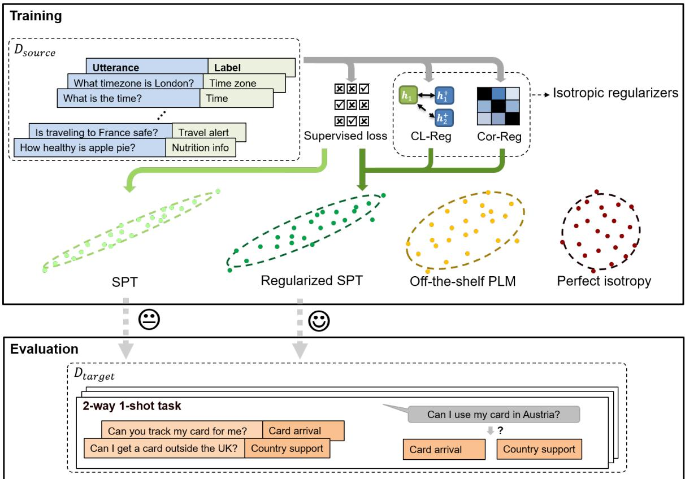
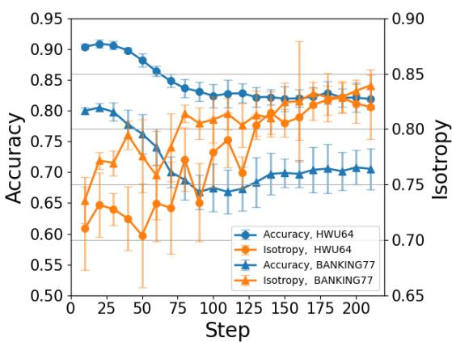
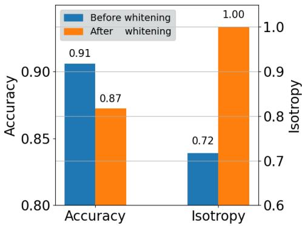
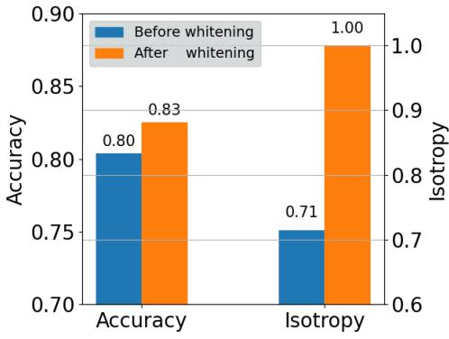
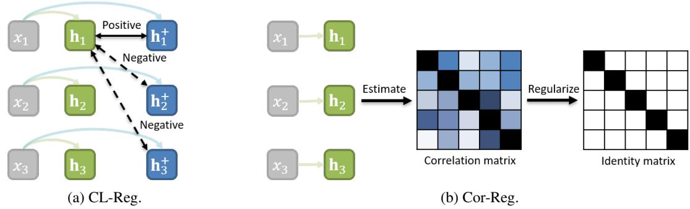
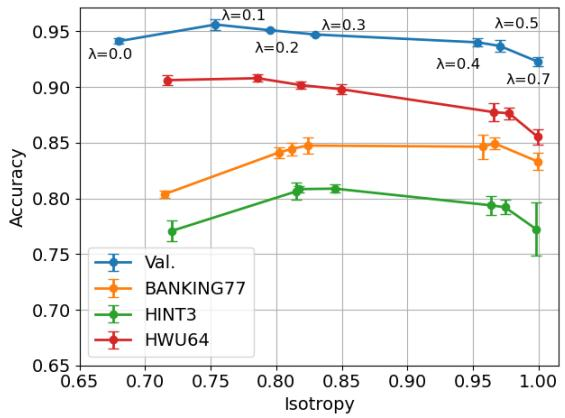
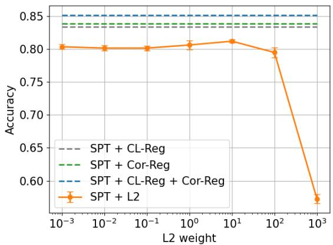
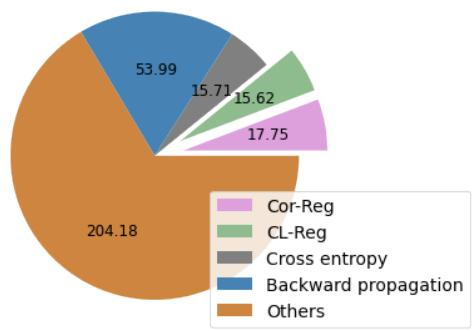

# Fine-tuning Pre-trained Language Models for Few-shot Intent Detection: Supervised Pre-training and Isotropization

Haode Zhang1 Haowen Liang1 Yuwei Zhang2

Liming Zhan1 Xiaolei Lu3 Albert Y.S. Lam4 Xiao-Ming Wu1∗

Department of Computing, The Hong Kong Polytechnic University, Hong Kong S.A.R.1

University of California, San Diego2 Nanyang Technological University, Singapore3

Fano Labs, Hong Kong S.A.R.4

{haode.zhang,michaelhw.liang,lmzhan.zhan}@connect.polyu.hk, zhangyuwei.work@gmail.com

xiao-ming.wu@polyu.edu.hk, xiaolei.lu@ntu.edu.sg, albert@fano.ai

## Abstract

It is challenging to train a good intent classifier for a task-oriented dialogue system with only a few annotations. Recent studies have shown that fine-tuning pre-trained language models with a small amount of labeled utterances from public benchmarks in a supervised manner is extremely helpful. However, we find that supervised pre-training yields an anisotropic feature space, which may suppress the expressive power of the semantic representations. Inspired by recent research in isotropization, we propose to improve supervised pretraining by regularizing the feature space towards isotropy. We propose two regularizers based on contrastive learning and correlation matrix respectively, and demonstrate their effectiveness through extensive experiments. Our main finding is that it is promising to regularize supervised pre-training with isotropization to further improve the performance of few-shot intent detection. The source code can be found at https://github.com/ fanolabs/isoIntentBert-main.

## 1 Introduction

Intent detection is a core module of task-oriented dialogue systems. Training a well-performing intent classifier with only a few annotations, i.e., few-shot intent detection, is of great practical value. Recently, this problem has attracted considerable attention (Vulic et al. ´ , 2021; Zhang et al., b; Dopierre et al., b) but remains a challenge.

To tackle few-shot intent detection, earlier works employ induction network (Geng et al., 2019), generation-based methods (Xia et al., a), metric learning (Nguyen et al., 2020), and selftraining (Dopierre et al., b), to design sophisticated algorithms. Recently, pre-trained language models (PLMs) have emerged as a simple yet promising solution to a wide spectrum of natural language processing (NLP) tasks, triggering the surge of PLMbased solutions for few-shot intent detection (Wu et al., 2020; Zhang et al., a,b; Vulic et al.´ , 2021; Zhang et al., b), which typically fine-tune PLMs on conversation data.

A PLM-based fine-tuning method (Zhang et al., a), called IntentBERT, utilizes a small amount of labeled utterances from public intent datasets to fine-tune PLMs with a standard classification task, which is referred to as supervised pre-training. Despite its simplicity, supervised pre-training has been shown extremely useful for few-shot intent detection even when the target data and the data used for fine-tuning are very different in semantics. However, as will be shown in Section 3.2, IntentBERT suffers from severe anisotropy, an undesirable property of PLMs (Gao et al., a; Ethayarajh, 2019; Li et al., 2020).

Anisotropy is a geometric property that semantic vectors fall into a narrow cone. It has been identified as a crucial factor for the sub-optimal performance of PLMs on a variety of downstream tasks (Gao et al., a; Arora et al., b; Cai et al., 2020; Ethayarajh, 2019), which is also known as the representation degeneration problem (Gao et al., a). Fortunately, isotropization techniques can be applied to adjust the embedding space and yield significant performance improvement in many tasks (Su et al., 2021; Rajaee and Pilehvar, 2021a).

Hence, this paper aims to answer the question:

• Can we improve supervised pre-training via isotropization for few-shot intent detection?

Many isotropization techniques have been developed based on transformation (Su et al., 2021; Huang et al., 2021), contrastive learning (Gao et al., b), and top principal components elimination (Mu and Viswanath, 2018). However, these methods are designed for off-the-shelf PLMs. When applied on PLMs that have been fine-tuned on some NLP task such as semantic textual similarity or intent classification, they may introduce an adverse effect, as observed in Rajaee and Pilehvar (2021c) and our pilot experiments.

  
Figure 1: Illustration of our proposed regularized supervised pre-training. SPT denotes supervised pre-training (fine-tuning an off-the-shelf PLM on a set of labeled utterances), which makes the feature space more anisotropic. CL-Reg and Cor-Reg are designed to regularize SPT and increase the isotropy of the feature space, which leads to better performance on few-shot intent detection.

In this work, we propose to regularize supervised pre-training with isotropic regularizers. As shown in Fig. 1, we devise two regularizers, a contrastive-learning-based regularizer (CL-Reg) and a correlation-matrix-based regularizer (Cor-Reg), each of which can increase the isotropy of the feature space during supervised training. Our empirical study shows that the regularizers can significantly improve the performance of standard supervised training, and better performance can often be achieved when they are combined.

The contributions of this work are three-fold:

• We present the first study on the isotropy property of PLMs for few-shot intent detection, shedding light on the interaction of supervised pre-training and isotropization.

• We improve supervised pre-training by devising two simple yet effective regularizers to increase the isotropy of the feature space.

• We conduct a comprehensive evaluation and analysis to validate the effectiveness of the proposed approach.

## 2 Related Works

## 2.1 Few-shot Intent Detection

With a surge of interest in few-shot learning (Finn et al., 2017; Vinyals et al., 2016; Snell et al., 2017), few-shot intent detection has started to receive attention. Earlier works mainly focus on model design, using capsule network (Geng et al., 2019), variational autoencoder (Xia et al., a), or metric functions (Yu et al., 2018; Nguyen et al., 2020). Recently, PLMs-based methods have shown promising performance in a variety of NLP tasks and become the model of choice for few-shot intent detection. Zhang et al. (c) cast few-shot intent detection into a natural language inference (NLI) problem and fine-tune PLMs on NLI datasets. Zhang et al. (b) propose to fine-tune PLMs on unlabeled utterances by contrastive learning. Zhang et al. (a) leverage a small set of public annotated intent detection benchmarks to fine-tune PLMs with standard supervised training and observe promising performance on cross-domain few-shot intent detection. Meanwhile, the study of few-shot intent detection has been extended to other settings including semisupervised learning (Dopierre et al., b,a), generalized setting (Nguyen et al., 2020), multi-label classification (Hou et al., 2021), and incremental learning (Xia et al., b). In this work, we consider standard few-shot intent detection, following the setup of Zhang et al. (a) and aiming to improve supervised pre-training with isotropization.

## 2.2 Further Pre-training PLMs with Dialogue Corpora

Recent works have shown that further pre-training off-the-shelf PLMs using dialogue corpora (Henderson et al., b; Peng et al., 2020, 2021) are beneficial for task-oriented downstream tasks such as intent detection. Specifically, TOD-BERT (Wu et al., 2020) conducts self-supervised learning on diverse task-oriented dialogue corpora. ConvBERT (Mehri et al., 2020) is pre-trained on a 700 million open-domain dialogue corpus. Vulic et al.´ (2021) propose a two-stage procedure: adaptive conversational fine-tuning followed by task-tailored conversational fine-tuning. In this work, we follow Zhang et al. (a) to further pre-train PLMs using a small amount of labeled utterances from public intent detection benchmarks.

## 2.3 Anisotropy of PLMs

Isotropy is a key geometric property of the semantic space of PLMs. Recent studies identify the anisotropy problem of PLMs (Cai et al., 2020; Ethayarajh, 2019; Mu and Viswanath, 2018; Rajaee and Pilehvar, 2021c), which is also known as the representation degeneration problem (Gao et al., a): word embeddings occupy a narrow cone, which suppresses the expressiveness of PLMs. To resolve the problem, various methods have been proposed, including spectrum control (Wang et al., 2019), flow-based mapping (Li et al., 2020), whitening transformation (Su et al., 2021; Huang et al., 2021), contrastive learning (Gao et al., b), and clusterbased methods (Rajaee and Pilehvar, 2021a). Despite their effectiveness, these methods are designed for off-the-shelf PLMs. The interaction between isotropization and fine-tuning PLMs remains under-explored. A most recent work by Rajaee and Pilehvar shows that there might be a conflict between the two operations for the semantic textual similarity (STS) task. On the other hand, Zhou et al. (2021) propose to fine-tune PLMs with isotropic batch normalization on some supervised tasks, but it requires a large amount of training data. In this work, we study the interaction between isotropization and supervised pre-training (fine-tuning) PLMs on intent detection tasks.

<table><tr><td>Dataset</td><td>BERT</td><td>IntentBERT</td></tr><tr><td>BANKING</td><td>.96</td><td>.71(.04)</td></tr><tr><td>HINT3</td><td>.95</td><td>.72(.03)</td></tr><tr><td>HWU64</td><td>.96</td><td>.72(.04)</td></tr></table>

Table 1: The impact of fine-tuning on isotropy. Fine-tuning renders the semantic space notably more anisotropic. The mean and standard deviation of 5 runs with different random seeds are reported.

## 3 Pilot Study

Before introducing our approach, we present pilot experiments to gain some insights into the interaction between isotropization and fine-tuning PLMs.

## 3.1 Measuring isotropy

Following Mu and Viswanath (2018); Bis et al.´ (2021), we adopt the following measurement of isotropy:

$$
\operatorname { I } ( \mathbf { V } ) = { \frac { \operatorname* { m i n } _ { \mathbf { c } \in C } \mathrm { Z } ( \mathbf { c } , \mathbf { V } ) } { \operatorname* { m a x } _ { \mathbf { c } \in C } \mathrm { Z } ( \mathbf { c } , \mathbf { V } ) } } ,\tag{1}
$$

where $\mathbf { V } \in \mathbb { R } ^ { N \times d }$ is the matrix of stacked embeddings of N utterances (note that the embeddings have zero mean), C is the set of unit eigenvectors of $\mathbf { V } ^ { \top } \mathbf { V }$ , and ${ \displaystyle { \cal Z } ( { \bf c } , { \bf V } ) }$ is the partition function (Arora et al., b) defined as:

$$
\mathrm { Z } ( \mathbf { c } , \mathbf { V } ) = \sum _ { i = 1 } ^ { N } \mathrm { e x p } \left( \mathbf { c } ^ { \top } \mathbf { v } _ { i } \right) ,\tag{2}
$$

where $\mathbf { v } _ { i }$ is the $i _ { \mathrm { t h } }$ row of V. $\mathbf { I } ( \mathbf { V } ) \in [ 0 , 1 ]$ , and 1 indicates perfect isotropy.

## 3.2 Fine-tuning Leads to Anisotropy

To observe the impact of fine-tuning on isotropy, we follow IntentBERT (Zhang et al., a) to fine-tune BERT (Devlin et al., 2019) with standard supervised training on a small set of an intent detection benchmark OOS (Larson et al., 2019) (details are given in Section 4.1). We then compare the isotropy of the original embedding space (BERT) and the embedding space after fine-tuning (IntentBERT) on target datasets. As shown in Table 1, after finetuning, the isotropy of the embedding space is notably decreased on all datasets. Hence, it can be seen that fine-tuning may render the feature space more anisotropic.

  
Figure 2: The impact of contrastive learning on IntentBERT with experiments on HWU64 and BANK-ING77 datasets. The performance (blue) drops while the isotropy (orange) increases.

## 3.3 Isotropization after Fine-tuning May Have an Adverse Effect

To examine the effect of isotropization on a finetuned model, we apply two strong isotropization techniques to IntentBERT: dropout-based contrastive learning (Gao et al., b) and whitening transformation (Su et al., 2021). The former fine-tunes PLMs in a contrastive learning manner1, while the latter transforms the semantic feature space into an isotropic space via matrix transformation. These methods have been demonstrated highly effective (Gao et al., b; Su et al., 2021) when applied to off-the-shelf PLMs, but things are different when they are applied to fine-tuned models. As shown in Fig. 2, contrastive learning improves isotropy, but it significantly lowers the performance on two benchmarks. As for whitening transformation, it has inconsistent effects on the two datasets, as shown in Fig. 3. It hurts the performance on HWU64 (Fig. 3a) but yields better results on BANKING77 (Fig. 3b), while producing nearly perfect isotropy on both. The above observations indicate that isotropization may hurt fine-tuned models, which echoes the recent finding of Rajaee and Pilehvar.

## 4 Method

The pilot experiments reveal the anisotropy of a PLM fine-tuned on intent detection tasks and the challenge of applying isotropization techiniques on the fine-tuned model. In this section, we propose a joint fine-tuning and isotropization framework. Specifically, we propose two regularizers to make the feature space more isotropic during fine-tuning. Before presenting our method, we first introduce supervised pre-training.

(a) HWU64.  
  
(b) BANKING77.  
Figure 3: The impact of whitening on IntentBERT with experiments on HWU64 and BANKING77 datasets. Whitening transformation leads to perfect isotropy but has inconsistent effects on the performance.

## 4.1 Supervised Pre-training for Few-shot Intent Detection

Few-shot intent detection targets to train a good intent classifier with only a few labeled data $\mathcal { D } _ { \mathrm { t a r g e t } } =$ $\{ ( x _ { i } , y _ { i } ) \} _ { N _ { t } }$ , where $N _ { t }$ is the number of labeled samples in the target dataset, $x _ { i }$ denotes the $i _ { \mathrm { t h } }$ utterance, and $y _ { i }$ is the label.

To tackle the problem, Zhang et al. (a) propose to learn intent detection skills (fine-tune a PLM) on a small subset of public intent detection benchmarks by supervised pre-training. Denote by $\mathcal { D } _ { \mathrm { s o u r c e } } = \{ ( x _ { i } , y _ { i } ) \} _ { N _ { s } }$ the source data used for pre-training, where $N _ { s }$ is the number of examples. The fine-tuned PLM can be directly used on the target dataset. It has been shown that this method can work well when the label spaces of $\mathcal { D } _ { \mathrm { s o u r c e } }$ and $\mathcal { D } _ { \mathrm { t a r g e t } }$ are disjoint.

  
Figure 4: Illustration of CL-Reg (contrastive-learning-based regularizer) and Cor-Reg (correlation-matrix-based regularizer). $x _ { i }$ is the $i _ { \mathrm { t h } }$ utterance in a batch of size 3. In $( \mathrm { a } ) , x _ { i }$ is fed to the PLM twice with built-in dropout to produce two different representations of $x _ { i } { : }$ h and ${ \mathbf { h } } _ { i } ^ { + }$ . Positive and negative pairs are then constructed for each $x _ { i }$ For example, $\mathbf { h } _ { 1 }$ and ${ \bf h } _ { 1 } ^ { + }$ form a positive pair for $x _ { 1 }$ , while $\mathbf { h } _ { 1 }$ and ${ \bf h } _ { 2 } ^ { + }$ , and $\mathbf { h } _ { 1 }$ and ${ \bf h } _ { 3 } ^ { + }$ , form negative pairs for x1. In (b), the correlation matrix is estimated from $\mathbf { h } _ { i \cdot }$ , feature vectors generated by the PLM, and is regularized towards the identity matrix.

Specifically, the pre-training is conducted by attaching a linear layer (as the classifier) on top of the utterance representation generated by the PLM:

$$
\mathrm { p } ( \boldsymbol { y } | \mathbf { h } _ { i } ) = \mathrm { s o f t m a x } \left( \mathbf { W } \mathbf { h } _ { i } + \mathbf { b } \right) \in \mathbb { R } ^ { L } ,\tag{3}
$$

where $\mathbf { h } _ { i } \in \mathbb { R } ^ { d }$ is the representation of the $i _ { \mathrm { t h } }$ utterance in $\mathcal { D } _ { \mathrm { s o u r c e } }$ $\mathbf { W } \in \mathbb { R } ^ { L \times d }$ and $\mathbf { b } \in \mathbb { R } ^ { L }$ are the parameters of the linear layer, and L is the number of classes. The model parameters $\boldsymbol { \theta } = \{ \phi , { \bf W } , { \bf b } \}$ with ϕ being the parameters of the PLM, are trained on $\mathcal { D } _ { \mathrm { s o u r c e } }$ with a cross-entropy loss:

$$
\theta = \underset { \theta } { \operatorname { a r g m i n } } \mathcal { L } _ { \mathrm { c e } } \left( \mathcal { D } _ { \mathrm { s o u r c e } } ; \theta \right) .\tag{4}
$$

After supervised pre-training, the linear layer is removed, and the PLM can be immediately used as a feature extractor for few-shot intent classification on target data. As shown in Zhang et al. (a), a parametric classifier such as logistic regression can be trained with only a few labeled samples to achieve good performance.

However, our analysis in Section 3.2 shows the limitation of supervised pre-training, which yields a anisotropic feature space.

## 4.2 Regularizing Supervised Pre-training with Isotropization

To mitigate the anisotropy of the PLM fine-tuned by supervised pre-training, we propose a joint training objective by adding a regularization term $\mathcal { L } _ { \mathrm { r e g } }$ for isotropization:

$$
\mathcal { L } = \mathcal { L } _ { \mathrm { c e } } ( \mathcal { D } _ { \mathrm { s o u r c e } } ; \theta ) + \lambda \mathcal { L } _ { \mathrm { r e g } } ( \mathcal { D } _ { \mathrm { s o u r c e } } ; \theta ) ,\tag{5}
$$

where $\lambda$ is a weight parameter. The aim is to learn intent detection skills while maintaining an appropriate degree of isotropy. We devise two different regularizers introduced as follows.

Contrastive-learning-based Regularizer. Inspired by the recent success of contrastive learning in mitigating anisotropy (Yan et al., 2021; Gao et al., b), we employ the dropout-based contrastive learning loss used in Gao et al. (b) as the regularizer:

$$
\mathcal { L } _ { \mathrm { r e g } } = - \frac { 1 } { N _ { b } } \sum _ { i } ^ { N _ { b } } \log \frac { e ^ { \sin ( \mathbf { h } _ { i } , \mathbf { h } _ { i } ^ { + } ) / \tau } } { \sum _ { j = 1 } ^ { N _ { b } } e ^ { \sin ( \mathbf { h } _ { i } , \mathbf { h } _ { j } ^ { + } ) / \tau } } .\tag{6}
$$

In particular, $\mathbf { h } _ { i } \in \mathbb { R } ^ { d }$ and $\mathbf { h } _ { i } ^ { + } \in \mathbb { R } ^ { d }$ are two different representations of utterance $x _ { i }$ generated by the PLM with built-in standard dropout (Srivastava et al., 2014), i.e., $x _ { i }$ is passed to the PLM twice with different dropout masks to produce h and ${ \mathbf { h } } _ { i } ^ { + }$ sim $( \mathbf { h } _ { 1 } , \mathbf { h } _ { 2 } )$ denotes the cosine similarity between $\mathbf { h } _ { 1 }$ and h2. τ is the temperature parameter. $N _ { b }$ is the batch size. Since $\mathbf { h } _ { i }$ and ${ \bf h } _ { i } ^ { + }$ represent the same utterance, they form a positive pair. Similarly, $\mathbf { h } _ { i }$ and $\mathbf { h } _ { j } ^ { + }$ form a negative pair, since they represent different utterances. An example is given in Fig. 4a. By minimizing the contrastive loss, positive pairs are pulled together while negative pairs are pushed away, which in theory enforces an isotropic feature space (Gao et al., b). In Gao et al. (b), the contrastive loss is used as the single objective to fine-tune off-the-shelf PLMs in an unsupervised manner, while in this work we use it jointly with supervised pre-training to fine-tune PLMs for fewshot learning.

Correlation-matrix-based Regularizer. The above regularizer enforces isotropization implicitly.

Here, we propose a new regularizer that explicitly enforces isotropization. The perfect isotropy is characterized by zero covariance and uniform variance (Su et al., 2021; Zhou et al., 2021), i.e., a covariance matrix with uniform diagonal elements and zero non-diagonal elements. Isotropization can be achieved by endowing the feature space with such statistical property. However, as will be shown in Section 5.3, it is difficult to determine the appropriate scale of variance. Therefore, we base the regularizer on correlation matrix :

$$
\begin{array} { r } { \mathcal { L } _ { \mathrm { r e g } } = \| \mathbf { \boldsymbol { \Sigma } } - \mathbf { \boldsymbol { \mathbf { I } } } \| , } \end{array}\tag{7}
$$

where ∥·∥ denotes Frobenius norm, $\mathbf { I } \in \mathbb { R } ^ { d \times d }$ is the identity matrix, $\pmb { \Sigma } \in \mathbb { R } ^ { d \times d }$ is the correlation matrix with $\Sigma _ { i j }$ being the Pearson correlation coefficient between the $i _ { \mathrm { t h } }$ dimension and the $j _ { \mathrm { t h } }$ dimension. As shown in Fig. 4b, Σ is estimated with utterances in the current batch. By pushing the correlation matrix towards the identity matrix during training, we can learn a more isotropic feature space.

Moreover, the proposed two regularizers can be used together as follows:

$$
\begin{array} { r } { \mathcal { L } = \mathcal { L } _ { \mathrm { c e } } ( \mathcal { D } _ { \mathrm { s o u r c e } } ; \theta ) + \lambda _ { 1 } \mathcal { L } _ { \mathrm { c l } } ( \mathcal { D } _ { \mathrm { s o u r c e } } ; \theta ) } \\ { + \lambda _ { 2 } \mathcal { L } _ { \mathrm { c o r } } ( \mathcal { D } _ { \mathrm { s o u r c e } } ; \theta ) , } \end{array}\tag{8}
$$

where $\lambda _ { 1 }$ and $\lambda _ { 2 }$ are the weight parameters, and $\mathcal { L } _ { \mathrm { c l } }$ and ${ \mathcal { L } } _ { \mathrm { c o r } }$ denote CL-Reg and Cor-Reg, respectively. Our experiments show that better performance is often observed when they are used together.

## 5 Experiments

To validate the effectiveness of the approach, we conduct extensive experiments.

## 5.1 Experimental Setup

Datasets. To perform supervised pre-training, we follow Zhang et al. to use the OOS dataset (Larson et al., 2019) which contains diverse semantics of 10 domains. Also following Zhang et al., we exclude the domains “Banking” and “Credit Cards” since they are similar in semantics to one of the test dataset BANKING77. We then use 6 domains for training and 2 for validation, as shown in Table 2. For evaluation, we employ three datasets: BANK-ING77 (Casanueva et al., 2020) is an intent detection dataset for banking service. HINT3 (Arora et al., a) covers 3 domains, “Mattress Products Retail”, “Fitness Supplements Retail”, and “Online

<table><tr><td>Training</td><td>Validation</td></tr><tr><td>mute&quot;, “Work&quot;, “Home&quot;, ing&quot;</td><td>&quot;Utility&quot;, “Auto com- “Travel&quot;, “Kitchen din-</td></tr></table>

Table 2: Split of domains in OOS.
<table><tr><td>Dataset</td><td>#domain</td><td>#intent</td><td>#data</td></tr><tr><td>OOS</td><td>10</td><td>150</td><td>22500</td></tr><tr><td>BANKING77</td><td>1</td><td>77</td><td>13083</td></tr><tr><td>HINT3</td><td>3</td><td>51</td><td>2011</td></tr><tr><td>HWU64</td><td>21</td><td>64</td><td>10030</td></tr></table>

Table 3: Dataset statistics.

Gaming”. HWU64 (Liu et al., 2019a) is a largescale dataset containing 21 domains. Dataset statistics are summarized in Table 3.

Our Method. Our method can be applied to fine-tune any PLM. We conduct experiments on two popular PLMs, BERT (Devlin et al., 2019) and RoBERTa (Liu et al., 2019b). For both of them, the embedding of [CLS] is used as the utterance representation in Eq. 3. We employ logistic regression as the classifier. We select the hyperparameters $\lambda , \lambda _ { 1 } , \lambda _ { 2 }$ , and τ by validation. The best hyperparameters are provided in Table 4.

<table><tr><td>Method</td><td>Hyperparameter</td></tr><tr><td>CL-Reg</td><td> $\lambda = 1 . 7 , \tau = 0 . 0 5$ </td></tr><tr><td>Cor-Reg</td><td> $\lambda = 0 . 0 4$ </td></tr><tr><td>CL-Reg + Cor-Reg</td><td> $\lambda _ { 1 } = 1 . 7 , \lambda _ { 2 } = 0 . 0 4 , \tau = 0 . 0 5$ </td></tr></table>

(a) BERT-based.

<table><tr><td>Method</td><td>Hyperparameter</td></tr><tr><td>CL-Reg</td><td> $\lambda = 2 . 9 , \tau = 0 . 0 5$ </td></tr><tr><td>Cor-Reg</td><td>λ = 0.06</td></tr><tr><td>CL-Reg + Cor-Reg</td><td> $\lambda _ { 1 } = 2 . 9 , \lambda _ { 2 } = 0 . 1 3 , \tau = 0 . 0 5$ </td></tr></table>

(b) RoBERTa-based.  
Table 4: Hyperparameters selected via validation.

Baselines. We compare our method to the following baselines. First, for BERT-based methods, BERT-Freeze freezes BERT; CON-VBERT (Mehri et al., 2020), TOD-BERT (Wu et al., 2020), and DNNC-BERT (Zhang et al., c) further pre-train BERT on conversational corpus or natural language inference tasks. USE-ConveRT (Henderson et al., a; Casanueva et al., 2020) is a transformer-based dual-encoder pretrained on conversational corpus. CPFT-BERT is the re-implemented version of CPFT (Zhang et al., b), by further pre-training BERT in an unsupervised manner with mask-based contrastive learning and masked language modeling on the same training data as ours. IntentBERT (Zhang et al., a) further pre-trains BERT via supervised pre-training described in Section 4.1. To guarantee a fair comparison, we provide IntentBERT-ReImp, the re-implemented version of Intent-BERT, which uses the same random seed, training data, and validation data as our methods. Second, for RoBERTa-based baselines, RoBERTa-Freeze freezes the model. WikiHowRoBERTa (Zhang et al., d) further pre-trains RoBERTa on synthesized intent detection data. DNNC-RoBERTa and CPFT-RoBERTa are similar to DNNC-BERT and CPFT-BERT except the PLM. IntentRoBERTa is the re-implemented version of IntentBERT based on RoBERTa, with uses the same random seed, training data, and validation data as our method. Finally, to show the superiority of the joint finetuning and isotropization, we compare our method against whitening transformation (Su et al., 2021). BERT-White and RoBERTa-White apply the transformation to BERT and RoBERTa, respectively. IntentBERT-White and IntentRoBERTa-White apply the transformation to IntentBERT-ReImp and IntentRoBERTa, respectively.

<table><tr><td rowspan="2">Method</td><td colspan="2">BANKING77</td><td colspan="2">HINT3</td><td colspan="2">HWU64</td><td colspan="2">Val.</td></tr><tr><td>2-shot</td><td>10-shot</td><td>2-shot</td><td>10-shot</td><td>2-shot</td><td>10-shot</td><td>2-shot</td><td>10-shot</td></tr><tr><td>BERT-Freeze</td><td>57.10</td><td>84.30</td><td>51.95</td><td>80.27</td><td>64.83</td><td>87.99</td><td>74.20</td><td>92.99</td></tr><tr><td>CONVBERT</td><td>68.30</td><td>86.60</td><td>72.60</td><td>87.20</td><td>81.75</td><td>92.55</td><td>90.54</td><td>96.82</td></tr><tr><td>TOD-BERT</td><td>77.70</td><td>89.40</td><td>68.90</td><td>83.50</td><td>83.24</td><td>91.56</td><td>88.10</td><td>96.39</td></tr><tr><td>USE-ConveRT</td><td></td><td>85.20</td><td></td><td></td><td></td><td>85.90</td><td></td><td></td></tr><tr><td>DNNC-BERT</td><td>67.50</td><td>89.80</td><td>64.10</td><td>87.90</td><td>73.97</td><td>90.71</td><td>72.98</td><td>95.23</td></tr><tr><td>CPFT-BERT</td><td>72.09</td><td>89.82</td><td>74.34</td><td>90.37</td><td>83.02</td><td>93.66</td><td>89.33</td><td>97.30</td></tr><tr><td>IntentBERT</td><td>82.40</td><td>91.80</td><td>80.10</td><td>90.20</td><td></td><td></td><td></td><td></td></tr><tr><td>IntentBERT-ReImp</td><td>80.38(.35)</td><td>92.35(.12)</td><td>77.09(.89)</td><td>89.55(.63)</td><td>90.61(.44)</td><td>95.21(.15)</td><td>93.62(.38)</td><td>97.80(.18)</td></tr><tr><td>BERT-White</td><td>72.95</td><td>88.86</td><td>65.70</td><td>85.70</td><td>75.98</td><td>91.26</td><td>87.33</td><td>96.05</td></tr><tr><td>IntentBERT-White</td><td>82.52(.26)</td><td>92.29(.33)</td><td>78.50(.59)</td><td>90.14(.26)</td><td>87.24(.18)</td><td>94.42(.08)</td><td>94.89(.21)</td><td>98.07(.12)</td></tr><tr><td>CL-Reg</td><td>83.45(.35)</td><td>93.66(.22)</td><td>79.30(.87</td><td>91.06(.30)</td><td>91.46(.15)</td><td>95.84(.12)</td><td>94.43(.22)</td><td>98.43.02)</td></tr><tr><td>Cor-Reg</td><td>83.94(.45)</td><td>93.98(.26)</td><td>80.16(.71)</td><td>91.38(.55)</td><td>90.75(.35)</td><td>95.82(.14)</td><td>95.02(.22)</td><td>98.47(.07)</td></tr><tr><td>CL-Reg + Cor-Reg</td><td>85.21(.58)</td><td>94.68(.01)</td><td>81.20(.45)</td><td>92.38(.01)</td><td>90.66(.42)</td><td>95.84(.19)</td><td>95.41(.25)</td><td>98.58(.01)</td></tr></table>

Table 5: 5-way few-shot intent detection using BERT. We report the mean and standard deviation of our methods and IntentBERT variants. CL-Reg, Cor-Reg, and CL-Reg + CorReg denote supervised pre-training regularized by the corresponding regularizer. The top 3 results are highlighted. ¶ denotes results from (Zhang et al., a).
<table><tr><td>Method</td><td colspan="2">BANKING77</td><td colspan="2">HINT3</td><td colspan="2">HWU64</td><td colspan="2">Val.</td></tr><tr><td></td><td>2-shot</td><td>10-shot</td><td>2-shot</td><td>10-shot</td><td>2-shot</td><td>10-shot</td><td>2-shot</td><td>10-shot</td></tr><tr><td>RoBERTa-Freeze</td><td>60.74</td><td>82.18</td><td>57.90</td><td>79.26</td><td>75.30</td><td>89.71</td><td>74.86</td><td>90.52</td></tr><tr><td>WikiHowRoBERTa</td><td>32.88</td><td>59.50</td><td>31.92</td><td>54.18</td><td>30.81</td><td>52.47</td><td>34.10</td><td>60.59</td></tr><tr><td>DNNC-RoBERTa</td><td>74.32</td><td>87.30</td><td>68.06</td><td>82.34</td><td>69.87</td><td>80.22</td><td>58.51</td><td>74.46</td></tr><tr><td>CPFT-RoBERTa</td><td>80.27(.11)</td><td>93.91(.06)</td><td>79.98(.11)</td><td>92.55(.07)</td><td>83.18(.11)</td><td>92.82(.06)</td><td>86.71(.10)</td><td>96.45(.05)</td></tr><tr><td>IntentRoBERTa</td><td>81.38(.66)</td><td>92.68(.24)</td><td>78.20(1.72)</td><td>89.01(1.07)</td><td>90.48(.69)</td><td>94.49(.43)</td><td>95.33(.54)</td><td>98.32(.15)</td></tr><tr><td>RoBERTa-White</td><td>79.27</td><td>93.00</td><td>73.13</td><td>89.02</td><td>82.65</td><td>94.00</td><td>89.90</td><td>97.14</td></tr><tr><td>IntentRoBERTa-White</td><td>83.75(.45)</td><td>92.68(.31)</td><td>79.64(1.38)</td><td>90.13(.66)</td><td>86.52(1.33)</td><td>93.82(.53)</td><td>96.06(.58)</td><td>98.35(.21)</td></tr><tr><td>CL-Reg</td><td>84.63(.68)</td><td>94.43(.34)</td><td>81.10(.49)</td><td>91.65(.13)</td><td>91.67(.20)</td><td>95.44(.28)</td><td>96.32(.14)</td><td>98.79(.05)</td></tr><tr><td>Cor-Reg</td><td>86.92(.71)</td><td>95.07(.41)</td><td>82.20(.48)</td><td>92.11(.41)</td><td>91.10(.18)</td><td>95.69(.12)</td><td>96.82(.03)</td><td>98.89(.03)</td></tr><tr><td>CL-Reg + Cor-Reg</td><td>87.96(.31)</td><td>95.85(.02)</td><td>83.55(.30)</td><td>93.17(.23)</td><td>90.47(.39)</td><td>95.64(.28)</td><td>96.35(.19)</td><td>98.85(.07)</td></tr></table>

Table 6: 5-way few-shot intent detection using RoBERTa. We report the mean and standard deviation of our methods and IntentBERT variants. CL-Reg, Cor-Reg, and CL-Reg + CorReg denote supervised pre-training regularized by the corresponding regularizer. The top 3 results are highlighted.

All baselines use logistic regression as classifier except DNNC-BERT and DNNC-RoBERTa, wherein we follow the original work2 to train a pairwise encoder for nearest neighbor classification.

Training Details. We use PyTorch library and Python to build our model. We employ Hugging Face implementation3 of bert-base-uncased and roberta-base. We use Adam (Kingma and Ba, 2015) as the optimizer with learning rate of 2e − 05 and weight decay of 1e − 03. The model is trained with Nvidia RTX 3090 GPUs. The training is early stopped if no improvement in validation accuracy is observed for 100 steps. The same set of random seeds, {1, 2, 3, 4, 5}, is used for IntentBERT-ReImp, IntentRoBERTa, and our method.

Evaluation. The baselines and our method are evaluated on C-way K-shot tasks. For each task, we randomly sample C classes and K examples per class. The $C \times K$ labeled examples are used to train the logistic regression classifier. Note that we do not further fine-tune the PLM using the labeled data of the task. We then sample another 5 examples per class as queries. Fig. 1 gives an example with C = 2 and $K = 1$ . We report the averaged accuracy of 500 tasks randomly sampled from $\mathcal { D } _ { \mathrm { t a r g e t } }$

## 5.2 Main Results

The main results are provided in Table 5 (BERTbased) and Table 6 (RoBERTa-based). The following observations can be made. First, our proposed regularized supervised pre-training, with either CL-Reg or Cor-Reg, consistently outperforms all the baselines by a notable margin in most cases, indicating the effectiveness of our method. Our method also outperforms whitening transformation, demonstrating the superiority of the proposed joint finetuning and isotropization framework. Second, Cor-Reg slightly outperforms CL-Reg in most cases, showing the advantage of enforcing isotropy explicitly with the correlation matrix. Finally, CL-Reg and Cor-Reg show a complementary effect in many cases, especially on BANKING77. The above observations are consistent for both BERT and RoBERTa. It can be also seen that higher performance is often attained with RoBERTa.

<table><tr><td>Method</td><td>BANKING77</td><td>HINT3</td><td>HWU64</td></tr><tr><td>IntentBERT-ReImp</td><td>.71(.04)</td><td>.72(.03)</td><td>.72(.03)</td></tr><tr><td>SPT+CL-Reg</td><td>.77(.01)</td><td>.78(.01)</td><td>.75(.03)</td></tr><tr><td>SPT+Cor-Reg</td><td>.79(.01)</td><td>.76(.06)</td><td>.80(.03)</td></tr><tr><td>SPT+CL-Reg+Cor-Reg</td><td>.79(.01)</td><td>.76(.05)</td><td>.80(.02)</td></tr></table>

Table 7: Impact of the proposed regularizers on isotropy. The results are obtained with BERT. SPT denotes supervised pre-training.

The observed improvement in performance comes with an improvement in isotropy. We report the change in isotropy by the proposed regularizers in Table 7. It can be seen that both regularizers and their combination make the feature space more isotropic compared to IntentBERT-ReImp that only uses supervised pre-training. In addition, in general, Cor-Reg can achieve better isotropy than CL-Reg.

## 5.3 Ablation Study and Analysis

Moderate isotropy is helpful. To investigate the relation between the isotropy of the feature space and the performance of few-shot intent detection, we tune the weight parameter λ of Cor-Reg to increase the isotropy and examine the performance. As shown in Fig. 5, a common pattern is observed: the best performance is achieved when the isotropy is moderate. This observation indicates that it is important to find an appropriate trade-off between learning intent detection skills and learning an insotropic feature space. In our method, we select the appropriate λ by validation.

  
Figure 5: Relation between performance and isotropy. The results are obtained with BERT on 5-way 2-shot tasks.

Correlation matrix is better than covariance matrix as regularizer. In the design of Cor-Reg (Section 4.2), we use the correlation matrix, rather than the covariance matrix, to characterize isotropy, although the latter contains more information – variance. The reason is that it is difficult to determine the proper scale of the variances. Here, we conduct experiments using the covariance matrix, by pushing the non-diagonal elements (covariances) towards 0 and the diagonal elements (variances) towards 1, 0.5, or the mean value, which are denoted by Cov-Reg-1, Cov-Reg-0.5, and Cov-Reg-mean respectively in Table 8. It can be seen that all the variants perform worse than Cor-Reg.

Our method is complementary with batch normalization. Batch normalization (Ioffe and

<table><tr><td>Method</td><td>BANKING77</td><td>Val.</td></tr><tr><td>Cov-Reg-1</td><td>82.19(.84)</td><td>94.52(.19)</td></tr><tr><td>Cov-Reg-0.5</td><td>82.62(.80)</td><td>94.52(.26)</td></tr><tr><td>Cov-Reg-mean</td><td>82.50(1.00)</td><td>93.82(.39)</td></tr><tr><td>Cor-Reg (ours)</td><td>83.94(.45)</td><td>95.02(.22)</td></tr></table>

Table 8: Comparison between using covariance matrix and using correlation matrix to implement Cor-Reg. The experiments are conducted with BERT and evaluated on 5-way 2-shot tasks.

Szegedy, 2015) can potentially mitigate the anisotropy problem via normalizing each dimension with unit variance. We find that combining our method with batch normalization yields better performance, as shown in Table 9.

<table><tr><td>SPT</td><td>CL-Reg</td><td>Cor-Reg</td><td>BN</td><td>BANKING77</td></tr><tr><td>√</td><td></td><td></td><td></td><td>80.38(.35)</td></tr><tr><td>√</td><td></td><td></td><td>√</td><td>82.38(.38)</td></tr><tr><td>√ √</td><td>√ √</td><td></td><td>√</td><td>83.45(.35) 84.18(.28)</td></tr><tr><td>√</td><td></td><td>√</td><td></td><td></td></tr><tr><td>√</td><td></td><td>√</td><td>√</td><td>83.94(.45) 84.67(.51)</td></tr><tr><td></td><td></td><td></td><td></td><td></td></tr><tr><td>√ √</td><td>√ √</td><td>√ √</td><td>√</td><td>85.21(.58) 85.64(.41)</td></tr></table>

Table 9: Effect of combining batch normalization and our method. The experiments are conducted with BERT and evaluated on 5-way 2-shot tasks. SPT denotes supervised pre-training. BN denotes batch normalization.

The performance gain is not from the reduction in model variance. Regularization techniques such as L1 regularization (Tibshirani, 1996) and L2 regularization (Hoerl and Kennard, 1970) are often used to improve model performance by reducing model variance. Here, we show that the performance gain of our method is ascribed to the improved isotropy (Table 7) rather than the reduction in model variance. To this end, we compare our method against L2 regularization with a wide range of weights, and it is observed that reducing model variance cannot achieve comparable performance to our method, as shown in Fig. 6.

The computational overhead is small. To analyze the computational overheads incurred by CL-Reg and Cor-Reg, we decompose the duration of one epoch of our method using the two regularizers jointly. As shown in Fig. 7, the overheads of CL-Reg and Cor-Reg are small, only taking up a small portion of the time.

  
Figure 6: Comparison between our methods and L2 regularization. The experiments are conducted with BERT and evaluated on 5-way 2-shot tasks on BANKING77. SPT denotes superivsed pre-training.

  
Figure 7: Run time decomposition of a single epoch. The unit is second.

## 6 Conclusion

In this work, we have identified and analyzed the anisotropy of the feature space of a PLM finetuned on intent detection tasks. Further, we have proposed a joint training framework and designed two regularizers based on contrastive learning and correlation matrix respectively to increase the insotropy of the feature space during fine-tuning, which leads to notably improved performance on few-shot intent detection. Our findings and solutions may have broader implications for solving other natural language understanding tasks with PLM-based models.

## Acknowledgments

We would like to thank the anonymous reviewers for their valuable comments. This research was supported by the grants of HK ITF UIM/377 and PolyU DaSAIL project P0030935 funded by RGC.

## References

Gaurav Arora, Chirag Jain, Manas Chaturvedi, and Krupal Modi. a. HINT3: Raising the bar for intent detection in the wild. In EMNLP, 2020.

Sanjeev Arora, Yuanzhi Li, Yingyu Liang, Tengyu Ma, and Andrej Risteski. b. A latent variable model approach to PMI-based word embeddings. TACL, 2016, 4:385–399.

Daniel Bis, Maksim Podkorytov, and Xiuwen Liu. 2021.´ Too much in common: Shifting of embeddings in transformer language models and its implications. In NAACL, 2021.

Xingyu Cai, Jiaji Huang, Yuchen Bian, and Kenneth Church. 2020. Isotropy in the contextual embedding space: Clusters and manifolds. In ICLR, 2020.

Iñigo Casanueva, Tadas Temcinas, Daniela Gerz,ˇ Matthew Henderson, and Ivan Vulic. 2020.´ Efficient intent detection with dual sentence encoders. In ACL, 2020.

Jacob Devlin, Ming-Wei Chang, Kenton Lee, and Kristina Toutanova. 2019. BERT: Pre-training of deep bidirectional transformers for language understanding. In NAACL, 2019.

Thomas Dopierre, Christophe Gravier, and Wilfried Logerais. a. ProtAugment: Intent detection metalearning through unsupervised diverse paraphrasing. In ACL-IJCNLP, 2021.

Thomas Dopierre, Christophe Gravier, Julien Subercaze, and Wilfried Logerais. b. Few-shot pseudo-labeling for intent detection. In COLING, 2020.

Kawin Ethayarajh. 2019. How contextual are contextualized word representations? Comparing the geometry of BERT, ELMo, and GPT-2 embeddings. In EMNLP-IJCNLP, 2019.

Chelsea Finn, Pieter Abbeel, and Sergey Levine. 2017. Model-agnostic meta-learning for fast adaptation of deep networks. In ICML, 2017.

Jun Gao, Di He, Xu Tan, Tao Qin, Liwei Wang, and Tie-Yan Liu. a. Representation degeneration problem in training natural language generation models. In ICLR 2019.

Tianyu Gao, Xingcheng Yao, and Danqi Chen. b. Sim-CSE: Simple contrastive learning of sentence embeddings. In EMNLP, 2021.

Ruiying Geng, Binhua Li, Yongbin Li, Xiaodan Zhu, Ping Jian, and Jian Sun. 2019. Induction networks for few-shot text classification. In EMNLP-IJCNLP, 2019.

Matthew Henderson, Iñigo Casanueva, Nikola Mrkšic,´ Pei-Hao Su, Tsung-Hsien Wen, and Ivan Vulic. a.´ ConveRT: Efficient and accurate conversational representations from transformers. In Findings ofEMNLP 2020, Online.

Matthew Henderson, Ivan Vulic, Daniela Gerz, Iñigo´ Casanueva, Paweł Budzianowski, Sam Coope, Georgios Spithourakis, Tsung-Hsien Wen, Nikola Mrkšic,´ and Pei-Hao Su. b. Training neural response selection for task-oriented dialogue systems. In ACL, 2019.

Arthur E Hoerl and Robert W Kennard. 1970. Ridge regression: Biased estimation for nonorthogonal problems. Technometrics, 12(1):55–67.

Yutai Hou, Yongkui Lai, Yushan Wu, Wanxiang Che, and Ting Liu. 2021. Few-shot learning for multilabel intent detection. AAAI, 2021.

Junjie Huang, Duyu Tang, Wanjun Zhong, Shuai Lu, Linjun Shou, Ming Gong, Daxin Jiang, and Nan Duan. 2021. WhiteningBERT: An easy unsupervised sentence embedding approach. In Findings ofEMNLP, 2021.

Sergey Ioffe and Christian Szegedy. 2015. Batch Normalization: Accelerating Deep Network Training by Reducing Internal Covariate Shift. In ICML, 2015.

Diederik P. Kingma and Jimmy Ba. 2015. Adam: A method for stochastic optimization. In ICLR 2015.

Stefan Larson, Anish Mahendran, Joseph J. Peper, Christopher Clarke, Andrew Lee, Parker Hill, Jonathan K. Kummerfeld, Kevin Leach, Michael A. Laurenzano, Lingjia Tang, and Jason Mars. 2019. An evaluation dataset for intent classification and out-ofscope prediction. In EMNLP-IJCNLP, 2019.

Bohan Li, Hao Zhou, Junxian He, Mingxuan Wang, Yiming Yang, and Lei Li. 2020. On the sentence embeddings from pre-trained language models. In EMNLP, 2020.

Xingkun Liu, Arash Eshghi, Pawel Swietojanski, and Verena Rieser. 2019a. Benchmarking natural language understanding services for building conversational agents. In IWSDS,2019.

Yinhan Liu, Myle Ott, Naman Goyal, Jingfei Du, Mandar Joshi, Danqi Chen, Omer Levy, Mike Lewis, Luke Zettlemoyer, and Veselin Stoyanov. 2019b. Roberta: A robustly optimized bert pretraining approach. arXiv preprint arXiv:1907.11692.

Shikib Mehri, Mihail Eric, and Dilek Hakkani-Tur. 2020. Dialoglue: A natural language understanding benchmark for task-oriented dialogue. arXiv preprint arXiv:2009.13570.

Jiaqi Mu and Pramod Viswanath. 2018. All-but-thetop: Simple and effective postprocessing for word representations. In ICLR 2018.

Hoang Nguyen, Chenwei Zhang, Congying Xia, and Philip Yu. 2020. Dynamic semantic matching and aggregation network for few-shot intent detection. In Findings of EMNLP 2020.

Baolin Peng, Chunyuan Li, Jinchao Li, Shahin Shayandeh, Lars Liden, and Jianfeng Gao. 2021. Soloist: Building task bots at scale with transfer learning and machine teaching. TACL, 9:807–824.

Baolin Peng, Chenguang Zhu, Chunyuan Li, Xiujun Li, Jinchao Li, Michael Zeng, and Jianfeng Gao. 2020. Few-shot natural language generation for taskoriented dialog. In Findings ofEMNLP 2020.

Sara Rajaee and Mohammad Taher Pilehvar. 2021a. A cluster-based approach for improving isotropy in contextual embedding space. In ACL-IJCNLP, 2021.

Sara Rajaee and Mohammad Taher Pilehvar. 2021b. How does fine-tuning affect the geometry of embedding space: A case study on isotropy. In Findings of EMNLP 2021.

Sara Rajaee and Mohammad Taher Pilehvar. 2021c. An isotropy analysis in the multilingual bert embedding space. arXiv preprint arXiv:2110.04504.

Jake Snell, Kevin Swersky, and Richard Zemel. 2017. Prototypical networks for few-shot learning. In NeurIPS, 2017.

Nitish Srivastava, Geoffrey Hinton, Alex Krizhevsky, Ilya Sutskever, and Ruslan Salakhutdinov. 2014. Dropout: A simple way to prevent neural networks from overfitting. JMLR, 15(56):1929–1958.

Jianlin Su, Jiarun Cao, Weijie Liu, and Yangyiwen Ou. 2021. Whitening sentence representations for better semantics and faster retrieval. arXiv preprint arXiv:2103.15316.

Robert Tibshirani. 1996. Regression shrinkage and selection via the lasso. J. R. Stat. Soc., Series B (Methodological), 58(1):267–288.

Oriol Vinyals, Charles Blundell, Timothy Lillicrap, Daan Wierstra, et al. 2016. Matching networks for one shot learning. In NeurIPS, 2016.

Ivan Vulic, Pei-Hao Su, Samuel Coope, Daniela´ Gerz, Paweł Budzianowski, Iñigo Casanueva, Nikola Mrkšic, and Tsung-Hsien Wen. 2021.´ ConvFiT: Conversational fine-tuning of pretrained language models. In EMNLP, 2021.

Lingxiao Wang, Jing Huang, Kevin Huang, Ziniu Hu, Guangtao Wang, and Quanquan Gu. 2019. Improving neural language generation with spectrum control. In ICLR, 2019.

Chien-Sheng Wu, Steven C.H. Hoi, Richard Socher, and Caiming Xiong. 2020. TOD-BERT: Pre-trained natural language understanding for task-oriented dialogue. In EMNLP, 2020.

Congying Xia, Caiming Xiong, Philip Yu, and Richard Socher. a. Composed variational natural language generation for few-shot intents. In Findings of EMNLP 2020.

Congying Xia, Wenpeng Yin, Yihao Feng, and Philip Yu. b. Incremental few-shot text classification with multi-round new classes: Formulation, dataset and system. In NAACL, 2021.

Yuanmeng Yan, Rumei Li, Sirui Wang, Fuzheng Zhang, Wei Wu, and Weiran Xu. 2021. ConSERT: A contrastive framework for self-supervised sentence representation transfer. In ACL-IJCNLP, 2021.

Mo Yu, Xiaoxiao Guo, Jinfeng Yi, Shiyu Chang, Saloni Potdar, Yu Cheng, Gerald Tesauro, Haoyu Wang, and Bowen Zhou. 2018. Diverse few-shot text classification with multiple metrics. In NAACL, 2018.

Haode Zhang, Yuwei Zhang, Li-Ming Zhan, Jiaxin Chen, Guangyuan Shi, Xiao-Ming Wu, and Albert Y.S. Lam. a. Effectiveness of pre-training for few-shot intent classification. In Findings of EMNLP 2021.

Jianguo Zhang, Trung Bui, Seunghyun Yoon, Xiang Chen, Zhiwei Liu, Congying Xia, Quan Hung Tran, Walter Chang, and Philip Yu. b. Few-shot intent detection via contrastive pre-training and fine-tuning. In EMNLP, 2021.

Jianguo Zhang, Kazuma Hashimoto, Wenhao Liu, Chien-Sheng Wu, Yao Wan, Philip Yu, Richard Socher, and Caiming Xiong. c. Discriminative nearest neighbor few-shot intent detection by transferring natural language inference. In EMNLP, 2020.

Li Zhang, Qing Lyu, and Chris Callison-Burch. d. Intent detection with WikiHow. In AACL, 2020.

Wenxuan Zhou, Bill Yuchen Lin, and Xiang Ren. 2021. Isobn: Fine-tuning bert with isotropic batch normalization. In AAAI, 2021.