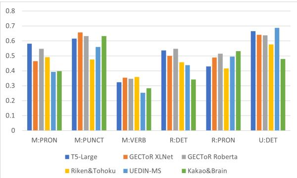

# Frustratingly Easy System Combination for Grammatical Error Correction

Muhammad Reza Qorib∗, Seung-Hoon Na† and Hwee Tou Ng∗

∗ Department of Computer Science, National University of Singapore † Division of Computer Science and Engineering, Jeonbuk National University {mrqorib, nght}@comp.nus.edu.sg, nash@jbnu.ac.kr

## Abstract

In this paper, we formulate system combination for grammatical error correction (GEC) as a simple machine learning task: binary classification. We demonstrate that with the right problem formulation, a simple logistic regression algorithm can be highly effective for combining GEC models. Our method successfully increases the F0.5 score from the highest base GEC system by 4.2 points on the CoNLL-2014 test set and 7.2 points on the BEA-2019 test set. Furthermore, our method outperforms the state of the art by 4.0 points on the BEA-2019 test set, 1.2 points on the CoNLL-2014 test set with original annotation, and 3.4 points on the CoNLL-2014 test set with alternative annotation. We also show that our system combination generates better corrections with higher $\mathrm { F } _ { 0 . 5 }$ scores than the conventional ensemble.1

## 1 Introduction

Grammatical error correction (GEC) is the task of detecting and correcting grammatical errors present in a text (Ng et al., 2013). Grammatical error correction has achieved remarkable progress since the late 2000s, and has flourished more along with the development of sequence-to-sequence architecture. Grammatical error correction shared tasks such as CoNLL-2013 (Ng et al., 2013), CoNLL-2014 (Ng et al., 2014), and BEA-2019 (Bryant et al., 2019) also contribute to popularizing the task.

With the success of Transformer (Vaswani et al., 2017) architecture in sequence-to-sequence tasks, most recent state-of-the-art grammatical error correction systems use Transformer-based architecture. Even though they all use a Transformer-based architecture, there are still some variations to the models, especially in the task formulation and pre-training data.

Generally, we can divide the recent state-ofthe-art systems into a sequence tagging approach (Awasthi et al., 2019; Omelianchuk et al., 2020) that usually uses a large pre-trained masked language model, and a sequence-to-sequence approach (Rothe et al., 2021; Stahlberg and Kumar, 2021; Kaneko et al., 2020) that usually pre-trains a Transformer architecture with synthetic data. The differences in the synthetic data generation methods and seed corpora used also contribute to more diverse GEC systems.

  
Figure 1: The $\mathrm { F } _ { 0 . 5 }$ scores of the base GEC systems that we use in our experiments on selected error types in the BEA-2019 development set.

With these differences, each model has its own strengths and weaknesses (Figure 1). Susanto et al. (2014) has demonstrated that the differences in the strengths of the GEC models can be utilized to generate better grammatical error corrections by combining them through a system combination method. In this paper, we present our simple yet effective system combination method for grammatical error correction that outperforms all prior state-of-theart systems on both CoNLL-2014 and BEA-2019 shared tasks.

The contributions of this paper are as follows:

• We propose a novel method for combining grammatical error correction systems, by formulating the task as binary classification that predicts each edit independently. To the best of our knowledge, this is the first time that system combination for grammatical error correction is formulated this way.

• Our proposed method only relies on the outputs of the base systems, making our method compatible with any base GEC systems.

• We demonstrate that the combined GEC system using our method outperforms all stateof-the-art systems on both CoNLL-2014 and BEA-2019 shared tasks.

• We demonstrate that our system combination method outperforms other prior system combination methods, and it is also a better alternative than the conventional ensemble.

## 2 Related Work

In this section, we discuss some prior work on GEC system combination. One approach (MEMT) only uses the output sentences without relying on any edit type, while the other two approaches (IBM, GEC-IP) only use the edit type and which hypotheses (output sentences of component systems) propose an edit type while not using the output sentences at all. In this section, we also discuss another system combination method (DDC) that introduces diversity to the base systems, which is complementary to our system combination method.

## 2.1 MEMT

MEMT is a system combination method that is originally designed to combine machine translation hypotheses from multiple base systems. Susanto et al. (2014) have demonstrated that the method works well for GEC system combination also. MEMT combines the hypotheses by first aligning them and generates all possible paths of the candidate tokens from the hypotheses. MEMT has some constraints in searching the possible candidate tokens, such as no repetition, weak monotonicity, and completeness. MEMT then learns to score the candidate tokens based on the n-gram language model score, n-gram similarity to the hypotheses, and the number of tokens in the candidate.

## 2.2 IBM

The IBM system combination method (Kantor et al., 2019) works by separating the edits from two hypotheses into three groups: edits that appear exclusively in the first hypothesis, edits that appear in both hypotheses, and edits that appear exclusively in the second hypothesis. This grouping is done for each edit type. Then, the model learns the decision of which group to include for each edit type. The IBM method can only combine two systems at a time. Hence, combining more than two systems requires applying this method iteratively.

## 2.3 GEC-IP

GEC-IP (Lin and Ng, 2021) is similar to the IBM method, but is simpler and directly optimizes the parameters using non-linear integer programming, instead of optimizing real-valued parameters and rounding them later as used in the IBM method. Another key difference between GEC-IP and IBM is that GEC-IP can combine many base systems at once, instead of combining only two systems at a time. In GEC-IP, for each edit type, the system chooses the edits from only one base system to be applied as the final correction, and ignores the edits from the other base systems.

## 2.4 DDC

Diversity-driven combination (DDC) (Han and Ng, 2021) is a method that aims to increase the diversity among the base systems in a system combination scenario, so as to improve the performance of the combined system. Macherey and Och (2007) show that the base systems should be diverse (almost uncorrelated) and have similar quality to be useful for system combination. DDC is not entirely a black-box method as it requires a base system to act as the backbone system to be fine-tuned. DDC uses reinforcement learning to induce diversity to the base systems, then uses an off-the-shelf system combination method to combine the base systems. As DDC is orthogonal to this research and is not a black-box system combination method, this paper does not compare to DDC.

## 3 Method

In this section, we describe how we formulate the task and present our method, which gathers all possible edits from the hypotheses (i.e., output sentences of individual base systems) and for each edit, predicts whether it should be kept or discarded to generate the final output sentence of the combined system. Our method is named ESC (Edit-based System Combination).

## 3.1 Task Formulation

We formulate GEC system combination as a binary classification task. We regard the base GEC models as black boxes and combine the models based on their proposed edits. From the hypotheses generated by the base GEC models, we extract the edits in the form of (start index, end index, correction string) tuples. In addition, each edit also has an edit type that is acquired from an automatic error annotation tool, and the edit type is used as part of the features of an edit. We follow the edit type convention of Bryant et al. (2017). Each edit can be one of three operations: insertion (prefixed with ‘M:’ for ‘missing’), deletion (prefixed with ‘U:’ for ‘unnecessary’), and substitution (prefixed with $\mathbf { \hat { R } } \mathbf { : \vec { \theta } }$ for ‘replacement’). An example of extracted edits and edit types is shown in Table 1.

We take the union of edits from all hypotheses and gather them into a unified set E. Our method evaluates each edit independently, without the information of surrounding edits or context words. Similar to (Kantor et al., 2019) and (Lin and Ng, 2021), our method also entirely relies on the edit type and does not use the textual information of the edit. We use a generalized linear model to predict whether each edit from E should be kept or discarded to create the output sentence of the combined system, according to the features of the edit to be defined in the next subsection.

## 3.2 Features

Suppose there are k hypotheses from k base (component) systems to be combined. Each edit e in E is represented by a feature vector x, which is formed by concatenating the feature vectors $\scriptstyle { \mathbf { x } } _ { i } ,$ $i = 1 \ldots k$

$$
\pmb { x } = [ \pmb { x } _ { 1 } ; \pmb { x } _ { 2 } ; . . . ; \pmb { x } _ { k } ]
$$

$\mathbf { \nabla } _ { \mathbf { x } _ { i } }$ is the one-hot representation of the edit type of e in hypothesis i (e.g., M:ADJ -> [1, 0, 0, ..], $\mathbf { M } { : } \mathrm { A D V }  [ 0 , 1 , 0 , \ldots ] )$ if the edit type exists in hypothesis i, and a zero vector if it does not. This way, the model learns to determine whether or not to keep an edit purely based on the edit type and which hypotheses propose this edit. The supplied information to the model is the same as the IBM method (Kantor et al., 2019) and GEC-IP method (Lin and Ng, 2021), but the task formulation and optimization method differ. For set of edit types $T$ $\mathbf { \Psi } _ { \pmb { x } _ { i } } \in \mathbb { R } ^ { | T | }$ and $\pmb { x } \in \mathbb { R } ^ { k | T | }$ . In our work, T = 54.

## 3.3 Model

We use logistic regression as the classification model. Using logistic regression as the classifier makes the model trainable with only a modest amount of training data and makes the results interpretable. Moreover, we found that it works very well in combining different kinds of base GEC systems. For each edit, we obtain the probability of the edit being a correct edit to be used to generate the output sentence as follows:

$$
p = \sigma ( { \pmb w } \times { \pmb x } + b )\tag{1}
$$

where $\sigma$ is the sigmoid function.

## 3.4 Post-processing

Since we combine the edits from multiple hypotheses, we may have overlapping edits, either due to multiple insertions at the same location or overlapping substitutions.

• Multiple insertions Multiple conflicting insertion edits at the same location are not to be applied together when proposed by different base GEC systems. If there are multiple insertion edits at the same position (e.g., (3, 3, on) and (3, 3, in)), we consider this as a multiple insertion conflict.

• Overlapping substitutions If an edit’s start or end index is in between another edits’ start and end indices (e.g., (2, 4, eaten) and (2, 3, ate)), we consider this as an overlapping substitution conflict.

We use a greedy strategy to select the edits after we obtain the probabilities from the model. First, we only consider edits that have probabilities above a certain threshold. Then, we sort the edits based on their probabilities from the highest to the lowest and check the edits one-by-one to only select the edits that do not have any conflict with previously selected edits.

## 4 Experiments

## 4.1 Implementation

We extract the edits from the base GEC models’ output using ERRANT (Bryant et al., 2017) and implement our model using the Linear module of Py-Torch (Paszke et al., 2019). We optimize the model using stochastic gradient descent (SGD) with binary cross entropy, and use the threshold of 0.5 to select the edits. Our model’s hyper-parameters are given in Table 2.

<table><tr><td>Source Edits</td><td>In this case , the families played important roles in daily lives . Correction In this case , family members play important roles in our daily lives . (4, 5, ‘), (5, 6, family members), (6, 7, play), (10, 10, our)</td></tr></table>

Table 1: Extracted edits from a sample pair of source and corrected sentences.

<table><tr><td>Hyper-parameter</td><td>value</td></tr><tr><td>Dimension</td><td>54k</td></tr><tr><td>Optimizer</td><td>Stochastic Gradient</td></tr><tr><td>Momentum</td><td>Descent 0</td></tr><tr><td>Dampening</td><td>0</td></tr><tr><td>Weight decay</td><td>0</td></tr><tr><td>Criterion</td><td>Binary Cross En-</td></tr><tr><td></td><td>tropy</td></tr><tr><td>Criterion reduction</td><td>Mean</td></tr><tr><td>Learning rate</td><td>0.1</td></tr><tr><td>Batch size</td><td>16</td></tr><tr><td>Shuffle train</td><td>True</td></tr></table>

Table 2: Hyper-parameters for all experiments.

## 4.2 Dataset

Following Kantor et al. (2019) and Lin and Ng (2021), we train the model on the base systems’ outputs on BEA-2019 shared task development data (Bryant et al., 2019). All base systems that we combine in our experiments are publicly available. Except for T5-large, the outputs of the models can be downloaded directly. For T5-large, their results can be readily reproduced following the instructions in the T5 repository, fine-tuning2 it with the dataset that is published by (Rothe et al., 2021). The URLs of these base systems are listed in the Appendix.

Our method only requires one hyper-parameter that needs to be set in each experimental setting, which is the number of epochs to train the model. Its value is determined by first training our model on 80% of the BEA-2019 development data. The epoch number that results in the highest F0.5 score on the remaining 20% of the BEA-2019 development data is chosen. We then train on the complete BEA-2019 development data for the same number of epochs to obtain the final model.

## 4.3 Evaluation

We evaluate our model on CoNLL-2014 (Ng et al., 2014) and BEA-2019 test data. We use the Max-Match (M2) scorer (Dahlmeier and Ng, 2012) to obtain the CoNLL-2014 results and ERRANT scorer (Bryant et al., 2017) to obtain the BEA-2019 results. To reduce randomness in our experiments, we report the average and standard deviation of 5 runs. For MEMT and ESC, we set a different random seed in each run. For IBM, we randomize the way of combining the base systems. Since the IBM method combines two systems in each step, the order of combining the base systems affects the combination results. For GEC-IP, its optimization is deterministic. There is only slight variation due to conflict resolution if there are overlapping edits, but it does not happen in our experiments. Thus, our repeated experiments of GEC-IP have the exact same output in both the BEA-2019 and the CoNLL-2014 experiments. We measure the statistical significance of our experiments with bootstrap resampling on 100 samples.

## 5 Results

We combine up to six strong GEC base systems, namely T5-Large (Rothe et al., 2021), GECToR XLNet (Omelianchuk et al., 2020), GECToR Roberta (Omelianchuk et al., 2020), Riken&Tohoku (Kiyono et al., 2019), UEDIN-MS (Grundkiewicz et al., 2019), and Kakao&Brain (Choe et al., 2019). For the CoNLL-2014 combination, we do not include the Kakao&Brain system as a base system since its CoNLL-2014 score (61.15) is significantly lower than the other systems ( 64.00). For the BEA-2019 combination, our main results combine all 6 aforementioned base GEC systems.

We compare the scores of our model (ESC) with other system combination methods that have been shown to work well on the grammatical error correction task, such as MEMT (Heafield and Lavie, 2010), IBM (Kantor et al., 2019), and GEC-IP (Lin and Ng, 2021). With almost no hyper-parameter tuning, our model works very well and outperforms all the other system combination methods.

<table><tr><td></td><td colspan="3">BEA-2019 Dev</td><td colspan="2">CoNLL-2014</td><td rowspan="2">CoNLL-2014  $\mathbf { F _ { 0 . 5 } } \left( \bar { x } \pm \sigma \right)$ </td></tr><tr><td>Model 1. T5-Large</td><td>P 60.38</td><td>R</td><td> $\mathbf { F _ { 0 . 5 } }$ </td><td>P R 51.50</td><td> $\mathbf { F _ { 0 . 5 } }$ </td></tr><tr><td>2. GECToR XLNet</td><td></td><td>44.04</td><td>56.21</td><td>69.66</td><td>65.07</td><td></td></tr><tr><td>3. GECToR Roberta</td><td>66.00</td><td>34.14</td><td>55.62</td><td>77.49 40.15</td><td>65.34</td><td></td></tr><tr><td>4. Riken&amp;Tohoku</td><td>62.37</td><td>35.52</td><td>54.18</td><td>73.91 41.66</td><td>64.00</td><td></td></tr><tr><td>5. UEDIN-MS</td><td>62.89</td><td>34.39</td><td>53.95</td><td>73.26 44.17</td><td>64.74</td><td></td></tr><tr><td>MEMT</td><td>59.07</td><td>37.57</td><td>53.00</td><td>75.15 41.21</td><td>64.52</td><td></td></tr><tr><td></td><td>65.43</td><td>42.69</td><td>59.13</td><td>76.44 48.06</td><td>68.37</td><td> $6 8 . 1 4 \pm 0 . 2$ </td></tr><tr><td>IBM</td><td>70.70</td><td>41.15</td><td>61.82</td><td>69.83 44.95</td><td>62.87</td><td> $6 2 . 5 1 \pm 0 . 4 5$ </td></tr><tr><td>GEC-IP</td><td>68.87</td><td>39.91</td><td>60.04</td><td>74.97 42.93</td><td>65.23</td><td> $6 5 . 2 3 \pm 0$ </td></tr><tr><td>ESC (ours)</td><td>72.86</td><td>40.37</td><td>62.76</td><td>81.48 43.78</td><td>69.51</td><td> $6 9 . 4 7 \pm 0 . 1 4$ </td></tr></table>

Table 3: CoNLL-2014 combination results. The first group of rows shows the base GEC systems and the second group of rows shows the combination results of the above base systems using different GEC system combination methods. The rightmost column shows the mean and standard deviation of the CoNLL-2014 test set $\mathrm { F } _ { 0 . 5 }$ scores from 5 experiments. The rest come from a single experiment that has the highest $\mathrm { F } _ { 0 . 5 }$ score on the BEA-2019 dev set.

<table><tr><td rowspan=2 colspan=1>Model</td><td rowspan=1 colspan=1>CoNLL-2014 $\mathbf { F _ { 0 . 5 } }$ </td></tr><tr><td rowspan=1 colspan=1>original alt</td></tr><tr><td rowspan=1 colspan=1>(Rothe et al., 2021)(Stahlberg and Kumar, 2021)(Omelianchuk et al., 2020)(Kaneko et al., 2020)</td><td rowspan=1 colspan=1>68.8768.366.565.23</td></tr><tr><td rowspan=1 colspan=1>ESC (ours)</td><td rowspan=1 colspan=1>69.51   72.28</td></tr></table>

Table 4: Comparison of our CoNLL-2014 test scores with state-of-the-art systems.

Our ESC method increases the $\operatorname { F } _ { 0 . 5 }$ score by 4.17 points from the highest base GEC system on CoNLL-2014 (Table 3) and 7.24 points on BEA-2019 (Table 6). The high performance on both CoNLL-2014 and BEA-2019 shows that our model does not overfit to the dataset even though the model is trained with BEA-2019 development set. We confirm that the $\mathrm { F } _ { 0 . 5 }$ scores on both CoNLL-2014 and BEA-2019 are significantly higher than the $\operatorname { F } _ { 0 . 5 }$ score of each of the other combination methods $( p < 0 . 0 0 1 )$ .

<table><tr><td rowspan="2">Model</td><td colspan="2">BEA-2019</td></tr><tr><td>P R</td><td> $\mathbf { F _ { 0 . 5 } }$ </td></tr><tr><td>(Rothe et al., 2021) (Stahlberg and Kumar, 2021) (Omelianchuk et al., 2020)</td><td>一 77.7 65.4 74.9 79.4 57.2 73.7</td><td>75.9</td></tr><tr><td>ESC (ours)</td><td>86.6 60.9 79.9</td><td></td></tr></table>

Table 5: Comparison of our BEA-2019 test scores with state-of-the-art systems.

In addition, our BEA-2019 $\operatorname { F } _ { 0 . 5 }$ score outperforms the state of the art by 4.0 points (Table 5), and our CoNLL-2014 $\mathrm { F } _ { 0 . 5 }$ score outperforms the state of the art by 1.21 points on the original annotation and 3.41 points on the alternative annotation (Table 4). For the CoNLL-2014 score comparison, we report both the $\operatorname { F } _ { 0 . 5 }$ scores on the original annotation and the alternative annotation (alt) that includes moderated participants’ alternative annotations. This is because one of the current top systems for CoNLL-2014 reported its score on the alternative annotation3. From the experiments on CoNLL-2014 (Table 3) and BEA-2019 (Table 6), we can see that the strength of ESC lies in its high precision compared to other system combination methods.

## 6 Analysis

In this section, we analyze the capability of our ESC method in comparison with other GEC system combination methods. Our method, which is a simple logistic regression, chooses whether to include an edit based on its appearance and the edit type in each component system. With edit type set $T$ and k hypotheses, the model is a function of $k | T | { + } 1$ weight parameters: $\boldsymbol { w } \in \mathbb { R } ^ { k | T | }$ and the bias parameter $b .$ If we assume the edit type for the same edit span and correction between the hypotheses to always be the same, we can decompose the model into T independent functions that accept k inputs, one function for each edit type $t \in T$ , as

<table><tr><td>Model</td><td colspan="2">BEA-2019 Dev</td><td>BEA-2019 Test P R</td><td></td><td>BEA-2019 Test  $\mathbf { F _ { 0 . 5 } } \left( \bar { x } \pm \sigma \right)$ </td></tr><tr><td>1. T5-Large</td><td>P 60.38</td><td>R  $\mathbf { F _ { 0 . 5 } }$  44.04 56.21</td><td>74.30 66.75</td><td> $\mathbf { F _ { 0 . 5 } }$  72.66</td><td></td></tr><tr><td>2. GECToR XLNet</td><td>66.00</td><td>34.14 55.62</td><td>79.20 53.90</td><td>72.40</td><td></td></tr><tr><td>3. GECToR Roberta</td><td>62.37 35.52</td><td>54.18</td><td>77.20 55.10</td><td>71.50</td><td></td></tr><tr><td>4. Riken&amp;Tohoku</td><td>62.89</td><td></td><td></td><td></td><td></td></tr><tr><td>5. UEDIN-MS</td><td></td><td>34.39 53.95</td><td>74.7 56.7</td><td>70.2</td><td></td></tr><tr><td>6. Kakao&amp;Brain</td><td>59.07 62.73</td><td>37.57 53.00</td><td>72.28 60.12</td><td>69.47</td><td></td></tr><tr><td></td><td></td><td>33.23 53.27</td><td>75.19 51.91</td><td>69.00</td><td></td></tr><tr><td>MEMT</td><td>68.41</td><td>41.88 60.72</td><td>82.20 63.00</td><td>77.48</td><td> $\overline { { 7 6 . 6 6 \pm 0 . 8 2 } }$ </td></tr><tr><td>IBM</td><td>72.45</td><td>39.62 62.15</td><td>83.38 58.43</td><td>76.82</td><td> $7 6 . 2 4 \pm 0 . 3 8$ </td></tr><tr><td>GEC-IP</td><td>70.10</td><td>38.96 60.44</td><td>80.78 57.51</td><td>74.73</td><td> $7 4 . 7 3 \pm 0$ </td></tr><tr><td>ESC (ours)</td><td>73.63</td><td>40.12 63.09</td><td>86.65 60.91</td><td>79.90</td><td> $7 9 . 8 6 \pm 0 . 0 7$ </td></tr></table>

Table 6: BEA-2019 combination results. The first group of rows shows the base GEC systems and the second group of rows shows the combination results. The rightmost column shows the mean and standard deviation of the BEA-2019 test set $\mathrm { F } _ { 0 . 5 }$ scores from 5 experiments. The rest come from a single experiment that has the highest $\mathrm { F } _ { 0 . 5 }$ score on BEA-2019 dev set.

follows:

$$
\begin{array} { r l } & { f _ { t } ( x _ { 1 } , x _ { 2 } , \ldots , x _ { k } ) } \\ & { \quad = \left\{ \begin{array} { l l } { 1 } & { \mathrm { i f } x _ { 1 } w _ { 1 } ^ { e } + x _ { 2 } w _ { 2 } ^ { e } + \ldots + x _ { k } w _ { k } ^ { e } + b > 0 } \\ { 0 } & { \mathrm { o t h e r w i s e } } \end{array} \right. } \end{array}\tag{2}
$$

where $x _ { j }$ denotes whether the edit appears in hypothesis $j .$ . The edit is selected only if $f _ { t }$ results in 1. In this analysis, we also assume that there are no conflicting edits and we use the probability threshold of 0.5. We use this function formulation throughout our analysis.

## 6.1 Comparison with MEMT

Compared to ESC, IBM, and GEC-IP, MEMT has a significantly different approach to combine the hypotheses. MEMT does not utilize edit types at all. Instead of learning the weight for each edit type from each component system, MEMT learns the weight of n-gram matching to the output of each component system. Moreover, MEMT also scores the candidate sentence with an n-gram language model, so candidate selection is affected by the domain of the language model’s training data and the language model’s limited context.

In Table 7, MEMT chooses to keep the edit of changing the word “practise” to the word “do”. Since there is only one hypothesis proposing this edit, the n-gram match of this edit will have a lower score than not keeping the edit. Thus, MEMT keeps this edit due to the higher language model score. It is likely that the phrase “they can do it” appears more often in the language model training data than “they can practise $\mathrm { i t } ^ { \prime \prime }$

<table><tr><td>Source</td><td>However , the adults they can practise it as well and they will get the same .</td></tr><tr><td>S1</td><td>However , the adults they can do it as well and they will get the same .</td></tr><tr><td>S2</td><td>However , the adults they can practise it as well and they will get the same .</td></tr><tr><td>S3</td><td>However , the adults they can practise it as well and they will get the same .</td></tr><tr><td>MEMT</td><td>However , the adults they can do it as well and they will get the same .</td></tr><tr><td>ESC</td><td>However , the adults they can practise it as well and they will get the same .</td></tr><tr><td></td><td>Reference However , the adults they can practise it as well and they will get the same .</td></tr></table>

Table 7: An example of MEMT’s weakness.

## 6.2 Comparison with IBM

Proposition 1. In the combination of 4 or more base systems, ESC has more expressive power than any of IBM’s combination settings.

The IBM method separates the edits from 2 hypotheses (e.g., S1 and S2) into three groups: edits that appear exclusively in S1 (S1  S2), edits that appear in S1 and S2 (S1  S2), and edits that appear exclusively in S2 ( S1 S2). In the combination of more than 2 hypotheses, we apply the IBM method iteratively in some order.

In each iteration, for each edit type $t \in T$ , we can formalize the IBM method as the following logic function:

<table><tr><td>n</td><td>IBM&#x27;s bound</td><td>upper-</td><td>ESC&#x27;s bound</td><td>lower-</td></tr><tr><td>2</td><td>8</td><td></td><td>7</td><td></td></tr><tr><td>3</td><td>64</td><td></td><td>52</td><td></td></tr><tr><td>4</td><td>512</td><td></td><td>941</td><td></td></tr><tr><td>5</td><td>4096</td><td></td><td>47286</td><td></td></tr><tr><td>6</td><td>32768</td><td></td><td>7514067</td><td></td></tr><tr><td>7</td><td>262144</td><td></td><td>4.189035e+9</td><td></td></tr><tr><td>8</td><td>2097152</td><td></td><td> $8 . 7 8 0 7 6 9 8 \mathrm { e } + 1 2$ </td><td></td></tr><tr><td>9</td><td>1.1677722e+7</td><td></td><td>7.2065266e+16</td><td></td></tr></table>

Table 8: IBM’s upper bound of expressive power and ESC’s lower bound of expressive power, both in terms of possible logic function expressions. n denotes the number of base systems.

$$
\begin{array} { c } { { g _ { t } ( x _ { i } , x _ { j } ) = \left( s _ { 1 } \cap ( x _ { i } \cap \neg x _ { j } ) \right) \cup \left( s _ { 2 } \cap \left( x _ { i } \cap x _ { j } \right) \right) } } \\ { { \cup \left( s _ { 3 } \cap \left( \neg x _ { i } \cap x _ { j } \right) \right) } } \end{array}\tag{3}
$$

where $x _ { i }$ denotes whether the edit appears in hypothesis i, and $s _ { 1 } , s _ { 2 }$ , and $s _ { 3 }$ denote parameters to select/ignore the edit group.

Note that $g _ { t } ( x _ { i } , x _ { j } )$ is a commutative function, i.e., $g _ { t } ( x _ { i } , x _ { j } ) = g _ { t } ( x _ { j } , x _ { i } )$ . We can just swap the values of $s _ { 1 }$ and $s _ { 3 }$ from the above equation. Thus, the number of expressions that g can express is not more than all possible combinations of $s _ { 1 } , s _ { 2 } .$ , and $s _ { 3 }$ values, which is $2 ^ { 3 } = 8$

In combining k systems, the maximum number of iterations is $k - 1$ steps. Thus, the number of logic functions the IBM method can express with k base systems, no matter in which order the component models are combined (combination setting)4, is at most $8 ^ { k - 1 }$ . On the other hand, ESC can express all linearly separable Boolean functions with k variables. Since we do not consider edits that do not exist in any of the hypotheses, the number of unique functions that ESC can express is at least half of the possible linearly separable Boolean functions. We show the rationale behind this in the Appendix.

Currently, the number of linearly separable Boolean functions is known only up to 9 variables (Gruzling, 2007). However, in comparison with IBM’s expressivity (Table 8), we know that ESC has more expressive power until at least the combination of 19 base systems, since $8 ^ { 1 8 } < 7 . 2 \times 1 0 ^ { 1 6 }$

<table><tr><td rowspan="2">No. of base systems</td><td colspan="2">BEA-2019</td></tr><tr><td>P</td><td>R  $\mathbf { F _ { 0 . 5 } }$ </td></tr><tr><td>T5-Large + G. XLNet</td><td>80.20 61.11 75.48</td><td></td></tr><tr><td>+ GECToR Roberta</td><td>86.15 59.41 79.04</td><td>84.69 59.02 77.91</td></tr><tr><td>+ Riken&amp;Tohoku</td><td>86.16 61.06 79.62</td><td></td></tr><tr><td> $+ \mathrm { U E D I N - M S }$  + Kakao&amp;Brain</td><td>86.65 60.91 79.90</td><td></td></tr></table>

Table 9: The performance of GEC system combination with different number of base systems on the BEA-2019 test set.

## 6.3 Comparison with GEC-IP

Proposition 2. ESC is a generalized form of GEC-IP.

GEC-IP works by selecting one hypothesis for each edit type. We can model GEC-IP’s final decision with ESC Equation 2 by setting one of the weights to one, and the others to zero, i.e., $w _ { \bar { s } } = 1 , w _ { j \neq \bar { s } } = 0 \forall j \in \{ 1 , \dots , k \}$ , where s¯ denotes the optimal hypothesis from GEC-IP training, for each edit type. Thus, this shows that GEC-IP is a special case of ESC.

## 7 Discussions

## 7.1 Effect of the Number of Base Systems

In this section, we discuss the effect of using different number of GEC base systems in our combination. We conduct an experiment of GEC system combination with increasing number of base systems from 2 to 6 (Table 9). In this experiment, we always pick the best-performing base systems first, i.e., we combine T5-Large with GECToR XLNet in the 2-system combination, then add GECToR Roberta in the 3-system combination, and so on.

We find that even with combining only three systems, our method already outperforms the state of the art (75.9). We also find that adding more base systems, even though an additional system is weaker than the already combined base systems, is still beneficial to improve the $\mathrm { F } _ { 0 . 5 }$ score. We find that adding more base systems allows the model to have more information in picking the correct edits, hence improving the precision.

## 7.2 Ensemble Alternative

We run system combination experiments with base systems that are very similar to each other to evaluate whether our system combination can be an alternative to the conventional ensemble. We run this experiment on two sets of models, a set of sequenceto-sequence models and a set of sequence-tagging models. By conventional ensemble, we mean the method of averaging the output probabilities from multiple models during the prediction step, i.e., when predicting the tag for each token in sequence tagging models and when predicting the next token during beam search in sequence-to-sequence models.

<table><tr><td rowspan=2 colspan=1>Model</td><td rowspan=1 colspan=1>BEA-2019</td></tr><tr><td rowspan=1 colspan=1>P    R     $\mathbf { F _ { 0 . 5 } }$ </td></tr><tr><td rowspan=1 colspan=1>(1) Transformer-big 1</td><td rowspan=2 colspan=1>68.25 58.73 66.1168.49 59.51 66.48</td></tr><tr><td rowspan=1 colspan=1>(2) Transformer-big 2</td></tr><tr><td rowspan=1 colspan=1>(3) Transformer-big 3</td><td rowspan=1 colspan=1>68.45 60.02 66.58</td></tr><tr><td rowspan=1 colspan=1>(4) Transformer-big 4</td><td rowspan=1 colspan=1>68.38 60.02 66.53</td></tr><tr><td rowspan=1 colspan=1>1+2+3+4 Ensemble</td><td rowspan=2 colspan=1>69.88 59.71 67.5775.86 52.63 69.70</td></tr><tr><td rowspan=1 colspan=1> $1 { + } 2 { + } 3 { + } 4 \ \mathrm { E S C }$ </td></tr></table>

Table 10: Comparison of ESC with conventional ensemble on sequence-to-sequence models.
<table><tr><td rowspan="2">Model</td><td colspan="2">BEA-2019</td></tr><tr><td>P</td><td>R  $\overline { { \mathbf { F _ { 0 . 5 } } } }$ </td></tr><tr><td>(1) GECToR XLNet (2) GECToR Roberta (3) GECToR BERT</td><td>79.20 53.90 72.40 77.20 55.10 71.50 71.50 55.70 67.60</td><td></td></tr><tr><td>1+2 Ensemble 1+2 ESC</td><td>79.40 57.20 73.70 83.94 50.44 74.10</td><td></td></tr><tr><td>1+2+3 Ensemble</td><td>78.90 58.20 73.60</td><td></td></tr><tr><td>1+2+3 ESC</td><td>84.67 51.50 75.01</td><td></td></tr></table>

Table 11: Comparison of ESC with conventional ensemble on sequence tagging models.

The sequence-to-sequence experiment combines 4 transformer-big models we train ourselves. The four models only differ in the random seeds, pretraining data, and batch sizes during fine-tuning. 2 of them are pre-trained with 50M sentences of synthetic data, and the other 2 are pre-trained with 100M sentences of synthetic data before being fine-tuned with BEA-2019 training data. For the sequence tagging experiment, we use GECToR’s (Omelianchuk et al., 2020) models5, which differ in the pre-trained masked language model, and then fine-tune with GEC parallel data.

We find that even though the base systems are relatively similar, our system combination can still improve the $\operatorname { F } _ { 0 . 5 }$ score by at least 1.7 points. Furthermore, our model yields higher F0.5 scores than the conventional ensemble (Tables 10 and 11). This suggests that using ESC instead of the conventional ensemble is better when combining multiple models.

## 8 Conclusion and Future Work

In this work, we present a novel GEC system combination method using logistic regression by formulating the task as binary classification. Our method increases the $\operatorname { F } _ { 0 . 5 }$ score by 4.17 points from the highest base GEC system on CoNLL-2014 and 7.24 points on BEA-2019. This shows that our method does not overfit to the dataset even though it is trained on the BEA-2019 development data. In addition, our combined system outperforms the best published GEC system by 4.0 points on the BEA-2019 test set, 1.21 points on the CoNLL-2014 test set with original annotation, and 3.41 points on the CoNLL-2014 test set with alternative annotation.

We also compare our system combination method to the other GEC system combination methods, including MEMT (Heafield and Lavie, 2010), IBM (Kantor et al., 2019), and GEC-IP (Lin and Ng, 2021), and show that our method has better expressive power compared to IBM and GEC-IP. We also show that our method produces a higher $\operatorname { F } _ { 0 . 5 }$ score than the conventional ensemble.

This work highlights the importance of edit type information in system combination for grammatical error correction. In recent GEC research, most systems just employ end-to-end learning without making use of any syntactic knowledge. We show that syntactic information, such as edit type, can also be useful to improve neural grammatical error correction models. Even though we only evaluate this method on English GEC, we believe our method can also be applied to other languages when a similar error type annotation toolkit is available.

## Acknowledgements

We thank Ammar Fathin Sabili and Hannan Cao for helpful comments on this paper. This research is supported by the National Research Foundation, Singapore under its AI Singapore Programme (AISG Award No: AISG-RP-2019-014). The computational work for this article was partially performed on resources of the National Supercomputing Centre, Singapore (https://www.nscc.sg).

## References

Abhijeet Awasthi, Sunita Sarawagi, Rasna Goyal, Sabyasachi Ghosh, and Vihari Piratla. 2019. Parallel iterative edit models for local sequence transduction. In Proceedings ofEMNLP, pages 4260–4270.

Christopher Bryant, Mariano Felice, Øistein E. Andersen, and Ted Briscoe. 2019. The BEA-2019 shared task on grammatical error correction. In Proceedings ofBEA, pages 52–75.

Christopher Bryant, Mariano Felice, and Ted Briscoe. 2017. Automatic annotation and evaluation of error types for grammatical error correction. In Proceedings ofACL, pages 793–805.

Yo Joong Choe, Jiyeon Ham, Kyubyong Park, and Yeoil Yoon. 2019. A neural grammatical error correction system built on better pre-training and sequential transfer learning. In Proceedings ofBEA, pages 213– 227.

Daniel Dahlmeier and Hwee Tou Ng. 2012. Better evaluation for grammatical error correction. In Proceedings ofNAACL 2012, pages 568–572.

Roman Grundkiewicz, Marcin Junczys-Dowmunt, and Kenneth Heafield. 2019. Neural grammatical error correction systems with unsupervised pre-training on synthetic data. In Proceedings of BEA, pages 252–263.

Nicolle Gruzling. 2007. Linear separability ofthe vertices of an n-dimensional hypercube. Ph.D. thesis, University of Northern British Columbia.

Wenjuan Han and Hwee Tou Ng. 2021. Diversity-driven combination for grammatical error correction. In Proceedings ofICTAI.

Kenneth Heafield and Alon Lavie. 2010. CMU multiengine machine translation for WMT 2010. In Proceedings ofWMT, pages 301–306.

Masahiro Kaneko, Masato Mita, Shun Kiyono, Jun Suzuki, and Kentaro Inui. 2020. Encoder-decoder models can benefit from pre-trained masked language models in grammatical error correction. In Proceedings ACL, pages 4248–4254.

Yoav Kantor, Yoav Katz, Leshem Choshen, Edo Cohen-Karlik, Naftali Liberman, Assaf Toledo, Amir Menczel, and Noam Slonim. 2019. Learning to combine grammatical error corrections. In Proceedings ofBEA, pages 139–148.

Shun Kiyono, Jun Suzuki, Masato Mita, Tomoya Mizumoto, and Kentaro Inui. 2019. An empirical study of incorporating pseudo data into grammatical error correction. In Proceedings ofEMNLP, pages 1236– 1242.

Ruixi Lin and Hwee Tou Ng. 2021. System combination for grammatical error correction based on integer programming. In Proceedings of RANLP, pages 829– 834.

Wolfgang Macherey and Franz J. Och. 2007. An empirical study on computing consensus translations from multiple machine translation systems. In Proceedings ofEMNLP, pages 986–995.

Hwee Tou Ng, Siew Mei Wu, Ted Briscoe, Christian Hadiwinoto, Raymond Hendy Susanto, and Christopher Bryant. 2014. The CoNLL-2014 shared task on grammatical error correction. In Proceedings of CoNLL, pages 1–14.

Hwee Tou Ng, Siew Mei Wu, Yuanbin Wu, Christian Hadiwinoto, and Joel Tetreault. 2013. The CoNLL-2013 shared task on grammatical error correction. In Proceedings ofCoNLL, pages 1–12.

Kostiantyn Omelianchuk, Vitaliy Atrasevych, Artem Chernodub, and Oleksandr Skurzhanskyi. 2020. GECToR – grammatical error correction: Tag, not rewrite. In Proceedings ofBEA, pages 163–170.

Adam Paszke, Sam Gross, Francisco Massa, Adam Lerer, James Bradbury, Gregory Chanan, Trevor Killeen, Zeming Lin, Natalia Gimelshein, Luca Antiga, Alban Desmaison, Andreas Kopf, Edward Yang, Zachary DeVito, Martin Raison, Alykhan Tejani, Sasank Chilamkurthy, Benoit Steiner, Lu Fang, Junjie Bai, and Soumith Chintala. 2019. Pytorch: An imperative style, high-performance deep learning library. In Advances in Neural Information Processing Systems 32, pages 8024–8035.

Sascha Rothe, Jonathan Mallinson, Eric Malmi, Sebastian Krause, and Aliaksei Severyn. 2021. A simple recipe for multilingual grammatical error correction. In Proceedings ofACL, pages 702–707.

Felix Stahlberg and Shankar Kumar. 2021. Synthetic data generation for grammatical error correction with tagged corruption models. In Proceedings of BEA, pages 37–47.

Raymond Hendy Susanto, Peter Phandi, and Hwee Tou Ng. 2014. System combination for grammatical error correction. In Proceedings of EMNLP, pages 951– 962.

Ashish Vaswani, Noam Shazeer, Niki Parmar, Jakob Uszkoreit, Llion Jones, Aidan N Gomez, Ł ukasz Kaiser, and Illia Polosukhin. 2017. Attention is all you need. In Advances in Neural Information Processing Systems, volume 30.

## A Base System URLs

The URLs of these base systems are given in Table 12.

## B Computing Budget

We run our experiments on a single NVIDIA A100 GPU. The training time takes an average of 0.6 minutes for all experiments. Even though we use GPU in our experiments, our method takes less than 2 minutes to train on a CPU.

Model name URLs   
1. T5-Large T5: https://github.com/google-research/   
text-to-text-transfer-transformer   
Fine-tuning dataset (cLang-8):   
https://github.com/google-research-datasets/clang8   
2. GECToR XLNet https://github.com/grammarly/gector/tree/fea1532608   
3. GECToR Roberta https://github.com/grammarly/gector/tree/fea1532608   
4. Riken&Tohoku https://github.com/butsugiri/gec-pseudodata   
5. UEDIN-MS https://github.com/grammatical/pretraining-bea2019/   
6. Kakao&Brain https://github.com/kakaobrain/helo\_word/  
Table 12: Base system sources.

<table><tr><td rowspan="2">#</td><td colspan="2">BEA-2019 Dev</td></tr><tr><td>P R</td><td>CoNLL-2014 Test  $\mathbf { F _ { 0 . 5 } }$  P R  $\mathbf { F _ { 0 . 5 } }$ </td></tr><tr><td>1</td><td>72.16 40.96 62.62</td><td>80.75 44.56 69.47</td></tr><tr><td>2</td><td>71.62 41.38 62.49</td><td>80.3644.7669.33 81.83 43.11 69.37</td></tr><tr><td>3</td><td>73.25 39.46 62.54</td><td></td></tr><tr><td>4</td><td>72.5840.37 62.59</td><td>81.52 44.11 69.69</td></tr><tr><td>5</td><td>72.8640.37 62.76</td><td>81.4843.78 69.51</td></tr></table>

Table 13: CoNLL-2014 combination results with 5 runs. The results are from experiments with random seeds 0, 17, 171, 999, and 8888 respectively.

<table><tr><td rowspan="2"></td><td colspan="2">BEA-2019 Dev</td><td colspan="2">BEA-2019 Test</td></tr><tr><td>#</td><td>P R  $\mathbf { F _ { 0 . 5 } }$ </td><td></td><td>P R  $\mathbf { F _ { 0 . 5 } }$ </td></tr><tr><td>1</td><td>74.04 38.88 62.70</td><td></td><td>87.36 59.32 79.82</td><td></td></tr><tr><td>2</td><td></td><td>73.3640.26 63.00</td><td></td><td>86.41 60.98 79.76</td></tr><tr><td>3</td><td></td><td>74.02 39.28 62.89</td><td></td><td>87.37 59.69 79.95</td></tr><tr><td>4</td><td></td><td>73.63 40.12 63.09</td><td></td><td>86.65 60.91 79.90</td></tr><tr><td>5</td><td></td><td>73.69 40.02 63.08</td><td></td><td>86.68 60.78 79.87</td></tr></table>

Table 14: BEA-2019 combination results with 5 runs. The results are from experiments with random seeds 0, 17, 171, 999, and 8888 respectively.

## C Complete Experimental Results

The complete 5-run experiments can be seen in Table 13 for our CoNLL-2014 results and Table 14 for our BEA-2019 results. The experiment with the highest BEA-2019 dev set $\mathrm { F } _ { 0 . 5 }$ score for the CoNLL-2014 experiments is from the one with random seed 8888, and the experiment with the highest BEA-2019 dev set $\operatorname { F } _ { 0 . 5 }$ score for the BEA-2019 experiments is from the one with random seed 999.

## D Expressive Power of ESC

## D.1 Definition

Suppose $f _ { \theta } ( x _ { 1 } , \ldots , x _ { n } )$ is a combination function which takes $x _ { 1 } , \ldots , x _ { n }$ as input and returns a binary value using the parameter value $\theta \in \Omega$ where Ω is the parameter space. Let $\mathcal { E P } ( f )$ be the expressive power of $f ,$ which is defined as the number of unique functions of $f ,$ obtained from all possible parameter values, formally given as follows:

$$
\begin{array} { r c l } { \mathcal { E P } ( f ) } & { = } & { | \{ f _ { \theta } | \theta \in \Omega \} | } \end{array}
$$

## D.2 Calculating the Number of Possible Functions6

With n Boolean variables, there are $2 ^ { n }$ possible combinations of the variable values. For example, for $n = 2$ , there are $2 ^ { 2 }$ possible values:

$$
\begin{array} { l } { \bullet a = 0 , b = 0 } \\ { } \\ { \bullet a = 0 , b = 1 } \\ { } \\ { \bullet a = 1 , b = 0 } \\ { } \\ { \bullet a = 1 , b = 1 } \end{array}
$$

From these 4 possible values, we can generate $2 ^ { 4 }$ functions, based on the combination of the returned values for each input combination. The possible functions are shown in Table 15. If we set the output of a = 1, b = 1 to a fixed value such as in Table 16, the number of semantically different functions is reduced by half, as F0 becomes the same function as F1, F2 becomes the same function as F3, and so on. This reduces the expressive power of the function to half from 16 to 8.

6This explanation is inspired from   
https://math.stackexchange.com/a/698086

<table><tr><td>ab</td><td>F0</td><td>F1 F2</td><td>F3</td><td>F4</td><td>F5</td><td>F6 F7</td><td>F8</td><td></td><td>F9</td><td>F10</td><td>F11</td><td>F12</td><td>F13</td><td>F14</td><td>F15</td></tr><tr><td>0 0</td><td></td><td>0 0</td><td>0</td><td>0</td><td>0</td><td>0</td><td>0</td><td>0</td><td>1</td><td>1</td><td>1</td><td>1</td><td>1</td><td>1</td><td>1</td><td>1</td></tr><tr><td>0 1</td><td></td><td>0 0</td><td>0</td><td>0</td><td>1</td><td>1</td><td>1</td><td>1</td><td>0</td><td>0</td><td>0</td><td>0</td><td>1</td><td>1</td><td>1</td><td>1</td></tr><tr><td>10</td><td></td><td>0 0</td><td>1</td><td>1</td><td>0</td><td>0</td><td>1</td><td>1</td><td>0</td><td>0</td><td>1</td><td>1</td><td>0</td><td>0</td><td>1</td><td>1</td></tr><tr><td>11</td><td>0</td><td>1</td><td>0</td><td>1</td><td>0</td><td>1</td><td>0</td><td>1</td><td>0</td><td>1</td><td>0</td><td>1</td><td>0</td><td>1</td><td>0</td><td>1</td></tr></table>

Table 15: Possible input & output mappings of logic functions with two Boolean variables.
<table><tr><td>ab</td><td>F0</td><td>F1</td><td>F2</td><td>F3</td><td>F4</td><td>F5</td><td>F6</td><td>F7</td><td>F8</td><td>F9</td><td>F10</td><td>F11</td><td>F12</td><td>F13</td><td>F14 F15</td><td></td></tr><tr><td>0 0</td><td></td><td>0 0</td><td>0</td><td>0</td><td>0</td><td>0</td><td>0</td><td>0</td><td>1</td><td>1</td><td>1</td><td>1</td><td>1</td><td>1</td><td>1</td><td>1</td></tr><tr><td>01</td><td></td><td>0 0</td><td>0</td><td>0</td><td>1</td><td>1</td><td>1</td><td>1</td><td>0</td><td>0</td><td>0</td><td>0</td><td>1</td><td>1</td><td>1</td><td>1</td></tr><tr><td>10</td><td>0</td><td>0</td><td>1</td><td>1</td><td>0</td><td>0</td><td>1</td><td>1</td><td>0</td><td>0</td><td>1</td><td>1</td><td>0</td><td>0</td><td>1</td><td>1</td></tr><tr><td>11</td><td>0</td><td>0</td><td>0</td><td>0</td><td>0</td><td>0</td><td>0</td><td>0</td><td>0</td><td>0</td><td>0</td><td>0</td><td>0</td><td>0</td><td>0</td><td>0</td></tr></table>

Table 16: Possible logic functions with two Boolean variables, with the output of $a = 1 , b = 1$ fixed to 0.

<table><tr><td>n</td><td>all</td><td>Linearly separa- ble</td><td>ESC&#x27;s bound</td><td>lower-</td></tr><tr><td>2</td><td> $2 ^ { 2 ^ { 2 } }$ </td><td>14</td><td>7</td><td></td></tr><tr><td>3</td><td> $2 ^ { 2 ^ { 3 } }$ </td><td>104</td><td>52</td><td></td></tr><tr><td>4</td><td> $2 ^ { 2 ^ { 4 } }$ </td><td>1882</td><td>941</td><td></td></tr><tr><td>5</td><td> $2 ^ { 2 ^ { 5 } }$ </td><td>94572</td><td>47286</td><td></td></tr><tr><td>6</td><td> $2 ^ { 2 ^ { 6 } }$ </td><td> $1 5 0 2 8 1 3 4$ </td><td>7514067</td><td></td></tr><tr><td>7</td><td> $2 ^ { 2 ^ { 7 } }$ </td><td> $8 . 3 7 8 0 7 0 8 \mathrm { e } + 9$ </td><td> $4 . 1 8 9 0 3 5 \mathrm { e } + 9$ </td><td></td></tr><tr><td>8</td><td> $2 ^ { 2 ^ { 8 } }$ </td><td> $1 . 7 5 6 1 5 3 9 \mathrm { e } { + } 1 3$ </td><td> $8 . 7 8 0 7 6 9 8 \mathrm { e } + 1 2$ </td><td></td></tr><tr><td>9</td><td> $2 ^ { 2 ^ { 9 } }$ </td><td> $1 . 4 4 1 3 0 5 3 \mathrm { e } + 1 7$ </td><td> $7 . 2 0 6 5 2 6 6 \mathrm { e } + 1 6$ </td><td></td></tr></table>

Table 17: The number of possible Boolean functions. n denotes the number of parameters, which is the same as the number of hypotheses.

ESC is a generalized linear function, so it can only express linearly separable functions. Furthermore, we do not consider any edits that do not appear in any of the hypotheses, making the output of the function with the input of $( x _ { 1 } = 0 , x _ { 2 } =$ $0 , \ldots , x _ { k } = 0 )$ always resulting in 0. Thus, the number of semantically different logic functions that can be expressed is at least half of linearly separable Boolean functions. With the list of number of linearly separable Boolean functions from (Gruzling, 2007), we can get the lower bound of ESC’s expressive power in Table 17.