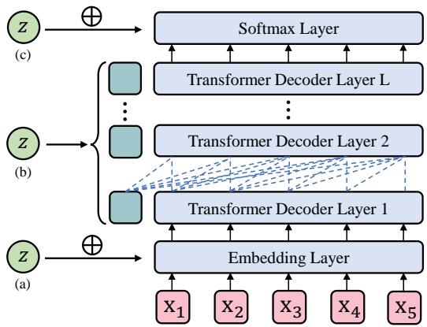
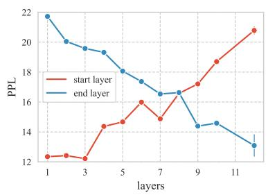
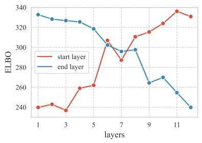
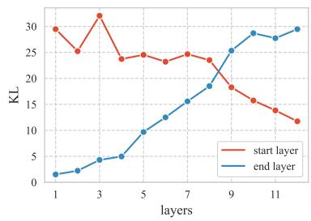
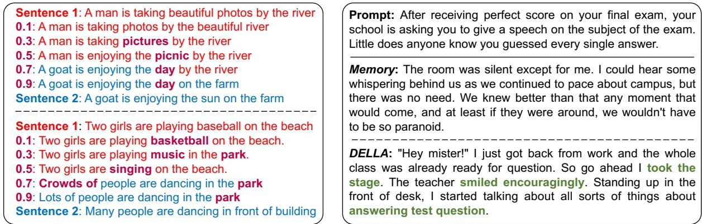
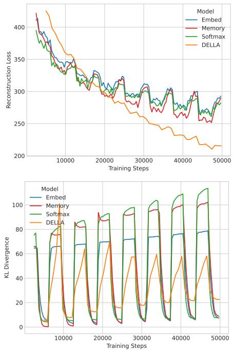
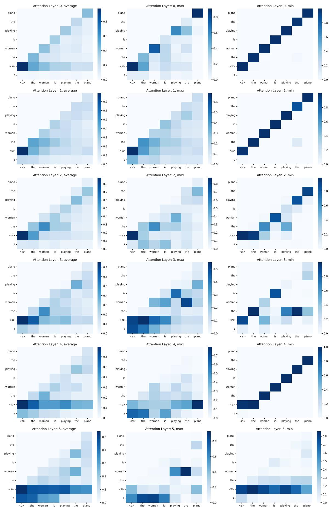
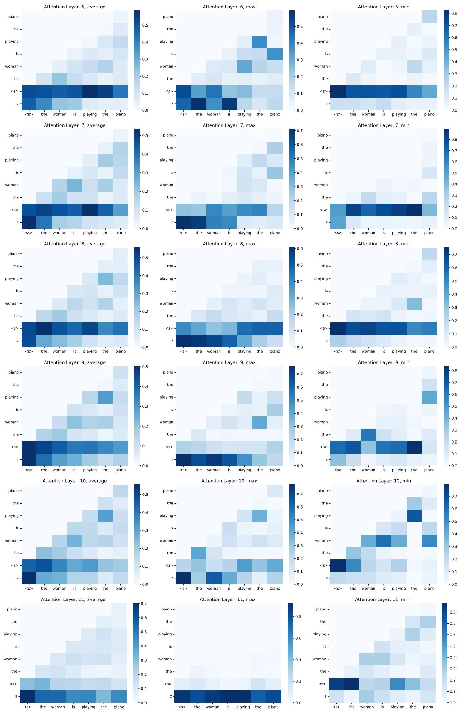

# Fuse It More Deeply! A Variational Transformer with Layer-Wise Latent Variable Inference for Text Generation

Jinyi Hu1,2,3, Xiaoyuan Yi⁵, Wenhao Li1,2,3, Maosong Sun1,2,3,4\* Xing Xie⁵

1 Department of Computer Science and Technology, Tsinghua University, Beijing, China

2 Beijing National Research Center for Information Science and Technology

3 Institute for Artificial Intelligence, Tsinghua University, Beijing, China

4 International Innovation Center of Tsinghua University, Shanghai, China

5 Microsoft Research Asia

hu-jy21@mails.tsinghua.edu.cn,xiaoyuanyi@microsoft.com

## Abstract

The past several years have witnessed Variational Auto-Encoder's superiority in various text generation tasks. However, due to the sequential nature of the text, auto-regressive decoders tend to ignore latent variables and then reduce to simple language models, known as the KL vanishing problem, which would further deteriorate when VAE is combined with Transformer-based structures. To ameliorate this problem, we propose DELLA, a novel variational Transformer framework. DELLA learns a series of layer-wise latent variables with each inferred from those of lower layers and tightly coupled with the hidden states by low-rank tensor product. In this way, DELLA forces these posterior latent variables to be fused deeply with the whole computation path and hence incorporate more information. We theoretically demonstrate that our method can be regarded as entangling latent variables to avoid posterior information decrease through layers, enabling DELLA to get higher nonzero KL values even without any annealing or thresholding tricks. Experiments on four unconditional and three conditional generation tasks show that DELLA could better alleviate KL vanishing and improve both quality and diversity compared to several strong baselines.

## 1 Introduction

Variational Autoencoder (VAE) (Kingma and Welling, 2014; Rezende et al., 2014) has proven to be successful in generating various kinds of text, such as stylistic text (Hu et al., 2017; John et al., 2019), dialogue (Zhao et al., 2017), story (Yu et al., 2020) and poetry (Yi et al., 2020). The sequential nature of the text leads to typically used autoregressive decoders in VAE for language generation. However, such strong decoders tend to evade the difficulty of learning meaningful latent codes by heavily relying on previously generated words and hence ignore latent variables (Bowman et al., 2016), known as KL vanishing or posterior collapse. This problem causes two drawbacks: (a) the posterior distribution quickly turns into the prior one (usually standard Gaussian), falling to build expressive latent representations; (b) the decoder reduces to a naive language model, resulting in monotonous generated text (Fu et al., 2019).

  
Figure 1: Existing paradigms of Transformer VAE.

To ameliorate this problem, researchers have designed various techniques. Among them, three broadly used methods include weakening decoders (Bowman et al., 2016; Semeniuta et al., 2017; Zhao et al., 2017), KL annealing (Bowman et al., 2016; Fu et al., 2019) and KL threshold (Kingma et al., 2016; Higgins et al., 2017; Li et al., 2019). Nonetheless, the weakening of decoders restrains models' language modelling capability; annealing hyperparameters are hard to tune; KL threshold introduces a non-smooth objective with some optimization difficulties.

In the era of RNN, VAE can be easily incorporated by using the latent variable as the initial decoder state, while how to combine VAE with recently prevalent Transformer (Vaswani et al., 2017) architectures, which have made a breakthrough in text generation, still remains an open challenge.

As shown in Fig.1, existing methods of integrating Transformer into VAE fall into three main paradigms: (a) directly adding latent variables to input token embeddings (abbr. Embedding) (Li et al., 2020a); (b) using latent variables as a separate memory token vector to be attended by selfattention in each layer (abbr. Memory) (Fang et al., 2021); (c) combining latent variables with the last-layer decoder states before output softmax (abbr. Softmax) (Wang and Wan, 2019). However, paradigm (a) brings noise for self-attention. In paradigm (b), memory vectors tend to be ignored by attention, even exacerbating KL vanishing. In paradigm (c), latent variables couldn't deeply interfere with the whole computation path. Sec.3.3 presents more detailed analyses.

To better incorporate Transformer into VAE and theoretically ameliorate the KL vanishing problem, we propose DELLA¹, a novel variational transformer framework. DELLA learns a series of layerwise latent variables in a Transformer encoder, and each is inferred from those of lower layers and then tightly coupled with the hidden states in the corresponding decoder layer by low-rank tensor product. Our method theoretically stimulates the entanglement of latent variables and hence allows propagation of undiminished latent information through layers. As a result, DELLA forces posterior latent variables to be deeply fused with the entire computation path and encode richer information of input text, achieving higher KL values even without any annealing or threshold training tricks.

In summary, our contributions are as follow: (i) We are the first to propose layer-wise inferred latent variables in Transformer-based architecture to mitigate KL vanishing; We (ii) innovatively inject latent variables using low-rank tensor product, (iii) provide a theoretical validity of our method and (iv) demonstrate its effectiveness on four unconditional and three conditional generation tasks. Our codes are available at https://github.com/OpenVLG/DELLA.git.

## 2 Related Work

Thanks to the representation capacity of latent space, VAE has been widely adopted for both image generation (van den Oord et al., 2017; Vahdat and Kautz, 2020) and text generation (Bowman et al., 2016; Hu et al., 2017). In the early stage, VAE was combined with RNN decoders for generating a broad range of text, varying from dialogue (Serban et al., 2016), image caption (Wang et al., 2017), text summarization (Gupta et al., 2017) to story (Yu et al., 2020) and poetry (Yi et al., 2020). In this case, latent variables are usually utilized as either the initial decoder state (Li et al., 2018) or input at each time step (Gupta et al., 2017).

In spite of extensive applications, VAE suffered from KL vanishing in the scenario of text generation (Bowman et al., 2016). Several lines of techniques have been proposed to alleviate this problem. The first line is to avoid a too fast decrease of the KL divergence by re-weighting. KL annealing (Bowman et al., 2016) linearly increased the weight of KL term from 0 to 1 during the warm-up period. Fu et al. (2019) further proposed cyclical annealing, which repeats the warm-up process multiple times. The second line guarantees a positive lower bound of the KL term. KL thresholding (Kingma et al., 2016) achieved a fixed minimum by combining a hinge loss, while BN-VAE (Zhu et al., 2020) learned more flexible ones via batch normalization. δ-VAE (Razavi et al., 2019) chose to restrain the family of posterior distributions. The third line aims to constraint decoders to force a more informative latent variable. Wang et al. (2017) introduced an auxiliary BOW (bag-of-words) loss. He et al. (2019) added additional training loops for the encoder. Yang et al. (2017) adopted dilated CNN as decoder, and Dieng et al. (2019) added skip connections to the decoder. Although the above methods mitigate KL vanishing to some extent, it is still challenging for either tuning or optimization.

In these years, the powerful Transformer has been integrated with VAE to benefit diverse tasks, including text classification (Gururangan et al., 2019), story generation (Wang and Wan, 2019; Fang et al., 2021) and dialogue generation (Lin et al., 2020). Optimus (Li et al., 2020a) further bridged the pre-trained BERT (Devlin et al., 2019) and GPT-2 (Radford et al., 2019) with VAE for pre-training. Most existing works inject latent variables into the Transformer decoder by the three paradigms, Embedding (Li et al., 2020a), Memory (Li et al., 2020a; Fang et al., 2021) and Softmax(Wang and Wan, 2019), as discussed in Sec. 1, while these methods shallowly fuse the latent variables with hidden states. To achieve deeper fusion and ameliorate KL vanishing, we propose DELLA.

The most relevant architecture to our model is hierarchical VAE (Sønderby et al., 2016; Klushyn et al., 2019; Vahdat and Kautz, 2020; Child, 2020), which is mainly designed for image generation and not suitable for text. For text generation, hierarchical latent variables are either independent of each other (Serban et al., 2016), or corresponding to different text granularities (sentence or word level), while our DELLA learns conditionally inferred and layer-wise latent variables based on Transformer.

## 3 Preliminaries

## 3.1 Transformer

Transformer (Vaswani et al., 2017) represents an input sequence $\pmb { x } = \{ x _ { 1 } , \ldots , x _ { i } , \ldots , x _ { n } \}$ as contextualized distributed hidden states $\begin{array} { r l } { h } & { { } = } \end{array}$ $\{ h _ { 1 } , \ldots , h _ { i } , \ldots , h _ { n } \}$ by a series of stacked layers, and states in the l-th layer, $\mathbf { \Omega } _ { h } ( l )$ , are calculated with scaled dot-product attention:

$$
{ \mathrm { A t t e n t i o n } } ( Q , K , V ) = { \mathrm { s o f t m a x } } \left( { \frac { Q ^ { T } K } { \sqrt { d } } } \right) V ^ { T } ,\tag{1}
$$

where $Q , K , V$ stand for Query, Key, Value, respectively, which are projected from outputs of the previous layer: $Q = \mathbf { \bar { \it W } } ^ { q } \mathbf { \bar { \it h } } ^ { ( l - 1 ) } , K = \mathbf { \bar { \it W } } ^ { k } \mathbf { \it { h } } ^ { ( l - 1 ) }$ ${ \bar { V } } = W ^ { v } { \ h } ^ { ( l - 1 ) }$ . d is the dimension of hidden states. In practice, multiple groups of states are calculated with different attention parameters and then concatenated, known as multi-head attention

## 3.2 VAE

As a kind of generative model, VAE estimates the intractable data distribution $p ( { \pmb x } )$ by deriving and maximizing its lower bound as:

$$
\begin{array} { r l } & { \log p ( \pmb { x } ) \ge \mathcal { L } _ { E L B O } ( \pmb { x } ; \pmb { \theta } , \phi ) = } \\ & { \mathbb { E } _ { q _ { \phi } ( z | \pmb { x } ) } [ \log p _ { \pmb { \theta } } ( \pmb { x } | z ) ] - \mathrm { K L } ( q _ { \phi } ( z | \pmb { x } ) | | p ( z ) ) , } \end{array}\tag{2}
$$

where z is the latent variable and $p ( z )$ is the prior distribution of latent variable which is commonly assumed as standard Gaussian; the posterior distribution $p ( \boldsymbol { z } | \boldsymbol { x } )$ is approximated by an inference network (encoder) $q _ { \phi } ( z | \mathbf { x } ) ; p _ { \theta } ( \mathbf { x } | z )$ is a generator (decoder) to generate text x from the latent variable $z ; \theta$ and $\phi$ are corresponding parameters.

The whole lower bound in $\operatorname { E q . } ( 2 )$ , called Evidence Lower BOund (ELBO), consists of two terms: the reconstruction loss,

$$
\begin{array} { r } { \mathcal { L } _ { E } = - \mathbb { E } _ { q _ { \phi } ( z | x ) } \left[ \log p _ { \theta } ( x | z ) \right] , } \end{array}\tag{3}
$$

which helps reconstruct the input given the posterior latent variable z, and the KL divergence,

$$
\begin{array} { r } { \mathcal { L } _ { R } = \mathrm { K L } \left( q _ { \phi } ( \boldsymbol { z } | \boldsymbol { x } ) \| p ( \boldsymbol { z } ) \right) . } \end{array}\tag{4}
$$

In practice, VAE is considered as a regularized Auto-encoder, and a hyper-parameter $\beta$ is introduced to control the strength of KL, $\beta { \cal { L } } _ { R } .$ usually used in KL annealing methods (Fu et al., 2019).

## 3.3 Incorporate Transformer into VAE

For Transformer encoder, the posterior z is mapped from the text representation, which can be the pooling of all hidden states in the last layer (Fang et al., 2021), or state of a special token (Li et al., 2020a), $e . g .$ , [CLS]. Then z is injected into Transformer decoder by the paradigms discussed in Sec. 1.

Now we take a further step and investigate why intrinsically these three paradigms, namely Embedding, Memory and Softmax, would perform poorly.

Embedding: Define $e _ { i } , e _ { j }$ as two token embeddings and $\alpha _ { i , j }$ as the attention weight of i-th and j-th tokens. From Eq.(1), we have $\alpha _ { i , j } =$ $( W ^ { q } e _ { i } ) ^ { T } ( W ^ { k } e _ { j } ) ~ = ~ e _ { i } ^ { T } ( W ^ { q } ) ^ { T } W ^ { k } e _ { j }$ , which is further abbreviated as $\langle e _ { i } , e _ { j } \rangle$ . Such Embedding paradigm directly adds z to token embeddings as:

$$
\begin{array} { c } { { \alpha _ { i , j } ^ { \prime } = \left[ W ^ { q } ( e _ { i } + z ) \right] ^ { T } \left[ W ^ { k } ( e _ { j } + z ) \right] } } \\ { { = \langle e _ { i } , e _ { j } \rangle + \langle e _ { i } , z \rangle + \langle z , e _ { j } \rangle + \langle z , z \rangle , } } \end{array}\tag{5}
$$

where we can find that a redundant term, $\langle z , z \rangle$ , is introduced, bringing extra noise for attention mechanism. Moreover, information in z could diminish with propagation through layers $( \operatorname { F i g } . 2 )$ , aggravating KL vanishing.

Memory: This paradigm treats z as an additional memory token and places it at the beginning of x to be attended by other tokens via attention. Nevertheless, as mentioned in Sec. 1, the powerful Transformer decoder may only rely on preceding decoded tokens. Consequently, with no explicit constraints $( e . g .$ , auxiliary loss), such a memory token is more likely to be ignored by self-attention (Fig. 6 & 7), even exacerbating KL vanishing.

Softmax: This paradigm first adds z to the lastlayer hidden states h, and then projects $z + h$ into a logit vector $\pmb { p } \in \mathbb { R } ^ { v }$ over the vocabulary, where v is vocab size. In this method, latent variables do not interact with hidden states until the last layer, which erodes the effect of latent variables (see Fig. 2).

## 4 Methodology

As demonstrated in Sec. 3, existing three paradigms make latent variables gradually diminish through layers, be ignored by self-attention or inadequately interact with hidden states, which would not mitigate but even worsen the KL vanishing problem.

To deeply fuse latent variables with the whole computation path of Transformer, we propose DELLA to learn a series of layer-wise posterior latent variables which are conditionally inferred in encoder, and injected into hidden states in decoder by low-rank tensor product. We present layer-wise latent variables in Sec. 4.1, describe the tensor product fusion in Sec. 4.2, give the theoretical verification of DELLA's effectiveness for ameliorating KL vanishing in Sec. 4.3, and then extend DELLA to Conditional VAE (CVAE) in Sec. 4.4.

## 4.1 Layer-wise Latent Variables

Different from previous work where only one latent variable z is calculated and shared by (Li et al., 2020a) or projected to (Fang et al., 2021) decoder layers, we involve a series of latent variables $z =$ $\{ z _ { 1 } , z _ { 2 } , \dots , z _ { L } \}$ , where $L$ is the number of Transformer layers. Then we reformulate the prior and posterior distributions as $\begin{array} { r } { p ( z ) = \prod _ { l = 1 } ^ { L } p ( z _ { l } | z _ { < l } ) } \end{array}$ $\begin{array} { r } { q ( \boldsymbol { z } | \mathbf { x } ) = \prod _ { l = 1 } ^ { L } q ( z _ { l } | \boldsymbol { z } _ { < l } , \pmb { x } ) } \end{array}$ , respectively, with each $_ { z _ { l } }$ still following Gaussian distribution. Then we rewrite $\mathcal { L } _ { R }$ in Eq.(4) similar to Vahdat and Kautz (2020):

$$
\begin{array} { r l } & { \quad \mathcal { L } _ { R } = \mathrm { K L } ( q ( \boldsymbol { z } | \boldsymbol { x } ) | | p ( \boldsymbol { z } ) ) } \\ & { = \displaystyle \sum _ { l = 1 } ^ { L } \mathbb { E } _ { q ( \boldsymbol { z } < \boldsymbol { l } | \boldsymbol { x } ) } \left[ \mathrm { K L } ( q ( \boldsymbol { z } _ { l } | \boldsymbol { x } , \boldsymbol { z } _ { < l } ) | | p ( \boldsymbol { z } _ { l } | \boldsymbol { z } _ { < l } ) ) \right] . } \end{array}\tag{6}
$$

When $l = 1 , p ( z _ { 1 } | z _ { < 1 } ) = p ( z _ { 1 } )$ is the standard Gaussian distribution, $q ( z _ { 1 } | \pmb { x } , z _ { < 1 } ) = q ( z _ { 1 } | \pmb { x } )$ We give detailed derivations in Appendix B.1.

These latent variables $_ { z _ { l } }$ are calculated (inferred) layer by layer using representations of the corresponding layer. Concretely, in l-th layer, we use the hidden state of the first token in text x, as its l-thlayer representation, denoted as $\pmb { x } ^ { ( l ) } \in \mathbb { R } ^ { d } .$ , where d is hidden size. Then we represent latent variables in lower layers as $z _ { < l }$ and obtain it by:

$$
z _ { < l } = \operatorname { t a n h } ( W _ { h h } ^ { ( l ) } z _ { < l - 1 } + W _ { i h } ^ { ( l ) } z _ { l - 1 } ) ,\tag{7}
$$

where $W _ { h h } , W _ { i h } \in \mathbb { R } ^ { p \times p } , \operatorname { s o } { z _ { < l } } \in \mathbb { R } ^ { p }$ and $p$ is the dimension of latent variable. $z _ { \mathrm { 0 } }$ and $\scriptstyle z _ { < 0 }$ are set as zero vector. We calculate the mean and variance vectors of $p ( z _ { l } | \boldsymbol { z } _ { < l } )$ and $q ( z _ { l } | \boldsymbol { z } _ { < l } , \boldsymbol { x } )$ by:

$$
\begin{array} { r l } & { \left( \begin{array} { c } { \pmb { \mu } _ { p } } \\ { \log ( \pmb { \sigma } _ { p } ^ { 2 } ) } \end{array} \right) = \pmb { W } _ { p } ^ { ( l ) } \pmb { z } _ { < l } , } \\ & { \left( \begin{array} { c } { \pmb { \mu } _ { q } } \\ { \log ( \pmb { \sigma } _ { q } ^ { 2 } ) } \end{array} \right) = \pmb { W } _ { q } ^ { ( l ) } \left( \pmb { z } _ { < l } \pmb { \chi } \right) , } \end{array}\tag{8}
$$

where $W _ { p } \in \mathbb { R } ^ { p \times { 2 p } } , W _ { p } \in \mathbb { R } ^ { p \times { 2 p } }$

The latent variable $_ { z _ { l } }$ is sampled from the posterior distribution $q ( z _ { l } | z _ { < l } , \pmb { x } ) \ = \ \mathcal { N } ( \pmb { \mu } _ { q } , \pmb { \sigma } _ { q } ^ { 2 } { \pmb { I } } )$ for training, and from the prior one $q ( z _ { l } | \pmb { z } _ { < l } ) =$ $\mathcal { N } ( \mu _ { p } , \sigma _ { p } ^ { 2 } I )$ for testing. Since hidden states in each layer belong to different vector spaces, the parameters to calculate each $\mathfrak { z } _ { < l } , e . g . , \mathbf { W } _ { p } ^ { ( l ) }$ and ${ W } _ { q } ^ { ( l ) }$ , do not share throughout different layers.

## 4.2 Low-rank Tensor Product

We inject the latent variable $z _ { l }$ , which is obtained based on l-th encoder layer, into the corresponding l-th decoder layer. Instead of simply using $_ { z _ { l } }$ as a memory token as discussed in Sec. 3.3, we resort to low-rank tensor product, which has been successfully utilized for fusing multimodal representations (Liu et al., 2018), to deeply fuse latent variables with hidden states in the decoder.

In detail, we conduct low-rank tensor product on $_ { z _ { l } }$ and $\textstyle { \pmb { x } } _ { i } ^ { \prime } \mathbf { s } \ l .$ -th-layer value vector $\mathbf { \boldsymbol { v } } _ { i } ^ { ( l ) }$ as:

$$
\widetilde { \pmb { v } } _ { i } ^ { ( l ) } = ( \sum _ { j = 1 } ^ { r } W _ { v } ^ { ( l , j ) } \pmb { v } _ { i } ^ { ( l ) } ) \circ ( \sum _ { j = 1 } ^ { r } W _ { z } ^ { ( l , j ) } z _ { l } ) ,\tag{9}
$$

where $r$ is a hyper-parameter, o means elementwise multiplication, $\pmb { W } _ { v } \in \mathbb { R } ^ { d \times d } . \pmb { W } _ { z } \in \mathbb { R } ^ { p \times d }$ are learnable parameters which are shared across all positions (i) but not shared with layers (l), considering distinct vector spaces in different layers, as mentioned in Sec. 4.1. Then the fused Value $\widetilde { V } ^ { ( l ) } = \{ \widetilde { \pmb { v } } _ { 1 } ^ { ( l ) } , \dots , \widetilde { \pmb { v } } _ { n } ^ { ( l ) } \}$ is used in Eq.(1)

In this way, layer-wise $z _ { l }$ is conditionally inferred from latent variables in previous encoder layers, together with l-th-layer text representation, and then explicitly fused with the corresponding decoder layer, yielding a deeper intervention throughout the whole computation path of Transformer.

## 4.3 Why Could DELLA Work Well?

To theoretically interpret the advantage of layerwise latent variables which contributes most to DELLA (Table 4), we give the following theorem:

Theorem 1 For an observation x and a sequence of latent variables $z _ { 1 } , z _ { 2 } , \dotsc z _ { L }$ satisfying $\begin{array} { r } { p ( z ) ~ = ~ \prod _ { l = 1 } ^ { L } p ( z _ { l } | z _ { < l } ) } \end{array}$ , and $q ( { \boldsymbol { z } } | { \boldsymbol { x } } ) ~ =$ $\begin{array} { r } { \prod _ { l = 1 } ^ { L } q ( z _ { l } | \boldsymbol { z } _ { < l } , \pmb { x } ) } \end{array}$ , then the expectation of the KL term, ${ \mathbb E } _ { p ( { \pmb x } ) } [ { \pmb \mathcal { L } } _ { R } ]$ is an upper bound of:

$$
- \sum _ { i = 2 } ^ { L - 1 } I ( z _ { L } ; \ldots ; z _ { i } | z _ { i - 1 } ) - I ( z _ { L } ; \ldots ; z _ { 1 } | x ) ,\tag{10}
$$

where I is the interaction information2.

See Appendix B.2 for proof. Based on Theorem 1, minimizing $\mathcal { L } _ { R }$ approximatively means maximizing each interaction information term in Eq.(10), which forces the entanglement of all latent varibles $z _ { 1 } ; \dots ; z _ { L }$ given the observation x, alleviating the diminishing of information encoded in latent variables when propagating through layers.

## 4.4 Extension to CVAE

DELLA could also be applied to CVAE for conditional generation tasks like storytelling. Given an observation x and its condition $^ { c , }$ we can optimize:

$$
\begin{array} { r } { \log p ( { \pmb x } | { \pmb c } ) \geq \mathbb { E } _ { q _ { \phi } ( { \pmb z } | { \pmb x } , { \pmb c } ) } [ \log p _ { \pmb \theta } ( { \pmb x } | { \pmb z } , { \pmb c } ) ] } \\ { - \mathrm { K L } ( q _ { \phi } ( { \pmb z } | { \pmb x } , { \pmb c } ) | | p ( { \pmb z } | { \pmb c } ) ) , } \end{array}\tag{11}
$$

and then replace the prior distribution $q ( \boldsymbol { z } _ { l } | \mathbf { x } , \boldsymbol { z } _ { < l } )$ and posterior distribution $p ( z _ { l } | \boldsymbol { z } _ { < l } )$ in Eq.(6) with $q ( z _ { l } | \mathbf { x } , \mathbf { c } , z _ { < l } )$ and $p ( z _ { l } | \boldsymbol { z } _ { < l } , \boldsymbol { c } )$ , respectively.

In this case, we encode the condition c with the same encoder. Similarly, we can obtain the representation of c at l-th layer, denoted as $\boldsymbol { c } ^ { ( l ) } \in$ $\mathbb { R } ^ { \bar { d } }$ , and then calculate the mean and log variance of $p ( z _ { l } | \boldsymbol { z } _ { < l } , \boldsymbol { c } )$ and $q ( z _ { l } | z _ { < l } , \pmb { x } , \pmb { c } )$ by:

$$
\left( \begin{array} { c } { { \pmb { \mu } _ { p } } } \\ { { \log ( \pmb { \sigma } _ { p } ^ { 2 } ) } } \end{array} \right) = \hat { \pmb { W } } _ { p } ^ { ( l ) } \left( { \pmb { z } _ { < l } } \atop { \pmb { c } ^ { ( l ) } } \right) ,
$$

$$
\left( { \bf \Pi } _ { \log \left( { \pmb \sigma } _ { q } ^ { 2 } \right) } ^ { \pmb \mu _ { q } } \right) = \hat { W } _ { q } ^ { ( l ) } \left( { \pmb x } _ { } ^ { ( l ) } \right) ,\tag{12}
$$

where $\hat { \pmb W } _ { p } ^ { ( l ) } \in \mathbb { R } ^ { ( p + d ) \times 2 p } , \hat { \pmb W } _ { q } ^ { ( l ) } \mathbb { R } ^ { ( p + 2 d ) \times 2 p } .$

## 5 Experiment

## 5.1 Dataset

We consider four datasets for language modelling and unconditional generation, including the Yelp, and Yahoo (Yang et al., 2017; He et al., 2019), Penn Treebank (PTB) (Marcus et al., 1993), and SNLI (Bowman et al., 2015), and three datasets for conditional generation tasks, including summarization generation with CNN/DailyMail (CNN/DM) (See et al., 2017), story generation with WritingPrompts (WP) (Fan et al., 2018) and paraphrase generation with Quora³. Detailed data statistics are listed in Table 7. Due to the limited computation capability, we use 165,157 samples in CNN/DM and 22,2614 in WP with the max length of 900 for training.

## 5.2 Implementation Details

We use pretrained language models as the backbone and fine-tune them on each task mentioned above with our DELLA as in (Li et al., 2020a). For unconditional generation and story generation, encoder and decoder shared the same parameters initialized with 12-layer GPT-2 (Radford et al., 2019). For summarization and paraphrase generation, parameters are not shared and initialized with BART-base (Lewis et al., 2020). We set the dimension of latent variable as 32 for all VAE-based models and use cyclical annealing for training, following (Li et al., 2020a). More details are given in Appendix A.1.

## 5.3 Baseline

We make a comprehensive comparison with strong Transformer-based baselines. We do not consider RNN-based models that are inferior to Transformer for text generation as shown in (Li et al., 2020a).

Finetuned Pretrained Models. To manifest the suitability of DELLA for different pretrained language models, we compare it with fine-tuned GPT2 on unconditional generation and story generation, and with fine-tuned BART-base on summarization generation and paraphrase generation.

Optimus (Li et al., 2020a): a large-scale VAE model which takes a pre-trained BERT as encoder and pretrained GPT-2 as decoder. This model is first pretrained as a VAE, which simultaneously utilizes the two paradigms, Embedding and Memory as introduced in Sec. 3.3, for injecting latent variables, with both KL annealing and KL threshold tricks, and then fine-tuned on downstream tasks.

Transformer-based VAE. Besides Optimus, we also compre the three paradigms, namely Embedding (Li et al., 2020a), Memory (Fang et al., 2021) and Softmax (Wang and Wan, 2019), and incorporate each paradigm into the same pre-trained model as DELLA on each dataset for fair comparison.

## 5.4 Metrics

For unconditional generation tasks, we consider three types of metrics. (a) Representation Learning Capability: we report PPL, ELBO, KL, mutual information (MI) (Alemi et al., 2016) and activate units (AU) (Burda et al., 2016). These metrics measure VAE's ability to mitigate KL vanishing and learn meaningful representations. Different from traditional language models like GPT-2, VAEbased models could not produce exact PPL due to randomness, so we use importance-weighted samples to estimate PPL, following He et al. (2019). We set the threshold in AU to 0.2 to further distinguish different models. (b) Generation Quality: we report BLEU (Papineni et al., 2002), CND (Li et al., 2020b) and MAUVE (Pillutla et al., 2021). CND and MAUVE measure the divergence between human-authored text and the generated one. (c) Generation Diversity: we report Self-BLEU (Zhu et al., 2018), Dist (Li et al., 2016) and JS (Jaccard similarity) (Wang and Wan, 2018) to assess the diversity and novelty of generated text.

<table><tr><td rowspan="2">Model</td><td colspan="5">Representation Learning</td><td colspan="3">Generation Quality</td><td colspan="3">Generation Diversity</td></tr><tr><td>PPL↓</td><td>ELBO↓</td><td>KL↑</td><td>MI↑</td><td>AU↑</td><td>BLEU↑</td><td>CND↓</td><td>MAUVE↑</td><td>SB↓</td><td>Dist↑</td><td>JS↓</td></tr><tr><td colspan="10">Dataset: Yelp</td></tr><tr><td>GPT-2 Optimus</td><td>22.13 22.79</td><td>344.10</td><td>15.09</td><td>7.67</td><td>1</td><td>56.92</td><td>0.68</td><td>0.12</td><td>65.90</td><td>17.96</td><td>0.51</td></tr><tr><td>Embed</td><td>19.98</td><td>327.28</td><td>4.77</td><td>4.14</td><td>6</td><td>56.34</td><td>0.31</td><td>0.42</td><td>65.27</td><td>15.59</td><td>0.44</td></tr><tr><td>Memory</td><td>19.95</td><td>326.60 328.13</td><td>5.70 7.50</td><td>5.30 6.29</td><td>11 13</td><td>57.37 56.83</td><td>0.27 0.30</td><td>0.46 0.45</td><td>63.90 64.26</td><td>16.91 16.51</td><td>0.39 0.40</td></tr><tr><td>Softmax DELLA</td><td>20.14 12.35</td><td>239.83</td><td>29.47</td><td>10.78</td><td>23</td><td>57.15</td><td>0.13</td><td>0.55</td><td>60.02</td><td>17.63</td><td>0.43</td></tr><tr><td colspan="10">Dataset: Yahoo</td></tr><tr><td>GPT-2</td><td>24.17</td><td></td><td>17.45</td><td>8.85</td><td>-</td><td>44.25</td><td>0.55</td><td>0.15</td><td>54.06</td><td>21.07</td><td>0.28</td></tr><tr><td>Optimus Embed</td><td>23.11 22.18</td><td>293.34 286.85</td><td>3.63</td><td>3.03</td><td>一 3</td><td>42.27</td><td>0.45</td><td>0.31</td><td>54.15</td><td>20.80</td><td>0.32</td></tr><tr><td>Memory</td><td>22.03</td><td>285.47</td><td>4.87</td><td>4.62</td><td>18</td><td>45.20</td><td>0.46</td><td>0.37</td><td>54.59</td><td>21.87</td><td>0.33</td></tr><tr><td>Softmax</td><td>22.35</td><td>287.44</td><td>6.35</td><td>5.52</td><td>19</td><td>44.28</td><td>0.44</td><td>0.34</td><td>54.49</td><td>21.65</td><td>0.32</td></tr><tr><td>DELLA</td><td>11.49</td><td>201.34</td><td>27.84</td><td>12.31</td><td>21</td><td>44.67</td><td>0.19</td><td>0.38</td><td>48.53</td><td>21.88</td><td>0.31</td></tr><tr><td></td><td></td><td></td><td></td><td></td><td></td><td></td><td></td><td></td><td></td><td></td><td></td></tr></table>

Table 1: Evaluation results for language modelling and unconditional generation. Results of Optimus are directly copied from the original paper with λ = 0.5. SB means Self-BLEU.

For conditional generation tasks, we report BLEU, Rouge-1, Rouge-2, Rouge-L (Lin and Hovy, 2002), and BERTScore (Zhang et al., 2020) to evaluate the quality of generated texts, as well as the same diversity metrics used in unconditional generation. We also report KL and AU value to present representation learning capability. More details of metrics are provided in Appendix A.3.

## 5.5 Results

## 5.5.1 Unconditional Generation

We present results on Yelp and Yahoo in Table 1 and leave the those on PTB and SNLI in the Appendix A.5 due to space limitations. We also show the learning curves of ELBO and KL in Fig. 5.

As shown in Table 1, DELLA achieves notably improvement on almost all the metrics, especially superior on representation learning metrics. Much higher KL, MI and AU, and a big gap in PPL obtained by DELLA indicate the latent variables encode more meaningful text information and won't diminish when propagating through Transformer layers, which strongly supports our motivation that fusing latent variables with hidden states more deeply could effectively alleviate the KL vanishing problem. Such results also empirically verify the theoretical advantage of our model (Theorem 1), demonstrating entangled layer-wise latent variables can preserve more encoded knowledge for decoder. We will show that z can involve more information when injected into more layers in Sec. 5.8.

Besides, DELLA also gets good performance (comparable BLEU and much better CND and MAUVE) on generation quality. With more informative latent variables, DELLA could achieve a better ELBO and hence further boost the learning of data distribution p(x) in Eq.(2), leading to satisfactory quality of generated texts.

Generally, DELLA also outperforms baseline models on generation diversity. The reason is twofold: randomly sampled latent variables z should bring diversity, while the VAE-based baselines tend to ignore z as mentioned before, losing some randomness. In contrast, latent variables are deeply fused in DELLA, maintaining enough randomness. Besides, each latent variable is sampled in corresponding layer, and thus such a sampling process accumulates and enhances randomness, further benefiting diversity while keeping good quality.

## 5.5.2 Conditional Generation

We report the results of WP and CNN/DM in Table 2, and leave those of Quora in Appendix A.5. As we can see, DELLA performs better on most quality metrics, but gets a little worse on diversity compared to GPT-2. This is because GPT-2 may produce some ill-formed contents which improve’ diversity by cheating the metrics but also lead to much worse quality (lower BLEU and Rouge). Even so, on both WP and CNN/DM, DELLA still beats all previous VAE paradigms in diversity, manifesting the effectiveness of our DELLA.

<table><tr><td rowspan=2 colspan=11>KL↑ AU↑BERTScore↑SB↓Dist↑JS↓BLEU↑ Rouge-1↑ Rouge-2↑ Rouge-L↑Dataset: WritingPrompts</td></tr><tr><td rowspan=1 colspan=1>BLEU↑</td><td rowspan=1 colspan=1>Rouge-1↑</td><td rowspan=1 colspan=1>Rouge-2↑</td><td rowspan=1 colspan=1>Rouge-L↑</td><td rowspan=1 colspan=1>BERTScore↑</td><td rowspan=1 colspan=3>SB↓ Dist↑  JS ↓</td></tr><tr><td rowspan=1 colspan=1>GPT-2</td><td rowspan=1 colspan=1>27.89</td><td rowspan=1 colspan=1>27.72</td><td rowspan=1 colspan=1>7.96</td><td rowspan=1 colspan=1>14.30</td><td rowspan=1 colspan=1>78.12</td><td rowspan=1 colspan=1>53.78</td><td rowspan=1 colspan=1>22.99</td><td rowspan=1 colspan=1>0.51</td><td rowspan=1 colspan=1></td><td rowspan=1 colspan=1>-</td></tr><tr><td rowspan=1 colspan=1>Embed</td><td rowspan=1 colspan=1>39.67</td><td rowspan=1 colspan=1>36.17</td><td rowspan=1 colspan=1>7.96</td><td rowspan=1 colspan=1>15.78</td><td rowspan=1 colspan=1>81.64</td><td rowspan=1 colspan=1>64.55</td><td rowspan=1 colspan=1>14.31</td><td rowspan=1 colspan=1>0.73</td><td rowspan=1 colspan=1>2.35</td><td rowspan=1 colspan=1>3</td></tr><tr><td rowspan=1 colspan=1>Memory</td><td rowspan=1 colspan=1>40.79</td><td rowspan=1 colspan=1>36.13</td><td rowspan=1 colspan=1>8.04</td><td rowspan=1 colspan=1>16.16</td><td rowspan=2 colspan=1>81.6881.75</td><td rowspan=2 colspan=1>67.5667.02</td><td rowspan=2 colspan=1>12.9013.08</td><td rowspan=2 colspan=1>0.800.78</td><td rowspan=2 colspan=1>0.070.32</td><td rowspan=1 colspan=1>0</td></tr><tr><td rowspan=1 colspan=1>Softmax</td><td rowspan=1 colspan=1>41.04</td><td rowspan=1 colspan=1>36.14</td><td rowspan=1 colspan=1>8.12</td><td rowspan=1 colspan=1>16.30</td><td rowspan=1 colspan=1>0</td></tr><tr><td rowspan=1 colspan=1>DELLA</td><td rowspan=1 colspan=1>41.39</td><td rowspan=1 colspan=1>35.46</td><td rowspan=1 colspan=1>8.78</td><td rowspan=1 colspan=1>17.20</td><td rowspan=1 colspan=1>81.77</td><td rowspan=1 colspan=1>56.28</td><td rowspan=1 colspan=1>20.91</td><td rowspan=1 colspan=1>0.60</td><td rowspan=1 colspan=1>28.14</td><td rowspan=1 colspan=1>8</td></tr><tr><td rowspan=1 colspan=11>Dataset: CNN/DM</td></tr><tr><td rowspan=1 colspan=1>Bart-base</td><td rowspan=1 colspan=1>48.74</td><td rowspan=1 colspan=1>41.33</td><td rowspan=1 colspan=1>19.82</td><td rowspan=1 colspan=1>29.63</td><td rowspan=1 colspan=1>87.75</td><td rowspan=1 colspan=1>29.94</td><td rowspan=1 colspan=1>43.68</td><td rowspan=1 colspan=1>0.10</td><td rowspan=1 colspan=1>-</td><td rowspan=1 colspan=1>-</td></tr><tr><td rowspan=1 colspan=1>Embed</td><td rowspan=1 colspan=1>44.10</td><td rowspan=1 colspan=1>40.43</td><td rowspan=1 colspan=1>19.41</td><td rowspan=1 colspan=1>29.43</td><td rowspan=1 colspan=1>87.60</td><td rowspan=1 colspan=1>29.60</td><td rowspan=1 colspan=1>44.04</td><td rowspan=1 colspan=1>0.10</td><td rowspan=1 colspan=1>0.0</td><td rowspan=1 colspan=1>0</td></tr><tr><td rowspan=1 colspan=1>Memory</td><td rowspan=1 colspan=1>46.02</td><td rowspan=1 colspan=1>41.18</td><td rowspan=1 colspan=1>19.74</td><td rowspan=1 colspan=1>29.64</td><td rowspan=1 colspan=1>87.78</td><td rowspan=1 colspan=1>29.79</td><td rowspan=1 colspan=1>43.92</td><td rowspan=1 colspan=1>0.11</td><td rowspan=1 colspan=1>0.0</td><td rowspan=1 colspan=1>0</td></tr><tr><td rowspan=1 colspan=1>Softmax</td><td rowspan=1 colspan=1>44.40</td><td rowspan=1 colspan=1>40.94</td><td rowspan=1 colspan=1>19.63</td><td rowspan=1 colspan=1>29.61</td><td rowspan=1 colspan=1>87.00</td><td rowspan=1 colspan=1>29.64</td><td rowspan=1 colspan=1>44.11</td><td rowspan=1 colspan=1>0.10</td><td rowspan=1 colspan=1>0.0</td><td rowspan=1 colspan=1>0</td></tr><tr><td rowspan=1 colspan=1>DELLA</td><td rowspan=1 colspan=1>49.18</td><td rowspan=1 colspan=1>41.27</td><td rowspan=1 colspan=1>19.85</td><td rowspan=1 colspan=1>29.84</td><td rowspan=1 colspan=1>88.09</td><td rowspan=1 colspan=1>29.07</td><td rowspan=1 colspan=1>44.24</td><td rowspan=1 colspan=1>0.09</td><td rowspan=1 colspan=1>0.91</td><td rowspan=1 colspan=1>1</td></tr></table>

Table 2: Evaluation results for conditional generation.

<table><tr><td rowspan=1 colspan=4>Dataset: WritingPrompts</td></tr><tr><td rowspan=1 colspan=1>Model</td><td rowspan=1 colspan=1>Fluency</td><td rowspan=1 colspan=1>Coherence</td><td rowspan=1 colspan=1>Novelty</td></tr><tr><td rowspan=1 colspan=1>GPT2</td><td rowspan=1 colspan=1>1.83</td><td rowspan=1 colspan=1>2.12</td><td rowspan=1 colspan=1>2.50</td></tr><tr><td rowspan=3 colspan=1>EmbedMemorySoftmax</td><td rowspan=3 colspan=1>2.16</td><td rowspan=1 colspan=1>2.33</td><td rowspan=4 colspan=1>2.672.782.852.89</td></tr><tr><td rowspan=3 colspan=1>2.51</td><td rowspan=1 colspan=1>2.28</td></tr><tr><td rowspan=2 colspan=1>2.422.38</td></tr><tr><td rowspan=1 colspan=1>DELLA</td></tr><tr><td rowspan=1 colspan=4>Dataset: CNN/DM</td></tr><tr><td rowspan=1 colspan=1>Model</td><td rowspan=1 colspan=1>Informativeness</td><td rowspan=1 colspan=1>Coherence</td><td rowspan=1 colspan=1>Novelty</td></tr><tr><td rowspan=1 colspan=1>Bart-base</td><td rowspan=1 colspan=1>3.12</td><td rowspan=1 colspan=1>4.32</td><td rowspan=1 colspan=1>3.52</td></tr><tr><td rowspan=4 colspan=1>EmbedMemorySoftmaxDELLA</td><td rowspan=4 colspan=1>2.882.952.913.05</td><td rowspan=1 colspan=1>4.08</td><td rowspan=1 colspan=1>3.50</td></tr><tr><td rowspan=1 colspan=1>4.23</td><td rowspan=1 colspan=1>3.48</td></tr><tr><td rowspan=1 colspan=1>4.33</td><td rowspan=1 colspan=1>3.50</td></tr><tr><td rowspan=1 colspan=1>4.33</td><td rowspan=1 colspan=1>3.56</td></tr></table>

Table 3: Human evaluation results on conditional generation. The scores range from 1 (worst) to 5 (best). The p-value is 0.002 and Kappa score is 0.64 which indicates acceptable inter-annotator agreement.

In addition, all baselines methods suffer from severer KL vanishing problems on conditional generation tasks than on the unconditional ones. This is because the given condition text could aggravate the reliance of these models on preceding generated tokens and the condition, and therefore bypass latent variables. By contrast, DELLA could learn more informative z and hence keep a relatively higher KL value even given the condition text.

<table><tr><td rowspan=1 colspan=1>Model</td><td rowspan=1 colspan=1>PPL↓</td><td rowspan=1 colspan=1>ELBO↓</td><td rowspan=1 colspan=1>KL↑</td><td rowspan=1 colspan=1>MI↑</td><td rowspan=1 colspan=1>AU↑</td></tr><tr><td rowspan=1 colspan=1>DELLA-LTP-LW</td><td rowspan=1 colspan=1>12.3512.6819.88</td><td rowspan=1 colspan=1>239.83249.32324.45</td><td rowspan=1 colspan=1>29.4728.5220.12</td><td rowspan=1 colspan=1>10.789.777.23</td><td rowspan=1 colspan=1>232118</td></tr><tr><td rowspan=2 colspan=1>Separatel = 1 KL</td><td rowspan=1 colspan=1>14.17</td><td rowspan=1 colspan=1>286.30</td><td rowspan=1 colspan=1>28.82</td><td rowspan=1 colspan=1>9.88</td><td rowspan=1 colspan=1>16</td></tr><tr><td rowspan=1 colspan=1>12.55</td><td rowspan=1 colspan=1>266.97</td><td rowspan=1 colspan=1>0.15</td><td rowspan=1 colspan=1>0.15</td><td rowspan=1 colspan=1>0</td></tr><tr><td rowspan=1 colspan=1>l = 12 KL</td><td rowspan=1 colspan=1>12.48</td><td rowspan=1 colspan=1>263.38</td><td rowspan=1 colspan=1>0.73</td><td rowspan=1 colspan=1>0.61</td><td rowspan=1 colspan=1>0</td></tr><tr><td rowspan=1 colspan=1>Embed(384)</td><td rowspan=1 colspan=1>20.11</td><td rowspan=1 colspan=1>327.29</td><td rowspan=1 colspan=1>0.55</td><td rowspan=1 colspan=1>0.38</td><td rowspan=1 colspan=1>0</td></tr><tr><td rowspan=1 colspan=1>Memory(384)</td><td rowspan=1 colspan=1>20.09</td><td rowspan=1 colspan=1>326.24</td><td rowspan=1 colspan=1>0.46</td><td rowspan=1 colspan=1>0.25</td><td rowspan=1 colspan=1>0</td></tr><tr><td rowspan=1 colspan=1>Softmax(384)</td><td rowspan=1 colspan=1>20.15</td><td rowspan=1 colspan=1>330.24</td><td rowspan=1 colspan=1>5.04</td><td rowspan=1 colspan=1>7.15</td><td rowspan=1 colspan=1>0</td></tr></table>

Table 4: Ablation study on Yelp dataset. LTP: low-rank tensor product. LW: layer-wise latent variables. Separate: latent variables in each layer are independent. l = 1 or 4 KL means we only compute KL loss on z1 or zL, respectively. 384 means the dimension of latent variable used in baseline are $1 2 \times 3 2 = 3 8 4$

## 5.6 Human Evaluation

To better verify the effectiveness of DELLA, we also conduct human evaluation on the two conditional generation tasks. For each model, we generated 30 samples on each task, and invite 5 competent annotators to score these samples in terms of three criteria, Fluency, Coherence and Novelty for story generation, and Informativeness, Coherence and Novelty for summarization generation.

As shown in Table 3, DELLA obtains satisfactory performance in quality, and is consistently superior to all baselines on diversity and novelty. See Appendix A.4 for more detailed evaluation protocols.

## 5.7 Ablation Study

Table 4 shows the results of ablation study on Yelp. We can find both tensor product and the layer-wise latent variables benefit the learning of informative latent variables, while the latter contributes the most to DELLA. To further verify the performance gain originating from Theorem 1 instead of simply increasing the number or the dimension of latent variables, we conduct two groups of experiments.

  
Figure 2: PPL, ELBO end KL on Yelp with different numbers of latent variables. The values start layer i and end layer j means latent variables are produces and utilized only from i-th layer to the last layer, or from the first layer to j-th layer of the encoder respectively.

<table><tr><td rowspan=1 colspan=5>Model</td><td rowspan=1 colspan=2>PPL↓</td><td rowspan=1 colspan=1>ELBO↓</td><td rowspan=1 colspan=1>KL↑</td><td rowspan=1 colspan=1>MI↑</td><td rowspan=1 colspan=1>AU↑</td></tr><tr><td rowspan=2 colspan=5>Embed+BOW</td><td rowspan=1 colspan=2>22.21</td><td rowspan=1 colspan=1>339.12</td><td rowspan=1 colspan=1>0.03</td><td rowspan=1 colspan=1>0.03</td><td rowspan=1 colspan=1>0</td></tr><tr><td rowspan=1 colspan=2>19.98</td><td rowspan=1 colspan=1>326.51</td><td rowspan=1 colspan=1>2.75</td><td rowspan=1 colspan=1>2.48</td><td rowspan=1 colspan=1>4</td></tr><tr><td rowspan=3 colspan=5>+Annealing+Annealing + BOW+Annealing + BN</td><td rowspan=3 colspan=2>19.9820.5921.14</td><td rowspan=2 colspan=1>327.28332.44</td><td rowspan=1 colspan=1>4.77</td><td rowspan=1 colspan=1>4.14</td><td rowspan=1 colspan=1>6</td></tr><tr><td rowspan=1 colspan=1>19.51</td><td rowspan=1 colspan=1>9.12</td><td rowspan=1 colspan=1>28</td></tr><tr><td rowspan=1 colspan=1>338.59</td><td rowspan=1 colspan=1>21.09</td><td rowspan=1 colspan=1>8.98</td><td rowspan=1 colspan=1>25</td></tr><tr><td rowspan=1 colspan=5>Memory</td><td rowspan=1 colspan=2>22.16</td><td rowspan=1 colspan=1>338.68</td><td rowspan=1 colspan=1>0.00</td><td rowspan=1 colspan=1>0.01</td><td rowspan=1 colspan=1>0</td></tr><tr><td rowspan=1 colspan=5>+BOW</td><td rowspan=1 colspan=2>19.87</td><td rowspan=1 colspan=1>326.00</td><td rowspan=1 colspan=1>3.89</td><td rowspan=1 colspan=1>3.59</td><td rowspan=1 colspan=1>8</td></tr><tr><td rowspan=3 colspan=5>+Annealing+Annealing + BOW+Annealing + BN</td><td rowspan=2 colspan=2>19.9520.41</td><td rowspan=2 colspan=1>326.60331.09</td><td rowspan=1 colspan=1>5.70</td><td rowspan=1 colspan=1>5.30</td><td rowspan=1 colspan=1>11</td></tr><tr><td rowspan=1 colspan=1>20.41</td><td rowspan=1 colspan=1>18.76</td><td rowspan=1 colspan=1>9.14</td><td rowspan=1 colspan=1>28</td></tr><tr><td rowspan=1 colspan=2>20.25</td><td rowspan=1 colspan=1>331.59</td><td rowspan=1 colspan=1>18.11</td><td rowspan=1 colspan=1>9.07</td><td rowspan=1 colspan=1>24</td></tr><tr><td rowspan=1 colspan=5>Softmax</td><td rowspan=1 colspan=2>22.43</td><td rowspan=1 colspan=1>333.93</td><td rowspan=1 colspan=1>0.47</td><td rowspan=1 colspan=1>0.3</td><td rowspan=1 colspan=1>0</td></tr><tr><td rowspan=1 colspan=5>+BOW</td><td rowspan=1 colspan=2>20.53</td><td rowspan=1 colspan=1>331.89</td><td rowspan=1 colspan=1>10.16</td><td rowspan=1 colspan=1>5.57</td><td rowspan=1 colspan=1>28</td></tr><tr><td rowspan=3 colspan=5>+Annealing+Annealing + BOW+Annealing + BN</td><td rowspan=1 colspan=2>20.14</td><td rowspan=1 colspan=1>328.13</td><td rowspan=1 colspan=1>7.50</td><td rowspan=1 colspan=1>6.29</td><td rowspan=1 colspan=1>13</td></tr><tr><td rowspan=1 colspan=2>21.14</td><td rowspan=1 colspan=1>335.48</td><td rowspan=1 colspan=1>17.51</td><td rowspan=1 colspan=1>8.46</td><td rowspan=1 colspan=1>28</td></tr><tr><td rowspan=1 colspan=2>20.95</td><td rowspan=1 colspan=1>337.10</td><td rowspan=1 colspan=1>21.25</td><td rowspan=1 colspan=1>9.15</td><td rowspan=1 colspan=1>25</td></tr><tr><td rowspan=1 colspan=5>DELLA</td><td rowspan=1 colspan=2>17.18</td><td rowspan=1 colspan=1>312.45</td><td rowspan=1 colspan=1>9.39</td><td rowspan=1 colspan=1>5.32</td><td rowspan=1 colspan=1>6</td></tr><tr><td rowspan=1 colspan=4>+BOW</td><td rowspan=1 colspan=1></td><td rowspan=1 colspan=1></td><td rowspan=1 colspan=2>13.98</td><td rowspan=1 colspan=1>289.94</td><td rowspan=1 colspan=1>11.59</td><td rowspan=1 colspan=1>9.25</td></tr><tr><td rowspan=3 colspan=5>+Annealing+Annealing+BOW</td><td rowspan=2 colspan=2>ealing</td><td rowspan=2 colspan=1></td><td rowspan=3 colspan=1>12.3512.82</td><td rowspan=3 colspan=1>239.83249.98</td><td rowspan=3 colspan=1>29.4732.79</td></tr><tr><td rowspan=2 colspan=1>10.7811.26</td></tr><tr><td></td><td></td><td></td><td rowspan=1 colspan=1>2326</td></tr><tr><td rowspan=1 colspan=11>Backbone: GPT-2 medium (24 layers)</td></tr><tr><td rowspan=1 colspan=5>Embed</td><td rowspan=1 colspan=2>18.33</td><td rowspan=1 colspan=1>317.44</td><td rowspan=1 colspan=1>2.13</td><td rowspan=1 colspan=1>1.44</td><td rowspan=1 colspan=1>3</td></tr><tr><td rowspan=1 colspan=5>Mem</td><td rowspan=1 colspan=2>18.30</td><td rowspan=1 colspan=1>317.24</td><td rowspan=1 colspan=1>4.47</td><td rowspan=1 colspan=1>4.26</td><td rowspan=1 colspan=1>10</td></tr><tr><td rowspan=1 colspan=5>Softmax</td><td rowspan=1 colspan=2>18.47</td><td rowspan=1 colspan=1>318.80</td><td rowspan=1 colspan=1>5.80</td><td rowspan=1 colspan=1>5.03</td><td rowspan=1 colspan=1>12</td></tr><tr><td rowspan=1 colspan=5>DELLA</td><td rowspan=1 colspan=2>11.01</td><td rowspan=1 colspan=1>230.96</td><td rowspan=1 colspan=1>17.09</td><td rowspan=1 colspan=1>23.69</td><td rowspan=1 colspan=1>27</td></tr></table>

Table 5: Results on Yelp for transformer-bsaed VAE with BOW loss, KL annealing and batch normalization tricks, and use 24-layer GPT2-medium as backbone. Here we fix $\gamma$ in batch normlization as 1.

First, we remove the conditional dependence between layer-wise latent variables by independently sampling each $z _ { l }$ in both training and testing. We can see that removing dependence causes a significant performance drop. Besides, we keep the dependence between $_ { z l }$ but optimize only one of the KL terms in Eq.(6), and find all representation capability metrics deteriorate, especially KL, MI and AU. Such results effectively demonstrate the necessity of using and optimizing the conditional inference of layer-wise latent variables, supporting our theoretical interpretation of DELLA.

Second, we enlarge the dimension of $z _ { l }$ used in the three paradigms to 384 (12 × 32), equal to the total latent dimension used in DELLA. The results show that simply increasing the dimension of latent variables brings a more sparse latent space, even exacerbating the KL vanishing problem.

## 5.8 Analysis

Training Tricks To reveal the robustness of our model, we evaluate the influence of three commonly used training tricks to relieve KL vanishing, i.e., BOW (bag-of-words) loss (Wang et al., 2017), batch normalization (Zhu et al., 2020) and KL annealing (Fu et al., 2019), to the performance of DELLA and the three paradigms. As shown in Table 5, previous methods suffer KL vanishing seriously without annealing or BOW loss, getting KL, MI and AU almost 0. Though not good as using annealing, DELLA still maintains acceptable performance and mitigates KL vanishing even without any training tricks. Bow and batch normalization dramatically prevent low KL divergence, but obstruct the optimization and thus cause higher PPL.

Number of Latent Variables We observe the change of PPL, KL and ELBO with different numbers of latent variables. We conduct two groups of experiments where we produce and utilize layerwise latent variables starting from and ending at different layers. As shown in Fig. 2, incorporating more latent variables could continuously improve performance, consistent to our claim in Sec. 4. With the same number of latent variables, starting from a higher layer is better than ending at a lower layer, which indicates that latent variables generated from higher layers encode more helpful information compared to those from lower layers, manifesting disadvantages of the two previous paradigms, Softmax (starting from the last layer) and Embedding (ending at the first layer).

<table><tr><td></td></tr><tr><td></td></tr><tr><td></td></tr></table>

Figure 3: Interpolating latent space. The sentence in each row is generated with a latent variable interpolated from those of sentence 1 and sentence 2.

  
Figure 5: Reconstruction loss and KL Divergence throughout training process.  
Figure 4: Generation examples of Memory and DELLA based on the prompt from test set of WritingPrompts.

Model size We compare the performance of DELLA and three paradigms with 24-layer GPT2- medium as backbone. As shown in Table 5, with the increasing of model size, DELLA consistently achieves better performance than baselines.

## 5.9 Case Study

VAE captures text representations in a smooth latent space. We take two sentences $\mathbf { \boldsymbol { x } } _ { 1 }$ and $\mathbf { x } _ { 2 }$ and sample two posterior latent variables $z ^ { ( 1 ) }$ and $z ^ { ( 2 ) }$ from $p ( \pmb { z } ^ { ( 1 ) } | \pmb { x } _ { 1 } )$ and $p ( \pmb { z } ^ { ( 2 ) } | \pmb { x } _ { 2 } )$ , and get interpolated latent variables with $z = \tau z ^ { ( 1 ) } + ( 1 - \tau ) z ^ { ( 2 ) }$ We generate multiple sentences with a continuously changed τ from 0 to 1. As shown in Fig. 3, sentences generated from interpolated z mix the semantics of the two initial sentences and smoothly change from $\mathbf { \boldsymbol { x } } _ { 1 }$ to ${ \mathbf { { x } } } _ { 2 } ,$ showing DELLA's ability of learning a flexible latent space.

Fig. 4 shows the generation examples of DELLA and one of baseline, Memory, given the same prompt WritingPrompts. We observe that the generated text of Memory is irrelevant to the prompt, while DELLA generates coherent and vivid text.

## 6 Conclusion

In this paper, we propose a novel variational Transformer framework DELLA. Our framework learns a series of layer-wise latent variables with iterative dependence. These latent variables are conditionally inferred and injected into corresponding decoder layers by low-rank tensor product for deeper fusion. The experiments on both unconditional and conditional generation tasks demonstrate DELLA's ability to significantly mitigate KL vanishing and improve generated text's quality and diversity. In the future, we plan to explore further the potential of DELLA in larger pretrained language models.

## Acknowledgement

Thanks for the anonymous reviewers for their comments. This work is supported by the National Key R&D Program of China (No. 2020AAA0106502) and International Innovation Center of Tsinghua University, Shanghai, China.

## References

Alexander A. Alemi, Ian Fischer, Joshua V. Dillon, and Kevin Murphy. 2016. Deep variational information bottleneck. In International Conference on Learning Representations.

Samuel R. Bowman, Gabor Angeli, Christopher Potts, and Christopher D. Manning. 2015. A large annotated corpus for learning natural language inference. In Proceedings of the 2015 Conference on Empirical Methods in Natural Language Processing, pages 632–642, Lisbon, Portugal. Association for Computational Linguistics.

Samuel R. Bowman, Luke Vilnis, Oriol Vinyals, Andrew Dai, Rafal Jozefowicz, and Samy Bengio. 2016. Generating sentences from a continuous space. In Proceedings of The 20th SIGNLL Conference on Computational Natural Language Learning, pages 10–21, Berlin, Germany. Association for Computational Linguistics.

Yuri Burda, Roger Grosse, and Ruslan Salakhutdinov. 2016. Importance weighted autoencoders. In International Conference on Learning Representations.

Rewon Child. 2020. Very deep vaes generalize autoregressive models and can outperform them on images. In International Conference on Learning Representations.

Jacob Devlin, Ming-Wei Chang, Kenton Lee, and Kristina Toutanova. 2019. BERT: Pre-training of deep bidirectional transformers for language understanding. In Proceedings of the 2019 Conference of the North American Chapter of the Association for Computational Linguistics: Human Language Technologies, Volume 1 (Long and Short Papers) pages 4171–4186, Minneapolis, Minnesota. Association for Computational Linguistics.

Adji B. Dieng, Yoon Kim, Alexander M. Rush, and David M. Blei. 2019. Avoiding latent variable collapse with generative skip models. In International Conference on Artificial Intelligence and Statistics.

Angela Fan, Mike Lewis, and Yann Dauphin. 2018. Hierarchical neural story generation. In Proceedings of the 56th Annual Meeting of the Association for Computational Linguistics (Volume 1: Long Papers), pages 889–898, Melbourne, Australia. Association for Computational Linguistics.

Le Fang, Tao Zeng, Chaochun Liu, Liefeng Bo, Wen Dong, and Changyou Chen. 2021. Transformerbased conditional variational autoencoder for controllable story generation. arXiv: Computation and Language.

Hao Fu, Chunyuan Li, Xiaodong Liu, Jianfeng Gao, Asli Celikyilmaz, and Lawrence Carin. 2019. Cyclical annealing schedule: A simple approach to mitigating KL vanishing. In Proceedings of the 2019 Conference of the North American Chapter of the Association for Computational Linguistics: Human

Language Technologies, Volume 1 (Long and Short Papers), pages 240–250, Minneapolis, Minnesota. Association for Computational Linguistics.

Ankush Gupta, Arvind Agarwal, Prawaan Singh, and Piyush Rai. 2017. A deep generative framework for paraphrase generation. In National Conference on Artificial Intelligence.

Suchin Gururangan, Tam Dang, Dallas Card, and Noah A. Smith. 2019. Variational pretraining for semi-supervised text classification. In Proceedings of the 57th Annual Meeting of the Association for Computational Linguistics, pages 5880–5894, Florence, Italy. Association for Computational Linguistics.

Junxian He, Daniel Spokoyny, Graham Neubig, and Taylor Berg-Kirkpatrick. 2019. Lagging inference networks and posterior collapse in variational autoencoders. In International Conference on Learning Representations.

Irina Higgins, Loic Matthey, Arka Pal, Christopher P. Burgess, Xavier Glorot, Matthew Botvinick, Shakir Mohamed, and Alexander Lerchner. 2017. beta-vae: Learning basic visual concepts with a constrained variational framework. In International Conference on Learning Representations.

Zhiting Hu, Zichao Yang, Xiaodan Liang, Ruslan Salakhutdinov, and Eric P Xing. 2017. Toward controlled generation of text. In International Conference on Machine Learning, pages 1587–1596. PMLR.

Vineet John, Lili Mou, Hareesh Bahuleyan, and Olga Vechtomova. 2019. Disentangled representation learning for non-parallel text style transfer. In Proceedings of the 57th Annual Meeting of the Association for Computational Linguistics, pages 424–434.

Diederik P. Kingma and Max Welling. 2014. Autoencoding variational bayes. In International Conference on Learning Representations.

Durk P Kingma, Tim Salimans, Rafal Jozefowicz, Xi Chen, Ilya Sutskever, and Max Welling. 2016. Improved variational inference with inverse autoregressive flow. Advances in neural information processing systems, 29:4743–4751.

Alexej Klushyn, Nutan Chen, Richard Kurle, Botond Cseke, and Patrick van der Smagt. 2019. Learning hierarchical priors in vaes. In Neural Information Processing Systems.

Mike Lewis, Yinhan Liu, Naman Goyal, Marjan Ghazvininejad, Abdelrahman Mohamed, Omer Levy, Veselin Stoyanov, and Luke Zettlemoyer. 2020. BART: Denoising sequence-to-sequence pretraining for natural language generation, translation, and comprehension. In Proceedings of the 58th Annual Meeting of the Association for Computational Linguistics, pages 7871–7880, Online. Association for Computational Linguistics.

Bohan Li, Junxian He, Graham Neubig, Taylor Berg-Kirkpatrick, and Yiming Yang. 2019. A surprisingly effective fix for deep latent variable modeling of text In Proceedings of the 2019 Conference on Empirical Methods in Natural Language Processing and the 9th International Joint Conference on Natural Language Processing (EMNLP-IJCNLP), pages 3603– 3614, Hong Kong, China. Association for Computational Linguistics.

Chunyuan Li, Xiang Gao, Yuan Li, Baolin Peng, Xiujun Li, Yizhe Zhang, and Jianfeng Gao. 202Oa. Optimus: Organizing sentences via pre-trained modeling of a latent space. In Proceedings of the 2020 Conference on Empirical Methods in Natural Language Processing (EMNLP), pages 4678–4699, Online. Association for Computational Linguistics.

Jianing Li, Yanyan Lan, Jiafeng Guo, and Xueqi Cheng. 2020b. On the relation between quality-diversity evaluation and distribution-fitting goal in text generation. In International Conference on Machine Learning.

Jiwei Li, Michel Galley, Chris Brockett, Jianfeng Gao, and Bill Dolan. 2016. A diversity-promoting objective function for neural conversation models. In Proceedings of the 2016 Conference of the North American Chapter of the Association for Computational Linguistics: Human Language Technologies, pages 110–119, San Diego, California. Association for Computational Linguistics.

Juntao Li, Yan Song, Haisong Zhang, Dongmin Chen, Shuming Shi, Dongyan Zhao, and Rui Yan. 2018. Generating classical Chinese poems via conditional variational autoencoder and adversarial training. In Proceedings of the 2018 Conference on Empirical Methods in Natural Language Processing, pages 3890–3900, Brussels, Belgium. Association for Computational Linguistics.

Chin-Yew Lin and Eduard Hovy. 2002. Manual and automatic evaluation of summaries. In Proceedings of the ACL-02 Workshop on Automatic Summarization, pages 45–51, Phildadelphia, Pennsylvania, USA. Association for Computational Linguistics.

Zhaojiang Lin, Genta Indra Winata, Peng Xu, Zihan Liu, and Pascale Fung. 2020. Variational transformers for diverse response generation. arXiv: Computation and Language.

Zhun Liu, Ying Shen, Varun Bharadhwaj Lakshminarasimhan, Paul Pu Liang, AmirAli Bagher Zadeh, and Louis-Philippe Morency. 2018. Efficient lowrank multimodal fusion with modality-specific factors. In Proceedings of the 56th Annual Meeting of the Association for Computational Linguistics (Volume 1: Long Papers), pages 2247–2256, Melbourne, Australia. Association for Computational Linguistics.

Mitchell P. Marcus, Beatrice Santorini, and Mary Ann Marcinkiewicz. 1993. Building a large annotated

corpus of English: The Penn Treebank. Computational Linguistics, 19(2):313–330.

Kishore Papineni, Salim Roukos, Todd Ward, and Wei-Jing Zhu. 2002. Bleu: a method for automatic evaluation of machine translation. In Proceedings of the 40th Annual Meeting of the Association for Computational Linguistics, pages 311–318, Philadelphia, Pennsylvania, USA. Association for Computational Linguistics.

Krishna Pillutla, Swabha Swayamdipta, Rowan Zellers, John Thickstun, Sean Welleck, Yejin Choi, and Zaid Harchaoui. 2021. Mauve: Measuring the gap between neural text and human text using divergence frontiers. In Neural Information Processing Systems.

Alec Radford, Jeff Wu, Rewon Child, David Luan, Dario Amodei, and Ilya Sutskever. 2019. Language models are unsupervised multitask learners.

Ali Razavi, Aaron van den Oord, Ben Poole, and Oriol Vinyals. 2019. Preventing posterior collapse with delta-vaes. In International Conference on Learning Representations.

Danilo Jimenez Rezende, Shakir Mohamed, and Daan Wierstra. 2014. Stochastic backpropagation and approximate inference in deep generative models. In International conference on machine learning, pages 1278–1286. PMLR.

Abigail See, Peter J. Liu, and Christopher D. Manning. 2017. Get to the point: Summarization with pointergenerator networks. In Proceedings of the 55th Annual Meeting of the Association for Computational Linguistics (Volume 1: Long Papers), pages 1073– 1083, Vancouver, Canada. Association for Computational Linguistics.

Stanislau Semeniuta, Aliaksei Severyn, and Erhardt Barth. 2017. A hybrid convolutional variational autoencoder for text generation. In Proceedings of the 2017 Conference on Empirical Methods in Natural Language Processing, pages 627–637, Copenhagen, Denmark. Association for Computational Linguistics.

Iulian Vlad Serban, Alessandro Sordoni, Ryan Lowe, Laurent Charlin, Joelle Pineau, Aaron Courville, and Yoshua Bengio. 2016. A hierarchical latent variable encoder-decoder model for generating dialogues. arXiv: Computation and Language.

Casper Kaae Sønderby, Tapani Raiko, Lars Maaløe, Søren Kaae Sønderby, and Ole Winther. 2016. Ladder variational autoencoders. In Neural Information Processing Systems.

Arash Vahdat and Jan Kautz. 2020. Nvae: A deep hierarchical variational autoencoder. In Neural Information Processing Systems.

Aaron van den Oord, Oriol Vinyals, and Koray Kavukcuoglu. 2017. Neural discrete representation learning. In Neural Information Processing Systems.

Ashish Vaswani, Noam Shazeer, Niki Parmar, Jakob Uszkoreit, Llion Jones, Aidan N Gomez, Łukasz Kaiser, and Illia Polosukhin. 2017. Attention is all you need. In Advances in neural information processing systems, pages 5998–6008.

Ke Wang and Xiaojun Wan. 2018. Sentigan: Generating sentimental texts via mixture adversarial networks. In International Joint Conference on Artificial Intelligence.

Liwei Wang, Alexander G. Schwing, and Svetlana Lazebnik. 2017. Diverse and accurate image description using a variational auto-encoder with an additive gaussian encoding space. In Neural Information Processing Systems.

Tianming Wang and Xiaojun Wan. 2019. T-cvae: transformer-based conditioned variational autoencoder for story completion. In International Joint Conference on Artificial Intelligence.

Thomas Wolf, Lysandre Debut, Victor Sanh, Julien Chaumond, Clement Delangue, Anthony Moi, Pierric Cistac, Tim Rault, Remi Louf, Morgan Funtowicz, Joe Davison, Sam Shleifer, Patrick von Platen, Clara Ma, Yacine Jernite, Julien Plu, Canwen Xu, Teven Le Scao, Sylvain Gugger, Mariama Drame, Quentin Lhoest, and Alexander Rush. 2020. Transformers: State-of-the-art natural language processing. In Proceedings of the 2020 Conference on Empirical Methods in Natural Language Processing: System Demonstrations, pages 38–45, Online. Association for Computational Linguistics.

Zichao Yang, Zhiting Hu, Ruslan Salakhutdinov, and Taylor Berg-Kirkpatrick. 2017. Improved variational autoencoders for text modeling using dilated convolutions. In International conference on machine learning, pages 3881–3890. PMLR.

Xiaoyuan Yi, Ruoyu Li, Cheng Yang, Wenhao Li, and Maosong Sun. 2020. Mixpoet: Diverse poetry generation via learning controllable mixed latent space. In Proceedings of The Thirty-Fourth AAAI Conference on Artificial Intelligence, New York, USA.

Meng-Hsuan Yu, Juntao Li, Danyang Liu, Dongyan Zhao, Rui Yan, Bo Tang, and Haisong Zhang. 2020. Draft and edit: Automatic storytelling through multi-pass hierarchical conditional variational autoencoder. In National Conference on Artificial Intelligence.

Tianyi Zhang, Varsha Kishore, Felix Wu, Kilian Q. Weinberger, and Yoav Artzi. 2020. Bertscore: Evaluating text generation with bert. In International Conference on Learning Representations.

Tiancheng Zhao, Ran Zhao, and Maxine Eskenazi. 2017. Learning discourse-level diversity for neural dialog models using conditional variational autoencoders. In Proceedings of the 55th Annual Meeting of the Association for Computational Linguistics (Volume 1: Long Papers), pages 654–664, Vancouver, Canada. Association for Computational Linguistics.

Qile Zhu, Wei Bi, Xiaojiang Liu, Xiyao Ma, Xiaolin Li, and Dapeng Wu. 2020. A batch normalized inference network keeps the KL vanishing away. In Proceedings of the 58th Annual Meeting of the Association for Computational Linguistics, pages 2636– 2649, Online. Association for Computational Linguistics.

Yaoming Zhu, Sidi Lu, Lei Zheng, Jiaxian Guo, Weinan Zhang, Jun Wang, and Yong Yu. 2018. Texygen: A benchmarking platform for text generation models. In International ACM SIGIR Conference on Research and Development in Information Retrieval.

## A Experiment Details

## A.1 Implementation Details

We load pretrained model GPT-2 (Radford et al., 2019) as initial parameters for unconditional generation and story generation, and pretrained BARTbase (Lewis et al., 2020) for summarization and paraphrasing generation tasks. For the summarization and paraphrasing generation, we keep the encoder-decoder attention block. No encoderdecoder attention is used in unconditional generation and story generation tasks. The number of layers and dimensions of hidden states in DELLA is consistent with the configurations of corresponding pretrained models (GPT-2 has 12 layers and Bart-base has 6-layer encoder and 6-layer decoder. The hidden size of both is 768). We use the state of a special token to obtain the representation in the encoder. We utilize cyclical annealing tricks to train DELLA and other VAE baselines. Specifically, two epochs are one annealing period. In one period, β (the weight of KL term in ELBO) keeps 1e-5 in the first half, then linearly increases to 1 in the next quarter, then keeps at 1 for the last quarter. We select batch size over {16, 32} and learning rate over {5e-5, 7e-5}. We use beam search for DELLA and top-k sampling for compared baseline models for the unconditional generation and story generation. For the summarization and paraphrasing generation, we use beam search in all the models.

We implement DELLA and other VAE baselines based on Huggingface Transformers (Wolf et al., 2020) library of v4.10.0 and use NVIDIA GeForce RTX 3090 to train our model. The total number of training GPU hours on different datasets is in Table 6. The number of parameters for our model is 193,353,984 in the unconditional generation setting and 195,180,114 in the conditional generation one. All experimental results are trained and tested in a single run.

<table><tr><td>Dataset</td><td>Training Time</td></tr><tr><td>Yelp</td><td>20h</td></tr><tr><td>Yahoo</td><td>20h</td></tr><tr><td>PTB</td><td>6h</td></tr><tr><td>SNLI</td><td>12h</td></tr><tr><td>CNN/DM</td><td>40h</td></tr><tr><td>WP</td><td>170h</td></tr><tr><td>Quora</td><td>5h</td></tr></table>

Table 6: GPU hours of training DELLA with RTX3090

<table><tr><td rowspan=1 colspan=1>Dataset</td><td rowspan=1 colspan=1># Train</td><td rowspan=1 colspan=1># Dev</td><td rowspan=1 colspan=1># Test</td><td rowspan=1 colspan=2>Avarage Length</td></tr><tr><td rowspan=1 colspan=1>Yelp</td><td rowspan=1 colspan=1>100k</td><td rowspan=1 colspan=1>10k</td><td rowspan=1 colspan=1>10k</td><td rowspan=4 colspan=2>96792110</td></tr><tr><td rowspan=1 colspan=1>Yahoo</td><td rowspan=1 colspan=1>100k</td><td rowspan=1 colspan=1>10k</td><td rowspan=1 colspan=1>10k</td></tr><tr><td rowspan=1 colspan=1>PTB</td><td rowspan=1 colspan=1>42k</td><td rowspan=1 colspan=1>3k</td><td rowspan=1 colspan=1>3k</td></tr><tr><td rowspan=1 colspan=1>SNLI</td><td rowspan=1 colspan=1>100k</td><td rowspan=1 colspan=1>10k</td><td rowspan=1 colspan=1>10k</td></tr><tr><td rowspan=1 colspan=1>CNN/DM</td><td rowspan=1 colspan=1>287k</td><td rowspan=1 colspan=1>13k</td><td rowspan=1 colspan=1>11k</td><td rowspan=1 colspan=1>S: 790</td><td rowspan=1 colspan=1>T: 61</td></tr><tr><td rowspan=1 colspan=1>WP</td><td rowspan=1 colspan=1>272k</td><td rowspan=1 colspan=1>15k</td><td rowspan=1 colspan=1>15k</td><td rowspan=1 colspan=1>S: 28</td><td rowspan=1 colspan=1>T: 674</td></tr><tr><td rowspan=1 colspan=1>Quora</td><td rowspan=1 colspan=1>134k</td><td rowspan=1 colspan=1>5k</td><td rowspan=1 colspan=1>10k</td><td rowspan=1 colspan=1>S: 10</td><td rowspan=1 colspan=1>T: 10</td></tr></table>

Table 7: Statistics of datasets. We present the size of train/dev/test sets and the average length for 7 datasets. S means source text and T means target text.

## A.2 Datasets Details

The detailed dataset statistics are in Table 7. For the licenses of the datasets we use, CNN/DM and WritingPrompts use MIT License, while SNLI uses CC BY-SA 4.0. Meanwhile, PTB, Quora, and Yelp use their own license: LDC User Agreement, Yelp Data Agreement, and Quora's Terms of Service, respectively. All of these licenses and agreements allow their data for academic use. Unfortunately, we did not find the license for the Yahoo Dataset.

## A.3 Metrics Details

Here we provide more details of the metrics used in our experiments.

Perplexity (PPL). $\mathrm { P P L } ~ = ~ p ( { \pmb x } ) ^ { - 1 / n }$ is commonly used to evaluate the performance of language models, where n is number of tokens x contains. For VAE-based model, we can only obtain the lower bound of log $p ( { \pmb x } )$ . We consider k latent variables $z _ { 1 } , z _ { 2 } , \ldots , z _ { k }$ sampled from the posterior distribution $q ( \pmb { z } _ { i } | \pmb { x } )$ . Based on the fact that average importance weights are an unbiased estimator of log $p ( { \pmb x } )$ (Burda et al., 2016) and Jensen's Inequality, we have:

$$
\begin{array} { r l r } {  { \mathcal { L } _ { k } = \mathbb { E } [ \log \frac { 1 } { k } \sum _ { i = 1 } ^ { k } \frac { p ( { \pmb x } , { \boldsymbol z } _ { i } ) } { q ( { \boldsymbol z } _ { i } | { \boldsymbol x } ) } ] } } \\ & { } & { \leq \log \mathbb { E } [ \frac { 1 } { k } \sum _ { i = 1 } ^ { k } \frac { p ( { \pmb x } , { \boldsymbol z } _ { i } ) } { q ( { \boldsymbol z } _ { i } | { \boldsymbol x } ) } ] = \log p ( { \pmb x } ) . } \end{array}\tag{13}
$$

We use $\mathcal { L } _ { k }$ to estimate log $p ( { \pmb x } )$ and calculate PPL.

ELBO. The ELBO is the sum of reconstruction loss and KL divergence.

KL. The KL divergence of the posterior and prior distribution.

Mutual Information(MI) (Alemi et al., 2016).

Mutual Information $\boldsymbol { \mathcal { T } } ( \boldsymbol { \mathbf { \mathit { x } } } , z )$ is defined as:

$$
\begin{array} { r l } & { \mathcal { T } _ { q } ( \pmb { x } , z ) \qquad ( } \\ & { = \mathbb { E } _ { p ( \pmb { x } ) } \mathbb { E } _ { q ( z | \pmb { x } ) } \log q ( \pmb { z } | \pmb { x } ) - \mathbb { E } _ { q ( z ) } \log q ( \pmb { z } ) } \end{array}\tag{14}
$$

where $q _ { ( } z ) = \mathbb { E } _ { p ( \pmb { x } ) } q ( \pmb { z } | \pmb { x } )$ is called the aggregated posterior.

Activate Units(AU) (Burda et al., 2016). AU is the active units in latent varibles, defined as $A _ { z } = \operatorname { C o v } _ { \pmb { x } } ( \mathbb { E } _ { z \sim q ( z | \pmb { x } ) } [ z ] ) > \delta _ { \mathrm { ~ \ } }$ , where δ is a threshold, commonly set as 0.01. However, we find that with $\delta = 0 . 0 1$ , all VAE models in our experiments have full active unit. So we increase the threshold to 0.2 to distinguish the performance of different models on this metric. Please note that DELLA incorporates latent variables in all layers, and hence we calculate AU for the latent variable in each layer and then report the average.

BLEU (Papineni et al., 2002). BLEU measures the n-gram overlap of generated sequences and the reference ones. For unconditional setting, we regard all samples in the test set as references to each generated example.

CND (Li et al., 2020b). CND approximates the divergence of the empirical reference distribution and generated text distribution in n-gram spaces.

MAUVE (Pillutla et al., 2021). MAUVE measures the gap between reference text and generated text using divergence frontiers.

Self-BLEU (Zhu et al., 2018). Self-Bleu calculates the BLEU score on the generated samples, which averages the BLEU score of each generated sequence calculated with other generated ones as references. This metric measures the diversity of a set of generated sequences. Higher Self-BLEU means these generated sequences are more distinguishable from each other.

Dist (Li et al., 2016). Dist measures the proportion of distinct n-grams on generated samples.

Jaccard Similarity(JS) (Wang and Wan, 2018). JS calculates the average n-gram Jaccard similarity between every two generated sequences.

Rouge (Lin and Hovy, 2002). Rouge computes n-gram overlap of generated examples with given target samples. We use rouge-score v0.0.4 to evaluate the rouge score of our model and the baselines.

BERTScore (Zhang et al., 2020). BERTScore uses pre-trained BERT (Devlin et al., 2019) to obtain the vector representations of generated and reference text and calculates their cosine similarity. We use bert-score v0.3.10 to calculate the BERTScore of our model and the baselines.

## A.4 Human Evaluation Details

Due to the relatively long length of generated text, we randomly sample 30 examples in the test set of WP and CNN/DM as input to DELLA and other compared baseline models to generate the target. We invite five graduate students proficient in English to score the generated text. The criteria for story generation include fluency, coherence, and novelty, and the criteria for summarization generation include informativeness, consistency, and novelty. Specifically, fluency measures whether the generated sentences are syntactically fluent; coherence measures whether the generated text is logically structured and consistent with the input text; novelty measures whether the content is novel and attractive; informativeness measures to what extent the generated summarization summarizes the general idea of the article.

When conducting the human evaluation, we informed the participants as follows:

• The following contents are generated by the automatic models. Some of them may be offensive or contain improper arguments. Please be conscious of these risks and evaluate these contents equitably and adequately.

• The evaluation you provide will be used only for academic use and will never be used commercially.

Every evaluator will sign their signature below these warnings to confirm that they have read those words. After finishing the annotation, they will receive \$25. This amount is determined by the time of the whole annotation process and the estimation of average hourly income. The ethics review board for data collection protocol is not essential in our country, so we did not conduct this review for our data collection protocol.

## A.5 Additional Experimental Result

Table 8 and Table 9 report the results on PTB, SNLI and Quora dataset.

## A.6 Case Study Details

We take two sentences $\mathbf { \boldsymbol { x } } _ { 1 }$ and $\mathbf { \boldsymbol { x } } _ { 2 }$ and sample two groups of latent variables $z ^ { ( 1 ) }$ 二 $\bar { \{ z _ { 1 } ^ { ( 1 ) } , z _ { 2 } ^ { ( 1 ) } , \ldots , z _ { L } ^ { ( 1 ) } \} }$ and $\boldsymbol { z } ^ { ( 2 ) } = \{ z _ { 1 } ^ { ( 2 ) } , z _ { 2 } ^ { ( 2 ) } , \dots , z _ { L } ^ { ( 2 ) } \}$ from posterior distributions $p ( \pmb { z } ^ { ( 1 ) } | \pmb { x } _ { 1 } )$ and $p ( \pmb { z } ^ { ( 2 ) } | \pmb { x } _ { 2 } )$ . We obtain the weighted latent variables $\hat { \pmb z } = \{ \hat { z } _ { 1 } , \hat { z } _ { 2 } , \dots , \hat { z } _ { L } \}$ by taking weighted sum at each corresponding element in two groups, i. $\mathfrak { e } . \hat { z } _ { i } = \tau { * } z _ { i } ^ { ( 1 ) } { + } ( 1 { - } \tau ) { * } z _ { i } ^ { ( 2 ) }$ The mixed sentence æ is generated conditioned on $p ( \hat { \pmb x } | \hat { \pmb z } )$ by the decoder.

## A.7 Potential Risks and Limitations of our work

Due to the unclean corpus (especially in the WP dataset) we use where slang repeatedly appears, the model training on this corpus may also output some rude expressions during generation. Also, the text generated in the unconditional generation task is not controllable, which may contain some bias or politically sensitive expression. Besides, since our model significantly improves the quality and diversity of generated, it can produce more plausible texts like news, which could be possibly utilized to create fake news or disinformation. However, on the other hand, our model could benefit fairness in language generation. Previous text generation models tend to produce biases like gender or nationality biases, which means only the majority would be appropriately described while the minority may be ignored. These biases are mainly caused by the biased training corpus. With the same data, our model can improve the diversity of generated text, which is also potential for mitigating these biased. We will try to develop debiased language generation systems in future work to avoid these risks harming society.

While DELLA shows good performance on text generation, it has one limitation: training efficiency. DELLA brings more parameters compared with three baseline methods. Training efficiency needs to be considered if we further explore the performance of DELLA on the large pretrained model.

<table><tr><td rowspan=2 colspan=13>ModelPPL↓ ELBO↓  KL↑  MI↑  AU↑            CND↓                                  JS↓Dataset: PTB</td></tr><tr><td rowspan=1 colspan=2>AU↑</td><td rowspan=1 colspan=1>BLEU↑</td><td rowspan=1 colspan=1>CND↓</td><td rowspan=1 colspan=1>MAUVE↑</td><td rowspan=1 colspan=1>SB↓</td><td rowspan=1 colspan=1>Dist↑</td><td rowspan=1 colspan=1>JS↓</td></tr><tr><td rowspan=1 colspan=1>GPT-2</td><td rowspan=1 colspan=1>25.80</td><td rowspan=2 colspan=1>344.10</td><td rowspan=2 colspan=1>15.09</td><td rowspan=1 colspan=1></td><td rowspan=1 colspan=2>=</td><td rowspan=1 colspan=1>27.91</td><td rowspan=1 colspan=1>1.12</td><td rowspan=1 colspan=1>0.73</td><td rowspan=1 colspan=1>41.55</td><td rowspan=1 colspan=1>37.79</td><td rowspan=3 colspan=1>0.300.33</td></tr><tr><td rowspan=1 colspan=1>Optimus</td><td rowspan=1 colspan=1>22.79</td><td rowspan=1 colspan=1>7.67</td><td rowspan=2 colspan=2>6</td><td rowspan=2 colspan=1>28.04</td><td rowspan=1 colspan=1></td><td rowspan=2 colspan=1>0.69</td><td rowspan=2 colspan=1>41.32</td><td rowspan=2 colspan=1>34.46</td></tr><tr><td rowspan=1 colspan=1>Embed</td><td rowspan=1 colspan=1>19.98</td><td rowspan=1 colspan=1>327.28</td><td rowspan=1 colspan=1>4.77</td><td rowspan=1 colspan=1>4.14</td><td rowspan=1 colspan=1>1.38</td></tr><tr><td rowspan=1 colspan=1>Memory</td><td rowspan=1 colspan=1>24.41</td><td rowspan=1 colspan=1>90.25</td><td rowspan=3 colspan=1>1.222.1312.46</td><td rowspan=3 colspan=1>1.171.8912.35</td><td rowspan=3 colspan=2>42122</td><td rowspan=1 colspan=1>21.31</td><td rowspan=1 colspan=1>1.21</td><td rowspan=1 colspan=1>0.58</td><td rowspan=1 colspan=1>26.58</td><td rowspan=1 colspan=1>38.28</td><td rowspan=1 colspan=1>0.08</td></tr><tr><td rowspan=1 colspan=1>Softmax</td><td rowspan=2 colspan=1>DELLA</td><td rowspan=2 colspan=1>24.0410.28</td><td rowspan=2 colspan=1>90.6358.43</td><td rowspan=2 colspan=1>28.5928.15</td><td rowspan=1 colspan=1>1.39</td><td rowspan=1 colspan=1>0.72</td><td rowspan=1 colspan=1>42.15</td><td rowspan=1 colspan=1>33.91</td><td rowspan=1 colspan=1>0.30</td></tr><tr><td></td><td rowspan=1 colspan=1>0.63</td><td rowspan=1 colspan=1>0.68</td><td rowspan=1 colspan=1>24.87</td><td rowspan=1 colspan=1>41.84</td><td rowspan=1 colspan=1>0.17</td></tr><tr><td rowspan=1 colspan=13>Dataset: SNLI</td></tr><tr><td rowspan=1 colspan=1>GPT-2</td><td rowspan=1 colspan=1>20.19</td><td rowspan=2 colspan=1>38.50</td><td rowspan=2 colspan=1>16.35</td><td rowspan=1 colspan=1></td><td rowspan=1 colspan=2>-</td><td rowspan=1 colspan=1>63.57</td><td rowspan=1 colspan=1>1.95</td><td rowspan=2 colspan=1>0.71</td><td rowspan=2 colspan=1>75.34</td><td rowspan=2 colspan=1>19.11</td><td rowspan=2 colspan=1>0.58</td></tr><tr><td rowspan=1 colspan=1>Optimus</td><td rowspan=1 colspan=1>16.67</td><td rowspan=1 colspan=1>8.89</td><td rowspan=1 colspan=2></td><td rowspan=1 colspan=1></td><td rowspan=1 colspan=1></td></tr><tr><td rowspan=1 colspan=1>Embed</td><td rowspan=1 colspan=1>13.79</td><td rowspan=1 colspan=1>32.97</td><td rowspan=1 colspan=1>3.24</td><td rowspan=1 colspan=1>3.16</td><td rowspan=1 colspan=2>20</td><td rowspan=1 colspan=1>59.26</td><td rowspan=1 colspan=1>0.98</td><td rowspan=1 colspan=1>0.72</td><td rowspan=1 colspan=1>65.59</td><td rowspan=1 colspan=1>20.89</td><td rowspan=1 colspan=1>0.44</td></tr><tr><td rowspan=1 colspan=1>Memory</td><td rowspan=1 colspan=1>13.78</td><td rowspan=1 colspan=1>32.62</td><td rowspan=1 colspan=1>2.13</td><td rowspan=1 colspan=1>2.08</td><td rowspan=1 colspan=2>10</td><td rowspan=1 colspan=1>62.80</td><td rowspan=1 colspan=1>1.24</td><td rowspan=1 colspan=1>0.67</td><td rowspan=1 colspan=1>54.59</td><td rowspan=1 colspan=1>21.87</td><td rowspan=1 colspan=1>0.33</td></tr><tr><td rowspan=1 colspan=1>Softmax</td><td rowspan=1 colspan=1>14.21</td><td rowspan=1 colspan=1>33.18</td><td rowspan=1 colspan=1>2.70</td><td rowspan=1 colspan=1>2.65</td><td rowspan=1 colspan=2>16</td><td rowspan=1 colspan=1>60.51</td><td rowspan=1 colspan=1>1.94</td><td rowspan=1 colspan=1>0.71</td><td rowspan=1 colspan=1>71.84</td><td rowspan=1 colspan=1>18.59</td><td rowspan=1 colspan=1>0.57</td></tr><tr><td rowspan=1 colspan=1>DELLA</td><td rowspan=1 colspan=1>5.13</td><td rowspan=1 colspan=1>10.23</td><td rowspan=1 colspan=1>5.86</td><td rowspan=1 colspan=1>16.58</td><td rowspan=1 colspan=2>23</td><td rowspan=1 colspan=1>62.94</td><td rowspan=1 colspan=1>0.85</td><td rowspan=1 colspan=1>0.69</td><td rowspan=1 colspan=1>36.85</td><td rowspan=1 colspan=1>32.61</td><td rowspan=1 colspan=1>0.21</td></tr></table>

Table 8: Additional results for language model and unconditional generation task. The results of Optimus are copied from original paper with λ = 0.5.

<table><tr><td rowspan=1 colspan=1>Model</td><td rowspan=1 colspan=1>BLEU↑</td><td rowspan=1 colspan=1>Rouge-1↑</td><td rowspan=1 colspan=1>Rouge-2↑</td><td rowspan=1 colspan=1>Rouge-L↑</td><td rowspan=1 colspan=1>Bertscore↑</td><td rowspan=1 colspan=1>KL↑</td></tr><tr><td rowspan=1 colspan=1>Bart-base</td><td rowspan=1 colspan=1>64.34</td><td rowspan=1 colspan=1>63.27</td><td rowspan=1 colspan=1>39.83</td><td rowspan=1 colspan=1>60.28</td><td rowspan=1 colspan=1>94.72</td><td rowspan=1 colspan=1>1</td></tr><tr><td rowspan=1 colspan=1>Embed</td><td rowspan=1 colspan=1>63.94</td><td rowspan=1 colspan=1>63.12</td><td rowspan=1 colspan=1>39.42</td><td rowspan=1 colspan=1>60.22</td><td rowspan=1 colspan=1>94.66</td><td rowspan=1 colspan=1>0.0</td></tr><tr><td rowspan=1 colspan=1>Mem</td><td rowspan=1 colspan=1>63.78</td><td rowspan=1 colspan=1>62.86</td><td rowspan=1 colspan=1>39.18</td><td rowspan=1 colspan=1>59.96</td><td rowspan=1 colspan=1>94.65</td><td rowspan=1 colspan=1>0.0</td></tr><tr><td rowspan=1 colspan=1>Softmax</td><td rowspan=1 colspan=1>64.30</td><td rowspan=1 colspan=1>63.25</td><td rowspan=1 colspan=1>39.92</td><td rowspan=1 colspan=1>60.39</td><td rowspan=1 colspan=1>94.71</td><td rowspan=1 colspan=1>0.0</td></tr><tr><td rowspan=1 colspan=1>DELLA</td><td rowspan=1 colspan=1>64.40</td><td rowspan=1 colspan=1>63.80</td><td rowspan=1 colspan=1>40.58</td><td rowspan=1 colspan=1>61.03</td><td rowspan=1 colspan=1>94.84</td><td rowspan=1 colspan=1>3.88</td></tr></table>

Table 9: Results on Quora dataset. Because the sentences in Quora are quite short and constrained, the results of the three diversity metrics on all baselines are almost the same. So we omit them here.

## B Additional Proof

## B.1 Derivation of KL Divergence of Layer-Wise Latent Variables

KL divergence of layer-wise latent variables

$$
\begin{array} { l l } & { ~ K L \partial ( \mathscr { Q } | z | x ) | | \partial ( z ) | } \\ & { = \displaystyle \int d \mathscr { Q } ( z | x ) | \mathscr { E } \frac { Q ( z | x ) } { p ( z ) } \mathrm { d } z } \\ & { = \displaystyle \int \int \frac { L } { | x | } \partial ( z _ { | } | x , z _ { < } | \cdot | x _ { \emptyset } ) \mathbb { E } \frac { \prod _ { i = 1 } ^ { L } \mathscr { Q } ( z _ { | } | x , z _ { < } | \cdot | x _ { \emptyset } ) } { \prod _ { i = 1 } ^ { L } \mathscr { P } ( z _ { | } | z _ { < } | \cdot | z _ { < } ) } \mathrm { d } z _ { 1 } \mathrm { d } z _ { 2 } . . . \mathrm { d } z _ { L } } \\ & { - \displaystyle \sum _ { i = 1 } ^ { L } \int \prod _ { i = 1 } ^ { L } \mathscr { Q } ( z _ { | } | x , z _ { < } | ) \log ^ { \mathbb { Q } ( z _ { | } | x , z _ { < } | \cdot | x _ { \emptyset } ) } \mathrm { d } z _ { 1 } \mathrm { d } z _ { 2 } . . \mathrm { d } z _ { L } } \\ & { - \displaystyle \sum _ { i = 1 } ^ { L } \int \mathscr { Q } ( z _ { < } | x ) \mathscr { Q } ( z _ { | } | x , z _ { < } | ) \log ^ { \mathbb { Q } ( z _ { | } | x , z _ { < } | \cdot | z _ { \emptyset } ) } \mathrm { d } z _ { 1 } \mathrm { d } z _ { 2 } . . . \mathrm { d } z _ { L } } \\ & { - \displaystyle \sum _ { i = 1 } ^ { L } \mathbb { E } _ { \sigma _ { i } ( z _ { | } | x ) } [ \mathrm { d } ( z _ { | } | x , z _ { < } | ) \log ^ { \mathbb { Q } ( z _ { | } | x , z _ { < } | \cdot | x _ { \emptyset } ) } ] \mathrm { d } z _ { 1 } \mathrm { d } z _ { 2 } . . . \mathrm { d } z _ { i } } \\ &  - \displaystyle \sum _ { i = 1 } ^ { L } \mathbb { E } _  \sigma _ { i } ( z _  \end{array}\tag{15}
$$

## B.2 Proof of Theorem 1

First, we consider on term in the summation and can obtain:

$$
\begin{array} { r l } & { \quad \sum _ { \mu \in \mathcal { K } _ { n } } Z _ { \mu \in \mathcal { K } _ { n - 1 } \cap \{ k \} } [ \mathrm { M H } ( \hat { z } | \mu | , n , \hat { z } | \geq k , z ) ] } \\ &  = \int _ { 0 } ^ { \infty } | \alpha | \mu | \hat { z } | \hat { z } | \hat { z } | \hat { z } | \hat { z } | \hat { z } | \hat { z } | \hat { z } | \hat { z } | \hat { z } | \hat { z } | \hat { z } | \hat { z } | \hat { z } | \hat { z } | \hat { z } | \hat { z } | \hat { z } | \hat { z } | \hat { z } | \hat { z } | \hat { z } | \hat { z } | \hat { z } | \hat { z } | \hat { z } | \hat { z } | \hat { z } | \hat { z } | \hat { z } | \hat { z } | \hat { z } | \hat { z } | \hat { z } | \hat { z } | \hat { z } | \hat { z } | \hat { z } | \hat { z } | \hat { z } | \hat { z } | \hat { z } | \hat { z } | \hat { z } | \hat { z } | \hat { z } | \hat { z } | \hat { z } | \hat { z } | \hat { z } | \hat { z } | \hat { z } | \hat { z } | \hat { z } | \hat { z } | \hat { z } | \hat { z } | \hat { z } | \hat { z } | \hat { z } | \hat { z } | \hat { z } | \hat { z } | \hat { z } | \hat { z } | \hat { z } | \hat { z } | \hat { z } | \hat { z } | \hat { z } | \hat { z } | \hat { z } | \hat { z } | \hat { z } | \hat { z } | \hat { z } | \hat { z } | \hat { z } | \hat { z } | \hat { z } | \hat { z } | \hat { z } | \hat { z } | \hat { z } | \hat { z } | \hat { z } | \hat { z } | \hat { z } | \hat { z } | \hat { z } | \hat { z } | \hat { z } | \hat { z } | \hat { z } | \hat { z } | \hat { z } | \hat  \end{array}\tag{16}
$$

where H is the Shannon entropy. Then, the summation has a lower bound:

$$
\begin{array} { l } { { \displaystyle \sum _ { i = 1 } ^ { L } \mathbb { E } _ { p ( { \pmb x } ) } \mathbb { E } _ { q ( { \pmb z } _ { < l } | { \pmb x } ) } [ \mathrm { K L } ( q ( { \pmb z } | { \pmb x } , { \pmb z } _ { < l } ) | | p ( { \pmb z } _ { l } | { \pmb z } _ { < l } ) ) ] } } \\ { ~ } \\ { { \displaystyle \geq \sum _ { i = 1 } ^ { L } H ( { \pmb z } _ { l } | { \pmb z } _ { < l } ) - H ( { \pmb z } _ { l } | { \pmb z } _ { < l } , { \pmb x } ) } } \\ { { \displaystyle = H ( { \pmb z } _ { 1 } , \dots , { \pmb z } _ { L } ) - H ( { \pmb z } _ { 1 } , \dots , { \pmb z } _ { L } | { \pmb x } ) } } \\ { { \displaystyle = I ( { \pmb x } ; { \pmb z } _ { 1 } , \dots , { \pmb z } _ { L } ) } } \end{array}\tag{17}
$$

where I is mutual information. Next, we prove the following inequality with induction:

$$
I ( { \pmb x } ; z _ { 1 } , \ldots , z _ { L } ) \geq I ( { \pmb x } ; z _ { 1 } ; \ldots ; z _ { L } )\tag{18}
$$

When $L = 2$ , we proof $I ( { \pmb x } ; z _ { 1 } , z _ { 2 } ) \geq I ( { \pmb x } ; z _ { 1 } ; z _ { 2 } )$ . Actually, we have the following facts:

$$
\begin{array} { r l } & { \quad I ( \pmb { x } ; z _ { 1 } , z _ { 2 } ) } \\ & { = H ( \pmb { x } ) + H ( z _ { 1 } , z _ { 2 } ) - H ( \pmb { x } , z _ { 1 } , z _ { 2 } ) } \end{array}\tag{19}
$$

$$
\begin{array} { r l } & { \quad I ( { \pmb x } ; z _ { 1 } ; z _ { 2 } ) } \\ & { = H ( { \pmb x } ) + H ( z _ { 1 } ) + H ( z _ { 2 } ) + H ( { \pmb x } , z _ { 1 } , z _ { 2 } ) } \\ & { \quad - H ( z _ { 1 } , z _ { 2 } ) - H ( { \pmb x } , z _ { 1 } ) - H ( { \pmb x } , z _ { 2 } ) } \end{array}\tag{20}
$$

Based on the facts above, we have:

$$
I ( { \pmb x } ; z _ { 1 } , z _ { 2 } ) \geq I ( { \pmb x } ; z _ { 1 } ; z _ { 2 } )\tag{21}
$$

$$
\Leftrightarrow 2 H ( z _ { 1 } , z _ { 2 } ) + H ( { \pmb x } , z _ { 1 } ) + H ( { \pmb x } , z _ { 2 } ) \geq H ( z _ { 1 } ) + H ( z _ { 2 } ) + 2 H ( { \pmb x } , z _ { 1 } , z _ { 2 } )\tag{22}
$$

It's true because we have:

$$
\begin{array} { r l } & { ~ H ( z _ { 1 } , z _ { 2 } ) + H ( { \pmb x } , { z } _ { 1 } ) } \\ & { = H ( z _ { 2 } | { z } _ { 1 } ) + H ( { \pmb x } | { z } _ { 1 } ) + 2 H ( { z } _ { 1 } ) } \\ & { \geq H ( { \pmb x } , { z } _ { 2 } | { z } _ { 1 } ) + 2 H ( { z } _ { 1 } ) } \\ & { = H ( { \pmb x } , { z } _ { 1 } , { z } _ { 2 } ) + H ( { z } _ { 1 } ) } \end{array}\tag{23}
$$

Similarly, the following inequality also holds true:

$$
H ( z _ { 1 } , z _ { 2 } ) + H ( { \pmb x } , z _ { 2 } ) \geq H ( { \pmb x } , z _ { 1 } , z _ { 2 } ) + H ( z _ { 2 } )\tag{24}
$$

Therefore, making sum to Eq.(23) and $\operatorname { E q . } ( 2 4 )$ , we conclude that $I ( { \pmb x } ; z _ { 1 } , z _ { 2 } ) \geq I ( { \pmb x } ; z _ { 1 } ; z _ { 2 } )$ . Hence, we finish the proof of the $L = 2$ case.

When $L = k ,$ suppose $I ( { \pmb x } ; z _ { 1 } , \ldots , z _ { k } ) \geq I ( { \pmb x } ; z _ { 1 } ; \ldots ; z _ { k } )$ , we consider $L = k + 1$ . In this case, based on the inductive assumption, we have:

$$
I ( x ; z _ { 1 } , \ldots , z _ { k + 1 } ) \geq I ( x ; z _ { 1 } , \ldots , z _ { k } ) \geq I ( x ; z _ { 1 } ; \ldots ; z _ { k } ) \geq I ( x ; z _ { 1 } ; \ldots ; z _ { k + 1 } )\tag{25}
$$

Hence, the case of $L \ = \ k + 1$ also holds true. Therefore, we conclude that $I ( \pmb { x } ; z _ { 1 } , \dots , z _ { L } ) \ \geq$ $I ( { \pmb x } ; z _ { 1 } ; \dots ; z _ { L } )$

Now, we consider the interaction information and can obtain:

$$
\begin{array} { r l } & { \quad I ( x ; z _ { 1 } ; \ldots ; z _ { L } ) } \\ & { = I ( z _ { L } , z _ { L - 1 } ) - \displaystyle \sum _ { i = 2 } ^ { L - 1 } I ( z _ { L } ; \ldots ; z _ { i } | z _ { i - 1 } ) - I ( z _ { L } ; \ldots ; z _ { 1 } | x ) } \\ & { \geq \displaystyle \sum _ { i = 2 } ^ { L - 1 } I ( z _ { L } ; \ldots ; z _ { i } | z _ { i - 1 } ) - I ( z _ { L } ; \ldots ; z _ { 1 } | x ) } \end{array}\tag{26}
$$

Finally, based on Eq.(16), (17), (25), (26), we can conclude:

$$
\begin{array} { l } { \displaystyle \mathbb { E } _ { p ( { \pmb x } ) } [ \mathcal { L } _ { R } ] = \sum _ { i = 1 } ^ { L } \mathbb { E } _ { p ( { \pmb x } ) } \mathbb { E } _ { q ( \pmb { z } < \iota | { \pmb x } ) } [ \mathrm { K L } ( q ( \pmb { z } | \pmb { x } , \pmb { z } _ { < l } ) | | p ( \pmb { z } _ { l } | \pmb { z } _ { < l } ) ) ] } \\ { \displaystyle \qquad \geq I ( \pmb { x } ; \pmb { z } _ { 1 } , \dots , \pmb { z } _ { L } ) } \\ { \displaystyle \qquad \geq I ( \pmb { x } ; \pmb { z } _ { 1 } ; \dots ; \pmb { z } _ { L } ) } \\ { \displaystyle \qquad \geq \sum _ { i = 2 } ^ { L - 1 } I ( \pmb { z } _ { L } ; \dots ; \pmb { z } _ { i } | \pmb { z } _ { i - 1 } ) - I ( \pmb { z } _ { L } ; \dots ; \pmb { z } _ { 1 } | \pmb { x } ) } \end{array}\tag{27}
$$

  
Figure 6: Attention weight of the Memory paradigm for layer 0 to layer 5. We plot three heatmaps in each layer. Average means averaging weights throught all head. Max and min means we select the head with max and min attention weight on the memory token (latent variable).We can see the memory token tends to be ignored by most heads especially in lower layers. 715

  
Figure 7: Attention weight of Memory paradigm for layer 6 to layer 11.