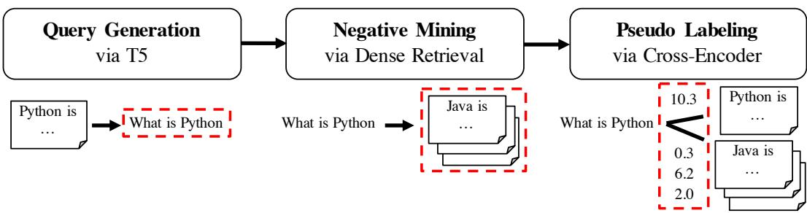
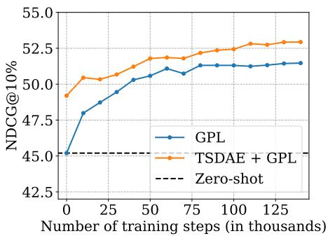
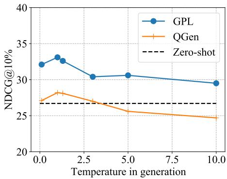

# GPL: Generative Pseudo Labeling for Unsupervised Domain Adaptation of Dense Retrieval

Kexin Wang1, Nandan Thakur2∗, Nils Reimers3∗, Iryna Gurevych1

2 University of Waterloo, 3 Hugging Face

www.ukp.tu-darmstadt.de

## Abstract

Dense retrieval approaches can overcome the lexical gap and lead to significantly improved search results. However, they require large amounts of training data which is not available for most domains. As shown in previous work (Thakur et al., 2021b), the performance of dense retrievers severely degrades under a domain shift. This limits the usage of dense retrieval approaches to only a few domains with large training datasets.

In this paper, we propose the novel unsupervised domain adaptation method Generative Pseudo Labeling (GPL), which combines a query generator with pseudo labeling from a cross-encoder. On six representative domainspecialized datasets, we find the proposed GPL can outperform an out-of-the-box state-of-theart dense retrieval approach by up to 9.3 points nDCG@10. GPL requires less (unlabeled) data from the target domain and is more robust in its training than previous methods.

We further investigate the role of six recent pre-training methods in the scenario of domain adaptation for retrieval tasks, where only three could yield improved results. The best approach, TSDAE (Wang et al., 2021) can be combined with GPL, yielding another average improvement of 1.4 points nDCG@10 across the six tasks. The code and the models are available 1.

## 1 Introduction

Information Retrieval (IR) is a central component of many natural language applications. Traditionally, lexical methods (Robertson et al., 1994) have been used to search through text content. However, these methods suffer from the lexical gap (Berger et al., 2000) and are not able to recognize synonyms and distinguish between ambiguous words.

Recently, information retrieval methods based on dense vector spaces have become popular to address these challenges. These dense retrieval methods map queries and passages2 to a shared, dense vector space and retrieve relevant hits by nearest-neighbor search. Significant improvement over traditional approaches has been shown for various tasks (Karpukhin et al., 2020; Xiong et al., 2021). This method is also adapted increasingly by industry to enhance the search functionalities of various applications (Choi et al., 2020; Huang et al., 2020).

However, as shown in Thakur et al. (2021b), dense retrieval methods require a large amount of training data to work well.3 Most importantly, dense retrieval methods are extremely sensitive to domain shifts: Models trained on MS MARCO perform rather poorly for questions for COVID-19 scientific literature (Wang et al., 2020; Voorhees et al., 2021). The MS MARCO dataset was created before COVID-19, hence, it does not include any COVID-19 related topics and models did not learn how to represent this topic well in a vector space.

In this work, we present Generative Pseudo Labeling (GPL), an unsupervised domain adaptation technique for dense retrieval models (see Figure 1). For a collection of paragraphs from the desired domain, we use an existing pre-trained T5 encoderdecoder to generate synthetic queries. These input passages are viewed as the positive passages for the generated queries. For each generated query, we retrieve the most similar paragraphs as the negative passages using an existing dense retrieval model. We term this step negative mining and term these negative passages hard negatives. Finally, we use an existing cross-encoder to score each (query, passage)-pair and train a dense retrieval model on these generated, pseudo-labeled queries using MarginMSE-Loss (Hofstätter et al., 2020).

We use publicly available models for query generation, negative mining, and the cross-encoder, which have been trained on the MS MARCO dataset (Nguyen et al., 2016), a large-scale dataset from Bing search logs combined with relevant passages from diverse web sources. We evaluate GPL on six representative domain-specific datasets from the BeIR benchmark (Thakur et al., 2021b). GPL improves the performance by up to 9.3 points nDCG@10 compared to state-of-the-art model trained solely on MS MARCO. Compared to the previous state-of-the-art domain-adaptation method QGen (Ma et al., 2021; Thakur et al., 2021b), GPL improves the performance by up to 4.5 nDCG@10 points. Training with GPL is easy, fast, and data efficient.

We further analyze the role of six recent pretraining methods in the scenario of domain adaptation for retrieval tasks. The best approach is TSDAE (Wang et al., 2021), that outperforms the second best approach, Masked Language Modeling (Devlin et al., 2019) on average by 2.5 points nDCG@10. TSDAE can be combined with GPL, yielding another average improvement of 1.4 point nDCG@10.

## 2 Related Work

Pre-Training based Domain Adaptation. The most common domain adaptation technique for transformer models is domain-adaptive pretraining (Gururangan et al., 2020), which continues pre-training on in-domain data before fine-tuning with labeled data. However, for retrieval it is often difficult to get in-domain labeled data and models are applied in a zero-shot setting on a given corpus. Besides Masked Language Modeling (MLM) (Devlin et al., 2019), different pre-trained strategies specifically for dense retrieval methods have been proposed. Inverse Cloze Task (ICT) (Lee et al., 2019) generates query-passage pair by randomly selecting one sentence from the passage as the query and the other part as the paired passage. ConDensor (CD) (Gao and Callan, 2021) applies MLM on top of the CLS token embedding from the final layer and the other context embeddings from a previous layer to force the model to learn meaningful CLS representation. SimCSE (Gao et al., 2021a; Liu et al., 2021) passes the same input twice through the network with different dropout masks and minimizes the distance of the resulting embeddings, while Contrastive Tension (CT) (Carlsson et al., 2021) passes the input through two different models. TSDAE (Wang et al., 2021) uses a denoising auto-encoder architecture for representation learning: Words from the input text are removed and passed through an encoder to generate a fixed-sized embedding. A decoder must reconstruct the original text without noise. As we show in Appendix E, just using these unsupervised techniques is not sufficient and the resulting models perform poorly.

So far, ICT and CD have only been studied on in-domain performance, i.e. a large in-domain labeled dataset is available which is used for subsequent supervised fine-tuning. SimCSE, CT, and TSDAE have been only studied for unsupervised sentence embedding learning. As our results show in Appendix E, they do not work at all for purely unsupervised dense retrieval.

If these pre-training approaches can be used for unsupervised domain adaptation for dense retrieval was so far unclear. In this work, we transfer the setup from Wang et al. (2021) to dense retrieval and first pre-train on the target corpus, followed by supervised training on labeled data from MS MARCO (Nguyen et al., 2016)4. Performance is then measured on the target corpus.

Query Generation. Query generation has been used to improve retrieval performances. Doc2query (Nogueira et al., 2019a,b) expands passages with predicted queries, generated by a trained encoderdecoder model, and uses traditional BM25 lexical search. This performed well in the zero-shot retrieval benchmark BeIR (Thakur et al., 2021b). Ma et al. (2021) proposes QGen, that uses a query generator trained on general domain data to synthesize domain-targeted queries for the target corpus, on which a dense retriever is trained from scratch. As a concurrent work, Liang et al. (2020) also proposes the similar method. Following this idea, Thakur et al. (2021b) views QGen as a posttraining method to adapt powerful MS MARCO retrievers to the target domains.

Despite the success of QGen, previous methods only consider the cross-entropy loss with in-batch negatives, which provides coarse-grained relevance and thus limits the performance. In this work, we show that extending this approach by using pseudolabels from a cross-encoder together with hard negatives can boost the performance by several points nDCG@10.

  
Figure 1: Generative Pseudo Labeling (GPL) for training domain-adapted dense retriever. First, synthetic queries are generated for each passage from the target corpus. Then, the generated queries are used for mining negative passages. Finally, the query-passage pairs are labeled by a cross-encoder and used to train the domain-adapted dense retriever. The output at each step is marked with dashed boxes.

Other Methods. Recently, Xin et al. (2021) proposes MoDIR to use Domain Adversarial Training (DAT) (Ganin et al., 2016) for unsupervised domain adaptation of dense retrievers. MoDIR trains models by generating domain invariant representations to attack a domain classifier. However, as argued in Karouzos et al. (2021), DAT trains models by minimizing the distance between representations from different domains and such learning objective can result in bad embedding space and unstable performance. For sentiment classification, Karouzos et al. (2021) proposes UDALM based on multiple stages of training. UDALM first applies MLM training on the target domain; and it then applies multi-task learning on the target domain with MLM and on the source domain with a supervised objective. However, as shown in section 5, we find this method cannot yield improvement for retrieval tasks.

Pseudo Labeling and Cross-Encoders: Bi-Encoders map queries and passage independently to a shared vector space from which the querypassage similarity is computed. In contrast, crossencoders (Humeau et al., 2020) work on the concatenation of the query and passage and predict a relevance score using cross-attention between query and passage. This can be used in a re-ranking setup (Nogueira and Cho, 2019), where the relevancy is predicted for all query-passage-pairs for a small candidate set. Previous work has shown that cross-encoders achieve much higher performances (Thakur et al., 2021a; Hofstätter et al., 2020; Ren et al., 2021) and are less prone to domain shifts (Thakur et al., 2021b). But cross-encoders come with an extremely high computational overhead, making them less suited for a production setting. Transferring knowledge from cross-encoder to bi-encoders have been shown previous for sentence embeddings (Thakur et al., 2021a) and for dense retrieval: Hofstätter et al. (2020) predict cross-encoder scores for (query, positive)-pairs and (query, negative)-pairs and learns a bi-encoder to predict the margin between the two scores. This has been shown highly effective for in-domain dense retrieval.

## 3 Method

This section describes our proposed Generative Pseudo Labeling (GPL) method for the unsupervised domain adaptation of dense retrievers. Figure 1 illustrates the idea of GPL.

For a given target corpus, we generate for each passage three queries (cf. Table 3) using an T5- encoder-decoder model (Raffel et al., 2020). For each of the generated queries, we use an existing retrieval system to retrieve 50 negative passages. Dense retrieval with a pre-existing model was slightly more effective than BM25 lexical retrieval (cf. Appendix A). For each (query, positive, negative)-tuple we compute the margin $\delta =$ $\mathrm { C E } ( Q , P ^ { + } , ) - \mathrm { C E } ( Q , P ^ { - } )$ with CE the score as predicted by a cross-encoder, Q the query and $P ^ { + } / P ^ { - }$ the positive / negative passage.

We use the synthetic dataset $\begin{array} { r l } { D _ { \mathrm { G P L } } } & { { } = } \end{array}$ $\{ ( Q _ { i } , P _ { i } , P _ { i } ^ { - } , \delta _ { i } ) \}$ i with the MarginMSE loss (Hofstätter et al., 2020) for training a domain-adapted dense retriever that maps queries and passages into the shared vector space.

Our method requires from the target domain just an unlabeled collection of passages. Further, we use use pre-existing T5- and cross-encoder models that have been trained on the MS MARCO passages dataset.

Query Generation: To enable supervised training on the target corpus, synthetic queries can be generated for the target passages using a query generator trained on a different, existing dataset like MS MARCO. Previous work QGen (Ma et al., 2021) used the simple MultipleNegativesRanking (MNRL) loss (Henderson et al., 2017; van den Oord et al., 2018) with in-batch negatives5 to train the model:

$$
\begin{array} { r l } { ~ } & { { } L _ { \mathrm { M N R L } } ( \theta ) = } \\ { ~ } & { { } - \displaystyle \frac { 1 } { M } \sum _ { i = 0 } ^ { M - 1 } \log \frac { \exp \big ( \tau \cdot \sigma ( f _ { \theta } ( Q _ { i } ) , f _ { \theta } ( P _ { i } ) ) \big ) } { \sum _ { j = 0 } ^ { M - 1 } \exp \big ( \tau \cdot \sigma ( f _ { \theta } ( Q _ { i } ) , f _ { \theta } ( P _ { j } ) ) \big ) } } \end{array}
$$

where $P _ { i }$ is a relevant passage for $Q _ { i } ; \sigma$ is a certain similarity function for vectors; τ controls the sharpness of the softmax normalization; M is the batch size.

MarginMSE loss: MultipleNegativesRanking loss considers only the coarse relationship between queries and passages, i.e. the matching passage is considered as relevant while all other passages are considered irrelevant. However, the query encoder is not without flaws and might generate queries that are not answerable6 by the passage. Further, other passages might actually be relevant as well for a given query, which is especially the case if training is done with hard negatives as we do it for GPL.

In contrast, MarginMSE loss (Hofstätter et al., 2020) uses a powerful cross-encoder to soft-label (query, passage) pairs. It then teaches the dense retriever to mimic the score margin between the positive and negative query-passage pairs. Formally,

$$
L _ { \mathrm { M a r g i n M S E } } ( \theta ) = - \frac { 1 } { M } \sum _ { i = 0 } ^ { M - 1 } | \hat { \delta } _ { i } - \delta _ { i } | ^ { 2 }\tag{1}
$$

where $\hat { \delta } _ { i }$ is the corresponding score margin of the student dense retriever, i.e. $\hat { \delta } _ { i } = f _ { \theta } ( Q _ { i } ) ^ { T } f _ { \theta } ( P _ { i } ) -$ $f _ { \theta } ( Q _ { i } ) ^ { T } f _ { \theta } ( P _ { i } ^ { - } )$ . Here the dot-product is usually used due to the infinite range of the cross-encoder scores.

This loss is a critical component of GPL, as it solves two major issues from the previous QGen method: A badly generated query for a given passage will get a low score from the cross-encoder, hence, we do not expect the dense retriever to put the query and passage close in the vector space. A false negative will lead to a high score from the cross-encoder, hence, we do not force the dense retriever to assign a large distance between the corresponding embeddings. In section 6.3, we show that GPL is a lot more robust to badly generated queries than the previous QGen method.

## 4 Experiments

In this section, we describe the experimental setup, the datasets used and the baselines for comparison.

## 4.1 Experimental Setup

We use the MS MARCO passage ranking dataset (Nguyen et al., 2016) as the data from the source domain. It has 8.8M passages and 532.8K query-passage pairs labeled as relevant in the training set. We select six representative datasets from the BeIR benchmark as the data from the target domain (cf. subsection 4.2). As Table 1 shows, a state-of-the-art dense retrieval model, achieving an MRR@10 of 33.2 points on the MS MARCO passage ranking dataset, performs poorly on the six selected domain-specific retrieval datasets when compared to simple BM25 lexical search.

We use the DistilBERT (Sanh et al., 2019) for all the experiments. We use the concatenation of the title and the body text as the input passage for all the models. We use a maximum sequence length of 350 with mean pooling and dot-product similarity by default. For QGen, we use the default setting in Thakur et al. (2021b): 1-epoch training and batch size 75. For GPL, we train the models with 140k training steps and batch size 32. To generate queries for both QGen and GPL, we use the DocT5Query (Nogueira et al., 2019a) generator trained on MS MARCO and generate 7 queries using nucleus sampling with temperature $1 . 0 , k = 2 5 \mathrm { a n d } p = 0 . 9 5$ . To retrieve hard negatives for both GPL and the zero-shot setting of MS MARCO training, we use two dense retrievers with cosine-similarity trained on MS MARCO: msmarco-distilbert-base-v3 and msmarco-MiniLM-L-6-v3 from Sentence-Transformers8. The zeroshot performance of these two dense retrievers is available in Appendix B. We retrieve 50 negatives using each retriever and uniformly sample one negative passage and one positive passage for each training query to form one training example. For pseudo labeling, we use the ms-marco-MiniLM-L-$6 { \cdot } \nu 2 ^ { 9 }$ cross-encoder. For all the pre-training methods (e.g. TSDAE and MLM), we train the models for 100K training steps and with batch size 8.

As shown in Section 6, small corpora require more generated queries and for large corpora, a small down-sampled subset (e.g. 50K) is enough for good performance. Based on these findings, we adjust the number of generated queries per passage $q _ { \mathrm { a v g . } }$ and the corpus size C to make the total number of generated queries equal to a fixed number, 250K, i.e. $q _ { \mathrm { a v g . } } \times | C | = 2 5 0 \mathrm { K }$ . In detail, we first set $q _ { \mathrm { a v g . } }$ $> = 3$ and uniformly down-sample the corpus if $3 \times | C | > 2 5 0 \mathrm { K }$ ; then we calculate $q _ { \mathrm { a v g . } } = \lceil 2 5 0 \mathrm { K } / \lvert C \rvert \rceil$ . For example, the $q _ { \mathrm { a v g } }$ . values for FiQA (original size = 57.6K) and Robust04 (original size = 528.2K) are 5 and 3, resp. and the Robust04 corpus is down-sampled to 83.3K. QGen and GPL share the generated queries for fair comparision.

## 4.2 Evaluation

As our methods focus on domain adaptation to specialized domains, we selected six domainspecific text retrieval tasks from the BeIR benchmark (Thakur et al., 2021b): FiQA (financial domain) (Maia et al., 2018), SciFact (scientific papers) (Wadden et al., 2020), BioASQ (biomedical Q&A) (Tsatsaronis et al., 2015), TREC-COVID (scientific papers on COVID-19) (Roberts et al., 2020), CQADupStack (12 StackExchange subforums) (Hoogeveen et al., 2015) and Robust04 (news articles) (Voorhees, 2005). These selected datasets each contain a corpus with a rather specific language and can thus act as a suitable test bed for domain adaptation.

The detailed information for all the target datasets is available at Appendix C. We make modification on BioASQ and TREC-COVID. For efficient training and evaluation on BioASQ, we randomly remove irrelevant passages to make the final corpus size to 1M. In TREC-COVID, the original corpus has many documents with a missing abstract. The retrieval systems that were used to create the annotation pool for TREC-COVID often ignored such documents. This leads to a strong annotation bias on text length for these documents, since this dataset contains only titles and abstracts. Hence, we removed all documents with a missing abstract from the corpus. The evaluation results on the original BioASQ and TREC-COVID are available at Appendix D. Evaluation is done using nDCG@10.

## 4.3 Baselines

Zero-Shot Models: We apply supervised training on MS MARCO or PAQ (Lewis et al., 2021) and evaluate the trained retrievers on the target datasets. (a) MS MARCO represents a distilbert-base dense retrieval model trained with MarginMSE on the MS MARCO dataset with batch-size 75 for 70k steps. (b) PAQ (Oguz et al., 2021) represents MNRL training on the PAQ dataset. (c) PAQ + MS MARCO represents MNRL training on PAQ followed by MarginMSE training on MS MARCO. (d) TSDAEMS MARCO represents TSDAE (Wang et al., 2021) pre-training on MS MARCO followed by MarginMSE training on MS MARCO. (e) BM25 system based on lexical matching from Elasticsearch10.

Previous Domain Adaptation Methods: We include two previous unsupervised domain adaptation methods, UDALM (Karouzos et al., 2021) and MoDIR (Xin et al., 2021). For UDALM, we apply MLM training on the target corpus and then apply the multi-task training of MarginMSE training on MS MARCO and MLM training on the target corpus. For MoDIR, it starts from the ANCE checkpoint and apply domain adversarial training on MS MARCO and the target dataset. As of writing, the training code of MoDIR is not public, but domain adapted models for 5 out of 6 datasets have been released by the authors.

Pre-Training based Domain Adaptation: We follow the setup proposed in Wang et al. (2021) on domain-adapted pre-training: We pre-train the dense retrievers with different methods on the target corpus and then continue to train the models on MS MARCO with MarginMSE loss. The pre-training methods consist of: (a) CD (Gao and Callan, 2021) extracts the hidden representations from an intermediate layer and applies MLM on the CLS token representation and these extracted hidden representations11. (b) SimCSE (Gao et al., 2021b; Liu et al., 2021) simply encode the same text twice with different dropout masks in combination with MNRL loss. (c) CT (Carlsson et al., 2021) is similar to SimCSE but it uses two independent encoders to encode a pair of text. (d) MLM (Devlin et al., 2019) uses the default setting in original paper, where 15% tokens in a text are sampled to be masked and are needed to be predicted. (e) ICT (Lee et al., 2019) uniformly samples one sentence from a passage as the pseudo query to that passage and uses MNRL loss on the synthetic data. We follow the setting in Lee et al. (2019) and masked out the selected sentence 90% of the time. (f) TSDAE (Wang et al., 2021) uses a denoising autoencoder to pre-train the dense retrievers with 60% random tokens deleted in the input texts.

<table><tr><td>Dataset Method</td><td>FiQA</td><td>SciFact</td><td>BioASQ</td><td>TRECC.</td><td>CQADup.</td><td>Robust04</td><td>Avg.</td></tr><tr><td colspan="8">Zero-Shot Models</td></tr><tr><td>MS MARCO</td><td>26.7</td><td>57.1</td><td>52.9</td><td>66.1</td><td>29.6</td><td>39.0</td><td>45.2</td></tr><tr><td>PAQ</td><td>15.2</td><td>53.3</td><td>44.0</td><td>23.8</td><td>24.5</td><td>31.9</td><td>32.1</td></tr><tr><td>PAQ + MS MARCO</td><td>26.7</td><td>57.6</td><td>53.8</td><td>63.4</td><td>30.6</td><td>37.2</td><td>44.9</td></tr><tr><td>TSDAEMS MARCO</td><td>26.7</td><td>55.5</td><td>51.4</td><td>65.6</td><td>30.5</td><td>36.6</td><td>44.4</td></tr><tr><td>BM25</td><td>23.9</td><td>66.1</td><td>70.7</td><td>60.1</td><td>31.5</td><td>38.7</td><td>48.5</td></tr><tr><td colspan="8">Previous Domain Adaptation Methods</td></tr><tr><td>UDALM</td><td>23.3</td><td>33.6</td><td>33.1</td><td>57.1</td><td>24.6</td><td>26.3</td><td>33.0</td></tr><tr><td>MoDIR</td><td>29.6</td><td>50.2</td><td>47.9</td><td>66.0</td><td>29.7</td><td>一</td><td>一</td></tr><tr><td colspan="8">Pre-Training based Domain Adaptation: Target → MS MARCO</td></tr><tr><td>CT</td><td>28.3</td><td>55.6</td><td>49.9 47.7</td><td>63.8</td><td>30.5</td><td>35.9</td><td>44.0</td></tr><tr><td>CD</td><td>27.0 26.7</td><td>62.7</td><td>53.2</td><td>65.4 68.3</td><td>30.6 29.0</td><td>34.5 37.9</td><td>44.7</td></tr><tr><td>SimCSE</td><td></td><td>55.0</td><td>55.3</td><td></td><td></td><td></td><td>45.0</td></tr><tr><td>ICT</td><td>27.0 30.2</td><td>58.3</td><td>51.3</td><td>69.7 69.5</td><td>31.3</td><td>37.4</td><td>46.5</td></tr><tr><td>MLM TSDAE</td><td></td><td>60.0</td><td></td><td></td><td>30.4</td><td>38.8</td><td>46.7</td></tr><tr><td></td><td>29.3</td><td>62.8</td><td>55.5</td><td>76.1</td><td>31.8</td><td>39.4</td><td>49.2</td></tr><tr><td colspan="8">Generation-based Domain Adaptation (Previous State-of-the-Art)</td></tr><tr><td>QGen</td><td>28.7</td><td>63.8</td><td>56.5</td><td>72.4</td><td>33.0</td><td>38.1</td><td>48.8</td></tr><tr><td>QGen (w/ Hard Negatives)</td><td>26.0</td><td>59.6</td><td>57.7</td><td>65.0</td><td>33.2</td><td>36.5</td><td>46.3</td></tr><tr><td>TSDAE + QGen (Ours)</td><td>31.4</td><td>66.7</td><td>58.1</td><td>72.6</td><td>35.3</td><td>37.4</td><td>50.3</td></tr><tr><td colspan="8">Proposed Method: Generative Pseudo Labeling</td></tr><tr><td>GPL</td><td>32.8</td><td>66.4</td><td>61.0</td><td>72.6</td><td>34.5</td><td>41.4</td><td>51.5</td></tr><tr><td>TSDAE + GPL</td><td>34.4</td><td>68.9</td><td>61.6</td><td>74.6</td><td>35.1</td><td>43.0</td><td>52.9</td></tr><tr><td colspan="8">Re-Ranking with Cross-Encoders (Upper Bound, Inefficient at Inference)</td></tr><tr><td>BM25 + CE</td><td>33.1</td><td>67.6</td><td>72.8</td><td>71.2</td><td>36.8</td><td>46.7</td><td>54.7</td></tr><tr><td>MS MARCO + CE</td><td>33.0</td><td>66.9</td><td>57.4</td><td>65.1</td><td>36.9</td><td>44.7</td><td>50.7</td></tr><tr><td>TSDAE + GPL + CE</td><td>36.4</td><td>68.3</td><td>68.0</td><td>71.4</td><td>38.1</td><td>48.3</td><td>55.1</td></tr></table>

Table 1: Evaluation using nDCG@10. The best results of the single-stage dense retrievers are bold. TRECC. and CQADup. are short for TREC-COVID and CQADupStack. Our proposed GPL significantly outperforms other domain adaptation methods. For the first time, we investigate the TSDAE pre-training in domain adaptation for dense retrieval and find it can significantly improve both QGen and GPL. The results on the full 18 BeIR datasets can be found in Appendix D.

Generation-based Domain Adaptation: We use the training script12 from Thakur et al. (2021b) to train QGen models with the default setting. Cosine similarity is used and the models are fine-tuned for 1 epoch with MNRL. The default QGen is trained with in-batch negatives. For a fair comparison, we also test QGen with hard negatives as used in GPL, noted as QGen (w/ Hard Negatives). Further, We test the combination of TSDAE and QGen (TSDAE + QGen).

Re-Ranking with Cross-Encoders: We also include results of the powerful but inefficient re-ranking methods for reference. Three retrievers for the first-phrase retrieval are tested: BM25 from Elasticsearch, the zero-shot MS MARCO retriever and the GPL retriever enhanced by TSDAE pre-training. We use the crossencoder ms-marco-MiniLM-L-6-v2 from Sentence-Transformers, which is also the same model used for pseudo labeling in GPL.

## 5 Results

Pre-Training based Domain Adaptation:

The results are shown in Table 1. Compared with the zero-shot MS MARCO model, TSDAE, MLM and ICT can improve the performance if we first pre-train on the target corpus and then perform supervised training on MS MARCO. Among them, TSDAE is the most effective method, outperforming the zero-shot baseline by 4.0 points nDCG@10 on average. CD, CT and SimCSE are not able to adapt to the domains in a pre-training setup and achieve a performance worse than the zero-shot model.

To ensure that TSDAE actually learns domain specific terminology, we include TSDAEMS MARCO in our experiments: Here, we performed TSDAE pre-training on the MS MARCO dataset followed by supervised learning on MS MARCO. This performs slightly weaker than the zero-shot MS MARCO model.

We also tested the pre-training methods without any supervised training on MS MARCO. We find all of them fail miserably compared to the zero-shot baseline as shown in Appendix E .

Previous Domain Adaptation Methods: We test MoDIR on the datasets except Robust0413. MoDIR performs on-par with our zero-shot MS MARCO model on FiQA, TREC-COVID and CQADupStack, while it performs much weaker on SciFact and BioASQ. An improved training setup with MoDIR could improve the results.

We also test UDALM, which first does MLM pre-training on the target corpus, and then runs multitask learning with MLM objective and supervised training on MS MARCO. The results show that UDALM in this case greatly harms the performance by 12.2 points in average, when compared with the MLM-pre-training approach. We suppose this is because unlike text classification, the dense retrieval models usually do not have an additional task head and the direct MLM training conflicts with the supervised training.

Generation-based Domain Adaptation: The results show that the previous best method, QGen, can successfully adapt the MS MARCO models to the new domains, improving the performance on average by 3.6 points. It performs on par with TSDAE-based domain-adaptive pre-training. Combining TSDAE with QGen can further improve the performance by 1.5 points.

When using QGen with hard negatives instead of random in-batch negatives, the performance decreases by 2.5 points in average. QGen is sensitive to false negatives, i.e. negative passages that are actually relevant for the query. This is a common issue for hard negative mining. GPL solves this issue by using the cross-encoder to determine the distance between the query and a passage. We give more analysis in section 7.

Generative Pseudo Labeling (GPL, proposed method): We find GPL is significantly better on almost all the datasets compared to other tested methods, outperforming QGen by up to 4.5 points (on BioASQ) and in average by 2.7 points. One exception is TREC-COVID, but as this dataset has just 50 test queries, this difference can be due to noise.

As a further enhancement, we find that TSDAEbased domain-adaptive pre-training combined with GPL (i.e. TSDAE + GPL) can further improve the performance on all the datasets, achieving the new state-of-the-art result of 52.9 nDCG@10 points in average. It outperforms the out-of-the-box MS MARCO model 7.7 points on average.

For the results of GPL on the full 18 BeIR datasets, please refer to Appendix D. The observations remain the same.

Re-ranking with Cross-Encoders: Crossencoders perform well in a zero-shot setting and outperform dense retrieval approaches significantly (Thakur et al., 2021b), but they come with a significant computational cost at inference. TSDAE and GPL can narrow but not fully close the performance gap between the single-stage retrievers and the re-ranking methods. Due to the much lower computational costs at inference, the TSDAE + GPL model would be preferable in a production setting. For example, as shown in Thakur et al. (2021b), the retrieval latency on a 1M-sized corpus for one query is 14ms and 450ms for dense retrievers (with the same backbone as ours) and BM25 + CE reranking, resp.

## 6 Analysis

In this section, we analyze the influence of training steps, corpus size, query generation and choices of starting checkpoints on GPL.

## 6.1 Influence of Training Steps

We first analyze the influence of the number of training steps on the model performance. We evaluate the models every 10K training steps and end the training after 140K steps. The results for the change of averaged performance on all the datasets are shown in Figure 2. We find the performance of GPL begins to be saturated after around 100K steps. With the TSDAE pre-training, the performance can be improved consistently during the whole training stage. For reference, training a distilbert-base model for 100k steps takes about 9.6 hours on a single V100 GPU.

Figure 2: Influence of the number training steps on the averaged performance. The performance of GPL begins to be saturated after 100K steps. TSDAE helps improve the performance during the whole training stage.
<table><tr><td rowspan=1 colspan=1>SizeMethod</td><td rowspan=1 colspan=1>1K</td><td rowspan=1 colspan=1>10K</td><td rowspan=1 colspan=1>50K</td><td rowspan=1 colspan=1>250K</td><td rowspan=1 colspan=1>528K</td></tr><tr><td rowspan=1 colspan=1>QGen</td><td rowspan=1 colspan=1>35.5</td><td rowspan=1 colspan=1>36.5</td><td rowspan=1 colspan=1>38.7</td><td rowspan=1 colspan=1>37.5</td><td rowspan=1 colspan=1>37.0</td></tr><tr><td rowspan=1 colspan=1>GPL</td><td rowspan=1 colspan=1>37.6</td><td rowspan=1 colspan=1>41.4</td><td rowspan=1 colspan=1>42.5</td><td rowspan=1 colspan=1>41.4</td><td rowspan=1 colspan=1>41.3</td></tr><tr><td rowspan=1 colspan=1>Zero-shot</td><td rowspan=1 colspan=5>39.0</td></tr></table>

Table 2: Influence of corpus size on performance on Robust04. The full size is 528K. GPL can achieve the best performance with as little as 50K passages.

## 6.2 Influence of Corpus Size

We next analyze the influence of different corpus sizes. We use Robust04 for this analysis, since it has a relatively large size. We sample 1K, 10K, 50K and 250K passages from the whole corpus independently to form small corpora and train QGen and GPL on the same small corpus. The results are shown in Table 2. We find with more than 10K passages, GPL can already significantly outperform the zero-shot baseline by 2.4 NDCG@10 points; with more than 50K passages, the performance begins to saturate. On the other hand, QGen falls behind the zero-shot baseline for each corpus size.

## 6.3 Robustness against Query Generation

Next, we study how the query generation influences the model performance. First, we train QGen and GPL on SciFact, FiQA and Robust04, with 1 up to 50 generated Queries Per Passage (QPP). The results are shown in Table 3. We observe that smaller corpora, e.g. SciFact (size = 5.2K) and FiQA (size = 57.6K) require more generated queries per passage than the large one, Robust04 (size = 528.2K). For example, GPL needs QPP equal to around 50, 5 and 1 for SciFact, FiQA and Robust04, resp. to achieve the optimal performance.

<table><tr><td rowspan=2 colspan=1>Dataset</td><td rowspan=2 colspan=1>Method</td><td rowspan=1 colspan=7>Queries Per Passage</td></tr><tr><td rowspan=1 colspan=1>1</td><td rowspan=1 colspan=1>2</td><td rowspan=1 colspan=1>3</td><td rowspan=1 colspan=1>5</td><td rowspan=1 colspan=1>10</td><td rowspan=1 colspan=1>25</td><td rowspan=1 colspan=1>50</td></tr><tr><td rowspan=3 colspan=1>SciFact(5.2K)</td><td rowspan=1 colspan=1>QGen</td><td rowspan=1 colspan=1>56.7</td><td rowspan=1 colspan=1>59.6</td><td rowspan=1 colspan=1>60.2</td><td rowspan=1 colspan=1>59.9</td><td rowspan=1 colspan=1>61.5</td><td rowspan=1 colspan=1>62.2</td><td rowspan=1 colspan=1>63.7</td></tr><tr><td rowspan=1 colspan=1>GPL</td><td rowspan=1 colspan=1>61.7</td><td rowspan=1 colspan=1>63.2</td><td rowspan=1 colspan=1>63.8</td><td rowspan=1 colspan=1>64.7</td><td rowspan=1 colspan=1>66.8</td><td rowspan=1 colspan=1>66.9</td><td rowspan=1 colspan=1>67.9</td></tr><tr><td rowspan=1 colspan=1>Zero-shot</td><td rowspan=1 colspan=1></td><td rowspan=1 colspan=1></td><td rowspan=1 colspan=1></td><td rowspan=1 colspan=1>57.1</td><td rowspan=1 colspan=1></td><td rowspan=1 colspan=1></td><td rowspan=1 colspan=1></td></tr><tr><td rowspan=3 colspan=1>FiQA(57.6K)</td><td rowspan=1 colspan=1>QGen</td><td rowspan=1 colspan=1>27.3</td><td rowspan=1 colspan=1>28.1</td><td rowspan=1 colspan=1>27.8</td><td rowspan=1 colspan=1>28.5</td><td rowspan=1 colspan=1>29.3</td><td rowspan=1 colspan=1>31.1</td><td rowspan=1 colspan=1>31.8</td></tr><tr><td rowspan=1 colspan=1>GPL</td><td rowspan=1 colspan=1>31.5</td><td rowspan=1 colspan=1>32.2</td><td rowspan=1 colspan=1>32.3</td><td rowspan=1 colspan=1>32.8</td><td rowspan=1 colspan=1>33.0</td><td rowspan=1 colspan=1>33.5</td><td rowspan=1 colspan=1>33.5</td></tr><tr><td rowspan=1 colspan=1>Zero-shot</td><td rowspan=1 colspan=1></td><td rowspan=1 colspan=1></td><td rowspan=1 colspan=1></td><td rowspan=1 colspan=1>26.7</td><td rowspan=1 colspan=1></td><td rowspan=1 colspan=1></td><td rowspan=1 colspan=1></td></tr><tr><td rowspan=3 colspan=1>Robust04(528.2K)</td><td rowspan=1 colspan=1>QGen</td><td rowspan=1 colspan=1>37.9</td><td rowspan=1 colspan=1>38.7</td><td rowspan=1 colspan=1>37.0</td><td rowspan=1 colspan=1>37.3</td><td rowspan=1 colspan=1>38.2</td><td rowspan=1 colspan=1>37.7</td><td rowspan=1 colspan=1>37.7</td></tr><tr><td rowspan=1 colspan=1>GPL</td><td rowspan=1 colspan=1>42.0</td><td rowspan=1 colspan=1>41.3</td><td rowspan=1 colspan=1>41.4</td><td rowspan=1 colspan=1>41.2</td><td rowspan=1 colspan=1>40.9</td><td rowspan=1 colspan=1>41.2</td><td rowspan=1 colspan=1>40.6</td></tr><tr><td rowspan=1 colspan=1>Zero-shot</td><td rowspan=1 colspan=7>39.0</td></tr></table>

Table 3: Influence of number of generated Queries Per Passage (QPP) on the performance on SciFact, FiQA and Robust04. Corpus size is labeled under each dataset name. Smaller corpora, e.g. SciFact and FiQA require larger QPP to achieve the optimal performance.

The temperature14 plays an important role in nucleus sampling, higher values make the generated queries more diverse, but of lower quality. We train QGen and GPL on FiQA with different temperatures: 0.1, 1, 1.3, 3, 5 and 10. Examples of generated queries are available in Appendix F. We generated 3 queries per passage. The results are shown in Figure 3. We find the performance of QGen and GPL both peaks at 1.0. With a higher temperature, the next-token distribution will be flatter and more diverse queries, but of lower quality, will be generated. With high temperatures, the generated queries have nearly no relationship to the passage. QGen will perform poorly in these cases, worse than the zero-shot model. In contrast, GPL performs still well even when the generated queries are of such low quality.

## 6.4 Sensitivity to Starting Checkpoints

We also analyze the influence of initialization on GPL. In the default setting, we start from a distilbert-model supervised on MS MARCO using MarginMSE loss. We also evaluate to directly fine-tune a distilbert-model using QGen, GPL and TSDAE + GPL. The performance averaged on all the datasets is shown in Table 4. We find the MS MARCO training has relatively small effect on the performance of GPL (with 0.3-point difference in average), while QGen highly relies on the choice of the initialization checkpoint (with 1.9-point difference in average).

Figure 3: Influence of the temperature in generation on the performance on FiQA. A higher temperature means more diverse queries but of lower quality. GPL can still yield around 3.0-point improvement over the zero-shot baseline with high temperature value of 10.0, where the generated queries have nearly no connection to the passages.
<table><tr><td rowspan=1 colspan=1>Init.Method</td><td rowspan=1 colspan=1>Distilbert</td><td rowspan=1 colspan=1>MS MARCO</td></tr><tr><td rowspan=1 colspan=1>QGen</td><td rowspan=1 colspan=1>46.9</td><td rowspan=1 colspan=1>48.8</td></tr><tr><td rowspan=1 colspan=1>TSDAE + QGen (Ours)</td><td rowspan=1 colspan=1>49.6</td><td rowspan=1 colspan=1>50.3</td></tr><tr><td rowspan=1 colspan=1>GPL</td><td rowspan=1 colspan=1>51.2</td><td rowspan=1 colspan=1>51.5</td></tr><tr><td rowspan=1 colspan=1>TSDAE + GPL</td><td rowspan=1 colspan=1>52.3</td><td rowspan=1 colspan=1>52.9</td></tr><tr><td rowspan=1 colspan=1>Zero-shot</td><td rowspan=1 colspan=1>一</td><td rowspan=1 colspan=1>45.2</td></tr></table>

Table 4: Influence of initialization checkpoint on performance in average. GPL yields similar performance when starting from different checkpoints.

## 7 Case Study: Fine-Grained Labels

GPL uses continuous pseudo labels from a crossencoder, which can provide more fine-grained information and is more informative than the simple 0-1 labels as in QGen. In this section, we give a more detailed insight into it by a case study.

One example from FiQA is shown in Table 5. The generated query for the positive passage asks for the definition of “futures contract”. Negative 1 and 2 only mention futures contract without explaining the term (with low GPL labels/scores below 2.0), while Negative 3 gives the required definition (with high GPL label/score 8.2). As an interesting case, Negative 4 gives a partial explanation of the term (with medium GPL label/score 6.9). GPL assigns suitable fine-grained labels to different negative passages. In contrast, QGen simply labels all of them as 0, i.e. as irrelevant. Such difference explains the advantage of GPL over QGen and why using hard negatives harms the performance

<table><tr><td rowspan=1 colspan=1>Item</td><td rowspan=1 colspan=1>Text</td><td rowspan=1 colspan=1>GPL</td><td rowspan=1 colspan=1>QGen</td></tr><tr><td rowspan=1 colspan=1>Query</td><td rowspan=1 colspan=1>what is futures contract</td><td rowspan=1 colspan=1>一</td><td rowspan=1 colspan=1></td></tr><tr><td rowspan=1 colspan=1>Positive</td><td rowspan=1 colspan=1>Futures contracts are amember of a larger classof financial assets calledderivatives ...</td><td rowspan=1 colspan=1>10.3</td><td rowspan=1 colspan=1>1</td></tr><tr><td rowspan=1 colspan=1>Negative 1</td><td rowspan=1 colspan=1>... Anyway in this one examplethe s&amp;p 500 futures contracthas an &quot;initial margin&quot; of$19,250, meaning ...</td><td rowspan=1 colspan=1>2.0</td><td rowspan=1 colspan=1>0</td></tr><tr><td rowspan=1 colspan=1>Negative 2</td><td rowspan=1 colspan=1>... but the moment you exerciseyou must have $5,940 in amargin account to actuallyuse the futures contract ..</td><td rowspan=1 colspan=1>0.3</td><td rowspan=1 colspan=1>0</td></tr><tr><td rowspan=1 colspan=1>Negative 3</td><td rowspan=1 colspan=1>... a futures contract is simplya contract that requires party Ato buy a given amount of acommodity from party B at aspecified price...</td><td rowspan=1 colspan=1>8.2</td><td rowspan=1 colspan=1>0</td></tr><tr><td rowspan=1 colspan=1>Negative 4</td><td rowspan=1 colspan=1>... A futures contract commitstwo parties to a buy/sell of theunderlying securities, but ...</td><td rowspan=1 colspan=1>6.9</td><td rowspan=1 colspan=1>0</td></tr></table>

Table 5: Examples of the labels assigned to different query-passage pairs in FiQA by GPL and QGen. The key term "futures contract" is marked in bold. QGen uses only 0-1 scores. GPL uses raw logits, which can be any value between positive and negative infinity (e.g. [ 12, 11] is a typical range).

of QGen in Table 1.

## 8 Conclusion

In this work we propose GPL, a novel unsupervised domain adaptation method for dense retrieval models. It generates queries for a target corpus and pseudo labels these with a cross-encoders. Pseudolabeling overcomes two important short-comings of previous methods: Not all generated queries are of high quality and pseudo-labels efficiently detects those. Further, training with mined hard negatives is possible as the pseudo labels performs efficient denoising.

In this work, we also evaluated different pre-training strategies in a domain-adaptive pretraining setup: We first pre-trained on the target domain, then performed supervised training on MS MARCO. ICT and MLM were able to yield a small improvement (by <=1.5 nDCG@10 points on average), while TSDAE was able to yield a significant improvement of 4 nDCG@10 points on average. Other approaches degraded the performance.

## Acknowledgments

This work has been funded by the German Research Foundation (DFG) as part of the UKP-SQuARE project (grant GU 798/29-1).

## References

Adam L. Berger, Rich Caruana, David Cohn, Dayne Freitag, and Vibhu O. Mittal. 2000. Bridging the lexical chasm: statistical approaches to answer-finding. In SIGIR 2000: Proceedings ofthe 23rd Annual International ACM SIGIR Conference on Research and Development in Information Retrieval, July 24-28, 2000, Athens, Greece, pages 192–199. ACM.

Fredrik Carlsson, Amaru Cuba Gyllensten, Evangelia Gogoulou, Erik Ylipää Hellqvist, and Magnus Sahlgren. 2021. Semantic re-tuning with contrastive tension. In 9th International Conference on Learning Representations, ICLR 2021, Virtual Event, Austria, May 3-7, 2021. OpenReview.net.

Jason Ingyu Choi, Surya Kallumadi, Bhaskar Mitra, Eugene Agichtein, and Faizan Javed. 2020. Semantic product search for matching structured product catalogs in e-commerce. ArXiv preprint, abs/2008.08180.

Jacob Devlin, Ming-Wei Chang, Kenton Lee, and Kristina Toutanova. 2019. BERT: Pre-training of deep bidirectional transformers for language understanding. In Proceedings ofthe 2019 Conference of the North American Chapter ofthe Associationfor Computational Linguistics: Human Language Technologies, Volume 1 (Long and Short Papers), pages 4171–4186, Minneapolis, Minnesota. Association for Computational Linguistics.

Yaroslav Ganin, Evgeniya Ustinova, Hana Ajakan, Pascal Germain, Hugo Larochelle, François Laviolette, Mario Marchand, and Victor S. Lempitsky. 2016. Domain-adversarial training of neural networks. J. Mach. Learn. Res., 17:59:1–59:35.

Luyu Gao and Jamie Callan. 2021. Condenser: a pretraining architecture for dense retrieval. In Proceedings of the 2021 Conference on Empirical Methods in Natural Language Processing, pages 981–993, Online and Punta Cana, Dominican Republic. Association for Computational Linguistics.

Tianyu Gao, Xingcheng Yao, and Danqi Chen. 2021a. SimCSE: Simple contrastive learning of sentence embeddings. In Proceedings of the 2021 Conference on Empirical Methods in Natural Language Processing, pages 6894–6910, Online and Punta Cana, Dominican Republic. Association for Computational Linguistics.

Tianyu Gao, Xingcheng Yao, and Danqi Chen. 2021b. SimCSE: Simple contrastive learning of sentence embeddings. In Proceedings of the 2021 Conference on Empirical Methods in Natural Language Processing, pages 6894–6910, Online and Punta Cana, Dominican Republic. Association for Computational Linguistics.

Suchin Gururangan, Ana Marasovic, Swabha´ Swayamdipta, Kyle Lo, Iz Beltagy, Doug Downey, and Noah A. Smith. 2020. Don’t stop pretraining: Adapt language models to domains and tasks. In Proceedings of the 58th Annual Meeting of the

Association for Computational Linguistics, pages 8342–8360, Online. Association for Computational Linguistics.

Matthew L. Henderson, Rami Al-Rfou, Brian Strope, Yun-Hsuan Sung, László Lukács, Ruiqi Guo, Sanjiv Kumar, Balint Miklos, and Ray Kurzweil. 2017. Efficient natural language response suggestion for smart reply. ArXiv preprint, abs/1705.00652.

Sebastian Hofstätter, Sophia Althammer, Michael Schröder, Mete Sertkan, and Allan Hanbury. 2020. Improving efficient neural ranking models with crossarchitecture knowledge distillation. ArXiv preprint, abs/2010.02666.

Sebastian Hofstätter, Sheng-Chieh Lin, Jheng-Hong Yang, Jimmy Lin, and Allan Hanbury. 2021. Efficiently teaching an effective dense retriever with balanced topic aware sampling. In SIGIR ’21: The 44th International ACM SIGIR Conference on Research and Development in Information Retrieval, Virtual Event, Canada, July 11-15, 2021, pages 113–122. ACM.

Doris Hoogeveen, Karin M Verspoor, and Timothy Baldwin. 2015. Cqadupstack: A benchmark data set for community question-answering research. In Proceedings of the 20th Australasian document computing symposium, pages 1–8.

Jui-Ting Huang, Ashish Sharma, Shuying Sun, Li Xia, David Zhang, Philip Pronin, Janani Padmanabhan, Giuseppe Ottaviano, and Linjun Yang. 2020. Embedding-based retrieval in facebook search. In KDD ’20: The 26th ACM SIGKDD Conference on Knowledge Discovery and Data Mining, Virtual Event, CA, USA, August 23-27, 2020, pages 2553– 2561. ACM.

Samuel Humeau, Kurt Shuster, Marie-Anne Lachaux, and Jason Weston. 2020. Poly-encoders: Architectures and pre-training strategies for fast and accurate multi-sentence scoring. In 8th International Conference on Learning Representations, ICLR 2020, Addis Ababa, Ethiopia, April 26-30, 2020. OpenReview.net.

Constantinos Karouzos, Georgios Paraskevopoulos, and Alexandros Potamianos. 2021. UDALM: Unsupervised domain adaptation through language modeling. In Proceedings ofthe 2021 Conference ofthe North American Chapter ofthe Association for Computational Linguistics: Human Language Technologies, pages 2579–2590, Online. Association for Computational Linguistics.

Vladimir Karpukhin, Barlas Oguz, Sewon Min, Patrick Lewis, Ledell Wu, Sergey Edunov, Danqi Chen, and Wen-tau Yih. 2020. Dense passage retrieval for opendomain question answering. In Proceedings of the 2020 Conference on Empirical Methods in Natural Language Processing (EMNLP), pages 6769–6781, Online. Association for Computational Linguistics.

Tom Kwiatkowski, Jennimaria Palomaki, Olivia Redfield, Michael Collins, Ankur Parikh, Chris Alberti, Danielle Epstein, Illia Polosukhin, Jacob Devlin, Kenton Lee, Kristina Toutanova, Llion Jones, Matthew Kelcey, Ming-Wei Chang, Andrew M. Dai, Jakob Uszkoreit, Quoc Le, and Slav Petrov. 2019. Natural questions: A benchmark for question answering research. Transactions ofthe Associationfor Computational Linguistics, 7:453–466.

Kenton Lee, Ming-Wei Chang, and Kristina Toutanova. 2019. Latent retrieval for weakly supervised open domain question answering. In Proceedings of the 57th Annual Meeting of the Association for Computational Linguistics, pages 6086–6096, Florence, Italy. Association for Computational Linguistics.

Patrick Lewis, Yuxiang Wu, Linqing Liu, Pasquale Minervini, Heinrich Küttler, Aleksandra Piktus, Pontus Stenetorp, and Sebastian Riedel. 2021. PAQ: 65 million probably-asked questions and what you can do with them. Transactions ofthe Associationfor Computational Linguistics, 9:1098–1115.

Davis Liang, Peng Xu, Siamak Shakeri, Cicero Nogueira dos Santos, Ramesh Nallapati, Zhiheng Huang, and Bing Xiang. 2020. Embedding-based zero-shot retrieval through query generation. ArXiv preprint, abs/2009.10270.

Fangyu Liu, Ivan Vulic, Anna Korhonen, and Nigel´ Collier. 2021. Fast, effective, and self-supervised: Transforming masked language models into universal lexical and sentence encoders. In Proceedings ofthe 2021 Conference on Empirical Methods in Natural Language Processing, pages 1442–1459, Online and Punta Cana, Dominican Republic. Association for Computational Linguistics.

Kyle Lo, Lucy Lu Wang, Mark Neumann, Rodney Kinney, and Daniel Weld. 2020. S2ORC: The semantic scholar open research corpus. In Proceedings ofthe 58th Annual Meeting ofthe Associationfor Computational Linguistics, pages 4969–4983, Online. Association for Computational Linguistics.

Ji Ma, Ivan Korotkov, Yinfei Yang, Keith Hall, and Ryan McDonald. 2021. Zero-shot neural passage retrieval via domain-targeted synthetic question generation. In Proceedings ofthe 16th Conference ofthe European Chapter ofthe Associationfor Computational Linguistics: Main Volume, pages 1075–1088, Online. Association for Computational Linguistics.

Macedo Maia, Siegfried Handschuh, André Freitas, Brian Davis, Ross McDermott, Manel Zarrouk, and Alexandra Balahur. 2018. Www’18 open challenge: Financial opinion mining and question answering. In Companion Proceedings of the The Web Conference 2018, WWW ’18, page 1941–1942, Republic and Canton of Geneva, CHE. International World Wide Web Conferences Steering Committee.

Tri Nguyen, Mir Rosenberg, Xia Song, Jianfeng Gao, Saurabh Tiwary, Rangan Majumder, and Li Deng.

2016. MS MARCO: A human generated machine reading comprehension dataset. In Proceedings of the Workshop on Cognitive Computation: Integrating neural and symbolic approaches 2016 co-located with the 30th Annual Conference on Neural Information Processing Systems (NIPS 2016), Barcelona, Spain, December 9, 2016, volume 1773 of CEUR Workshop Proceedings. CEUR-WS.org.

Rodrigo Nogueira and Kyunghyun Cho. 2019. Passage re-ranking with BERT. ArXiv preprint, abs/1901.04085.

Rodrigo Nogueira, Jimmy Lin, and AI Epistemic. 2019a. From doc2query to doctttttquery. Online preprint.

Rodrigo Nogueira, Wei Yang, Jimmy Lin, and Kyunghyun Cho. 2019b. Document expansion by query prediction. ArXiv preprint, abs/1904.08375.

Barlas Oguz, Kushal Lakhotia, Anchit Gupta, Patrick S. H. Lewis, Vladimir Karpukhin, Aleksandra Piktus, Xilun Chen, Sebastian Riedel, Wen-tau Yih, Sonal Gupta, and Yashar Mehdad. 2021. Domain-matched pre-training tasks for dense retrieval. ArXiv preprint, abs/2107.13602.

Colin Raffel, Noam Shazeer, Adam Roberts, Katherine Lee, Sharan Narang, Michael Matena, Yanqi Zhou, Wei Li, and Peter J. Liu. 2020. Exploring the limits of transfer learning with a unified text-to-text transformer. Journal of Machine Learning Research, 21(140):1–67.

Ruiyang Ren, Yingqi Qu, Jing Liu, Wayne Xin Zhao, QiaoQiao She, Hua Wu, Haifeng Wang, and Ji-Rong Wen. 2021. RocketQAv2: A joint training method for dense passage retrieval and passage re-ranking. In Proceedings of the 2021 Conference on Empirical Methods in Natural Language Processing, pages 2825–2835, Online and Punta Cana, Dominican Republic. Association for Computational Linguistics.

Kirk Roberts, Tasmeer Alam, Steven Bedrick, Dina Demner-Fushman, Kyle Lo, Ian Soboroff, Ellen Voorhees, Lucy Lu Wang, and William R Hersh. 2020. TREC-COVID: rationale and structure of an information retrieval shared task for COVID-19. Journal ofthe American Medical Informatics Association, 27(9):1431–1436.

Stephen E. Robertson, Steve Walker, Susan Jones, Micheline Hancock-Beaulieu, and Mike Gatford. 1994. Okapi at TREC-3. In Proceedings ofThe Third Text REtrieval Conference, TREC 1994, Gaithersburg, Maryland, USA, November 2-4, 1994, volume 500-225 of NIST Special Publication, pages 109– 126. National Institute of Standards and Technology (NIST).

Victor Sanh, Lysandre Debut, Julien Chaumond, and Thomas Wolf. 2019. Distilbert, a distilled version of BERT: smaller, faster, cheaper and lighter. ArXiv preprint, abs/1910.01108.

Nandan Thakur, Nils Reimers, Johannes Daxenberger, and Iryna Gurevych. 2021a. Augmented SBERT: Data augmentation method for improving bi-encoders for pairwise sentence scoring tasks. In Proceedings of the 2021 Conference of the North American Chapter of the Association for Computational Linguistics: Human Language Technologies, pages 296–310, Online. Association for Computational Linguistics.

Nandan Thakur, Nils Reimers, Andreas Rücklé, Abhishek Srivastava, and Iryna Gurevych. 2021b. BEIR: A heterogeneous benchmark for zero-shot evaluation of information retrieval models. In Thirty-fifth Conference on Neural Information Processing Systems Datasets and Benchmarks Track (Round 2).

George Tsatsaronis, Georgios Balikas, Prodromos Malakasiotis, Ioannis Partalas, Matthias Zschunke, Michael R Alvers, Dirk Weissenborn, Anastasia Krithara, Sergios Petridis, Dimitris Polychronopoulos, et al. 2015. An overview of the bioasq large-scale biomedical semantic indexing and question answering competition. BMC bioinformatics, 16(1):138.

Aäron van den Oord, Yazhe Li, and Oriol Vinyals. 2018. Representation learning with contrastive predictive coding. ArXiv preprint, abs/1807.03748.

Ellen Voorhees. 2005. Overview of the trec 2004 robust retrieval track. Special Publication (NIST SP), National Institute of Standards and Technology, Gaithersburg, MD.

Ellen Voorhees, Tasmeer Alam, Steven Bedrick, Dina Demner-Fushman, William R. Hersh, Kyle Lo, Kirk Roberts, Ian Soboroff, and Lucy Lu Wang. 2021. TREC-COVID: Constructing a pandemic information retrieval test collection. SIGIR Forum, 54(1).

David Wadden, Shanchuan Lin, Kyle Lo, Lucy Lu Wang, Madeleine van Zuylen, Arman Cohan, and Hannaneh Hajishirzi. 2020. Fact or fiction: Verifying scientific claims. In Proceedings of the 2020 Conference on Empirical Methods in Natural Language Processing (EMNLP), pages 7534–7550, Online. Association for Computational Linguistics.

Kexin Wang, Nils Reimers, and Iryna Gurevych. 2021. TSDAE: Using transformer-based sequential denoising auto-encoderfor unsupervised sentence embedding learning. In Findings of the Association for Computational Linguistics: EMNLP 2021, pages 671–688, Punta Cana, Dominican Republic. Association for Computational Linguistics.

Lucy Lu Wang, Kyle Lo, Yoganand Chandrasekhar, Russell Reas, Jiangjiang Yang, Doug Burdick, Darrin Eide, Kathryn Funk, Yannis Katsis, Rodney Michael Kinney, Yunyao Li, Ziyang Liu, William Merrill, Paul Mooney, Dewey A. Murdick, Devvret Rishi, Jerry Sheehan, Zhihong Shen, Brandon Stilson, Alex D. Wade, Kuansan Wang, Nancy Xin Ru Wang, Christopher Wilhelm, Boya Xie, Douglas M. Raymond, Daniel S. Weld, Oren Etzioni, and Sebastian

Kohlmeier. 2020. CORD-19: The COVID-19 open research dataset. In Proceedings of the 1st Workshop on NLP for COVID-19 at ACL 2020, Online. Association for Computational Linguistics.

Ji Xin, Chenyan Xiong, Ashwin Srinivasan, Ankita Sharma, Damien Jose, and Paul N. Bennett. 2021. Zero-shot dense retrieval with momentum adversarial domain invariant representations. ArXiv preprint, abs/2110.07581.

Lee Xiong, Chenyan Xiong, Ye Li, Kwok-Fung Tang, Jialin Liu, Paul N. Bennett, Junaid Ahmed, and Arnold Overwijk. 2021. Approximate nearest neighbor negative contrastive learning for dense text retrieval. In 9th International Conference on Learning Representations, ICLR 2021, Virtual Event, Austria, May 3-7, 2021. OpenReview.net.

## A Performance of Using Different Retrievers for Negative Mining in GPL

The performance of using different retrievers (BM25, dense, BM25 + dense and single dense retrievers) for mining hard negatives in GPL is shown in Table 6. The results show GPL performs best when using hard negatives mined by both the two dense retrievers.

<table><tr><td>Dataset Method</td><td>FiQA</td><td>SciFact</td><td>BioASQ</td><td>TRECC.</td><td>CQADup.</td><td>Robust04</td><td>Avg.</td></tr><tr><td>GPL (w/ BM25 + dense)</td><td>32.9</td><td>64.4</td><td>61.1</td><td>68.6</td><td>33.8</td><td>41.3</td><td>50.4</td></tr><tr><td>GPL (w/ BM25)</td><td>31.1</td><td>60.9</td><td>57.8</td><td>67.5</td><td>33.5</td><td>35.9</td><td>47.8</td></tr><tr><td>GPL (w/ dense)</td><td>32.8</td><td>66.4</td><td>61.0</td><td>72.6</td><td>34.5</td><td>41.4</td><td>51.5</td></tr><tr><td>GPL (w/ msmarco-distilbert-base-v3)</td><td>32.1</td><td>64.7</td><td>60.9</td><td>70.8</td><td>34.3</td><td>41.5</td><td>50.7</td></tr><tr><td>GPL (w/ msmarco-MiniLM-L-6-v3)</td><td>32.7</td><td>64.6</td><td>61.7</td><td>69.7</td><td>35</td><td>40.4</td><td>50.7</td></tr><tr><td>MS MARCO</td><td>26.7</td><td>57.1</td><td>52.9</td><td>66.1</td><td>29.6</td><td>39.0</td><td>45.2</td></tr></table>

Table 6: Performance (nDCG@10) of using different retrievers for hard-negative mining in GPL. The scores of the baseline MS MARCO and the scores of GPL with dense retrievers are copied from Table 1. "Dense" represents using both of the two dense retrievers msmarco-distilbert-base-v3 and msmarco-MiniLM-L-6-v3.

## B Performance of the Zero-Shot Retrievers in Hard-Negative Mining

The performance of directly using the zero-shot retrievers for hard-negative mining in GPL is shown in Table 7. Compared with the strong baseline (MS MARCO in Table 7) trained with MarginMSE, msmarcodistilbert-base-v3 and msmarco-MiniLM-L-6-v3 are much worse in terms of zero-shot generalization on each dataset. This comparison supports GPL can indeed train powerful domain-adapted dense retrievers with minimum reliance on choices of the retrievers for hard-negative mining.

<table><tr><td>Dataset</td><td rowspan="2">FiQA</td><td rowspan="2">SciFact</td><td rowspan="2">BioASQ</td><td rowspan="2">TRECC.</td><td rowspan="2">CQADup.</td><td rowspan="2">Robust04</td><td rowspan="2">Avg.</td></tr><tr><td>Method</td></tr><tr><td>msmarco-distilbert-base-v3</td><td>24.0</td><td>52.3</td><td>45.6</td><td>61.1</td><td>24.3</td><td>30.6</td><td>39.7</td></tr><tr><td>msmarco-MiniLM-L-6-v3</td><td>23.3</td><td>48.8</td><td>41.9</td><td>57.9</td><td>24.3</td><td>28.5</td><td>37.5</td></tr><tr><td>MS MARCO</td><td>26.7</td><td>57.1</td><td>52.9</td><td>66.1</td><td>29.6</td><td>39.0</td><td>45.2</td></tr></table>

Table 7: Performance (nDCG@10) of different zero-shot retrievers. msmarco-distilbert-base-v3 and msmarco-MiniLM-L-6-v3 are used in GPL for hard-negative mining. The scores of the baseline MS MARCO are copied from Table 1.

## C Target Datasets

FiQA is for the task of opinion question answering over financial data. It contains 648 queries and 5.8K passages from StackExchange posts under the Investment topic in the period between 2009 and 2017. The labels are binary (relevant or irrelevant) and there are 2.6 passages in average labeled as relevant for each query.

SciFact is for the task of verifying scientific claims using evidence from the abstracts of the scientific papers. It contains 300 queries and 5.2K passages built from S2ORC (Lo et al., 2020), a publicly-available corpus of millions of scientific articles. The labels are binary and there are 1.1 passages in average labeled as relevant for each query.

BioASQ is for the task of biomedical question answering. It originally contains 500 queries and 15M articles from PubMed15. The labels are binary and it has 4.7 passages in average labeled as relevant for each query. For efficient training and evaluation, we randomly remove irrelevant passages to make the final corpus size to 1M.

TREC-COVID is an ad-hoc search challenge for scientific articles related to COVID-19 based on the CORD-19 dataset (Wang et al., 2020). It originally contains 50 queries and 171K documents. The original corpus has many documents with only a title and an empty body. We remove such documents and the final corpus size is 129.2K. The labels in TREC-COVID are 3-level (i.e. 0, 1 and 2) and there are 430.8 passages in average labeled as 1 or 2 in the clean-up version.

CQADupStack is a dataset for community question-answering, built from 12 StackExchange subforums: Android, English, Gaming, Gis, Mathematica, Physics, Programmers, Stats, Tex, Unix, Webmasters and WordPress. The task is to retrieve duplicate question posts with both a title and a body text given a post title. It has 13.1K queries and 457.2k passages. The labels are binary and there are 1.4 passages in average labeled as relevant for each query. As in Thakur et al. (2021b), the average score of the 12 sub-tasks is reported.

Robust04 is a dataset for news retrieval focusing on poorly performing topics. It has 249 queries and 528.2K passages. The labels are 3-level and there are in average 69.9 passages labeled as relevant for each query.

The detailed statistics of these target datasets are shown in Table 8.
<table><tr><td rowspan=1 colspan=1>StatisticsDataset</td><td rowspan=1 colspan=1>Domain</td><td rowspan=1 colspan=1>Title</td><td rowspan=1 colspan=1>Relevancy</td><td rowspan=1 colspan=1>#Queries</td><td rowspan=1 colspan=1>#Passages</td><td rowspan=1 colspan=1>PPQ</td><td rowspan=1 colspan=1>Query Len.</td><td rowspan=1 colspan=1>Passage Len.</td></tr><tr><td rowspan=1 colspan=1>FiQA</td><td rowspan=1 colspan=1>Financial</td><td rowspan=1 colspan=1>x</td><td rowspan=1 colspan=1>Binary</td><td rowspan=1 colspan=1>648</td><td rowspan=1 colspan=1>57.6K</td><td rowspan=1 colspan=1>2.6</td><td rowspan=1 colspan=1>10.8</td><td rowspan=2 colspan=1>132.2213.6</td></tr><tr><td rowspan=1 colspan=1>SciFact</td><td rowspan=1 colspan=1>Scientific</td><td rowspan=1 colspan=1>√</td><td rowspan=1 colspan=1>Binary</td><td rowspan=1 colspan=1>300</td><td rowspan=1 colspan=1>5.2K</td><td rowspan=1 colspan=1>1.1</td><td rowspan=1 colspan=1>12.4</td></tr><tr><td rowspan=2 colspan=1>BioASQ</td><td rowspan=1 colspan=1>Bio-Medical</td><td rowspan=1 colspan=1>√</td><td rowspan=1 colspan=1>Binary</td><td rowspan=1 colspan=1>500</td><td rowspan=1 colspan=1>1.0M</td><td rowspan=1 colspan=1>4.7</td><td rowspan=1 colspan=1>8.1</td><td rowspan=1 colspan=1>204.1</td></tr><tr><td rowspan=2 colspan=1>TREC-COVID</td><td rowspan=1 colspan=1>Bio-Medical</td><td rowspan=1 colspan=1>√</td><td rowspan=1 colspan=1>Binary</td><td rowspan=1 colspan=1>500</td><td rowspan=1 colspan=1>14.9M</td><td rowspan=1 colspan=1>4.7</td><td rowspan=1 colspan=1>8.1</td><td rowspan=1 colspan=1>202.6</td></tr><tr><td rowspan=1 colspan=1>Bio-Medical</td><td rowspan=1 colspan=1>√</td><td rowspan=1 colspan=1>3-Level</td><td rowspan=1 colspan=1>50</td><td rowspan=1 colspan=1>129.2K</td><td rowspan=1 colspan=1>430.8</td><td rowspan=1 colspan=1>10.6</td><td rowspan=1 colspan=1>210.3</td></tr><tr><td rowspan=1 colspan=1>TREC-COVID*</td><td rowspan=1 colspan=1>Bio-Medical</td><td rowspan=1 colspan=1>√</td><td rowspan=1 colspan=1>3-Level</td><td rowspan=1 colspan=1>50</td><td rowspan=1 colspan=1>171.3K</td><td rowspan=1 colspan=1>493.5</td><td rowspan=1 colspan=1>10.6</td><td rowspan=1 colspan=1>160.8</td></tr><tr><td rowspan=2 colspan=1>CQADupStackRobust04</td><td rowspan=2 colspan=1>ForumNews</td><td rowspan=2 colspan=1>√x</td><td rowspan=1 colspan=1>Binary</td><td rowspan=1 colspan=1>13,145</td><td rowspan=1 colspan=1>457.2K</td><td rowspan=1 colspan=1>1.4</td><td rowspan=2 colspan=1>8.615.3</td><td rowspan=2 colspan=1>129.1466.4</td></tr><tr><td rowspan=1 colspan=1>3-Level</td><td rowspan=1 colspan=1>249</td><td rowspan=1 colspan=1>528.2K</td><td rowspan=1 colspan=1>69.9</td></tr></table>

Table 8: Statistics of the target datasets used in the experiments. Column Title indicates whether there is (✓) a title for each passage or not (✗). Column PPQ represents number of Passages Per Query. Query/passage lengths are counted in words. Symbol marks the original version from the BeIR benchmark (Thakur et al., 2021b)

We also evaluate the models trained in this work on the original version of BioASQ and TREC-COVID datasets from BeIR (Thakur et al., 2021b). The results are shown in Table 9.

## D Results on full BeIR

We also evaluate the models on all the 18 BeIR datasets. We include DocT5Query (Nogueira et al., 2019a), the strong baseline based on document expansion with the T5 query generator (also used in GPL for query generation) + BM25 (Anserini). We also include the powerful zero-shot model TAS-B (Hofstätter et al., 2021), which is trained on MS MARCO with advanced knowledge-distillation techniques into comparison. Viewing TAS-B as the base model and also the negative miner, we apply QGen and GPL on top of them, resulting in TAS-B + QGen and TAS-B + GPL, resp.

The results are shown in Table 9. We find both DocT5Query and BM25 (Anserini) outperform MS MARCO, TSDAE and QGen, in terms of both average performance and average (performance) rank. QGen struggles to beat MS MARCO, the zero-shot baseline and it even significantly harms the performance on many datasets, e.g. TREC-COVID, FEVER, HotpotQA, NQ. Thakur et al. (2021b) also observes the same issue, claiming that the bad generation quality on these corpora is the key to the failure of QGen. On the other hand, GPL significantly outperforms these baselines above, achieving average performance rank 5.2 and can consistently improve the performance over the zero-shot model on all the datasets. For TSDAE, TSDAE + QGen and TSDAE + GPL, the conclusion remains the same as in the main paper.

For the powerful zero-shot model TAS-B, it outperforms QGen and performs on par with TSDAE + QGen. When building on top of TAS-B, GPL can also yield significant performance gain by up-to 21.5 nDCG@10 points (on TREC-COVID) and 4.6 nDCG@10 points on average. This TAS-B + GPL model performs the best over all these retriever models, achieving the averaged performance rank equal to 3.2. However, when applying QGen on top of TAS-B, it cannot improve the overall performance but also harms the individual performance on many datasets, instead.

<table><tr><td rowspan=1 colspan=2>MethodDataset</td><td rowspan=1 colspan=1>BM25(Anserini)</td><td rowspan=1 colspan=1>DocT5-Query</td><td rowspan=1 colspan=1>MSMARCO</td><td rowspan=1 colspan=1>TSDAE</td><td rowspan=1 colspan=1>QGen</td><td rowspan=1 colspan=1>TSDAE +QGen (Ours)</td><td rowspan=1 colspan=1>GPL</td><td rowspan=1 colspan=1>TSDAE +GPL</td><td rowspan=1 colspan=1>TAS-B</td><td rowspan=1 colspan=1>TAS-B +QGen</td><td rowspan=1 colspan=1>TAS-B +GPL</td><td rowspan=1 colspan=1>BM25 + CE(Upperbound)</td></tr><tr><td rowspan=1 colspan=2>FiQA</td><td rowspan=1 colspan=1>23.6</td><td rowspan=1 colspan=1>29.1</td><td rowspan=1 colspan=1>26.7</td><td rowspan=1 colspan=1>29.3</td><td rowspan=1 colspan=1>28.7</td><td rowspan=1 colspan=1>31.4</td><td rowspan=1 colspan=1>32.8</td><td rowspan=1 colspan=1>34.4</td><td rowspan=1 colspan=1>29.8</td><td rowspan=1 colspan=1>30.1</td><td rowspan=1 colspan=1>34.4</td><td rowspan=3 colspan=1>34.768.852.3</td></tr><tr><td rowspan=1 colspan=1>SciFact</td><td rowspan=1 colspan=1></td><td rowspan=1 colspan=1>66.5</td><td rowspan=1 colspan=1>67.5</td><td rowspan=1 colspan=1>57.1</td><td rowspan=1 colspan=1>62.8</td><td rowspan=1 colspan=1>63.8</td><td rowspan=1 colspan=1>66.7</td><td rowspan=1 colspan=1>66.4</td><td rowspan=1 colspan=1>68.9</td><td rowspan=1 colspan=1>63.5</td><td rowspan=1 colspan=1>65.3</td><td rowspan=1 colspan=1>67.4</td></tr><tr><td rowspan=1 colspan=2>BioASQ*</td><td rowspan=1 colspan=1>46.5</td><td rowspan=1 colspan=1>43.1</td><td rowspan=1 colspan=1>33.6</td><td rowspan=1 colspan=1>37.3</td><td rowspan=1 colspan=1>36.9</td><td rowspan=1 colspan=1>38.5</td><td rowspan=1 colspan=1>41.2</td><td rowspan=1 colspan=1>40.9</td><td rowspan=1 colspan=1>36.2</td><td rowspan=1 colspan=1>38.5</td><td rowspan=1 colspan=1>44.2</td></tr><tr><td rowspan=1 colspan=2>TRECC.*</td><td rowspan=1 colspan=1>65.6</td><td rowspan=1 colspan=1>71.3</td><td rowspan=1 colspan=1>66.1</td><td rowspan=1 colspan=1>70.8</td><td rowspan=1 colspan=1>56.0</td><td rowspan=1 colspan=1>58.4</td><td rowspan=1 colspan=1>71.8</td><td rowspan=1 colspan=1>74.9</td><td rowspan=1 colspan=1>48.5</td><td rowspan=1 colspan=1>56.6</td><td rowspan=1 colspan=1>70.0</td><td rowspan=1 colspan=1>75.7</td></tr><tr><td rowspan=1 colspan=2>CQADup.</td><td rowspan=1 colspan=1>29.9</td><td rowspan=1 colspan=1>32.5</td><td rowspan=1 colspan=1>29.6</td><td rowspan=1 colspan=1>31.8</td><td rowspan=1 colspan=1>33.0</td><td rowspan=1 colspan=1>35.3</td><td rowspan=1 colspan=1>34.5</td><td rowspan=1 colspan=1>35.1</td><td rowspan=1 colspan=1>31.5</td><td rowspan=1 colspan=1>33.7</td><td rowspan=1 colspan=1>35.7</td><td rowspan=1 colspan=1>37.0</td></tr><tr><td rowspan=1 colspan=2>Robust04</td><td rowspan=1 colspan=1>40.8</td><td rowspan=1 colspan=1>43.7</td><td rowspan=1 colspan=1>39.0</td><td rowspan=1 colspan=1>39.4</td><td rowspan=1 colspan=1>38.1</td><td rowspan=1 colspan=1>37.4</td><td rowspan=1 colspan=1>41.4</td><td rowspan=1 colspan=1>43.0</td><td rowspan=1 colspan=1>42.4</td><td rowspan=1 colspan=1>39.4</td><td rowspan=1 colspan=1>43.7</td><td rowspan=1 colspan=1>47.5</td></tr><tr><td rowspan=1 colspan=2>ArguAna</td><td rowspan=1 colspan=1>41.4†</td><td rowspan=1 colspan=1>46.9†</td><td rowspan=1 colspan=1>33.9</td><td rowspan=1 colspan=1>37.5</td><td rowspan=1 colspan=1>52.4</td><td rowspan=1 colspan=1>54.7</td><td rowspan=1 colspan=1>48.3</td><td rowspan=1 colspan=1>51.2</td><td rowspan=1 colspan=1>43.4</td><td rowspan=1 colspan=1>51.8</td><td rowspan=1 colspan=1>55.7</td><td rowspan=1 colspan=1>41.7†</td></tr><tr><td rowspan=1 colspan=2>Climate-F.</td><td rowspan=1 colspan=1>21.3</td><td rowspan=1 colspan=1>20.1</td><td rowspan=1 colspan=1>20.0</td><td rowspan=1 colspan=1>16.8</td><td rowspan=1 colspan=1>22.5</td><td rowspan=1 colspan=1>22.6</td><td rowspan=1 colspan=1>22.7</td><td rowspan=1 colspan=1>22.2</td><td rowspan=1 colspan=1>22.1</td><td rowspan=1 colspan=1>24.4</td><td rowspan=1 colspan=1>23.5</td><td rowspan=1 colspan=1>25.3</td></tr><tr><td rowspan=1 colspan=2>DBPedia</td><td rowspan=1 colspan=1>31.3</td><td rowspan=1 colspan=1>33.1</td><td rowspan=1 colspan=1>34.2</td><td rowspan=1 colspan=1>35.4</td><td rowspan=1 colspan=1>33.1</td><td rowspan=1 colspan=1>33.2</td><td rowspan=1 colspan=1>36.1</td><td rowspan=1 colspan=1>36.1</td><td rowspan=1 colspan=1>38.4</td><td rowspan=1 colspan=1>32.7</td><td rowspan=1 colspan=1>38.4</td><td rowspan=1 colspan=1>40.9</td></tr><tr><td rowspan=1 colspan=2>FEVER</td><td rowspan=1 colspan=1>75.3</td><td rowspan=1 colspan=1>71.4</td><td rowspan=1 colspan=1>76.5</td><td rowspan=1 colspan=1>64.0</td><td rowspan=1 colspan=1>63.8</td><td rowspan=1 colspan=1>64.2</td><td rowspan=1 colspan=1>77.9</td><td rowspan=1 colspan=1>78.6</td><td rowspan=1 colspan=1>69.5</td><td rowspan=1 colspan=1>63.9</td><td rowspan=1 colspan=1>75.9</td><td rowspan=1 colspan=1>81.9</td></tr><tr><td rowspan=4 colspan=2>HotpotQANFCorpusNQQuora</td><td rowspan=1 colspan=1>60.3</td><td rowspan=1 colspan=1>58.0</td><td rowspan=1 colspan=1>55.4</td><td rowspan=1 colspan=1>63.8</td><td rowspan=1 colspan=1>51.4</td><td rowspan=1 colspan=1>52.2</td><td rowspan=1 colspan=1>56.5</td><td rowspan=1 colspan=1>57.2</td><td rowspan=1 colspan=1>58.4</td><td rowspan=1 colspan=1>52.0</td><td rowspan=1 colspan=1>58.2</td><td rowspan=1 colspan=1>70.7</td></tr><tr><td rowspan=1 colspan=1>32.5</td><td rowspan=1 colspan=1>32.8</td><td rowspan=1 colspan=1>27.7</td><td rowspan=1 colspan=1>31.2</td><td rowspan=1 colspan=1>31.4</td><td rowspan=1 colspan=1>33.7</td><td rowspan=1 colspan=1>34.2</td><td rowspan=1 colspan=1>33.9</td><td rowspan=1 colspan=1>31.9</td><td rowspan=1 colspan=1>33.4</td><td rowspan=1 colspan=1>34.5</td><td rowspan=1 colspan=1>35.0</td></tr><tr><td rowspan=1 colspan=1>32.9</td><td rowspan=1 colspan=1>39.9</td><td rowspan=1 colspan=1>45.6</td><td rowspan=1 colspan=1>47.1</td><td rowspan=1 colspan=1>35.4</td><td rowspan=1 colspan=1>34.6</td><td rowspan=1 colspan=1>46.7</td><td rowspan=1 colspan=1>47.1</td><td rowspan=1 colspan=1>46.3</td><td rowspan=1 colspan=1>36.3</td><td rowspan=1 colspan=1>48.3</td><td rowspan=1 colspan=1>53.3</td></tr><tr><td rowspan=1 colspan=1>78.9</td><td rowspan=1 colspan=1>80.2</td><td rowspan=1 colspan=1>81.2</td><td rowspan=1 colspan=1>83.3</td><td rowspan=1 colspan=1>85.0</td><td rowspan=1 colspan=1>85.7</td><td rowspan=1 colspan=1>83.2</td><td rowspan=1 colspan=1>83.1</td><td rowspan=1 colspan=1>83.5</td><td rowspan=1 colspan=1>85.3</td><td rowspan=1 colspan=1>83.6</td><td rowspan=1 colspan=1>82.5</td></tr><tr><td rowspan=2 colspan=2>SciDocsSignal-1M</td><td rowspan=1 colspan=1>15.8</td><td rowspan=1 colspan=1>16.2</td><td rowspan=1 colspan=1>13.6</td><td rowspan=1 colspan=1>15.4</td><td rowspan=1 colspan=1>15.5</td><td rowspan=1 colspan=1>17.1</td><td rowspan=1 colspan=1>16.1</td><td rowspan=1 colspan=1>16.8</td><td rowspan=1 colspan=1>14.9</td><td rowspan=1 colspan=1>16.4</td><td rowspan=1 colspan=1>16.9</td><td rowspan=2 colspan=1>16.633.8</td></tr><tr><td rowspan=1 colspan=1>33.0</td><td rowspan=1 colspan=1>30.7</td><td rowspan=1 colspan=1>24.4</td><td rowspan=1 colspan=1>25.9</td><td rowspan=1 colspan=1>26.8</td><td rowspan=1 colspan=1>26.8</td><td rowspan=1 colspan=1>26.5</td><td rowspan=1 colspan=1>27.6</td><td rowspan=1 colspan=1>28.9</td><td rowspan=1 colspan=1>26.6</td><td rowspan=1 colspan=1>27.6</td></tr><tr><td rowspan=2 colspan=2>TRECN.Touché20</td><td rowspan=1 colspan=1>39.8</td><td rowspan=1 colspan=1>42.0</td><td rowspan=1 colspan=1>36.0</td><td rowspan=1 colspan=1>35.0</td><td rowspan=1 colspan=1>36.0</td><td rowspan=1 colspan=1>38.3</td><td rowspan=1 colspan=1>40.7</td><td rowspan=1 colspan=1>41.5</td><td rowspan=1 colspan=1>37.7</td><td rowspan=1 colspan=1>38.0</td><td rowspan=1 colspan=1>42.1</td><td rowspan=1 colspan=1>43.1</td></tr><tr><td rowspan=1 colspan=1>36.7</td><td rowspan=1 colspan=1>34.7</td><td rowspan=1 colspan=1>19.6</td><td rowspan=1 colspan=1>21.8</td><td rowspan=1 colspan=1>17.1</td><td rowspan=1 colspan=1>17.2</td><td rowspan=1 colspan=1>23.1</td><td rowspan=1 colspan=1>23.5</td><td rowspan=1 colspan=1>16.2</td><td rowspan=1 colspan=1>17.5</td><td rowspan=1 colspan=1>25.5</td><td rowspan=1 colspan=1>27.1</td></tr><tr><td rowspan=2 colspan=2>Avg.Avg. Rank</td><td rowspan=2 colspan=1>42.97.6</td><td rowspan=2 colspan=1>44.16.2</td><td rowspan=2 colspan=1>40.09.8</td><td rowspan=1 colspan=1>41.6</td><td rowspan=1 colspan=1>40.4</td><td rowspan=2 colspan=1>41.66.5</td><td rowspan=2 colspan=1>44.55.2</td><td rowspan=1 colspan=1>45.3</td><td rowspan=1 colspan=1>41.3</td><td rowspan=2 colspan=1>41.27.3</td><td rowspan=2 colspan=1>45.93.2</td><td rowspan=2 colspan=1>48.22.4</td></tr><tr><td rowspan=1 colspan=1>8.2</td><td rowspan=1 colspan=1>8.9</td><td rowspan=1 colspan=1>4.2</td><td rowspan=1 colspan=1>7.8</td></tr></table>

Table 9: Performance (nDCG@10) on all the original 18 BeIR datasets. The results of MS MARCO, TSDAE, QGen, TSDAE + QGen, GPL and TSDAE + GPL on FiQA, SciFact, CQADupStack and Robust04 are copied from Table 1. The results of BM25, DocT5Query and BM25 + CE come from Thakur et al. (2021b).  marks correction over the original scores, where identical IDs between queries and passages are removed. TRECN. is short for TREC-NEWS. Avg. Rank is the average over the rank of the performance on each dataset over the different models (the lower, the better).

## E Performance of Unsupervised Pre-Training

The performance of the unsupervised pre-training methods without access to the MS MARCO data is shown in Table 10. We find ICT is the best method, achieving highest scores on all the datasets. However, all the unsupervised pre-training methods cannot directly yield improvement in performance compared with the zero-shot baseline.

<table><tr><td>Dataset</td><td rowspan="3">FiQA</td><td rowspan="3">SciFact</td><td rowspan="3">BioASQ</td><td rowspan="3">TRECC.</td><td rowspan="3">CQADup.</td><td rowspan="3">Robust04</td><td rowspan="3">Avg.</td></tr><tr><td>Method</td><td></td></tr><tr><td>CD</td><td>0.6</td></tr><tr><td></td><td>6.6</td><td></td><td>0.3</td><td>9.8</td><td>8.1</td><td>3.8</td><td>4.9</td></tr><tr><td>CT</td><td>0.2</td><td>0.7</td><td>0.0</td><td>2.5</td><td>0.9</td><td>0.0</td><td>0.7</td></tr><tr><td>MLM</td><td>5.4</td><td>27.8</td><td>4.7</td><td>16.0</td><td>8.5</td><td>6.1</td><td>11.4 14.3</td></tr><tr><td>TSDAE SimCSE</td><td>7.8</td><td>37.2</td><td>6.9</td><td>9.4</td><td>14.3</td><td>10.1</td><td>15.7</td></tr><tr><td>ICT</td><td>5.5 10.2</td><td>25.0 42.6</td><td>13.1 39.0</td><td>26.0 47.5</td><td>14.6 23.0</td><td>9.8 16.5</td><td>29.8</td></tr><tr><td>MS MARCO</td><td>26.7</td><td>57.1</td><td>52.9</td><td>66.1</td><td>29.6</td><td>39.0</td><td>45.2</td></tr></table>

Table 10: Performance (nDCG@10) of unsupervised pre-training methods with only access to the target corpus as the training data. The scores of the zero-shot baseline MS MARCO are copied from Table 1.

## F Examples of Generated Queries under Different Temperatures

The generation temperature controls the sharpness of the next-token distribution. The examples for one passage from FiQA are shown in Table 11 Higher temperature results in longer and less duplicate queries under more risk of generating non-sense texts.

<table><tr><td rowspan=1 colspan=2>Item</td><td rowspan=1 colspan=1>Text</td><td rowspan=1 colspan=1>Pseudo Label</td></tr><tr><td rowspan=1 colspan=2>Input Passage</td><td rowspan=1 colspan=1>You can never use a health FSA for individual health insurance premiums. Moreover,FSA plan sponsors can limit what they are will to reimburse. While you can&#x27;t use a healthFSA for premiums, you could previously use a 125 cafeteria plan to pay premiums, but ithad to be a separate election from the health FSA. However, under N. 2013-54, evenusing a cafeteria plan to pay for indivdiual premiums is effectively prohibited.</td><td rowspan=1 colspan=1></td></tr><tr><td rowspan=3 colspan=2>Temperature 0.1</td><td rowspan=1 colspan=1>can you use a cafeteria plan for premiums</td><td rowspan=1 colspan=1>9.1</td></tr><tr><td rowspan=1 colspan=1>can you use a cafeteria plan for premiums</td><td rowspan=1 colspan=1>9.1</td></tr><tr><td rowspan=1 colspan=1>can you use a cafeteria plan for premiums</td><td rowspan=1 colspan=1>9.1</td></tr><tr><td rowspan=3 colspan=2>Temperature 1.0</td><td rowspan=1 colspan=1>can i use my fsa to pay for a health plan</td><td rowspan=1 colspan=1>9.7</td></tr><tr><td rowspan=1 colspan=1>can i use my health fsa for an individual health plan?</td><td rowspan=1 colspan=1>9.9</td></tr><tr><td rowspan=1 colspan=1>can fsa pay premiums</td><td rowspan=1 colspan=1>9.2</td></tr><tr><td rowspan=3 colspan=2>Temperature 3.0</td><td rowspan=1 colspan=1>cafe a number cafe plan is used by</td><td rowspan=1 colspan=1>-10.5</td></tr><tr><td rowspan=1 colspan=1>3.0</td><td rowspan=1 colspan=1>what type of benefits do the health savings accounts coverwhen applying for medical terms health insurance</td><td rowspan=1 colspan=1>-7.2</td></tr><tr><td rowspan=1 colspan=1>why can&#x27;t an individual file medical premium on their insurance account with an fsa planinstead of healthcare policy.</td><td rowspan=1 colspan=1>6.0</td></tr><tr><td rowspan=3 colspan=2>Temperature 5.0</td><td rowspan=1 colspan=1>which one does not apply after an emergency medical</td><td rowspan=1 colspan=1>-11.1</td></tr><tr><td rowspan=1 colspan=1>is medicare cafe used exclusively as plan funds (health savings account</td><td rowspan=1 colspan=1>-7.2</td></tr><tr><td rowspan=1 colspan=1>how soon to transfer coffee bean fses to healthcare</td><td rowspan=1 colspan=1>-11.0</td></tr><tr><td rowspan=3 colspan=2>Temperature 10.0</td><td rowspan=1 colspan=1>will employer limit premiums reimbursement on healthcare expenses with caeatlacafetaril and capetarians account on my employer ca. plans and deductible accountsa.f,haaq and asfrhnta,</td><td rowspan=1 colspan=1>-2.5</td></tr><tr><td rowspan=1 colspan=1>kfi what is allowed as personal health account or ca</td><td rowspan=1 colspan=1>-10.2</td></tr><tr><td rowspan=1 colspan=1>do people put funds back to buy plan plans before claiming an deductible without theprovider or insurance cover f/f associator funds of the person you elect? healthfin deptoof benefit benefits deduct all oe premiumto payer for individual care</td><td rowspan=1 colspan=1>-4.5</td></tr></table>

Table 11: Examples of generated queries under different temperature value for a passage from FiQA.