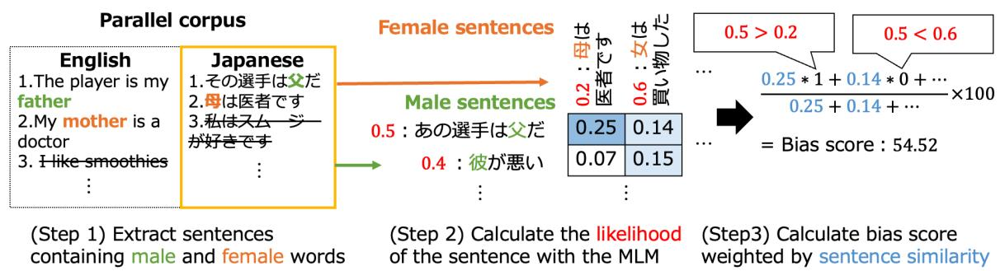
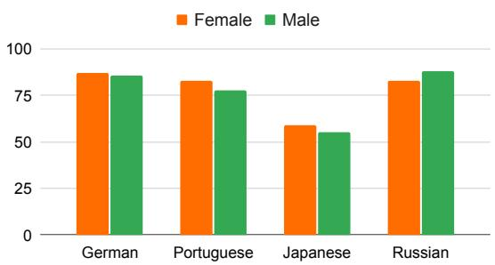

# Gender Bias in Masked Language Models for Multiple Languages

Masahiro Kaneko<sup>1</sup> Aizhan Imankulova<sup>2</sup> Danushka Bollegala<sup>3,4</sup>∗ Naoaki Okazaki<sup>1</sup>

<sup>1</sup>Tokyo Institute of Technology <sup>2</sup>CogSmart Co., Ltd.

<sup>3</sup>University of Liverpool <sup>4</sup>Amazon

masahiro.kaneko@nlp.c.titech.ac.jp

aizhan.imankulova@cogsmart-global.com

danushka@liverpool.ac.uk okazaki@c.titech.ac.jp

## Abstract

Masked Language Models (MLMs) pre-trained by predicting masked tokens on large corpora have been used successfully in natural language processing tasks for a variety of languages. Unfortunately, it was reported that MLMs also learn discriminative biases regarding attributes such as gender and race. Because most studies have focused on MLMs in English, the bias of MLMs in other languages has rarely been investigated. Manual annotation of eval uation data for languages other than English has been challenging due to the cost and difficulty in recruiting annotators. Moreover, the existing bias evaluation methods require the stereotypical sentence pairs consisting of the same context with attribute words (e.g. He/She is a nurse). We propose Multilingual Bias Evaluation (MBE) score, to evaluate bias in various languages using only English attribute word lists and parallel corpora between the target language and English without requiring manually annotated data. We evaluated MLMs in eight languages using the MBE and confirmed that gender-related biases are encoded in MLMs for all those languages. We manually created datasets for gender bias in Japanese and Russian to evaluate the validity of the MBE. The results show that the bias scores reported by the MBE significantly correlates with that computed from the above manually created datasets and the existing English datasets for gender bias.

## 1 Introduction

Masked Language Models (MLMs) (Devlin et al., 2019), which are pre-trained on large corpora, have been used successfully in natural language processing tasks for various languages (Conneau and Lample, 2019; Martin et al., 2020; Conneau et al., 2020). Unfortunately, it has been reported that MLMs also learn social biases regarding attributes such as gender, religion, and race (Kurita et al., 2019; Dev et al., 2020; Kaneko and Bollegala, 2021a; Bender et al., 2021). The bias in MLMs is evaluated by the imbalance of the likelihood between pairs of sentences associated with an attribute that has a common context (e.g. He/She is a nurse). Nadeem et al. (2021) masked the modified tokens (e.g. He, She), and Nangia et al. (2020) masked the unmodified tokens (e.g. is, a, nurse) one word at a time and calculated the likelihood from their predictions to evaluate the bias. Kaneko and Bollegala (2021c) evaluated the bias using the average of the likelihoods of all tokens without masking the MLM.

Despite the numerous studies of social bias in MLMs covering English, social biases in MLMs for other languages remain understudied (Lewis and Lupyan, 2020; Liang et al., 2020; Bartl et al., 2020; Zhao et al., 2020). To realise the diverse and inclusive social and cultural impact of AI, we believe it is important to establish tools for detecting and mitigating unfair social biases in MLMs, not only for English but for all languages. However, the significant manual annotation effort, the costs and difficulties in recruiting qualified annotators remain major challenges when creating bias evaluation benchmarks for target languages. For example, existing bias evaluation benchmarks such as CrowS-Pairs (CP; Nangia et al., 2020) and StereoSet (SS; Nadeem et al., 2021) require humanwritten sentences (or pairs of sentences) eliciting different types of social biases expressed in the target language. However, scaling up this approach to all languages is challenging because recruiting a sufficiently large pool of annotators to cover the different types of social biases in those languages is difficult. Because of the above-mentioned challenges, bias evaluation datasets and studies outside English remain under-developed.

To address this problem, we propose Multilingual Bias Evaluation (MBE) score<sup>1</sup>, a social bias evaluation method that can be used to evaluate bi ases in pre-trained MLMs for a target language without requiring significant manual annotations for that language. MBE can perform equivalent bias evaluation using only existing parallel corpora and lists of English masculine (e.g. he, his,father, son etc.) and feminine (e.g. she, her, mother, daughter, etc.) words, without requiring any manually annotated sentences for social biases in the target language. Although MBE require parallel corpora, such sources already exist for numerous language pairs<sup>2</sup> or can be automatically mined with less effort compared to annotating bias evaluation data (Artetxe and Schwenk, 2019b,a). As a concrete example, we evaluate the proposed method for gender bias, which exists in many languages. Extending the proposed method to other types of social biases beyond gender biases is deferred to future work. As shown in Figure 1, MBE first (shown in Step 1) extracts target language sentences containing female words (female sentences) and sentences containing male words (male sentences) from a parallel corpus between English and the target language using a list of gender words in English. Second, (shown in Step 2) MBE calculates the likelihoods for each of the extracted female and male sentences in the target language using the given MLM under evaluation. Finally, (shown in Step 3) MBE compares the likelihoods between each female sentence and all male sentences considering all pairwise combinations, and increment a count by 1 if the likelihood of the male sentence is greater than that of the female sentence, and 0 otherwise.

  
Figure 1: The bias evaluation method using a parallel corpus between English and the target language and an English female and male words list. Matrix values in Step 2 are the similarities between male and female sentences.

As for Step 1, we do not require any knowledge about the target language or manual annotations because we use only the existing English attribute word lists and parallel corpora between English and the target language. This is attractive from a data availability point of view, which makes our proposed method easily extendable to different languages. Kaneko and Bollegala (2021c) found that the frequency of the words associated with the male gender to be significantly higher than that for the fe male gender in the data used to train MLMs. They showed that these frequency-related biases are encoded into MLMs, and independently of whether a sentence contains a stereotypical or antistereotypical context, an MLM that is biased towards the male gender, on average, assigns higher likelihood scores to sentences that contain masculine words than feminine words<sup>3</sup>. Inspired by this finding, in Step 2, we calculate the likelihood scores assigned by an MLM under evaluation to sentences that contain male and female related words in different contexts (e.g. He is a baseball player and She is a nurse). Step 3 of our proposed method performs the computation of the bias score considering the similarity between the contexts in sentence pairs that contain male and female related words. The more similar the sentence pairs are, the more similar the estimates would be compared to the bias evaluation measures that require identical contexts. Therefore, we weight the bias score estimates by the similarity of the sentence pairs using the sentence representations obtained from the MLM under evaluation. We ignore dissimilar sentence pairs and compute the bias score from the similar sentence pairs, which is defined as the percentage of sentence pairs where the sentence containing the masculine words is assigned a higher likelihood than the sentence containing the feminine words.

Bias in MLM is thought to depend on both the MLM and the evaluation data, so in this paper, we are investigating both using two corpora for English MLMs. Using the proposed method, we evaluated gender bias in MLMs in eight other languages: German, Japanese, Arabic, Spanish, Portuguese, Russian, Indonesian, and Chinese. Prior work investigating social biases in MLMs for English have shown that different types and levels of biases are shown by different MLMs even for the same language (Kaneko and Bollegala, 2021a,c; Dev et al., 2020). We defer covering different MLMs across multiple languages to future work and focus on establishing MBE as an evaluation measure that can be used for such a study.

Our evaluations show that all MLMs learn gender-related biases in all languages studied. To further validate MBE, we conduct a metaevaluation where we use an existing manually annotated English bias evaluation dataset and two additional datasets we annotate in this work covering gender-related biases in Japanese and Russian languages. The bias scores computed using MBE show significantly high correlations with human bias annotations on both datasets (CP and SS), showing its validity for multiple languages as a gender bias evaluation method. Furthermore, we show that MBE is superior to methods using machine translations to evaluate bias in non-English languages. We also show that bias evaluation methods based on templates and word lists significantly overestimate the bias in MLMs due to the unnaturalness of the created templates. Our analyses on the effects of English names on gender information and preservation of gender information in parallel corpora suggest that bias can be evaluated reasonably even with some loss of gender information.

## 2 Related Work

In the study of bias in English MLMs, May et al. (2019) and Kurita et al. (2019) use a pair of artificial sentences created using manually written templates. However, template-based evaluation is problematic because it uses an artificial context that does not reflect the natural usage and distribution of words in the target language. To solve this problem, Nadeem et al. (2021) and Nangia et al.

(2020) manually created bias evaluation datasets, SS and CP, respectively, with stereotypical and antistereotypical sentence-pairs with identical contexts, except the attribute words. However, recent work has pointed out various issues in CP and SS datasets and has argued that they may not provide effective measurements of stereotyping (Blodgett et al., 2021). In this study, (social) bias is defined as the tendency towards outputting sentences about a particular advantageous or disadvantageous group, such as males or females, given the same context by an MLM. However, these benchmarks are currently the most commonly used benchmarks for bias evaluation in MLMs, so we also use them in this work. We note that MBE is independent of any bias evaluation benchmark datasets. Our focus in this paper is on evaluating gender bias in multiple languages and not on comparing or proposing novel debiasing methods. However, for the completion of the discussion, we note that methods for debiasing MLMs using sentence vectors from MLMs (Bommasani et al., 2020) and lists of English male and female words has been studied (Sedoc and Ungar, 2019; Kaneko and Bollegala, 2021a; Dev et al., 2020; Zhou et al., 2022).

In prior work on MLMs, social biases for languages other than English have rarely been investigated. Ahn and Oh (2021) investigated ethnic bias in monolingual MLM in six languages by extending the templates to other languages using machine translation. The biases of MLMs have been evaluated using templates for English and Chinese (Liang et al., 2020) and for English and German (Bartl et al., 2020). Zhao et al. (2020) investigated the gender bias of a classifier that predicts the occupation from resumes using multilingual word embeddings and multilingual MLM embedding in Spanish, German and French. They evaluated bias by using machine translation on the English data, when an MLM is used to create feature representations in a specific task. However, this setting is different from that of our study, where we evaluate the bias of MLMs independently of a specific task. Moreover, the above studies do not discuss or propose methods on how to create evaluation data that can be applied to many languages.

Following the pioneering work by Bolukbasi et al. (2016) that proposed a bias evaluation and debiasing methods, various studies have investigated social biases in English (Caliskan et al., 2017; Zhao et al., 2018; Kaneko and Bollegala, 2019, 2021b;

Dev and Phillips, 2019). Unlike the contextual word embeddings produced by MLMs, evaluating social biases in static word embeddings is relatively less complicated because it can often be done using word lists without requiring annotated sentences. In static word embeddings, bias has been investigated in various languages besides English due to this ease of annotating evaluation data. Lauscher and Glavaš (2019) translated the English word lists into six languages and evaluated the bias of the word embeddings. Zhou et al. (2019) proposed an evaluation metric for languages that require gender morphological agreement, such as in Spanish and French. Friedman et al. (2019) quantified the gender bias of word embeddings to understand cultural contexts with large-scale data, and used it to characterize the statistical gender gap in education, politics, economics, and health in US states and several countries. Bansal et al. (2021) proposed a debiasing method by constructing the same bias space for multiple languages, and adapted it to three Indian languages. Other bias studies have been conducted for specific languages (Takeshita et al., 2020; Pujari et al., 2019; Sahlgren and Olsson, 2019; Chávez Mulsa and Spanakis, 2020), but they are not easily transferable to novel languages.

## 3 Bias Evaluation for Multiple Languages

Our proposed MBE score evaluates the gender bias of the target language under evaluation in three steps (see Figure 1). In Step 1, we first define the set of English sentences and the set of target language sentences $\tau$ of the parallel corpus, where N is the data size, and $( e _ { i } , t _ { i } )$ is a parallel sentence pair. Let $\mathcal { V } _ { f }$ (e.g. she, woman, female) be the list of female words and $\nu _ { m }$ (e.g. he, man, male) be the list of male words in English. We then extract sentences that contain a female or a male word from $\mathcal { E }$ Sentences that contain both male and female words are excluded. Let us denote the set of sentences extracted for a female or a male word w by $\Phi ( w )$ Let $\textstyle { \mathcal { E } } _ { f } = \bigcup _ { w \in \mathcal { V } _ { f } } \Phi ( w )$ and $\begin{array} { r } { \mathcal { E } _ { m } = \bigcup _ { w \in \mathcal { V } _ { m } } \Phi ( w ) } \end{array}$ be the sets of sentences containing respectively all of the male and female words. The set of sentences in the target language of the source sentences included in $\mathcal { E } _ { f }$ and ${ \mathcal { E } } _ { m }$ is denoted by $\mathcal { T } _ { f }$ and $\mathcal { T } _ { m }$ respectively. It is assumed that gender information is retained in the parallel corpus, and whether this is actually the case is verified later.

In Step 2, we compute the likelihood for the full sentences in $\mathcal { T } _ { f }$ and $\mathcal { T } _ { m }$ . Let us consider a target sentence $T = w _ { 1 } , w _ { 2 } , \ldots , w _ { | T | }$ , containing length T sequence of tokens $w _ { i }$ . We calculate the likelihood with All Unmasked Likelihood with Attention weights (AULA; Kaneko and Bollegala, 2021c) which evaluates the bias by considering the weight of MLM attention as the importance of tokens. Given an MLM with pre-trained parameters $\theta ,$ which we must evaluate it for its gender bias, let us denote the probability $P _ { \mathrm { M L M } } ( w _ { i } | T ; \theta )$ assigned by the MLM to a token $w _ { i }$ conditioned on all the tokens of T. AULA predicts all of the tokens in $T$ using the attention weights to evaluate social biases considering the relative importance of words in a sentence, which is given by (1).

$$
A ( T ) : = \frac { 1 } { | T | } \sum _ { i = 1 } ^ { | T | } \alpha _ { i } \log P _ { \mathrm { M L M } } ( w _ { i } | T ; \theta )\tag{1}
$$

Here, $\alpha _ { i }$ is the average of all multi-head attentions associated with $w _ { i }$

In Step 3, by comparing the likelihoods of female and male sentences returned by AULA, we calculate the bias score as the weighted average of the similarities of contexts using the sentence representations produced by the MLM under evaluation. Specifically, We use the percentage of male $( T _ { m } )$ sentences (e.g. He is a baseball player) preferred by the MLM over female $( T _ { f } )$ ones (e.g. She is a nurse) to define the corresponding multilingual bias evaluation measure (MBE bias score) as follows:

$$
1 0 0 \times \frac { \sum _ { T _ { m } \in \mathcal { T } _ { m } } \sum _ { T _ { f } \in \mathcal { T } _ { f } } C ( T _ { m } , T _ { f } ) \mathbb { I } ( A ( T _ { m } ) > A ( T _ { f } ) ) } { \sum _ { T _ { m } \in \mathcal { T } _ { m } } \sum _ { T _ { f } \in \mathcal { T } _ { f } } C ( T _ { m } , T _ { f } ) }\tag{2}
$$

Here, I is the indicator function, which returns 1 if its argument is True and 0 otherwise. $C ( T _ { m } , T _ { f } )$ uses the average of the last layer in MLM for all tokens except special tokens to compute the sentence embeddings of $T _ { m }$ and $T _ { f }$ respectively and computes the cosine similarity of these embeddings. According to this evaluation measure, values close to 50 indicate that the MLM under evaluation is neither females nor males biased, hence, it can be regarded as unbiased. On the other hand, values below 50 indicate a bias towards the male group and above 50 towards the female group. We report a statistically significant difference comparing to the model with randomly assigned results of the indicator function I in Equation 2 with the McNemar’s test $( p < 0 . 0 5 )$ . For each sentence, the presence or absence of bias is predicted by two methods, MLM and Random. The McNemar’s test was used by classifying into four categories: only MLM was biased, only random was biased, both were unbiased, and both were biased. We use the statistically significant difference to determine if there is a bias.

<table><tr><td>Lang</td><td>TED</td><td>News</td></tr><tr><td>German</td><td>4.7K</td><td>2.1K</td></tr><tr><td>Japanese</td><td>6.2K</td><td>1.8K</td></tr><tr><td>Arabic</td><td>7.0K</td><td>1.7K</td></tr><tr><td>Spanish</td><td>7.1K</td><td>17.3K</td></tr><tr><td>Portuguese</td><td>5.7K</td><td>2.2K</td></tr><tr><td>Russian</td><td>6.7K</td><td>3.9K</td></tr><tr><td>Indonesian</td><td>2.9K</td><td>0.5K</td></tr><tr><td>Chinese</td><td>6.8K</td><td>3.4K</td></tr></table>

Table 1: The total number of male and female sentences extracted from the parallel data for each language.

## 4 Gender Bias in Masked Language Models

We use two parallel corpora, the TED2020 v1 corpus in the spoken language domain (TED)<sup>4</sup> and the GlobalVoices corpus in the news domain (News)<sup>5</sup>. Table 1 shows the total number of extracted male and female sentences for each language. Except for Spanish, the News corpus is smaller than the TED corpus for all languages. In particular, the Indonesian news corpus is an extremely low resource. For the list of female and male words in English, we use the list created by Bolukbasi et al. (2016)<sup>6</sup> in addition to the female and male names in CP (Nangia et al., 2020). The extracted male and female sentences were downsampled to create sets of an equal number of sentences. We experimented on the GeForce RTX 2080 Ti using the transformers<sup>7</sup> implementation with default settings (Wolf et al., 2020). All evaluations are completed within 10 minutes.

We used Masked Language Models (MLMs) in eight languages for our experiments: Japanese<sup>8</sup>, German<sup>9</sup> (Chan et al., 2020), Arabic<sup>10</sup> (Antoun et al., 2020), Spanish<sup>11</sup> (Cañete et al., 2020), Portuguese<sup>12</sup> (Souza et al., 2020), Russian<sup>13</sup>, Indonesian<sup>14</sup> and Chinese<sup>15</sup> (Cui et al., 2020).

<table><tr><td>Lang</td><td>MBE(TED)</td><td>MBE(News)</td></tr><tr><td>German</td><td>54.69</td><td>55.12</td></tr><tr><td>Japanese</td><td>54.52</td><td>50.99</td></tr><tr><td>Arabic</td><td>55.72</td><td>54.39</td></tr><tr><td>Spanish</td><td>51.44</td><td>51.69</td></tr><tr><td>Portuguese</td><td>53.07</td><td>54.99$</td></tr><tr><td>Russian</td><td>54.59</td><td>51.00</td></tr><tr><td>Indonesian</td><td>52.38</td><td>50.52</td></tr><tr><td>Chinese</td><td>52.86</td><td>51.80</td></tr></table>

Table 2: The bias score of MLMs using MBE in different languages.  indicates statistically significant difference at p < 0.05.

Table 2 shows the bias scores of the proposed MBE method for the TED and News corpora for the MLMs considered. Here, the significant difference is evaluated against the MBE score of a randomly assigned indicator function. Overall, we see gender-related biases are reported in all cases. In particular, significant biases are shown in the News corpus for all languages except Japanese, Russian and Indonesian. Moreover, the different levels of biases reported for Russian and Japanese between TED and News corpora indicate that bias evaluations are affected not only by the MLMs but also the corpora used. It is known that the bias tendency of MLMs changes depending on the training data (Babaeianjelodar et al., 2020), and similarly, the bias evaluation of MLMs is affected by the evaluation corpus. Because MBE can evaluate bias in various domains as long as there are parallel corpora. It can also capture corpus-dependent biases, unlike existing methods requiring manually created domain-specific sentence pairs.

## 5 Meta-Evaluation

We perform a meta-evaluation to validate MBE scores against human bias ratings. In §5.1 we measure the correlation between MBE scores and existing measures on CP and SS, which are manually annotated bias evaluation benchmarks for English. In §5.2 to compare the evaluation methods in the target languages using MBE and manually annotated data, we manually translate the CP into the Japanese and Russian, which demonstrate high corpus-specific biases according to Table 2.

```html
<sup>11</sup>https://huggingface.co/dccuchile/
bert-base-spanish-wwm-uncased
<sup>12</sup>https://huggingface.co/neuralmind/
bert-base-portuguese-cased
<sup>13</sup>https://huggingface.co/blinoff/
roberta-base-russian-v0
<sup>14</sup>https://huggingface.co/cahya/
bert-base-indonesian-522M
<sup>15</sup>https://huggingface.co/hfl/
chinese-bert-wwm-ext
```

<table><tr><td></td><td>Shf</td><td>MBE</td></tr><tr><td rowspan="4">Spearman Pearson CP Direction Diff</td><td>0.06</td><td>0.41</td></tr><tr><td>0.05</td><td>0.63†</td></tr><tr><td>0.54</td><td>0.72</td></tr><tr><td>4.06</td><td>2.36</td></tr><tr><td rowspan="4">SS</td><td>Spearman</td><td>0.21</td><td>0.41</td></tr><tr><td>Pearson</td><td>0.04</td><td>0.62†</td></tr><tr><td>Direction</td><td>0.54</td><td>0.72</td></tr><tr><td>Diff</td><td>6.66</td><td>5.04</td></tr></table>

Table 3: Bias scores computed using Shf and the MBE methods for English MLMs in CP and SS. Correlation between the original and proposed evaluation represented by Spearman and Pearson correlation coefficients. indicates significant correlation at $p < 0 . 0 5$ Direction is the percentage of agreement for direction of the bias score between original and proposed evaluations. Diff is the mean of the difference between the bias scores of the original and proposed methods.

## 5.1 Gender Bias Evaluation Using Manually Annotated Data in English

To validate MBE scores using human bias ratings, we use CP and SS datasets for English. As baseline method we use Shf, which shuffles the sets of male and female sentences and randomly pair sentences from this set. Shf is used to show the usefulness of comparing the likelihoods of male and female sets. In the existing evaluation method using manually annotated sentence pairs, the bias score is calculated for stereotypical S<sub>s</sub> (e.g. He is a doctor) and anti-stereotypical $S _ { a }$ (e.g. She is a doctor) sentences with identical contexts as follows:

$$
\frac { 1 0 0 } { N } \sum _ { S _ { s } , S _ { a } } \mathbb { I } ( A ( S _ { s } ) > A ( S _ { a } ) )\tag{3}
$$

where N is the total number of sentences. We use this bias score as an upper bound score to compare against it the results for Shf and MBE using the rank correlations (Spearman and Pearson), the agreement of the direction of bias between female and male directions (Direction), where the bias scores above 50 indicate a bias towards the male direction and that below 50 towards the female direction, and the difference of the bias scores (Diff) from the results of the method using manual annotation. In the proposed method and Shf, for the gender bias data of CP and SS, we extract sentences containing male and female words for each sentence, instead of sentence pairs, and use them for evaluation using Equation 3.

As English MLMs, we use BERT<sup>16</sup>, multilingual $\mathrm { B E R T ^ { 1 7 } }$ (Devlin et al., 2019), RoBERTa<sup>18</sup> (Liu et al., 2019), ALBERT<sup>19</sup> (Lan et al., 2019), DistilBERT<sup>20</sup>, DistilRoBERTa<sup>21</sup> (Sanh et al., 2019), $\mathrm { C o n v B E R T } ^ { 2 2 }$ (Jiang et al., 2020), XL $\mathbf { \delta } _ { \mathbf { M } } { } ^ { 2 3 }$ (Conneau and Lample, 2019), and Deberta<sup>24</sup> (He et al., 2020). Since BERT and RoBERTa each use two models of different sizes, we use a total of 11 models. We report the averaged results over the above 11 models.

Table 3 shows that MBE has high performance in all evaluations. Performance of Shf highlights the importance of comparing male against female sentences in sentence pairs.

## 5.2 Gender Bias Evaluation Using Manually Annotated Data in Japanese and Russian

To validate MBE scores, which does not require evaluation data with identical context, nor manual creation of evaluation data in the target languages other than English, we use the following methods: HT: Native speakers manually translated all 262 sentence pairs in CP into Japanese and Russian and apply Equation 3. This human translated (HT) baseline can be seen as an upper bound for bias evaluation compared to MBE, which does not require translated examples. Lower difference from these bias scores in this human-translated (HT) method would indicate a more reliable bias evaluation measure. Note that, it is not appropriate to compare the bias score calculated using the English MLMs with the bias score calculated using the Japanese MLMs because we are evaluating different models. Therefore, we calculate the bias score in Equation 3 using the data translated into Japanese and Russian.

<table><tr><td></td><td>MLM</td><td>Bias score</td><td>Diff</td></tr><tr><td rowspan="3">HT(Japanese)</td><td>base-subword</td><td>52.67‡</td><td></td></tr><tr><td>large-subword</td><td>56.87</td><td></td></tr><tr><td>base-char large-char</td><td>48.47 55.73</td><td></td></tr><tr><td rowspan="4">MT(Japanese)</td><td>base-subword</td><td>49.24</td><td>-3.43</td></tr><tr><td>large-subword</td><td>52.67</td><td>-4.20</td></tr><tr><td>base-char</td><td>54.20</td><td>5.73</td></tr><tr><td>large-char</td><td>45.80</td><td>9.93</td></tr><tr><td rowspan="4">MBE(Japanese)</td><td>base-subword</td><td>54.89</td><td>2.22</td></tr><tr><td>large-subword</td><td>55.85</td><td>-1.02</td></tr><tr><td>base-char</td><td> $5 2 . 6 9 ^ { \ddagger }$ </td><td>4.22</td></tr><tr><td>large-char</td><td>50.60</td><td>-5.13</td></tr><tr><td rowspan="4">Tmp(Japanese)</td><td>base-subword</td><td>88.31‡</td><td>35.64</td></tr><tr><td>large-subword</td><td>82.13</td><td>25.26</td></tr><tr><td>base-char</td><td> $6 4 . 6 3 ^ { \ddagger }$ </td><td>16.16</td></tr><tr><td>large-char</td><td>45.40</td><td>-10.33</td></tr></table>

Table 4: The CP bias scores for manually translated CP to Japanese and bias scores for machine translated CP and the proposed method MBE. Diff shows the difference between MT, MBE and Tmp bias scores and HT bias scores, respectively. indicates statistically significant difference at $p < 0 . 0 5$

MBE: Here, we let MBE(Japanese) and MBE(Russian) be the MBE scores computed using the Equation 2 and parallel data created above by manually translating original (English) CP dataset into Japanese and Russian for Step 1, respectively.

MT: As an alternative to costly manual translations, we use Google Machine Translation method $( \mathbf { M T } ) ^ { 2 5 }$ to translate sentence pairs in CP sharing identical contexts into each target language and apply Equation 3.

Tmp: Although it requires some knowledge about the target language, one can create templates in the target language for both genders such as “[Gender]は[Occupation]です” ([Gender] is a/an [Occupation]) in Japanese, and fill in male and female word pairs, and occupation words as in “彼/彼女は 医者です” (He/She is a doctor) to create an equal number of sentences as the evaluation data for Equation 3. In the template-based method (Tmp), five word pairs were used for Japanese and Russian following prior work by Kurita et al. (2019)<sup>26</sup>.

<table><tr><td></td><td>MLM</td><td>Bias score</td><td>Diff</td></tr><tr><td rowspan="2">HT(Russian)</td><td>wiki&amp;nwes</td><td>46.95</td><td>一</td></tr><tr><td>subtitle&amp;sns</td><td>48.85</td><td>一</td></tr><tr><td rowspan="2">MT(Russian)</td><td>wiki&amp;nwes</td><td>49.62</td><td>2.67</td></tr><tr><td>subtitle&amp;sns</td><td>50.38</td><td>1.53</td></tr><tr><td rowspan="2">MBE(Russian)</td><td>wiki&amp;nwes</td><td>46.05</td><td>-0.90</td></tr><tr><td>subtitle&amp;sns</td><td> $4 8 . 8 2 ^ { \ddagger }$ </td><td>-0.03</td></tr><tr><td rowspan="2">Tmp(Russian)</td><td>wiki&amp;nwes</td><td>34.87</td><td>-12.1</td></tr><tr><td>subtitle&amp;sns</td><td> $6 3 . 5 1 ^ { \ddagger }$ </td><td>14.7</td></tr></table>

Table 5: The CP bias scores for manually translated CP to Russian and bias scores for machine translated CP and the proposed method MBE. Diff shows the difference between MT, MBE and Tmp bias scores and HT bias scores, respectively. indicates statistically significant difference at $p < 0 . 0 5$

The templates were “[Gender]は[Occupation]で す。” and “[Gender]は[Occupation]に興味があ る。” in Japanese and “[Gender] - [Occupation].” and “[Gender] - [Occupation] поспециа льн $_ { \mathrm { ~ O ~ C ~ T ~ H ~ } }$ .” were used for Russian. We extracted respectively 644 and 154 occupation words for Japanese and Russian from Wikipedia<sup>27</sup>. Following prior work by Kurita et al. (2019), we generated respectively 6400 and 1500 template sentences for Japanese and Russian, and evaluated them using sentence pairs with identical contexts.

For Japanese MLMs, we evaluate four Japanese BERT models (base-subword<sup>28</sup>, large-subword<sup>29</sup>, base-char<sup>30</sup>, large-char<sup>31</sup>), subword-based and character-based, with base and large sizes. For Russian, we use two MLMs – one trained on Wikipedia and news data (wiki&news)<sup>32</sup> and the other on OpenSubtitles (Lison and Tiedemann, 2016) and SNS data (Shavrina and Shapovalova, 2017). For Japanese and Russian, we use the difference of the bias scores instead of the correlation coefficients with HT because the number of publicly available pre-trained MLMs is smaller than that of English.

<table><tr><td></td><td>MLM</td><td>Bias score</td><td>Diff</td></tr><tr><td rowspan="4"> $\mathrm { H T _ { n a m e } ( J a p a n e s e ) }$ </td><td>base-subword</td><td> $5 2 . 2 9 ^ { \ddagger }$ </td><td>-0.38</td></tr><tr><td>large-subword</td><td> $5 4 . 5 8 ^ { \ddagger }$ </td><td>-2.29</td></tr><tr><td>base-char</td><td> $4 8 . 4 7 ^ { \ddagger }$ </td><td>0.00</td></tr><tr><td>large-char</td><td> $5 3 . 4 4 ^ { \ddagger }$ </td><td>-2.29</td></tr><tr><td rowspan="2"> $\mathrm { H T _ { n a m e } ( R u s s i a n ) }$ </td><td>wiki&amp;news</td><td> $4 7 . 3 3 ^ { \ddagger }$ </td><td>0.38</td></tr><tr><td>subtitle&amp;sns</td><td> $4 8 . 0 9 ^ { \ddagger }$ </td><td>-0.76</td></tr></table>

Table 6: The difference between the bias score for the original data and the bias score for the CP data translated into Japanese and Russian with the names of people replaced by Japanese and Russian, respectively. indicates statistically significant difference at $p < 0 . 0 5$

Tables 4 and 5 show the bias scores of HT, MT, Tmp and MBE and their differences measured against HT for Japanese and Russian MLMs, respectively. We see that the difference between the bias scores of HT and MBE are smaller than that for MT, indicating that MBE closely approximates the human bias ratings in HT than other alternatives. Moreover, we see that the direction of bias is reversed for base-char, large-char, and subtitle&sns compared to HT. Note that we can not directly compare Tmp with other methods due to the difference in evaluation data. However, as one of the previous bias evaluation methods, Tmp overestimates the biases of MLMs, especially for Japanese subwords. This is because simple artificial templates often over-emphasize gender biases compared to natural sentences, Interestingly, MBE is more accurate than MT when evaluating gender biases. Further investigations revealed that MT model itself could produce gender-biased translations, thereby adding noise to the translated sentences.

## 6 Bias in Personal Names

One of the most significant differences in the frequency of words used in each language that affects gender bias is the names of people. In bias evaluation, male and female names are used to identify the gender (Caliskan et al., 2017; Romanov et al., 2019). However, when names are transliterated from English to the target language, those transliterated names might be infrequent in the target language and might not be gender representative. To study the effect of this issue on gender bias evaluation, we conduct the following experiment. First, for the Japanese and Russian target languages, we replace the transliterated English names in the CP data with native Japanese and Russian names of the same gender. Next, we compare the bias scores with those before the replacement in Tables 4 and 5. We extracted the top 10 most popular names among Japanese<sup>33</sup> and Russians<sup>34</sup> for both genders, and randomly substituted them with the transliterated English names. For example, we rewrite $\cos ( 1 ) - 1 \alpha + \frac { \pi } { 2 } \alpha - 7 \alpha - \frac { 2 \sqrt { 3 } } { 2 } \alpha + \alpha \alpha - \pi$ $\overline { { \Phi ^ { , \prime , \prime } ( ^ { * } \mathrm { S h e l l y ~ i s ~ a ~ n u r s e } ^ { , \prime , } \to ^ { * } \mathrm { M i s a k i ~ i s ~ a ~ n u r s e } ^ { , \prime , \prime } ) } } .$

  
Figure 2: Percentage of manually translated sentences preserving gender information from English News data.

Table 6 shows the MBE score for Japanese $( \mathrm { H T _ { n a m e } ( J a p a n e s e ) } )$ and Russian $( \mathrm { H T _ { n a m e } ( R u s s i a n ) } )$ after the name replacement and the corresponding differences w.r.t. original bias scores shown in Tables 4 and 5). We can see that the bias scores of the Japanese base models and all the Russian models are almost the same compared to respective values in Tables 4 and 5. The large models for Japanese differ by about -2.29, which is lower than the baseline in the table. Moreover, the direction of the bias has not changed in both languages compared to respective directions in Tables 4 and 5. These results suggest that the bias can be evaluated reasonably even when English names are transliterated into a target language.

## 7 Preserving Gender in Parallel Corpora

Step 1 of the proposed method requires that gender information in English (source) sentence matches that with the target translation in the parallel data. To test for this, we examine the proportion of sentences in which the corresponding translated words of English “she” and “he” appear to determine whether female or male gender information is retained. We use the News corpus and select Japanese and Russian, which had no bias, and German and Portuguese, which had significant biases (Table 2).

Figure 2 shows the percentage of sentences where gender was retained for male and female sentences in the target languages<sup>35</sup>. For German, Portuguese, and Russian, gender is retained in more than 80% of the sentences. This suggests that when the the percentage of gender-preserved sentences is large, it does not affect the MBE score. In Japanese, gender information is retained in only about 60% of sentences, which is much lower than in other languages. This may be because Japanese is a null subject language that allows independent clauses to omit explicit subjects. In fact, in some cases, gender words were omitted in the parallel corpus, for example “He owns a grocery store and runs a motorcycle rental business.” was translated to “自 分の食料品店を持ち、レンタルバイクビジ ネスも営んでいる。 (Owns a grocery store and runs a rental motorcycle business.)”. Contrarily, from the results in Table 4, MBE(Japanese) can detect the bias better than other methods. The reason may be that even if the gender words are omitted if the context is composed of words that often cooccur with male and female words, it is possible that it complements the gender information. In fact, Bolukbasi et al. (2016) show that words that co-occur with male and female words retain gender information. The results also show that gender preservation is not heavily biased in either the male or female direction, based on the small difference between percentages for male and female sentences for each language. This suggests that the bias in the preservation of gender information may not affect the evaluation of the proposed method.

## 8 Conclusion

In this paper, we showed that a bias evaluation data and evaluation of MLMs for discriminatory bias can be systematically created as long as there is a parallel corpus of English and the target language and a list of female and male words in English. Our meta-evaluation proved that the proposed multilingual bias evaluation method could perform correct evaluation comparing against method using manually created data, at least for Russian, Japanese, and English. The experimental results show that gender bias exists in all eight languages of our experiments. We also showed that the proposed method is superior to the methods that use machine translation to translate the English bias evaluation data into the target language and the methods that use templates and word lists.

## Acknowledgements

This paper is based on results obtained from a project, JPNP18002, commissioned by the New Energy and Industrial Technology Development Organization (NEDO).

## References

Jaimeen Ahn and Alice Oh. 2021. Mitigating languagedependent ethnic bias in BERT. In Proceedings ofthe 2021 Conference on Empirical Methods in Natural Language Processing, pages 533–549, Online and Punta Cana, Dominican Republic. Association for Computational Linguistics.

Wissam Antoun, Fady Baly, and Hazem Hajj. 2020. AraBERT: Transformer-based model for Arabic language understanding. In OSACT4, pages 9–15. European Language Resource Association.

Mikel Artetxe and Holger Schwenk. 2019a. Marginbased parallel corpus mining with multilingual sentence embeddings. In Proceedings of the 57th Annual Meeting ofthe Associationfor Computational Linguistics, pages 3197–3203, Florence, Italy. Association for Computational Linguistics.

Mikel Artetxe and Holger Schwenk. 2019b. Massively Multilingual Sentence Embeddings for Zero-Shot Cross-Lingual Transfer and Beyond. Transactions of the Associationfor Computational Linguistics, 7:597– 610.

Marzieh Babaeianjelodar, Stephen Lorenz, Josh Gordon, Jeanna Matthews, and Evan Freitag. 2020. Quantifying gender bias in different corpora. In WWW, WWW ’20, page 752–759. Association for Computing Machinery.

Srijan Bansal, Vishal Garimella, Ayush Suhane, and Animesh Mukherjee. 2021. Debiasing multilingual word embeddings: A case study of three indian languages. In Proceedings ofthe 32nd ACM Conference on Hypertext and Social Media, pages 27–34.

Marion Bartl, Malvina Nissim, and Albert Gatt. 2020. Unmasking contextual stereotypes: Measuring and mitigating BERT’s gender bias. In GeBNLP, pages 1–16. Association for Computational Linguistics.

Emily M. Bender, Timnit Gebru, Angelina McMillan-Major, and Shmargaret Shmitchell. 2021. On the dangers of stochastic parrots: Can language models be too big? In FAccT, FAccT ’21, page 610–623. Association for Computing Machinery.

Su Lin Blodgett, Gilsinia Lopez, Alexandra Olteanu, Robert Sim, and Hanna Wallach. 2021. Stereotyping Norwegian salmon: An inventory of pitfalls in fairness benchmark datasets. In ACL-IJCNLP, pages 1004–1015. Association for Computational Linguistics.

Tolga Bolukbasi, Kai-Wei Chang, James Y Zou, Venkatesh Saligrama, and Adam T Kalai. 2016. Man is to computer programmer as woman is to homemaker? debiasing word embeddings. In NeurIPS, volume 29. Curran Associates, Inc.

Rishi Bommasani, Kelly Davis, and Claire Cardie. 2020. Interpreting Pretrained Contextualized Representations via Reductions to Static Embeddings. In COL-ING, pages 4758–4781. Association for Computational Linguistics.

Aylin Caliskan, Joanna J Bryson, and Arvind Narayanan. 2017. Semantics derived automatically from language corpora contain human-like biases. Science, 356(6334):183–186.

José Cañete, Gabriel Chaperon, Rodrigo Fuentes, Jou-Hui Ho, Hojin Kang, and Jorge Pérez. 2020. Spanish pre-trained bert model and evaluation data. In PML4DC.

Branden Chan, Stefan Schweter, and Timo Möller. 2020. German’s next language model. In COLING, pages 6788–6796. International Committee on Computational Linguistics.

Rodrigo Alejandro Chávez Mulsa and Gerasimos Spanakis. 2020. Evaluating bias in Dutch word embeddings. In GeBNLP, pages 56–71. Association for Computational Linguistics.

Alexis Conneau, Kartikay Khandelwal, Naman Goyal, Vishrav Chaudhary, Guillaume Wenzek, Francisco Guzmán, Edouard Grave, Myle Ott, Luke Zettlemoyer, and Veselin Stoyanov. 2020. Unsupervised cross-lingual representation learning at scale. In ACL, pages 8440–8451. Association for Computational Linguistics.

Alexis Conneau and Guillaume Lample. 2019. Crosslingual language model pretraining. In NeurIPS, volume 32. Curran Associates, Inc.

Yiming Cui, Wanxiang Che, Ting Liu, Bing Qin, Shijin Wang, and Guoping Hu. 2020. Revisiting pre-trained models for Chinese natural language processing. In EMNLP: Findings, pages 657–668. Association for Computational Linguistics.

Sunipa Dev, Tao Li, Jeff M Phillips, and Vivek Srikumar. 2020. On measuring and mitigating biased inferences of word embeddings. In AAAI, volume 34, pages 7659–7666.

Sunipa Dev and Jeff Phillips. 2019. Attenuating bias in word vectors. In AISTATS, pages 879–887. PMLR.

Jacob Devlin, Ming-Wei Chang, Kenton Lee, and Kristina Toutanova. 2019. BERT: Pre-training of deep bidirectional transformers for language understanding. In NAACL, pages 4171–4186. Association for Computational Linguistics.

Scott Friedman, Sonja Schmer-Galunder, Anthony Chen, and Jeffrey Rye. 2019. Relating word embedding gender biases to gender gaps: A cross-cultural analysis. In GeBNLP, pages 18–24. Association for Computational Linguistics.

Pengcheng He, Xiaodong Liu, Jianfeng Gao, and Weizhu Chen. 2020. Deberta: Decoding-enhanced bert with disentangled attention. arXiv preprint arXiv:2006.03654.

Zi-Hang Jiang, Weihao Yu, Daquan Zhou, Yunpeng Chen, Jiashi Feng, and Shuicheng Yan. 2020. Convbert: Improving bert with span-based dynamic convolution. Advances in Neural Information Processing Systems, 33.

Masahiro Kaneko and Danushka Bollegala. 2019. Gender-preserving debiasing for pre-trained word embeddings. In COLING, pages 1641–1650. Association for Computational Linguistics.

Masahiro Kaneko and Danushka Bollegala. 2021a. Debiasing pre-trained contextualised embeddings. In EACL, pages 1256–1266. Association for Computational Linguistics.

Masahiro Kaneko and Danushka Bollegala. 2021b. Dictionary-based debiasing of pre-trained word embeddings. In EACL, pages 212–223. Association for Computational Linguistics.

Masahiro Kaneko and Danushka Bollegala. 2021c. Unmasking the mask–evaluating social biases in masked language models. arXiv preprint arXiv:2104.07496.

Keita Kurita, Nidhi Vyas, Ayush Pareek, Alan W Black, and Yulia Tsvetkov. 2019. Measuring bias in contextualized word representations. In GeBNLP, pages 166–172. Association for Computational Linguistics.

Zhenzhong Lan, Mingda Chen, Sebastian Goodman, Kevin Gimpel, Piyush Sharma, and Radu Soricut. 2019. Albert: A lite bert for self-supervised learning of language representations. arXiv preprint arXiv:1909.11942.

Anne Lauscher and Goran Glavaš. 2019. Are we consistently biased? multidimensional analysis of biases in distributional word vectors. In \*SEM, pages 85–91. Association for Computational Linguistics.

Molly Lewis and Gary Lupyan. 2020. Gender stereotypes are reflected in the distributional structure of 25 languages. Nature human behaviour, 4(10):1021– 1028.

Sheng Liang, Philipp Dufter, and Hinrich Schütze. 2020. Monolingual and multilingual reduction of gender bias in contextualized representations. In COLING,

pages 5082–5093. International Committee on Computational Linguistics.

Pierre Lison and Jörg Tiedemann. 2016. OpenSubtitles2016: Extracting large parallel corpora from movie and TV subtitles. In LREC, pages 923–929. European Language Resources Association (ELRA).

Yinhan Liu, Myle Ott, Naman Goyal, Jingfei Du, Mandar Joshi, Danqi Chen, Omer Levy, Mike Lewis, Luke Zettlemoyer, and Veselin Stoyanov. 2019. Roberta: A robustly optimized bert pretraining approach. arXiv preprint arXiv:1907.11692.

Louis Martin, Benjamin Muller, Pedro Javier Ortiz Suárez, Yoann Dupont, Laurent Romary, Éric de la Clergerie, Djamé Seddah, and Benoît Sagot. 2020. CamemBERT: a tasty French language model. In ACL, pages 7203–7219. Association for Computational Linguistics.

Chandler May, Alex Wang, Shikha Bordia, Samuel R. Bowman, and Rachel Rudinger. 2019. On measuring social biases in sentence encoders. In NAACL, pages 622–628. Association for Computational Linguistics.

Moin Nadeem, Anna Bethke, and Siva Reddy. 2021. StereoSet: Measuring stereotypical bias in pretrained language models. In ACL-IJCNLP, pages 5356– 5371, Online. Association for Computational Linguistics.

Nikita Nangia, Clara Vania, Rasika Bhalerao, and Samuel R. Bowman. 2020. CrowS-pairs: A challenge dataset for measuring social biases in masked language models. In EMNLP, pages 1953–1967. Association for Computational Linguistics.

Arun K. Pujari, Ansh Mittal, Anshuman Padhi, Anshul Jain, Mukesh Jadon, and Vikas Kumar. 2019. Debiasing gender biased hindi words with word-embedding. In ACAI, ACAI 2019, page 450–456. Association for Computing Machinery.

Alexey Romanov, Maria De-Arteaga, Hanna Wallach, Jennifer Chayes, Christian Borgs, Alexandra Chouldechova, Sahin Geyik, Krishnaram Kenthapadi, Anna Rumshisky, and Adam Kalai. 2019. What’s in a name? Reducing bias in bios without access to protected attributes. In NAACL, pages 4187–4195. Association for Computational Linguistics.

Magnus Sahlgren and Fredrik Olsson. 2019. Gender bias in pretrained Swedish embeddings. In NoDaLiDa, pages 35–43. Linköping University Electronic Press.

Victor Sanh, Lysandre Debut, Julien Chaumond, and Thomas Wolf. 2019. Distilbert, a distilled version of bert: smaller, faster, cheaper and lighter. arXiv preprint arXiv:1910.01108.

João Sedoc and Lyle Ungar. 2019. The role of protected class word lists in bias identification of contextualized word representations. In GeBNLP, pages 55–61. Association for Computational Linguistics.

Tatiana Shavrina and Olga Shapovalova. 2017. To the methodology of corpus construction for machine learning:«taiga» syntax tree corpus and parser. Corpora, pages 78–84.

Fábio Souza, Rodrigo Nogueira, and Roberto Lotufo. 2020. BERTimbau: pretrained BERT models for Brazilian Portuguese. In BRACIS.

Masashi Takeshita, Yuki Katsumata, Rafal Rzepka, and Kenji Araki. 2020. Can existing methods debias languages other than English? first attempt to analyze and mitigate Japanese word embeddings. In GeBNLP, pages 44–55. Association for Computational Linguistics.

Thomas Wolf, Lysandre Debut, Victor Sanh, Julien Chaumond, Clement Delangue, Anthony Moi, Pierric Cistac, Tim Rault, Rémi Louf, Morgan Funtowicz, Joe Davison, Sam Shleifer, Patrick von Platen, Clara Ma, Yacine Jernite, Julien Plu, Canwen Xu, Teven Le Scao, Sylvain Gugger, Mariama Drame, Quentin Lhoest, and Alexander M. Rush. 2020. Transformers: State-of-the-art natural language processing. In EMNLP: System Demonstrations, pages 38–45. Association for Computational Linguistics.

Jieyu Zhao, Subhabrata Mukherjee, Saghar Hosseini, Kai-Wei Chang, and Ahmed Hassan Awadallah. 2020. Gender bias in multilingual embeddings and crosslingual transfer. In COLING, pages 2896–2907. Association for Computational Linguistics.

Jieyu Zhao, Yichao Zhou, Zeyu Li, Wei Wang, and Kai-Wei Chang. 2018. Learning gender-neutral word embeddings. In EMNLP, pages 4847–4853. Association for Computational Linguistics.

Pei Zhou, Weijia Shi, Jieyu Zhao, Kuan-Hao Huang, Muhao Chen, Ryan Cotterell, and Kai-Wei Chang. 2019. Examining gender bias in languages with grammatical gender. In EMNLP-IJCNLP, pages 5276–5284. Association for Computational Linguistics.

Yi Zhou, Masahiro Kaneko, and Danushka Bollegala. 2022. Sense embeddings are also biased-evaluating social biases in static and contextualised sense embeddings. In Proceedings of the 60th Annual Meeting of the Association for Computational Linguistics, Dublin. Association for Computational Linguistics.