# Generic and Trend-aware Curriculum Learning for Relation Extraction in Graph Neural Networks

Nidhi Vakil   
Department of Computer Science   
University of Massachusetts Lowell nvakil@cs.uml.edu Hadi Amiri   
Department of Computer Science   
University of Massachusetts Lowell hadi@cs.uml.edu

## Abstract

We present a generic and trend-aware curriculum learning approach for graph neural networks. It extends existing approaches by incorporating sample-level loss trends to better discriminate easier from harder samples and schedule them for training. The model effectively integrates textual and structural information for relation extraction in text graphs. Experimental results show that the model provides robust estimations of sample difficulty and shows sizable improvement over the stateof-the-art approaches across several datasets.

## 1 Introduction

Relation extraction is the task of detecting (often pre-defined) relations between entity pairs. It has been investigated in both natural language processing (Mintz et al., 2009; Lin et al., 2016; Peng et al., 2017; Zhang et al., 2018) and network science (Zhang and Chen, 2018; Fout et al., 2017). Relation extraction is a challenging task, especially when data is scarce. Nonetheless, the ability to automatically link entity pairs is a crucial task as it can reveal relations that have not been previously identified, e.g., informing clinicians about a causal relation between a gene and a phenotype or disease. Figure 1 shows an example sentence from a PubMed article in the Gene Phenotype Relation (PGR) dataset (Sousa et al., 2019), which describes the application domain of the present work as well.

Previous research has extensively investigated relation extraction at both sentence (Zeng et al., 2015; dos Santos et al., 2015; Sousa et al., 2019) and document (Yao et al., 2019b; Quirk and Poon, 2017) levels. Furthermore, effective graph-based neural network approaches have been developed for various prediction tasks on graphs, including link prediction between given node pairs (Kipf and Welling, 2017; Hamilton et al., 2017; Xu et al., 2018; Velickoviˇ c et al.´ , 2018). Several recent approaches (Li et al., 2020; Zhang and Chen, 2018;

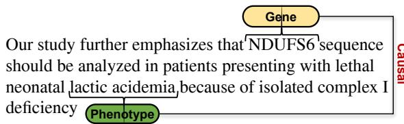  
Figure 1: An example showing the report of a causal relation between a gene and a phenotype (symptom) from the PGR dataset (Sousa et al., 2019).

Alsentzer et al., 2020) illustrated the importance of enhancing graph neural networks using structurallyinformed features such as shortest paths, random walks and node position features.

In this work, we develop a graph neural network titled Graph Text Neural Network (GTNN) that employs structurally-informed node embeddings as well as textual descriptions of nodes at prediction layer to avoid information loss for relation extraction. GTNN can be trained using a standard approach where data samples are fed to the network in a random order (Hamilton et al., 2017). However, nodes, edges or sub-graphs can significantly vary in their difficulty to learn, owing to frequent substructures, complicated topology and indistinct patterns in graph data. We tackle these challenges by presenting a generic and trend-aware curriculum learning approach that incorporates samplelevel loss trajectories (trends) to better discriminate easier from harder samples and schedule them for training graph neural networks.

The contributions of this paper are: (a): a graph neural network that effectively integrates textual data and graph structure for relation extraction, illustrating the importance of direct use of text embeddings at prediction layer to avoid information loss in the iterative process of learning node embeddings for graph data; and (b): a novel curriculum learning approach that incorporates loss trends at sample-level to discover effective curricula for training graph neural networks.

We conduct extensive experiments on real world datasets in both general and specific domains, and compare our model against a range of existing approaches including the state-of-the-art models for relation extraction. Experimental results demonstrate the effectiveness of the proposed approach; the model achieves an average of 8.6 points improvement in F1 score against the best-performing graph neural network baseline that does not directly use text embeddings at its prediction layer. The proposed curriculum learning approach further improves this performance by 0.7 points, resulting in an average F1 score of 89.9 on our three datasets. We conduct extensive experiments to shed light on the improved performance of the model. Code and data are available at https: //clu.cs.uml.edu/tools.html.

## 2 Method

Consider an undirected graph $G = ( \nu , \mathcal { E } )$ where and  are nodes and edges respectively, and nodes carry text summaries as their descriptions. Edges in the graph indicate “relations” between their end points, e.g., causal relations between genes and diseases, or links between concepts in an encyclopedia. Our goal is to predict relations/links between given node pairs in G.

## 2.1 Graph Text Neural Network

We present the Graph Text Neural Network (GTNN) model which directly operates on G and textual descriptions of its nodes. Figure 2 shows the architecture of GTNN, which we describe below.

## 2.1.1 Graph Encoder

Given G and its initial text embeddings, $\mathbf { x } _ { i }$ for each node i, we apply a graph encoder (Hamilton et al., 2017) to generate a d-dimensional embedding for each node by iteratively aggregating the current embeddings of the node and its t-hop neighbours through the sigmod function denoted by g:

$$
\mathbf { h } _ { i } ^ { ( t + 1 ) } = g \Big ( \mathbf { W } _ { 1 } \mathbf { h } _ { i } ^ { ( t ) } + \mathbf { W } _ { 2 } ( \frac { 1 } { | \mathcal { N } _ { i } | } \sum _ { j \in \mathcal { N } _ { i } } \mathbf { h } _ { j } ^ { ( t ) } ) \Big ) ,\tag{1}
$$

where $\mathbf { h } _ { i } ^ { ( t ) }$ is the embedding of node i at the $t ^ { t h }$ layer of the encoder and is initialized by $\mathbf { x } _ { i } ,$ , i.e., $\mathbf { h } _ { i } ^ { ( 0 ) } = \mathbf { x } _ { i } , \forall i$ , and ${ \mathcal { N } } _ { i }$ is the set of neighbors of node i aggregated through a mean operation. $\mathbf { W } _ { 1 }$ and $\mathbf { W } _ { 2 }$ are parameter matrices to learn during training. Equation (1), applied iteratively, generates node embeddings $\mathbf { z } _ { i } = \mathbf { \bar { h } } _ { i } ^ { ( t + 1 ) } \in \mathbb { R } ^ { d }$

## 2.1.2 Additional Text Features

In addition to the representations obtained from the graph encoder, we use additional features from text data to better learn the relations between entities. Here, we consider three types of features: (a) relevance score between the descriptions of node pairs obtained from information retrieval (IR) algorithms; we use BM-25 (Robertson et al., 1995), classic TF/IDF (Jones, 1972), as well as DFR-H and DFR-Z (Amati and Van Rijsbergen, 2002) models. These IR models capture lexical similarities and relevance between node pairs through different approaches; (b): we also use the initial text embeddings of nodes $( \mathbf { x } _ { i } , \forall i )$ as additional features because the direct uses of these embeddings at prediction layer can avoid information loss in the iterative process of learning node embeddings for graph data; and (c): if there exist other text information for a given node pair, e.g., a sentence mentioning the node pair as in Figure 1, we use the embeddings of such information as additional features.

## 2.1.3 Graph Text Decoder

For a given node pair $( u , v )$ , we combined representation of their additional features using a single hidden layer neural network as follows:

$$
{ \bf h } _ { u v } = \mathtt { R e L U } \big ( \mathbf { W } ^ { e } \mathbf { a } _ { u v } + \mathbf { b } ^ { e } \big ) ,\tag{2}
$$

where a is obtained by concatenating the additional feature vectors of u and v. We combine $\mathbf { h } _ { u v }$ with node representations, $\mathbf { z } _ { u }$ and $\mathbf { z } _ { v }$ , and pass them to a two layer decoder to predict their relations:

$$
\begin{array} { r } { { \bf h } = \mathrm { R e L U } \Big ( { \bf W } ^ { l a s t } f ( { \bf h } _ { u v } , { \bf z } _ { u } , { \bf z } _ { v } ) + { \bf b } ^ { l a s t } \Big ) , } \\ { p ( u , v ) = g \left( { \bf W } ^ { o u t p u t } { \bf h } + { \bf b } ^ { o u t p u t } \right) , } \end{array}\tag{3}
$$

where f is a fusion operator, g is the sigmod function, and $p ( u , v )$ indicates the probability of an edge between nodes u and v. Flattened outer product, inner product, concatenation and 1-D convolution can be used as the fusion operator (Amiri et al., 2021). In our experiments, we obtained better performance using outer product, perhaps due to its better encoding of feature interactions:

$$
f ( \mathbf { h } _ { u v } , \mathbf { z } _ { u } , \mathbf { z } _ { v } ) = \mathbf { h } _ { u v } \otimes [ \mathbf { z } _ { u } ; \mathbf { z } _ { v } ] .\tag{4}
$$

## 2.2 Generic Trend-aware Curricula

Graph neural networks are often trained using the standard or “rote” approach where samples are fed to the network in a random order for training (Hamilton et al., 2017). However, edges (and other entities in graphs such as nodes and subgraphs) can vary significantly in their classification difficulty, and therefore we argue that graph neural networks can benefit from a curriculum for training. Recent work by Castells et al. (2020) described a generic loss function called SuperLoss (SL) which can be added on top of any target-task loss function to dynamically weight training samples according to their difficulty for the model. Specifically, it uses a global difficulty threshold (τ), determined by the exponential moving average of all sample losses, and considers samples with an instantaneous loss smaller than τ as easy and the rest as hard. Similar to the commonly-used easy-tohard transition curricula, such as those in (Bengio et al., 2009) and (Kumar et al., 2010), the model initially assigns higher weights to easier samples, thereby allowing back-propagation to initially focus more on easier samples than harder ones.

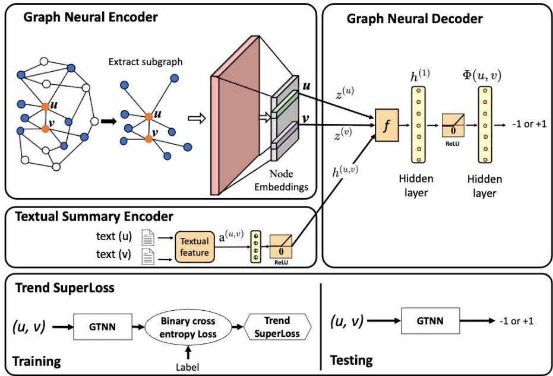  
Figure 2: The architecture of the proposed graph text neural network (GTNN) model with Trend-SL curriculum learning approach. The proposed model consists of an encoder-decoder component that determines relations between given node pairs. The graph neural encoder takes as input features from textual descriptions of nodes and sub-graph extracted for a given node pair to create node embeddings. The resulting embeddings in conjunction with additional text features are directly used by the decoder to predict links between given entity pairs. The resulting loss is given as an input to our Trend-SL approach to dynamically learn a curriculum during training.

However, SL does not take into account the trend of instantaneous losses at sample-level, which can (a): improve the difficulty estimations of the model by making them local, sample dependent and potentially more precise, and (b): enable the model to distinguish samples with similar losses based on their known loss trajectories. For example, consider an easy sample with a rising loss trend which is about to become a hard sample versus another easy sample with the same instantaneous loss but a falling loss trend which is about to become further easier for the model. Trend information allows distinguishing such examples.

The above observations inspire our work to utilize trend information in our curriculum learning framework, called Trend-SL. The model uses loss information from the local time window before each iteration to capture a form of momentum of loss in terms of rising or falling trends and determine individual sample weights as follows:

$$
\begin{array} { r } { T r e n d S L _ { \lambda , \alpha } ( l _ { u v } ) = \arg \underset { \sigma _ { u v } } { \operatorname* { m i n } } \left( l _ { u v } - ( \tau - \alpha \Delta _ { u v } ) \right) } \\ { \times \sigma _ { u v } + \lambda ( \log \sigma _ { u v } ) ^ { 2 } , } \end{array}\tag{5}
$$

where $\sigma _ { u v }$ is the latent weight for the training sample $( u , v ) \ , \ l _ { u v }$ is the target-task loss (binary cross-entropy in our experiments) for $( u , v )$ at current iteration, τ is the batch-level global difficulty threshold determined by the exponential moving average of sample losses (Castells et al., 2020), and $\Delta \in [ - 1 , 1 ]$ is the trend indicator quantified by the normalized sample-level loss trend weighted by $\alpha \in [ 0 , 1 ]$ ; our approach reduces to SL with $\alpha = 0 . \ \Delta$ captures the trend in the instantaneous losses of samples over recent k iterations, effectively utilizing local sample-level information to determine difficulty. There are various techniques for fitting trends to time series data (Bianchi et al., 1999). We use differences between consecutive losses to determine the trend for each sample:

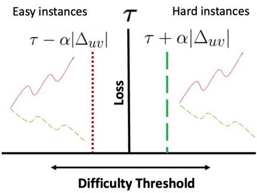  
Figure 3: Difficulty dynamics in Trend-SL. τ is the fixed difficulty threshold of $\mathrm { { S L } } .$ which can be thought of as a global difficulty metric to separate easy and hard samples. Dotted (red) and dashed (green) trend lines indicate four samples with rising and falling loss trends respectively. Trend-SL uses trend dynamics to shift the difficulty boundaries and adjust global difficulty using local sample-level loss trends. The vertical dashed and dotted lines show updated sample-specific difficulty thresholds for easy and hard samples respectively.

$$
\Delta _ { u v } = \sum _ { j = i - k + 2 } ^ { i } ~ ( l _ { u v } ^ { j } - l _ { u v } ^ { j - 1 } ) / \sum _ { j = i - k + 2 } ^ { i } \mid l _ { u v } ^ { j } - l _ { u v } ^ { j - 1 } \mid ,\tag{6}
$$

where i is the current iteration, $l _ { . } ^ { j }$ indicates loss at iteration $j$ and k controls the number of previous losses to consider. As Figure 3 illustrates, Trend-SL increases the difficulty threshold for samples with falling loss trends (negative $\Delta { \mathrm s } )$ , becoming more flexible in increasing the weights of such samples by allowing greater instantaneous losses. On the other hand, it becomes more conservative in weighting samples with rising trends (positive $\Delta { \mathrm s } )$ by reducing the difficulty threshold.

Finally, we note that the weight $\sigma _ { u v }$ in (5) can be computed as follows, where W is the Lambert W function (Euler, 1783); see details in the supplementary materials in (Castells et al., 2020):

$$
\begin{array} { r c l } { \displaystyle \sigma _ { u v } ^ { * } } & { = } & { \displaystyle \exp \Big ( - W \big ( \frac { 1 } { 2 } \mathrm { m a x } ( - \frac { 2 } { e } , \beta ) \big ) \Big ) , } \end{array}\tag{7}
$$

$$
\beta = \frac { l _ { u v } - ( \tau - \alpha \Delta _ { u v } ) } { \lambda } .\tag{8}
$$

## 3 Experiments

## 3.1 Datasets

Gene, Disease, Phenotype Relation (GDPR) dataset contains textual descriptions for genes, diseases and phenotypes (symptoms) as well as their relations, and is obtained by combining two freely available datasets: Online Mendelian Inheritance in Man (OMIM) (Amberger et al., 2019) and Human Phenotype Ontology (HPO) (Köhler et al., 2021). OMIM is the primary repository of curated information on the causal relations between genes and rare diseases, and HPO provides mappings of phenotypes to genes/diseases in the OMIM.1 We introduce a challenging experimental setup based on the task of differential diagnosis (Raftery et al., 2014) using GDPR, where competing models should distinguish relevant diseases to a gene from irrelevant ones that present similar clinical features, making the task more difficult because of high textual and structural similarity between relevant and irrelevant diseases. For example, diseases 3-methylglutaconic type I, Barth syndrome and 3-methylglutaconic type III are of the same disease type and have high lexical similarity in their descriptions, but they are not related to the same genes. We include such harder negative gene-disease pairs by sampling genes from those that are linked to diseases that share the same disease type with a target disease, but are not linked to the target disease. We also include an equal number of randomly sampled negative pairs to this set.

Gene Phenotype Relation (PGR) (Sousa et al., 2019) is created from PubMed articles and contains sentences describing relations between given genes and phenotypes ( Figure 1). We only include data points with available text descriptions for their genes and phenotypes. For fair comparison, we apply the best model from (Sousa et al., 2019) to this dataset.

Wikipedia (Rozemberczki et al., 2021) is on the topic of the old world lizards Chameleons with 202 species. In this dataset, nodes represent pages and edges indicate mutual links between them. Each page has an informative set of nouns, which we use as additional features. We note that this dataset contains only these noun features but not the original text, which is required by our text only models.

<table><tr><td>Metric</td><td>GDPR</td><td>PGR</td><td>Wikipedia</td></tr><tr><td>#Nodes</td><td>18.3K</td><td>20.4K</td><td>2.2K</td></tr><tr><td># Edges</td><td>365.0K</td><td>605.4K</td><td>31.4K</td></tr><tr><td># Sampled Edges</td><td>37.6K</td><td>3.0K</td><td>188.5K</td></tr><tr><td>→ # pos. Edges</td><td>6.2K</td><td>1.4K</td><td>31.4K</td></tr><tr><td>→ # neg. Edges</td><td>31.4K</td><td>1.6K</td><td>157.1K</td></tr></table>

Table 1: Statistics of the three datasets. Sampled edges are used to create training, validation and test sets. All models take the entire graph as input.

Table 1 shows statistics of these datasets. In case of GDPR and WIKIPEDIA, we create five negative examples for every positive pair. We divide these pairs into 80%, 10% and 10% as training, validation and test splits respectively. The data splits for PGR is the same as the original dataset, except that we discard data points (node pairs) that do not have text descriptions.

## 3.2 Baselines

We use the following baselines:

• Co-occurrence labels a test pair as positive if both entities occur together in the input text.

• Relevance Score uses scores from IR models (Section 2.1.2) as features of a logistic classifier.

• Doc2Vec (Le and Mikolov, 2014) uses domainspecific text embeddings obtained from Doc2Vec as features of a logistic classifier.

• BioBERT (Lee et al., 2020; Devlin et al., 2019) is a BERT model pre-trained on PubMed articles. BioBERT is most appropriate for relation extraction on both GDPR and PGR datasets as they are also developed based on PubMed articles. It is the current state-of-the-art model on PGR (Sousa et al., 2019). We also include a version of BioBERT that uses graph information by concatenating the representation of each given pair with the average embedding of its neighbors.

• Graph Convolutional Network (GCN) (Kipf and Welling, 2017) is an efficient and scalable approach based on convolution neural networks which directly operates on graphs.

• Graph Attention Network (GAT) (Velickoviˇ c´ et al., 2018) extends GCN by employing selfattention layers to identify informative neighbors while aggregating their information, effectively prioritizing important neighbors for target tasks.

• GraphSAGE (Hamilton et al., 2017) is an inductive framework which aggregates node features and network structure to generate node embeddings, see (1). It uses both text and graph information. We use Doc2Vec (Le and Mikolov, 2014) embeddings to initialize node features of GraphSAGE, as they led to better performance than other embeddings in our experiments.

• Graph Isomorphism Network (GIN) (Xu et al., 2018) identifies the graph structures that are not distinguishable by the variants of graph neural networks like GCN and GraphSAGE. Compared to GraphSAGE and GCN, GIN uses extra learnable parameters during sum aggregation and uses MLP encoding.

• CurGraph (Wang et al., 2021) is a curriculum learning framework for graphs that computes difficulty scores based on the intra- and interclass distributions of embeddings and develops a smooth-step function to gradually include harder samples in training. We report the results of our implementation of this approach.

• SuperLoss (SL) (Castells et al., 2020) is a generic curriculum learning approach that dynamically learns a curriculum from model behavior. It uses a fixed difficulty threshold at batch level, determined by the exponential moving average of all sample losses, to assign higher weights to easier samples than harder ones.

We compare these baselines against GTNN and Trend-SL, described in Section 2.

## 3.3 Settings

We reproduce the results reported in (Sousa et al., 2019) using BioBERT and therefore follow the same settings on the PGR dataset. Initial domain-specific node embeddings are obtained using Doc2Vec (Le and Mikolov, 2014) or Bio-BERT (Lee et al., 2020). In case of Bio-BERT, since nodes carry long descriptions, we first generate sentence level embeddings and use their average to represent each node, following (Zhang et al., 2020a). More recent techniques can be used as well (Beltagy et al., 2020). We consider 1- hop neighbors and set t = 1 in (1). To optimize our model, we use the Adam optimizer (Kingma and Ba, 2015) and apply hyper-parameter search and tuning for all competing models based on performance on validation data. In (5), we set α from [0, 1] with a step size of 0.1, λ from 0.1, 0.5, 1.0, 5, 10, 100 , and loss window k from [1, 10] with a step size of 1. We consider a maximum number of 100 training iterations with early stopping based on validation data for all models. In addition, we evaluate models based on the standard Recall, Precision and F1 score for classification tasks (Buitinck et al., 2013). We experiment with five random seeds and report the average results. For all experiments, we use Ubuntu 18.04 with one 40GB A100 Nvidia GPU, 1 TB RAM and 16 TB hard disk space. GPU hours to train our model have been linear to the size of the datasets ranging from 30 min to 5 hours. We use Precision (P), Recall (R) and F1 score (F1) as evaluation metrics.

<table><tr><td rowspan="2">Modality</td><td rowspan="2">Model</td><td colspan="3">GDPR</td><td colspan="3">PGR</td><td colspan="4">Wikipedia</td></tr><tr><td>P</td><td>R</td><td>F1</td><td>P</td><td>R</td><td>F1</td><td>P</td><td>R</td><td>F1</td><td>avg F1</td></tr><tr><td>-</td><td>Co-occurance</td><td>16.7</td><td>100</td><td>28.6</td><td>47.5</td><td>100</td><td>64.4</td><td>16.7</td><td>100</td><td>28.6</td><td>40.5</td></tr><tr><td>T</td><td>Relevance Score</td><td>59.2</td><td>83.4</td><td>69.2</td><td>75.6</td><td>64</td><td>69.1</td><td></td><td></td><td></td><td>69.2</td></tr><tr><td>T</td><td>BioBERT (node pairs)</td><td>20.3</td><td>55.6</td><td>29.7</td><td>84.9</td><td>74.7</td><td>79.4</td><td></td><td></td><td></td><td>54.6</td></tr><tr><td>T</td><td>BioBERT (neighbors)</td><td>21.1</td><td>57.4</td><td>30.9</td><td>74.0</td><td>76.0</td><td>75.0</td><td></td><td></td><td></td><td>53.0</td></tr><tr><td>T</td><td>Doc2vec (node pairs)</td><td>19.8</td><td>45.0</td><td>27.5</td><td>80.5</td><td>82.7</td><td>81.6</td><td></td><td></td><td></td><td>54.6</td></tr><tr><td>T</td><td>Doc2vec (neighbors)</td><td>20.6</td><td>51.9</td><td>29.5</td><td>83.1</td><td>78.7</td><td>80.8</td><td></td><td></td><td>一</td><td>55.2</td></tr><tr><td>G</td><td>GCN</td><td>34.2</td><td>44.5</td><td>38.6</td><td>61.1</td><td>79.5</td><td>68.6</td><td>72.8</td><td>89.7</td><td>80.3</td><td>62.5</td></tr><tr><td>G</td><td>GAT</td><td>23.7</td><td>50.3</td><td>31.7</td><td>75.8</td><td>91.1</td><td>82.5</td><td>78.2</td><td>86.7</td><td>82.2</td><td>65.5</td></tr><tr><td>G</td><td>GIN</td><td>21.8</td><td>48.1</td><td>29.8</td><td>54.2</td><td>88.1</td><td>67.0</td><td>76.4</td><td>77.2</td><td>76.1</td><td>57.6</td></tr><tr><td>G</td><td>GraphSAGE (random)</td><td>17.2</td><td>90.4</td><td>28.5</td><td>84.8</td><td>79.2</td><td>81.8</td><td>57.9</td><td>82.28</td><td>67.9</td><td>59.4</td></tr><tr><td>G,T</td><td>GraphSAGE (Doc2Vec)</td><td>54.0</td><td>79.2</td><td>64.1</td><td>91.8</td><td>90.2</td><td>91.0</td><td>81.5</td><td>93.0</td><td>86.6</td><td>80.6</td></tr><tr><td>G,T</td><td>GTNN</td><td>78.0</td><td>87.9</td><td>82.6</td><td>93.6</td><td>93.2</td><td>93.4</td><td>87.9</td><td>95.4</td><td>91.5</td><td>89.2</td></tr></table>

Table 2: Performance of different models on GDPR, PGR, and WIKIPEDIA datasets. Here, (T) indicates “Text only", (G) indicates “Graph only", (G,T) indicates combination of both. Note that the WIKIPEDIA dataset contains only noun features but not the original text, which is required by the text only models.

<table><tr><td>Model</td><td>GDPR</td><td>PGR</td><td>Wikipedia</td><td>avg F1</td></tr><tr><td>GTNN</td><td>82.6</td><td>93.4</td><td>91.5</td><td>89.2</td></tr><tr><td>CurGraph</td><td>75.9</td><td>85.1</td><td>80.3</td><td>80.3</td></tr><tr><td>SL</td><td>83.5</td><td>94.0</td><td>92.0</td><td>89.8</td></tr><tr><td>Trend-SL</td><td>84.3</td><td>94.2</td><td>91.3</td><td>89.9</td></tr></table>

Table 3: Performance of curriculum models on GDPR, PGR, and WIKIPEDIA datasets. The base model for all curriculum learning approaches is GTNN, see the last row in Table 2.

## 3.4 Results

Table 2 shows the results. We start with text only and graph only baselines followed by baselines that incorporate both data modalities.

Text models (T): Comparing all text based model, Relevance Score and Doc2Vec outperform other models. In case of GDPR, high performance of Relevance Score indicates the ability of unsupervised IR models in finding relevant information in long text descriptions. However, Relevance Score shows poor performance on PGR compared to Doc2Vec, which is better at semantic representation of input data. BioBERT (node pair) obtains higher precision on both datasets and good performance on PGR. In addition, the F1 score of the BioBERT model developed in (Sousa et al., 2019) for PGR is 76.6. We note that Doc2Vec obtains better performance than BioBERT, perhaps due to its in-domain pre-training.

Graph models (G): The results show that GCN and GAT perform better than other competing graph models. We attribute their performance to the use of convolution and attention networks, which effectively prioritize important neighboring nodes with respect to the target tasks.

Graph models with additional information: Comparing GraphSAGE (Doc2Vec) and Graph-SAGE (random) illustrates the significant effect of initialization with in-domain embeddings. In addition, GTNN outperforms GraphSAGE, resulting in an average of 8.6 points improvement in F1 score. This improvement is because GTNN directly uses text descriptions at its prediction layer. This information, although available to GraphSAGE as well, can be lost in the iterative process of learning node embeddings through neighbors, see (1).

Training with curricula: The results in Table 3 show that training GTNN with effective curricula can further improve its performance. We attribute the better performance of Trend-SL compared to SL to the use of trend information, which leads to better curricula. We conduct further analysis on the effect of trend information below. The lower performance of CurGraph could be due to close probability densities that we obtained for samples in our datasets, which do not allow easy and hard samples to be effectively discriminated by CurGraph.

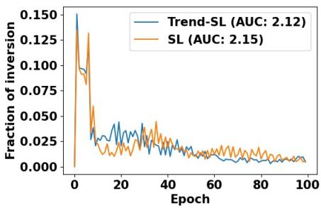  
Figure 4: The fraction of samples with an inverted difficulty group in two consecutive epochs. Both models are converging on the their estimated difficulty classes of samples as training progresses. Trend-SL results in fewer inversions compared to SL; the area under the curve for Trend-SL is 2.12 compared to 2.15 of SL.

## 4 Trend Model Introspection

We conduct several ablation studies to shed light on the improved performance of Trend-SL.

## 4.1 Inversion Analysis

Trend-SL results in robust estimation of difficulty: In curriculum learning, instantaneous sample losses can fluctuate as model trains (Zhou et al., 2020). These changes result in samples being moved across easy and hard data groups. Let’s define an inversion as an event where the difficulty group of a sample is inverted in two consecutive epochs (determined by curricula), i.e., an easy sample becomes hard in the next iteration or vice versa. Figure 4 shows the number of inversions in SL and Trend-SL during training. Both models converge on their estimated difficulty classes of samples as training progresses. However, we observe that Trend-SL results in fewer inversions compared to SL, as the area under the curve for Trend-SL is 2.12 compared to 2.15 of SL. Given these results and the performance of Trend-SL on our target tasks, we conjecture that trend information leads to more robust estimation of sample difficulty.

Transition patterns at inversion time: Let epoch e be the epoch at which an inversion occurs. Considering SL as the curriculum, Figure 5 reports the average normalized loss of samples at their inversion epochs (e) and k epochs before and after that. There are some insightful patterns: (a): easy-to-easy (E2E) and hard-to-hard (H2H) transitions are almost flat lines, indicating the lack of any significant trend when no inversion occurs; and (b): easy-to-hard (E2H) and hard-to-easy (H2E) transitions show that, on average, there is a sharp and significant increase and decrease in loss patterns as samples are inverted to hard and easy difficulty groups respectively. Since SL does not directly take into account trend information, these results show that trend dynamics can inform our technical objective of developing better curricula.

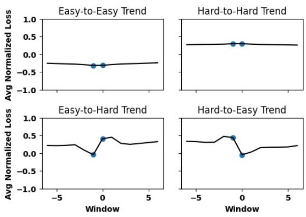

Figure 5: Transition in sample difficulty determined by SL. 0 on the x-axis denotes any epoch at which an inversion occurs, and the y-axis shows average normalized losses at epochs around the inversion epochs. Easyto-Hard and Hard-to-Easy transitions show sharp and significant increase and decrease in losses respectively.  
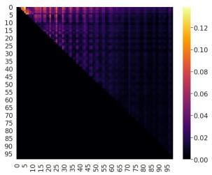  
(a) Easy to Hard

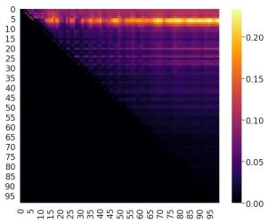  
(b) Hard to Easy  
Figure 6: Inversion dynamics at difficulty level during training: (a) inversions from easy to hard with rising loss trends and (b) inversions from hard to easy with falling loss trends. The initial epochs on the y-axis are brighter then later epochs, indicating that most inversions occur early in training.

Inversions occur early during training: Figure 6(a) shows the fraction of samples that were easy at epoch i but became hard with a rising trend at epoch $j > i .$ . The corresponding heatmap for Hard-to-Easy with falling trend is shown in Figure 6(b). In both case, the initial epochs (see the y-axis) are brighter then later epochs, indicating that most inversions occur early in training and the effect of trend is more prominent in the initial part of training.

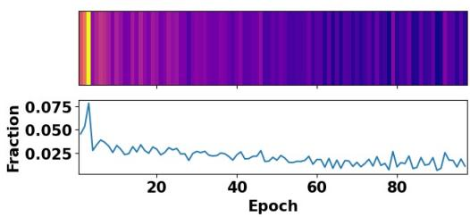  
(a) Easy to Hard

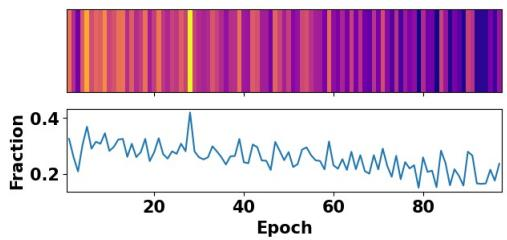  
(b) Hard to Easy  
Figure 7: Inversion heatmap when (a): easy samples with rising loss trend become hard (left) and (b): hard samples with falling loss trend become easy (right).

Inversions occur with falling or rising loss trends: SL does not use trend information. However, its estimated difficulty for a considerable fraction of samples (with falling or rising loss trends) is inverted during training. In fact, we observe that 21.2% to 50.0% of hard samples that have a falling loss trend will become easy in their next training iteration; similarly 1.3% to 11.1% of easy samples that have a rising loss trend will become hard in their next training iteration. Figure 7 shows the inversion heatmap for such Easy-to-Hard and Hardto-Easy transitions in consecutive epochs. The area under the curve for Easy-to-Hard with rising trend and Hard-to-Easy with falling trend are 24.87 and 4.51 respectively. Trend-SL employs such trend dynamics to create better curricula.

## 4.2 Domain and Feature Analysis

In-domain embeddings improve the performance: In these experiments, we re-train our model with different embedding initialization. As shown in Figures 8, Doc2Vec embeddings result in an overall better performance than BioBERT and random initialization approaches across the datasets. We attribute this result to in-domain training using text summaries of genes, diseases and phenotypes associated to rare diseases. In addition, the performance using BioBERT embeddings is either comparable or considerably lower than that of other embeddings including Random. This is perhaps due to pre-training of BioBERT using a large scale PubMED dataset, which has a significantly lower prevalence of publications on rare versus common diseases. On the other hand, we directly optimize Doc2Vec on in-domain rare-disease datasets, which leads to higher performance of the model. We tried to fine tune BioBERT on our corpus but as the text summaries are long, only a small fraction of texts (512 tokens) can be considered.

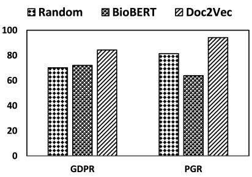  
Figure 8: Performance of GTNN with Trend-SL with additional features.

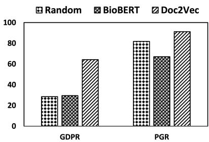  
Figure 9: Performance of GTNN with Trend-SL without additional features.

Additional Features improve the performance: We re-train our models and exclude additional feature (i.e., relevance scores for GDPR and sentence embeddings for PGR), with different node embedding initialization. Figure 9 shows that excluding these features considerably reduces the F1-scores of our model across datasets and embedding initialization. These results show that both text features and information obtained from graph structure contribute to predicting relations between nodes.

## 5 Related Work

Previous research on relation extraction can be categorized into text- and graph-based approaches. In addition, to our knowledge, there is limited work on curriculum learning with graph datasets.

Text-based models: Text-based methods extract entities and the relations between them from given texts. Although, previous works typically focus on extracting intra-sentence relations for entity pairs in supervised and distant supervised settings (Sousa et al., 2019; Mintz et al., 2009; Dai et al., 2019; Lin et al., 2016; Peng et al., 2017; Zhang et al., 2018; Fout et al., 2017; Zhang and Chen, 2018; Quirk and Poon, 2017), there are relation extraction approaches that focus on inter-sentence relations (Kilicoglu, 2016; Yao et al., 2019b). Kilicoglu (2016) investigated multi-sentence relation extraction between chemical-disease entity pairs mentioned at multi-sentence level. They considered lexical features, and features obtained from intervening sentences as input to a classifier. A close related work to our study has been conducted by Sousa et al. (2019), who developed an effective model to detect relations between genes and phenotypes at sentence-level using sentential context and medical named entities in text. We compared our approach with Sousa et al. (2019) on the dataset that they developed (PGR), see Section 3.2.

Graph based models: Previous research show that adding informative additional features with graph helps models learn better node representations for extracting relation between entity pairs. For example, Zhang and Chen (2018) used distance metric information, and Li et al. (2020) used distance features like shortest path and landing probabilities between pair of nodes in subgraphs as additional features. We note that some graph properties, although informative and effective, can be expensive to calculate on large graphs during training and should be computed offline.

Curriculum learning with graph data: Curriculum learning approaches design curricula for model training and generalizability (Bengio et al., 2009; Kumar et al., 2010; Jiang et al., 2015; Amiri et al., 2017; Jiang et al., 2018; Castells et al., 2020; Zhou et al., 2020). The common approach is to detect and use easy examples to train the model and gradually add harder examples as training progresses. Curricula can be static and pre-built by humans or can be automatically and dynamically learned by the model. There are very few curriculum learning methods designed to work on the graph structure. Wang et al. (2021) developed CurGraph, which is a curriculum learning method for sub-graph classification. The model estimates the difficulty of samples using intra and inter-class distributions of subgraph embeddings and orders training instances to initially expose easy sub-graphs to the underlying graph neural network followed by harder ones. As opposed to static curriculum, Saxena et al. (2019) introduced a dynamic curriculum approach which automatically assigns a confidence score to samples based on their estimated difficulty. However, the model requires a large number of extra trainable parameters especially when data set is large. To overcome this limitation, Castells et al. (2020) introduced a framework with similar idea but calculates the optimal confidence score for each instances using a closed-form solution, thereby avoiding learning extra parameters. We extended this approach to include trend information at samplelevel for learning effective curriculum.

Graph neural networks for NLP: There are several distantly related work that develop graph neural network algorithm for downstream tasks such as semantic role labeling (Marcheggiani and Titov, 2017), machine translation (Bastings et al., 2017; Marcheggiani et al., 2018), multimedia event extraction (Liu et al., 2020), text classification (Yao et al., 2019a; Zhang et al., 2020b) and abstract meaning representation (Song et al., 2018). Graph neural networks are used to model word-word or word-document relations, or applied to dependency trees. Yao et al. (2019a) generated a single text graph using word occurrences and document word relations from text data, and used the GCN method to learn embeddings of words and documents. Similarly, Peng et al. (2018) used GCN to capture the semantics between non-consecutive and longdistance entities.

## 6 Conclusion and Future Work

We propose a novel graph neural network approach that effectively integrates textual and structural information and uses loss trajectories of samples during training to learn effective curricula for predicting relations between given entity pairs. Our approach can be used for both sentence- and document-level relation extraction, and shows a sizable improvement over the state-of-the-art models across several datasets. In future, we will investigate curriculum learning approaches for other sub-tasks of relation extraction, develop more effective techniques to better fit trends to time series data, and investigate the effect of curricula on other graph neural networks for relation extraction.

## References

Emily Alsentzer, Samuel Finlayson, Michelle Li, and Marinka Zitnik. 2020. Subgraph neural networks. Advances in Neural Information Processing Systems.

Gianni Amati and Cornelis Joost Van Rijsbergen. 2002. Probabilistic models of information retrieval based on measuring the divergence from randomness. ACM Transactions on Information Systems (TOIS).

Joanna S Amberger, Carol A Bocchini, Alan F Scott, and Ada Hamosh. 2019. Omim. org: leveraging knowledge across phenotype–gene relationships. Nucleic acids research.

Hadi Amiri, Timothy Miller, and Guergana Savova. 2017. Repeat before forgetting: Spaced repetition for efficient and effective training of neural networks. In Proceedings ofthe 2017 Conference on Empirical Methods in Natural Language Processing.

Hadi Amiri, Mitra Mohtarami, and Isaac Kohane. 2021. Attentive multiview text representation for differential diagnosis. In Proceedings of the 59th Annual Meeting of the Association for Computational Linguistics.

Jasmijn Bastings, Ivan Titov, Wilker Aziz, Diego Marcheggiani, and Khalil Sima’an. 2017. Graph convolutional encoders for syntax-aware neural machine translation. In Proceedings ofthe 2017 Conference on Empirical Methods in Natural Language Processing.

Iz Beltagy, Matthew E Peters, and Arman Cohan. 2020. Longformer: The long-document transformer. arXiv preprint arXiv:2004.05150.

Yoshua Bengio, Jérôme Louradour, Ronan Collobert, and Jason Weston. 2009. Curriculum learning. In Proceedings ofthe 26th annual international conference on machine learning.

Marco Bianchi, Martin Boyle, and Deirdre Hollingsworth. 1999. A comparison of methods for trend estimation. Applied Economics Letters.

Lars Buitinck, Gilles Louppe, Mathieu Blondel, Fabian Pedregosa, Andreas Mueller, Olivier Grisel, Vlad Niculae, Peter Prettenhofer, Alexandre Gramfort, Jaques Grobler, Robert Layton, Jake VanderPlas, Arnaud Joly, Brian Holt, and Gaël Varoquaux. 2013. API design for machine learning software: experiences from the scikit-learn project. In ECML PKDD Workshop: Languagesfor Data Mining and Machine Learning.

Thibault Castells, Philippe Weinzaepfel, and Jerome Revaud. 2020. Superloss: A generic loss for robust curriculum learning. Advances in Neural Information Processing Systems.

Qin Dai, Naoya Inoue, Paul Reisert, Ryo Takahashi, and Kentaro Inui. 2019. Distantly supervised biomedical

knowledge acquisition via knowledge graph based attention. In Proceedings of the Workshop on Extracting Structured Knowledgefrom Scientific Publications.

Jacob Devlin, Ming-Wei Chang, Kenton Lee, and Kristina Toutanova. 2019. BERT: pre-training of deep bidirectional transformers for language understanding. In Proceedings ofthe 2019 Conference of the North American Chapter ofthe Associationfor Computational Linguistics: Human Language Technologies, NAACL-HLT 2019, Minneapolis, MN, USA, June 2-7, 2019, Volume 1 (Long and Short Papers). Association for Computational Linguistics.

Cícero dos Santos, Bing Xiang, and Bowen Zhou. 2015. Classifying relations by ranking with convolutional neural networks. In Proceedings ofthe 53rd Annual Meeting of the Association for Computational Linguistics and the 7th International Joint Conference on Natural Language Processing (Volume 1: Long Papers). Association for Computational Linguistics.

Leonhard Euler. 1783. De serie lambertina plurimisque eius insignibus proprietatibus. Acta Academiae scientiarum imperialis petropolitanae.

Alex Fout, Jonathon Byrd, Basir Shariat, and Asa Ben-Hur. 2017. Protein interface prediction using graph convolutional networks. In Advances in Neural Information Processing Systems 30: Annual Conference on Neural Information Processing Systems 2017, December 4-9, 2017, Long Beach, CA, USA.

Will Hamilton, Zhitao Ying, and Jure Leskovec. 2017. Inductive representation learning on large graphs. In Advances in neural information processing systems.

Lu Jiang, Deyu Meng, Qian Zhao, Shiguang Shan, and Alexander G Hauptmann. 2015. Self-paced curriculum learning. In Twenty-Ninth AAAI Conference on Artificial Intelligence.

Lu Jiang, Zhengyuan Zhou, Thomas Leung, Li-Jia Li, and Li Fei-Fei. 2018. Mentornet: Learning datadriven curriculum for very deep neural networks on corrupted labels. In International Conference on Machine Learning.

Karen Sparck Jones. 1972. A statistical interpretation of term specificity and its application in retrieval. Journal ofdocumentation.

Halil Kilicoglu. 2016. Inferring implicit causal relationships in biomedical literature. In Proceedings of the 15th Workshop on Biomedical Natural Language Processing.

Diederik P Kingma and Jimmy Ba. 2015. Adam: A method for stochastic optimization. In 3rd International Conference on Learning Representations, ICLR 2015, San Diego, CA, USA, May 7-9, 2015, Conference Track Proceedings.

Thomas N Kipf and Max Welling. 2017. Semisupervised classification with graph convolutional networks. International Conference on Learning Representations.

Sebastian Köhler, Michael Gargano, Nicolas Matentzoglu, Leigh C Carmody, David Lewis-Smith, Nicole A Vasilevsky, Daniel Danis, Ganna Balagura, Gareth Baynam, Amy M Brower, et al. 2021. The human phenotype ontology in 2021. Nucleic acids research.

M Kumar, Benjamin Packer, and Daphne Koller. 2010. Self-paced learning for latent variable models. Advances in neural information processing systems.

Quoc Le and Tomas Mikolov. 2014. Distributed representations of sentences and documents. In International conference on machine learning. PMLR.

Jinhyuk Lee, Wonjin Yoon, Sungdong Kim, Donghyeon Kim, Sunkyu Kim, Chan Ho So, and Jaewoo Kang. 2020. Biobert: a pre-trained biomedical language representation model for biomedical text mining. Bioinformatics.

Pan Li, Yanbang Wang, Hongwei Wang, and Jure Leskovec. 2020. Distance encoding: Design provably more powerful neural networks for graph representation learning. In Advances in Neural Information Processing Systems 33: Annual Conference on Neural Information Processing Systems 2020, NeurIPS 2020, December 6-12, 2020, virtual.

Yankai Lin, Shiqi Shen, Zhiyuan Liu, Huanbo Luan, and Maosong Sun. 2016. Neural relation extraction with selective attention over instances. In Proceedings of the 54th Annual Meeting of the Association for Computational Linguistics (Volume 1: Long Papers).

Bang Liu, Fred X Han, Di Niu, Linglong Kong, Kunfeng Lai, and Yu Xu. 2020. Story forest: Extracting events and telling stories from breaking news. ACM Transactions on Knowledge Discovery from Data (TKDD).

Diego Marcheggiani, Jasmijn Bastings, and Ivan Titov. 2018. Exploiting semantics in neural machine translation with graph convolutional networks. In Proceedings ofthe 2018 Conference ofthe North American Chapter ofthe Associationfor Computational Linguistics: Human Language Technologies, Volume 2 (Short Papers).

Diego Marcheggiani and Ivan Titov. 2017. Encoding sentences with graph convolutional networks for semantic role labeling. In Proceedings of the 2017 Conference on Empirical Methods in Natural Language Processing.

Mike Mintz, Steven Bills, Rion Snow, and Daniel Jurafsky. 2009. Distant supervision for relation extraction without labeled data. In Proceedings of the Joint Conference ofthe 47th Annual Meeting ofthe ACL and the 4th International Joint Conference on Natural Language Processing of the AFNLP.

Hao Peng, Jianxin Li, Yu He, Yaopeng Liu, Mengjiao Bao, Lihong Wang, Yangqiu Song, and Qiang Yang. 2018. Large-scale hierarchical text classification with recursively regularized deep graph-cnn. In Proceedings ofthe 2018 world wide web conference.

Nanyun Peng, Hoifung Poon, Chris Quirk, Kristina Toutanova, and Wen-tau Yih. 2017. Cross-sentence nary relation extraction with graph lstms. Transactions ofthe Associationfor Computational Linguistics.

Chris Quirk and Hoifung Poon. 2017. Distant supervision for relation extraction beyond the sentence boundary. In Proceedings of the 15th Conference of the European Chapter ofthe Associationfor Computational Linguistics: Volume 1, Long Papers. Association for Computational Linguistics.

Andrew T Raftery, Eric Kian Saik Lim, and Andrew JK Ostor. 2014. Churchill’s Pocketbook ofDifferential Diagnosis E-Book. Elsevier Health Sciences.

Stephen E Robertson, Steve Walker, Susan Jones, Micheline M Hancock-Beaulieu, Mike Gatford, et al. 1995. Okapi at trec-3. Nist Special Publication Sp.

Benedek Rozemberczki, Carl Allen, and Rik Sarkar. 2021. Multi-scale attributed node embedding. Journal ofComplex Networks.

Shreyas Saxena, Oncel Tuzel, and Dennis DeCoste. 2019. Data parameters: A new family of parameters for learning a differentiable curriculum. Advances in Neural Information Processing Systems.

Linfeng Song, Yue Zhang, Zhiguo Wang, and Daniel Gildea. 2018. A graph-to-sequence model for amrto-text generation. In Proceedings ofthe 56th Annual Meeting of the Association for Computational Linguistics (Volume 1: Long Papers).

Diana Sousa, André Lamúrias, and Francisco M Couto. 2019. A silver standard corpus of human phenotypegene relations. In Proceedings of the 2019 Conference of the North American Chapter of the Association for Computational Linguistics: Human Language Technologies, Volume 1 (Long and Short Papers).

Petar Velickoviˇ c, Guillem Cucurull, Arantxa Casanova,´ Adriana Romero, Pietro Liò, and Yoshua Bengio. 2018. Graph attention networks. In International Conference on Learning Representations.

Yiwei Wang, Wei Wang, Yuxuan Liang, Yujun Cai, and Bryan Hooi. 2021. Curgraph: Curriculum learning for graph classification. In Proceedings of the Web Conference 2021.

Keyulu Xu, Weihua Hu, Jure Leskovec, and Stefanie Jegelka. 2018. How powerful are graph neural networks? In International Conference on Learning Representations.

Liang Yao, Chengsheng Mao, and Yuan Luo. 2019a. Graph convolutional networks for text classification. In Proceedings ofthe AAAI conference on artificial intelligence.

Yuan Yao, Deming Ye, Peng Li, Xu Han, Yankai Lin, Zhenghao Liu, Zhiyuan Liu, Lixin Huang, Jie Zhou, and Maosong Sun. 2019b. DocRED: A large-scale document-level relation extraction dataset. In Proceedings ofthe 57th Annual Meeting ofthe Associationfor Computational Linguistics. Association for Computational Linguistics.

Daojian Zeng, Kang Liu, Yubo Chen, and Jun Zhao. 2015. Distant supervision for relation extraction via piecewise convolutional neural networks. In Proceedings of the 2015 Conference on Empirical Methods in Natural Language Processing.

Muhan Zhang and Yixin Chen. 2018. Link prediction based on graph neural networks. Advances in Neural Information Processing Systems.

Tianyi Zhang, Varsha Kishore, Felix Wu, Kilian Q. Weinberger, and Yoav Artzi. 2020a. Bertscore: Evaluating text generation with BERT. In 8th International Conference on Learning Representations, ICLR 2020, Addis Ababa, Ethiopia, April 26-30, 2020. OpenReview.net.

Yufeng Zhang, Xueli Yu, Zeyu Cui, Shu Wu, Zhongzhen Wen, and Liang Wang. 2020b. Every document owns its structure: Inductive text classification via graph neural networks. In Proceedings ofthe 58th Annual Meeting of the Association for Computational Linguistics.

Yuhao Zhang, Peng Qi, and Christopher D. Manning. 2018. Graph convolution over pruned dependency trees improves relation extraction. In Proceedings of the 2018 Conference on Empirical Methods in Natural Language Processing. Association for Computational Linguistics.

Tianyi Zhou, Shengjie Wang, and Jeff A Bilmes. 2020. Curriculum learning by dynamic instance hardness. Advances in Neural Information Processing Systems.

## Ethical statement

This investigation partially uses data from the field of medicine. Specifically, it includes genes, diseases and phenotypes that contribute to rare diseases. Although the present work does not include any patient information, it is translational in nature and its broader impacts are first and foremost the potential to improve the well-being of individual patients in the society, and support clinicians in their diagnostic efforts, especially for rare diseases. Our work can also help Wikipedia curators and content generators in finding relevant concepts.