# GlobEnc: Quantifying Global Token Attribution by Incorporating the Whole Encoder Layer in Transformers

Ali Modarressi1\* Mohsen Fayyaz2\*

Yadollah Yaghoobzadeh2 Mohammad Taher Pilehvar3

1 Iran University of Science and Technology, Iran 2 University of Tehran, Iran 3 Tehran Institute for Advanced Studies, Khatam University, Iran

m\_modarressi@comp.iust.ac.ir {mohsen.fayyaz77, y.yaghoobzadeh}@ut.ac.ir mp792@cam.ac.uk

## Abstract

There has been a growing interest in interpreting the underlying dynamics of Transformers. While self-attention patterns were initially deemed as the primary option, recent studies have shown that integrating other components can yield more accurate explanations. This paper introduces a novel token attribution analysis method that incorporates all the components in the encoder block and aggregates this throughout layers. Through extensive quantitative and qualitative experiments, we demonstrate that our method can produce faithful and meaningful global token attributions. Our experiments reveal that incorporating almost every encoder component results in increasingly more accurate analysis in both local (single layer) and global (the whole model) settings. Our global attribution analysis significantly outperforms previous methods on various tasks regarding correlation with gradient-based saliency scores. Our code is freely available at https://github.com/mohsenfayyaz/GlobEnc.

## 1 Introduction

The stellar performance of Transformers (Vaswani et al., 2017) has garnered a lot of attention to analyzing the reasons behind their effectiveness. The self-attention mechanism has been one of the main areas of focus (Clark et al., 2019; Kovaleva et al., 2019; Reif et al., 2019; Htut et al., 2019). However, there have been debates on whether raw attention weights are reliable anchors for explaining model's behavior or not (Wiegreffe and Pinter, 2019; Serrano and Smith, 2019; Jain and Wallace, 2019). Recently, it was shown that incorporating vector norms should be an indispensable part of any attention-based analysis¹ (Kobayashi et al., 2020,

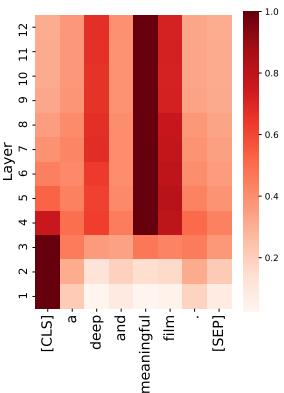

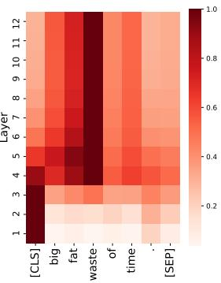  
Figure 1: Aggregated attribution maps $( \mathcal { N } _ { \mathrm { E N C } } )$ for the [CLS] token for fine-tuned BERT on SST2 dataset (sentiment analysis). Our method (GlobEnc) is able to accurately quantify the global token attribution of the model.

2021). However, these norm-based studies incorporate only the attention block into their analysis, whereas Transformer encoder layer is composed of more components.

Another limitation of the existing analysis techniques is that they are usually constrained to the analysis of single layer attributions. In order to expand the analysis to multi-layered encoder-based models in their entirety, an aggregation technique has to be employed. Abnar and Zuidema (2020) proposed two aggregation methods, rollout and max-flow, which combine raw attention weights across layers. Despite showing the outcome of their method to be faithful to a model's inner workings in specific cases, the final results are still unsatisfactory on a wide range of fine-tuned models.

Additionally, gradient-based alternatives (Simonyan et al., 2014; Kindermans et al., 2016; Li et al., 2016) have been argued to provide a more robust basis for token attribution analysis (Atanasova et al., 2020; Brunner et al., 2020; Pascual et al., 2021). Nonetheless, the gradient-based alternatives have not been able to fully replace attention-based counterparts, mainly due to their high computa-

tional intensity.

In this paper, we propose a new global token attribution analysis method (GlobEnc) which is based on the encoder layer's output. In GlobEnc, the second layer normalization is also included in the norm-based analysis of each encoder layer. To aggregate attributions over all layers, we applied a modified attention rollout technique, returning global scores.

Through extensive experiments and comparing the global attribution with the input token attributions obtained by gradient-based saliency scores, we show that our method produces faithful and meaningful results (Figure 1). Our evaluations on models with distinct pre-training objectives and sizes (Devlin et al., 2019; Clark et al., 2020) show high correlations with gradient-based methods in global settings. Furthermore, with comparative studies on each aspect of GlobEnc , we find that: (i) norm-based methods achieve higher correlations than weight-based methods; (ii) incorporating residual connections plays an essential role in token attribution; (iii) considering the two layer normalizations improve our analysis only if coupled together; and (iv) aggregation across layers is crucial for an accurate whole-model attribution analysis.

In summary, our main contributions are:

• We expand the scope of analysis from attention block in Transformers to the whole encoder.

• Our method significantly improves over existing techniques for quantifying global token attributions.

• We qualitatively demonstrate that the attributions obtained by our method are plausibly interpretable.

## 2 Background

In encoder-based language models (such as BERT), a Transformer encoder layer is composed of several components (Figure 2). The core component of the encoder is the self-attention mechanism (Vaswani et al., 2017), which is responsible for the information mixture of a sequence of token representations $( { \pmb x } _ { 1 } , . . . , { \pmb x } _ { n } )$ . Each self-attention head computes a set of attention weights $A ^ { h } = \{ \alpha _ { i , j } ^ { h } | 1 \leq i , j \leq n \}$ where $\alpha _ { i , j } ^ { h }$ is the raw attention weight from the $i ^ { \mathrm { t h } }$ token to the $j ^ { \mathrm { t h } }$ token in head $h \in \{ 1 , . . . , H \}$ Therefore, the output representation $( z _ { i } \in \mathbb { R } ^ { d } )$ for the $i ^ { \mathrm { t h } }$ token of a multi-head (with H heads) selfattention module is computed by concatenating the heads' outputs followed by a head-mixing $W _ { O }$ projection:

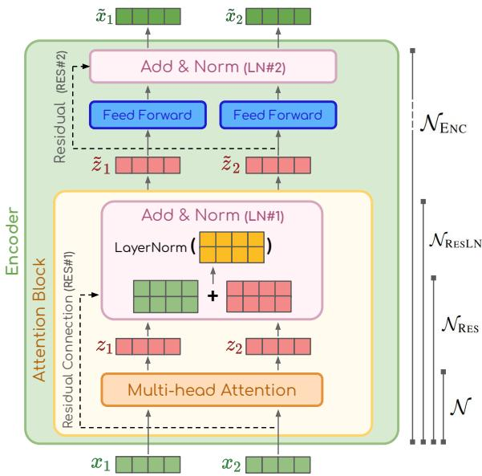  
Figure 2: The internal structure of a Transformer encoder layer. We show on the diagram the components that are incorporated by each token attribution analysis method. Our method incorporates the whole encoder $( \mathcal { N } _ { \mathrm { E N C } } )$ except for the direct effect of the fully connected feed-forward module. Diagram inspired by Alammar (2018).

$$
\boldsymbol { z } _ { i } = \mathrm { C o N C A T } ( \boldsymbol { z } _ { i } ^ { 1 } , . . . , \boldsymbol { z } _ { i } ^ { H } ) \boldsymbol { W _ { O } }\tag{1}
$$

where each head's output vector is generated by performing a weighted sum over the transformed value vectors ${ \pmb v } ( { \pmb x } _ { j } ) \in \mathbb { R } ^ { d _ { v } }$

$$
z _ { i } ^ { h } = \sum _ { j = 1 } ^ { n } \alpha _ { i , j } ^ { h } \pmb { v } ^ { h } ( \pmb { x } _ { j } )\tag{2}
$$

Norm-based attention. While one may interpret the attention mechanism using the attention weights A, Kobayashi et al. (2020) argued that doing so would ignore the norm of the transformed vectors multiplied by the weights, elucidating that the weights are insufficient for interpretation. Their solution enhanced the interpretability of attention weights by incorporating the value vectors ${ \pmb v } ( { \pmb x } _ { j } )$ and the following projection $W _ { O }$ . By reformulating Equation 1, we can consider $z _ { i }$ as a summation over the attentions heads:

$$
z _ { i } = \sum _ { h = 1 } ^ { H } \sum _ { j = 1 } ^ { n } \alpha _ { i , j } ^ { h } \underbrace { v ^ { h } ( \pmb { x } _ { j } ) \pmb { W } _ { \mathscr { O } } ^ { h } } _ { f ^ { h } ( \pmb { x } _ { j } ) }\tag{3}
$$

Using this reformulation², Kobayashi et al. proposed a norm-based token attribution analysis method, $\mathcal { N } : = ( | | z _ { i  j } | | ) \in \mathbb { R } ^ { n \times n }$ , to measure each token's contribution in a self-attention module:

$$
z _ { i  j } = \sum _ { h = 1 } ^ { H } \alpha _ { i , j } ^ { h } f ^ { h } ( \pmb { x } _ { j } )\tag{4}
$$

They showed that incorporating the magnitude of the transformation function $( f ^ { h } ( { \pmb x } ) )$ is crucial in assessing the input tokens' contribution to the selfattention output.

Residual connections & Layer Normalizations. Kobayashi et al. (2021) added the attention block's Layer Normalization (LN#1) and Residual connection (RES#1) to its prior norm-based analysis to assess the impact of residual connections and layer normalization inside an attention block. $\mathcal { N } _ { \mathrm { R E S } } : = ( | | z _ { i  j } ^ { + } | | ) \in \mathbb { R } ^ { n \times n }$ is the analysis method which incorporates the attention block's residual connection. The input vector x is added to the attribution of each token to itself to incorporate the influence of RES#1:

$$
z _ { i  j } ^ { + } = \sum _ { h = 1 } ^ { H } \alpha _ { i , j } ^ { h } f ^ { h } ( \pmb { x } _ { i } ) + \mathbf { 1 } [ i = j ] \pmb { x } _ { i }\tag{5}
$$

They proposed a method for decomposing $\mathrm { L N } ^ { 3 }$ into a summation of normalizations:

$$
\begin{array} { r l } & { \displaystyle \mathrm { L N } ( z _ { i } ^ { + } ) = \displaystyle \sum _ { j = 1 } ^ { n } g _ { z _ { i } ^ { + } } ( z _ { i  j } ^ { + } ) + \beta } \\ & { \displaystyle g _ { z _ { i } ^ { + } } ( z _ { i  j } ^ { + } ) : = \frac { z _ { i  j } ^ { + } - m ( z _ { i  j } ^ { + } ) } { s ( z _ { i } ^ { + } ) } \odot \gamma } \end{array}\tag{6}
$$

where $m ( . )$ and $s ( . )$ are the element-wise mean and standard deviation of the input vector (cf. $\ S \mathbf { A } . 1 )$ The decomposition can be applied to the contribution vectors:

$$
\tilde { z } _ { i  j } = g _ { z _ { i } ^ { + } } ( \sum _ { h = 1 } ^ { H } \alpha _ { i , j } ^ { h } f ^ { h } ( \pmb { x } _ { i } ) + \mathbf { 1 } [ i = j ] \pmb { x } _ { i } )\tag{7}
$$

Accordingly, we can compute the magnitude $\mathcal { N } _ { \mathrm { R E S L N } } : = ( | | \tilde { \boldsymbol { z } } _ { i  j } | | ) \in \mathbb { R } ^ { n \times n }$ , which represents the amount of influence of an encoder layer's input

token $j$ on its output token i. Based on this formulation, a context-mixing ratio could be defined as:

$$
r _ { i } = \frac { | | \sum _ { j = 1 , j \neq i } ^ { n } \tilde { z } _ { i  j } | | } { | | \sum _ { j = 1 , j \neq i } ^ { n } \tilde { z } _ { i  j } | | + | | \tilde { z } _ { i  i } | | }\tag{8}
$$

Experiments by Kobayashi et al. (2021) revealed considerably low r values which indicate the huge impact of the residual connections. In other words, the model tends to preserve token representations more than mixing them with each other.

## 3 Methodology

Our method for input token attribution analysis has a holistic view and takes into account almost every component within the encoder layer. To this end, we first extend the norm-based analysis of Kobayashi et al. (2021) by incorporating the encoder's output LN#2. We then apply an aggregation technique to combine the information flow throughout all layers.

Encoder layer output ≠ Attention block output. While the RES#1 and the LN#1 from the attention block are included in the analysis of Kobayashi et al. (2021), the subsequent FFN, RES#2, and output LN#2 are ignored (see Fig. 2). Hence, $\mathcal { N } _ { \mathrm { R E S L N } }$ might not be indicative of the entire encoder layer's function. To address this issue, we additionally include the encoder layer components from the attention block outputs $( \tilde { z } _ { i } )$ to the output representations $( \tilde { x } _ { i } )$ . The output of each encoder $( \tilde { x } _ { i } )$ is computed as follows:

$$
\begin{array} { l } { \tilde { z } _ { i } ^ { + } = \mathrm { F F N } ( \tilde { z } _ { i } ) + \tilde { z } _ { i } } \\ { \tilde { { x } } _ { i } = \mathrm { L N } ( \tilde { { z } } _ { i } ^ { + } ) } \end{array}\tag{9}
$$

We apply the LN decomposition rule in Eq. 7 to separate the impacts of residual and FFN output:

$$
\tilde { \pmb { x } } _ { i } = \sum _ { j = 1 } ^ { n } ( g _ { \tilde { z } _ { i } ^ { + } } ( \mathrm { F F N } ( \tilde { z } _ { i  j } ) ) + g _ { \tilde { z } _ { i } ^ { + } } ( \tilde { z } _ { i  j } ) ) + \beta\tag{10}
$$

Given that the activation function between the two fully connected layers in the FFN component is non-linear (Vaswani et al., 2017), a linear decomposition similar to Eq. 7 cannot be derived. As a result, we omit FFN's influence on the contribution of each token and instead consider RES#2, approximating $\tilde { \mathbfit { x } } _ { i  j }$ as $g _ { \tilde { z } _ { i } ^ { + } } \big ( \tilde { z } _ { i  j } \big )$ . Nevertheless, it should be noted that the FFN still preserves some influence on this new setting due to the presence of $s \big ( \tilde { z } _ { i } ^ { + } \big )$ in $g _ { \tilde { z } _ { i } ^ { + } } ( \tilde { z } _ { i  j } )$ . Similarly to Eq. 7, we can introduce a more inclusive layerwise analysis method $\mathcal { N } _ { \mathrm { E N C } } : = ( | | \tilde { \mathbf { x } } _ { i  j } | | ) \in \mathbb { R } ^ { n \times n }$ from input token j to output token i using:

$$
\widetilde { \pmb { x } } _ { i  j } \approx g _ { \widetilde { z } _ { i } ^ { + } } ( \widetilde { \pmb { z } } _ { i  j } ) = \frac { \widetilde { z } _ { i  j } - m ( \widetilde { z } _ { i  j } ) } { s ( \widetilde { z } _ { i } ^ { + } ) } \odot \gamma\tag{11}
$$

Aggregating multi-layer attention. To create an aggregated attribution score, Abnar and Zuidema (2020) proposed describing the model's attentions via modelling the information flow with a directed graph. They introduced attention rollout method, which linearly combines raw attention weights along all available paths in the pairwise attention graph. The attention rollout of layer l w.r.t. the inputs is computed recursively as follows:

$$
\begin{array} { r } { \tilde { \pmb { A } } _ { \ell } = \left\{ \begin{array} { l l } { \hat { \mathbf { A } } _ { \ell } \tilde { \mathbf { A } } _ { \ell - 1 } } & { \ell > 1 } \\ { \hat { \mathbf { A } } _ { \ell } } & { \ell = 1 } \end{array} \right. } \end{array}\tag{12}
$$

$$
\hat { \pmb { A } } _ { \ell } = 0 . 5 \bar { \pmb { A } } _ { \ell } + 0 . 5 { \pmb { I } }\tag{13}
$$

$\bar { \mathbf { A } } _ { \ell }$ is the raw attention map averaged across all heads in layer l. This method assumes equal contribution from the residual connection and multi-head attention (See Fig. 2). Hence, an identity matrix is summed and renormalized, giving $\hat { \boldsymbol A } _ { \ell }$

For aggregating the layerwise analysis methods, we use the rollout technique with minor modifications. As many of the methods already include residual connections, we only use Eq. 12 (replacing $\hat { \mathbf { A } } _ { \ell }$ with the desired method's attribution matrix in layer l) to calculate the rollout of a given method. However, for methods that do not assume the residual connection, we define a corresponding “Fixed" variation using Eq. 13 that incorporates a fixed residual effect $( r _ { i } \approx 0 . 5 )$ . We refer to our proposed global method—aggregating the $\mathcal { N } _ { \mathbf { E N C } }$ across all layers by the rollout method—as GlobEnc. In what follows we report our experiments, comparing GlobEnc with several other settings.

## 4 Experiments

In this section, we introduce the datasets and the token attribution analysis methods used in our evaluations, followed by the experimental setup and results.

## 4.1 Datasets

All analysis methods are evaluated on three different classification tasks. To cover sentiment detection tasks we use SST2 (Socher et al., 2013), MNLI (Williams et al., 2018) for Natural Language Inference and Hatexplain (Mathew et al., 2021) in hate speech detection.

## 4.2 Analysis Methods

We use two categories of explainability approaches in our work: Weight-based and Norm-based.4 The Weight-based approaches employed in our experiments are as follows:

• $\mathcal { W }$ : The raw attention maps averaged across all heads (See $\overline { { A } } _ { \ell }$ in §2).

$\mathcal { W } _ { \mathrm { F I X E D R E S } } :$ Abnar and Zuidema's assumption; add an identity matrix as a fixed residual to $\overline { { A } } _ { \ell }$ (see $\hat { \boldsymbol A } _ { \ell }$ in Eq. 13).

$\mathcal { W } _ { \mathrm { R E S } }$ : The corrected version of W in which accurate residuals are added based on the context-mixing ratios of $\mathcal { N } _ { \mathrm { E N C } }$

$$
{ \hat { r } } _ { i } = { \frac { \| \sum _ { j = 1 , j \neq i } ^ { n } { \tilde { \mathbf { x } } } _ { i  j } \| } { \| \sum _ { j = 1 , j \neq i } ^ { n } { \tilde { \mathbf { x } } } _ { i  j } \| + \| { \tilde { \mathbf { x } } } _ { i  i } \| } }\tag{14}
$$

In order to enforce $\mathcal { W } _ { \mathrm { R E S } }$ to have a contextmixing ratio equal to $\hat { r } _ { i } ,$ it is essential to zero-out the diagonal elements (the tokens attentions to themselves) of $\bar { \mathbf { A } } _ { \ell }$ and renormalize it:

$$
\begin{array} { r l } & { \pmb { A } _ { \ell } ^ { \prime } = ( \pmb { I } - \pmb { \mathrm { d i a g } } \left( \bar { \pmb { A } } _ { \ell } \right) ) ^ { - 1 } ( \bar { \pmb { A } } _ { \ell } - \pmb { \mathrm { d i a g } } \left( \bar { \pmb { A } } _ { \ell } \right) ) } \\ & { \qquad \mathcal { W } _ { \mathrm { R E S } } : = \pmb { \mathrm { d i a g } } \left( \hat { r } _ { 1 } , \cdots , \hat { r } _ { n } \right) \pmb { A } _ { \ell } ^ { \prime } } \\ & { \qquad + \pmb { \mathrm { d i a g } } \left( 1 - \hat { r } _ { 1 } , \ldots , 1 - \hat { r } _ { n } \right) \pmb { I } } \end{array}\tag{15}
$$

The Norm-based analysis methods, namely ${ \mathcal { N } } ,$ $\mathcal { N } _ { \mathrm { R E S } }$ and $\mathcal { N } _ { \mathrm { R E S L N } }$ were discussed in detail in $\ S 2$ Our proposed norm-based method $\mathcal { N } _ { \mathrm { E N C } }$ was explained in $\ S 3$ . For an ablation study, we introduce $\mathcal { N } _ { \mathrm { F I X E D R E S } }$ which is ${ \mathcal { N } } .$ corrected with a fixed residual similar to $\mathcal { W } _ { \mathrm { F I X E D R E S } } 5$

$$
\begin{array} { r } { \hat { \mathcal { N } } = ( \frac { | | z _ { i  j } | | } { \sum _ { j } | | z _ { i  j } | | } ) \in \mathbb { R } ^ { n \times n } } \\ { \mathcal { N } _ { \mathrm { F I X E D R E S } } : = 0 . 5 \hat { \mathcal { N } } + 0 . 5 I } \end{array}\tag{16}
$$

In §4.5, we will demonstrate our comparative studies between the aforementioned methods and GlobEnc.

## 4.3 Gradient-based Methods for Faithfulness Analysis

Gradient-based methods are widely used as alternatives for attention-based counterparts for quantifying the importance of a specific input feature in making the right prediction (Li et al., 2016; Atanasova et al., 2020). In this section we discuss the specific gradient-based methods we use, namely saliency, HTA, and our adjusted HTA.

## 4.3.1 Saliency

Gradient-based saliency is based on the gradient of the output $( y _ { c } )$ w.r.t. the input embeddings $( e _ { i } ^ { 0 } )$ One of the most accurate variations of the saliency family is the gradient× input method (Kindermans et al., 2016) where the input embeddings is multiplied by the gradients. Thus, the contribution score of input token i is determined by first computing the element-wise product of the input embeddings $( e _ { i } ^ { 0 } )$ and the gradients of the true class output score $( y _ { c } )$ w.r.t. the input embeddings. Then, the L2 norm of the scaled gradients is computed to derive the final score:

$$
S a l i e n c y _ { i } = \left\| \frac { \partial y _ { c } } { \partial e _ { i } ^ { 0 } } \odot e _ { i } ^ { 0 } \right\| _ { 2 }\tag{17}
$$

## 4.3.2 HTA x Inputs

To determine an upper bound on the information mixing within each layer, we use a modified version of Hidden Token Attribution (Brunner et al., 2020, HTA). In the original version, HTA is the sensitivity between any two vectors in the model's computational graph. However, inspired by the gradient× input method (Kindermans et al., 2016), which has shown more faithful results (Atanasova et al., 2020; Wu and Ong, 2021), we multiply the input vectors by the gradients and then apply a Frobenius norm. We compute the attribution from hidden embedding j $( e _ { j } ^ { \ell - \bar { 1 } } )$ to hidden embedding i $( e _ { i } ^ { \ell } )$ in layer l as:

$$
\mathbf { \Delta } _ { \mathbf { } \mathbf { } c _ { i  j } ^ { \ell } } ^ { \ell } = \| \frac { \partial \mathbf { e } _ { i } ^ { \ell } } { \partial \mathbf { e } _ { j } ^ { \ell - 1 } } \odot \mathbf { } e _ { j } ^ { \ell - 1 } \| _ { F }\tag{18}
$$

Computing HTA-based attribution matrices is an extremely computation-intensive task (especially for long texts) due to the high dimensionality of hidden embeddings. Hence, we only use this method for 256 examples from the SST-2 task's validation set. It is worth noting that extracting the HTAbased contribution maps for the aforementioned data took approximately 2 hours, whereas computing the maps for the entire analysis methods stated in §4.2 took only 5 seconds.6

## 4.4 Setup

We employ HuggingFace's Transformers library7 (Wolf et al., 2020) and the BERT-base-uncased model. For fine-tuning BERT, epochs vary from 3 to 5, and the batch size and learning rate are 32 and 3e-5, respectively.8 We also carried out the main experiment on BERT-large and ELECTRA (Devlin et al., 2019; Clark et al., 2020) where the results are reported at §A.2.

After rollout aggregation of each analysis method, we obtain an accumulated attribution matrix for every layer (l) of BERT. These matrices indicate the overall contribution of each input token to all token representations in layer l. Since the classifier in a fine-tuned model is attached to the final layer representation of the [CLS] token, we consider the first row (corresponding to [CLS] attributions) of the last layer attribution matrix. This vector represents the contribution of each input token to the model's final decision. As a measure of faithfulness of the resulting vector with the saliency scores, we report the Spearman's rank correlation between the two vectors.

## 4.5 Results

Table 1 shows the Spearman correlation of saliency scores with the aggregated attribution scores from [CLS] to input tokens at the final layer. In order to determine the contribution of each component of encoder layer to the overall performance, we report the results for attribution analysis methods discussed in §4.2. Our results demonstrate that incorporating the vector norms, residual connection, and both layer normalizations yields the highest correlation $( \mathcal { N } _ { \mathrm { E N C } } )$ . In what follows, we discuss the impact of incorporating various parts in the analysis.

## 4.5.1 On the role of vector norms

As also suggested by Kobayashi et al. (2020), vector norms play an important role in determining attention outputs. This is highlighted by the significant gap between weight-based and norm-based settings across all datasets in Table 1.

<table><tr><td rowspan="2"></td><td colspan="3">Attention Rollout</td></tr><tr><td>SST2</td><td>MNLI</td><td> $_ \mathrm { H A T E X P L A I N }$ </td></tr><tr><td>Weight-based (W)</td><td> $- 0 . 1 1 \pm 0 . 2 6$ </td><td> $- 0 . 0 6 \pm 0 . 2 2$ </td><td> $0 . 1 2 \pm 0 . 2 6$ </td></tr><tr><td>w/ Fixed Residual  $( \mathcal { W } _ { \mathrm { F I X E D R E S } } ) \ ^ { 9 }$ </td><td> $- 0 . 2 4 \pm 0 . 2 6$ </td><td> $- 0 . 0 5 \pm 0 . 2 6$ </td><td> $0 . 1 3 \pm 0 . 2 8$ </td></tr><tr><td>w/ Residual (WRes)</td><td> $0 . 1 9 \pm 0 . 2 6$ </td><td> $0 . 2 7 \pm 0 . 2 5$ </td><td> $0 . 5 3 \pm 0 . 2 4$ </td></tr><tr><td>Norm-based  $( \mathcal { N } )$ </td><td> $0 . 4 4 \pm 0 . 2 0$ </td><td> $0 . 4 7 \pm 0 . 1 6$ </td><td> $0 . 4 3 \pm 0 . 2 2$ </td></tr><tr><td>w/ Fixed Residual  $( \mathcal { N } _ { \mathrm { F I X E D R E S } } )$ </td><td> $0 . 4 8 \pm 0 . 2 0$ </td><td> $0 . 5 5 \pm 0 . 1 6$ </td><td> $0 . 4 8 \pm 0 . 2 2$ </td></tr><tr><td>w/ Residual  $( \mathcal { N } _ { \mathrm { R E S } } )$ </td><td> $0 . 7 3 \pm 0 . 1 3$ </td><td> $0 . 7 5 \pm 0 . 1 0$ </td><td> $0 . 6 6 \pm 0 . 1 7$ </td></tr><tr><td>w/ Residual + Layer Norm 1  $( \mathcal { N } _ { \mathrm { R E S L N } } )$ </td><td> $- 0 . 2 1 \pm 0 . 2 6$ </td><td> $- 0 . 0 6 \pm 0 . 2 6$ </td><td> $0 . 0 8 \pm 0 . 2 8$ </td></tr><tr><td>w/ GlobEnc: [Residual + Layer Norm 1, 2]  $( \mathcal { N } _ { \mathrm { E N C } } )$ </td><td> $\mathbf { 0 . 7 7 \pm 0 . 1 2 }$ </td><td> ${ \bf 0 . 7 8 \pm 0 . 0 9 }$ </td><td> ${ \bf 0 . 7 2 \pm 0 . 1 7 }$ </td></tr></table>

Table 1: Spearman's rank correlation of attribution based importance (aggregated by rollout) with saliency scores for the validation set for the BERT model fine-tuned on SST-2, MNLI, and HateXplain. In fixed residual cases, the context-mixing ratio is roughly 0.5, and in weight-based w/ residual $( \mathcal { W } _ { \mathrm { R E S } } )$ , it is corrected with context-mixing ratio of $( \mathcal { N } _ { \mathrm { E N C } } )$ . The numbers are the average on all the validation set examples ± the standard deviation.

Aggregated Attribution Spearman Rank Correlation on SST2 Dataset  
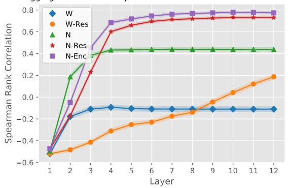  
Figure 3: Spearman's rank correlation of aggregated attribution scores with saliency scores across layers. The 99% confidence intervals are shown as (narrow) shaded areas around each line. $\mathcal { N } _ { \mathrm { E N C } }$ achieves the highest correlation in almost every layer.

We also show the correlation of the aggregated attention for all layers in Figure 3. The norm-based settings (N and $\mathcal { N } _ { \mathrm { R E S } } )$ attain higher correlation than the weight-based counterparts (W and $\mathcal { W } _ { \mathrm { R E S } } )$ almost in all layers, confirming the importance of incorporating vector norms.

## 4.5.2 On the role of residual connections

Kobayashi et al. (2021) showed that in the encoder layer, the output representations of each token is mainly determined by its own representation, and the contextualization from other tokens' plays a marginal role. This is in contrary to the simplifying assumption made by Abnar and Zuidema (2020) who used a fixed context-mixing ratio of 0.5 (assuming that BERT equally preserves and mixes the representations). This setting is shown as weightbased with fixed residual $( \mathcal { W } _ { \mathrm { F I X E D R E S } } )$ in Table 1. We compare this setting against $\mathcal { W } _ { \mathrm { R E S } }$ (see §4.2). $\mathcal { W } _ { \mathrm { R E S } }$ is similar to $\mathcal { W } _ { \mathrm { F I X E D R E S } }$ (in that it does not take into account vector norms) but differs in that it considers a dynamic mixing ratio (the one from $\mathcal { N } _ { \mathrm { E N C } } )$ . The huge performance gap between the two settings in Table 1 clearly highlights the importance of considering accurate context-mixing ratios. Therefore, it is crucial to consider the residual connection in the attention block for input token attribution analysis.

To further demonstrate the role of residual connections, we utilize the introduced method in §4.2 where we modified the norm-based attentions with fixed residual $( r \approx 0 . 5 )$ . The comparison of normbased without any residual (N) and with a fixed residual $( \mathcal { N } _ { \mathrm { F I X E D R E S } } )$ shows a consistent improvement for the latter across all the datasets. This provides evidence on that having a fixed uniform context-mixing ratio is better than neglecting the residual connection altogether.

Finally, when we aggregate the norm-based analysis with an accurate dynamic context-mixing ratio $( \mathcal { N } _ { \mathrm { R E S } } )$ , we observe the highest correlation up to this point, without layer normalization.

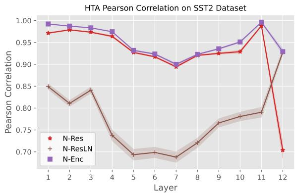  
Figure 4: Single layer Pearson correlation of HTA maps with attribution maps. The 99% confidence intervals are shown as shaded areas around each line. $\mathcal { N } _ { \mathrm { R E S L N } }$ shows considerably less association with HTA.

## 4.5.3 On the role of layer normalization

In Table 1 we see a sudden drop in correlations for $\mathcal { N } _ { \mathrm { R E S L N } }$ . Although this method considers vector norms and residuals, incorporating LN#1 in the encoder seems to have deteriorated the accuracy for token attribution analysis. To determine whether this deterioration of correlation in aggregated attributions is also present in individual single layers, we compare the HTA maps as a baseline with the attribution matrices extracted from different analysis methods. Figure 4 shows the correlation of HTA attribution maps with the maps obtained by $\mathcal { N } _ { \mathrm { R E S } } , \mathcal { N } _ { \mathrm { R E S L N } }$ , and $\mathcal { N } _ { \mathrm { E N C } }$ methods. The results indicate that $\mathcal { N } _ { \mathrm { R E S L N } }$ exhibits a significantly lower association.

The question that arises here is that how incorporating an additional component of the encoder (LN#1) in $\mathcal { N } _ { \mathrm { R E S L N } }$ degrades the results (compared to $\mathcal { N } _ { \mathrm { R E S } } )$ . To answer this question, we investigated the learned weights of LN#1 and LN#2. The outlier weights1⁰ in specific dimensions of LNs are shown to be significantly influential on the model's performance (Kovaleva et al., 2021; Luo et al., 2021). It is interesting to note that based on our observations, the outlier weights of the two layer norms seem to be the opposite of each other. Figure 5 demonstrates the weight values in layer 11 and also the correlation of the outlier weights across layers. The large negative correlations confirm that the outlier weights work contrary to each other. We speculate that the effect of outliers in the two layer norms is partly cancelled out when both are considered.

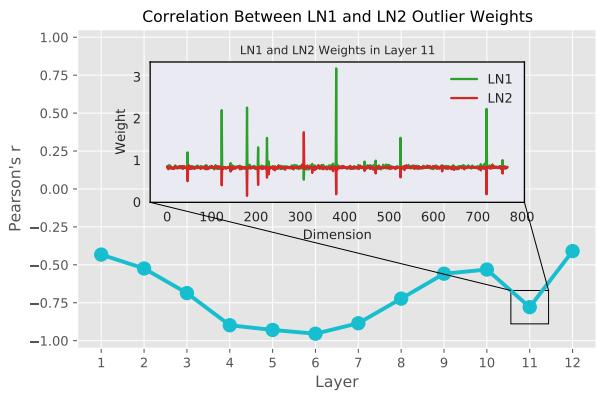

Figure 5: The Pearson correlation between outlier weights of LN#1 and LN#2 across layers. The weight values for layer 11 are shown as well.
<table><tr><td rowspan=1 colspan=1>1</td><td rowspan=1 colspan=1>L1    1</td><td rowspan=1 colspan=1>L6    1</td><td rowspan=1 colspan=1>L12</td><td rowspan=1 colspan=1>MAX</td></tr><tr><td rowspan=1 colspan=1>NIndii. $\mathcal { N } _ { \mathrm { R E S } }$  $\mathcal { N } _ { \mathrm { E N C } }$ </td><td rowspan=1 colspan=1> $- . 5 0 \pm . 1 8$  $- . 4 8 \pm . 1 8$  $- . 4 7 \pm . 1 8$ </td><td rowspan=1 colspan=1> $+ . 2 8 \pm . 2 3$  $+ . 2 9 \pm . 2 4$  $+ . 2 9 \pm . 2 4$ </td><td rowspan=1 colspan=1> $+ . 4 0 \pm . 2 1$  $+ . 4 1 \pm . 1 9$  $+ . 4 1 \pm . 1 9$ </td><td rowspan=1 colspan=1> $+ . 4 1 \pm . 2 1$  $+ . 4 1 \pm . 1 9$  $+ . 4 1 \pm . 1 9$ </td></tr><tr><td rowspan=1 colspan=1>Ro[outN $\mathcal { N } _ { \mathrm { R E S } }$  $\mathcal { N } _ { \mathrm { E N C } }$ </td><td rowspan=1 colspan=1> $- . 5 0 \pm . 1 8$  $- . 4 8 \pm . 1 8$  $- . 4 7 \pm . 1 8$ </td><td rowspan=1 colspan=1> $+ . 4 4 \pm . 2 0$  $+ . 7 0 \pm . 1 4$  $+ . 7 4 \pm . 1 4$ </td><td rowspan=1 colspan=1> $+ . 4 4 \pm . 2 0$  $+ . 7 3 \pm . 1 3$  $+ . 7 7 \pm . 1 2$ </td><td rowspan=1 colspan=1> $+ . 4 4 \pm . 2 0$  $+ . 7 3 \pm . 1 3$  $+ . 7 8 \pm . 1 2$ </td></tr></table>

Table 2: Spearman's rank correlation of attributionbased scores (individual and aggregated by rollout) with saliency scores for the validation set for the BERT model fine-tuned on SST-2. The results are reported for layers 1, 6, 12, and the maximum of all layers. Utilizing rollout aggregation achieves higher correlations than individual layers.

As shown in Figure 2, the FFN and the second layer normalization are on top of the attention block. However, $\mathcal { N } _ { \mathrm { R E S L N } }$ does not incorporate the components outside of the attention block. As described in §3, in our local analysis method $\mathcal { N } _ { \mathrm { E N C } }$ we incorporate the second layer normalization in the transformer's encoder (Figure 2), thus considering the whole encoder block (except FFN). Overall, our global method, GlobEnc, yields the best results among all the methods evaluated in our experiments. In general, Table 1 suggests that incorporating each component of the encoder will increase the correlation; however, the two layer normalizations should be considered together.

## 4.5.4 On the role of aggregation

We carried out an additional analysis to verify if incorporating vector norms, residual connection and layer normalizations in individual layers is adequate for achieving high correlations, or if it is also necessary to aggregate them via rollout. Table 2 shows the correlation results in different layers for raw attributions (without aggregation) and for the aggregated attributions using the rollout method. Applying rollout method on attribution maps up to each layer results in higher correlations with the saliency scores than the raw single layer attribution maps, especially in deeper layers. Therefore, attention aggregation is essential for global input token attribution analysis.

An interesting point in Figure 3, which shows the correlation of the aggregated methods throughout the layers, is that the correlation curves flatten out after only a few layers.11 This indicates that BERT identifies decisive tokens only after the first few layers. The final layers only make minor adjustments to this order. Nevertheless, it is worth noting that the order of attribution does not necessarily imply the model's final decision and the final result may still change for the better or worse (Zhou et al., 2020).

## 4.5.5 Qualitative analysis

To qualitatively answer if the aggregated attribution maps provide plausible and meaningful interpretations, we take a closer look at the attribution maps generated by GlobEnc. Figure 1 shows the GlobEnc attribution of the model trained on SST-2. Each layer demonstrates the [CLS] token's aggregated attribution to input tokens up to the corresponding layer. The example inputs are “a deep and meaningful film." and “big fat waste of time.", both correctly classified by the model. In both cases, GlobEnc focuses on the relevant words for sentiment classification, i.e., “meaningful" and “waste". An interesting observation in Figure 1 is that in the first few layers, the [CLS] token mostly attends to itself while other tokens have marginal impact. As the representations get more contextualized in deeper layers, the attribution correctly shifts to the words which indicate the sentiment of the sentence.12 More examples from MNLI and SST2 datasets, including misclassified examples are available at §A.3. Our qualitative analysis suggests that GlobEnc can be useful for a reasonable interpretation of attention mechanism in BERT, ELECTRA, and possibly any other transformer-based model.

## 5 Related Work

While numerous studies have used attention weights to analyze and interpret the self-attention mechanism (Clark et al., 2019; Kovaleva et al., 2019; Reif et al., 2019; Htut et al., 2019), the use of mere attention weights to explain a model's inner workings has been an active topic of debate (Serrano and Smith, 2019; Jain and Wallace, 2019; Wiegreffe and Pinter, 2019). Several solutions have been proposed to address this issue, usually through converting raw attention weights to scores that provide better explanations. Brunner et al. (2020) used the transformation function $f ^ { h } ( { \pmb x } _ { j } )$ to introduce effective attentions—the orthogonal component of the attention matrix in $f ^ { h } ( { \pmb x } _ { j } )$ null space—to explain the inner workings of each layer. However, this technique ignores other components in the encoder and is computationally expensive due to the SVD required to compute the effective attentions. Kobayashi et al. (2020) incorporated the modified vector and introduced a vector norms-based analysis. This was later extended by integrating residual connections and layer normalization components to enhance the accuracy of explanations (Kobayashi et al., 2021). But, as discussed in §4.5, relying solely on LN#1 does not produce accurate results.

While these methods can be employed for singlelayer (local) analysis, multi-layer attributions are not necessarily correlated with single-layer attributions due to the significant degree of information combination through multi-layer language models (Pascual et al., 2021; Brunner et al., 2020). Various saliency methods exist for explaining the model's decision based on the input (Li et al., 2016; Bastings and Filippova, 2020; Atanasova et al. 2020; Wu and Ong, 2021; Mohebbi et al., 2021). However, these approaches are not primarily designed for computing inter-token attributions. To fill this gap, Brunner et al. (2020) proposed HTA, which is based on the gradient of each hidden embedding in relation to the input embeddings. In §4.3.2, we extend HTA to incorporate the impact of the input vectors. However, HTA is extremely computationally intensive. Attention rollout (see §3) and attention flow—which involve solving a max-flow problem on the attention graph—are two aggregation approaches introduced by Abnar and Zuidema (2020), in which raw attention weights (with equally weighted residual weights) are aggregated within multiple layers. We showed that attention rollout does not perform well on the raw attention maps of language models fine-tuned on downstream tasks and that this problem can be resolved by utilizing attribution norms.

## 6 Conclusions

In this work, we proposed a novel method for single layer token attribution analysis which incorporates the whole encoder layer, i.e., the attention block and the output layer normalization. When aggregated across layers using the rollout method, our technique achieves quantitatively and qualitatively plausible results. Our evaluation of different analysis methods provided evidence on roles played by individual components of the encoder layer, i.e., the vector norms, the residual connections, and the layer normalizations. Furthermore, our in-depth analysis suggested that the two layer normalizations in the encoder layer counteract each other; hence, it is important to couple them for an accurate analysis.

Additionally, using a newly proposed and improved version of Hidden Token Attribution, we demonstrated that encoder-based attribution analysis is more accurate when compared to other partial solutions in a single layer (local-level). This is consistent with our global observations. Quantifying global input token attribution based on our work can provide a meaningful explanation of the whole model's behavior. In future work, we plan to apply our global analysis method on various datasets and models, to provide valuable insights into model decisions and interpretability.

## References

Samira Abnar and Willem Zuidema. 2020. Quantifying attention flow in transformers. In Proceedings of the 58th Annual Meeting of the Association for Computational Linguistics, pages 4190–4197, Online. Association for Computational Linguistics.

Jay Alammar. 2018. The illustrated transformer [blog post].

Pepa Atanasova, Jakob Grue Simonsen, Christina Lioma, and Isabelle Augenstein. 2020. A diagnostic study of explainability techniques for text classification. In Proceedings of the 2020 Conference on Empirical Methods in Natural Language Processing (EMNLP), pages 3256–3274, Online. Association for Computational Linguistics.

Jasmijn Bastings and Katja Filippova. 2020. The elephant in the interpretability room: Why use attention as explanation when we have saliency methods? In Proceedings of the Third BlackboxNLP Workshop

on Analyzing and Interpreting Neural Networks for NLP, pages 149–155, Online. Association for Computational Linguistics.

Gino Brunner, Yang Liu, Damian Pascual, Oliver Richter, Massimiliano Ciaramita, and Roger Wattenhofer. 2020. On identifiability in transformers. In International Conference on Learning Representations.

Kevin Clark, Urvashi Khandelwal, Omer Levy, and Christopher D. Manning. 2019. What does BERT look at? an analysis of BERT's attention. In Proceedings of the 2019 ACL Workshop BlackboxNLP: Analyzing and Interpreting Neural Networks for NLP, pages 276–286, Florence, Italy. Association for Computational Linguistics.

Kevin Clark, Minh-Thang Luong, Quoc V. Le, and Christopher D. Manning. 2020. ELECTRA: Pretraining text encoders as discriminators rather than generators. In ICLR.

Jacob Devlin, Ming-Wei Chang, Kenton Lee, and Kristina Toutanova. 2019. BERT: Pre-training of deep bidirectional transformers for language understanding. In Proceedings of the 2019 Conference of the North American Chapter of the Association for Computational Linguistics: Human Language Technologies, Volume 1 (Long and Short Papers), pages 4171–4186, Minneapolis, Minnesota. Association for Computational Linguistics.

Mohsen Fayyaz, Ehsan Aghazadeh, Ali Modarressi, Hosein Mohebbi, and Mohammad Taher Pilehvar. 2021. Not all models localize linguistic knowledge in the same place: A layer-wise probing on BERToids' representations. In Proceedings of the Fourth BlackboxNLP Workshop on Analyzing and Interpreting Neural Networks for NLP, pages 375–388, Punta Cana, Dominican Republic. Association for Computational Linguistics.

Phu Mon Htut, Jason Phang, Shikha Bordia, and Samuel R. Bowman. 2019. Do attention heads in BERT track syntactic dependencies? CoRR, abs/1911.12246.

Sarthak Jain and Byron C. Wallace. 2019. Attention is not Explanation. In Proceedings of the 2019 Conference of the North American Chapter of the Association for Computational Linguistics: Human Language Technologies, Volume 1 (Long and Short Papers), pages 3543–3556, Minneapolis, Minnesota.

Pieter-Jan Kindermans, Kristof Schütt, Klaus-Robert Müller, and Sven Dähne. 2016. Investigating the influence of noise and distractors on the interpretation of neural networks.

Goro Kobayashi, Tatsuki Kuribayashi, Sho Yokoi, and Kentaro Inui. 2020. Attention is not only a weight: Analyzing transformers with vector norms. In Proceedings of the 2020 Conference on Empirical Methods in Natural Language Processing (EMNLP),

pages 7057–7075, Online. Association for Computational Linguistics.

Goro Kobayashi, Tatsuki Kuribayashi, Sho Yokoi, and Kentaro Inui. 2021. Incorporating Residual and Normalization Layers into Analysis of Masked Language Models. In Proceedings of the 2021 Conference on Empirical Methods in Natural Language Processing, pages 4547–4568, Online and Punta Cana, Dominican Republic. Association for Computational Linguistics.

Olga Kovaleva, Saurabh Kulshreshtha, Anna Rogers, and Anna Rumshisky. 2021. BERT busters: Outlier dimensions that disrupt transformers. In Findings of the Association for Computational Linguistics: ACL-IJCNLP 2021, pages 3392–3405, Online. Association for Computational Linguistics.

Olga Kovaleva, Alexey Romanov, Anna Rogers, and Anna Rumshisky. 2019. Revealing the dark secrets of BERT. In Proceedings of the 2019 Conference on Empirical Methods in Natural Language Processing and the 9th International Joint Conference on Natural Language Processing (EMNLP-IJCNLP), pages 4365–4374, Hong Kong, China.

Jiwei Li, Xinlei Chen, Eduard Hovy, and Dan Jurafsky. 2016. Visualizing and understanding neural models in NLP. In Proceedings of the 2016 Conference of the North American Chapter of the Association for Computational Linguistics: Human Language Technologies, pages 681–691, San Diego, California. Association for Computational Linguistics.

Ziyang Luo, Artur Kulmizev, and Xiaoxi Mao. 2021. Positional artefacts propagate through masked language model embeddings. In Proceedings of the 59th Annual Meeting of the Association for Computational Linguistics and the 11th International Joint Conference on Natural Language Processing (Volume 1: Long Papers), pages 5312–5327, Online. Association for Computational Linguistics.

Binny Mathew, Punyajoy Saha, Seid Muhie Yimam, Chris Biemann, Pawan Goyal, and Animesh Mukherjee. 2021. Hatexplain: A benchmark dataset for explainable hate speech detection. Proceedings of the AAAI Conference on Artificial Intelligence, 35(17):14867–14875.

Hosein Mohebbi, Ali Modarressi, and Mohammad Taher Pilehvar. 2021. Exploring the role of BERT token representations to explain sentence probing results. In Proceedings of the 2021 Conference on Empirical Methods in Natural Language Processing, pages 792–806, Online and Punta Cana, Dominican Republic. Association for Computational Linguistics.

Damian Pascual, Gino Brunner, and Roger Wattenhofer. 2021. Telling BERT's full story: from local attention to global aggregation. In Proceedings of the 16th Conference of the European Chapter of the Association for Computational Linguistics: Main Volume, pages 105–124, Online. Association for Computational Linguistics.

Emily Reif, Ann Yuan, Martin Wattenberg, Fernanda B Viegas, Andy Coenen, Adam Pearce, and Been Kim. 2019. Visualizing and measuring the geometry of bert. In Advances in Neural Information Processing Systems, pages 8594–8603.

Victor Sanh, Lysandre Debut, Julien Chaumond, and Thomas Wolf. 2019. Distilbert, a distilled version of bert: smaller, faster, cheaper and lighter. In NeurIPS EMC2 Workshop.

Sofia Serrano and Noah A. Smith. 2019. Is attention interpretable? In Proceedings of the 57th Annual Meeting of the Association for Computational Linguistics, pages 2931–2951, Florence, Italy.

Karen Simonyan, Andrea Vedaldi, and Andrew Zisserman. 2014. Deep inside convolutional networks: Visualising image classification models and saliency maps. CoRR, abs/1312.6034.

Richard Socher, Alex Perelygin, Jean Wu, Jason Chuang, Christopher D. Manning, Andrew Ng, and Christopher Potts. 2013. Recursive deep models for semantic compositionality over a sentiment treebank. In Proceedings of the 2013 Conference on Empirical Methods in Natural Language Processing, pages 1631–1642, Seattle, Washington, USA. Association for Computational Linguistics.

Ashish Vaswani, Noam Shazeer, Niki Parmar, Jakob Uszkoreit, Llion Jones, Aidan N Gomez, Ł ukasz Kaiser, and Illia Polosukhin. 2017. Attention is all you need. In Advances in Neural Information Processing Systems, volume 30. Curran Associates, Inc.

Sarah Wiegreffe and Yuval Pinter. 2019. Attention is not not explanation. In Proceedings of the 2019 Conference on Empirical Methods in Natural Language Processing and the 9th International Joint Conference on Natural Language Processing (EMNLP-IJCNLP), pages 11–20, Hong Kong, China. Association for Computational Linguistics.

Adina Williams, Nikita Nangia, and Samuel Bowman. 2018. A broad-coverage challenge corpus for sentence understanding through inference. In Proceedings of the 2018 Conference of the North American Chapter of the Association for Computational Linguistics: Human Language Technologies, Volume 1 (Long Papers), pages 1112–1122, New Orleans, Louisiana. Association for Computational Linguistics.

Thomas Wolf, Lysandre Debut, Victor Sanh, Julien Chaumond, Clement Delangue, Anthony Moi, Pierric Cistac, Tim Rault, Remi Louf, Morgan Funtowicz, Joe Davison, Sam Shleifer, Patrick von Platen, Clara Ma, Yacine Jernite, Julien Plu, Canwen Xu, Teven Le Scao, Sylvain Gugger, Mariama Drame, Quentin Lhoest, and Alexander Rush. 2020. Transformers: State-of-the-art natural language processing. In Proceedings of the 2020 Conference on Empirical Methods in Natural Language Processing: System Demonstrations, pages 38–45, Online. Association for Computational Linguistics.

Zhengxuan Wu and Desmond C. Ong. 2021. On explaining your explanations of BERT: an empirical study with sequence classification. CoRR, abs/2101.00196.

Wangchunshu Zhou, Canwen Xu, Tao Ge, Julian McAuley, Ke Xu, and Furu Wei. 2020. Bert loses patience: Fast and robust inference with early exit. In Advances in Neural Information Processing Systems, volume 33, pages 18330–18341. Curran Associates, Inc.

## A Appendix

A.1 LN Formulation

$$
\begin{array} { r } { m ( { \pmb a } ) : = \frac { 1 } { d } \sum _ { k } { \pmb a } ^ { ( k ) } , } \end{array}
$$

$$
\begin{array} { r } { s ( \pmb { a } ) : = \sqrt { \frac { 1 } { d } \sum _ { k } ( m ( \pmb { a } ) - \pmb { a } ^ { ( k ) } + \epsilon ) ^ { 2 } } } \end{array}
$$

where € is a small constant

## A.2 More Models

In this section we provide the results for BERTlarge and ELECTRA-base. For both models, our method outperforms the previous analysis methods. The results are reported in Tables A.1 and A.2.

## A.3 More Examples

Aggregated attributions by different methods throughout layers is shown in Figure A.2. Our proposed method shows more plausible results.

Aggregated attribution map for layer 12 is shown in Figure A.3. In this figure, the effect of each token can be seen on all other tokens and not just the [CLS] token.

More examples for MNLI dataset are shown for BERT-base in Figure A.4, for BERT-large in Figure $_ { \mathrm { A . 6 , } }$ and for ELECTRA in Figure A.5. Moreover, misclassified examples of SST2 dataset are shown in Figure A.1.

<table><tr><td>BERT-large</td><td colspan="3">Attention Rollout</td></tr><tr><td></td><td>SST2</td><td>MNLI</td><td>HATEXPLAIN</td></tr><tr><td>Weight-based (W)</td><td> $- 0 . 3 8 \pm 0 . 1 6$ </td><td> $- 0 . 6 1 \pm 0 . 1 4$ </td><td> $- 0 . 4 1 \pm 0 . 2 5$ </td></tr><tr><td>w/ Fixed Residual  $( \mathcal { W } _ { \mathrm { F I X E D R E S } } )$ </td><td> $- 0 . 2 5 \pm 0 . 1 9$ </td><td> $- 0 . 4 8 \pm 0 . 1 9$ </td><td> $- 0 . 2 1 \pm 0 . 3 0$ </td></tr><tr><td>w/ Residual  $\left( \mathcal { W } _ { \mathrm { R E S } } \right)$ </td><td> $- 0 . 1 0 \pm 0 . 2 1$ </td><td> $0 . 3 3 \pm 0 . 2 3$ </td><td> $0 . 0 9 \pm 0 . 3 0$ </td></tr><tr><td>Norm-based (N)</td><td> $0 . 4 4 \pm 0 . 2 4$ </td><td> $0 . 1 3 \pm 0 . 2 7$ </td><td> $0 . 4 8 \pm 0 . 2 5$ </td></tr><tr><td>w/ Fixed Residual (NFıxEDREs)</td><td> $0 . 4 9 \pm 0 . 2 4$ </td><td> $0 . 2 6 \pm 0 . 2 5$ </td><td> $0 . 4 9 \pm 0 . 3 0$ </td></tr><tr><td>w/ Residual  $( \mathcal { N } _ { \mathrm { R E S } } )$ </td><td> $0 . 7 7 \pm 0 . 1 1$ </td><td> $0 . 6 6 \pm 0 . 1 2$ </td><td> $0 . 7 3 \pm 0 . 1 6$ </td></tr><tr><td>w/ Residual + Layer Norm 1  $( \mathcal { N } _ { \mathrm { R E S L N } } )$ </td><td> $- 0 . 0 7 \pm 0 . 2 3$ </td><td> $- 0 . 3 5 \pm 0 . 2 4$ </td><td> $0 . 0 6 \pm 0 . 3 2$ </td></tr><tr><td>w/ GlobEnc: [Residual + Layer Norm 1, 2]  $( \mathcal { N } _ { \mathrm { E N C } } )$ </td><td> ${ \bf 0 . 8 3 \pm 0 . 0 8 }$ </td><td> ${ \bf 0 . 7 7 \pm 0 . 0 9 }$ </td><td> ${ \bf 0 . 7 6 \pm 0 . 1 7 }$ </td></tr></table>

Table A.1: Spearman's rank correlation of attribution based importance (aggregated by rollout) with saliency scores for the validation set for the BERT-large model fine-tuned on SST-2, MNLI, and HateXplain. The numbers are the average on all the validation set examples (1024 examples for MNLI dataset due to resource limitations) ± the standard deviation.

<table><tr><td>ELECTRA-base</td><td colspan="3">Attention Rollout</td></tr><tr><td></td><td>SST2</td><td>MNLI</td><td>HATEXPLAIN</td></tr><tr><td>Weight-based (W)</td><td> $- 0 . 3 7 \pm 0 . 1 9$ </td><td> $- 0 . 3 1 \pm 0 . 2 2$ </td><td> $0 . 0 2 \pm 0 . 2 9$ </td></tr><tr><td>w/ Fixed Residual (WFıxEDREs)</td><td> $- 0 . 3 7 \pm 0 . 1 9$ </td><td> $- 0 . 2 4 \pm 0 . 2 3$ </td><td> $0 . 0 1 \pm 0 . 2 9$ </td></tr><tr><td>w/ Residual  $\left( \mathcal { W } _ { \mathrm { R E S } } \right)$ </td><td> $- 0 . 1 0 \pm 0 . 2 2$ </td><td> $0 . 0 8 \pm 0 . 2 5$ </td><td> $0 . 2 0 \pm 0 . 2 7$ </td></tr><tr><td>Norm-based (N)</td><td> $0 . 1 8 \pm 0 . 2 1$ </td><td> $0 . 1 2 \pm 0 . 2 1$ </td><td> $0 . 2 1 \pm 0 . 2 6$ </td></tr><tr><td>w/ Fixed Residual  $( \mathcal { N } _ { \mathrm { F I X E D R E S } } )$ </td><td> $0 . 2 3 \pm 0 . 2 2$ </td><td> $0 . 3 2 \pm 0 . 2 3$ </td><td> $0 . 2 8 \pm 0 . 2 6$ </td></tr><tr><td>w/ Residual  $( \mathcal { N } _ { \mathrm { R E S } } )$ </td><td> $0 . 5 4 \pm 0 . 1 7$ </td><td> $0 . 5 4 \pm 0 . 1 4$ </td><td> $0 . 4 4 \pm 0 . 2 1$ </td></tr><tr><td> $\mathrm { w / R e s i d u a l + L a y e r N o r m 1 ( \mathcal { N } _ { R E S L N } ) }$ </td><td> $- 0 . 2 4 \pm 0 . 2 3$ </td><td> $- 0 . 1 6 \pm 0 . 2 4$ </td><td> $- 0 . 0 7 \pm 0 . 2 8$ </td></tr><tr><td>w/ GlobEnc: [Residual + Layer Norm 1, 2]  $( \mathcal { N } _ { \mathrm { E N C } } )$ </td><td> ${ \bf 0 . 6 4 \pm 0 . 1 5 }$ </td><td> $\mathbf { 0 . 6 8 \pm 0 . 1 2 }$ </td><td> ${ \bf 0 . 4 7 \pm 0 . 2 2 }$ </td></tr></table>

Table A.2: Spearman's rank correlation of attribution based importance (aggregated by rollout) with saliency scores for the validation set for the ELECTRA-base model fine-tuned on SST-2, MNLI, and HateXplain. The numbers are the average on all the validation set examples ± the standard deviation.

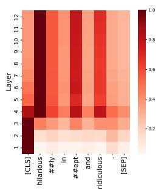

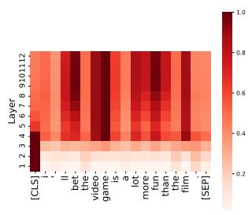

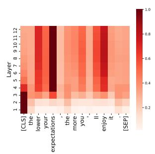

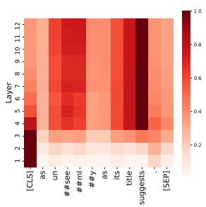  
Figure A.1: Aggregated $\mathcal { N } _ { \mathrm { E N C } }$ attribution maps (GlobEnc) for the [CLS] token for fine-tuned BERT on SST2 dataset (sentiment analysis). These examples were misclassified by the model.

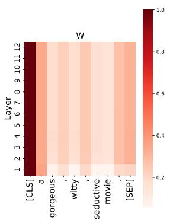

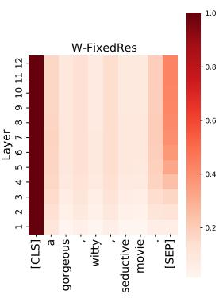

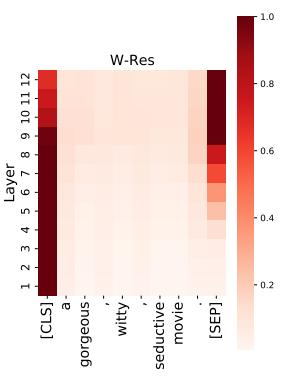

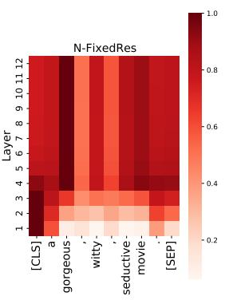

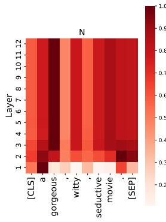

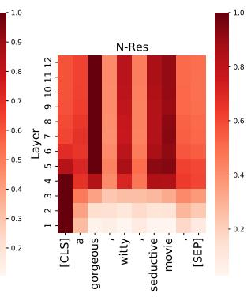

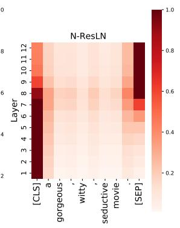

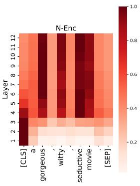  
Figure A.2: Aggregated attributions via rollout with different methods across layers. The model is fine-tuned on SST2 dataset and the attention of the CLS token is shown in each layer.

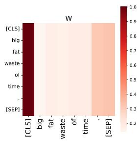

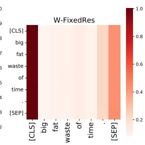

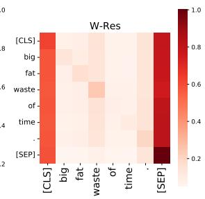

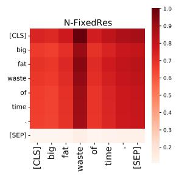

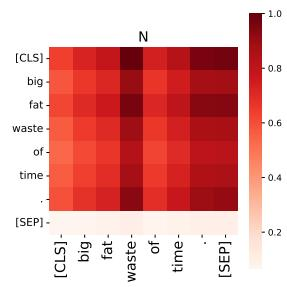

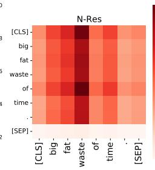

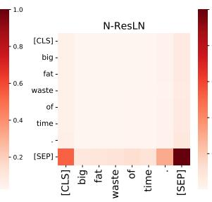

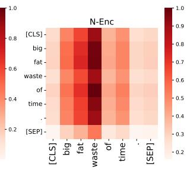  
Figure A.3: Aggregated attributions via rollout with different methods in layer 12. The model is fine-tuned on SST2 dataset. Each row indicates how much other tokens impact the token written on the row.

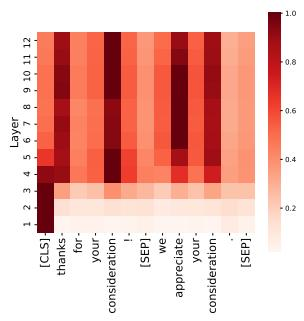

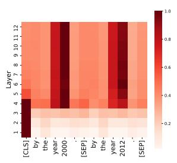

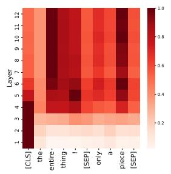

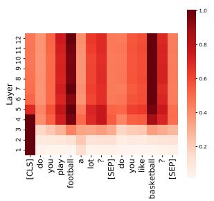  
Figure A.4: Aggregated $\mathcal { N } _ { \mathrm { E N C } }$ attribution maps (GlobEnc) for the [CLS] token for fine-tuned BERT on MNLI dataset.

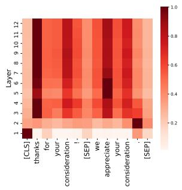

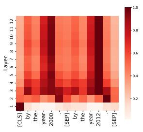

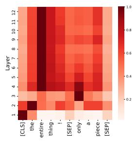

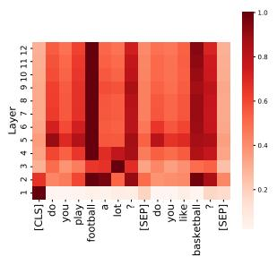  
Figure A.5: Aggregated $\mathcal { N } _ { \mathrm { E N C } }$ attribution maps (GlobEnc) for the [CLS] token for fine-tuned ELECTRA on MNLI dataset.

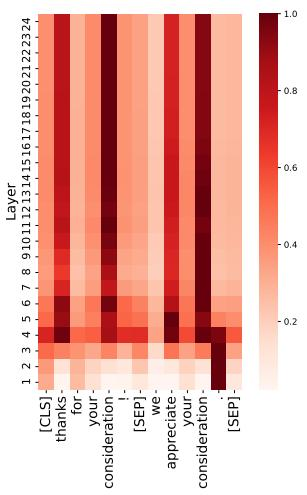

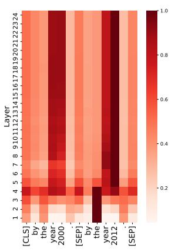

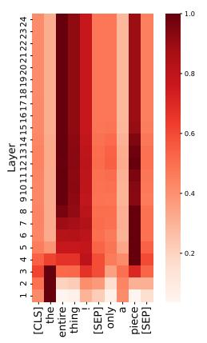

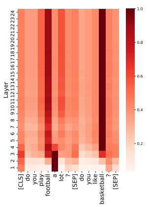  
Figure A.6: Aggregated $\mathcal { N } _ { \mathrm { E N C } }$ attribution maps (GlobEnc) for the [CLS] token for fine-tuned BERT-large on MNLI dataset.