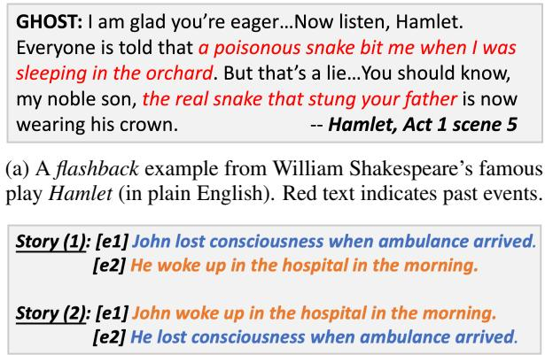
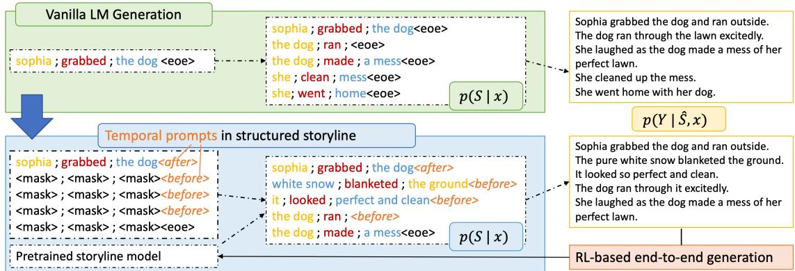
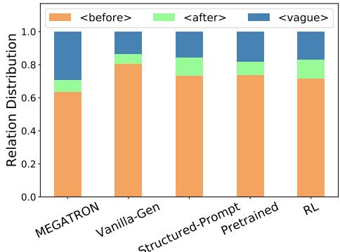
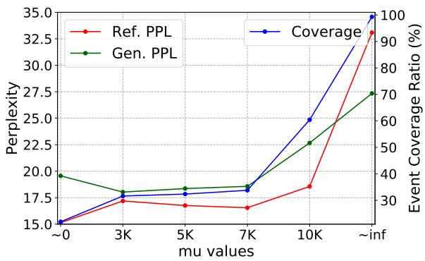
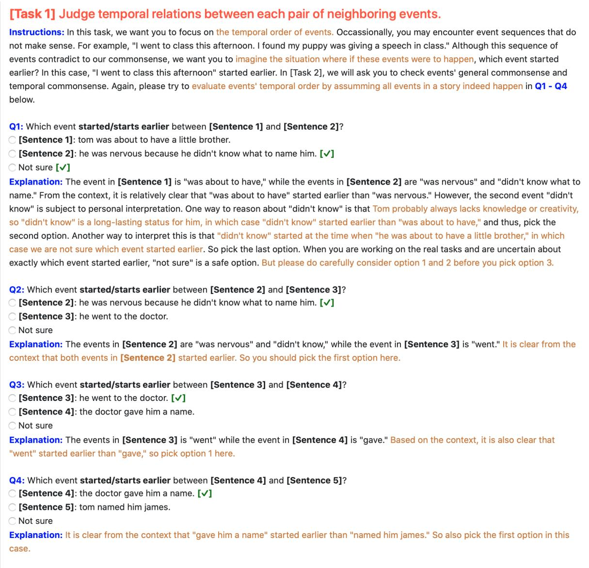
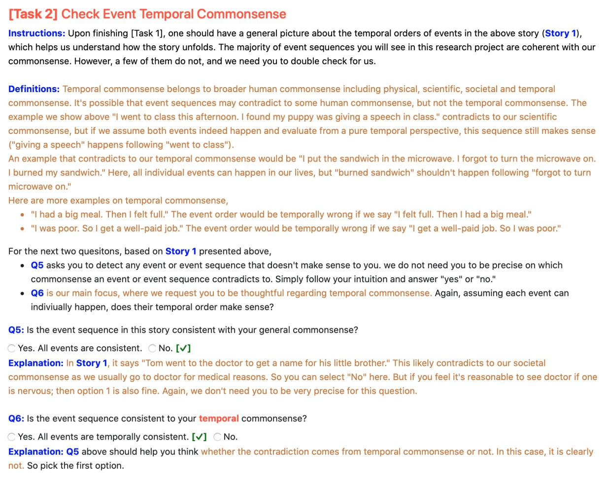
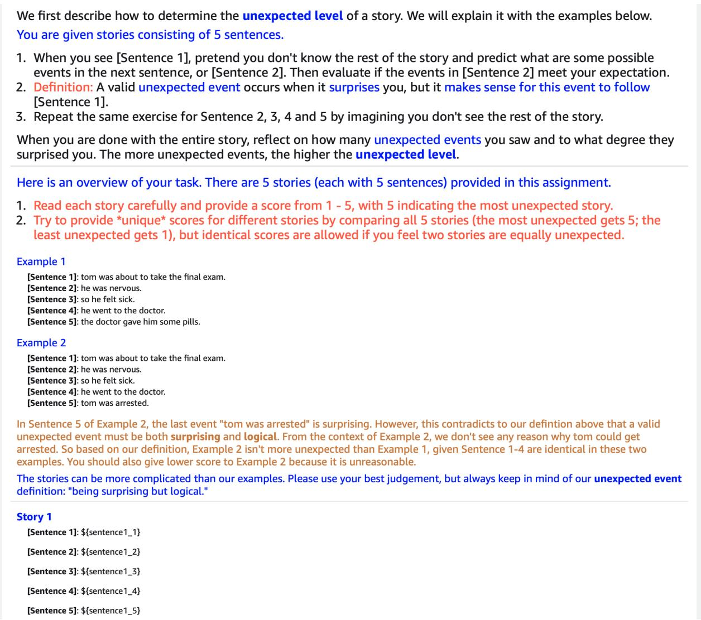

# Go Back in Time: Generating Flashbacks in Stories with Event Temporal Prompts

Rujun Han 1 Hong Chen2 Yufei Tian3 Nanyun Peng3

1University of Southern California 2Tokyo University

3University of California, Los Angeles

rujunhan@usc.edu; chen@nlab.ci.i.u-tokyo.ac.jp yufeit@ucla.edu; violetpeng@cs.ucla.edu

## Abstract

Stories or narratives are comprised of a sequence of events. To compose interesting stories, professional writers often leverage a creative writing technique calledflashback that inserts past events into current storylines as we commonly observe in novels and plays. However, it is challenging for machines to generate flashbacks as it requires solid understanding of event temporal order (e.g. feeling hungry before eat, not vice versa), and the creativity to arrange storylines so that earlier events do not always appear first in narrative order. Two major issues in existing systems exacerbate the challenges: 1) temporal bias in pretraining and story datasets that leads to monotonic event temporal orders; 2) lack of explicit guidance that helps machines decide where to insert flashbacks. We propose to address these issues using structured storylines to encode events and their pair-wise temporal relations ( before , after and vague ) as temporal prompts that guide how stories should unfold temporally. We leverage a Plan-and-Write framework enhanced by reinforcement learning to generate storylines and stories end-toend. Evaluation results show that the proposed method can generate more interesting stories with flashbacks while maintaining textual diversity, fluency and temporal coherence.1

## 1 Introduction

Flashback is a popular creative writing technique that brings the readers from the present moment to the past via inserting earlier events in order to provide background or context of the current narrative (Pavis, 1998; Kenny, 2004; Gebeyehu, 2019). For example, in Figure 1a, the “GHOST” in Shakespeare’s play Hamlet instruments a flashback by interrupting the main narrative and describing a historical event to the audience that Hamlet’s father was killed by the current king rather than a snake.

(b) Two-sentence stories with the same event temporal order but different narrative order. The second one with a flashback is intuitively more interesting than the first one.

Figure 1: (a)flashback (b) temporal v.s. narrative order.

Flashback, by manipulating the event temporal orders in narrative structure, can arouse readers’ emotions such as surprise, suspense, and curiosity (Brewer and Lichtenstein, 1981, 1982). These emotions stimulate readers’ interests and eventually contribute to the satisfaction of reading (Tan, 1996; Alwitt, 2002), which improves the interest level of a story. The example in Figure 1a injects historical events in the middle of the narrative. This arrangement of events can surprise readers and therefore, makes the story more interesting than a straightforward storyline where the past events are shown in the beginning.

Similarly, consider the pair of two-sentence stories in Figure 1b. Both stories are composed of the same events with the temporal order “lost consciousness” before “woke up in the hospital.” In Story (1), seeing [e1], readers can make a relatively easy educated guess of [e2], but it is more subtle in Story (2) as there are many different ways to end up in a hospital. By showing the ending event first, the flashback in Story (2) creates suspense that makes the following sentences less predictable, and thus arouses readers’ curiosity and makes the reading more interesting.

While human writers are capable of maneuvering event temporal orders to compose coherent and interesting stories, it remains challenging for machines. The challenge is partially attributed to data bias. Ning et al. (2018a) shows that the pattern in Story (1) is dominant in human-written texts, where neighboring events with before temporal relations (i.e., narrative order indicates temporal order) occur 60 70% of the time. This is also manifested in our experiments with vanilla language models amplifying this ratio and producing more than 80% before relations for neighboring events in the generated stories. Furthermore, current stateof-the-art story generation systems that incorporate event representations usually assume event temporal order follows narrative order (Goldfarb-Tarrant et al., 2020; Lin et al., 2021). There are no explicit prompts in these systems that help determine when flashback should be used, leaving models to produce dull stories consisting of event sequences with monotonic before relations.

To facilitate more effective flashback, we propose to incorporate temporal prompts in an endto-end story generation framework inspired by the Plan-and-Write paradigm (Yao et al., 2019; Xu et al., 2020; Goldfarb-Tarrant et al., 2020), where machines first learn to plot a storyline, and then generate the story based on the storyline. Specifically, we encode predefined event temporal prompts in structured storylines. As the bottom block of Figure 2 shows, a structured storyline contains two components: 1) event representations where an event trigger (“grabbed”) and two arguments (“she” and “the dog”) are extracted from the original story sentences; and 2) temporal prompts: the temporal order between neighboring events, e.g. event 1: (“she”, “grabbed”, “the dog”) is $\langle a f t e r \rangle$ event 2: (“white snow”, “blanketed”, “the ground”). By training our storyline generation model with these predefined pair-wise temporal relations, models capture how neighboring events are temporally related to each other; while during storyline decoding, supplying predefined temporal prompts can guide models to generate reasonable narratives with desirable event temporal orders.

Prior works (Fan et al., 2019; Goldfarb-Tarrant et al., 2020) build the storyline and story models separately, which creates a discrepancy where gold storylines are used during training, but predicted storylines are used during inference. To mitigate this training-inference discrepancy, we leverage reinforcement learning (RL) to train our systems endto-end. It enables the story model to train on generated storylines and updates the storyline model with the feedback from the story model. Our experimental results show that the RL-based models can leverage temporal prompts more effectively, resulting in more effectiveflashback generation and more interesting stories.

We summarize the contributions of this paper as follows: 1) To facilitate effectiveflashback, we propose to leverage structured storylines with temporal prompts to arrange events in story generation. 2) We integrate reinforcement learning in our story generation pipeline, which can help models better leverage temporal prompts. 3) We test our framework on two open-domain story datasets and show more effectiveflashbacks and increased interest level while maintaining fluency and temporal commonsense in the generated stories. To our best knowledge, this is a pioneering study onflashbacks in neural story generation.

## 2 Background and Task Definitions

In this section, we describe the key components: events and temporal prompts in our proposed structured storylines, and then define the Plan-and-Write generation task.

Event Representation. Following the definitions of ACE (2005), we define an event as a trigger word and its arguments. In this work, we simplify the representation by leveraging semantic role labeling (SRL) tools (Shi and Lin, 2019) to parse two arguments as shown in Figure 2. We only consider one event per story sentence and denote the k-th event in story i as $e _ { i , k }$ . We leave more complicated representations for future study.

Temporal Prompts. Let $r _ { i } = \{ r _ { i , k } \}$ denotes the set of temporal relations between the k-th and the (k+1)-th event in story i. If k indexes the last event, $r _ { i , k }$ is not defined. Following the event relation definition of (Ning et al., 2018b), we use events’ start time to evaluate temporal order.

Structured Storyline. Figure 2 provides a storyline consisting of five event representations extracted from our data. More formally, let $\begin{array} { r } { S _ { i } \ = } \end{array}$ $\{ e _ { i , 1 } , e _ { i , 2 } , . . . e _ { i , k } , . . . e _ { i , n } \}$ indicates a storyline with n events. Encoding temporal prompts, $s _ { i }$ becomes $S _ { i } ^ { r } = \{ e _ { i , 1 } , r _ { i , 1 } , e _ { i , 2 } , r _ { i , 2 } . . . e _ { i , k } , r _ { i , k } , . . . e _ { i , n } \}$ Note that in this work, $\mathbf { \nabla } _ { \mathbf { r } _ { i } }$ is provided as predefined prompts rather than predicted as $e _ { i , k }$

Story. Our ultimate goal is to generateflashbacks in stories. We denote the story associated with the

  
Figure 2: An illustration of our overall model. Here we use the first sentence of the story (and its associated event representation) as input x. The upper block shows the vanilla implementation of the Plan-and-Write workflow. The bottom block is our core novel design by leveraging temporal prompts in structured storylines to generate flashbacks. For illustration purposes, we re-order the triggers and arguments, and storylines are ground-truths (i.e. not predicted by models). Our final model uses reinforcement learning to implement end-to-end training.

storyline $s _ { i }$ as $\mathcal { V } _ { i }$ .

Plan-and-Write is a two-stage framework that first generates storyline $\hat { S } _ { i }$ given some input x (e.g. title, leading sentence), and then generate $\hat { \mathcal { V } } _ { i }$ based on $\hat { S } _ { i }$ . Again, ${ r } _ { i , k }$ are given as predefined prompts whereas $e _ { i , k }$ are to be predicted as part of the storyline generation shown in Figure 2.

## 3 Framework for FlashBack Generation

In this section, we first provide an overview of the Plan-and-Write story generation system and introduce a vanilla version of the end-to-end training method. Then we describe the details of our key contribution of leveraging event temporal prompts to generate flashbacks. After that, we discuss pretraining structured storylines with self-labeled data and incorporating reinforcement learning to jointly train our end-to-end models.

## 3.1 Plan-and-Write Models

In order to provide better explainability and controllability over the machine generated stories, recent research efforts (Yao et al., 2019; Xu et al., 2020; Goldfarb-Tarrant et al., 2020) explore dividing story generation into two steps: 1) from input or prefix, x, we first produce a storyline, i; 2) based on the storyline, we generate a story, i. We describe the details below.

Storyline Model. Let α denote the parameters of the storyline model, per sample training loss can be computed as $\mathcal { L } _ { \alpha } = - \log p \left( S _ { i } | \boldsymbol { x } _ { i } , \alpha \right)$

Story Model. Let $\beta$ denote the parameters of the story model, per sample training loss can be computed as $\mathcal { L } _ { \beta } = - \log p \left( \mathcal { V } _ { i } | \pmb { x } _ { i } , S _ { i } , \beta \right)$

Inference. Note that $s _ { i }$ above is the gold storyline extracted from $\mathcal { V } _ { i }$ . At the inference time, we do not have $S _ { i }$ , and have to replace it with $\hat { S } _ { i }$ , the predicted storyline. This results in a discrepancy between the training and inference time.

End-to-end Training. Instead of using gold storyline $s _ { i }$ to train a story model, we can take $\hat { S } _ { i }$ as its input. Now the per sample training loss for the story model becomes $\mathcal { L } _ { \theta } = - \log p \left( \mathcal { V } _ { i } | \pmb { x } _ { i } , \hat { S } _ { i } , \theta \right)$ where θ indicates the end-to-end story model parameters. End-to-end training can alleviate the gap between the training and inference time, and potentially lead to more consistent stories 2.

## 3.2 Structured Storyline Construction

As Figure 2 shows, for a story sentence, we first use the SRL tool to parse its trigger $t _ { i , k }$ and two arguments $a _ { i , k } ^ { 1 }$ and $a _ { i , k } ^ { 2 }$ . We then convert this representation into a textual form: $^ { \mathfrak { e } } t _ { i , k } \ ; a _ { i , k } ^ { 1 } \ ; a _ { i , k } ^ { 2 } \langle e o e \rangle ^ { \mathfrak { p } }$ where “;” separates two event components, and eoe indicates event ending. For example, the parsed $t _ { i , k } , a _ { i , k } ^ { 1 }$ and $a _ { i , k } ^ { 2 }$ in the story sentence “she grabbed the dog and ran outside” are “grabbed,” “she” and “the dog” respectively. They are concatenated into a final textual representation as “grabbed ; she ; the dog eoe .”

Depending on the experimental setup, we may use no or only the leading event as input, x. Inspired by the mask prediction design in Devlin et al. (2019); Liu et al. (2019); Lewis et al. (2020), we represent the remaining missing events in the inputs as “ mask ; mask ; mask ; eoe ,” where mask indicates either event trigger word or arguments to be predicted by the storyline model.

Algorithm 1 RL-based End-to-end Training   
1: Randomly initialize α and θ   
2: Pretrain α . storyline pretraining   
3: for i M do . loop through all data   
4: Generate $\hat { S } _ { i } ^ { r }$ from storyline model (α)   
5: $\mathcal { L } _ { \boldsymbol { \theta } } = - \log p \left( \mathcal { y } _ { i } | \mathbf { x } _ { i } , \hat { S } _ { i } ^ { r } , \boldsymbol { \theta } \right)$   
6: $\nabla J _ { \alpha } = R _ { i } \cdot \nabla \mathrm { l o g } \left( p ( S _ { i } | \mathbf { x } _ { i } ^ { ' } , \mathbf { r } _ { i } , \alpha ) \right)$   
7: $\alpha = \alpha - \nabla J _ { \alpha }$   
8: $\theta = \theta - \nabla \mathcal { L } _ { \theta }$   
9: end for

## 3.3 Temporal Prompt Encoding

Temporal prompts are used to generateflashbacks. As we mentioned in Section 2, we encode a sequence of predefined event temporal prompts $r _ { i } = \{ r _ { i , k } \}$ in storyline for $k \in \{ 1 , n - 1 \}$ to help models determine whether the next event mention (in narrative order) should start earlier or later than its preceding event mention. We use temporal relation extraction tools to annotate all $r _ { i , k }$ in our experimental data. Specifically, we use ECONET (Han et al., 2021b) finetuned on the MATRES dataset (Ning et al., 2018b) to predict the temporal relation between neighboring events.3 The context and the locations of a pair of event trigger words are fed into ECONET to predict their temporal order. The temporal prompt set consists of before , after and vague (capturing undetermined temporal order), and are fixed in $S _ { i } ^ { r }$ . Note that vague indicates undetermined temporal order due to the ambiguity of the context (Cassidy et al., 2014; Ning et al., 2018b) and it does not suggest the context is poor or the relations are wrong. As shown in Figure 2, we replace the end-of-event token eoe with temporal prompts in storylines, except for the last event which does not have a next event. With the prompt-augmented storylines, $S _ { i } ^ { r }$ , we can re-write the storyline loss as $\mathcal { L } _ { \alpha } = - \log p \left( S _ { i } ^ { r } | \pmb { x } _ { i } , \pmb { r } _ { i } , \alpha \right)$ and story loss as $\mathcal { L } _ { \boldsymbol { \theta } } = - \log p \left( \mathcal { V } _ { i } | \mathbf { x } _ { i } , \hat { \mathcal { S } } _ { i } ^ { r } , \boldsymbol { \theta } \right)$

## 3.4 Storyline Pretraining

Using intermediate pretraining to adapt original pretrained language models has been shown to be effective for a variety of downstream tasks such as information extraction (Joshi et al., 2020), questionanswering (Khashabi et al., 2020; Garg et al., 2020) and commonsense reasoning (Zhou et al., 2021). To capture more diverse event sequences and facilitate better story generation, we explore pretraining storyline model with SRL extracted storyline from BookCorpus dataset (Zhu et al., 2015), and use learned α to initialize storyline models.

## 3.5 RL-based End-to-end Model

The end-to-end model described in Sec. 3.1 allows the story model to train with the generated storylines and hence alleviate the gap between training and inference. However, this workflow still lacks a mechanism that enables the storyline model to adjust with the feedback from the story model. The challenges of training storyline and story models jointly originate from decoding storylines as inputs for the story model, which involves nondifferentiable token selections. Thus, the final loss $L _ { \theta }$ cannot be directly back-propagated into the storyline model.

To overcome this barrier, we adopt reinforcement learning (RL), specifically, the REINFORCE algorithm (Williams and Peng, 1991) in our endto-end training. Let $R _ { i } = R ( \pmb { x } _ { i } , \pmb { r } _ { i } )$ . The expected reward with respect to the storyline model can be written as $\mathbb { E } _ { \alpha } \left[ R _ { i } \right] = \mathbb { E } \left[ R _ { i } \cdot \log \left( p ( S _ { i } ^ { r } | \pmb { x } _ { i } , \pmb { r } _ { i } , \alpha ) \right) \right]$ The gradient to update the storyline model is $\nabla J _ { \alpha } ~ = ~ \mathbb { E } \left[ R _ { i } \right.$ log $\left( p ( S _ { i } ^ { r } | \pmb { x } _ { i } , \pmb { r } _ { i } , \alpha ) \right) ]$ , which can be approximated with sampling techniques. Motivated by Xu et al. (2018), we use negative loss of the story model to construct rewards, that is, $R = - \mathcal { L } _ { \theta } . ^ { 5 }$ In other words, smaller loss from the story model is associated with larger reward. Algorithm 1 summarizes the overall method.

## 4 Experimental Setup

In this section, we start by describing our research objectives, then we describe our data, evaluation metrics, experimental designs and implementation details aiming to achieve these objectives.

The overall research objective is to measure the impact of using temporal prompts in structured storylines. Specifically, can after successfully induce flashbacks? If so, does that contribute to the interest level of the generated stories while maintaining the overall quality of the texts?

## 4.1 Datasets.

ROCStories (Mostafazadeh et al., 2016a) and WritingPrompts (Fan et al., 2018) are our experimental datasets. We ensured all reported results using the same test data as the baseline systems (Xu et al., 2020) and (Goldfarb-Tarrant et al., 2020). For pretraining data, we use BookCorpus (Zhu et al., 2015). Appendix B shows all details of data splits and pre-processing process.

## 4.2 Temporal Prompts Constructions

ECONET was finetuned three times with different random seeds, so we take the consensus vote from three models. If there is any disagreement, we label the temporal order as vague . We benchmark ECONET’s annotation performances in Appendix G, which shows it provides highly accurate temporal relations. For human evaluations specifically, we consider two prompt settings in order to gauge different impacts of after . 1) for ROC-Stories, all structured storylines consist of exactly four predefined temporal prompts created following Sec 3.3. We randomly sample stories with one after prompt from the test data. We will show later in the analysis that vanilla language models would generate more than 80% event pairs with before relations for ROCStories; after prompt should bring this ratio down if it is effective. 2) for WritingPrompts, since the number of events is not fixed, we randomly sample test stories generated with after prompts for evaluation.

## 4.3 Automatic Evaluation Metrics

We use automatic metrics to evaluate the textual quality of stories. We report Ref. PPL: reference stories’ perplexity in our models and Gen. PPL: generated stories’ perplexity scored by GPT-2 (Radford et al., 2019). For diversity, we report Distinct Ratio (%): overall vocabulary:token number ratio. We also report standard BLEU-3 and ROUGE .

## 4.4 Human Evaluation Metrics

We rely on human annotators to analyze the effectiveness offlashback generations. We request 18 MTurkers who succeeded in our previous annotation tasks (Han et al., 2021a) to evaluate stories produced by our compared models. We host a small qualification round followed by a large annotation task. Only 10 workers are qualified, and we only consider their annotations. Eventually, we collect 106 and 77 sets of valid annotations for ROCStories and WritingPrompts.

Temporal diversity. The dominance of before relation in our data can make models biased toward generating stories with more before relations. Therefore, we are interested to see how inserting an after prompt can help increase the percentage of non- before event relations in the generated stories. Let $\hat { R } _ { r }$ indicate the percentage of a particular relation annotated by MTurkers. We calculate the entropy of the set $\{ \hat { R } _ { r } \} , \forall r \in \{ \langle b e f o r e \rangle$ after , vague to measure temporal diversity.

Accuracy measures the percentage of after being correctly incorporated in the generated stories labeled by human annotators. We used a relaxed version by counting annotated vague as correct too, as vague can potentially be after . Both accuracy and temporal diversity can show the effectiveness of generating flashbacks using after .

Temporal coherence indicates if the event sequence in a generated story aligns with an annotator’s temporal commonsense.6 1 and 0 correspond to yes and no, respectively.

Interest level. Precisely defining interest level is difficult as it is a broad concept. So we focus on the unexpectedness component of cognitive interest. As pointed out by Behrooz (2019), unexpectedness can be further explained as how predictive an event is, which is closely related to flashback generation. Therefore, we define an interesting event as 1) being unexpected or surprising and 2) being logical according to the context and general commonsense.7

For the compared models, we ask annotators to provide ranks between 1 to K for the generated stories, with K indicating the most interesting story and 1 indicating the least interesting one. We encourage workers to provide different scores for all compared stories, but equal scores are allowed. The max score K depends on the number of compared models, 5 for ROCStories and 4 for WritingPrompts. We provide detailed instructions in the interface shown in the appendix. Crucially, interest level is separately annotated from other metrics and we ensure annotators do not see the same set of stories in both tasks.

## 4.5 Compared Models

Baselines. Xu et al. (2020), denoted as MEGA-TRON, is chosen as the baseline as it outperforms previous systems such as Guan et al. (2020) on ROCStories. We also compare with TEMPORAL-BART (Lin et al., 2021) as it is pretrained with temporal ordering and event infilling tasks. For WritingPrompts, we compare with CONTENTPLAN-NING (Goldfarb-Tarrant et al., 2020) as it also adopts the Plan-and-Write workflow as well as structured event representations. Appendix D describes more details of baseline systems.

<table><tr><td>一</td><td colspan="4">Automatic Evaluation</td><td colspan="4">Human Evaluation</td></tr><tr><td>Models</td><td>Ref. PPL(↓)</td><td>Gen. PPL(↓)</td><td>Distinct Ratio(↑)</td><td>BLEU (↑)</td><td>ROUGEL (↑)</td><td>Temporal Diversity(↑)</td><td>Accuracy Temporal Coherence (↑)</td><td></td><td>Interest Level (↑)</td></tr><tr><td>TEMPORAL-BART</td><td>24.65</td><td>19.47</td><td>4.10</td><td>5.01</td><td>19.12</td><td></td><td>-</td><td></td><td></td></tr><tr><td>MEGATRON</td><td></td><td>34.14</td><td>4.57</td><td>2.57</td><td>15.23</td><td>1.21*</td><td>-</td><td>0.78</td><td>2.69</td></tr><tr><td>VANILLA-GEN</td><td>27.30</td><td>19.29</td><td>3.99</td><td>5.13</td><td>19.29</td><td>0.88</td><td></td><td>0.88</td><td>2.95</td></tr><tr><td>+ STRUCTURED-PROMPT</td><td>22.85</td><td>19.94</td><td>4.09</td><td>5.07</td><td>19.39</td><td>1.09</td><td>55.75</td><td>0.82</td><td>3.03</td></tr><tr><td>+ PRETRAINED</td><td>21.16</td><td>19.25</td><td>4.01</td><td>5.06</td><td>19.44</td><td>1.07</td><td>52.21</td><td>0.84</td><td>2.96</td></tr><tr><td>+ RL</td><td>15.45</td><td>19.42</td><td>4.17</td><td>5.20</td><td>19.49</td><td>1.14</td><td>56.64</td><td>0.86</td><td>3.06</td></tr></table>

Table 1: Evaluation results for ROCStories. All values in the bottom block are averaged over three runs. MEGA-TRON’s Ref. PPL is missing as it is not reported in the paper and the model is not publicly available. MEGA-TRON and VANILLA-GEN do not use any temporal prompts, so accuracy is not applied. MEGATRON’s temporal diversity\* is high due to large amount of vague annotations in its generated stories.

<table><tr><td>Input prompt</td><td>[s1] my favorite class was english literature. (before) (after) (before) (before)</td></tr><tr><td>baseline</td><td>[s2] i was in english class for the first time. [s3] i had to take a class with my local author this semester. [s4] i decided to ask him to speak to me at a local book festival. [s5] he said that he was really good and i liked him.</td></tr><tr><td>VANILLA</td><td>[s2] one day, i decided to go to the library. [s3] i found a book that i really liked. [s4] i read the whole book in one day. [s5] i was so happy that i went back to school.</td></tr><tr><td>RL</td><td>[s2] i would go to the library to read all the books. [s3]i had never been to a library before. [s4] i was so excited to go. [s5] i ended up spending a lot of time in the library.</td></tr><tr><td>Input prompt</td><td>[s1] tom was excited to go on a date. (after) (before) (before) (before) [s2] he went to his favorite restaurant to pick up his date.</td></tr><tr><td>baseline</td><td>[s3] the date went well and then tom got drunk. [s4] he told his date they were going to a comedy show. [s5] the date went on and they had a great time at the movie. [s2] he was going to take his girlfriend to the movies.</td></tr><tr><td>VANILLA</td><td>[s3] they went to the movie theater. [s4] they had a great time. [s5] tom couldn&#x27;t wait to go back again.</td></tr><tr><td>RL</td><td>[s2]he had been looking forward to it for months. [s3] he went to the mall and bought a new dress. [s4] he wore it to his date&#x27;s house. [s5] his date loved it and they had a great time.</td></tr></table>

Table 2: Generated stories by our compared models. baseline: MEGATRON, VANILLA-GEN and RLbased. end-to-end. Input is the first sentence. Highlighted sentences contain an event that started earlier than the preceding event.

We describe our own model variants below,

1. VANILLA-GEN uses the parameters of a pretrained language model (LM), specifically BARTbase (Lewis et al., 2020), to initialize both the storyline and story models. Its workflow is illustrated in the upper block of Figure 2. Since no information other than the prefix (first sentence, prompt, etc.) is used to generate the story, we denote this model as vanilla LM generation or VANILLA-GEN.

2. STRUCTURED-PROMPT enhances VANILLA-GEN by using a structured storyline of events to encode temporal prompts, which is associated with the workflow of the bottom block of Figure 2.

3. PRETRAINED. For ROCStories data only, we initialize the storyline model of STRUCTURED-PROMPT with the pretrained parameters.

4. RL uses the same inputs as STRUCTURED-PROMPT. The difference is that reinforcement learning is used to train storyline and story models jointly. As Algorithm 1 shows, RL-based model is trained following the same forward workflow as STRUCTURED-PROMPT, but during backpropagation, the storyline models’ parameters are updated.

## 5 Results and Analysis

The main results for ROCStories and Writing-Prompts are shown in Table 1 and Table 3 respectively. Examples of generated stories can be found in Table 2 and Table 6 for ROCStories and Table 11 in the appendix for WritingPrompts. We organize our discussions and analysis in the following sections by answering the four research questions. Q1) Can our proposed models (with temporal prompts) produce stories with good textual quality? Q2) Are our proposed models effective at generating flashbacks? Q3) Can our proposed models maintain event temporal coherence in stories? Q4) How do our proposed models contribute to stories’ interest levels?

## 5.1 Textual Quality

We measure the textual quality of stories using a wide range of automatic evaluation metrics.

Perplexity. For ROCStories, all three model variants can improve Ref. PPL against VANILLA-GEN and TEMPORAL-BART while maintaining good Gen. PPL. The weak Gen. PPL of MEGATRON may be attributed to its sentence-by-sentence generation pipeline, whereas our models generate an entire story in an integrated step. For Writing-Prompts, both model variants improve Gen. PPL over VANILLA-GEN and CONTENTPLANNING while maintaining good Ref. PPL.

Token Diversity. For ROCStories, RL-based model improves the VANILLA-GEN by 0.18 per

<table><tr><td>Models</td><td>Ref. PPL (↓)</td><td>Gen. PPL (↓)</td><td>Distinct Ratio (↑)</td><td>BLEU (↑)</td><td>ROUGEL (↑)</td><td>Tok. Len. (↑)</td><td>Pearson  $\mathbf { C o r r . } \left( \uparrow \right)$ </td><td>Temporal Coherence (↑)</td><td>Interest Level (↑)</td></tr><tr><td>CONTENTPLANNING</td><td>-</td><td>25.52</td><td>1.80</td><td>3.46</td><td>14.40</td><td>252.3</td><td>0.04</td><td>0.57</td><td>2.20</td></tr><tr><td>VANILLA-GEN</td><td>31.04</td><td>11.17</td><td>3.50</td><td>0.67</td><td>9.43</td><td>160.2</td><td>0.09</td><td>0.52</td><td>2.49</td></tr><tr><td>+ STRUCTURED-PROMPT</td><td>30.77</td><td>9.30</td><td>2.86</td><td>1.44</td><td>10.95</td><td>208.6</td><td>0.56</td><td>0.49</td><td>2.49</td></tr><tr><td>+ RL</td><td>30.98</td><td>9.50</td><td>2.83</td><td>1.39</td><td>10.78</td><td>203.8</td><td>0.57</td><td>0.55</td><td>2.62</td></tr></table>

Table 3: Evaluation results for WritingPrompts. Pearson correlation approximates the effectiveness of prompts.

Distinct Ratio. MEGATRON achieves the highest token diversity as it incorporates external knowledge-bases that make the generated stories contain novel tokens. For WritingPrompts, we observe longer stories are associated with poorer scores. However, the large increases in Distinct Ratio suggest that the token usages in our proposed models are diverse.

BLEU and $\mathbf { R O U G E } _ { L }$ . For ROCStories, the proposed models perform on-par with VANILLA-GEN and TEMPORAL-BART while outperforming MEGATRON, which generates the shortest stories among all compared models. For WritingPrompts, CONTENTPLANNING performs the best partially due to its usage of BART-large models.

The overall performances across these three types of automatic metrics suggest that using temporal prompts in the Plan-and-Write framework can produce stories with high textual quality.

## 5.2 Effectiveness on Flashback Generation

The second research question probes the effectiveness of using temporal prompts on generating flashbacks. For ROCStories, all models can generate stories with the same number of events/sentences as the gold stories. This allows annotators to judge pairwise event relations in the generated stories and help us check whether the generated events have relations truthfully reflecting the temporal prompts used. Accuracy is the perfect metric for this. As Table 1 shows, the final RL-based model achieves the highest score, which indicates the strongest effectiveness of generatingflashbacks.

However, temporal prompts are not used in the baselines and VANILLA-GEN. So we compute an approximate measures of effectiveness, temporal diversity, which indicates how many non- before relations after prompt can induce. Table 1 shows that STRUCTURED-PROMPT, PRETRAINED and RL-based models can help improve VANILLA-GEN with more than 80% generated before relations. MEGATRON achieves the highest score due to the largest amount (29%) of vague relations (complex or undetermined) annotated by MTurkers shown in Figure 3, which is associated with its lowest temporal coherence score.

  
Figure 3: Relation annotation distribution by MTurkers for compared models trained on ROCStories.

For WritingPrompts, stories are long and can contain dialogues or short phrases without events at all. These make the sentence or event alignments between the gold and generated stories worse than ROCStories, i.e. $e _ { i , k } , r _ { i , k }$ may not correspond to the k-th sentence in $\mathcal { V } _ { i }$ . Therefore, accuracy cannot be computed. To obtain an approximate metric, we use the tool described in Sec. 3.3 to annotate neighboring event temporal relations in the generated test stories for all the compared models. Slightly different from temporal diversity, we calculate the total number of machine annotated after relations, denoted as $\hat { N } _ { i , A }$ in each $\hat { S } _ { i } ^ { \prime }$ Let $\{ N _ { i , A } \}$ denote the number of $\langle a f t e r \rangle$ temporal prompts extracted in gold stories. We compute the Pearson correlation (Benesty et al., 2009) between the sets $\{ \hat { N } _ { i , A } \}$ and $\{ \hat { N } _ { i , A } \}$ as the measure.

As Table 3 shows, for CONTENTPLANNING and VANILLA-GEN without temporal prompts, the correlations are weak; whereas when temporal prompts are used in both STRUCTURED-PROMPT and RL-based models, the correlations are strong. Although using models’ temporal annotations for the generated stories is not as precise as human annotations, the large differences in correlation provide another piece of evidence that our proposed methods are effective at generatingflashbacks.

## 5.3 Temporal Coherence

Generating flashbacks requires a system to disrupt the monotonic before sequence, which is the dominant temporal pattern generated by VANILLA-GEN (see Figure 3). In other words,flashbacks with at least one after are minor patterns that can be hard to learn in our data, which may result in event sequences violating our temporal commonsense. Thus, we need to check that stories generated with flashbacks maintain good temporal coherence. As shown in Table 1 and 3, our proposed models with temporal prompts can achieve on-par or slightly lower scores, suggesting little trade-off of temporal coherence in generating flashbacks. We will discuss this more in the error analysis (Sec. 6).

## 5.4 Contributions to the Interest Level

As we can observe in Table 1, the impact of temporal diversity and coherence on the interest level appears to be complex. To better understand the dynamics among these metrics, we run ordinary least square regressions (OLS) (Kenney and Keeping, 1965) by setting interest level as the target variable and temporal diversity, coherence and the number of after s as predictors. Since all of these metrics apply to each of the compared stories, the total instances are 530 and 308 for ROCStories and WritingPrompts, respectively.

As Table 4 shows, for ROCStories, holding other metrics constant, adding 1 unit to temporal coherence and diversity leads to a 0.609 increase and 0.532 decrease of the interest level. The former result implies that a story lacking event temporal coherence tends to be less interesting. The latter result suggests that increasing temporal diversity may lead to less interesting stories, which we hypothesize could be attributed to two factors: 1) before is dominant in ROCStories, and by using after as prompt, we force models to generate relations less seen in data. 2) Figure 3 shows temporal diversity can increase with more vague relations. Since vague is an undetermined temporal relation even for our annotators, it could make the storyline confusing and thus lead to less interesting stories. The coefficient for the number of after indicators is positive with strong statistical significance. It suggests that holding the other two metrics constant, adding the number of after indicators by 1 contributes to 0.387 increases of the interest level.

For WritingPrompts, although we are not able to conclude that the estimates are statistically significant, the coefficients have the same signs as ROCStories. Also, we observe that the p-value of the number of after indicators is much lower than the other two variables, which implies a relatively stronger (positive) impact.

Since temporal prompts in human evaluations all contain at least one after , these results show that when after prompt successfully produces event pairs with after relation in the final stories, it makes stories more interesting. Now, we can answer the final research question: improving temporal diversity can help interest level when after prompts are effective at generating after relations in stories; that is, when flashbacks truly work, stories become more interesting.

<table><tr><td></td><td colspan="2">ROCStories</td><td colspan="2">WritingPrompts</td></tr><tr><td></td><td>Coef.</td><td>p-value</td><td>Coef.</td><td>p-value</td></tr><tr><td>Temporal Coherence</td><td>0.609</td><td>0.000*</td><td>0.006</td><td>0.963</td></tr><tr><td>Temporal Diversity</td><td>-0.532</td><td>0.004*</td><td>-0.279</td><td>0.410</td></tr><tr><td>#〈after〉 prompt</td><td>0.387</td><td>0.000*</td><td>0.034</td><td>0.238</td></tr></table>

Table 4: OLS regression results on temporal coherence, diversity and number of after indicators. The coefficients for the intercept are omitted. ∗ means statistically significant with 99% confidence.

## 6 Error Analysis

In Table 1, we observe that our final models cannot outperform VANILLA-GEN for Temporal Coherence and fall behind MEGATRON for Temporal Diversity. We show examples below to provide feasible explanations.

Temporal Coherence. Table 5 shows three comparisons between our final RL-based model and the VANILLA-GEN baseline. In all three pairs, human evaluators mark VANILLA-GEN’s generated stories as temporally coherent but not for RL’s stories. As we can see in these examples, the red highlighted events temporally contradict the preceding context. In Input 1, the context shows “I have listened to the new album” so “can’t wait to listen to the new album” shouldn’t follow the former event. For Input 2, if “Anna had gotten her hair permed,” it does make sense that the event “went to apply it (the perm)” follows. In Input 3, if the officer “gave [a] ticket” already, it does quite make sense to give “a warning” afterward as it is a weaker penalty than a “ticket.” However, we observe that in all three cases, after relations are successfully reflected (flashback). Since stories with after relations are minority cases in the data, we hypothesize that they have not been perfectly learned by our proposed models. We leave more rigorous investigation for future research efforts.

Temporal Diversity. Table 10 in the appendix shows three comparisons between our final RLbased model and the MEGATRON baseline. In all three pairs, MEGATRON’s generated stories are more temporally diverse based on the predicted relations provided by human evaluators. However, MEGATRON’s stories are either contradictory (Input 1), incoherent (Input 2) or repetitive (Input 3), resulting in higher ambiguous event relations, i.e. vague annotations (consistent with Figure 3). Therefore, despite lower temporal diversity, our proposed models can still produce stories with higher quality, which is demonstrated via other metrics such as Temporal Coherence and Interest Level.

<table><tr><td>Input 1 prompt</td><td>[s1] the new album from my favorite pop star came out today. (after〉 (before) (before) (before)</td></tr><tr><td>VANILLA</td><td>[s2] i was so excited to listen to it. [s3] i listened to it all day long. [s4] i couldn&#x27;t believe how good it was. [s5] red i can&#x27;t wait to listen again.</td></tr><tr><td>RL</td><td>[s2]i had never heard the album before. [s3] i went to the store and bought the album. [s4] when i got home, i listened to the whole thing. [s5] i can&#x27;t wait to listen to the new album.</td></tr><tr><td>Input 2 prompt</td><td>[s1] anna had just gotten her hair permed. (before) (before) (after) 〈before)</td></tr><tr><td>VANILLA</td><td>[s2] she was excited to see how it looked. [s3] but then she saw that her hair had grown out. [s4] anna was horrified! [s5] she had to go to the salon to get it fixed. [s2] she was excited to see how it looked.</td></tr><tr><td>RL</td><td>[s3] but when she went to apply it, it was terrible. [s4]her hair had grown way too long! [s5] anna had to go to the salon to get her hair fixed.</td></tr><tr><td>Input 3 prompt</td><td>[s1] last week we saw a police car in front of a parked car. (after)〈before) (before)(before) [s2] the police officer pulled over the car.</td></tr><tr><td>VANILLA</td><td>[s3] he asked the driver if he had insurance. [s4] the driver said he did not. [s5] the officer gave him a ticket. [s2]the car was parked in the parking lot.</td></tr><tr><td>RL</td><td>[s3] the police officer pulled over the car. [s4] he gave the driver a ticket. [s5] the officer gave him a warning.</td></tr></table>

Table 5: Examples from our RL-based model that are not as temporally coherent as examples generated by the VANILLA-GEN model. Highlighted sentences contain an event that started earlier than the preceding event. Red text indicates temporal incoherence.

## 7 Related Work

Generating flashbacks has been studied in a few prior works. Bae and Young (2008) is one of the early efforts proposing a planning-based approach to generate flashbacks to evoke surprise in the readers. Follow-up works proposed a cognitivebased model that finds the best location in the original stories to insert a past event (Wu et al., 2016). Our work differs from this line of research by using temporal prompts with pretrained language models to generate integrated flashback in stories. Hoek et al. (2014) studies flashback in game narrative generation, which is remotely related to our work.

Plan-and-Write framework has been shown to be an effective method to enhance the explainability and controllability of story generation. Yao et al. (2019) enables machines to produce a sequence of keywords prior to generating stories. Follow-up works leverage commonsense or external knowledge to enhance the quality of stories (Guan et al., 2020; Xu et al., 2020; Tan et al., 2021). Goldfarb-Tarrant et al. (2020) is one of our compared works that incorporates SRL extracted event representations in storylines and train models with several event-related decoding objectives. Our work differs from it by explicitly encoding temporal prompts in event plots that facilitatesflashback.

Structured representation such as discourse structure (Guan et al., 2021), story keywords (Peng et al., 2018; Goldfarb-Tarrant et al., 2019) and event/plot graph (Ammanabrolu et al., 2019, 2021) have been widely used in story generation to enable models to output diverse stories, but they are remotely related to ourflashback generation task.

Reinforcement learning has also been explored in two-stage story generation such as Xu et al. (2018) and Tambwekar et al. (2019). Our motivation of using RL-based generation is to enhance the effectiveness of temporal prompts.

Event temporal reasoning helps the construction of the temporal prompts. It has been studied in story understanding (Han et al., 2019b), information extraction (Ning et al., 2017; Han et al., 2019c,a, 2020; Ma et al., 2021), QA (Ning et al., 2020; Zhou et al., 2019), and event generation (Lin et al., 2021; Li et al., 2021). Our proposed method is the pioneer work to introduce event temporal prompts inflashback generation.

## 8 Conclusions

We propose to generate flashbacks in stories by encoding temporal prompts in structured storylines. Experimental and evaluation results show our proposed systems can produce fluent, temporally coherent, and more interesting stories. Future work can focus on improving temporal prompts so that they handle minority cases (i.e. prompts with one or more after indicators) more effectively. Designing more powerful rewards in reinforcement learning is another promising research direction.

## Acknowledgments

We thank the PlusLab members and the anonymous reviewers for their constructive feedback. This work is supported in part by IARPA, via Contract No. 2019-19051600007, the DARPA Machine Common Sense (MCS) program under Cooperative Agreement N66001-19-2-4032, and a CISCO research award.

## References

ACE. 2005. The ace 2005 ( ace 05 ) evaluation plan evaluation of the detection and recognition of ace entities , values , temporal expressions , relations , and events 1.

L. Alwitt. 2002. Maintaining attention to a narrative event. Shohov, S.P. (eds.) Advances in Psychology Research, 18:99–114.

Prithviraj Ammanabrolu, Wesley Cheung, William Broniec, and Mark O Riedl. 2021. Automated storytelling via causal, commonsense plot ordering. In Proceedings ofthe AAAI Conference on Artificial Intelligence, volume 35, pages 5859–5867.

Prithviraj Ammanabrolu, Ethan Tien, Wesley Cheung, Zhaochen Luo, William Ma, Lara J. Martin, and Mark O. Riedl. 2019. Story realization: Expanding plot events into sentences. In Proceedings ofAAAI 2020.

Byung-Chull Bae and R. Michael Young. 2008. A use of flashback and foreshadowing for surprise arousal in narrative using a plan-based approach. In Interactive Storytelling, pages 156–167, Berlin, Heidelberg. Springer Berlin Heidelberg.

Morteza Behrooz. 2019. Curating Interest in Open Story Generation. Ph.D. thesis. Copyright - Database copyright ProQuest LLC; ProQuest does not claim copyright in the individual underlying works; Last updated - 2021-05-25.

Jacob Benesty, Jingdong Chen, Yiteng Huang, and Israel Cohen. 2009. Pearson correlation coefficient. In Noise reduction in speech processing, pages 37– 40. Springer.

W.F. Brewer and E. H. Lichtenstein. 1981. Event schemas, story schemas, and story grammars. Long, J. and Baddeley, A. (eds.) Attention and Performance, 9:263–279.

W.F. Brewer and E. H. Lichtenstein. 1982. Stories are to entertain: A structural-affect theory of stories. Journal of Pragmatics, 6:473–483.

Taylor Cassidy, Bill McDowell, Nathanael Chambers, and Steven Bethard. 2014. An annotation framework for dense event ordering. In Proceedings ofthe 52nd Annual Meeting of the Association for Computational Linguistics (Volume 2: Short Papers), pages 501–506, Baltimore, Maryland. Association for Computational Linguistics.

Jacob Devlin, Ming-Wei Chang, Kenton Lee, and Kristina Toutanova. 2019. BERT: Pre-training of deep bidirectional transformers for language understanding. In Proceedings of the 2019 Conference of the North American Chapter of the Association for Computational Linguistics: Human Language Technologies, Volume 1 (Long and Short Papers), pages 4171–4186, Minneapolis, Minnesota. Association for Computational Linguistics.

Angela Fan, Mike Lewis, and Yann Dauphin. 2018. Hierarchical neural story generation. In Proceedings of the 56th Annual Meeting of the Association for Computational Linguistics (Volume 1: Long Papers), pages 889–898, Melbourne, Australia. Association for Computational Linguistics.

Angela Fan, Mike Lewis, and Yann Dauphin. 2019. Strategies for structuring story generation. In Proceedings of the 57th Annual Meeting of the Association for Computational Linguistics, pages 2650– 2660, Florence, Italy. Association for Computational Linguistics.

Siddhant Garg, Thuy Vu, and Alessandro Moschitti. 2020. Tanda: Transfer and adapt pre-trained transformer models for answer sentence selection. Proceedings of the AAAI Conference on Artificial Intelligence, 34(05):7780–7788.

Tsegaye Abie Gebeyehu. 2019. Analysis of literary techniques employed in the novel the revelation: Flashback in focus. Journal of Literature, Languages and Linguistics, 63.

Seraphina Goldfarb-Tarrant, Tuhin Chakrabarty, Ralph Weischedel, and Nanyun Peng. 2020. Content planning for neural story generation with aristotelian rescoring. In Proceedings of the 2020 Conference on Empirical Methods in Natural Language Processing (EMNLP), pages 4319–4338, Online. Association for Computational Linguistics.

Seraphina Goldfarb-Tarrant, Haining Feng, and Nanyun Peng. 2019. Plan, write, and revise: an interactive system for open-domain story generation. In Proceedings of the 2019 Conference of the North American Chapter of the Association for Computational Linguistics (Demonstrations), pages 89–97, Minneapolis, Minnesota. Association for Computational Linguistics.

Jian Guan, Fei Huang, Zhihao Zhao, Xiaoyan Zhu, and Minlie Huang. 2020. A knowledge-enhanced pretraining model for commonsense story generation. Transactions of the Association for Computational Linguistics, 8:93–108.

Jian Guan, Xiaoxi Mao, Changjie Fan, Zitao Liu, Wenbiao Ding, and Minlie Huang. 2021. Long text generation by modeling sentence-level and discourselevel coherence. In Proceedings of the 59th Annual Meeting of the Association for Computational Linguistics and the 11th International Joint Conference on Natural Language Processing (Volume 1: Long Papers), pages 6379–6393, Online. Association for Computational Linguistics.

Rujun Han, I-Hung Hsu, Jiao Sun, Julia Baylon, Qiang Ning, Dan Roth, and Nanyun Peng. 2021a. ESTER: A machine reading comprehension dataset for reasoning about event semantic relations. In Proceedings of the 2021 Conference on Empirical Methods in Natural Language Processing, pages 7543–7559, Online and Punta Cana, Dominican Republic. Association for Computational Linguistics.

Rujun Han, I-Hung Hsu, Mu Yang, Aram Galstyan, Ralph Weischedel, and Nanyun Peng. 2019a. Deep structured neural network for event temporal relation extraction. In Proceedings of the 23rd Conference on Computational Natural Language Learning (CoNLL), pages 666–106, Hong Kong, China. Association for Computational Linguistics.

Rujun Han, Mengyue Liang, Bashar Alhafni, and Nanyun Peng. 2019b. Contextualized word embeddings enhanced event temporal relation extraction for story understanding. In 2019 Annual Conference of the North American Chapter of the Association for Computational Linguistics (NAACL-HLT 2019), Workshop on Narrative Understanding.

Rujun Han, Qiang Ning, and Nanyun Peng. 2019c. Joint event and temporal relation extraction with shared representations and structured prediction. In Proceedings of the 2019 Conference on Empirical Methods in Natural Language Processing and the 9th International Joint Conference on Natural Language Processing (EMNLP-IJCNLP), pages 434– 444, Hong Kong, China. Association for Computational Linguistics.

Rujun Han, Xiang Ren, and Nanyun Peng. 2021b. ECONET: Effective continual pretraining of language models for event temporal reasoning. In Proceedings ofthe 2021 Conference on Empirical Methods in Natural Language Processing, pages 5367– 5380, Online and Punta Cana, Dominican Republic. Association for Computational Linguistics.

Rujun Han, Yichao Zhou, and Nanyun Peng. 2020. Domain knowledge empowered structured neural net for end-to-end event temporal relation extraction. In Proceedings of the 2020 Conference on Empirical Methods in Natural Language Processing (EMNLP), pages 5717–5729, Online. Association for Computational Linguistics.

Marissa Hoek, Mariet Theune, and Jeroen Linssen.¨ 2014. Generating game narratives with focalization and flashbacks. volume 10.

Mandar Joshi, Danqi Chen, Yinhan Liu, Daniel S. Weld, Luke Zettlemoyer, and Omer Levy. 2020. SpanBERT: Improving pre-training by representing and predicting spans. Transactions of the Associationfor Computational Linguistics, 8:64–77.

J. F. Kenney and E. S. Keeping. 1965. Ols regression via normal equations. In Mathematics of Statistics, 3 edition, chapter 15, pages 252–285. Princeton, NJ.

Kenny. 2004. Teaching Tv Production in a Digital World: Integrating Media Literacy. Libraries Unltd Incorporated.

Daniel Khashabi, Sewon Min, Tushar Khot, Ashish Sabharwal, Oyvind Tafjord, Peter Clark, and Hannaneh Hajishirzi. 2020. UNIFIEDQA: Crossing format boundaries with a single QA system. In Findings of the Association for Computational Linguistics: EMNLP 2020, pages 1896–1907, Online. Association for Computational Linguistics.

Mike Lewis, Yinhan Liu, Naman Goyal, Marjan Ghazvininejad, Abdelrahman Mohamed, Omer Levy, Veselin Stoyanov, and Luke Zettlemoyer. 2020. BART: Denoising sequence-to-sequence pretraining for natural language generation, translation, and comprehension. In Proceedings of the 58th Annual Meeting of the Association for Computational Linguistics, pages 7871–7880, Online. Association for Computational Linguistics.

Manling Li, Sha Li, Zhenhailong Wang, Lifu Huang, Kyunghyun Cho, Heng Ji, Jiawei Han, and Clare R. Voss. 2021. Future is not one-dimensional: Graph modeling based complex event schema induction for event prediction. arXiv preprint arXiv:2104.06344.

Shih-Ting Lin, Nathanael Chambers, and Greg Durrett. 2021. Conditional generation of temporally-ordered event sequences. In Proceedings ofthe 59th Annual Meeting of the Association for Computational Linguistics and the 11th International Joint Conference on Natural Language Processing (Volume 1: Long Papers), pages 7142–7157, Online. Association for Computational Linguistics.

Yinhan Liu, Myle Ott, Naman Goyal, Jingfei Du, Mandar Joshi, Danqi Chen, Omer Levy, Mike Lewis, Luke Zettlemoyer, and Veselin Stoyanov. 2019. Roberta: A robustly optimized bert pretraining approach. arXiv preprint, arXiv:1907.11692.

Mingyu Derek Ma, Jiao Sun, Mu Yang, Kung-Hsiang Huang, Nuan Wen, Shikhar Singh, Rujun Han, and Nanyun Peng. 2021. Eventplus: A temporal event understanding pipeline. In 2021 Annual Conference of the North American Chapter of the Association for Computational Linguistics (NAACL), Demonstrations Track.

Nasrin Mostafazadeh, Nathanael Chambers, Xiaodong He, Devi Parikh, Dhruv Batra, Lucy Vanderwende, Pushmeet Kohli, and James Allen. 2016a. A corpus and cloze evaluation for deeper understanding of commonsense stories. In Proceedings of the 2016 Conference of the North American Chapter of the Association for Computational Linguistics: Human Language Technologies, pages 839–849, San Diego, California. Association for Computational Linguistics.

Nasrin Mostafazadeh, Alyson Grealish, Nathanael Chambers, James Allen, and Lucy Vanderwende. 2016b. CaTeRS: Causal and temporal relation scheme for semantic annotation of event structures. In Proceedings of the Fourth Workshop on Events, pages 51–61, San Diego, California. Association for Computational Linguistics.

Qiang Ning, Zhili Feng, and Dan Roth. 2017. A structured learning approach to temporal relation extraction. In Proceedings of the 2017 Conference on Empirical Methods in Natural Language Processing, pages 1027–1037, Copenhagen, Denmark. Association for Computational Linguistics.

Qiang Ning, Hao Wu, Rujun Han, Nanyun Peng, Matt Gardner, and Dan Roth. 2020. TORQUE: A reading comprehension dataset of temporal ordering questions. In Proceedings of the 2020 Conference on Empirical Methods in Natural Language Processing (EMNLP), pages 1158–1172, Online. Association for Computational Linguistics.

Qiang Ning, Hao Wu, Haoruo Peng, and Dan Roth. 2018a. Improving temporal relation extraction with a globally acquired statistical resource. In Proceedings of the 2018 Conference of the North American Chapter of the Association for Computational Linguistics: Human Language Technologies, Volume 1 (Long Papers), pages 841–851, New Orleans, Louisiana. Association for Computational Linguistics.

Qiang Ning, Hao Wu, and Dan Roth. 2018b. A multiaxis annotation scheme for event temporal relations. In Proceedings of the 56th Annual Meeting of the Association for Computational Linguistics (Volume 1: Long Papers), pages 1318–1328, Melbourne, Australia. Association for Computational Linguistics.

Shantz Pavis. 1998. Dictionary of the Theatre: Terms, Concepts, and Analysis. University of Toronto Press.

Nanyun Peng, Marjan Ghazvininejad, Jonathan May, and Kevin Knight. 2018. Towards controllable story generation. In NAACL Workshop.

Alec Radford, Jeff Wu, Rewon Child, David Luan, Dario Amodei, and Ilya Sutskever. 2019. Language models are unsupervised multitask learners.

Peng Shi and Jimmy J. Lin. 2019. Simple bert models for relation extraction and semantic role labeling. ArXiv, abs/1904.05255.

Pradyumna Tambwekar, Murtaza Dhuliawala, Lara J. Martin, Animesh Mehta, Brent Harrison, and Mark O. Riedl. 2019. Controllable neural story plot generation via reward shaping. In Proceedings of the 2019 International Joint Conference on Artificial Intelligence.

Bowen Tan, Zichao Yang, Maruan Al-Shedivat, Eric P Xing, and Zhiting Hu. 2021. Progressive generation of long text with pretrained language models.

Ed S. Tan. 1996. Emotion and the structure of narrative film: Film as an emotion machine. Mahwah, NJ. Erlbaum Associates.

Ronald J. Williams and Jing Peng. 1991. Function optimization using connectionist reinforcement learning algorithms. Connection Science, 3:241–268.

Thomas Wolf, Lysandre Debut, Victor Sanh, Julien Chaumond, Clement Delangue, Anthony Moi, Pierric Cistac, Tim Rault, Remi Louf, Morgan Funtowicz, Joe Davison, Sam Shleifer, Patrick von Platen, Clara Ma, Yacine Jernite, Julien Plu, Canwen Xu, Teven Le Scao, Sylvain Gugger, Mariama Drame,

Quentin Lhoest, and Alexander Rush. 2020. Transformers: State-of-the-art natural language processing. In Proceedings of the 2020 Conference on Empirical Methods in Natural Language Processing: System Demonstrations, pages 38–45, Online. Association for Computational Linguistics.

Hui-Yin Wu, Michael Young, and Marc Christie. 2016. A Cognitive-Based Model of Flashbacks for Computational Narratives. In AIIDE 2016 - 12th Annual AAAI Conference on Artificial Intelligence and Interactive Digital Entertainment, pages 239–245, San Francisco, United States.

Jingjing Xu, Xuancheng Ren, Yi Zhang, Qi Zeng, Xiaoyan Cai, and Xu Sun. 2018. A skeleton-based model for promoting coherence among sentences in narrative story generation. In Proceedings of the 2018 Conference on Empirical Methods in Natural Language Processing, pages 4306–4315, Brussels, Belgium. Association for Computational Linguistics.

Peng Xu, Mostofa Patwary, Mohammad Shoeybi, Raul Puri, Pascale Fung, Anima Anandkumar, and Bryan Catanzaro. 2020. MEGATRON-CNTRL: Controllable story generation with external knowledge using large-scale language models. In Proceedings of the 2020 Conference on Empirical Methods in Natural Language Processing (EMNLP), pages 2831– 2845, Online. Association for Computational Linguistics.

Lili Yao, Nanyun Peng, Weischedel Ralph, Kevin Knight, Dongyan Zhao, and Rui Yan. 2019. Planand-write: Towards better automatic storytelling. In The Thirty-Third AAAI Conference on Artificial Intelligence (AAAI-19).

Wen Zhang, Yang Feng, Fandong Meng, Di You, and Qun Liu. 2019. Bridging the gap between training and inference for neural machine translation. In Proceedings of the 57th Annual Meeting of the Association for Computational Linguistics, pages 4334– 4343, Florence, Italy. Association for Computational Linguistics.

Ben Zhou, Daniel Khashabi, Qiang Ning, and Dan Roth. 2019. “going on a vacation” takes longer than “going for a walk”: A study of temporal commonsense understanding. In Proceedings of the 2019 Conference on Empirical Methods in Natural Language Processing and the 9th International Joint Conference on Natural Language Processing (EMNLP-IJCNLP), pages 3363–3369, Hong Kong, China. Association for Computational Linguistics.

Wangchunshu Zhou, Dong-Ho Lee, Ravi Kiran Selvam, Seyeon Lee, Bill Yuchen Lin, and Xiang Ren. 2021. Pre-training text-to-text transformers for concept-centric common sense.

Yukun Zhu, Ryan Kiros, Rich Zemel, Ruslan Salakhutdinov, Raquel Urtasun, Antonio Torralba, and Sanja Fidler. 2015. Aligning books and movies: Towards

story-like visual explanations by watching movies and reading books. In The IEEE International Conference on Computer Vision (ICCV).

<table><tr><td>Input prompt</td><td>[s1] nina needed blood tests done. (before) (after) (before) (before)</td></tr><tr><td>baseline</td><td>[s2] she was very nervous. [s3] she went to the local clinic. [s4] they told her about her bad breath [s5] she was relieved her nerves were n’t too much to handle.</td></tr><tr><td>VANILLA</td><td>[s2] she was terrified of needles. [s3] she went to the doctor. [s4] the doctor gave her a needle.</td></tr><tr><td>RL</td><td>[s5] nina was relieved. [s2] she was afraid to go to the hospital. [s3]she had never been to a hospital before. [s4] but when she got there, she was relieved.</td></tr><tr><td></td><td>[s5] she felt so relieved! [s1] mickey was always a fan of webcomics.</td></tr><tr><td>Input prompt</td><td>(after〉 (before) (before) (before) [s2] he loved writing his own comics one night.</td></tr><tr><td>baseline</td><td>[s3] then he had a great idea. [s4] he created a story called the superman story. [s5] the story was real as a kids cartoon. [s2] one day, he decided to make a webcomic himself. [s3] he created a website and sent it to a publisher.</td></tr><tr><td>VANILLA</td><td>[s4] the publisher loved it and contacted mickey. [s5] mickey was happy to receive a publishing deal. [s2]he had been writing for years.</td></tr><tr><td>RL</td><td>[s3] one day, mickey saw an ad for a webcomic. [s4] he signed up for it. [s5] mickey was able to make a lot of money from his work.</td></tr><tr><td>Input</td><td>[s1] anna had just gotten her hair permed.</td></tr><tr><td>prompt</td><td>(before) (before) 〈after)(before) [s2] she was nervous about it. [s3] she was too nervous to do it.</td></tr><tr><td>baseline</td><td>[s4] she tried to cut hair to look better. [s5] when she was done it looked great ! [s2] she was excited to see how it looked.</td></tr><tr><td>VANILLA</td><td>[s3] but then she saw that her hair had grown out. [s4] anna was horrified! [s5] she had to go to the salon to get it fixed. [s2] she was excited to see how it looked.</td></tr><tr><td>RL</td><td>[s3] but when she went to apply it, it was terrible. [s4]her hair had grown way too long! [s5] anna had to go to the salon to get her hair fixed.</td></tr></table>

Table 6: Additional generated stories for ROCStories.

## A Additional Generated Stories

Please see Table 6 and Table 11 for more examples on ROCStories and WritingPrompt respectively.

## B Data

ROCStories (Mostafazadeh et al., 2016a) contains 5-sentence stories. Following (Xu et al., 2020), we split data into 88,344/4,908/4,909 for train/validation/test sets.

WritingPrompt (Fan et al., 2018) contains 30,335 pairs of prompts and stories. With an average of more than 700 words per story, Writing Prompts are much longer than ROCStories. These stories are also much less structured as some dialogues and short phrases may be included. To speed up our experiments, we select stories with a maximum of 500 words, resulting in a total number of 96,488 training and 5,784 validation promptstory pairs, respectively. For the test set, we use the 1,000 prompt-story pairs provided by the baseline paper (Goldfarb-Tarrant et al., 2020) for reporting automatic evaluation results.

Pretraining Data. As we mention in Section 3.4, we pretrain storyline models for ROCStories. To be consistent with ROCStories inputs, we divide BookCorpus data (Zhu et al., 2015) into 5 consecutive sentences and filter out those with noisy tokens. We randomly select 1 million such 5-sentence text spans and extract their storylines following Section 3.2.

## C More Details for Evaluation Metrics

Automatic evaluation metrics are used to measure textual quality of stories. We report 1) Ref. PPL: reference stories’ perplexity in a model; 2) Gen. PPL: generated stories’ perplexity scored by GPT-2 (Radford et al., 2019), i.e. we feed the generated stories into GPT-2 to compute perplexity scores. For diversity scores, we found our models implemented by Huggingface (Wolf et al., 2020) can achieve nearly 0 Repeat-3 and 100% Distinct-3 scores, so we follow Goldfarb-Tarrant et al. (2020) to compute the overall vocabulary:token number ratio, which we denote as 3) Distinct Ratio (%). We also report standard 4) BLEU-3 and 5) ROUGEL scores.

## D More Details for Baseline Models

MEGATRON-CNTRL Xu et al. (2020), denoted as MEGATRON for brevity, is chosen as the baseline as it outperforms previous systems such as Guan et al. (2020) on ROCStories. We do not perform delexicalization that replaces names and entities with [MALE], [FEMALE] and [NEUTRAL] tokens, as we found our models work well by recognizing names and entities. When conducting evaluations, we try our best to map these special tokens back to their original texts by using the given first sentence. For rare undetermined cases, we manually examine the generated stories and swap in names or entities that make the most sense in the context. To be fair, we compare with the 124M-parameter version.

ContentPlanning (Goldfarb-Tarrant et al., 2020) is chosen as the baseline for WritingPrompt, as it also adopts the Plan-and-Write workflow as well as structured event representations. However, their models are based on BART-large and do not train with an end-to-end framework. They use 65% of the original training data and also filter out samples with non-[WP] prompts. Our final training data is about 2/3 of theirs.

TemporalBART (Lin et al., 2021) is designed for two event temporal relation related tasks: temporal ordering and event infilling. Although TemporalBART does not tackle story generation directly, it encodes event temporal information via pretraining tasks. So we consider TemporalBART as another baseline model by initialing the storyline model with their parameters and training the STRUCTURED-PROMPT workflow on ROCStories.8

## E Reproduction Check List

We finetune BART-base. For ROCStories, hyperparameters are learning rate: $5 e ^ { - 5 }$ ; batch size: 10. We use 3 random seeds: (5, 9998, 20016) and report the average performances for all end-to-end models. For Writing Prompts, hyper-parameters are learning rate: $1 e ^ { - 4 }$ ; batch size: 64; gradient accumulation: 8.

For ROCStories, we were able to finetune on a single Nvidia GTX2020 GPU with 11G memory, and training time is 3-4 hours per epoch. For WritingPrompt, we have to use a much larger Nvidia A100 GPU with 40G memory, and the training time is 20 hours per epoch. We train all models for 10 epochs and save the model with the best evaluation perplexity. All reproduction details can be found in the separately submitted code.

## F Perplexity and Event Coverage Trade-off

One caveat of using end-to-end training is that there is no guarantee that the generated events will appear in the final stories; whereas in two-stage models, the story model learns a mapping from reference storylines to stories, which leads to a higher coverage rate of the generated events. To provide a potential solution, we experiment with the mixturetraining method proposed by Zhang et al. (2019),

$$
p = \frac { \mu } { \mu + \exp ( e / \mu ) }
$$

where p controls the ratio of reference storylines used in training and e is the training step. Here the larger the hyper-parameter $\mu ,$ the slower p decays to 0 as training proceeds.

  
Figure 4: Trade-off between perplexity scores and generated event (trigger) coverage.

In Figure $^ { 4 , }$ we show the trade-off between perplexity and $\mu$ values by training our final RL-based models. When $\mu$ is nearly zero, it corresponds to always using predicted storylines, and hence a smaller predicted event coverage rate in the final stories. When $\mu$ gets larger, eventually making p close to 1, the training corresponds to always using gold storylines, which leads to a very high event coverage rate, but relatively poor perplexity (still much stronger than two-stage results). We leave the search for optimal $\mu$ for future research.

<table><tr><td>CaTeRS</td><td>MATRES</td></tr><tr><td>A 〈Before&gt; B</td><td>A 〈before〉 B</td></tr><tr><td>A 〈Identity〉 B</td><td>A 〈vague〉 B</td></tr><tr><td>A 〈Contains) B</td><td>A 〈before&gt; B</td></tr><tr><td>A 〈Overlaps〉 B</td><td>A 〈before), 〈after), 〈vague〉 B</td></tr></table>

Table 7: Label mapping from CaTeRS to MATRES. after is ignored in CaTeRS by flipping event physical order.

## G Benchmark Event Temporal Relation Annotations

The experimental results in the main text demonstrate the effectiveness of using temporal prompts. Here, we further show that the tool to produce temporal prompts, i.e. ECONET, provides reliable event temporal relation annotations. We benchmark ECONET’s performances using CaTeRS (Mostafazadeh et al., 2016b), which annotates 4 types of temporal relations for event pairs in a small amount of ROCStories. However, CaTeRS’s annotations are based on event time interval rather than event start time as used in MATRES, which ECONET is finetuned on.

In Tabel 7, we provide a mapping from CaTeRS’s temporal relations to MATRES labels.

The only non-unique mapping is Overlap . In other words, when ECONET predicts before for a CaTeRS sample Overlaps , we have to manually examine whether it is correct or not. We found that when ECONET predicts before for CeTeRS data, the precision rate is 65.53% due to a large amount of Overlaps event pairs being predicted as before . But we emphasize here that this low number is caused by label mismatch as shown in Table 7, which does not truthfully reflect the ECONET’s accuracy.

To have a better understanding, we randomly selected 20 such pairs and manually examine their temporal relations in the context and found that 90% of such pairs are indeed correctly predicted by ECONET. Adjusting for this factor, the preci-sion rate for the annotated hbeforei relation would be 92.07%, indicating highly accurate predictions. We do not claim the final accuracy is 92.07%, but simply argue that the annotations provided by ECONET are helpful as our main experimental results demonstrate.

## H Two-stage Model Results

Two-stage Model. As we mentioned in Section 3, another way to implement Plan-and-Write framework is to train storyline and story models separately with gold input and outputs, and replace story models’ inputs with the storyline model’s predictions during inference. We found this variant’s performances fall far behind other compared models. So we do not use them in human evaluations and simply show their automatic evaluation results in Table 8.

<table><tr><td>Models</td><td>Ref. PPL(↓)</td><td>Gen. PPL(↓)</td><td>Distinct Ratio(↑)</td><td>BLEU (↑)</td><td>ROUGEL (↑)</td></tr><tr><td>ROCStories</td><td>197.97</td><td>27.15</td><td>4.26</td><td>2.98</td><td>16.39</td></tr><tr><td>WritingPrompt</td><td>76.69</td><td>39.43</td><td>8.12</td><td>0.00</td><td>6.24</td></tr></table>

Table 8: Automatic Evaluation Results for the Twostage models.

## I Storyline Model Results

Our primary goal is to improve temporal control in final stories. However, as aforementioned, the motivation for using reinforcement learning is to allow the storyline model to adapt together with the story model. In Table 9, we compare storyline prediction performances between the vanilla and the RL-based end-to-end models. These results suggest that our final framework combining structured storylines, temporal prompts, pretraining and

<table><tr><td>Models</td><td>Ref. PPL (↓)</td><td>BLEU (↑)</td><td>Distinct Ratio (↑)</td></tr><tr><td>Vanilla-Gen</td><td>13.97</td><td>3.21</td><td>3.68</td></tr><tr><td>+RL</td><td>12.71</td><td>3.49</td><td>4.09</td></tr></table>

Table 9: Improvements of RL-based model against vanilla end-to-end model on ROCStories data.

RL also helps storyline models fit reference storylines better, resulting in lower perplexity, higher overlapped scores and better diversity.

## J Error Analysis

Table 10 shows examples for the temporal diversity in Section 6.

<table><tr><td colspan="2">Input 1 [s1] justin is a very charismatic man who loves women.</td></tr><tr><td>baseline</td><td>[s2] he always said that he wanted to be a man. [s3] he thought that men looked bad. [s4] justin decided to become a boy scout. [s5] he is now a successful realtor. predicted relations: (vague) 〈vague) 〈vague) (before)</td></tr><tr><td>RL</td><td>[s2] one day he met a beautiful woman and they fell in love. [s3] justin decided he wanted to marry her. [s4] he went to the mall and bought a ring. [s5] he proposed to her and she said yes.</td></tr><tr><td></td><td>predicted relations: (before) (before) (before) (before) Input 2 [s1] the smoke was beginning to get to me.</td></tr><tr><td>baseline</td><td>[s2] mary friend said he had to come to my house. [s3] i wanted to have a smoke fight. [s4] he said i had to light a cigarette. [s5] i smoked for a few hours before i gave up.</td></tr><tr><td>RL</td><td>[s2] i had just gotten out of my car. [s3] i ran to the front door. [s4] i opened the door. [s5] the fire department came and put out the fire.</td></tr><tr><td></td><td>predicted relations: 〈vague) 〈before) (before) (before) Input 3 [s1] tom was in court for a parking ticket.</td></tr><tr><td>baseline</td><td>[s2] he did not have to pay his court date. [s3] the judge gave him a parking ticket. [s4] tom paid his court date. [s5] the judge gave tom a parking ticket. predicted relations: 〈before〉 〈vague) 〈before〉 〈after)</td></tr><tr><td>RL</td><td>[s2] he had been speeding for a while. [s3] the judge gave him a warning. [s4] tom didn&#x27;t listen to the warning. [s5] he got a ticket anyway. predicted relations: 〈after) (before) (before) 〈after)</td></tr></table>

Table 10: Examples from our RL-based model that are not as temporally diverse as examples generated by the baseline MEGATRON model. Predicted relations are provided by human evaluators.

## K Potential Risks

Since our models deal with open-domain generation, it is conceivable that the generated stories could contain biases, malicious languages, and hallucinations. We refer readers to the work in fairness and fact checking to address these issues.

<table><tr><td>Input prompt</td><td>artic outpost 9 〈after〉 (vague) (before) 〈after〉 (before) (vague) 〈(vague)</td></tr><tr><td></td><td>baseline she stood alone in the dimly lit corridor , staring at the light that flooded into the room . her eyes scanned the room , finally settling on the small , round table . P¿ p¿ “ hello , everyone . &quot; p¿ the woman spoke in a voice that echoed the room in a series of hushed tones , as though it was a voice only audible to those who heard it . “do you know why we are here ? do you know where we come from ? &quot; our leader , the man with the black suit and black hat , stood at the end of the hall . a man in a black coat and black trousers , a long coat , and a black hat stood behind him , a black cloak and a dark hat , a pair of gloves . the black suit had a black mask on , and she was wearing her best , black dress shirt and a pairof</td></tr><tr><td></td><td>pants , and black shoes . on her right wrist , the small of one shoulder , was an amulet , and on the other , a small device hidden in the pocket of the man &#x27;s coat , a single small device . there was nothing else . just this man . . . and our leader VANILLA i&#x27;ve never seen anything like it before. it&#x27;s a strange place. i don&#x27;t know why i chose it, but i&#x27;ve always wanted to see it. it was the first time i saw it. it was a small building with a single window. i couldn&#x27;t believe it. i had never seen it before, but it was here. i&#x27;m not sure what it is, but there&#x27;s something about it that makes me want to run. i can&#x27;t remember the last time i &#x27;d seen it. but i do know that it was there. the first thing i noticed was the door opening. i wasn&#x27;t sure if it was my own, or my own. i didn&#x27;t want to be here. i just wanted to get out. i wanted to go back to my home. as i approached the door, i saw a man standing there. he was wearing a trench coat. he had a gun pointed at his head. he pointed it at my head. &quot; what are you doing here? &quot; i asked. he looked at me. he looked like he was about to say something. &quot; i need you to come with me. &quot; he</td></tr><tr><td>RL</td><td>the gun. i felt a sharp pain in my chest. i started to cry. i tried to speak, but my throat was dry. i heard the man say something, and then he shot me. i fell to the ground, bleeding. i woke up in a hospital bed. there was a note on my bedside table. i opened it and read it aloud. *i&#x27;m sorry, but this isn&#x27;t what i was expecting. what&#x27;s that?we&#x27;ve been waiting for you for a long time, i said.i&#x27;m not sure how long you&#x27;ll be waiting for me. you don&#x27;t have much time to think about it, do you? i mean, i can see it, but i can feel it in your eyes, and i can hear it in the way you can hear me. i can smell it, and it can feel your heart beating faster than you can think. i think you know what i am talking about. i know what you are talking about, but you can not understand what i mean. i want you to know that i love you. i need you to understand that you are my love, and that i will always be there for</td></tr><tr><td>Input</td><td>you.that you will always love me. that i am the love of my life, and you are the love that i have always wanted to be.and i wili never let you down. i will not let you go. i promise you that.with that, i walked out of the building, into the street, and into the night. 100000 year high</td></tr><tr><td>prompt</td><td>(before) 〈after) (before) (before) baseline for a long time it seemed the world &#x27;s people all were living in the same way . the same . they were all the same . the same , they had the same families and their children and they all had the same friends . but these families were all different . they may have been the last of them , and the world was a better place without it , but those people knew about it , they just did n&#x27;t know the truth . some of them lived for years , some of them a century . and a new age started , one that would make this world a better places . a world without war or war . it seemed the first people could see the world and see the future and people living it . they were the first to do it . &quot; “ the first people on earth who could live a normal life ! the first to have a normal family and a normal home ! the first ones who we could live on ! who could have imagined that our world was as good</td></tr><tr><td></td><td>as ours was and that the next life would be better than what i’ ve been , that there &#x27;s a whole new life ahead of us , that this world is a living one ! &quot; and that &#x27;s when it happened . that was the day . on march 20th , 2036 . march 20, 2036 , the first time that day VANILLA it was a beautiful day. the sun was shining and the sky was blue. the clouds were bright and the trees were green and the birds were singing. it was a wonderful day. i was walking down the street when i saw it. the sky above me was blue and it was beautiful. i had never seen anything like it before. i looked down at the ground and saw nothing. i didn&#x27;t know what to do. i took a step back and looked up at the sky. i couldn&#x27;t see anything at all. i walked towards the sky and looked at the stars. they were beautiful. they seemed like they were floating. i reached out and touched them. i felt a warmth in my chest. i touched them again and again. it was amazing. i wasn&#x27;t sure if i was dreaming or not, but i knew i</td></tr><tr><td>RL</td><td>was. it&#x27;s been a long, long time since i&#x27;ve seen the light of the sun. i&#x27;m not sure how long it has been, but i think it&#x27;s a long time.i &#x27;d like to say that the last time i saw the light, it was a thousand years ago, but it wasn&#x27;t.it was only a few years ago that i first saw the sun, when it was just a few seconds away from reaching the horizon. i don&#x27;t know how long i have been seeing it, but the light is blinding, and i can&#x27;t help but wonder what</td></tr><tr><td>Input</td><td>it could have been like. maybe i &#x27;ll see it again, but for now, i just want to see the light again. paint a picture of loneliness , without using the word , or any of its forms prompt (before 〈vague) 〈vague) (vague) (before) (before) (before) 〈after〉 〈(after) (before)</td></tr><tr><td></td><td>baseline the glass is cold , but the sun shines brightly through . on the glass , in a small room , a woman stands . it stands before her , its hands clutching the glass in front of it like a shield . it 2019 s not the sunlight , but it hits the sky like a storm . the light makes the clouds roll in from all directions . a soft breeze , the wind blowing through the trees , the water rustling in the water . there are people in the room , but most do n&#x27;t look at their feet , they &#x27;re too busy staring out the window . some are silent . most look at the woman . one of the people looks back at the woman who seems to be alone in this room , who is alone with a glass of champagne . the wind and water make the trees sway . you hear the birds chirping from outside . a few laugh , some are sad , some angry , but most are happy , and some are happy . there &#x27;s a small child sitting on her lap . in the</td></tr><tr><td></td><td>corner . on the ground , on a bench . and it &#x27;s just this woman and the glass. VANILLA i&#x27;ve always been lonely. i&#x27;m not sure why. maybe it&#x27;s the fact that i don&#x27;t have any friends. maybe i&#x27;ve been alone for a long time. i haven&#x27;t seen anyone. i can&#x27;t even remember where i am. i have no friends. there&#x27;s no one to talk to. no one who can help me. i just want to be alone. sometimes i think that i &#x27;ll just be alone forever. but then i think back to the first time i saw someone else. it was à girl. she&#x27;s beautiful, but she looks like she doesn&#x27;t belong here. she has no friends, no family, no one. then i thought of her. i think of the way she looked at me. the way i</td></tr><tr><td>RL</td><td>looked at her, the way her eyes looked at the people around her. that&#x27;s when i realized that i was alone. i don&#x27;t know why i&#x27;m doing this, but i&#x27;ve been doing it for a long time now. it&#x27;s been a long, long time since i &#x27;d seen a single person. i remember the first time i saw her. she was beautiful, and i loved her. but i couldn&#x27;t tell you how much i missed her. i didn&#x27;t want to know how much she</td></tr><tr><td></td><td>meant to me.and i can&#x27;t even remember the last time i talked to her, because i was too busy trying to figure out what to say. she was always there for me, and she always made me feel so alone.sometimes i wish i could go back, but sometimes i think i &#x27;ll just stay here forever. maybe</td></tr></table>

Table 11: Additional examples for WritingPrompt. Possible after relations are highlighted.

  
Figure 5: Annotation interface for pairwise event temporal relations and temporality.

  
Figure 6: Instruction for pairwise event temporal relation annotation.

  
Figure 7: Instruction for temporality annotation.

  
Figure 8: Annotation interface for interest level (unexpectedness).