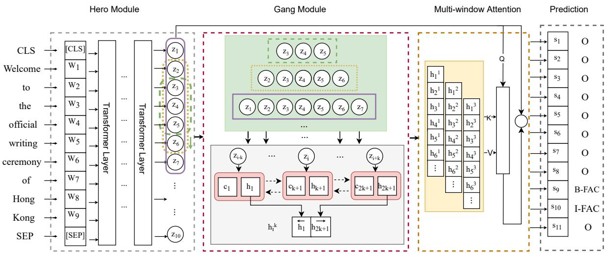
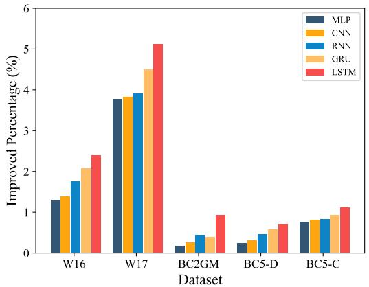
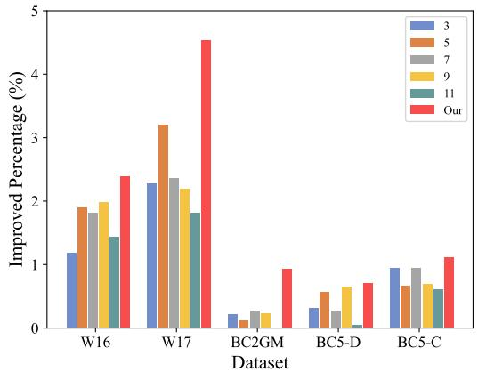
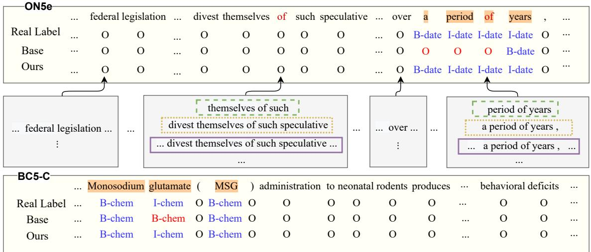

# Hero-Gang Neural Model For Named Entity Recognition

Jinpeng Hu♡, Yaling Shen♡, Yang Liu♡

Xiang Wan♡♢†, Tsung-Hui Chang♡†

♡Shenzhen Research Institute of Big Data, The Chinese University of Hong Kong, Shenzhen, Guangdong, China

♢Pazhou Lab, Guangzhou, 510330, China

{jinpenghu, yalingshen, yangliu5}@link.cuhk.edu.cn wanxiang@sribd.cn changtsunghui@cuhk.edu.cn

## Abstract

Named entity recognition (NER) is a fundamental and important task in NLP, aiming at identifying named entities (NEs) from free text. Recently, since the multi-head attention mechanism applied in the Transformer model can effectively capture longer contextual information, Transformer-based models have become the mainstream methods and have achieved significant performance in this task. Unfortunately, although these models can capture effective global context information, they are still limited in the local feature and position information extraction, which is critical in NER. In this paper, to address this limitation, we propose a novel Hero-Gang Neural structure (HGN), including the Hero and Gang module, to leverage both global and local information to promote NER. Specifically, the Hero module is composed of a Transformer-based encoder to maintain the advantage of the self-attention mechanism, and the Gang module utilizes a multi-window recurrent module to extract local features and position information under the guidance of the Hero module. Afterward, the proposed multiwindow attention effectively combines global information and multiple local features for predicting entity labels. Experimental results on several benchmark datasets demonstrate the effectiveness of our proposed model.1

## 1 Introduction

Named entity recognition (NER) is one of the most important and fundamental research topics in natural language processing (NLP), which recognizes named entities (NEs), such as person, location, disease from raw text. NER has attracted substantial attention in the past decades owing to its importance in downstream tasks, e.g., knowledge graph construction (Bosselut et al., 2019), questionanswering (Pergola et al., 2021), and relation extraction (He et al., 2019).

In the early stage, the popular methods for solving NER are some traditional machine learning methods, e.g., Hidden Markov Model (HMM) (Morwal et al., 2012) and conditional random field (CRF) (Mozharova and Loukachevitch, 2016), which require extracting features manually, making the process inefficient and time-consuming. With the breakthrough of recurrent neural networks (RNN) in NLP, Long short-term memory (LSTM) (Hochreiter et al., 1997) and Gated Recurrent Unit (GRU) (Cho et al., 2014) have become mainstream methods for this task and have achieved promis ing results since neural networks can automatically extract features from the sequence and also take each token’s position information into consideration (Lample et al., 2016; Chiu and Nichols, 2016; Huang et al., 2015). Nevertheless, RNN fails to perform well with long sequences due to the gradients exploding and vanishing. In recent years, Transformer-based models (Vaswani et al., 2017) have become mainstream methods because these models are able to capture long-term dependencies with the help of multi-head attention and thus provide better global context information, especially for long sequences (Lee et al., 2020; Yang et al., 2019b). However, these Transformer-based models usually are insensitive to the local context since the representation of each token is computed by the canonical point-wise dot-product self-attention (Li et al., 2019; Huang et al., 2021). Besides, although some studies (Shaw et al., 2018; Devlin et al., 2018; Liu et al., 2019) have been proposed to inject position information into Transformer, they are still inadequate to help Transformer obtain appropriate position information (Huang et al., 2020; Qu et al., 2021). In other words, the self-attention mechanism is effective in overcoming the constraints of RNN from the perspective of long-sequence context information extraction, but is inferior to RNN in terms of local contextual and position information extraction. Yet, both long-term dependencies and local context information are essential for the NER model to correctly identify entities.

  
Figure 1: The overall architecture of our proposed model. From left to right are the Hero module, Gang module, and multi-window attention, respectively, shown in different dashed boxes. The purple solid frame, green, and yellow dashed frames in the Hero module are sliding windows with different window sizes. The green box in the Gang module shows the multiple sub-sequences generated by the sliding windows for $\mathbf { z } _ { 4 } ,$ , and the grey box represents the bidirectional recurrent mechanism that is used to capture local features from these sub-sequences. Note that $\{ { \bf \Pi } _ { 1 } ^ {  } $ and $\xrightarrow [ ] { }$ are the last hidden states of backward and forward recurrent structures. The extracted local information is shown in the yellow box with its corresponding sub-sequences in the green box.

Thus, to alleviate the shortcomings in RNN and Transformers while maintaining their respective strengths, in this paper, we propose a novel Hero-Gang Neural model to leverage both global and local contextual information to improve NER. In doing so, on the one hand, we utilize a Transformerbased sequence encoder (i.e., Hero module) to extract effective global contextual information with the help of the self-attention mechanism. On the other hand, a multi-window recurrent unit (i.e., Gang module) is applied to extract local features from multiple sub-sequences under the guidance of the extracted global information. Afterward, we propose to use multi-window attention to elaborately combine global and local contextual features. The performance of our proposed model significantly outperforms the strong baseline models on several NER benchmark datasets (including both general and biomedical domains) and achieves new state-of-the-art results on some datasets.

## 2 Method

NER is usually performed as a sequence labeling problem. In detail, given a sequence of $X ~ = ~ x _ { 1 } , x _ { 2 } , . . . , x _ { N }$ with N tokens, we aim to learn a function that maps the input sequence into another one with the corresponding label $\hat { Y } \ =$ $\hat { y _ { 1 } } , \hat { y _ { 2 } } , \hat { y _ { 3 } } , . . . , \hat { y _ { n } }$ in the same length. As summarized in Figure 1, the Transformer-based models (e.g., BERT (Devlin et al., 2018), XLNET (Yang et al., 2019b)) are regarded as the Hero module to model the entire sentence for global sequence information extraction and the Gang module is responsible for local and relative position information extraction. Afterward, we employ the multi-window attention to elaborately combine these different features (i.e., features extracted from the Hero and Gang modules), which is then used to predict labels for each token. Therefore, the aforementioned process can be formulated as:

$$
\hat { Y } = f ( X , { \mathrm { H } } ( X ) , { \mathrm { G } } ( X ) ) ,\tag{1}
$$

where H( ) and $\operatorname { G } ( \cdot )$ refer to the Hero and Gang modules, respectively, and the details of them are presented in the following subsections.

## 2.1 Hero Module

The role of the Hero module in our proposed model is similar to that of the leader in a team, who is responsible for providing guidance, offering instructions, giving directions, and assigning sub-tasks to fellow memberships. Therefore, the Hero module is required to have a comprehensive understanding of the task, including overall and local progress. Thanks to the characteristics of the multi-head selfattention mechanism, Transformer is powerful in modeling long sequences and can provide more effective global information than other counterpart models, and it has already achieved promising results in the NER task (Luo et al., 2020; Beltagy et al., 2019). Thus, we employ a Transformerbased encoder as our Hero module to obtain the global context information $\mathbf { z } _ { i }$ for each token $x _ { i }$ by

$$
[ { \bf z } _ { 1 } , { \bf z } _ { 2 } , \cdot \cdot \cdot ~ , { \bf z } _ { N } ] = f _ { \mathrm { H } } ( x _ { 1 } , x _ { 2 } , . . . , x _ { N } ) .\tag{2}
$$

Herein, $f _ { \mathrm { H } } ( \cdot )$ refers to a pre-trained Transformerbased sequence encoder (e.g., BERT (Devlin et al., 2018) and BioBERT (Lee et al., 2020)). The features z are then input to the Gang module for extracting local contextual features and their corresponding relative position information.

## 2.2 Gang Module

As introduced in the previous section, although pretrained models are able to provide effective global contextual representation, it lacks the ability to extract local features and relative position information. Thus, we propose a multi-window recurrent module, named Gang, to enhance local information extraction. Recurrent structures (RS), such as LSTM, GRU, and tradition RNN are effective in extracting both local and relative position information from the sequence, owing to characteristics of the recurrent mechanism. To better emphasize the local features of each word without being disturbed by long-distance information, we construct a sliding window with a fixed length to generate shorter sub-sequences, where each sub-sequence includes several consecutive elements in z. An additional advantage of this operation is that, in comparison with the whole sequence, the sub-sequence is much shorter so that it is easier to be modeled by the RS.

In detail, for a single sliding window with length $k ,$ each hidden state $z _ { i }$ from the Hero module, the corresponding sub-sequence is $\mathbf { z } _ { i - k } , \mathbf { z } _ { i - k + 1 } , . . . , \mathbf { z } _ { i } , . . . , \mathbf { z } _ { i + k - 1 } , \mathbf { z } _ { i + k }$ that includes $2 k + 1$ consecutive tokens. This sub-sequence of length $2 k + 1$ contains rich local contextual information of $x _ { i } .$ , and thus we utilize an RS to encode it for obtaining local semantic and relative position information. To extract the local information of two directions, we utilize a bidirectional structure to encode this sequence span, where the forward RS computes a representation $\overrightarrow { \mathbf { h } _ { 2 k + 1 } }$ from left to right, and the other backward RS computes a vector $\left\{ { \bf \Pi } _ { \bf h _ { 1 } } ^ { \phantom { + } } \right.$ for the same sub-sequence in reverse. We concatenate the $\left\{ { \bf \Pi } _ { \bf h _ { 1 } } ^ { \phantom { + } } \right.$ and $\xrightarrow { \xrightarrow { } }$ as the local feature ${ \bf h } _ { i } = [ \stackrel { \left. } { \bf h } _ { 1 } , \stackrel { \right. } { \bf h } _ { 2 k + 1 } ]$ for token $x _ { i } ,$ and then we can obtain local features for each token in sequence X via the similar way, denoted as $\mathbf { h } = \mathbf { h } _ { 1 } , \mathbf { h } _ { 2 } , \cdot \cdot \cdot , \mathbf { h } _ { N }$

In practice, we need to consider two situations. First, each token might have multiple levels of local information, such as phrase-level and clauselevel, which may affect the understanding of the current token. Second, since different tokens or the same token in various contexts might have different relationships with their surrounding words, we need to consider more sub-sequences with varying lengths for obtaining more comprehensive local contextual information. Therefore, we propose to utilize multiple sliding windows with different window sizes to extract richer local features to alleviate the above issues. We assume that local features $\mathbf { h } ^ { 1 } , \mathbf { h } ^ { 2 } , \cdots , \mathbf { h } ^ { M }$ are extracted from different groups of sub-sequences, whose corresponding window lengths are $\mathbf { \hat { k } } ^ { 1 } , k ^ { 2 } , \cdots , k ^ { M }$ . This process can be formulated as:

$$
\mathbf { h } ^ { 1 } , \mathbf { h } ^ { 2 } , \cdot \cdot \cdot \mathbf { \tau } , \mathbf { h } ^ { M } = \mathbf { G a n g } ( k ^ { 1 } , k ^ { 2 } , \cdot \cdot \cdot \mathbf { \tau } , k ^ { M } , \mathbf { z } ) ,\tag{3}
$$

where $M$ is the number of sliding windows and $\mathbf { h } ^ { j }$ is a group of local features extracted from the corresponding sliding window with length $k ^ { j }$ . The process is similar to the task assignment in the team, where different members are responsible for their own sub-tasks.

## 2.3 Multi-window Attention

We obtain global representation z from the Hero module and multiple local features $\mathbf { h } ^ { 1 } , \mathbf { h } ^ { 2 } , \cdots , \mathbf { h } ^ { M }$ from the Gang module. Next, we apply the multi-window attention to effectively combine global contextual information and local features. In doing so, two types of attention methods are proposed in our model: MLP-Attention and DOT-Attention, respectively.

MLP-Attention We first concatenate these local features with global information and obtain the intermediate state m by a fully connected layer.

$$
\begin{array} { r } { { \bf m } = { \bf M } { \bf L P } ( [ { \bf z } , { \bf H } ] ) , } \end{array}\tag{4}
$$

where $\mathbf { H } \ = \ [ \mathbf { h } ^ { 1 } , \mathbf { h } ^ { 2 } , \cdot \cdot \cdot \ , \mathbf { h } ^ { M } ]$ and m have the same dimension as z. MLP represents a fully connected layer. Then m is used as a query vector and [z, H] serves as the key and value matrix. The final token representation can be computed by

$$
\mathbf { s } = \mathrm { s o f t m a x } ( \mathbf { m } ( [ \mathbf { z } , \mathbf { H } ] ) ^ { \top } ) [ \mathbf { z } , \mathbf { H } ] .\tag{5}
$$

DOT-Attention Instead of using a fully connected layer to generate a query vector, in this approach, we directly regard z as the query vector and H as the key and value matrix. We can obtain the final local feature by

<table><tr><td rowspan="2">Type</td><td rowspan="2">Dataset</td><td colspan="3">TRAIN</td><td colspan="3">VAL</td><td colspan="3">TEST</td></tr><tr><td>#SENT.</td><td>#ENT.</td><td>#AS.</td><td>#SENT.</td><td>#ENT.</td><td>#AS.</td><td>#SENT.</td><td>#ENT.</td><td>#AS.</td></tr><tr><td rowspan="3">GENERAL</td><td>W16</td><td>2.4k</td><td>1.5k</td><td>19.41</td><td>1.0k</td><td>0.7k</td><td>16.26</td><td>3.9k</td><td>3.5k</td><td>16.08</td></tr><tr><td>W17</td><td>3.4k</td><td>2.0k</td><td>18.48</td><td>1.0k</td><td>0.8k</td><td>15.59</td><td>1.3k</td><td>1.1k</td><td>18.18</td></tr><tr><td>ON5E</td><td>59.9k</td><td>81.8k</td><td>18.17</td><td>8.5k</td><td>11.1k</td><td>17.32</td><td>8.3k</td><td>11.3k</td><td>18.49</td></tr><tr><td rowspan="3">BIOMED</td><td>BC5-D</td><td>4.6k</td><td>4.2k</td><td>25.79</td><td>4.6k</td><td>4.2k</td><td>25.52</td><td>4.8k</td><td>4.4k</td><td>25.92</td></tr><tr><td>BC2GM</td><td>12.6k</td><td>15.2k</td><td>28.14</td><td>2.5k</td><td>3.0k</td><td>28.07</td><td>5.0k</td><td>6.3k</td><td>28.33</td></tr><tr><td>BC5-C</td><td>4.6k</td><td>4.2k</td><td>25.79</td><td>4.6k</td><td>4.2k</td><td>25.52</td><td>4.8k</td><td>4.4k</td><td>25.92</td></tr></table>

Table 1: The statistics of the six benchmark datasets w.r.t. their training, validation and test sets, including the number of sentences (#Sent.), the number of entities (#Ent.), and the averaged word-based length (#AS.).

$$
\mathbf { u } = \mathrm { s o f t m a x } ( \mathbf { z } ( \mathbf { H } ) ^ { \top } ) \mathbf { H } .\tag{6}
$$

Since u is a weighted sum of different local features without considering global information, we use the sum of $\mathbf { u } _ { i }$ and $\mathbf { z } _ { i }$ as the final representation for each token $x _ { i }$ . Thus, the final representation can be obtained by

$$
{ \bf s } = \{ { \bf z } _ { 1 } + { \bf u } _ { 1 } , { \bf z } _ { 2 } + { \bf u } _ { 2 } , \cdot \cdot \cdot , { \bf z } _ { N } + { \bf u } _ { N } \} .\tag{7}
$$

After obtaining the final representation from MLP-Attention or DOT-Attention, s is sent to the corresponding classifier implemented by the softmax function to predict the distribution of labels for each token in X.

## 3 Experiments Settings

## 3.1 Dataset and Metrics

In our experiments, six datasets are used in our experiments, WNUT17 (W17) (Strauss et al., 2016), WNUT16 (W16) (Derczynski et al., 2017), OntoNotes 5.0 (ON5e) (Pradhan et al., 2013), BC5CDR-disease (BC5-D), BC2GM, and BC5CDR-chem (BC5-C). The W17 and W16 are social media benchmark datasets constructed from Twitter, and ON5e is a general domain dataset consisting of diverse sources like telephone conversations, newswire, etc. BC5CDR, including both BC5-D and BC5-C, is a dataset used for the BioCreative V Chemical Disease Relation Task and contains chemical and disease mentions, where humans manually annotate the annotations. BC2GM is the dataset that is usually utilized for the BioCreative II gene mention tagging task and contains 20000 sentences from the abstracts of biomedical publications. For all datasets, we utilize the official splits for a fair evaluation and the statistics of the datasets are shown in Table 1. Besides, we follow previous studies that the final models are trained on training and validation sets on each dataset except the ON5e dataset.

For metrics, we exploit the same evaluation metrics used by previous works where precision (P), recall (R), and F-1 score are reported to evaluate the performance of our model.

## 3.2 Implementation Details

We implement our model based on transformers (Wolf et al., $2 0 2 0 ) ^ { 2 }$ and employ pre-trained models to obtain global contextualized representation. Specifically, for general domain datasets (i.e., W16, W17 and ON5e), we use BERT-cased-large (Devlin et al., 2018)3 and XLNET-large-cased (Yang et al., $2 0 1 9 \mathrm { b } ) ^ { 4 }$ as our Hero module. For biomedical datasets, BioBERT (Lee et al., $2 0 2 0 ) ^ { 5 }$ is utilized to obtain global information. We follow their default settings for all BERT, XLNET, and BioBERT: 24 layers of self-attention with 1024 dimensional embeddings. For hyperparameters of the Gang module, the hidden sizes of bidirectional recurrent structures for each window size are half of the embedding dimension from the output of the Hero module (i.e., 512). During the training process, we use Adam (Kingma and Ba, 2014) to optimize the negative log-likelihood loss function. More training details are shown in the Appendix A.1. Besides, we also compare four operations to combine different level features from the Hero and Gang module: MLP-Attention, DOT-Attention, concatenation, and summation, respectively, where concatenation is to connect all features directly through $\mathbf { s } = [ \mathbf { h } ^ { 1 } , \mathbf { h } ^ { 2 } , \cdots , \mathbf { h } ^ { M } , \mathbf { z } ]$ , and summation is to add up these features by $\mathbf { s } = \mathbf { h } ^ { 1 } + \mathbf { h } ^ { 2 } + \cdot \cdot \cdot + \mathbf { h } ^ { M } + \mathbf { z } .$

<table><tr><td rowspan="2">Methods</td><td colspan="3">W16</td><td colspan="3">W17</td><td colspan="3">ON5E</td></tr><tr><td>P</td><td>R</td><td>F-1</td><td>P</td><td>R</td><td>F-1</td><td>P</td><td>R</td><td>F-1</td></tr><tr><td>with incorporating extra resources</td><td></td><td></td><td></td><td></td><td></td><td></td><td></td><td></td><td></td></tr><tr><td>SANER (Nie et al., 2020b)</td><td></td><td>51.27</td><td>55.01</td><td></td><td>49.45</td><td>50.36</td><td></td><td></td><td></td></tr><tr><td>AESUBER (Nie et al., 2020a)</td><td></td><td></td><td>55.14</td><td></td><td></td><td>50.68</td><td></td><td></td><td>90.32</td></tr><tr><td>HIRE-NER (Luo et al., 2020)</td><td></td><td></td><td></td><td></td><td></td><td></td><td></td><td></td><td>90.30</td></tr><tr><td>CL-KL (Wang et al., 2021)</td><td></td><td></td><td>58.98</td><td></td><td></td><td>60.45</td><td></td><td></td><td></td></tr><tr><td>SYN-LSTM-ČRF (Xu et al., 2021)</td><td></td><td></td><td></td><td></td><td></td><td></td><td>90.14</td><td>91.58</td><td>90.85</td></tr><tr><td>without extra resources</td><td></td><td></td><td></td><td></td><td></td><td></td><td></td><td></td><td></td></tr><tr><td>CNN-BILSTM-CRF (Chiu and Nichols, 2016)</td><td></td><td></td><td></td><td></td><td></td><td></td><td>86.04</td><td>86.53</td><td>86.28</td></tr><tr><td>BERT (Devlin et al., 2018)</td><td></td><td>49.02</td><td>54.36</td><td></td><td>46.73</td><td>49.52</td><td></td><td></td><td>89.16</td></tr><tr><td>XLNET (Yang et al., 2019b)</td><td>55.94</td><td>57.46</td><td>56.69</td><td>58.68</td><td>49.18</td><td>53.51</td><td>89.72</td><td>91.05</td><td>90.38</td></tr><tr><td>ASTRA (Wang et al., 2020)</td><td></td><td></td><td></td><td></td><td></td><td>49.72</td><td></td><td></td><td>89.44</td></tr><tr><td>BARTNER (Yan et al., 2021)</td><td></td><td></td><td></td><td></td><td></td><td></td><td>89.99</td><td>90.77</td><td>90.38</td></tr><tr><td>HGN (BERT) (CONCAT)</td><td>56.06</td><td>55.61</td><td>55.84</td><td>57.41</td><td>45.45</td><td>50.74</td><td>89.20</td><td>89.85</td><td></td></tr><tr><td>HGN (BERT) (ADD)</td><td>54.63</td><td>55.38</td><td>55.01</td><td>58.46</td><td>45.55</td><td>51.20</td><td>89.16</td><td>90.01</td><td>89.52 89.58</td></tr><tr><td>HGN (BERT) (MLP)</td><td>57.72</td><td>55.66</td><td>56.67</td><td>59.26</td><td>50.70</td><td>54.65</td><td>89.19</td><td>90.24</td><td>89.71</td></tr><tr><td>HGN (BERT) (DOT)</td><td>57.51</td><td>56.00</td><td>56.75</td><td>60.09</td><td>48.29</td><td>53.55</td><td>89.32</td><td>90.11</td><td>89.71</td></tr><tr><td>HGN (XLNET) (CONCAT)</td><td>57.48</td><td>57.90</td><td>57.69</td><td>63.39</td><td>49.27</td><td>55.45</td><td>89.92</td><td>91.35</td><td>90.63</td></tr><tr><td>HGN (XLNET) (ADD)</td><td>57.31</td><td>58.05</td><td>57.68</td><td>59.11</td><td>48.36</td><td>53.20</td><td>90.10</td><td>91.39</td><td>90.74</td></tr><tr><td>HGN (XLNET) (MLP)</td><td>58.91</td><td>59.89</td><td>59.39</td><td>63.16</td><td>52.27</td><td>57.20</td><td>90.29</td><td>91.56</td><td>90.92</td></tr><tr><td>HGN (XLNET) (DOT)</td><td>59.74</td><td>59.26</td><td>59.50</td><td>62.49</td><td>53.10</td><td>57.41</td><td>90.10</td><td>91.64</td><td>90.86</td></tr></table>

Table 2: Comparisons of our proposed models with previous studies on the W16, W17, and ON5e, respectively, with respect to precision, recall, and F-1 score for NER. Previous studies are divided into two parts from top to bottom, representing methods requiring extra resources and without such requirements, respectively.

## 3.3 Baselines

To explore the impact of our proposed model, we compare our model to the previous studies. For general domain, following baselines are compared in our experiment on W16, W17 and ON5e.

• CNN-BILSTM-CRF (Chiu and Nichols, 2016) utilizes a hybrid bidirectional and CNN architecture to detect word-and character-level features.

• BERT (Devlin et al., 2018) is a pre-trained language model and we apply it to the NER task by direct fine-tuning.

• SANER (Nie et al., 2020b), CL-KL (Wang et al., 2021) and AESUBER (Nie et al., 2020a) improve entity recognition by leveraging syntactic information or semantically relevant texts.

• HIRE-NER (Luo et al., 2020) utilizes both sentence-level and document-level representations to improve sequence labeling.

• SYN-LSTM-CRF (Xu et al., 2021) integrates the structured information by graph-encoded representations obtained from GNNs.

• BARTNER (Yan et al., 2021) formulates NER tasks as a span sequence generation problem.

In addition, we also compare our proposed model with the following baselines on the aforementioned biomedical datasets:

• MTM-CW (Wang et al., 2019a), BILM (Sachan et al., 2018), NCBI\_BERT (Peng et al., 2019), MT-BIONER (Tong et al., 2021) utilize multi-task learning or transfer learning to enhance biomedical NER.

• BIOBERT (Lee et al., 2020) is a pre-trained model trained with a large amount of biomedical corpus and then applied by directly fine-tuning.

• KEBIO-LM (Yuan et al., 2021) proposes a biomedical pre-trained language model that incorporates knowledge from the Unified Medical Language System (UMLS).

Note that in both general and biomedical domains, our model does not require external resources.

## 4 Results and Analyses

## 4.1 General Domain NER

In this subsection, to explore the effectiveness of our proposed model, we conduct experiments to compare our model with existing studies, and the results are reported in Table 2. There are several observations drawn from different aspects. First, when we make a fair comparison without extra resources (e.g., BERT, XLNET, and ASTRA), our model obtains significant improvements on all datasets in terms of Precision, Recall, and F-1, which confirms the effectiveness of our proposed Hero-Gang neural structure. This is because multiple-level features can be reasonably encoded into the model and thus alleviate the limitations of

<table><tr><td rowspan="2">Methods</td><td colspan="3">BC5-D</td><td colspan="3">BC2GM</td><td colspan="3">BC5-C</td></tr><tr><td>P</td><td>R</td><td>F-1</td><td>P</td><td>R</td><td>F-1</td><td>P</td><td>R</td><td>F-1</td></tr><tr><td>with incorporating extra resources</td><td></td><td></td><td></td><td></td><td></td><td></td><td></td><td></td><td></td></tr><tr><td>BiLM (Sachan et al., 2018)</td><td></td><td></td><td></td><td>81.81</td><td>81.57</td><td>81.69</td><td></td><td></td><td></td></tr><tr><td>MTM-CW (Wang et al., 2019a)</td><td></td><td></td><td></td><td>82.10</td><td>79.42</td><td>80.74</td><td></td><td></td><td></td></tr><tr><td>KEBIO-LM (Yuan et al., 2021)</td><td></td><td></td><td>86.10</td><td></td><td></td><td>85.10</td><td></td><td></td><td>93.30</td></tr><tr><td>MT-BIoNER (Tong et al., 2021)</td><td></td><td></td><td></td><td>84.42</td><td>85.14</td><td>84.78</td><td>93.29</td><td>94.69</td><td>93.98</td></tr><tr><td>without extra resources</td><td></td><td></td><td></td><td></td><td></td><td></td><td></td><td></td><td></td></tr><tr><td>NCBI_BERT (Peng et al., 2019)</td><td></td><td></td><td>86.60</td><td></td><td></td><td></td><td></td><td></td><td>93.50</td></tr><tr><td>BIOBERT (Lee et al., 2020)</td><td>86.47</td><td>87.84</td><td>87.15</td><td>84.32</td><td>85.12</td><td>84.72</td><td>93.68</td><td>93.26</td><td>93.47</td></tr><tr><td>HGN (BIOBERT) (CONCAT)</td><td>85.90</td><td>88.81</td><td>87.33</td><td>83.91</td><td>86.36</td><td>85.12</td><td>94.30</td><td>93.93</td><td>94.11</td></tr><tr><td>HGN (BIOBERT) (ADD)</td><td>85.89</td><td>88.74</td><td>87.29</td><td>85.21</td><td>85.50</td><td>85.35</td><td>94.01</td><td>94.57</td><td>94.29</td></tr><tr><td>HGN (BIOBERT) (MLP)</td><td>86.70</td><td>88.86</td><td>87.77</td><td>84.93</td><td>86.37</td><td>85.65</td><td>94.23</td><td>94.63</td><td>94.43</td></tr><tr><td>HGN (BIOBERT) (DOT)</td><td>86.27</td><td>89.51</td><td>87.86</td><td>85.21</td><td>85.88</td><td>85.54</td><td>94.45</td><td>94.73</td><td>94.59</td></tr></table>

Table 3: Comparisons of our proposed models with previous studies on the BC5-D, BC2GM, and BC5-C, respectively, for biomedical NER in iterms of precision, recall, and F-1 score. Previous works are divided into two sections, indicating methods requiring extra resources and without such requirements.

Transformer in local feature extraction. Second, although some complicated models enhance NER by incorporating extra knowledge, e.g., SANER uses augmented semantic information, Hire-NER utilizes two-level hierarchical contextualized representations, and CL-KL selects a set of semantically relevant texts to improve NER, our model achieves competitive results without such requirements. This is because each word in the natural text usually has a closer relationship with its surrounding words, especially the adjacent words, such that features extracted by the Gang module can provide more valuable information for NER, and thus our model achieves promising performance. Third, the XLNET-based model obtains better results than the BERT-based model, which indicates that XLNET can generate more effective representations on the NER task. The reason behind this might be that XLNET combines the permutation operation with the autoregressive technology to further improve representation learning, so that XLNET can provide a better text understanding than BERT.

## 4.2 Biomedical NER

We also compare our model with state-of-the-art models in the biomedical NER on the aforementioned datasets with all results reported in Table 3. There are several observations. First, we can see that our model outperforms existing methods, regardless of whether they introduce external knowledge, which further confirms the validity of our innovation in combining local and global features to enhance feature extraction. Second, although some models utilize higher-level features, e.g., BIOKM-NER leverages POS labels, syntactic constituents, dependency relations, and MTM-CW employs multi-task learning to train the model, our model can achieve better results through a simple Hero-Gang structure. This means that local features extracted from the Gang module under the guidance of global information are also effective in assisting biomedical text representations and even show more significant potential than those special designs for the medical domain (i.e., domain-related multi-task learning). Third, the models using the multi-window attention (i.e., DOT-Attention and MLP-Attention) outperform those using concatenation or summation. This observation suggests that multi-window attention can elaborately weigh local features from different sliding windows to enhance feature combinations.

## 4.3 Analyses

Effect of position information Recurrent structures are able to extract both context and position information by its token-by-token manner while other network structures, including CNN and MLP, fail to encode the relative position information. Thus, to explore the effect of position information, we compare models with different structures to construct the Gang module and report the improvements of F-1 score based on different Gang modules in Figure 2. First, we can observe that models with Gang module are better than Base (i.e., BERT), where all the values in Figure 2 are positive, further illustrating the effectiveness of our innovation in combining both global and local features, no matter what type of structure is used to construct the Gang module. Second, models with LSTM and GRU outperform those with CNN and MLP, indicating that recurrent structures are more promising in short sequence feature extraction. Since the recurrent structures can effectively capture position information by its token-by-token manner and help the model understand word-word relations based on their relative positions, we may conclude that position information is vital for improving performance. Third, the comparison between CNN and MLP shows the power of CNN in extracting features from sub-sequences since CNN can leverage more fine-grained features, such as n-gram.

  
Figure 2: The improvement values (%) compared to Base models (i.e., BERT for general domain datasets and BioBERT for biomedical datasets) in terms of F-1 score from different Gang modules, MLP, CNN, RNN, GRU, and LSTM, respectively.

Ablation studies In this subsection, we compare our multi-window model with single-window models, and the improvements compared with Base model are shown in Figure 3. We have following observations. First of all, illustrated by the comparisons among Base (i.e., BERT) and others, models with sliding windows achieve better performance, where all the improvement values in Figure 3 are positive. This illustrates that both single window and multi-window recurrent structures can help to enhance token representation and bring different degrees of improvement, which further shows the importance of local features in this task. Second, we can observe that the optimal single window sizes for different datasets are also different. For example, the optimal single window size of W17 is 5, while that for BC2GM is 7, which indicates that the best length of the local sequence depends on the characteristics of datasets to some extent. Third, compared with those models using a single window, the multi-window recurrent module obtains better performance, illustrating that features extracted from multiple sub-sequences are more effective than those captured from a single one. The reason could be that multi-window can help the model pay attention to different local context sub-sequences and give them appropriate weights through the multi-window attention mechanism, such that it can provide more reasonable local information and alleviate the impact of the characteristics of the datasets themselves.

  
Figure 3: The improvement values (%) of models with single windows or multi-window compared to Base models (BERT or BioBERT w.r.t. datasets), where 3, 5, 7, 9, 11 represents the single window size when models only use a single window to construct the Gang module.

Case Study To further show the validity of our model, we perform qualitative analysis on some cases with their real labels and predicted labels from different models. Figure 4 shows two cases from ON5e and BC5-C, respectively. We can observe that our model can predict more complete entities than Base. Specifically, in the first case, our model can recognize all the words in the entity "a period of years" while Base model only recognizes the word "years". In the second case, our model is able to identify "Monosodium glutamate", but Base model regards these words as two different entities. In addition, in the first example, compared with real labels, our model can label two $" o f "$ correctly with the help of local features, which are O and I-date, respectively, while Base classifies both $" o f "$ as O. The sub-sequence (i.e.,"a period of years,") from the second $" o f "$ is usually used to describe time such that this information is able to assist the model in marking the $" o f "$ as I-date. However, for the first $" o f "$ , its sub-sequence "divest themselves of such speculative" does not contain any meaning related to the entity themes, and thus the model marks the corresponding $" o f "$ as O.

  
Figure 4: Examples of two predicted labels from BASE and OURS as well as their corresponding source sentence and real label. Note that the BASE for these two cases are BERT and BIOBERT, respectively.

## 5 Related Work

NER is a fundamental task in NLP (Huang et al., 2015), which has drawn substantial attention over the past years and there have been many studies to address this task. Recently, deep learning has played a dominant role in NER due to its effectiveness in capturing contextual information from sequences. The recurrent neural networks (RNN), including its variants such as LSTM (Hochreiter et al., 1997), and GRU (Cho et al., 2014), is a promising structure for solving this task since it can effectively learn sequence information with its recurrent mechanism (Ma and Hovy, 2016; Huang et al., 2015; Chiu and Nichols, 2016; Zhu and Wang, 2019). However, it is ineffective for RNN to learn long sequences due to the gradients exploding and vanishing. Thus, Transformer-based models, such as BERT (Devlin et al., 2018), BioBERT (Lee et al., 2020), and XLNET (Yang et al., 2019b), are proposed to alleviate these problems with the help of the self-attention mechanism. Compared to RNN, Transformer is able to capture long-distance information through multiple multi-head attention layers and has achieved impressive performance in this task (Nie et al., 2020b; Luo et al., 2020; Yamada et al., 2020; Gui et al., 2019).

However, multi-head attention usually treats every position identically, which lead to the loss of position information. To mitigate this problem, several approaches have been proposed to advance the Transformer (Dai et al., 2019; Shaw et al., 2018; Yan et al., 2019). Shaw et al. (2018) proposed cross-lingual position representation to help selfattention alleviate word order divergences in different languages and learn position information. Yan et al. (2019) introduced the directional relative positional encoding and an adapted Transformer Encoder to model the character-level and word-level features. Although these position embeddings are able to help the model learn position information, they are still not enough to solve the issue appropriately (Wang et al., 2019b; Huang et al., 2020; Qu et al., 2021). Besides, Transformer-based approaches cannot effectively extract local features that are also important for sequence learning tasks, and some studies have been proposed to alleviate this problem (Xu et al., 2017; Li et al., 2019; Yang et al., 2019a). Xu et al. (2017) proposed to use the fixed-size ordinally forgetting encoding to model sentence fragments, which is then used to predict the label for each text fragment. Li et al. (2019) utilized convolutional self-attention by producing queries and keys with causal convolution to incorporate local contextual information into the attention mechanism. To address these issues, we offer an alternative solution, namely Hero-Gang Neural model, to enhance local and position information extraction via multiple recurrent structures under the guidance of global information.

## 6 Conclusion

In this paper, we propose a novel Hero-Gang Neural (HGN) structure to effectively combine global and local features for enhancing NER. In detail, the Hero module aims to capture global understanding by a Transformer-based encoder, which is then used to guide the Gang to extract local features and relative position information through a multiwindow recurrent module. Afterward, we utilize the multi-window attention to elaborately combine the global information and local features for enhancing representations that are then used to predict the entity label for each token. Empirically, our proposed model achieves new state-of-the-art results on several NER benchmark datasets, including both general and biomedical domains. Besides, we compare different structures to construct the Gang model and investigate the effect of the number of sliding windows, which further illustrates the effectiveness of our proposed model.

## Acknowledgements

This work is supported by Chinese Key-Area Research and Development Program of Guangdong Province (2020B0101350001), NSFC under the project “The Essential Algorithms and Technologies for Standardized Analytics of Clinical Texts” (12026610) and the Guangdong Provincial Key Laboratory of Big Data Computing, The Chinese University of Hong Kong, Shenzhen.

## References

Iz Beltagy, Kyle Lo, and Arman Cohan. 2019. Scibert: A Pretrained Language Model for Scientific Text. In Proceedings of the 2019 Conference on Empirical Methods in Natural Language Processing and the 9th International Joint Conference on Natural Language Processing (EMNLP-IJCNLP), pages 3606–3611.

Antoine Bosselut, Hannah Rashkin, Maarten Sap, Chaitanya Malaviya, Asli Celikyilmaz, and Yejin Choi. 2019. Comet: Commonsense Transformers for Automatic Knowledge Graph Construction. In Proceedings ofthe 57th Annual Meeting ofthe Association for Computational Linguistics, pages 4762–4779.

Jason PC Chiu and Eric Nichols. 2016. Named Entity Recognition with Bidirectional LSTM-CNNs. Transactions of the Association for Computational Linguistics, 4:357–370.

Kyunghyun Cho, Bart van Merriënboer, Caglar Gulcehre, Dzmitry Bahdanau, Fethi Bougares, Holger Schwenk, and Yoshua Bengio. 2014. Learning Phrase Representations using RNN Encoder– Decoder for Statistical Machine Translation. In Proceedings of the 2014 Conference on Empirical Methods in Natural Language Processing (EMNLP), pages 1724–1734.

Zihang Dai, Zhilin Yang, Yiming Yang, Jaime G Carbonell, Quoc Le, and Ruslan Salakhutdinov. 2019. Transformer-xl: Attentive Language Models beyond a Fixed-length Context. In Proceedings ofthe 57th Annual Meeting of the Association for Computational Linguistics, pages 2978–2988.

Leon Derczynski, Eric Nichols, Marieke van Erp, and Nut Limsopatham. 2017. Results of the WNUT2017 Shared Task on Novel and Emerging Entity Recognition. In Proceedings of the 3rd Workshop on Noisy User-generated Text, pages 140–147.

Jacob Devlin, Ming-Wei Chang, Kenton Lee, and Kristina Toutanova. 2018. Bert: Pre-training of Deep Bidirectional Transformers for Language Understanding. arXiv preprint arXiv:1810.04805.

Tao Gui, Yicheng Zou, Qi Zhang, Minlong Peng, Jinlan Fu, Zhongyu Wei, and Xuan-Jing Huang. 2019. A lexicon-based graph neural network for chinese ner. In Proceedings of the 2019 Conference on Empirical Methods in Natural Language Processing and the 9th International Joint Conference on Natural Language Processing (EMNLP-IJCNLP), pages 1040–1050.

Bin He, Yi Guan, and Rui Dai. 2019. Classifying Medical Relations in Clinical Text via Convolutional Neural Networks. Artificial intelligence in medicine, 93:43–49.

Sepp Hochreiter, J urgen Schmidhuber, and Corso Elvezia. 1997. Long Short-term Memory. Neural Computation, 9(8):1735–1780.

Xiaohong Huang, Zhifang Deng, Dandan Li, and Xueguang Yuan. 2021. MISSFormer: An Effective Medical Image Segmentation Transformer. arXiv preprint arXiv:2109.07162.

Zhiheng Huang, Davis Liang, Peng Xu, and Bing Xiang. 2020. Improve Transformer Models with Better Relative Position Embeddings. In Proceedings ofthe 2020 Conference on Empirical Methods in Natural Language Processing: Findings, pages 3327–3335.

Zhiheng Huang, Wei Xu, and Kai Yu. 2015. Bidirectional LSTM-CRF Models for Sequence Tagging. arXiv preprint arXiv:1508.01991.

Diederik P Kingma and Jimmy Ba. 2014. Adam: A Method for Stochastic Optimization. arXiv preprint arXiv:1412.6980.

Guillaume Lample, Miguel Ballesteros, Sandeep Subramanian, Kazuya Kawakami, and Chris Dyer. 2016. Neural Architectures for Named Entity Recognition. In Proceedings of the 2016 Conference of the North American Chapter of the Association for Computational Linguistics: Human Language Technologies, pages 260–270.

J Lee, W Yoon, S Kim, D Kim, S Kim, CH So, and J Kang. 2020. Biobert: a Pre-trained Biomedical Language Representation Model for Biomedical Text Mining. Bioinformatics (Oxford, England), 36(4):1234.

Shiyang Li, Xiaoyong Jin, Yao Xuan, Xiyou Zhou, Wenhu Chen, Yu-Xiang Wang, and Xifeng Yan. 2019. Enhancing the Locality and Breaking the Memory Bottleneck of Transformer on Time Series Forecasting. Advances in Neural Information Processing Systems, 32:5243–5253.

Yinhan Liu, Myle Ott, Naman Goyal, Jingfei Du, Mandar Joshi, Danqi Chen, Omer Levy, Mike Lewis, Luke Zettlemoyer, and Veselin Stoyanov. 2019. Roberta: A Robustly Optimized BERT Pretraining Approach. arXiv preprint arXiv:1907.11692.

Ying Luo, Fengshun Xiao, and Hai Zhao. 2020. Hierarchical Contextualized Representation for Named Entity Recognition. In Proceedings ofthe AAAI Conference on Artificial Intelligence, volume 34, pages 8441–8448.

Xuezhe Ma and Eduard Hovy. 2016. End-to-end Sequence Labeling via Bi-directional LSTM-CNNs-CRF. In Proceedings ofthe 54th Annual Meeting of the Associationfor Computational Linguistics (Volume 1: Long Papers), pages 1064–1074.

Sudha Morwal, Nusrat Jahan, and Deepti Chopra. 2012. Named Entity Recognition Using Hidden Markov Model (hmm). International Journal on Natural Language Computing (IJNLC) Vol, 1.

Valerie A Mozharova and Natalia V Loukachevitch. 2016. Combining Knowledge and CRF-based Approach to Named Entity Recognition in Russian. In International Conference on Analysis ofImages, Social Networks and Texts, pages 185–195. Springer.

Yuyang Nie, Yuanhe Tian, Yan Song, Xiang Ao, and Xiang Wan. 2020a. Improving Named Entity Recognition with Attentive Ensemble of Syntactic Information. In Proceedings of the 2020 Conference on Empirical Methods in Natural Language Processing: Findings, pages 4231–4245.

Yuyang Nie, Yuanhe Tian, Xiang Wan, Yan Song, and Bo Dai. 2020b. Named Entity Recognition for Social Media Texts with Semantic Augmentation. In Proceedings of the 2020 Conference on Empirical Methods in Natural Language Processing (EMNLP), pages 1383–1391.

Yifan Peng, Shankai Yan, and Zhiyong Lu. 2019. Transfer Learning in Biomedical Natural Language Processing: An Evaluation of BERT and ELMo on Ten Benchmarking Datasets. In Proceedings of the 18th BioNLP Workshop and Shared Task, pages 58–65.

Gabriele Pergola, Elena Kochkina, Lin Gui, Maria Liakata, and Yulan He. 2021. Boosting Low-Resource Biomedical QA via Entity-Aware Masking Strategies. In Proceedings ofthe 16th Conference ofthe European Chapter of the Association for Computational Linguistics: Main Volume, pages 1977–1985.

Sameer Pradhan, Alessandro Moschitti, Nianwen Xue, Hwee Tou Ng, Anders Björkelund, Olga Uryupina, Yuchen Zhang, and Zhi Zhong. 2013. Towards Robust Linguistic Analysis Using Ontonotes. In Proceedings of the Seventeenth Conference on Computational Natural Language Learning, pages 143–152.

Anlin Qu, Jianwei Niu, and Shasha Mo. 2021. Explore Better Relative Position Embeddings from Encoding Perspective for Transformer Models. In Proceedings

of the 2021 Conference on Empirical Methods in Natural Language Processing, pages 2989–2997.

Devendra Singh Sachan, Pengtao Xie, Mrinmaya Sachan, and Eric P Xing. 2018. Effective Use of Bidirectional Language Modeling for Transfer Learning in Biomedical Named Entity Recognition. In Machine learningfor healthcare conference, pages 383–402. PMLR.

Peter Shaw, Jakob Uszkoreit, and Ashish Vaswani. 2018. Self-attention with Relative Position Representations. In Proceedings ofthe 2018 Conference ofthe North American Chapter ofthe Association for Computational Linguistics: Human Language Technologies, Volume 2 (Short Papers), pages 464–468.

Benjamin Strauss, Bethany Toma, Alan Ritter, Marie-Catherine De Marneffe, and Wei Xu. 2016. Results of the WNUT16 Named Entity Recognition Shared Task. In Proceedings ofthe 2nd Workshop on Noisy User-generated Text (WNUT), pages 138–144.

Y. Tong, Y. Chen, and X. Shi. 2021. A Multi-Task Approach for Improving Biomedical Named Entity recognition by incorporating multi-granularity information. In Findings ofthe Associationfor Computational Linguistics: ACL-IJCNLP 2021.

Ashish Vaswani, Noam Shazeer, Niki Parmar, Jakob Uszkoreit, Llion Jones, Aidan N Gomez, Łukasz Kaiser, and Illia Polosukhin. 2017. Attention is All you Need. In Proceedings of the 31st International Conference on Neural Information Processing Systems, pages 6000–6010.

Jiuniu Wang, Wenjia Xu, Xingyu Fu, Guangluan Xu, and Yirong Wu. 2020. ASTRAL: Adversarial Trained LSTM-CNN for Named Entity Recognition. Knowledge-Based Systems, 197:105842.

Xinyu Wang, Yong Jiang, Nguyen Bach, Tao Wang, Zhongqiang Huang, Fei Huang, and Kewei Tu. 2021. Improving Named Entity Recognition by External Context Retrieving and Cooperative Learning. arXiv preprint arXiv:2105.03654.

Xuan Wang, Yu Zhang, Xiang Ren, Yuhao Zhang, Marinka Zitnik, Jingbo Shang, Curtis Langlotz, and Jiawei Han. 2019a. Cross-type Biomedical Named Entity Recognition with Deep Multi-task Learning. Bioinformatics, 35(10):1745–1752.

Zhiwei Wang, Yao Ma, Zitao Liu, and Jiliang Tang. 2019b. R-transformer: Recurrent Neural Network Enhanced Transformer. arXiv preprint arXiv:1907.05572.

Thomas Wolf, Julien Chaumond, Lysandre Debut, Victor Sanh, Clement Delangue, Anthony Moi, Pierric Cistac, Morgan Funtowicz, Joe Davison, Sam Shleifer, et al. 2020. Transformers: State-of-the-art Natural Language Processing. In Proceedings of the 2020 Conference on Empirical Methods in Natural Language Processing: System Demonstrations, pages 38–45.

Lu Xu, Zhanming Jie, Wei Lu, and Lidong Bing. 2021. Better Feature Integration for Named Entity Recognition. In Proceedings of the 2021 Conference of the North American Chapter of the Association for Computational Linguistics: Human Language Technologies, pages 3457–3469.

Mingbin Xu, Hui Jiang, and Sedtawut Watcharawittayakul. 2017. A Local Detection Approach for Named Entity Recognition and Mention Detection. In Proceedings of the 55th Annual Meeting of the Associationfor Computational Linguistics (Volume 1: Long Papers), pages 1237–1247.

Ikuya Yamada, Akari Asai, Hiroyuki Shindo, Hideaki Takeda, and Yuji Matsumoto. 2020. LUKE: Deep Contextualized Entity Representations with Entity-Aware Self-Attention. In Proceedings of the 2020 Conference on Empirical Methods in Natural Language Processing (EMNLP), pages 6442–6454.

Hang Yan, Bocao Deng, Xiaonan Li, and Xipeng Qiu. 2019. Tener: Adapting Transformer Encoder for Named Entity Recognition. arXiv preprint arXiv:1911.04474.

Hang Yan, Tao Gui, Junqi Dai, Qipeng Guo, Zheng Zhang, and Xipeng Qiu. 2021. A unified generative framework for various ner subtasks. In Proceedings of the 59th Annual Meeting of the Association for Computational Linguistics and the 11th International Joint Conference on Natural Language Processing (Volume 1: Long Papers), pages 5808–5822.

Baosong Yang, Longyue Wang, Derek F Wong, Lidia S Chao, and Zhaopeng Tu. 2019a. Convolutional Self-Attention Networks. In Proceedings of the 2019 Conference of the North American Chapter of the Associationfor Computational Linguistics: Human Language Technologies, Volume 1 (Long and Short Papers), pages 4040–4045.

Zhilin Yang, Zihang Dai, Yiming Yang, Jaime Carbonell, Russ R Salakhutdinov, and Quoc V Le. 2019b. Xlnet: Generalized Autoregressive Pretraining for Language Understanding. Advances in Neural Information Processing Systems, 32:5753–5763.

Zheng Yuan, Yijia Liu, Chuanqi Tan, Songfang Huang, and Fei Huang. 2021. Improving Biomedical Pretrained Language Models with Knowledge. In Proceedings ofthe 20th Workshop on Biomedical Language Processing, pages 180–190.

Yuying Zhu and Guoxin Wang. 2019. Can-ner: Convolutional attention network for chinese named entity recognition. In Proceedings ofthe 2019 Conference ofthe North American Chapter ofthe Associationfor Computational Linguistics: Human Language Technologies, Volume 1 (Long and Short Papers), pages 3384–3393.

## A Appendix

## A.1 Hyper-parameter Settings

We have tested several combinations of hyperparameters in tuning our models for all NLP and Biomedical benchmark datasets (i.e., W16, W17, ON5E, BC5CDR-disease, BC2GM, and BC5CDRchem). Table 4 reports the combinations that achieve the highest F-1 score for each dataset.

<table><tr><td rowspan=2 colspan=1>MODEL</td><td rowspan=2 colspan=1>HYPTER.</td><td rowspan=1 colspan=3>NLP DATA</td><td rowspan=1 colspan=3>BIOMEDICINE DATA</td></tr><tr><td rowspan=1 colspan=1>W16</td><td rowspan=1 colspan=1>W17</td><td rowspan=1 colspan=1>ON5E</td><td rowspan=1 colspan=1>BC2GM</td><td rowspan=1 colspan=1>BC5-D</td><td rowspan=1 colspan=1>BC5-C</td></tr><tr><td rowspan=2 colspan=1>HGN (MLP)</td><td rowspan=2 colspan=1>Window SizeLearning RateBatch Size</td><td rowspan=2 colspan=1>{1,3,5,7}3e-532</td><td rowspan=1 colspan=1>{3,5,7}</td><td rowspan=1 colspan=1>{5,7,9}</td><td rowspan=1 colspan=1>{1,3,5}</td><td rowspan=2 colspan=1>{5,7,11}9e-632</td><td rowspan=2 colspan=1>{5,7,11}1e-532</td></tr><tr><td rowspan=1 colspan=1>5e-532</td><td rowspan=1 colspan=1>1e-532</td><td rowspan=1 colspan=1>1e-532</td></tr><tr><td rowspan=3 colspan=1>HGM (DOT)</td><td rowspan=3 colspan=1>Window SizeLearning RateBatch Size</td><td rowspan=3 colspan=1>{3,5,7}3e-532</td><td rowspan=2 colspan=1>{5,7,9}5e-5</td><td rowspan=1 colspan=1>{3,5,7}</td><td rowspan=2 colspan=1>{3,5,7}1e-5</td><td rowspan=2 colspan=1>{5,7,9}9e-6</td><td rowspan=2 colspan=1>{5,7,11}9e-6</td></tr><tr><td rowspan=1 colspan=1>1e-5</td></tr><tr><td rowspan=1 colspan=1>32</td><td rowspan=1 colspan=1>32</td><td rowspan=1 colspan=1>32</td><td rowspan=1 colspan=1>32</td><td rowspan=1 colspan=1>32</td></tr></table>

Table 4: The hyper-parameters for best models that we have experimented on the given datasets.