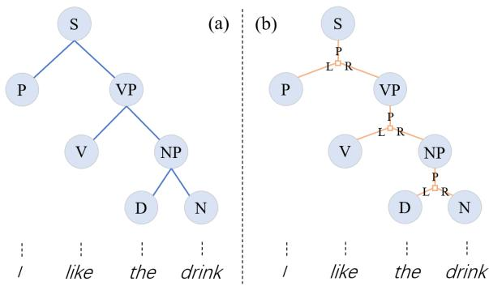
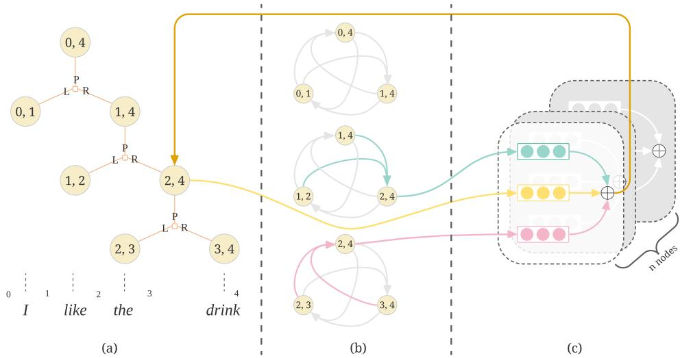
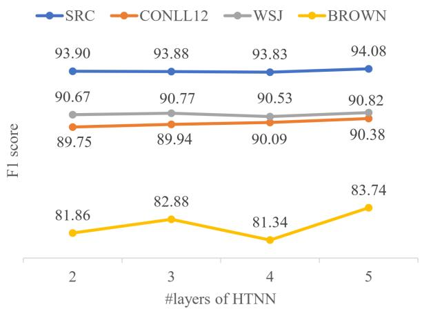
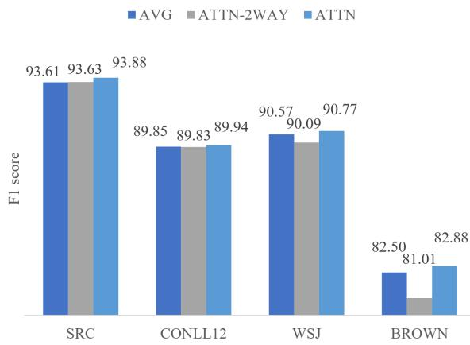

# Improving Constituent Representation with Hypertree Neural Networks

Hao Zhou✸ , Gongshen Liu✸ , Kewei Tu†∗

✸ School of Electronic Information and Electrical Engineering, Shanghai Jiao Tong University † School of Information Science and Technology, ShanghaiTech University Shanghai Engineering Research Center of Intelligent Vision and Imaging {zhou1998,lgshen}@sjtu.edu.cn tukw@shanghaitech.edu.cn

## Abstract

Many natural language processing tasks involve text spans and thus high-quality span representations are needed to enhance neural approaches to these tasks. Most existing methods of span representation are based on simple derivations (such as max-pooling) from word representations and do not utilize compositional structures of natural language. In this paper, we aim to improve representations of constituent spans using a novel hypertree neural networks (HTNN) that is structured with constituency parse trees. Each node in the HTNN represents a constituent of the input sentence and each hyperedge represents a composition of smaller child constituents into a larger parent constituent. In each update iteration of the HTNN, the representation of each constituent is computed based on all the hyperedges connected to it, thus incorporating both bottom-up and top-down compositional information. We conduct comprehensive experiments to evaluate HTNNs against other span representation models and the results show the effectiveness of HTNN.

## 1 Introduction

Distributed span representations are useful in various natural language processing tasks such as question answering (Seo et al., 2019), coreference resolution (Lee et al., 2017), sentiment classification (Yin et al., 2020) and semantic role labeling (He et al., 2018). Since spans can have arbitrary length, to get fix-dimensional span representations, existing methods are mostly based on simple derivations from word or sub-word representations. These methods either apply some form of pooling over all the words within the target span or utilize only the boundary words of the target span to compute the span representation. There have also been efforts to improve word representation learning using information from text spans, which may at the same time improve span representations built on top of word representations (Joshi et al., 2020). Further, some previous methods introduce short text spans (phrases or n-grams) as additional inputs to BERT and thus learn contextual representations for such spans along with word representations (Lai et al., 2021; Zhang et al., 2021).

  
Figure 1: An example binarized constituency parse tree (a) and its corresponding hypertree (b). For each hyperedge, P/L/R denote the parent, left-child, right-child constituent spans respectively.

However, it is known that natural language text has underlying compositional structure, which can often be represented with constituency parse trees (Chomsky, 1957). What is missing from the aforementioned span representation methods is the utilization of compositional structures both within and outside text spans. Specifically, the recursive compositional structure inside a text span suggests more structured bottom-up computation of the span representation from word representations; the compositional structure outside a text span specifies how the span joins its sibling spans to form a larger span, implying top-down computation of the span representation from its parent and siblings1. By taking into account such compositional structures, we could obtain better span representations and avoid problems with existing methods such as insufficient modeling of meaning composition (Yu and Ettinger, 2020).

There are several existing methods of incorporating constituency tree structures in neural networks that can be used to produce constituent span representations. These methods fall into two main categories: recursive neural networks (RvNNs) (Goller and Kuchler, 1996) and graph neural networks (GNNs). RvNN-based models recursively compose span representations from their sub-spans following a constituency tree structure (Socher et al., 2011; Tai et al., 2015). They hence only model bottom-up composition and miss information from parent and sibling spans in their span representations. Some extensions of RvNNs (Le and Zuidema, 2014; Drozdov et al., 2019) try to tackle this problem by additionally modeling top-down (de-)composition in a similar recursive fashion. However, they separate the representations computed from the directions and disallow them to directly interact with (and potentially disambiguate) each other. GNN-based models, such as graph convolutional networks (GCN) (Kipf and Welling, 2016) and graph attention networks (Velickoviˇ c´ et al., 2017), have been applied based on constituency tree structures to compute word and span representations (Marcheggiani and Titov, 2020; Li et al., 2020). One important flaw of GNN-based methods is that a GNN represents each composition with multiple edges that become mixed up with edges from other compositions during GNN updates, thus losing critical information of the compositional structure. More specifically, a GNN does not adequately formulate and differentiate bottomup computation from all the child spans versus top-down computation from the parent and sibling spans. In addition, most GNN-based methods do not model relations between sibling spans.

To overcome the above drawbacks, we propose hypertree neural networks (HTNN) to improve constituent span representations. Specifically, we view a constituency parse tree as a hypertree (Figure 1(b)), in which each node represents a constituent and each hyperedge is a tuple of multiple nodes representing a composition of smaller child constituents into a larger parent constituent. We then build an HTNN with the hypertree as its skeleton. During iterative update in the HTNN, we first visit each hyperedge, computing a representation of each node in the hyperedge from the other nodes using a direction-specific composition function; then we visit each node, aggregating its representations computed from all the hyperedges connected to it. In this way, not only can we keep the hierarchical information during encoding process, but also update the representation of constituents simultaneously. HTNNs combine the strengths of RvNNs and GNNs in span representation while avoid their drawbacks. Like GNNs, HTNNs compute a single unified representation for each span that integrates information from all the directions in the constituency tree. On the other hand, HTNNs follow RvNNs and utilize direction-specific composition functions to group and integrate information from different directions.

To evaluate the effectiveness of our method, we firstly conduct detailed experiments on three probing tasks: semantic role classification, named entity labeling, coreference arc prediction. Then we apply our method to the task of semantic role labeling. The results show that our method is superior to word-based, RvNN-based models and GNN-based models.

## 2 Hypertree Neural Networks

## 2.1 Overview

A hypergraph is a generalization of a graph in which an edge can join any number of nodes. A hypertree is a hypergraph  such that there exists a tree and every hyperedge of is the set of nodes of a connected subtree of . We consider a directed version of hypertree that defines a hyperedge as a tuple of nodes instead of a set.

There is a long tradition of representing constituency parse trees with hypergraphs or hypertrees (Klein and Manning, 2001; Huang and Chiang, 2005). We define the hypertree representation of a constituency parse tree as follows. Each node in the hypertree represents a constituent in the parse tree and is labeled with the nonterminal symbol of the constituent. Each hyperedge represents a composition of smaller child constituents into a larger parent constituent. In this paper, we assume that the constituency parse tree is binarized, so each hyperedge contains exactly three nodes, marked with P (parent), L (left child) and R (right child) respectively. Figure 1 shows the hypertree representation of an example constituency parse tree.

  
Figure 2: Illustration of an HTNN. We show the update process of node (2,4). (a) The hypertree structure. (b) Composition within hyperedges. (c) Aggregation of multiple representations.

We generalize the methodology of GNNs on hypertrees and propose hypertree neural networks (HTNN, Figure 2). Similar to GNNs, several HTNN layers are stacked to form the model. Each layer is composed of two modules: composition within hyperedges (Section 2.3), which computes a representation of each node in a hyperedge using the other nodes from the same hyperedge; and aggregation of multiple representations (Section 2.4), which aggregates the representations of a node from all the hyperedges connected to it and forms a single unified representation. Each layer is fed with the node representation from the previous layer. The initial node representation in the first layer is computed from word representation using the attention pooling method (Section 2.2).

We treat the node representation from the last layer as the final constituent span representations and feed them into downstream task-specific decoders. For example, we may run an MLP classifier on top of a span representation for named entity recognition, or run a biaffine classifier on top of the representations of two spans for semantic role labeling. Training of HTNN can be done by optimizing any task-specific objective in an end-to-end manner along with the initial span encoder and the task-specific decoder.

## 2.2 Initialization of Node Representation

We follow Toshniwal et al. (2020) to compute initial span representations from word representations produced by a pretrained language model. We choose to use their attention pooling method because it performs the best in our pilot experiments. Specifically, the input sentence $\begin{array} { r l } { \mathbf { x } } & { { } = } \end{array}$ $\{ w _ { 1 } , w _ { 2 } , . . . , w _ { l } \}$ of l words, is firstly tokenized and passed through a pretrained language model to get contextual token embeddings $\{ \mathbf { e } _ { 1 } , \mathbf { e } _ { 2 } , . . . , \mathbf { e } _ { T } \}$ These embeddings are then fed to the attention pooling module to get fix-dimensional span embeddings. For a span $s = [ i , j ]$ whose corresponding contextualized embeddings are $\{ \mathbf { e } _ { i } , . . . , \mathbf { e } _ { j - 1 } \}$ , the span representation $\mathbf { s } _ { i j }$ is calculated as:

$$
\begin{array} { l } { \displaystyle \mathbf { s } _ { i j } = \sum _ { k = i } ^ { j - 1 } a _ { k } \cdot \mathbf { e } _ { k } } \\ { \displaystyle a _ { k } = \mathbf { S o f t m a x } ( \mathbf { v } _ { 1 } ^ { T } \cdot \mathbf { e } _ { k } ) } \end{array}
$$

where $\mathbf { v } _ { 1 }$ is a learned parameter vector. Note that in a constituency parse tree, each constituent is attached with a nonterminal tag. We use an embedding layer to convert the tag to distributed vector space, and then concatenate it to ${ \bf s } _ { i j }$

$$
\mathbf { s } _ { i j } ^ { \prime } = \mathbf { C o n c a t } ( [ \mathbf { s } _ { i j } ; \mathbf { E m b e d d i n g } ( t a g ) ] )
$$

We project $\mathbf { s } _ { i j } ^ { \prime }$ using two different learned matrices to obtain $\mathbf { h } _ { i j }$ and $\mathbf { c } _ { i j }$ , the initial hidden state and memory cell of the node representing span [i, j].

## 2.3 Composition within Hyperedge

Within each hyperedge, there are three nodes: parent $( p ) .$ , left child (l), right child (r). Traditional RvNN-based methods model the relationships among them mainly in a bottom-up manner: a composition function combines the representations of the two children to obtain the representation of the parent. Le and Zuidema (2014) extend such methods by adding a top-down process, where a node’s representation can also be computed from its parent and sibling. We follow this idea that any node can be computed from the others within each hyperedge. The computation is direction-specific, meaning that the composition function is different for each of the three nodes.

Our composition function is inspired by TreeL-STM (Tai et al., 2015). The computing process can be denoted as:

$$
[ \mathbf { h } _ { p } ^ { \prime } ; \mathbf { c } _ { p } ^ { \prime } ] = \mathbf { C o m p o s e } ( \mathbf { h } _ { p } , \mathbf { h } _ { l } , \mathbf { h } _ { r } , \mathbf { c } _ { l } , \mathbf { c } _ { r } )\tag{1}
$$

$$
[ \mathbf { h } _ { l } ^ { \prime } ; \mathbf { c } _ { l } ^ { \prime } ] = \mathbf { C o m p o s e } ( \mathbf { h } _ { l } , \mathbf { h } _ { p } , \mathbf { h } _ { r } , \mathbf { c } _ { p } , \mathbf { c } _ { r } )\tag{2}
$$

$$
[ \mathbf { h } _ { r } ^ { \prime } ; \mathbf { c } _ { r } ^ { \prime } ] = \mathbf { C o m p o s e } ( \mathbf { h } _ { r } , \mathbf { h } _ { p } , \mathbf { h } _ { l } , \mathbf { c } _ { p } , \mathbf { c } _ { l } )\tag{3}
$$

where subscript $p ,$ l, r denote the parent, left child and right child respectively, h and c denote hidden state and memory cell vectors from the previous layer, and $\mathbf { h } ^ { \prime }$ and $\mathbf { c } ^ { \prime }$ denote newly composed vectors.

We illustrate the detailed computation process of equation (1), in which we compose the left child node and the right child node to get the representation of the parent node.

$$
\begin{array} { r l } & { \mathbf { i } = \sigma \left( \mathbf { W } ^ { ( i ) } \mathbf { h } _ { p } + \mathbf { U } _ { l } ^ { ( i ) } \mathbf { h } _ { l } + \mathbf { U } _ { r } ^ { ( i ) } \mathbf { h } _ { r } + \mathbf { b } ^ { ( i ) } \right) } \\ & { \mathbf { f } ^ { l } = \sigma \left( \mathbf { W } ^ { ( f ) } \mathbf { h } _ { p } + \mathbf { U } _ { l } ^ { ( f ) } \mathbf { h } _ { l } + \mathbf { U } _ { r } ^ { ( f ) } \mathbf { h } _ { r } + \mathbf { b } ^ { ( f ) } \right) } \\ & { \mathbf { f } ^ { r } = \sigma \left( \mathbf { W } ^ { ( f ) r } \mathbf { h } _ { p } + \mathbf { U } _ { l } ^ { ( f ) * } \mathbf { h } _ { l } + \mathbf { U } _ { r } ^ { ( f ) * } \mathbf { h } _ { r } + \mathbf { b } ^ { ( f ) } \right) } \\ & { \mathbf { o } = \sigma \left( \mathbf { W } ^ { ( o ) } \mathbf { h } _ { p } + \mathbf { U } _ { i } ^ { ( o ) } \mathbf { h } _ { l } + \mathbf { U } _ { r } ^ { ( o ) } \mathbf { h } _ { r } + \mathbf { b } ^ { ( o ) } \right) } \\ & { \mathbf { u } = \mathbf { t a n h } \left( \mathbf { W } ^ { ( u ) } \mathbf { h } _ { p } + \mathbf { U } _ { l } ^ { ( u ) } \mathbf { h } _ { l } + \mathbf { U } _ { r } ^ { ( u ) } \mathbf { h } _ { r } + \mathbf { b } ^ { ( u ) } \right) } \\ & { \mathbf { c } _ { p } ^ { r } = \mathbf { i } \odot \mathbf { u } + \mathbf { f } ^ { l } \odot \mathbf { c } _ { l } + \mathbf { f } ^ { r } \odot \mathbf { c } _ { r } } \\ & { \mathbf { h } _ { p } ^ { r } = \mathbf { o } \odot \mathbf { t a n h } ( \mathbf { c } _ { p } ^ { r } ) } \end{array}
$$

i, $\mathbf { f } ^ { l } , \mathbf { f } ^ { r } , \mathbf { o } \in \mathbb { R } ^ { d }$ represent the input gate, two forget gates and output gate respectively. $\mathbf { u } \in \mathbb { R } ^ { d }$ is the newly composed input for the memory cell. U and $\mathbf { W } \in \mathbb { R } ^ { d \times d }$ denote trainable weight matrices and $\mathbf { \tau } ) \in \mathbb { R } ^ { d }$ denotes trainable bias vectors. The superscript of a matrix denotes which gate it is used for, and the subscript of a matrix denotes which node representation it is multiplied to. The computation processes of equation (2) and (3) are similarly defined, and they share some of the trainable matrices. (See more details in Appendix A.1)

## 2.4 Aggregation of Multiple Representations

With the exception of the root and the leaf nodes, a node in the HTNN is connected with two hyperedges, one connecting to its parent and sibling and the other connecting to its two children. The computation process in Section 2.3 is independently carried out for each of the two hyperedges, resulting in two different representations for the node. Besides, we assume that the representation of the nodes from the previous layer also conveys important information. Therefore, we aggregate these three representations using the attention mechanism. Specifically, we use $\mathbf { h } _ { 0 } ^ { \prime }$ to denote the output hidden state from the previous layer, and $\mathbf { h } _ { 1 } ^ { \prime } , \mathbf { h } _ { 2 } ^ { \prime }$ to denote the representations computed from the two hyperedges. We use $\mathbf { h } _ { 0 } ^ { \prime }$ as the query vector, to attend to $\mathbf { h } _ { 0 } ^ { \prime } , \mathbf { h } _ { 1 } ^ { \prime } , \mathbf { h } _ { 2 } ^ { \prime }$ and compute a single aggregated representation $\mathbf { h } ^ { \prime } .$

$$
a _ { i } = \mathbf { S o f t m a x } ( \mathbf { v } _ { 2 } ^ { T } \mathbf { t a n h } ( \mathbf { W } [ \mathbf { h } _ { 0 } ^ { \prime } ; \mathbf { h } _ { i } ^ { \prime } ] ) )
$$

$$
{ \bf h } ^ { \prime } = \sum _ { i } a _ { i } \cdot { \bf h } _ { i } ^ { \prime } , \quad i \in \{ 0 , 1 , 2 \}
$$

where $\textbf { W } \in \ \mathbb { R } ^ { 2 d \times d }$ and $\mathbf { v } _ { 2 } ~ \in ~ \mathbb { R } ^ { d }$ are trainable parameters. Note that the memory cell $\mathbf { c } ^ { \prime }$ is aggregated in the same process with shared parameters.

## 3 Experiments

## 3.1 Implementation Details

We use gold constituency parse trees from the datasets, and binarize them using NLTK Toolkit (Bird et al., 2009). We use pretrained RoBERTalarge2 (Liu et al., 2019) from HuggingFace (Wolf et al., 2019) as the word encoder. We also tried SpanBERT (Joshi et al., 2020) for word encoding but found it inferior to RoBERTa-large in our pilot experiments. We freeze the parameters in the pretrained language model for all experiments. The dimension of attention pooling is 192 and the dimension of tag embedding is 64. The dimensions of hidden state and memory cell in HTNN are all set to 256. We set the default number of HTNN layers to 3. For each layer, the number of training parameters is 1,707,520. During training, the model is evaluated on the validation set every 1000 training steps. We adopt the Adam optimizer with an initial learning rate of $_ { 2 \mathrm { e } - 3 }$ , which is halved if the validation score is stuck for 3 evaluations. The batch size is 64 and the dropout probability is 0.2. We train our model for 40 epochs on 4 NVIDIA Tesla P40 GPUs. 3

## 3.2 Datasets

CoNLL-2012 We conduct both probing and SRL experiments on the CoNLL-2012 dataset (Pradhan et al., 2012). This dataset is extracted from the OntoNotes v5.0 corpus, which provides gold constituency parses.

CoNLL-2005 We also conduct SRL experiments on the CoNLL-2005 dataset (Carreras and Màrquez, 2005), which takes section 2-21 of the Wall Street Journal (WSJ) corpus as the training set, and section 24 as the development set. The test set consists of section 23 of WSJ for in-domain evaluation together with 3 sections from the Brown corpus for out-of-domain evaluation. CoNLL-2005 is also annotated with gold constituency parses.

## 3.3 Models for Comparison

Pooling A baseline model that computes span representations using attention pooling (Toshniwal et al., 2020). Our method and all the methods listed below use this representation for initialization.

SentiBERT A model for composing sentiment semantics on top of BERT (Yin et al., 2020). We re-implement their composition module based on the attention mechanism for span representation, instead of using their full model designed for sentiment analysis. We consider SentiBERT as a GNNbased model because it updates representations of all nodes simultaneously, though it only applies the attention mechanism from each parent node to its child nodes.

TreeLSTM An RvNN-based model, proposed by Tai et al. (2015), that generalizes the standard LSTM architecture to tree-structures.

Bi-TreeLSTM Le and Zuidema (2014) proposed IORNN to capture top-down decomposition besides bottom-up composition. We extend their model by using the composition function of TreeL-STMs. We refer to this model as bidirectional TreeLSTM (Bi-TreeLSTM).

GCN/GCN-sib Marcheggiani and Titov (2020) apply GCN structured with constituency trees in an SRL system. We re-implement their constituent GCN module to produce span representations, omitting their decomposition stage that is used for word representations. Furthermore, we extend GCN by adding sibling nodes in constituency trees for better comparison with our method. We refer to this modification as GCN-sib.

GAT/GAT-sib Li et al. (2020) use GAT to generate representations of the nodes in constituency parse trees. Similarly, we extend GAT by connecting sibling nodes, and we refer to this modification as GAT-sib.

## 3.4 Probing Experiments

We firstly conduct a probing evaluation of span representations, following Toshniwal et al. (2020). We conduct experiments on three of their probing tasks, omitting the other two tasks that probe syntax because constituency syntactic parses are input to most of the methods compared here.

• Named entity labeling (NEL): a task of predicting the entity type of a given span corresponding to an entity.

• Semantic role classification (SRC): a task of predicting the semantic roles of phrases in a sentence. Unlike the standard SRL task, in this probing task, predicates and their argument spans are given , so the goal is to classify the argument spans into specific semantic roles.

• Coreference arc prediction (COREF): a task of predicting whether a pair of spans refer to the same entity.

The task-specific decoder for these probing tasks is a two-layer MLP followed by sigmoid layers to predict the labels. For SRC and COREF, which involve two spans, the MLP takes the concatenation of the representations of the two spans as input. Following Toshniwal et al. (2020), we make predictions for each label independently, which allows using the micro-averaged F1 score as the evaluation metric. Note that in all the methods except Pooling, we only compute representations for constituent spans (those appearing in constituency parse trees). Therefore, given a distituent span, we simply predict no label. Fortunately, almost all the spans of interest in three tasks are constituent spans (98.5% for NEL, 99.7% for SRC, and 99.4% for COREF)4. We report F1 scores for all the spans (F1-all) as well as for constituent spans only (F1-const).

The results of three probing tasks are shown in Table 1. As a baseline model, Pooling’s architecture is the simplest. Surprisingly, it outperforms all the other methods (except for HTNN on F1-const) on the NEL task. We believe this is because NEL is so simple that contextual word representations already provide sufficient information. More complicated models show poor performance possibly because they overfit this simple task. On the other hand, Pooling underperforms many other methods on the SRC and COREF tasks, showing the utility of syntactic information. For COREF in particular, many input spans are pronouns and their meanings may be more difficult to capture without syntactic information.

<table><tr><td rowspan="2"></td><td colspan="2">NEL</td><td colspan="2">SRC</td><td colspan="2">COREF</td><td colspan="2">AVG</td></tr><tr><td>F1-const</td><td>F1-all</td><td>F1-const</td><td>F1-all</td><td>F1-const</td><td>F1-all</td><td>F1-const</td><td>F1-all</td></tr><tr><td>Pooling</td><td>96.18</td><td>96.07</td><td>93.08</td><td>93.05</td><td>92.99</td><td>93.01</td><td>94.08</td><td>94.04</td></tr><tr><td>TreeLSTM</td><td>95.05</td><td>94.22</td><td>90.02</td><td>89.88</td><td>90.07</td><td>89.70</td><td>91.71</td><td>91.27</td></tr><tr><td>Bi-TreeLSTM</td><td>95.25</td><td>94.42</td><td>90.49</td><td>90.35</td><td>90.33</td><td>89.96</td><td>92.02</td><td>91.58</td></tr><tr><td>SentiBERT</td><td>92.98</td><td>92.84</td><td>95.92</td><td>95.09</td><td>96.01</td><td>95.64</td><td>94.97</td><td>94.52</td></tr><tr><td>GAT</td><td>96.01</td><td>95.18</td><td>93.41</td><td>93.26</td><td>96.13</td><td>95.76</td><td>95.18</td><td>94.73</td></tr><tr><td>GCN</td><td>96.03</td><td>95.20</td><td>93.51</td><td>93.37</td><td>96.22</td><td>95.85</td><td>95.25</td><td>94.81</td></tr><tr><td>GAT-sib</td><td>95.79</td><td>94.96</td><td>92.85</td><td>92.71</td><td>95.66</td><td>95.29</td><td>94.77</td><td>94.32</td></tr><tr><td>GCN-sib</td><td>95.87</td><td>95.04</td><td>93.27</td><td>93.13</td><td>95.68</td><td>95.31</td><td>94.94</td><td>94.50</td></tr><tr><td>HTNN</td><td>96.28</td><td>95.45</td><td>93.88</td><td>93.74</td><td>96.33</td><td>95.96</td><td>95.50</td><td>95.05</td></tr></table>

Table 1: Results of probing experiments.

The RvNN-based models TreeLSTM and Bi-TreeLSTM perform worst on all these three tasks. Previous recursive models are mostly used for sentence-level tasks, and our results show their deficiencies in composing semantics for fine-grained spans rather than sentences.

For GNN-based models, SentiBERT, GAT and GCN all show great improvement over recursive models, and they are also better than Pooling on average on these three tasks. Both GAT and GCN show slight superiority over SentiBERT, probably because they take parent node into computation, rather than only children nodes. Moreover, GCN performs slightly better than GAT.

As for HTNN, we can see that it achieves the best performance overall. The fact that HTNN outperforms GAT and GCN while GAT-sib and GCN-sib underperform GAT and GCN suggests that the superiority of HTNN does not simply come from adding sibling information into computation. It is the ability to group and integrate bottom-up and top-down information that leads to the superior performance of HTNN.

It is worth noting that for the NEL task, HTNN outperforms Pooling on F1-const but underperforms it on F1-all because HTNN predicts no label for distituent spans. A simple remedy is to combine HTNN and Pooling, using HTNN for constituent spans and reverting to Pooling for distituent spans. This yields 96.27 F1-all for NEL, surpassing the strongest Pooling baseline.

## 3.5 SRL Experiments

We extend SRL in probing tasks to the general setting, in which the predicate is given and we conduct argument identification and role classification. Our SRL model is most closely related to the work of He et al. (2018). The difference is that instead of using a separate argument pruning module, we simply prune all the distituent spans and keep all the constituent spans. Given a predicate and a candidate span, we use their biaffine scorer to predict a label, where the label set is the set of semantic roles plus a null label indicating the span not being an argument.

The results of SRL experiments are shown in Table 2. Once again, we show F1 scores for both all the spans (F1-all) and constituent spans only (F1- const) . We only show the results of GNN-based models since RvNN-based models have shown their disadvantages in the probing experiments. SentiBERT does not perform well in this task, falling behind even the simple baseline Pooling. GCN and GAT show significant gain against baseline, and GCN is still better than GAT on all the three datasets, especially on the out-of-domain BROWN test dataset. We also find that taking sibling nodes into computation causes opposite effects on GAT and GCN. It does great harm to GAT, similar to the case in the probing experiments, but GCN-sib shows small gains over GCN, which is different from the case in the probing experiments.

Our model HTNN achieves the best performance on all the three datasets. Since SRL is more challenging than the probing tasks, we can see that the gap between HTNN and the other models is more prominet. The improvements over the best baseline model GCN-sib are 1.54 on the CONLL-2012 test dataset, 2.32 on the CONLL-2005 WSJ test dataset, 2.85 on the CONLL-2005 BROWN test dataset.

<table><tr><td rowspan="3"></td><td colspan="2">CONLL12</td><td colspan="2">CONLL05 WSJ</td><td colspan="2">CONLL05 BROWN</td></tr><tr><td>F1-const</td><td>F1-all</td><td>F1-const</td><td>F1-all</td><td>F1-const</td><td>F1-all</td></tr><tr><td>82.36</td><td>82.23</td><td>82.82</td><td>81.90</td><td>71.51</td><td>70.43</td></tr><tr><td>Pooling SentiBERT</td><td>75.31</td><td>75.18</td><td>74.52</td><td>73.69</td><td>66.52</td><td>65.51</td></tr><tr><td>GAT</td><td>85.29</td><td>85.16</td><td>84.69</td><td>83.74</td><td>73.32</td><td>72.24</td></tr><tr><td>GCN</td><td>87.91</td><td>87.77</td><td>88.06</td><td>87.08</td><td>79.22</td><td>78.09</td></tr><tr><td>GAT-sib</td><td>76.41</td><td>76.29</td><td>78.34</td><td>77.46</td><td>62.52</td><td>61.58</td></tr><tr><td>GCN-sib</td><td>88.40</td><td>88.27</td><td>88.45</td><td>87.46</td><td>80.03</td><td>79.87</td></tr><tr><td>HTNN</td><td>89.94</td><td>89.81</td><td>90.77</td><td>89.76</td><td>82.88</td><td>81.68</td></tr><tr><td>Wang et al. (2019)†</td><td>一</td><td>84.21</td><td>一</td><td>85.23</td><td>一</td><td>75.36</td></tr><tr><td>Fei et al. (2021)*</td><td>一</td><td>87.35</td><td>一</td><td>88.81</td><td>一</td><td>81.27</td></tr></table>

Table 2: Results of SRL experiments. “ ”: reimplemented and reported by Fei et al. (2021). “ ”: results reported in the original paper.
<table><tr><td></td><td>SRC</td><td>NEL</td><td>COREF</td><td>CONLL12</td><td>WSJ</td><td>BROWN</td></tr><tr><td>GAT -w/o tag</td><td>-0.27</td><td>-0.14</td><td>-0.46</td><td>-7.74</td><td>-8.49</td><td>-7.36</td></tr><tr><td>GCN -w/o tag</td><td>-0.37</td><td>0.02</td><td>-0.09</td><td>-1.74</td><td>-1.38</td><td>-0.76</td></tr><tr><td>GAT-sib -w/o tag</td><td>-0.82</td><td>-0.34</td><td>-1.85</td><td>-7.09</td><td>-9.30</td><td>-7.05</td></tr><tr><td>GCN-sib -w/o tag</td><td>-0.07</td><td>0.06</td><td>0.02</td><td>-2.06</td><td>-1.90</td><td>-1.11</td></tr><tr><td>HTNN -w/o tag</td><td>-0.04</td><td>-0.07</td><td>0.13</td><td>-1.73</td><td>-2.29</td><td>-2.28</td></tr><tr><td>HTNN -tag-dim=32</td><td>0.07</td><td>-0.14</td><td>0.22</td><td>-0.03</td><td>0.00</td><td>0.15</td></tr></table>

Table 3: Influence of nonterminal tags in constituency parse tree. The value in this table is the variation against the resuts in Table 1 and Table 2.

We also show results of two other SRL models that use gold constituency parse trees in Table 2. HTNN outperforms both of them.

## 3.6 Ablation Study

Incorporation of Nonterminal Tags We incorporate nonterminal tags into HTNN as described in Section 2.2. Here, we want to explore how nonterminal tags influence HTNN, as well as other models. When we use different embedding dimensions for nonterminal tags, the dimension of the attention pooling module changes accordingly to keep the dimension of span representations unchanged.

The results are shown in Table 3. As we can see, GAT, GCN and HTNN are negatively affected on nearly all the tasks when we remove the incorporation of nonterminal tags. The influence on both GCN and HTNN is quite small on the three probing tasks, compared with the SRL task. There are even improvements for HTNN and GCN-sib when removing nonterminal tags on NEL and COREF. However, on the SRL task, the performance decreases notably for all the models.

  
Figure 3: Performance of different tasks as #layers of HTNN changes.

We also conduct experiments of HTNN when we set the dimension of nonterminal tags to 32 and we observe little change in performance.

Number of Layers In each layer of an HTNN, a node exchanges information with its neighbor. Therefore, the more layers the HTNN has, the further the information of a node would spread. In theory, for a binary constituency tree with n leaf nodes, to make each leaf node receive information from arbitrary leaf nodes, the number of HTNN layers should be set to n 1. In practice, however, this may be unnecessary and local information exchange may be sufficient. We conduct experiments to analyze how the number of HTNN layers affect the performance on different tasks.

  
Figure 4: Performance of different aggregation methods.

The results are shown in Figure 3. We can see that the tendency is not all the same on the four tasks. As we increase the number of layers, the increase of the F1 score is getting smaller, and in some cases it even declines. Therefore, we regard the number of layers as a hyperparameter which should be tuned on specific tasks.

Aggregation Method We compare three different methods for the aggregation module (Section 2.4):

• AVG, which simply takes the average of the representations.

• ATTN, which is the default method we introduce in Section 2.4.

• ATTN-2WAY, similar to ATTN, but does not include the representation from previous layer.

The results are shown in Figure 4. It can be seen that ATTN indeed performs the best.

## 4 Related Work

To get distributed span representations, existing methods are mostly based on simple derivations from word or sub-word representations. Lee et al. (2017) propose the attention-weighted pooling strategy for coreference resolution. Stern et al. (2017) concatenate the sum and the difference of the span endpoints for parsing. Seo et al. (2019) use the “coherent” endpoint-based representation for question answering. All of these methods are originally designed for specific tasks, but because of their simplicity, they can be easily employed for other tasks. Toshniwal et al. (2020) make a comprehensive survey on these methods and conduct experiments to compare their performance. Some other studies also focus on the representations of sentences or longer texts (Wieting et al., 2015; Conneau et al., 2017; Shen et al., 2018).

Instead of representing an arbitrary, some studies consider composing span representations via syntactic parse trees, which are more related to our work. Le and Zuidema (2014) proposed a recursive model IORNN to produce constituent representations for supervised task. Drozdov et al. (2019) proposed an unsupervised method for constituency parse tree induction, during which span representations are produced as a byproduct. More recently, graph neural networks have been applied with constituency parse trees. Marcheggiani and Titov (2020) use GCN to encode constituent spans in an SRL system. However, they decompose the constituent span representations back to start and end tokens instead of directly using them. Li et al. (2020) use GAT to generate constituent span representations for the sentiment analysis task.

## 5 Conclusion and Future Work

In this paper, we propose hypertree neural networks (HTNN) to generate better representations of constituent spans following constituency parse tree structures. Each node in the HTNN represents a constituent span and each hyperedge represents a local composition structure. Each HTNN layer first computes a representation of each node in a hyperedge using the other nodes from the same hyperedge, and then aggregates the representations of a node from all the connected hyperedges. We empirically compare HTNNs with previous RvNN-based models and GNN-based models. The outstanding performance of HTNNs on both probing and SRL tasks shows the effectiveness of HTNN.

For future work, we plan to tackle two related issues of our approach, namely its reliance on highquality constituency parses and its inability to represent distituent spans (some of which may nonetheless be important). We will also extend HTNNs to more tasks such as sentiment analysis and document classification, and incorporate HTNNs into popular pretrained language models as a method to inject syntactic information.

## Acknowledgments

This work was supported by the National Natural Science Foundation of China (61976139) and the Joint Funds of the National Natural Science Foundation of China (U21B2020).

## References

Steven Bird, Ewan Klein, and Edward Loper. 2009. Natural language processing with Python: analyzing text with the natural language toolkit. " O’Reilly Media, Inc.".

Xavier Carreras and Lluís Màrquez. 2005. Introduction to the CoNLL-2005 shared task: Semantic role labeling. In Proceedings of the Ninth Conference on Computational Natural Language Learning (CoNLL-2005), pages 152–164, Ann Arbor, Michigan. Association for Computational Linguistics.

Noam Chomsky. 1957. Syntactic structures.

Alexis Conneau, Douwe Kiela, Holger Schwenk, Loïc Barrault, and Antoine Bordes. 2017. Supervised learning of universal sentence representations from natural language inference data. In Proceedings of the 2017 Conference on Empirical Methods in Natural Language Processing, pages 670–680, Copenhagen, Denmark. Association for Computational Linguistics.

Andrew Drozdov, Patrick Verga, Mohit Yadav, Mohit Iyyer, and Andrew McCallum. 2019. Unsupervised latent tree induction with deep inside-outside recursive auto-encoders. In Proceedings ofthe 2019 Conference ofthe North American Chapter ofthe Associationfor Computational Linguistics: Human Language Technologies, Volume 1 (Long and Short Papers), pages 1129–1141, Minneapolis, Minnesota. Association for Computational Linguistics.

Hao Fei, Shengqiong Wu, Yafeng Ren, Fei Li, and Donghong Ji. 2021. Better combine them together! integrating syntactic constituency and dependency representations for semantic role labeling. In Findings ofthe Associationfor Computational Linguistics: ACL-IJCNLP 2021, pages 549–559, Online. Association for Computational Linguistics.

Christoph Goller and Andreas Kuchler. 1996. Learning task-dependent distributed representations by backpropagation through structure. In Proceedings of International Conference on Neural Networks (ICNN’96), volume 1, pages 347–352. IEEE.

Luheng He, Kenton Lee, Omer Levy, and Luke Zettlemoyer. 2018. Jointly predicting predicates and arguments in neural semantic role labeling. In Proceedings ofthe 56th Annual Meeting ofthe Associationfor

Computational Linguistics (Volume 2: Short Papers), pages 364–369, Melbourne, Australia. Association for Computational Linguistics.

Liang Huang and David Chiang. 2005. Better k-best parsing. In Proceedings of the Ninth International Workshop on Parsing Technology, pages 53–64, Vancouver, British Columbia. Association for Computational Linguistics.

Mandar Joshi, Danqi Chen, Yinhan Liu, Daniel S. Weld, Luke Zettlemoyer, and Omer Levy. 2020. Span-BERT: Improving pre-training by representing and predicting spans. Transactions ofthe Associationfor Computational Linguistics, 8:64–77.

Thomas N Kipf and Max Welling. 2016. Semisupervised classification with graph convolutional networks. arXiv preprint arXiv:1609.02907.

Dan Klein and Christopher D. Manning. 2001. Parsing and hypergraphs. In Proceedings of the Seventh International Workshop on Parsing Technologies, pages 123–134, Beijing, China.

Yuxuan Lai, Yijia Liu, Yansong Feng, Songfang Huang, and Dongyan Zhao. 2021. Lattice-BERT: Leveraging multi-granularity representations in Chinese pretrained language models. In Proceedings ofthe 2021 Conference of the North American Chapter of the Associationfor Computational Linguistics: Human Language Technologies, pages 1716–1731, Online. Association for Computational Linguistics.

Phong Le and Willem Zuidema. 2014. Inside-outside semantics: A framework for neural models of semantic composition. In NIPS 2014 Workshop on Deep Learning and Representation Learning.

Kenton Lee, Luheng He, Mike Lewis, and Luke Zettlemoyer. 2017. End-to-end neural coreference resolution. In Proceedings of the 2017 Conference on Empirical Methods in Natural Language Processing, pages 188–197, Copenhagen, Denmark. Association for Computational Linguistics.

Yuncong Li, Cunxiang Yin, and Sheng-hua Zhong. 2020. Sentence constituent-aware aspect-category sentiment analysis with graph attention networks. In CCF International Conference on Natural Language Processing and Chinese Computing, pages 815–827. Springer.

Yinhan Liu, Myle Ott, Naman Goyal, Jingfei Du, Mandar Joshi, Danqi Chen, Omer Levy, Mike Lewis, Luke Zettlemoyer, and Veselin Stoyanov. 2019. Roberta: A robustly optimized bert pretraining approach. arXiv preprint arXiv:1907.11692.

Diego Marcheggiani and Ivan Titov. 2020. Graph convolutions over constituent trees for syntax-aware semantic role labeling. In Proceedings ofthe 2020 Conference on Empirical Methods in Natural Language Processing (EMNLP), pages 3915–3928, Online. Association for Computational Linguistics.

Sameer Pradhan, Alessandro Moschitti, Nianwen Xue, Olga Uryupina, and Yuchen Zhang. 2012. CoNLL-2012 shared task: Modeling multilingual unrestricted coreference in OntoNotes. In Joint Conference on EMNLP and CoNLL - Shared Task, pages 1–40, Jeju Island, Korea. Association for Computational Linguistics.

Minjoon Seo, Jinhyuk Lee, Tom Kwiatkowski, Ankur Parikh, Ali Farhadi, and Hannaneh Hajishirzi. 2019. Real-time open-domain question answering with dense-sparse phrase index. In Proceedings of the 57th Annual Meeting ofthe Associationfor Computational Linguistics, pages 4430–4441, Florence, Italy. Association for Computational Linguistics.

Dinghan Shen, Guoyin Wang, Wenlin Wang, Martin Renqiang Min, Qinliang Su, Yizhe Zhang, Chunyuan Li, Ricardo Henao, and Lawrence Carin. 2018. Baseline needs more love: On simple wordembedding-based models and associated pooling mechanisms. In Proceedings of the 56th Annual Meeting of the Association for Computational Linguistics (Volume 1: Long Papers), pages 440–450, Melbourne, Australia. Association for Computational Linguistics.

Richard Socher, Cliff Chiung-Yu Lin, Andrew Y Ng, and Christopher D Manning. 2011. Parsing natural scenes and natural language with recursive neural networks. In ICML.

Mitchell Stern, Jacob Andreas, and Dan Klein. 2017. A minimal span-based neural constituency parser. In Proceedings of the 55th Annual Meeting of the Associationfor Computational Linguistics (Volume 1: Long Papers), pages 818–827, Vancouver, Canada. Association for Computational Linguistics.

Kai Sheng Tai, Richard Socher, and Christopher D. Manning. 2015. Improved semantic representations from tree-structured long short-term memory networks. In Proceedings of the 53rd Annual Meeting of the Associationfor Computational Linguistics and the 7th International Joint Conference on Natural Language Processing (Volume 1: Long Papers), pages 1556– 1566, Beijing, China. Association for Computational Linguistics.

Shubham Toshniwal, Haoyue Shi, Bowen Shi, Lingyu Gao, Karen Livescu, and Kevin Gimpel. 2020. A cross-task analysis of text span representations. In Proceedings ofthe 5th Workshop on Representation Learningfor NLP, pages 166–176, Online. Association for Computational Linguistics.

Petar Velickoviˇ c, Guillem Cucurull, Arantxa Casanova,´ Adriana Romero, Pietro Lio, and Yoshua Bengio. 2017. Graph attention networks. arXiv preprint arXiv:1710.10903.

Yufei Wang, Mark Johnson, Stephen Wan, Yifang Sun, and Wei Wang. 2019. How to best use syntax in semantic role labelling. In Proceedings of the 57th Annual Meeting ofthe Associationfor Computational

Linguistics, pages 5338–5343, Florence, Italy. Association for Computational Linguistics.

John Wieting, Mohit Bansal, Kevin Gimpel, and Karen Livescu. 2015. Towards universal paraphrastic sentence embeddings. arXiv preprint arXiv:1511.08198.

Thomas Wolf, Lysandre Debut, Victor Sanh, Julien Chaumond, Clement Delangue, Anthony Moi, Pierric Cistac, Tim Rault, Rémi Louf, Morgan Funtowicz, et al. 2019. Huggingface’s transformers: State-ofthe-art natural language processing. arXiv preprint arXiv:1910.03771.

Da Yin, Tao Meng, and Kai-Wei Chang. 2020. SentiB-ERT: A transferable transformer-based architecture for compositional sentiment semantics. In Proceedings of the 58th Annual Meeting of the Association for Computational Linguistics, pages 3695–3706, Online. Association for Computational Linguistics.

Lang Yu and Allyson Ettinger. 2020. Assessing phrasal representation and composition in transformers. In Proceedings of the 2020 Conference on Empirical Methods in Natural Language Processing (EMNLP), pages 4896–4907, Online. Association for Computational Linguistics.

Xinsong Zhang, Pengshuai Li, and Hang Li. 2021. AM-BERT: A pre-trained language model with multigrained tokenization. In Findings of the Association for Computational Linguistics: ACL-IJCNLP 2021, pages 421–435, Online. Association for Computational Linguistics.

## A Appendix

## A.1 Details of Composition

The following is the detailed computation process of equation (2), in which we compose the right child node and the parent node to get the representation of the left child node:

$$
\begin{array} { r l } & { \mathbf i = \sigma \left( \mathbf { W } ^ { ( i ) } \mathbf h _ { r } + \mathbf { U } _ { l } ^ { ( i ) } \mathbf h _ { l } + \mathbf { U } _ { p } ^ { ( i ) } \mathbf h _ { p } + \mathbf b ^ { ( i ) } \right) } \\ & { \mathbf f ^ { l } = \sigma \left( \mathbf { W } ^ { ( f l ) } \mathbf h _ { r } + \mathbf { U } _ { l } ^ { ( f l ) } \mathbf h _ { l } + \mathbf { U } _ { p } ^ { ( f l ) } \mathbf h _ { p } + \mathbf b ^ { ( f ) } \right) } \\ & { \mathbf f ^ { p } = \sigma \left( \mathbf { W } ^ { ( f p ) } \mathbf h _ { r } + \mathbf { U } _ { l } ^ { ( f p ) } \mathbf h _ { l } + \mathbf { U } _ { p } ^ { ( f p ) } \mathbf h _ { p } + \mathbf b ^ { ( f ) } \right) } \\ & { \mathbf o = \sigma \left( \mathbf { W } ^ { ( o ) } \mathbf h _ { r } + \mathbf { U } _ { l } ^ { ( o ) } \mathbf h _ { l } + \mathbf { U } _ { p } ^ { ( o ) } \mathbf h _ { p } + \mathbf b ^ { ( o ) } \right) } \\ & { \mathbf u = \mathbf { t a n h } \left( \mathbf { W } ^ { ( u ) } \mathbf h _ { r } + \mathbf { U } _ { l } ^ { ( u ) } \mathbf h _ { l } + \mathbf { U } _ { p } ^ { ( u ) } \mathbf h _ { p } + \mathbf b ^ { ( u ) } \right) } \end{array}
$$

The following is the detailed computation process of equation (3), in which we compose the left child node and the parent node to get the represen-

<table><tr><td>Task</td><td>|C|</td><td>#Instances (Train / Val. / Test)</td><td>#Missing (Train / Val. / Test)</td></tr><tr><td>NEL</td><td>18</td><td>128738 / 20354 / 12586</td><td>1860 / 297 / 215</td></tr><tr><td>SRC</td><td>66</td><td>598983 / 83362 / 61716</td><td>1508 / 281 / 185</td></tr><tr><td>COREF</td><td>2</td><td>207830 / 26333 / 27800</td><td>1156 / 286 / 213</td></tr><tr><td>CoNLL-2005</td><td>53</td><td>235353 / 8549 / (14463 / 2228)</td><td>5897 / 225 / (315 / 63)</td></tr></table>

Table 4: Statistics of the CoNLL-2012 and CoNLL-2005 datasets. The NEL, SRC and COREF are from the CoNLL-2012 dataset. $" | \mathcal { L } | ^ { \prime \prime }$ is the number of labels. “#Instances” means the total instances in the original datasets. “#Missing” means the instances that contain distituent spans. Note that for the CoNLL-2005 dataset, the test set is composed of WSJ and BROWN, so we show their numbers respectively.

tation of the right child node:

$$
\mathbf { i } = \sigma \left( \mathbf { W } ^ { ( i ) } \mathbf { h } _ { l } + \mathbf { U } _ { r } ^ { ( i ) } \mathbf { h } _ { r } + \mathbf { U } _ { p } ^ { ( i ) } \mathbf { h } _ { p } + \mathbf { b } ^ { ( i ) } \right)
$$

$$
\mathbf { f } ^ { r } = \sigma \left( \mathbf { W } ^ { ( f r ) } \mathbf { h } _ { l } + \mathbf { U } _ { r } ^ { ( f r ) } \mathbf { h } _ { r } + \mathbf { U } _ { p } ^ { ( f r ) } \mathbf { h } _ { p } + \mathbf { b } ^ { ( f ) } \right)
$$

$$
\mathbf { f } ^ { p } = \sigma \left( \mathbf { W } ^ { ( f p ) } \mathbf { h } _ { l } + \mathbf { U } _ { r } ^ { ( f p ) } \mathbf { h } _ { r } + \mathbf { U } _ { p } ^ { ( f p ) } \mathbf { h } _ { p } + \mathbf { b } ^ { ( f ) } \right)
$$

$$
\mathbf { o } = \sigma \left( \mathbf { W } ^ { ( o ) } \mathbf { h } _ { l } + \mathbf { U } _ { r } ^ { ( o ) } \mathbf { h } _ { r } + \mathbf { U } _ { p } ^ { ( o ) } \mathbf { h } _ { p } + \mathbf { b } ^ { ( o ) } \right)
$$

$$
\mathbf { u } = \mathbf { t a n h } \left( \mathbf { W } ^ { ( u ) } \mathbf { h } _ { l } + \mathbf { U } _ { r } ^ { ( u ) } \mathbf { h } _ { r } + \mathbf { U } _ { p } ^ { ( u ) } \mathbf { h } _ { p } + \mathbf { b } ^ { ( u ) } \right)
$$

## A.2 Dataset Statistics

We show the statistics of the datasets in Table 4.