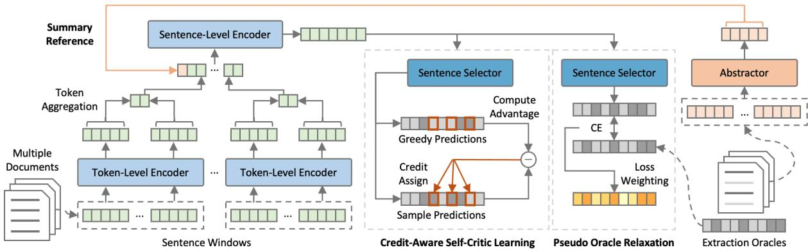
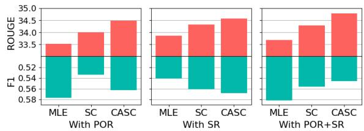

# Improving Multi-Document Summarization through Referenced Flexible Extraction with Credit-Awareness

Yun-Zhu Song and Yi-Syuan Chen and Hong-Han Shuai

National Yang Ming Chiao Tung University, Taiwan

{yunzhusong.eed07g,yschen.eed09g,hhshuai}@nctu.edu.tw

## Abstract

A notable challenge in Multi-Document Summarization (MDS) is the extremely-long length of the input. In this paper, we present an extract-then-abstract Transformer framework to overcome the problem. Specifically, we leverage pre-trained language models to construct a hierarchical extractor for salient sentence selection across documents and an abstractor for rewriting the selected contents as summaries. However, learning such a framework is challenging since the optimal contents for the abstractor are generally unknown. Pre vious works typically create pseudo extraction oracle to enable the supervised learning for both the extractor and the abstractor. Nev ertheless, we argue that the performance of such methods could be restricted due to the insufficient information for prediction and inconsistent objectives between training and testing. To this end, we propose a loss weight ing mechanism that makes the model aware of the unequal importance for the sentences not in the pseudo extraction oracle, and leverage the fine-tuned abstractor to generate summary references as auxiliary signals for learning the extractor. Moreover, we propose a reinforcement learning method that can efficiently apply to the extractor for harmonizing the optimization between training and testing. Experiment results show that our framework substantially outperforms strong baselines with comparable model sizes and achieves the best results on the Multi-News, Multi-XScience, and WikiCatSum corpora.1

## 1 Introduction

Neural multi-document summarization has drawn a lot of attention due to the wide applications, e.g., Wikipedia generation (Liu et al., 2018), news digest (Fabbri et al., 2019), or related-work section generation (Lu et al., 2020). Through concatenating the document clusters, it is applicable to adopt the approaches from single-document summarization (Zhang et al., 2020a; Fabbri et al., 2019) under multi-document settings. However, the input length from multiple documents is typically long, which might be computationally infeasible for Transformer-based models (Vaswani et al., 2017). One possible solution is to set a fixed length and truncate the input sequence. However, the truncation leads to information loss and performance drop. Moreover, even if the model can take such a long sequence as input, the attentions could be dispersed over long sequences (Yang et al., 2018) and further degrade the performance (Jin et al., 2020; Liu and Lapata, 2019a; Cohan et al., 2018).

To tackle the long sequence problem, another possible solution is to leverage the extract-thenabstract architecture in single document summarization (Pilault et al., 2020; Chen and Bansal, 2018; Gehrmann et al., 2018). In such an architecture, an extractor first selects salient contents from the documents, and an abstractor is applied to rewrite the selected contents to coherent summaries. However, several issues arise for directly applying the procedure in MDS. 1) Long-sequence problem for the extractor. Although the input length for the abstractor can be controlled through the content selection and thus enables the usage of Transformer models (Pilault et al., 2020), it is still inevitable for the extractor to process the complete input documents. Previous methods mainly use LSTM-based extractors (Pilault et al., 2020; Chen and Bansal, 2018; Gehrmann et al., 2018). However, this fails to leverage knowledge of pre-trained language models. 2) Suboptimal pseudo oracles. Most summarization corpora do not contain the oracle for extraction. As an alternative, previous works typically generate pseudo extraction oracle, or simply called pseudo oracle, through a greedy process (Liu and Lapata, 2019b; Chen and Bansal, 2018). Specifically, for each iteration in the process, candidate sentences are individually concatenated with previously-selected sentences and compute the ROUGE (Lin, 2004) scores with the humanwritten summaries. The top-scored sentence is iteratively selected until no sentence could further improve the ROUGE score. In practice, there are different ways for scoring. For examples, Liu and Lapata (2019b) use the average of ROUGE-1 and ROUGE-2 F1 scores while Chen and Bansal (2018) use ROUGE-L recall. The variants of design could cause the extractor to behave differently. In our study, we also found that using the ROUGE preci sion metric leads to much less extraction than using the recall metric. This implies that the pseudo ora cles are suboptimal, and learning the extractor fully relies on the pseudo oracles could restrict the per formance. How to alleviate the negative effects of pseudo oracles remains open. 3) Insufficient information for the extractor. Even if the pseudo oracles are good enough to train the abstractor well, learning a precise extractor is still challenging. The problem lies in that a pseudo oracle is derived from a specific summary. However, there are potentially multiple valid summaries given the documents. To select salient sentences, the extractor is required to implicitly infer the underlying summary used for oracle construction, which is difficult due to the lack of evidence. 4) Inconsistent objectives for the extractor. With pseudo oracles, the extractor is learned to select a set of sentences that has high lexical similarity to the summaries without redundancy. However, the goal of the extractor in test-time is to provide inputs for the abstractor that non-overlapping lexical may still be valuable. In other words, the objective for the extractor in training is inconsistent with the one in testing.

To address these issues, we propose the REferenced FLExible Extraction with CrediT-Awareness (REFLECT) for MDS. For the first problem, we propose a Transformer-based hierarchical extractor that contains the token- and sentencelevel feature encoders. Both the encoders are initialized with pre-trained language models to utilize the pretext knowledge. For the second problem, we propose Pseudo Oracle Relaxation (POR) to render the model aware of the unequal importance for the non-oracle sentences. This mechanism encourages the model to emphasize the precision for critical sentences with either high or low lexical similarity to the summaries, and avoids the confusion arising from the different labels for similar sentences. For the third problem, we propose Summary Referencing (SR) to leverage the fine-tuned abstractor for providing additional learning signals to evidence extraction prediction. The summary reference serves as an approximation for the humanwritten summary while being able to generalize for testing. For the fourth problem, we propose Credit-Aware Self-Critic (CASC) learning to fine-tune for matching the objective between training and testing. Different from previous methods that assign an identical reward for all actions, we reallocate the rewards based on the impacts of actor explorations.

The contributions are summarized as follows:

• We leverage pre-trained language models to propose an extract-then-abstract framework, which contains a hierarchical extractor that efficiently handles long inputs while utilizing pretext knowledge.

• We investigate the problems for typical learning paradigms of the extractor and propose a framework, named REFLECT, to further improve the extractor performance. The studies on pseudo oracles also provide valuable insights for extract-then-abstract frameworks.

• Experimental results on Multi-News, Multi-XScience, and WikiCatSum corpora demonstrate that REFLECT outperforms the stateof-the-art models with comparable sizes.

## 2 Related Work

Early attempts for MDS focus on extracting sentences through statistical methods (Goldstein et al., 2000; Erkan and Radev, 2004; Wan and Yang, 2006, 2008). For example, Goldstein et al. (2000) extend Maximal Marginal Relevance (MMR) method to select sentences that are relevant to the query and novel across different documents. Erkan and Radev (2004) leverage sentence relations with graph structures that represent pairwise sentence similarities, and apply PageRank (Page et al., 1999) algorithm to extract sentences given the query document. However, extractive methods often suffer the coherence problem (Wu and Hu, 2018). Therefore, instead of directly extracting sentences from the articles, abstractive methods that can rewrite the articles achieve great success with the advantages of large annotated corpora (Pang et al., 2021; Zhou et al., 2021; Liu et al., 2021a; Zhong et al., 2020; Li et al., 2020; Liu and Lapata, 2019a).

Directly operating on the long inputs in MDS often leads to model degradation (Jin et al., 2020). One of the promising solutions is to leverage the extract-then-abstract architectures in single document summarization (Chen and Bansal, 2018; Gehrmann et al., 2018). For example, Gehrmann et al. (2018) propose an LSTM-based word-level extractor to choose phrases from the document, and apply an abstractor with the copy mechanism to generate summaries given the selected contents. Pilault et al. (2020) also apply an LSTM-based sentence extractor to select contents, but further leverage a Transformer decoder to improve the performance.

Although introducing Transformer architectures provides improvements, the input length is typically limited according to the computation and memory overhead. A recent line of studies has been proposed to alleviate such problems (Bražinskas et al., 2021; Beltagy et al., 2020; Liu and Lapata, 2019a; Jin et al., 2020). Liu and Lapata (2019a) propose to rank the candidate input paragraphs, and only concatenate the top few as the inputs for the abstractor. Jin et al. (2020) encode multiple documents in different granularity including token-level, sentence-level, and document-level. Pasunuru et al. (2021) design a graph encoder parallel with standard encoder to provide inter-document information and integrate the pre-trained BART (Lewis et al., 2020) with local attention mechanism (Beltagy et al., 2020) to overcome the long input problem. Bražinskas et al. (2021) apply policy gradient optimization to learn a train-time selector using lexical features pre-computed from source texts and gold summaries as inputs. Due to the lack of gold summaries in testing, a test-time selector is learned using lexical features solely from source texts as inputs and predictions from the train-time selector as learning targets. Comparatively, our methods thoroughly leverage the language models with an extract-and-abstract framework that enjoys the full capacities for both the extractor and the abstractor. The introduced summary referencing further improves the extractor with additional signals in both train- and test-phase.

## 3 Methodology

Utilizing large pre-trained language models brings great benefits for text generation problems. However, the input length of multi-document summarization is typically long, which makes large pretrained language models, $e . g .$ , Transformer-based models, inefficient for processing. To match the length constraint, document-level truncation (Fabbri et al., 2019) has been widely-used. However, the truncation could inevitably cause information loss and degrade the performance. To solve the problem, we propose to leverage the extract-thenabstract framework. However, as described in the introduction, four challenges arise while learning such a framework. We first present our architecture to solve the long sequence problem and elaborate on the proposed methods to tackle the challenges.

## 3.1 Hierarchical Summarizer

Figure 1 illustrates the proposed REFLECT framework. Specifically, based on the Transformer (Vaswani et al., 2017), our architecture contains a hierarchical extractor (H-EXT) and an abstractor (ABS). The hierarchical extractor is composed of a token-level encoder (T-ENC), a sentence-level encoder (S-ENC), and a sentence selector (SS). Considering a training example $( x , y )$ $\boldsymbol { x } = \{ x _ { 1 } , x _ { 2 } , . . . , x _ { N } \}$ is the concatenation of multiple documents that jointly consists of N complete sentences and y is the corresponding humanwritten summary. Let M denote the allowed input length in Transformer-based models, we split all sentences into $K$ disjoint sets $\{ h _ { k } \} _ { k = 1 } ^ { K }$ such that each set $h _ { k }$ consists of sentences whose total number of tokens matches the length constraint M. The hierarchical extractor then predicts a set containing the indices of selected sentences (denoted by eˆ), which is used to retrieve salient contents from x for the abstractor to produce summaries. Specifically, the hierarchical extractor can be expressed as follows.

$$
\begin{array} { l } { \hat { e } = \mathrm { H . E X T } ( h ) } \\ { = \mathrm { S S } ( \mathrm { S . E N C } ( \bar { \oplus } \{ \mathrm { T . E N C } ( h _ { k } ) \} _ { k = 1 } ^ { K } ) ) , } \end{array}\tag{1}
$$

where $\bar { \oplus }$ is the operation of taking average for hidden states of tokens within sentences and concatenating the averaged results to obtain the sentencelevel representations. The hierarchical summarizer (H-SUM) can then be expressed as:

$$
\mathrm { H - S U M } ( h ) = \mathrm { A B S } ( \oplus \{ w _ { x _ { i } } | i \in \hat { e } \} ) ,\tag{2}
$$

where $\bigoplus$ is the concatenation operation.

## 3.2 Pseudo Oracle Relaxation

The sentence selection process of the extractor is typically formulated as a supervised classification problem. However, most summarization corpora do not provide such annotations. As an alternative, it is common to create pseudo oracles through a greedy process with the human-written summaries (Liu and Lapata, 2019b; Chen and Bansal, 2018). However, such methods only provide suboptimal solutions since they are limited by the design of the greedy algorithm. The underlying patterns of true oracles could be too complicated to be designed precisely. The performance of the extractor is thus restricted since typical Maximal Likelihood Estimation (MLE) methods fully depend on pseudo oracles. For example, consider a case that there are only three sentences $x _ { a } , x _ { b }$ and $x _ { c } ,$ and the ROUGE scores between sentences and summary are ranked as $x _ { a } > x _ { b } \gg x _ { c } .$ Assume that only $x _ { a }$ is chosen as the pseudo oracle. If the extractor further selects one additional sentence for improving the results, it is expected that the combination of $( x _ { a } , x _ { b } )$ could be better than $( x _ { a } , x _ { c } )$ generally. However, MLEbased methods do not consider such discrepancy according to the pseudo oracle.

  
Figure 1: Framework of REFLECT. The illustration of proposed Pseudo Oracle Relaxation (POR), Summary Referencing (SR), and Credit-Aware Self-Critic (CASC) learning are indicated with bold fonts.

Therefore, we propose a loss weighting mechanism to further consider the lexical similarity for the non-oracle sentences during the learning process. Consider an input $\boldsymbol { x } = \{ x _ { 1 } , x _ { 2 } , . . . , x _ { N } \}$ and the corresponding pseudo oracles $e ,$ the input sentences can be separated into two sets of pseudo oracles and non-pseudo oracles, $S = \{ x _ { i } | i \in e \}$ and $S ^ { c } = \{ x _ { i } | i \in e ^ { c } \}$ , respectively. We maintain the loss weights for sentences in S as one, while modifying the loss weights for the sentences in $S ^ { c }$ as follows:

$$
w _ { i } = ( 1 - \mathrm { R O U G E  – 1 } ( x _ { i } , y ) ) ^ { \gamma } ,\tag{3}
$$

where $\gamma$ is a hyper-parameter controlling the weighting scales. To stabilize the training, we further shift loss weights of $S ^ { c }$ such that the maximum value is one. This weighting mechanism emphasizes the predictions of both pseudo oracles and the low-ROUGE sentences, which have more impact on the performance. It relaxes the constraint from the binarized oracles to make the model aware of the differences between candidate sentences. The objective for the hierarchical extractor can then be written as:

$$
L = - \sum _ { x _ { i } \in x } w _ { i } \log ( \frac { e x p ( z _ { i } ^ { { \mathbf { 1 } } _ { S } ( i ) } ) } { e x p ( z _ { i } ^ { 0 } ) + e x p ( z _ { i } ^ { 1 } ) } ) ,\tag{4}
$$

where $z _ { i } ^ { 0 }$ and $z _ { i } ^ { 1 }$ are the binary logits for the i-th sentence, and $\mathbf { 1 } _ { S } ( i )$ is the indicator function of oracle sentences $S _ { ☉ }$

## 3.3 Summary Referencing

The pseudo oracle relaxation described in Section 3.2 makes the extractor focus on the sentences that are more important in terms of the lexical similarity. In other words, it considers the discrepancy between non-oracle sentences instead of treating them equally. However, the ambiguity could still exist between the oracle and non-oracle sentences. For example, consider a case where there are two sentences $x _ { a }$ and $x _ { b }$ , and only $x _ { a }$ is chosen as the oracle during the greedy process. The ROUGE scores between the sentences and the summaries are roughly the same for the two sentences. Learning with such oracles may confuse the model since the positive and negative sentences are similar but with a large loss difference. Therefore, we propose to provide summary references for the extractor to further reason the selection. Since the summary is only available in the training stage, we leverage a fine-tuned abstractor to provide such summary references. With such a mechanism, the operations of the hierarchical extractor are further revised as:

$$
\begin{array} { r l } & { { \boldsymbol { r } } = { \bf A } { \bf B } { \bf S } ( \oplus \{ w _ { x _ { i } } | i \in \hat { e } \} ) , } \\ & { \hat { \boldsymbol { e } } = { \bf H } { \bf - E } { \bf X } \mathbf { T } ( { \boldsymbol { h } } , { \boldsymbol { r } } ) } \\ & { \quad = { \bf S } { \bf C } ( { \bf S } { \bf - E } { \bf N } { \bf C } ( \bar { \oplus } ( \{ { \bf T } { \bf E } { \bf N } { \bf C } ( { \boldsymbol { r } } ) \} + } \\ & { \qquad \{ { \bf { \bar { T } } } { \bf E } { \bf N } { \bf C } ( { \boldsymbol { h } } _ { k } ) \} _ { k = 1 } ^ { K } ) ) ) . } \end{array}\tag{5}
$$

Compared to directly using human-written summaries as references when training, which may cause the extractor highly rely on the reference signal, the generation results from the abstractor could serve as good approximations and provide the generalization from training to testing.

## 3.4 Credit-Aware Self-Critic Learning

With the objective of maximal likelihood estimation, the extractor is learned to select sentences that are jointly have high lexical similarity to the humanwritten summary. However, in extract-then-abstract frameworks, the required objective of extractor is to provide salient contents that can maximize the generation quality after rewritten by the abstractor. In other words, the objective for the extractor is inconsistent between training and testing. Therefore, we further propose a reinforcement learning method that can directly optimize with the test-time objective to bridge the gaps.

Specifically, we formulate the extraction of sentences as a single-round Combinatorial Multi-Armed Bandit (CMAB) problem (Chen et al., 2016). A general CMAB problem can be modeled as a tuple $( E , { \mathcal { F } } , P , R )$ , where $E = \{ 1 , , 2 . . . , N \}$ is a set of N arms, ${ \mathcal { F } } \subseteq 2 ^ { E }$ is a set of subsets of E, P is a probability distribution over $[ 0 , 1 ] ^ { N }$ and R is a reward function defined on $[ 0 , 1 ] ^ { N } \times \mathcal { F }$ At the t-th round, the agent pulls a subset of arms $S ^ { t } \in { \mathcal { F } } .$ , and produce stochastic outcomes $M ^ { t } = ( M _ { 1 } ^ { t } , M _ { 2 } ^ { t } , . . . , M _ { N } ^ { t } ) \sim P$ , where $M _ { i } ^ { t }$ is the outcome of i-th arm. With a realization of outcomes $m = ( m _ { 1 } , m _ { 2 } , . . . , m _ { N } )$ , the agents then receive a reward of $R ( m , S )$ . The goal of the agent is to maximize the expected cumulative reward in $T$ rounds, which is $\mathbb { E } _ { \{ M ^ { t } \} _ { t - 1 } ^ { T } } [ \sum _ { t = 1 } ^ { T } R ( M ^ { t } , S ^ { t } ) ]$

For the sentence extraction problem, we consider each sentence as an arm, and pull multiple arms $( \mathrm { i . e . , }$ select multiple sentences) only for a single round. We solve this problem with the self-critic learning framework (Rennie et al., 2017). Specifically, we consider the sentence-level encoder with the sentence selector that as the agent (jointly parameterized by θ). The agent takes the sentence representations $\boldsymbol { x } = \{ x _ { 1 } , x _ { 2 } , . . . , x _ { N } \}$ from the tokenlevel encoder, and selects a set of sentences $S$ according to a policy $\pi _ { \boldsymbol { \theta } } ( \cdot )$ as:

$$
\begin{array} { c } { { m _ { i } \sim \mathrm { B e r n } ( \frac { e x p ( z _ { i } ^ { 1 } ) } { e x p ( z _ { i } ^ { 0 } ) + e x p ( z _ { i } ^ { 1 } ) } ) , } } \\ { { S = \pi _ { \theta } ( x ) = \{ i | m _ { i } = 1 \} , } } \end{array}\tag{6}
$$

where $z _ { i } ^ { 0 }$ and $z _ { i } ^ { 1 }$ are the binary logits for the i-th sentence. To reduce the variance during learning, we introduce a baseline term through another policy $\tilde { \pi } \theta$ as:

$$
\begin{array} { c } { { \tilde { m } _ { i } = \displaystyle \frac { e x p ( z _ { i } ^ { 1 } ) } { e x p ( z _ { i } ^ { 0 } ) + e x p ( z _ { i } ^ { 1 } ) } , } } \\ { { \tilde { S } = \tilde { \pi } _ { \theta } ( x ) = \{ i | \tilde { m } _ { i } > 0 . 5 \} , } } \end{array}\tag{7}
$$

which is essentially a greedy policy as the taken actions are not explored. The two policies are derived from the agents with the same parameters, and the learning process is thus self-critical. We define the reward as the performance of generation from an abstractor using the selected sentences S as the input, $i . e .$

$$
R ( S ) = { \mathrm { R O U E G - L } } ( { \mathrm { A B S } } ( S ) , y ) ,\tag{8}
$$

where $S$ is produced from the outcomes $m .$ . The advantage a can be written as:

$$
a = R ( S ) - R ( { \tilde { S } } ) .\tag{9}
$$

We then optimize the agent through gradient descent with the objective function as:

$$
L = - \sum _ { i \in E } a \log ( \frac { e x p ( z _ { i } ^ { \mathbf { 1 } _ { S } ( i ) } ) } { e x p ( z _ { i } ^ { 0 } ) + e x p ( z _ { i } ^ { 1 } ) } ) ,\tag{10}
$$

where $\mathbf { 1 } _ { S } ( i )$ is the indicator function of selected sentence set S. However, in such a learning objective, the advantages are applied uniformly to update all actions, which could make learning difficult since the sentences number is typically large in our setting. Thus, we propose to specifically credit the advantages to the selections that are distinct between policies $\pi _ { \theta }$ and $\tilde { \pi } _ { \boldsymbol { \theta } }$ , and the objective function $L ^ { c r e d i t }$ can be written as:

$$
\begin{array} { l } { { \displaystyle { \cal L } ^ { c r e d i t } = } } \\ { { \displaystyle - \sum _ { i \in { \cal E } } { \bf 1 } _ { S \cap \tilde { S } } ( i ) a \log ( \frac { e x p ( z _ { i } ^ { { \bf 1 } _ { S } ( i ) } ) } { e x p ( z _ { i } ^ { 0 } ) + e x p ( z _ { i } ^ { 1 } ) } ) } . } \end{array}\tag{11}
$$

Different with previous work (Chen and Bansal, 2018) that formulates the sentence selections as a sequence of decisions and uses LSTM-based agent for learning, our formulation enables the usage of Transformer-based models for a better efficiency.

<table><tr><td>Model</td><td>ROUGE-1</td><td>ROUGE-2</td><td>ROUGE-L</td><td>Average</td><td>Average Improvement</td></tr><tr><td>Hierarchical-Transformer (Liu and Lapata, 2019a)</td><td>42.36</td><td>15.27</td><td>22.08</td><td>26.57</td><td>+17.91%</td></tr><tr><td>PG-BRNN (Gehrmann et al., 2018)</td><td>43.77</td><td>15.38</td><td>20.84</td><td>26.66</td><td>+17.52%</td></tr><tr><td>Hi-MAP (Fabbri et al., 2019)</td><td>44.17</td><td>16.05</td><td>21.38</td><td>27.20</td><td>+15.18%</td></tr><tr><td>CTF-DPP (Perez-Beltrachini and Lapata, 2021)</td><td>45.84</td><td>15.94</td><td>21.02</td><td>27.60</td><td>+13.51%</td></tr><tr><td>GraphSum (Li et al., 2020)</td><td>45.02</td><td>16.69</td><td>22.50</td><td>28.07</td><td>+11.61%</td></tr><tr><td>GraphSum + RoBERTa (Li et al., 2020)</td><td>45.87</td><td>17.56</td><td>23.39</td><td>28.94</td><td>+8.26%</td></tr><tr><td>Highlight-Transformer (Liu et al., 2021a)</td><td>44.62</td><td>15.57</td><td></td><td></td><td></td></tr><tr><td>MatchSum (Zhong et al., 2020)</td><td>46.20</td><td>16.51</td><td></td><td></td><td></td></tr><tr><td>PEGASUS (Zhang et al., 2020a)</td><td>47.52</td><td>18.72</td><td>24.91</td><td>30.38</td><td>+3.13%</td></tr><tr><td>BART-Long (Pasunuru et al., 2021)</td><td>48.54</td><td>18.56</td><td>23.78</td><td>30.29</td><td>+3.43%</td></tr><tr><td>BART-Long-Graph (Pasunuru et al., 2021)</td><td>49.24</td><td>18.99</td><td>23.97</td><td>30.73</td><td>+1.95%</td></tr><tr><td>REFLECT (MLE)</td><td>48.16±0.01</td><td>18.87±0.01</td><td>23.78±0.17</td><td>30.27</td><td>+3.50%</td></tr><tr><td>REFLECT (CASC)</td><td>49.27±0.06</td><td>19.96±0.03</td><td>24.76±0.09</td><td>31.33</td><td></td></tr></table>

Table 1: Performance of REFLECT with various baselines on Multi-News corpus. The results of Hierarchical Transformer, HiMAP, and PG-BRNN are copied from Li et al. (2020). The rest baseline results are from the original papers. Best ROUGE scores are bolded. Performance of REFLECT is reported with five runs.

## 4 Experimental Results

## 4.1 Settings

We compare REFLECT with several strong baselines (Liu and Lapata, 2019a; Gehrmann et al., 2018; Fabbri et al., 2019; Perez-Beltrachini and Lapata, 2021; Li et al., 2020; Liu et al., 2021a; Zhong et al., 2020; Zhang et al., 2020a; Pasunuru et al., 2021) on Multi-News (Fabbri et al., 2019), Multi-XScience (Lu et al., 2020) and WikiCat-Sum (Perez-Beltrachini et al., 2019) corpora, derived from news, academic domains and Wikipedia, respectively. Due to space limit, the results of Multi-XScience and WikiCatSum are provided in the Appendix A. For evaluation, we use ROUGE F1 metrics (Lin, 2004), BERTScore (Zhang et al., 2020b), and factual consistency evaluated with FactCC (Kryscinski et al., 2020) to investigate performance from different perspectives. In our architecture, the hierarchical extractor is initialized by RoBERTa-base (Liu et al., 2020) containing 12 attention layers. We take the first l layers and the rest layers (12-l) as the token- and sentence-level encoder, respectively. The input length limit M is set to 512. The abstractor is a sequence-to-sequence model initialized by BART (Lewis et al., 2020). To make the CASC computationally efficient, we use the BART-base as the abstractor that provides rewards for the extractor during training, while exploiting the BART-large in the testing. We provide more implementation details in Appendix C.

## 4.2 Main Results

Table 1 summarizes the performance of RE-FLECT with various baselines on Multi-News corpus with the rows sorted by the average of ROUGE 1, 2, and L scores (Lin, 2004). 2 The results demonstrate that REFLECT outperforms all baselines. PG-BRNN and Hi-MAP both use an LSTM-based point generator for sentence selection and apply a decoder for the generation. However, the performance is limited since LSTM could still suffer long-term dependency problem (Trinh et al., 2018). Hierarchical-Transformer (row 1) further uses an LSTM-based ranker to select paragraphs through predicting the ROUGE scores with the summaries for each paragraph, and uses a Transformer-based hierarchical encoder to capture the local and global information. However, the estimation of the ROUGE scores could be difficult since there are multiple valid summaries. In contrast, REFLECT further applies pre-trained language models to extract the hierarchical features, and the proposed SR method explicitly provides the extractor with the evidence for selecting more salient contents to be rewritten from the abstractor. Moreover, GraphSum (row 5 & 6) leverages graph structures to explore the relations of paragraphs in the encoder, and Highlight-Transformer (row 7) specifically assigns higher attention weights for key phrases. Both the methods implicitly provide additional selective information for the decoder. REFLECT realizes such a content selection process in the data-level through the two-stage design. The proposed POR and SR methods alleviate the negative effects from the pseudo oracles, and thus provide complete information for the abstractor to rewrite. The results of PEGASUS (row 9) show the benefits of pre-trained sequence-tosequence language models, which are also leveraged in REFLECT. The BART-Long-Graph (row 10 & 11) further combines the previous advantages on graph structure and pre-trained language models to achieve strong performance. REFLECT outperforms it in terms of the ROUGE-2 and ROUGE-L scores especially, probably due to the local attention mechanism used in BART-Long-Graph. Although such a design reduces the complexity to accommodate longer sequences, the trade-off for the attention capacity still restricts the model from generating more coherent summaries. Due to the space limit, please refer to Appendix A for results on Multi-XScience and WikiCatSum.

In addition to the evaluation of lexical overlaps, Table 2 shows the performance of semantic and factual consistency, which are important for summarization applications that will influence the public. The results demonstrate that REFLECT can improve factual consistency through the hierarchical architecture, i.e., the architecture enables selection of useful information from multiple documents, while still maintaining the semantics in generations.

<table><tr><td>Model</td><td>BERTScore</td><td>Factual Consistency</td></tr><tr><td>BART-base</td><td>0.870</td><td>79.7</td></tr><tr><td>CTF-DPP</td><td>0.852</td><td>81.9</td></tr><tr><td>REFLECT</td><td>0.871</td><td>82.2</td></tr></table>

Table 2: BERTScore and factual consistency evaluated with FactCC on Multi-News corpus.

## 4.3 Ablations and Analyses

In this subsection, we perform ablations and analyses for REFLECT, and more results can be found in Appendix B.

Effect of Pseudo Oracle Relaxation (POR). We start the discussions with the results using MLE objectives. As shown in Table 3, when applying POR to the base method (row 1 & 2), the extraction recall increases while the precision decreases. Pseudo oracles generally contain sentences with high ROUGE scores to the summaries, and POR encourages the selection for such sentences by assigning smaller loss weights to increase the recall. From the abstraction performance, it shows that such selection preference could provide more concise information (even though not in pseudo oracles) as the input for improvements. Under the combination of SR (row 3 & 4), the precision is further improved and achieves a higher overall F1 score due to more information for selection. However, the abstraction results show that the performance is actually inferior to the one only using SR, which meets our suggestion that the training objective of the extractor is inconsistent in the test-time. The proposed CASC learning further overcomes such problems and improves the performance by integrating POR and SR (row 6 & 10).

Effect of Summary Referencing (SR). We first investigate the MLE results. With SR, the extractor is learned to select sentences given the approximations of summaries generated from the abstractor. The extraction recall is thus enhanced with such references. However, the trade-off between recall and precision still exists due to the discrepancy between ground-truth summaries and generation results (row 1 & 3). Although ground-truth can be used as references to increase extraction performance during training, it fails to generalize in testing due to the distributional difference between them. The abstraction performance also shows SR makes significant improvements (row 3) and also benefits from the combination with CASC (row 6 & 8).

Effect of Credit-Aware Self-Critic (CASC) Learning. Consider the case that applying CASC with POR and SR respectively (row 5 & row 6, row 7 & row 8), the results demonstrate that CASC substantially outperforms the Self-Critic (SC) learning methods, even when combining the usage of POR and SR (row 9 & row 10). We could further investigate the difference between MLE and RL methods through the visualization in Figure 2. It shows that, although having lower extraction performance, the RL methods can improve over the MLE methods in final abstraction performance due to the consistent objective between training and testing. CASC further improves over SC through explicitly assigning advantage to the actions that have the credits for exploration. Such design is critical for the long input sequences in multi-document summarization and can potentially be applied to other applications.

<table><tr><td colspan="2">MLE</td><td colspan="2">RL</td><td colspan="3">Extraction Performance</td><td colspan="5">Abstraction Performance</td></tr><tr><td>SR</td><td>POR</td><td>SR</td><td>CA</td><td>Precision</td><td>Recall</td><td>F1</td><td>R-1</td><td>R-2</td><td>R-L</td><td>R-LSum</td><td>Average</td></tr><tr><td rowspan="4">√</td><td></td><td></td><td></td><td>0.6489</td><td>0.4218</td><td>0.5113</td><td>47.60</td><td>18.48</td><td>23.89</td><td>43.22</td><td>33.29</td></tr><tr><td></td><td></td><td></td><td>0.4618</td><td>0.7684</td><td>0.5769</td><td>47.92</td><td>18.76</td><td>23.57</td><td>43.87</td><td>33.53</td></tr><tr><td></td><td></td><td></td><td>0.4755</td><td>0.6275</td><td>0.5410</td><td>48.40</td><td>18.95</td><td>24.08</td><td>44.03</td><td>33.86</td></tr><tr><td>√</td><td></td><td></td><td>0.4926</td><td>0.7112</td><td>0.5820</td><td>48.16</td><td>18.87</td><td>23.61</td><td>44.06</td><td>33.68</td></tr><tr><td rowspan="3"></td><td>√</td><td></td><td></td><td>0.6161</td><td>0.4704</td><td>0.5335</td><td>48.59</td><td>19.04</td><td>24.20</td><td>44.21</td><td>34.01</td></tr><tr><td>√</td><td></td><td>√</td><td>0.5344</td><td>0.5948</td><td>0.5630</td><td>48.91</td><td>19.77</td><td>24.46</td><td>44.80</td><td>34.49</td></tr><tr><td></td><td>√</td><td></td><td>0.5933</td><td>0.5328</td><td>0.5614</td><td>48.83</td><td>19.50</td><td>24.36</td><td>44.57</td><td>34.32</td></tr><tr><td>√ V</td><td></td><td>√</td><td>√</td><td>0.5442</td><td>0.5942</td><td>0.5681</td><td>49.04</td><td>19.80</td><td>24.50</td><td>44.94</td><td>34.57</td></tr><tr><td>√</td><td>√</td><td>√</td><td></td><td>0.6007</td><td>0.5170</td><td>0.5557</td><td>48.84</td><td>19.41</td><td>24.34</td><td>44.56</td><td>34.29</td></tr><tr><td>√</td><td>√</td><td>√</td><td>√</td><td>0.5873</td><td>0.5108</td><td>0.5464</td><td>49.27</td><td>19.96</td><td>24.76</td><td>45.04</td><td>34.76</td></tr></table>

Table 3: Ablation of REFLECT with Pseudo Oracle Relaxation (POR), Summary Referencing (SR), and Credit-Aware Self-Critic (CASC) learning. ROUGE score is abbreviated as R.

  
Figure 2: Comparisons of MLE and RL results. For clarity, the displayed range for average ROUGE scores and extraction F1 scores are limited in [33,35] and [0.5,0.59], respectively.

<table><tr><td>Reference Source</td><td>R-1</td><td>R-2</td><td>R-L</td><td>Average</td></tr><tr><td>PEGASUS</td><td>49.28</td><td>19.99</td><td>24.84</td><td>34.78</td></tr><tr><td>BART-large-A</td><td>49.29</td><td>19.99</td><td>24.83</td><td>34.79</td></tr><tr><td>BART-large-O</td><td>49.29</td><td>19.98</td><td>24.81</td><td>34.78</td></tr><tr><td>Ground-Truth</td><td>49.38</td><td>20.05</td><td>24.88</td><td>34.85</td></tr></table>

Table 4: Performance of different summary referencing strategies in REFLECT. We also present the results of BART models trained by truncated articles (A) and pseudo oracles (O). ROUGE score is abbreviated as R.

## 4.4 Effects of Summary Reference

REFLECT uses the BART-large fine-tuned with truncated articles (BART-large-A) to provide summary references for both training and testing. Here, we study the effect of applying different summary referencing strategies in test-time. To investigate such effect across models, we leverage PEGA-SUS (Zhang et al., 2020a) and fine-tune it with Multi-News corpus to produce summary references. Furthermore, we also conduct experiments that use the BART-large fine-tuned with pseudo oracle sentences (BART-large-O) and the ground-truth summaries. Note that these two methods are prohibited in practical usage since they require annotations on testing data. The results in Table 4 manifest that using references from another model that is different from the training one does not significantly affect the performance. For the case using oracle inputs, the performance is similar to the ones directly using articles. This suggests that our method is stable for the practical scenario. The result of the ground-truth also shows that the reference quality could still affect the performance, which is left as a future research direction.

## 5 Conclusion

In this work, we present an effective extract-thenabstract framework, named REFLECT, for MDS. We utilize large pre-trained language models to construct a hierarchical extractor for solving the long sequence problem. Moreover, we investigate current learning paradigms for such frameworks and find that entirely relying on the pseudo oracles produced via a greedy process could hinder the performance. Therefore, we propose three corresponding techniques (POR, SR, and CASC) to overcome the issues. The experimental results not only show that REFLECT outperforms the stateof-the-art models on Multi-News, Multi-XScience, and WikiCatSum corpora, but also demonstrate that bridging the gap between training and testing is significant. Also, we present extensive studies to motivate more investigations. Finally, we consider further exploring the interactions between the extractor and abstractor, including iteratively providing a better reference or reusing the extraction predictions as the training signals for the abstractor, and study how to build a more efficient reference for providing the extraction evidence.

## Acknowledgements

This work is supported in part by the Ministry of Science and Technology (MOST) of Taiwan under the grants MOST-109-2221-E-009-114-MY3, MOST-110-2221-E-001-001 and MOST-110-2221- E-A49-164. This work was also supported by the Higher Education Sprout Project of the National Yang Ming Chiao Tung University and Ministry of Education (MOE), Taiwan. We are grateful to the National Center for High-performance Computing for computer time and facilities.

## References

Iz Beltagy, Matthew E Peters, and Arman Cohan. 2020. Longformer: The long-document transformer. arXiv preprint arXiv:2004.05150.

Arthur Bražinskas, Mirella Lapata, and Ivan Titov. 2021. Learning opinion summarizers by selecting informative reviews. In Proceedings of the 2021 Conference on Empirical Methods in Natural Language Processing, pages 9424–9442, Online and Punta Cana, Dominican Republic. Association for Computational Linguistics.

Wei Chen, Wei Hu, Fu Li, Jian Li, Yu Liu, and Pinyan Lu. 2016. Combinatorial multi-armed bandit with general reward functions. In Advances in Neural Information Processing Systems, volume 29. Curran Associates, Inc.

Yen-Chun Chen and Mohit Bansal. 2018. Fast abstractive summarization with reinforce-selected sentence rewriting. In Proceedings of the 56th Annual Meeting of the Association for Computational Linguistics (Volume 1: Long Papers), pages 675–686, Melbourne, Australia. Association for Computational Linguistics.

Arman Cohan, Franck Dernoncourt, Doo Soon Kim, Trung Bui, Seokhwan Kim, Walter Chang, and Nazli Goharian. 2018. A discourse-aware attention model for abstractive summarization of long documents. In Proceedings of the 2018 Conference of the North American Chapter of the Association for Computational Linguistics: Human Language Technologies, Volume 2 (Short Papers), pages 615–621, New Orleans, Louisiana. Association for Computational Linguistics.

Günes Erkan and Dragomir R. Radev. 2004. Lexrank: Graph-based lexical centrality as salience in text summarization. J. Artif. Int. Res., 22(1):457–479.

Alexander Fabbri, Irene Li, Tianwei She, Suyi Li, and Dragomir Radev. 2019. Multi-news: A large-scale multi-document summarization dataset and abstractive hierarchical model. In Proceedings of the 57th Annual Meeting of the Association for Computational Linguistics, pages 1074–1084, Florence, Italy. Association for Computational Linguistics.

Jonas Gehring, Michael Auli, David Grangier, Denis Yarats, and Yann N. Dauphin. 2017. Convolutional sequence to sequence learning. In Proceedings of the 34th International Conference on Machine Learning, volume 70 of Proceedings of Machine Learning Research, pages 1243–1252. PMLR.

Sebastian Gehrmann, Yuntian Deng, and Alexander Rush. 2018. Bottom-up abstractive summarization. In Proceedings of the 2018 Conference on Empirical Methods in Natural Language Processing, pages 4098–4109, Brussels, Belgium. Association for Computational Linguistics.

Jade Goldstein, Vibhu Mittal, Jaime Carbonell, and Mark Kantrowitz. 2000. Multi-document summarization by sentence extraction. In Proceedings of the 2000 NAACL-ANLPWorkshop on Automatic Summarization - Volume 4, NAACL-ANLP-AutoSum ’00, page 40–48, USA. Association for Computational Linguistics.

Hanqi Jin, Tianming Wang, and Xiaojun Wan. 2020. Multi-granularity interaction network for extractive and abstractive multi-document summarization. In Proceedings of the 58th Annual Meeting of the Association for Computational Linguistics, pages 6244– 6254, Online. Association for Computational Linguistics.

Wojciech Kryscinski, Bryan McCann, Caiming Xiong, and Richard Socher. 2020. Evaluating the factual consistency of abstractive text summarization. In Proceedings of the 2020 Conference on Empirical Methods in Natural Language Processing (EMNLP), pages 9332–9346, Online. Association for Computational Linguistics.

Mike Lewis, Yinhan Liu, Naman Goyal, Marjan Ghazvininejad, Abdelrahman Mohamed, Omer Levy, Veselin Stoyanov, and Luke Zettlemoyer. 2020. BART: Denoising sequence-to-sequence pretraining for natural language generation, translation, and comprehension. In Proceedings of the 58th Annual Meeting of the Association for Computational Linguistics, pages 7871–7880, Online. Association for Computational Linguistics.

Wei Li, Xinyan Xiao, Jiachen Liu, Hua Wu, Haifeng Wang, and Junping Du. 2020. Leveraging graph to improve abstractive multi-document summarization. In Proceedings of the 58th Annual Meeting of the Association for Computational Linguistics, pages 6232–6243, Online. Association for Computational Linguistics.

Chin-Yew Lin. 2004. ROUGE: A package for automatic evaluation of summaries. In Text Summarization Branches Out, pages 74–81, Barcelona, Spain. Association for Computational Linguistics.

Peter J. Liu, Mohammad Saleh, Etienne Pot, Ben Goodrich, Ryan Sepassi, Lukasz Kaiser, and Noam Shazeer. 2018. Generating wikipedia by summarizing long sequences. In International Conference on Learning Representations.

Shuaiqi Liu, Jiannong Cao, Ruosong Yang, and Zhiyuan Wen. 2021a. Highlight-transformer: Leveraging key phrase aware attention to improve abstractive multi-document summarization. In Findings of the Associationfor Computational Linguistics: ACL-IJCNLP 2021, pages 5021–5027, Online. Association for Computational Linguistics.

Yang Liu and Mirella Lapata. 2019a. Hierarchical transformers for multi-document summarization. In Proceedings of the 57th Annual Meeting of the Association for Computational Linguistics, pages 5070–5081, Florence, Italy. Association for Computational Linguistics.

Yang Liu and Mirella Lapata. 2019b. Text summarization with pretrained encoders. In Proceedings of the 2019 Conference on Empirical Methods in Natural Language Processing and the 9th International Joint Conference on Natural Language Processing (EMNLP-IJCNLP), pages 3730–3740, Hong Kong, China. Association for Computational Linguistics.

Yang Liu, Sheng Shen, and Mirella Lapata. 2021b. Noisy self-knowledge distillation for text summarization. In Proceedings of the 2021 Conference of the North American Chapter of the Association for Computational Linguistics: Human Language Technologies, pages 692–703, Online. Association for Computational Linguistics.

Yinhan Liu, Myle Ott, Naman Goyal, Jingfei Du, Mandar Joshi, Danqi Chen, Omer Levy, Mike Lewis, Luke Zettlemoyer, and Veselin Stoyanov. 2020. RoBERTa: A robustly optimized BERT pretraining approach.

Yao Lu, Yue Dong, and Laurent Charlin. 2020. Multi-XScience: A large-scale dataset for extreme multidocument summarization of scientific articles. In Proceedings of the 2020 Conference on Empirical Methods in Natural Language Processing (EMNLP), pages 8068–8074, Online. Association for Computational Linguistics.

Lawrence Page, Sergey Brin, Rajeev Motwani, and Terry Winograd. 1999. The pagerank citation ranking: Bringing order to the web. Technical Report 1999-66, Stanford InfoLab.

Richard Yuanzhe Pang, Adam Lelkes, Vinh Tran, and Cong Yu. 2021. AgreeSum: Agreement-oriented multi-document summarization. In Findings of the Association for Computational Linguistics: ACL-IJCNLP 2021, pages 3377–3391, Online. Association for Computational Linguistics.

Ramakanth Pasunuru, Mengwen Liu, Mohit Bansal, Sujith Ravi, and Markus Dreyer. 2021. Efficiently summarizing text and graph encodings of multidocument clusters. In Proceedings ofthe 2021 Conference of the North American Chapter of the Association for Computational Linguistics: Human Language Technologies, pages 4768–4779, Online. Association for Computational Linguistics.

Laura Perez-Beltrachini and Mirella Lapata. 2021. Multi-document summarization with determinantal point process attention. J. Artif. Int. Res., 71:371–399.

Laura Perez-Beltrachini, Yang Liu, and Mirella Lapata. 2019. Generating summaries with topic templates and structured convolutional decoders. In Proceedings of the 57th Annual Meeting of the Association for Computational Linguistics, pages 5107–5116, Florence, Italy. Association for Computational Linguistics.

Jonathan Pilault, Raymond Li, Sandeep Subramanian, and Chris Pal. 2020. On extractive and abstractive neural document summarization with transformer language models. In Proceedings of the 2020 Conference on Empirical Methods in Natural Language Processing (EMNLP), pages 9308–9319, Online. Association for Computational Linguistics.

Steven J. Rennie, Etienne Marcheret, Youssef Mroueh, Jerret Ross, and Vaibhava Goel. 2017. Self-critical sequence training for image captioning. In 2017 IEEE Conference on Computer Vision and Pattern Recognition (CVPR), pages 1179–1195, Los Alamitos, CA, USA. IEEE Computer Society.

Trieu Trinh, Andrew Dai, Thang Luong, and Quoc Le. 2018. Learning longer-term dependencies in RNNs with auxiliary losses. In Proceedings of the 35th International Conference on Machine Learning (PMLR), volume 80, pages 4965–4974.

Ashish Vaswani, Noam Shazeer, Niki Parmar, Jakob Uszkoreit, Llion Jones, Aidan N Gomez, Lukasz Kaiser, and Illia Polosukhin. 2017. Attention is all you need. In Advances in Neural Information Processing Systems, volume 30. Curran Associates, Inc.

Xiaojun Wan and Jianwu Yang. 2006. Improved affinity graph based multi-document summarization. In Proceedings of the Human Language Technology Conference of the NAACL, Companion Volume: Short Papers, pages 181–184, New York City, USA. Association for Computational Linguistics.

Xiaojun Wan and Jianwu Yang. 2008. Multi-document summarization using cluster-based link analysis. In Proceedings of the 31st Annual International ACM SIGIR Conference on Research and Development in Information Retrieval, SIGIR ’08, page 299–306, New York, NY, USA. Association for Computing Machinery.

Yuxiang Wu and Baotian Hu. 2018. Learning to extract coherent summary via deep reinforcement learning. Proceedings ofthe AAAI Conference on Artificial Intelligence, 32(1).

Baosong Yang, Zhaopeng Tu, Derek F. Wong, Fandong Meng, Lidia S. Chao, and Tong Zhang. 2018. Modeling localness for self-attention networks. In Proceedings of the 2018 Conference on Empirical Methods in Natural Language Processing, pages 4449– 4458, Brussels, Belgium. Association for Computational Linguistics.

Jingqing Zhang, Yao Zhao, Mohammad Saleh, and Peter Liu. 2020a. PEGASUS: Pre-training with extracted gap-sentences for abstractive summarization. In Proceedings of the 37th International Conference on Machine Learning, volume 119 of Proceedings ofMachine Learning Research, pages 11328–11339. PMLR.

Tianyi Zhang, Varsha Kishore, Felix Wu, Kilian Q. Weinberger, and Yoav Artzi. 2020b. Bertscore: Evaluating text generation with bert. In International Conference on Learning Representations.

Ming Zhong, Pengfei Liu, Yiran Chen, Danqing Wang, Xipeng Qiu, and Xuanjing Huang. 2020. Extractive summarization as text matching. In Proceedings of the 58th Annual Meeting of the Association for Computational Linguistics, pages 6197–6208, Online. Association for Computational Linguistics.

Hao Zhou, Weidong Ren, Gongshen Liu, Bo Su, and Wei Lu. 2021. Entity-aware abstractive multidocument summarization. In Findings of the Association for Computational Linguistics: ACL-IJCNLP 2021, pages 351–362, Online. Association for Computational Linguistics.

Fangwei Zhu, Shangqing Tu, Jiaxin Shi, Juanzi Li, Lei Hou, and Tong Cui. 2021. TWAG: A topic-guided Wikipedia abstract generator. In Proceedings of the 59th Annual Meeting of the Association for Computational Linguistics and the 11th International Joint Conference on Natural Language Processing, pages 4623–4635, Online. Association for Computational Linguistics.

## A Results on Other Corpora

## A.1 REFLECT on Multi-XScience Corpus

In this subsection, we additionally experiment RE-FLECT with Multi-XScience (Lu et al., 2020) corpus, which is a multi-document summarization corpus for scientific articles. The source of this corpus is a tuple of a paper abstract and abstracts of the citation papers, while the generation target is the corresponding related-work paragraph. The performances of baselines are from Lu et al. (2020) 3. Table 5 shows that REFLECT achieves a better performance comparing to all baselines, and makes a substantial improvement especially in ROUGE-2 score. We also report the results of BART-large which serves as our abstractor to summarize from the extracted sentences. The improvement shows the benefit of the extraction process after the Credict-Aware Self-Critic Learning.

<table><tr><td>Model</td><td>R-1</td><td>R-2</td><td>R-L</td><td>R-LSum</td></tr><tr><td>LEAD</td><td>27.46</td><td>4.57</td><td></td><td></td></tr><tr><td>LEXRANK</td><td>30.19</td><td>5.53</td><td></td><td></td></tr><tr><td>TEXTRANK</td><td>31.51</td><td>5.83</td><td></td><td></td></tr><tr><td>Hi-MAP</td><td>31.66</td><td>5.91</td><td></td><td></td></tr><tr><td>PG</td><td>34.11</td><td>6.76</td><td></td><td></td></tr><tr><td>BART-large</td><td>33.29</td><td>8.07</td><td>17.31</td><td>29.04</td></tr><tr><td>REFLECT (MLE)</td><td>33.87</td><td>8.13</td><td>17.20</td><td>29.69</td></tr><tr><td>REFLECT (CASC)</td><td>34.18</td><td>8.20</td><td>17.42</td><td>29.73</td></tr></table>

Table 5: Performance of REFLECT and baselines on Multi-XScience corpus. We also present the results of BART models trained by truncated articles. The results of baselines are from Lu et al. (2020), where PG represents Pointer-Generator and the Hi-MAP represents the model proposed by Fabbri et al. (2019). ROUGE score is abbreviated as R.

## A.2 REFLECT on WikiCatSum Corpus

To further analyze the capability of our proposed model, we also apply REFLECT on a domainspecific corpus, WikiCatSum (Perez-Beltrachini et al., 2019) as shown in Table 6. WikiCatSum is a multi-document summarization dataset derived from WikiSum (Liu et al., 2018) and represents three distinct domains (Animal, Company, and Film). We compare our model with several baselines. TF-S2S is a Transformer sequence-tosequence model of Liu et al. (2018) and CV-S2D+T is a variant of CV-S2S (Gehring et al., 2017) with a single sequence encoder and a structure decoder. Both CV-S2D+T (Perez-Beltrachini et al., 2019) and TWAG (Zhu et al., 2021) introduce the topic detection model to guide the generation. The decoder of CV-S2D+T is trained to predict the topics as an auxiliary task, while TWAG uses the topic information to group the input paragraphs and encodes them separately. Liu et al. (2021b) apply knowledge distillation to alleviate the problem of single reference in maximum likelihood training, while our model leverages reinforcement learning to the train-test mismatch issue. The results of BARTlarge models are fine-tuned on WikiCatSum 4. RE-FLECT outperforms all baselines in all three domains, especially in the ROUGE-1 score, showing that our generated summaries carry more information. The results between REFLECT (MLE) and REFLECT (CASC) also manifest the effectiveness of Credit-Aware Self-Critic learning for bridging the gap between training and testing.

<table><tr><td colspan="5">Animal</td></tr><tr><td>Model</td><td>R-1</td><td>R-2</td><td>R-L</td><td>R-LSum</td></tr><tr><td>TF-S2S</td><td>44.0</td><td>28.8</td><td>40.0</td><td>一</td></tr><tr><td>CV-S2D+T</td><td>42.7</td><td>27.9</td><td>37.9</td><td></td></tr><tr><td>TWAG</td><td>43.1</td><td>24.4</td><td>40.9</td><td>一</td></tr><tr><td>Liu et al. (2021b)</td><td>45.9</td><td>32.2</td><td>41.4</td><td></td></tr><tr><td>BART-large</td><td>46.3</td><td>29.2</td><td>39.6</td><td>44.1</td></tr><tr><td>REFLECT (MLE)</td><td>46.5</td><td>27.1</td><td>38.2</td><td>43.6</td></tr><tr><td>REFLECT (CASC)</td><td>48.6</td><td>30.2</td><td>41.5</td><td>46.0</td></tr><tr><td colspan="5">Company</td></tr><tr><td>Model</td><td>R-1</td><td>R-2</td><td>R-L</td><td>R-LSum</td></tr><tr><td>TF-S2S</td><td>26.0</td><td>9.5</td><td>20.4</td><td></td></tr><tr><td>CV-S2D+T</td><td>27.5</td><td>10.6</td><td>21.4</td><td>一</td></tr><tr><td>TWAG</td><td>34.1</td><td>11.9</td><td>31.6</td><td>一</td></tr><tr><td>Liu et al. (2021b)</td><td>33.5</td><td>15.0</td><td>25.9</td><td></td></tr><tr><td>BART-large</td><td>36.8</td><td>15.1</td><td>25.6</td><td>33.6</td></tr><tr><td>REFLECT (MLE)</td><td>40.3</td><td>15.5</td><td>27.0</td><td>36.2</td></tr><tr><td>REFLECT (CASC)</td><td>40.8</td><td>15.8</td><td>27.5</td><td>36.6</td></tr><tr><td colspan="5">Film</td></tr><tr><td>Model</td><td>R-1</td><td>R-2</td><td>R-L</td><td>R-LSum</td></tr><tr><td>TF-S2S</td><td>36.5</td><td>18.8</td><td>31.0</td><td>一</td></tr><tr><td>CV-S2D+T</td><td>38.0</td><td>21.2</td><td>32.3</td><td></td></tr><tr><td>TWAG</td><td>40.8</td><td>21.2</td><td>34.3</td><td></td></tr><tr><td>Liu et al. (2021b)</td><td>42.7</td><td>26.1</td><td>36.8</td><td></td></tr><tr><td>BART-large</td><td>44.3</td><td>25.5</td><td>35.9</td><td>41.7</td></tr><tr><td>REFLECT (MLE)</td><td>46.7</td><td>25.6</td><td>36.5</td><td>43.2</td></tr><tr><td>REFLECT (CASC)</td><td>47.6</td><td>26.8</td><td>37.9</td><td>44.1</td></tr></table>

Table 6: Performance of REFLECT with various baselines on WikiCatSum corpus. The results of Transformer sequence-to-sequence (TF-S2S) and CV-S2D+T are referenced from Perez-Beltrachini et al. (2019), and TWAG is from Zhu et al. (2021). RE-FLECT outperforms all baseline models in a large margin for all domains, especially for Company and Film in the ROUGE-1 score.

## B Additional Ablations & Analyses

## B.1 Effects of Hierarchical Architecture

In this subsection, we study the effect of hierarchical architecture in the extractor. As described in Section 4.1, the token- and sentence-level encoder jointly contain 12 layers in our settings. Thus, we experiment with different numbers of layers distributed for the token-level encoder. Also, we consider a case for no (0) layer, where we directly aggregate the word embeddings from the token-level encoder as sentence features. Table 7 demonstrates that hierarchical architecture improves the resulted abstraction performance through better sentence representations. The performance is enhanced with the increasing number of layers, while more than 3 layers only makes marginal improvements. Thus, we use 3 token-level layers in this paper.

<table><tr><td>Layer Number</td><td>R-1</td><td>R-2</td><td>R-L</td><td>R-LSum</td><td>Average</td></tr><tr><td>0</td><td>47.94</td><td>18.68</td><td>23.46</td><td>43.87</td><td>33.49</td></tr><tr><td>1</td><td>48.01</td><td>18.63</td><td>23.53</td><td>43.95</td><td>33.53</td></tr><tr><td>2</td><td>48.11</td><td>18.87</td><td>23.62</td><td>44.03</td><td>33.66</td></tr><tr><td>3</td><td>48.16</td><td>18.87</td><td>23.61</td><td>44.06</td><td>33.68</td></tr></table>

Table 7: Performance of different extractor configurations with MLE learning. Note that all configurations share the same amount of learnable parameters. ROUGE score is abbreviated as R.

## B.2 The Choice of Summary Reference at Training Stage

In this subsection, we study the effect of the summery reference at training stage. As mention in the subsection 3.3, directly using human-written summaries as reference may cause the severe train-test mismatch. To verify the idea, we take the humanwritten summaries as the summery referencing for the extractor during training, and perform the standard test process, that is utilizing generated summaries as the references. The results shown in Table 8 verify our assumption that training with such explicit signals reduces the ability of the model to generalize. Therefore, in our experiments, we take the generation results of BART-large as the summary referencing of the extractor.

<table><tr><td>MLE</td><td>R-1</td><td>R-2</td><td>R-L</td><td>R-LSum</td><td>Average</td></tr><tr><td>Ground-truth</td><td>47.54</td><td>18.60</td><td>23.40</td><td>43.63</td><td>33.29</td></tr><tr><td>Generated</td><td>48.16</td><td>18.87</td><td>23.61</td><td>44.06</td><td>33.68</td></tr></table>

Table 8: Performance of the MLE training results when taking the ground-truth summary as the summary reference (SR) during training. ROUGE score is abbreviated as R.

## B.3 Effect of Input Settings for Abstractor Fine-tuning

In REFLECT, we decouple the learning for the extractor and the abstractor. Therefore, we study the effect of the input settings for the fine-tuning of the abstractor. Table 9 shows the performance of BART under different model configurations with either using truncated articles or pseudo oracle sentences as inputs. We find that using pseudo oracles for BART-large fine-tuning can effectively improve the performance even when the testing input is truncated articles. In addition, the results of using pseudo oracles for both training and testing demonstrate the upper bound performance of the extractor work. For ROUGE, we use rouge\_score package 8 to report ROUGE-1, 2, L, and LSum scores. For BERTScore, we use official implementation 9 and report the F1 scores. For factual consistency, we use official implementation of FactCC 10 and follow previous work (Perez-Beltrachini and Lapata, 2021) to calculate the factual consistency for multidocument summarization.

under MLE training, which suggests a promising development of our framework as the extractor can make more precise predictions.
<table><tr><td>BART</td><td>Train/Test</td><td>R-1</td><td>R-2</td><td>R-L</td><td>R-LSum</td></tr><tr><td>base</td><td>A/A</td><td>45.71</td><td>17.12</td><td>23.82</td><td>41.54</td></tr><tr><td>base</td><td>O/A</td><td>45.62</td><td>16.58</td><td>22.99</td><td>41.59</td></tr><tr><td>base</td><td>A/0</td><td>49.53</td><td>22.02</td><td>26.78</td><td>45.01</td></tr><tr><td>base</td><td>0/0</td><td>51.93</td><td>23.89</td><td>27.78</td><td>47.42</td></tr><tr><td>large</td><td>A/A</td><td>46.80</td><td>18.01</td><td>23.80</td><td>42.57</td></tr><tr><td>large</td><td>O/A</td><td>47.79</td><td>18.37</td><td>23.78</td><td>43.57</td></tr><tr><td>large</td><td>A/O</td><td>51.01</td><td>22.77</td><td>27.00</td><td>46.53</td></tr><tr><td>large</td><td>0/0</td><td>52.98</td><td>24.28</td><td>28.02</td><td>48.34</td></tr></table>

Table 9: Performance of BART with different configurations and train/test input settings. The input settings include truncated articles (A) and concatenated sentences with pseudo oracles (O). ROUGE score is abbreviated as R.

## B.4 Generation Examples

We demonstrate two examples of generation in Table 10 and Table 11. The results demonstrate that generations from REFLECT-(CASC) could provide more faithful information from multiple documents, which mainly resulted from the better sentence extraction strategy learned through CASC.

## C Implementation Details

All of our experiments are conducted on a single NVIDIA Tesla V100 32GB GPU with Py-Torch. The hierarchical extractor is initialized by RoBERTa-base5, and the first three layers are exploited as token-level encoder and the rest layers are sentence-level encoder. The BART-base6 is used as the abstractor to provide the rewards during extractor training, while BART-large7 is used for generating the final results. We generate the initial summary reference (SR) by the BART-large model. The hyper-parameter γ in POR is set to 10. We use Adam with constant learning 3e-5 for optimization, and select the model with highest ROUGE-1 F1 score on validation set. For the pseudo extraction oracle, we greedily select at least 30 sentences from article as the pseudo oracle for the extractor during MLE learning. The selection criteria is based on the average of ROUGE-1 recall and ROUGE-2 recall.

For evaluations, we report ROUGE, BERTScore and factual consistency derived from FactCC frame-

  
Table 10: A generation example for REFLECT on Multi-News corpus. Key overlaps between generations and the gold summary are bolded.

Documents: Vacant lot at 53 New York Avenue NE in Washington, where a government permit has been granted for work connected with Elon Musk’s Hyperloop project. (Michael Laris/TWP) It’s not much now, just a parking lot with a discarded gin bottle and an old exterminator receipt. But the slice of pavement near the Bureau of Alcohol, Tobacco, Firearms and Explosives in the District could be the gritty precursor to a tunnel network that could propel pods filled with people and speeding platforms topped with Teslas and Toyotas between the nation’s capital and New York in 29 minutes. Or it could be just be a parking lot littered with dashed transportation dreams. Electric-car pioneer and space entrepreneur Elon Musk has been touting his vision for a high-speed transportation system since his tweeted announcement last summer that he had received “verbal govt approval” for his tunnel-digging firm, the Boring Company, to build a “NY-Phil-Balt-DC Hyperloop.” The Boring Company team has received an early, and vague, building permit from the D.C. government...

Gold Summary: – – Elon Musk’s dream of building a hyperloop that can move people between Washington, DC, and New York City in 29 minutes may be a small step closer to becoming a distant reality. A Nov. 29 permit issued by DC’s Department of Transportation allows Musk’s Boring Company to dig at an abandoned lot beside a McDonald’s in northeast Washington that the company says might eventually become a station on a hyperloop connecting NYC, Philadelphia, Baltimore, and Washington. The system would speed up travel times, using electricity and electromagnetic levitation to send people and cars whipping through tunnels in pods. But before you ditch your car, the Washington Post points out the permit is only for "some preparatory and excavation work" at the site, and more permits are needed before any real construction begins. DC Mayor Muriel Bowser has visited a test tunnel Musk is constructing under Los Angeles. But though "we’re open to the concept of moving people around the region more efficiently ... we’re just beginning, in the mayor’s office, our conversation to get an understanding of what the general vision is for Hyperloop," says Bowser’s chief of staff, John Falcicchio. Still, the permit "is comparable to an athlete stretching before a race" and shows Musk is serious about moving forward with his plans for high-speed travel since claiming "verbal" government support for an East Coast hyperloop last July, reports TechCrunch. He’s also received a conditional permit to build a tunnel beneath Maryland Route 295 in Hawthorne, per the Post, with Maryland officials saying a leg linking Washington and Baltimore will come first. (Read about the hyperloop pod’s first test.)

REFLECT (MLE): – Elon Musk’s Boring Company has received a permit from the DC government to begin work on a tunneling project in the nation’s capital, the Washington Post reports. The permit, issued Nov. 29, is a "very small, very vague step forward" for Musk’s plan to build a "NY-Phil-Balt-DC Hyperloop" tunnel network that would run from New York to Philadelphia to Baltimore to DC in 29 minutes, according to the New York Times. But it could also be a "gravel precursor to a tunnel network" that could propel pods filled with people and speeding platforms topped with Teslas and Toyotas between the nation’s capital and New York in just 29 minutes. Musk’s company has received backing from the White House Office of American Innovation, led by Jared Kushner, as well as Maryland Gov. Martin O’Malley and DC Mayor Muriel Bowser, who visited a tunnel in California earlier this month to learn more about the technology the company says will make tunneling faster and cheaper. The DC Department of Transportation is figuring out what other permits the company will need to cut under city roads and other public spaces. Asked whether the Bowser administration supports the project, he was somewhat upbeat but noncommittal, adding: "We’re open to the concept of moving people around the region more efficiently."

REFLECT (CASC): – Elon Musk’s plan to build a high-speed transportation system that would run from New York to Philadelphia to Baltimore to DC in 29 minutes has gotten a "very small, very vague step forward," the Washington Post reports. Musk’s Boring Company has received a permit for preparation and preliminary excavation of a site in Washington, DC, next to a McDonald’s and near the Bureau of Alcohol, Tobacco, Firearms, and Explosives. It’s not much now, just a parking lot with a discarded gin bottle and an old exterminator receipt, but it could be "the gritty precursor to a tunnel network that could propel pods filled with people and speeding platforms topped with Teslas and Toyotas between the nation’s capital and New York in 29 minutes," per the Post. Or it could "be just be a Parking Lot littered with dashed transportation dreams." Musk has been touting his vision for a Hyperloop system since last summer, when he tweeted that he had received "verbal government approval" to build the "NY-Phil-Balt-DC Hyperloop." Maryland officials told the Post that the tunnel would run under Maryland Route 295, with the DC-Baltimore leg being built first. DC Mayor Muriel E. Bowser visited the company in California this month, walking in a tunnel to learn more about the technology the company says will make tunneling faster and cheaper. The District’s Department of Transportation is figuring out what other permits the company would need to cut under city roads and other public spaces, according to Bowser’s chief of staff. "We’re just beginning, in the mayor’s office, our conversation to get an understanding of what the general vision is for Hyperloop," he says. Asked whether the Bowser administration supports the project, he says, "We’re open to the concept of moving people around the region more efficiently."

Table 11: A generation example for REFLECT on Multi-News corpus. Key overlaps between generations and the gold summary are bolded.