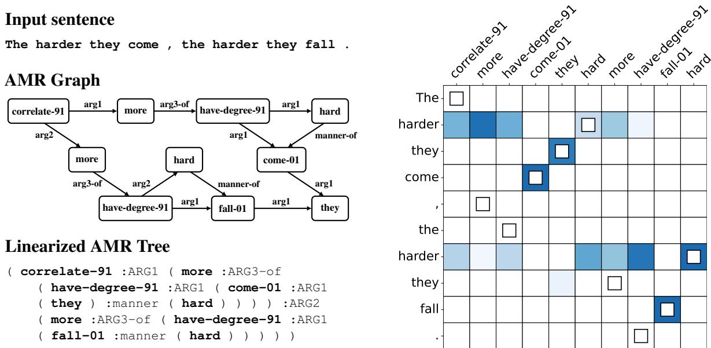

# Inducing and Using Alignments for Transition-based AMR Parsing

Andrew Drozdov† Jiawei Zhou‡ Radu Florian\_ Andrew McCallum† Tahira Naseem\_ Yoon Kim^ Ramon Fernandez Astudillo\_

†UMass Amherst CICS ‡Harvard University ^MIT CSAIL \_IBM Research

†{adrozdov,mccallum}@cs.umass.edu ‡jzhou02@g.harvard.edu

^yoonkim@mit.edu \_{raduf,tnaseem}@us.ibm.com \_ramon.astudillo@ibm.com

## Abstract

Transition-based parsers for Abstract Meaning Representation (AMR) rely on node-toword alignments. These alignments are learned separately from parser training and require a complex pipeline of rule-based components, pre-processing, and post-processing to satisfy domain-specific constraints. Parsers also train on a point-estimate of the alignment pipeline, neglecting the uncertainty due to the inherent ambiguity of alignment. In this work we explore two avenues for overcoming these limitations. First, we propose a neural aligner for AMR that learns node-to-word alignments without relying on complex pipelines. We subsequently explore a tighter integration of aligner and parser training by considering a distribution over oracle action sequences arising from aligner uncertainty. Empirical results show this approach leads to more accurate alignments and generalization better from the AMR2.0 to AMR3.0 corpora. We attain a new state-of the art for gold-only trained models, matching silver-trained performance without the need for beam search on AMR3.0.

## 1 Introduction

Abstract Meaning Representation (AMR) was introduced as an effort to unify various semantic tasks (entity-typing, co-reference, relation extraction, and so on; Banarescu et al., 2013). Of existing approaches for AMR parsing, transition-based parsing is particularly notable because it is high performing but still relies on node-to-word alignments as a core pre-processing step (Ballesteros and Al-Onaizan, 2017; Liu et al., 2018; Naseem et al., 2019; Fernandez Astudillo et al., 2020; Zhou et al., 2021a,b, inter alia). These alignments are not in the training data and must be learned separately via a complex pipeline of rule-based systems, pre-processing (e.g., lemmatization), and post-processing to satisfy domain-specific constraints. Such pipelines can fail to generalize well, propagating errors into training that reduce AMR performance in new domains (e.g., AMR3.0). This work studies how we can probabilistically induce and use alignments for transition-based AMR parsing in a domain-agnostic manner, ultimately replacing the existing heuristics-based pipeline.

To induce alignments, we propose a neural aligner which uses hard attention within a sequenceto-sequence model to learn latent alignments (Wu et al., 2018; Deng et al., 2018; Shankar et al., 2018). While straightforward, this neural parameterization makes it possible to easily incorporate pretrained features such as character-aware word embeddings from ELMo (Peters et al., 2018) and also relax some of the strong independence assumptions in classic count-based aligners such as IBM Model 1 (Brown et al., 1993). We find that the neural aligner meaningfully improves upon various baselines, including the existing domain-specific approach.

To use the neural aligner’s posterior distribution over alignments, we explore several methods. Our first approach simply uses the MAP alignment from the neural aligner to obtain a single oracle action sequence, which is used to train the AMR parser. However, this one-best alignment fails to take into account the inherent uncertainty associated with posterior alignments. Our second approach addresses this via posterior regularization to push the AMR parser’s (intractable) posterior alignment distribution to be close to the neural aligner’s (tractable) posterior distribution. We show that optimizing this posterior regularized objective results in a simple training scheme wherein the AMR parser is trained on oracle actions derived samples from the neural aligner’s posterior distribution. Our final approach uses the neural aligner not as a regularizer but as an importance sampling distribution, which can be used to better approximate samples from the AMR parser’s posterior alignment distribution, and thus better approximate the otherwise intractable log marginal likelihood.

In summary, we make the following empirical and methodological contributions:

• We show that our approach can simplify the existing pipeline and learn state-of-theart AMR parsers that perform well on both AMR2.0 and AMR3.0. Unlike other approaches, AMR parsers learned this way do not require beam search and hence are more efficient at test time.

• We explore different methods for inducing and using alignments. We show that a neural parameterization of the aligner is crucial for learning good alignments, and that using the neural aligner to regularize the AMR parser’s posterior is an effective strategy for transferring strong inductive biases from the (constrained) aligner to the (overly flexible) parser.

## 2 Background: Transition-based Parsing

## 2.1 General Approach for AMR

A standard and effective way to train AMR parsers is with sequence-to-sequence learning where the input sequence is the sentence � and the output sequence is the graph � decomposed into an action sequence � via an oracle. The combination of words and actions is provided to a parameter-less state machine � that produces the graph $g : = M ( w , a )$ The state machine can perform the oracle inverse operation � when also provided alignments �, mapping a graph to a deterministic sequence of oracle actions $a : = O ( l , w , g ) .$ 1 During training the model learns to map $w  a$ (these pairs are given by the oracle �), and � is used to construct graphs $( a  g )$ for evaluation.

## 2.2 StructBART

In this paper we use the oracle and state machine from StructBART (Zhou et al., 2021b), which is a simplified version of Zhou et al. (2021a). They rely on rules that determine which actions are valid (e.g. the first action can not be to generate an edge). The actions are the output space the parser predicts and when read from left-to-right are used to construct an AMR graph. In this case, the actions incorporate alignments.

Rules The following rules define the valid actions at each time step:

• Maintain a cursor that reads the sentence leftto-right, only progressing for SHIFT action.

• At each cursor position, generate any nodes aligned to the cursor’s word. (This is where node-word alignments are needed).

• Immediately after generating a node, also generate any valid incoming or outgoing arcs.

Actions At each time step perform one of the following actions to update the state or graph:

• SHIFT: Increment the cursor position.

$\mathrm { { N O D E } } ( y _ { v } ) { \mathrm { { ; } } }$ : Generate node with label $y _ { v }$

• COPY: Generate node by copying word under the cursor as the label.

$\mathrm { L A } \left( y _ { e } , n \right) , \mathrm { R A } \left( y _ { e } , n \right)$ : Generate an edge with label $y _ { e }$ from the most recently generated node to the previously generated node �. LA and RA (short for left-arc and right-arc) indicate the edge direction as outgoing/incoming. We use $y _ { e }$ to differentiate edge labels from node labels $y _ { v }$

• END: A special action indicating that the full graph has been generated.

Learning For parsing, StructBART fine-tunes BART (Lewis et al., 2020) with the following modifications: a) it converts one attention head from the BART decoder into a pointer network for predicting � in the LA/RA actions, b) logits for actions are masked to guarantee graph well-formedness, and c) alignment is used to mask two cross-attention heads of the BART decoder,2 thereby integrating structural alignment directly in the model.

StructBART is trained to optimize the maximum likelihood of action sequences given sentence and alignment. More formally, for a single example

$$
( w , g , l ) \sim \mathcal { D } , a : = O ( l , w , g ) ,
$$

the log-likelihood of the actions (and hence the graph) is given by,

$$
\log p ( a \mid w ; \theta ) = \sum _ { t = 1 } ^ { T } \log p ( a _ { t } \mid a _ { < t } , w ; \theta )
$$

for a model with parameters $\theta .$ . Probabilities of actions that create arcs are decomposed into independent label and pointer distributions

$$
\begin{array} { r } { p ( a _ { t } \mid a _ { < t } , w ; \theta ) = \qquad } \\ { p ( y _ { e } \mid a _ { < t } , w ; \theta ) p ( n \mid a _ { < t } , w ; \theta ) } \end{array}
$$

where $p ( y _ { e } \mid a _ { < t } , w : \theta )$ is computed with the normal output vocabulary distribution of BART and $p ( n \mid a _ { < t } , w ; \theta )$ with one attention head of the decoder. See Zhou et al. (2021b) for more details.

Alignment (SB-Align) For training, StructBART depends on node-to-word AMR alignments � to specify the oracle actions. In previous work, the alignments have been computed by a pipeline of components that we call SB-Align.

We introduce our neural approach in the next section, but first we cover the main steps in SB-Align: (1) produce initial alignments using Symmetrized Expectation Maximization (Pourdamghani et al., 2014); (2) attempt to align additional nodes by inheriting child node alignments; (3) continue to refine alignments using JAMR (Flanigan et al., 2014), which involves constraint optimization using a set of linguistically motivated rules.

The StructBART action space requires that all nodes are aligned, yet after running SB-Align some nodes are not. This is solved by first “force aligning” unaligned nodes to unaligned tokens, then propagating alignments from child-to-parent nodes and vice versa until 100% of nodes are aligned to text spans. Finally, node-to-span alignments are converted into node-to-token alignments for model training (e.g. by deterministically aligning to the first node of an entity). Specifics are described in StructBART and preceding work (Zhou et al., 2021b,a; Fernandez Astudillo et al., 2020).

## 3 Inducing Alignments

Here, we describe our neural alignment model, which is essentially a variant of sequence-tosequence models with hard attention (Yu et al., 2016a; Wu et al., 2018; Shankar et al., 2018; Deng et al., 2018). In contrast to SB-Align, our approach requires minimal pre-processing and does not have dependencies on many components or domain-specific rules.

The alignment model is trained separately from the AMR parser and optimizes the conditional likelihood of nodes in the linearized graph given the sentence.3 The AMR graph is linearized by first converting the graph to a tree,4 and then linearizing the tree via a depth-first search, as in Figure 1. Letting $v = v _ { 1 } , \ldots , v _ { S }$ be the nodes in the linearized AMR graph, the log-likelihood is given by

$$
\log q ( v \mid w ; \phi ) = \sum _ { s = 1 } ^ { S } \log q ( v _ { s } \mid v _ { < s } , w ; \phi ) ,
$$

where we abuse notation and use $v _ { < s }$ to indicate all the tokens (include brackets and edges) before $v _ { s } .$ . That is, we incur losses only on the nodes $v _ { s }$ but still represent the entire history $v _ { < s }$ for the prediction (see Figure 1, left). The probability of each node is given by marginalizing over latent alignments $l _ { s }$ ,

$$
\displaystyle q ( v _ { s } \mid v _ { < s } , w ; \phi ) = \sum _ { i = 1 } ^ { | w | } q ( l _ { s } = i \mid v _ { < s } , w , ; \phi ) \times
$$

where $l _ { s } = i$ indicates that node $v _ { s }$ is aligned to word $w _ { i }$ .

For parameterization, the sentence � is encoded by a bi-directional LSTM. Each word is represented using a word embedding derived from a pretrained character-encoder from ELMo (Peters et al., 2018), which is frozen during training. On the decoder side, the linearized AMR tree history is represented by a uni-directional LSTM. The decoder shares word embeddings with the text encoder. The prior alignment probability $q ( l _ { s } = i \mid v _ { < s } , w ; \phi )$ is given by bilinear attention (Luong et al., 2015),

$$
\begin{array} { c } { { q ( l _ { s } = i | v _ { < s } , w ; \phi ) = \displaystyle \frac { \exp ( \alpha _ { s , i } ) } { \sum _ { j = 1 } ^ { | w | } \exp ( \alpha _ { s , j } ) } , } } \\ { { \alpha _ { s , i } = h _ { s } ^ { ( v ) \top } W h _ { i } ^ { ( w ) } , } } \end{array}
$$

where � is a learned matrix, $h _ { i } ^ { ( w ) }$ is a concatenation of forward and backward LSTM vectors for the �-th word in the text encoder, and $h _ { t } ^ { ( v ) }$ is the vector immediately before the �-th node in the graph decoder. The likelihood $q ( v _ { s } \mid l _ { s } = i , v _ { < s } , w ; \phi )$ is formulated as a softmax layer with the relevant vectors concatenated as input,

$$
\begin{array} { r l } & { q ( v _ { s } = y \vert l _ { s } = i , v _ { < s } , w ; \phi ) = } \\ & { \qquad \mathrm { s o f t m a x } ( U [ h _ { s } ^ { ( y ) } ; h _ { i } ^ { ( w ) } ] + b ) [ y ] , } \end{array}
$$

  
Figure 1: (Left) An example of a sentence, its AMR graph, and the corresponding linearized AMR tree. The aligner decoder only incurs a loss for AMR nodes (tokens for nodes are in bold), although it represents the full history. (Right) A visualization of our alignment posterior (blue) and point estimate from the baseline (white box). The uncertainty corresponding to alignment ambiguity is helpful during sampling-based training.

where the softmax is over the node vocabulary and is indexed by the label � belonging to the node $v _ { s }$

Once trained, we can tractably obtain the posterior distribution over each alignment $l _ { s }$

$$
\begin{array} { l } { q ( l _ { s } = i \mid w , v ; \phi ) = } \\ { \frac { q ( l _ { s } = i \mid v _ { < s } , w , : \phi ) q ( v _ { s } \mid l _ { s } = i , v _ { < s } , w ; \phi ) } { q ( v _ { s } \mid v _ { < s } , w ; \phi ) } , } \end{array}
$$

and the full posterior distribution over all alignments $l = l _ { 1 } , \ldots , l _ { S }$ is given by

$$
q ( l \mid w , g ; \phi ) = \prod _ { s = 1 } ^ { S } q ( l _ { s } \mid w , v ; \phi ) .
$$

Discussion Compared to the classic count-based alignment models, the neural parameterization makes it easy to utilize pretrained embeddings and also condition on the alignment and emission distribution on richer context. For example, our emission distribution $q ( v _ { s } \mid l _ { s } , v _ { < s } , w : \phi )$ can condition on the full target history $v _ { < s }$ and the source context �, unlike count-based models which typically condition on just the aligned word $w _ { l _ { s } }$ . In our ablation experiments described in (§6) we find that the flexible modeling capabilities enabled by the use of neural networks are crucial for obtaining good alignment performance.

## 4 Using Alignments

The neural aligner described above induces a posterior distribution over alignments, $q ( l | w , g ; \phi )$

We explore several approaches using this alignment distribution.

MAP Alignment To use this alignment model in the most straightforward way, we decode the MAP alignment $\hat { l } = \arg \operatorname* { m a x } _ { l } \ i \ j ( l \mid w , g ; \phi )$ and train from the actions $\hat { a } = O ( \hat { l } , w , g )$

Posterior Regularization (PR) The action sequences derived from MAP alignments do not take into account the uncertainty associated with posterior alignments, which may not be ideal (Figure 1, right). We propose to take this uncertainty into account and regularize the AMR parser’s posterior to be close to the neural aligner’s posterior at the distributional level.

First, we note that the action oracle $O ( l , w , g )$ is bijective as a function of � (i.e., keeping � and � fixed), so the transition-based parser $p ( a \mid w ; \theta )$ induces a joint distribution over alignments and graphs,

$$
p ( \boldsymbol { l } , \boldsymbol { g } | \boldsymbol { w } ; \boldsymbol { \theta } ) \stackrel { \mathrm { d e f } } { = } p ( a = O ( \boldsymbol { l } , \boldsymbol { w } , \boldsymbol { g } ) | \boldsymbol { w } ; \boldsymbol { \theta } ) .
$$

This joint distribution further induces a marginal distribution over graphs,

$$
p ( g \mid w ; \theta ) = \sum _ { l } p ( l , g \mid w ; \theta ) ,
$$

as well as a posterior distribution over alignments,

$$
p ( l | w , g ; \theta ) = \frac { p ( l , g | w ; \theta ) } { p ( g | w ; \theta ) } .
$$

A simple way to use the neural aligner’s distribution, then, is via a posterior regularized likelihood (Ganchev et al., 2010),5

$$
\begin{array} { r } { \begin{array} { r l } & { \mathcal { L } _ { \mathrm { P R } } ( \theta ) = \log p ( g \mid w ; \theta ) - } \\ & { \qquad \mathrm { K L } [ q ( l \mid w , g ; \phi ) \parallel p ( l \mid w , g ; \theta ) ] . } \end{array} } \end{array}
$$

That is, we want to learn a parser that gives high likelihood to the gold graph � given the sentence � but at the same time has a posterior alignment distribution that is close to the neural aligner’s posterior. Rearranging some terms, we then have

$$
\begin{array} { r l } & { \mathcal { L } _ { \mathrm { P R } } ( \theta ) = \mathbb { E } _ { q ( l \mid w , g \mid \phi ) } \left[ \log p ( l , g \mid w \ ; \theta ) \right] + } \\ & { \quad \quad \quad \mathbb { H } [ q ( l \mid w , g \ ; \phi ) ] , } \end{array}
$$

and since the second term is a constant with respect to �, the gradient with respect to � is given by,

$$
\nabla _ { \boldsymbol { \theta } } \mathcal { L } _ { \mathrm { P R } } ( \boldsymbol { \theta } ) = \mathbb { E } _ { q ( l \mid w , g ; \boldsymbol { \phi } ) } \left[ \nabla _ { \boldsymbol { \theta } } \log p ( l , g \mid w ; \boldsymbol { \theta } ) \right] .
$$

Gradient-based optimization with Monte Carlo gradient estimators therefore results in an intuitive scheme where (1) we sample � alignments $l ^ { ( 1 ) } , \ldots , l ^ { ( K ) }$ from $q ( l | w , g ; \phi )$ (2) obtain the corresponding action sequences $a ^ { ( 1 ) } , \ldots , a ^ { ( K ) }$ from the oracle, and (3) optimize the loss with the Monte Carlo gradient estimator $\begin{array} { r } { \frac { 1 } { K } \sum _ { k = 1 } ^ { K } \nabla _ { \theta } \log p ( a ^ { ( k ) } | w , g ; \theta ) } \end{array}$

It is clear that the above generalizes the MAP alignment case. In particular, setting $q ( l \mid w , g ) =$ $\mathbb { 1 } \{ l ~ = ~ \hat { l } \}$ where $\hat { l }$ is the MAP alignment (or an alignment derived from the existing pipeline) recovers the existing baseline.

Importance Sampling (IS) The posterior regularized likelihood clearly lower bounds the log marginal likelihood $\mathcal { L } ( \theta ) = \log p ( g \mid w ; \theta ) , ^ { 6 }$ and implicitly assumes that training against the lower bound results in a model that generalizes better than a model trained against the true log marginal likelihood. In this section we instead take a variational perspective and use the neural aligner not as a regularizer, but as a surrogate posterior distribution whose samples can be reweighted to reduce the gap between the $\mathcal { L } ( \theta )$ and $\mathcal { L } _ { \mathrm { P R } } ( \theta )$

We first take the product of the neural aligner’s posterior to create a joint posterior distribution,

$$
q ( l ^ { ( 1 ) } , \ldots l ^ { ( K ) } ; \phi ) \stackrel { \mathrm { d e f } } { = } \prod _ { k = 1 } ^ { K } q ( l ^ { ( k ) } | w , g ; \phi ) ,
$$

where � is the number of importance samples. Then, Burda et al. (2016) show that the following objective,

$$
\mathbb { E } _ { q ( l ^ { ( 1 ) } , \dots l ^ { ( K ) } ; \phi ) } \left[ \log \frac { 1 } { K } \sum _ { k = 1 } ^ { K } \frac { p ( l ^ { ( k ) } , g \mid w ; \theta ) } { q ( l ^ { ( k ) } ) \mid w , g ; \phi ) } \right] ,
$$

motonotically converges to the log marginal likelihood log $p ( g \mid w ; \theta )$ as $K \  \ \infty$ . A singlesample7 Monte Carlo gradient estimator for the above is given by,

$$
\sum _ { k = 1 } ^ { K } w ^ { ( k ) } \nabla _ { \theta } \log p ( a ^ { ( k ) } | w , g ; \theta ) ,
$$

where

$$
w ^ { ( k ) } = \frac { p ( a ^ { ( k ) } \mid w \ ; \theta ) / q ( l ^ { ( k ) } \mid w , g ; \phi ) } { \sum _ { j = 1 } ^ { K } p ( a ^ { ( j ) } \mid w \ ; \theta ) / q ( l ^ { ( j ) } \mid w , g ; \phi ) }
$$

are the normalized importance weights (Mnih and Rezende, 2016). Thus, compared to the gradient estimator in the posterior regularized case which equally weights each sample, this importanceweighted objective approximates the true posterior $p ( l | w , g ; \theta )$ by first sampling from a fixed distribution $q ( l | w , g ; \phi )$ and then reweighting it accordingly.

Discussion Despite sharing formulation with the variational autoencoder (Kingma and Welling, 2013) and the importance weighted autoencoder (Burda et al., 2016), the approach proposed here differs in fundamental aspects. In contrast to the variational approaches we fix $q$ to the pretrained aligner posterior and do not optimize it further. Moreover, the lower bound $\mathcal { L } _ { \mathrm { P R } } ( \theta )$ represents an inductive bias informed by a pretrained aligner, which can be more suited for early stages of training than even a tangent evidence lower bound (zero gap). This is because, for a tangent lower bound, � in the Monte Carlo gradient estimate is equal to the true posterior over alignments for current model parameters. Since these parameters are poorly trained, it is easy for the aligner to provide a better alignment distribution for learning.

Posterior regularization seeks to transfer the neural aligner’s strong inductive biases to the AMR parser, which has weaker inductive biases and thus may be potentially too flexible of a model. On the other hand, importance sampling “trusts” the AMR parser’s inductive bias more, and uses the neural aligner as a surrogate distribution that is adapted to more closely approximate the AMR parser’s intractable posterior. Thus, if the posterior regularized variant outperforms the importance sampling variant, it suggests that the StructBART is indeed too flexible of a model. While not considered in the present work, it may be interesting to explore a hybrid approach which first trains with posterior regularization and then switches to importance sampling.

## 5 Experimental Setup

All code to run our experiments is available online8 with Apache License, 2.0.

## 5.1 Data, Preprocessing, and Evaluation

Data We evaluate our models on two datasets for AMR parsing in English. AMR2.0 contains \~39k sentences from multiple genres (LDC2017T10). AMR3.0 is a superset of AMR2.0 sentences with approx. 20k new sentences (LDC2020T02), improved annotations with new frames, annotation corrections, and expanded annotation guidelines. Using AMR3.0 for evaluation allows us to measure how well our alignment procedure generalizes to new datasets — AMR3.0 includes new sentences but also new genres such as text from LORELEI, Aesop fables, and Wikipedia.

The primary evaluation of the aligner is extrinsically through AMR parsing, and we additionally evaluate alignments directly against ground truth annotations provided in Blodgett and Schneider (2021)—specifically, we look at the 130 sentences from the AMR2.0 train data (the ones most well suited for SB-Align), which we call the gold test set. Alignment annotations are not used during aligner training and only used for evaluation.

Preprocessing We align text tokens to AMR nodes. As the AMR sentences do not include defacto tokenization, we split strings on space and punctuation using a few regex rules.

For AMR parsing we use the action set described in §2.2. To accommodate the recurrent nature of the aligner, we linearize the AMR graph during aligner training. This conversion requires converting the graph into a tree and removing re-entrant edges, as described in §3.

Evaluation For AMR parsing we use Smatch (Cai and Knight, 2013). For AMR alignment our goal is mainly to compare our new aligner with strong alignment baselines: SB-Align and LEAMR, a state-of-the-art alignment model (Blodgett and Schneider, 2021; Blodgett, 2021). However, our aligner predicts node-to-word alignments, SB-Align predicts node-to-span alignments, and the ground truth alignments are subgraph-to-span. To address this mismatch in granularity, we measure alignment performance using a permissive version of F1 after decomposing subgraph-to-span alignments into node-to-span alignments—a prediction is correct if it overlaps with the gold span. This permissiveness gives advantages the LEAMR and SB-Align baselines (which predict span-based alignments) as there is no precision-related penalty for predicting large spans.

## 5.2 Models and Training

Aligner We use a bi-directional LSTM for the Text Encoder and uni-directional LSTM for the AMR Decoder. The input token embeddings are derived from a pretrained character encoder (Peters et al., 2018) and frozen throughout training; these token embeddings are tied with the output softmax, allowing for alignment to tokens not seen during training. The alignment model is otherwise parameterized as described in §3. We train for 200 epochs. Training is unsupervised, so we simply use the final checkpoint.10 Additional training details for the aligner are in the Appendix.

AMR Parser We use the StructBART model from Zhou et al. (2021b) and the same hyperparameters: fine-tuning for 100 epochs (AMR2.0) or 120 (AMR3.0), and using Smatch on the validation set for early stopping. We did not tune the hyperparameters of the AMR parser at all as we wanted to see how well the neural aligner performed as a “plug-in” to an existing system. Additional implementation details for parsing are in the Appendix. For posterior regularization (PR) and importance sampling (IS) variants we use � = 5 samples to obtain the gradient estimators.

<table><tr><td>Method</td><td>Beam Size</td><td>Silver Data</td><td>AMR2.0</td><td>AMR3.0</td></tr><tr><td>APT (Zhou et al., 2021a)P TAMR (Xia et al., 2021)G SPRING (Bevilacqua et al., 2021)</td><td>10 8 5</td><td>70K 1.8M 200K</td><td>83.4 84.2 84.3</td><td>83.0</td></tr><tr><td>StructBART-S (Zhou et al., 2021b) StructBART-J (Zhou et al., 2021b) StructBART-J+MBSE (Lee et al., 2021) BARTAMR (Bai et al., 2022)</td><td>10 10 10 5</td><td>90K 90K 219K 200K</td><td> $8 4 . 7 \pm 0 . 1 $  85.7 ±0.0 85.4</td><td> $8 2 . 7 \pm 0 . 1 $   $8 2 . 6 \pm 0 . 1 $  84.1 ±0.1</td></tr><tr><td>APT (Zhou et al., 2021a)P</td><td>10</td><td></td><td>82.8</td><td>84.2 81.2</td></tr><tr><td>SPRING (Bevilacqua et al., 2021)</td><td>5</td><td></td><td>83.8</td><td>83.0</td></tr><tr><td>SPRING (Bevilacqua et al., 2021)G</td><td>5</td><td></td><td>84.5</td><td>80.2</td></tr><tr><td></td><td>10</td><td></td><td></td><td></td></tr><tr><td>StructBART-J (Zhou et al., 2021b)</td><td></td><td></td><td> $8 4 . 2 \pm 0 . 1 $ </td><td> $8 2 . 0 \pm 0 . 0 $ </td></tr><tr><td>StructBART-S (Zhou et al., 2021b)</td><td>10</td><td></td><td> $8 4 . 0 \pm 0 . 1 $ </td><td> $8 2 . 3 \pm 0 . 0 $ </td></tr><tr><td></td><td>1</td><td></td><td></td><td></td></tr><tr><td>StructBART-S (reproduced)</td><td></td><td></td><td> $8 3 . 9 \pm 0 . 0 $ </td><td> $8 1 . 9 \pm 0 . 2 $ </td></tr><tr><td>+neural-aligner (MAP)</td><td>1</td><td></td><td> $\overline { { 8 4 . 0 \pm 0 . 1 } }$ </td><td> $8 2 . 5 \pm 0 . 1 $ </td></tr><tr><td>+neural-aligner (MAP)</td><td>10</td><td></td><td> $8 4 . 1 \pm 0 . 0 $ </td><td> $8 2 . 7 \pm 0 . 1 $ </td></tr><tr><td></td><td>1</td><td></td><td></td><td></td></tr><tr><td>+neural-aligner (PR, w/ 5 samples)</td><td></td><td></td><td> $\mathbf { 8 4 . 3 \pm 0 . 0 }$ </td><td> ${ \bf 8 3 . 1 \pm 0 . 1 }$ </td></tr><tr><td></td><td></td><td></td><td> $8 4 . 2 \pm 0 . 1 $ </td><td></td></tr><tr><td>+neural-aligner (IS, w/ 5 samples)</td><td>1</td><td></td><td></td><td>82.8</td></tr></table>

Table 1: Results on parsing for AMR2.0 and 3.0 test sets. We report numbers when using single alignments (MAP), posterior regularization (PR), and importance sampling (IS). Also included are number of silver data training sentences used and beam size. PR and IS does not improve with beam search, and hence these numbers are omitted. �: Uses partial ensemble for decoder. �: Uses graph recategorization.  
affected by a lack of generalization.

## 6 Results and Analysis

The full results are shown in Table 1, where we find that our approach can learn state-of-the-art AMR parses for gold-only training and without requiring beam search. We now interpret the main results in more detail.

Pipeline Generalization SB-Align was developed prior to the AMR3.0 release, and because it incorporates a complex pipeline with domainspecific rules, one could argue it is specialized for prior datasets like AMR2.0. In Table 1 our aligner yields relatively stronger StructBART improvements for AMR3.0 than AMR2.0. This result and the relatively little manual configuration our aligner requires (e.g., no rules, lemmatization, etc.) suggest our alignment approach generalizes better to different training corpora and that prior peformance of StructBART on AMR3.0 may have been

Graph re-categorization (Zhang et al., $^ { 2 0 1 9 { \mathrm { a , b } } ) }$ is a commonly used technique in AMR parsing where groups of nodes are collapsed during training and test time, but expanded during evaluation. Results from (Bevilacqua et al., 2021) show recategorization may be harmful, but our results suggest a different perspective—re-categorization is partially a function of alignment-like heuristics and the lower re-categorization results of SPRING in AMR3.0 reinforce our findings that alignments based on heuristic are difficult to generalize.

Alignment Uncertainty vs. Data Augmentation We improve parsing performance by sampling 5 alignments per sentence in batch (see Table 1). One can argue that our approach simply exposes the model to more data, but we found that training on one-best alignments for longer did not improve results. When looking at our sampling results compared with previous versions of StructBART trained on silver data, we see that our approach even outperforms the benefit of the simpler versions of data augmentation, such as simple selflearning. This suggests that there is possible further improvement by combining both techniques, which we leave for future work.

<table><tr><td rowspan=1 colspan=1></td><td rowspan=1 colspan=1>AMR2.0</td></tr><tr><td rowspan=1 colspan=1>LEAMR (Blodgett and Schneider, 2021)SB-Align (Zhou et al., 2021b)Neural Aligner (ours)</td><td rowspan=1 colspan=1>97.489.296.5</td></tr><tr><td rowspan=2 colspan=1>IBM Model 1Neural Aligner w/o pretrained emb.Neural Aligner w/ pretrained emb.</td><td rowspan=1 colspan=1>77.279.8</td></tr><tr><td rowspan=1 colspan=1>96.5</td></tr></table>

Table 2: (Top) Alignments results using ground truth data from Blodgett and Schneider (2021), where we use the 130 sentences from the gold test set that are from the AMR2.0 train data. (Bottom) Alignment ablation results against the same test set using different alignment model variants. Note that as the ground truth alignment is at the span level, we report a permissive variant of F1 where a prediction is considered correct if it partially overlaps with the ground truth span. This advantages the LEAMR and SB-Align baselines as these can align to spans, whereas our aligners only align to words.

Posterior regularization vs. Importance sampling Training with posterior regularization or importance sampling uses the same number of samples, but in different ways. In posterior regularization, the samples are used to better approximate the posterior regularized objective, which in turn regularizes the AMR parser’s posterior more effectively by reducing the gradient estimator variance. In importance sampling, the samples are used to better approximate the AMR parser’s intractable log marginal likelihood. We find that importance sampling fails to improve upon posterior regularization for both AMR2.0 and AMR3.0, which indicates that strong inductive biases associated the constrained aligner is a useful training signal for the flexible AMR parser.

Comparing against alignment baselines Our neural alignment method is preferred over SB-Align for two primary reasons: it is relatively easy to use (makes use of word embeddings, depends on less preprocessing, does not require domainspecific rules, etc.) and empirically improves performance (see Table 1). Nonetheless, we conduct an intrinsic evaluation to assess the quality of the predicted alignments—it is desirable that our aligner actually provides accurate alignments.

To verify that improved parsing is due to better alignment, we compare against two strong alignment baselines (LEAMR and SB-Align) on an evaluation set of gold manually annotated alignments. In general, there are only a few hundred such annotations available, yet we aim to use these alignments on 10s or 100s of thousands sentences for AMR parsing. For this reason all the aligners are trained unsupervised with respect to alignment. The results in Table 2 (top) show our aligner is substantially better than SB-Align and nearly on-par with LEAMR, the current state of the art.

Aligner Parameterization We train the classic count-based IBM Model 1 (Brown et al., 1993) using expectation maximization. We next train our neural aligner without pretrained character-aware embeddings. Our neural aligner is different from the classic IBM model in that (1) it learns the prior alignment distribution, (2) the emission model conditions on the entire sentence � and the target history $v _ { < s }$ . Finally, adding pretrained embeddings to this model recovers our full model. The results in Table 2 (bottom) indicate that both flexibility and token representation are required to outperform IBM Model 1. Training with word vectors learned from scratch only provides a small benefit, and the best performance is from using pretrained character embeddings, which yields nearly 20 point improvement in our permissive F1 metric.

## 7 Related Work

Oracles for parsing Dynamic oracles in syntactic parsing (Goldberg and Nivre, 2012; Ballesteros et al., 2016, inter-alia) enable oracles to recover from imperfect sequences. Oracles with random exploration in transition-based AMR parsers have been previously explored using imitation-learning (Goodman et al., 2016), reinforcement learning (Naseem et al., 2019) and oracle mining (Lee et al., 2020). In addition to this, Liu et al. (2018) produces multiple alignments via their rule-based system and selects the best based on parser performance. Compared to our proposed posterior regularization training, dynamic oracle works exploit specific linguistic properties of syntactic trees not directly transferable to AMR graphs. Prior work on random exploration and AMR selects oracles based on the Smatch. Our work uses the action space and oracle from StructBART (Zhou et al., 2021b,a), which requires every node to be aligned to a word so that the AMR graph is fully recoverable. We expose the parser to uncertainty by sampling alignment, which does not require computing the Smatch metric. Rather, the aligner is trained separately from the parser using pairs of sentences and their respective AMR graphs.

Neural Alignments The neural aligner we use is closely related to sequence-to-sequence models with hard (i.e., latent variable) attention (Xu et al., 2015; Ba et al., 2015; Wu et al., 2018; Shankar et al., 2018; Deng et al., 2018; Shankar and Sarawagi, 2019, inter alia) and other works on marginalizing over monotonic alignments (Yu et al., 2016b; Raffel et al., 2017; Wu and Cotterell, 2019). In these works, the main goal is to obtain better sequence-to-sequence models, and the actual posterior distribution over alignments is a byproduct (rather than the goal) of learning. However, there are also works that utilize contemporary neural parameterizations and explicitly target alignments as the primary goal (Zenkel et al., 2020; Ho and Yvon, 2020; Chen et al., 2021). Prior work on integrating pretrained aligners with sequence-to-sequence models has generally used the alignments to supervise the intermediate soft attention layers (Liu et al., 2016; Cohn et al., 2016; Yin et al., 2021), in contrast to the present work which formally treats alignments as latent variables.

Alignments in AMR Parsing There is extensive work aligning AMR nodes to sentences. The StructBART model (Zhou et al., 2021b) considered here, previously made use of well established rulebased and statistical AMR aligners (Flanigan et al., 2014; Pourdamghani et al., 2014) trained with expectation maximization and additional heuristics (Naseem et al., 2019; Fernandez Astudillo et al., 2020) that we call SB-Align. Our aligner compares favorably against SB-Align in alignment metrics and downstream parsing performance. The predicted alignments we use come close to Blodgett and Schneider (2021) measured on gold alignment annotations, despite our method leveraging less domain-specific components. Lyu and Titov (2018) and Lyu et al. (2021) incorporate differentiable relaxations of alignments for AMR parsing.

Posterior Regularization for Parsing and Generation Li et al. (2019) apply variational inference and posterior regularization for unsupervised dependency parsing using their transition-based system. Their approach predates large pretrained language models for which the use of structure may play a different role. Li and Rush (2020) use posterior regularization to incorporate weakly supervised alignment constraints for data-to-text generation, also without pretrained neural representations in mind.

## 8 Conclusion

In this work we propose a general-purpose neural AMR aligner, which does not use a complex alignment pipeline and generalizes well across domains. The neural parameterization allows the aligner to fully condition on the source and target context and easily incorporates pretrained embeddings, leading to improved performance. Simply using our aligner to produce training data for a state-of-theart transition-based parser leads to improved results.

We additionally propose a learning procedure using posterior regularization and importance sampling that involves sampling different action sequences during training. These incorporate alignment uncertainty and further improve parser performance. Our results on gold-only AMR training (i.e., without silver data) show that parsers learned this way match the performance of the prior stateof-the-art parsers without requiring beam search at test time.

## Acknowledgements

We are grateful to our colleagues for their help and advice, and to the anonymous reviewers at ACL Rolling Review for their feedback on drafts of this work. We also thank Nathan Schneider and Austin Blodgett for sharing the gold alignment data. AD and AM were supported in part by the Center for Intelligent Information Retrieval and the Center for Data Science; in part by the IBM Research AI through the AI Horizons Network; in part by the Chan Zuckerberg Initiative under the project Scientific Knowledge Base Construction; in part by the National Science Foundation (NSF) grant numbers IIS-1922090, IIS-1955567, and IIS-1763618; in part by the Defense Advanced Research Projects Agency (DARPA) via Contract No. FA8750-17-C-0106 under Subaward No. 89341790 from the University of Southern California; and in part by the Office of Naval Research (ONR) via Contract No. N660011924032 under Subaward No. 123875727 from the University of Southern California. YK was supported in part by a MIT-IBM Watson AI grant. Any opinions, findings and conclusions or recommendations expressed in this material are those of the authors and do not necessarily reflect those of the sponsor.

## Ethical Considerations

We do not foresee specific risks associated with our exploration of alignment for AMR parsing. That being said, there are nuances to our results that future researchers may take into considerations. For instance, our experiments are only for English data in the genres covered by AMR2.0 and AMR3.0. It is not clear how our results translate to other domains (e.g. biomedical text) or other languages. Nonetheless, we are hopeful that are methods would transfer favorably because they are intentionally designed to be easy to use and general purpose.

## References

Jimmy Ba, Ruslan R Salakhutdinov, Roger B Grosse, and Brendan J Frey. 2015. Learning Wake-Sleep Recurrent Attention Models. In Proceedings of NeurIPS.

Xuefeng Bai, Yulong Chen, and Yue Zhang. 2022. Graph pre-training for AMR parsing and generation. In Proceedings of the 60th Annual Meeting of the Associationfor Computational Linguistics (Volume 1: Long Papers).

Miguel Ballesteros and Yaser Al-Onaizan. 2017. AMR parsing using stack-LSTMs. In Proceedings of the 2017 Conference on Empirical Methods in Natural Language Processing, pages 1269–1275, Copenhagen, Denmark. Association for Computational Linguistics.

Miguel Ballesteros, Yoav Goldberg, Chris Dyer, and Noah A. Smith. 2016. Training with exploration improves a greedy stack LSTM parser. In Proceedings of the 2016 Conference on Empirical Methods in Natural Language Processing, pages 2005–2010, Austin, Texas. Association for Computational Linguistics.

Laura Banarescu, Claire Bonial, Shu Cai, Madalina Georgescu, Kira Griffitt, Ulf Hermjakob, Kevin Knight, Philipp Koehn, Martha Palmer, and Nathan Schneider. 2013. Abstract Meaning Representation for sembanking. In Proceedings of the 7th Linguistic Annotation Workshop and Interoperability with Discourse, pages 178–186, Sofia, Bulgaria. Association for Computational Linguistics.

Michele Bevilacqua, Rexhina Blloshmi, and Roberto Navigli. 2021. One spring to rule them both: Symmetric amr semantic parsing and generation without a complex pipeline. Proceedings ofthe AAAI Conference on Artificial Intelligence, 35(14):12564–12573.

Austin Blodgett. 2021. Linguistic Interpretability and Composition ofAbstract Meaning Representations. Ph.D. thesis, Georgetown University.

Austin Blodgett and Nathan Schneider. 2021. Probabilistic, structure-aware algorithms for improved

variety, accuracy, and coverage of AMR alignments. In Proceedings of the 59th Annual Meeting of the Association for Computational Linguistics and the 11th International Joint Conference on Natural Language Processing (Volume 1: Long Papers), pages 3310–3321, Online. Association for Computational Linguistics.

Peter F Brown, Stephen A Della Pietra, Vincent J Della Pietra, and Robert L Mercer. 1993. The mathematics of statistical machine translation: Parameter estimation. Computational linguistics, 19(2):263– 311.

Yuri Burda, Roger Grosse, and Ruslan Salakhutdinov. 2016. Importance weighted autoencoders. In ICLR.

Shu Cai and Kevin Knight. 2013. Smatch: an evaluation metric for semantic feature structures. In Proceedings of the 51st Annual Meeting of the Association for Computational Linguistics (Volume 2: Short Papers), pages 748–752, Sofia, Bulgaria. Association for Computational Linguistics.

Chi Chen, Maosong Sun, and Yang Liu. 2021. Maskalign: Self-supervised neural word alignment. In Proceedings of the 59th Annual Meeting of the Associationfor Computational Linguistics and the 11th International Joint Conference on Natural Language Processing (Volume 1: Long Papers), pages 4781– 4791, Online. Association for Computational Linguistics.

Trevor Cohn, Cong Duy Vu Hoang, Ekaterina Vymolova, Kaisheng Yao, Chris Dyer, and Gholamreza Haffari. 2016. Incorporating structural alignment biases into an attentional neural translation model. In Proceedings ofthe 2016 Conference ofthe North American Chapter ofthe Association for Computational Linguistics: Human Language Technologies, pages 876–885, San Diego, California. Association for Computational Linguistics.

Yuntian Deng, Yoon Kim, Justin Chiu, Demi Guo, and Alexander M. Rush. 2018. Latent Alignment and Variational Attention. In Proceedings ofNeurIPS.

Ramón Fernandez Astudillo, Miguel Ballesteros, Tahira Naseem, Austin Blodgett, and Radu Florian. 2020. Transition-based parsing with stack-transformers. In Findings of the Association for Computational Linguistics: EMNLP 2020, pages 1001–1007, Online. Association for Computational Linguistics.

Jeffrey Flanigan, Sam Thomson, Jaime Carbonell, Chris Dyer, and Noah A. Smith. 2014. A discriminative graph-based parser for the Abstract Meaning Representation. In Proceedings ofthe 52nd Annual Meeting ofthe Associationfor Computational Linguistics (Volume 1: Long Papers), pages 1426–1436, Baltimore, Maryland. Association for Computational Linguistics.

Kuzman Ganchev, João Graça, Jennifer Gillenwater, and Ben Taskar. 2010. Posterior Regularization for

Structured Latent Variable Models. Journal ofMachine Learning Research, 11:2001–2049.

Yoav Goldberg and Joakim Nivre. 2012. A dynamic oracle for arc-eager dependency parsing. In Proceedings of COLING 2012, pages 959–976, Mumbai, India. The COLING 2012 Organizing Committee.

James Goodman, Andreas Vlachos, and Jason Naradowsky. 2016. Noise reduction and targeted exploration in imitation learning for Abstract Meaning Representation parsing. In Proceedings ofthe 54th Annual Meeting ofthe Associationfor Computational Linguistics (Volume 1: Long Papers), pages 1–11, Berlin, Germany. Association for Computational Linguistics.

Anh Khoa Ngo Ho and François Yvon. 2020. Neural Baselines for Word Alignment. In The 16th International Workshop on Spoken Language Translation.

Diederik P Kingma and Max Welling. 2013. Autoencoding variational bayes. arXiv preprint arXiv:1312.6114.

Young-Suk Lee, Ramon Fernandez Astudillo, Thanh Lam Hoang, Tahira Naseem, Radu Florian, and Salim Roukos. 2021. Maximum bayes smatch ensemble distillation for amr parsing. arXiv preprint arXiv:2112.07790.

Young-Suk Lee, Ramón Fernandez Astudillo, Tahira Naseem, Revanth Gangi Reddy, Radu Florian, and Salim Roukos. 2020. Pushing the limits of AMR parsing with self-learning. In Findings of the Associationfor Computational Linguistics: EMNLP 2020, pages 3208–3214, Online. Association for Computational Linguistics.

Mike Lewis, Yinhan Liu, Naman Goyal, Marjan Ghazvininejad, Abdelrahman Mohamed, Omer Levy, Veselin Stoyanov, and Luke Zettlemoyer. 2020. BART: Denoising sequence-to-sequence pre-training for natural language generation, translation, and comprehension. In Proceedings of the 58th Annual Meeting of the Association for Computational Linguistics, pages 7871–7880, Online. Association for Computational Linguistics.

Bowen Li, Jianpeng Cheng, Yang Liu, and Frank Keller. 2019. Dependency grammar induction with a neural variational transition-based parser. In Proceedings of the AAAI Conference on Artificial Intelligence.

Xiang Lisa Li and Alexander Rush. 2020. Posterior control of blackbox generation. In Proceedings of the 58th Annual Meeting of the Association for Computational Linguistics, pages 2731–2743, Online. Association for Computational Linguistics.

Lemao Liu, Masao Utiyama, Andrew Finch, and Eiichiro Sumita. 2016. Neural machine translation with supervised attention. In Proceedings of COLING 2016, the 26th International Conference on Computational Linguistics: Technical Papers, pages 3093– 3102, Osaka, Japan. The COLING 2016 Organizing Committee.

Yijia Liu, Wanxiang Che, Bo Zheng, Bing Qin, and Ting Liu. 2018. An AMR aligner tuned by transitionbased parser. In Proceedings ofthe 2018 Conference on Empirical Methods in Natural Language Processing, pages 2422–2430, Brussels, Belgium. Association for Computational Linguistics.

Thang Luong, Hieu Pham, and Christopher D. Manning. 2015. Effective approaches to attention-based neural machine translation. In Proceedings ofthe 2015 Conference on Empirical Methods in Natural Language Processing, pages 1412–1421, Lisbon, Portugal. Association for Computational Linguistics.

Chunchuan Lyu, Shay B. Cohen, and Ivan Titov. 2021. A differentiable relaxation of graph segmentation and alignment for AMR parsing. In Proceedings of the 2021 Conference on Empirical Methods in Natural Language Processing, pages 9075–9091, Online and Punta Cana, Dominican Republic. Association for Computational Linguistics.

Chunchuan Lyu and Ivan Titov. 2018. AMR parsing as graph prediction with latent alignment. In Proceedings of the 56th Annual Meeting of the Association for Computational Linguistics (Volume 1: Long Papers), pages 397–407, Melbourne, Australia. Association for Computational Linguistics.

Andriy Mnih and Danilo Jimenez Rezende. 2016. Variational inference for monte carlo objectives. In Proceedings ofICML.

Tahira Naseem, Abhishek Shah, Hui Wan, Radu Florian, Salim Roukos, and Miguel Ballesteros. 2019. Rewarding Smatch: Transition-based AMR parsing with reinforcement learning. In Proceedings of the 57th Annual Meeting of the Association for Computational Linguistics, pages 4586–4592, Florence, Italy. Association for Computational Linguistics.

Matthew E. Peters, Mark Neumann, Mohit Iyyer, Matt Gardner, Christopher Clark, Kenton Lee, and Luke Zettlemoyer. 2018. Deep contextualized word representations. In Proceedings of the 2018 Conference of the North American Chapter ofthe Associationfor Computational Linguistics: Human Language Technologies, Volume 1 (Long Papers), pages 2227–2237, New Orleans, Louisiana. Association for Computational Linguistics.

Nima Pourdamghani, Yang Gao, Ulf Hermjakob, and Kevin Knight. 2014. Aligning English strings with Abstract Meaning Representation graphs. In Proceedings of the 2014 Conference on Empirical Methods in Natural Language Processing (EMNLP), pages 425–429, Doha, Qatar. Association for Computational Linguistics.

Colin Raffel, Minh-Thang Luong, Peter J. Liu, Ron J. Weiss, and Douglas Eck. 2017. Online and lineartime attention by enforcing monotonic alignments. In Proceedings of the 34th International Conference on Machine Learning, volume 70 of Proceedings of Machine Learning Research, pages 2837–2846. PMLR.

Shiv Shankar, Siddhant Garg, and Sunita Sarawagi. 2018. Surprisingly Easy Hard-Attention for Sequence to Sequence Learning. In Proceedings of the 2018 Conference on Empirical Methods in Natural Language Processing, pages 640–645, Brussels, Belgium. Association for Computational Linguistics.

Shiv Shankar and Sunita Sarawagi. 2019. Posterior attention models for sequence to sequence learning. In Proceedings ofICLR.

Stephanie Strassel and Jennifer Tracey. 2016. LORELEI language packs: Data, tools, and resources for technology development in low resource languages. In Proceedings ofthe Tenth International Conference on Language Resources and Evaluation (LREC’16), pages 3273–3280, Portorož, Slovenia. European Language Resources Association (ELRA).

Shijie Wu and Ryan Cotterell. 2019. Exact hard monotonic attention for character-level transduction. In Proceedings of the 57th Annual Meeting of the Association for Computational Linguistics, pages 1530– 1537, Florence, Italy. Association for Computational Linguistics.

Shijie Wu, Pamela Shapiro, and Ryan Cotterell. 2018. Hard non-monotonic attention for character-level transduction. In Proceedings of the 2018 Conference on Empirical Methods in Natural Language Processing, pages 4425–4438, Brussels, Belgium. Association for Computational Linguistics.

Qingrong Xia, Zhenghua Li, Rui Wang, and Min Zhang. 2021. Stacked AMR parsing with silver data. In Findings of the Association for Computational Linguistics: EMNLP 2021, pages 4729–4738, Punta Cana, Dominican Republic. Association for Computational Linguistics.

Kelvin Xu, Jimmy Ba, Ryan Kiros, Kyunghyun Cho, Aaron Courville, Ruslan Salakhudinov, Rich Zemel, and Yoshua Bengio. 2015. Show, Attend and Tell: Neural Image Caption Generation with Visual Attention. In Proceedings of ICML.

Pengcheng Yin, Hao Fang, Graham Neubig, Adam Pauls, Emmanouil Antonios Platanios, Yu Su, Sam Thomson, and Jacob Andreas. 2021. Compositional Generalization for Neural Semantic Parsing via Span-level Supervised Attention. In Proceedings ofNAACL.

Lei Yu, Jan Buys, and Phil Blunsom. 2016a. Online segment to segment neural transduction. In Proceedings of the 2016 Conference on Empirical Methods in Natural Language Processing, pages 1307–1316, Austin, Texas. Association for Computational Linguistics.

Lei Yu, Jan Buys, and Phil Blunsom. 2016b. Online Segment to Segment Neural Transduction. In Proceedings ofEMNLP.

Thomas Zenkel, Joern Wuebker, and John DeNero. 2020. End-to-End Neural Word Alignment Outperforms GIZA++. In Proceedings ofACL.

Sheng Zhang, Xutai Ma, Kevin Duh, and Benjamin Van Durme. 2019a. AMR parsing as sequence-tograph transduction. In Proceedings of the 57th Annual Meeting of the Association for Computational Linguistics, pages 80–94, Florence, Italy. Association for Computational Linguistics.

Sheng Zhang, Xutai Ma, Kevin Duh, and Benjamin Van Durme. 2019b. Broad-coverage semantic parsing as transduction. In Proceedings ofthe 2019 Conference on Empirical Methods in Natural Language Processing and the 9th International Joint Conference on Natural Language Processing (EMNLP-IJCNLP), pages 3786–3798, Hong Kong, China. Association for Computational Linguistics.

Jiawei Zhou, Tahira Naseem, Ramón Fernandez Astudillo, and Radu Florian. 2021a. AMR parsing with action-pointer transformer. In Proceedings of the 2021 Conference ofthe North American Chapter of the Association for Computational Linguistics: Human Language Technologies, pages 5585–5598, Online. Association for Computational Linguistics.

Jiawei Zhou, Tahira Naseem, Ramón Fernandez Astudillo, Young-Suk Lee, Radu Florian, and Salim Roukos. 2021b. Structure-aware fine-tuning of sequence-to-sequence transformers for transitionbased AMR parsing. In Proceedings of the 2021 Conference on Empirical Methods in Natural Language Processing, pages 6279–6290, Online and Punta Cana, Dominican Republic. Association for Computational Linguistics.

## A StructBART Implementation Details

Inference in a transition-based parser corresponds to the usual decoding of with a sequence to sequence model

$$
\hat { a } = \arg \operatorname* { m a x } _ { a } \{ p ( a \mid w ) \}
$$

to obtain the graph $\hat { g } = M ( \hat { a } , w )$ . The model $p ( a \mid w )$ is nowadays parametrized with a neural network. The state machine $M ( a , w )$ is defined by

• the position of a cursor $k \in [ | w | ] = 1 \cdot \cdot \cdot | w |$ moving left to right over �

• a stack of nodes of � that is initially empty

• the partial graph of $g$

Furthermore, each action is decoupled into normal and pointer actions $a _ { t } = \left( b _ { t } , r _ { t } \right)$ with

$$
\begin{array} { r } { p ( a _ { t } \mid a _ { < t } , w ; \theta ) = \qquad } \\ { p ( r _ { t } \mid b _ { t } , a _ { < t } , w ; \theta ) p ( b _ { t } \mid a _ { < t } , w ; \theta ) } \end{array}
$$

where

$$
\begin{array} { r } { p ( b _ { t } \mid a _ { < t } , w ; \theta ) = \qquad } \\ { \mathrm { s o f t m a x } ( \mathbf { N N } _ { \theta } ( a _ { < t } , w ) + m ( a _ { < t } , w ) ) _ { b _ { t } } } \end{array}
$$

where $\mathbf { N N } _ { \theta } ( a _ { < t } , w ) \in \mathbb { R } ^ { | V _ { b } | }$ are the logits coming from a neural network model and $m ( a _ { < t } , w ) \in$ $\{ - \infty , 0 \} ^ { V _ { b } }$ is a mask forbidding invalid state machine actions e.g. shifting at sentence end. This mask is deterministically computed given the machine state. $V _ { b }$ is the vocabulary of normal actions (all actions minus pointer information). The pointer network is given by

$$
\begin{array} { r } { p ( r _ { t } \mid b _ { t } , a _ { < t } , w ; \theta ) = \qquad } \\ { \mathrm { s o f t m a x } ( \mathrm { D S A } _ { \theta } ( a _ { < t } , w ) + m 2 ( a _ { < t } , w ) ) _ { b _ { t } } ) } \end{array}
$$

for $b _ { t }$ executing arc LA/RA actions and 1 otherwise. The network $\mathrm { D S A } _ { \theta } ( a _ { < t } , w ) \in \mathbb { R } ^ { | a _ { < t } | }$ is the decoder’s self-attention encoding of action history $a _ { < t }$ (last layer). The mask �2 prevents pointing to any action that is not a node generating action, or has been reduced.

## B Parser Training Details

Training with argmax alignments takes approximately 12 hours on a single GPU (2080ti), and longer when sampling alignments proportional to the number of samples. When training with samples, we use gradient accumulation to avoid out of memory problems. We choose accumulation steps roughly proportional to number of samples. Otherwise, training hyperparameters exactly match those from Zhou et al. (2021b).

## C Aligner Implementation Details

Comment on sequence length. The alignment model in Wu et al. (2018) demonstrates strong results for character-level translation, which involves translating a single word from one language to another character-by-character. They state the following in reference to their alignment model: the exact marginalization scheme is practically unworkable for machine translation. As a point of reference, we looked at the inflection dataset — in any of the training splits across the 51 languages, 99% of the sequences are less than 29 tokens long, 90% are less than 23 tokens, and 50% are less than 15. In contrast, sentence lengths for AMR3.0 are often considerably longer — the 99/90/50 percentiles for sentence token lengths are 62/35/15 and the AMR token lengths are 45/26/11. Nonetheless, we found their results encouraging and our implementation of the alignment model to still be fast enough despite our using longer sequences.11

## D Aligner Training Details

We use single layer LSTMs with size 200 hidden dimension, dropout 0.1, learning rate 0.0001, and train with the Adam Optimizer. We use batch size 32 and accumulate gradient over 4 steps (for an effective batch size of 128). For 200 epochs, training takes approximately 1-day on a single GPU (2080ti). We train a new aligner for each parsing experiment. In Table 2 we report alignment results from our highest Smatch parsing experiment.

## E Alternative text for Figure 1

Shown are the baseline’s point estimate alignment and our aligner’s alignment posterior. There are instances of ambiguity where our alignment distribution is preferred to the point estimate.