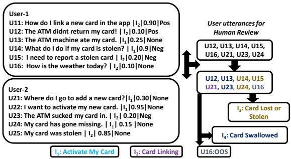
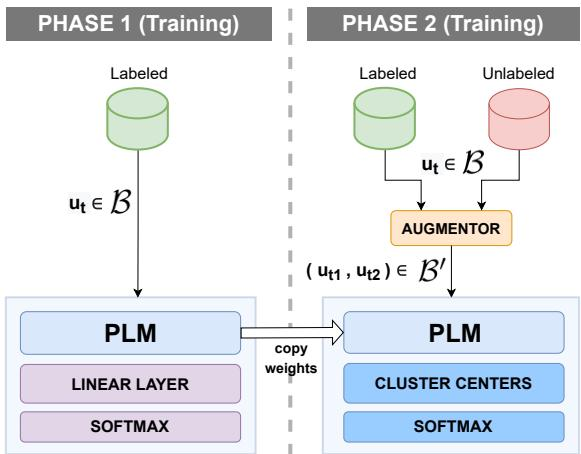
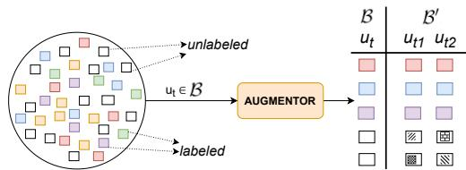
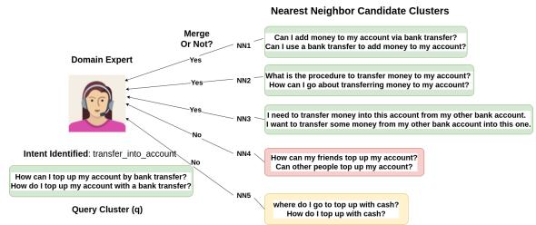
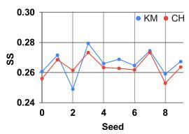
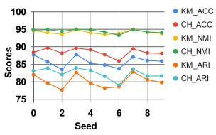
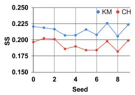
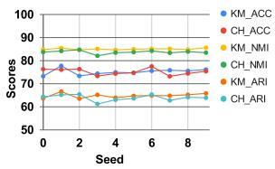
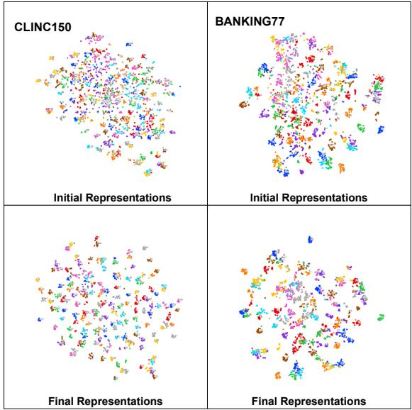
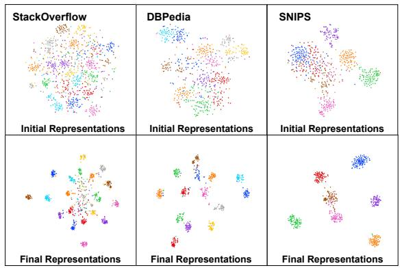

# Intent Detection and Discovery from User Logs via Deep Semi-Supervised Contrastive Clustering

Rajat Kumar, Mayur Patidar, Vaibhav Varshney, Lovekesh Vig, Gautam Shroff TCS Research, New Delhi, India

{k.rajat2, patidar.mayur, varshney.v, lovekesh.vig, gautam.shroff}@tcs.com

## Abstract

Intent Detection is a crucial component of Dia logue Systems wherein the objective is to clas sify a user utterance into one of the multiple pre-defined intents. A pre-requisite for devel oping an effective intent identifier is a training dataset labeled with all possible user intents. However, even skilled domain experts are often unable to foresee all possible user intents at de sign time and for practical applications, novel intents may have to be inferred incrementally on-the-fly from user utterances. Therefore, for any real-world dialogue system, the number of intents increases over time and new intents have to be discovered by analyzing the utter ances outside the existing set of intents. In this paper, our objective is to i) detect known intent utterances from a large number of unlabeled utterance samples given a few labeled samples and ii) discover new unknown intents from the remaining unlabeled samples. Existing SOTA approaches address this problem via alternate representation learning and clustering wherein pseudo labels are used for updating the repre sentations and clustering is used for generating the pseudo labels. Unlike existing approaches that rely on epoch-wise cluster alignment, we propose an end-to-end deep contrastive clus tering algorithm that jointly updates model pa rameters and cluster centers via supervised and self-supervised learning and optimally utilizes both labeled and unlabeled data. Our proposed approach outperforms competitive baselines on five public datasets for both settings: (i) where the number of undiscovered intents is known in advance, and (ii) where the number of intents is estimated by an algorithm. We also propose a human-in-the-loop variant of our approach for practical deployment which does not require an estimate of new intents and outperforms the end-to-end approach.

## 1 Introduction

Modern dialogue systems (Louvan and Magnini, 2020) are increasingly reliant on intent detection to classify a user utterance into one of the multiple known user intents. Intent detection is typically modeled as a multi-class classification problem where labeled data comprising of utterances for each known intent is manually created by domain experts. However, most real-world applications have to cope with evolving user needs and new functionality is routinely introduced into the dialogue system resulting in a continuously increasing number of intents over time. Even for seasoned domain experts estimating future user requirements at design time is challenging and these often have to be discovered from recent user logs which contain information corresponding to past user utterances, model response (i.e., predicted intent), implicit (confidence or softmax probability), and explicit (user clicks on a thumbs up or thumbs down icon) feedback as shown in Fig 1. The intent detection model presented in Fig. 1 is trained on two initial intents $( I _ { 1 } , I _ { 2 } )$ from the banking domain using labeled data created by domain experts. Filtered user logs containing implicit and explicit feedback were shared with domain experts, who, discovered two new intents $( I _ { 3 } , I _ { 4 } )$ and mapped the filtered utterances to these new intents. Additionally, experts also have to identify and discard utterances that are outside the domain of the dialog system.

  
Figure 1: An instance of user logs, where the intent detection model is trained on two known intents, i.e., $i _ { 1 }$ and i . After manual analysis of user logs a human reviewer has discovered two new intents $i _ { 3 }$ and $i _ { 4 }$ and assigned utterance u21 to an existing intent, i.e., $i _ { 2 }$

The remaining user logs are the primary source of evolving user needs and the process of identifying utterances belonging to “new intents”/“unknown intents” from user logs is referred to as Intent Discovery/Intent Mining (Chatterjee and Sengupta, 2020; Zhang et al., 2021b). However, manually monitoring user logs is not scalable and our objective in this paper is to present novel SOTA techniques to perform automated and semi-automated intent detection and discovery over user logs given only a few labeled utterances from known intents in addition to unlabeled utterances from both known and unknown intents.

Several classical (MacQueen, 1967; Chidananda Gowda and Krishna, 1978; Ester et al., 1996) and deep learning (Xie et al., 2016a; Zhang et al., 2021a) based clustering methods have been used for intent discovery. Chatterjee and Sengupta (2020) modeled intent discovery from unlabeled utterances as an unsupervised clustering problem and proposed a variant of DBSCAN (Ester et al., 1996) for clustering but do not employ any representation learning and rely heavily on manual evaluation. Zhang et al. (2021a) use a contrastive learning (Chen et al., 2020) based unsupervised approach for joint representation learning and clustering where performance largely depends on the quality of an auxiliary target distribution (Xie et al., 2016a). Lin et al. (2020) and Zhang et al. (2021c) model intent detection and discovery as a semi-supervised learning problem where the objective is to detect known intents and discover new intents given 1) a few la beled utterances from known intents along with 2) unlabeled utterances from known and new intents. This is similar to our problem of intent detection and discovery from user logs. Deep-Aligned (Zhang et al., 2021c) is the current SOTA approach for intent detection and discovery alternately performing representation learning and clustering by utilizing pseudo-labeled data obtained from clus tering for representation learning. Deep-Aligned uses k-means (MacQueen, 1967) as the clustering algorithm of choice and updates a BERT (Devlin et al., 2019) backbone’s parameters in the process. As k-means may assign different cluster ids to the same set of data points over different iterations the authors propose an alignment algorithm to align clusters obtained in consecutive epochs. Thus, an incorrect cluster alignment over epochs may lead to a significant drop in clustering accuracy. Additionally, they make the unrealistic assumption of a uniform distribution over intents to estimate the number of intents.

In this paper, we propose a novel end-toend Deep Semi-Supervised Contrastive Clustering (DSSCC-E2E) algorithm for intent detection and discovery from user logs. DSSCC-E2E is motivated by recent advances in self-supervised (Chen et al., 2020; Wu et al., 2020; Li et al., 2021) and supervised contrastive learning (Khosla et al., 2020; Gunel et al., 2021) applied to Computer vision and natural language processing. We model intent detection and discovery as a form of semi-supervised contrastive clustering wherein we jointly update backbone representations and cluster centers by minimizing the distance between the distribution over clusters of similar utterances and maximizing the same for dissimilar utterances via a semisupervised variant of supervised contrastive (Sup-Con) loss(Khosla et al., 2020). For contrastive learning, we use the contextual augmenter (Ma, 2019) to create pairs of augmentations (positive pairs/ similar utterances) corresponding to each unlabeled utterance from known and unknown intents. For labeled utterances, we use pairs of utterances with the same intent to create positive pairs. To improve the accuracy of intent detection, we update representations based on labeled utterances by minimizing the cross-entropy loss. To avoid the trivial solution that assigns all utterances to the same cluster (Hu et al., 2017), similar to Van Gansbeke et al. (2020); Li et al. (2021) we also add an entropy term to the loss function which distributes utterances uniformly across the clusters.

Existing semi-supervised approaches(Lin et al., 2020; Zhang et al., 2021c) including DSSCC-E2E and some unsupervised approaches (MacQueen, 1967; Zhang et al., 2021a) for intent discovery require an estimate of the number of new intents (m) present in the user logs. Incorrect estimates for m can lead to noisy clusters (i.e., a cluster which contains utterances from multiple intents), which then require substantial manual effort to split cleanly. Unsupervised approaches (Ester et al., 1996; Chatterjee and Sengupta, 2020) often lead to a large number of clusters due to poor semantic utterance representations. For practical deployment, we propose a human-in-loop variant of DSSCC-E2E called DSSCC-HIL which does not estimate m and instead creates multiple dense clusters via DBSCAN. Domain experts can then merge these clusters with minimal manual effort such that each merged cluster represents an intent.

Our key contributions are: (1) We propose a novel deep semi-supervised contrastive clusteringbased approach for intent detection and discovery from user logs. (2) DSSCC-E2E does not require epoch-wise cluster alignment, is end-to-end trainable, and fully utilizes both the labeled and unlabeled utterances for novel intent discovery. (3) DSSCC-E2E outperforms competitive baselines on five public datasets in the following settings: (3.1) Number of intents are known in advance. (3.2) Number of intents is estimated by an algorithm. (4) For realistic deployment, we propose a human in the loop intent detector DSSCC-HIL, which does not need to estimate the number of new intents. (5) With minimal manual effort, DSSCC-HIL outperforms existing approaches on the intent discovery task.

## 2 Related Work

## 2.1 Self-supervised and Supervised Representation Learning

Different self-supervised pre-training tasks have been proposed to pre-train PLMs, such as Masked language modeling (MLM) (Devlin et al., 2019), and MAsked Sequence to Sequence pre-training (MASS)(Song et al., 2019). Reimers and Gurevych (2019); Gao et al. (2021) fine-tune BERT on a supervised contrastive learning objective to learn better sentence embeddings. Zhang et al. (2021a) use SBERT (Reimers and Gurevych, 2019) as a PLM to learn clustering friendly representations in an unsupervised scenario by using instance-level contrastive representation learning (Chen et al., 2020) and clustering in a joint-fashion. We propose a deep semi-supervised contrastive learning approach for intent detection and discovery where we jointly update PLM representations and cluster centers. We leverage the idea of unsupervised contrastive clustering (Li et al., 2021) for images to semi-supervised contrastive clustering of text and use a modified version of the supervised contrastive loss function (Khosla et al., 2020) to jointly update model parameters and cluster centers.

We also compare the proposed approach with existing unsupervised and semi-supervised approaches for clustering in Appendix A.1.

## 3 Problem Description

Consider a set of n known intents with a few labeled utterances per intent $I _ { k n o w n }$ = $\{ I _ { 1 } , I _ { 2 } , . . . , I _ { n } \}$ where $I _ { i } = \{ \bigcup _ { k = 1 } ^ { r } ( u _ { i k } , y _ { i } ) \} , \mathcal { D } _ { l } =$ $\bigcup _ { i = 1 } ^ { n } I _ { i }$ and user logs $\mathcal { D } _ { u s e r \_ l o g s } = \{ \bigcup _ { v = 1 } ^ { S } ( u _ { v } ) \}$ which contain unlabeled user utterances from both known and unknown intents. The objective is to detect and discover existing and new/unknown intents from a test set, $\mathcal { D } _ { t e s t }$ given a training set $\mathcal { D } _ { t r a i n } = \mathcal { D } _ { l } \cup \mathcal { D } _ { u s e r \_ l o g s }$ (and $\mathcal { D } _ { v a l } )$ which contains utterances from both known and unknown intents. $\mathcal { D } _ { t e s t } = \{ I _ { k n o w n } ^ { \prime } \cup I _ { n e w } \}$ and $I _ { n e w } =$ $\{ I _ { n + 1 } , I _ { n + 2 } , . . . , I _ { m } \}$ where m represents the number of new intents, ${ \cal I } = { \cal I } _ { k n o w n } \cup { \cal I } _ { n e w }$ and $| I | =$ $n { + } m$ represents the total number of known and unknown intents. $I _ { k n o w n } ^ { \prime }$ is similar to $I _ { k n o w n }$ except it only contains the new set of utterances for known intents from user logs. In a realistic scenario the number of “new intents” m present in user logs are not known apriori. We perform experiments in two scenarios (i) The number of known and new intents is known in advance and (ii) The number of new intents has to be inferred from the user logs.

  
Figure 2: Proposed Approach - Deep Semi-Supervised Contrastive Clustering (DSSCC)

## 4 Proposed Approach

As shown in Fig. 2, we propose a two-phase algorithm for intent detection and discovery from user logs. In the first phase of DSSCC, the parameters of a pre-trained language model (PLM) are updated based on labeled data from known intents. In the second phase, we perform joint representation learning and clustering by updating the cluster centers and PLM parameters via semi-supervised contrastive learning. In addition to contrastive learning, DSSCC also uses labeled utterances to update PLM representations via cross-entropy loss. Further, the entropy of the intent distribution is maximized to alleviate the issue of empty clusters, i.e., when all utterances become part of a single cluster.

  
For labeled utterance, u : u and u are utterances from the same intent. For unlabeled utterance, ut: ut1 and ut2 are generated by contextual augmentor.  
Figure 3: Utterance augmentations for semi-supervised contrastive learning.

In a realistic scenario, the number of unknown intents m present in user logs is not known in advance so we use the approach proposed by Zhang et al. (2021c) to estimate m and use DSSCC-E2E for intent detection and discovery. The approach uses a PLM to get utterance representations and run K-means with a very high value of $k = K ^ { \prime }$ and only count clusters with cluster cardinality greater than $| \mathcal { D } _ { t r a i n } | / K ^ { \prime }$ to estimate k. However in practice, we find that even this estimation method is often incorrect, and in section 4.5, we describe how we derive DSSCC-HIL from DSSCC-E2E to address this problem with a small amount of manual supervision. We use the Hungarian (Kuhn and Yaw, 1955) algorithm to align clusters with known and unknown intents and report performance. In the rest of the paper, we use DSSCC and DSSCC-E2E interchangeably and use DSSCC-HIL to refer to the human-in-the-loop variant of our approach.

## 4.1 Phase-1: Fine-tuning of PLM using labeled utterances from known intents

To leverage the labeled utterances from known intents for intent detection and discovery, in the first phase of DSSCC, we use these to update the parameters of the PLM, as shown in Phase-1 of Fig. 2. We fine-tune the PLM by minimizing the crossentropy loss over a batch  of size N consisting of labeled utterances from known intents, as shown in Eq. 1 and 2.

$$
p ( I _ { k n o w n } \mid u _ { t } ) = \mathrm { s o f t m a x } ( h _ { t } * W + b )\tag{1}
$$

$$
\mathcal { L } _ { C E } = - \frac { 1 } { N } \sum _ { t \in \mathcal { B } } \sum _ { i = 1 } ^ { n } y \cdot l o g ( p ( I _ { k n o w n } ^ { i } \mid u _ { t } ) )\tag{2}
$$

In Eq. 1, $h _ { t }$ denotes a d-dimensional representation of the $t ^ { t h }$ utterance $( u _ { t } )$ in a batch obtained from the PLM and $W \in \mathbb { R } ^ { d * m }$ , b represent the weights and bias of a linear layer respectively. In Eq. 2, $p ( I _ { k n o w n } ^ { i } \mid u _ { t } )$ denotes the probability of assigning $u _ { t }$ to the $i ^ { t h }$ known intent and y is 1 only for the true intent and zero otherwise. After fine-tuning the PLM on labeled utterances, we discard the linear layer and use the PLM with updated weights in the second phase of DSSCC.

## 4.2 Phase-2: Deep Clustering

In the second phase, we use both labeled and unlabeled utterances to perform representation learning and clustering jointly via semi-supervised contrastive learning. To maintain intent detection accuracy on known intents, we also update representations and cluster centers by minimizing crossentropy loss on labeled utterances from known intent.

## 4.2.1 Semi-supervised Representation Learning and Clustering

In addition to labeled utterances from known intents, we also use unlabeled utterances from both known and unknown intents to improve performance on intent detection and discovery, as shown in Phase-2 of Fig. 2. To learn better cluster representations, instead of minimizing the distance between utterances belonging to the same intent, we minimize the distance between their corresponding cluster distributions. Conversely, we maximize the distance between cluster distributions for clusters corresponding to different intents. In contrast to self-supervised (Chen et al., 2020) or supervised contrastive (Khosla et al., 2020) learning, for semisupervised learning a batch of size N may contain both labeled and unlabeled utterances. As shown in Fig. 3, similar to self-supervised contrastive learning, we create a pair of augmentations $( u _ { t 1 } , u _ { t 2 } )$ or positive pairs corresponding to the $t ^ { t h }$ or anchor utterance $( u _ { t } )$ in to obtain $B ^ { \prime }$ , which contains two augmented utterances corresponding to each utterance in . To generate augmentations for a labeled utterance, we randomly sample two utterances from the same intent and use them as augmentations whereas for an unlabeled utterance, we generate two augmented pairs by performing contextual augmentation 1 (Kobayashi, 2018; Ma, 2019), as shown in Fig. 3. In contextual augmentation, given an utterance, we randomly mask a few words and use BERT’s masked-language modeling (MLM) objective to generate words corresponding to masked positions. If $u _ { t 1 }$ , ut2 are augmentations of a labeled utterance $u _ { t }$ then $P ( u _ { t 1 } )$ is defined as the set of utterances belonging to the same intent as $u _ { t 1 }$ in $B ^ { \prime }$ whereas $N ( u _ { t 1 } )$ will contain the all 2N-1 utterances excluding $u _ { t 1 }$ (note that $N ( u _ { t } )$ and $P ( u _ { t } ) )$ may have utterances in common). If $u _ { t 1 } , u _ { t 2 }$ are augmentations of an unlabeled utterance $u _ { t }$ then $P ( u _ { t 1 } )$ will only contain $u _ { t 2 }$ and $N ( u _ { t 1 } )$ will contain all 2N-1 utterances excluding $u _ { t 1 }$ . We update PLM parameters and cluster centers by minimizing the Semi-Supervised Contrastive (SSC) loss as shown in Eq. 3.

$$
\log \frac { \mathcal { L } _ { s s c } = \displaystyle \sum _ { t \in \mathcal { B } ^ { \prime } } \frac { - 1 } { | P ( u _ { t } ) | } \sum _ { p ^ { \prime } \in P ( u _ { t } ) } } { \displaystyle \operatorname* { l o g } \frac { \big ( p ( I \mid u _ { t } ) \cdot p ( I \mid u _ { p ^ { \prime } } ) / \tau \big ) } { \exp { ( p ( I \mid u _ { t } ) \cdot p ( I \mid u _ { a } ) / \tau ) } } } ;\tag{3}
$$

In Eq. 3, ( ) symbol and $\tau$ denotes dot product and scalar temperature parameter respectively. To get the distribution over intents/clusters $( I / C ) , { \mathrm { i } } . { \mathrm { e } } .$ $p ( I \ | \ u _ { t } )$ for the $t ^ { t h }$ utterance in $B ^ { \prime }$ we apply a linear transformation over $h _ { t }$ and normalize via softmax, $p ( I \mid u _ { t } ) =$ softmax $\left( h _ { t } * C + b \right)$ . Each column $C _ { i }$ of a linear layer $C \in \mathbb { R } ^ { d \times ( n + m ) }$ acts as a cluster center, where $C _ { i }$ is the d-dimensional representation of the $i ^ { t h }$ cluster and (m + n) represents the total number of known and unknown intents.

To avoid the trivial solution that assigns all utterances to the same cluster Hu et al. (2017), similar to Van Gansbeke et al. (2020); Li et al. (2021) we also add an entropy term to the loss function and maximize it which distributes utterances uniformly across the clusters, as shown in Eq. 4 and Eq. 6.

$$
\mathcal { L } _ { e m } = - \sum _ { i \in \mathcal { T } } p ( I ^ { ' i } ) * \log p ( I ^ { ' i } )\tag{4}
$$

$\begin{array} { r } { p ( \boldsymbol { I } ^ { \prime { } i } ) ~ = ~ \frac { 1 } { | \boldsymbol { B } | } \sum _ { t \in \boldsymbol { B } } p ( \boldsymbol { I } ^ { i } \mid u _ { t } ) } \end{array}$ , where $p ( I ^ { i } \ | \ u _ { t } )$ denotes the probability of an utterance $u _ { t }$ being assigned to the $i ^ { t h }$ intent.

## 4.2.2 Supervised Representation Learning

To maintain intent detection accuracy on known intents, we also update the cluster centers and PLM parameters by minimizing cross-entropy loss over labeled utterances from known intents, as shown in Eq. 5 where $y$ is 1 only for the target intent and zero otherwise. Unlike in phase-1, can contain labeled and unlabeled utterances from known intents and unlabeled utterances from unknown intents but we ignore the unlabeled utterances during

backpropagation.

$$
\mathcal { L } _ { s r l } = - \frac { 1 } { N } \sum _ { t \in \mathcal { B } } \sum _ { i = 1 } ^ { n } y \cdot l o g \big ( p ( \boldsymbol { I } ^ { i } \mid u _ { t } ) \big )
$$

## 4.3 Training

(5)

We train DSSCC in two phases, in the first phase we fine-tune the PLM using labeled utterances from known intents as mentioned in Eq. 2. In the second phase, we do representation learning and clustering jointly by minimizing a combination of SSC loss, and cross-entropy loss. Further, to avoid the trivial solution of all the utterances getting assigned to a single cluster, the entropy over the intent distribution is maximized, as shown in Eq. 6. λ is a scalar hyper-parameter which controls the contribution of $\mathcal { L } _ { e m }$ in ${ \mathcal { L } } .$

$$
\mathcal { L } = \mathcal { L } _ { s s c } + \mathcal { L } _ { s r l } - \lambda * \mathcal { L } _ { e m }\tag{6}
$$

## 4.4 Inference

We propose two ways of utilizing representations learned by DSSCC for intent detection and discovery.

Clustering via learned cluster centers (DSSCC-CH) Cluster assignment is based on similarity between cluster and utterance representations, i.e., argmax $p ( I ^ { i } \mid u _ { t } )$   
1 i n+m

K-means over representations (DSSCC-KM) We get the representations $( h _ { t } )$ for each utterance in $\mathcal { D } _ { t e s t }$ from the PLM and use K-means for clustering.

## 4.5 Intent discovery with Human-in-the-loop (DSSCC-HIL)

Existing approaches including DSSCC assume knowledge of the number of unknown intents (m) to achieve good performance. This is not a realistic assumption and despite SOTA performance, significant manual effort is still needed to denoise the discovered clusters. However, the manual effort can be drastically reduced if we can generate dense clusters with high purity and assign a natural language description to each cluster. These descriptions can be used by a domain expert to merge similar clusters (i.e., a set of clusters with similar descriptions) or split a noisy cluster into multiple sub-clusters. Merging clusters requires much less manual effort than splitting as merging does not require examining every utterance in the cluster. Thus, if we can obtain a set of pure clusters (i.e., a cluster where the majority of the utterances belong to a single intent ) then the domain expert only needs to examine a few representative utterances per cluster before merging similar clusters.

To obtain better representations for clustering, we use phase-1 of DSSCC without any modification. To obtain pure clusters, unlike phase-2 of DSSCC, we perform representation learning and clustering in an alternate fashion and use DBSCAN for generating a large number of pure clusters. We assume that the utterances which are part of the same cluster belong to the same intent and use this fact to create a pair of augmentations for a given utterance along with contextual augmentation. Due to the unknown value of m, we perform semi-supervised contrastive representation learning at the utterance level, as shown in Eq. 7. The model parameters are updated according to $\mathcal { L } = \mathcal { L } _ { s s c } ^ { ' } + \mathcal { L } _ { s r l }$ , where $\mathcal { L } _ { s r l }$ and $\mathcal { L } _ { s s c } ^ { ' }$ is defined in Eq. 5 and 7 respectively.

Cluster Merger Algorithm After phase-2, we run DBSCAN and obtain a set of clusters including the outlier cluster. For each cluster (except the outlier) we randomly sample p utterances and use them as cluster descriptions. The cluster representation is obtained as the mean of these utterance representations. So, now each cluster has its own description and representation. Now we randomly pick one cluster as the query cluster (q) and get its s nearest neighbors based on cosine-similarity and ask “Which of these s clusters should be merged with $q ^ { \ast } ?$ to a domain expert. Based on the domain expert’s response we merge similar clusters, recalculate the cluster representations, and assign a cluster description of q to this newly created cluster. We repeat this process till the domain expert finds no candidate for thirty consecutive query clusters. One iteration of the cluster merging algorithm is illustrated in Fig 4.

Now we treat each cluster as an intent and train a logistic classifier to label utterances that belong to the outlier cluster. We use the same classifier for intent detection on the test set.

$$
\begin{array} { l } { \displaystyle \mathcal { L } _ { s s c } ^ { ' } = \sum _ { t \in \mathcal { B } ^ { \prime } } \frac { - 1 } { | P ( u _ { t } ) | } \sum _ { p ^ { \prime } \in P ( u _ { t } ) } } \\ { \displaystyle \log \frac { \exp \big ( u _ { t } \cdot u _ { p ^ { \prime } } \big ) / \tau \big ) } { a \in N ( t ) } \overleftrightarrow { ( u _ { t } \cdot u _ { a } ) / \tau ) } ; } \end{array}\tag{7}
$$

  
Figure 4: Cluster Merger Algorithm: In each iteration, a Domain Expert is shown (s = 5) Candidate Clusters which are nearest neighbors of Query Cluster (q), where per cluster, only ${ \bf ( p } = 2 )$ utterances are shown to the expert. And based on the reply from the domain expert, some candidate clusters are merged into the query cluster and the cluster definition is updated.

## 5 Experimental Setup

In this section, we describe the various baselines, datasets, and evaluation metrics used in our experiments.

## 5.1 Baseline Approaches

We use unsupervised K-means (MacQueen, 1967), Agglomerative Clustering (AG) (Chidananda Gowda and Krishna, 1978), DEC (Xie et al., 2016b), SAE-KM (Xie et al., 2016b), DCN (Yang et al., 2017), DAC (Chang et al., 2017), Deep-Cluster (Caron et al., 2018), SCCL (Zhang et al., 2021a) and semi-supervised PCK-means (Basu et al., 2004), BERT-KCL (Hsu et al., 2018), BERT-MCL (Hsu et al., 2019), BERT-DTC (Han et al., 2019), CDAC+ (Lin et al., 2020), DeepAligned (Zhang et al., 2021c) clustering approaches as baselines. SCCL and DeepAligned are the stateof-the-art approaches for unsupervised and semisupervised clustering respectively. Details about unsupervised and semi-supervised baselines are included in Appendix A.1.

## 5.2 Dataset Description

We evalaute DSSCC on five datasets with a varying number of intents. We use BANK-ING77 (Casanueva et al., 2020), CLINC150 (and CLINC150OOS), (Larson et al., 2019) SNIPS (Coucke et al., 2018), StackOverflow Xu et al. (2015) and, DBPedia (Zhang and LeCun, 2015). For BANKING77 and CLINC150 we use the same train, val and test split as Zhang et al. (2021c) and for SNIPS, StackOverflow and DBPedia we follow the same split as Lin et al. (2020). For more details, please refer to Appendix A.3

## 5.3 Evaluation Metrics

Similar to previously reported results (Lin et al., 2020; Zhang et al., 2021c), we use Clustering Accuracy (ACC) (Yang et al., 2010), Normalized Mutual Information (NMI) (Strehl and Ghosh, 2002) and Adjusted Rand Index (ARI) (Hubert and Arabie, 1985) as evaluation metrics. All metrics range from 0 to 100 and higher values of a metric indicate superior clustering results. Further details of the experimental setup are provided in Appendix A.4. Due to space constraints, we report ACC, NMI only but in Appendix, we use all three metrics to report results.

## 6 Results And Discussion

We present results comparing DSSCC with unsupervised and semi-supervised clustering approaches for scenarios where 1) the system is aware of the number of unknown intents, 2) the system is unaware of the number of unknown intents. We further report results of DSSCC-HIL and compare it with DSSCC-E2E.

## 6.1 Intent detection and discovery when the number of new intents m is provided

For the semi-supervised scenario, we assume x% of the total intents are known apriori, also referred to as the Known Intent Ratio (KIR). For each known intent, 10% of the utterances are labeled and the rest are unlabeled. For a fair comparison, we also use the same BERT-based PLM as other baselines. DSSCC outperforms all unsupervised baselines on both BANKING77 and CLINC150 datasets by significant margins suggesting that for known intents, supervision in the form of a few labeled utterances leads to better intent representations, as shown in Table 1. DSSCC also outperforms semi-supervised baselines on BANKING77 and CLINC150 for all cases except for the NMI metric on the CLINC150 dataset for KIRs 50% and 75%.

For K-meansSBERT, we use SBERT Reimers and Gurevych (2019) as our PLM instead of BERT to obtain utterance representations and find that it outperforms K-meansBERT by a significant margin, as shown in Table 1. This suggests that utterance representations from SBERT are more suitable for clustering than BERTbased representations. Motivated by these results we compared BERT and SBERT representations in Table 2 and found that DSSCC (Ours)SBERT outperforms DSSCC (Ours)BERT, DeepAlignedBERT and DeepAlignedSBERT by a significant margin on both datasets for all evaluated intent ratios. DeepAlignedSBERT outperforms DeepAlignedBERT on BANKING77 by a significant margin but we observe the opposite result on CLINC150. For the remaining experiments, we use SBERT as our PLM in DSSCC and compare it with Deep $\mathbf { A l i g n e d } _ { B E R T }$ and DeepAlignedSBERT.

<table><tr><td colspan="6">CLINC150 BANKING77</td></tr><tr><td>KIR</td><td>Approach</td><td>ACC</td><td>NMI</td><td>ACC</td><td>NMI</td></tr><tr><td rowspan="8">0%</td><td>K-meansBERT</td><td>45.06</td><td>70.89</td><td>29.55</td><td>54.57</td></tr><tr><td>K-meansSBERT</td><td>61.04</td><td>82.22</td><td>55.72</td><td>74.68</td></tr><tr><td>AG</td><td>44.03</td><td>73.07</td><td>31.58</td><td>57.07</td></tr><tr><td>SAE-KM</td><td>46.75</td><td>73.13</td><td>38.92</td><td>63.79</td></tr><tr><td>DEC</td><td>46.89</td><td>74.83</td><td>41.29</td><td>67.78</td></tr><tr><td>DCN</td><td>49.29</td><td>75.66</td><td>41.99</td><td>67.54</td></tr><tr><td>DAC</td><td>55.94</td><td>78.40</td><td>27.41</td><td>47.35</td></tr><tr><td>DeepCluster</td><td>35.70</td><td>65.58</td><td>20.69</td><td>41.77</td></tr><tr><td rowspan="6">25%</td><td>ŠCCL PCK-means</td><td>33.52 54.51</td><td>66.63</td><td>13.41</td><td>34.14</td></tr><tr><td>BERT-KCL</td><td>24.72</td><td>68.71 65.74</td><td>32.66</td><td>48.22 52.42</td></tr><tr><td>BERT-MCL</td><td>24.35</td><td>65.06</td><td>22.11 22.07</td><td></td></tr><tr><td>BERT-DTC</td><td>49.1</td><td>74.17</td><td>25.24</td><td>51.96 48.58</td></tr><tr><td>CDAC+</td><td>64.64</td><td>84.25</td><td>48.71</td><td>69.78</td></tr><tr><td>DeepAligned</td><td>73.71</td><td>88.71</td><td>48.88</td><td>70.45</td></tr><tr><td rowspan="6">50%</td><td>DSSCCBERT</td><td>75.72</td><td>89.12</td><td>55.52</td><td>72.73</td></tr><tr><td>PCK-means</td><td>54.51</td><td>68.62</td><td>32.26</td><td>48.11</td></tr><tr><td>BERT-KCL</td><td>46.91</td><td>78.45</td><td>40.97</td><td>65.22</td></tr><tr><td>BERT-MCL</td><td>47.21</td><td>78.39</td><td>41.43</td><td>65.68</td></tr><tr><td>BERT-DTC CDAC+</td><td>71.68 69.02</td><td>86.20 86.18</td><td>53.59</td><td>71.40</td></tr><tr><td>DeepAligned</td><td>80.22</td><td>91.63</td><td>53.34 59.23</td><td>71.53 76.52</td></tr><tr><td rowspan="6">75%</td><td>DSSCCBERT</td><td>81.46</td><td>91.39</td><td>63.08</td><td>77.60</td></tr><tr><td>PCK-means</td><td>54.61</td><td>68.70</td><td>32.66</td><td>48.22</td></tr><tr><td>BERT-KCL</td><td>68.86</td><td>86.82</td><td>60.15</td><td>75.21</td></tr><tr><td>BERT-MCL</td><td>69.66</td><td>87.72</td><td>61.14</td><td>75.68</td></tr><tr><td>BERT-DTC</td><td>80.73</td><td>90.41</td><td>56.51</td><td>76.55</td></tr><tr><td>CDAC+</td><td>69.89</td><td>86.65</td><td>53.83</td><td>72.25</td></tr><tr><td>DeepAligned</td><td></td><td>86.01</td><td>94.03</td><td>64.90</td><td>79.56</td></tr><tr><td>DSSCCBERT</td><td></td><td>87.91</td><td>93.87</td><td>69.82</td><td>81.24</td></tr></table>

Table 1: We report ACC and NMI on CLINC150 and BANKING77 datatsets in the semi-supervised scenario for three different known intent ratios (KIR). Except Kmeans $S B E R T$ and SCCL, we take all baseline results from Zhang et al. (2021c).
<table><tr><td rowspan=1 colspan=6>CLINC150     BANKING77</td></tr><tr><td rowspan=1 colspan=1>KIR</td><td rowspan=1 colspan=1>Approch</td><td rowspan=1 colspan=1>ACC</td><td rowspan=1 colspan=1>NMI</td><td rowspan=1 colspan=1>ACC</td><td rowspan=1 colspan=1>NMI</td></tr><tr><td rowspan=1 colspan=1>25%</td><td rowspan=1 colspan=1>DABERTDASBERTDSSCCBERTDSSCCSBERT</td><td rowspan=1 colspan=1>73.7167.7875.7280.36</td><td rowspan=1 colspan=1>88.7186.5089.1291.43</td><td rowspan=1 colspan=1>48.8857.055.5264.93</td><td rowspan=1 colspan=1>70.4575.072.7380.17</td></tr><tr><td rowspan=1 colspan=1>50%</td><td rowspan=1 colspan=1>DABERTDASBERTDSSCC B E RTDSSCCSBERT</td><td rowspan=1 colspan=1>80.2277.6981.4683.49</td><td rowspan=1 colspan=1>91.6391.4091.3992.78</td><td rowspan=1 colspan=1>59.2364.1463.0869.38</td><td rowspan=1 colspan=1>76.5279.3077.6082.68</td></tr><tr><td rowspan=1 colspan=1>75%</td><td rowspan=1 colspan=1> $\overline { { { \bf D } { \bf A } _ { B E R T } } }$  $\mathbf { D A } _ { S B E R T }$  $\mathbf { D S S C C } _ { B E R T }$  $\mathbf { D S S C C } _ { S B E R T }$ </td><td rowspan=1 colspan=1>86.0185.8987.9188.47</td><td rowspan=1 colspan=1>94.0394.2093.8794.50</td><td rowspan=1 colspan=1>64.9074.0869.8275.15</td><td rowspan=1 colspan=1>79.5683.8081.2485.04</td></tr></table>

Table 2: DA vs DSSCC with BERT and SBERT as PLM

We evaluated DSSCC on three other public datasets for intent detection and discovery, and found that DSSCC outperforms DeepAligned on all three datasets except for NMI on DBPedia for known intent ratios of 75% , as shown in Table 10. Results of $D S S C C _ { S B E R T }$ on intent detection and discovery are separately reported in Table 11.

<table><tr><td rowspan=1 colspan=9>CLINC150 (T=150, n=112, m = 38)  BANKING77 (T=77, n=58, m=19)</td></tr><tr><td rowspan=1 colspan=1>Approach</td><td rowspan=1 colspan=1>K′</td><td rowspan=1 colspan=1> $\overline { { K _ { P r e d } } }$ </td><td rowspan=1 colspan=1>ACC</td><td rowspan=1 colspan=1>NMI</td><td rowspan=1 colspan=1>K′</td><td rowspan=1 colspan=1> $\overline { { K _ { P r e d } } }$ </td><td rowspan=1 colspan=1>ACC</td><td rowspan=1 colspan=1>NMI</td></tr><tr><td rowspan=1 colspan=1>DABERT</td><td rowspan=1 colspan=1>300</td><td rowspan=1 colspan=1> $\overline { { 1 3 0 } }$ </td><td rowspan=1 colspan=1>77.18</td><td rowspan=1 colspan=1>92.5</td><td rowspan=1 colspan=1>154</td><td rowspan=1 colspan=1> $\overline { { 6 5 . 1 } }$ </td><td rowspan=1 colspan=1>62.49</td><td rowspan=1 colspan=1>78.88</td></tr><tr><td rowspan=1 colspan=1>DASBERT $\underline { { \mathbf { D S S C C } _ { S B E R T } } }$ </td><td rowspan=1 colspan=1>300</td><td rowspan=1 colspan=1>129.6</td><td rowspan=1 colspan=1>76.8781.37</td><td rowspan=1 colspan=1>92.6192.97</td><td rowspan=1 colspan=1>154</td><td rowspan=1 colspan=1>66.9</td><td rowspan=1 colspan=1>63.5371.77</td><td rowspan=1 colspan=1>80.8484.29</td></tr><tr><td rowspan=1 colspan=1>DABERT</td><td rowspan=1 colspan=1>450</td><td rowspan=1 colspan=1>189.2</td><td rowspan=1 colspan=1>83.81</td><td rowspan=1 colspan=1>93.57</td><td rowspan=1 colspan=1>231</td><td rowspan=1 colspan=1>99.3</td><td rowspan=1 colspan=1>63.98</td><td rowspan=1 colspan=1>79.93</td></tr><tr><td rowspan=1 colspan=1> $\mathbf { D A } _ { S B E R T }$ DSSCCSBERT</td><td rowspan=1 colspan=1>450</td><td rowspan=1 colspan=1>190.1</td><td rowspan=1 colspan=1>82.5784.59</td><td rowspan=1 colspan=1>93.8593.64</td><td rowspan=1 colspan=1>231</td><td rowspan=1 colspan=1>96.8</td><td rowspan=1 colspan=1>66.2072.93</td><td rowspan=1 colspan=1>82.1184.97</td></tr><tr><td rowspan=1 colspan=1>DABERT</td><td rowspan=1 colspan=1>600</td><td rowspan=1 colspan=1>258.6</td><td rowspan=1 colspan=1>72.22</td><td rowspan=1 colspan=1>91.8</td><td rowspan=1 colspan=1>308</td><td rowspan=1 colspan=1>121.9</td><td rowspan=1 colspan=1>61.05</td><td rowspan=1 colspan=1>79.95</td></tr><tr><td rowspan=1 colspan=1> $\overline { { \mathbf { D A } _ { S B E R T } } }$  $\mathbf { D S S C C } _ { S B E R T }$ </td><td rowspan=1 colspan=1>600</td><td rowspan=1 colspan=1>255.9</td><td rowspan=1 colspan=1>72.2980.83</td><td rowspan=1 colspan=1>92.1892.04</td><td rowspan=1 colspan=1>308</td><td rowspan=1 colspan=1>118.1</td><td rowspan=1 colspan=1>62.6767.56</td><td rowspan=1 colspan=1>82.0584.43</td></tr><tr><td rowspan=1 colspan=1> $\overline { { { \bf D S S C C } _ { S B E R T } } }$ </td><td rowspan=1 colspan=1>150</td><td rowspan=1 colspan=1>150</td><td rowspan=1 colspan=1>88.47</td><td rowspan=1 colspan=1>94.50</td><td rowspan=1 colspan=1>77</td><td rowspan=1 colspan=1>77</td><td rowspan=1 colspan=1>75.15</td><td rowspan=1 colspan=1>85.04</td></tr></table>

Table 3: Intent detection and discovery with unknown value of m for KIR=75%. We obtain results corresponding to DeepAligned $B E R T \ ( \mathrm { D A } _ { B E R T } )$ (Zhang et al., 2021c) and report results for DeepAligned (DA ) using code provided by the authors of Zhang et al. (2021c) with SBERT as the PLM.

## 6.2 Intent detection and discovery with unknown number of new intents m

We evaluate DSSCC for the realistic scenario when the number of new (m) intents present in user logs is not provided to the system apriori, i.e., the total number of intents $( { \mathcal { T } } = n + m )$ is not known in advance and the system has to infer the number of clusters present in user logs. We use an existing algorithm proposed by Zhang et al. (2021c) which refines an initial guess $K ^ { \prime }$ to arrive at the final estimate $K _ { p r e d } .$ As shown in the Table 3, DSSCC outperforms DeepAligned for $K ^ { \prime } \in \{ 2 * T , 3 * T , 4 * T \}$ except for the NMI metric on the CLINC150 dataset for $K ^ { \prime } { = } 4 5 0$ and $K ^ { \prime } { = } 6 0 0$ although results are competitive. As compared to the scenario where the total number of intents $\tau$ are known (last row in Table 3), on an average there is drop of 6.20% in ACC, 1.61% in NMI on CLINC150 and a drop of 4.39% in ACC, 0.47% in NMI on BANKING77. These results suggest that the performance of DSSCC does not drop significantly even when the total number of intents in user logs are not known in advance.

## 6.3 DSSCC-HIL

We evaluate DSSCC-HIL in a realistic scenario where the number of new intents is not known and KIR=75%. As shown in Table 4, we get 333 and 523.7 clusters after phase-2 of DSSCC-HIL with average cluster purity of 96.96% and 98.30% corresponding to B77 and C150 respectively. Average purity refers to average clustering accuracy where we use ground-truth labels and based on majority voting, assign an intent label to the predicted cluster. For merging similar clusters, we show $\left( s { = } 5 \right)$ candidate clusters per query to the domain expert who is asked to choose clusters that are similar to the query cluster. Here, we have used oracle ground truth cluster labels instead of a domain expert to answer these queries. For B77 and C150, 259.3 and 349.5 queries are required (avg over 10 runs) to merge similar clusters respectively where the domain expert has to read 12 utterances (2 per cluster) per query. As a result, we obtain 81 and 152.59 clusters (intents) for B77 and C150 which are close to the actual number of intents i.e., 77 and 150 respectively. Then a classifier is trained with these intents and prediction is done on the test set. DSSCC-HIL achieved an ACC of 81.21% and 88.93% on B77 and C150 respectively which is significantly higher than the ACC of DSSCC-E2E. Also, DSSCC-HIL is able to discover all intents in the ground truth. We also employ a cluster merging strategy with DSSCC-E2E i.e., DSSCC-E2E+HIL and got an improvement of 2% for C150 but negative results for B77. This is due to better initial cluster purity (P) of C150 (i.e. 87.73%) versus B77 (i.e. 79.92%), as the merging of noisy clusters intuitively leads to a decrease in ACC. This observation supports the fact that, for merging clusters by a domain expert, a good initial cluster purity is required. Due to comparatively low purity initial clusters, HIL does not help much in DSSCC-E2E.

<table><tr><td>A</td><td>Q</td><td>P</td><td>K</td><td>Kpred</td><td>ACC</td><td>NMI</td></tr><tr><td>E2E E2E+HIL HIL</td><td>0 144.8</td><td>NA 79.92</td><td>231 96.8</td><td>96.8 67</td><td>72.93 71.14</td><td>84.97 84.00</td></tr><tr><td>E2E</td><td>259.3 0</td><td>96.96 NA</td><td>333 450</td><td>81 190.1</td><td>81.21 84.59</td><td>87.35 93.64</td></tr><tr><td>E2E+HIL</td><td>218.2</td><td>87.73</td><td>190.1</td><td>148.6</td><td>86.10</td><td>93.83</td></tr><tr><td>HIL</td><td>349.5</td><td>98.30</td><td>523.7</td><td>152.6</td><td>88.93</td><td>95.19</td></tr></table>

Table 4: We compare DSSCC-E2E, DSSCC-E2E+HIL and DSSCC-HIL. P, Q refers to average cluster purity before merging and number of queries respectivley. For DSSCC-E2E, we pick best results from Table 3. First row and second row of the table contains results on B77 and C150 respectively.

## 6.4 Ablation Study

As part of the ablation study, we answer the following questions “Do we need both phase-1 and phase-2 in DSSCC ?”, “Does joint training on multiple loss functions in phase-2 affect clustering accuracy ?”, “Do we need different values of Entropy Weight (λ) (Eq. 6) for different datasets?”, “How does the presence of out-of-scope (oos) utterances in user logs affect DSSCC performance”? and present our observations. To answer these questions we perform ablation studies on CLINC150 and BANKING77.

“Do we need both phase-1 and phase-2 in DSSCC?" As shown in Table 5, KIR=75%, finetuning of the PLM on labeled utterances from known intents in phase-1 is more vital for BANK-ING77 as compared to CLINC150 because without phase-1 there is a significant drop in performance on the BANKING77 dataset (DSSCC w/o phase-1 vs DSSCC). Whereas there is an improvement of 4.39% in ACC, 1.15% in NMI and 4.86% due to phase-2 on CLINC150 (DSSCC w/o phase-1 vs DSSCC), which suggests that both phase-1 and phase-2 of DSSCC are important for a generic solution. In the case of BANKING77, performance largely depends on labeled utterances from known intents and there is not much improvement due to phase-2, which may be attributed to its complexity as all intents are semantically closer and belong to the Banking domain as compared to CLINC150 where utterances belong to 10 different domains ( utility, travel, etc.). But when we perform the same ablation with fewer known intents i.e., KIR=25%, then both phase-1 and phase-2 are equally important to achieve good performance. This suggests that DSSCC phase-2 is more important when there are fewer known intents and fewer labeled utterances per known intent.

“Does joint training on multiple loss functions in phase-2 affect clustering accuracy"? As shown in Table 5, we also perform an ablation on different loss functions used in phase-2 and found that Semisupervised contrastive (ssc) loss (DSSCC w/o ssc vs DSSCC), entropy maximization (em) (DSSCC w/o em vs DSSCC) and supervised-representation learning (srl) loss (DSSCC w/o srl vs DSSCC) all affect the clustering performance on CLINC150 and BANKING77. The reason for the most drop in ACC and NMI in the case of (DSSCC w/o em) is that, when entropy maximization is not done, the probability distribution over clusters for unlabeled utterances is decided only by the supervisedrepresentation learning (srl) loss. Therefore, all the utterances become part of known intent clusters and the clusters for unknown intents remain empty. “Do we need different values of Entropy Weight (λ) (Eq. 6) for different datasets?” In Table 7, we report DSSCC-E2E results on CLINC150 and BANKING77 with different values of λ. And we observe that a value of λ ϵ [10, 14] yields the best results across datasets.

“How does the presence of out-of-scope (oos) utterances in user logs affect DSSCC performance”? We use oos utterances as part of user logs in CLINC150 dataset and evaluate DSSCC. As shown in Table 6, there is a small drop in performance because a few oos utterances are classified to belong to the set of actual intents. This observation shows that even with presence of oos utterances, DSSCC is able to maintain it’s performance. Manual intervention may be required in practice to filter clusters containing oos queries.

<table><tr><td colspan="6">CLINC150 BANKING77</td></tr><tr><td>KIR</td><td>Approach</td><td>ACC</td><td>NMI</td><td>ACC</td><td>NMI</td></tr><tr><td rowspan="5">75%</td><td>DSSCC w/o srl DSSCC w/o ssc</td><td>85.99 73.87</td><td>93.68 87.07</td><td>70.24 67.97</td><td>81.78 78.81</td></tr><tr><td></td><td></td><td></td><td>64.55</td><td></td></tr><tr><td>DSSCC w/o em</td><td>71.05</td><td>91.88</td><td></td><td>81.56</td></tr><tr><td>DSSCC w/o phase-1</td><td>88.13</td><td>94.04</td><td>72.39</td><td>81.76</td></tr><tr><td>DSSCC w/o phase-2 DSSCC</td><td>84.08 88.47</td><td>93.35 94.50</td><td>74.09 75.17</td><td>84.56 83.69</td></tr><tr><td rowspan="6">25%</td><td>DSSCC w/o srl</td><td>78.60</td><td>90.24</td><td>54.93</td><td>73.05</td></tr><tr><td>DSSCC w/o ssc</td><td>40.32</td><td>71.09</td><td>37.17</td><td>61.15</td></tr><tr><td>DSSCC w/o em</td><td>24.86</td><td>75.02</td><td>23.36</td><td>64.10</td></tr><tr><td>DSSCC w/o phase-1</td><td>79.95</td><td>90.44</td><td>58.85</td><td>74.74</td></tr><tr><td>DSSCC w/o phase-2</td><td>72.51</td><td>88.38</td><td>58.62</td><td>76.40</td></tr><tr><td>DSSCC</td><td>80.36</td><td>91.43</td><td>61.91</td><td>77.44</td></tr></table>

Table 5: Ablation with KIR (75%) and (25%) on CLINC150 and BANKING77 with DSSCCSBERT where we use DSSCC-CH for inference.

## 7 Conclusion

In this work, we propose a semi-supervised contrastive learning approach for intent detection and discovery from user logs. The proposed approach optimally utilizes both labeled and unlabeled utterances to outperform SOTA approaches for both scenarios where the total number of intents is either known in advance or has to be estimated. We also propose a variant of our approach which does not need to estimate the number of new intents and yields pure clusters which are merged by domain experts based on the cluster descriptions. Future work will focus on, (i) “How to get better cluster descriptions?” (ii) “How to optimally select query and corresponding candidate clusters?” and (iii) “How to discover new intents with minimum human effort with a long-tail distribution over new intents in user logs?”

## References

Sugato Basu, Arindam Banerjee, and Raymond J. Mooney. 2004. Active semi-supervision for pairwise constrained clustering. In Proceedings of the Fourth SIAM International Conference on Data Mining, pages 333–344.

Mathilde Caron, Piotr Bojanowski, Armand Joulin, and Matthijs Douze. 2018. Deep clustering for unsupervised learning of visual features. In Proceedings of the European Conference on Computer Vision (ECCV).

Iñigo Casanueva, Tadas Temcinas, Daniela Gerz, Matthew Henderson, and Ivan Vulic. 2020. Efficient intent detection with dual sentence encoders. In Proceedings of the 2nd Workshop on NLP for ConvAI - ACL 2020. Data available at https://github.com/PolyAI-LDN/task-specificdatasets.

Jianlong Chang, Lingfeng Wang, Gaofeng Meng, Shiming Xiang, and Chunhong Pan. 2017. Deep adaptive image clustering. In Proceedings ofthe IEEE International Conference on Computer Vision (ICCV).

Ajay Chatterjee and Shubhashis Sengupta. 2020. Intent mining from past conversations for conversational agent. In Proceedings ofthe 28th International Conference on Computational Linguistics, pages 4140– 4152, Barcelona, Spain (Online). International Committee on Computational Linguistics.

Ting Chen, Simon Kornblith, Mohammad Norouzi, and Geoffrey Hinton. 2020. A simple framework for contrastive learning of visual representations. In Proceedings of the 37th International Conference on Machine Learning, volume 119 of Proceedings of Machine Learning Research, pages 1597–1607. PMLR.

K. Chidananda Gowda and G. Krishna. 1978. Agglomerative clustering using the concept of mutual nearest neighbourhood. Pattern Recognition, 10(2):105– 112.

Alice Coucke, Alaa Saade, Adrien Ball, Théodore Bluche, Alexandre Caulier, David Leroy, Clément Doumouro, Thibault Gisselbrecht, Francesco Caltagirone, Thibaut Lavril, Maël Primet, and Joseph Dureau. 2018. Snips voice platform: an embedded spoken language understanding system for privateby-design voice interfaces. CoRR, abs/1805.10190.

Jacob Devlin, Ming-Wei Chang, Kenton Lee, and Kristina Toutanova. 2019. BERT: Pre-training of deep bidirectional transformers for language understanding. In Proceedings ofthe 2019 Conference of the North American Chapter ofthe Associationfor Computational Linguistics: Human Language Technologies, Volume 1 (Long and Short Papers), pages 4171–4186, Minneapolis, Minnesota. Association for Computational Linguistics.

Martin Ester, Hans-Peter Kriegel, Jörg Sander, and Xiaowei Xu. 1996. A density-based algorithm for discovering clusters in large spatial databases with noise. In Proceedings of the Second International Conference on Knowledge Discovery and Data Mining, KDD’96, page 226–231. AAAI Press.

Tianyu Gao, Xingcheng Yao, and Danqi Chen. 2021. SimCSE: Simple contrastive learning of sentence embeddings. In Empirical Methods in Natural Language Processing (EMNLP).

Beliz Gunel, Jingfei Du, Alexis Conneau, and Veselin Stoyanov. 2021. Supervised contrastive learning for pre-trained language model fine-tuning. In International Conference on Learning Representations.

Amir Hadifar, Lucas Sterckx, Thomas Demeester, and Chris Develder. 2019. A self-training approach for short text clustering. In Proceedings of the 4th Workshop on Representation Learningfor NLP (RepL4NLP-2019), pages 194–199, Florence, Italy. Association for Computational Linguistics.

Kai Han, Andrea Vedaldi, and Andrew Zisserman. 2019. Learning to discover novel visual categories via deep transfer clustering. In Proceedings of the IEEE/CVF International Conference on Computer Vision (ICCV).

Yen-Chang Hsu, Zhaoyang Lv, and Zsolt Kira. 2018. Learning to cluster in order to transfer across domains and tasks. In ICLR.

Yen-Chang Hsu, Zhaoyang Lv, Joel Schlosser, Phillip Odom, and Zsolt Kira. 2019. Multi-class classification without multi-class labels. In ICLR.

Weihua Hu, Takeru Miyato, Seiya Tokui, Eiichi Matsumoto, and Masashi Sugiyama. 2017. Learning discrete representations via information maximizing self-augmented training. In Proceedings ofthe 34th International Conference on Machine Learning - Volume 70, ICML’17, page 1558–1567. JMLR.org.

Lawrence J. Hubert and Phipps Arabie. 1985. Comparing partitions. Journal of Classification, 2:193–218.

Prannay Khosla, Piotr Teterwak, Chen Wang, Aaron Sarna, Yonglong Tian, Phillip Isola, Aaron Maschinot, Ce Liu, and Dilip Krishnan. 2020. Supervised contrastive learning. In Advances in Neural Information Processing Systems, volume 33, pages 18661–18673. Curran Associates, Inc.

Diederik P Kingma and Jimmy Ba. 2014. Adam: A method for stochastic optimization. arXiv preprint arXiv:1412.6980.

Sosuke Kobayashi. 2018. Contextual augmentation: Data augmentation by words with paradigmatic relations. In Proceedings of the 2018 Conference of the North American Chapter ofthe Associationfor Computational Linguistics: Human Language Technologies, Volume 2 (Short Papers), pages 452–457, New Orleans, Louisiana. Association for Computational Linguistics.

H. W. Kuhn and Bryn Yaw. 1955. The hungarian method for the assignment problem. Naval Res. Logist. Quart, pages 83–97.

Stefan Larson, Anish Mahendran, Joseph J. Peper, Christopher Clarke, Andrew Lee, Parker Hill, Jonathan K. Kummerfeld, Kevin Leach, Michael A. Laurenzano, Lingjia Tang, and Jason Mars. 2019. An evaluation dataset for intent classification and out-ofscope prediction. In Proceedings of the 2019 Conference on Empirical Methods in Natural Language Processing and the 9th International Joint Conference on Natural Language Processing (EMNLP-IJCNLP).

Jens Lehmann, Robert Isele, Max Jakob, Anja Jentzsch, Dimitris Kontokostas, Pablo N. Mendes, Sebastian Hellmann, Mohamed Morsey, Patrick van Kleef, Sören Auer, and Christian Bizer. 2015. Dbpedia - a large-scale, multilingual knowledge base extracted from wikipedia. Semantic Web, 6:167–195.

Yunfan Li, Peng Hu, Zitao Liu, Dezhong Peng, Joey Tianyi Zhou, and Xi Peng. 2021. Contrastive clustering. Proceedings ofthe AAAI Conference on Artificial Intelligence, 35(10):8547–8555.

Ting-En Lin, Hua Xu, and Hanlei Zhang. 2020. Discovering new intents via constrained deep adaptive clustering with cluster refinement. Proceedings of the AAAI Conference on Artificial Intelligence, 34(05):8360–8367.

Samuel Louvan and Bernardo Magnini. 2020. Recent neural methods on slot filling and intent classification for task-oriented dialogue systems: A survey. In Proceedings of the 28th International Conference on Computational Linguistics, pages 480–496, Barcelona, Spain (Online). International Committee on Computational Linguistics.

Edward Ma. 2019. Nlp augmentation. https://github.com/makcedward/nlpaug.

J. B. MacQueen. 1967. Some methods for classification and analysis of multivariate observations. In Proc. of the fifth Berkeley Symposium on Mathematical Statistics and Probability, volume 1, pages 281–297. University of California Press.

Tomas Mikolov, Kai Chen, Gregory S. Corrado, and Jeffrey Dean. 2013. Efficient estimation of word representations in vector space. In ICLR.

Md Rashadul Hasan Rakib, Norbert Zeh, Magdalena Jankowska, and Evangelos Milios. 2020. Enhancement of short text clustering by iterative classification. In Natural Language Processing and Information Systems, pages 105–117, Cham. Springer International Publishing.

Nils Reimers and Iryna Gurevych. 2019. Sentence-BERT: Sentence embeddings using Siamese BERTnetworks. In Proceedings ofthe 2019 Conference on Empirical Methods in Natural Language Processing and the 9th International Joint Conference on Natural Language Processing (EMNLP-IJCNLP), pages

3982–3992, Hong Kong, China. Association for Computational Linguistics.

Peter J. Rousseeuw. 1987. Silhouettes: A graphical aid to the interpretation and validation of cluster analysis. Journal ofComputational and Applied Mathematics, 20:53–65.

Kaitao Song, Xu Tan, Tao Qin, Jianfeng Lu, and Tie-Yan Liu. 2019. MASS: Masked sequence to sequence pretraining for language generation. In Proceedings of the 36th International Conference on Machine Learning, volume 97 of Proceedings ofMachine Learning Research, pages 5926–5936. PMLR.

Alexander Strehl and Joydeep Ghosh. 2002. Cluster ensembles — a knowledge reuse framework for combining multiple partitions. Journal of Machine Learning Research, 3:583–617.

Laurens van der Maaten and Geoffrey E. Hinton. 2008. Visualizing data using t-sne. Journal of Machine Learning Research, 9:2579–2605.

Wouter Van Gansbeke, Simon Vandenhende, Stamatios Georgoulis, Marc Proesmans, and Luc Van Gool. 2020. Scan: Learning to classify images without labels. In Proceedings ofthe European Conference on Computer Vision.

Zhiguo Wang, Haitao Mi, and Abraham Ittycheriah. 2016. Semi-supervised clustering for short text via deep representation learning. In Proceedings ofThe 20th SIGNLL Conference on Computational Natural Language Learning, pages 31–39, Berlin, Germany. Association for Computational Linguistics.

Zhuofeng Wu, Sinong Wang, Jiatao Gu, Madian Khabsa, Fei Sun, and Hao Ma. 2020. Clear: Contrastive learning for sentence representation. ArXiv, abs/2012.15466.

Junyuan Xie, Ross Girshick, and Ali Farhadi. 2016a. Unsupervised deep embedding for clustering analysis. In Proceedings of The 33rd International Conference on Machine Learning, volume 48 of Proceedings of Machine Learning Research, pages 478–487, New York, New York, USA. PMLR.

Junyuan Xie, Ross Girshick, and Ali Farhadi. 2016b. Unsupervised deep embedding for clustering analysis. In Proceedings ofThe 33rd International Conference on Machine Learning, volume 48 of Proceedings of Machine Learning Research, pages 478–487, New York, New York, USA. PMLR.

Jiaming Xu, Peng Wang, Guanhua Tian, Bo Xu, Jun Zhao, Fangyuan Wang, and Hongwei Hao. 2015. Short text clustering via convolutional neural networks. In Proceedings of the 1st Workshop on Vector Space Modelingfor Natural Language Processing, pages 62–69, Denver, Colorado. Association for Computational Linguistics.

Jiaming Xu, Bo Xu, Peng Wang, Suncong Zheng, Guanhua Tian, and Jun Zhao. 2017. Self-taught convolutional neural networks for short text clustering. Neural networks : the officialjournal ofthe International Neural Network Society, 88:22–31.

Bo Yang, Xiao Fu, Nicholas D. Sidiropoulos, and Mingyi Hong. 2017. Towards k-means-friendly spaces: Simultaneous deep learning and clustering. In Proceedings ofthe 34th International Conference on Machine Learning - Volume 70, ICML’17, page 3861–3870. JMLR.org.

Yi Yang, Dong Xu, Feiping Nie, Shuicheng Yan, and Yueting Zhuang. 2010. Image clustering using local discriminant models and global integration. IEEE Transactions on Image Processing, 19(10):2761– 2773.

Dejiao Zhang, Feng Nan, Xiaokai Wei, Shang-Wen Li, Henghui Zhu, Kathleen McKeown, Ramesh Nallapati, Andrew O. Arnold, and Bing Xiang. 2021a. Supporting clustering with contrastive learning. In Proceedings of the 2021 Conference of the North American Chapter of the Association for Computational Linguistics: Human Language Technologies, pages 5419–5430, Online. Association for Computational Linguistics.

Hanlei Zhang, Xiaoteng Li, Hua Xu, Panpan Zhang, Kang Zhao, and Kai Gao. 2021b. TEXTOIR: An integrated and visualized platform for text open intent recognition. In Proceedings ofthe 59th Annual Meeting of the Association for Computational Linguistics and the 11th International Joint Conference on Natural Language Processing: System Demonstrations, pages 167–174, Online. Association for Computational Linguistics.

Hanlei Zhang, Hua Xu, Ting-En Lin, and Rui Lyu. 2021c. Discovering new intents with deep aligned clustering. Proceedings ofthe AAAI Conference on Artificial Intelligence, 35(16):14365–14373.

Xiang Zhang and Yann LeCun. 2015. Text understanding from scratch. CoRR, abs/1502.01710.

## A Appendix

## A.1 Unsupervised and Semi-supervised Clustering

## A.1.1 Unsupervised Clustering

Building upon classical clustering techniques such as K-means (MacQueen, 1967) and Agglomerative Clustering (AG) (Chidananda Gowda and Krishna, 1978) several deep learning-based clustering techniques have recently been proposed in the literature. DEC (Xie et al., 2016b) is a twostep deep unsupervised clustering algorithm where the first step involves training a stacked autoencoder (SAE) and the second step involves updating the SAE encoder and the cluster centers based on high confidence assignment of an utterance to cluster while using an auxiliary target distribution. In SAE-KM (Xie et al., 2016b), k-means is used to cluster the representations obtained from the encoder of the (SAE). DCN (Yang et al., 2017) is a joint deep unsupervised clustering algorithm performing joint representation learning and clustering. DAC (Chang et al., 2017) recasts the clustering problem into a binary pairwise classification framework to determine whether pairs of samples belong to the same cluster or not and the cosine similarity between pairs of samples is used to create pseudo-training data. DeepCluster (Caron et al., 2018) jointly learns the parameters of a neural network and the cluster assignments of the resulting features. DeepCluster iteratively groups the features with a standard clustering algorithm such as k-means and uses the subsequent assignments as supervision to update the weights of the network. STC (Xu et al., 2017) is an approach for short-text clustering where learned representations are clustered using k-means. Self-Train (Hadifar et al., 2019) extends DEC for short-text clustering and uses weighted average of pre-trained word embeddings (Mikolov et al., 2013) to get text representations. Rakib et al. (2020) alternately use classification and outlier detection to improve the accuracy of existing short-text clustering algorithms. SCCL Zhang et al. (2021a) jointly perform representation learning and clustering via contrastive representation learning and minimize a modified version of the clustering loss proposed by Xie et al. (2016b).

## A.1.2 Semi-supervised Clustering

PCK-means (Basu et al., 2004) is a semisupervised clustering algorithm where labeled samples are used as pairwise constraints to improve clustering performance. KCL (Hsu et al., 2018) is a two-stage image clustering algorithm that uses a binary classification model trained on labeled data in the first phase to measure pair-wise image similarity and in the second stage, a clustering model is trained on unlabeled data by using the output of the binary classification model for supervision. The network is trained using a Kullback-Leibler divergence-based contrastive loss (KCL). Meta Classification Likelihood MCL (Hsu et al., 2019) leverages pairwise similarity between samples and optimizes a binary classifier for pairwise similarity prediction and through this process learns a multi-class classifier as a submodule. DTC (Han et al., 2019) extend DEC to a semi-supervised scenario and also improve upon DEC by enforcing a representation bottleneck, temporal ensembling, and consistency. CDAC+ (Lin et al., 2020) is an end-to-end clustering method that incorporates pairwise constraints obtained from labeled utterances as prior knowledge to guide the clustering process and clusters are further refined by forcing the model to learn from high confidence assignments. DeepAligned (Zhang et al., 2021c) use labeled utterances from known intents to update BERT parameters and in the second step perform representation learning and K-means clustering alternately by minimizing cross-entropy loss over labeled and pseudo-labeled utterances treating each k-means cluster as one intent.

<table><tr><td colspan="6"> $\mathbf { C L I N C 1 5 0 } \left( { \mathcal { T } } \mathbf { = } 1 5 0 , n \mathbf { = } 1 1 2 , m = 3 8 \right)$ </td><td colspan="4"> $\mathbf { C L I N C 1 5 0 } _ { O O S } \ ( { \mathcal T } \mathbf { = } 1 5 0 , n \mathbf { = } 1 1 2 , m \mathbf { = } 3 8 )$ </td></tr><tr><td>Approach</td><td>K</td><td> $\overline { { K _ { P r e d } } }$ </td><td>ACC</td><td>NMI</td><td>K</td><td> $\overline { { K _ { P r e d } } }$ </td><td>ACC</td><td>NMI</td></tr><tr><td rowspan="4">DSSCCSBERT</td><td>300</td><td>129.6</td><td>81.37</td><td>92.97</td><td>300</td><td>130.5</td><td>80.24</td><td>91.95</td></tr><tr><td>450</td><td>190.1</td><td>84.59</td><td>93.64</td><td>450</td><td>182.2</td><td>86.23</td><td>93.84</td></tr><tr><td>600</td><td>255.9</td><td>80.83</td><td>92.04</td><td>600</td><td>248.1</td><td>79.96</td><td>91.20</td></tr><tr><td>150</td><td>150</td><td>88.47</td><td>94.50</td><td>150</td><td>150</td><td>87.23</td><td>94.39</td></tr></table>

Table 6: $D S S C C _ { S B E R T }$ with and without out-of-scope (OOS) utterances in user logs, where value of m is not known.
<table><tr><td colspan="8">CLC15</td></tr><tr><td>KIR</td><td>λ 2</td><td>ACC 71.20</td><td>NMI 91.95</td><td>ARI 66.09</td><td>ACC 67.34</td><td>NMI 79.46</td><td>ARI</td></tr><tr><td rowspan="10">75%</td><td>5</td><td></td><td></td><td></td><td></td><td></td><td>55.26</td></tr><tr><td></td><td>80.44</td><td>93.48</td><td>75.47</td><td>70.29</td><td>79.46</td><td>57.65</td></tr><tr><td>7</td><td>83.78</td><td>94.0</td><td>78.31</td><td>70.78</td><td>79.39</td><td>58.11</td></tr><tr><td>10 14</td><td>87.20</td><td>94.15</td><td>80.57</td><td>70.16</td><td>78.93</td><td>57.11</td></tr><tr><td></td><td>89.51</td><td>94.61</td><td>82.52</td><td>67.99</td><td>77.82</td><td>54.95</td></tr><tr><td>15 17</td><td>89.73</td><td>94.61</td><td>82.75</td><td>68.99</td><td>77.91</td><td>55.37</td></tr><tr><td></td><td>88.93</td><td>94.10</td><td>81.60</td><td>68.70</td><td>77.51</td><td>54.72</td></tr><tr><td>20</td><td>89.42</td><td>94.17</td><td>82.23</td><td>67.70</td><td>76.92</td><td>53.97</td></tr><tr><td>25 30</td><td>89.91</td><td>94.26</td><td>82.77</td><td>66.82</td><td>76.16</td><td>52.77</td></tr><tr><td></td><td>88.76</td><td>93.44</td><td>80.77</td><td>66.33</td><td>76.02</td><td>52.37</td></tr></table>

Table 7: Ablation with KIR (75%) on CLINC150 and BANKING77 where we try different values of λ. We use $D S S C C _ { S B E R T }$ for ablation.

## A.2 Representation of an utterance from PLM

We get the representation $\begin{array} { r l } { h _ { t } } & { { } = } \end{array}$ mean-pooling( $[ C L S , T _ { 1 } , T _ { 2 } , . . . , T _ { l } ] )$ of an utterance $u _ { t }$ consisting of l tokens from BERT/SBERT by applying mean-pooling over representations of all tokens including $C L S ,$ , where $T _ { j }$ denotes representation corresponding to $j ^ { t h }$ token.

<table><tr><td rowspan=1 colspan=1>Dataset</td><td rowspan=1 colspan=1>Avg utterance length</td><td rowspan=1 colspan=1>z%</td></tr><tr><td rowspan=1 colspan=1>CLINC150</td><td rowspan=1 colspan=1>8.31</td><td rowspan=1 colspan=1>10</td></tr><tr><td rowspan=1 colspan=1>BANKING77</td><td rowspan=1 colspan=1>11.91</td><td rowspan=1 colspan=1>20</td></tr><tr><td rowspan=1 colspan=1>SNIPS</td><td rowspan=1 colspan=1>9.03</td><td rowspan=1 colspan=1>10</td></tr><tr><td rowspan=1 colspan=1>StackOverflow</td><td rowspan=1 colspan=1>9.18</td><td rowspan=1 colspan=1>10</td></tr><tr><td rowspan=1 colspan=1>DBPedia</td><td rowspan=1 colspan=1>29.97</td><td rowspan=1 colspan=1>30</td></tr></table>

Table 8: Data Augmentation Details.

## A.3 Dataset Description and Details

We evaluate DSSCC on five datasets with a varying number of intents. And all of them are available in english language and released under creative Commons licences.

BANKING77 (Casanueva et al., 2020) is a fine-grained intent detection dataset from the banking domain comprising of 13,083 customer queries labelled with 77 intents.

CLINC150 (Larson et al., 2019) is a crowdsourced multi-domain (10 domains such as utility, travel etc.) intent detection dataset comprised of 23,700 queries with 22,500 in-scope queries labelled with 150 intents and 1,200 out-of-scope queries. For our experiments, we use both sets-CLINC150 which contains only in-scope queries, and $\mathrm { C L I N C - } 1 5 0 _ { O O S }$ which contains both in-scope and out-of-scope queries and we use the balanced version of the dataset.

SNIPS (Coucke et al., 2018) consists of 16000 crowd-sourced user utterances distributed across 7 intents. Out of 16k, 14484 utterances has been used for experimental purpose in the past.

StackOverflow: This dataset was originally released as part of a kaggle competition2. Xu et al. (2015) used a subset of this dataset for short-text clustering. The dataset consists of 20, 000 technical question titles distributed across 20 intents with 1k questions per intent.

DBPedia (Zhang and LeCun, 2015) is an ontology classification dataset constructed by picking 14 non-overlapping classes from DBpedia 2014 Lehmann et al. (2015). Wang et al. (2016) used a subset of this dataset consisting of 14000 samples distributed across 14 classes.

We mention dataset statistics in table 9. We mention the train, validation, and test split details, that were used while performing the experiments for each dataset. Based, on the len and ${ \mathcal { T } } ( n + m )$ attributes, we can see the variation and complexity of these datasets.

## A.4 Training Details

For the first phase, we follow the same pre-training steps outlined by Zhang et al. (2021c). For the second phase of DSSCC-E2E, an embedding of dimension $( d * ( n + m ) )$ , is used for the cluster centers where a d dimensional representation of an utterance u is obtained from the PLM and $n + m$ represents the total number of clusters corresponding to known and new intents. For the HIL approach, two different linear heads/layers are used - one with dimension (d (128)) for Instance-Level Contrastive Learning and second with dimension $( d * ( n ) )$ for Supervised Representation Learning. For simulating a real-world problem of intent detection and discovery from user logs, we follow the experimental setting similar to Zhang et al. (2021c) where they assume that x% {25%, 50%, 75%} of the total intents for a given dataset is known (we denote this number by n) where x is also referred to as the known intent ratio (KIR). The remain ing number of intents (m) are considered novel. Accordingly, each dataset is divided into a $\mathcal { D } _ { t r a i n } ,$ $\mathcal { D } _ { v a l }$ and $\mathcal { D } _ { t e s t }$ where $\mathcal { D } _ { t r a i n }$ contains 10% of labeled utterances per known intent and unlabeled utterances from both known and unknown intents. $\mathcal { D } _ { v a l } , \mathcal { D } _ { t e s t }$ consists of utterances from known and new intents. We do two sets of experiments – one with a known value of $n + m$ (number of total intents) and another one where the total number of intents is not known in advance. For a given dataset and KIR, we run the same experiment on ten different seeds and report the average ACC, NMI, and ARI on $\mathcal { D } _ { t e s t }$ . For DSSCC-E2E, we use DSSCC-CH, DSSCC-KM for intent detection and discovery and report the best results based on majority voting over ACC, NMI and ARI. In a realistic scenario when ground truth is not available, one can use the Silhouette Score (Rousseeuw, 1987) to decide which inference strategy to use. For the

HIL approach, we get predictions from DBSCAN clustering after model convergence and perform inference after running the cluster merger algorithm. We use existing checkpoints of bert-base-uncased 3 (Devlin et al., 2019) and stsb-roberta-base-v2 4 (Reimers and Gurevych, 2019) as our PLM. Similar to (Zhang et al., 2021c), we freeze all but the last transformer layer parameters in our PLM for both phases to improve training efficiency and speed up the training process. We use the Adam optimizer (Kingma and Ba, 2014) to update PLM parameters and the learning rate is set to 5e-5 for PLM, 5e-3 for cluster centers in case of DSSCC-E2E and 5e-3 for both heads in case of HIL Approach . For all of our experiments, the batch size is kept at 400. For DSSCC-E2E, the entropy weight(λ) is set as 14.0. Whereas, For HIL, the minimum samples and epsilon for DBSCAN is kept as 3.0 and 0.09 respectively. We run all experiments on an Nvidia Titan A100 GPU. We use classification accuracy on the $\mathcal { D } _ { v a l }$ set for known intents as converge criteria for Phase 1. And for Phase 2 of DSSCC-E2E, we calculate the Silhouette Score Rousseeuw (1987) given utterance representations and corresponding predicted cluster-ids on $\mathscr { D } _ { t r a i n }$ . Whereas, for Phase 2 of HIL, we converge when the number of predicted clusters by DBSCAN clustering is minimum. We use early stopping with a patience value of 20.0 for both phases. For semi-supervised contrastive repre sentation learning, similar to Zhang et al. (2021a) we use contextual augmenter Kobayashi (2018) to generate augmentations corresponding to unlabeled utterances where z% of the words in an utterance are substituted with similar words. We use a suitable value of z% for different datasets based on average utterance length as mentioned in the table 8 following the observations from Zhang et al. (2021a). We do this to preserve the semantics of an utterance while at the same time, substituting words in an utterance to create augmentations. We report the best results averaged over ten different seeds based on the inference details as mentioned in section 4.4. For our codebase, we have adapted existing SupContrast 5 loss in the semi-supervised setting and also utilized data creation steps from Zhang et al. (2021c)6.

## A.5 Results on Intent Detection and Discovery

We have also reported results on five public datasets with our proposed approach on intent detection and intent discovery separately for the case when m is known, are shown in table 11. If we assume that intent detection and discovery are two separate problems, we decouple the results from our joint approach (after training) to see the contribution of DSSCC on both tasks. It is clear from the results that, even with very few labeled utterances from known intents, our model maintains the performance on the known intents with at least 83% clustering accuracy on all five datasets. From the results on Intent Discovery, except for BANK-ING77, DSSCC (Ours) gets at least 74% clustering accuracy on 4 datasets. The low performance on intent discovery in BANKING77 is attributed to the complexity of the dataset where all intents are part of one larger domain, i.e., Banking. Whereas, in CLINC150, the intents belong to multiple domains as mentioned in section A.3.

## A.6 DSSCC-KM vs DSSCC-CH

We use both inference strategies, i.e., DSSCC-KM and DSSCC-CH to obtain results for all experiments described in section 6 and report ACC, NMI and ARI as shown in Table 12, 13 and 15. DSSCC-CH outperforms DSSCC-KM on CLINC150, SNIPS and StackOverflow whereas DSSCC-KM gives better results on BANKING77 and DBPedia. This inconsistency between the behaviour of DSSCC-CH and DSSCC-KM can be attributed to complexity of a given dataset, i.e., DSSCC-KM outperforms DSSCC-CH on BANK-ING77 (single domain dataset) and DBpedia whereas DSSCC-CH outperforms DSSCC-KM on CLINC150 (multi-domain dataset).

In realistic scenario where ground truth is not available, one can use Silhouette Score (SS) to choose between DSSCC-CH and DSSCC-KM. As shown in Fig. 6, when the difference between SS corresponding to DSSCC-CH and DSSCC-KM is significant, then one should choose inference strategy which gives higher SS. And when the difference between SS score corresponding to DSSCC-CH and DSSCC-KM is not significant, then one can choose DSSCC-CH for inference, as shown in Fig 5. Above mentioned approach for inference strategy selection correlates with the selection done by majority voting (over ACC, NMI and ARI).

Figure 5: CLINC150 (KIR=75%) DSSCC-CH vs DSSCC-KM where we use SBERT as PLM. The left subfigure shows silhouette scores over different seeds and the right subfigure shows ACC, NMI, and ARI with DSSCC-KM and DSSCC-CH over these seeds.  

  
Figure 6: BANKING77 (KIR=75%) DSSCC-CH vs DSSCC-KM where we use SBERT as PLM. The left subfigure shows silhouette scores over different seeds and the right subfigure shows ACC, NMI, and ARI with DSSCC-KM and DSSCC-CH over these seeds.

## A.7 Representations from SBERT vs DSSCCSBERT

To showcase the effectiveness of representations learnt by DSSCCSBERT, we plot the utterance embeddings (ht) with ground truth labels for all five datasets as shown in Fig. 7 and Fig. 8. Initial and final representations correspond to utterance embeddings obtained from SBERT and DSSCCSBERT respectively. It can be observed that for all five datasets, intents are clearly separable with final representations as compared to initial representations.

  
Figure 7: TSNE (van der Maaten and Hinton, 2008) plot for CLINC150 and Banking77 (75% KIR) before and after DSSCC Training.

<table><tr><td rowspan=1 colspan=1>Dataset</td><td rowspan=1 colspan=1> $\overline { { \mathscr { D } _ { t r a i n } } }$ </td><td rowspan=1 colspan=1> $\overline { { \mathcal { D } _ { v a l } } }$ </td><td rowspan=1 colspan=1> $\overline { { \mathcal { D } _ { t e s t } } }$ </td><td rowspan=1 colspan=1>len(max/mean)</td><td rowspan=1 colspan=1> $\overline { { \mathcal { T } ( \boldsymbol { n } + \boldsymbol { m } ) } }$ </td></tr><tr><td rowspan=1 colspan=1>CLINC150</td><td rowspan=1 colspan=1>18,000</td><td rowspan=1 colspan=1> $\overline { { 2 , 2 5 0 } }$ </td><td rowspan=1 colspan=1> $\overline { { 2 , 2 5 0 } }$ </td><td rowspan=1 colspan=1>25/8.31</td><td rowspan=1 colspan=1>150(112+38)</td></tr><tr><td rowspan=1 colspan=1>CLINC150OOs</td><td rowspan=1 colspan=1>19,000</td><td rowspan=1 colspan=1>2,250</td><td rowspan=1 colspan=1> $\overline { { 2 , 4 5 0 } }$ </td><td rowspan=1 colspan=1>25/8.32</td><td rowspan=1 colspan=1>150(112+38)</td></tr><tr><td rowspan=1 colspan=1>BANKING77</td><td rowspan=1 colspan=1>9,003</td><td rowspan=1 colspan=1>1,000</td><td rowspan=1 colspan=1>3,080</td><td rowspan=1 colspan=1>79/11.91</td><td rowspan=1 colspan=1>77 (58+19)</td></tr><tr><td rowspan=1 colspan=1>SNIPS</td><td rowspan=1 colspan=1>13,084</td><td rowspan=1 colspan=1>700</td><td rowspan=1 colspan=1>700</td><td rowspan=1 colspan=1>35/9.03</td><td rowspan=1 colspan=1>7 (5+2)</td></tr><tr><td rowspan=1 colspan=1>StackOverflow</td><td rowspan=1 colspan=1>18,000</td><td rowspan=1 colspan=1>1,000</td><td rowspan=1 colspan=1>1,000</td><td rowspan=1 colspan=1>41/9.18</td><td rowspan=1 colspan=1>20 (15+5)</td></tr><tr><td rowspan=1 colspan=1>DBPedia</td><td rowspan=1 colspan=1>12,600</td><td rowspan=1 colspan=1>700</td><td rowspan=1 colspan=1>700</td><td rowspan=1 colspan=1>54/29.97</td><td rowspan=1 colspan=1>14 (11+3)</td></tr></table>

Table 9: Dataset Details. $\mathcal { D } _ { t r a i n } , \mathcal { D } _ { t e s t } , \mathcal { D } _ { v a l } \colon$ number of examples in train, validation and test set respectively; len(max/mean): maximum sentence length / mean sentence length; ${ \mathcal { T } } ( n + m )$ : Total number of classes (Known Intents + New Intents) in case of 75% KIR SNIDS
<table><tr><td></td><td></td><td></td><td></td><td></td><td></td><td></td><td></td></tr><tr><td>KIR</td><td>Approach</td><td>ACC</td><td>NMI</td><td>ACC</td><td>NMI</td><td>ACC</td><td>NMI</td></tr><tr><td rowspan="3">25%</td><td>DABERT</td><td>86.21</td><td>80.42</td><td>69.66</td><td>70.23</td><td>85.89</td><td>88.98</td></tr><tr><td>DASBERT</td><td>81.16</td><td>77.33</td><td>72.64</td><td>73.43</td><td>83.70</td><td>85.40</td></tr><tr><td>DSSCCSBERT</td><td>94.33</td><td>89.30</td><td>81.72</td><td>76.57</td><td>89.44</td><td>89.25</td></tr><tr><td rowspan="3">50%</td><td>DABERT</td><td>85.69</td><td>83.03</td><td>72.89</td><td>74.49</td><td>88.63</td><td>91.24</td></tr><tr><td>DASBERT</td><td>88.83</td><td>84.19</td><td>73.07</td><td>74.08</td><td>87.29</td><td>88.80</td></tr><tr><td>DSSCCSBERT</td><td>95.20</td><td>91.07</td><td>82.43</td><td>77.30</td><td>92.14</td><td>92.70</td></tr><tr><td rowspan="3">75%</td><td>DABERT</td><td>90.10</td><td>86.94</td><td>74.51</td><td>76.24</td><td>92.17</td><td>93.25</td></tr><tr><td>DASBERT</td><td>92.70</td><td>88.22</td><td>75.50</td><td>75.90</td><td>91.17</td><td>91.14</td></tr><tr><td>DSSCCSBERT</td><td>94.87</td><td>90.44</td><td>82.65</td><td>77.08</td><td>92.73</td><td>92.58</td></tr></table>

Table 10: Intent detection and discovery results on three datasets, i.e., SNIPS, StackOverflow and DBPedia where we computed results corresponding to DeepAlignedBERT (DABERT), DeepAlignedSBERT (DASBERT) using code provided by Zhang et al. (2021c)  
  
Figure 8: TSNE plot for StackOverflow, DBPedia and SNIPS (75% KIR) before and after DSSCC Training.

<table><tr><td colspan="7">Intent Detection Intent Discovery</td></tr><tr><td>KIR</td><td>Dataset</td><td>ACC</td><td>NMI</td><td>ARI</td><td>ACC</td><td>NMI</td><td>ARI</td></tr><tr><td rowspan="5">25%</td><td>CLINC150 BANKING77</td><td>91.14</td><td>96.87</td><td>92.84</td><td>76.70</td><td>90.66</td><td>72.14</td></tr><tr><td></td><td>78.11</td><td>88.53</td><td>79.27</td><td>60.61</td><td>79.09</td><td>53.37</td></tr><tr><td>SNIPS</td><td>94.36</td><td>87.36</td><td>88.98</td><td>94.32</td><td>88.85</td><td>89.0</td></tr><tr><td>StackOverflow</td><td>86.4</td><td>78.82</td><td>80.15</td><td>80.16</td><td>75.26</td><td>68.33</td></tr><tr><td>DBPedia</td><td>96.0</td><td>93.25</td><td>94.12</td><td>86.82</td><td>87.74</td><td>82.28</td></tr><tr><td rowspan="6">50%</td><td>CLINC150</td><td>92.03</td><td>96.59</td><td>91.13</td><td>74.97</td><td>91.02</td><td>74.62</td></tr><tr><td>BANKING77</td><td>79.66</td><td>88.66</td><td>77.19</td><td>59.35</td><td>80.18</td><td>58.0</td></tr><tr><td>SNIPS</td><td>95.27</td><td>90.78</td><td>91.07</td><td>95.33</td><td>89.90</td><td>91.21</td></tr><tr><td>StackOverflow</td><td>86.72</td><td>81.37</td><td>79.50</td><td>78.14</td><td>72.96</td><td>67.99</td></tr><tr><td>DBPedia</td><td>95.26</td><td>94.96</td><td>94.81</td><td>88.40</td><td>91.07</td><td>88.95</td></tr><tr><td rowspan="5">75%</td><td>CLINC150</td><td>92.73</td><td>96.44</td><td>89.89</td><td>75.91</td><td>91.52</td><td>78.77</td></tr><tr><td>BANKING77</td><td>83.60</td><td>87.61</td><td>74.99</td><td>57.72</td><td>80.71</td><td>62.39</td></tr><tr><td>SNIPS</td><td>95.54</td><td>91.99</td><td>91.84</td><td>93.17</td><td>81.92</td><td>84.77</td></tr><tr><td>StackOverflow</td><td>85.37</td><td>79.76</td><td>75.22</td><td>74.48</td><td>66.92</td><td>64.48</td></tr><tr><td>DBPedia</td><td>95.72</td><td>94.73</td><td>94.09</td><td>85.25</td><td>86.66</td><td>84.02</td></tr></table>

Table 11: Performance of DSSCC (Ours) on Intent Detection and Intent Discovery

<table><tr><td colspan="6">CLINC150 BANKING77</td></tr><tr><td>KIR</td><td>Approach</td><td>ACC</td><td>NMI</td><td>ARI</td><td>ACC</td><td>NMI</td><td>ARI</td></tr><tr><td rowspan="7">0%</td><td>K-meansBERT K-meansS BERT</td><td>45.06 61.04</td><td>70.89 82.22</td><td>26.86 48.56</td><td>29.55 55.72</td><td>54.57 74.68</td><td>12.18 42.77</td></tr><tr><td>AG</td><td>44.03</td><td>73.07</td><td>27.70</td><td>31.58</td><td>57.07</td><td>13.31</td></tr><tr><td>SAE-KM</td><td>46.75</td><td>73.13</td><td>29.95</td><td>38.92</td><td>63.79</td><td>22.85</td></tr><tr><td>DEC</td><td>46.89</td><td>74.83</td><td>27.46</td><td>41.29</td><td>67.78</td><td>27.21</td></tr><tr><td>DCN</td><td>49.29</td><td>75.66</td><td>31.15</td><td>41.99</td><td>67.54</td><td>26.81</td></tr><tr><td>DAC</td><td>55.94</td><td>78.40</td><td>40.49</td><td>27.41</td><td>47.35</td><td>14.24</td></tr><tr><td>DeepCluster</td><td>35.70</td><td>65.58</td><td>19.11</td><td>20.69</td><td>41.77</td><td>8.95</td></tr><tr><td rowspan="10">25%</td><td rowspan="10">PCK-means</td><td>33.52 54.51 24.72</td><td>66.63 68.71</td><td>18.89 35.38</td><td>13.41 32.66</td><td>34.14 48.22</td><td>4.02 16.24</td></tr><tr><td>BERT-KCL</td><td>65.74</td><td>17.97</td><td>22.11</td><td>52.42</td><td>15.75</td></tr><tr><td>BERT-MCL</td><td>24.35 65.06</td><td>16.82</td><td>22.07</td><td>51.96</td><td>13.94</td></tr><tr><td>BERT-DTC</td><td>49.1 74.17</td><td>33.05</td><td>25.24</td><td>48.58</td><td>13.32</td></tr><tr><td>CDAC+</td><td>64.64</td><td>84.25 50.35</td><td>48.71</td><td>69.78</td><td>35.09</td></tr><tr><td>DeepAligned</td><td>73.71</td><td>88.71 64.27</td><td>48.88</td><td>70.45</td><td>36.81</td></tr><tr><td>DSSCC-KM</td><td>74.98</td><td>89.19 65.75</td><td>55.52</td><td>72.73</td><td>42.11</td></tr><tr><td>DSSCC-CH</td><td>75.72</td><td>89.12</td><td>66.72 48.38</td><td>66.39</td><td>33.94</td></tr><tr><td>DSSCC</td><td>75.72 89.12</td><td>66.72</td><td>55.52</td><td>72.73</td><td>42.11</td></tr><tr><td rowspan="7">50%</td><td>BERT-KCL</td><td>54.51 46.91</td><td>68.62 78.45</td><td>35.23 37.94</td><td>32.26 40.97</td><td>48.11 65.22</td><td>16.02 30.03</td></tr><tr><td>BERT-MCL</td><td>47.21</td><td>78.39</td><td>36.72</td><td>41.43</td><td>65.68</td><td>28.87</td></tr><tr><td>BERT-DTC</td><td>71.68</td><td>86.20</td><td>59.62</td><td>53.59</td><td>71.40</td><td>40.65</td></tr><tr><td>CDAC+</td><td>69.02</td><td>86.18</td><td>54.15</td><td>53.34</td><td>71.53</td><td>40.42</td></tr><tr><td>DeepAligned</td><td>80.22</td><td>91.63</td><td>72.34</td><td>59.23</td><td>76.52</td><td>47.82</td></tr><tr><td>DSSCC-KM</td><td>79.85</td><td>91.44</td><td>73.48</td><td>63.08</td><td>77.60</td><td>50.64</td></tr><tr><td>DSSCC-CH DSSCC</td><td>81.46</td><td>91.39</td><td>73.48</td><td>59.14</td><td>73.11</td><td>44.98</td></tr><tr><td rowspan="7">75%</td><td>PCK-means</td><td>81.46 54.61</td><td>91.39 68.70</td><td>73.48 35.40</td><td>63.08 32.66</td><td>77.60 48.22</td><td>50.64 16.24</td></tr><tr><td>BERT-KCL</td><td>68.86</td><td>86.82</td><td>58.79</td><td>60.15</td><td>75.21</td><td>46.72</td></tr><tr><td>BERT-MCL</td><td>69.66</td><td>87.72</td><td>59.92</td><td>61.14</td><td>75.68</td><td>47.43</td></tr><tr><td>BERT-DTC</td><td>80.73</td><td>90.41</td><td>70.92</td><td>56.51</td><td>76.55</td><td>44.70</td></tr><tr><td>CDAC+</td><td>69.89</td><td>86.65</td><td>54.33</td><td>53.83</td><td>72.25</td><td>40.97</td></tr><tr><td>DeepAligned</td><td>86.01</td><td>94.03</td><td></td><td></td><td>79.56</td><td></td></tr><tr><td>DSSCC-KM</td><td></td><td></td><td>79.82</td><td>64.90</td><td></td><td>53.64</td></tr><tr><td></td><td></td><td>84.99</td><td>93.43</td><td>78.35</td><td>69.82</td><td>81.24</td><td>58.09</td></tr><tr><td></td><td>DSSCC-CH</td><td>87.91</td><td>93.87</td><td>81.09</td><td>68.13</td><td></td><td></td></tr><tr><td></td><td></td><td></td><td></td><td></td><td></td><td>78.15</td><td>54.23</td></tr><tr><td></td><td>DSSCC</td><td>87.91</td><td>93.87</td><td>81.09</td><td>69.82</td><td>81.24</td><td>58.09</td></tr></table>

Table 12: We report ACC, NMI and ARI on CLINC150 and BANKING77 datatsets in the semi-supervised scenario for three different known intent ratios (KIR). Except K-meansSBERT and SCCL, we take all baseline results from Zhang et al. (2021c). For fair comparison we use BERT as PLM in DSSCC.

<table><tr><td></td><td></td><td></td><td>SNIPS</td><td></td><td></td><td>StackOverflow</td><td></td><td></td><td>DBPedia</td><td></td></tr><tr><td>KIR</td><td>Approach</td><td>ACC</td><td>NMI</td><td>ARI</td><td>ACC</td><td>NMI</td><td>ARI</td><td>ACC</td><td>NMI</td><td>ARI</td></tr><tr><td rowspan="4">25%</td><td>DABERT</td><td>86.21 81.16</td><td>80.42 77.33</td><td>74.70</td><td>69.66</td><td>70.23</td><td>53.69</td><td>85.89</td><td>88.98</td><td>79.22</td></tr><tr><td>DASBERT</td><td></td><td></td><td>68.38</td><td>72.64</td><td>73.43</td><td>58.30</td><td>83.70</td><td>85.40</td><td>75.67</td></tr><tr><td>DSSCC-KM</td><td>93.77</td><td>89.05</td><td>86.78</td><td>79.37</td><td>76.93</td><td>58.73</td><td>89.44</td><td>89.25</td><td>83.29</td></tr><tr><td>DSSCC-CH DSSCC</td><td>94.33</td><td>89.30</td><td>87.90</td><td>81.72</td><td>76.57</td><td>68.0</td><td>87.70</td><td>88.12</td><td>81.25</td></tr><tr><td></td><td>DABERT</td><td>94.33 85.69</td><td>89.30 83.03</td><td>87.90 77.03</td><td>81.72 72.89</td><td>76.57 74.49</td><td>68.0 57.96</td><td>89.44 88.63</td><td>89.25 91.24</td><td>83.29 83.38</td></tr><tr><td rowspan="4">50%</td><td>DASBERT</td><td>88.83</td><td>84.19</td><td>79.53</td><td>73.07</td><td>74.08</td><td>59.34</td><td>87.29</td><td>88.80</td><td>81.04</td></tr><tr><td>DSSCC-KM</td><td>94.57</td><td>90.23</td><td>88.47</td><td>80.24</td><td>77.80</td><td>61.08</td><td>91.83</td><td>92.27</td><td>87.85</td></tr><tr><td>DSSCC-CH</td><td>95.20</td><td>91.07</td><td>89.67</td><td>82.43</td><td>77.30</td><td>68.94</td><td>92.14</td><td>92.70</td><td>88.61</td></tr><tr><td>DSSCCSBERT</td><td>95.20</td><td>91.07</td><td>89.67</td><td>82.43</td><td>77.30</td><td>68.94</td><td>92.14</td><td>92.70</td><td>88.61</td></tr><tr><td rowspan="5">75%</td><td> $\mathbf { D A } _ { B E R T }$ </td><td>90.10</td><td>86.94</td><td>82.42</td><td>74.51</td><td>76.24</td><td>59.45</td><td>92.17</td><td>93.25</td><td>88.12</td></tr><tr><td>DASBERT</td><td>92.70</td><td>88.22</td><td>85.40</td><td>75.50</td><td>75.90</td><td>61.21</td><td>91.17</td><td>91.14</td><td>85.94</td></tr><tr><td>DSSCC-KM</td><td>94.03</td><td>89.20</td><td>87.40</td><td>80.53</td><td>77.25</td><td>63.70</td><td>92.73</td><td>92.58</td><td></td></tr><tr><td>DSSCC-CH</td><td>94.87</td><td>90.44</td><td>89.03</td><td>82.65</td><td>77.08</td><td>68.67</td><td>92.13</td><td></td><td>88.55</td></tr><tr><td>DSSCC</td><td>94.87</td><td>90.44</td><td>89.03</td><td>82.65</td><td>77.08</td><td>68.67</td><td>92.73</td><td>92.61 92.58</td><td>88.65 88.55</td></tr></table>

Table 13: Intent detection and discovery results on three datasets, i.e., SNIPS, StackOverflow and DBPedia where we computed results corresponding to DeepAligned $B E R T$ (DABERT), DeepAlignedSBERT $( \mathrm { D A } _ { S B E R T } )$ using code provided by Zhang et al. (2021c) and user SBERT as PLM in DSSCC.

<table><tr><td rowspan=1 colspan=8>CLINC150            BANKING77</td></tr><tr><td rowspan=1 colspan=1>K</td><td rowspan=1 colspan=1>A</td><td rowspan=1 colspan=1>ACC</td><td rowspan=1 colspan=1>NMI</td><td rowspan=1 colspan=1>ARI</td><td rowspan=1 colspan=1>ACC</td><td rowspan=1 colspan=1>NMI</td><td rowspan=1 colspan=1>ARI</td></tr><tr><td rowspan=1 colspan=1>25%</td><td rowspan=1 colspan=1>DABERTDASBERTDSSCCBE RTDSSCCSBERT</td><td rowspan=1 colspan=1>73.7167.7875.7280.36</td><td rowspan=1 colspan=1>88.7186.5089.1291.43</td><td rowspan=1 colspan=1>64.2757.1066.7272.83</td><td rowspan=1 colspan=1>48.8857.055.5264.93</td><td rowspan=1 colspan=1>70.4575.072.7380.17</td><td rowspan=1 colspan=1>36.8145.8042.1153.60</td></tr><tr><td rowspan=1 colspan=1>50%</td><td rowspan=1 colspan=1>DABERTDASBERTDSSCCBERTDSSCCSBERT</td><td rowspan=1 colspan=1>80.2277.6981.4683.49</td><td rowspan=1 colspan=1>91.6391.4091.3992.78</td><td rowspan=1 colspan=1>72.3470.9073.4876.80</td><td rowspan=1 colspan=1>59.2364.1463.0869.38</td><td rowspan=1 colspan=1>76.5279.3077.6082.68</td><td rowspan=1 colspan=1>47.8252.7050.6458.95</td></tr><tr><td rowspan=1 colspan=1>75%</td><td rowspan=1 colspan=1>DABERTDASBERTDSSCCBERTDSSCCSBERT</td><td rowspan=1 colspan=1>86.0185.8987.9188.47</td><td rowspan=1 colspan=1>94.0394.2093.8794.50</td><td rowspan=1 colspan=1>79.8279.8381.0982.40</td><td rowspan=1 colspan=1>64.9074.0869.8275.15</td><td rowspan=1 colspan=1>79.5683.8081.2485.04</td><td rowspan=1 colspan=1>53.6463.3058.0964.83</td></tr></table>

Table 14: DA vs DSSCC with BERT and SBERT as PLM

<table><tr><td rowspan=1 colspan=1>Approach</td><td rowspan=1 colspan=1>K</td><td rowspan=1 colspan=1>KPred</td><td rowspan=1 colspan=1>ACC</td><td rowspan=1 colspan=1>NMI</td><td rowspan=1 colspan=1>ARI</td><td rowspan=1 colspan=1>K</td><td rowspan=1 colspan=1>KPred</td><td rowspan=1 colspan=1>ACC</td><td rowspan=1 colspan=1>NMI</td><td rowspan=1 colspan=1>ARI</td></tr><tr><td rowspan=1 colspan=1>DABERT</td><td rowspan=1 colspan=1>300</td><td rowspan=1 colspan=1>130</td><td rowspan=1 colspan=1>77.18</td><td rowspan=1 colspan=1>92.5</td><td rowspan=1 colspan=1>72.26</td><td rowspan=1 colspan=1>154</td><td rowspan=1 colspan=1>65.1</td><td rowspan=1 colspan=1>62.49</td><td rowspan=1 colspan=1>78.88</td><td rowspan=1 colspan=1>51.71</td></tr><tr><td rowspan=1 colspan=1>DASBERTDSSCC-KMSBERTDSSCC-CHSBERTDSSCCSBERT</td><td rowspan=1 colspan=1>300</td><td rowspan=1 colspan=1>129.6</td><td rowspan=1 colspan=1>76.8779.081.3781.37</td><td rowspan=1 colspan=1>92.6192.7292.9792.97</td><td rowspan=1 colspan=1>72.0573.5875.4975.49</td><td rowspan=1 colspan=1>154</td><td rowspan=1 colspan=1>66.9</td><td rowspan=1 colspan=1>63.5371.7771.9171.77</td><td rowspan=1 colspan=1>80.8484.2982.6084.29</td><td rowspan=1 colspan=1>53.2662.1360.6962.13</td></tr><tr><td rowspan=1 colspan=1>DABERT</td><td rowspan=1 colspan=1>450</td><td rowspan=1 colspan=1>189.2</td><td rowspan=1 colspan=1>83.81</td><td rowspan=1 colspan=1>93.57</td><td rowspan=1 colspan=1>79.54</td><td rowspan=1 colspan=1>231</td><td rowspan=1 colspan=1>99.3</td><td rowspan=1 colspan=1>63.98</td><td rowspan=1 colspan=1>79.93</td><td rowspan=1 colspan=1>53.76</td></tr><tr><td rowspan=1 colspan=1>DASBERTDSSCC-KMSBERTDSSCC-CHSBERTDSSCCSBE RT</td><td rowspan=1 colspan=1>450</td><td rowspan=1 colspan=1>190.1</td><td rowspan=1 colspan=1>82.5782.6984.5984.59</td><td rowspan=1 colspan=1>93.8593.5993.6493.64</td><td rowspan=1 colspan=1>79.2878.8580.4480.44</td><td rowspan=1 colspan=1>231</td><td rowspan=1 colspan=1>96.8</td><td rowspan=1 colspan=1>66.2072.9372.6072.93</td><td rowspan=1 colspan=1>82.1184.9782.7884.97</td><td rowspan=1 colspan=1>56.9864.6562.8664.65</td></tr><tr><td rowspan=1 colspan=1> $\overline { { \mathbf { D } \mathbf { A } _ { B E R T } } }$ </td><td rowspan=1 colspan=1>600</td><td rowspan=1 colspan=1>258.6</td><td rowspan=1 colspan=1>72.22</td><td rowspan=1 colspan=1>91.8</td><td rowspan=1 colspan=1>70.91</td><td rowspan=1 colspan=1>308</td><td rowspan=1 colspan=1>121.9</td><td rowspan=1 colspan=1>61.05</td><td rowspan=1 colspan=1>79.95</td><td rowspan=1 colspan=1>53.10</td></tr><tr><td rowspan=1 colspan=1> $\mathbf { \overline { { D A } } } _ { S B E R T }$ DSSCC-KMSBERTDSSCC-CHSBERTDSSCCSBERT</td><td rowspan=1 colspan=1>600</td><td rowspan=1 colspan=1>255.9</td><td rowspan=1 colspan=1>72.2973.4280.8380.83</td><td rowspan=1 colspan=1>92.1892.0792.0492.04</td><td rowspan=1 colspan=1>71.3872.1976.2876.28</td><td rowspan=1 colspan=1>308</td><td rowspan=1 colspan=1>118.1</td><td rowspan=1 colspan=1>62.6767.5668.0867.56</td><td rowspan=1 colspan=1>82.0584.4381.1984.43</td><td rowspan=1 colspan=1>55.7561.8759.3761.87</td></tr><tr><td rowspan=1 colspan=1> $\mathbf { \overline { { D S S C C } } } _ { S B E R T }$ </td><td rowspan=1 colspan=1>150</td><td rowspan=1 colspan=1>150</td><td rowspan=1 colspan=1>88.47</td><td rowspan=1 colspan=1>94.50</td><td rowspan=1 colspan=1>82.40</td><td rowspan=1 colspan=1>77</td><td rowspan=1 colspan=1>77</td><td rowspan=1 colspan=1>75.15</td><td rowspan=1 colspan=1>85.04</td><td rowspan=1 colspan=1>64.83</td></tr></table>

Table 15: Intent detection and discovery with unknown value of m for KIR=75%. We obtain results corresponding to DeepAligned $B E R T$ $( \mathrm { D A } _ { B E R T } )$ (Zhang et al., 2021c) and report results for DeepAlignedSBERT (DASBERT) using code provided by the authors of Zhang et al. (2021c) with SBERT as the PLM.