# Knowledge-Grounded Dialogue Generation with a Unified Knowledge Representation

Yu Li∗2, Baolin Peng1, Yelong Shen1, Yi Mao1, Lars Liden1, Zhou Yu2, Jianfeng Gao1

1Microsoft Research, Redmond, WA

2Columbia University, New York, NY

{bapeng,yeshe,maoyi,laliden,jfgao}@microsoft.com {yl5016, zy2461}@columbia.edu

## Abstract

Knowledge-grounded dialogue systems are challenging to build due to the lack of training data and heterogeneous knowledge sources. Existing systems perform poorly on unseen topics due to limited topics covered in the training data. In addition, it is challenging to generalize to the domains that require different types of knowledge sources. To address the above challenges, we present PLUG1, a language model that homogenizes different knowledge sources to a unified knowledge representation for knowledge-grounded dialogue generation tasks. We first retrieve relevant information from heterogeneous knowledge sources (e.g., wiki, dictionary, or knowledge graph); Then the retrieved knowledge is transformed into text and concatenated with dialogue history to feed into the language model for generating responses. PLUG is pre-trained on a largescale knowledge-grounded dialogue corpus. The empirical evaluation on two benchmarks shows that PLUG generalizes well across different knowledge-grounded dialogue tasks. It achieves comparable performance with stateof-the-art methods in the fully-supervised setting and significantly outperforms other approaches in zero-shot and few-shot settings.

## 1 Introduction

Recent work has shown that conversational models can be trained in an end-to-end fashion (Gao et al., 2019; Roller et al., 2020; Zhang et al., 2019; Adiwardana et al., 2020). Though such models can generate coherent and natural responses consistent with conversation history, there is still a clear gap between conversational AI agents and humans. The primary reason is that existing dialogue systems lack knowledge of the subject and thus cannot deep dive into specific topics with humans.

<table><tr><td>Dataset</td><td>Knowledge</td><td>% Topics</td></tr><tr><td>Open-domain</td><td></td><td></td></tr><tr><td>Wizard of Wikipedia</td><td>articles</td><td>0.02%</td></tr><tr><td>CMU_DoG</td><td>articles</td><td>0.04%</td></tr><tr><td>Recommendation</td><td></td><td></td></tr><tr><td>REDIAL</td><td>tables</td><td>15.0%</td></tr><tr><td>OPENDIALKG</td><td>graph</td><td>7.5%</td></tr></table>

Table 1: Knowledge representation and topic coverage statistics of existing knowledge-grounded dialogue datasets. % Topics means the portion of topics or facts in the knowledge database covered by the dataset.

In order to better incorporate knowledge into dialogue, knowledge-grounded dialogue systems have become increasingly popular.

Knowledge-grounded dialogue generation aims to generate informative and meaningful responses based on both conversation context and external knowledge sources. Thus far, researchers have collected knowledge-grounded dialogues for various tasks using crowdsourcing platforms, for instance, open-domain dialogues (Dinan et al., 2019; Zhou et al., 2018) and conversational recommendation dialogues (Li et al., 2018; Moon et al., 2019; Hayati et al., 2020). Workers are asked to base their replies on knowledge from structured knowledge bases (Moon et al., 2019; Tuan et al., 2019) or unstructured documents (Dinan et al., 2019; Zhou et al., 2018; Feng et al., 2020). Taking advantage of recent advances in large-scale language models (Raffel et al., 2019; Lewis et al., 2020a; Guu et al., 2020), researchers have also built knowledgegrounded dialogue systems by fine-tuning such language models in an end-to-end fashion (Shuster et al., 2021; Zhao et al., 2020b; Li et al., 2021).

However, there are two critical challenges in these existing methods. First, it is expensive and time-intensive to collect knowledge-grounded dialogues. As shown in Table 1, most of the datasets only cover a small portion of the knowledge base. Thus, systems which only fine-tune with small training sets generalize poorly on unseen topics in the same knowledge base. Additionally, the formats of knowledge sources vary in different tasks, making the approaches unable to transfer to other domains with different knowledge sources. For example, REDIAL (Li et al., 2018) adopts a movie database as the knowledge source to recommend movies. Techniques on this task exploit the graph structure. It is not easy to adapt such techniques to document-grounded conversation tasks like Wizard of Wikipedia (Dinan et al., 2019).

In this work, we present PLUG, a model that can unify different knowledge formats for knowledgegrounded dialogue generation. First, we convert different knowledge formats (e.g., knowledge graph, knowledge base, and passages) to unstructured text, each using a different retriever. Then we use a pre-trained language model to process them into a unified representation to incorporate the knowledge into dialogue generation. We pre-train PLUG on different knowledge-ground dialogue corpora, including a large-scale open-domain conversation dataset from Reddit. This allows PLUG to learn knowledge in various formats from different tasks, and thus transfer to any knowledge-grounded dialogue task with few-shot learning techniques.

We evaluate the effectiveness of PLUG by applying it to an open-domain knowledge-grounded dialogue benchmark, Wizard of Wikipedia (Dinan et al., 2019), and a knowledge-grounded conversational recommendation benchmark, REDIAL (Li et al., 2018). PLUG achieves results comparable to the state-of-the-art method under a fully-supervised setting. It outperforms other methods on both tasks under zero-shot and few-shot settings, demonstrating that PLUG can be grounded on world knowledge in different knowledge sources and generalize to different downstream tasks.

Our contributions are three-fold: (1) We propose a novel knowledge-based pre-trained language model, PLUG, that can be applied to any knowledge-grounded dialogue tasks; (2) Our model achieves slightly better results than state-of-theart models in fully-supervised settings and shows promising improvements over the current stateof-the-art in zero-shot and few-shot settings; (3) We present extensive experiments to explore the bottlenecks of the task and the future direction of knowledge-grounded dialogues.

## 2 Approach

We describe our approach in this section. Figure 1 gives a diagram of our proposed method. We first introduce the background of knowledge-grounded dialogues and the backbone language model in Section 2.1. Then, we formalize the task and introduce the details of PLUG in Section 2.2. Finally, we explain the training process of our PLUG, which includes the pre-training dataset selection and the data pre-processing processes in Section 2.3.

## 2.1 Background: Knowledge-Grounded Pre-training

Traditional knowledge-grounded dialogue includes three steps: information extraction, knowledge prediction, and response generation. Previous work focuses on developing separate modules (Zhou et al., 2020b). Inspired by the recent success of applying a large-scale pre-trained language model on task-oriented dialogue systems (Peng et al., 2020; Hosseini-Asl et al., 2020), we explore the possibility of using a unified knowledge representation in a large-scale language model. In order to properly manage the task in a sequence-to-sequence setup, we choose T5 (Raffel et al., 2020) as our backbone.

T5 is a sequence-to-sequence pre-trained Transformer (Vaswani et al., 2017) model for transfer learning. It is trained by converting various language tasks into text-to-text tasks. After fine-tuning on a dialogue dataset, T5 can generate fluent and coherent responses. Nevertheless, responses are often too generic because they are not grounded on specific knowledge. PLUG is built on the T5 model but grounded on real-world knowledge during training, making it inherit T5’s capability of producing good responses but include more knowledge.

## 2.2 PLUG

We formulate a knowledge-grounded dialogue as:

$$
\mathcal { D } = \{ C , R , S \}\tag{1}
$$

where $C = \{ C _ { i } \} _ { i = 1 } ^ { n }$ is a dialogue context, and $R = \{ R _ { i } \} _ { i = 1 } ^ { n }$ is the response in a dialogue that has n turns. is the external knowledge source for task t. For each dialogue turn, we can formulate a knowledge-grounded dialogue generation task on a single domain d as $p ( R _ { i } | C _ { i } , \mathcal { S } )$

As shown in Figure 1, each task has its own knowledge source (e.g., documents, databases, and knowledge graphs). In order to make all knowledge-grounded dialogue generation tasks able to fit in the text-to-text encoder-decoder framework, we follow T5 to feed each dialogue turn into the language model simply by concatenating the context $C _ { i } = \{ c _ { 1 } , c _ { 2 } , . . . , c _ { m } \}$ , and essential knowledge triples $K _ { i } = \{ k _ { 1 } , k _ { 2 } , . . . , k _ { n } \}$ as a token sequence. The essential knowledge is extracted from the knowledge source  and represented as text of triples. We train the model to predict the responses token sequence $R = \{ r _ { 1 } , r _ { 2 } , . . . , r _ { k } \}$ . The probability of the responses is formulated as:

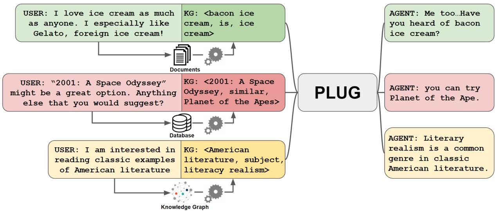  
Figure 1: A diagram of PLUG. PLUG homogenizes different knowledge sources in different tasks to a unified knowledge representation. Then it learns to ground response generation on the unified knowledge representation.

$$
p ( R _ { i } | C _ { i } ) = \prod _ { t = 1 } ^ { k } p ( r _ { t } | C _ { i } , K _ { i } , r _ { 1 } , . . . , r _ { t - 1 } )\tag{2}
$$

We will explain how we select and process pretraining datasets in the following sections.

## 2.3 Model training process

We pre-trained the PLUG model using two datasets, Reddit Conversation (Galley et al., 2018) and Open-DialKG (Moon et al., 2019). We will first present the three-step data cleaning process of Reddit Conversation in Section 2.3.1, then we will introduce OpenDialKG in Section 2.3.2.

## 2.3.1 Reddit Conversation

Reddit Conversation Galley et al. (2018) is a largescale open-domain conversation dataset. It extracts the conversation threads grounded on a document from the Reddit data.2 We only keep the conversations grounded on Wikipedia passages for pretraining to recognize better the knowledge used in the dialogue. Since vanilla document-based dialogue in the dataset does not have a knowledge label for each dialogue turn, we apply a hierarchical information extraction method to obtain the essential knowledge in each turn. Our information extraction method includes three steps: knowledge retrieval, statistical ranking, and semantic ranking.

Knowledge Retriever. We use a knowledge retriever to retrieve all relevant knowledge in a single turn’s response. We first extract the title of the grounding Wikipedia passage in the dialogue. Then, we retrieve knowledge triples from a largescale knowledge graph, DBpedia (Lehmann et al., 2015). Specifically, we query the DBpedia via a public SPARQL endpoint3 and then collect triples whose subject or object is in the Wikipedia passage in the dialogue. For example, we keep triples <Barack Obama, alma mater, Columbia University> and <Michelle Obama, spouse, Barack Obama> for the dialogue about Barack Obama. To carry sufficient knowledge to refine in the next step, we retrieve 500 triples for every passage.

Statistical Ranking. After retrieving adequate knowledge, we rank the corresponding triples to refine the knowledge. Specifically, we get the TF-IDF (term frequency-inverse document frequency) value for all the retrieved triples. To find the triples related to the context, we concatenate the dialogue history and the response as the query. Then we compute the cosine similarity between the query and every triple. Because every triple has the Wikipedia passage name as the subject or object, a higher cosine similarity score means the query has more similar text with the distinguished text in the triple.

We rank the query-document similarity score and only keep the top-50 triples in this step.

Semantic Ranking. The TF-IDF-based cosine similarity score only counts words overlapping between triples and the query. It will introduce triples whose overlapping words are not meaningful in the context and response. Additionally, the Reddit Conversation dataset is obtained from Reddit conversation threads. It involves many responses that are not grounded on any knowledge. In order to find the triples that have the best semantic similarity with the response and filter out ungrounded responses, in this step, we estimate the semantic similarity score with Sentence-Bert (Reimers and Gurevych, 2019). We rerank the 50 triples from the second step based on the score. Additionally, we abandon the dialogue turns whose best semantic similarity is lower than a threshold because the response cannot find proper knowledge, while we want to pre-train the model with knowledge-grounded turns.

## 2.3.2 OpenDialKG

To generalize our model to various tasks, we also employ OpenDialKG to enrich our pre-training dataset. OpenDialKG consists of two types of tasks, recommendations and chit-chat, across four domains. Unlike the Reddit Conversation dataset, which needs to find the knowledge grounding in every turn, the original OpenDialKG has a Knowledge graph path label for each dialogue, and a triple label for each dialogue turn. The response is grounded on the labeled triple during data collection. Thus, we use the triple in the dataset as the essential knowledge in our pre-training examples.

## 3 Experiments

We demonstrate our approach on two different downstream tasks: open-domain knowledgegrounded dialogue and conversational recommendation. Besides the fully-supervised learning setting, we also explore the performance of our approach in few-shot and zero-shot settings. We describe our implementation details in Section A in Appendix.

## 3.1 Datasets and Knowledge Sources

We test our approach on Wizard of Wikipedia (WoW; (Dinan et al., 2019)) and REDIAL (Li et al., 2018). Basic dataset statistics are listed in Table 2.

Wizard of Wikipedia. This dataset (Dinan et al., 2019) is collected on Amazon Mechanical Turk.

<table><tr><td>Dataset</td><td>Train</td><td>Valid</td><td>Test</td></tr><tr><td rowspan="3">WoW</td><td rowspan="3">18,430</td><td>Seen - 981</td><td>965</td></tr><tr><td>Unseen - 967</td><td>968</td></tr><tr><td>1,001</td><td>1,001</td></tr></table>

Table 2: Number of conversations in Wizard of Wikipedia (WoW) and REDIAL

Each conversation happens between a “wizard” who has access to knowledge about a specific topic, and an “apprentice” who is interested in the topic. The wizard’s response is grounded on a Wikipedia article in each turn. The data is split as a training set, a validation set, and a test set. The test set has two subsets: Test Seen and Test Unseen. Test Seen contains conversations whose topics are seen in the training set, while topics in Test Unseen are not seen in the training or validation set. To extract the essential knowledge in each dialogue turn, we first keep the top five passages retrieved by the TF-IDF retriever in Shuster et al. (2021). Then we use an Open Information Extraction (OpenIE) annotator4 to extract the top three triples from the passages as our essential knowledge. The pre-processing is conducted with the code published on ParlAI.5

REDIAL. REDIAL (Li et al., 2018) is also collected on Amazon Mechanical Turk. Two crowdworkers, a “movie seeker” and “movie recommender,” are randomly paired. The recommender has access to a movie database and can recommend movies based on movie information, such as actors and movie genres. There are 6,924 different movies mentioned in 51,699 movie slots in the dataset. We follow Li et al. (2018) to split the dataset into training, validation, and test sets. Since recommenders use movie-related knowledge when they recommend movies to seekers, we use it as the essential knowledge for a given turn in this dataset. We experiment with three knowledge sources: (1) We query the movie names mentioned in the dialogue context and retrieve similar movies from the knowledge graph DBpedia, mentioned in Section 2.3, and then input the similar movies in a triple format as the essential knowledge. (2) We query the movie names mentioned in the context and retrieve movie comments from MovieLens.6, then use the keywords in the comments as the essential knowledge. (3) We use the output of the recommender module in KGSF (Zhou et al., 2020a), which is the state-of-the-art system on this dataset.

## 3.2 Baselines

We compare the known best models from different datasets in the following experiments. For the Wizard of Wikipedia dataset, we choose the retrievalaugmented generation (RAG) model from Shuster et al. (2021). It retrieves wiki documents and generates responses based on the documents. We compare PLUG with this document-based generation method to see the impact of our essential knowledge format. We choose the RAG model also using T5 as the baseline for a fair comparison.

For the REDIAL dataset, we choose the current state-of-the-art: KBRD (Chen et al., 2019) and KGSF (Zhou et al., 2020a) as our baselines. Both use a recommender module to predict the recommendation item in the next turn and a generation model to generate the response. All baseline results are from Zhou et al. (2021). To investigate the best performance of our approach, We also use the recommender from KGSF as a knowledge source in our system and compare it with other knowledge sources we mentioned in Section 3.1. As an ablation study, we also explore the performance of vanilla T5 on both tasks to see the performance gain brought by our pre-training process.

## 3.3 Metrics

For evaluation, we report the performance with standard automatic metrics: BLEU-4 (B4) (Papineni et al., 2002), ROUGE-L (RL) (Lin, 2004), and unigram overlap (F1) of the generated responses. Besides that, for the Wizard of Wikipedia dataset, we follow Shuster et al. (2021) to report the overlapping unigrams between the model’s generation and the knowledge on which the human grounded during dataset collection (KF1), attempting to capture whether a model is speaking knowledgeably. On the other hand, for the REDIAL dataset, we follow previous work (Chen et al., 2019; Zhou et al., 2020a; Wang et al., 2021) to report distinct-n (Distn) at the sentence level to evaluate the diversity of the model’s generation. We also evaluate whether the ground truth movie recommendation can be found in the generated response and report it as the recommendation item recall in responses (Rec).

## 3.4 Fully-Supervised Results

We first evaluate PLUG with all training examples in the training sets to compare its performance with other state-of-the-art systems. Additionally, we experiment with using golden knowledge in the input to explore the upper bound of our method.

Table 3 shows the Wizard of Wikipedia Test Seen and Test Unseen results. We can see that PLUG with retrieved knowledge achieves better BLEU-4, ROUGE-L, and F1 scores than the RAG method and the model without adding knowledge in the input, on both seen and unseen topics. It suggests that our essential knowledge format helps the model generate responses to ground knowledge better. We also observe that PLUG outperforms the model without pre-training on all metrics, which means our pre-training can boost this task.

We list REDIAL’s results in Table 4. We compare our approach to the state-of-the-art systems and T5-Large models without pre-training. Additionally, we include a comparison to models with different knowledge sources as described in Section 3.1. It shows that our best model (PLUG+KGSF) achieves the new state-of-the-art results on the recommendation item recall metric and distinct metrics. This result is understandable given that our approach is built upon pre-trained language models. Similarly, we also observe noticeable performance gains for the pre-training on this task. However, compared to systems with currently available knowledge sources, it is immediately apparent that the system with golden knowledge outperforms the current state-of-the-art on all metrics by a large margin. This huge gap implies that current knowledge retrievers are the main bottleneck for the conversational recommendation task. We will discuss more details in Section 3.7.

Overall, we observe noticeable improvement brought by pre-training on both tasks, but it is less significant than expected. It implies that the knowledge grounding pattern in the response is limited; a complete training set is more than enough for the T5-Large model to learn the generation task. We will discuss more details in zero-shot and few-shot settings in the following subsections.

## 3.5 Zero-Shot and Few-Shot Results

We focus on zero-shot and few-shot settings because it is more realistic to evaluate dialogue systems. Specifically, we randomly sample 10/50/500 dialogues with different topics from the training sets and observe performance on the complete test sets. We also evaluate under a zero-shot setting. We experiment with knowledge retrieved by existing retrievers on both tasks to set a realistic setting. We compare our models to those without pretraining to explore how our pre-training benefits the model’s few-shot learning capability. Wizard of Wikipedia’s experiments results are in Figure 2, and REDIAL’s results are in Figure 3. Note that for Wizard of Wikipedia, topics in original Test Seen set may not be seen during training in this setting since we only use a small portion of data in the original training set. We use original Test Seen and Test Unseen sets to compare with fully-supervised results. As can be seen in Figure 2 (a)-(c), 3 (a)- (b), PLUG maintains a higher BLEU-4, ROUGE-L, and F1 scores on both tasks when training with less than 500 dialogues. It means PLUG obtains knowledge-grounded generation ability from pretraining and can generalize to different tasks.

<table><tr><td rowspan="2">Model</td><td colspan="3">Test Seen</td><td colspan="5">Test Unseen</td></tr><tr><td>BLEU4</td><td>ROUGE-L</td><td>F1</td><td>KF1</td><td>BLEU4</td><td>ROUGE-L</td><td>F1</td><td>KF1</td></tr><tr><td>RAG-T5-Large (Shuster et al., 2021)</td><td>3.8</td><td>22.1</td><td>21.9</td><td>25.9</td><td>2.8</td><td>20.4</td><td>20.5</td><td>21.9</td></tr><tr><td>T5-Large-w/o Knowledge</td><td>4.1</td><td>18.0</td><td>18.3</td><td>19.2</td><td>2.1</td><td>15.4</td><td>21.4</td><td>13.9</td></tr><tr><td>T5-Large-Retrieved Knowledge</td><td>5.8</td><td>21.8</td><td>25.8</td><td>22.6</td><td>3.4</td><td>19.2</td><td>22.7</td><td>17.6</td></tr><tr><td>T5-Large-Golden Knowledge</td><td>11.3</td><td>30.8</td><td>35.6</td><td>46.8</td><td>8.7</td><td>28.4</td><td>33.0</td><td>43.6</td></tr><tr><td>PLUG-Retrieved Knowledge</td><td>6.0</td><td>22.3</td><td>26.5</td><td>22.4</td><td>3.5</td><td>19.5</td><td>23.3</td><td>18.6</td></tr><tr><td>PLUG-Golden Knowledge</td><td>11.5</td><td>31.1</td><td>36.0</td><td>47.8</td><td>8.8</td><td>29.0</td><td>33.4</td><td>46.0</td></tr></table>

Table 3: Fully-supervised results on Wizard of Wikipedia Test Seen and Test Unseen Sets.  
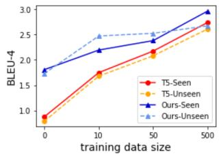  
(a)

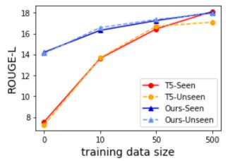  
(b)

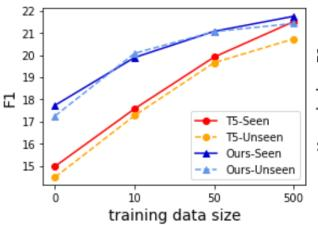  
(c)

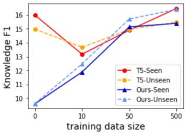  
(d)

Figure 2: Zero-shot and few-shot results on Wizard of Wikipedia Test Seen and Test Unseen sets.
<table><tr><td>Model</td><td>B4</td><td>RL</td><td>DIST2</td><td>DIST4</td><td>Rec</td></tr><tr><td>KBRD KGSF</td><td>1.8</td><td>16.5 13.1</td><td>0.48 0.49</td><td>0.67 1.28</td><td>0.7 0.9</td></tr><tr><td></td><td>2.3</td><td></td><td></td><td></td><td></td></tr><tr><td>T5-Large +w/o KG</td><td>3.7</td><td>18.3</td><td>0.72</td><td>1.10</td><td>3.4</td></tr><tr><td>+Golden</td><td>10.4</td><td>32.7 17.4</td><td>1.17</td><td>1.60</td><td>83.5</td></tr><tr><td>+KGSF PLUG</td><td>3.7</td><td></td><td>1.13</td><td>2.02</td><td>4.7</td></tr><tr><td>+w/o KG</td><td>3.9</td><td>19.6</td><td>0.78</td><td>1.31</td><td>3.7</td></tr><tr><td>+Golden</td><td></td><td>33.5</td><td></td><td></td><td></td></tr><tr><td></td><td>10.6</td><td></td><td>1.26</td><td>1.81</td><td>84.3</td></tr><tr><td>+DBpedia</td><td>3.3</td><td>18.3</td><td>0.45</td><td>0.66</td><td>0.8</td></tr><tr><td>+MovieLens</td><td>3.4</td><td>17.8</td><td>0.91</td><td>1.34</td><td></td></tr><tr><td>+KGSF</td><td>3.8</td><td>18.0</td><td>1.51</td><td>2.84</td><td>2.4 5.3</td></tr></table>

Table 4: Fully-supervised results on REDIAL.

Figure 2 (d) shows that models without pretraining achieve a higher knowledge F1 score under a zero-shot setting for the Wizard of Wikipedia dataset. In contrast, it achieves a deficient performance on the language quality-related metrics, which implies that models only copy knowledge words but generate gibberish responses without training. Nevertheless, PLUG still generates knowledge-grounded responses with a lower knowledge F1 score out-of-the-box. This result also suggests that we should only consider knowledge F1 scores when the model has decent scores on language quality metrics.

For the REDIAL dataset, Figure 3 (d) shows that there is not as much improvement in recommendation item recall brought by pre-training when compared to BLEU-4 and ROUGE-L on a zero-shot setting. However, we observe a noticeable difference between PLUG and the T5 model, which means PLUG learns to generate with grounded knowledge faster than the T5 model. The unusually high DIST-4 of T5 in Figure 3 (d) is caused by diverse but irrelevant responses. It is also demonstrated by low BLEU-4 and ROUGE-L scores in Figure 3 (a) and Figure 3 (b), and the decrease of DIST-4 when we increase the training data size.

## 3.6 Human Evaluation

We conduct a human evaluation on Wizard of Wikipedia to assess the overall quality of the responses of our model compared to T5 and RAG7. Specifically, we randomly select 100 responses for each model with the same context from Test Seen and Test Unseen. For the few-shot setting, we use the models trained with 50 dialogues. We hire workers on Amazon Mechanical Turk to rate models’ responses on a 0 - 2 scale with three metrics: Fluency, Coherence, and Knowledge. The order of the systems shown to workers is shuffled to avoid confounding practice effects. Three different workers evaluate each dialogue turn. Table 5 reports average metrics scores. We observe that responses from our fully-supervised model are more fluent and coherent than those from RAG, which benefits from our simple but effective essential knowledge representation. We can also see significant improvement on all metrics for PLUG under a zero-shot setting compared to the T5 model. Performance improvement under the few-shot setting is less than in the zero-shot setting, but PLUG still outperforms T5 on all metrics, which aligns with the result in automatic evaluation. Interestingly, we observe that responses from the model trained with 50 dialogues have already been very fluent and coherent, which is even higher than those from the fullysupervised model. However, responses from the fully-supervised model contain the most appropriate knowledge, which suggests that the model has learned how to generate high-quality responses in a few-shot setting, but it continues to learn how to ground on knowledge with more training samples.

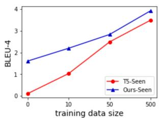  
(a)

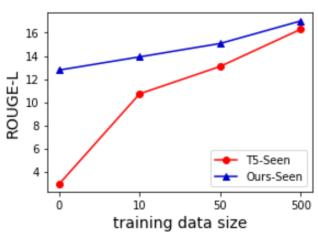  
(b)

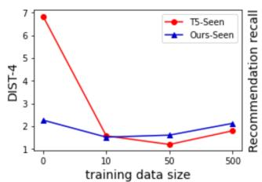  
(c)

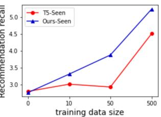  
(d)  
Figure 3: Zero-shot and few-shot results on REDIAL.

<table><tr><td>Model</td><td>Fluency</td><td>Coherence</td><td>Knowledge</td></tr><tr><td>RAG</td><td>1.06</td><td>1.08</td><td>1.19</td></tr><tr><td>T5-Large</td><td></td><td></td><td></td></tr><tr><td>- Zero-shot</td><td>0.87</td><td>0.98</td><td>0.98</td></tr><tr><td>- Few-shot</td><td>1.26</td><td>1.35</td><td>1.31</td></tr><tr><td>PLUG</td><td></td><td></td><td></td></tr><tr><td>- Zero-shot</td><td> $1 . 2 0 ^ { * * }$ </td><td> $1 . 3 4 ^ { * * }$ </td><td> $1 . 2 5 ^ { * * }$ </td></tr><tr><td>- Few-shot</td><td> $\mathbf { 1 . 2 9 ^ { * } }$ </td><td> $\mathbf { 1 . 4 2 ^ { * } }$ </td><td> $1 . 3 9 ^ { * * }$ </td></tr><tr><td>- Fully-supervised</td><td> $1 . 2 4 ^ { * * }$ </td><td> $1 . 3 7 ^ { * * }$ </td><td> $\mathbf { 1 . 4 6 ^ { * * } }$ </td></tr></table>

Table 5: Human evaluation results of different models on Wizard of Wikipedia. We test T5 baselines and RAG model against PLUG with $^ { * * } \mathrm { p } < 0 . 0 1 , ^ { * } \mathrm { p } < 0 . 0 5 .$

## 3.7 Discussion and Analysis

To investigate the enormous performance gap between models with golden knowledge and retrieved knowledge in Table 4, we compare the performance of models with different knowledge sources on the REDIAL dataset. Specifically, we mix the golden movies information and the retrieved movie information retrieved in the training/validation/test set to simulate knowledge sources with different recall performances. We experiment with 0/20/40/60/80/100 percent of the golden knowledge. 0 means all training samples includes retrieved knowledge (a flawed knowledge source), 100 means all training samples include golden knowledge (a perfect knowledge source). To have a more realistic setting, we compare the performance of PLUG and T5 under the few-shot setting (trained on 50 dialogues), as shown in Figure 4.

We find that the performance gain for both models is linear with respect to the performance of the knowledge source, whereas PLUG has a better boost on the BLEU-4 score and recommendation recall score. The curve with a higher slope shows the potential benefit from our pre-training method when better knowledge sources are available in the future. Furthermore, the gap on DIST-4 between PLUG and T5 is almost the same as golden knowledge increases, but the DIST-4 of T5 surprisingly drops when no golden knowledge is available. It means that T5 requires a better knowledge source in the training set to generate diverse responses under a few-shot setting, while PLUG has learned that ability in the pre-training process and generates diverse responses out-of-the-box. We also note that the performance boost with a better knowledge source is much more than the generation technology in previous work. This massive gap may shed light on the research direction of knowledgegrounded dialogue tasks for future efforts.

## 4 Related Work

Knowledge-grounded dialogue is becoming an increasingly important topic, with datasets proposed to model its occurrence on different tasks. Dialogues in these datasets are based on various formats of knowledge, such as documents in opendomain conversations (Ghazvininejad et al., 2018; Dinan et al., 2019; Gopalakrishnan et al., 2019), movie database in movie recommendation conversations (Li et al., 2018; Hayati et al., 2020), or knowledge graph in recommendation conversations(Moon et al., 2019; Liu et al., 2021b).

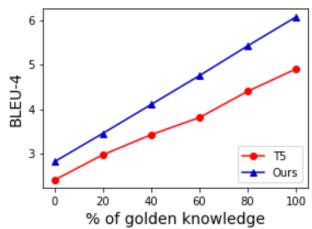  
(a)

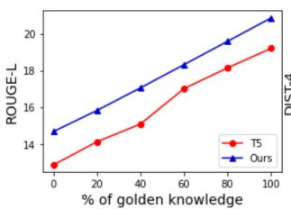  
(b)

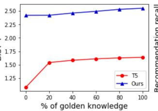  
(c)

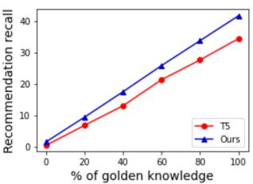  
(d)  
Figure 4: Analysis of models with different knowledge sources on REDIAL.

One of the principal challenges in knowledgegrounded conversations is incorporating knowledge into dialogue systems. Recent work investigates different techniques of learning a better knowledge representation to fuse knowledge in the response generation process. Ghazvininejad et al. (2018) separately encoded the dialogue history and documents to infuse the response with external world facts. Chen et al. (2019); Wang et al. (2021); Zhou et al. (2020a) joined a knowledge graph representation in a response generation module. Zhu et al. (2017) combined the knowledge from the database with the user intent and fed it into the decoder. Unlike these studies, we use a single encoder for both dialogue context and knowledge.

In order to improve the systems’ performance on unseen topics and train knowledge-grounded dialogue in a low-resource setting, researchers investigate pre-training methods for the knowledgegrounded tasks. Zhao et al. (2020a) pre-trained the dialogue generation model with ungrounded dialogues and the knowledge encoder with the Wikipedia dump separately. Li et al. (2020) proposed a pre-trained latent variable model to learn the way that the knowledge is expressed in the response. Liu et al. (2021a) built a document encoder and a dialogue context encoder, then pre-trained them separately in multiple stages. The knowledge encoder in these studies is pre-trained separately and only accepts the same knowledge format, while we pre-train our model with essential knowledge in the text format, thus fitting different knowledge sources in the downstream tasks. Madotto et al. (2020) independently trained adaptors (Houlsby et al., 2019) for different types of knowledge. In comparison, we use a unified essential knowledge representation in our model. Zhao et al. (2020b) and Guu et al. (2020) pre-trained language models with knowledge selection modules but only focused on document-based generation, limiting their models to document-based knowledge sources.

Inspired by the success of pre-trained language models for a variety of natural language processing tasks (Devlin et al., 2019; Radford et al., 2019; Yang et al., 2019; Ma et al., 2021), another line of work investigates learning knowledge through language models’ parameters (Petroni et al., 2019; Rosset et al., 2020; Roberts et al., 2020). In our pre-training process, we aim to learn extra knowledge and, more importantly, learn how to generate response grounding on the essential knowledge.

Two recent studies are most closely related to our work. Chen et al. (2020) proposed a pre-trained model for data to text tasks. They unified the knowledge format in the pre-training data and downstream tasks, however only depend on the graph structure and do not work on knowledge-grounded dialogues. Shuster et al. (2021) applied the document retrieval augmentation method (Lewis et al., 2020b) on open-domain knowledge-grounded dialogues. However, they do not do pre-training and rely on Wikipedia documents in the decoder, limiting their model to document-based dialogues. We use unified essential knowledge instead of documents in our pre-training, making our model more generalizable. Our approach can be seen as generalizing both lines of work, and showing for the first time that a pre-trained model is effective for various knowledge-grounded tasks with different knowledge formats.

## 5 Conclusion and Future Work

We present a knowledge-grounded pre-trained language model PLUG that can be applied to various knowledge-grounded dialogue tasks. It subsumes different knowledge sources into a simple but effective unified essential knowledge representation. Evaluation results on two benchmarks indicate that our model performs better in zero-shot and fewshot settings and can generalize to different knowledge grounded tasks.

As future work, we would like to augment our pre-training datasets with more knowledge sources, and apply our method to other knowledgegrounded tasks such as question answering. Another interesting direction would be to develop better information retrievers since experiments show that the retriever is the main bottleneck in the knowledge-grounded dialogues.

## References

Daniel Adiwardana, Minh-Thang Luong, David R. So, Jamie Hall, Noah Fiedel, Romal Thoppilan, Zi Yang, Apoorv Kulshreshtha, Gaurav Nemade, Yifeng Lu, and Quoc V. Le. 2020. Towards a human-like opendomain chatbot. CoRR, abs/2001.09977.

Qibin Chen, Junyang Lin, Yichang Zhang, Ming Ding, Yukuo Cen, Hongxia Yang, and Jie Tang. 2019. Towards knowledge-based recommender dialog system. In Proceedings of the 2019 Conference on Empirical Methods in Natural Language Processing and the 9th International Joint Conference on Natu ral Language Processing (EMNLP-IJCNLP), pages 1803–1813, Hong Kong, China. Association for Computational Linguistics.

Wenhu Chen, Yu Su, Xifeng Yan, and William Yang Wang. 2020. KGPT: Knowledge-grounded pretraining for data-to-text generation. In Proceedings of the 2020 Conference on Empirical Methods in Natural Language Processing (EMNLP), pages 8635–8648, Online. Association for Computational Linguistics.

Jacob Devlin, Ming-Wei Chang, Kenton Lee, and Kristina Toutanova. 2019. BERT: Pre-training of deep bidirectional transformers for language understanding. In Proceedings of the 2019 Conference of the North American Chapter of the Association for Computational Linguistics: Human Language Technologies, Volume 1 (Long and Short Papers), pages 4171–4186, Minneapolis, Minnesota. Association for Computational Linguistics.

Emily Dinan, Stephen Roller, Kurt Shuster, Angela Fan, Michael Auli, and Jason Weston. 2019. Wizard of wikipedia: Knowledge-powered conversational agents. In International Conference on Learning Representations.

Song Feng, Kshitij Fadnis, Q Vera Liao, and Luis A Lastras. 2020. Doc2dial: a framework for dialogue

composition grounded in documents. In Proceedings of the AAAI Conference on Artificial Intelligence, volume 34, pages 13604–13605.

Michel Galley, Chris Brockett, Xiang Gao, Bill Dolan, and Jianfeng Gao. 2018. End-to-end conversation modeling: Moving beyond chitchat.

Jianfeng Gao, Michel Galley, and Lihong Li. 2019. Neural approaches to conversational AI: Question answering, task-oriented dialogues and social chatbots. Now Foundations and Trends.

Marjan Ghazvininejad, Chris Brockett, Ming-Wei Chang, Bill Dolan, Jianfeng Gao, Wen-tau Yih, and Michel Galley. 2018. A knowledge-grounded neural conversation model. In Proceedings of the AAAI Conference on Artificial Intelligence, volume 32.

Karthik Gopalakrishnan, Behnam Hedayatnia, Qinglang Chen, Anna Gottardi, Sanjeev Kwatra, Anu Venkatesh, Raefer Gabriel, Dilek Hakkani-Tür, and Amazon Alexa AI. 2019. Topical-chat: Towards knowledge-grounded open-domain conversations. In INTERSPEECH, pages 1891–1895.

Kelvin Guu, Kenton Lee, Zora Tung, Panupong Pasupat, and Ming-Wei Chang. 2020. REALM: retrievalaugmented language model pre-training. CoRR, abs/2002.08909.

Shirley Anugrah Hayati, Dongyeop Kang, Qingxiaoyang Zhu, Weiyan Shi, and Zhou Yu. 2020. Inspired: Toward sociable recommendation dialog systems. In Proceedings of the 2020 Conference on Empirical Methods in Natural Language Processing (EMNLP), pages 8142–8152, Online. Association for Computational Linguistics.

Ehsan Hosseini-Asl, Bryan McCann, Chien-Sheng Wu, Semih Yavuz, and Richard Socher. 2020. A simple language model for task-oriented dialogue. In Advances in Neural Information Processing Systems, volume 33, pages 20179–20191. Curran Associates, Inc.

Neil Houlsby, Andrei Giurgiu, Stanislaw Jastrzebski, Bruna Morrone, Quentin De Laroussilhe, Andrea Gesmundo, Mona Attariyan, and Sylvain Gelly. 2019. Parameter-efficient transfer learning for NLP. In Proceedings ofthe 36th International Conference on Machine Learning.

Diederik P Kingma and Jimmy Ba. 2014. Adam: A method for stochastic optimization. arXiv preprint arXiv:1412.6980.

Jens Lehmann, Robert Isele, Max Jakob, Anja Jentzsch, Dimitris Kontokostas, Pablo N Mendes, Sebastian Hellmann, Mohamed Morsey, Patrick Van Kleef, Sören Auer, et al. 2015. Dbpedia–a large-scale, multilingual knowledge base extracted from wikipedia. Semantic web, 6(2):167–195.

Mike Lewis, Yinhan Liu, Naman Goyal, Marjan Ghazvininejad, Abdelrahman Mohamed, Omer Levy, Veselin Stoyanov, and Luke Zettlemoyer. 2020a. BART: Denoising sequence-to-sequence pretraining for natural language generation, translation, and comprehension. In Proceedings of the 58th Annual Meeting of the Association for Computational Linguistics, pages 7871–7880, Online. Association for Computational Linguistics.

Patrick Lewis, Ethan Perez, Aleksandra Piktus, Fabio Petroni, Vladimir Karpukhin, Naman Goyal, Heinrich Küttler, Mike Lewis, Wen-tau Yih, Tim Rocktäschel, et al. 2020b. Retrieval-augmented generation for knowledge-intensive nlp tasks. arXiv preprint arXiv:2005.11401.

Linxiao Li, Can Xu, Wei Wu, YUFAN ZHAO, Xueliang Zhao, and Chongyang Tao. 2020. Zeroresource knowledge-grounded dialogue generation. In Advances in Neural Information Processing Systems, volume 33, pages 8475–8485. Curran Associates, Inc.

Raymond Li, Samira Ebrahimi Kahou, Hannes Schulz, Vincent Michalski, Laurent Charlin, and Chris Pal. 2018. Towards deep conversational recommendations. In Advances in Neural Information Processing Systems 31 (NIPS 2018).

Yu Li, Shirley Anugrah Hayati, Weiyan Shi, and Zhou Yu. 2021. DEUX: an attribute-guided framework for sociable recommendation dialog systems. CoRR, abs/2105.00825.

Chin-Yew Lin. 2004. ROUGE: A package for automatic evaluation of summaries. In Text Summarization Branches Out, pages 74–81, Barcelona, Spain. Association for Computational Linguistics.

Shilei Liu, Xiaofeng Zhao, Bochao Li, Feiliang Ren, Longhui Zhang, and Shujuan Yin. 2021a. A three-stage learning framework for low-resource knowledge-grounded dialogue generation. arXiv preprint arXiv:2109.04096.

Zeming Liu, Haifeng Wang, Zheng-Yu Niu, Hua Wu, and Wanxiang Che. 2021b. DuRecDial 2.0: A bilingual parallel corpus for conversational recommendation. In Proceedings of the 2021 Conference on Empirical Methods in Natural Language Processing, pages 4335–4347, Online and Punta Cana, Dominican Republic. Association for Computational Linguistics.

Kaixin Ma, Hao Cheng, Xiaodong Liu, Eric Nyberg, and Jianfeng Gao. 2021. Open domain question answering over virtual documents: A unified approach for data and text. arXiv preprint arXiv:2110.08417.

Andrea Madotto, Zhaojiang Lin, Yejin Bang, and Pascale Fung. 2020. The adapter-bot: All-in-one controllable conversational model. arXiv preprint arXiv:2008.12579.

Seungwhan Moon, Pararth Shah, Anuj Kumar, and Rajen Subba. 2019. OpenDialKG: Explainable conversational reasoning with attention-based walks over knowledge graphs. In Proceedings of the 57th Annual Meeting of the Association for Computational Linguistics, pages 845–854, Florence, Italy. Association for Computational Linguistics.

Kishore Papineni, Salim Roukos, Todd Ward, and Wei-Jing Zhu. 2002. Bleu: a method for automatic evaluation of machine translation. In Proceedings ofthe 40th annual meeting of the Association for Computational Linguistics, pages 311–318.

Baolin Peng, Chunyuan Li, Jinchao Li, Shahin Shayandeh, Lars Liden, and Jianfeng Gao. 2020. Soloist: Few-shot task-oriented dialog with a single pretrained auto-regressive model. arXiv preprint arXiv:2005.05298.

Fabio Petroni, Tim Rocktäschel, Sebastian Riedel, Patrick Lewis, Anton Bakhtin, Yuxiang Wu, and Alexander Miller. 2019. Language models as knowledge bases? In Proceedings of the 2019 Conference on Empirical Methods in Natural Language Processing and the 9th International Joint Conference on Natural Language Processing (EMNLP-IJCNLP), pages 2463–2473, Hong Kong, China. Association for Computational Linguistics.

Alec Radford, Jeffrey Wu, Rewon Child, David Luan, Dario Amodei, Ilya Sutskever, et al. 2019. Language models are unsupervised multitask learners. OpenAI blog, 1(8):9.

Colin Raffel, Noam Shazeer, Adam Roberts, Katherine Lee, Sharan Narang, Michael Matena, Yanqi Zhou, Wei Li, and Peter J. Liu. 2019. Exploring the limits of transfer learning with a unified text-to-text transformer. CoRR, abs/1910.10683.

Colin Raffel, Noam Shazeer, Adam Roberts, Katherine Lee, Sharan Narang, Michael Matena, Yanqi Zhou, Wei Li, and Peter J. Liu. 2020. Exploring the limits of transfer learning with a unified text-totext transformer. Journal of Machine Learning Research, 21(140):1–67.

Nils Reimers and Iryna Gurevych. 2019. Sentence-BERT: Sentence embeddings using Siamese BERTnetworks. In Proceedings ofthe 2019 Conference on Empirical Methods in Natural Language Processing and the 9th International Joint Conference on Natural Language Processing (EMNLP-IJCNLP), pages 3982–3992, Hong Kong, China. Association for Computational Linguistics.

Adam Roberts, Colin Raffel, and Noam Shazeer. 2020. How much knowledge can you pack into the parameters of a language model? In Proceedings of the 2020 Conference on Empirical Methods in Natural Language Processing (EMNLP), pages 5418–5426, Online. Association for Computational Linguistics.

Stephen Roller, Emily Dinan, Naman Goyal, Da Ju, Mary Williamson, Yinhan Liu, Jing Xu, Myle Ott, Kurt Shuster, Eric Michael Smith, Y-Lan Boureau, and Jason Weston. 2020. Recipes for building an open-domain chatbot. CoRR, abs/2004.13637.

Corby Rosset, Chenyan Xiong, Minh Phan, Xia Song, Paul Bennett, and Saurabh Tiwary. 2020. Knowledge-aware language model pretraining.

Kurt Shuster, Spencer Poff, Moya Chen, Douwe Kiela, and Jason Weston. 2021. Retrieval augmentation reduces hallucination in conversation.

Yi-Lin Tuan, Yun-Nung Chen, and Hung-yi Lee. 2019. Dykgchat: Benchmarking dialogue generation grounding on dynamic knowledge graphs. arXiv preprint arXiv:1910.00610.

Ashish Vaswani, Noam Shazeer, Niki Parmar, Jakob Uszkoreit, Llion Jones, Aidan N Gomez, Łukasz Kaiser, and Illia Polosukhin. 2017. Attention is all you need. In Advances in neural information processing systems, pages 5998–6008.

Lingzhi Wang, Huang Hu, Lei Sha, Can Xu, Kam-Fai Wong, and Daxin Jiang. 2021. Finetuning largescale pre-trained language models for conversational recommendation with knowledge graph. arXiv preprint arXiv:2110.07477.

Thomas Wolf, Lysandre Debut, Victor Sanh, Julien Chaumond, Clement Delangue, Anthony Moi, Pierric Cistac, Tim Rault, Remi Louf, Morgan Funtowicz, Joe Davison, Sam Shleifer, Patrick von Platen, Clara Ma, Yacine Jernite, Julien Plu, Canwen Xu, Teven Le Scao, Sylvain Gugger, Mariama Drame, Quentin Lhoest, and Alexander Rush. 2020. Transformers: State-of-the-art natural language processing. In Proceedings of the 2020 Conference on Empirical Methods in Natural Language Processing: System Demonstrations, pages 38–45, Online. Association for Computational Linguistics.

Zhilin Yang, Zihang Dai, Yiming Yang, Jaime Carbonell, Russ R Salakhutdinov, and Quoc V Le. 2019. Xlnet: Generalized autoregressive pretraining for language understanding. Advances in neural information processing systems, 32.

Yizhe Zhang, Siqi Sun, Michel Galley, Yen-Chun Chen, Chris Brockett, Xiang Gao, Jianfeng Gao, Jingjing Liu, and Bill Dolan. 2019. Dialogpt: Large-scale generative pre-training for conversational response generation. CoRR, abs/1911.00536.

Xueliang Zhao, Wei Wu, Chongyang Tao, Can Xu, Dongyan Zhao, and Rui Yan. 2020a. Low-resource knowledge-grounded dialogue generation. arXiv preprint arXiv:2002.10348.

Xueliang Zhao, Wei Wu, Can Xu, Chongyang Tao, Dongyan Zhao, and Rui Yan. 2020b. Knowledgegrounded dialogue generation with pre-trained language models. CoRR, abs/2010.08824.

Kangyan Zhou, Shrimai Prabhumoye, and Alan W Black. 2018. A dataset for document grounded conversations. In Proceedings of the 2018 Conference on Empirical Methods in Natural Language Processing.

Kun Zhou, Xiaolei Wang, Yuanhang Zhou, Chenzhan Shang, Yuan Cheng, Wayne Xin Zhao, Yaliang Li, and Ji-Rong Wen. 2021. CRSLab: An open-source toolkit for building conversational recommender system. In Proceedings of the 59th Annual Meeting of the Association for Computational Linguistics and the 11th International Joint Conference on Natural Language Processing: System Demonstrations, pages 185–193, Online. Association for Computational Linguistics.

Kun Zhou, Wayne Xin Zhao, Shuqing Bian, Yuanhang Zhou, Ji-Rong Wen, and Jingsong Yu. 2020a. Improving conversational recommender systems via knowledge graph based semantic fusion. In Proceedings of the 26th ACM SIGKDD International Conference on Knowledge Discovery & Data Mining, pages 1006–1014.

Li Zhou, Jianfeng Gao, Di Li, and Heung-Yeung Shum. 2020b. The design and implementation of xiaoice, an empathetic social chatbot. Computational Linguistics, 46(1):53–93.

Wenya Zhu, Kaixiang Mo, Yu Zhang, Zhangbin Zhu, Xuezheng Peng, and Qiang Yang. 2017. Flexible end-to-end dialogue system for knowledge grounded conversation. arXiv preprint arXiv:1709.04264.

## A Implementation Details

We process the Reddit monthly submissions and comments dump from 2011 to 2017, consisting of over 894k knowledge-grounded dialogue turns. As detailed in Section 2.3.1, we set the threshold as 0.35 in the semantic ranking. After filtering with our hierarchical information extraction method, over 321k dialogue turns remain. All dialogue turns in the OpenDialKG dataset are used in the pretraining. Each dialogue turn is processed to form a sequence of tokens consisting of three segments: dialogue context, essential knowledge, and response. We keep the top-three triples/keywords as our essential knowledge in pre-training and downstream tasks. PLUG is implemented with Huggingface Pytorch Transformers8 (Wolf et al., 2020) and initialized with the 800M-parameter T5 model. We use Adam (Kingma and Ba, 2014) with weight decay for pre-training. Training examples are truncated to ensure a maximal length of 512. Models are pre-trained on 8 Nvidia V100 GPUs until we observe no progress on validation data or up to 20 epochs. The best configuration of hyper-parameters is selected through cross-validated grid-search.

## B Ethical Considerations

It is essential to consider potential ethical issues in knowledge-grounded dialogue systems. In our work, PLUG is pre-trained on a large-scale dataset Reddit Conversation, which is crawled from the internet. We follow Galley et al. (2018) to filter out dialogues that have profanity content. However, it is still possible to include inappropriate content in the pre-training dataset. In processing the Reddit Conversation dataset during pre-training, we have carefully designed rules to remove knowledge that has profanity words. Additionally, the T5 model may have seen inappropriate content in its pre-training tasks, and it may generate wrong responses even if we input appropriate knowledge. Considerable additional work is needed to detect profanity content when we generate with a pretrained language model. In addition to these ethical considerations, we have sought to better conduct our human evaluation by transparently communicating with crowd-workers about data use and study intent and compensating workers at a reasonable hourly wage.

## C Human Evaluation Interface

Figure 5 shows the interface of an example in our human evaluation.

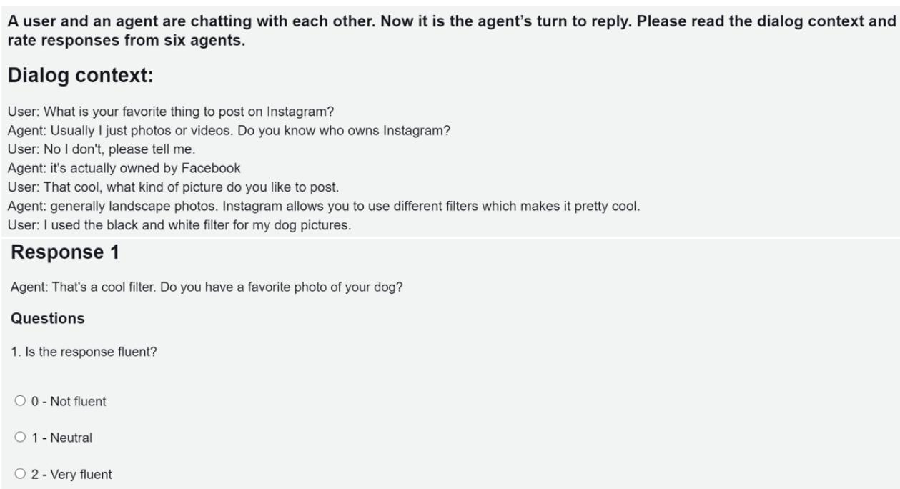  
Figure 5: Screenshot of human evaluation interface.