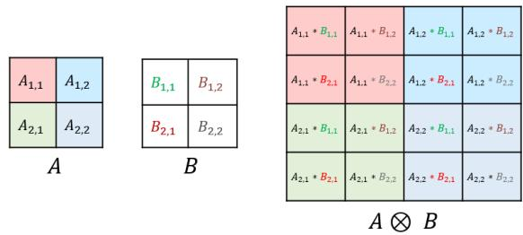
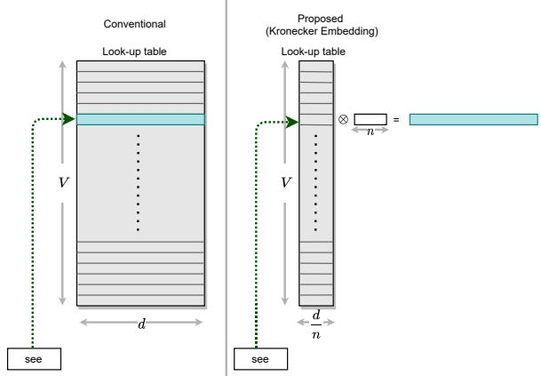
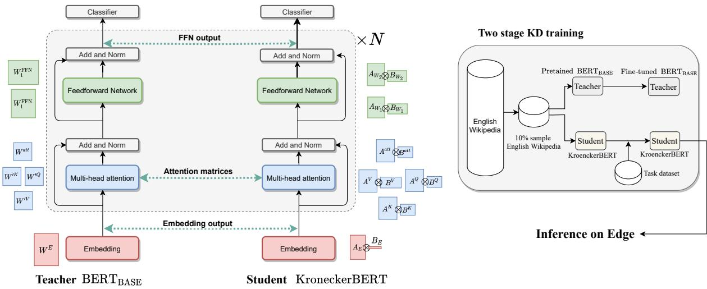
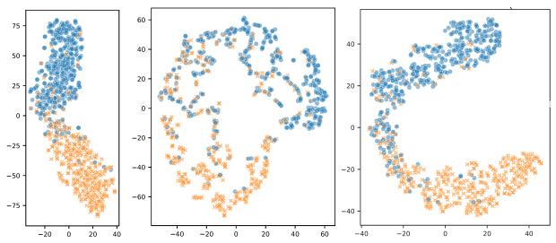
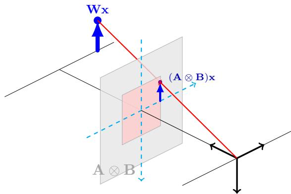

# KroneckerBERT: Significant Compression of Pre-trained Language Models Through Kronecker Decomposition and Knowledge Distillation

Marzieh S. Tahaei Huawei Noah’s Ark Lab marzieh.tahaei@huawei.com

Ella Charlaix Huawei Noah’s Ark Lab charlaixe@gmail.com

Vahid Partovi Nia Huawei Noah’s Ark Lab vahid.partovinia@huawei.com

Ali Ghodsi Department of Statistics Actuarial Science, University of Waterloo ali.ghodsi@uwaterloo.com

## Abstract

The development of over-parameterized pretrained language models has made a significant contribution toward the success of natural language processing. While over-parameterization of these models is the key to their generalization power, it makes them unsuitable for deployment on low-capacity devices. We push the limits of state-of-the-art Transformer-based pre-trained language model compression using Kronecker decomposition. We present our KroneckerBERT, a compressed version of the BERTBASE model obtained by compressing the embedding layer and the linear mappings in the multi-head attention, and the feed-forward network modules in the Transformer layers. Our KroneckerBERT is trained via a very efficient two-stage knowledge distillation scheme using far fewer data samples than state-of-the-art models like MobileBERT and TinyBERT. We evaluate the performance of KroneckerBERT on well-known NLP benchmarks. We show that our KroneckerBERT with compression factors of 7.7 and 21 outperforms state-of-theart compression methods on the GLUE and SQuAD benchmarks. In particular, using only 13% of the teacher model parameters, it retain more than 99% of the accuracy on the majority of GLUE tasks.

## 1 Introduction

In recent years, the emergence of Pre-trained Language Models (PLMs) has led to a significant breakthrough in Natural Language Processing (NLP). The introduction of Transformers and unsupervised pre-training on enormous unlabeled data are the two main factors that contribute to this success.

Transformer-based models (Devlin et al., 2018; Radford et al., 2019; Yang et al., 2019; Shoeybi et al., 2019) are powerful yet highly overparameterized. The enormous size of these models

Mehdi Rezagholizadeh Huawei Noah’s Ark Lab Mehdi.rezagholizadeh@huawei.com

does not meet the constraints imposed by edge devices on memory, latency, and energy consumption. Therefore there has been a growing interest in developing new methodologies and frameworks for the compression of these large PLMs. Similar to other deep learning models, the main directions for the compression of these models include low-bit quantization (Gong et al., 2014; Prato et al., 2019), network pruning (Han et al., 2015), matrix decomposition (Yu et al., 2017; Lioutas et al., 2020) and Knowledge distillation (KD) (Hinton et al., 2015). These methods are either used in isolation or in combination to improve compression-performance trade-off.

Recent works have been relatively successful in compressing Transformer-based PLMs to a certain degree (Sanh et al., 2019; Sun et al., 2019; Jiao et al., 2019; Sun et al., 2020; Xu et al., 2020; Wang et al., 2020; Kim et al., 2021); however, moderate and extreme compression of these models (compression factors >5 and 10 resepctively) is still quite challenging. In particular, several works (Mao et al., 2020; Zhao et al., 2019a, 2021) that have tried to go beyond the compression factor of 10, have done so at the expense of a significant drop in performance.

Following the classical assumption that matrices often follow a low-rank structure, low-rank decomposition methods have been used for compression of weight matrices in deep learning models (Yu et al., 2017; Swaminathan et al., 2020; Winata et al., 2019) and especially Transformer-based models (Noach and Goldberg, 2020; Mao et al., 2020). However, low-rank decomposition methods only exploit redundancies of the weight matrix in the horizontal and vertical dimensions and thus limit the flexibility of the compressed model. Kronecker decomposition on the other hand exploits redundancies in predefined patches and hence allows for more flexibility in their representation. Recent works prove Kronecker product to be more effective in retaining accuracy after compression than SVD (Thakker et al., 2019).

  
Figure 1: An example of Kronecker product of two 2 by 2 matrices.

This work proposes a novel framework that uses Kronecker decomposition for compression of Transformer-based PLMs and provides a very promising compression-performance trade-off for medium and high compression levels, with 13% and 5% of the original model parameters respectively. We use Kronecker decomposition for the compression of both Transformer layers and the embedding layer. For Transformer layers, the compression is achieved by representing every weight matrix both in the multi-head attention (MHA) and the feed-forward neural network (FFN) as a Kronecker product of two smaller matrices. We also propose a Kronecker decomposition for compression of the embedding layer. Previous works have tried different techniques to reduce the enormous memory consumption of this layer (Khrulkov et al., 2019; Li et al., 2018). Our Kronecker decomposition method can substantially reduce the amount of required memory while maintaining low computation.

Using Kronecker decomposition for large compression factors leads to a reduction in the model expressiveness. This is due to the nature of the Kronecker product and the fact that elements in this representation are tied together. To address this issue, we propose to distill knowledge from the intermediate layers of the original uncompressed network to the Kronecker network during training.

Training of the state-of-the art BERT compression models (Zhao et al., 2019a,b; Sun et al., 2020, 2019) involve an extensive training which requires vast computational resources. For example in (Sun et al., 2020), first a specially designed teacher, i.e IB-BERTLARGE is trained from scratch on the entire English wikipedia and Book Corpus. The student is then pretrained on the same corpus via KD while undergoing an additional progressive KD phase. Another example is TinyBERT(Jiao et al., 2019) which requires pretraining on the entire English Wikipedia and also uses extensive data augmentation (20 ) for fine-tuning on the downstream tasks. We show that our Kronecker BERT can out perform state-of-the-art with significantly less training requirements. More precisely, our Kronecker-BERT model undergoes a very light pretraining on only 10% of the English Wikipedia for 3 epochs followed by finetuning on the original downstream data.

Note that, while our evaluations in this work are limited to BERT, this proposed compression method can be directly used to compress other Transformer-based NLP models. The main contributions of this paper are as follows:

• Compression of the embedding layer using the Kronecker decomposition with very low computational overhead.

• Deploying the Kronecker decomposition for the compression of Transformer modules.

• Efficient training the compressed model via an intermediate-layer KD that uses only 10% of English Wikipedia in the pretraining stage.

• Evaluating the proposed framework for compression of BERTBASE model on well-known NLP benchmarks

## 2 Related Work

In this section, we first go through some of the most related works for BERT compression in the literature and then review the few works that have used Kronecker decomposition for compression of CNNs and RNNs.

## 2.1 Pre-trained Language Model Compression

In recent years, many model compression methods have been proposed to reduce the size of PLMs while maintaining their performance on different tasks. KD, which was first introduced by (Buciluaˇ et al., 2006) and then later generalized by (Hinton et al., 2015), is a popular compression method where a small student network is trained to mimic the behavior of a larger teacher network. Recently, using KD for the compression of PLMs has gained a growing interest in the NLP community. BERT-PKD (Sun et al., 2019), uses KD to transfer knowledge from the teacher’s intermediate layers to the student in the fine-tuning stage. TinyBERT (Jiao et al., 2019) uses a two-step distillation method applied both at the pre-training and at the finetuning stage. MobileBERT (Sun et al., 2020) also uses an intermediate-layer knowledge distillation methodology, but the teacher and the student are designed by incorporating inverted-bottleneck structure. Authors in (Zhao et al., 2019a) use a mixedvocabulary training method to train models with a smaller vocabulary. They combine this method with intermediate layer KD through shared projection matrices. In (Mao et al., 2020), the authors present LadaBERT, a lightweight model compression pipeline combining SVD-based matrix factorization with weight pruning while using KD for training to achieve a high compression factor.

## 2.2 Kronecker Decomposition

Kronecker products have previously been utilized for the compression of CNNs and small RNNs. Zhou and Wu 2015 was the first work that utilized Kronecker decomposition for NN compression. They used a summation of multiple Kronecker products to replace weight matrices in the fully connected and convolution layers in simple CNN architectures like AlexNet. Thakker et al., 2020 used Kronecker product for the compression of very small language models for deployment on IoT devices. To reduce the amount of performance drop after compression, they propose a hybrid approach where the weight matrix is decomposed into an upper part and lower part. The upper part remains un-factorized, and only the lower part is factorized using the Kronecker product. More recently, Thakker et al. 2020 tried to extend the previous work to non-IoT applications. Inspired by robust PCA, they add a sparse matrix to Kronecker product factorization and propose an algorithm for learning these two matrices together.

To the best of our knowledge, this work is the first attempt to compress Transformer-based language models using Kronecker decomposition. Unlike prior arts, we use a simple Kronecker product of two matrices for the representation of linear layers and uses KD framework to improve the performance.

## 3 Methodology

In this section, we first introduce the background of Kronecker decomposition and then explain our

  
Figure 2: Illustration of our proposed method for the compression of the embedding layer. Left: conventional embedding stored in a lookup table. Right: Our proposed compression method where the original embedding matrix is represented as a Kronecker product of a matrix and a row vector. The matrix is stored in a lookup table to minimize computation overhead.

compression method in detail.

## 3.1 Kronecker Product

Kronecker product is an operation that is applied on two matrices resulting in a block matrix. Let A be a matrix $\in \mathbb { R } ^ { m _ { 1 } \times n _ { 1 } }$ , and let B be a matrix $\in \mathbb { R } ^ { m _ { 2 } \times n _ { 2 } }$ , then the Kronecker product of A and B denoted by is a block matrix, where each block $( i , j )$ is obtained by multiplying the element $\mathbf { A } _ { i , j }$ by matrix B. Therefore, the resulting matrix A B is $\in \mathbb { R } ^ { m \times n }$ where $m = m _ { 1 } m _ { 2 }$ and $n = n _ { 1 } n _ { 2 }$ Figure 1 illustrates the Kronecker product between two small matrices. See (Graham, 2018) for more detailed information on Kronecker products. Replacing matrix product with Kronecker product replaces the projection of the original linear space by a more constrained linear space in in which the projection angle is defined by the core tensors, see Figure 5 in the appendix.

## 3.2 Kronecker Decomposition

Given a shape for A and B, i.e. $( m _ { 1 } , n _ { 1 } , m _ { 2 } , n _ { 2 } )$ any matrix $\mathbf { W } \in \mathbb { R } ^ { m \times n }$ , can be approximated as a summation of Kronecker product of matrices $\mathbf { A } _ { r } \in \mathbb { R } ^ { m _ { 1 } \times n _ { 1 } }$ and $\mathbf { B } _ { r } \in \mathbb { R } ^ { m _ { 2 } \times n _ { 2 } }$

$$
\mathcal { W } \approx \sum _ { i = 1 } ^ { I } \mathcal { A } _ { i } \otimes B _ { i }\tag{1}
$$

we can obtain exact representation of W by setting the number of Kronecker summations I equal to min $\left( m _ { 1 } n _ { 1 } , m _ { 2 } n _ { 2 } \right)$ . However, in order to achieve compression, a much smaller value of I is often used. In fact prior arts show promising results using a single Kronecker product (Thakker et al., 2019, 2020). When decomposing a matrix $\textbf { W } \in$ $\mathbb { R } ^ { m \times n }$ , as A B, there are different choices for the shapes of A and B. The dimensions of A i.e $m _ { 1 }$ and $n _ { 1 }$ can be any factor of m and n respectively, the dimensions of B will subsequently be equal to $m _ { 2 } = m / m _ { 1 }$ and $n _ { 2 } = n / n _ { 1 }$

## 3.2.1 The Nearest Kronecker Product

The nearest Kronecker problem is defined as finding matrices A and B that their Kronecker product best approximate a given W (for a given shape of A and B):

$$
\operatorname* { m i n } _ { \mathbf { A } , \mathbf { B } } \left\| \mathbf { W } - \mathbf { A } \otimes \mathbf { B } \right\| _ { F } .\tag{2}
$$

(Van Loan and Pitsianis, 1993) show that this problem can be solved using rank-1 SVD approximation of rearranged W:

$$
\operatorname* { m i n } _ { \mathbf { A } , \mathbf { B } } \left\| \mathcal { R } _ { n _ { 1 } , m _ { 1 } } ( \mathbf { W } ) - \mathcal { V } ( \mathbf { A } ) \mathcal { V } ( \mathbf { B } ) ^ { \top } \right\| _ { F } .\tag{3}
$$

Here,  is an operation that transforms a matrix to a vector (vectorizes) by stacking its columns and $\mathcal { R } _ { m _ { 2 } , n _ { 2 } }$ is a rearrangement operation that extracts patches of size $m _ { 2 } \times n _ { 2 }$ , vectorizes the resulting patches and finally concatenates them together to form a matrix of size $m _ { 2 } n _ { 2 } \times m _ { 1 } n _ { 1 }$ . The rearrangement operation turns the Kronecker product into a matrix of rank one while retaining the Frobenius norm making the minimizations in Eq.3 and Eq.2 equivalant. Hence, the rank-one SVD solution $\mathbf { U } ( : , \mathbf { 1 } ) \sigma \mathbf { V } ( : , \mathbf { 1 } ) ^ { T }$ can be used to obtain the optimum A and B as:

$$
\mathbf { A } = \mathcal { V } _ { m _ { 1 } , n _ { 1 } } ^ { - 1 } \big ( \sqrt { \sigma } \mathbf { U } ( : , 1 ) \big )\tag{4}
$$

$$
\mathbf { B } = \mathcal { V } _ { m _ { 2 } , n _ { 2 } } ^ { - 1 } \big ( \sqrt { \sigma } \mathbf { V } ( : , 1 ) \big )\tag{5}
$$

Here, $\partial _ { m _ { 1 } , n _ { 1 } } ^ { - 1 } ( \mathbf { x } )$ is an operation that transforms a vector x to a matrix of size $m _ { 1 } \times n _ { 1 }$ by dividing the vector to columns of size $m _ { 1 }$ and concatenating the resulting columns together. Similarly, rank-r SVD decomposition can be used to approximate summation of Kronecker products. We use this method for the initialization of Kronecker layers from the non-compressed model.

## 3.2.2 Relation to SVD

By choosing $n _ { 1 } = 1$ and $m _ { 2 } = 1$ , A becomes a column vector of size $\in \mathbb { R } ^ { m \times 1 }$ and B becomes a row vector of size $\mathbb { R } ^ { 1 \times n }$ , then the Kronecker decomposition becomes equivalent to rank-1 SVD decomposition. Therefore rank-1 SVD is a special case of Kronecker product decomposition and rank-r SVD is a special case of Kronecker product summation decomposition. This indicates that with Kronecker product one can achieve more flexibility than low rank decomposition.

## 3.2.3 Memory and Computation Reduction

When representing W as $\mathbf { A } \otimes \mathbf { B }$ , the number of elements is reduced from mn to $m _ { 1 } n _ { 1 } + m _ { 2 } n _ { 2 }$ Moreover, using the Kronecker product to represent linear layers can reduce the required computation. In fact, a linear projection of any vector x can be performed efficiently without explicit reconstruction of A  B using the following popular property of Kronecker product:

$$
( \mathbf { A } \otimes \mathbf { B } ) \mathbf { X } = \mathscr { V } ( \mathbf { B } \mathscr { V } _ { n _ { 2 } , n _ { 1 } } ^ { - 1 } ( \mathbf { X } ) \mathbf { A } ^ { \top } )\tag{6}
$$

where $\mathbf { A } ^ { \top }$ is A transpose. The consequence of performing multiplication in this way is that it reduces the number of FLOPs from $( 2 m _ { 1 } m _ { 2 } - 1 ) n _ { 1 } n _ { 2 }$ to:

$$
\begin{array} { r } { \operatorname* { m i n } \left( ( 2 n _ { 2 } - 1 ) m _ { 2 } n _ { 1 } + ( 2 n _ { 1 } - 1 ) m _ { 2 } m _ { 1 } , \right. } \\ { \left. \qquad ( 2 n _ { 1 } - 1 ) n _ { 2 } m _ { 1 } + ( 2 n _ { 2 } - 1 ) m _ { 2 } m _ { 1 } \right) } \end{array}\tag{7}
$$

## 3.3 Kronecker Embedding Layer

The embedding layer in large language models is a very large lookup table $\mathbf { X } \in \mathbb { R } ^ { v \times d }$ , where v is the size of the dictionary and d is the embedding dimension. In order to compress X using Kronecker decomposition, the first step is to define the shape of Kronecker factors $\mathbf { A } ^ { E }$ and $\mathbf { B } ^ { E }$ . We define $\mathbf { A } ^ { E }$ to be a matrix of size $\begin{array} { r } { v \times \frac { d } { n } } \end{array}$ and $\mathbf { B } ^ { E }$ to be a row vector of size n. There are two reasons for defining $\mathbf { B } ^ { E }$ as a row vector. 1) it allows disentangled embedding of each word since every word has a unique row in $\mathbf { A } ^ { E }$ . 2) the embedding of each word can be obtained efficiently in $\mathcal O ( d )$ . More precisely, the embedding for the i’th word in the dictionary can be obtained by the Kronecker product between ${ \bf A } _ { i } ^ { E }$ and $\mathbf { B } ^ { E }$

$$
\mathbf { X } _ { i } = \mathbf { A } _ { i } ^ { E } \otimes \mathbf { B } ^ { E }\tag{8}
$$

where $\mathbf { A } ^ { E }$ is stored as a lookup table. Note that since ${ \bf A } _ { i } ^ { E }$ is of size $1 \times { \frac { d } { n } }$ and $\mathbf { B } ^ { \hat { E } }$ is of size $1 \times n$ , the computation complexity of this operation is $\mathcal O ( d )$ Figure 2 shows an illustration of the Kronecker embedding layer.

  
Figure 3: Illustration of the proposed framework. Left: A diagram of the teacher BERT model and the student KroneckerBERT. Right: The two-stage KD methodology used to train KroneckerBERT.

## 3.4 Kronecker Transformer

The Transformer layer is composed of two main components: MHA and FFN. We use Kronecker decomposition to compress both. In the Transformer block, the self-attention mechanism is done by projecting the input into the Key, Query, and Value embeddings and obtaining the attention matrices through the following:

$$
\begin{array} { r } { \mathbf { O } = \frac { \mathbf { Q } \mathbf { K } ^ { \top } } { \sqrt { d _ { k } } } \qquad } \\ { \mathrm { A t t e n t i o n } ( \mathbf { Q } , \mathbf { K } , \mathbf { V } ) = \mathrm { s o f t m a x } ( \mathbf { O } ) \mathbf { V } } \end{array}\tag{9}
$$

where Q, K, and V are obtained by multiplying the input by $\mathbf { W } ^ { Q } , \mathbf { W } ^ { K } , \mathbf { W } ^ { V }$ respectively. In a MHA module, there is a separate $\mathbf { W } ^ { Q _ { l } } , \mathbf { W } ^ { K _ { l } }$ , and $\mathbf { W } ^ { V _ { l } }$ matrix per attention head to allow for a richer representation of the data. In the implementation usually, matrices from all heads are stacked together resulting in 3 matrices $\mathbf { W } ^ { \prime k } , \mathbf { W } ^ { \prime Q }$ and $\mathbf { W } ^ { \prime V }$ Instead of decomposing the matrices of each head separately, we use Kronecker decomposition after concatenation:

$$
\begin{array} { r } { \mathbf { W } ^ { \prime K } = \mathbf { A } ^ { k } \otimes \mathbf { B } ^ { K } } \\ { \mathbf { W } ^ { \prime Q } = \mathbf { A } ^ { Q } \otimes \mathbf { B } ^ { Q } } \\ { \mathbf { W } ^ { \prime V } = \mathbf { A } ^ { V } \otimes \mathbf { B } ^ { V } } \end{array}\tag{10}
$$

By choosing $m _ { 2 }$ to be smaller than the output dimension of each attention head, matrix B in the Kronecker decomposition is shared among all attention heads resulting in more compression. The result of applying Eq.9 is then fed to a linear mapping $( \mathbf { W } ^ { \mathrm { O } } )$ to produce the MHA output. We use

Kronecker decomposition for compressing this linear mapping as well the two weight matrices in the subsequent FFN block:

$$
\mathbf { W } ^ { 0 } = \mathbf { A } ^ { 0 } \otimes \mathbf { B } ^ { 0 }
$$

$$
\mathbf { W } _ { 1 } = \mathbf { A } _ { 1 } \otimes \mathbf { B } _ { 1 }\tag{11}
$$

$$
\mathbf { W } _ { 2 } = \mathbf { A } _ { 2 } \otimes \mathbf { B } _ { 2 }\tag{12}
$$

(13)

## 3.5 Knowledge Distillation

In the following section, we describe how KD is used to improve the training of the KroneckerBERT model.

## 3.5.1 Intermediate KD

Let be the student, and be the teacher, then for a batch of data $( \mathbf { X } , \mathbf { y } )$ , we define $f _ { l } ^ { S } ( { \mathbf { X } } )$ and $f _ { l } ^ { \mathcal { T } } ( \mathbf { X } )$ as the output of the ${ l ^ { t h } }$ layer for the student network and the teacher network respectively. The teacher here is the $\mathbf { B E R T _ { B A S E } }$ and the student is its corresponding KroneckerBERT that is obtained by replacing the embedding layer and the linear mappings in MHA and FFN modules with Kronecker factors(see Sections 3.3 and 3.4 for details). Note that like other decomposition methods, when we use Kronecker factorization to compress the model, the number of layers and the dimensions of the input and output of each layer remain intact. Therefore, when performing intermediate layer KD, we can directly obtain the difference in the output of a specific layer in the teacher and student networks without the need for projection. In the proposed framework, the intermediate KD from the teacher to student occurs at the embedding layer output, attention matrices and FFN outputs:

<table><tr><td>Model</td><td>Compression Factor</td><td>FLOPS</td><td> $\mathbf { W } ^ { \mathbf { K } }$  wQ,  $\mathbf { W } ^ { \mathbf { V } } , \mathbf { W } ^ { \mathbf { O } }$ </td><td> $\mathbf { W _ { 1 } } , \mathbf { W _ { 2 } } ^ { T }$ </td><td> $\mathbf { W } ^ { \mathbf { E } }$ </td><td>Number of sums</td></tr><tr><td></td><td></td><td></td><td> $n , m$ </td><td></td><td>d</td><td></td></tr><tr><td>BERTBASE</td><td>1×</td><td>21.7B</td><td>768,768</td><td>768,3072</td><td>768</td><td>1</td></tr><tr><td></td><td></td><td></td><td> $n _ { 1 } , m _ { 1 }$ </td><td></td><td>n</td><td></td></tr><tr><td>KroneckerBERT8</td><td>7.8×</td><td>5.2B</td><td>384,384</td><td>2,8</td><td>8</td><td>1</td></tr><tr><td>KroneckerBERT21</td><td>21×</td><td>1.4B</td><td>48,384</td><td>2,16</td><td>16</td><td>1</td></tr><tr><td>KroneckerBERT5</td><td> $5 . 5 \ \times$ </td><td>9.4B</td><td>384,384</td><td>384,384</td><td>12</td><td>4</td></tr></table>

Table 1: Configuration of the Kronecker layers for the three KroneckerBERT models used in this paper. n and m are the input and output dimensions of the weight matrices $( \mathbf { W } \in \mathbb { R } ^ { m \times n } )$ $m _ { 1 } , n _ { 1 }$ indicates the shape of the first Kronecker factor $( \mathbf { A } \in \mathbb { R } ^ { m _ { 1 } \times n _ { 1 } } )$ . For embedding layer we only need to set the size of the row vector $\mathbf { \bar { B } } ^ { E } \in \mathbb { R } ^ { 1 \times n }$

$$
\begin{array} { r c l } { \mathscr { L } _ { \mathrm { E m b e d d i n g } } ( \mathbf { X } ) } & { = } & { \mathbf { M S E } \left( \mathbf { E } ^ { \mathcal { S } } , \mathbf { E } ^ { \mathcal { T } } \right) } \\ { \mathscr { L } _ { \mathrm { A t t e n t i o n } } ( \mathbf { X } ) } & { = } & { \displaystyle \sum _ { l } \mathbf { M S E } \left( \mathbf { O } _ { l } ^ { \mathcal { S } } , \mathbf { O } _ { l } ^ { \mathcal { T } } \right) } \\ { \mathscr { L } _ { \mathrm { F F N } } ( \mathbf { X } ) } & { = } & { \displaystyle \sum _ { l } \mathbf { M S E } \left( \mathbf { H } _ { l } ^ { \mathcal { S } } , \mathbf { H } _ { l } ^ { \mathcal { T } } \right) } \end{array}
$$

where $\mathbf { E } ^ { S }$ and $\mathbf { E } ^ { \mathcal { T } }$ are the output of the embedding layer from the student and the teacher respectively. $\mathbf { O } _ { l } ^ { S }$ and $\mathbf { O } _ { l } ^ { \mathcal { T } }$ are the attention matrices (Eq.9), $\mathbf { H } _ { l } ^ { S }$ and $\mathbf { H } _ { l } ^ { \mathcal { T } }$ are the outputs of the FFN, of layer l in the student and the teacher respectively.

Our final loss is as follows:

$$
\begin{array} { r l } { \mathcal { L } ( x , y ) = } & { ~ \displaystyle \sum _ { ( x , y ) } \mathcal { L } _ { \mathrm { E m b e d d i n g } } ( x ) + } \\ & { ~ \mathcal { L } _ { \mathrm { A t t e n t i o n } } ( x ) + \mathcal { L } _ { \mathrm { F F N } } ( x ) + } \\ & { ~ \mathcal { L } _ { \mathrm { L o g i t } } ( x ) + \mathcal { L } _ { \mathrm { S t u d e n t } } ( x , y ) , } \end{array}\tag{14}
$$

where $\mathcal { L } _ { \mathrm { { S t u d e n t } } } ( x )$ is the supervised loss of the student, $\mathrm { e . g . }$ . the cross entropy loss when fine-tuning for sequence classification tasks.

## 3.5.2 KD at pre-training

Inspired by prior works we use KD at the pretraining stage to capture the general domain knowledge from the teacher. For the pre-training distillation, the pretrained $\mathrm { B E R T _ { B A S E } }$ model is used as the teacher. Intermediate layer KD is then used to train the KroneckeBERT network in the general domain. KD at pre-training improves the initialization of the Kronecker model for the task-specific KD stage. The loss at the pre-training stage involves the intermediate KD loss as in Eq. 14 as well as the masked language modeling and next sentence prediction. Unlike other methods, we perform pretraining distillation only on a small portion of the dataset (10% of the English Wikipedia) for a few epochs (3 epochs) which makes our training far more efficient. See Table 10 in the Appendix for a comparison of training requirements by various methods.

## 3.6 Model Settings

The first step of the proposed framework is to design the Kronecker layers by defining the shape of A and B. Once the shape of one of them is set, the shape of the other one can be obtained accordingly. Therefore we only searched among different choices for $m _ { 1 }$ and $n _ { 1 }$ which are limited to the factors of the original weight matrix (m and n respectively). We used the same configuration for all the matrices in the MHA. Also For the FFN, we chose the configuration for one layer, and for the other layer, the dimensions are swapped. For the embedding layer, since $B ^ { E }$ is a row vector, we only need to choose n. The shapes of the Kronecker factors were chosen to obtain the desired compression factor and FLOPS reduction according to Eq.7. To investigate the effect of summation we also selected one configuration with summation of 4 Kronecker products. Similarly, after fixing the number of summation we chose the configuration that provided the desired compression and latency reduction. Table 1 summarises the configuration of Kronecker factorization for the three compression factors used in this work.

## 3.7 Implementation details

For KD at the pre-training stage, the Kronecker-BERT model was initialized using the teacher (pretrained $\mathbf { B E R T _ { B A S E } }$ model). This means that for layers that were not compressed like the last layer, the values are copied from the teacher to the student. For initialization of the compressed layers in the pre-training stage, the nearest Kronecker solution explained in section 3.2.1 is used to approximate Kronecker factors (A and B) from the pre-trained BERT $\mathbf { \sigma } _ { \mathrm { B A S E } } ^ { \prime }$ model. In the pre-training stage, 10% of the English Wikipedia was used for 3 epochs.

<table><tr><td>Model</td><td>Params</td><td>MNLI-(m/mm)</td><td>SST-2</td><td>MRPC</td><td>CoLA</td><td>QQP</td><td>QNLI</td><td>RTE</td><td>STS-B</td><td>Avg</td></tr><tr><td> $\overline { { \mathrm { B E R T } _ { \mathrm { B A S E } } } }$ </td><td>109.5M</td><td>83.9/83.4</td><td>93.4</td><td>87.9</td><td>52.8</td><td>71.1</td><td>90.9</td><td>67</td><td>85.2</td><td>79.5</td></tr><tr><td> $\mathbf { \overline { { B E R T _ { 4 }  – P K D } } }$ </td><td>7.6B</td><td>79.9/79.3</td><td>89.4</td><td>82.6</td><td>24.8</td><td>70.2</td><td>85.1</td><td>62.3</td><td>79.8</td><td>72.6</td></tr><tr><td>MobileBERTTINY</td><td>15.1M</td><td>81.5/81.6</td><td>91.7</td><td>87.9</td><td>46.7</td><td>68.9</td><td>89.5</td><td>65.1</td><td>80.1</td><td>77.0</td></tr><tr><td>TinyBERT</td><td>14.5M</td><td>82.5/81.8</td><td>92.6</td><td>86.4</td><td>44.1</td><td>71.3</td><td>87.7</td><td>66.6</td><td>80.4</td><td>77.0</td></tr><tr><td> $\mathrm { K r o n e c k e r B E R T _ { 8 } }$ </td><td>14.3M</td><td>83.0/82.7</td><td>91.9</td><td>88.5</td><td>39.8</td><td>71.5</td><td>90.2</td><td>67.2</td><td>84.5</td><td>77.7</td></tr></table>

Table 2: Results on the test set of GLUE official benchmark. The results for BERT, BERT -PKD and TinyBERT are taken from (Jiao et al., 2019). For all other baselines, the results are taken from their associated papers. Note that our KroneckerBERT only performs pre-training KD on 10% of the Wikipedia. Also MobileBERT distils knowledge from a specially designed teacher that is trained from scratch and TinyBERT uses an extensive data augmentation in the fine-tuning stage.
<table><tr><td>Model</td><td>Params</td><td>MNLI-(m/mm)</td><td>SST-2</td><td>MRPC</td><td>CoLA</td><td>QQP</td><td>QNLI</td><td>RTE</td><td>STS-B</td></tr><tr><td>BERTBASE</td><td>108.5M</td><td>83.9/83.4</td><td>93.4</td><td>87.9</td><td>52.8</td><td>71.1</td><td>90.9</td><td>67</td><td>85.2</td></tr><tr><td>SharedProject</td><td>5.6M</td><td>76.4/75.2</td><td>84.7</td><td>84.9</td><td>=</td><td></td><td></td><td>=</td><td></td></tr><tr><td>LadaBERT4</td><td>11M</td><td>75.8/76.1</td><td>84.0</td><td></td><td></td><td>67.4</td><td>75.1</td><td></td><td></td></tr><tr><td>KroneckerBERT21</td><td>5.2M</td><td>81.3/80.1</td><td>88.4</td><td>87.1</td><td>28.3</td><td>70.5</td><td>86.1</td><td>64.7</td><td>81.3</td></tr></table>

Table 3: Results on the test set of the GLUE official benchmark for extreme compression factors. The results of the baselines are taken from their associated papers. LadaBERT and SharedProject refer to (Mao et al., 2020) and (Zhao et al., 2019a) respectively.

The batch size in pre-training was set to 64 and the learning rate was set to e-3. After pre-training, the obtained Kronecker model is used to initialize the Kronecker layers in the student model for task-specific fine-tuning. The Prediction layer is initialized from the fine-tuned $\mathbf { B E R T _ { B A S E } }$ teacher. For fine-tuning on each task, we optimize the hyperparameters based on the performance of the model on the dev set. See appendix for more details on the results and the selected hyperparameters.

## 4 Experiments

In this section, we compare our KroneckerBERT with the sate-of-the-art compression methods applied to BERT on GLUE and SQuAD. We also perform an ablation study to investigate the effect of pretraining and KD.

## 4.1 Baselines

As for baselines we select two main categories of compression methods, those with compression factor <10 and those with compression factor >10. In the first category, we have BERTPKD (Sun et al., 2019) with a low compression factor, and models with similar compression factor as our KroneckerBERT : MobileBERT (Sun et al., 2020) and TinyBERT (Jiao et al., 2019). We also compare our results to the dynaBERT model (Hou et al., 2020). For the second category, we compare our results with SharedProject (Zhao et al., 2019a) and LadaBERT (Mao et al., 2020) with compression factors in the rage of 10-20x.

## 4.2 Results on the GLUE Benchmark

We evaluated the proposed framework on the General Language Understanding Evaluation (GLUE) (Wang et al., 2018) benchmark which consists of 9 natural language understanding tasks. We submitted the predictions of our proposed models on the test data sets for different tasks to the official GLUE benchmark $( \mathrm { h t t } \tt t p s : / /$ gluebenchmark.com/). Table 2 summarizes the results on GLUE test set for compression factors less than 10. We can see that $\mathrm { K r o n e c k e r B E R T _ { 8 } }$ outperforms other baselines in the majority of tasks as well as on average. Moreover, the average performance of KroneckerBERT excluding CoLA is 82.4 which is only 0.5% less than that of the teacher.

Table 3 shows the results for extreme compression on the GLUE test set. As indicated in the table, the baselines for the higher compression factors only provided results on a limited set of GLUE tasks. We can see that for higher compression factors, KroneckerBERT21 outperforms the baselines on all available results.

In table 4 we compare the performance of KroneckerBERT with the dynaBERT model (Hou et al., 2020). We compare the results on dev set since the results on test set were not provided in their paper. We see that KroneckerBERT can outperform dynaBERT with fewer number of parameters on all GLUE tasks.

<table><tr><td>Model</td><td>Params</td><td>MNLI-(m/mm)</td><td>SST-2</td><td>MRPC</td><td>CoLA</td><td>QQP</td><td>QNLI</td><td>RTE</td><td>STS-B</td><td>Avg</td></tr><tr><td>KroneckerBERT5</td><td>20M</td><td>82.8/83.5</td><td>91.2</td><td>87.2</td><td>49.5</td><td>91.1</td><td>89.4</td><td>68.9</td><td>88.1</td><td>81.3</td></tr><tr><td>KroneckerBERT8</td><td>14.3M</td><td>82.8/83.5</td><td>91.1</td><td>87.5</td><td>43.6</td><td>90.9</td><td>90.7</td><td>69.66</td><td>88.0</td><td>80.9</td></tr><tr><td>DynaBERT</td><td>27M</td><td>83/83.6</td><td>91.6</td><td>83.1</td><td>48.5</td><td>91.0</td><td>90.0</td><td>67.9</td><td>88.2</td><td>80.8</td></tr></table>

Table 4: Results on the dev set of the GLUE. The results for DynaBERT are taken from (Hou et al., 2020)

<table><tr><td>Model</td><td>CMP Factor</td><td>SQuAD1.1 EM</td><td>F1</td><td>SQuAD2.0 EM</td><td>F1</td></tr><tr><td> $\overline { { \mathrm { B E R T } _ { \mathrm { B A S E } } } }$ </td><td>1×</td><td>80.5</td><td>88</td><td>74.5</td><td>77.7</td></tr><tr><td> $\overline { { \mathrm { B E R T } _ { 4 } { \cdot } \mathrm { P K D } } }$  TinyBERT</td><td>2.1× 7.5×</td><td>70.1 72.7</td><td>79.5 82.1</td><td>60.8 68.2</td><td>64.6 71.8</td></tr><tr><td>KroneckerBERT8  $\mathrm { K r o n e c k e r B E R T _ { 2 1 } }$ </td><td>7.8× 21×</td><td>78.1 70.7</td><td>86.3 80.5</td><td>70.4 66.9</td><td>73.8 69.3</td></tr></table>

Table 5: Results of the baselines and KroneckerBERT on question SQuAD dev dataset. The results of the baselines are taken from (Jiao et al., 2019).
<table><tr><td>Pre-training</td><td>Fine-tuning</td><td>MNLI-m (393k)</td><td>SST-2 (67k)</td><td>MRPC (3.7k)</td></tr><tr><td>wKD</td><td>wKD</td><td>82.8</td><td>91.0</td><td>87.5</td></tr><tr><td>None</td><td>wKD</td><td>80.7</td><td>86.6</td><td>70.8</td></tr><tr><td>w KD</td><td>w/o KD</td><td>80.0</td><td>88.8</td><td>86.5</td></tr></table>

Table 6: Ablation study of the effect pretraining and KD in the fine-tuning stage. The results show the performance of the Kronecker $\mathrm { B E R T _ { 8 } }$ on GLUE dev. w and w/o denote with and without, respectively.

## 4.3 Results on SQuAD

In this section, we evaluate the performance of the proposed model on SQuAD datasets. SQuAD1.1 (Rajpurkar et al., 2016) is a large-scale reading comprehension which contains questions that have answers in given context. SQuAD2.0 (Kudo and Richardson, 2018) also contains unanswerable questions. Table 5 summarises the performance on dev set. For both SQuAD1.1 and SQuAD2.0, KroneckerBER $\mathrm { T } _ { 8 }$ with fewer number of parameters can significantly outperform both TinyBERT and $\mathrm { B E R T _ { 4 } \mathrm { \mathrm { - P K D } } }$ baselines. We have also listed the performance of KroneckerBERT21. The results of baselines with higher compression factors on SQuAD were not available.

## 4.4 Ablation Study

In this section, we investigate the effect of pretraining and KD in reducing the gap between the original $\mathrm { B E R T _ { B A S E } }$ model and the compressed KroneckerBERT. Table 6 summarises the results for KroneckerBERT8. Our proposed method uses KD in both the pre-training and the fine-tuning stages. For this ablation study, pre-training is only performed via KD with the pre-trained BERTBASE as the teacher. We perform experiments on 3 tasks from the GLUE benchmark with different sizes of training data, namely MNLI-m, SST-2, and MRPC. For all tasks, the highest performance is obtained when the two-stage KD is used (first row). Note that our light pretraining plays an important row in improving the performance as shown in the first and the second row (with and without pretraining respectively). As the size of the task dataset decreases the effect of pretraining becomes more significant. Also, removing KD from the fine-tuning stage (task-agnostic compression) leads to an accuracy drop on all task. However, the drop is not as pronounced as removing the pretraining stage. It seems that KD in the fine-tuning stage has a larger impact on tasks with larger datasets.

  
Figure 4: T-SNE visualization of the output of the middle Transformer layer of the fine-tuned models on SST-2 dev. Left: Fine-tuned BERTBASE, middle: KroneckerBERT fine-tuned without KD, right: Kronecker $3 \mathrm { E R T _ { 8 } }$ when trained using KD in two stages. The colours indicate the positive and negative classes.

We also used t-SNE to visualize the output of the FFN of the middle layer (layer 6) of the finetuned KroneckerB $\mathrm { E R T _ { 8 } }$ with and without KD in comparison with the fine-tuned teacher, on SST-2 dev. Figure 4 shows the results. See how KD helps the features of the middle layer to be more separable with respect to the task compared to the no KD case.

## 5 Conclusion

We introduced a novel method for compressing Transformer-based language models that uses Kronecker decomposition for the compression of the embedding layer and the linear mappings within the Transformer blocks. The proposed framework was used to compress the BERTBASE model. We used a very light two-stage KD method to train the compressed model. We show that the proposed framework can significantly reduce the size and the number of computations while outperforming stateof-the-art. The proposed method can be directly applied for compression of other Transformer-based language models. The combination of the proposed method with other compression techniques such layer truncation, pruning and quantization can be an interesting direction for future work.

## Acknowledgements

Authors would like to thank Mahdi Zolnouri, Seyed Alireza Ghaffari and Eyyüb Sari for informative discussions throughout this project. We also would like to thank Aref Jaffari for preparing the out of domain datasets.

## References

Luisa Bentivogli, Peter Clark, Ido Dagan, and Danilo Giampiccolo. 2009. The fifth pascal recognizing textual entailment challenge. In TAC.

Cristian Bucilua, Rich Caruana, and Alexandruˇ Niculescu-Mizil. 2006. Model compression. In Proceedings of the 12th ACM SIGKDD international conference on Knowledge discovery and data mining, pages 535–541.

Zihan Chen, Hongbo Zhang, Xiaoji Zhang, and Leqi Zhao. 2018. Quora question pairs. University of Waterloo.

Jacob Devlin, Ming-Wei Chang, Kenton Lee, and Kristina Toutanova. 2018. Bert: Pre-training of deep bidirectional transformers for language understanding. arXiv preprint arXiv:1810.04805.

William B Dolan and Chris Brockett. 2005. Automatically constructing a corpus of sentential paraphrases. In Proceedings of the Third International Workshop on Paraphrasing (IWP2005).

Yunchao Gong, Liu Liu, Ming Yang, and Lubomir Bourdev. 2014. Compressing deep convolutional networks using vector quantization. arXiv preprint arXiv:1412.6115.

Alexander Graham. 2018. Kronecker products and matrix calculus with applications. Courier Dover Publications.

Song Han, Huizi Mao, and William J Dally. 2015. Deep compression: Compressing deep neural networks with pruning, trained quantization and huffman coding. arXiv preprint arXiv:1510.00149.

Dan Hendrycks, Xiaoyuan Liu, Eric Wallace, Adam Dziedzic, Rishabh Krishnan, and Dawn Song. 2020. Pretrained transformers improve out-of-distribution robustness. arXiv preprint arXiv:2004.06100.

Geoffrey Hinton, Oriol Vinyals, and Jeff Dean. 2015. Distilling the knowledge in a neural network. arXiv preprint arXiv:1503.02531.

Lu Hou, Lifeng Shang, Xin Jiang, and Qun Liu. 2020. Dynabert: Dynamic bert with adaptive width and depth. arXiv preprint arXiv:2004.04037.

Xiaoqi Jiao, Yichun Yin, Lifeng Shang, Xin Jiang, Xiao Chen, Linlin Li, Fang Wang, and Qun Liu. 2019. Tinybert: Distilling bert for natural language understanding. arXiv preprint arXiv:1909.10351.

Valentin Khrulkov, Oleksii Hrinchuk, Leyla Mirvakhabova, and Ivan Oseledets. 2019. Tensorized embedding layers for efficient model compression. arXiv preprint arXiv:1901.10787.

Sehoon Kim, Amir Gholami, Zhewei Yao, Michael W Mahoney, and Kurt Keutzer. 2021. I-bert: Integer-only bert quantization. arXiv preprint arXiv:2101.01321.

Taku Kudo and John Richardson. 2018. Sentencepiece: A simple and language independent subword tokenizer and detokenizer for neural text processing. arXiv preprint arXiv:1808.06226.

Zhongliang Li, Raymond Kulhanek, Shaojun Wang, Yunxin Zhao, and Shuang Wu. 2018. Slim embedding layers for recurrent neural language models. In Proceedings of the AAAI Conference on Artificial Intelligence, volume 32.

Vasileios Lioutas, Ahmad Rashid, Krtin Kumar, Md Akmal Haidar, and Mehdi Rezagholizadeh. 2020. Improving word embedding factorization for compression using distilled nonlinear neural decomposition. In Proceedings of the 2020 Conference on Empirical Methods in Natural Language Processing: Findings, pages 2774–2784.

Andrew L. Maas, Raymond E. Daly, Peter T. Pham, Dan Huang, Andrew Y. Ng, and Christopher Potts. 2011. Learning word vectors for sentiment analysis. In Proceedings of the 49th Annual Meeting of the Association for Computational Linguistics: Human Language Technologies, pages 142–150, Portland, Oregon, USA. Association for Computational Linguistics.

Yihuan Mao, Yujing Wang, Chufan Wu, Chen Zhang, Yang Wang, Yaming Yang, Quanlu Zhang, Yunhai Tong, and Jing Bai. 2020. Ladabert: Lightweight adaptation of bert through hybrid model compression. arXiv preprint arXiv:2004.04124.

Marius Mosbach, Maksym Andriushchenko, and Dietrich Klakow. 2020. On the stability of fine-tuning bert: Misconceptions, explanations, and strong baselines. arXiv preprint arXiv:2006.04884.

Matan Ben Noach and Yoav Goldberg. 2020. Compressing pre-trained language models by matrix decomposition. In Proceedings of the 1st Conference of the Asia-Pacific Chapter of the Association for Computational Linguistics and the 10th International Joint Conference on Natural Language Processing, pages 884–889.

Gabriele Prato, Ella Charlaix, and Mehdi Rezagholizadeh. 2019. Fully quantized transformer for machine translation. arXiv preprint arXiv:1910.10485.

Alec Radford, Jeffrey Wu, Rewon Child, David Luan, Dario Amodei, and Ilya Sutskever. 2019. Language models are unsupervised multitask learners. OpenAI blog, 1(8):9.

Pranav Rajpurkar, Robin Jia, and Percy Liang. 2018. Know what you don’t know: Unanswerable questions for squad.

Pranav Rajpurkar, Jian Zhang, Konstantin Lopyrev, and Percy Liang. 2016. SQuAD: 100,000+ Questions for Machine Comprehension of Text. arXiv e-prints, page arXiv:1606.05250.

Pranav Rajpurkar, Jian Zhang, Konstantin Lopyrev, and Percy Liang. 2016. Squad: 100,000+ questions for machine comprehension of text.

Victor Sanh, Lysandre Debut, Julien Chaumond, and Thomas Wolf. 2019. Distilbert, a distilled version of bert: smaller, faster, cheaper and lighter. arXiv preprint arXiv:1910.01108.

Mohammad Shoeybi, Mostofa Patwary, Raul Puri, Patrick LeGresley, Jared Casper, and Bryan Catanzaro. 2019. Megatron-lm: Training multi-billion parameter language models using model parallelism. arXiv preprint arXiv:1909.08053.

Richard Socher, Alex Perelygin, Jean Wu, Jason Chuang, Christopher D Manning, Andrew Y Ng, and Christopher Potts. 2013. Recursive deep models for semantic compositionality over a sentiment treebank. In Proceedings of the 2013 conference on empirical methods in natural language processing, pages 1631– 1642.

Siqi Sun, Yu Cheng, Zhe Gan, and Jingjing Liu. 2019. Patient knowledge distillation for bert model compression. arXiv preprint arXiv:1908.09355.

Zhiqing Sun, Hongkun Yu, Xiaodan Song, Renjie Liu, Yiming Yang, and Denny Zhou. 2020. Mobilebert: a compact task-agnostic bert for resource-limited devices. arXiv preprint arXiv:2004.02984.

Sridhar Swaminathan, Deepak Garg, Rajkumar Kannan, and Frederic Andres. 2020. Sparse low rank factorization for deep neural network compression. Neurocomputing, 398:185–196.

Urmish Thakker, Jesse Beu, Dibakar Gope, Chu Zhou, Igor Fedorov, Ganesh Dasika, and Matthew Mattina. 2019. Compressing rnns for iot devices by 15-38x using kronecker products. arXiv preprint arXiv:1906.02876.

Urmish Thakker, Paul Whatamough, Matthew Mattina, and Jesse Beu. 2020. Compressing language models using doped kronecker products. arXiv preprint arXiv:2001.08896.

Charles F Van Loan and Nikos Pitsianis. 1993. Approximation with kronecker products. In Linear algebra for large scale and real-time applications, pages 293– 314. Springer.

Alex Wang, Amanpreet Singh, Julian Michael, Felix Hill, Omer Levy, and Samuel R Bowman. 2018. Glue: A multi-task benchmark and analysis platform for natural language understanding. arXiv preprint arXiv:1804.07461.

Wenhui Wang, Furu Wei, Li Dong, Hangbo Bao, Nan Yang, and Ming Zhou. 2020. Minilm: Deep self-attention distillation for task-agnostic compression of pre-trained transformers. arXiv preprint arXiv:2002.10957.

Alex Warstadt, Amanpreet Singh, and Samuel R Bowman. 2019. Neural network acceptability judgments. Transactions of the Association for Computational Linguistics, 7:625–641.

Adina Williams, Nikita Nangia, and Samuel R Bowman. 2017. A broad-coverage challenge corpus for sentence understanding through inference. arXiv preprint arXiv:1704.05426.

Genta Indra Winata, Andrea Madotto, Jamin Shin, Elham J Barezi, and Pascale Fung. 2019. On the effectiveness of low-rank matrix factorization for lstm model compression. arXiv preprint arXiv:1908.09982.

Canwen Xu, Wangchunshu Zhou, Tao Ge, Furu Wei, and Ming Zhou. 2020. Bert-of-theseus: Compressing bert by progressive module replacing.

Zhilin Yang, Zihang Dai, Yiming Yang, Jaime Carbonell, Ruslan Salakhutdinov, and Quoc V Le. 2019. Xlnet: Generalized autoregressive pretraining for language understanding. arXiv preprint arXiv:1906.08237.

Xiyu Yu, Tongliang Liu, Xinchao Wang, and Dacheng Tao. 2017. On compressing deep models by low rank and sparse decomposition. In Proceedings of the IEEE Conference on Computer Vision and Pattern Recognition, pages 7370–7379.

Tianyi Zhang, Felix Wu, Arzoo Katiyar, Kilian Q Weinberger, and Yoav Artzi. 2020. Revisiting few-sample bert fine-tuning. arXiv preprint arXiv:2006.05987.

Yuan Zhang, Jason Baldridge, and Luheng He. 2019. Paws: Paraphrase adversaries from word scrambling. arXiv preprint arXiv:1904.01130.

Sanqiang Zhao, Raghav Gupta, Yang Song, and Denny Zhou. 2019a. Extreme language model compression with optimal subwords and shared projections. arXiv preprint arXiv:1909.11687.

Sanqiang Zhao, Raghav Gupta, Yang Song, and Denny Zhou. 2019b. Extremely small bert models from mixed-vocabulary training. arXiv preprint arXiv:1909.11687.

Sanqiang Zhao, Raghav Gupta, Yang Song, and Denny Zhou. 2021. Extremely small bert models from mixed-vocabulary training. In Proceedings of the 16th Conference of the European Chapter of the Association for Computational Linguistics: Main Volume, pages 2753–2759.

Shuchang Zhou and Jia-Nan Wu. 2015. Compression of fully-connected layer in neural network by kronecker product. arXiv preprint arXiv:1507.05775.

## A Appendix

## A.1 Training Details

In this section, we include more details of our experimental settings presented in Section 4 of the paper. For optimization, we used BERTadam and searched learning rate in range $\{ 5 e - 5 , e - 4 , 5 e - 4 , \}$ . For pretraining the learning rate was set to 1e-13 and the number of epochs was set to 3. The batch size in all experiments were set to 32. For the GLUE benchmark, We searched epochs in range {5-15} for all tasks except CoLA. For CoLA we searched epochs in range {15-30}. This is because similar to other studies (Mosbach et al., 2020; Zhang et al., 2020) we noticed that running CoLA for more epochs is necessary to reduce its sensitivity to random seed. The sequence length at the pre-training stage is set to 512 and at the fine-tuning stage is set to 128 for GLUE benchmark. For SQuAD1.1 and SQuAD2 the sequence length is set 384 and the batch size was set to 64 and the epochs were varied in the range {1-14}. Also, the learning rate was set to e-4 and

Table 7 shows the result of the best-performing models on dev set for KroneckerBERT . Tables 8 shows the learning rate for the best-performing models. The training was performed on V100 GPU and the average latency for training of KroneckerBERT for a batch size of 64 was 32ms. All the values are the results of single runs.

## A.2 Out of domain robustness

It is shown that pre-trained Transformer-based language models are robust to out-of-domain (OOD) samples (Hendrycks et al., 2020). In this section, we investigate how the proposed compression method affects the OOD robustness of BERT by evaluating the fined-tuned models on MRPC and SST-2 on PAWS (Zhang et al., 2019) and IMDb (Maas et al., 2011) respectively. We compare OOD robustness with the teacher, $\mathbf { B E R T _ { B A S E } }$ and Tiny-BERT. TinyBERT fine-tuned checkpoints are obtained from their repository. Table 9 lists the results. KroencekrBERT8 outperforms TinyBERT on two of the three OOD experiments. We can see the fine-tuned $\mathrm { K r o n e c k e r B E R T _ { 8 } }$ models on MRPC is robust to OOD since there is a small increase in performance compared to $\mathbf { B E R T _ { B A S E } }$ . On IMDb our $\mathrm { K r o e n c k e r B E R T _ { 8 } }$ has a small drop in accuracy (1.5% compared to 9.5% for TinyBert) after compression.

  
Figure 5: Geometrical interpretation of projecting a matrix product onto a Kronecker product. The angle of projection is defined by the the size of A and B.

## A.3 Training efficiency

Table 10 shows the training requirements of different compression methods in terms of their training data. Some models require pretraining a designed teacher from scratch before pretraining the student. KroneckerBERT however only pretrain on 10% of Wikipedia for 3 epochs. For fine-tuning in contrast to TinyBERT our KroneckerBERT model is trained for on the original data. The number of fine-tuning epochs for the majority of the GLUE tasks is less than 15.

## A.4 Geometrical interpretation of Kronecker product projection

Figure 5 shows a geometrical interpretation of Kronecker product projection versus the original linear projection. It shows how Kronecker product constraints the space of possible projections. The flexibility of this space is a function of the shape of the core matrices A and B.

<table><tr><td>Model</td><td>MNLI-(m/mm)</td><td>SST-2</td><td>MRPC</td><td>CoLA</td><td>QQP</td><td>QNLI</td><td>RTE</td><td>STS-B</td><td>Average</td></tr><tr><td>KroenckerBERT21</td><td>80.6/80.6</td><td>88.9</td><td>86.2</td><td>34</td><td>90</td><td>87.2</td><td>66.4</td><td>86.4</td><td>77.8</td></tr></table>

Table 7: The results of the best-performing models on GLUE dev.
<table><tr><td>Hyperparamter</td><td>MNLI-m</td><td>MNLI-mm</td><td>SST-2</td><td>MRPC</td><td>CoLA</td><td>QQP</td><td>QNLI</td><td>RTE</td><td>STS-B</td></tr><tr><td>KroneckerBERT8</td><td>e-4</td><td>e-4</td><td>e-4</td><td>e-4</td><td>5e-5</td><td>e-4</td><td>e-4</td><td>1e-5</td><td>e-4</td></tr><tr><td>KroneckerBERT21</td><td>5e-4</td><td>5e-4</td><td>5e-4</td><td>5e-4</td><td>5e-4</td><td>e-4</td><td>5e-4</td><td>5e-5</td><td>5e-4</td></tr></table>

Table 8: The hyper-parameters for the KroneckerBERT models
<table><tr><td rowspan=1 colspan=1>Model</td><td rowspan=1 colspan=1>MRPC → PAWS</td><td rowspan=1 colspan=1>SST-2 → IMDb</td><td rowspan=1 colspan=1>RTE → HANS</td></tr><tr><td rowspan=1 colspan=1>BERTBASE</td><td rowspan=1 colspan=1>61.3</td><td rowspan=1 colspan=1>88.0</td><td rowspan=1 colspan=1>50.7</td></tr><tr><td rowspan=1 colspan=1>TinyBERTKroneckerBERT8</td><td rowspan=1 colspan=1>61.361.4</td><td rowspan=1 colspan=1>78.586.5</td><td rowspan=1 colspan=1>51.250.4</td></tr></table>

Table 9: The results of out of distribution experiment. Fined-tuned models on MRPC and SST-2 are evaluated on the dev sets of PAWS and IMDb respectively.
<table><tr><td rowspan=1 colspan=1>Model</td><td rowspan=1 colspan=1>Pretraining a specific teacher</td><td rowspan=1 colspan=1>Pretraining student</td><td rowspan=1 colspan=1>Fine-tuning student</td></tr><tr><td rowspan=1 colspan=1>MobileBertShared projectTinyBertKroneckerBERT</td><td rowspan=1 colspan=1>IB-BERTLARGE on EW+BCBERTLARGE with mixed vocabulary on EW+BCNoneNone</td><td rowspan=1 colspan=1>EW+BCEW+BCEW10% EW</td><td rowspan=1 colspan=1>task datatask datatask data + Data Augmentation(20x)task data</td></tr></table>

Table 10: Sample efficiency during training in various methods. EW and BC denotes English Wikipedia and Book corpus with 2.5B and 800M words respectively.

## A.5 Datasets

We evaluate the proposed framework on the General Language Understanding Evaluation (GLUE) (Wang et al., 2018) benchmark (https:// gluebenchmark.com/). This benchmark consist of the following tasks in English language: Stanford Sentiment Treebank (SST-2)(Socher et al., 2013) and CoLA (Warstadt et al., 2019) for Sentiment Classification. , on Microsoft Research Paraphrase Corpus (MRPC) (Dolan and Brockett, 2005) Quora Question Pairs (QQP) (Chen et al., 2018) for Paraphrase Similarity Matching, Multi-Genre Natural Language Inference (MNLI) (Williams et al., 2017), and Recognizing Textual Entailment (RTE) (Bentivogli et al., 2009) for Natural Language inference.

We also evaluate the performance of the model on SQuAD datasets (https://rajpurkar. github.io/SQuAD-explore). The datasets are distributed under the CC BY-SA 4.0 license. SQuAD1.1 (Rajpurkar et al., 2016) is a large-scale English reading comprehension that contains 87K question that have answers in the training set(10k in the dev set). SQuAD2.0 (Rajpurkar et al., 2018) combines the questions in SQuAD1.1 with over 50,000 unanswerable questions (130k samples in the training and 11k in the dev set).