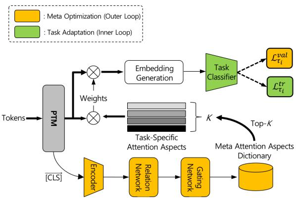
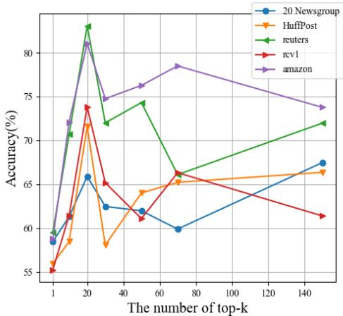
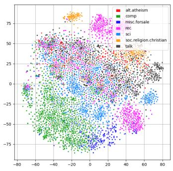
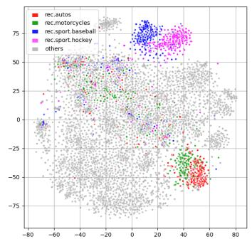
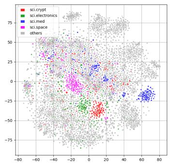

# LEA: Meta Knowledge-Driven Self-Attentive Document Embedding for Few-Shot Text Classification

S. K. Hong and Tae Young Jang

Samsung SDS, ML Research Center

{s.k.hong, tae10.jang}@samsung.com

## Abstract

In recent years, NLP has advanced greatly along with the proliferation of pre-trained language models. The pre-trained language models are also properly adapted to downstream tasks when there is sufficient labeled data. However, in real-world applications, we often encounter the deficiency of labeled data. When only given a few instances for a new task, extracting task-aware features from a pre-trained language model regardless of the adaptation is a promising alternative. In the study, we propose a novel embedding transfer method, called LEA, for leveraging pre-trained language models with even only few-shot instances. LEA derives meta-level attention aspects using our new meta-learning framework. We evaluate our method on five text classification benchmark datasets. The results show that the novel method robustly provides the competitive performance compared to recent few-shot learning methods.

## 1 Introduction

A deficiency of supervised data is often experienced in real-world NLP applications. Few-shot learning aims to yield an AI-driven NLP model capable of recognizing unseen tasks using a few labeled data. Meanwhile, fine-tuning pre-trained models (PTMs) (Howard and Ruder, 2018; Devlin et al., 2019; Lan et al., 2019; Liu et al., 2019) has been the most successful approach in recent years of NLP. Unfortunately, it is still challenging to utilize PTMs (Lee et al., 2019) in few-shot learning.

To address this subtle problem (Sun et al., 2019), we propose a meta-knowledge driven self-attentive embedding transfer method, called LEA (LEarningto-Attend), based on a novel meta-learning framework, through which meta-level attention aspects are derived by encoding how to attend for given tasks. LEA is an efficient and practical method that facilitates the utilization of large-sized PTMs in few-shot learning.

There are the two common transfer learning paradigms in NLP: feature-based transfer (Cer et al., 2018) and fine-tuning (Houlsby et al., 2019). Our approach belongs to the feature-based transfer.

LEA includes two key ideas: (1) construction of a meta-level attention aspects dictionary and (2) inference of the task-specific attention aspects upon the arrival of a new task. The former is a process by which useful meta-level attention aspects across tasks are derived based on a particular PTM via our meta-learning framework. The latter refers to as a task-adaption process, where a subset of taskspecific attention aspects is inferred by determining the top-k most relevant attention aspects from the meta-level attention aspects dictionary. While LEA can be applied to a wide variety of downstream tasks, we demonstrate LEA on few-shot text classification problems in the paper.

## 2 Related Work

Few-shot text classification: In (Geng et al., 2019), INDUCTION is proposed to build classwise embedding to represent each class using a particular dynamic routing algorithm coalesced with meta-learning. In (Bao et al., 2019), DS is introduced to keep track of underlying word distributions across all available classes and to specify important lexical features for new classes.

Meta-learning: As a metric learning-based method, (Snell et al., 2017) suggested a deep neural network, called a prototype network (PROTO), through which class representations are composed using a learning similarity metric for members of the same class. In (Sung et al., 2018), similar to PROTO, a deep neural network, called a relation network, is proposed to learn a non-linear distance metric rather than the Euclidean distance. In addition, LEO (Rusu et al., 2018) learns a lowdimensional latent embedding of the model parameters such that the classifiers are generated from the latent space into which the tasks are mapped. Frog-

GNN (Xu and Xiang, 2021) focuses on all querysupport pairs and proposes a multi-perspective aggregation based graph neural network to explicitly reflect intra-class similarity and inter-class dissimilarity.

## 3 Background

## 3.1 Problem Setup

Few-shot text classification is a task in which a classifier must be adapted to accommodate new classes using only a few labeled examples. In the literature, this is called a C-way K-shot problem in which K-labeled examples are given for each of the C number of classes. In a meta-learning setting, tasks are divided into a meta-training set $( S ^ { t r } )$ , meta-validation set $( S ^ { v a l } )$ , and meta-test set $( S ^ { t e s t } )$ as disjoint sets of classes.

## 3.2 Model-Agnostic Meta-Learning

Our proposed meta training strategy follows the overall procedure of optimization-based metalearning (Finn et al., 2017). For a parametric model $f _ { \theta } ,$ MAML seeks to find task-specific parameters $\theta _ { i }$ for any new task $\tau _ { i }$ sampled from a particular distribution of tasks. For a particular task $\tau _ { i } \sim p ( \tau )$ , the task data $\mathcal { D } _ { \tau _ { i } }$ consist of $\mathcal { D } _ { \tau _ { i } } ^ { t r }$ and $\mathcal { D } _ { \tau _ { i } } ^ { v a l }$ during the meta-training phase. MAML alternates between two update processes during meta-training: (1) task-adaptation and (2) meta-optimization.

Task adaptation (or inner update): Each task learner updates its own parameters through a gradient descent using the loss evaluated based on its own training data $\mathcal { D } _ { \tau _ { i } } ^ { t r }$ with the initial parameter $\theta _ { m }$ given by the outer meta-optimization process. The task-adaptation process is formulated as in Equation 1.

$$
\begin{array} { r } { \boldsymbol { \theta } _ { \tau _ { i } } ^ { ' }  \boldsymbol { \theta } _ { m } - \alpha \lor \boldsymbol { \theta } _ { m } \mathcal { L } _ { \tau _ { i } } ( f _ { \boldsymbol { \theta } _ { m } } , D _ { \tau _ { i } } ^ { t r } ) , } \end{array}\tag{1}
$$

Meta-optimization (or outer update): The metalearner updates its parameters through a gradient descent using the loss evaluated by $\mathcal { D } _ { \tau _ { i } } ^ { v a l }$ with respect to the task-specific parameters $\boldsymbol { \theta } _ { \tau _ { i } } ^ { \prime }$ . The metaoptimization process is formulated as in Equation 2:

$$
\theta _ { m } \gets \theta _ { m } - \beta \nabla \theta _ { m } \sum _ { \tau _ { i } \sim p ( \tau ) } \mathcal { L } _ { \tau _ { i } } \left( f _ { \theta _ { \tau _ { i } } ^ { \prime } } , \mathcal { D } _ { \tau _ { i } } ^ { v a l } \right)\tag{2}
$$

where $\mathcal { L } _ { \tau _ { i } }$ denotes a loss function for a task $\tau _ { i } .$ , and the inner and outer updates are applied through their own standard gradient descent with fixed learning rates α and $\beta ,$ respectively, which are given as hyperparameters.

  
Figure 1: The overall architecture of LEA.

In the meta-testing phase, the meta-learner provides the initial parameters for task-specific model learners. Subsequently, each task learner is individually tailored to find the optimal parameters $\theta _ { \tau _ { i } } ^ { ' }$ by applying the above task adaptation process. In this meta-testing, the dataset of task $\tau _ { i }$ is given as $\mathcal { D } _ { \tau _ { i } } = \left( \mathcal { D } _ { \tau _ { i } } ^ { t r } , \mathcal { D } _ { \tau _ { i } } ^ { t e } \right)$ .

## 3.3 Pre-Trained Models

We conducted all experiments with BERT (Devlin et al., 2019) and RoBERTa (Liu et al., 2019) as the underlying PTMs in the study. Given a text input, a dummy token (CLS) is added to the beginning of the input, and another token (SEP) is added to the end of a sentence. The PTMs end up with providing the corresponding embedding vectors (i.e., denoted as [CLS] and [SEP]) for the artificial tokens as well as embeddings for original tokens for the input text. For downstream classification tasks, the special embedding vector [CLS] is typically used to make a prediction as the representative of an text instance. In this study, the [CLS] vector plays an important role in probing the distinctive properties for an incoming task. In manufacturing a task-specific embedding, we especially utilize the token-level output embeddings of the individual tokens of the jth text instance under a particular task $\tau _ { i }$ , which we denote as $H _ { j } ^ { \tau _ { i } } = [ h _ { j , 1 } ^ { \tau _ { i } } , \dots , h _ { j , L } ^ { \tau _ { i } } ]$ . Likewise, the corresponding [CLS] embedding is denoted as $c _ { j } ^ { \tau _ { i } }$

## 4 Proposed Method

The overall architecture of LEA is shown in Figure 1. It represents our meta learning framework for the task-specific feature extraction. It is trained in an end-to-end manner using our proposed metalearning strategy. The meta training alternates two processes: (1) deriving all valid meta-attention aspects across tasks (namely, meta-optimization), and (2) choosing a task-specific subset from all the meta-attention aspects for each task (called, task adaptation). The high-level operation is described in Algorithm 1.

Algorithm 1 Our Proposed Meta-Training   
Require: Meta training set $\overline { { S ^ { t r } \in \tau } }$   
Require: Learning-rates α (inner-update), β (outer-update)   
Output: $W _ { A } { : }$ Meta-attention-aspects   
Output: $W _ { g } , W _ { n } \colon$ Noisy top-k gating network parameters   
Output: $\theta _ { m } , \theta _ { e } , \theta _ { r } , \theta _ { a } \colon$ model parameters   
1: Randomly initialize $W _ { A } , W _ { g } , W _ { n }$   
2: Randomly initialize $\theta _ { m } , \theta _ { e } , \ ' \theta _ { r } , \theta _ { a }$   
3: Let $\boldsymbol { \phi } = \{ W _ { A } , W _ { g } , W _ { n } , \theta _ { m } , \theta _ { e } , \theta _ { r } , \theta _ { a } \}$   
4: while not converged do   
5: for number of tasks in batch do   
6: Sample task instance $\tau _ { i } \sim { \cal S } ^ { t r }$   
7: Decide top-k weights $g ^ { \tau _ { i } }$ using $c ^ { \tau _ { i } }$   
8: Generate $\tau _ { i } .$ -attention aspects $W _ { A } ^ { \tau _ { i } }$ using $g ^ { \tau _ { i } }$   
9: Generate document embeddings $( \mathcal { E } _ { \tau _ { i } } ^ { t r } , \bar { \mathcal { E } } _ { \tau _ { i } } ^ { v a l } )$ using $H ^ { \tau _ { i } }$   
10: Initialize $\boldsymbol { \theta } _ { \tau _ { i } } ^ { \prime } = \boldsymbol { \theta } _ { m }$   
11: for number of adaptation steps do   
12: Compute Task-Adaptation loss $\mathcal { L } _ { \tau _ { i } } ^ { t r } \left( f _ { \theta _ { \tau _ { i } } ^ { \prime } } , \mathcal { E } _ { \tau _ { i } } ^ { t r } \right)$   
13: Perform gradient step w.r.t. $\boldsymbol { \theta } _ { \tau _ { i } } ^ { \prime }$   
14: $\boldsymbol { \theta } _ { \tau _ { i } } ^ { \prime }  \boldsymbol { \theta } _ { \tau _ { i } } ^ { \prime } - \alpha \lor _ { \boldsymbol { \theta } _ { \tau _ { i } } ^ { \prime } } \mathcal { L } _ { \tau _ { i } } ^ { t r } ( \boldsymbol { f } _ { \boldsymbol { \theta } _ { \tau _ { i } } ^ { \prime } } , \mathcal { E } _ { \boldsymbol { \tau } _ { i } } ^ { t r } )$   
15: end for   
16: Compute Meta-Optimization loss $\mathcal { L } _ { \tau _ { i } } ^ { v a l } ( f _ { \theta _ { \tau _ { i } } ^ { \prime } } )$   
17: end for   
18: Perform gradient step w.r.t ϕ   
19: $\begin{array} { r } { \phi  \phi - \beta \triangledown _ { \nabla \phi } \sum _ { \tau _ { i } } \mathcal { L } _ { \tau _ { i } } ^ { v a l } ( f _ { \theta _ { \tau _ { i } } ^ { \prime } } , \mathcal { E } _ { \tau _ { i } } ^ { v a l } ) + \lambda \cdot \Omega } \end{array}$   
20: end while

## 4.1 Meta Attention Aspects Dictionary

In this study, the meta-level knowledge dictionary maintains all attention aspects derived across tasks $\tau _ { i } \sim p ( \tau )$ . The concept was inspired by (Lin et al., 2017). The meta-attention aspects in the dictionary are established throughout the meta-optimization process during which it seeks to learn how to attend according to the distribution of tasks. Herein, we define a matrix $W _ { A } \in \mathbb { R } ^ { A _ { N } \times u }$ as the meta-level attention aspect dictionary. In addition, $A _ { N }$ and u are the total number of attention aspects and dimension of the attention aspect, respectively.

## 4.2 Top-k Attention Aspects Selection through Gate Network

When a novel task $\tau _ { i }$ is given, its related attention aspects, denoted by $W _ { A } ^ { \tau _ { i } }$ , are selectively obtained by assigning the corresponding weights to members of the meta-level attention aspects $W _ { A }$ in the task-adaptation process. Here, $W _ { A } ^ { \tau _ { i } } \in \mathbb { R } ^ { k \times u }$ indicates the selected k attention aspects of the task $\tau _ { i }$

Note that k and K are different in that the former is the number of topmost relevant attention aspects, whereas the latter, indicates as K-shot, refers to the number of samples in few-shot learning. To do so, we assess the relevance of the task among the meta-level attention aspects $W _ { A }$ . First, each task is fed into an encoding process, which is formulated as follows:

$$
e _ { n } ^ { \tau _ { i } } = \frac { 1 } { N K ^ { 2 } } \sum _ { k _ { n } = 1 } ^ { K } \sum _ { m = 1 } ^ { N } \sum _ { k _ { m } = 1 } ^ { K } f _ { \theta _ { r } } \left( f _ { \theta _ { e } } \big ( c _ { k _ { n } } ^ { \tau _ { i } } \big ) , f _ { \theta _ { e } } \big ( c _ { k _ { m } } ^ { \tau _ { i } } \big ) \right) ,\tag{3}
$$

where $e _ { n } ^ { \tau _ { i } }$ is the representative embedding for the particular class n under a given task $\tau _ { i } , f _ { \theta _ { \ i } }$ indicates the relation network (Sung et al., 2018), and $f _ { \theta _ { e } }$ is an encoder network that transforms the delegate embedding [CLS] (denoted as $c _ { j } ^ { \tau _ { i } }$ for the case of the jth text instance of a specific task $\tau _ { i } )$ of a text instance in PTMs (Devlin et al., 2019; Lan et al., 2019; Liu et al., 2019). As a result, the class embedding $e _ { n } ^ { \tau _ { i } }$ is enforced to encode the pairwise relationship with other classes.

Using the aforementioned class embedding, we attempt to selectively (i.e., top-k) collect taskspecific attention aspects for a given task by employing a gating mechanism (Shazeer et al., 2017). The gating output vector is calculated through the following formulation:

$$
g _ { n } ^ { \tau _ { i } } = \mathrm { s o f t m a x } \left( G ( e _ { n } ^ { \tau _ { i } } ; W _ { g } , W _ { n } , k ) \right) ,\tag{4}
$$

where $g _ { n } ^ { \tau _ { i } }$ is the gating output vector whose number of dimensions must be the same as the size of the meta-attention-aspects dictionary. The gating process G produces a sparse output vector by being parameterized with $\{ W _ { g } \in \bar { \mathbb { R } } ^ { A _ { N } \times A _ { N } } , W _ { n } \in$ $\mathbb { R } ^ { \bar { A } _ { N } \times A _ { N } } , k \}$ , where the remaining values except for the k elements are forced to become zeros, and the top-k weights are finally generated through a softmax function.

As a result, we can extract the top-k task-specific attention aspects for the task $\tau _ { i }$ . This is formulated as follows:

$$
W _ { A } ^ { \tau _ { i } } = ( ( W _ { A } ) ^ { T } g _ { n } ^ { \tau _ { i } } ) ^ { T } .\tag{5}
$$

## 4.3 Task-Specific Self-Attentive Document Embedding

Here, we perform the self-attentive feature extraction using the aforementioned top-k task-specific attention aspects for a task. We then apply it into the generation of document embeddings for text classification. For a text input, we utilize the corresponding embedding vectors for the individual tokens, which are denoted as $H _ { j } ^ { \tau _ { i } } = [ h _ { j , 1 } ^ { \tau _ { i } } , \dots , h _ { j , L } ^ { \tau _ { i } } ]$ for the jth text example of the task $\tau _ { i } .$ . This is formulated as follows:

Table 1: Results of 5-way 1-shot classification.
<table><tr><td colspan="2"></td><td>20 Newsgroup</td><td>HuffPost</td><td>Reuters</td><td>RCV1</td><td>Amazon</td></tr><tr><td colspan="2">MAML (Finn et al., 2017)</td><td>43.58%</td><td>35.27%</td><td>43.82%</td><td>36.69%</td><td>48.12%</td></tr><tr><td colspan="2">PROTO (Snell et al., 2017)</td><td>34.78%</td><td>28.62%</td><td>46.78%</td><td>34.40%</td><td>36.42%</td></tr><tr><td colspan="2">LEO (Rusu et al., 2018)</td><td>36.42%</td><td>28.75%</td><td>35.37%</td><td>32.26%</td><td>39.54%</td></tr><tr><td colspan="2">INDUCTION (Geng et al., 2019)</td><td>43.04%</td><td>35.62%</td><td>42.73%</td><td>36.24%</td><td>36.33%</td></tr><tr><td colspan="2">DS (Bao et al., 2019)</td><td>41.79%</td><td>25.52%</td><td>52.32%</td><td>44.35%</td><td>46.32%</td></tr><tr><td colspan="2">Frog-GNN (Xu and Xiang, 2021)</td><td></td><td>54.1 %</td><td></td><td></td><td>71.5 %</td></tr><tr><td rowspan="3">LEA</td><td>BERTBASE</td><td>53.47%</td><td>48.43 %</td><td>71.64%</td><td>51.96%</td><td>63.6%</td></tr><tr><td>RoBERTaBASE</td><td>45.97%</td><td>42.16%</td><td>63.2%</td><td>45.16%</td><td>67.61%</td></tr><tr><td>fastText</td><td>54.07%</td><td>46.15%</td><td>69.01%</td><td>42.83%</td><td>66.53%</td></tr></table>

Note: The highest performance in each dataset is highlighted in Bold.

Table 2: Results of 5-way 5-shot classification.
<table><tr><td colspan="2"></td><td>20 Newsgroup</td><td>HuffPost</td><td>Reuters</td><td>RCV1</td><td>Amazon</td></tr><tr><td colspan="2">MAML (Finn et al., 2017)</td><td>52.73%</td><td>44.22%</td><td>56.96%</td><td>40.47%</td><td>63.71 %</td></tr><tr><td colspan="2">PROTO (Snell et al., 2017)</td><td>55.07%</td><td>45.56%</td><td>51.22%</td><td>44.05%</td><td>49.54 %</td></tr><tr><td colspan="2">LEO (Rusu et al., 2018)</td><td>52.17%</td><td>42.25%</td><td>54.07%</td><td>47.42%</td><td>52.47 %</td></tr><tr><td colspan="2">INDUCTION (Geng et al., 2019)</td><td>53.11%</td><td>44.22%</td><td>48.00%</td><td>45.76%</td><td>40.96 %</td></tr><tr><td colspan="2">DS (Bao et al., 2019)</td><td>52.5%</td><td>37.01%</td><td>80.80%</td><td>68.52%</td><td>70.43 %</td></tr><tr><td colspan="2">Frog-GNN (Xu and Xiang, 2021)</td><td></td><td>69.6%</td><td></td><td></td><td>83.6%</td></tr><tr><td rowspan="3">LEA</td><td>BERTBASE</td><td>65.88%</td><td>71.6%</td><td>83.07%</td><td>73.81%</td><td>82.69 %</td></tr><tr><td>RoBERTaBASE</td><td>59.20%</td><td>68.35%</td><td>85.38%</td><td>69.08%</td><td>85.12 %</td></tr><tr><td>fastText</td><td>60.18%</td><td>65.75%</td><td>89.01%</td><td>71.13 %</td><td>83.51 %</td></tr></table>

Note: The highest performance in each dataset is highlighted in Bold.

$$
\mathcal { E } _ { j } ^ { \tau _ { i } } = W _ { A } ^ { \tau _ { i } } H _ { j } ^ { \tau _ { i } } ,\tag{6}
$$

where $\mathcal { E } _ { i } ^ { \tau _ { i } } \in \mathbb { R } ^ { k \times L }$ is the self-attentive document embedding of the jth input of the task $\tau _ { i } ,$ and $H _ { i } ^ { \tau _ { i } } \in \mathbb { R } ^ { u \times L }$ is a set of token embedding vectors for the jth instance with L tokens in the task $\tau _ { i }$

For the text classification, we sum $\mathcal { E } _ { j } ^ { \tau _ { i } }$ columnwise and then feed it into a fully connected neural network (denoted as $F C _ { \theta _ { \tau _ { i } } ^ { \prime } } )$ with the parameters $\boldsymbol { \theta } _ { \tau _ { i } } ^ { \prime }$ , which are optimized in the task-adaptation step to make the final predictions.

## 4.4 Meta-Training Objectives

As noted in Algorithm 1, LEA alternates the following two update steps: (1) task adaptation (or inner-update) and (2) meta-optimization (or outerupdate). The former proceeds as follows:

$$
\boldsymbol { \theta } _ { \tau _ { i } } ^ { \prime }  \boldsymbol { \theta } _ { \tau _ { i } } ^ { \prime } - \alpha \lor { \theta } _ { \tau _ { i } } ^ { \prime } \mathcal { L } _ { \tau _ { i } } ^ { t r } ( f _ { \boldsymbol { \theta } _ { \tau _ { i } } ^ { \prime } } , \mathcal { E } _ { \tau _ { i } } ^ { t r } ) ,\tag{7}
$$

where $\boldsymbol { \theta } _ { \tau _ { i } } ^ { \prime }$ indicates the task model parameters, and $\mathcal { L } _ { \tau _ { i } } ^ { t r }$ is the classification loss by relying on $\mathcal { E } _ { \tau _ { i } } ^ { t r }$ derived from $\mathcal { D } _ { \tau _ { i } } ^ { t r }$

During the meta-optimization step, the groups of parameters $\{ W _ { A } , W _ { g } , W _ { n } , \theta _ { m } , \theta _ { e } , \theta _ { r } , \theta _ { a } \}$ are trained in the outer loop with $\mathcal { D } _ { \tau _ { i } } ^ { v a l }$ . This is formulated as follows:

$$
\phi  \phi - \beta \bigtriangledown _ { \phi } \sum _ { \tau _ { i } } \mathcal { L } _ { \tau _ { i } } ^ { v a l } ( f _ { \theta _ { \tau _ { i } } ^ { \prime } } , \mathcal { E } _ { \tau _ { i } } ^ { v a l } , ) ) + \lambda \cdot \Omega\tag{8}
$$

  
Figure 2: The 5-way 5-shot prediction accuracy depending on the number of top-k attention aspects.

where, Ω, as a regularization, includes the term that encourages all attention aspects to have equal importance (Shazeer et al., 2017), and λ is its associated coefficient as usual.

## 5 Experimental Results

We evaluated LEA on five text datasets — 20 Newsgroup(Lang, 1995), Huffpost headline(Misra and Grover, 2021), Reuters-21578(Lewis., 1997), RCV-1(Lewis et al., 2004), and Amazon product reviews (He and McAuley, 2016) — and compared it with current state-of-art methods. We conducted two different experiments: 5-way 1-shot and 5-way 5- shot all over datasets. The details of the datasets are introduced in Appendix A.1.

## 5.1 Baselines

In this experiment, we evaluate and compare LEA with six state-of-art methods as follows: Here, MAML (Finn et al., 2017) denotes the representative optimization-based meta-learning algorithm, PROTO (Snell et al., 2017) indicates the prototype network, LEO (Rusu et al., 2018) denotes the meta-learning algorithm using latent embedding optimization, INDUCTION indicates the induction network (Geng et al., 2019), DS (Bao et al., 2019) denotes few-shot text classification algorithm using the underlying word distributions, and Frog-GNN (Xu and Xiang, 2021) denotes the multi-perspective aggregation based graph neural network.

## 5.2 Overall Performance

We performed all experiments on a frozen BERTBASE (Devlin et al., 2019) as a representative PTM for LEA and all baselines. As in LEA, DS is given the [CLS] embedding and the token embeddings from BERT’s last layer, whereas the other algorithms used the [CLS] embedding of BERT. For the comparison with Frog-GNN, we referred to the reported results from (Xu and Xiang, 2021). We additionally applied LEA on RoBERTaBASE (Liu et al., 2019) and fastText (Bojanowski et al., 2017) to verify the applicability of LEA. All performance scores are reported as the average for three repetitions.

  
(a)

  
(b)

  
(c)  
Figure 3: t-SNE plot of task-specific embedding space after task adaptation. (a) Embedding space of seven top-level domains. (b) Same as (a) but highlighted by the four classes in ‘recreation’ domain. (c) Same as (a) but highlighted by the four classes in ‘science’ domain.

As shown in Table 1 and 2, LEA exhibits the competitive performance in both the 5-way 1-shot and 5-way 5-shot, compared to the state-of-the-arts for all the datasets. Namely, the results demonstrate that LEA quickly recognizes how to attend for new tasks using the established meta-attention aspects and provides a robust performance in few-shot text classification problems.

## 5.3 Hyperparameter Study: Effect of the Number of Top-k Attention Aspects

We also investigate the impact of the number (i.e., k) of task-specific attention aspects. This specific study was conducted on the same frozen BERTBASE as the underlying PTM with the 5-way 5-shot experiment for the all datasets. We fixed the size of the meta attention aspects dictionary to 150 and measured the performances by gradually scaling the k up to 1, 10, 20, 30, 50, 75, 150. As shown in Figure 2, all the datasets exhibit their best performance when setting the top-k attention aspects to 20. This empirical result indicates that each task derives its optimal document embedding by referring only to the most relevant subset rather than exploiting all meta-level attention aspects.

## 5.4 Task-Specific Document Embedding Visualization

In addition, we plots the task-specific document embeddings and observe the relationships among classes on 20 Newsgroups dataset. To qualitatively characterize the task-specific document embedding space, we split 20 Newsgroup into seven top-level domains, that is, ‘atheism’, ‘computer’, ‘for-sale’, ‘recreation’, ‘science’, ‘religion’, and ‘talk’ and projected them via t-SNE as shown in Figure 3a. Figure 3b shows the relationships between the ‘recreation’ domain composed of four classes and the rest on the space. Figure 3c shows the relationships between the four classes of the ‘science’ domain and the others on the space. These plots demonstrate that LEA produces a structured task-specific embedding space after our task-adaptation step.

## 6 Conclusion

We hypothesized that a type of task-specific selfattentive mechanism might improve few-shot learning performance, especially when it is prohibitive to fine-tune a large-sized PTM. We have attempted to design a novel embedding transfer method for deriving a meta-level attention aspects dictionary to enable a new task to simply borrow the most relevant attention aspects from the dictionary. As a result, we proposed a novel meta-learning framework for the learning-to-attend and showed that LEA is an effective method that facilitates the utilization of large-sized PTMs in few-shot learning.

## References

Yujia Bao, Menghua Wu, Shiyu Chang, and Regina Barzilay. 2019. Few-shot text classification with distributional signatures. In International Conference on Learning Representations.

Piotr Bojanowski, Edouard Grave, Armand Joulin, and Tomas Mikolov. 2017. Enriching word vectors with subword information. Transactions of the Associationfor Computational Linguistics, 5:135–146.

Daniel Cer, Yinfei Yang, Sheng-yi Kong, Nan Hua, Nicole Limtiaco, Rhomni St John, Noah Constant, Mario Guajardo-Cespedes, Steve Yuan, Chris Tar, et al. 2018. Universal sentence encoder. arXiv preprint arXiv:1803.11175.

Jacob Devlin, Ming-Wei Chang, Kenton Lee, and Kristina Toutanova. 2019. Bert: Pre-training of deep bidirectional transformers for language understanding. In Proceedings of the Conference of the North American Chapter of the Association for Computational Linguistics: Human Language Technologies, pages 4171–4186.

Chelsea Finn, Pieter Abbeel, and Sergey Levine. 2017. Model-agnostic meta-learning for fast adaptation of deep networks. In International Conference on Machine Learning, pages 1126–1135. PMLR.

Ruiying Geng, Binhua Li, Yongbin Li, Xiaodan Zhu, Ping Jian, and Jian Sun. 2019. Induction networks for few-shot text classification. In Proceedings of the 2019 Conference on Empirical Methods in Natural Language Processing and the 9th International Joint Conference on Natural Language Processing (EMNLP-IJCNLP), pages 3904–3913.

Ruining He and Julian McAuley. 2016. Ups and downs: Modeling the visual evolution of fashion trends with one-class collaborative filtering. In proceedings of the 25th international conference on world wide web, pages 507–517.

Neil Houlsby, Andrei Giurgiu, Stanislaw Jastrzebski, Bruna Morrone, Quentin De Laroussilhe, Andrea Gesmundo, Mona Attariyan, and Sylvain Gelly. 2019. Parameter-efficient transfer learning for nlp. In International Conference on Machine Learning, pages 2790–2799. PMLR.

Jeremy Howard and Sebastian Ruder. 2018. Universal language model fine-tuning for text classification. arXiv preprint arXiv:1801.06146.

Zhenzhong Lan, Mingda Chen, Sebastian Goodman, Kevin Gimpel, Piyush Sharma, and Radu Soricut. 2019. Albert: A lite bert for self-supervised learning of language representations. In International Conference on Learning Representations.

Ken Lang. 1995. Newsweeder: Learning to filter netnews. In Machine Learning Proceedings 1995, pages 331–339. Elsevier.

Cheolhyoung Lee, Kyunghyun Cho, and Wanmo Kang. 2019. Mixout: Effective regularization to finetune large-scale pretrained language models. In International Conference on Learning Representations.

David D. Lewis. 1997. Reuters-21578, distribution 1.0.

David D Lewis, Yiming Yang, Tony Russell-Rose, and Fan Li. 2004. Rcv1: A new benchmark collection for text categorization research. Journal of machine learning research, 5(Apr):361–397.

Zhouhan Lin, Minwei Feng, Cicero Nogueira dos Santos, Mo Yu, Bing Xiang, Bowen Zhou, and Yoshua Bengio. 2017. A structured self-attentive sentence embedding. arXiv preprint arXiv:1703.03130.

Yinhan Liu, Myle Ott, Naman Goyal, Jingfei Du, Mandar Joshi, Danqi Chen, Omer Levy, Mike Lewis, Luke Zettlemoyer, and Veselin Stoyanov. 2019. Roberta: A robustly optimized bert pretraining approach. arXiv preprint arXiv:1907.11692.

Rishabh Misra and Jigyasa Grover. 2021. Sculpting Data for ML: The first act of Machine Learning.

Andrei A Rusu, Dushyant Rao, Jakub Sygnowski, Oriol Vinyals, Razvan Pascanu, Simon Osindero, and Raia Hadsell. 2018. Meta-learning with latent embedding optimization. In International Conference on Learning Representations.

Noam Shazeer, Azalia Mirhoseini, Krzysztof Maziarz, Andy Davis, Quoc Le, Geoffrey Hinton, and Jeff Dean. 2017. Outrageously large neural networks: The sparsely-gated mixture-of-experts layer. arXiv preprint arXiv:1701.06538.

Jake Snell, Kevin Swersky, and Richard S Zemel. 2017. Prototypical networks for few-shot learning. arXiv preprint arXiv:1703.05175.

Qianru Sun, Yaoyao Liu, Tat-Seng Chua, and Bernt Schiele. 2019. Meta-transfer learning for few-shot learning. In Proceedings of the IEEE/CVF Conference on Computer Vision and Pattern Recognition, pages 403–412.

Flood Sung, Yongxin Yang, Li Zhang, Tao Xiang, Philip HS Torr, and Timothy M Hospedales. 2018. Learning to compare: Relation network for few-shot learning. In Proceedings of the IEEE conference on computer vision and pattern recognition, pages 1199–1208.

Shiyao Xu and Yang Xiang. 2021. Frog-gnn: Multiperspective aggregation based graph neural network for few-shot text classification. Expert Systems with Applications, 176:114795.

Table 3: Architecture details
<table><tr><td>Module Name</td><td>Architecture</td><td>Shape of (input, output)</td><td>The number of Params</td></tr><tr><td>Encoder  $\overline { { ( \mathrm { E q . } 3 , f _ { \theta _ { e } } ) } }$ </td><td>linear</td><td>(768, 200) First layer : (2 × 200, 2 X200)</td><td>153.6K</td></tr><tr><td>Relation Network  $( \mathrm { E q } . 3 , f _ { \theta _ { r } } )$ </td><td>2-layer MLP with ReLU</td><td>ReLU Second layer : (2 × 200, 150)</td><td>700K</td></tr><tr><td>Gating Network (Eq.4,  $f _ { \theta _ { r } } )$ </td><td>linear</td><td>ReLU (150, 150)</td><td>22.5K</td></tr><tr><td>Meta Attention Aspects  $\overline { { ( \mathrm { E q . } 5 , W _ { A } ) } }$ </td><td>matrix</td><td>(150, 768)</td><td>115.2K</td></tr><tr><td>Task-Specific Attention Aspects (Eq.6, Eτi)1</td><td>linear</td><td>(20, 768)</td><td>15.36K</td></tr><tr><td>Task Classifier</td><td>1-layer MLP with ReLU</td><td>First layer : (768, 300) ReLU output layer : (300, 5)</td><td>231.9K</td></tr></table>

## A Appendix

## A.1 Datasets

We introduce the datasets and the split (i.e., train/val/test) which had been maintained in our experiments.

20 Newsgroups is a collection of discourses in newsgroup posts for 20 topics (Lang, 1995).

Huffpost Headlines is a collection of news headlines published in the Huffington Post from 2012 to 2018 (Misra and Grover, 2021). It is composed of 41 topics.

Reuters-21578 is composed of documents that appeared on the Reuters newswire in 1987 (Lewis., 1997). In addition, we use the ApteMod version and discard documents with more than one label to avoid ambiguity, and thus 31 classes remain.

RCV-1 is a set of newswire stories published by Reuters journalists from 1996 to 1997 (Lewis et al., 2004) and comprises 71 topic classes.

Amazon data is a real-world dataset collected from Amazon.com as a set of customer reviews from 24 types of product categories(He and McAuley, 2016). Our goal is to match reviews to their own corresponding product categories.

To train and evaluate the models, we divided each of the aforementioned datasets into a metatraining set $( S ^ { t r } )$ , meta-validation set $( S ^ { v a l } )$ , and meta-test set $( S ^ { t e s t } )$ as disjoint sets of classes within the experimental setting. In this work, we used the same split of classes as in (Bao et al., 2019) for the Huffpost headline(Misra and Grover, 2021), Reuters-21578(Lewis., 1997), and RCV-1(Lewis et al., 2004) datasets. Hence, the Huffpost headline is divided into 20, 5, and 16 disjoint classes for meta-training, validation, and test sets.

In terms of Reuters-21678, 15, 5, and 11 disjoint classes are used for meta-training/validation/test sets and 37, 10, and 24 disjoint classes for RCV-1. In Amazon product data, we split the data using rules in (Bao et al., 2019), and its training and validation sets are used for meta-training set. As a result, Amazon product data is divided into 15, and 9 disjoint classes for meta-training and test sets and meta-validation set is not used in Amazon product data. For the 20 Newsgroup dataset, we randomly selected 20 topic classes, and the metatraining set, meta-validation set, and meta-test set contained 10, 5, and 5 disjoint classes, respectively. We summarize the above information in Table 4.

Table 4: Data Splitting
<table><tr><td>Dataset</td><td># of tr. cls.</td><td># of val. cls.</td><td># of test cls.</td></tr><tr><td>20 Newsgroup</td><td>10</td><td>5</td><td>5</td></tr><tr><td>HuffPost</td><td>20</td><td>5</td><td>16</td></tr><tr><td>Reuters</td><td>15</td><td>5</td><td>11</td></tr><tr><td>RCV-1</td><td>37</td><td>10</td><td>24</td></tr><tr><td>Amazon</td><td>10</td><td>5</td><td>9</td></tr></table>

Table 5: Hyperparameters for training process Hyperparameters
<table><tr><td colspan="3">Hyperparameters</td></tr><tr><td rowspan="2">meta-training set</td><td># of tasks</td><td>8</td></tr><tr><td># of queries</td><td>15</td></tr><tr><td rowspan="2">meta-validation set</td><td># of tasks</td><td>15</td></tr><tr><td># of queries</td><td>15</td></tr><tr><td rowspan="2">meta-test set</td><td># of tasks</td><td>15</td></tr><tr><td># of queries</td><td>15</td></tr><tr><td colspan="2">α (learning rates in Eq.7)</td><td>1</td></tr><tr><td colspan="2">β (learning rates in Eq.8)</td><td>0.001</td></tr><tr><td colspan="2">λ (regularization weight in Eq.8)</td><td>0.0001</td></tr><tr><td colspan="2">number of adaptation steps</td><td>40</td></tr></table>

## A.2 Implementation Details

We share the breakdown of LEA’s implementation. In the encoding process of our experiments, the 768-dimensional [CLS] vector, which is of the same size of the output of the pre-trained BERTbase-uncased, is linearly transformed through $f _ { \theta _ { e } }$ into a 300-dimensional vector. The relation network, $f _ { \theta _ { r } }$ is composed of two-layers neural network with ReLU activation and input size is two times of encoder outputs and the size of output is the number of meta-attention-aspects, i.e., 150.

  
Figure 4: Visualization of attention weights generated by our model. The texts in (a) and (b) are different samples under a topic Corporate and Industrial. (c) and (d) are related to Markets and Economics.

The gating network, $W _ { g }$ is linear transformation and its size is the number of meta-attention-aspects. For each task classifier, that is, $f _ { \theta _ { \tau } ^ { \prime } }$ , it is designed i as single-layer fully connected neural network. We set the size to 150 for the meta-attention-aspects dictionary, and importantly fixed the number of top-k attention aspects to 20. Table 3 summarizes the above model parameters.

## A.3 Training Details and Hyperparameter Tuning

In our work, we train all experiments on a single NVIDIA A100 32G GPU. During the meta-training process, we sampled four tasks with 15 queries from $S ^ { t r }$ , and it leads to performing task adaptation four times per each meta-optimization update and early stop when the validation loss fails to improve for 20 steps. In validation and test process, we sampled 30 tasks with 15 queries from $S ^ { v a l }$ and $\mathcal { S } ^ { t e s \bar { t } }$ , and only performed task adaptation using K-shots. After that, the performance of the adapted task model is obtained using queries. We used the Adam optimizer with learning rates of 0.1 and 0.001 in the inner and outer updates, that is, α and β in , respectively. In addition, the coefficient λ of the regularization term was set as 0.0001. We summarize the hyperparameters in Table 5.

## A.4 Case Study: Visualization of Attention Weights on Text

Herein, we visualize the heatmaps in some cases to investigate how to assign attention weights to text. Figure 4b demonstrates a termination of stock sale pact, and Figure 4a shows a company growth in terms of consumer products. These were extracted under the Corporate and Industrial topic in the RCV-1 dataset and some seminal words such as “agreement”, “contractual” and “receivership” are highlighted to appear in the topic. Figure 4c shows that the Turkish market was closed related to the Market topic, and its relevant words such as “Turkish,” “markets,” and “closed” are highly attended as expected. Figure 4d talks about the authority of platinum and gold coins under the Economics topic, and the words “US,” “Mint,” “authority,” “gold,” “platinum,” and “coin” are hence highlighted. As shown in these cases, LEA properly captures important words under a certain topic and assigns attention weights to a given text.