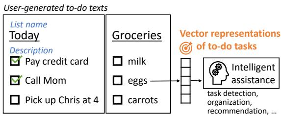
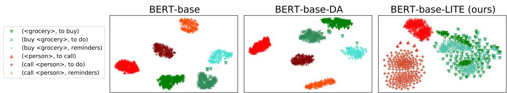
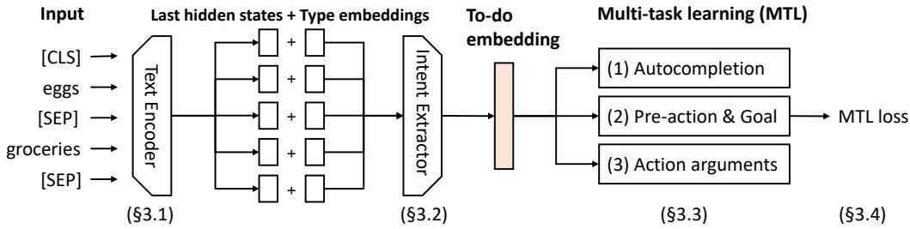

# LITE: Intent-based Task Representation Learning Using Weak Supervision

Naoki Otani†∗, Michael Gamon‡, Sujay Kumar Jauhar‡,

Mei Yang‡, Sri Raghu Malireddi‡, Oriana Riva‡

†Language Technologies Institute, Carnegie Mellon University, Pittsburgh, PA, USA ‡Microsoft Research, Redmond, WA, USA

†notani@cs.cmu.edu

‡{mgamon,sjauhar,meiyang,sri.malireddi,oriana.riva}@microsoft.com

## Abstract

Users write to-dos as personal notes to themselves, about things they need to complete, remember or organize. To-do texts are usually short and under-specified, which poses a challenge for current text representation models. Yet, understanding and representing their meaning is the first step towards providing intelligent assistance for to-do management. We address this problem by proposing a neural multitask learning framework, LITE, which extracts representations of English to-do tasks with a multi-head attention mechanism on top of a pre-trained text encoder. To adapt representation models to to-do texts, we collect weaksupervision labels from semantically rich external resources (e.g., dynamic commonsense knowledge bases), following the principle that to-do tasks with similar intents have similar labels. We then train the model on multiple generative/predictive training objectives jointly. We evaluate our representation model on four downstream tasks and show that our approach consistently improves performance over baseline models, achieving error reduction of up to 38.7%.

## 1 Introduction

Task management tools are widely used to organize tasks and keep track of progress in work and daily lives. Examples include Microsoft To-do, Todoist, Trello, and digital assistants such as Amazon Alexa and Google Assistant. Machine learning techniques can automate various aspects of task management such as task creation (Mukherjee et al., 2020), organization (Landes and Di Eugenio, 2018), prioritization, and decomposition of complex tasks (Nouri et al., 2020; Zhang et al., 2021).

The goal of this work is to develop a single, general-purpose encoding system that converts todo task texts into real-valued vector representations (Fig. 1). Using one encoding system for multiple task functions (task detection, organization, recommendation, etc.) as opposed to having multiple dedicated encoders saves the computational costs of updating models regularly and encoding texts from millions of users.

  
Figure 1: Our aim is to encode user-generated to-do texts (list names and descriptions) into vector representations so that machine learning systems can provide various kinds of intelligent assistance.

Representation learning has been extensively studied in natural language processing (Camacho-Collados and Pilehvar, 2018). Adapting models pre-trained on massive amounts of raw texts to a target domain or a task has become common practice (Qiu et al., 2020), with many publicly available pre-trained models such as BERT (Devlin et al., 2019), GPT-2 (Radford et al., 2018), and sentence encoders (Cer et al., 2018; Reimers and Gurevych, 2019). Leveraging word context is one of the key strengths of these pre-trained models. However, to-do texts exhibit unique characteristics that make this context-based modeling less effective (§2).

Our analysis on a dataset of 6.5 million entries shows that to-do texts are short and often lack an action verb. While similar to web search queries, they are not written to be understood by a search engine but instead are personal notes to the users themselves and assume rich personal context. On the other hand, some task management applications allow users to organize their to-dos under userdefined lists, which, our analysis shows, can sometimes convey important information about their meaning (e.g., a “grocery” list vs. a “today” list).

Our hypothesis is that we can effectively fine-tune contextualized representation models for under-specified texts using multiple weaklysupervised prediction/generation tasks that focus on knowledge about to-do tasks. We induce supervision signals semi-automatically from existing resources so that to-do tasks that have similar intents share similar target labels. To this end, we propose LITE,1 a framework for training todo task representation models using the following auxiliary tasks: (1) autocompletion of to-do descriptions, (2) pre-action and goal generation based on COMET (Bosselut et al., 2019; Hwang et al., 2021), and (3) action attribute predictions based on FrameNet (Ruppenhofer et al., 2016). We implement LITE on top of existing pre-trained language models and evaluate its performance through downstream tasks on two proprietary and two publicly available datasets (Jauhar et al., 2021; Landes, 2018): urgent and important to-do detection, actionable to-do classification, co-located and co-timed to-do pair detection, and intent detection.

Overall, we make the following contributions: (1) A neural multi-task learning framework to fine-tune embeddings of to-do texts based on intents.2 (2) A methodology to collect weak supervision signals from various resources without costly manual annotations. (3) An empirical comparison of contextual embeddings models on real todo texts, where LITE outperforms various baseline models including BERT, RoBERTa, Sentence-BERT/RoBERTa, achieving error reduction of 4.8- 38.7%.

## 2 User-generated To-do Data

## 2.1 Data Collection

For training and data analysis, we use a dataset based on the now-retired Wunderlist task management app. The app was available on multiple platforms and had more than 13 million users in 2015. The dataset (henceforth WL) contains 6.5 million English to-do texts. Each to-do text includes a description (e.g., “call mom”) and associated list name (e.g, “today”). See Appendix A for more details on how the dataset was anonymized.

We performed a basic linguistic analysis on the WL data. As observed by Landes and Di Eugenio (2018), general-purpose analyzers often fail to analyze to-do texts correctly due to the writing style and the lack of context words. To alleviate this problem, we use frequency information obtained from a large corpus to correct automatically assigned POS tags, through the following 3-step process. First, we run the spaCy tagger (Honnibal et al., 2020)3 to assign POS tags. Then, as proposed by Keyaki and Miyazaki (2017), we correct the POS tags based on frequency information derived from 3 billion sentences from the DepCC corpus (Panchenko et al., 2018).4 Finally, we apply the spaCy dependency parser to the texts with the corrected POS tags and identified main verbs and arguments.

## 2.2 Observations

To-do descriptions are very short: The mean number of tokens per to-do description is 2.4, which is similar to that of search engine queries (Taghavi et al., 2012), but with two key differences: (1) many search queries are intended for information seeking (Broder, 2002), while to-dos typically express things to perform or to remember, and (2) people write search queries with the capabilities of a search engine in mind, but to-do descriptions are personal notes to the users themselves.

Most to-do descriptions have no action verb: We observed that 87.8% of to-do descriptions do not have action verbs. If an action verb is present, 75.1% and 12.7% have a direct object and a prepositional phrase, respectively. The degree of underspecification depends on a to-do’s list name. An action verb is more frequently used in to-do descriptions that appear in generic lists, such as “inbox”5 (29.7%), “to do” (28.4%), and “today” (22.1%). When list names already imply a specific action, the action verb is more likely to be omitted such as in the “shopping” (3.3%) and “movies to watch” (4.7%) lists.

List names can be indicative of task intents: For example, a to-do text (description = “avocados”, list name = “to buy”) signifies the intent “to buy avocados”, but the same description can appear also in generic lists, such as “to do” or “reminders”. When a list name is generic, a task description needs to be weighted more to accurately capture the intent of a task. Fig. 2 shows that this is a nontrivial problem for pre-trained language models like BERT. The figure visualizes the distribution of the embeddings of the “buy <grocery>” and “call <person>” to-do texts6 expressed in two ways: (1) the descriptions “buy <grocery>” and “call <person>” are paired with generic list names (“to do” and “reminders”); or (2) the descriptions “<grocery>” and “<person>” are paired with specific list names (indicating the actions “to buy” and “to call”). To produce embeddings, we concatenated descriptions and list names in the input and extracted their pooled output from the encoders (§3.1). We can see that a BERT model cannot capture the similarity within the buy nor call intent groups even after domain adaptation (DA) to to-do texts (see §4.3 for more details on DA). Our model, LITE, can successfully ignore the generic lists and group similar tasks together.

  
Figure 2: t-SNE (van der Maaten and Hinton, 2008) visualization of the embeddings of to-do texts generated by (1) BERT-base, (2) BERT-base domain-adapted by masked language modeling on WL, and (3) LITE.

## 3 Method: Multi-task Learning (MTL)

We propose a multi-task learning (MTL) framework to represent to-do descriptions along with their list names (Fig. 3). Our model first encodes text using off-the-shelf encoders (§3.1). The token representations along with information about their types are merged by an intent extractor with multihead attention (§3.2). We train the encoder and extractor on three auxiliary tasks (§3.3,3.4).

## 3.1 Off-the-shelf Text Encoder

We encode input texts using off-the-shelf pretrained transformer-based language models, BERT (Devlin et al., 2019) and RoBERTa (Liu et al., 2019b).7 Our model takes as input the concatenation of two types of texts, descriptions and list names, separated by the token [SEP]: <s> desc. [SEP] list name $< / \varsigma >$ , where <s> and $< / \varsigma >$ are beginning-of-sentence and end-of-sentence tokens pre-defined for the encoder. The encoder converts a sequence of N input tokens $w _ { 1 } , w _ { 2 } , \cdot \cdot \cdot w _ { N }$ into real-valued vector representations using multiple layers of attention mechanism and fully-connected networks. We use the last hidden states $H = \{ h _ { i } \} _ { i = 1 , 2 , \cdots , N }$ as the contextual token representations of the input.

## 3.2 Intent Extraction with Attention

List names are often–but not always–indicative of task intents (§2). For example, a “shopping” list tends to have items that a user wishes to purchase and is useful for identifying intents, but some list names merely express time (e.g., “today”), topics/targets (e.g., “family”), or nothing specific (e.g., “things to do”). In these cases, the model should “pay more attention” to the to-do description.

To handle this, we use a multi-head attention mechanism (Vaswani et al., 2017; Chaudhari et al., 2021) to extract a vector representing the intent of a to-do task and introduce token type embeddings to explicitly inform a model of text types.

Multi-head attention: An attention mechanism is suitable to model the variable nature of token importance. We use a multi-head, scaled dot-product attention mechanism (Vaswani et al., 2017) and aggregate H based on token importance into the intent embedding z.

Suppose we have T attention heads. For each head, we convert a token representation $\pmb { h } _ { i } \in H$ into vectors $\boldsymbol { u } _ { i } ^ { t } , \boldsymbol { v } _ { i } ^ { t } \in \mathbf { R } ^ { d ^ { \prime } }$ by trainable transformation matrices, $\mathbf { \bar { \it W } } _ { u } ^ { t } , \mathbf { \bar { \it W } } _ { v } ^ { t } \in \mathbf { \bar { \mathbf { R } } } ^ { d ^ { \prime } \times d }$ . We set d′ to d/T.

$$
\pmb { u } _ { i } ^ { t } = W _ { u } ^ { t } \operatorname { t a n h } \left( \pmb { h } _ { i } \right)\tag{1}
$$

$$
\pmb { v } _ { i } ^ { t } = W _ { v } ^ { t } \operatorname { t a n h } \left( \pmb { h } _ { i } \right)\tag{2}
$$

  
Figure 3: LITE model overview. We encode input tokens with an off-the-shelf text encoder and feed the hidden states and type embeddings to an intent extractor to obtain the representation of the to-do task. We train LITE over three training objectives (1-3) jointly.

We then compute attention scores $\alpha ^ { t } \in ( 0 , 1 )$ and an output vector $\mathbf { o } ^ { t } \in \mathbf { R } ^ { d ^ { \prime } }$

$$
\begin{array} { l } { { \displaystyle \alpha _ { i } ^ { t } = \frac { \exp { ( { \bf q } ^ { t } { } ^ { T } { \bf u } _ { i } ^ { t } / \sqrt { d ^ { \prime } } ) } } { \sum _ { j = 1 } ^ { N } \exp { ( { \bf q } ^ { t } { } ^ { T } { \bf u } _ { j } ^ { t } / \sqrt { d ^ { \prime } } ) } } } } \\ { { \displaystyle { \cal o } ^ { t } = \sum _ { i = 1 } ^ { N } \alpha _ { i } ^ { t } { \bf v } _ { i } ^ { t } } , } \end{array}\tag{3}
$$

(4)

where $\boldsymbol { q } ^ { t } \in \mathbf { R } ^ { d ^ { \prime } }$ is a trainable vector. Finally, we obtain an intent vector z by concatenating the output vectors of the T attention heads:

$$
\boldsymbol { z } = \mathrm { C o n c a t e n a t e } ( o ^ { 1 } , o ^ { 2 } , \cdot \cdot \cdot , o ^ { T } )\tag{5}
$$

Token type embedding: We introduce token type embeddings, $e _ { \mathrm { t a s k } } , e _ { \mathrm { l i s t } } , e _ { \mathrm { o t h e r } } \in \mathbf { R } ^ { d }$ , to inform a model of the source of each token. BERT injects token type embeddings in the lowest layer, the embedding layer, and we train them during pretraining (Devlin et al., 2019), but other models do not (Radford et al., 2018; Liu et al., 2019b; Raffel et al., 2020). To avoid breaking the pre-trained parameters of those models, we add type embeddings to H and feed it to the multi-head attention module:

$$
\begin{array} { r } { h _ { i } ^ { \prime } = \operatorname { t a n h } \left( h _ { i } \right) + \operatorname { t a n h } \left( e _ { \mathrm { t y p e } \left( i \right) } \right) } \end{array}\tag{6}
$$

where type(i) is the type of the i-th token.

## 3.3 Auxiliary Tasks for MTL

One straightforward way to train the extractor is to directly optimize it to predict the intent of a given to-do task. However, task intents are often obscure and hard to discretize into a fixed number of categories. As a result, manual collection of such categories can be costly and subjective. For example, “buy milk” and “buy a car” are both purchase action, but they differ in many aspects: different locations, different prerequisite events, and different motives.

<table><tr><td>Input(desc., list)</td><td>Output</td></tr><tr><td>(milk, groceries)</td><td>buy milk</td></tr><tr><td>(buy milk, things to do)</td><td>buy milk</td></tr><tr><td>(eggs, costco)</td><td>buy eggs at costco*</td></tr><tr><td>(Chris, today)</td><td>call Chris today*</td></tr></table>

Table 1: Examples of texts for the autocompletion objective (§3.3.1). Suppose to-do descriptions “buy milk”, “buy eggs” and “call Chris” exist in the WL dataset. We use list-based templates to generate the last two examples denoted by \*.

Instead, we propose to train the extractor on multiple auxiliary tasks with weak supervision that provide semantic augmentation to under-specified to-do texts. The underlying assumption is that tasks with similar intents have similar target labels/texts in the auxiliary tasks. Below, we present our three auxiliary training tasks.

## 3.3.1 Autocompletion

Motivation: Inspired by Lewis et al. (2020), our first task focuses on surface-level information of to-do texts, namely prediction of missing tokens based on context tokens. Specifically, we feed a to-do text (the combination of a description and a list name) to a model, convert it into an intent embedding, and generate the maximal form of a to-do description that is inferable from the input. We call this auxiliary task autocompletion objective. We automatically collect such forms for under-specified to-do descriptions from the WL dataset.

Data collection: As previously observed, to-do descriptions under generic lists (e.g., “today”) tend to be more specified than those under lists whose names imply specific action. For each to-do description in our WL dataset, we collect their longer descriptions (i.e., super-strings) up to five. We also use several templates for lists that represent locations and times to further expand descriptions (see details in Appendix B). Table 1 shows examples, two of which were generated with templates. The resulting dataset contains 1,487,161 pairs of short and long to-do descriptions. We combine them with specified to-do descriptions, which already have action verbs and do not have longer counterparts, and sample 2M examples (50% of examples are under-specified.) During training, one generation target is picked at random for each instance.

<table><tr><td> $\mathrm { I n p u t } _ { \mathrm { ( d e s c . ) } }$ </td><td colspan="2">Output</td></tr><tr><td>buy milk</td><td>go to store</td><td>get milk for breakfast</td></tr><tr><td>call Chris</td><td>find number</td><td>talk to someone</td></tr><tr><td>subscribe Netflix</td><td>go to website</td><td>watch a movie</td></tr><tr><td>Relation used:</td><td>xNeed</td><td>xIntent</td></tr></table>

Table 2: Texts generated for the pre-action and goal objective (§3.3.2) by COMET (Bosselut et al., 2019; Hwang et al., 2021).

## 3.3.2 Pre-action and Goal Generation

Motivation: This task aims to represent to-do tasks based on their prerequisite actions (what we must do beforehand) and goal events (what we want to achieve), assuming that tasks with similar intents have similar prerequisites and goals. Here, a model is trained to generate prerequisite and goal actions for a given to-do item (a task description and a list name). We call this objective pre-action and goal generation objective.

Data collection: We leverage COMET (Hwang et al., 2021), a BART model (Lewis et al., 2020) fine-tuned on ATOMIC2020, to collect weak supervision signals about to-do tasks’ prerequisites and goals.8 Specifically, we feed a long description of a to-do task generated in the previous step (§3.3.1) to the BART model as a prompt followed by a relation token: (1) xNeed (prerequisite) token to generate the task’s prerequisite or (2) xIntent (goal) token to generate the task’s goal. We use beam search with width of 3 and collect the top-3 results for each relation. Table 2 shows generation results for three example to-dos.

## 3.3.3 Action Arguments Prediction

Motivation: Different to-do tasks have different domain-specific arguments. For example, a purchase task must have a purchase target, and possibly a price argument. In contrast, contact tasks usually have a receiver and a topic ofcommunication argument. We design a multi-label training task called action arguments prediction, where, given a description and a list name, a model predicts all the action arguments associated with the to-do task.

<table><tr><td> $\mathrm { I n p u t } _ { \mathrm { ( d e s c . ) } }$ </td><td colspan="2">Output</td></tr><tr><td>buy milk</td><td>Buyer, Goods</td><td>Money,   .</td></tr><tr><td>call Chris</td><td>Addressee, Topic, .  .</td><td>Medium, . . .</td></tr><tr><td>FEs used:</td><td>Core</td><td>Non-core</td></tr></table>

Table 3: Labels collected from FrameNet (Ruppenhofer et al., 2016) for the action arguments prediction task (§3.3.3).

Data collection: We use FrameNet (Ruppenhofer et al., 2016), a manually-created database on the meaning and usage of English words/phrases. Semantic representations are defined for concepts and events (called frames) and for their semantic elements (called frame elements, FEs); example texts that trigger frames and FEs are also provided. FEs can be core FEs (essential information for a frame), or non-core (optional). Table 3 shows examples.

Using the “long” to-do descriptions collected for the autocompletion task (§3.3.1), we identify frames in them using an off-the-shelf frame identifier (Swayamdipta et al., 2017). As our focus is on to-do tasks, we discard frames whose root frame is not Event. We then collect FEs for each frame from FrameNet. If a to-do description has two or more frames, we take the union of their FEs. For non-core FEs, we calculate importance weights by TF-IDF over the whole FrameNet repository so that common FEs appearing in many frames (e.g., Manner) have low weight. We normalize the weights into (0, 1] by dividing them by the maximum weight.

## 3.4 Optimization

For the autocompletion as well as the pre-action and goal generation tasks, we employ a two-layer GRU (Cho et al., 2014) decoder with a crossattention mechanism (Luong et al., 2015). We use the embedding layer of the encoder also in the decoder. We train the model to minimize the following cross-entropy loss for each instance:

$$
\mathcal { L } _ { \mathrm { g e n } } = - \sum _ { j = 1 } ^ { M } \log P ( y _ { j } | y _ { < j } , z , H ) ,\tag{7}
$$

where M is the length of the output text. We apply label smoothing with a smoothing factor of 0.1 (Pereyra et al., 2017).

For the action arguments prediction task (multilabel classification), we use GILE as a labelembedding approach (Pappas and Henderson, 2019). Given an intent embedding and label embedding, GILE projects them into a joint vector space and computes an association score from their element-wise product. Concretely, for each label l, we calculate its score $P ( l ) \in ( 0 , 1 )$ as follows:

$$
e _ { \mathrm { i n } } = \mathrm { A c t } ( W _ { \mathrm { i n } } z )\tag{8}
$$

$$
e _ { \mathrm { l a b e l } } ^ { ( l ) } = \mathrm { A c t } ( W _ { \mathrm { l a b e l } } \pmb { v } ^ { ( l ) } )\tag{9}
$$

$$
P ( l ) = \mathrm { S i g m o i d } \left( W _ { \mathrm { o u t } } ( e _ { \mathrm { i n } } \odot e _ { \mathrm { l a b e l } } ^ { ( l ) } ) \right) _ { \textstyle . }\tag{10}
$$

where $\pmb { v } ^ { ( l ) } \in \mathbf { R } ^ { d }$ is a pre-computed label embedding (constant), Act is an activation function and $W _ { \mathrm { i n } } , W _ { \mathrm { l a b e l } } \in \mathbf { R } ^ { d \times d }$ and $W _ { \mathrm { o u t } } \in \mathbf { R } ^ { 1 \times d }$ are model parameters. To compute the label embeddings for FEs (Eq(9)), we encode the definitions of FEs in FrameNet with pre-trained transformer models.

We define the loss function to be:

$$
\begin{array} { r } { \mathcal { L } _ { \mathrm { c l f } } = \frac { 1 } { C } \sum _ { c = 1 } ^ { C } \left( c \log P ( c ) + ( 1 - c ) \log \left( 1 - P ( c ) \right) \right) , } \end{array}\tag{11}
$$

where C is the number of classes.

We optimize a model to minimize the following weighted loss across three MTL objectives:

$$
\mathcal { L } = \sum _ { \mathrm { t a s k } } \frac { \mathcal { L } _ { \mathrm { t a s k } } } { \log N _ { \mathrm { t a s k } } } ,\tag{12}
$$

where $N _ { \mathrm { t a s k } }$ is the number of target labels in a subtask (Aghajanyan et al., 2021).

## 4 Experiments

Our aim is to obtain a single, general-purpose representation model that is effective on various downstream applications. We run LITE on top of $\mathrm { B E R T _ { b a s e } , B E R T _ { l a r g e } }$ , and RoBERTa and evaluate its performance.

## 4.1 Evaluation Tasks

We evaluate LITE on four downstream tasks (Table 4): (1) urgent and important to-do detection (UIT), (2) actionable to-do classification (AT), (3) co-located and co-timed to-do pair detection (CoLoc and CoTim), and (4) intent detection (ID). Urgent and Important To-do Detection (UIT): The goal of this task is to detect urgent or important tasks, an essential step for to-do prioritization in real applications. To evaluate this task we use a proprietary dataset (derived from WL) containing 2,254 human-labeled to-do descriptions. Each description is categorized into urgent and not-urgent classes based on the majority vote of 3 annotators. This dataset does not provide list names, hence we use a dummy list name “inbox” for LITE.

Actionable To-do Classification (AT): This task aims to identify to-do tasks that require a concrete, individual action to accomplish (ActionableTask) (e.g., “Sign up for dance class”). We evaluate this task using a proprietary dataset (derived from WL) containing 12,189 to-dos. Each instance consists of a description and a list name, and is manually categorized into ActionableTask, Note, and ActionableCollection. A Note is a list item that users add for future use, without the need for immediate action (e.g., “baby names”). Tasks that are labeled as ActionableCollection are not performed individually but rather as part of a collection of items in a larger task: “tomatoes” in the “groceries” list, for example, are part of the larger task "do groceries" where all the individual to-dos are addressed at the same time and location. Each example was annotated by 3 annotators, the majority label is the gold label. Tasks where one or more annotators were unsure about the correct label were eliminated.

Co-located and Co-timed To-do Pair Detection (CoLoc/CoTim): This task focuses on the location and time where to-do tasks are accomplished. Time and location are particularly powerful cues for task recommendations and reminders (Graus et al., 2016). In this task, given a pair of to-do items, the model predicts whether the two to-do tasks can be completed in the same location (CoLoc) or at the same time (CoTim). To evaluate this task we use the MS-LaTTE (Jauhar et al., 2021) dataset (derived from WL), which contains 25,000 pairs of to-do tasks (description + list name), of which 398 are labeled as CoLoc and 401 as CoTim.

Intent Detection (ID): This task focuses on predicting the intent associated with a to-do description. We use Landes and Di Eugenio (2018)’s dataset, which contains 253 to-do instances, each one labeled with one of nine intent classes (“calendar”, “find-service”, “buy”, etc.). No list name is provided in this dataset, so we use the generic list name “inbox” for LITE.

<table><tr><td>Task</td><td>Size</td><td>Example: (description, list name) [class]</td></tr><tr><td>Urgent and Important To-do Detection (UIT)</td><td>2,254</td><td>(pick up packages at FedEx, n/a) [urgent], (sign up for HBO, n/a) [non-urgent]</td></tr><tr><td>Actionable To-do Classification (AT)</td><td>12,189</td><td>(Sign up for dance class, inbox) [Actionable], (tomatoes, groceries) [ActionableCollection],</td></tr><tr><td>Co-located To-do Pair Detection (CoLoc)</td><td>25,000</td><td>(StarWars, movies to watch) [Notes] (fix tv, inbox)-(clearn sink, today) [+],</td></tr><tr><td>Co-timed To-do Pair Detection (CoTim)</td><td>25,000</td><td>(fix tv, inbox)-(refill medicines, today) [-] (get breakfast, daily)-(check news, inbox) [+],</td></tr><tr><td>Intent Detection (ID)</td><td>253</td><td>(get breakfast, daily)-(pickup dryclearner, inbox) [-] (schedule appointments with site managers, n/a) [calendar],</td></tr></table>

Table 4: Evaluation tasks. Note that the UIT and ID datasets do not have list names.

## 4.2 Setup

In all tasks, we first generate vector representations of instances in the dataset with a pre-trained encoder and train a simple classifier on them. The quality of the embeddings is measured by the performance of the classifier. We use a logistic regression classifier implemented in scikit-learn (Pedregosa et al., 2011), with or without a penalty term. To train a classifier for CoLoc and CoTim, which provide two to-do descriptions as input (see section 4.1), we concatenate the vector representations of the two items along with their element-wise product and difference vectors (Mou et al., 2016).

We generate 20 sets of training, validation, and test splits at random (Gorman and Bedrick, 2019)9, and, in each trial, we use a validation split to tune hyperparameters by grid search (a regularization $\in \{ \mathrm { N o n e } , \mathrm { L 1 } , \mathrm { L 2 } \}$ and a regularization coefficient $\in \{ 2 ^ { - 5 } , 2 ^ { - 4 } , 2 ^ { - 3 } , 2 ^ { - 2 } , 2 ^ { - 1 } , 1 \}$ ).

## 4.2.1 Implementation Details

We implemented our MTL framework using Py-Torch v1.10.0 (Paszke et al., 2019) and ran experiments on NVIDIA GeForce GTX TITAN X and RTX A6000 (for $\mathrm { B E R T _ { l a r g e } ) }$ We use uncased $\mathbf { B E R T _ { b a s e } }$ , uncased $\mathbf { B E R T _ { l a r g e } }$ , and cased ${ \mathrm { R o B E R T a } } _ { \mathrm { b a s e } } ,$ in the transformers library v4.6.1 (Wolf et al., 2020) with the default parameters for dimensions, activation functions, and dropout. We set the number of attention heads in the extractor and the dimension of hidden states based on the choice of a text encoder, namely $( T , d ) \ = \ ( 1 2 , 7 6 8 )$ for $\mathbf { B E R T _ { b a s e } \mathrm { - L I T E } }$ and RoBERTa-LITE, and $( T , d ) = ( 1 6 , 1 0 2 4 )$ for $\mathbf { B E R T _ { l a r g e } { - } L I T E }$ . We applied dropout of 0.1 to our modules except for the output layers. We optimized the model parameters using AdamW (Loshchilov and Hutter, 2019) with batch size of 2,048, learning rate of 5e-5, L2 weight decay of 0.01, and linear learning rate decay with warm-up steps of 2% of the total steps. We also apply gradient norm clipping of 1. We train our models for 15 epochs, and freeze the transformer encoder for the first 5 epochs. We sampled 3,459 examples as validation data, on which we evaluate a model every epoch, and terminate training if the validation loss does not improve for three consecutive epochs. We tuned hyperparameters and architectural choices (§3.2) based on the average validation scores over 20 random trials on all the datasets (more details in Appendix C).

## 4.3 Baselines

We compare the following encoders as baselines.10 BERT (Devlin et al., 2019): We take the embedding of the first token, [CLS], to represent a to-do text. [CLS] embeddings are trained to represent the whole input sequence by next sentence prediction (NSP). We compare the base (12 layers, 768D) and large (24 layers, 1024D) models.

RoBERTa (Liu et al., 2019b): We take the average of the last hidden states to represent an input sequence as RoBERTa is not trained with NSP. We use RoBERTa base(12 layers, 768D).

Motivated by Gururangan et al. (2020), we also compare the domain-adapted (“DA”) version of BERT and RoBERTa. We perform additional pretraining to $\mathrm { B E R T _ { b a s e } }$ and RoBERTa on the 6M raw to-do texts (<s> description [SEP] list name $< / \ : s > )$ from WL.

Sentence-Transformer: We also test off-theshelf general-purpose sentence encoders based on Transformers. These encoders are pre-trained to induce sentence embeddings with siamese and triplet network on top of pre-trained Transformer models (Reimers and Gurevych, 2019). We use the pre-trained encoder based on $\mathbf { B E R T _ { b a s e } }$ and $\mathrm { R o B E R T a _ { \mathrm { { b a s e } } } }$ . The encoders are trained on about 286k of natural language inference and textual similarity instances.

<table><tr><td></td><td colspan="3">UIT</td><td>AT</td><td colspan="3">CoLoc</td><td colspan="3">CoTim</td><td>ID</td></tr><tr><td></td><td>Prec.</td><td>Rec.</td><td>F1</td><td>Acc.</td><td>Prec.</td><td>Rec.</td><td>F1</td><td>Prec.</td><td>Rec.</td><td>F1</td><td>Acc.</td></tr><tr><td>BERT</td><td>.826</td><td>.798</td><td>.811</td><td>.906</td><td>.800</td><td>.917</td><td>.855</td><td>.511</td><td>.362</td><td>.423</td><td>.628</td></tr><tr><td>BERT-DA</td><td>.862</td><td>.821</td><td>.840</td><td>.928</td><td>.801</td><td>.921</td><td>.857</td><td>.510</td><td>.386</td><td>.439</td><td>.614</td></tr><tr><td>Sentence-BERT</td><td>.821</td><td>.787</td><td>.803</td><td>.901</td><td>.817</td><td>.892</td><td>.853</td><td>.499</td><td>.396</td><td>.442</td><td>.542</td></tr><tr><td>BERT-LITE</td><td>.871</td><td>.855</td><td>.863</td><td>.932</td><td>.826</td><td>.901</td><td>.862</td><td>.511</td><td>.409</td><td>.454</td><td>.670</td></tr><tr><td>RoBERTa</td><td>.805</td><td>.763</td><td>.783</td><td>.868</td><td>.777</td><td>.923</td><td>.844</td><td>.492</td><td>.335</td><td>.398</td><td>.506</td></tr><tr><td>RoBERTa-DA</td><td>.819</td><td>.745</td><td>.779</td><td>.913</td><td>.787</td><td>.922</td><td>.849</td><td>.488</td><td>.360</td><td>.414</td><td>.500</td></tr><tr><td>Sentence-RoBERTa</td><td>.831</td><td>.789</td><td>.809</td><td>.897</td><td>.820</td><td>.893</td><td>.855</td><td>.493</td><td>.386</td><td>.433</td><td>.572</td></tr><tr><td>RoBERTa-LITE</td><td>.871</td><td>.847</td><td>.859</td><td>.919</td><td>.826</td><td>.905</td><td>.864</td><td>.509</td><td>.402</td><td>.449</td><td>.674</td></tr><tr><td> $\mathbf { B E R T _ { l a r g e } }$ </td><td>.817</td><td>.795</td><td>.805</td><td>.896</td><td>.805</td><td>.910</td><td>.854</td><td>.488</td><td>.404</td><td>.442</td><td>.636</td></tr><tr><td> $\mathbf { B E R T _ { l a r g e } { - } L I T E }$ </td><td>.863</td><td>.849</td><td>.855</td><td>.936</td><td>.830</td><td>.907</td><td>.867</td><td>.516</td><td>.441</td><td>.475</td><td>.718</td></tr></table>

Table 5: Results on downstream applications. The best scores in each text encoder are denoted in bold, and the overall best scores are underlined. The results of statistical significance tests can be found in Appendix D.

## 4.4 Results

Table 5 shows our main results. LITE consistently achieves the best performance on all tasks for all three encoders, demonstrating the generality of the learned representations. DA brings in performance improvements but only marginally on most tasks11. This is probably because to-do texts are too short to perform effective language model training.

Sentence-Transformers have proven effective in various sentence-level tasks (Reimers and Gurevych, 2019), but it is not the case in this experiment. The vanilla BERT and RoBERTa encoders perform on par with their Sentence-Transformer counterparts and in some cases outperform them. We conjecture that those sentence encoders cannot leverage contextual information effectively as they are pre-trained on sentences that are quite different from to-do texts. Our training framework can also fine-tune Sentence Transformers to adapt them to short and under-specified to-do texts, which we leave for future work.

Our goal is to train a general-purpose encoder. However, the interested reader can find an evaluation of task-specific fine-tuning in Appendix G.

<table><tr><td></td><td> $\mathrm { U I T } _ { \mathrm { F 1 } }$ </td><td> $\mathrm { A T _ { A c c } }$ </td><td> $\mathrm { C o L o c _ { F 1 } }$ </td><td> $\mathrm { C o T i m _ { F 1 } }$ </td><td> $\mathrm { I D } _ { \mathrm { A c c } }$ </td></tr><tr><td>Full</td><td>.863</td><td>.932</td><td>.862</td><td>.454</td><td>.670</td></tr><tr><td>-Ac</td><td>.855</td><td>.931</td><td>.861</td><td>.448</td><td>.656</td></tr><tr><td>-PG</td><td>.859</td><td>.923</td><td>.860</td><td>.449</td><td>.726</td></tr><tr><td>-Aa</td><td>.857</td><td>.928</td><td>.860</td><td>.440</td><td>.702</td></tr></table>

Table 6: Ablation study on BERT-LITE demonstrating the effect on F1 and accuracy scores of removing (A)uto(c)ompletion, (P)re-action and (G)oal generation, or (A)ction (A)rguments prediction.

<table><tr><td>List</td><td>Attn. × Norm</td></tr><tr><td>errands</td><td>.036±.004</td></tr><tr><td>to do list</td><td>.040±.003</td></tr><tr><td>things to do</td><td>.040±.003</td></tr><tr><td>movies to watch</td><td>.040±.004</td></tr><tr><td>house to do</td><td>.041±.004</td></tr><tr><td></td><td></td></tr><tr><td>trip</td><td>.093±.005</td></tr><tr><td>target</td><td>.094±.006</td></tr><tr><td>cleaning</td><td> $. 0 9 7 { \pm } . 0 0 5$ </td></tr><tr><td>bring</td><td>.097±.006</td></tr><tr><td>movies</td><td>.098±.007</td></tr></table>

Table 7: To-do lists that are assigned low and high attention weight vector norm scores by LITE. Generic lists are denoted in bold, and specific lists in italic.

## 4.5 Analysis

Table 6 shows the contribution of our auxiliary tasks to the overall performance. The full model performs the best in all the tasks except ID.

As discussed earlier, our model needs to combine information from descriptions and list names to infer the meaning of to-dos. We show that our model successfully learns when to attend lists. We extract list names from the AT dataset that appear with more than 17 different to-do descriptions (90% percentile) and analyze the product of attention weights and vector norms of descriptions and list tokens (Kobayashi et al., 2020). Table 7 shows list names with the highest and lowest average scores assigned by BERT-LITE. Generic list names have low scores (‘to do list”, “house to do”) while specific (action-related) list names have much higher scores (“bring”, “cleaning”).

However, we believe it would not be prudent to just ignore generic lists as they can still convey semantic/pragmatic clues. For example, a list named “wishlist” typically has to-dos which a user does not need to act on immediately. Hence, this list is a strong indicator of a non-actionable task (in AT).

## 5 Related Work

To-do Management: Intelligent systems can assist users with task management in many ways (Gil et al., 2012). To-do tasks can be inferred automatically from emails (Mukherjee et al., 2020). Systems can detect types of to-do items and suggest relevant applications or resources to users (Landes and Di Eugenio, 2018; Gil et al., 2012; Shah and White, 2021). Once to-do tasks have been created, a system can help users manage the completion progress, e.g., by sending reminders (Graus et al., 2016). Complex tasks can be decomposed automatically into more manageable sub-steps (Nouri et al., 2020; Zhang et al., 2021). In all these use cases, a common step is to represent the input language as computational vector representations, but none of the existing studies has produced general-purpose representations of to-do tasks.

Short-text Representations: Multiple NLP areas involve very short texts with some unique characteristics. Several methods have been developed for tweets (e.g., Nguyen et al., 2020). Tweets pose the added challenge of containing many non-standard colloquial expressions and contain non-language text like URLs. Still, Wang et al. (2020) present a similar finding to ours: massively pre-trained encoders do not always perform well. Search queries are also short, with an average of three terms (Taghavi et al., 2012). Unlike to-dos, information such as click logs (Zhang et al., 2019) can be used as an indicator of user intent. Another key difference is that search queries are written with the goal of having a machine interpret them.

Multi-task Learning: Multi-task learning improves the performance of pre-trained language models in various NLP tasks (Liu et al., 2019a; Shuster et al., 2020; Aghajanyan et al., 2021). The common perception in the research community is that auxiliary training tasks are effective when they are similar to the target domain/task (Shui et al., 2019). However, there are few relevant tasks and datasets for the to-do domain. Our study is the first work to propose a time- and cost-efficient way to harvest weak-supervision for MTL in that domain.

## 6 Conclusion

We discussed how to produce general-purpose representations of short and under-specified to-do texts for performing various kinds of intelligent task assistance with a single encoder. Our method, LITE, uses a multi-head attention mechanism with token type embeddings on top of an off-the-shelf contextual text encoder to effectively induce semantic information from the combination of to-do descriptions and list names. The model is trained using three auxiliary tasks: autocompletion, pre-action and goal generation, and action arguments prediction.

We applied LITE to $\mathbf { B E R T _ { b a s e } }$ $\mathbf { B E R T _ { l a r g e } }$ , and RoBERTa and compared them with various baseline models on four downstream tasks. LITE consistently outperformed the baselines, demonstrating the effectiveness of our method.

## Acknowledgments

We thank the anonymous reviewers, Chirag Shah, Subho Mukherjee, and the members of the Knowledge Technologies and Intelligent Experiences (KTX) team at Microsoft Research Redmond for their valuable feedback.

## References

Armen Aghajanyan, Anchit Gupta, Akshat Shrivastava, Xilun Chen, Luke Zettlemoyer, and Sonal Gupta. 2021. Muppet: Massive multi-task representations with pre-finetuning. arXiv.

Piotr Bojanowski, Edouard Grave, Armand Joulin, and Tomas Mikolov. 2017. Enriching word vectors with subword information. Transactions of the Associationfor Computational Linguistics, 5:135–146.

Antoine Bosselut, Hannah Rashkin, Maarten Sap, Chaitanya Malaviya, Asli Celikyilmaz, and Yejin Choi. 2019. COMET: Commonsense transformers for automatic knowledge graph construction. In Proceedings of the 57th Annual Meeting of the Association for Computational Linguistics, pages 4762–4779, Florence, Italy. Association for Computational Linguistics.

Andrei Broder. 2002. A taxonomy of web search. SI-GIR Forum, 36(2):3–10.

Jose Camacho-Collados and Mohammad Taher Pilehvar. 2018. From word to sense embeddings: A survey on vector representations of meaning. Journal of Artificial Intelligence Research, 63(1):743–788.

Daniel Cer, Yinfei Yang, Sheng-yi Kong, Nan Hua, Nicole Limtiaco, Rhomni St. John, Noah Constant, Mario Guajardo-Cespedes, Steve Yuan, Chris Tar, Brian Strope, and Ray Kurzweil. 2018. Universal sentence encoder for English. In Proceedings of the 2018 Conference on Empirical Methods in Natural Language Processing: System Demonstrations, pages 169–174, Brussels, Belgium. Association for Computational Linguistics.

Sneha Chaudhari, Varun Mithal, Gungor Polatkan, and Rohan Ramanath. 2021. An attentive survey of attention models. ACM Transactions on Intelligent Systems and Technology, 12(5).

Kyunghyun Cho, Bart van Merrienboer, Caglar Gulcehre, Dzmitry Bahdanau, Fethi Bougares, Holger Schwenk, and Yoshua Bengio. 2014. Learning phrase representations using RNN encoder-decoder for statistical machine translation. In Proceedings of the 2014 Conference on Empirical Methods in Natural Language Processing, pages 1724–1734. Association for Computational Linguistics.

Jacob Devlin, Ming-Wei Chang, Kenton Lee, and Kristina Toutanova. 2019. BERT: Pre-training of deep bidirectional Transformers for language understanding. In Proceedings ofthe 2019 Conference of the North American Chapter of the Association for Computational Linguistics: Human Language Technologies, pages 4171–4186, Minneapolis, Minnesota. Association for Computational Linguistics.

Rotem Dror, Gili Baumer, Marina Bogomolov, and Roi Reichart. 2017. Replicability analysis for natural language processing: Testing significance with multiple datasets. Transactions of the Association for Computational Linguistics, 5:471–486.

Yolanda Gil, Varun Ratnakar, Timothy Chklovski, Paul Groth, and Denny Vrandecic. 2012. Capturing common knowledge about tasks: Intelligent assistance for to-do lists. ACM Transactions on Information Systems, 2(3).

Kyle Gorman and Steven Bedrick. 2019. We need to talk about standard splits. In Proceedings ofthe 57th Annual Meeting ofthe Associationfor Computational Linguistics, pages 2786–2791, Florence, Italy. Association for Computational Linguistics.

David Graus, Paul N Bennett, Ryen W White, and Eric Horvitz. 2016. Analyzing and predicting task reminders. In Proceedings of the 2016 Conference on User Modeling Adaptation and Personalization, pages 7–15, Halifax, NS, Canada. ACM.

Suchin Gururangan, Ana Marasovic, Swabha´ Swayamdipta, Kyle Lo, Iz Beltagy, Doug Downey, and Noah A Smith. 2020. Don’t stop pretraining:

Adapt language models to domains and tasks. In Proceedings of the 58th Annual Meeting of the Association for Computational Linguistics, pages 8342–8360, Online. Association for Computational Linguistics.

Matthew Honnibal, Ines Montani, Sofie Van Landeghem, and Adriane Boyd. 2020. spaCy: Industrialstrength natural language processing in Python.

Jena D. Hwang, Chandra Bhagavatula, Ronan Le Bras, Jeff Da, Keisuke Sakaguchi, Antoine Bosselut, and Yejin Choi. 2021. COMET-ATOMIC 2020: On symbolic and neural commonsense knowledge graphs. In Proceedings ofthe Thirty-Fifth AAAI Conference on Artificial Intelligence, pages 6384–6392, Online.

Sujay Kumar Jauhar, Nirupama Chandrasekaran, Michael Gamon, and Ryen W. White. 2021. MS-LaTTE: A dataset of where and when to-do tasks are completed. arXiv.

Atsushi Keyaki and Jun Miyazaki. 2017. Part-of-speech tagging for web search queries using a large-scale web corpus. In Proceedings of the Symposium on Applied Computing, pages 931–937, New York, NY, USA. ACM.

Goro Kobayashi, Tatsuki Kuribayashi, Sho Yokoi, and Kentaro Inui. 2020. Attention is not only a weight: Analyzing transformers with vector norms. In Proceedings ofthe 2020 Conference on Empirical Methods in Natural Language Processing, pages 7057– 7075, Online. Association for Computational Linguistics.

Paul Landes. 2018. Supervised approach imperative todo list categorization. https://github.com/ plandes/todo-task. Accessed: 2022-01-14.

Paul Landes and Barbara Di Eugenio. 2018. A supervised approach to the interpretation of imperative to-do lists. arXiv.

Mike Lewis, Yinhan Liu, Naman Goyal, Marjan Ghazvininejad, Abdelrahman Mohamed, Omer Levy, Veselin Stoyanov, and Luke Zettlemoyer. 2020. BART: Denoising sequence-to-sequence pre-training for natural language generation, translation, and comprehension. In Proceedings ofthe 58th Annual Meeting ofthe Associationfor Computational Linguistics, pages 7871–7880, Online. Association for Computational Linguistics.

Xiaodong Liu, Pengcheng He, Weizhu Chen, and Jianfeng Gao. 2019a. Multi-task deep neural networks for natural language understanding. In Proceedings of the 57th Annual Meeting of the Association for Computational Linguistics, pages 4487–4496, Florence, Italy. Association for Computational Linguistics.

Yinhan Liu, Myle Ott, Naman Goyal, Jingfei Du, Mandar Joshi, Danqi Chen, Omer Levy, Mike Lewis, Luke Zettlemoyer, and Veselin Stoyanov. 2019b. RoBERTa: A robustly optimized BERT pretraining approach. arXiv.

Ilya Loshchilov and Frank Hutter. 2019. Decoupled weight decay regularization. The Seventh International Conference on Learning Representations.

Thang Luong, Hieu Pham, and Christopher D Manning. 2015. Effective approaches to attention-based neural machine translation. In Proceedings ofthe 2015 Conference on Empirical Methods in Natural Language Processing, pages 1412–1421, Lisbon, Portugal. Association for Computational Linguistics.

Tomas Mikolov, Ilya Sutskever, Kai Chen, Greg S. Corrado, and Jeff Dean. 2013. Distributed representations of words and phrases and their compositionality. In Advances in Neural Information Processing Systems 26, pages 3111–3119, Stateline, Nevada, USA. MIT Press.

Lili Mou, Rui Men, Ge Li, Yan Xu, Lu Zhang, Rui Yan, and Zhi Jin. 2016. Natural language inference by tree-based convolution and heuristic matching. In Proceedings of the 54th Annual Meeting of the Associationfor Computational Linguistics, pages 130– 136, Berlin, Germany. Association for Computational Linguistics.

Sudipto Mukherjee, Subhabrata Mukherjee, Marcello Hasegawa, Ahmed Hassan Awadallah, and Ryen White. 2020. Smart To-Do: Automatic generation of to-do items from emails. In Proceedings ofthe 58th Annual Meeting ofthe Associationfor Computational Linguistics, pages 8680–8689, Online. Association for Computational Linguistics.

Dat Quoc Nguyen, Thanh Vu, and Anh Tuan Nguyen. 2020. BERTweet: A pre-trained language model for English tweets. In Proceedings ofthe 2020 Conference on Empirical Methods in Natural Language Processing: System Demonstrations, pages 9–14, Online. Association for Computational Linguistics.

Elnaz Nouri, Robert Sim, Adam Fourney, and Ryen W White. 2020. Step-wise recommendation for complex task support. In Proceedings ofthe 2020 Conference on Human Information Interaction and Retrieval, pages 203–212, New York, NY, USA. ACM.

Alexander Panchenko, Eugen Ruppert, Stefano Faralli, Simone P Ponzetto, and Chris Biemann. 2018. Building a web-scale dependency-parsed corpus from CommonCrawl. In Proceedings of the Eleventh International Conference on Language Resources and Evaluation, Miyazaki, Japan. European Language Resources Association.

Nikolaos Pappas and James Henderson. 2019. GILE: A generalized input-label embedding for text classification. Transactions ofthe Associationfor Computational Linguistics, 7:139–155.

Adam Paszke, Sam Gross, Francisco Massa, Adam Lerer, James Bradbury, Gregory Chanan, Trevor Killeen, Zeming Lin, Natalia Gimelshein, Luca Antiga, Alban Desmaison, Andreas Kopf, Edward Yang, Zachary DeVito, Martin Raison, Alykhan Tejani, Sasank Chilamkurthy, Benoit Steiner, Lu Fang,

Junjie Bai, and Soumith Chintala. 2019. PyTorch: An imperative style, high-performance deep learning library. In Advances in Neural Information Processing Systems, volume 32. Curran Associates, Inc.

Ajay Patel, Alexander Sands, Chris Callison-Burch, and Marianna Apidianaki. 2018. Magnitude: A fast, efficient universal vector embedding utility package. In Proceedings of the 2018 Conference on Empirical Methods in Natural Language Processing: System Demonstrations, pages 120–126, Brussels, Belgium. Association for Computational Linguistics.

F. Pedregosa, G. Varoquaux, A. Gramfort, V. Michel, B. Thirion, O. Grisel, M. Blondel, P. Prettenhofer, R. Weiss, V. Dubourg, J. Vanderplas, A. Passos, D. Cournapeau, M. Brucher, M. Perrot, and E. Duchesnay. 2011. Scikit-learn: Machine learning in Python. Journal of Machine Learning Research, 12:2825–2830.

Gabriel Pereyra, George Tucker, Jan Chorowski, Łukasz Kaiser, and Geoffrey Hinton. 2017. Regularizing neural networks by penalizing confident output distributions. The Fifth International Conference on Learning Representations.

Xipeng Qiu, Tianxiang Sun, Yige Xu, Yunfan Shao, Ning Dai, and Xuanjing Huang. 2020. Pre-trained models for natural language processing: A survey. Science China Technological Sciences, 63(10):1872– 1897.

Alec Radford, Jeffrey Wu, Rewon Child, David Luan, Dario Amodei, and Ilya Sutskever. 2018. Language models are unsupervised multitask learners. Technical report.

Colin Raffel, Noam Shazeer, Adam Roberts, Katherine Lee, Sharan Narang, Michael Matena, Yanqi Zhou, Wei Li, and Peter J Liu. 2020. Exploring the limits of transfer learning with a unified text-to-text Transformer. Journal ofMachine Learning Research, 21(140):1–67.

Nils Reimers. 2021. Pretrained models — Sentence-Transformers documentation. https: //www.sbert.net/docs/pretrained\_ models.html. Accessed: 2022-01-14.

Nils Reimers and Iryna Gurevych. 2019. Sentence-BERT: Sentence embeddings using Siamese BERTnetworks. In Proceedings ofthe 2019 Conference on Empirical Methods in Natural Language Processing and the 9th International Joint Conference on Natural Language Processing, pages 3982–3992, Hong Kong, China. Association for Computational Linguistics.

J Ruppenhofer, M Ellsworth, M R L Petruck, C R Johnson, and J Scheffczyk. 2016. FrameNet II: Extended theory and practice.

Chirag Shah and Ryen W White. 2021. Bridging task expressions and search queries. In Proceedings of the 2021 Conference on Human Information Interaction

and Retrieval, pages 319–323, New York, NY, USA. Association for Computing Machinery.

Changjian Shui, Mahdieh Abbasi, Louis-Émile Robitaille, Boyu Wang, and Christian Gagné. 2019. A principled approach for learning task similarity in multitask learning. In Proceedings of the Twenty-Eighth International Joint Conference on Artificial Intelligence, IJCAI-19, pages 3446–3452. International Joint Conferences on Artificial Intelligence Organization.

Kurt Shuster, Da Ju, Stephen Roller, Emily Dinan, Y-Lan Boureau, and Jason Weston. 2020. The Dialogue Dodecathlon: Open-domain knowledge and image grounded conversational agents. In Proceedings of the 58th Annual Meeting ofthe Associationfor Computational Linguistics, pages 2453–2470, Online. Association for Computational Linguistics.

Kaitao Song, Xu Tan, Tao Qin, Jianfeng Lu, and Tie-Yan Liu. 2020. MPNet: Masked and permuted pretraining for language understanding. In Advances in Neural Information Processing Systems, volume 33, pages 16857–16867.

Robyn Speer, Joshua Chin, and Catherine Havasi. 2017. ConceptNet 5.5: An open multilingual graph of general knowledge. In Proceedings of the Thirty-First AAAI Conference on Artificial Intelligence, pages 4444–4451, San Francisco, California, USA. AAAI Press.

Swabha Swayamdipta, Sam Thomson, Chris Dyer, and Noah A. Smith. 2017. Frame-semantic parsing with softmax-margin segmental RNNs and a syntactic scaffold. arXiv.

Mona Taghavi, Ahmed Patel, Nikita Schmidt, Christopher Wills, and Yiqi Tew. 2012. An analysis of web proxy logs with query distribution pattern approach for search engines. Computer Standards & Interfaces, 34(1):162–170.

Laurens van der Maaten and Geoffrey Hinton. 2008. Visualizing data using t-SNE. Journal of Machine Learning Research, 9(Nov):2579–2605.

Ashish Vaswani, Noam Shazeer, Niki Parmar, Jakob Uszkoreit, Llion Jones, Aidan N Gomez, Łukasz Kaiser, and Illia Polosukhin. 2017. Attention is all you need. In I Guyon, U V Luxburg, S Bengio, H Wallach, R Fergus, S Vishwanathan, and R Garnett, editors, Advances in Neural Information Processing Systems 30, pages 5998–6008. Long Beach, California, USA.

Lili Wang, Chongyang Gao, Jason Wei, Weicheng Ma, Ruibo Liu, and Soroush Vosoughi. 2020. An empirical survey of unsupervised text representation methods on Twitter data. In Proceedings ofthe Sixth Workshop on Noisy User-generated Text, pages 209–214, Online. Association for Computational Linguistics.

Thomas Wolf, Lysandre Debut, Victor Sanh, Julien Chaumond, Clement Delangue, Anthony Moi, Pierric Cistac, Tim Rault, Remi Louf, Morgan Funtowicz, Joe Davison, Sam Shleifer, Patrick von Platen, Clara Ma, Yacine Jernite, Julien Plu, Canwen Xu, Teven Le Scao, Sylvain Gugger, Mariama Drame, Quentin Lhoest, and Alexander Rush. 2020. Transformers: State-of-the-art natural language processing. In Proceedings ofthe 2020 Conference on Empirical Methods in Natural Language Processing: System Demonstrations, pages 38–45, Online. Association for Computational Linguistics.

Hongfei Zhang, Xia Song, Chenyan Xiong, Corby Rosset, Paul N. Bennett, Nick Craswell, and Saurabh Tiwary. 2019. Generic intent representation in web search. In Proceedings of the 42nd International ACM SIGIR Conference on Research and Development in Information Retrieval, page 65–74, New York, NY, USA. Association for Computing Machinery.

Yi Zhang, Sujay Kumar Jauhar, Julia Kiseleva, Ryen White, and Dan Roth. 2021. Learning to decompose and organize complex tasks. In Proceedings of the 2021 Conference of the North American Chapter of the Association for Computational Linguistics: Human Language Technologies, pages 2726–2735, Online. Association for Computational Linguistics.

## A Ethical Considerations

The proprietary Wunderlist data was anonymized and personally identifiable information was scrubbed. Names were replaced by random names. In addition, k-anonymization was performed on the data so that tasks that were created by fewer than five users or fewer than 100 times in total were automatically discarded. The result is an aggregate view of the logs, devoid of any identifiers, private information or infrequent tasks that can be correlated back to a user. The data cleaning process was approved by an internal legal review board before the data was cleared for internal use. None of the data is exposed in this paper. Example texts presented in this paper are made up by the authors, and no text is taken verbatim from the original data.

As LITE is essentially built on pre-trained language models, biases existing in the original language models can still remain in the final model (e.g., biased associations between gender and actions). We did not observe any undesired associations caused by the models in our experiments, but it may be required to monitor biases and apply debiasing techniques before deploying the model to production systems.

Although LITE is not specifically designed for English, it will require significant cost to deliver the outcome to other languages due to the dependence on English resources (knowledge bases used for training COMET and English FrameNet).

<table><tr><td>list name</td><td>Expansion</td></tr><tr><td>&lt;date&gt;</td><td>(description) on &lt;date&gt;</td></tr><tr><td>&lt;shop&gt;</td><td>(description w/ verb) at &lt;shop&gt;</td></tr><tr><td>netflix</td><td>buy (description w/o verb) at &lt;shop&gt; watch (description w/ verb) on netflix</td></tr><tr><td>mom</td><td>(description) for mom</td></tr></table>

Table 8: Examples of the templates used to generate autocompletion data. Tokens added by the templates are denoted in bold (<date>=monday,tuesday,weekend, , <shop>=costco,wholefoods, , etc.)
<table><tr><td></td><td> $\mathrm { U I T } _ { \mathrm { F 1 } }$ </td><td> $\mathrm { A T _ { A c c } }$ </td><td> $\mathrm { C o L } _ { \mathrm { F 1 } }$ </td><td> $\mathrm { C o T _ { F 1 } }$ </td><td> $\mathrm { I D } _ { \mathrm { A c c } }$ </td></tr><tr><td>None</td><td>.860</td><td>.900</td><td>.860</td><td>.443</td><td>.676</td></tr><tr><td>Input</td><td>.851</td><td>.923</td><td>.856</td><td>.448</td><td>.670</td></tr><tr><td>Intent ext.</td><td>.856</td><td>.929</td><td>.863</td><td>.453</td><td>.714</td></tr></table>

Table 9: Best validation scores with different type embedding settings: no token-type embeddings, injection into the input layer, and injection into the intent extractor. The models were trained on a 500k subset of the Wunderlist dataset.

## B Templates for Autocompletion Data

We used 312 hand-crafted templates for collecting the autocompletion data. We first created templates for common nouns used in list names such as “today”, “monday”, “mom”, and “home”. We then used a publicly available dataset12 to mine list names that represent company names such as “costco” and “target”. We show some examples in Table 8.

## C Architecture Search

We present the validation scores with different architectural choices in Table 9 (how to inject type embeddings) and Table 10 (number of attention heads in the intent extractor). We used BERTbaseas a base text encoder and trained BERT-LITE on 500k samples of our dataset.

## D Statistical Significance Test

Following the recommendation of Gorman and Bedrick (2019), we performed a permutation test with 5,000 trials between vanilla Transformer vs. DA, vanilla Transformer vs. LITE, and DA vs.

<table><tr><td></td><td> $\mathrm { U I T } _ { \mathrm { F 1 } }$ </td><td> $\operatorname { A T } _ { \operatorname { A c c } }$ </td><td> $\mathrm { C o L } _ { \mathrm { F 1 } }$ </td><td> $\mathrm { C o T _ { F 1 } }$ </td><td> $\mathrm { I D } _ { \mathrm { A c c } }$ </td></tr><tr><td>1</td><td>.857</td><td>.893</td><td>.856</td><td>.446</td><td>.650</td></tr><tr><td>4</td><td>.862</td><td>.925</td><td>.862</td><td>.450</td><td>.700</td></tr><tr><td>8</td><td>.860</td><td>.923</td><td>.862</td><td>.447</td><td>.740</td></tr><tr><td>12</td><td>.856</td><td>.929</td><td>.863</td><td>.453</td><td>.714</td></tr></table>

Table 10: Best validation scores with different numbers of attention heads (T). The models were trained on a 500k subset of the Wunderlist dataset.
<table><tr><td></td><td>UIT</td><td>AT</td><td>CoL</td><td>CoT</td><td>ID</td></tr><tr><td> $B E R T _ { b a s e }$ </td><td></td><td></td><td></td><td></td><td></td></tr><tr><td>vanilla &lt; DA</td><td>0</td><td>20</td><td>0</td><td>1</td><td>0</td></tr><tr><td>vanilla &lt; LITE</td><td>7</td><td>20</td><td>4</td><td>8</td><td>0</td></tr><tr><td>DA &lt; LITE</td><td>1</td><td>0</td><td>1</td><td>2</td><td>0</td></tr><tr><td>Sent. &lt; LITE</td><td>14</td><td>20</td><td>5</td><td>0</td><td>0</td></tr><tr><td>RoBERTa</td><td></td><td></td><td></td><td></td><td></td></tr><tr><td>vanilla &lt; DA</td><td>0</td><td>20</td><td>3</td><td>2</td><td>0</td></tr><tr><td>vanilla &lt; LITE</td><td>20</td><td>20</td><td>20</td><td>19</td><td>1</td></tr><tr><td> $\mathrm { D A } < \mathrm { L I T E }$ </td><td>13</td><td>1</td><td>20</td><td>10</td><td>1</td></tr><tr><td>Sent. &lt; LITE</td><td>6</td><td>20</td><td>6</td><td>0</td><td>0</td></tr><tr><td></td><td></td><td></td><td></td><td></td><td></td></tr><tr><td> $B E R T _ { l a r g e }$  vanilla &lt; LITE</td><td>6</td><td>20</td><td>3</td><td></td><td></td></tr></table>

Table 11: The number of random trials (out of 20) where the test score of the model on the right side is significantly better than the model on the left side after Bonferroni correction (α = 0.05).

LITE for each of twenty trials. We applied Bonferroni correction to the obtained p-values (Dror et al., 2017) to avoid over-estimate statistical significance. Table 11 reports the number of random trials where one model’s score is significantly higher than that of the other model $( \alpha = 0 . 0 5 )$ . We can see that LITE performs significantly better than the vanilla counterpart more often than DA does. The results show that RoBERTa-LITE’s score is even significantly higher than that of RoBERTa-DA in some tasks (UIT, CoLoc and CoTim).

## E Additional Baseline Results

In this section, we present experimental results with the following additional baselines:

GPT-2 (Radford et al., 2018): We take the average of the last hidden states to represent an input sequence as we do for RoBERTa. Unlike BERT and RoBERTa, GPT-2 is a unidirectional encoder.

Sentence-MPNet: MPNet is a Transformerbased pre-trained language model that is reported to outperform BERT and RoBERTa (Song et al., 2020). Sentence-Transformer (Reimers and Gurevych, 2019) based on MPNet (Sentence-MPNet) is trained on 1.2B sentences from various tasks and is considered to be the best-quality general-purpose encoder (Reimers, 2021).

<table><tr><td></td><td colspan="3">UIT</td><td>AT</td><td colspan="3">CoL</td><td colspan="3">CoT</td><td>ID</td></tr><tr><td></td><td>Prec.</td><td>Rec.</td><td>F1</td><td>Acc.</td><td>Prec.</td><td>Rec.</td><td>F1</td><td>Prec.</td><td>Rec.</td><td>F1</td><td>Acc.</td></tr><tr><td>GPT-2</td><td>.845</td><td>.803</td><td>.823</td><td>.908</td><td>.805</td><td>.907</td><td>.853</td><td>.501</td><td>.353</td><td>.414</td><td>.544</td></tr><tr><td>Sentence-MPNet</td><td>.865</td><td>.834</td><td>.849</td><td>.919</td><td>.798</td><td>.924</td><td>.856</td><td>.499</td><td>.386</td><td>.435</td><td>.654</td></tr><tr><td>word2vec</td><td>.856</td><td>.804</td><td>.829</td><td>.789</td><td>.780</td><td>.925</td><td>.846</td><td>.493</td><td>.284</td><td>.360</td><td>.628</td></tr><tr><td>word2vec-DA</td><td>.857</td><td>.816</td><td>.835</td><td>.805</td><td>.798</td><td>.896</td><td>.844</td><td>.506</td><td>.279</td><td>.360</td><td>.604</td></tr><tr><td>fastText</td><td>.856</td><td>.816</td><td>.835</td><td>.797</td><td>.780</td><td>.923</td><td>.845</td><td>.492</td><td>.282</td><td>.358</td><td>.678</td></tr><tr><td>BERT-LITE</td><td>.871</td><td>.855</td><td>.863</td><td>.932</td><td>.826</td><td>.901</td><td>.862</td><td>.511</td><td>.409</td><td>.454</td><td>.670</td></tr><tr><td>RoBERTa-LITE</td><td>.871</td><td>.847</td><td>.859</td><td>.919</td><td>.826</td><td>.905</td><td>.864</td><td>.509</td><td>.402</td><td>.449</td><td>.674</td></tr><tr><td>BERTlarge-LITE</td><td>.863</td><td>.849</td><td>.855</td><td>.936</td><td>.830</td><td>.907</td><td>.867</td><td>.516</td><td>.441</td><td>.475</td><td>.718</td></tr></table>

Table 12: Performance of additional baseline models and LITE (from Table 5) on downstream applications. The overall best scores are denoted in underlines.
<table><tr><td></td><td colspan="3">UIT</td><td>AT</td><td colspan="3">CoLoc</td><td colspan="3">CoTim</td><td>ID</td></tr><tr><td></td><td>Prec.</td><td>Rec.</td><td>F1</td><td>Acc.</td><td>Prec.</td><td>Rec.</td><td>F1</td><td>Prec.</td><td>Rec.</td><td>F1</td><td>Acc.</td></tr><tr><td>BERT</td><td>.828</td><td>.840</td><td>.833</td><td>.938</td><td>.898</td><td>.942</td><td>.919</td><td>.542</td><td>.608</td><td>.563</td><td>.320</td></tr><tr><td>RoBERTa</td><td>.849</td><td>.859</td><td>.853</td><td>.940</td><td>.864</td><td>.952</td><td>.905</td><td>.411</td><td>.432</td><td>.384</td><td>.288</td></tr></table>

Table 13: Result of in-dataset fine-tuning.

word2vec and fastText: Unlike the other baseline encoders, word2vec (Mikolov et al., 2013) and fastText (Bojanowski et al., 2017) do not contextualize embeddings. We use a 300D word2vec model trained on Google News 100B and extend it by Magnitude (Patel et al., 2018) for OOV words. For fastText, we use a 300D model trained on Common-Crawl 2M. We also train a word2vec model from scratch on the same texts without special tokens as the domain-adapted version (DA).

Results (Table 12): GPT-2 performed worse than BERT and RoBERTa. Sentence-MPNet is trained with a huge amount of additional training data but still under-performs LITE. word2vec and fastText performed similarly and outperform vanilla BERT and RoBERTa on UIT and ID. The two datasets do not provide list names as input and have fewer data points than the other datasets. Thus, we conjecture that (1) there is not enough word context that vanilla BERT and RoBERTa can leverage and (2) the dimension of embeddings is too high for a classifier to find generalizable patterns from a small amount of data.

## F Implementation Details of Baselines

We implemented the baseline encoders with the following libraries.

Transformers: We used Huggingface’s transformers library (Wolf et al., 2020) to run pre-trained Transformer models.

Sentence Transformers: We use the Sentence-BERT library (Reimers and Gurevych, 2019)13 to run pre-trained sentence encoders. We used the following pre-trained models:

BERT: roberta-base-nli-stsb-mean-tokens14

RoBERTa:   
roberta-base-nli-stsb-mean-tokens15

MPNet: all-mpnet-base-v216

## G Fine-tuning BERT and RoBERTa

We present the performance of BERT and RoBERTa fine-tuned on downstream datasets. Note that our main goal is to train a general-purpose encoder that does not need to be re-trained for each downstream task as we describe in §1. We aim to answer the following two hypothetical questions.

Q1 (In-dataset fine-tuning): How well could BERT and RoBERTa perform if they were fine-tuned on the target dataset? This approach is commonly practiced for taskspecific representations (Devlin et al., 2019).

<table><tr><td>↓Train</td><td>UIT</td><td>AT</td><td>CoLoc</td><td>CoTim</td><td>ID</td></tr><tr><td>UIT</td><td>.833</td><td>.638</td><td>.793</td><td>.394</td><td>.110</td></tr><tr><td>AT</td><td>.604</td><td>.938</td><td>.801</td><td>.405</td><td>.134</td></tr><tr><td>CoLoc</td><td>.497</td><td>.560</td><td>.919</td><td>.394</td><td>.116</td></tr><tr><td>CoTim</td><td>.325</td><td>.512</td><td>.814</td><td>.563</td><td>.148</td></tr><tr><td>ID</td><td>.362</td><td>.541</td><td>.782</td><td>.394</td><td>.320</td></tr><tr><td>LITE</td><td>.863</td><td>.932</td><td>.862</td><td>.454</td><td>.670</td></tr></table>

(a) BERTbase
<table><tr><td colspan="6">→Test</td></tr><tr><td>↓Train</td><td>UIT</td><td>AT</td><td>CoLoc</td><td>CoTim</td><td>ID</td></tr><tr><td>UIT</td><td>.853</td><td>.645</td><td>.793</td><td>.373</td><td>.112</td></tr><tr><td>AT</td><td>.536</td><td>.940</td><td>.798</td><td>.372</td><td>.110</td></tr><tr><td>CoLoc</td><td>.412</td><td>.570</td><td>.905</td><td>.328</td><td>.104</td></tr><tr><td>CoTim</td><td>.276</td><td>.513</td><td>.823</td><td>.384</td><td>.106</td></tr><tr><td>ID</td><td>.359</td><td>.509</td><td>.796</td><td>.360</td><td>.288</td></tr><tr><td>LITE</td><td>.859</td><td>.919</td><td>.864</td><td>.449</td><td>.674</td></tr></table>

(b) RoBERTabase  
Table 14: Test performance of fine-tuned BERT and RoBERTa. The diagonal cells show the performance of the models trained with the in-dataset fine-tuning setting.

Q2 (Cross-dataset fine-tuning): How well could BERT and RoBERTa perform on the target dataset if they were fine-tuned on another dataset? (Were the fine-tuned encoders generalizable to multiple to-do datasets?)

Setup: We fine-tune and evaluate $\mathbf { B E R T _ { b a s e } }$ and $\mathrm { R o B E R T a _ { b a s e } }$ models on the 20 random splits used in the main experiments. We follow Devlin et al. (2019) and add a linear classification layer that takes in the final hidden state of the first token ([CLS] token). For fine-tuning, the encoder and classifier are trained to optimize a binary cross entropy loss (UIT, CoLoc, and CoTim) or a cross entropy loss (ID and AT). We use the same optimization configurations described in §4.2.1. We continue training for 5 epochs and take the checkpoint that achieves the best validation score. For the cross-dataset experiment, we initialize the encoder with the fine-tuned parameters and freeze it during training. We use the same optimization settings except that we set a learning rate to 0.001.

A1 (Table 13): As expected, the fine-tuned models perform better than LITE on several datasets (AT, CoLoc, and CoTim with BERT, and AT with RoBERTa). When the main goal is to build taskspecific representations, and there is a sufficiently large training dataset, task-specific fine-tuning will be a better solution than LITE. However, the result shows the fine-tuned models do not always outperform LITE. We conjecture that for datasets without a sufficient number of training instances like UIT and AT, a fine-tuning strategy is not very effective.

A2 (Table 14): Performance consistently drops when the encoders are trained on another dataset, and all the scores are far below those of BERT/RoBERTa-LITE. This result indicates that LITE is more effective for training generalizable encoders than fine-tuning on a single dataset.