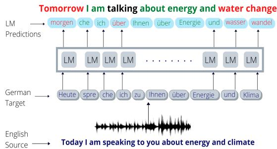
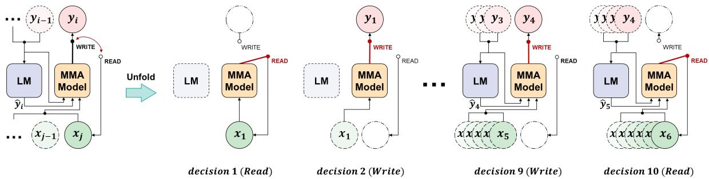
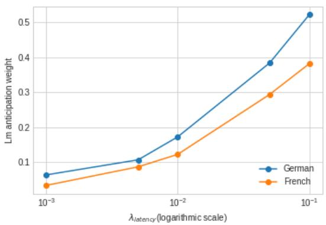
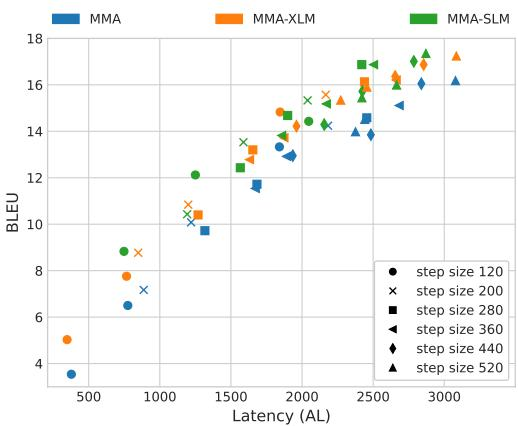
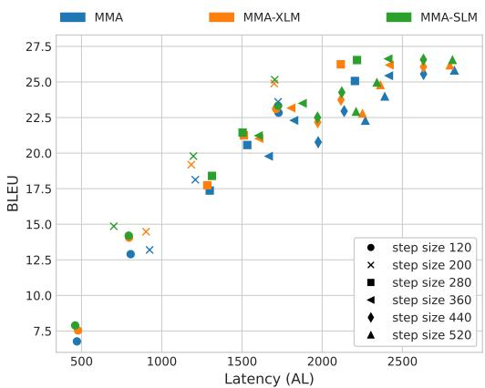
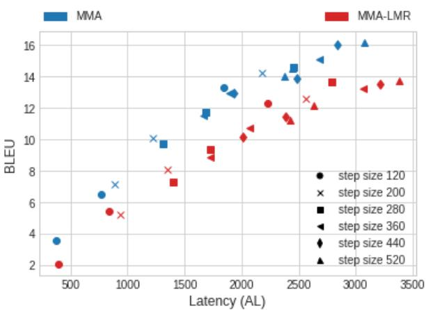
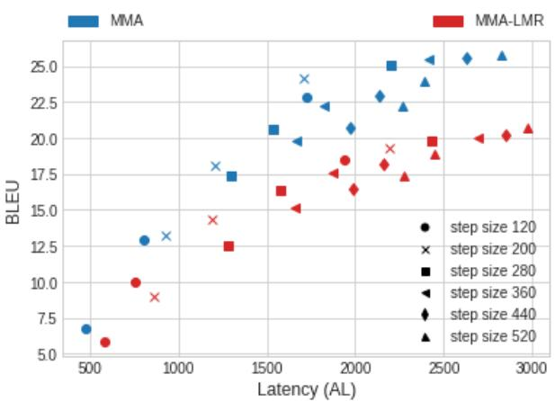

# Language Model Augmented Monotonic Attention for Simultaneous Translation

Sathish Indurthi§∗

Mohd Abbas Zaidi‡

Beomseok Lee‡† Nikhil Kumar Lakumarapu‡† Sangha Kim‡

‡Samsung Research, South Korea

§Zoom AI Lab, Singapore

sathishreddy.indurthi@zoom.us, {abbas.zaidi, bsgunn.lee, n07.kumar, sangha01.kim}@samsung.com

## Abstract

The state-of-the-art adaptive policies for simultaneous neural machine translation (SNMT) use monotonic attention to perform read/write decisions based on the partial source and target sequences. The lack of sufficient information might cause the monotonic attention to take poor read/write decisions, which in turn negatively affects the performance of the SNMT model. On the other hand, human translators make better read/write decisions since they can anticipate the immediate future words using linguistic information and domain knowledge. In this work, we propose a framework to aid monotonic attention with an external language model to improve its decisions. Experiments on MuST-C English-German and English-French speech-to-text translation tasks show the future information from language model improves the state-of-the-art monotonic multi-head attention model further.

## 1 Introduction

A typical application of simultaneous neural machine translation (SNMT) is conversational speech or live video caption translation. In order to achieve live translation, an SNMT model alternates between performing read from source sequence and write to target sequence. For a model to decide whether to read or write at certain moment, either a fixed or an adaptive read/write policy can be used.

Earlier approaches in simultaneous translation such as Ma et al. (2019a) and Dalvi et al. (2018) employ a fixed policy that alternate between read and write after the waiting period of k tokens. To alleviate possible long delay of fixed polices, recent works such as monotonic infinite lookback attention (MILk) (Arivazhagan et al., 2019), and monotonic multihead attention (MMA) (Ma et al., 2019c) developed flexible policies using monotonic attention (Raffel et al., 2017).

  
Figure 1: The finetuned XLM-RoBERTa language model predicts German words using the prefix as input.(Green: Correct, Red: Incorrect, Black: Neutral).

While these monotonic attention anticipates target words using only available prefix source and target sequence, human translators anticipate the target words using their language expertise (linguistic anticipation) as well as contextual information (extra-linguistic anticipation) (Vandepitte, 2001). Inspired by human translation experts, we aim to augment monotonic attention with future information using language models (LM) (Devlin et al., 2019; Conneau et al., 2019).

Integrating the external information effectively into text-to-text machine translation (MT) systems has been explored by several works (Khandelwal et al., 2020; Gulcehre et al., 2015, 2017; Stahlberg et al., 2018). Also, integrating future information implicitly into SNMT system during training is explored in Wu et al. (2020) by simultaneously training different wait-k SNMT systems. However, no previous works make use of explicit future information both during training and inference. To utilize explicit future information, we explored to integrate future information from LM directly into the output layer of the MMA model. However, it did not provide any improvements (refer to Appendix A), thus motivating us to explore a tighter integration of the LM information into SNMT model.

In this work, we explicitly use plausible future information from LM during training by transforming the monotonic attention mechanism. As shown in Figure 1, at each step, the LM takes the prefix target (and source, for cross-lingual LM) sequence and predicts the probable future information. We hypothesize that aiding the monotonic attention with this future information can improve MMA model’s read/write policy, eventually leading to better translation with less delay. Several experiments on MuST-C (Di Gangi et al., 2019) English-German and English-French speech-to-text translation tasks with our proposed approach show clear improvements of latency-quality trade-offs over the state-of-the-art MMA models.

  
Figure 2: Overview of the proposed language model augmented monotonic attention for SNMT.

When generating a target token $y _ { i }$ , the decoder chooses whether to read/write based on Bernoulli selection probability $p _ { i , j }$ . When $z _ { i , j } = 1 \ : ( w r i t e )$ model sets $t _ { i } = j , c _ { i } = h _ { j }$ and generates the target token $y _ { i }$ . For $z _ { i , j } = 0 ( r e a d )$ , it sets $t _ { i } = j + 1$ and repeats Eq. 4 to 6. Here $t _ { i }$ refers to the index of the encoder when decoder needs to produce the $i ^ { t h }$ target token. Instead of hard alignment of $c _ { i } = h _ { j }$ Raffel et al. (2017) compute an expected alignment in a recurrent manner and propose a closed-form parallel solution. Arivazhagan et al. (2019) adopt monotonic attention into SNMT and later, Ma et al. (2019c) extend it to MMA to integrate it into the Transformer model (Vaswani et al., 2017).

## 2 Monotonic Attention with Future Information Model

## 2.1 Monotonic Attention

In simultaneous machine translation (SNMT) models, the probability of predicting the target token $y _ { i } \in \textbf { y }$ depends on the partial source and target sequences $( x \_ j \in \textbf { x } , y _ { < i } \in \textbf { y } )$ . In sequence-tosequence based SNMT model, each target token $y _ { i }$ is generated as follows:

$$
h _ { j } = \mathcal { E } ( \underline { { x } } _ { \le j } )\tag{1}
$$

(2)

$$
s _ { i } = \mathcal { D } ( y _ { < i } , c _ { i } = \mathcal { A } ( s _ { i - 1 } , h _ { \le j } ) )\tag{3}
$$

$$
y _ { i } = O u t p u t ( s _ { i } )\tag{4}
$$

where $\mathcal { E } ( . )$ and $\mathcal { D } ( . )$ are the encoder and decoder layers, and $c _ { i }$ is a context vector. In monotonic attention based SNMT, the context vector is computed as follows:

$$
e _ { i , j } = M o n o t o n i c E n e r g y ( s _ { i - 1 } , h _ { j } )\tag{6}
$$

$$
p _ { i , j } = S i g m o i d ( e _ { i , j } )\tag{5}
$$

$$
z _ { i , j } \sim B e r n o u l l i ( p _ { i , j } )
$$

## 2.2 Monotonic Attention with Future Information

The monotonic attention described in Section 2.1 performs anticipation based only on the currently available source and target information. To augment this anticipation process using future information extracted using LMs, we propose the following modifications to the monotonic attention.

Future Representation Layer: At every decoding step i, the previous target token $y _ { i - 1 }$ is equipped with a plausible future token $\hat { y } _ { i }$ as shown in the Figure 2. Since the token $\hat { y } _ { i }$ comes from an LM possibly with a different tokenizer and vocabulary set, applying the model’s tokenizer and vocabulary might split the token $\hat { y } _ { i }$ further into multiple sub-tokens $\{ \hat { y } _ { i } ^ { 1 } , \hat { y } _ { i } ^ { 2 } , \cdots , \hat { y } _ { i } ^ { m } \}$ . To get a single future token representation $\tilde { \mathbf { s } } _ { i } \in \mathcal { R } ^ { d }$ from all the sub-tokens, we apply a sub-token summary layer:

$$
\tilde { \mathbf { s } } _ { i } = \Gamma ( \{ \hat { y } _ { i } ^ { 1 } , \hat { y } _ { i } ^ { 2 } , \cdot \cdot \cdot , \hat { y } _ { i } ^ { m } \} )\tag{7}
$$

The $\Gamma$ represents a general sequence representation layer such as a Transformer encoder layer or a simple normalized sum of sub-token representations.

We enrich $\tilde { \mathbf { s } } _ { i }$ at every layer l of the decoder block by applying a residual feed-forward network.

$$
\tilde { \mathbf { s } } _ { i } ^ { l } = F F N ( \tilde { \mathbf { y } } _ { i } ^ { l - 1 } )\tag{8}
$$

Monotonic Energy Layer with Future Information: Despite the fact that we can add the plausible future information to the output layer (Appendix A) or append it to the target token representation $y _ { i - 1 }$ , the MMA read/write decisions happen in Eq. 4. Therefore, we integrate $\tilde { \bf s } _ { i }$ into the Eq. 4 instead.

The integration is carried out by modifying Eq. 4 - Eq. 5. We compute the monotonic energy for future information using the enriched future token representation $\tilde { \bf s } _ { i }$ available at each layer:

$$
\tilde { e } _ { i , j } = M o n o t o n i c E n e r g y ( \tilde { \bf s } _ { i } , h _ { j } )\tag{9}
$$

We integrate the future monotonic energy function into Eq. 5 as follows:

$$
\tilde { p } _ { i , j } = S i g m o i d ( e _ { i , j } + \tilde { e } _ { i , j } )\tag{10}
$$

After computing $\tilde { p } _ { i , j }$ , we compute $c _ { i }$ similar to MMA model.

This way of integration of future information allows the model to condition the LM output usage on the input sequence. The model can control the relative weightage given to the LM output by varying the $\tilde { e } _ { i , j }$ . In case of insufficient source information in the low latency regime, we expect the model’s decision policy to rely more on $\tilde { e } _ { i , j }$

Inference: During inference, the start token does not contain any plausible information. After predicting the first target token, for every subsequent prediction of target token $y _ { i }$ , we invoke the LM to predict the next plausible future token and integrate this new information into Eq. 10.

## 3 Experiments and Results

## 3.1 Experimental Settings

Datasets and Metrics: We conduct our experiments on the MuST-C English(En)-German(De) and English(En)-French(Fr) speech-to-text (ST) translation task. The speech sequence is represented using 80-dimensional log-mel filter bank features. The target sequence is represented as subwords using a SentencePiece (Kudo and Richardson, 2018) model with a unigram vocabulary of size 10,000. We evaluate the performance of the models on both the latency and quality aspects. We use Average Lagging(AL) as our latency metric and case-sensitive detokenized SacreBLEU (Post, 2018) to measure the translation quality, similar to (Ma et al., 2020). The best models are chosen based on the dev set results and reported results are from the MuST-C test (tst-COMMON) sets.

Language Models We use two language models to train our proposed modified MMA model. Firstly, we use the pretrained XLM-RoBERTa (Conneau et al., 2019) model from Huggingface Transformers1 model repository. Since the LM output can be very open-ended and might not directly suit/cater to our task and dataset, we finetune the head of the model using the MuST-C target text data for each task.

We also train a smaller language model (SLM), which contains 6 Transformer decoder layers, 512 hidden-states and 24M parameters. We use the MuST-C data along with additional data augmentation to reduce overfitting. The SLM helps to remove the issues related to vocabulary mismatch as discussed in the Section 2.2.

Implementation Details: Our base model is adopted from Ma et al. (2020). We use a predecision ratio of 7 , which means that the simultaneous read/write decisions are made after every seven encoder states. We use λ or $\lambda _ { l a t e n c y }$ to refer to the hyperparameter corresponding to the weighted average $( \lambda _ { a v g } )$ in MMA. The values of this hyperparameter λ are chosen from the set 0.01, 0.05, 0.1 . The Γ layer in Eq. 7 computes the normalized sum of the sub-token representations. For SLM, it simply finds the embedding since it shares the same vocabulary set. All the models are trained on a NVIDIA v100 GPU with update\_freq set to 8.

Simultaneous Translation Models: Even though future information can be integrated explicitly into the fixed policy approaches such as Wait-K (Ma et al., 2019b), we choose monotonic attention as our baseline due to its superior performance (Arivazhagan et al., 2019; Ma et al., 2019c). We train a baseline based on Ma et al. (2020) work, called as MMA model. The MMA model encoder and decoder embedding dimensions are set to 392, whereas our proposed model’s encoder and decoder embeddings are set to 256 to have similar parameters ( 39M) for a fair comparison. We train two models using the modified MMA based on two LMs (XLM, SLM), referred as MMA-XLM and MMA-SLM.

  
Figure 3: LM prediction weight vs λ

## 3.2 Results

We first analyze how the LM predictions are being utilized by the our model. In order to measure the relative weight given to model’s internal states versus the predictions from the LM, we compare the norm of the monotonic energies corresponding to the LM predictions $e _ { p r e d }$ (Eq. 9) and the previous output tokens $e _ { o u t p u t }$ (Eq. 4). Let us define LM prediction weight as follows:

$$
L M _ { p w } = \left( \frac { \| e _ { p r e d } \| } { \| e _ { o u t p u t } \| } \right)\tag{11}
$$

In Figure 3, we plot the variation of $L M _ { p w }$ (averaged) vs. λ. We use two additional values of $\lambda \in \{ 0 . 0 0 5 , 0 . 0 0 1 \}$ to obtain this plot. We can observe that as the latency requirements become more and more strict, the model starts to give more weightage to the predictions coming from the LM. This shows that the model learns to utilize the information coming from LM predictions based on latency requirements.

Next, we discuss the performance improvements obtained from our proposed approach. By varying the λ, we train separate models for different latency regimes. Moreover, the quality and latency for a particular model can also be varied by controlling the speech segment size during the inference. Speech segment size or step size refers to the duration of speech (in ms) processed corresponding to each read decision. We vary these hyperparameters for all the three models, namely MMA, MMA-XLM and MMA-SLM.

The BLEU-AL curves for all the models have been provided in Figure 4 and BLEU-AL numbers for all models are included in Appendix F for reference. We vary the step sizes in intervals of 80ms from 120 ms to 520 ms in order to get performances corresponding to different latency regimes. We can observe that the LM-based models using both XLM and SLM provide a significant performance improvement over the baseline MMA model. We observe improvements in the range of 1-2 BLEU scores consistently across all the latency regimes $( \lambda = 0 . 1 , 0 . 0 5 , 0 . 0 1 )$ . The MMA using SLM language model performs slightly better than MMA using XLM language model. This is due to SLM’s higher accuracy on the next token prediction task as compared to XLM, 30.15% vs. 21.5% for German & 31.65% vs. 18.45% for French. The high accuracy of SLM is attributed to its training on in-domain data.

(a) EnDe Task  
  
(b) EnFr Task  
Figure 4: BLEU vs Average Lagging results for MMA, MMA-XLM and MMA-SLM models.

## 4 Conclusion

In this work, we provide a generic framework to integrate the linguistic and extra-linguistic information into simultaneous models. We rely on language models to extract this plausible future information and propose a new monotonic attention mechanism to infuse this information. Several experiments on speech-to-text translation tasks show the effectiveness of proposed approach on obtaining superior quality-latency trade-offs, compared to the state-of-the-art monotonic multihead attention.

## References

Naveen Arivazhagan, Colin Cherry, Wolfgang Macherey, Chung-Cheng Chiu, Semih Yavuz, Ruoming Pang, Wei Li, and Colin Raffel. 2019. Monotonic infinite lookback attention for simultaneous machine translation. In Proceedings of the 57th Annual Meeting of the Association for Computational Linguistics, pages 1313–1323, Florence, Italy. Association for Computational Linguistics.

Alexis Conneau, Kartikay Khandelwal, Naman Goyal, Vishrav Chaudhary, Guillaume Wenzek, Francisco Guzmán, Edouard Grave, Myle Ott, Luke Zettlemoyer, and Veselin Stoyanov. 2019. Unsupervised cross-lingual representation learning at scale. arXiv preprint arXiv:1911.02116.

Fahim Dalvi, Nadir Durrani, Hassan Sajjad, and Stephan Vogel. 2018. Incremental decoding and training methods for simultaneous translation in neural machine translation. In Proceedings of the 2018 Conference of the North American Chapter of the Associationfor Computational Linguistics: Human Language Technologies, Volume 2 (Short Papers), pages 493–499, New Orleans, Louisiana. Association for Computational Linguistics.

Jacob Devlin, Ming-Wei Chang, Kenton Lee, and Kristina Toutanova. 2019. BERT: Pre-training of deep bidirectional transformers for language understanding. In Proceedings ofthe 2019 Conference of the North American Chapter of the Association for Computational Linguistics: Human Language Technologies, Volume 1 (Long and Short Papers), pages 4171–4186, Minneapolis, Minnesota. Association for Computational Linguistics.

Mattia A. Di Gangi, Roldano Cattoni, Luisa Bentivogli, Matteo Negri, and Marco Turchi. 2019. MuST-C: a Multilingual Speech Translation Corpus. In Proceedings ofthe 2019 Conference ofthe North American Chapter of the Association for Computational Linguistics: Human Language Technologies, Volume 1 (Long and Short Papers), pages 2012–2017, Minneapolis, Minnesota. Association for Computational Linguistics.

Caglar Gulcehre, Orhan Firat, Kelvin Xu, Kyunghyun Cho, Loic Barrault, Huei-Chi Lin, Fethi Bougares, Holger Schwenk, and Yoshua Bengio. 2015. On using monolingual corpora in neural machine translation.

Caglar Gulcehre, Orhan Firat, Kelvin Xu, Kyunghyun Cho, and Yoshua Bengio. 2017. On integrating a language model into neural machine translation. Computer Speech and Language, 45:137–148.

Urvashi Khandelwal, Angela Fan, Dan Jurafsky, Luke Zettlemoyer, and Mike Lewis. 2020. Nearest neighbor machine translation. arXiv preprint arXiv:2010.00710.

Sosuke Kobayashi. 2018. Contextual augmentation: Data augmentation by words with paradigmatic relations. In Proceedings of the 2018 Conference of the North American Chapter ofthe Associationfor Computational Linguistics: Human Language Technologies, Volume 2 (Short Papers), pages 452–457, New Orleans, Louisiana. Association for Computational Linguistics.

Taku Kudo and John Richardson. 2018. Sentencepiece: A simple and language independent subword tokenizer and detokenizer for neural text processing. arXiv preprint arXiv:1808.06226.

Mingbo Ma, Liang Huang, Hao Xiong, Renjie Zheng, Kaibo Liu, Baigong Zheng, Chuanqiang Zhang, Zhongjun He, Hairong Liu, Xing Li, Hua Wu, and Haifeng Wang. 2019a. Stacl: Simultaneous translation with implicit anticipation and controllable latency using prefix-to-prefix framework.

Mingbo Ma, Liang Huang, Hao Xiong, Renjie Zheng, Kaibo Liu, Baigong Zheng, Chuanqiang Zhang, Zhongjun He, Hairong Liu, Xing Li, Hua Wu, and Haifeng Wang. 2019b. STACL: Simultaneous translation with implicit anticipation and controllable latency using prefix-to-prefix framework. In Proceedings of the 57th Annual Meeting of the Association for Computational Linguistics, pages 3025–3036, Florence, Italy. Association for Computational Linguistics.

Xutai Ma, Juan Pino, James Cross, Liezl Puzon, and Jiatao Gu. 2019c. Monotonic multihead attention.

Xutai Ma, Juan Pino, and Philipp Koehn. 2020. Simulmt to simulst: Adapting simultaneous text translation to end-to-end simultaneous speech translation. arXiv preprint arXiv:2011.02048.

Matt Post. 2018. A call for clarity in reporting bleu scores. arXiv preprint arXiv:1804.08771.

Colin Raffel, Minh-Thang Luong, Peter J. Liu, Ron J. Weiss, and Douglas Eck. 2017. Online and lineartime attention by enforcing monotonic alignments. In Proceedings of the 34th International Conference on Machine Learning, volume 70 of Proceedings of Machine Learning Research, pages 2837–2846. PMLR.

Felix Stahlberg, James Cross, and Veselin Stoyanov. 2018. Simple fusion: Return of the language model. In Proceedings of the Third Conference on Machine Translation: Research Papers, pages 204–211, Brussels, Belgium. Association for Computational Linguistics.

Sonia Vandepitte. 2001. Anticipation in conference interpreting: a cognitive process. Alicante Journal of English Studies / Revista Alicantina de Estudios Ingleses, 0(14):323–335.

Ashish Vaswani, Noam Shazeer, Niki Parmar, Jakob Uszkoreit, Llion Jones, Aidan N Gomez, Ł ukasz Kaiser, and Illia Polosukhin. 2017. Attention is all you need. In Advances in Neural Information Processing Systems 30, pages 5998–6008. Curran Associates, Inc.

Xueqing Wu, Yingce Xia, Lijun Wu, Shufang Xie, Weiqing Liu, Jiang Bian, Tao Qin, and Tie-Yan Liu. 2020. Learn to use future information in simultaneous translation.

## A LM at MMA Output Layer

We explored a naive approach of integrating LM information into the MMA. In this approach, we integrate the future information obtained from the LM directly into the output layer of the MMA model. We refer to this experiment as ‘LM Rescoring(LMR)’, and the corresponding model is called MMA-LMR.

As observed in Figure 5, MMA-LMR has inferior performance compared to the MMA model. Since the LM information integration is only done at the output layer of the model, the MMA model cannot easily discard the incorrect information from LM. This motivates us to tightly integrate the LM information into the simultaneous model.

## B Language Models

As mentioned earlier, we train two different language models (LMs) and use them to improve the anticipation in monotonic attention based Simultaneous models.

## B.1 XLM-Roberta(XLM-R)

XLM-R Large model 2 was trained on the 100 languages CommonCrawl corpora total size of 2.5TB with 550M parameters from 24 layers, 1024 hidden states, 4096 feed-forward hidden-states, and 16 heads. Total number of parameters is 558M. We finetune the head of the XLM-R LM model using the Masked Language Modeling objective which accounts for 0.23% of the total model parameters, i.e., 1.3M parameters.

## B.2 Smaller Language Model

Since the LM predictions are computed serially during inference, the time taken to compute the

LM token serves as a bottleneck to the latency requirements. To reduce the LM computation time, we train a smaller Language Model (SLM) from scratch using the Causal Language Modeling objective. SLM is composed of 6 Transformer decoder blocks, 512 hidden-states, 2048 feed-forward hidden-states & 8 attention heads. It alleviates the need for the sub-token summary layer since it shares the vocabulary and tokenization with the MMA models. The train examples are at the sentence level, rather than forming a block out of multiple sentences(which is the usual case for Language Models).

Since the target texts contain lesser than 250k examples, we use additional data augmentation techniques to upsample the target data. We also use additional data to avoid overfitting on the MuST-C target text. Details have been provided in B.2.1.

## B.2.1 Data Augmentation

Up-Sampling: To boost the LM performance and mitigate overfitting, we use contextual data augmentation (Kobayashi, 2018) to upsample the MuST-C target text data by substituting and inserting words based on LM predictions. We use the NLPAUG 3 package to get similar words based on contextual embeddings. From the Hugging Face Repository, we use two different pretrained BERT (Devlin et al., 2019) models for German bert-basegerman-dbmdz-cased & bert-base-german-dbmdzuncased and bert-base-fr-cased for French. We upsample German to 1.13M examples and French to 1.38M examples.

Additional Data: We also use additional data to avoid overfitting. For German we use the Newscrawl(WMT 19) data which includes 58M examples. For French, we use Common Crawl and Europarl to augment 4M extra training examples.

We observe that both upsampling and data augmentation help us to reduce the overfitting on the MuST-C dev set.

## B.3 Token Prediction

For each output token, the LM prediction is obtained by feeding the prefix upto that token to the LM model. These predictions are pre-computed for training and validation sets. This ensures parallelization and avoids the overhead to run the LM simultaneously during the training process. During inference, the LM model is called every time a new output token is written.

  
(a) EnDe Task

  
(b) EnFr Task  
Figure 5: BLEU vs Average Lagging results for MMA and MMA-LMR models. Each model is trained with different $\lambda = 0 . 1 , 0 . 0 5 , 0 . 0 1$ values. Each BLUE-AL point obtained by varying step size and λ.

## C Dataset

The MuST-C dataset comprises of English TED talks, the translations and transcriptions have been aligned with the speech at sentence level. Dataset statistics have been provided in the Table 1.

## D Effect of LM Size on Latency-Quality

We train several SLM models with varying sizes in our experiments and choose the best model based on the top-1 accuracy. As we increase the number of layers in the LM model from 2 to 4 to 6 layers, the SLM and the proposed MMA with future information models have shown performance improvements. However, increasing the number of layers greater than 6 does not yield any performance improvements. We also notice this degradation of performance with the XLM model while varying the number of hidden layers in the LM head.

## E Training Details

We follow the training process similar to Ma et al. (2020) training process. We train an English ASR model using the source speech data. Next, we train a simultaneous model without the latency loss (setting $\lambda _ { l a t e n c y } = 0 )$ after initializing the encoder from the English ASR model. After this step, we finetune the simultaneous model for different λs. This training process is repeated for all the reported models and for each task. The details regarding the hyperparameters for the model have been provided in Table 2.

## F BLEU-AL Numbers

As mentioned in the results section of the main paper, we vary the latency weight hyperparameter (λ) to train different models to obtain different latency regimes. We also vary the step-size/speech segment size during inference. In total, we obtain 18 different data points corresponding to each model. In Table 3, we compare the results obtained using MMA, MMA-XLM and MMA-SLM under similar hyperparameter settings. It will help the reader to quantify the benefits obtained from our proposed approach.

<table><tr><td rowspan=2 colspan=1>Task</td><td rowspan=2 colspan=1># Hours</td><td rowspan=1 colspan=3># Sentences</td><td rowspan=2 colspan=1># Talks</td><td rowspan=1 colspan=2># Words</td></tr><tr><td rowspan=1 colspan=1>Train</td><td rowspan=1 colspan=1>Dev</td><td rowspan=1 colspan=1>Test</td><td rowspan=1 colspan=1>Source</td><td rowspan=1 colspan=1>Target</td></tr><tr><td rowspan=1 colspan=1>English-GermanEnglish-French</td><td rowspan=1 colspan=1>408492</td><td rowspan=1 colspan=1>225k269k</td><td rowspan=1 colspan=1>1,4231,412</td><td rowspan=1 colspan=1>2,6412,632</td><td rowspan=1 colspan=1>2,0932,510</td><td rowspan=1 colspan=1>4.3M5.2M</td><td rowspan=1 colspan=1>4M5.4M</td></tr></table>

Table 1: Dataset Statistics(# - Number of)
<table><tr><td></td><td>MMA</td><td>MMA-XLM/CLM</td></tr><tr><td>Hyperparameter</td><td>12</td><td>12</td></tr><tr><td>encoder layers encoder embed dim</td><td>292</td><td>256</td></tr><tr><td>encoder ffn embed dim</td><td>2048</td><td>2048</td></tr><tr><td>encoder attention heads</td><td>4</td><td>4</td></tr><tr><td>decoder layers</td><td>6</td><td>6</td></tr><tr><td>decoder embed dim</td><td>292</td><td>256</td></tr><tr><td>decoder ffn embed dim</td><td>2048</td><td>2048</td></tr><tr><td>monotonic ffn embed dim</td><td></td><td>2048</td></tr><tr><td>decoder attention heads</td><td>一 4</td><td>4</td></tr><tr><td>dropout</td><td>0.1</td><td>0.1</td></tr><tr><td>optimizer</td><td>adam</td><td>adam</td></tr><tr><td>adam-β</td><td>(0.9, 0.999)</td><td></td></tr><tr><td></td><td>10.0</td><td>(0.9, 0.999)</td></tr><tr><td>clip-norm</td><td></td><td>10.0</td></tr><tr><td>lr scheduler</td><td>inverse sqrt 0.0001</td><td>inverse sqrt</td></tr><tr><td>learning rate</td><td></td><td>0.0001</td></tr><tr><td>warmup-updates</td><td>4000</td><td>4000</td></tr><tr><td>label-smoothing</td><td>0.0</td><td>0.0</td></tr><tr><td>max tokens</td><td>40000</td><td>40000</td></tr><tr><td>conv layers</td><td>2</td><td>2</td></tr><tr><td>conv stride</td><td>(2,2)</td><td>(2,2)</td></tr><tr><td>#params</td><td>≈ 39M</td><td>≈ 39M</td></tr></table>

Table 2: Model Hyperparameters
<table><tr><td rowspan=2 colspan=1>λ</td><td rowspan=2 colspan=1>Model</td><td rowspan=2 colspan=1>120</td><td rowspan=1 colspan=4>step size (AL(msec) / BLEU)</td><td rowspan=1 colspan=1></td></tr><tr><td rowspan=1 colspan=3>200           280           360</td><td rowspan=1 colspan=1>440</td><td rowspan=1 colspan=1>520</td></tr><tr><td rowspan=1 colspan=8>English-German Task</td></tr><tr><td rowspan=3 colspan=1>0.1</td><td rowspan=3 colspan=1>MMAMMA-XLMMMA-SLM</td><td rowspan=2 colspan=1>378 / 3.54348 / 5.03</td><td rowspan=1 colspan=1>887/7.17</td><td rowspan=1 colspan=1>1317/9.72</td><td rowspan=1 colspan=1>1671 /11.54</td><td rowspan=1 colspan=1>1935 / 12.95</td><td rowspan=1 colspan=1>2376 / 13.98</td></tr><tr><td rowspan=1 colspan=1>848 / 8.77</td><td rowspan=1 colspan=1>1269 / 10.4</td><td rowspan=1 colspan=1>1631 / 12.78</td><td rowspan=1 colspan=1>1961 / 14.22</td><td rowspan=1 colspan=1>2272 / 15.34</td></tr><tr><td rowspan=1 colspan=1>748 / 8.83</td><td rowspan=1 colspan=1>1192 / 10.43</td><td rowspan=1 colspan=1>1566 / 12.43</td><td rowspan=1 colspan=1>1857 / 13.82</td><td rowspan=1 colspan=1>2156 / 14.29</td><td rowspan=1 colspan=1>2421 / 15.44</td></tr><tr><td rowspan=3 colspan=1>0.05</td><td rowspan=2 colspan=1>MMAMMA-XLM</td><td rowspan=2 colspan=1>775 / 6.5766 / 7.76</td><td rowspan=2 colspan=1>1220 / 10.081200 / 10.84</td><td rowspan=1 colspan=1>1683 / 11.72</td><td rowspan=1 colspan=1>1891 / 12.92</td><td rowspan=1 colspan=1>2484 / 13.85</td><td rowspan=1 colspan=1>2441 / 14.51</td></tr><tr><td rowspan=1 colspan=1>1654 / 13.2</td><td rowspan=1 colspan=1>1873 / 13.72</td><td rowspan=1 colspan=1>2655 / 16.36</td><td rowspan=1 colspan=1>2456 / 15.90</td></tr><tr><td rowspan=1 colspan=1>MMA-SLM</td><td rowspan=1 colspan=1>1250 / 12.12</td><td rowspan=1 colspan=1>1588 / 13.53</td><td rowspan=1 colspan=1>1899 / 14.68</td><td rowspan=1 colspan=1>2171 / 15.18</td><td rowspan=1 colspan=1>2424 / 15.72</td><td rowspan=1 colspan=1>2665 / 15.99</td></tr><tr><td rowspan=3 colspan=1>0.01</td><td rowspan=3 colspan=1>MMAMMA-XLMMMA-SLM</td><td rowspan=3 colspan=1>1841 / 13.331846 / 14.832047 / 14.43</td><td rowspan=2 colspan=1>2183 / 14.242167 / 15.57</td><td rowspan=1 colspan=1>2455 / 14.58</td><td rowspan=1 colspan=1>2683 / 15.11</td><td rowspan=1 colspan=1>2839 / 16.05</td><td rowspan=1 colspan=1>3079 / 16.18</td></tr><tr><td rowspan=1 colspan=1>2439 / 16.13</td><td rowspan=1 colspan=1>2662 / 16.21</td><td rowspan=1 colspan=1>2855 / 16.87</td><td rowspan=1 colspan=1>3085 / 17.24</td></tr><tr><td rowspan=1 colspan=1>2039 / 15.33</td><td rowspan=1 colspan=1>2420 / 16.87</td><td rowspan=1 colspan=1>2503 / 16.87</td><td rowspan=1 colspan=1>2786 / 17.01</td><td rowspan=1 colspan=1>2871 / 17.35</td></tr><tr><td rowspan=1 colspan=1></td><td rowspan=1 colspan=2></td><td rowspan=1 colspan=1>English</td><td rowspan=1 colspan=1>-French Task</td><td rowspan=1 colspan=1></td><td rowspan=1 colspan=2></td></tr><tr><td rowspan=2 colspan=1>0.1</td><td rowspan=2 colspan=1>MMAMMA-XLMMMA-SLM</td><td rowspan=2 colspan=1>471/6.77478 / 7.54460 / 7.89</td><td rowspan=1 colspan=1>924 / 13.2902 / 14.48</td><td rowspan=1 colspan=1>1299 /17.371284 / 17.74</td><td rowspan=1 colspan=1>1667 / 19.781607 / 21.02</td><td rowspan=1 colspan=1>1975 / 20.771972 / 22.17</td><td rowspan=1 colspan=1>2269 / 22.282251 / 22.79</td></tr><tr><td rowspan=1 colspan=1>701 / 14.86</td><td rowspan=1 colspan=1>1313 / 18.40</td><td rowspan=1 colspan=1>1604 / 21.23</td><td rowspan=1 colspan=1>1971 / 22.50</td><td rowspan=1 colspan=1>2211 /22.91</td></tr><tr><td rowspan=2 colspan=1>0.05</td><td rowspan=2 colspan=1>MMAMMA-XLMMMA-SLM</td><td rowspan=1 colspan=1>806 / 12.9796 / 14.06</td><td rowspan=1 colspan=1>1209 / 18.131184 / 19.19</td><td rowspan=2 colspan=1>1533 / 20.571512 / 21.251504 / 21.44</td><td rowspan=1 colspan=1>1825 / 22.301807 / 23.17</td><td rowspan=1 colspan=1>2137 / 22.952117 / 23.75</td><td rowspan=2 colspan=1>2390 / 23.982363 / 24.782341 / 24.96</td></tr><tr><td rowspan=1 colspan=1>794 / 14.20</td><td rowspan=1 colspan=1>1197 / 19.79</td><td rowspan=1 colspan=1>1878 / 23.5</td><td rowspan=1 colspan=1>2122 / 24.27</td></tr><tr><td rowspan=3 colspan=1>0.01</td><td rowspan=3 colspan=1>MMAMMA-XLMMMA-SLM</td><td rowspan=3 colspan=1>1728 / 22.841713 / 23.111725 / 23.33</td><td rowspan=3 colspan=1>1725 / 23.61701 / 24.891704 / 25.16</td><td rowspan=1 colspan=1>2204 /25.07</td><td rowspan=1 colspan=1>2416 / 25.44</td><td rowspan=1 colspan=1>2632 / 25.56</td><td rowspan=1 colspan=1>2824 / 25.81</td></tr><tr><td rowspan=2 colspan=1>2116 / 26.242217 / 26.54</td><td rowspan=1 colspan=1>2420 / 26.19</td><td rowspan=2 colspan=1>2631 / 26.072631 / 26.57</td><td rowspan=2 colspan=1>2796 / 26.172812 / 26.55</td></tr><tr><td rowspan=1 colspan=1>2412 / 26.63</td></tr></table>

Table 3: BLEU vs Average Lagging results for MMA, MMA-XLM and MMA-SLM models on English-German and English-French tasks. The models are trained using different latency loss weights (λ = 0.1, 0.05, 0.01).