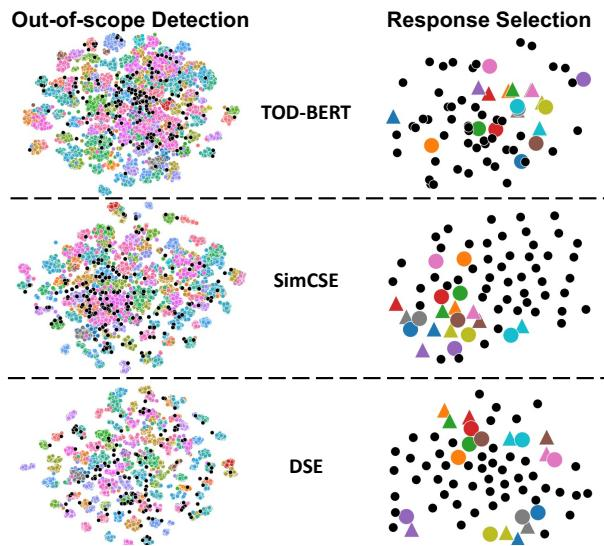
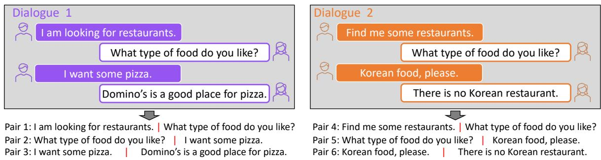
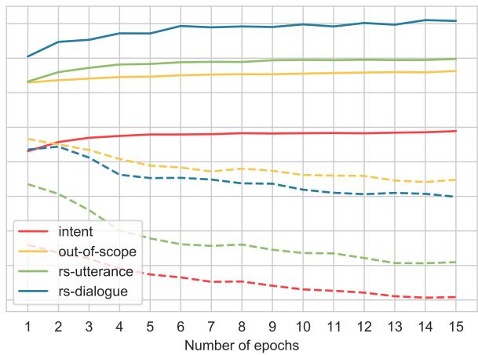

# Learning Dialogue Representations from Consecutive Utterances

Zhihan Zhou ∗ Dejiao Zhang† Wei Xiao† Nicholas Dingwall† Xiaofei Ma† Andrew O. Arnold† Bing Xiang† ∗Northwestern University †AWS AI Labs

## Abstract

Learning high-quality dialogue representations is essential for solving a variety of dialogueoriented tasks, especially considering that dialogue systems often suffer from data scarcity. In this paper, we introduce Dialogue Sentence Embedding (DSE), a self-supervised contrastive learning method that learns effective dialogue representations suitable for a wide range of dialogue tasks. DSE learns from dialogues by taking consecutive utterances1 of the same dialogue as positive pairs for contrastive learning. Despite its simplicity, DSE achieves significantly better representation capability than other dialogue representation and universal sentence representation models. We evaluate DSE on five downstream dialogue tasks that examine dialogue representation at different semantic granularities. Experiments in few-shot and zero-shot settings show that DSE outperforms baselines by a large margin. For example, it achieves 13% average performance improvement over the strongest unsupervised baseline in 1-shot intent classification on 6 datasets. 2 We also provide analyses on the benefits and limitations of our model.

## 1 Introduction

Due to the variety of domains and the high cost of data annotation, labeled data for task-oriented dialogue systems is often scarce or even unavailable. Therefore, learning universal dialogue representations that effectively capture dialogue semantics at different granularities (Hou et al., 2020; Krone et al., 2020; Yu et al., 2021) provides a good foundation for solving various downstream tasks (Snell et al., 2017; Vinyals et al., 2016).

Contrastive learning (Chen et al., 2020; He et al., 2020) has achieved widespread success in representations learning in both the image domain (Hjelm et al., 2018; Lee et al., 2020; Bachman et al., 2019) and the text domain (Gao et al., 2021; Zhang et al., 2021a,b; Wu et al., 2020a). Contrastive learning aims to reduce the distance between semantically similar (positive) pairs and increase the distance between semantically dissimilar (negative) pairs. These positive pairs can be either human-annotated or obtained through various data augmentations, while negative pairs are often collected through negative sampling in the mini-batch.

  
Figure 1: TSNE visualization of the dialogue representations provides by TOD-BERT, SimCSE, and DSE. Left: each color indicates one intent category, while the black circles represents out-of-scope samples. Right: items with the same color stands for query-response pairs, where triangles represent queries. The black circles represents randomly sampled responses.

In the supervised learning regime, Gao et al. (2021); Zhang et al. (2021a) demonstrate the effectiveness of leveraging the Natural Language Inference (NLI) datasets (Bowman et al., 2015; Williams et al., 2018) to support contrastive learning. Inspired by their success, a natural choice of dialogue representation learning is utilizing the

  
Figure 2: Illustration of the positive pair construction from dialogues.

Dialogue-NLI dataset (Welleck et al., 2018) that consists of both semantically entailed and contradicted pairs. However, due to its relatively limited scale and diversity, we found learning from this dataset leads to less satisfying performance, while the high cost of collecting additional human annotations precludes its scalability. On the other extreme, unsupervised representation learning has achieved encouraging results recently, among which Sim-CSE (Gao et al., 2021) and TOD-BERT (Wu et al., 2020a) set new state-of-the-art results on general texts and dialogues, respectively.

SimCSE uses Dropout (Srivastava et al., 2014) to construct positive pairs from any text by passing a sentence through the encoder twice to generate two different embeddings. Although SimCSE outperforms common data augmentations that directly operate on discrete text, we find it performs poorly in the dialogue domain (see Sec. 4.3). This motivates us to seek better positive pair constructions by leveraging the intrinsic properties of dialogue data. On the other hand, TOD-BERT takes an utterance and the concatenation of all the previous utterances in the dialogue as a positive pair. Despite promising performance on same tasks, we found TOD-BERT struggles on many other dialogue tasks where the semantic granularities or data statistics are different from those evaluated in their paper.

In this paper, inspired by the fact that dialogues consist of consecutive utterances that are often semantically related, we use consecutive utterances within the same dialogue as positive pairs for contrastive learning (See Figure 2). This simple strategy works surprisingly well. We evaluate DSE on a wide range of task-oriented dialogue applications, including intent classification, out-of-scope detection, response selection, and dialogue action prediction. We demonstrate that DSE substantially outperforms TOD-BERT, SimCSE, and some other sentence representation learning models in most scenarios. We assess the effectiveness of our approach by comparing DSE against its variants trained on other types of positive pairs (e.g., Dropout and Dialogue-NLI). We also discuss the trade-off in learning dialogue representation for tasks focusing on different semantic granularities and provide insights on the benefits and limitations of the proposed method. Additionally, we empirically demonstrate that using consecutive utterances as positive pairs can effectively improve the training stability (Appendix A.3).

## 2 Why Contrastive Learning on Consecutive Utterances?

When performing contrastive learning on consecutive utterances, we encourage the model to treat an utterance as similar to its adjacent utterances and dissimilar to utterances that are not consecutive to it or that belong to other dialogues.

On the one hand, this training process directly increases an utterance’s similarity with its true response and decreases its similarities with other randomly sampled utterances. The ability to identify the appropriate response from many similar utterances is beneficial for dialogue ranking tasks (e.g., response selection). On the other hand, consecutive utterances also contain implicit categorical information, which benefits dialogue classification tasks (e.g., intent classification and out-of-scope detection). Consider pairs 1 and 4 in Figure 2: we implicitly learn similar representations of I am looking for restaurants and Find me some restaurants, since they are both consecutive with What type of food do you like?.

In contrast, SimCSE does not enjoy these benefits by simply using Dropout as data augmentation. Although TOD-BERT also leverages the intrinsic dialogue semantics by combining an utterance with its dialogue context as positive pair, the context is often the concatenation of 5 to 15 utterances.

Due to the large discrepancy in both semantics and data statistics between each utterance and its context, simply optimizing the similarity between them leads to less satisfying representations on many dialogue tasks. As shown in Section 4, TOD-BERT can even lead to degenerated representations on some downstream tasks when compared to the original BERT model.

## 3 Model

## 3.1 Notation

Let $\{ ( x _ { i } , x _ { i ^ { + } } ) \} _ { i = 1 } ^ { M }$ be a batch of positive pairs, where M is the batch size. In our setting, each $( x _ { i } , x _ { i ^ { + } } )$ denotes a pair of consecutive utterances sampled from a dialogue. Let $e _ { i }$ denote the representation of the text instance $x _ { i }$ that is obtained through an encoder. In this paper, we use mean pooling to obtain representations.

## 3.2 Training Target

Contrastive learning aims to maximize the similarity between positive samples and minimize the similarity between negative samples. For a contrastive anchor $x _ { i } ,$ the contrastive loss aims to increase its similarity with its positive sample $x _ { i ^ { + } }$ and decrease its similarity with the other $2 M - 2$ negative samples within the same batch.

We adopt the Hard-Negative sampling strategy proposed by Zhang et al. (2021a), which puts higher weights on the samples that are close to the anchor in the representation space. The underlying hypothesis is that hard negatives are more likely to occur among those that are located close to the anchor in the representation space. Specifically, the Hard-Negative sampling based contrastive loss regarding anchor $x _ { i }$ is defined as follows:

$$
\ell ^ { i , i ^ { + } } = - \log \frac { \exp ( \sin ( e _ { i } , e _ { i ^ { + } } ) / \tau ) } { \sum _ { j \neq i } \exp ( \alpha _ { i j } \cdot \sin ( e _ { i } , e _ { j } ) / \tau ) } .\tag{1}
$$

As mentioned above, here i and $i ^ { + }$ represent the indices of the anchor and its positive sample. We use τ to denote the temperature hyperparameter and $\sin ( e _ { i } , e _ { j } )$ represent the cosine similarity of ei and $e _ { j }$ . In the above loss, $\alpha _ { i j }$ is defined as follows,

$$
\alpha _ { i j } = \frac { \exp ( \sin ( e _ { i } , e _ { j } ) / \tau ) } { \frac { 1 } { 2 M - 2 } \sum _ { k \ne i ^ { + } } \exp ( \sin ( e _ { i } , e _ { k } ) / \tau ) } .\tag{2}
$$

Noted here, the denominator is averaged over all the other $2 M { - } 2$ negatives of $x _ { i }$ . Intuitively, samples that are close to the anchor in the representation space are assigned with higher weights. In other words, $\alpha _ { i j }$ denotes the relative importance of instance $x _ { j }$ for optimizing the contrastive loss of the anchor $x _ { i }$ among all 2M-2 negatives. For every positive pair $( x _ { i } , x _ { i ^ { + } } )$ , we respectively take $x _ { i }$ and $x _ { i ^ { + } }$ as the contrastive anchor to calculate the contrastive loss. Thereby, the contrastive loss over the batch is calculated as:

$$
\mathcal { L } = \frac { 1 } { 2 M } \sum _ { i = 1 } ^ { M } ( \ell ^ { i , i ^ { + } } + \ell ^ { i ^ { + } , i } )\tag{3}
$$

Here $\ell ^ { i ^ { + } , i }$ is defined by exchanging the roles of instances i and $i ^ { + }$ in Equation (1), respectively.

## 4 Experiments

We run experiments with five different backbones: $\mathbf { B E R T _ { \mathrm { { b a s e } } } } .$ $\mathbf { B E R T _ { \perp a r g e } }$ (Devlin et al., 2018), $\mathrm { R o B E R T a _ { b a s e } } .$ , RoBERT $\boldsymbol { \mathrm { 1 } } _ { \mathrm { 1 } \exists \mathrm { r g e } }$ (Liu et al., 2019b), DistilBERTbase (Sanh et al., 2019). Due to the space limit, we only present the results on $\mathbf { B E R T _ { \mathrm { { b a s e } } } }$ in the main text. The results of other models are summarized in Appendix D. We use the same training data as TOD-BERT for a fair comparison. We summarize the implementation details and data statistics of both pre-training and evaluation in Appendices A and B, respectively.

## 4.1 Baselines

We compare DSE against several representation learning models that attain state-of-the-art results on both general text and dialogue languages. We categorize them into the following two categories.

Supervised Learning SimCSE-sup (Gao et al., 2021) is the supervised version of SimCSE, which uses entailment and contradiction pairs in the NLI datasets (Bowman et al., 2015; Williams et al., 2018) to construct positive pair and hard negative pair accordingly. In a similar vein, PairSupCon (Zhang et al., 2021a) leverages the entailment pairs as positive pairs only while proposing an unsupervised hard negative sampling strategy that we summarized in Section 3.2. Following this line, we also evaluate DSE against its variant DSE-dianli trained on the Dialogue Natural Language Inference dataset (Welleck et al., 2018) by taking all the entail pairs as positive pairs.

<table><tr><td>Task</td><td>Dataset</td><td>Evaluation Setting</td><td>Num.</td></tr><tr><td>Intent Classification</td><td>Clinc150,Snips,Hwu64, Bank77,Appen-A,Appen-H</td><td>1-shot &amp; 5-shot fine-tune 1-shot &amp; 5-shot similarity</td><td>10 10</td></tr><tr><td>Out-of-scope Detection</td><td>Clinc150</td><td>1-shot &amp; 5-shot similarity</td><td>10</td></tr><tr><td>Utterance-level Response Selection</td><td>AmazonQA</td><td>0-shot similarity 500-shot &amp; 1000-shot fine-tune</td><td>1 5</td></tr><tr><td>Dialogue-level Response Selection</td><td>DSTC7-Ubuntu</td><td>0-shot similarity</td><td>1</td></tr><tr><td>Dialogue Action Prediction</td><td>DSTC2,GSIM</td><td>10-shot &amp; 20-shot fine-tune</td><td>5</td></tr></table>

Table 1: Summarization of all the experimental settings. Please see Appendix B.2 for details of each dataset. The last column (Num) indicates the number of independent experiments with different random seeds (we report the averaged results). Since there is no randomness in 0-shot evaluations, we only run them once.

Unsupervised Learning TOD-BERT (Wu et al., 2020a) optimizes a contrastive response selection objective by treating an utterance and its dialogue context as positive pair. DialoGPT (Zhang et al., 2019) is a dialogue generation model that learns from consecutive utterance by optimizing a language modeling target.3 SimCSE-unsup (Gao et al., 2021) uses Dropout (Srivastava et al., 2014) to construct positive pairs. In the general text domain, SimCSE-unsup has attained impressive performance over several explicit data augmentation strategies that directly operate on the discrete texts. To test its effectiveness in the dialogue domain, we compare DSE against its variant DSE-dropout where augmentations of every single utterance are obtained through Dropout.

The evaluations on DSE-dropout and DSE-dianli allow us to fairly compare our approach against the state-of-the-art approaches in both the supervised learning and the unsupervised learning regimes.

## 4.2 Evaluation Setting

To accommodate the fact that obtaining a large number of annotations is often time-consuming and expensive for solving the task-oriented dialogue applications, especially considering the variety of domains and certain privacy concerns, we mainly focus on few-shot or zero-shot based evaluations.

## 4.2.1 Evaluation Methods

Considering that only a few annotations are available in our setting, we mainly focus on the similarity-based evaluations, where predictions are made based on different similarity metrics applied in the embedding space without requiring updating the model.

We use different random seeds to independently construct multiple (See Table 1) few-shot train and validation sets from the original training data and use the original test data for performance evaluation. To examine whether the performance gap reported in the similarity-based evaluations is consistent with the associated fine-tuning approaches, we also report the fine-tuning results. We perform early stopping according to the validation set and report the testing performance averaged over different data splits.

## 4.2.2 Tasks and Metrics

We evaluate all models considered in this paper on two types of tasks: utterance-level and dialoguelevel. The utterance-level tasks take a single dialogue utterance as input, while the dialogue-level tasks take the dialogue history as input. These two types of tasks assess representation quality on dialogue understanding at different semantic granularities, which are shared across a variety of downstream tasks.

Intent Classification is an utterance-level task that aims to classify user utterances into one of the pre-defined intent categories. We use Prototypical Networks (Snell et al., 2017) to perform the similarity-based evaluation. Specifically, we calculate a prototype embedding for each category by averaging the embedding of all the training samples that belong to this category. A sample is classified into the category whose prototype embedding is the most similar to its own. We report the classification accuracy for this task.

Out-of-scope Detection advances intent classification by detecting whether the sample is out-ofscope, $i . e . ,$ does not belong to any pre-defined categories. We adapt the aforementioned Prototypical Networks to solve it. For a test sample, if its similarity with its most similar category is lower than a threshold, we classify it as out-of-scope. Otherwise, we assign it to its most similar category. For each model, we calculate the mean and std (standard deviation) of the similarity scores between every sample and its most similar prototype embedding, and take mean std and mean as the threshold, respectively. The evaluation set contains both inscope and out-of-scope examples. We evaluate this task with four metrics: 1) Accuracy: accuracy of both in-scope and out-of-scope detection. 2) In-Accuracy: accuracy reported on 150 in-scope intents. 3) OOS-Accuracy: out-of-scope detection accuracy. 4) OOS-Recall: recall of OOS detection.

<table><tr><td> $\mathbf { B E R T _ { b a s e } }$ </td><td></td><td>Clinc150</td><td>Bank77</td><td>Snips</td><td>Hwu64</td><td>Appen-A</td><td>Appen-H</td><td>Ave.</td></tr><tr><td rowspan="7">tsho- 1</td><td> $\scriptstyle \mathbf { S i m C S E - s u p } ^ { \triangleq }$ </td><td>52.30</td><td>38.05</td><td>65.98</td><td>40.79</td><td>35.35</td><td>44.81</td><td>46.21</td></tr><tr><td> $\mathbf { P a i r S u p C o n ^ { * } }$ </td><td>55.34</td><td>41.30</td><td>65.20</td><td>41.43</td><td>37.55</td><td>47.55</td><td>48.06</td></tr><tr><td> $\mathbf { D S E - d i a n l i ^ { \circ } \left( o u r s \right) }$ </td><td>45.91</td><td>38.33</td><td>58.23</td><td>34.95</td><td>33.87</td><td>42.26</td><td>42.26</td></tr><tr><td>BERT</td><td>36.98</td><td>22.05</td><td>62.51</td><td>27.74</td><td>13.19</td><td>18.74</td><td>30.20</td></tr><tr><td> $\mathbf { S i m C S E - u n s u p } ^ { \circ }$ </td><td>46.44</td><td>37.51</td><td>59.58</td><td>34.34</td><td>27.10</td><td>36.00</td><td>40.16</td></tr><tr><td> $\mathbf { D i a l o G P T } ^ { \diamond }$ </td><td>42.23</td><td>28.08</td><td>63.10</td><td>30.45</td><td>18.90</td><td>24.48</td><td>34.54</td></tr><tr><td> $\scriptstyle \mathbf { T O D - B E R T } ^ { \scriptscriptstyle \bigcirc }$ </td><td>36.67</td><td>27.11</td><td>62.52</td><td>29.52</td><td>20.61</td><td>26.68</td><td>33.85</td></tr><tr><td> $\mathbf { D S E - d r o p o u t } ^ { \odot } \ ( \mathbf { o u r s } )$ </td><td></td><td>46.48</td><td>30.02</td><td>65.03</td><td>33.25</td><td>16.94</td><td>21.77</td><td>35.58</td></tr><tr><td> $ { \mathbf { D S E } } _ { - } ^ { \diamondsuit }  { \mathbf { \Phi } } _ { - } ^ { ( \bullet \bullet \mathbf { r } \bullet ) }$ </td><td></td><td>62.53</td><td>43.12</td><td>79.57</td><td>44.31</td><td>37.97</td><td>48.71</td><td>52.70</td></tr><tr><td rowspan="10">shot</td><td></td><td></td><td></td><td></td><td></td><td></td><td></td><td></td></tr><tr><td> $\scriptstyle \mathbf { S i m C S E - s u p } ^ { \triangleq }$ </td><td>71.11</td><td>56.38</td><td>79.98</td><td>56.52</td><td>49.71</td><td>59.42</td><td>62.18</td></tr><tr><td> $\mathbf { P a i r S u p C o n ^ { \circ } }$ </td><td>73.88</td><td>60.07</td><td>76.14</td><td>55.75</td><td>52.71</td><td>62.23</td><td>63.46</td></tr><tr><td> $\mathbf { D S E - d i a n l i ^ { \circ } \left( o u r s \right) }$ </td><td>60.65</td><td>49.78</td><td>73.80</td><td>46.65</td><td>46.52</td><td>54.39</td><td>55.30</td></tr><tr><td> $\mathbf { B E R T } ^ { \diamond }$  5</td><td>59.48</td><td>38.73</td><td>78.65</td><td>43.15</td><td>21.39</td><td>27.61</td><td>44.83</td></tr><tr><td> $\mathbf { S i m C S E - u n s u p } ^ { \circ }$ </td><td>65.37</td><td>55.03</td><td>77.01</td><td>48.79</td><td>43.35</td><td>51.55</td><td>56.85</td></tr><tr><td> $\mathbf { D i a l o G P T } ^ { \diamond }$ </td><td>64.53</td><td>46.56</td><td>82.15</td><td>45.67</td><td>33.67</td><td>39.61</td><td>52.03</td></tr><tr><td> $\scriptstyle \mathbf { T O D - B E R T } ^ { \scriptscriptstyle \bigcirc }$ </td><td>57.74</td><td>42.98</td><td>79.68</td><td>42.32</td><td>33.58</td><td>42.52</td><td>49.80</td></tr><tr><td> $\mathbf { D S E - d r o p o u t } ^ { \odot } \ ( \mathbf { o u r s } )$ </td><td>70.46</td><td>49.95</td><td>80.10</td><td>52.16</td><td>30.00</td><td>37.48</td><td>53.36</td></tr><tr><td> $\mathbf { D S E } ^ { \diamondsuit } \left( \mathbf { o u r s } \right)$ </td><td></td><td>78.73</td><td>61.65</td><td>88.62</td><td>60.87</td><td>52.32</td><td>62.68</td><td>67.48</td></tr></table>

Table 2: Results on similarity-based 1-shot and 5-shot Intent Classification. Predictions are made purely based on the embeddings provided by each model without any parameter tuning. All the models use $\mathbf { B E R T _ { b a s e } }$ as the backbone model. : Supervised models. : Unsupervised models.

Utterance-level Response Selection is an utterance-level task that aims to find the most appropriate response from a pool of candidates for the input user query, where both the query and response are single dialogue utterances. We formulate it as a ranking problem and evaluate it with Top-k-100 accuracy (a.k.a., k-to-100 accuracy), a standard metric for this ranking problem (Wu et al., 2020a). For every query, we combine its ground-truth response with 99 randomly sampled responses and rank these 100 responses based on their similarities with the query in the embedding space. The Top-k-100 accuracy represents the ratio of the ground-truth response being ranked at top-k, where k is an integer between 1 and 100. We report the Top-1, Top-3, and Top-10 accuracy of the models.

Dialogue-Level Response Selection is a dialogue-level task. The only difference with the Utterance-level Response Selection is that query in this task is dialogue history (e.g., concatenation of multiple dialogue utterances from different speakers). We also report the Top-1, Top-3, and Top-10 accuracy for this task.

Dialogue Action Prediction is a dialogue-level task that aims to predict the appropriate system action given the most recent dialogue history. We formulate it as a multi-label text classification problem and evaluate it with model fine-tuning. We report the Macro and Micro F1 scores for this task.

## 4.3 Main Results

Intent Classification & Out-of-scope Detection Tables 2 and 3 show the results of similarity-based intent classification and out-of-scope detection. The fine-tuning based results are presented in Appendix C. As we can see, DSE substantially outperforms all the baselines. In intent classification, it attains 13% average accuracy improvement over the strongest unsupervised baseline. More importantly, DSE achieves a 5%–10% average accuracy improvement over the supervised baselines that are trained on a large amount of expensively annotated data. The same trend was observed in out-of-scope detection, where DSE achieves 13%-20% average performance improvement over the strongest unsupervised baseline. The comparison between DSE, DSE-dropout, and DSE-dianli further demonstrates the effectiveness of using consecutive utterances as positive pairs in learning dialogue embeddings.

<table><tr><td rowspan="11"></td><td> $\mathbf { B E R T _ { b a s e } }$ </td><td>Accuracy</td><td>In-Accuracy</td><td>OOS-Accuracy</td><td>OOS-Recall</td><td>Ave.</td></tr><tr><td> $\scriptstyle \mathbf { S i m C S E - s u p } ^ { * }$ </td><td>44.63</td><td>51.50</td><td>78.63</td><td>13.70</td><td>47.12</td></tr><tr><td> $\mathbf { P a i r S u p C o n ^ { * } }$ </td><td>51.87</td><td>54.34</td><td>82.33</td><td>40.75</td><td>57.32</td></tr><tr><td> $\mathbf { D S E - d i a n l i ^ { \circ } \left( o u r s \right) }$ </td><td>44.73</td><td>44.88</td><td>80.83</td><td>44.07</td><td>53.63</td></tr><tr><td> $\mathbf { B E R T } ^ { \diamond }$ </td><td>33.96</td><td>36.01</td><td>80.58</td><td>24.77</td><td>43.83</td></tr><tr><td> $\mathbf { S i m C S E - u n s u p } ^ { \diamond }$ </td><td>40.45</td><td>45.50</td><td>77.83</td><td>17.73</td><td>45.38</td></tr><tr><td> $\mathbf { D i a l o G P T } ^ { \diamond }$ </td><td>36.98</td><td>40.70</td><td>80.73</td><td>20.21</td><td>44.66</td></tr><tr><td> $\scriptstyle \mathbf { T O D - B E R T } ^ { \circ }$ </td><td>34.77</td><td>36.28</td><td>79.74</td><td>27.98</td><td>44.69</td></tr><tr><td> $\mathbf { D S E - d r o p o u t } ^ { \diamond }$ </td><td>42.41</td><td>45.19</td><td>81.26</td><td>29.92</td><td>49.70</td></tr><tr><td> $ { \mathbf { D S E } } _ { - } ^ { \diamondsuit }  { \underline { { ( } } \mathbf { o u r s ) } } _ { - }$ </td><td>58.74</td><td>60.52</td><td>84.07</td><td>50.72</td><td>63.51</td></tr><tr><td colspan="2"></td><td colspan="4"></td></tr><tr><td rowspan="11">meəa</td><td> $\scriptstyle \mathbf { S i m C S E - s u p } ^ { * }$ </td><td>36.90</td><td>29.07</td><td></td><td>72.12</td><td></td></tr><tr><td> $\mathbf { P a i r S u p C o n ^ { * } }$ </td><td>47.29</td><td>37.44</td><td>47.04</td><td>91.63</td><td>46.28</td></tr><tr><td> $\mathbf { D S E - d i a n l i ^ { \circ } \left( o u r s \right) }$ </td><td>40.70</td><td>30.78</td><td>58.72</td><td>85.30</td><td>58.77</td></tr><tr><td></td><td></td><td></td><td>57.67</td><td></td><td>53.61</td></tr><tr><td> $\mathbf { B E R T } ^ { \diamond }$ </td><td>35.64</td><td>24.78</td><td>53.09</td><td>84.47</td><td>49.50</td></tr><tr><td> $\mathbf { S i m C S E - u n s u p } ^ { \circ }$ </td><td>37.65</td><td>28.99</td><td>49.38</td><td>76.62</td><td>48.16</td></tr><tr><td> $\mathbf { D i a l o G P T } ^ { \diamond }$ </td><td>38.04</td><td>27.00</td><td>52.87</td><td>87.75</td><td>51.42</td></tr><tr><td> $\scriptstyle \mathbf { T O D - B E R T } ^ { \circ }$ </td><td>36.31</td><td>25.76</td><td>53.40</td><td>83.75</td><td>49.81</td></tr><tr><td> $\mathbf { D S E - d r o p o u t } ^ { \odot } \ ( \mathbf { o u r s } )$ </td><td>41.19</td><td>30.93</td><td>54.76</td><td>87.39</td><td>53.57</td></tr><tr><td> $\mathbf { D S E } ^ { \diamondsuit } \left( \mathbf { o u r s } \right)$ </td><td>50.88</td><td>41.72</td><td>60.64</td><td>92.11</td><td>61.34</td></tr></table>

Table 3: Results on similarity-based 1-shot out-of-scope detection on Clinc150 dataset. The out-of-scope threshold is respectively set as mean (m) and mean-std (m-d) of each sample’s similarity with its closest category. See Sec. 4.2.2 for details. : Supervised models. : Unsupervised models.
<table><tr><td rowspan="2"> $\mathbf { B E R T _ { b a s e } }$ </td><td colspan="3">AmazonQA</td><td colspan="3">DSTC7-Ubuntu</td></tr><tr><td>Top-1 Acc.</td><td>Top-3 Acc.</td><td>Top-10 Acc.</td><td>Top-1 Acc.</td><td>Top-3 Acc.</td><td>Top-10 Acc.</td></tr><tr><td> $\scriptstyle \mathbf { S i m C S E - s u p } ^ { * }$ </td><td>47.03</td><td>62.40</td><td>76.80</td><td>11.37</td><td>19.40</td><td>33.53</td></tr><tr><td> $\mathbf { P a i r S u p C o n ^ { \circ } }$ </td><td>52.22</td><td>65.09</td><td>76.85</td><td>15.00</td><td>23.02</td><td>35.73</td></tr><tr><td> $\mathbf { D S E - d i a n l i ^ { \circ } \left( o u r s \right) }$ </td><td>49.16</td><td>63.36</td><td>76.66</td><td>14.92</td><td>22.73</td><td>34.72</td></tr><tr><td> $\mathbf { B E R T } ^ { \diamond }$ </td><td>29.70</td><td>43.86</td><td>60.36</td><td>6.75</td><td>12.97</td><td>24.20</td></tr><tr><td> $\mathbf { S i m C S E - u n s u p } ^ { \circ }$ </td><td>48.02</td><td>62.45</td><td>76.00</td><td>10.03</td><td>17.13</td><td>29.37</td></tr><tr><td> $\mathbf { D i a l o G P T } ^ { \diamond }$ </td><td>35.96</td><td>49.52</td><td>64.44</td><td>10.20</td><td>17.60</td><td>29.82</td></tr><tr><td> $\scriptstyle \mathbf { T O D - B E R T } ^ { \scriptscriptstyle \bigcirc }$ </td><td>27.25</td><td>40.26</td><td>56.63</td><td>5.52</td><td>10.55</td><td>22.30</td></tr><tr><td> $\mathbf { D S E - d r o p o u t } ^ { \odot } \left( \mathbf { o u r s } \right)$ </td><td>37.80</td><td>51.64</td><td>66.58</td><td>9.55</td><td>16.97</td><td>28.80</td></tr><tr><td> $\mathbf { D S E } ^ { \bigcirc } \left( \mathbf { o u r s } \right)$ </td><td>56.62</td><td>70.54</td><td>81.90</td><td>14.78</td><td>23.10</td><td>35.73</td></tr></table>

Table 4: Results on 0-shot response selection on AmazonQA (utterance-level) and DSTC7-Ubuntu (dialogue-level).

The left panel of Figure 1 visualizes the embeddings on the Clinc150 dataset given by TOD-BERT, SimCSE, and DSE, which provides more intuitive insights into the performance gap. As shown in the figure, with the DSE embeddings, inscope samples belonging to the same category are closely clustered together. Clusters of different categories are clearly separated with a large margin, while the out-of-scope samples are far away from those in-scope clusters.

Response Selection Table 4 shows the the results of similarity-based 0-shot response selection on utterance-level (AmazonQA) and dialogue-level (DSTC7-Ubuntu). Results of finetune-based evaluation on AmazonQA show similar trend and we summarize in Table 9 in Appendix. In Table 4, the large improvement attained by DSE over the baselines indicate our model’s capability in dialogue response selection, in presence of both singleutterance query or using long dialogue history as query. The right panel of Figure 1 further illustrates this. It visualizes the embeddings of questions and answers in the AmazonQA dataset calculated by DSE, SimCSE, and TOD-BERT. With the DSE embedding, each question is placed close to its real answer while far away from other candidates.

<table><tr><td rowspan="2"> $\mathbf { B E R T _ { b a s e } }$ </td><td colspan="2">DSTC2</td><td colspan="2">GSIM</td><td rowspan="2">Ave.</td></tr><tr><td>10-shot</td><td>20-shot</td><td>10-shot</td><td>20-shot</td></tr><tr><td> $\scriptstyle \mathbf { S i m C S E - s u p } ^ { \triangleq }$ </td><td> $8 4 . 1 2 \parallel 3 6 . 6 2$ </td><td> $8 6 . 1 5 \parallel 3 6 . 9 9$ </td><td> $7 7 . 2 2 \parallel 3 5 . 0 3$ </td><td>84.75Ⅱ38.67</td><td>59.94</td></tr><tr><td> $\mathbf { P a i r S u p C o n ^ { \circ } }$ </td><td>84.42∥36.52</td><td>86.22|36.87</td><td>74.35∥33.44</td><td>82.26Ⅱ37.62</td><td>58.96</td></tr><tr><td> $\mathbf { D S E - d i a n l i ^ { \circ } \left( o u r s \right) }$ </td><td>83.99∥36.20</td><td>86.74Ⅱ37.02</td><td>69.52∥31.36</td><td>79.97Ⅱ36.62</td><td>57.68</td></tr><tr><td> $\mathbf { B E R T } ^ { \diamond }$ </td><td>81.7434.78</td><td>86.98|37.28</td><td>70.67Ⅱ31.24</td><td>77.60Ⅱ 35.74</td><td>57.00</td></tr><tr><td> $\mathbf { S i m C S E - u n s u p } ^ { \circ }$ </td><td>84.41∥36.62</td><td>87.84Ⅱ37.98</td><td>75.78Ⅱ34.47</td><td>81.73∥37.64</td><td>59.56</td></tr><tr><td> $\scriptstyle \mathbf { T O D - B E R T } ^ { \circ }$ </td><td>87.12∥36.83</td><td>88.59Ⅱ37.90</td><td>85.63∥38.53</td><td>92.15 ∥ 42.04</td><td>63.60</td></tr><tr><td> $\mathbf { D S E - d r o p o u t } ^ { \odot } \ ( \mathbf { o u r s } )$ </td><td>83.23∥36.18</td><td>86.65∥36.95</td><td>72.25 I 32.70</td><td>81.91Ⅱ37.33</td><td>58.62</td></tr><tr><td> $\mathbf { D S E } ^ { \diamondsuit } \left( \mathbf { o u r s } \right)$ </td><td>84.58Ⅱ36.02</td><td>88.01∥38.01</td><td>79.26 35.89</td><td>86.73Ⅱ39.51</td><td>61.03</td></tr><tr><td> $\mathbf { \bar { D } } \mathbf { \bar { S } } \mathbf { E } _ { 2 \cdot 1 } ^ { - } \left( \mathbf { 0 } \mathbf { u } \mathbf { \bar { r } } \mathbf { s } \right)$ </td><td>84.4736.09</td><td>88.86138.41</td><td>83.81| 37.78</td><td>88.03Ⅱ40.29</td><td>62.22</td></tr><tr><td> $\mathbf { D S E } _ { 3 - 1 } \ : ( \mathbf { o u r s } )$ </td><td>88.78∥ 38.52</td><td>89.59|38.58</td><td>85.27 39.10</td><td>88.65 40.87</td><td>63.67</td></tr><tr><td> $\mathbf { D S E } _ { 1 2 3 - 1 } \ : ( \mathbf { o u r s } )$ </td><td>89.48∥38.60</td><td>90.97∥ 39.79</td><td>87.90∥ 40.05</td><td>92.48∥ 42.22</td><td>65.19</td></tr></table>

Table 5: Results on 10-shot and 20-shot dialogue action prediction fine-tuning on DSTC2 amd GSIM. We use "||" to separate the Micro F1 score and Macro F1 score. : Supervised models. : Unsupervised models.

Dialogue Action Prediction Table 5 shows that DSE outperforms all baselines except TOD-BERT, which indicates its capability in capturing dialogue-level semantics. To better understand TOD-BERT’s superiority over DSE on this task, we further investigate this task and find its data format is special. Concretely, here each input consists of multiple utterances explicitly concatenated by using two special tokens [SYS] and [USR] to indicate the system and user inputs, respectively. For example, ([SYS] hi [USR] how are you? [SYS] I’m good). It follows the same format as the queries4 used for training TOD-BERT, while DSE uses a single utterance as the query.

<table><tr><td> $\mathbf { B E R T _ { b a s e } }$ </td><td>IC</td><td>OOS</td><td> $\mathbf { u - R S }$ </td><td>d-RS</td><td>DA</td></tr><tr><td>TOD-BERT</td><td>41.83</td><td>47.25</td><td>41.38</td><td>12.79</td><td>63.60</td></tr><tr><td>DSE</td><td>60.09</td><td>62.43</td><td>69.69</td><td>24.54</td><td>61.03</td></tr><tr><td> $\bf { D S E } _ { 2 - 1 }$ </td><td>56.56</td><td>61.55</td><td>59.88</td><td>19.36</td><td>62.22</td></tr><tr><td> $\bf { D S E } _ { 3 - 1 }$ </td><td>57.26</td><td>61.19</td><td>61.94</td><td>22.04</td><td>63.67</td></tr><tr><td> $\mathbf { D S E } _ { 1 2 3 - 1 }$ </td><td>59.60</td><td>61.59</td><td>63.67</td><td>22.63</td><td>65.19</td></tr></table>

Table 6: Performance of TOD-BERT, DSE, and its variants on intent classification (IC), out-of-scope detection(OOS), response selection on utterance-level (u-RS) and dialoguelevel (d-RS), dialogue action prediction (DA).

## 4.4 Trade-off in Query Construction

To understand the impact of using multiple utterances as queries, we train three new variants of

DSE. Specifically, we construct positive pairs as: (u1 [SEP] $u _ { 2 } , u _ { 3 } )$ , (u2 [SEP] $u _ { 3 } , u _ { 4 } )$ , where $u _ { i }$ represents the i-th utterance in a dialogue. We use the [SEP] token to concatenate two consecutive utterances as query. We refer DSE trained with this data as $\mathrm { { D S E } _ { 2 - 1 } }$ since it uses 2 utterances as the query and 1 utterance as the response. Similarly, we train another variant $\mathrm { \ D S E { 3 - 1 } }$ . Lastly, we also combine the positive pairs constructed for training DSE, $\mathrm { D S E _ { 2 - 1 } }$ , and $\mathrm { D S E _ { 3 - 1 } }$ together to train another variant named DSE123-1.

As shown in Table 5, by simply increasing the number of utterances within each query to three, DSE again outperforms TOD-BERT, and the improvement further expands when trained with the combined set, $i . e . , \mathrm { D S E 1 2 3 - 1 }$ . Our results demonstrate that using long queries that consist of 5 to 15 utterances as what TOD-BERT does is not necessary even for dialogue action prediction. We further demonstrate this by evaluating DSE and its variants on all the other four tasks in Table $^ { 6 , }$ where our model outperforms TOD-BERT by a large margin. As it indicates, by using a single utterance as a query, DSE achieves a good balance among different dialogue tasks. In cases where dialogue action prediction is of great importance, augmenting the original training set of DSE with positive pairs constructed by using query consisting of 2 to 3 utterances is good enough to attain better performance while only incurring a slight performance drop on other tasks.

## 4.5 Potential Limitation

Considering the effectiveness of using consecutive utterances as positive pairs, a natural yet important question is: what are the potential limitations of our proposed approach? When using consecutive utterances as positive pairs for contrastive learning, an assumption is that responses to the same query are semantically similar. Vice versa, queries that prompt the same answer are similar. This assumption holds in many scenarios, yet it fails sometimes.

It may fail when answers have different semantic meanings. Take the pairs 2 and 5 in Figure 2 as an example. Through our data construction, we implicitly consider I want some pizza and Koreanfood, please to be semantically similar since they are both positively paired with What type of food do you like. Although this may be correct in some coarse-grained classification tasks since these two sentences generally represent the same intent (e.g., order food), using them as positive pairs can introduce some noise when considering more fine-grained semantics. This problem is further elaborated when answers are general and ubiquitous, e.g., Thank you. Since these utterances can be used to respond to countless types of dissimilar queries, e.g., I have booked a ticket for you v.s. Happy birthday, we may implicitly increase the similarities among highly dissimilar utterances when training on these samples, which is undesirable.

We verify this on the NLI datasets, where the the task is to identify whether one sentence semantically entails or contradicts the anchor sentence. For each anchor sentence, we calculate its cosine similarities with both the true entailment, contradiction sentences in the representation space. We classify the sentence with higher cosine similarity with the anchor as entailment and the other as the contradiction. Despite DSE achieves better classification accuracy (76.62) than BERT (69.40) and TOD-BERT (70.51), it underperforms SimCSEunsup (80.31). Although using dropout to construct positive pairs is not as effective as ours in many dialogue scenarios, this method better avoids introducing fine-grained semantic noise.

Despite the limitations, using consecutive utterances as positive pairs still leads to better dialogue representation than the elaborately labeled NLI datasets, indicating the great value of the information contained in dialogue utterances.

## 5 Related Work

Positive Pair Construction Popular supervised sentence representation learning often takes advantage of the human-annotated natural language inference (NLI) datasets (Bowman et al., 2015; Williams et al., 2018) for contrastive learning (Gao et al., 2021; Zhang et al., 2021a; Reimers and Gurevych, 2019; Cer et al., 2018). These sentence pairs either entail or contradict each other, making them the great choice for constructing positive and negative training pairs. Unsupervised sentence representation learning often relies on variant data augmentation strategies. Logeswaran and Lee (2018) and Giorgi et al. (2020) propose using sentences and their surrounding context as positive pairs. Other works resort to popular NLP augmentation methods such as word permutation (Wu et al., 2020b) and back-translation (Fang et al., 2020). Recently, Gao et al. (2021) demonstrates the superiority of using Dropout over other data augmentations that directly operate on the discrete texts.

Contrastive Learning Methods Contrastive learning is key to recent advances in learning sentence embeddings. Many contrastive learning approaches utilize memory-based methods, which draw negative samples from a memory bank of embeddings (Hjelm et al., 2018; Bachman et al., 2019; He et al., 2020). On the other hand, Chen et al. (2020) introduces a memory-free contrastive framework, SimCLR, that takes advantage of negative sampling within large mini-batches. Promising results were also reported in the NLP domain. To name a few, Gao et al. (2021) leverages both within batch negatives and the ‘contradiction’ annotations in NLI; and Zhang et al. (2021a) propose an unsupervised hard-negative sampling strategy.

Dialogue Language Model Learning dialoguespecific language models has attracted a lot of attention. Along this line, Zhang et al. (2019) adapts the pre-trained GPT-2 model (Radford et al., 2019) on Reddit data to perform open-domain dialogue response generation. Bao et al. (2019) evaluates multiple dialogue generation tasks after training on Twitter and Reddit data (Wolf et al., 2019; Peng et al., 2020). For dialogue understanding, Henderson et al. (2019b) propose a response selection approach using a dual-encoder model. They pretrain the response selection model on Reddit and then fine-tune it for different response selection tasks. Following this, Henderson et al. (2019a) introduces a more efficient conversational model that is pre-trained with a response selection target on the Reddit corpus. However, they did not release code or pre-trained models for comparison. Wu et al. (2020a) combines nine dialogue datasets to obtain a large and high-quality task-oriented dialogue corpus. They introduce the TOD-BERT model by further pre-training BERT on this corpus with both the masked language modeling loss and the contrastive response selection loss.

## 6 Conclusion

In this paper, we introduce a simple contrastive learning method DSE that learns dialogue representations by leveraging consecutive utterances in dialogues as positive pairs. We conduct extensive experiments on five dialogue tasks to show that the proposed method greatly outperforms other stateof-the-art dialogue representation models and universal sentence representation methods. We provide ablation study and analysis on our proposed data construction from different perspectives, investigate the trade-off between different data construction variants, and discuss the potential limitation to motivate further exploration in representation learning on unlabeled dialogues. We believe DSE can serve as a drop-in replacement of the dialogue representation model (e.g., the text encoder) for a wide range of dialogue systems.

## References

Layla El Asri, Hannes Schulz, Shikhar Sharma, Jeremie Zumer, Justin Harris, Emery Fine, Rahul Mehrotra, and Kaheer Suleman. 2017. Frames: a corpus for adding memory to goal-oriented dialogue systems. arXiv preprint arXiv:1704.00057.

Philip Bachman, R Devon Hjelm, and William Buchwalter. 2019. Learning representations by maximizing mutual information across views. arXiv preprint arXiv:1906.00910.

Siqi Bao, Huang He, Fan Wang, Hua Wu, and Haifeng Wang. 2019. Plato: Pre-trained dialogue generation model with discrete latent variable. arXiv preprint arXiv:1910.07931.

Samuel R. Bowman, Gabor Angeli, Christopher Potts, and Christopher D. Manning. 2015. A large annotated corpus for learning natural language inference. In Proceedings of the 2015 Conference on Empirical Methods in Natural Language Processing, pages 632–642, Lisbon, Portugal. Association for Computational Linguistics.

Paweł Budzianowski, Tsung-Hsien Wen, Bo-Hsiang Tseng, Inigo Casanueva, Stefan Ultes, Osman Ramadan, and Milica Gašic. 2018. Multiwoz–a´ large-scale multi-domain wizard-of-oz dataset for task-oriented dialogue modelling. arXiv preprint arXiv:1810.00278.

Bill Byrne, Karthik Krishnamoorthi, Chinnadhurai Sankar, Arvind Neelakantan, Daniel Duckworth, Semih Yavuz, Ben Goodrich, Amit Dubey, Andy Cedilnik, and Kyu-Young Kim. 2019. Taskmaster-1: Toward a realistic and diverse dialog dataset. arXiv preprint arXiv:1909.05358.

Inigo Casanueva, Tadas Temcinas, Daniela Gerz,ˇ Matthew Henderson, and Ivan Vulic. 2020. Efficient´ intent detection with dual sentence encoders. arXiv preprint arXiv:2003.04807.

Daniel Cer, Yinfei Yang, Sheng-yi Kong, Nan Hua, Nicole Limtiaco, Rhomni St John, Noah Constant, Mario Guajardo-Céspedes, Steve Yuan, Chris Tar, et al. 2018. Universal sentence encoder. arXiv preprint arXiv:1803.11175.

Ting Chen, Simon Kornblith, Mohammad Norouzi, and Geoffrey Hinton. 2020. A simple framework for contrastive learning of visual representations. In International conference on machine learning, pages 1597–1607. PMLR.

Alice Coucke, Alaa Saade, Adrien Ball, Théodore Bluche, Alexandre Caulier, David Leroy, Clément Doumouro, Thibault Gisselbrecht, Francesco Caltagirone, Thibaut Lavril, et al. 2018. Snips voice platform: an embedded spoken language understanding system for private-by-design voice interfaces. arXiv preprint arXiv:1805.10190.

Jacob Devlin, Ming-Wei Chang, Kenton Lee, and Kristina Toutanova. 2018. Bert: Pre-training of deep bidirectional transformers for language understanding. arXiv preprint arXiv:1810.04805.

Mihail Eric and Christopher D Manning. 2017. Keyvalue retrieval networks for task-oriented dialogue. arXiv preprint arXiv:1705.05414.

Hongchao Fang, Sicheng Wang, Meng Zhou, Jiayuan Ding, and Pengtao Xie. 2020. Cert: Contrastive self-supervised learning for language understanding. arXiv preprint arXiv:2005.12766.

Tianyu Gao, Xingcheng Yao, and Danqi Chen. 2021. Simcse: Simple contrastive learning of sentence embeddings. arXiv preprint arXiv:2104.08821.

John M Giorgi, Osvald Nitski, Gary D Bader, and Bo Wang. 2020. Declutr: Deep contrastive learning for unsupervised textual representations. arXiv preprint arXiv:2006.03659.

Kaiming He, Haoqi Fan, Yuxin Wu, Saining Xie, and Ross Girshick. 2020. Momentum contrast for unsupervised visual representation learning. In Proceedings of the IEEE/CVF Conference on Computer Vision and Pattern Recognition, pages 9729–9738.

Matthew Henderson, Inigo Casanueva, Nikola Mrkšic,´ Pei-Hao Su, Tsung-Hsien Wen, and Ivan Vulic.´ 2019a. Convert: Efficient and accurate conversational representations from transformers. arXiv preprint arXiv:1911.03688.

Matthew Henderson, Blaise Thomson, and Jason D Williams. 2014. The second dialog state tracking challenge. In Proceedings ofthe 15th annual meeting of the special interest group on discourse and dialogue (SIGDIAL), pages 263–272.

Matthew Henderson, Ivan Vulic, Daniela Gerz, Iñigo´ Casanueva, Paweł Budzianowski, Sam Coope, Georgios Spithourakis, Tsung-Hsien Wen, Nikola Mrkšic,´ and Pei-Hao Su. 2019b. Training neural response selection for task-oriented dialogue systems. arXiv preprint arXiv:1906.01543.

R Devon Hjelm, Alex Fedorov, Samuel Lavoie-Marchildon, Karan Grewal, Phil Bachman, Adam Trischler, and Yoshua Bengio. 2018. Learning deep representations by mutual information estimation and maximization. arXiv preprint arXiv:1808.06670.

Yutai Hou, Wanxiang Che, Yongkui Lai, Zhihan Zhou, Yijia Liu, Han Liu, and Ting Liu. 2020. Few-shot slot tagging with collapsed dependency transfer and labelenhanced task-adaptive projection network. arXiv preprint arXiv:2006.05702.

Diederik P Kingma and Jimmy Ba. 2014. Adam: A method for stochastic optimization. arXiv preprint arXiv:1412.6980.

Jason Krone, Yi Zhang, and Mona Diab. 2020. Learning to classify intents and slot labels given a handful of examples. arXiv preprint arXiv:2004.10793.

Stefan Larson, Anish Mahendran, Joseph J Peper, Christopher Clarke, Andrew Lee, Parker Hill, Jonathan K Kummerfeld, Kevin Leach, Michael A Laurenzano, Lingjia Tang, et al. 2019. An evaluation dataset for intent classification and out-of-scope prediction. arXiv preprint arXiv:1909.02027.

Kibok Lee, Yian Zhu, Kihyuk Sohn, Chun-Liang Li, Jinwoo Shin, and Honglak Lee. 2020. I-mix: A domain-agnostic strategy for contrastive representation learning. arXiv preprint arXiv:2010.08887.

Sungjin Lee, Hannes Schulz, Adam Atkinson, Jianfeng Gao, Kaheer Suleman, Layla El Asri, Mahmoud Adada, Minlie Huang, Shikhar Sharma, Wendy Tay, and Xiujun Li. 2019. Multi-domain task-completion dialog challenge. In Dialog System Technology Challenges 8.

Xiujun Li, Sarah Panda, JJ (Jingjing) Liu, and Jianfeng Gao. 2018. Microsoft dialogue challenge: Building end-to-end task-completion dialogue systems. In SLT 2018.

Xingkun Liu, Arash Eshghi, Pawel Swietojanski, and Verena Rieser. 2019a. Benchmarking natural language understanding services for building conversational agents.

Yinhan Liu, Myle Ott, Naman Goyal, Jingfei Du, Mandar Joshi, Danqi Chen, Omer Levy, Mike Lewis, Luke Zettlemoyer, and Veselin Stoyanov. 2019b. Roberta: A robustly optimized bert pretraining approach. arXiv preprint arXiv:1907.11692.

Lajanugen Logeswaran and Honglak Lee. 2018. An efficient framework for learning sentence representations. arXiv preprint arXiv:1803.02893.

Ryan Lowe, Nissan Pow, Iulian Vlad Serban, Laurent Charlin, Chia-Wei Liu, and Joelle Pineau. 2017. Training end-to-end dialogue systems with the ubuntu dialogue corpus. Dialogue & Discourse, 8(1):31–65.

Nikola Mrkšic, Diarmuid O Séaghdha, Tsung-Hsien´ Wen, Blaise Thomson, and Steve Young. 2016. Neural belief tracker: Data-driven dialogue state tracking. arXiv preprint arXiv:1606.03777.

Baolin Peng, Chenguang Zhu, Chunyuan Li, Xiujun Li, Jinchao Li, Michael Zeng, and Jianfeng Gao. 2020. Few-shot natural language generation for taskoriented dialog. arXiv preprint arXiv:2002.12328.

Alec Radford, Jeff Wu, Rewon Child, David Luan, Dario Amodei, and Ilya Sutskever. 2019. Language models are unsupervised multitask learners.

Abhinav Rastogi, Xiaoxue Zang, Srinivas Sunkara, Raghav Gupta, and Pranav Khaitan. 2020. Towards scalable multi-domain conversational agents: The schema-guided dialogue dataset. In Proceedings of the AAAI Conference on Artificial Intelligence, volume 34, pages 8689–8696.

Nils Reimers and Iryna Gurevych. 2019. Sentence-bert: Sentence embeddings using siamese bert-networks. arXiv preprint arXiv:1908.10084.

Victor Sanh, Lysandre Debut, Julien Chaumond, and Thomas Wolf. 2019. Distilbert, a distilled version of bert: smaller, faster, cheaper and lighter. arXiv preprint arXiv:1910.01108.

Pararth Shah, Dilek Hakkani-Tur, Bing Liu, and Gokhan Tur. 2018. Bootstrapping a neural conversational agent with dialogue self-play, crowdsourcing and on-line reinforcement learning. In Proceedings of the 2018 Conference of the North American Chapter ofthe Associationfor Computational Linguistics: Human Language Technologies, Volume 3 (Industry Papers), pages 41–51.

Jake Snell, Kevin Swersky, and Richard S Zemel. 2017. Prototypical networks for few-shot learning. arXiv preprint arXiv:1703.05175.

Nitish Srivastava, Geoffrey Hinton, Alex Krizhevsky, Ilya Sutskever, and Ruslan Salakhutdinov. 2014. Dropout: a simple way to prevent neural networks from overfitting. The journal of machine learning research, 15(1):1929–1958.

Oriol Vinyals, Charles Blundell, Timothy Lillicrap, Daan Wierstra, et al. 2016. Matching networks for one shot learning. Advances in neural information processing systems, 29:3630–3638.

Mengting Wan and Julian McAuley. 2016. Modeling ambiguity, subjectivity, and diverging viewpoints in opinion question answering systems. In 2016 IEEE 16th international conference on data mining (ICDM), pages 489–498. IEEE.

Sean Welleck, Jason Weston, Arthur Szlam, and Kyunghyun Cho. 2018. Dialogue natural language inference. arXiv preprint arXiv:1811.00671.

Tsung-Hsien Wen, David Vandyke, Nikola Mrkšic, Mil-´ ica Gašic, Lina M. Rojas-Barahona, Pei-Hao Su, Ste-´ fan Ultes, and Steve Young. 2017. A network-based end-to-end trainable task-oriented dialogue system. In Proceedings ofthe 15th Conference ofthe European Chapter of the Association for Computational Linguistics: Volume 1, Long Papers, pages 438–449, Valencia, Spain. Association for Computational Linguistics.

Adina Williams, Nikita Nangia, and Samuel Bowman. 2018. A broad-coverage challenge corpus for sentence understanding through inference. In Proceedings ofthe 2018 Conference ofthe North American Chapter of the Association for Computational Linguistics: Human Language Technologies, Volume 1 (Long Papers), pages 1112–1122, New Orleans, Louisiana. Association for Computational Linguistics.

Thomas Wolf, Victor Sanh, Julien Chaumond, and Clement Delangue. 2019. Transfertransfo: A transfer learning approach for neural network based conversational agents. arXiv preprint arXiv:1901.08149.

Chien-Sheng Wu, Steven Hoi, Richard Socher, and Caiming Xiong. 2020a. Tod-bert: pre-trained natural language understanding for task-oriented dialogue. arXiv preprint arXiv:2004.06871.

Zhuofeng Wu, Sinong Wang, Jiatao Gu, Madian Khabsa, Fei Sun, and Hao Ma. 2020b. Clear: Contrastive learning for sentence representation. arXiv preprint arXiv:2012.15466.

Dian Yu, Luheng He, Yuan Zhang, Xinya Du, Panupong Pasupat, and Qi Li. 2021. Few-shot intent classifica tion and slot filling with retrieved examples. arXiv preprint arXiv:2104.05763.

Dejiao Zhang, Shang-Wen Li, Wei Xiao, Henghui Zhu, Ramesh Nallapati, Andrew O Arnold, and Bing Xiang. 2021a. Pairwise supervised contrastive learning of sentence representations. arXiv preprint arXiv:2109.05424.

Dejiao Zhang, Wei Xiao, Henghui Zhu, Xiaofei Ma, and Andrew O Arnold. 2021b. Virtual augmentation supported contrastive learning of sentence representations. arXiv preprint arXiv:2110.08552.

Yizhe Zhang, Siqi Sun, Michel Galley, Yen-Chun Chen, Chris Brockett, Xiang Gao, Jianfeng Gao, Jingjing Liu, and Bill Dolan. 2019. Dialogpt: Large-scale generative pre-training for conversational response generation. arXiv preprint arXiv:1911.00536.

## A Pre-train

In this section, we present the training data, implementation details, and training stability of model pre-training.

## A.1 Data

We utilize the corpus collected by TOD-BERT (Wu et al., 2020a) to construct positive pairs. This dataset is the combination of 9 publicly available task-oriented datasets: MetaLWOZ (Lee et al., 2019), Schema (Rastogi et al., 2020), Taskmaster (Byrne et al., 2019), MWOZ (Budzianowski et al., 2018), MSR-E2E (Li et al., 2018), SMD (Eric and Manning, 2017), Frames (Asri et al., 2017), WOZ (Mrkšic et al.´ , 2016), CamRest676 (Wen et al., 2017). The combined dataset contains 100707 dialogues with 1388152 utterances over 60 domains. We filter out sentences with less or equal to 3 words and end up with 892835 consecutive utterances (for DSE) and 879185 unique sentences (for DSE-dropout). Note that, the training data of SimCSE-unsup consists of 1 million sentences from Wikipedia. That says, on the one hand, we use the same dataset as TOD-BERT but with our proposed data construction. On the other hand, we use a similar number of training samples as SimCSE-unsup. We believe such data construction makes the comparisons fair enough.

## A.2 Hyperparameters

We add a contrastive head after the Transformer model and use the outputs of the contrastive head to perform contrastive learning. We use a twolayer MLP with size $( d \times d , d \times 1 2 8 )$ as the contrastive head. We use Adam (Kingma and Ba, 2014) with a batch size of 1024 and a constant learning rate as the optimizer. We set the learning rate for contrastive head as 3e 4 and the learning rate for the Transformer model as $3 e - 6 .$ The temperature hyperparameter τ is set as 0.05. We train the model for 15 epochs (see Appendix A.3 for more details) and save the model at the end for evaluation. We use the same hyperparameters across all the experiments for BERTbase, $\mathrm { R o B E R T a _ { b a s e } }$ , and $\mathrm { D i s t i l B E R T _ { b a s e } }$ models. For $\mathbf { B E R T _ { \perp a r g e } }$ and $\mathbf { R o B E R T a } _ { \perp \mathrm { a r g e } } ,$ we change the batch size to 512 to fit it into the GPUs. Pretraining of the $\mathrm { D i s t i l B E R T _ { b a s e } } ,$ $\mathrm { \mathbf { B E R T _ { \mathrm { { b a s e } } } } }$ , and $\mathbf { B E R T _ { \perp a r g e } }$ model respectively takes 3, 4, and 13 hours on 8 NVIDIA® V100 GPUs5.

  
Figure 3: DSE and DSE-dropout’s performance on each task at every epoch. The dashed lines represent the results of DSE-dropout.

## A.3 Training Stability

In this section, we analyze the model’s stability in terms of training steps when training with different type of positive pairs. We compare two data construction methods: consecutive utterances (DSE) and dropout (DSE-dropout). We first train each model for 15 epochs, save the checkpoint at the end of each epoch and evaluate each checkpoint with similarity-based methods. Figure 3 shows the two model’s average performances on intent classification, out-of-scope detection, utterance-level response selection and dialogue-level response selection.

This result further illustrates the effectiveness of using consecutive utterances as positive pairs for learning dialogue representation. As shown in the figure, DSE’s performance on all the tasks consistently improves during the training process, while DSE-dropout achieves the best performance at the first epoch and significantly loses performance afterwards. Besides, DSE’s performance is less sensitive to the training steps. It achieves stable performance after about 5 epochs. In contrast, DSEdropout’s performance drops dramatically during the training process, yet it never surpasses DSE’s performance. Therefore, we report DSE-dropout’s performance at the first epoch in all the tables.

## B Evaluation Setup

In this section, we present evaluation details and introduction to the evaluation dataset. Throughout this paper, we use cosine similarity as the similarity metric and mean pooling oftoken embeddings as the sentence representation. For baseline models, we report the better results of using its default setting (e.g., last hidden state of the [CLS] token as sentence embedding for SimCSE) and mean pooling.

## B.1 Hyperparameters

We use the same hyperparameters for all the models. For similarity-based methods, the only hyperparameter is the max sequence length, we empirically choose a number that can fit at least 99% of the samples. We respectively set it as 64, 64, 128, and 128 for intent classification, out-of-scope detection, utterance-level response selection and dialogue-level response selection. Hyperparameters for fine-tune evaluations as listed as follows:

Intent Classification We fine-tune all the models for 50 epochs with a batch size of 16 and learning rate of 3e-05. We evaluate the model on the few-shot validation set after every 10 steps. Early stopping is applied based on the model’s validation results. The max sequence length is set as 64 and the dropout at the classification layer is set as 0.1.

Utterance-level Response Selection In this task, we set the max sequence length as 128 and batch size as 100. Other hyperparameters are same as those in Intent Classification. We use the original SimCLR loss (Chen et al., 2020) to optimize the model.

Dialogue Action Prediction In this task, we finetune all the models for 100 epochs with a batch size of 32 and learning rate of 5e-05. We evaluate the model on the few-shot validation set after every 30 steps. Early stopping is also applied. The max sequence length is set as 32 since we find shorter inputs leads to much better performance for all the models. We truncate sentences from the head to keep the most recent dialogue utterances as model input. We set the dropout at the classification layer as 0.2.

## B.2 Datasets

Intent Classification We use 4 popular publicly available datasets: Clinc150 (Larson et al., 2019) with 150 categories and 4500 test sample, Bank77 (Casanueva et al., 2020) with 77 categories and 3080 test sample, Snips (Coucke et al., 2018) with 7 categories and 1447 test sample, and Hwu64 (Liu et al., 2019a) with 64 categories and 3853 test sample. To apply the Clinc150 dataset in intent classification, we remove all the out-ofscope samples. We also use an internal dataset named Appen, whose texts are transcribed from customer recording. This dataset contains 30 categories and 310 test samples. There are two versions of each sentence. One is transcribed by Automatic Speech Recognition (ASR), which includes some ASR noise (e.g., transcribe errors). The other is transcribed by human annotator. We refer them respectively as Appen-A and Appen-H.

Out-of-scope Detection We use the entire Clinc150 dataset, which contains 150 in-scope intents and one out-of-scope intent. There are 5500 test samples in total (4500 in-scope and 1000 outof-scope).

Utterance-level Response Selection We use the AmazonQA dataset (Wan and McAuley, 2016), which contains 5334606 question-answer pairs about different products. Following Henderson et al. (2019a), we randomly select 300K pairs for model evaluation.

Dialogue-Level Response Selection We use the DSTC7-Ubuntu dataset (Lowe et al., 2017), which contains conversations about the Ubuntu system. Each query of this dataset comes together with one ground-truth response and 100 candidate responses. We combine the validation and test sets together for evaluation, which results in 6000 evaluation samples.

Dialogue Action Prediction We use the DSTC2 (Henderson et al., 2014) and GSIM (Shah et al., 2018) dataset processed by Wu et al. (2020a). These two datasets respectively contains 13/19 actions and 1117/1039 test samples. The average number of samples in 10-shot and 20-shot training is 79 and 149 for DSTC2; 60 and 120 for GSIM.

## C Results of BERTbase

In this section, we present other evaluation results on the $\mathbf { B E R T _ { \mathrm { { b a s e } } } }$ model, including 1-shot and 5- shot fine-tune on intent classification (Table 7), 5- shot similarity-based out-of-scope detection (Table 8), and 500-shot and 1000-shot fine-tune on AmazonQA response selection (Table 9).

## D Results of Other Backbone Models

In this section, we present similarity-based evaluation results on other four backbone models: $\mathrm { \Delta B E R T _ { l a r g e } , R o B E R T a _ { b a s e } , R o B E R T a _ { l a r g e } }$ , and $\mathrm { D i s t i l B E R T _ { b a s e } }$ Table 10 shows the results of similarity-based intent classification and Table 11 shows the results of similarity based response selection on both utterance-level and dialogue-level. As shown in the tables, DSE leads to consistent and significant performance boost on all the backbone models.

<table><tr><td rowspan="5">shot</td><td> $\mathbf { B E R T _ { b a s e } }$ </td><td>Clinc150</td><td>Bank77</td><td>Snips</td><td>Hwu64</td><td>Appen-A</td><td>Appen-H</td><td>Ave.</td></tr><tr><td> $\scriptstyle \mathbf { S i m C S E - s u p } ^ { \triangleq }$ </td><td>48.30</td><td>35.29</td><td>49.77</td><td>34.09</td><td>30.16</td><td>38.42</td><td>39.34</td></tr><tr><td> $\mathbf { P a i r S u p C o n ^ { \circ } }$ </td><td>50.33</td><td>37.59</td><td>52.53</td><td>34.21</td><td>33.58</td><td>41.65</td><td>41.65</td></tr><tr><td> $\mathbf { D S E - d i a n l i ^ { \circ } \left( o u r s \right) }$ </td><td>43.07</td><td>38.02</td><td>46.57</td><td>30.98</td><td>29.39</td><td>36.77</td><td>37.47</td></tr><tr><td rowspan="5"> $\mathbf { B E R T } ^ { \diamond }$ </td><td>37.01</td><td>24.28</td><td>52.05</td><td>26.36</td><td>17.87</td><td>19.71</td><td>29.55</td></tr><tr><td> $\mathbf { S i m C S E - u n s u p } ^ { \circ }$  42.72</td><td>33.56</td><td>47.13</td><td>30.19</td><td>24.00</td><td>32.68</td><td>35.05</td></tr><tr><td> $\scriptstyle \mathbf { T O D - B E R T } ^ { \scriptscriptstyle \bigcirc }$ </td><td>39.48</td><td>26.12 46.13</td><td>26.81</td><td>13.45</td><td>23.26</td><td>29.21</td></tr><tr><td> $\mathbf { D S E - d r o p o u t } ^ { \odot } \ ( \mathbf { o u r s } )$ </td><td>41.89</td><td>30.10 44.46</td><td>28.06</td><td>18.68</td><td>20.48</td><td>30.61</td></tr><tr><td> $ { \mathbf { D S E } } _ { - } ^ { \diamondsuit }  { \mathbf { \Sigma } } _ { - } ^ { ( \bullet \bullet \mathbf { \Sigma } \mathbf { \Sigma } \mathbf { ) } }$  55.67</td><td>38.10</td><td>70.67</td><td>37.93</td><td>32.68</td><td>45.03</td><td>46.68</td></tr><tr><td rowspan="7">ohs- 5</td><td> $\scriptstyle \mathbf { S i m C S E - s u p } ^ { \triangleq }$ </td><td></td><td></td><td></td><td></td><td></td><td></td><td></td></tr><tr><td> $\mathbf { P a i r S u p C o n ^ { \circ } }$ </td><td>85.49</td><td>70.16</td><td>88.90</td><td>68.86</td><td>61.71</td><td>73.29</td><td>74.74</td></tr><tr><td> $\mathbf { D S E - d i a n l i ^ { \circ } \left( o u r s \right) }$ </td><td>85.15 81.87</td><td>71.00</td><td>86.01</td><td>68.12</td><td>63.94</td><td>73.68</td><td>74.65</td></tr><tr><td></td><td></td><td>69.33</td><td>82.49</td><td>64.40</td><td>58.90</td><td>68.52</td><td>70.92</td></tr><tr><td>BERT</td><td>84.00</td><td>68.51</td><td>85.72</td><td>64.79</td><td>55.00</td><td>65.52</td><td>70.59</td></tr><tr><td> $\mathbf { S i m C S E - u n s u p } ^ { \circ }$ </td><td>83.35</td><td>70.08</td><td>86.82</td><td>65.61</td><td>59.68</td><td>70.03</td><td>72.60</td></tr><tr><td> $\scriptstyle \mathbf { T O D - B E R T } ^ { \circ }$   $\mathbf { D S E - d r o p o u t } ^ { \odot } \ ( \mathbf { o u r s } )$ </td><td>83.15</td><td>65.29</td><td>88.49</td><td>66.29</td><td>56.32</td><td>67.13</td><td>71.11</td></tr><tr><td rowspan="4"></td><td></td><td>84.14</td><td>69.74</td><td>87.39</td><td>66.47</td><td>57.74</td><td>68.13</td><td>72.27</td></tr><tr><td> $\mathbf { D S E } ^ { \diamondsuit } \left( \mathbf { o u r s } \right)$ </td><td>86.67</td><td>71.52</td><td>92.56</td><td>70.71</td><td>63.71</td><td>75.10</td><td>76.71</td></tr><tr><td></td><td></td><td></td><td></td><td></td><td></td><td></td><td></td></tr></table>

Table 7: Results of fine-tuning all the models for 1-shot and 5-shot Intent Classification for $\mathbf { B E R T _ { \mathrm { { b a s e } } } }$ models. : Supervised models. : Unsupervised models
<table><tr><td></td><td> $\mathbf { B E R T _ { b a s e } }$ </td><td>Accuracy</td><td>In-Accuracy</td><td>OOS-Accuracy</td><td>OOS-Recall</td><td>Ave.</td></tr><tr><td rowspan="7">d t s I -mea</td><td> $\scriptstyle \mathbf { S i m C S E - s u p } ^ { * }$ </td><td>59.65</td><td>69.04</td><td>80.35</td><td>17.40</td><td>56.61</td></tr><tr><td> $\mathbf { P a i r S u p C o n ^ { \circ } }$ </td><td>68.37</td><td>71.03</td><td>85.62</td><td>56.43</td><td>70.36</td></tr><tr><td> $\mathbf { D S E - d i a n l i ^ { \circ } \left( o u r s \right) }$ </td><td>56.22</td><td>56.92</td><td>83.38</td><td>53.07</td><td>62.40</td></tr><tr><td>BERT</td><td>53.92</td><td>57.25</td><td>81.94</td><td>38.95</td><td>58.01</td></tr><tr><td> $\mathbf { S i m C S E - u n s u p } ^ { \diamond }$ </td><td>55.68</td><td>63.06</td><td>79.58</td><td>22.47</td><td>55.20</td></tr><tr><td> $\mathbf { D i a l o G P T } ^ { \diamond }$ </td><td>58.53</td><td>63.25</td><td>82.62</td><td>37.25</td><td>60.41</td></tr><tr><td> $\scriptstyle \mathbf { T O D - B E R T } ^ { \circ }$ </td><td>53.49</td><td>56.12</td><td>81.75</td><td>41.64</td><td>58.25</td></tr><tr><td></td><td> $\mathbf { D S E - d r o p o u t } ^ { \odot } \ ( \mathbf { o u r s } )$ </td><td>64.21</td><td>67.39</td><td>83.59</td><td>49.92</td><td>66.28</td></tr><tr><td rowspan="10">meəan</td><td> $\mathbf { D S E } ^ { \diamondsuit } \left( \mathbf { o u r s } \right)$ </td><td>72.62</td><td>74.77</td><td>87.16</td><td>62.95</td><td>74.38</td></tr><tr><td> $\scriptstyle \mathbf { S i m C S E - s u p } ^ { * }$ </td><td></td><td></td><td></td><td></td><td></td></tr><tr><td> $\mathbf { P a i r S u p C o n ^ { \circ } }$ </td><td>42.50</td><td>34.95</td><td>48.26</td><td>76.50</td><td>50.55</td></tr><tr><td> $\mathbf { D S E - d i a n l i ^ { \circ } \left( o u r s \right) }$ </td><td>56.19 46.87</td><td>47.53 37.75</td><td>62.79</td><td>95.17</td><td>65.42</td></tr><tr><td>BERT</td><td></td><td></td><td>59.96</td><td>87.92</td><td>58.13</td></tr><tr><td> $\mathbf { S i m C S E - u n s u p } ^ { \circ }$ </td><td>47.79</td><td>38.40</td><td>57.86</td><td>90.07</td><td>58.53</td></tr><tr><td> $\mathbf { D i a l o G P T } ^ { \diamond }$ </td><td>45.13</td><td>36.82</td><td>52.01</td><td>82.51</td><td>54.12</td></tr><tr><td> $\scriptstyle \mathbf { T O D - B E R T } ^ { \circ }$ </td><td>49.64</td><td>40.26</td><td>57.49</td><td>91.81</td><td>59.80</td></tr><tr><td></td><td>47.88</td><td>38.46</td><td>58.43</td><td>90.31</td><td>58.77</td></tr><tr><td> $\mathbf { D S E - d r o p o u t } ^ { \odot } \ ( \mathbf { o u r s } )$   $\mathbf { D S E } ^ { \diamondsuit } \left( \mathbf { o u r s } \right)$ </td><td>54.45 59.20</td><td>46.00 51.35</td><td>61.31 64.79</td><td>92.50 94.53</td><td>63.56 67.47</td></tr></table>

Table 8: Results on similarity-based 5-shot out-of-scope detection on Clinc150 dataset. The out-of-scope threshold is respectively set as mean (m) and mean-std (m-d) of each sample’s similarity with its closest category. See Sec. 4.2.2 for details. All the models use $\mathbf { B E R T _ { \mathrm { { b a s e } } } }$ as the backbone model. : Supervised models. : Unsupervised models.
<table><tr><td rowspan="2"> $\mathbf { B E R T _ { b a s e } }$ </td><td colspan="3">AmazonQA 500-shot</td><td colspan="3">AmazonQA 1000-shot</td></tr><tr><td>Top-1 Acc.</td><td>Top-3 Acc.</td><td>Top-10 Acc.</td><td>Top-1 Acc.</td><td>Top-3 Acc.</td><td>Top-10 Acc.</td></tr><tr><td> $\scriptstyle \mathbf { S i m C S E - s u p } ^ { * }$ </td><td>59.02</td><td>72.90</td><td>84.40</td><td>60.24</td><td>73.91</td><td>85.17</td></tr><tr><td> $\mathbf { P a i r S u p C o n ^ { * } }$ </td><td>61.24</td><td>74.51</td><td>85.19</td><td>62.31</td><td>75.36</td><td>86.01</td></tr><tr><td>BERT</td><td>55.63</td><td>70.98</td><td>83.79</td><td>58.00</td><td>72.67</td><td>84.81</td></tr><tr><td> $\mathbf { S i m C S E - u n s u p } ^ { \circ }$ </td><td>56.04</td><td>70.34</td><td>82.56</td><td>57.85</td><td>71.95</td><td>84.01</td></tr><tr><td> $\scriptstyle \mathbf { T O D - B E R T } ^ { \circ }$ </td><td>43.52</td><td>59.29</td><td>75.06</td><td>46.54</td><td>62.16</td><td>77.15</td></tr><tr><td> $\mathbf { D S E - d r o p o u t } ^ { \odot } \left( \mathbf { o u r s } \right)$ </td><td>57.66</td><td>72.02</td><td>83.72</td><td>58.66</td><td>72.86</td><td>84.67</td></tr><tr><td> $\mathbf { D S E } ^ { \bigcirc } \left( \mathbf { o u r s } \right)$ </td><td>61.71</td><td>75.66</td><td>86.49</td><td>63.02</td><td>76.47</td><td>87.55</td></tr></table>

Table 9: Results on 500-shot and 1000-shot fine-tune evaluation on response selection on AmazonQA (utterance-level). All the models use $\mathbf { B E R T _ { \mathrm { { b a s e } } } }$ as the backbone model. : Supervised models. : Unsupervised models.

<table><tr><td colspan="2"></td><td>Clinc150</td><td>Bank77</td><td>Snips</td><td>Hwu64</td><td>Ave.</td></tr><tr><td rowspan="5">t ho s 1 1</td><td> $\mathbf { B E R T _ { 1 a r g e } }$   $\mathbf { B E R T _ { 1 a r g e } { - } D S E }$ </td><td>31.71 65.57</td><td>20.47 45.45</td><td>54.31 78.52</td><td>25.24 46.37</td><td>32.93 58.97</td></tr><tr><td> $\mathbf { R o B E R T a _ { b a s e } }$   $\mathbf { R o B E R T a _ { b a s e } { - } D S E }$ </td><td>34.58 66.05</td><td>20.58 45.01</td><td>52.25 80.58</td><td>24.24 43.98</td><td>32.91 58.90</td></tr><tr><td> $\mathbf { R o B E R T a } _ { 1 \mathbf { a r g e } }$   $\mathbf { R o B E R T a } _ { \mathrm { 1 a r g e } } { \mathrm { . } } \mathbf { D S E }$ </td><td>35.72 69.23</td><td>20.84 45.42</td><td>54.80 73.72</td><td>23.57 44.29</td><td>33.73</td></tr><tr><td> $\mathbf { D i s t i l B E R T _ { b a s e } }$ </td><td>39.48</td><td>23.96</td><td>63.00</td><td>30.25</td><td>58.16 39.17</td></tr><tr><td colspan="2"> $\mathbf { D i s t i l B E R T _ { b a s e } { - } D S E }$  60.47</td><td>43.52 33.53</td><td>76.38 70.89</td><td>44.63 37.06</td><td>56.25 47.06</td></tr><tr><td rowspan="7">t o h s 1 5</td><td colspan="8"> $\mathbf { B E R T _ { 1 a r g e } }$  46.78 80.40 64.49 89.08 63.00 32.40 68.90</td></tr><tr><td colspan="8"> $\mathbf { B E R T _ { 1 a r g e } { - } D S E }$   $\mathbf { R o B E R T a _ { b a s e } }$ </td></tr><tr><td colspan="8">53.58  $\mathbf { R o B E R T a _ { b a s e } { - } D S E }$ </td></tr><tr><td colspan="2"></td><td colspan="2">81.73 55.43</td><td colspan="2">64.92 89.67 33.25 78.01</td><td>34.98 62.81</td><td>47.46 74.78</td></tr><tr><td colspan="8"> $\mathbf { R o B E R T a } _ { 1 \mathbf { a r g e } }$   $\mathbf { R o B E R T a } _ { \mathbf { a r g e } } \mathbf { - D S E }$ </td></tr><tr><td colspan="2"></td><td colspan="2">82.52 61.00</td><td colspan="2">62.93 86.64 39.45 78.90</td><td>36.25 61.04 45.00</td><td>50.73 73.28 56.08</td></tr><tr><td colspan="8"> $\mathbf { D i s t i l B E R T _ { b a s e } }$ </td></tr><tr><td colspan="8"> $\mathbf { D i s t i l B E R T _ { b a s e } { - } D S E }$  77.16</td></tr></table>

Table 10: Results on similarity-based 1-shot and 5-shot Intent Classification with different model as the backbone. DSE leads to significant and consistent performance boost for all the models.

<table><tr><td></td><td colspan="3">AmazonQA</td><td colspan="3">DSTC7-Ubuntu</td></tr><tr><td> $\mathbf { B E R T _ { 1 a r g e } }$ </td><td>Top-1 Acc.</td><td>Top-3 Acc.</td><td>Top-10 Acc.</td><td>Top-1 Acc.</td><td>Top-3 Acc.</td><td>Top-10 Acc.</td></tr><tr><td> $\mathbf { B E R T _ { 1 a r g e } }$ </td><td>27.97</td><td>41.30</td><td>57.04</td><td>6.10</td><td>11.08</td><td>22.31</td></tr><tr><td> $\mathbf { B E R T _ { 1 a r g e } { - } D S E }$ </td><td>59.63</td><td>73.46</td><td>84.12</td><td>16.40</td><td>24.56</td><td>36.51</td></tr><tr><td> $\mathbf { R o B E R T a _ { b a s e } }$ </td><td>19.60</td><td>29.67</td><td>44.70</td><td>4.86</td><td>9.80</td><td>20.70</td></tr><tr><td> $\mathbf { R o B E R T a _ { b a s e } { - } D S E }$ </td><td>55.69</td><td>70.01</td><td>81.68</td><td>15.86</td><td>24.25</td><td>37.38</td></tr><tr><td> $\mathbf { R o B E R T a } _ { 1 \mathbf { a r g e } }$ </td><td>26.68</td><td>37.73</td><td>51.70</td><td>7.65</td><td>14.50</td><td>26.10</td></tr><tr><td> $\mathbf { R o B E R T a } _ { \mathbf { 1 a r g e } } \mathbf { - D S E }$ </td><td>58.13</td><td>71.65</td><td>82.20</td><td>18.66</td><td>27.70</td><td>40.93</td></tr><tr><td> $\mathbf { D i s t i l B E R T _ { b a s e } }$ </td><td>31.73</td><td>46.47</td><td>63.23</td><td>6.65</td><td>12.46</td><td>24.98</td></tr><tr><td> $\mathbf { D i s t i l B E R T _ { b a s e } { - } D S E }$ </td><td>56.36</td><td>70.11</td><td>81.51</td><td>14.56</td><td>22.78</td><td>35.63</td></tr></table>

Table 11: Results on 0-shot response selection on AmazonQA (utterance-level) and DSTC7-Ubuntu (dialogue-level). DSE leads to significant and consistent performance improvements on all the models.