# Learning Natural Language Generation with Truncated Reinforcement Learning

Alice Martin Samovar, Télécom SudParis, Institut Polytechnique de Paris, Palaiseau CMAP, École Polytechnique, Institut Polytechnique de Paris, Palaiseau

Guillaume Quispe and Charles Ollion CMAP, École Polytechnique, Institut Polytechnique de Paris, Palaiseau

Sylvain Le Corff Samovar, Télécom SudParis, Institut Polytechnique de Paris, Palaiseau

Florian Strub Deep Mind

## Abstract

Olivier Pietquin Google Brain

This paper introduces TRUncated ReinForcement Learning for Language (TrufLL), an original approach to train conditional language models without a supervised learning phase, by only using reinforcement learning (RL). As RL methods unsuccessfully scale to large action spaces, we dynamically truncate the vocabulary space using a generic language model. TrufLL thus enables to train a language agent by solely interacting with its environment without any task-specific prior knowledge; it is only guided with a task-agnostic language model. Interestingly, this approach avoids the dependency to labelled datasets and inherently reduces pretrained policy flaws such as language or exposure biases. We evaluate TrufLL on two visual question generation tasks, for which we report positive results over performance and language metrics, which we then corroborate with a human evaluation. To our knowledge, it is the first approach that successfully learns a language generation policy without pre-training, using only reinforcement learning. 1

## 1 Introduction

Since the development of generic language models trained on massive unlabelled text corpora (Radford et al., 2019; Brown et al., 2020), state-of-the art language processing systems rely on sequential transfer learning (Ruder, 2019). The pretrained Language Model (LM) is fine-tuned on the downstream task using a standard supervised learning (SL)

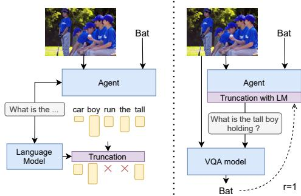  
Figure 1: (left) In a conditional language generation task as VQG, TrufLL truncates the vocabulary space by using a language model. Here, ’run,’ and ’the’ are syntactically incorrect and thus truncated. Yet, ’car’ is not trimmed as the LM is not visually grounded. (right) In a VQG training loop, the agent generates a question given an image-answer pair, which is then fed to a VQA model predicting an expected answer. If both answers match, the agent is rewarded.

objective (Wu et al., 2019; Peters et al., 2019). Yet, such an approach suffers from several issues (Chen et al., 2020): (i) catastrophic forgetting when a model forgets previously learned knowledge and overfits to target domains, (ii) computational inefficiency from fine-tuning billion-parameters networks, and (iii) the need of supervised datasets. Moreover, task-specific language models learned with SL suffer from well-studied text degeneration issues (Holtzman et al., 2019), such as the exposure bias (Bengio et al., 2015), language biases (Saleh et al., 2020; Jaques et al., 2020), or a lack of diversity (Li et al., 2015).

On the other hand, text generation can be naturally framed as a sequential decision making problem, with the sequence of words seen as successive actions over a vocabulary. Thus, some researchers have recently focused on learning language models using instead

Reinforcement Learning (RL) (Strub et al., 2017; Das et al., 2017; Narasimhan et al., 2015). RL methods allow acquiring language through interactions within rich and diverse environments (Luketina et al., 2019), help understanding language acquisition and language pragmatics (Lazaridou et al., 2016; Bisk et al., 2020). "Reward is enough" (Silver et al., 2021) highlights the necessity of using RL for AI systems to acquire language in its full richness. Indeed, (i) language may be intertwined with other modalities of action and ob servation, (ii) the utility of language varies according to situations and behaviours, (iii) it is consequential and purposeful, and (iv) some linguistic problems are better solved dynamically, through experience (such as using a diplomatic tone in a speech.) In addition, RL allows optimizing a non-differentiable learning signal, hence handles more diverse objective functions, and also avoids some of the text degeneration issues previously mentioned. So far, RL-based text-generation tasks have relied on a pre-training phase to ease learning: the policy language model is trained with SL on the task dataset, before being fine-tuned with policy gradient methods (Sutton et al., 1999) on the task at hand. Those approaches often require human-labelled datasets. Besides, combining pre-training and fine-tuning phases either barely change the policy distribution, or induces language drift (Lazaridou et al., 2020; Lu et al., 2020b), i.e the generated language drifts semantically or syntactically from natural language.

In this paper, we aim at learning a conditional language model using RL without a pre-training phase, so that (i) we get free from datasets with human annotations, and (ii) we avoid the text generation flaws induced by the common methods. While appealing, such an approach requires overcoming the hurdle of the combinatorial language action space, a vocabulary usually containing more than 10,000 words. Yet, while large and discrete, a language action space contains a specific structure, made of all the syntactical and semantics rules of a given language. TrufLL leverages such structure to drive the exploration of the RL-based language agent during training. At each time step of the text generation process, TrufLL truncates its effective action space to a small subset of words provided by a pretrained task-agnostic language model. Such an approach injects a generic prior linguistic knowledge into the RL algorithm, is usable on tasks lacking in-domain labeled data, and can be easily transferred to new RL-based text generation tasks. Thus, TrufLL can be applied to any language generation task given a generic LM and a reward. We here evaluate it on two Visual Question Generation (VQG) tasks, the synthetic CLEVR dataset (Johnson et al., 2017), and the natural language VQAv2 dataset (Goyal et al., 2017). Unlike alternative RL without pre-training approaches, TrufLL manages to ask meaningful and valid questions on large vocabularies, exhibiting success rate and language metrics close to pretrain models with labeled data, while producing more original language.

## 2 Background

Language Generation as an RL Problem. We cast the word-based text generation task as a Markov Decision Process to apply RL methods (Sutton et al., 1998). In this setting, a language model agent generates a sequence of words $w _ { < t } = ( w _ { 0 } , w _ { 1 } , . . . , w _ { t - 1 } )$ drawn from a vocabulary $\nu ,$ given an initial context c associated with a reward $r _ { t }$ . Translation, text summarization or image captioning are examples of such tasks respectively using a source sentence, a text article, or an image as a context (c). During this process, the agent may be rewarded with language scores (Ranzato et al., 2016), human preferences (Stiennon et al., 2020) or task completion scores (Strub et al., 2017).

Formally, a language generation agent is defined by a policy $\pi _ { \theta }$ (a distribution over ) parametrized by $\theta ,$ first initialized with the context c. At each time step $t ,$ the agent samples a new word $w _ { t }$ from its policy $\pi _ { \theta } ( w _ { t } | w _ { < t } , c )$ . It moves to a new state $( w _ { < t + 1 } , c )$ and receives a reward $r _ { t } = r ( w _ { < t } , c , w _ { t } )$ , where r is a reward function relative to the language task. The RL language agent aims to learn a policy that maximizes $\mathbb { E } _ { \pi _ { \theta } } [ \sum _ { t = 0 } ^ { T } r _ { t } ] , ^ { 2 }$ while generating the sequence of words $w _ { < T }$ , where $\mathbb { E } _ { \pi _ { \theta } }$ is the expectation under $\pi _ { \theta } ,$ and T the maximal length of the words sequence.

Policy Gradient This optimization process may be performed through Policy Gradient (PG) algorithms (Sutton et al., 1999). In the language literature, REINFORCE (Williams, 1992) has been used as a simple Monte Carlo approximation of this gradient (Strub et al., 2017; Li et al., 2016).Yet, in this paper, we use a Proximal Policy Optimization approach (PPO) (Schulman et al., 2017) to have a lower variance and better convergence rate; PPO clips the gradient estimate to have smooth policy updates. For all $0 \leq t \leq T$ , let $\boldsymbol { s } _ { t } = \left( \boldsymbol { w } _ { < t } , c \right)$ and $a _ { t } = w _ { t }$ be the state and action at time t. Policy gradient methods

minimize the objective:

$$
L _ { \mathrm { p g } } ( \theta ) { = } \mathbb { E } _ { \pi _ { \theta } } \left[ \sum _ { { t = 0 } } ^ { T } \mathrm { l o g } \pi _ { \theta } ( a _ { t } | s _ { t } ) \hat { A } _ { t } \right] ,
$$

where $\hat { A } _ { t }$ is an estimator of the advantage function, here defined as $\begin{array} { r } { \hat { A } _ { t } ~ = ~ \sum _ { u = t } ^ { T } r _ { u } - V _ { \phi } ( s _ { t } ) } \end{array}$ with $V _ { \phi } ( s )$ an estimator of the value function $\begin{array} { r } { V _ { \pi _ { \theta } } ( s ) = \mathbb { E } _ { \pi _ { \theta } } [ \sum _ { u = t } ^ { T } r ( s _ { u } , a _ { u } ) | s _ { t } = s ] . } \end{array}$ . PPO then keeps track of the previous policy $\pi _ { \theta _ { o l d } }$ before the PG update to compute the training objective:

$$
L _ { \mathrm { p p o } } ( \theta ) = \mathbb { E } _ { \pi _ { \theta _ { o l d } } } \left[ \sum _ { { t = 0 } } ^ { T } \rho _ { t } ^ { \theta } \hat { A } _ { t } \wedge \mathrm { c l i p } ( 1 - \epsilon , \rho _ { t } ^ { \theta } , 1 + \epsilon ) \hat { A } _ { t } \right] ,
$$

where for all real numbers $a , b , a \wedge b = \operatorname* { m i n } ( a , b )$ $\rho _ { t } ^ { \theta } = \pi _ { \theta } ( a _ { t } | s _ { t } ) / \pi _ { \theta _ { o l d } } ( a _ { t } | s _ { t } )$ , ϵ is a hyper-parameter controlling the magnitude of the policy updates, and $\mathrm { c l i p } ( a , x , b )$ is the function that clips x in interval $[ a , b ]$ The expectation is estimated in practice using a Monte Carlo approach, with an empirical average over a finite batch of episodes, i.e a succession of transitions $\left( s _ { t } , a _ { t } \sim \pi _ { \theta _ { o l d } } ( . | s _ { t } ) , r _ { t } \right)$ from an initial state $s _ { 0 }$ to a terminal state $s _ { T }$ . Finally, the training loss is completed first with a value-based loss to learn the baseline $V _ { \phi }$ that reduces the gradient variance; it computes for each timestep t of an episode the mean squared error $\textstyle | \sum _ { u = t } ^ { T } r _ { u } - { \hat { V } } _ { \phi } ( s _ { t } ) | ^ { 2 } . ^ { 3 }$ Secondly, the loss is completed with an entropy term to soften the policy distribution, which computes for each timestep t of an episode $H ( \pi _ { \theta } ( a _ { t } | s _ { t } ) )$ , where H is the entropy function.

## 3 TrufLL

We here aim at making RL methods feasible in the language setting by dynamically reducing the action space, i.e., by restricting the language agent to select a word within a subset of the vocabulary at each time step. We detail below the action space’s truncation model and the associated RL algorithm to learn the language agent.

## 3.1 Dynamic Vocabulary Truncation

TrufLL combines two distinct language models, which share the same vocabulary : a RL language agent $\pi _ { \theta }$ and a pretrained language model $f _ { L M }$ . At each timestep t, TrufLL restricts the vocabulary space of the RL language agent with:

$$
\mathcal { V } _ { t } ^ { - } = \{ w | w \in \mathcal { V } , g _ { t r u n c } ( w | w _ { < t } ) = 1 \} ,
$$

where $g _ { t r u n c }$ is a truncation function based on $f _ { L M }$ which either associates 0 or 1 with each word in the vocabulary given the past words $w _ { < t }$ . From a language modelling perspective, the vocabulary space of the language agent is reduced from  to $\mathcal { V } ^ { - }$ where $| \nu ^ { - } | \ll | \nu |$ , with the cardinal of a finite set. From a RL perspective, the RL agent follows a truncated policy $\pi _ { \theta } ^ { - }$ which only samples actions over the subset $\mathcal { V } ^ { - }$ In practice, such a policy is computed using a masked softmax function over the truncated vocabulary $\nu _ { t } ^ { - } \mathrm { : }$ $\pi _ { \theta } ^ { - } ( . | w _ { < t } , c ) = \mathrm { s o f t m a x } ( m * l o g i t s _ { \pi _ { \theta } } ( w _ { < t } , c ) )$ where $m = 1$ when $g _ { t r u n c } ( w | w _ { < t } ) = 1$ otherwise $m { = } { - } \infty$

## 3.2 Truncation Functions

We here list the different truncation functions gtrunc explored through the paper.

Top-k words: This function selects the k words with the highest probability given by $f _ { L M } ( . | w _ { < t } )$

$$
g _ { \mathrm { t o p ( k ) } } ( w _ { t } | w _ { < t } ; k ) = \mathbb { 1 } _ { w _ { t } \in \mathrm { t o p ( k ) } ( f _ { L M } ( . | w _ { < t } ) ) } .
$$

Probability threshold (α): This function only keeps words having a probability $f _ { L M } ( . | w _ { < t } )$ greater than α:

$$
g _ { \mathrm { p } _ { \mathrm { t h } } ( \alpha ) } ( w _ { t } | w _ { < t } ; \alpha ) = \mathbb { 1 } _ { f _ { L M } ( w _ { t } | w _ { < t } ) > \alpha } .
$$

Top-p: This function is based on nucleus sampling (Holtzman et al., 2019), and it keeps the most likely words contained in a probability mass $p$ of $f _ { L M } ( . | w _ { < t } )$ . Formally, we define $\mathcal { V } _ { t } ^ { p }$ as:

$$
\mathcal { V } _ { t } ^ { p } = \operatorname { a r g m i n } _ { | V _ { t } | , V _ { t } \subset \mathcal { V } } \{ w | w \in V _ { t } , \sum _ { w \in V _ { t } } f _ { L M } ( w | w _ { < t } ) > p \} ,
$$

and readily, $g _ { \mathrm { t o p ( p ) } } ( w _ { t } | w _ { < t } ; p ) = \mathbb { 1 } _ { w _ { t } \in \mathcal { V } _ { t } ^ { p } } .$

Sample (k): This function randomly samples k words from the language model with replacement to directly build the truncated vocabulary:

$$
g _ { \mathrm { s a m p l e ( k ) } } ( w _ { t } | w _ { < t } ; k ) = \mathbb { 1 } _ { w _ { t } \in \{ w _ { i } \sim f _ { L M } ( . | w _ { < t } ) i \in [ 1 , . . . , k ] \} } .
$$

Only $\mathrm { t o p ( k ) }$ provides a fixed number of words at each time step. $\mathrm { p } _ { \mathrm { t h } } ( \alpha ) , \mathrm { t o p ( p ) }$ , and sample(k) have a dynamic truncation, whose size at t depends on the language model entropy.

## 3.3 Task-Specific vs. Generic LM

We benchmark two types of language models for truncation. On the one hand, we use an external language model pretrained on a large task-agnostic language corpora. Such a model provides a generic linguistic prior to the RL agent exploration process, solely encoding syntactic and semantic information. On the other hand, we use a task-related language model pretrained on the supervised dataset associated with the task. Such a model provides a task-specific linguistic prior to the RL language agent, and captures language pragmatics. We emphasize that this paper aims at leveraging taskagnostic language models as they discard the need for task-specific data. For the sake of completeness, we also study the truncation with the task-related LM as an additional benchmark to assess our approach.

## 4 Experimental Setting

We here list the experimental setting and detail the network and hyperparameters in Appendix A.4.

## 4.1 Visual Question Generation

We showcase TrufLL on the task of Visual Question Generation (VQG) (Mostafazadeh et al., 2016), which is a form of Visual Jeopardy! ™ (Ferrucci, 2012). There, the language agent observes an image-answer pair and has to generate a question that results in a similar answer, as illustrated in Figure 1. Such a task presents multiple advantages. First, by combining vision, scene understanding and language generation, it requires high-level reasoning and exhibits a large spectrum of language difficulties. Secondly, the success criterion is naturally non-differentiable, hence a natural fit for RL methods. Such a criterion, unlike metrics based on ground-truth sentences, allows generating diverse grounded questions given an image-answer pair.

Formally, the initial context c is composed of the image-answer pair $( \mathbb { Z } , \mathcal { A } )$ . The RL agent then generates a sequence of words $w _ { < t }$ of maximum length T. We then provide the generated question to a pretrained VQA model. This model takes as inputs the image , the generated question $w _ { < t }$ and outputs a predicted answer ˆ . Finally, the agent receives a reward $r ( w _ { t } , w _ { < t } , c )$ based on and ˆ.

## 4.2 Datasets

We evaluate TrufLL on the CLEVR and VQAv2 datasets to simulate large-scale VQG datasets. The two datasets have been originally created for the task of Visual Question Answering (VQA), i.e. for multi-modal classification algorithms predicting an answer given an image-question pair.

CLEVR The CLEVR VQA dataset (Johnson et al., 2017) is made of template questions on synthetic images, which contain simple objects with four distinct properties (shape, material, color, size). The vocabulary contains 86 words and 28 potential answers, making it a valuable proof of concept for assessing

TrufLL. Both language models are single-layer LSTMs (Hochreiter and Schmidhuber, 1997) with 512 units, and 512 word embedding dimension. The task-specific LM is trained over the full train dataset of CLEVR questions. The external language model is trained on the mixture of CLOSURE (Bahdanau et al., 2019) and CLEVR-Dialog (Kottur et al., 2019) datasets. Although those two datasets share the CLEVR vocabulary, their language distribution differs from vanilla CLEVR. Finally, we use a pretrained GT-Vector-NMN (Bahdanau et al., 2019) to compute the reward $r ( w _ { t } , w _ { < t } , c ) = \mathbb { 1 } _ { \mathcal { A } = \hat { A } , t = T - 1 }$ , where 1 is the indicator function.

VQAv2 The VQAv2 dataset (Goyal et al., 2017) is made of natural language and open-formed questions on images from the MS-Coco Dataset (Lin et al., 2014). It has a vocabulary of 14,810 words and 3,149 answers. The task-specific language model is a one-layer LSTM with 512 units and a 512 word embedding dimension, pretrained over the full training dataset of VQAv2 questions. The External Language Model is Open-AI’s GPT-2 (Radford et al., 2019). The original language model outputs a probability distribution over 50,257 tokens, but we use a masked softmax function to restrict the probability distribution to the 14,810 tokens of the VQAv2 dataset. Unlike most NLP tasks relying on pretrained generic language models, we do not fine-tune it on the task dataset. Instead, we leverage the few-shot generalization capabilities of GPT-2, by feeding the language model with the prompt "Here are a few examples:" followed by 100 random questions $q _ { < 1 0 0 }$ from the dataset. The truncation is then based on the probability distribution $f _ { L M } ^ { g p t 2 } ( . | q _ { < 1 0 0 } , w _ { < t } )$ . Finally, we used a pretrained Vil-BERT to compute the reward (Lu et al., 2020a). Given the large number of answers, we use as reward a decreasing function of the rank of the reference answer $\operatorname { r k } ( \mathcal { A } ) \colon r ( w _ { t } , w _ { < t } , c ) = \mathbb { 1 } _ { \operatorname { r k } ( \mathcal { A } ) \leq 1 0 , t = T - 1 } e ^ { - \operatorname { r k } ( \mathcal { A } ) / 2 }$ , as further explained in Appendix A.5.

In these two settings, we acknowledge that the task dataset is still used to train the VQA models. Please note that the VQA modules are only used to model the environment, i.e. to provide a positive/negative feedback to the agent. In other settings, TrufLL would still work if we replace the VQA model by any language interface: text-game (e.g. Zork), expert-systems, or humans. Here, we only use the VQG framework as a proof of concept that natural language can be learned through pure interaction given any task reward. Other language generation applications are discussed in Section 5.3.

## 4.3 Baselines

In this paper, we aim to show that a RL language agent can be trained from scratch, i.e. without the usual pre-training phase by solely interacting with another language system, the VQA model, when supported by truncation methods. The truncation with the task-related LM is referred to as TrufLL (Task-LM), while the one with the External LM is referred as TrufLL (Ext-LM). We first emphasize the difficulty of training an RL language agent without a supervised pre-training phase through two baselines. We trained a simple on-policy PPO algorithm without any action space pruning, and refer to it as scratch. Then, we added a Kullback-Leibler (KL) regularization term to the loss, λKLKL $( \pi _ { \boldsymbol { \theta } } | | f _ { L M } )$ with $\lambda _ { \mathrm { K L } } > 0 .$ , to incorporate language prior to the agent as in (Jaques et al., 2017, 2019). We refer to it as scratch + KL-task when distilling the task-specific language model, and scratch + KL-ext with the external language model. Finally, we include two baselines with a pre-training phase. We trained a language agent on the task-dataset with a log-likelihood objective, and refer to it as pretrain. Then, we fine-tune the pretrained language agent with PPO without truncation, and refer to it as pretrain + RLfine-tune. These two baselines should be viewed as gold standards as they rely on task-related data; additionally, pretrain + RL fine-tune is today the state-of-the-art method for learning RL-based LM.

## 4.4 Metrics and Evaluation Methods

Evaluating text generation is an open-research problem in language literature. We decompose automatic language evaluation into three categories to assess different facets of language, and perform as well a human evaluation study.

Performance metrics. We measure the taskcompletion score or recall @ 1 which states whether the target answer  is the top answer of the VQA models, and the recall @ 5 (R@5), which assesses whether  is in the 5 top answers. These scores measure the task-solving abilities of the agent, but they are also conditioned by the VQA model abilities.

Language Metrics. First, we used n-grams metrics, BLEU (Papineni et al., 2002), METEOR (Banerjee and Lavie, 2005) and CIDEr (Vedantam et al., 2015), to measure the similarity between the generated question and the reference questions in the evaluation set. While those scores can capture syntactic and semantic properties of language, they also fall short when dealing with open-form language, e.g. an identical answer may arise from two non-overlapping but syntactically correct questions. Thus, we also compute two metrics assessing the quality of the language independently of reference questions, the perplexity of the question given an external LM (ppl-e), and its perplexity given the task-related LM (ppl-t).

Diversity Metrics. We here estimate a self-BLEU (sBLEU) score (Zhang et al., 2017) over 10 questions generated on the same image-answer pair. Although such score detects potential mode collapse, i.e., when the language utters identical sequences of words, it also values babbling, i.e., outputting random words. We thus also measure the probability mass of the ten most frequent words (Choshen et al., 2020), and refer to it as peakiness (peak).

Human Evaluation. On the VQAv2 task, we also performed human evaluation by surveying 53 participants on the first 50 questions produced by some of the models at test time. The study (further detailed in Appendix C) is based on pairwise comparison of question samples produced by the concurrent algorithms according to four criteria. First, we evaluated the language quality of the question samples, by asking the participants to select the most syntactically and semantically correct question among the two samples of the questions pair. Secondly, we evaluated language grounding, i.e adequacy of the sample to the image-answer pair, by asking the participants to select the question most suitable given the two elements. Thirdly, we evaluated the language originality and diversity, by asking participants to select the question the most different from the dataset reference question. Finally, we evaluated the number of syntax errors by asking participants to tick the question if it is grammatically incorrect. Examples of questions asked during the study are included in the Appendix C.

## 4.5 Sampling methods for text generation

When generating text from a trained language model, the quality and diversity of samples depend on the decoding algorithm (Zhang et al., 2020). We consider three text generation methods. greedy uses the argmax of the policy, while sampling uses the multinomial distribution. Finally, we sampled ten text sequences from the policy, and selected the one with the lowest perplexity according to the external language model, and refer to it as lm-ranking. This process has been used recently in Text-to-Image Generation tasks (Ramesh et al., 2021).

<table><tr><td>Method</td><td>Score</td><td>R@5</td><td>BLEU</td><td>Meteor</td><td>CIDEr</td><td>ppl-t (↓)</td><td>ppl-e (↓)</td><td>sBLEU (↓)</td><td>peak.(↓)</td></tr><tr><td>Pretrain</td><td>0.30</td><td>0.71</td><td>0.19</td><td>0.38</td><td>0.83</td><td>3.1</td><td>31</td><td>0.44</td><td>0.96</td></tr><tr><td>Pretrain + RL fine-tune</td><td>0.44</td><td>0.86</td><td>0.17</td><td>0.34</td><td>0.70</td><td>4.0</td><td>35</td><td>0.46</td><td>0.95</td></tr><tr><td>Scratch</td><td>0.17</td><td>0.47</td><td>0.05</td><td>0.08</td><td>0.10</td><td>109</td><td>10⁶</td><td>0.14</td><td>0.26</td></tr><tr><td>Scratch + KL-task</td><td>0.14</td><td>0.38</td><td>0.15</td><td>0.30</td><td>0.53</td><td>92</td><td>102</td><td>0.34</td><td>0.94</td></tr><tr><td>Scratch + KL-ext</td><td>0.17</td><td>0.44</td><td>0.14</td><td>0.27</td><td>0.43</td><td>104</td><td>28</td><td>0.37</td><td>0.95</td></tr><tr><td>TrufLL (Task-LM)</td><td>0.56</td><td>0.90</td><td>0.17</td><td>0.32</td><td>0.66</td><td>3.4</td><td>23</td><td>0.95</td><td>1.00</td></tr><tr><td>TrufLL (Ext-LM)</td><td>0.48</td><td>0.93</td><td>0.08</td><td>0.18</td><td>0.34(±0.10)</td><td>103</td><td>3.0</td><td>0.95</td><td>1.00</td></tr></table>

Table 1: CLEVR metrics on 5k test episodes with 50k train episodes on 20k Images. Scores are averaged over the three decoding procedures mentioned in Section 4.5 and over 5 seeds; standard deviations are displayed when greater than 0.01 for accuracy metrics. We here report the models with the highest task-success:, i.e. the scratch+KL baselines with $\bar { \lambda } _ { K L } = 0 . 1$ , and the truncation model with a probability threshold, p (α=0.05). Best values are underlined, best values without task-data (from scratch) are in bold.

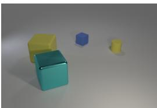

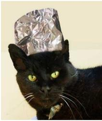

<table><tr><td>Human</td><td>There is a blue thing that is the same shape as the big cyan metallic object ; what is its size? A:Small</td></tr><tr><td>pretrain pretrain + RL</td><td>There is a red metallic object that is the same size as the yellow rubber block ; what is its size? What size is the thing that is the same color as the matte cube ?</td></tr><tr><td>scratch scratch+KL-task scratch+KL-ext</td><td>size sphere small blue or a yellow green large else in cylinders cubes color and how matte objects cube How big is the shiny cylinder ?</td></tr><tr><td>TrufLL (Task-LM)</td><td>How many other objects in the are of same color as that shiny object ? How big is the thing that is to the right of the big matte thing ?</td></tr><tr><td>TrufLL (Ext-LM)</td><td>What is the size of the thing that is right of the big cyan thing and is the same shape?</td></tr><tr><td></td><td></td></tr><tr><td>Human</td><td>What color is the cat A:Black</td></tr><tr><td>pretrain pretrain + RL</td><td>What color is the cat&#x27;s collar?</td></tr><tr><td>scratch</td><td>What color is the cat?</td></tr><tr><td>scratch+KL-task</td><td>AmazingAmazingAmazingAmazingAmazingAmazingAmazing</td></tr><tr><td>scratch+KL-ext</td><td>What color is their hat of the fingers of this?</td></tr><tr><td></td><td>The the first time is a bit of the way</td></tr><tr><td>TrufLL (Task-LM)</td><td></td></tr><tr><td>TrufLL (Ext-LM)</td><td>What color is her outfit?</td></tr></table>

Figure 2: Samples on CLEVR and VQA: the checkbox indicates that the question generates the correct answer.

## 5 Results

## 5.1 CLEVR results

Quantitative performance: In Table 1, vanilla RL from scratch fails to have a decent performance even with synthetic language. Besides, adding a KL regularisation term does kick-start the learning process. Yet, as soon as we apply the dynamic truncation, TrufLL matches the pretrained baselines performance when using the external LM, and even outperforms them with the task-specific LM. In this synthetic VQG setting, TrufLL seems to be a viable and promising procedure to learn a RL language agent without a supervised training phase. Pretrained baselines have high language scores when assessed with datasetbased metrics, e.g BLEU or task-perplexity. Yet, they also remain close to the original dataset distribution with a medium external perplexity. Noticeably, TrufLL with the task-specific LM follows the same pattern. On the other hand, TrufLL with the external LM reports poor dataset-based language scores, while maintaining a low external perplexity. Therefore, TrufLL seems to correctly capture the language distribution of the initial LM. As the performance score is high when using an external LM, it suggests that our approach can learn a policy on a language task without the need of a task-related dataset. Less positively, TrufLL diversity metrics suggest potential mode collapse, with a high peakiness and self-BLEU score.

Qualitative performance: We display qualitative samples in Figure 2 and Appendix D. On the one hand, the pretrained baselines generate either a question inconsistent with the visual context, or which fails to answer the expected answer. They inaccurately capture the pragmatics of the task. On the other hand, TrufLL generate adequate questions, resulting in the expected answer. Interestingly, they are often grounded with different objects of the image. It is remarkable that TrufLL with a generic LM still manages to capture the necessary subtleties of VQG, without any prior task knowledge. Despite a peaky distribution, TrufLL has moderate repetitions across images, and is mostly overconfident. As for the scratch+KL samples, they are either not grounded, or showcase degenerated language.

Truncation function in CLEVR: In Table 2, we evaluate the different truncation functions defined in Section 3. While all truncation methods report similar task performance, the dynamic truncation functions, i.e. pth(α), top(p) and sample(k), outperform the top(k) regarding language metrics. Interestingly, the sample(k) one, which generates a stochastic truncated action space, while having a lower performance, yields to the most correct and diverse language, with higher language scores and a lower self-BLEU. A stochastic action space might be harder to explore efficiently for reaching good task-solving abilities, but might strengthen the agent language generation properties.

<table><tr><td>Trunc.</td><td>Score</td><td>BLEU</td><td>CIDEr</td><td>ppl-e(↓)</td><td>sBLEU(↓)</td></tr><tr><td colspan="6">TrufLL (Task-LM)</td></tr><tr><td>top(k)</td><td>0.50</td><td>0.12</td><td>0.32</td><td>100</td><td>0.93</td></tr><tr><td>Pth(α)</td><td>0.54</td><td>0.17</td><td>0.65</td><td>24</td><td>0.95</td></tr><tr><td>top(p)</td><td>0.51</td><td>0.17</td><td>0.69</td><td>12</td><td>0.96</td></tr><tr><td>sample(k)</td><td>0.50</td><td>0.18</td><td>0.73</td><td>16</td><td>0.89</td></tr><tr><td colspan="6">TrufLL (Ext-LM)</td></tr><tr><td>top(k)</td><td>0.52</td><td>0.06</td><td>0.15</td><td>151</td><td>0.94</td></tr><tr><td>Pth(α)</td><td>0.48</td><td>0.08</td><td> $0 . 3 4 ( \pm 0 . 1 0 ) $ </td><td>3.0</td><td>0.95</td></tr><tr><td>top(p)</td><td>0.45</td><td>0.10</td><td> $0 . 4 0 \dot { ( \pm 0 . 1 7 ) }$ </td><td>3.3</td><td>0.92</td></tr><tr><td>sample(k)</td><td>0.41</td><td>0.13</td><td> ${ \bf 0 . 4 6 } ( \pm 0 . 1 6 )$ </td><td>2.7</td><td>0.92</td></tr></table>

Table 2: CLEVR task: Truncation functions with parameters: top(k=10), pth(α=0.05) top(p=0.85), sample(k=20). Best values are underlined, best values for each TrufLL algorithms are in bold.

## 5.2 VQAv2 task

In CLEVR, we observe that TrufLL seems a promising approach to learn a language policy without a supervised training phase, by solely interacting with another language system. We scale our approach to natural language with large vocabulary (15k tokens) through the VQAv2 dataset.

Quantitative performance: Table 3 reports the VQAv2 results, for which TrufLL and the baselines present a similar trend than on CLEVR. First, the scratch baselines keep failing to learn a valuable policy, with performance scores and n-grams metrics close to zero. Although TrufLL does not outperform the performance of the pretrained baselines anymore, it still leads to similar performances, and satisfactory language scores. The similarity between TrufLL (Task-LM) and TrufLL (Ext-LM) results suggests that the truncation approach is viable when using a generic LM whose original vocabulary distribution differs from the task. Interestingly, TrufLL displays a self-BLEU score similar to the pretrained baselines. This suggests that the poor diversity behavior observed on CLEVR is likely attributable to the small vocabulary and synthetic language distribution.

Qualitative performance: In Figure 2 and Appendix D, we display question samples for all models. TrufLL and the pretrained baselines successfully generate a question giving the expected answer ("Black"), while the RL from scratch baselines fail, and even showcase degenerated language. Pretrained baselines tend to output a question closer to the reference question whereas TrufLL outputs original questions which differs from the VQA distribution, yet consistent with the context.

Human Evaluation: Figure 3 details the Human Evaluation results. Among the RL from scratch baselines, we selected scratch+KL-task as the only model producing sometimes meaningful questions. Yet, it fails to generate correct and grounded language; it is thus not a viable approach despite its diverse output. In line with the automatic metrics, the supervised baselines produce the best language, while being accurately grounded. Yet, they exhibit significantly less diversity with the reference language; this suggests in particular that pretrain+RL fails to go beyond the initial task-data distribution. Finally, unlike TrufLL (Task-LM) which suffers from syntactic errors, TrufLL (Ext-LM) produces language that qualitatively competes with pretrain models (53%), with a similar ratio of syntactic uncorrect samples. Although its questions are less grounded, they are diverse, which suggests that they follow a different distribution from the initial VQA dataset. It confirms that TrufLL (Ext-LM) could be an alternative approach as it has an excellent trade-off between language quality, diversity, and grounding.

Decoding procedure: In Table 4, we evaluate the text sampling procedures described in Section 4.5. While greedy decoding produces the best outcome for pretrained models, lm-ranking provides an excellent trade-off between task performance and language quality with RL-based methods. As PG solely optimizes the task success ratio, this may reduce overall language quality, the re-ranking thus retrieves the best syntactically sentences a posteriori.

## 5.3 Discussion

Removing the truncation at evaluation with offpolicy RL. So far, TrufLL directly learns the truncated policy over the truncated vocabulary $\nu _ { t } ^ { - }$ in an on-policy scheme. Hence, the algorithm requires the truncation, and a fortiori the language model, at test time. In this section, we investigate if we can directly learn a policy over the full vocabulary, and thus removing the truncation at test time. In such a setting, we adopt an off-policy training scheme, where the trajectories used to learn the behavior $\pi _ { \theta }$ at training time are sampled under a different policy, the truncated policy $\pi _ { \theta } ^ { - }$ . Thus, we need to unbiased the PG by using an importance sampling term between the exploratory policy $\pi _ { \theta } ^ { - }$ and the behavior policy $\pi _ { \theta }$ (Degris et al.,

<table><tr><td>Method</td><td>Score</td><td>R@5</td><td>BLEU</td><td>Meteor</td><td>CIDEr</td><td>ppl-t (↓)</td><td> $\underline { { \mathrm { p p l - e } \left( \downarrow \right) } }$ </td><td>sBLEU (↓)</td><td>peak.(↓)</td></tr><tr><td>Pretrain</td><td>0.38</td><td>0.59</td><td>0.30</td><td>0.40</td><td>0.93</td><td>12-21</td><td>230</td><td>0.80</td><td>0.99</td></tr><tr><td>Pretrain + RL fine-tune</td><td>0.41</td><td>0.63</td><td>0.31</td><td>0.41</td><td>0.98</td><td></td><td></td><td>0.78</td><td>0.99</td></tr><tr><td>Scratch</td><td>0.01</td><td>0.04</td><td>0.00</td><td>0.00</td><td>0.00</td><td> ${ 1 0 } ^ { 7 }$ </td><td> ${ 1 0 } ^ { 6 }$ </td><td>0.75</td><td>1.00</td></tr><tr><td>Scratch + KL-task Scratch + KL-ext</td><td>0.11</td><td>0.29</td><td>0.24</td><td>0.27</td><td>0.24</td><td> $1 0 ^ { 2 }$ </td><td> $1 0 ^ { 2 }$ </td><td>0.27</td><td>0.74</td></tr><tr><td></td><td>0.01</td><td>0.05</td><td>0.06</td><td>0.04</td><td>0.01</td><td> ${ 1 0 } ^ { 6 }$ </td><td> $1 0 ^ { 3 }$ </td><td>0.10</td><td>0.20</td></tr><tr><td>TrufLL (Task-LM)</td><td>0.35</td><td>0.56</td><td>0.21</td><td>0.15</td><td>0.11</td><td>24</td><td> $1 0 ^ { 2 }$ </td><td>0.78</td><td>0.99</td></tr><tr><td>TrufLL (Ext-LM)</td><td>0.34</td><td>0.52</td><td>0.18</td><td>0.15</td><td>0.04</td><td> $1 0 ^ { 2 }$ </td><td>24</td><td>0.83</td><td>0.99</td></tr></table>

Table 3: VQAv2 metrics on 20k test episodes with 100k train episodes. Scores are averaged over the three decoding procedures. scratch+KL has $\lambda _ { K L } = 0 . 0 5 ,$ , the truncation for TrufLL with (Task-LM) and TrufLL (Ext-LM) are respectively pth(α=0.005) and $\mathrm { p } _ { \mathrm { t h } } ( \alpha { = } 0 . 0 0 7 5 )$ . Best values are underlined, best values without task-data are in bold.  
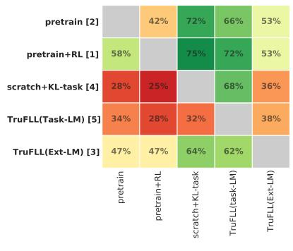

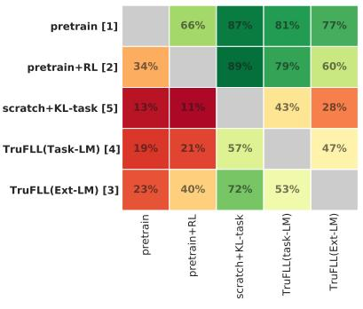

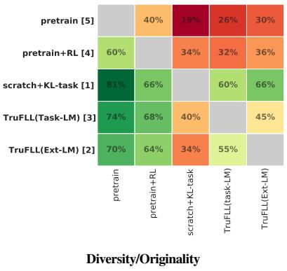

Pairwise comparisons: % of questions chosen for the model in bold (rows) when compared to the concurrent model (columns).
<table><tr><td rowspan=1 colspan=1></td><td rowspan=1 colspan=1>pretrain (2)</td><td rowspan=1 colspan=1>pretrain+RL (3)</td><td rowspan=1 colspan=1>scratch+KL-task (5)</td><td rowspan=1 colspan=1>TrufLL (Task-LM) (4)</td><td rowspan=1 colspan=1>TrufLL (Ext-LM) (1)</td></tr><tr><td rowspan=1 colspan=1>Syntax errors</td><td rowspan=1 colspan=1>16%</td><td rowspan=1 colspan=1>17%</td><td rowspan=1 colspan=1>27%</td><td rowspan=1 colspan=1>24%</td><td rowspan=1 colspan=1>15%</td></tr></table>

Figure 3: VQAv2 results for Human Evaluation study detailed in Section 4.4. The three matrices on top are pairwise comparisons: each cell displays the proportion of questions chosen for the models in the row (bold) when compared to the concurrent model in the column. The table at the bottom displays the proportion of incorrect questions coming from each model among all incorrect samples. In all figures, bracket numbers indicates the model rank per criteria, from 1="best" to 5="worst".

<table><tr><td>Method</td><td>Text-gen</td><td>Score</td><td>BLEU</td><td>CIDEr</td><td>ppl-e</td></tr><tr><td rowspan="3">pretrain</td><td>greedy</td><td>0.40</td><td>0.32</td><td>1.01</td><td>51</td></tr><tr><td>sampling</td><td>0.37</td><td>0.30</td><td>0.88</td><td>62</td></tr><tr><td>lm-ranking</td><td>0.37</td><td>0.14</td><td>0.87</td><td>54</td></tr><tr><td rowspan="3">pretrain + RL</td><td>greedy</td><td>0.42</td><td>0.32</td><td>1.05</td><td>55</td></tr><tr><td>sampling</td><td>0.40</td><td>0.30</td><td>0.92</td><td>71</td></tr><tr><td>lm-ranking</td><td>0.40</td><td>0.31</td><td>0.99</td><td>26</td></tr><tr><td rowspan="3">TrufLL (Task-LM)</td><td>greedy</td><td>0.36</td><td>0.20</td><td>0.11</td><td>366</td></tr><tr><td>sampling</td><td>0.35</td><td>0.20</td><td>0.11</td><td>337</td></tr><tr><td>lm-ranking</td><td>0.34</td><td>0.21</td><td>0.11</td><td>95</td></tr><tr><td rowspan="3">TrufLL (Ext-LM)</td><td>greedy</td><td>0.36</td><td></td><td></td><td></td></tr><tr><td>sampling</td><td>0.34</td><td>0.18 0.18</td><td>0.04 0.04</td><td>25 28</td></tr><tr><td>lm-ranking</td><td>0.33</td><td>0.19</td><td>0.15</td><td>20</td></tr></table>

Table 4: VQAv2: Ablation on the sampling methods. Overall best values are underlined, TrufLL best values are in bold.

2012). Formally, the off-policy PPO loss is defined by:

$$
L _ { \mathrm { p p o } } ^ { o f f } ( \theta ) { = } \mathbb { E } _ { \pi _ { \theta } ^ { - } } \left[ \operatorname* { m i n } ( \bar { \rho } _ { t } ^ { \theta } A _ { t } , \operatorname { c l i p } ( 1 { - } \epsilon , \bar { \rho } _ { t } ^ { \theta } , 1 { + } \epsilon ) A _ { t } ) \right] ,
$$

where $\begin{array} { r } { \bar { \rho } _ { t } ^ { \theta } = \frac { \pi _ { \theta } ( a _ { t } | s _ { t } ) } { \pi _ { \theta _ { o l d } } ( a _ { t } | s _ { t } ) } \frac { \pi _ { \theta _ { o l d } } ( a _ { t } | s _ { t } ) } { \pi _ { \theta _ { o l d } } ^ { - } ( a _ { t } | s _ { t } ) } } \end{array}$ is the new ratio.4

Table 5 displays the on-policy and off-policy results on both VQG tasks for TrufLL (task-LM), and is further detailed in Appendix B.3. We also monitor the probability mass of the policy attributed to the truncated action space (sumVA). The policy only samples words within the truncated action space when sumVA = 1, without needing the truncation. On CLEVR, the Truf $\mathrm { \Delta L _ { o f f } }$ has lower - yet close - performance on language and task scores than TrufLL. As its sumVA ratios are very close to 1, the agent has learned to generalize over the full vocabulary. However, the approach does not manage to sufficiently scale to VQAv2. It could be improved with regularisation techniques and the use of TruFLL within state-of-the-art off-policy RL algorithms. We leave such possibilities to future works.

<table><tr><td>Algo</td><td>Score</td><td>BLEU</td><td>CIDEr</td><td>ppl-e</td><td>sBLEU</td><td>sumVA</td></tr><tr><td colspan="7">CLEVR</td></tr><tr><td>TrufLL</td><td>0.56</td><td>0.17</td><td>0.06</td><td> $\overline { { 1 0 ^ { 3 } } }$ </td><td>0.78</td><td>N.A</td></tr><tr><td>TrufLLoff</td><td>0.50</td><td>0.14</td><td>0.43</td><td>10⁴</td><td>0.88</td><td>0.96</td></tr><tr><td colspan="7">VQAv2</td></tr><tr><td>TrufLL</td><td>0.35</td><td>0.21</td><td>0.11</td><td>104</td><td>0.36</td><td>N.A</td></tr><tr><td>TrufLLoff</td><td>0.07</td><td>0.03</td><td>0.01</td><td>10⁴</td><td>0.05</td><td>0.08</td></tr></table>

Table 5: On-policy vs. off-policy scores: when training with an off-policy loss, we remove the truncation at test time.

Additional experiments. We sweep over truncation hyper-parameters in Table 6 of Appendix B. In Table 8, we observe that rewarding an agent with a BLEU score is sub-optimal in both language and task scores on CLEVR. In VQA, we apply temperature scheduling on the LM to perform fine-grained truncations in Table 9 of B.2. Finally, we explore TrufLL with a pre-training phase in Table 10.

Generalization of the approach. TrufLL learns conditional language models able to solve specific Natural Language Generation tasks given a context c. For solving such tasks, it only requires the context, a reward function that scores the language generated by the RL agent with respect to the task, and eventually a few natural language demonstrations fed as input prompt to the generic language model used in the truncation algorithm. Hence, the method is transfer able to a wide variety of NLG tasks, without requiring upfront large-scale labelled datasets. Additionally, the RL framework allows to optimize non-differentiable objectives, making TrufLL a natural choice to learn end-to-end task-oriented dialogs, such as (De Vries et al., 2017; Das et al., 2017). Other interesting tasks for TrufLL include the ones typically found in Vision and Language Representation Learning (Lu et al., 2020a), such as Image Captioning, Grounding Refer ring Expressions (generation of a referring expression over a specific bounding box of an image), Caption based Image Retrieval (generation of a caption that discriminates an image between a set of images). Reward functions for such tasks can be based on similarity scores between the generated language and the associated image or image region, which can be computed using pretrained language representations such as BERT (Devlin et al., 2019) or multi-modal pretrained systems such as ViLBERT (Lu et al., 2019). The context can be any kind of data structure (natural language, database, video, etc): if it is a linguistic input, TrufLL can be applied for instance to text summarization, paraphrase generation (with reward functions based on similarity scores between the context and the generated language) or text-based games (Ammanabrolu and Riedl, 2018).

## 6 Related work

RL and NLP Tasks. Following (Singh et al., 2002; Lemon and Pietquin, 2007), recent RL-based taskoriented dialogues (De Vries et al., 2017; Das et al., 2017; Lewis et al., 2017; Narasimhan et al., 2015) have been developed, where the policy language model is generally pretrained with SL followed RL fine-tuning. Yang et al. (2018); Fan et al. (2018) focused on tackling VQG tasks with RL, respectively on CLEVR and on the VQG dataset. Yet, the former uses slot filling with template questions, while the later computes a mixed objective with a MLE loss using ground-truth sentences. Bahdanau et al. (2016); Rennie et al. (2017) use RL to train language models as an alternative to SL to prevent typical text degeneration issues, but within training algorithms relying on ground-truth examples from labelled datasets.

RL methods for Language Action Spaces. Several RL algorithms have been developed to tackle large discrete action spaces. Hence, Dulac-Arnold et al. (2015); Tennenholtz and Mannor (2019); Chandak et al. (2019) embed the actions into a continuous action space, and then use classic RL algorithms to learn a policy over this continuous space. Zahavy et al. (2018); Seurin et al. (2020) proposes Q-learning algorithms with an elimination signal to eliminate forbidden actions. Closer to our work, a few algorithms (Ammanabrolu and Riedl, 2018) use the structure of language to prune the action space of text-based games, but within value-based algorithms, which are less scalable to large vocabularies. Similarly to TrufLL, CALM (Yao et al., 2020) combines a pretrained language model to prune the action space with a Deep-Q network, aka DRNN (He et al., 2016). Yet, its truncation language model remains fine-tuned on the RL dataset. Besides, CALM is only evaluated on a vocabulary of 697 tokens, and on 4-words action sequences.

Learning Language Models from scratch. (Ziegler et al., 2019; Garg et al., 2021) finetune pretrained GPT-2 models with RL for language generation tasks without task-related data, only using reward signals. Yet, they still face optimization and computational challenges (Parisotto et al., 2020).

## 7 Conclusion

We proposed TrufLL, an original approach to learn a natural language generation (NLG) task using RL, without the usual pre-training phase requiring supervised datasets. To our knowledge, this is the first RL-based algorithm dedicated to learning a word-based text-generation task, which does not rely on a pre-training phase while scaling to large vocabularies. Although it comes with its limitations, the truncated RL algorithm provided by TrufLL gets free from labelled data in task-oriented language models, presents interesting language generation properties, and provides a generic and transferable method to learn any NLG problem.

## Acknowledgements

This action benefited from the support of the Chair New Gen RetAIl led by l’X – École Polytechnique and the Fondation de l’Ecole Polytechnique, sponsored by CARREFOUR.

## References

Prithviraj Ammanabrolu and Mark O Riedl. 2018. Playing text-adventure games with graph-based deep reinforcement learning. In Proc. ofthe North American Chapter of the Association for Computational Linguistics (NAACL).

Dzmitry Bahdanau, Philemon Brakel, Kelvin Xu, Anirudh Goyal, Ryan Lowe, Joelle Pineau, Aaron Courville, and Yoshua Bengio. 2016. An actor-critic algorithm for sequence prediction. In Proc. ofthe International Conference on Learning Representations (ICLR).

Dzmitry Bahdanau, Kyunghyun Cho, and Yoshua Bengio. 2015. Neural machine translation by jointly learning to align and translate. In Proc. of the International Conference on Learning Representations (ICLR).

Dzmitry Bahdanau, Harm de Vries, Timothy J O’Donnell, Shikhar Murty, Philippe Beaudoin, Yoshua Bengio, and Aaron Courville. 2019. Closure: Assessing systematic generalization of clevr models. Visually Grounded Interaction and Language (ViGIL).

Satanjeev Banerjee and Alon Lavie. 2005. Meteor: An automatic metric for mt evaluation with improved correlation with human judgments. In Proc. ofACL Workshop on intrinsic and extrinsic evaluation measures for machine translation and/or summarization.

Samy Bengio, Oriol Vinyals, Navdeep Jaitly, and Noam Shazeer. 2015. Scheduled sampling for sequence prediction with recurrent neural networks. In Proc. of Neural Information Processing Systems (NIPS).

Yonatan Bisk, Ari Holtzman, Jesse Thomason, Jacob Andreas, Yoshua Bengio, Joyce Chai, Mirella Lapata, Angeliki Lazaridou, Jonathan May, Aleksandr Nisnevich, Nicolas Pinto, and Joseph Turian. 2020. Experience grounds language.

Tom B Brown, Benjamin Mann, Nick Ryder, Melanie Subbiah, Jared Kaplan, Prafulla Dhariwal, Arvind Neelakantan, Pranav Shyam, Girish Sastry, Amanda Askell, et al. 2020. Language models are few-shot learners. In Proc. of Neural Information Processing Systems (NeurIPS).

Yash Chandak, Georgios Theocharous, James Kostas, Scott Jordan, and Philip S. Thomas. 2019. Learning action representations for reinforcement learning. In Proc. of International Conference on Machine Learning (ICML).

Sanyuan Chen, Yutai Hou, Yiming Cui, Wanxiang Che, Ting Liu, and Xiangzhan Yu. 2020. Recall and learn: Fine-tuning deep pretrained language models with less forgetting. In Proc. of Empirical Methods in Natural Language Processing (EMNLP).

Leshem Choshen, Lior Fox, Zohar Aizenbud, and Omri Abend. 2020. On the weaknesses of reinforcement learning for neural machine translation. In Proc. ofthe International Conference on Learning Representations (ICLR).

Abhishek Das, Satwik Kottur, Khushi Gupta, Avi Singh, Deshraj Yadav, José MF Moura, Devi Parikh, and Dhruv Batra. 2017. Visual dialog. In Proc. of Conference on Computer Vision and Pattern Recognition (CVPR).

Harm De Vries, Florian Strub, Sarath Chandar, Olivier Pietquin, Hugo Larochelle, and Aaron Courville. 2017. Guesswhat?! visual object discovery through multi-modal dialogue. In Proc. of Conference on Computer Vision and Pattern Recognition (CVPR).

Thomas Degris, Martha White, and Richard S Sutton. 2012. Off-policy actor-critic. arXiv preprint arXiv:1205.4839.

Jacob Devlin, Ming-Wei Chang, Kenton Lee, and Kristina Toutanova. 2019. BERT: Pre-training of deep bidirectional transformers for language understanding. In Proceedings of the 2019 Conference of the North American Chapter ofthe Associationfor Computational Linguistics: Human Language Technologies, Volume 1 (Long and Short Papers), pages 4171–4186, Minneapolis, Minnesota. Association for Computational Linguistics.

Gabriel Dulac-Arnold, Richard Evans, Hado van Hasselt, Peter Sunehag, Timothy Lillicrap, Jonathan Hunt, Timothy Mann, Theophane Weber, Thomas Degris, and Ben Coppin. 2015. Deep reinforcement learning in large discrete action spaces. arXiv preprint arXiv:1512.07679.

Lasse Espeholt, Hubert Soyer, Remi Munos, Karen Simonyan, Vlad Mnih, Tom Ward, Yotam Doron, Vlad Firoiu, Tim Harley, Iain Dunning, et al. 2018. Impala: Scalable distributed deep-rl with importance weighted actor-learner architectures. In Proc. of International Conference on Machine Learning (ICML).

Zhihao Fan, Zhongyu Wei, Siyuan Wang, Yang Liu, and Xuan-Jing Huang. 2018. A reinforcement learning framework for natural question generation using bi-discriminators. In Proc. of the International Conference on Computational Linguistics (ICCL).

David A Ferrucci. 2012. Introduction to “this is watson”. IBM Journal ofResearch and Development, 56(3.4):1–1.

Sonal Garg, Sumanth Prabhu, Hemant Misra, and G Srinivasaraghavan. 2021. Unsupervised contextual paraphrase generation using lexical control and reinforcement learning. arXiv preprint arXiv:2103.12777.

Yash Goyal, Tejas Khot, Douglas Summers-Stay, Dhruv Batra, and Devi Parikh. 2017. Making the v in vqa matter: Elevating the role of image understanding in visual question answering. In Proc. ofConference on Computer Vision and Pattern Recognition (CVPR).

Ji He, Jianshu Chen, Xiaodong He, Jianfeng Gao, Lihong Li, Li Deng, and Mari Ostendorf. 2016. Deep reinforcement learning with a natural language action space. In Proc. of Association for Computational Linguistics (ACL).

Sepp Hochreiter and Jürgen Schmidhuber. 1997. Long short-term memory. Neural computation, 9(8):1735– 1780.

Ari Holtzman, Jan Buys, Li Du, Maxwell Forbes, and Yejin Choi. 2019. The curious case of neural text degeneration. In Proceedings of the International Conference on Learning Representations (ICLR).

Eric Jang, Shixiang Gu, and Ben Poole. 2016. Categorical reparameterization with gumbel-softmax. In Proc. of the International Conference on Learning Representations (ICLR).

Natasha Jaques, Asma Ghandeharioun, Judy Hanwen Shen, Craig Ferguson, Agata Lapedriza, Noah Jones, Shixiang Gu, and Rosalind Picard. 2019. Way off-policy batch deep reinforcement learning of implicit human preferences in dialog. arXiv preprint arXiv:1907.00456.

Natasha Jaques, Shixiang Gu, Dzmitry Bahdanau, José Miguel Hernández-Lobato, Richard E Turner, and Douglas Eck. 2017. Sequence tutor: Conservative fine-tuning of sequence generation models with kl-control. In Proc. of International Conference on Machine Learning (ICML).

Natasha Jaques, Judy Hanwen Shen, Asma Ghandeharioun, Craig Ferguson, Agata Lapedriza, Noah Jones, Shixiang Shane Gu, and Rosalind Picard. 2020. Human-centric dialog training via offline reinforcement learning. In Proc. of Empirical Methods in Natural Language Processing (EMNLP).

Justin Johnson, Bharath Hariharan, Laurens Van Der Maaten, Li Fei-Fei, C Lawrence Zitnick, and Ross Girshick. 2017. Clevr: A diagnostic dataset for compositional language and elementary visual reasoning. In Proc. ofConference on Computer Vision and Pattern Recognition (CVPR).

Diederik P Kingma and Jimmy Ba. 2014. Adam: A method for stochastic optimization. In Proceedings of the International Conference on Learning Representations (ICLR).

Satwik Kottur, José M. F. Moura, Devi Parikh, Dhruv Batra, and Marcus Rohrbach. 2019. CLEVR-dialog: A diagnostic dataset for multi-round reasoning in visual dialog. In Proc. of the North American Chapter of the Association for Computational Linguistics (NAACL).

Angeliki Lazaridou, Alexander Peysakhovich, and Marco Baroni. 2016. Multi-agent cooperation and the emergence of (natural) language. CoRR, abs/1612.07182.

Angeliki Lazaridou, Anna Potapenko, and Olivier Tieleman. 2020. Multi-agent communication meets natural language: Synergies between functional and structural language learning. In Proc. ofAssociation for Computational Linguistics (ACL).

Oliver Lemon and Olivier Pietquin. 2007. Machine learning for spoken dialogue systems. In Proc. of Conference ofthe International Speech Communication Association (ISCA).

Mike Lewis, Denis Yarats, Yann N Dauphin, Devi Parikh, and Dhruv Batra. 2017. Deal or no deal? end-to-end learning for negotiation dialogues. In Proc. of Empirical Methods in Natural Language Processing (EMNLP).

Jiwei Li, Michel Galley, Chris Brockett, Jianfeng Gao, and Bill Dolan. 2015. A diversity-promoting objective function for neural conversation models. In Proc. of the North American Chapter of the Association for Computational Linguistics (NAACL).

Jiwei Li, Will Monroe, Alan Ritter, Michel Galley, Jianfeng Gao, and Dan Jurafsky. 2016. Deep reinforcement learning for dialogue generation. In Proc. ofEmpirical Methods in Natural Language Processing (EMNLP).

Tsung-Yi Lin, Michael Maire, Serge Belongie, James Hays, Pietro Perona, Deva Ramanan, Piotr Dollár, and C Lawrence Zitnick. 2014. Microsoft coco: Common objects in context. In Proc. of European Conference on Computer Vision (ECCV).

Jiasen Lu, Dhruv Batra, Devi Parikh, and Stefan Lee. 2019. Vilbert: Pretraining task-agnostic visiolinguistic representations for vision-and-language tasks. In Proceedings of the Advances in Neural Information Processing Systems (NeurIPS).

Jiasen Lu, Vedanuj Goswami, Marcus Rohrbach, Devi Parikh, and Stefan Lee. 2020a. 12-in-1: Multi-task vision and language representation learning. In Proc. of Conference on Computer Vision and Pattern Recognition (CVPR).

Yuchen Lu, Soumye Singhal, Florian Strub, Olivier Pietquin, and Aaron Courville. 2020b. Countering language drift with seeded iterated learning. In Proc. of International Conference on Machine Learning (ICML).

Jelena Luketina, Nantas Nardelli, Gregory Farquhar, Jakob Foerster, Jacob Andreas, Edward Grefenstette, Shimon Whiteson, and Tim Rocktäschel. 2019. A survey of reinforcement learning informed by natural language. In Proc. ofInternational Joint Conferences on Artificial Intelligence (IJCAI).

Nasrin Mostafazadeh, Ishan Misra, Jacob Devlin, Margaret Mitchell, Xiaodong He, and Lucy Vanderwende. 2016. Generating natural questions about an image. In Proc. ofAssociationfor Computational Linguistics (ACL).

Karthik Narasimhan, Tejas Kulkarni, and Regina Barzilay. 2015. Language understanding for text-based games using deep reinforcement learning. In Proc. of Empirical Methods in Natural Language Processing (EMNLP).

Kishore Papineni, Salim Roukos, Todd Ward, and Wei-Jing Zhu. 2002. Bleu: a method for automatic evaluation of machine translation. In Proc. of the Association for Computational Linguistics (ACL).

Emilio Parisotto, Francis Song, Jack Rae, Razvan Pascanu, Caglar Gulcehre, Siddhant Jayakumar, Max Jaderberg, Raphael Lopez Kaufman, Aidan Clark, Seb Noury, et al. 2020. Stabilizing transformers for reinforcement learning. In Proc. of International Conference on Machine Learning (ICML).

Matthew E Peters, Sebastian Ruder, and Noah A Smith. 2019. To tune or not to tune? adapting pretrained representations to diverse tasks. In Proc. of Association for Computational Linguistics (ACL).

Alec Radford, Jeffrey Wu, Rewon Child, David Luan, Dario Amodei, and Ilya Sutskever. 2019. Language models are unsupervised multitask learners. OpenAI blog, 1(8):9.

Aditya Ramesh, Mikhail Pavlov, Gabriel Goh, Scott Gray, Chelsea Voss, Alec Radford, Mark Chen, and Ilya Sutskever. 2021. Zero-shot text-to-image generation. arXiv preprint arXiv:2102.12092.

Marc’Aurelio Ranzato, Sumit Chopra, Michael Auli, and Wojciech Zaremba. 2016. Sequence level training with recurrent neural networks. In Proceedings ofthe International Conference on Learning Representations (ICLR).

Shaoqing Ren, Kaiming He, Ross Girshick, and Jian Sun. 2015. Faster r-cnn: Towards real-time object detection with region proposal networks. In Proc. of Neural Information Processing Systems (NIPS).

Steven J Rennie, Etienne Marcheret, Youssef Mroueh, Jerret Ross, and Vaibhava Goel. 2017. Self-critical sequence training for image captioning. In Proc. of Conference on Computer Vision and Pattern Recognition (CVPR).

Sebastian Ruder. 2019. Neural transfer learning for natural language processing. Ph.D. thesis, NUI Galway.

Abdelrhman Saleh, Natasha Jaques, Asma Ghandeharioun, Judy Shen, and Rosalind Picard. 2020. Hierarchical reinforcement learning for open-domain dialog. In Proc. ofConference on Artificial Intelligence (AAAI).

John Schulman, Philipp Moritz, Sergey Levine, Michael Jordan, and Pieter Abbeel. 2016. High-dimensional continuous control using generalized advantage estimation. In Proceedings of the International Conference on Learning Representations (ICLR).

John Schulman, Filip Wolski, Prafulla Dhariwal, Alec Radford, and Oleg Klimov. 2017. Proximal policy optimization algorithms. arXiv preprint arXiv:1707.06347.

Mathieu Seurin, Philippe Preux, and Olivier Pietquin. 2020. " i’m sorry dave, i’m afraid i can’t do that" deep q-learning from forbidden actions. In Proc. ofthe International Joint Conference on Neural Networks (IJCNN).

David Silver, Satinder Singh, Doina Precup, and Richard S Sutton. 2021. Reward is enough. Artificial Intelligence, page 103535.

Satinder Singh, Diane Litman, Michael Kearns, and Marilyn Walker. 2002. Optimizing dialogue management with reinforcement learning: Experiments with the njfun system. Journal of Artificial Intelligence Research, 16:105–133.

Nisan Stiennon, Long Ouyang, Jeff Wu, Daniel M Ziegler, Ryan Lowe, Chelsea Voss, Alec Radford, Dario Amodei, and Paul Christiano. 2020. Learning to summarize from human feedback. arXiv preprint arXiv:2009.01325.

Florian Strub, Harm De Vries, Jérémie Mary, Bilal Piot, Aaron Courville, and Olivier Pietquin. 2017. End-to-end optimization of goal-driven and visually grounded dialogue systems. In Proc. ofInternational Joint Conferences on Artificial Intelligence (IJCAI).

Richard S Sutton, Andrew G Barto, et al. 1998. Introduction to reinforcement learning, volume 135. MIT press Cambridge.

Richard S Sutton, David A McAllester, Satinder P Singh, Yishay Mansour, et al. 1999. Policy gradient methods for reinforcement learning with function approximation. In Proc. of Neural Information Processing Systems (NIPS).

Guy Tennenholtz and Shie Mannor. 2019. The natural language of actions. In Proc. ofInternational Conference on Machine Learning (ICML).

Ramakrishna Vedantam, C Lawrence Zitnick, and Devi Parikh. 2015. Cider: Consensus-based image description evaluation. In Proc. of Conference on Computer Vision and Pattern Recognition (CVPR).

Pei-Hsin Wang, Sheng-Iou Hsieh, Shih-Chieh Chang, Yu-Ting Chen, Jia-Yu Pan, Wei Wei, and Da-Chang Juan. 2020. Contextual temperature for language modeling. arXiv preprint arXiv:2012.13575.

Ronald J Williams. 1992. Simple statistical gradientfollowing algorithms for connectionist reinforcement learning. Machine learning, 8(3-4):229–256.

Qingyang Wu, Yichi Zhang, Yu Li, and Zhou Yu. 2019. Alternating roles dialog model with large-scale pre-trained language models. In Proc. of European Associationfor Computational Linguistics (EACL).

Jianwei Yang, Jiasen Lu, Stefan Lee, Dhruv Batra, and Devi Parikh. 2018. Visual curiosity: Learning to ask questions to learn visual recognition. In Proc. of International Conference on Machine Learning (ICML).

Shunyu Yao, Rohan Rao, Matthew Hausknecht, and Karthik Narasimhan. 2020. Keep calm and explore: Language models for action generation in text-based games. In Proc. of Empirical Methods in Natural Language Processing (EMNLP).

Tom Zahavy, Matan Haroush, Nadav Merlis, Daniel J Mankowitz, and Shie Mannor. 2018. Learn what not to learn: Action elimination with deep reinforcement learning. In Proc. of Neural Information Processing Systems (NeurIPS).

Hugh Zhang, Daniel Duckworth, Daphne Ippolito, and Arvind Neelakantan. 2020. Trading off diversity and quality in natural language generation. In Proc. of European Association for Computational Linguistics (EACL).

Xu Zhang, Felix Xinnan Yu, Svebor Karaman, Wei Zhang, and Shih-Fu Chang. 2018. Heated-up softmax embedding. arXiv preprint arXiv:1809.04157.

Yizhe Zhang, Zhe Gan, Kai Fan, Zhi Chen, Ricardo Henao, Dinghan Shen, and Lawrence Carin. 2017. Adversarial feature matching for text generation. In Proc. of International Conference on Machine Learning (ICML).

Daniel M Ziegler, Nisan Stiennon, Jeffrey Wu, Tom B Brown, Alec Radford, Dario Amodei, Paul Christiano, and Geoffrey Irving. 2019. Fine-tuning language models from human preferences. arXiv preprint arXiv:1909.08593.

## A Dataset and training details

## A.1 Evaluation Metrics

For the BLEU and METEOR scores, we used the $\mathrm { N L T K ^ { 5 } }$ implementations with the smoothing function number 2 for the BLEU score. For the CIDEr score, we used the nlg-eval implementation6.

## A.2 Answer filtering

For each dataset, we remove yes and no question-answer pairs which frequency largely exceeds other answers, to avoid any bias in the question generation process, as usually done in the VQG litterature (Mostafazadeh et al., 2016).

## A.3 Dataset split

For CLEVR (resp. VQAv2), the RL language agent is trained for 50k (resp. 100k) episodes over the first 20k images (resp. all the images) of the training dataset, and is then evaluated on the first 5k (resp. 20k) images of the validation set. Besides, we uniformly sample the answer in the set of reference answers for each image to reduce the bias in the distribution of answers. Finally, questions are limited to 20 (resp. 10) words.

## A.4 Language Agent Networks and Training

For CLEVR (resp. VQAv2), we used a single-layer LSTM with 64 (resp. 256) units for the policy network. At every time step, the LSTM input is then the concatenation of the word embedding of dimension 32 (resp. 128), the answer embedding of dimension 32 (resp. 128), and the image representation. For CLEVR, the image representation is extracted from a pretrained ResNet50 and projected into a tensor of size (32,7,7) before being flattened. For VQAv2, the image representation is the average of 200 bounding box features of dimension 1048, extracted from a faster R-CNN (Ren et al., 2015).

We optimize the full loss $L { = } L _ { P P O } { + } \alpha L _ { V F } { + } \beta L _ { E }$ with $\alpha { = } 0 . 5 , \beta { = } 0 . 0 1$ and a PPO clipping ratio $\epsilon = 0 . 0 2$ (resp. 0.01) for CLEVR (resp. VQAv2). We use Adam optimizer (Kingma and Ba, 2014) with a learning rate (lr) of $1 0 ^ { - 3 }$ for TrufLL and the scratch baseline, $1 0 ^ { - 5 } \ : ( \mathrm { r e s p . 1 0 ^ { - 6 } ) }$ for RL algorithms with a pre-training phase on CLEVR (resp. VQAv2), and $5 { * 1 0 ^ { - 4 } }$ for models including a KL regularization term. We use a batch size (bs) of 128 for all models except the ones with KL regularization, for which we use a batch size of 64. Finally, for the RL from scratch baselines, we perform gradient clipping (gladclip) of 1 (resp. 5) for CLEVR and VQAv2.

Such hyper-parameters were selected, after conducting an extensive hyper-parameter search. The following values were tested: $\beta ~ \in ~ \{ 0 . 0 1 , 0 . 0 2 , 0 . 0 5 , 0 . 1 \} , ~ \epsilon ~ \in ~ \{ 0 . 0 1 , 0 . 0 2 , 0 . 0 5 , 0 . 1 , 0 . 5 , 0 . 9 \}$ , lr $\in \{ 1 0 ^ { - 6 } , 1 0 ^ { - 5 } , 1 0 ^ { - 4 } , 5 * 1 0 ^ { - 4 } , 1 0 ^ { - 3 } , 5 * 1 0 ^ { - 3 } , 1 0 ^ { - 2 } , 5 * 1 0 ^ { - 2 } \}$ , gradclip None,1,5,10,100 , bs 32,64,128 . Additionally, we also tested for VQAv2 policy networks with 64, 256 and 1024 units, with respectively 32, 128 and 512 word embedding dimensions. We kept the network size giving the best performances, i.e. policy network of 256 units and 128 word embedding dimension.

## A.5 Reward formula for VQAv2

In this section, we detail the reward function used for the VQAv2 task. $r ( w _ { t } , w _ { < t } , c ) = \mathbb { 1 } _ { \operatorname { r k } ( A ) \le 1 0 , t = T - 1 } e ^ { - \operatorname { r k } ( A ) / 2 } ,$ with rk( ) the rank of the ground-truth answer given by the VQA model, when predicting the actual answer from the terminal state $\scriptstyle ( c , w _ { < T } )$ . Formally, it is defined as:

$$
\operatorname { r k } ( A ) { = } \operatorname { r a n k } ( \operatorname { V Q A } ( c , w _ { < T } ) [ A ] ) ,
$$

with $\mathrm { V Q A } ( c , w _ { < T } )$ the probability distribution given by the VQA model over the set of answers, and rank the function which ranks the probability of answer within $\mathrm { V Q A } ( c , w _ { < T } )$ probability distribution.

## B Additional experiments

## B.1 CLEVR

Table 6 displays the complete ablation on the truncation functions with parameters sweep. The ’sizeVA’ variable indicates the average size of the truncated action space for each truncation function. Table 7 displays the ablation over the three decoding procedures defined in Section 4.5. Such an ablation presents a similar pattern than VQAv2 results described in section 5.2.

Finally, Table 8 reports CLEVR metrics when using the BLEU score as the reward. While on such a task TrufLL still exhibits promising language scores, the n-grams metrics remain lower than the pretrained baselines. This illustrates that using a language similarity score as a reward signal is much less interesting than a reward based on a task completion score.

Table 6: CLEVR task: Ablation on the truncation functions with parameters sweep. Best values are in bold.
<table><tr><td rowspan=2 colspan=5>Score  BLEU  CIDEr ppl-e(↓)  sBLEU(↓)  Size VATrufLL (Task-LM)</td></tr><tr><td rowspan=1 colspan=1>trunc.</td><td rowspan=1 colspan=1>Score</td></tr><tr><td rowspan=1 colspan=1> $\overline { { \mathrm { t o p } ( \mathrm { k } = 1 0 ) ) } }$ </td><td rowspan=1 colspan=1>0.50</td><td rowspan=1 colspan=2>0.12    0.32      $\overline { { 1 0 ^ { 2 } } }$ </td><td rowspan=1 colspan=1>0.93       10</td></tr><tr><td rowspan=1 colspan=1> $\mathrm { { t o p } ( k = 2 0 ) }$ </td><td rowspan=1 colspan=1>0.45</td><td rowspan=1 colspan=2>0.10    0.24      $\mathrm { 1 0 ^ { 3 } }$ </td><td rowspan=1 colspan=1>0.87       20</td></tr><tr><td rowspan=1 colspan=1> $\mathrm { p } _ { \mathrm { t h } } ( \alpha { = } 0 . 0 5 )$ </td><td rowspan=1 colspan=1>0.55</td><td rowspan=1 colspan=2>0.18    0.63     25</td><td rowspan=1 colspan=1>0.96       4.4</td></tr><tr><td rowspan=4 colspan=1> $\mathrm { p } _ { \mathrm { t h } } ( \alpha = 0 . 1 )$  $\mathrm { p } _ { \mathrm { t h } } ( \alpha { = } 1 / \mathrm { V } )$  $\mathrm { t o p } ( \mathrm { p } { = } 0 . 8 5 )$  $\mathrm { t o p } ( \mathrm { p } { = } 0 . 9 )$  $\mathrm { s a m p l e ( k = 2 0 ) }$ </td><td rowspan=1 colspan=1>0.47</td><td rowspan=1 colspan=2>0.18    0.87     6.7</td><td rowspan=1 colspan=1>0.98       2.4</td></tr><tr><td rowspan=3 colspan=1>0.500.520.510.50</td><td rowspan=1 colspan=2>0.16    0.49     41</td><td rowspan=2 colspan=1>0.97       6.60.96       4.60.96       5.1</td></tr><tr><td rowspan=2 colspan=2>0.170.17    0.69     11.50.18    0.73     18.9</td><td rowspan=1 colspan=1>0.6910.4</td></tr><tr><td rowspan=1 colspan=1>0.86       5.4</td></tr><tr><td rowspan=1 colspan=1> $\mathrm { s a m p l e ( k = 3 0 ) }$ </td><td rowspan=1 colspan=1>0.50</td><td rowspan=1 colspan=2>0.18    0.73    16.1</td><td rowspan=1 colspan=1>0.89       6.1</td></tr><tr><td rowspan=1 colspan=5>TrufLL (Ext-LM)</td></tr><tr><td rowspan=1 colspan=1>top(k=10))</td><td rowspan=1 colspan=1>0.52</td><td rowspan=1 colspan=2>0.06    0.15      $\overline { { 1 0 ^ { 2 } } }$ </td><td rowspan=1 colspan=1>0.94       10</td></tr><tr><td rowspan=5 colspan=1> $\mathrm { { t o p } ( k = 2 0 ) }$  $\mathrm { p } _ { \mathrm { t h } } ( \alpha { = } 0 . 0 5 )$  $\mathrm { p } _ { \mathrm { t h } } ( \alpha = 0 . 1 )$  $\mathrm { p } _ { \mathrm { t h } } ( \alpha { = } 1 / \mathrm { V } )$  $\mathrm { t o p } ( \mathrm { p } { = } 0 . 8 5 )$ </td><td rowspan=1 colspan=1>0.48</td><td rowspan=1 colspan=2>0.05    0.12      $1 0 ^ { 2 }$ </td><td rowspan=1 colspan=1>0.89       20</td></tr><tr><td rowspan=1 colspan=1>0.48</td><td rowspan=1 colspan=2>0.08    0.34    3.03</td><td rowspan=1 colspan=1>0.95       3.3</td></tr><tr><td rowspan=1 colspan=1>0.45</td><td rowspan=1 colspan=2>0.17    0.74     2.2</td><td rowspan=1 colspan=1>0.99       2.1</td></tr><tr><td rowspan=2 colspan=1>0.440.45</td><td rowspan=1 colspan=2>0.11    0.37     3.7</td><td rowspan=1 colspan=1>0.96       5.7</td></tr><tr><td rowspan=1 colspan=2>0.10    0.39     3.2</td><td rowspan=1 colspan=1>0.92       4.1</td></tr><tr><td rowspan=1 colspan=1> $\mathrm { t o p } ( \mathrm { p } { = } 0 . 9 )$ </td><td rowspan=1 colspan=1>0.48</td><td rowspan=1 colspan=2>0.15    0.57     2.8</td><td rowspan=1 colspan=1>0.97       4.3</td></tr><tr><td rowspan=1 colspan=1> $\mathrm { s a m p l e ( k = 2 0 ) }$ </td><td rowspan=1 colspan=1>0.45</td><td rowspan=1 colspan=2>0.14    0.50     2.4</td><td rowspan=1 colspan=1>0.92       4.1</td></tr><tr><td rowspan=1 colspan=1> $\mathrm { s a m p l e ( k = 3 0 ) }$ </td><td rowspan=1 colspan=1>0.43</td><td rowspan=1 colspan=2>0.13    0.46     2.7</td><td rowspan=1 colspan=1>0.92       4.6</td></tr></table>

Table 7: CLEVR task: Ablation on sampling methods. Best overall values are underlined, while best values for TruFLL are in bold.
<table><tr><td>method</td><td>text-gen</td><td>score</td><td>BLEU</td><td>CIDEr</td><td>ppl-e</td></tr><tr><td rowspan="3">pretrain</td><td>greedy</td><td>0.32</td><td>0.22</td><td>1.01</td><td>14</td></tr><tr><td>sampling</td><td>0.29</td><td>0.17</td><td>0.76</td><td>58</td></tr><tr><td>lm-ranking</td><td>0.28</td><td>0.18</td><td>0.73</td><td>20</td></tr><tr><td rowspan="3">pretrain + RL</td><td>greedy</td><td>0.53</td><td>0.18</td><td>0.73</td><td>24</td></tr><tr><td>sampling</td><td>0.40</td><td>0.16</td><td>0.68</td><td>39</td></tr><tr><td>lm-ranking</td><td>0.40</td><td>0.17</td><td>0.68</td><td>5</td></tr><tr><td rowspan="3">Task-LM</td><td>greedy</td><td>0.57</td><td>0.17</td><td>0.65</td><td>39</td></tr><tr><td>sampling</td><td>0.55</td><td>0.17</td><td>0.66</td><td>24</td></tr><tr><td>lm-ranking</td><td>0.51</td><td>0.16</td><td>0.65</td><td>9</td></tr><tr><td rowspan="3">Ext-LM</td><td>greedy</td><td>0.48</td><td>0.09</td><td> $0 . 3 4 ( \pm 0 . 1 1 )$ </td><td>3.0</td></tr><tr><td>sampling</td><td>0.48</td><td>0.10</td><td> $0 . 3 5 ( \pm 0 . 1 1 )$ </td><td>3.1</td></tr><tr><td>lm-ranking</td><td>0.48</td><td>0.06</td><td> $0 . 3 4 ( \pm 0 . 1 1 )$ </td><td>2.9</td></tr></table>

## B.2 VQAv2

Temperature scheduling: On the CLEVR task, we observed that dynamic truncations outperform static ones such as top(k): indeed, they better take into account the inherent variability of the language structure at the sentence-level. When scaling up to the 15k words of the VQAv2 task, we also dynamically decrease the truncation size through training, by applying a decreasing temperature schedule on the language model. While temperature scaling (Bahdanau et al., 2015) is usually used at test time to control the smoothness of the language model distribution, temperature schedules during training of language models have been used in several settings (Jang et al., 2016; Zhang et al., 2018; Wang et al., 2020). Formally, $f _ { L M } ( w _ { i } | w _ { < t } )$ distribution is computed as softmax $\scriptstyle \cdot ( x _ { i } ) = e ^ { - x _ { i } / \tau } / \sum _ { i } e ^ { - x _ { j } / \tau }$ , with $x _ { j }$ the LM logits and τ the temperature, which decreases from $\tau _ { m a x }$ to $\tau _ { m i n }$ by a factor $T _ { F }$ every $T _ { u }$ training step. In Table 9, both TrufLL (Task-LM) and TrufLL (Ext-LM) benefit slightly from truncation with a temperature schedule compared to a vanilla truncation. The former displays the best performance/language scores trade-off for the schedule $" \tau : 3 > 1$ . & $\scriptstyle { T _ { u } = 5 , 0 0 0 " }$ , while the latter has the best metrics trade-off for "τ: $1 . 5 > 1$ . & $\mathcal { T } _ { u } { = } 5 , 0 0 0 ^ { \cdots }$

Table 8: CLEVR, BLEU reward. Scores are averaged over the three decoding procedures detailed in Section 4.5 and over 5 seeds, standard deviation are displayed whenever greater than 0.01 for accuracy metrics. We here report the models with the highest task-success, i.e. the scratch with KL regularization baseline with $\lambda _ { K L } = 0 . 1$ , and the truncation model with a probability threshold, $\mathrm { p } _ { \mathrm { t h } } ( \alpha { = } 0 . 0 5 )$ ). Baseline and Metrics are respectively detailed in Section 4.4 and 4.3. Best overall values are underlined, while best values for models without task-data (i.e RL from scratch algorithms) are in bold.
<table><tr><td>Method</td><td>Score</td><td>R@5</td><td>BLEU</td><td>Meteor</td><td>CIDEr</td><td>ppl-t (↓)</td><td>ppl-e (↓)</td><td>sBLEU (↓)</td><td>peak.(↓)</td></tr><tr><td>pretrain</td><td>0.30</td><td>0.71</td><td>0.19</td><td>0.38</td><td>0.83</td><td>3.1</td><td>31</td><td>0.44</td><td>0.96</td></tr><tr><td>pretrain + RL fine-tune</td><td>0.34</td><td>0.80</td><td>0.20</td><td>0.38</td><td>0.83</td><td>3.8</td><td>12</td><td>0.56</td><td>0.96</td></tr><tr><td>scratch</td><td>0.03</td><td>0.19</td><td>0.06</td><td>0.09</td><td>0.09</td><td>108</td><td>10⁶</td><td>0.13</td><td>0.14</td></tr><tr><td>scratch + KL-task</td><td>0.09</td><td> $0 . 3 3 ( \pm 0 . 1 5 )$ </td><td>0.15</td><td>0.31</td><td>0.58(±0.23)</td><td>3.8</td><td>63</td><td>0.34</td><td>0.95</td></tr><tr><td>scratch + KL-ext</td><td>0.06</td><td>0.30(±0.23)</td><td>0.13</td><td>0.25</td><td>0.42</td><td>10³</td><td>3.6</td><td>0.37</td><td>0.96</td></tr><tr><td>scratch + Truncation-task</td><td>0.17</td><td>0.51</td><td>0.18</td><td>0.37</td><td>0.80</td><td>2.6</td><td>17</td><td>0.63</td><td>1.0</td></tr><tr><td>scratch + Truncation-ext</td><td>0.07</td><td>0.36</td><td>0.16</td><td>0.29</td><td>0.49</td><td>102</td><td>2.3</td><td>0.60</td><td>1.0</td></tr></table>

Finally, Figure 4 displays the evolution of the training return for TrufLL and the baselines. As expected, the pretrain+RL fine-tune baseline return does not evolve much, confirming that the policy distribution almost does not shift through the fine-tuning phase. The training curves of TrufLL present a steady increase in the return until reaching convergence, confirming that our approach, by guiding the exploration of the action space, provides a sufficient learning signal. On the other hand, the scratch+KL baselines stay stuck to a low training return. This suggests that the KL regularization term, while encouraging the policy distribution to resemble the language model distribution, fails to capture the task pragmatics, which requires generating a language that is visually grounded.

Table 9: VQA task: Ablation on the temperature schedules. "no temp. sch" is a classic truncation without temperature scheduling. We then report different schedules $\tau : \tau _ { m a x } > \tau _ { m i n } , T _ { u } .$ , with $\tau _ { m a x } , \tau _ { m i n } , T _ { u }$ , and $T _ { f } { = } 0 . 7 5$ as defined in section B.2. Best values are in bold.
<table><tr><td colspan="2">Scheduling</td><td>Score</td><td>BLEU</td><td>CIDEr</td><td> $\mathrm { p p l - e } ( \downarrow )$ </td><td>sBLEU(↓)</td></tr><tr><td colspan="7">TrufLL (Task-LM)</td></tr><tr><td colspan="2">no temp. sch</td><td>0.35</td><td>0.20</td><td>0.11</td><td> $\overline { { 1 0 ^ { 2 } } }$ </td><td>0.78</td></tr><tr><td colspan="2"> $\tau \colon 1 . 5 > 1 .$   $\scriptstyle { T _ { u } = 5 , 0 0 0 }$ </td><td>0.34</td><td>0.18</td><td>0.11</td><td> $1 0 ^ { 2 }$ </td><td>0.79</td></tr><tr><td colspan="2"> $\tau \colon 3 > 1 .$   $\scriptstyle { T _ { u } = 5 , 0 0 0 }$ </td><td>0.35</td><td>0.22</td><td>0.13</td><td> $1 0 ^ { 2 }$ </td><td>0.76</td></tr><tr><td colspan="2"> $\tau { : } 1 . 5 > 1 .$   $\mathcal { T } _ { u } { = } 1 5 , 0 0 0$ </td><td>0.31</td><td>0.23</td><td>0.23</td><td> $1 0 ^ { 2 }$ </td><td>0.73</td></tr><tr><td colspan="7">TrufLL (Ext-LM)</td></tr><tr><td colspan="2">no temp. sch  $\scriptstyle { T _ { u } = 5 , 0 0 0 }$ </td><td>0.34</td><td>0.18</td><td>0.04</td><td>25</td><td>0.83</td></tr><tr><td colspan="2"> $\tau { : } 1 . 5 \bar { > } 1 .$ </td><td>0.33</td><td>0.19</td><td>0.05</td><td>20</td><td>0.83</td></tr><tr><td colspan="2"> $\tau \colon 3 > 1 .$ </td><td> $\scriptstyle { T _ { u } = 5 , 0 0 0 }$  0.32</td><td>0.15</td><td>0.05</td><td>35</td><td>0.82</td></tr><tr><td colspan="2"> $\tau \colon 1 . 5 > 1 .$ </td><td> $\mathcal { T } _ { u } { = } 1 5 , 0 0 0$  0.29</td><td>0.16</td><td>0.08</td><td>38</td><td>0.68</td></tr></table>

## B.3 Additional discussion

TrufLL with a pre-training phase. Although TrufLL aims at providing a robust method to learn a language model (almost) from scratch, we investigate whether such algorithm can be complementary to RL algorithms with a pre-training phase. Therefore, when using the task-related dataset, we evaluate TrufLL from a pretrained policy, and we refer to it as TrufLLpretrain.

In table 10, while on CLEVR, TrufLLpretrain marginally improves the results of the pretrain+RL fine-tune baseline, the combination of TrufLL with a pre-training phase leads to performance degradation on VQAv2. This suggests that on a large vocabulary task, the language distribution learned by the SL pretrained policy is significantly different from the one learned with TrufLL.

On-policy TrufLL versus off-policy TrufLL. To ease off-policy learning, we propose to add a KLregularization term in the RL loss (Jaques et al., 2017, 2019; Wu et al., 2019), and refer to it as TrufLLoff,KL. Intuitively, it encourages the policy to stay close to the language model’s distribution, with a distribution support attributing negligible probabilities to words outside the truncated action space.

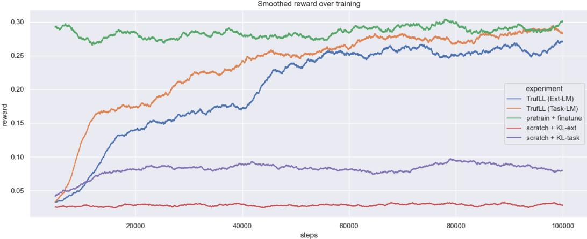  
Figure 4: VQAv2: Training curves. Reward is a rolling average over 5000 timesteps.

Table 10: TrufL $\scriptstyle { \mathrm { L } } _ { \mathrm { p r e t r a i n } }$ results on the 2 tasks. Additionally, we report the results for the pretrain+RL fine-tune baseline as a comparison. Best values are in bold
<table><tr><td>Algo</td><td>Score</td><td>BLEU</td><td>CIDEr</td><td> $\mathrm { p p l - e }$ </td><td>sBLEU</td></tr><tr><td colspan="6">CLEVR</td></tr><tr><td>pretrain+RL</td><td>0.44</td><td>0.17</td><td>0.70</td><td>35</td><td>0.46</td></tr><tr><td>TrufLLpretrain</td><td>0.61</td><td>0.18</td><td>0.77</td><td>22</td><td>0.84</td></tr><tr><td colspan="6">VQAV2</td></tr><tr><td>pretrain+RL</td><td>0.41</td><td>0.31</td><td>0.98</td><td>50</td><td>0.78</td></tr><tr><td> $\mathrm { \bar { T r u f L L } _ { p r e t r a i n } }$ </td><td>0.33</td><td>0.27</td><td>0.42</td><td>35</td><td>1.0</td></tr></table>

Table 11 displays the full results of on-policy versus off-policy scores for TrufLL (Task-LM) and TrufLL (Ext-LM) on the two tasks. The full results emphasize the challenges of the approach for the large vocabulary of VQAv2. Indeed, on the off-policy setting for such a task, the exploding values for e-ppl suggest that the optimized language agent samples incoherent words taken outside the truncated action space, as corroborated by the low values of the sumVA ratio.

Interestingly, while on CLEVR, TrufL $\mathrm { \Delta L o f f , K L }$ trades off task performance for language quality when compared to TrufL $\bot _ { \mathrm { o f f } } .$ on VQAv2, it mainly provides a better learning signal for the complete (large) vocabulary. In such a setting, it hence improves the global scores of the off-policy version of TrufLL, and enables a much better generalization at test time of the global policy over the full vocabulary. Yet, keeping truncation at test time remains crucial with large vocabulary. Note that for VQAv2, the poor performances of $\mathrm { T r u f L L _ { o f f , K I } }$ on the external LM is mainly due to numerical instability challenges when using GPT-2 as the target policy of the KL regularization term.

Additionally, on-policy versus off-policy scores split per sampling procedure are displayed in table 12: unsurprisingly, greedy decoding for $\mathrm { T r u f L L } \mathrm { L } _ { \mathrm { o f f } }$ outperforms the two sampling-based methods, that are more penalized by the imperfect generalization of the optimized policy over the full vocabulary.

Table 11: On-policy vs. off-policy scores for different variants of TrufLL: when training with an off-policy loss, we remove the truncation at test time. Truf $\scriptstyle { \mathrm { { L } } } _ { \mathrm { o f f , K L } }$ is evaluated with $\lambda _ { K L } = 0 . 0 5$ . Best values are in bold.
<table><tr><td>Algo</td><td>Score</td><td>BLEU</td><td>CIDEr ppl-e</td><td></td><td>sBLEU</td><td>sumVA</td></tr><tr><td colspan="7">CLEVR</td></tr><tr><td colspan="7">TrufLL (Task-LM)</td></tr><tr><td>TrufLL</td><td>0.56</td><td>0.17</td><td>0.06</td><td> $1 0 ^ { 3 }$ </td><td>0.78</td><td>N.A</td></tr><tr><td> $\mathrm { T r u f L L } \mathrm { L } _ { \mathrm { o f f } }$ </td><td>0.50</td><td>0.14</td><td>0.43</td><td> $1 0 ^ { 4 }$ </td><td>0.88</td><td>0.96</td></tr><tr><td> $\mathrm { T r u f L L _ { o f f , K L } }$ </td><td>0.39</td><td>0.17</td><td>0.71</td><td> $^ { 6 9 }$ </td><td>0.48</td><td>0.95</td></tr><tr><td colspan="7">TrufLL (Ext-LM)</td></tr><tr><td>TrufLL</td><td>0.48</td><td>0.08</td><td>0.34</td><td>3.03</td><td>0.95</td><td>N.A</td></tr><tr><td> $\mathrm { T r u f L L } \mathrm { L } _ { \mathrm { o f f } }$ </td><td>0.41</td><td>0.10</td><td>0.35</td><td> $1 0 ^ { 5 }$ </td><td>0.88</td><td>0.95</td></tr><tr><td> $\mathrm { T r u f L L _ { o f f , K L } }$ </td><td>0.35</td><td>0.15</td><td>0.60</td><td> $2 0$ </td><td>0.55</td><td>0.96</td></tr><tr><td colspan="7">VQAv2</td></tr><tr><td colspan="7">TrufLL (Task-LM)</td></tr><tr><td>TrufLL</td><td>0.35</td><td>0.21</td><td>0.11</td><td> $1 0 ^ { 4 }$ </td><td>0.36</td><td>N.A</td></tr><tr><td> $\mathrm { T r u f L L } \mathrm { L } _ { \mathrm { o f f } }$ </td><td>0.07</td><td>0.03</td><td>0.01</td><td> $1 0 ^ { 4 }$ </td><td>0.05</td><td>0.08</td></tr><tr><td> $\mathrm { T r u f L L _ { o f f , K L } }$ </td><td>0.12</td><td>0.24</td><td>0.25</td><td> $1 0 ^ { 3 }$ </td><td>0.26</td><td>0.71</td></tr><tr><td colspan="7">TrufLL (Ext-LM)</td></tr><tr><td>TrufLL</td><td>0.34</td><td>0.18</td><td>0.04</td><td>24</td><td>0.83</td><td>N.A</td></tr><tr><td> $\mathrm { T r u f L L } \mathrm { L } _ { \mathrm { o f f } }$ </td><td>0.09</td><td>0.04</td><td>0.01</td><td> $1 0 ^ { 4 }$ </td><td>0.05</td><td>0.07</td></tr><tr><td> $\mathrm { T r u f L L _ { o f f , K L } }$ </td><td>0.0</td><td>0.15</td><td>0.02</td><td> $1 0 ^ { 3 }$ </td><td>0.19</td><td>0.47</td></tr></table>

Table 12: On-policy vs. off-policy scores per decoding procedure: when training with an off-policy loss, we remove the truncation at test time. TrufL $\scriptstyle \mathrm { \mathrm { ~ L _ { o f f , K I } ~ } }$ L is evaluated with $\lambda _ { K L } = 0 . 0 5 .$ . Best values are in bold.
<table><tr><td>method</td><td>text-gen</td><td>score</td><td>BLEU</td><td>CIDEr</td><td>e-ppl</td></tr><tr><td colspan="6">CLEVR</td></tr><tr><td colspan="6">TrufLL (Task-LM)</td></tr><tr><td rowspan="3">TrufLL</td><td>greedy sampling</td><td>0.57</td><td>0.17</td><td>0.65</td><td>39</td></tr><tr><td>lm-ranking</td><td>0.55</td><td>0.17</td><td>0.66</td><td>24</td></tr><tr><td></td><td>0.51</td><td>0.16</td><td>0.65</td><td>8.8</td></tr><tr><td rowspan="2">TrufI  $\scriptstyle { \mathrm { . L _ { o f f } } }$ </td><td>greedy sampling</td><td>0.52</td><td>0.17</td><td>0.58</td><td>71</td></tr><tr><td></td><td>0.49</td><td>0.16</td><td>0.59</td><td> $\mathrm { 1 0 ^ { 5 } }$ </td></tr><tr><td rowspan="3">TrufI  $\scriptstyle { \mathrm { L } } _ { \mathrm { o f f } , \mathrm { K L } }$ </td><td>lm-ranking</td><td>0.48</td><td>0.17</td><td>0.58</td><td>19</td></tr><tr><td>greedy</td><td>0.56</td><td>0.18</td><td>0.78</td><td>24</td></tr><tr><td>sampling</td><td>0.31</td><td>0.16</td><td>0.62</td><td> $1 0 ^ { 2 }$ </td></tr><tr><td>TrufLL (Ext-LM)</td><td>lm-ranking</td><td>0.31</td><td>0.18</td><td>0.74</td><td>5.8</td></tr><tr><td colspan="2">greedy</td><td>0.48</td><td>0.09</td><td>0.34</td><td>3.1</td></tr><tr><td rowspan="2">TrufLL</td><td>sampling lm-ranking</td><td>0.48</td><td>0.10</td><td>0.35</td><td>3.1</td></tr><tr><td></td><td>0.48</td><td>0.06</td><td>0.34</td><td>2.9</td></tr><tr><td rowspan="3">TrufI  $\scriptstyle { \mathrm { { L } } } _ { \mathrm { o f f } }$ </td><td>greedy</td><td>0.42</td><td>0.10</td><td>0.38</td><td>4.4</td></tr><tr><td>sampling</td><td>0.40</td><td>0.10</td><td>0.35</td><td> ${ 1 0 } ^ { 6 }$ </td></tr><tr><td>lm-ranking</td><td>0.40</td><td>0.10</td><td>0.34</td><td> $^ { 1 5 }$ </td></tr><tr><td rowspan="3">TrufL  $\scriptstyle { \mathrm { L } } _ { \mathrm { o f f } , \mathrm { K L } }$ </td><td>greedy</td><td>0.48</td><td>0.16</td><td>0.70</td><td>2.1</td></tr><tr><td>sampling</td><td>0.27</td><td>0.13</td><td>0.48</td><td>55</td></tr><tr><td>lm-ranking</td><td>0.30</td><td>0.16</td><td>0.61</td><td>2.0</td></tr><tr><td colspan="4">VQAv2</td><td></td><td></td></tr><tr><td>TrufLL (Task-LM)</td><td>greedy</td><td>0.36</td><td>0.20</td><td></td><td></td></tr><tr><td rowspan="3">TrufLL</td><td>sampling lm-ranking</td><td>0.35</td><td>0.20</td><td>0.11 0.11</td><td>366 337</td></tr><tr><td></td><td>0.34</td><td>0.21</td><td>0.11</td><td>95</td></tr><tr><td>greedy</td><td>0.09</td><td>0.04</td><td>0.02</td><td> $\overline { { { 1 0 } ^ { 3 } } }$ </td></tr><tr><td rowspan="3">TrufLLoff</td><td>sampling</td><td>0.05</td><td>0.03</td><td>0.01</td><td> $1 0 ^ { 6 }$ </td></tr><tr><td>lm-ranking</td><td>0.06</td><td>0.03</td><td>0.01</td><td> $1 0 ^ { 4 }$ </td></tr><tr><td>greedy</td><td>0.16</td><td>0.29</td><td>0.46</td><td> $\overline { { 3 8 } }$ </td></tr><tr><td rowspan="3">TrufLLoff,KL</td><td>sampling</td><td>0.08</td><td>0.19</td><td>0.09</td><td> $1 0 ^ { 4 }$ </td></tr><tr><td>lm-ranking</td><td>0.12</td><td>0.24</td><td>0.22</td><td> $1 0 ^ { 2 }$ </td></tr><tr><td></td><td></td><td></td><td></td><td></td></tr><tr><td>TrufLL (Ext-LM)</td><td>greedy</td><td>0.48</td><td>0.09</td><td>0.34</td><td>3.1</td></tr><tr><td rowspan="3">TrufLL</td><td>sampling</td><td>0.48</td><td>0.10</td><td>0.35</td><td>3.1</td></tr><tr><td>lm-ranking</td><td>0.48</td><td>0.06</td><td>0.34</td><td>2.9</td></tr><tr><td>greedy</td><td>0.11</td><td>0.05</td><td>0.01</td><td> $\overline { { 1 0 ^ { 2 } } }$ </td></tr><tr><td rowspan="3">TrufI  $\scriptstyle { \mathrm { . L _ { o f f } } }$ </td><td>sampling</td><td>0.07</td><td>0.03</td><td>0.01</td><td> $\mathrm { 1 0 ^ { 5 } }$ </td></tr><tr><td>lm-ranking</td><td>0.08</td><td>0.04</td><td>0.01</td><td> $1 0 ^ { 4 }$ </td></tr><tr><td>greedy</td><td>0.00</td><td>0.18</td><td>0.05</td><td> $\overline { { 2 7 } }$ </td></tr><tr><td rowspan="3">TrufL  $\scriptstyle \mathrm { L _ { o f f , K L } }$ </td><td>sampling</td><td>0.00</td><td>0.13</td><td>0.01</td><td> $\mathrm { 1 0 ^ { 3 } }$ </td></tr><tr><td></td><td></td><td></td><td></td><td></td></tr><tr><td>lm-ranking</td><td>0.00</td><td>0.16</td><td>0.02</td><td> $1 0 ^ { 2 }$ </td></tr></table>

## C Human Evaluation details

For the Human Evaluation study, we designed one form per participant, with three sections evaluating respectively the language quality, language grounding and diversity criteria. Given the five evaluated models, there are ten different model pairs: each section of the form contains 10 pairwise comparison covering all the possible model pairs for the criteria. Each pairwise comparison is sampled uniformly over the 50 first question samples generated by the algorithms at test time. The evaluation of syntax errors was made within the diversity section: for each questions pair, we asked participants to tick the questions if they are grammatically incorrect. Figure 5 displays one pairwise comparison example for the three sections, and a full form example is available at the following url: https://forms.gle/kkL38x31wF7A9YKx5.

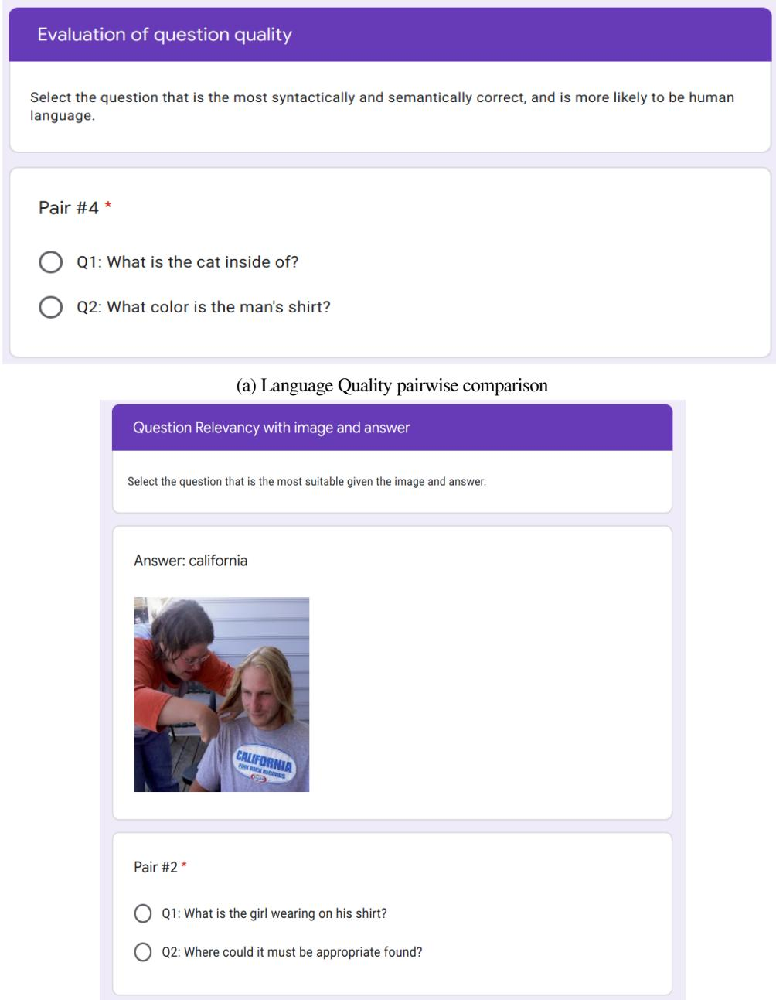  
(b) Language Grounding pairwise comparison  
Figure 5: Examples of pairwise comparison for each evaluated criteria.

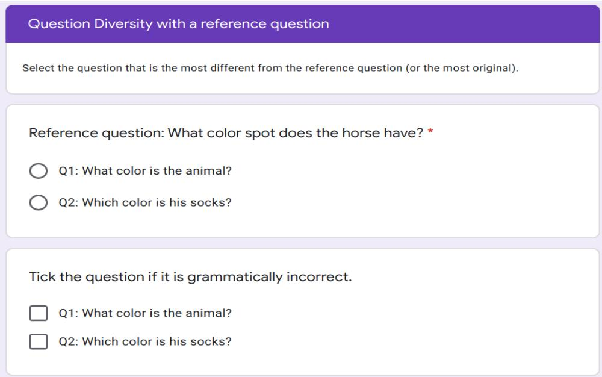  
(c) Diversity/Originality with reference question. Pairwise comparison and evaluation of syntax errors.  
Figure 5: Examples of pairwise comparison for each evaluated criteria. (cont.)

## D Additional VQG Samples

Figure 6 and Figure 7 display the 10 first dialog samples produced at test time on CLEVR, while figures 8, 9, and 10 display the 15 first dialog samples produced at test time on VQAv2.

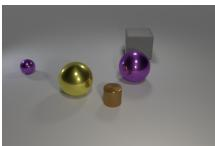

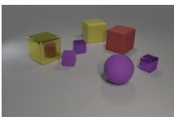

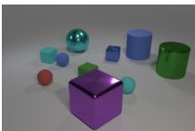

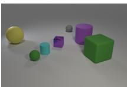

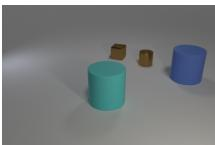

<table><tr><td>Human</td><td>the big yellow object is what shape ? A:sphere</td></tr><tr><td>pretrain pretrain + RL</td><td>there is a small thing that is the same color as the small rubber cylinder ; what is its shape? What is on the person&#x27;s head?</td></tr><tr><td>scratch</td><td>yellow on or an material ?</td></tr><tr><td>scratch+KL-task scratch+KL-ext</td><td>what number of other things are the same shape as the small gray thing ? does that tiny object have objects to its left ?</td></tr><tr><td>TrufLL (Task-LM)</td><td>what shape is the big thing that is to the right of the big matte thing ?</td></tr><tr><td>TrufLL (Ext-LM)</td><td>what is the shape of the big object that is behind the big yellow thing and is the same color?</td></tr><tr><td>Human</td><td>what number of other objects are the same size as the red rubber thing ? A:3</td></tr><tr><td>pretrain</td><td>how many other things are there of the same size as the purple rubber thing ?</td></tr><tr><td>pretrain + RL</td><td>what number of objects are either large green metallic objects or tiny objects</td></tr><tr><td></td><td>that are behind the tiny purple metallic thing?</td></tr><tr><td>scratch</td><td>many tiny cubes things things things things things both things as things that</td></tr><tr><td>scratch+KL-task scratch+KL-ext</td><td>what number of other objects are there of the same material as the tiny cyan thing ?</td></tr><tr><td></td><td>are there any blue objects ?</td></tr><tr><td>TrufLL (Task-LM)</td><td>what number of objects are either big objects in front of the small yellow object or big matte objects?</td></tr><tr><td>TrufLL (Ext-LM)</td><td>how many objects in front of the big object ?</td></tr><tr><td>Human</td><td></td></tr><tr><td></td><td>what number of other things are there of the same material as the large green object?</td></tr><tr><td>pretrain</td><td>how many other things are there of the same size as the purple rubber cylinder ?</td></tr><tr><td>pretrain + RL</td><td>what number of objects are either tiny cyan things or big cyan things ?</td></tr><tr><td>scratch</td><td></td></tr><tr><td>scratch+KL-task</td><td>many tiny cubes things things things things things both things as things that</td></tr><tr><td>scratch+KL-ext</td><td>what number of other objects are the same shape as the small yellow object ? how many things does that large thing have to its behind ?</td></tr><tr><td></td><td></td></tr><tr><td>TrufLL (Task-LM)</td><td>what number of other things are there of the same size as the green cylinder?</td></tr><tr><td>TrufLL (Ext-LM)</td><td>how many objects in front of the in the cylinder ?</td></tr><tr><td>Human</td><td></td></tr><tr><td></td><td>what number of other things are there of the same shape as the small purple metallic thing ?</td></tr><tr><td>pretrain</td><td>what number of other objects are the same color as the tiny rubber cylinder ?</td></tr><tr><td>pretrain + RL</td><td>what number of purple objects are either small matte objects or big matte blocks ?</td></tr><tr><td>scratch</td><td></td></tr><tr><td>scratch+KL-task</td><td>many gray in big purple purple purple many or many gray matte matte what number of other things are the same color as the large rubber cylinder ?</td></tr><tr><td>scratch+KL-ext</td><td>how many other things in the are of same color as the large cylinder ?</td></tr><tr><td></td><td></td></tr><tr><td>TrufLL (Task-LM)</td><td>how many tiny things have the same color as the large rubber thing ?</td></tr><tr><td>TrufLL (Ext-LM)</td><td>how many other things in the are of the same color as that large thing ?</td></tr><tr><td>Human</td><td>what shape is the big matte object that is on the right side ofthe big cyan matte object ?</td></tr><tr><td></td><td></td></tr><tr><td>pretrain pretrain + RL</td><td>the cyan matte thing that is the same size as the brown object is what shape ?</td></tr><tr><td></td><td>what shape is the cyan matte object that is behind the cylinder ?</td></tr><tr><td>scratch</td><td>many yellow big either either that that that more that metal ?</td></tr><tr><td>scratch+KL-task</td><td></td></tr><tr><td></td><td>what number of other things are the same shape as the small gray thing ?</td></tr><tr><td></td><td></td></tr><tr><td>scratch+KL-ext</td><td></td></tr><tr><td></td><td></td></tr><tr><td></td><td></td></tr><tr><td></td><td></td></tr><tr><td></td><td></td></tr><tr><td></td><td></td></tr><tr><td></td><td></td></tr><tr><td></td><td></td></tr><tr><td></td><td></td></tr><tr><td></td><td></td></tr><tr><td></td><td></td></tr><tr><td></td><td>what number of blocks are in the things in the ?</td></tr><tr><td></td><td></td></tr><tr><td></td><td></td></tr><tr><td></td><td></td></tr><tr><td></td><td></td></tr><tr><td></td><td></td></tr><tr><td></td><td></td></tr><tr><td></td><td></td></tr><tr><td></td><td></td></tr><tr><td></td><td></td></tr><tr><td></td><td></td></tr><tr><td>TrufLL (Task-LM)</td><td></td></tr><tr><td></td><td></td></tr></table>

Figure 6: Samples on CLEVR.

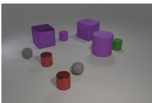

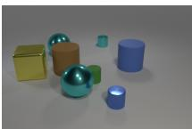

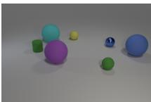

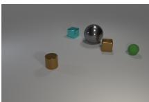

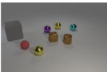

<table><tr><td>Human</td><td>what is the size of the other rubber cylinder that is the same color as the big cylinder ? A:small</td><td></td></tr><tr><td>pretrain</td><td>there is a purple object that is the same size as the purple rubber cylinder ; what is its shape? what size is the gray ball that is right of the purple sphere ?</td><td></td></tr><tr><td>pretrain + RL</td><td></td><td></td></tr><tr><td>scratch scratch+KL-task</td><td>that greater tiny as shiny both are a tiny it either ball right there is a big thing that is the same color as the big matte cylinder ; what is its shape?</td><td></td></tr><tr><td>scratch+KL-ext</td><td>how material is the yellow ?</td><td></td></tr><tr><td>TrufLL (Task-LM) TrufLL (Ext-LM)</td><td>how big is the thing that is to the right of the big matte thing ? what size is the object that is behind the large red thing ?</td><td></td></tr><tr><td></td><td>There is a shiny thing that is both right of the small matte thing and behind the large yellow cube;</td><td></td></tr><tr><td>Human</td><td>what size is it ? A:small</td><td></td></tr><tr><td>pretrain</td><td>there is a big thing that is the same color as the small rubber cylinder ; what is its shape</td><td></td></tr><tr><td>pretrain + RL</td><td>there is a brown matte object to the right of the cyan object ; what shape is it ?</td><td></td></tr><tr><td>scratch scratch+KL-task</td><td>many yellow big either either that that that more that metal ?</td><td></td></tr><tr><td>scratch+KL-ext</td><td>what number of other things are the same shape as the small gray thing ? what is the material of that block ?</td><td></td></tr><tr><td></td><td></td><td></td></tr><tr><td>TrufLL (Task-LM) TrufLL (Ext-LM)</td><td>what shape is the big thing that is to the right of the big cyan thing ? what is the shape of that large thing ?</td><td></td></tr><tr><td></td><td></td><td></td></tr><tr><td>Human</td><td>there is a object that is the same color as the rubber cylinder ;what is its shape ? A:sphere</td><td></td></tr><tr><td>pretrain</td><td>there is a small thing that is the same color as the small rubber cylinder ; what is its shape?</td><td></td></tr><tr><td>pretrain + RL</td><td>what shape is the thing that is the same color as the cylinder ?</td><td></td></tr><tr><td>scratch</td><td>many yellow yellow and cube shape behind cubes shape less small equal shape small equal large larg</td><td></td></tr><tr><td>scratch+KL-task</td><td>how many other things in the color are of same material as the green shiny object ?</td><td></td></tr><tr><td>scratch+KL-ext</td><td>how many spheres anything ?</td><td></td></tr><tr><td>TrufLL (Task-LM)</td><td>what is the shape of the small cyan thing ?</td><td></td></tr><tr><td>TrufLL (Ext-LM)</td><td>And shape ?</td><td></td></tr><tr><td></td><td></td><td></td></tr><tr><td>Human</td><td>what is the color of the small thing that is the same shape asthe large gray object ? A:green</td><td></td></tr><tr><td>pretrain pretrain + RL</td><td>there is another rubber object that is the same shape as the small brown object ; what color is it? what is the color of the tiny rubber thing ?</td><td></td></tr><tr><td></td><td></td><td></td></tr><tr><td>scratch scratch+KL-task</td><td>many sphere less how an what number of other objects are the same shape as the tiny blue object ?</td><td></td></tr><tr><td>scratch+KL-ext</td><td>what size is that cylinder ?</td><td></td></tr><tr><td></td><td></td><td></td></tr><tr><td>TrufLL (Task-LM) TrufLL (Ext-LM)</td><td>what is the color of the tiny matte thing ? what color is the small thing ?</td><td></td></tr><tr><td></td><td></td><td></td></tr><tr><td>Human</td><td>what number of shiny objects are cyan spheres or tiny balls ? A:4</td><td></td></tr><tr><td>pretrain</td><td>how many other things are there of the same size as the brown rubber thing ?</td><td></td></tr><tr><td>pretrain + RL</td><td>how many other things are there of the same size as the cyan rubber thing ?</td><td></td></tr><tr><td>scratch</td><td>many yellow do do do either do either do balls</td><td></td></tr><tr><td>scratch+KL-task</td><td>what number of other things are there of the same shape as the small gray thing ?</td><td></td></tr><tr><td>scratch+KL-ext</td><td>how many other things are of same color as ball ?</td><td></td></tr><tr><td></td><td></td><td></td></tr><tr><td>TrufLL (Task-LM) TrufLL (Ext-LM)</td><td>how many other things are the same material as the small cyan cylinder ? how many other things in the material of the small thing that is the same material as green thing ?</td><td></td></tr></table>

Figure 7: Samples on Clevr.

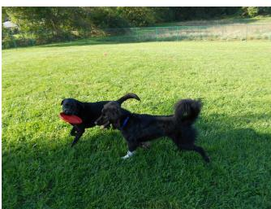

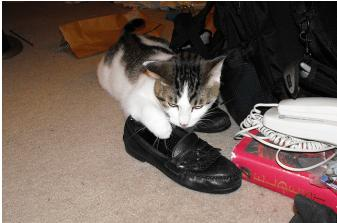

<table><tr><td>Human</td><td>How many trains? A:1</td></tr><tr><td>pretrain</td><td>How many trains are in the picture? How many trains are shown?</td></tr><tr><td>pretrain + RL</td><td></td></tr><tr><td>scratch</td><td>AmazingAmazingAmazingAmazingAmazingAmazing</td></tr><tr><td>scratch+KL-task</td><td>How many people are in the picture?</td></tr><tr><td>scratch+KL-ext</td><td>The the same way of the same way of the</td></tr><tr><td>TrufLL (Task-LM)</td><td>How many windows are here?</td></tr><tr><td>TrufLL (Ext-LM)</td><td>How many different ways would we take them to reach</td></tr><tr><td>Human</td><td>What is the man wearing over his shirt? A:nothing</td></tr><tr><td>pretrain</td><td>What is in front of the person?</td></tr><tr><td>pretrain + RL</td><td>What is written on the person&#x27;s right?</td></tr><tr><td></td><td></td></tr><tr><td>scratch scratch+KL-task</td><td>AmazingAmazingAmazingAmazingAmazing Is this child old or unloaded?</td></tr><tr><td>scratch+KL-ext</td><td>The the first thing of the world&#x27;s a few</td></tr><tr><td>TrufLL (Task-LM)</td><td></td></tr><tr><td>TrufLL (Ext-LM)</td><td>How many different shapes have been used and used by How many planes can be seen on top?</td></tr><tr><td></td><td></td></tr><tr><td>Human</td><td>Is the fence in the background metal or wood?</td></tr><tr><td>pretrain</td><td></td></tr><tr><td>pretrain + RL</td><td>What kind of dog is on the dog? What kind of dog is this?</td></tr><tr><td>scratch</td><td></td></tr><tr><td>scratch+KL-task</td><td>AmazingAmazingAmazingAmazingAmazing What is 150 seated over theware?</td></tr><tr><td>scratch+KL-ext</td><td>The the same way of the same way to be</td></tr><tr><td>TrufLL (Task-LM)</td><td>Which item has more aggressive up their legs?</td></tr><tr><td>TrufLL (Ext-LM)</td><td>How many different species have been captured and tagge</td></tr><tr><td></td><td></td></tr><tr><td>Human</td><td>What is the title of the red book? A:harry potter</td></tr><tr><td>pretrain</td><td>What is the cat inside of?</td></tr><tr><td>pretrain + RL</td><td>Is the cat inside or outside?</td></tr><tr><td>scratch scratch+KL-task</td><td>AmazingAmazingAmazingAmazingAmazing</td></tr><tr><td>scratch+KL-ext</td><td>What color is the man&#x27;s shirt? The way of the world&#x27;s a lot of the</td></tr><tr><td>TrufLL (Task-LM)</td><td>Which item appears higher into one and lower?</td></tr><tr><td>TrufLL (Ext-LM)</td><td>What was that?</td></tr><tr><td></td><td></td></tr><tr><td></td><td></td></tr><tr><td>Human</td><td>What color is the fire hydrant? A:red</td></tr><tr><td>pretrain</td><td>What color is the hydrant?</td></tr><tr><td>pretrain + RL</td><td>What color is the hydrant?</td></tr><tr><td>scratch</td><td></td></tr><tr><td>scratch+KL-task</td><td>AmazingAmazingAmazingAmazingAmazing What color is the man&#x27;s bat?</td></tr><tr><td>scratch+KL-ext</td><td>The the first thing is a good thing that the</td></tr><tr><td>TrufLL (Task-LM)</td><td>Which color is this fire?</td></tr><tr><td>TrufLL (Ext-LM)</td><td>What color will your feet color look?</td></tr><tr><td></td><td></td></tr><tr><td></td><td></td></tr><tr><td>Human</td><td>How many wheels does the truck have?</td></tr><tr><td>pretrain</td><td>How many people are in front of the bus?</td></tr><tr><td>pretrain + RL</td><td></td></tr><tr><td></td><td>How many slices ofists are on the plate?</td></tr><tr><td>scratch</td><td></td></tr><tr><td></td><td>AmazingAmazingAmazingAmazingAmazing</td></tr><tr><td>scratch+KL-task</td><td>Is summer out or cloudy next to Winchester?</td></tr><tr><td></td><td></td></tr><tr><td>scratch+KL-ext</td><td></td></tr><tr><td></td><td>The the most recent of the most recent years of</td></tr><tr><td></td><td></td></tr><tr><td></td><td></td></tr><tr><td></td><td></td></tr><tr><td></td><td></td></tr><tr><td></td><td></td></tr><tr><td></td><td></td></tr><tr><td></td><td></td></tr><tr><td></td><td></td></tr><tr><td></td><td></td></tr><tr><td></td><td></td></tr><tr><td></td><td></td></tr><tr><td></td><td></td></tr><tr><td></td><td></td></tr><tr><td>TrufLL (Task-LM)</td><td></td></tr><tr><td></td><td></td></tr><tr><td></td><td></td></tr><tr><td></td><td></td></tr><tr><td></td><td></td></tr><tr><td></td><td></td></tr><tr><td></td><td></td></tr><tr><td></td><td></td></tr><tr><td></td><td></td></tr><tr><td></td><td></td></tr><tr><td></td><td></td></tr><tr><td></td><td></td></tr><tr><td></td><td></td></tr><tr><td></td><td></td></tr><tr><td></td><td>How many pieces are here?</td></tr><tr><td></td><td></td></tr><tr><td></td><td></td></tr><tr><td></td><td></td></tr><tr><td></td><td></td></tr><tr><td></td><td></td></tr><tr><td></td><td></td></tr><tr><td></td><td></td></tr><tr><td></td><td></td></tr><tr><td></td><td></td></tr><tr><td>TrufLL (Ext-LM)</td><td></td></tr><tr><td></td><td></td></tr><tr><td></td><td></td></tr><tr><td></td><td></td></tr><tr><td></td><td></td></tr><tr><td></td><td></td></tr><tr><td></td><td></td></tr><tr><td></td><td></td></tr><tr><td></td><td></td></tr><tr><td></td><td></td></tr><tr><td></td><td></td></tr><tr><td></td><td></td></tr><tr><td></td><td></td></tr><tr><td></td><td></td></tr><tr><td></td><td></td></tr><tr><td></td><td></td></tr><tr><td></td><td></td></tr><tr><td></td><td></td></tr><tr><td></td><td></td></tr><tr><td></td><td></td></tr><tr><td></td><td></td></tr><tr><td></td><td></td></tr><tr><td></td><td>How many different objects have been used?</td></tr><tr><td></td><td></td></tr><tr><td></td><td></td></tr><tr><td></td><td></td></tr><tr><td></td><td></td></tr><tr><td></td><td></td></tr><tr><td></td><td></td></tr><tr><td></td><td></td></tr><tr><td></td><td></td></tr><tr><td></td><td></td></tr><tr><td></td></table>

Figure 8: Samples on VQA.

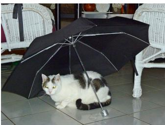

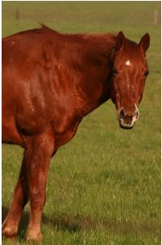

<table><tr><td>Human</td><td>What is on top of the round dome? A:flag</td></tr><tr><td>pretrain pretrain + RL</td><td>What is on the top right mean? What is on the front of this event?</td></tr><tr><td>scratch scratch+KL-task scratch+KL-ext</td><td>AmazingAmazingAmazingAmazingAmazing What zombie is on the mouse? The the first thing is a bit of the first</td></tr><tr><td>TrufLL (Task-LM) TrufLL (Ext-LM)</td><td>Where could one travel park located? What color will your shoes look?</td></tr><tr><td>Human</td><td>Where is the chain link fence? A:background</td></tr><tr><td>pretrain pretrain + RL</td><td>What is he holding? What is he fire hydrant?</td></tr><tr><td>scratch scratch+KL-task scratch+KL-ext</td><td>mazingAmazingAmazingAmazingAmazing Who is closest to the paint? The the first thing is a great deal with the</td></tr><tr><td>TrufLL (Task-LM) TrufLL (Ext-LM)</td><td>Which item represents than both ends and lower? How much food has it given him?</td></tr><tr><td>Human</td><td>What activity are these people doing?</td></tr><tr><td>pretrain pretrain + RL</td><td>What is the person doing? What is the person doing?</td></tr><tr><td>scratch scratch+KL-task scratch+KL-ext</td><td>noodles noodles noodles noodles noodles noodles How many umbrellas are visible? The the first thing is the same way of the</td></tr><tr><td>TrufLL (Task-LM) TrufLL (Ext-LM)</td><td>Which game does he play? What was that for?</td></tr><tr><td>Human</td><td>What color is the umbrella? A:black</td></tr><tr><td>pretrain pretrain + RL</td><td>What color is the cat? What color is the cat?</td></tr><tr><td>scratch scratch+KL-task scratch+KL-ext</td><td>AmazingAmazingAmazingAmazingAmazing What color is the man&#x27;s shirt? The the other way of the past time, and</td></tr><tr><td>TrufLL (Task-LM) TrufLL (Ext-LM)</td><td>Which item doesn&#x27;t both turn? What color of clothing did he get?</td></tr><tr><td>Human</td><td>How many planes are shown? A:1</td></tr><tr><td>pretrain pretrain + RL</td><td>How many jets are there? How many jets are there?</td></tr><tr><td>scratch scratch+KL-task scratch+KL-ext</td><td>AmazingAmazingAmazingAmazingAmazingAmazing How many skater does Green cents have? The the first thing is the first time, and</td></tr><tr><td>TrufLL (Task-LM) TrufLL (Ext-LM)</td><td>How many surf worthy are here? How many different ways should one ask if she wants</td></tr><tr><td>Human</td><td>What is this animal called? A:horse</td></tr><tr><td>pretrain pretrain + RL</td><td>What is the animal on? What animal is shown on the ground?</td></tr><tr><td>scratch scratch+KL-task scratch+KL-ext</td><td>AmazingAmazingAmazingAmazingAmazingAmazingAmazing What has to make of the pies that, should The the next week of the next week, the</td></tr><tr><td>TrufLL (Task-LM) TrufLL (Ext-LM)</td><td>Which item doesn&#x27;t turn? What was that?</td></tr></table>

Figure 9: Samples on VQA.

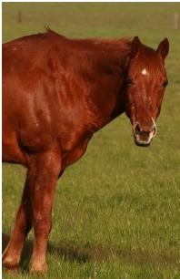

<table><tr><td>Human</td><td>What color spot does the horse have? A:white</td></tr><tr><td>pretrain</td><td>What color is the animal?</td></tr><tr><td>pretrain + RL</td><td>What color is the door?</td></tr><tr><td>scratch scratch+KL-task</td><td>AmazingAmazingAmazingAmazingAmazingAmazing</td></tr><tr><td>scratch+KL-ext</td><td>What color is the ATM basketball? The the same thing that the same way of the</td></tr><tr><td></td><td></td></tr><tr><td>TrufLL (Task-LM) TrufLL (Ext-LM)</td><td>Which color is his socks?</td></tr><tr><td></td><td>What color will your shoes look?</td></tr><tr><td>Human</td><td></td></tr><tr><td>pretrain</td><td>What color is the girls pants? A:blue</td></tr><tr><td>pretrain + RL</td><td>What color is the man&#x27;s blue? What color are the bird&#x27;s pants?</td></tr><tr><td>scratch</td><td>AmazingAmazingAmazingAmazingAmazingAmazing</td></tr><tr><td>scratch+KL-ext</td><td>The the first thing is a lot of the same</td></tr><tr><td>TrufLL (Task-LM)</td><td>Which color is this fire?</td></tr><tr><td>TrufLL (Ext-LM)</td><td>What color of clothing did he get?</td></tr><tr><td>Human</td><td></td></tr><tr><td>pretrain</td><td>What is on the woman&#x27;s head? A:helmet What is on the girl&#x27;s head?</td></tr><tr><td>pretrain + RL</td><td>What is on the person&#x27;s head?</td></tr><tr><td>scratch scratch+KL-task</td><td>AmazingAmazingAmazingAmazingAmazingAmazing Who is behind the horse?</td></tr><tr><td></td><td>The the same thing that the most important to the</td></tr><tr><td></td><td></td></tr><tr><td></td><td></td></tr><tr><td></td><td></td></tr><tr><td></td><td></td></tr><tr><td></td><td></td></tr><tr><td></td><td></td></tr><tr><td>scratch+KL-ext</td><td></td></tr><tr><td></td><td></td></tr><tr><td></td><td></td></tr><tr><td></td><td></td></tr><tr><td></td><td></td></tr><tr><td></td><td></td></tr><tr><td></td><td></td></tr><tr><td>TrufLL (Task-LM)</td><td></td></tr><tr><td></td><td></td></tr><tr><td></td><td></td></tr><tr><td></td><td></td></tr><tr><td></td><td></td></tr><tr><td></td><td></td></tr><tr><td></td><td></td></tr><tr><td></td><td>Which item doesn&#x27;t turn?</td></tr><tr><td></td><td></td></tr><tr><td></td><td></td></tr><tr><td></td><td></td></tr><tr><td>TrufLL (Ext-LM)</td><td></td></tr><tr><td></td><td></td></tr><tr><td></td><td></td></tr><tr><td></td><td></td></tr><tr><td></td><td></td></tr><tr><td></td><td></td></tr><tr><td></td><td></td></tr><tr><td></td><td></td></tr><tr><td></td><td></td></tr><tr><td></td><td>What was that?</td></tr><tr><td></td><td></td></tr><tr><td></td><td></td></tr><tr><td></td><td></td></tr><tr><td></td><td></td></tr><tr><td></td><td></td></tr><tr><td></td><td></td></tr></table>

Figure 10: Samples on VQA.