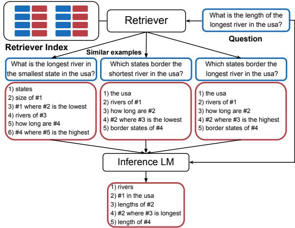
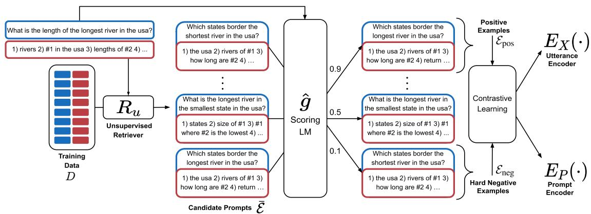
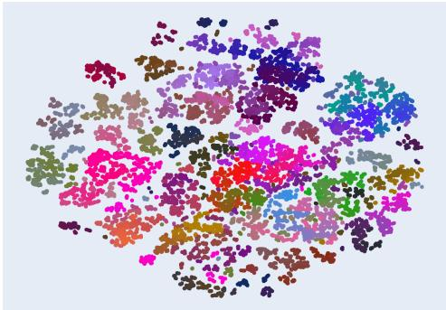
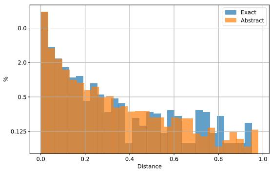
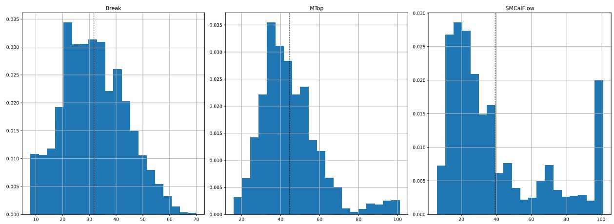

# Learning To Retrieve Prompts for In-Context Learning

Ohad Rubin Jonathan Herzig Jonathan Berant The Blavatnik School of Computer Science, Tel Aviv University {ohad.rubin,jonathan.herzig,joberant}@cs.tau.ac.il

## Abstract

In-context learning is a recent paradigm in natural language understanding, where a large pretrained language model (LM) observes a test instance and a few training examples as its input, and directly decodes the output without any update to its parameters. However, performance has been shown to strongly depend on the selected training examples (termed prompts). In this work, we propose an efficient method for retrieving prompts for in-context learning using annotated data and an LM. Given an inputoutput pair, we estimate the probability of the output given the input and a candidate training example as the prompt, and label training examples as positive or negative based on this probability. We then train an efficient dense retriever from this data, which is used to retrieve training examples as prompts at test time. We evaluate our approach on three sequence-tosequence tasks where language utterances are mapped to meaning representations, and find that it substantially outperforms prior work and multiple baselines across the board.

## 1 Introduction

The striking language skills and world knowledge embedded in large pre-trained language models (LMs) (Devlin et al., 2019; Petroni et al., 2019; Raffel et al., 2020; Brown et al., 2020) have recently led to in-context learning, a new paradigm in natural language understanding. Under this paradigm, a language model is given a prompt, which typically contains a few training examples, as well as a test instance as input, and generates the output for the test instance directly, without any update to its parameters. This approach was first introduced in GPT-3 (Brown et al., 2020), but has quickly spread to other LMs (Lieber et al., 2021; Du et al., 2021; Rae et al., 2021).

An attractive property of in-context learning is that it provides a single model for multiple language understanding tasks. However, Liu et al.

  
Figure 1: An overview of prompt retrieval: Given a question from BREAK, one retrieves similar training examples from an index of the training set. The question and training examples (the prompt) are passed to an inference LM that decodes the output.

(2021a) showed that downstream performance can vary widely depending on the choice of in-context examples. This has sparked interest in prompt retrieval (see Fig. 1), where given a test instance, training examples are chosen for the prompt based on some similarity metric. Recent work has either used off-the-shelf unsupervised similarity metrics, or trained a prompt retriever to select examples based on surface similarity (Das et al., 2021).

In this work, we suggest to use language models themselves to label examples that can serve as good prompts, and train a prompt retriever from this signal. To train the retriever (see Fig. 2), we assume access to a training set of input-output pairs and to a scoring LM, i.e., a language model that will be used to score prompts. For each training example (x, y), we go over other candidate training examples, and estimate the probability, according to the scoring LM, of y conditioned on x and the candidate prompt. We label training examples that lead to high probability as positive and low probability as negative and train a prompt retriever from this data using contrastive learning. We argue that using an LM for labeling examples is a better proxy for training a retriever compared to previously-proposed surface similarity heuristics. Importantly, when creating the training data, we have access to the gold label y, which can be used to obtain a high-quality set of candidate prompts. This leads to good positive examples and hard negative examples, which are beneficial for training with a contrastive objective.

  
Figure 2: An overview of our approach for training EPR. Given a training example, we use an unsupervised retriever $R _ { u }$ to obtain a set of candidates. We then pass the candidates to a scoring LM and label the top-k and the bottom-k as positive and negative examples, respectively. Last, we use this training data to train a dense retriever.

Using a scoring LM to train an efficient retriever for a potentially different test time inference LM is beneficial in two scenarios. First, when the scoring LM is smaller than the inference LM and serves as a proxy for it. This results in cheap and efficient data generation for the retriever, accessible to a wide range of researchers. Second, our approach can be used even when the scoring and inference LMs are identical (e.g., both are GPT-3). This is beneficial when we do not have access to model parameters and can only use it as a service, an increasingly popular paradigm. In this case, we use the LM to train a light-weight retriever that is only tasked with learning a similarity function. More generally, given that the scale of LMs is likely to keep increasing in the foreseeable future, one can view our approach for Efficient Prompt Retrieval, or EPR, as a method for interfacing and learning to interact with large LMs.

We empirically test EPR on three structured sequence-to-sequence tasks, where input natural language utterances are mapped to a meaning representation: MTOP (Li et al., 2021) and SM-CALFLOW(Andreas et al., 2020), which focus on task-oriented dialogue, and BREAK (Wolfson et al.,

2020), a benchmark for mapping questions to a language-based meaning representation. We observe that EPR substantially improves performance compared to prior work on prompt retrieval. When the scoring LM and inference LM are identical (using GPT-NEO (Black et al., 2021)), performance compared to the best baseline improves from 26% to 31.9% on BREAK, from 57% to 64.2% on MTOP, and from 51.4% to 54.3% on SMCALFLOW. When using GPT-NEO as a proxy for larger LMs (GPT-J, GPT-3, and CODEX), we observe similar gains, where performance improves substantially in all cases.

To conclude, we propose an approach for retrieving training examples for in-context learning in large language models, and show it substantially outperforms prior methods. Given recent developments in scaling LMs, designing efficient methods for interacting with LMs is an important direction for future research.

## 2 Background: Prompt Retrieval

Problem setup Given a training set  = $\{ ( x _ { i } , y _ { i } ) \} _ { i = 1 } ^ { n }$ of input-output sequences, and a test example $x _ { \mathrm { t e s t } }$ , our goal is to train a retriever, $R ( x _ { \mathrm { t e s t } } , \mathcal { D } )$ , that will retrieve a subset of training examples $\mathcal { P } = \{ ( x _ { j } , y _ { j } ) \} _ { j = 1 } ^ { m } \subset \mathcal { D }$ , where $m \ll n$ We succinctly refer to $\mathcal { P }$ as the prompt.1

Given an inference LM, g, a good prompt should lead to the target output sequence when the test example $x _ { \mathrm { t e s t } }$ is concatenated to the prompt $\mathcal { P }$ and passed as a prefix to g. Specifically, decoding from the LM $g ( \left[ \mathcal { P } ; x _ { \mathrm { t e s t } } \right] )$ should yield $y _ { \mathrm { t e s t } }$ . In this work, we focus on structured tasks, such as semantic parsing, where x is a natural language utterance and y is a meaning representation for that utterance.

Prior work Liu et al. (2021a) investigated the effect of different prompts on the performance of GPT-3 and demonstrated that the choice of incontext examples strongly affects downstream performance. They used an unsupervised sentence encoder to encode training examples, and retrieved for every test instance its nearest neighbors.

Das et al. (2021) trained a supervised prompt retriever for knowledge-base question answering. The retriever was trained with supervision that is tailored for knowledge-base queries, and relies on surface similarity between formal queries. Conversely, our approach takes advantage of the generative LM itself and is thus more general.

Shin et al. (2021) used GPT-3 to select examples for the prompt for few-shot semantic parsing. However, rather than training a retriever, they randomly sample a large set of utterance-program pairs from the training set, and choose those that are similar to the target instance question according to GPT-3. This results in an expensive inference procedure, where GPT-3 is run hundreds of times for each test instance, unlike our approach, which is based on a light-weight sub-linear retriever.

## 3 Efficient Prompt Retriever

We now describe our method for training EPR, an efficient prompt retriever for in-context learning. We first describe how to generate labeled data (§3.1), and then how to use the training data for training and inference (§3.2). Fig. 2 provides an overview of the training procedure.

## 3.1 Generating the Training Data

Our approach relies on finding which training examples can serve as good prompts for other training examples. Scoring all pairs of training examples is quadratic in , and thus prohibitive. Hence, we present a method for choosing a set of candidate examples $\bar { \mathcal { E } } \subset D$ , from which we will choose positive and negative examples for training. Importantly, since we are not at test time and are only generating data for training, we can use the target sequence y to retrieve a good set of candidates. This can be approached using a simple retrieval method, given that our goal is to retrieve examples that are similar to the input in terms of their output sequence, y.

To obtain a high-quality candidate set of training examples, we take advantage of an unsupervised retriever, $\bar { \mathcal { E } } = R _ { u } ( ( x , y ) , \mathcal { D } )$ . For the choice of the unsupervised retriever, we experiment with BM25 (Robertson and Zaragoza, 2009), a sparse retriever that relies on surface text similarity, and SBERT (Reimers and Gurevych, 2019), which is based on dense sentence encoding. For both, we experimented with passing the retriever the training pair $( x , y )$ or the target sequence y only, and found that using y leads to slightly higher performance.

Scoring the candidate set Once we retrieve the set of candidates $\bar { \mathcal { E } } = \{ \bar { e } _ { 1 } , \cdots , \bar { e _ { L } } \}$ for a training example $( x , y ) , ^ { 2 }$ we score each candidate $\bar { e } _ { l } \in \bar { \mathcal { E } }$ independently with a scoring LM, gˆ, which serves as a proxy for the inference LM, $g .$ Specifically, the score for a candidate prompt is

$$
s ( \bar { e } _ { l } ) = \mathrm { P r o b } _ { \hat { g } } ( y \mid \bar { e } _ { l } , x ) ,
$$

which is the probability under the LM, ${ \hat { g } } ,$ of the output sequence conditioned on the candidate prompt and input sequence. This indicates how helpful this candidate is for decoding the target (independent of all other candidates). We argue this score is a better proxy for the utility of a training example at inference time compared to prior approaches.

We apply this scoring function to all training examples, and define for each training example a set of positive examples $\mathcal { E } _ { \mathrm { p o s } }$ , which includes the top-k candidates in $\bar { \mathcal { E } }$ according to $s ( \bar { e } _ { l } )$ , and a set of negative examples $\mathcal { E } _ { \mathrm { n e g } } ,$ , which includes the bottom-k candidates in $\bar { \mathcal { E } }$ according to $s ( \bar { e } _ { l } )$ . This should lead to relevant positive examples, assuming that the set of candidates, ¯ includes good prompt candidates and hard negatives, since all candidates have high similarity with $( x , y )$ according to $R _ { u } ( y , D )$ . With positive and negative examples at our disposal, we can now apply contrastive learning, which we describe next.

## 3.2 Training and Inference

Training Our training procedure proceeds exactly like the contrastive learning procedure from DPR (Karpukhin et al., 2020). This procedure results in an input encoder $E _ { X } ( \cdot )$ , which receives the sequence of input tokens, x, and a prompt encoder $E _ { P } ( \cdot )$ , which receives a candidate prompt, namely, a concatenation of the tokens in an input-output pair. Both encoders are initialized with BERT-base (Devlin et al., 2019), and the output vector representation is given by the CLS token, as usual. The goal of training is to learn a similarity metric such that given a test example $x _ { \mathrm { t e s t } } .$ , it will be similar to training examples that lead to decoding of $y _ { \mathrm { t e s t } }$

Our training instances are of the form $\langle x _ { i } , e _ { i } ^ { + } , e _ { i , 1 } ^ { - } , \ldots e _ { i , 2 B - 1 } ^ { - } \rangle$ . Where the positive example $e _ { i } ^ { + }$ is sampled from the set $\mathcal { E } _ { \mathrm { p o s } } ^ { ( i ) }$ , and our negative examples consist of one hard negative example sampled from $\mathcal { E } _ { \mathrm { n e g } } ^ { ( i ) } , B - 1$ positive examples from the other instances in the same mini-batch, and the $B - 1$ hard negatives from those instances. We define the similarity score between an input and an input-output pair to be the inner product $\sin ( x , e ) = E _ { X } ( x ) ^ { \top } E _ { P } ( e )$ . We can now define the typical contrastive learning objective and minimize for each example the negative log likelihood of the positive example:

$$
\begin{array} { r l r } {  { L ( x _ { i } , e _ { i } ^ { + } , e _ { i , 1 } ^ { - } , \ldots e _ { i , 2 B - 1 } ^ { - } ) } } \\ & { = } & { - \log \frac { e ^ { \sin ( x _ { i } , e _ { i } ^ { + } ) } } { e ^ { \sin ( x _ { i } , e _ { i } ^ { + } ) } + \sum _ { j = 1 } ^ { 2 B - 1 } e ^ { \sin ( x _ { i } , e _ { i , j } ^ { - } ) } } . } \end{array}\tag{}
$$

An advantage of this approach is that for batch size B the effective batch size is of order $B ^ { 2 }$ , with the in-batch negatives trick (Henderson et al., 2017).

Inference After training the input encoder and prompt encoder, we encode the entire set of training examples with $E _ { P } ( \cdot )$ in a pre-processing step using FAISS (Johnson et al., 2017). At test time, given an input sequence, $x _ { \mathrm { t e s t } }$ , we compute its encoding $E _ { X } ( x _ { \mathrm { t e s t } } )$ , and then use maximum innerproduct search over the training data to find the L most similar training examples, sorted by their inner product (from high to low): $\mathcal { P } = ( e _ { 1 } , \ldots , e _ { L } )$ The final prompt ${ \mathcal { P } } ^ { \prime }$ is determined by $C ,$ the maximal context size supported by the inference LM, g. Specifically, $L ^ { \prime } \ \leq \ L$ is the largest $L ^ { \prime }$ such $\begin{array} { r } { \sum _ { i = 1 } ^ { L ^ { \prime } } | e _ { i } | + | x _ { \mathrm { t e s t } } | + | y ^ { \prime } | \leq C . } \end{array}$ , where $| y ^ { \prime } |$ is the desired maximal length of the generated output. Finally, we return the output of greedy decoding on $g ( [ e _ { L ^ { \prime } } ; e _ { L ^ { \prime } - 1 } ; \dots ; e _ { 1 } ; x _ { \mathrm { t e s t } } ] )$

We note that while at training time we score each training example independently, at test time the language model observes a prompt, i.e., a sequence of examples. We leave modeling the dependence between different training examples to future work.

## 4 Experimental Results

We now compare EPR to a wide range of unsupervised and supervised baselines, both when the

scoring LM, gˆ, is smaller than the inference LM, g, and when they are identical.

## 4.1 Datasets

We focus on tasks that map utterances to meaning representations, where in-context examples can be used to learn the mapping from inputs to outputs. Examples from each dataset and the number of examples are in Table 1.

• BREAK (Wolfson et al., 2020): A dataset mapping complex natural language questions into a language-based meaning representation, where a question is decomposed into an ordered list of atomic steps. We use the low-level BREAK subset, containing 44K/7K/8K examples in its training/development/test sets.

• MTOP (Li et al., 2021): A semantic parsing dataset, focused on task-oriented dialogue, where commands are mapped to complex nested queries across 11 domains. Similar to past work (Pasupat et al., 2021), we use the English subset of MTOP, containing 16K/2K/4K examples in its training/development/test sets.

• SMCALFLOW (Andreas et al., 2020): A large English-language task-oriented dataset that covers tasks such as calendar, weather, places, and people. The meaning representation is a dataflow program, which includes API calls, function composition and complex constraints. SMCALFLOW includes 15K development set examples and 134K training examples, from which we sample a random set of 44K examples for training.

## 4.2 Baselines and Oracles

We consider the following unsupervised baselines, which are applied at test time only.

• RANDOM: we randomly sample examples from the training set .

• SBERT: We use SentenceTransformers, a library providing BERT-based sentence embeddings.3 Specifically, we use paraphrase-mpnet-base-v2, a 110M parameter model to encode the test utterance $x _ { \mathrm { t e s t } }$ and retrieve the examples with the most similar utterances as in-context examples.

• BM25: We use the classical sparse retrieval method BM25 (Robertson and Zaragoza, 2009), which is an extension of TF-IDF, to retrieve for each test utterance $x _ { \mathrm { t e s t } }$ the training examples with the most similar utterance.

<table><tr><td rowspan=1 colspan=1>Dataset</td><td rowspan=1 colspan=2>Size  Utterance</td><td rowspan=1 colspan=1>Meaning Representation</td></tr><tr><td rowspan=2 colspan=1>BREAK</td><td rowspan=2 colspan=1>60K</td><td rowspan=2 colspan=1>There are more birds in the image onthe right than in the image on the left.</td><td rowspan=1 colspan=1>1) return right image;</td></tr><tr><td rowspan=1 colspan=1>2) return birds in #1;3) return number of #2;4) return left image;5) return birds in #46) return number of #5;7) return if #3 is higher than #6;</td></tr><tr><td rowspan=1 colspan=1>MTOP</td><td rowspan=1 colspan=1>22K</td><td rowspan=1 colspan=1>call Zoey&#x27;s wife.</td><td rowspan=1 colspan=1>[IN:CREATE_CALL =[SL:CONTACT = [IN:GET_CONTACT =[SL:CONTACT_RELATED = Zoey][SL:TYPE_RELATION = wife]]]]</td></tr><tr><td rowspan=1 colspan=1>SMCALFLOW</td><td rowspan=1 colspan=1>148K</td><td rowspan=1 colspan=1>Can you create me a new meetingon thursday morning?</td><td rowspan=1 colspan=1>(Yield (CreateCommitEventWrapper(CreatePreflightEventWrapper(Event.start_?(DateTimeConstraint (Morning)(NextDOW(Thursday)))))))</td></tr></table>

Table 1: Examples from each of the datasets we evaluate on.

• BRUTEFORCE: We apply the prompt selection method for few-shot semantic parsing from Shin et al. (2021). Given a test example $x _ { \mathrm { { t e s t } } } ,$ , we sample 200 training examples. For each training example $( x _ { i } , y _ { i } )$ , compute $\operatorname { P r o b } _ { g } ( x _ { \mathrm { t e s t } } \mid x _ { i } )$ , and use the highest scoring examples for the prompt. Similar to us, this approach uses the inference LM to choose prompts. However, it does so at test time, which results in slow inference.

Next, we describe baselines that use the training set, , to train a prompt retriever. All supervised methods share the following template. First, a candidate set $\bar { \mathcal { E } }$ of $L = 5 0$ examples is retrieved with the unsupervised retriever $R _ { u } ( y , \mathcal { D } )$ . We use BM25 as an unsupervised retriever, since it outperformed SBERT (see §4.4). We then score each candidate prompt $\bar { e } _ { l } \in \bar { \mathcal { E } }$ with some scoringfunction, and label the $\mathrm { t o p } { - } k$ prompts as positive examples and the bottom-k as negative examples $( k = 5 )$ Different supervised methods only differ in the scoring function itself.4

• DR-BM25: Here, we use the original BM25 scores for labeling positive and negative examples and training a dense retriever.

• CASE-BASED REASONING (CBR): We adapt the scoring function from Das et al. (2021), which focused on knowledge-base question answering. They define the weight for a pair of logical forms to be the $\mathrm { F _ { 1 } }$ score between the two sets of relations appearing in those logical forms, and use this weight to softly label their data. Since in our setting we do not assume logical forms, we define the score between two output sequence $y _ { i }$ and $y _ { j }$ to be the $\mathrm { F _ { 1 } }$ between the two sets of tokens in $y _ { i }$ and $y _ { j }$ , omitting stop words.

• EFFICIENT PROMPT RETRIEVAL (EPR): Our full approach from §3.

Last, we also consider two oracle models.

• BM25-ORACLE: We score test examples with BM25 using the gold output sequence $R _ { \mathrm { B M } 2 5 } ( y _ { \mathrm { t e s t } } , \mathcal { D } )$ . This provides an upper-bound on what can be learned by DR-BM25. EPR can potentially outperform this oracle, since its training signal goes beyond surface text similarity.

• LM-ORACLE: We use the procedure for labeling training data at test time. Given a test example $( x _ { \mathrm { { t e s t } } } , y _ { \mathrm { { t e s t } } } )$ , we first retrieve L candidate training examples with $R _ { \mathrm { B M } 2 5 } ( y _ { \mathrm { t e s t } } , \mathcal { D } )$ , we then sort the candidates with the scoring LM ${ \hat { g } } ,$ , estimating the probability of $y _ { \mathrm { t e s t } }$ given $x _ { \mathrm { t e s t } }$ and the candidate prompt. This provides an upper bound for EPR, since EPR is trained to emulate this behaviour.

## 4.3 Experimental Details

Language models In this work, we only train a dense retriever, but use scoring and inference LMs. For our scoring LM, gˆ, we use GPT-NEO (Black et al., 2021), a 2.7B-parameter LM trained on The Pile (Gao et al., 2021), an 825 GB English text corpus, constructed from a wide range of highquality resources.

In addition, we consider the following inference LMs: (a) GPT-J (Wang and Komatsuzaki, 2021): a 6B-parameter LM, also trained on The Pile. The advantage in this setup, is that GPT-J was trained on the same corpus as GPT-NEO. (b) GPT-3 (Brown et al., 2020): A 175B-parameter model, trained mostly on a filtered subset of common crawl. (c) CODEX (Chen et al., 2021): A GPT-3 175B-parameter model finedtuned on code from GitHub. Since our tasks involve mapping from utterances to programs or meaning representations, CODEX might potentially perform well at in-context learning.

<table><tr><td></td><td>Model</td><td>BREAK</td><td>MTOP</td><td>SMCALFLOW</td></tr><tr><td rowspan="4">Unsuper.</td><td>RANDOM</td><td>1.7</td><td>7.3</td><td>8.9</td></tr><tr><td>SBERT</td><td>21.6</td><td>48.7</td><td>43.6</td></tr><tr><td>BM25</td><td>26.0</td><td>52.9</td><td>46.1</td></tr><tr><td>BRUTEFORCE</td><td>7.7</td><td>18.1</td><td>11.1</td></tr><tr><td rowspan="3">Super.</td><td>DR-BM25</td><td>23.6</td><td>50.2</td><td>43.1</td></tr><tr><td>CBR</td><td>25.7</td><td>57.0</td><td>51.4</td></tr><tr><td>EPR (ours)</td><td>31.9</td><td>64.2</td><td>54.3</td></tr><tr><td rowspan="2">Oracle</td><td>BM25-ORACLE</td><td>32.3</td><td>58.9</td><td>47.3</td></tr><tr><td>LM-ORACLE</td><td>43.1</td><td>71.6</td><td>73.7</td></tr></table>

Table 2: Development results when GPT-NEO is the scoring and inference LM. Numbers for BREAK are LF-EM, and for MTOP and SMCALFLOW are EM.

<table><tr><td></td><td>Model</td><td>BREAK</td><td>MTOP</td></tr><tr><td>Unsuper.</td><td>BM25</td><td>17.6</td><td>49.0</td></tr><tr><td rowspan="2">Super.</td><td>CBR</td><td>18.4</td><td>57.5</td></tr><tr><td>EPR (ours)</td><td>23.9</td><td>64.4</td></tr></table>

Table 3: Test results where GPT-NEO is the scoring and inference LM. Numbers for BREAK are NEM, the official metric, and for MTOP are EM.

For all LMs, we use a maximum context size of C =2,048 tokens.

Evaluation On BREAK, we evaluate performance on the development set with LF-EM (Hasson and Berant, 2021), which is a better metric compared to Normalized Exact Match (NEM), the official metric, as it measures whether two meaning representations are semantically equivalent. On the test set, we use NEM. On MTOP and SM-CALFLOW, we evaluate with Exact Match (EM), i.e., whether the string output by the inference LM is identical to the reference string.

We evaluate EPR in two settings: (a) LM-as-aservice, and (b) LM-as-a-proxy. In the first setting, we use GPT-NEO as both the scoring LM and inference LM. In this setting, we evaluate on the full development sets of BREAK, MTOP, and SMCALFLOW. In the latter setting, as we access GPT-3 and CODEX through a paid API, we sample a random subset of 1,000 development examples from each dataset and evaluate each model once on this subset.

<table><tr><td></td><td>Model</td><td>One-shot</td><td>Full-context</td></tr><tr><td rowspan="2">Unsuper.</td><td>RANDOM</td><td>1.1</td><td>1.7</td></tr><tr><td>BM25</td><td>15.2</td><td>26.0</td></tr><tr><td rowspan="3">Super.</td><td>DR-BM25</td><td>14.1</td><td>23.6</td></tr><tr><td>CBR</td><td>14.5</td><td>25.7</td></tr><tr><td>EPR</td><td>23.0</td><td>31.9</td></tr><tr><td rowspan="3">Oracle</td><td>BM25-ORACLE</td><td>18.0</td><td>32.3</td></tr><tr><td>LM-ORACLE</td><td>33.3</td><td>43.1</td></tr><tr><td>ANYCORRECT-ORACLE</td><td>53.6</td><td>1</td></tr></table>

Table 4: Development results on BREAK with GPT-NEO in the one-shot setting. Numbers are LF-EM. Fullcontext is the corresponding numbers from Table 2.

## 4.4 Results

LM-as-a-service Table 2 reports results where the scoring and inference LMs are identical. EPR substantially outperforms all other baselines. Specifically, when comparing to the best baseline, it improves performance from 26.0 to 31.9 on BREAK, from 57.0 to 64.2 on MTOP, and from 51.4 to 54.3 on SMCALFLOW. This shows that using the LM itself to label examples is an effective approach for obtaining a strong prompt retriever. Table 3 shows test results on BREAK and MTOP corroborating that EPR substantially improves performance compared to BM25 and CBR.

For the unsupervised methods, the RANDOM baseline shows that random sampling of training examples leads to poor performance. BM25 outperforms SBERT for prompt retrieval, and consequently we use BM25 in all of our supervised approaches to retrieve the set of candidates, ¯. Last, BRUTEFORCE performs worse than BM25. We assume this is since the training sets are large ( 14- 120K examples), and sampling 200 examples does not cover examples that are useful for GPT-NEO.

Interestingly, EPR outperforms BM25-ORACLE on MTOP and SMCALFLOW and is comparable on BREAK. This is surprising since BM25-ORACLE has access to the output sequence ytest at test time, illustrating that the signal provided by the scoring LM for training goes beyond surface text similarity. The performance of LM-ORACLE is substantially higher than EPR, showing that the supervision provided by the scoring LM is strong, and training a better retriever from this signal can substantially enhance performance.

We further evaluate our models in the one-shot setup, i.e., when the prompt given to the inference LM includes the highest scoring example only. In this setup, the inference LM is applied in the same setting as when we generate labeled data, where we go over each prompt candidate independently.

<table><tr><td></td><td colspan="4">BREAK</td><td colspan="4">MToP</td><td colspan="4">SMCALFLOW</td></tr><tr><td>Method</td><td>RANDOM</td><td>BM25</td><td>CBR</td><td>EPR</td><td>RANDOM</td><td>BM25</td><td>CBR</td><td>EPR</td><td>RANDOM</td><td>BM25</td><td>CBR</td><td>EPR</td></tr><tr><td>GPT-3</td><td>4.2</td><td>20.1</td><td>21.3</td><td>25.3</td><td>7.6</td><td>52.5</td><td>54.8</td><td>62.6</td><td>5.8</td><td>35.3</td><td>41.6</td><td>46.5</td></tr><tr><td>CODEX</td><td>8.9</td><td>24.5</td><td>24.2</td><td>29.5</td><td>10.8</td><td>60.6</td><td>59.4</td><td>66.1</td><td>7.2</td><td>45.1</td><td>48.7</td><td>50.3</td></tr><tr><td>GPT-J</td><td>3.3</td><td>26.7</td><td>26.7</td><td>31.5</td><td>8.8</td><td>56.6</td><td>58.0</td><td>65.4</td><td>10.6</td><td>50.4</td><td>50.9</td><td>57.4</td></tr><tr><td>GPT-NEO</td><td>1.0</td><td>22.8</td><td>25.8</td><td>29.9</td><td>7.6</td><td>52.8</td><td>55.4</td><td>63.6</td><td>8.0</td><td>46.1</td><td>50.1</td><td>53.5</td></tr></table>

Table 5: Results on a random sample of 1,000 examples from the development set when using GPT-Neo as a scoring LM across different inference LMs and datasets.
<table><tr><td rowspan=1 colspan=2></td><td rowspan=1 colspan=1>EPR</td><td rowspan=1 colspan=1>CBR</td></tr><tr><td rowspan=2 colspan=1>TestExample</td><td rowspan=1 colspan=1>Utterance</td><td rowspan=1 colspan=2>Give the code of the airport with theleast flights.</td></tr><tr><td rowspan=1 colspan=1>MeaningRepresentation</td><td rowspan=1 colspan=2>1) airports2) flights of #13) number of #2 for each #14) #1 where #3 is lowest5) code of #4</td></tr><tr><td rowspan=2 colspan=1>Top-1</td><td rowspan=1 colspan=1>Utterance</td><td rowspan=1 colspan=1>What is the code of the city with themost students?</td><td rowspan=1 colspan=1>What destination has the fewest numberof flights?</td></tr><tr><td rowspan=1 colspan=1>MeaningRepresentation</td><td rowspan=1 colspan=1>1) cities2) students in #13) number of #2 for each #14) #1 where #3 is highest5) code of #4</td><td rowspan=1 colspan=1>1) destinations2) flights of #13) number of #2 for each #14) #1 where #3 is lowest</td></tr><tr><td rowspan=2 colspan=1>Top-2</td><td rowspan=1 colspan=1>Utterance</td><td rowspan=1 colspan=1>Return the code of the city that has themost students.</td><td rowspan=1 colspan=1>Which destination has least number offlights?</td></tr><tr><td rowspan=1 colspan=1>MeaningRepresentation</td><td rowspan=1 colspan=1>1) cities2) students in #13) number of #2 for each #14) #1 where #3 is highest5) code of #4</td><td rowspan=1 colspan=1>1) destinations2) flights to #13) number of #2 for each #14) #1 where #3 is lowest</td></tr><tr><td rowspan=2 colspan=1>Top-3</td><td rowspan=1 colspan=1>Utterance</td><td rowspan=1 colspan=1>Find the count and code of the job hasmost employees.</td><td rowspan=1 colspan=1>What is the number of airports percountry, ordered from most to least?</td></tr><tr><td rowspan=1 colspan=1>MeaningRepresentation</td><td rowspan=1 colspan=1>1) jobs2) employees of #13) number of #2 for each #14) #1 where #3 is highest5) employees of #46) number of #57) code of #48) #6,#7</td><td rowspan=1 colspan=1>1) countries2) airports in #13) number of #2 for each #14) #3 sorted by most to least</td></tr></table>

Table 6: An example from BREAK development set where EPR is correct and CBR is incorrect along with the top-3 training examples retrieved from each retriever.

Since train and test time are now closer, we can expect the advantage of EPR to be more pronounced.

Table 4 shows the results. Indeed, EPR outperforms the best baseline by 8.5%, and BM25- ORACLE by 5%. In addition, we examine ANYCORRECT-ORACLE, which tests whether any of the candidates returned by BM25 leads to the correct output. ANYCORRECT-ORACLE reaches 53.6%, 20 points above LM-ORACLE. This shows the high quality of candidates provided by BM25 (applied on the y), as one can reach more than 50% LF-EM with just a single prompt. Moreover, it hints that a better scoring function can potentially further improve performance.

LM-as-a-proxy Table 5 shows results when the scoring LM is GPT-NEO and the inference LM is a larger LM. First, the trends are similar to the LM-asa-service setup, i.e., EPR substantially outperforms prior baselines, including our best unsupervised baseline, BM25, and the best supervised baseline, CBR, by 2-8 points on all datasets and all pretrained models. Thus, GPT-NEO serves as a good proxy for choosing training examples.

To further validate this finding, we evaluate the performance of GPT-J on BREAK with GPT-NEO as the scoring LM compared to using GPT-J itself as the scoring LM. We find performance improves slightly from 31.5 to 33.6. Analogously, when using CODEX as the scoring LM and inference LM performance remains roughly the same: 29.5 29.3. Thus, using a smaller LM (GPT-NEO) is an effective strategy for training a retriever that will be applied on other LMs. Zooming in on different inference LMs, GPT-J performs slightly better than GPT-NEO across the board, since it was trained on the same data and using the same procedure as GPT-NEO. CODEX outperforms GPT-3, which can be explained by the fact that it was trained on code, and our datasets involve mapping to programs or meaning representations. Surprisingly, GPT-J outperforms CODEX (except on MTOP) and GPT-3 despite being 30x smaller. This can perhaps be explained by the fact that GPT-J was trained on a different dataset (The Pile (Gao et al., 2021)).

  
Figure 3: A t-SNE projection and clustering of the representations learned by EPR for the training examples in BREAK. An interactive version displaying individual examples is available here.

<table><tr><td rowspan="2"></td><td rowspan="2">Pattern</td><td colspan="2">Copied</td><td colspan="2">Novel</td><td rowspan="2">Total Acc</td></tr><tr><td>Acc</td><td>Rate</td><td>Acc</td><td>Rate</td></tr><tr><td rowspan="2">BREAK</td><td>Exact</td><td>55.1%</td><td>10.4%</td><td>29.7%</td><td>89.6%</td><td rowspan="2">32.3%</td></tr><tr><td>Abstract</td><td>58.0%</td><td>41.1%</td><td>14.5%</td><td>58.9%</td></tr><tr><td rowspan="2">MTOP</td><td>Exact</td><td>77.3%</td><td>25.3%</td><td>59.7%</td><td>74.7%</td><td rowspan="2">64.2%</td></tr><tr><td>Abstract</td><td>71.6%</td><td>84.5%</td><td>23.4%</td><td>15.5%</td></tr><tr><td rowspan="2">SMCAL</td><td>Exact</td><td>62.5%</td><td>60.2%</td><td>42.4%</td><td>39.8%</td><td rowspan="2">54.5%</td></tr><tr><td>Abstract</td><td>62.4%</td><td>81.2%</td><td>20.6%</td><td>18.8%</td></tr></table>

Table 7: Accuracy comparison between the decoded instances that contained patterns from the prompt and novel instances those that don’t. Results shown are on the LM-as-a-service setup using GPT-NEO.

Analysis Table 6 shows an example from BREAK where EPR decodes the correct output, while CBR does not. All training examples retrieved by EPR perform an argmax (argmin in the original utterance), and return in the final step “a code”, while the third example retrieved by CBR does not perform an argmax or argmin, and do not involve “a code”. We provide additional examples in App. A.

Figure 3 shows a t-SNE (Hinton and Roweis, 2002) projection of the embeddings learned by EPR for the training examples of BREAK, with a link to an interactive version, where we applied the OPTICS (Ankerst et al., 1999; Schubert and Gertz, 2018) clustering algorithm. Examining clusters shows that EPR captures both lexical and structure similarity. Examples for clusters are also available in App. A.

  
Figure 4: On the subset of copied patterns we plot the distribution of the distance from the test instance to the example containing the pattern. Shown on the BREAK validation set using EPR in the LM-as-a-service setup using GPT-NEO. Note that the y-axis is in log-scale.

Prompt copying We analyze how the LM utilizes in-context prompts. Specifically, is the target output copied from one of the prompts or is it a composition of different prompt fragments, which result in generalization to new structures.

To achieve this, we define two types of copying. (a) Exact copying measures if the generated output exactly matches one of the examples in the prompt, and (b) Abstract copying, that quantifies if the structure of the decoded output matches any of the structures seen in the prompt. Specifically, we eliminate the effect of non-structural elements such as entities and function arguments. We replace every sequence of words in the logical form that appears in the input utterance with the string [MASKED] for both the target utterance and incontext examples. If the masked logical form that the LM decoded appears in the set of masked examples defined by the prompt, we say that the LM copied that abstract pattern.

Table 7 presents the results on the validation set for each of our three datasets, as well as the accuracy on each subset. We observe that the rate of copying is much higher in MTOP and SM-CALFLOW compared to BREAK, where in MTOP and SMCALFLOW abstract copying reaches more than 80%. Moreover, accuracy on examples where copying occurred is much higher compared to accuracy where no copying happened. For example, on MTOP, 84.5% of the examples were abstractly copied, and on that subset of examples, EPR achieves 71.6% EM, compared to 64.2% on the entire validation set. Nevertheless, even though accuracy is much lower in cases where no copying occurred, accuracy is not negligible, which shows that some form of generalization to new structures is taking place.

Another follow-up question is whether the model copies patterns from prompts uniformly or does it attend mostly to the ones with high retrieval score. To answer this, we look at the subset of examples where copying occurred. We then identify for each example the highest-ranking prompt that was copied from, and define the distance of that prompt by dividing the rank by the number of prompts that fit in that example. Figure 4 shows the distribution over distances for the BREAK dataset. We observe that copying happens mostly from highly-ranked prompts.

## 5 Related Work

In-context learning Our understanding of incontext learning has grown substantially recently. Saunshi et al. (2021) suggests that by conditioning on a prompt, the task of predicting the next word approaches linear separability. Xie et al. (2021) suggests that in-context learning occurs when the model infers a shared latent concept between examples in a prompt. Levine et al. (2021) present a pre-training scheme theoretically motivated by the bias of in-context learning, that gives significant improvements. Recently, Min et al. (2022) showed that the model does not rely on the ground truth input-label mapping provided in the demonstrations as much as previously thought.

Retrieval Research on training dense retrievers has skyrocketed recently, propelled by interest in open-domain question answering (Chen et al., 2017; Lee et al., 2019; Karpukhin et al., 2020; Guu et al., 2020; Khattab and Zaharia, 2020; Qu et al., 2021). Work on retrieval-based methods has also spread more widely to other knowledge-intensive tasks (Lewis et al., 2020), e.g., fact verification (Samarinas et al., 2021).

Similar to us, Pasupat et al. (2021) proposed to use retrieval in semantic parsing. However, they focus on controlling the output generated by a model. Retrieval methods have also been successfully used in language modeling (Khandelwal et al., 2020; Borgeaud et al., 2021; Alon et al., 2022) and machine translation (Khandelwal et al., 2021).

Prompts Developing methods for interacting with LMs and extracting desired behaviours has attracted considerable attention, under the umbrella term prompting. In this work, prompts are a set of in-context training examples, but substantial effort has also been devoted to casting natural language tasks as language modeling by phrasing the target task in natural language (see survey in (Liu et al., 2021b)). Such approaches include prompt engineering through manual patterns (Petroni et al., 2019; Schick and Schütze, 2021), decoding methods (Min et al., 2021; Zhao et al., 2021; Holtzman et al., 2021), and methods for extracting either hard (Shin et al., 2020; Haviv et al., 2021) or soft (Li and Liang, 2021; Zhong et al., 2021; Qin and Eisner, 2021) prompts automatically.

Prompt retrieval for supervised models In parallel to this work, adding training examples as additional input has been shown to be useful for supervised models as well. Wang et al. (2022) and Xu et al. (2021) used BM25 to retrieve and augment the input with similar examples from the training set. Fine-tuning the model with the additional inputs improved performance on tasks such as summarization and question answering. Such methods can also potentially benefit from a stronger retriever.

## 6 Conclusions

Large pre-trained LMs are becoming an inseparable part of the natural language understanding ecosystem. However, accessing their weights or updating them can be prohibitive for many researchers. In this work, we propose EPR, a method for learning to retrieve good prompts for in-context learning, by using language models themselves as the scoring function. This allows us to train a light-weight retriever and substantially improve performance on three challenging tasks.

More broadly, given that large LMs models are likely to play a prominent role in developing language understanding models, it is important to develop approaches for interacting with such models effectively. EPR can be viewed as a step in this direction.

## Acknowledgement

We thank Ori Ram and Itay Itzhak for helpful suggestions and meaningful discussions. This research was supported in part by The Yandex Initiative for Machine Learning, and The European Research

Council (ERC) under the European Union Horizons 2020 research and innovation programme (grant ERC DELPHI 802800). This work was completed in partial fulfillment for the Ph.D degree of Ohad Rubin.

## References

Uri Alon, Frank F. Xu, Junxian He, Sudipta Sengupta, Dan Roth, and Graham Neubig. 2022. Neuro-symbolic language modeling with automatonaugmented retrieval. ArXiv, abs/2201.12431.

Jacob Andreas, John Bufe, David Burkett, Charles Chen, Josh Clausman, Jean Crawford, Kate Crim, Jordan DeLoach, Leah Dorner, Jason Eisner, Hao Fang, Alan Guo, David Hall, Kristin Hayes, Kellie Hill, Diana Ho, Wendy Iwaszuk, Smriti Jha, Dan Klein, Jayant Krishnamurthy, Theo Lanman, Percy Liang, Christopher H. Lin, Ilya Lintsbakh, Andy Mc-Govern, Aleksandr Nisnevich, Adam Pauls, Dmitrij Petters, Brent Read, Dan Roth, Subhro Roy, Jesse Rusak, Beth Short, Div Slomin, Ben Snyder, Stephon Striplin, Yu Su, Zachary Tellman, Sam Thomson, Andrei Vorobev, Izabela Witoszko, Jason Wolfe, Abby Wray, Yuchen Zhang, and Alexander Zotov. 2020. Task-oriented dialogue as dataflow synthesis. Transactions ofthe Associationfor Computational Linguistics, 8:556–571.

Mihael Ankerst, Markus M. Breunig, Hans-Peter Kriegel, and Jörg Sander. 1999. Optics: Ordering points to identify the clustering structure. SIGMOD Rec., 28(2):49–60.

Emily M. Bender, Timnit Gebru, Angelina McMillan-Major, and Shmargaret Shmitchell. 2021. On the dangers of stochastic parrots: Can language models be too big? In Proceedings of the 2021 ACM Conference on Fairness, Accountability, and Transparency, FAccT ’21, page 610–623, New York, NY, USA. Association for Computing Machinery.

Sid Black, Leo Gao, Phil Wang, Connor Leahy, and Stella Biderman. 2021. GPT-Neo: Large Scale Autoregressive Language Modeling with Mesh-Tensorflow.

Sebastian Borgeaud, Arthur Mensch, Jordan Hoffmann, Trevor Cai, Eliza Rutherford, Katie Millican, George van den Driessche, Jean-Baptiste Lespiau, Bogdan Damoc, Aidan Clark, et al. 2021. Improving language models by retrieving from trillions of tokens. arXiv preprint arXiv:2112.04426.

Tom B. Brown, Benjamin Mann, Nick Ryder, Melanie Subbiah, Jared Kaplan, Prafulla Dhariwal, Arvind Neelakantan, Pranav Shyam, Girish Sastry, Amanda Askell, Sandhini Agarwal, Ariel Herbert-Voss, Gretchen Krueger, Tom Henighan, Rewon Child, Aditya Ramesh, Daniel M. Ziegler, Jeffrey Wu, Clemens Winter, Christopher Hesse, Mark Chen, Eric Sigler, Mateusz Litwin, Scott Gray, Benjamin Chess,

Jack Clark, Christopher Berner, Sam McCandlish, Alec Radford, Ilya Sutskever, and Dario Amodei. 2020. Language models are few-shot learners. In Advances in Neural Information Processing Systems 33: Annual Conference on Neural Information Processing Systems 2020, NeurIPS 2020, December 6-12, 2020, virtual.

Danqi Chen, Adam Fisch, Jason Weston, and Antoine Bordes. 2017. Reading Wikipedia to answer opendomain questions. In Proceedings ofthe 55th Annual Meeting of the Association for Computational Linguistics (Volume 1: Long Papers), pages 1870–1879, Vancouver, Canada. Association for Computational Linguistics.

Mark Chen, Jerry Tworek, Heewoo Jun, Qiming Yuan, Henrique Ponde, Jared Kaplan, Harrison Edwards, Yura Burda, Nicholas Joseph, Greg Brockman, Alex Ray, Raul Puri, Gretchen Krueger, Michael Petrov, Heidy Khlaaf, Girish Sastry, Pamela Mishkin, Brooke Chan, Scott Gray, Nick Ryder, Mikhail Pavlov, Alethea. Power, Lukasz Kaiser, Mohammad Bavarian, Clemens Winter, Philippe Tillet, Felipe Petroski Such, David W. Cummings, Matthias Plappert, Fotios Chantzis, Elizabeth Barnes, Ariel Herbert-Voss, William H. Guss, Alex Nichol, Igor Babuschkin, S. Arun Balaji, Shantanu Jain, Andrew Carr, Jan Leike, Joshua Achiam, Vedant Misra, Evan Morikawa, Alec Radford, Matthew M. Knight, Miles Brundage, Mira Murati, Katie Mayer, Peter Welinder, Bob McGrew, Dario Amodei, Sam McCandlish, Ilya Sutskever, and Wojciech Zaremba. 2021. Evaluating large language models trained on code. ArXiv preprint, abs/2107.03374.

Rajarshi Das, Manzil Zaheer, Dung Thai, Ameya Godbole, Ethan Perez, Jay Yoon Lee, Lizhen Tan, Lazaros Polymenakos, and Andrew McCallum. 2021. Casebased reasoning for natural language queries over knowledge bases. In Proceedings of the 2021 Conference on Empirical Methods in Natural Language Processing, pages 9594–9611, Online and Punta Cana, Dominican Republic. Association for Computational Linguistics.

Jacob Devlin, Ming-Wei Chang, Kenton Lee, and Kristina Toutanova. 2019. BERT: Pre-training of deep bidirectional transformers for language understanding. In Proceedings ofthe 2019 Conference of the North American Chapter of the Association for Computational Linguistics: Human Language Technologies, Volume 1 (Long and Short Papers), pages 4171–4186, Minneapolis, Minnesota. Association for Computational Linguistics.

Nan Du, Yanping Huang, Andrew M. Dai, Dmitry Lepikhin Simon Tong, Yuanzhong Xu, Maxim Krikun, Yanqi Zhou, Adams Wei Yu, Orhan Firat, Barret Zoph, Liam Fedus, Maarten Bosma, Zongwei Zhou, Tao Wang, Yu Emma Wang, Kellie Webster, Marie Pellat, Kevin Robinson, Kathy Meier-Hellstern, Toju Duke, Lucas Dixon, Kun Zhang, Quoc V Le, Yonghui Wu, Zhifeng Chen, and Claire Cui. 2021. GLaM: Efficient scaling of language

models with mixture-of-experts. arXiv preprint arXiv:2112.06905.

Leo Gao, Stella Biderman, Sid Black, Laurence Golding, Travis Hoppe, Charles Foster, Jason Phang, Horace He, Anish Thite, Noa Nabeshima, et al. 2021. The pile: An 800gb dataset of diverse text for language modeling. ArXiv preprint, abs/2101.00027.

Kelvin Guu, Kenton Lee, Zora Tung, Panupong Pasupat, and Ming-Wei Chang. 2020. Retrieval augmented language model pre-training. In ICML.

Matan Hasson and Jonathan Berant. 2021. Question decomposition with dependency graphs. ArXiv, abs/2104.08647.

Adi Haviv, Jonathan Berant, and Amir Globerson. 2021. BERTese: Learning to speak to BERT. In Proceedings of the 16th Conference of the European Chapter ofthe Associationfor Computational Linguistics: Main Volume, pages 3618–3623, Online. Association for Computational Linguistics.

Matthew Henderson, Rami Al-Rfou, Brian Strope, Yun hsuan Sung, Laszlo Lukacs, Ruiqi Guo, Sanjiv Kumar, Balint Miklos, and Ray Kurzweil. 2017. Efficient natural language response suggestion for smart reply.

Geoffrey E. Hinton and Sam T. Roweis. 2002. Stochastic neighbor embedding. In NIPS.

Ari Holtzman, Peter West, Vered Shwartz, Yejin Choi, and Luke Zettlemoyer. 2021. Surface form competition: Why the highest probability answer isn’t always right. In Proceedings ofthe 2021 Conference on Empirical Methods in Natural Language Processing, pages 7038–7051, Online and Punta Cana, Dominican Republic. Association for Computational Linguistics.

Jeff Johnson, Matthijs Douze, and Hervé Jégou. 2017. Billion-scale similarity search with gpus. ArXiv preprint, abs/1702.08734.

Vladimir Karpukhin, Barlas Oguz, Sewon Min, Patrick Lewis, Ledell Wu, Sergey Edunov, Danqi Chen, and Wen-tau Yih. 2020. Dense passage retrieval for opendomain question answering. In Proceedings of the 2020 Conference on Empirical Methods in Natural Language Processing (EMNLP), pages 6769–6781, Online. Association for Computational Linguistics.

Urvashi Khandelwal, Angela Fan, Dan Jurafsky, Luke Zettlemoyer, and Mike Lewis. 2021. Nearest Neighbor Machine Translation. In Proceedings ofICLR.

Urvashi Khandelwal, Omer Levy, Dan Jurafsky, Luke Zettlemoyer, and Mike Lewis. 2020. Generalization through memorization: Nearest neighbor language models. In 8th International Conference on Learning Representations, ICLR 2020, Addis Ababa, Ethiopia, April 26-30, 2020. OpenReview.net.

Omar Khattab and Matei Zaharia. 2020. Colbert: Efficient and effective passage search via contextualized late interaction over bert. In Proceedings ofthe 43rd International ACM SIGIR conference on research and development in Information Retrieval, pages 39– 48.

Diederik P Kingma and Jimmy Ba. 2015. Adam: A method for stochastic optimization. In Proceedings of ICLR.

Kenton Lee, Ming-Wei Chang, and Kristina Toutanova. 2019. Latent retrieval for weakly supervised open domain question answering. In Proceedings of the 57th Annual Meeting ofthe Associationfor Computational Linguistics, pages 6086–6096, Florence, Italy. Association for Computational Linguistics.

Yoav Levine, Noam Wies, Daniel Jannai, Daniel I. Navon, Yedid Hoshen, and Amnon Shashua. 2021. The inductive bias of in-context learning: Rethinking pretraining example design. ArXiv, abs/2110.04541.

Patrick S. H. Lewis, Ethan Perez, Aleksandra Piktus, Fabio Petroni, Vladimir Karpukhin, Naman Goyal, Heinrich Küttler, Mike Lewis, Wen-tau Yih, Tim Rocktäschel, Sebastian Riedel, and Douwe Kiela. 2020. Retrieval-augmented generation for knowledge-intensive NLP tasks. In Proceedings of NeurIPS.

Haoran Li, Abhinav Arora, Shuohui Chen, Anchit Gupta, Sonal Gupta, and Yashar Mehdad. 2021. MTOP: A comprehensive multilingual task-oriented semantic parsing benchmark. In Proceedings ofthe 16th Conference ofthe European Chapter ofthe Association for Computational Linguistics: Main Volume, pages 2950–2962, Online. Association for Computational Linguistics.

Xiang Lisa Li and Percy Liang. 2021. Prefix-tuning: Optimizing continuous prompts for generation. In Proceedings of the 59th Annual Meeting of the Associationfor Computational Linguistics and the 11th International Joint Conference on Natural Language Processing (Volume 1: Long Papers), pages 4582– 4597, Online. Association for Computational Linguistics.

Opher Lieber, Or Sharir, Barak Lenz, and Yoav Shoham. 2021. Jurassic-1: Technical details and evaluation. White Paper. AI21 Labs.

Jiachang Liu, Dinghan Shen, Yizhe Zhang, Bill Dolan, Lawrence Carin, and Weizhu Chen. 2021a. What makes good in-context examples for gpt-3? ArXiv preprint, abs/2101.06804.

Pengfei Liu, Weizhe Yuan, Jinlan Fu, Zhengbao Jiang, Hiroaki Hayashi, and Graham Neubig. 2021b. Pretrain, prompt, and predict: A systematic survey of prompting methods in natural language processing.

Sewon Min, Mike Lewis, Hannaneh Hajishirzi, and Luke Zettlemoyer. 2021. Noisy channel language model prompting for few-shot text classification. arXiv preprint.

Sewon Min, Xinxi Lyu, Ari Holtzman, Mikel Artetxe, Mike Lewis, Hannaneh Hajishirzi, and Luke Zettlemoyer. 2022. Rethinking the role of demonstrations: What makes in-context learning work? ArXiv, abs/2202.12837.

Panupong Pasupat, Yuan Zhang, and Kelvin Guu. 2021. Controllable semantic parsing via retrieval augmentation. In Proceedings of the 2021 Conference on Empirical Methods in Natural Language Processing, pages 7683–7698, Online and Punta Cana, Dominican Republic. Association for Computational Linguistics.

Fabio Petroni, Tim Rocktäschel, Sebastian Riedel, Patrick Lewis, Anton Bakhtin, Yuxiang Wu, and Alexander Miller. 2019. Language models as knowledge bases? In Proceedings of the 2019 Conference on Empirical Methods in Natural Language Processing and the 9th International Joint Conference on Natural Language Processing (EMNLP-IJCNLP), pages 2463–2473, Hong Kong, China. Association for Computational Linguistics.

Guanghui Qin and Jason Eisner. 2021. Learning how to ask: Querying LMs with mixtures of soft prompts. In Proceedings ofthe 2021 Conference ofthe North American Chapter of the Association for Computational Linguistics: Human Language Technologies, pages 5203–5212, Online. Association for Computational Linguistics.

Yingqi Qu, Yuchen Ding, Jing Liu, Kai Liu, Ruiyang Ren, Wayne Xin Zhao, Daxiang Dong, Hua Wu, and Haifeng Wang. 2021. RocketQA: An optimized training approach to dense passage retrieval for opendomain question answering. In Proceedings of the 2021 Conference ofthe North American Chapter of the Associationfor Computational Linguistics: Human Language Technologies, pages 5835–5847, Online. Association for Computational Linguistics.

Jack W Rae, Sebastian Borgeaud, Trevor Cai, Katie Millican, Jordan Hoffmann, Francis Song, John Aslanides, Sarah Henderson, Roman Ring, Susannah Young, et al. 2021. Scaling language models: Methods, analysis & insights from training gopher. arXiv preprint arXiv:2112.11446.

Colin Raffel, Noam Shazeer, Adam Roberts, Katherine Lee, Sharan Narang, Michael Matena, Yanqi Zhou, Wei Li, and Peter J. Liu. 2020. Exploring the limits of transfer learning with a unified text-to-text transformer. Journal ofMachine Learning Research, 21(140):1–67.

Nils Reimers and Iryna Gurevych. 2019. Sentence-BERT: Sentence embeddings using Siamese BERTnetworks. In Proceedings ofthe 2019 Conference on Empirical Methods in Natural Language Processing and the 9th International Joint Conference on Natural Language Processing (EMNLP-IJCNLP), pages 3982–3992, Hong Kong, China. Association for Computational Linguistics.

Stephen Robertson and Hugo Zaragoza. 2009. The probabilistic relevance framework: Bm25 and beyond. Foundations and Trends in Information Retrieval, 3:333–389.

Chris Samarinas, Wynne Hsu, and Mong Li Lee. 2021. Improving evidence retrieval for automated explainable fact-checking. In Proceedings ofthe 2021 Conference ofthe North American Chapter ofthe Association for Computational Linguistics: Human Language Technologies: Demonstrations, pages 84–91, Online. Association for Computational Linguistics.

Nikunj Saunshi, Sadhika Malladi, and Sanjeev Arora. 2021. A mathematical exploration of why language models help solve downstream tasks. In International Conference on Learning Representations.

Timo Schick and Hinrich Schütze. 2021. Exploiting cloze-questions for few-shot text classification and natural language inference. In Proceedings of the 16th Conference ofthe European Chapter ofthe Associationfor Computational Linguistics: Main Volume, pages 255–269, Online. Association for Computational Linguistics.

Erich Schubert and Michael Gertz. 2018. Improving the cluster structure extracted from optics plots. In LWDA.

Richard Shin, Christopher Lin, Sam Thomson, Charles Chen, Subhro Roy, Emmanouil Antonios Platanios, Adam Pauls, Dan Klein, Jason Eisner, and Benjamin Van Durme. 2021. Constrained language models yield few-shot semantic parsers. In Proceedings of the 2021 Conference on Empirical Methods in Natural Language Processing, pages 7699–7715, Online and Punta Cana, Dominican Republic. Association for Computational Linguistics.

Taylor Shin, Yasaman Razeghi, Robert L. Logan IV, Eric Wallace, and Sameer Singh. 2020. AutoPrompt: Eliciting Knowledge from Language Models with Automatically Generated Prompts. In Proceedings ofthe 2020 Conference on Empirical Methods in Natural Language Processing (EMNLP), pages 4222–4235, Online. Association for Computational Linguistics.

Ben Wang and Aran Komatsuzaki. 2021. GPT-J-6B: A 6 Billion Parameter Autoregressive Language Model. https://github.com/ kingoflolz/mesh-transformer-jax.

Shuo Wang, Yichong Xu, Yuwei Fang, Yang Liu, S. Sun, Ruochen Xu, Chenguang Zhu, and Michael Zeng. 2022. Training data is more valuable than you think: A simple and effective method by retrieving from training data. ArXiv, abs/2203.08773.

Tomer Wolfson, Mor Geva, Ankit Gupta, Matt Gardner, Yoav Goldberg, Daniel Deutch, and Jonathan Berant. 2020. Break it down: A question understanding benchmark. Transactions of the Association for Computational Linguistics, 8:183–198.

Sang Michael Xie, Aditi Raghunathan, Percy Liang, and Tengyu Ma. 2021. An explanation of in-context learning as implicit bayesian inference. ArXiv, abs/2111.02080.

Yichong Xu, Chenguang Zhu, Shuohang Wang, Siqi Sun, Hao Cheng, Xiaodong Liu, Jianfeng Gao, Pengcheng He, Michael Zeng, and Xuedong Huang. 2021. Human parity on commonsenseqa: Augmenting self-attention with external attention.

Zihao Zhao, Eric Wallace, Shi Feng, Dan Klein, and Sameer Singh. 2021. Calibrate before use: Improving few-shot performance of language models. In ICML, pages 12697–12706.

Zexuan Zhong, Dan Friedman, and Danqi Chen. 2021. Factual probing is [MASK]: Learning vs. learning to recall. In Proceedings of the 2021 Conference of the North American Chapter of the Association for Computational Linguistics: Human Language Technologies, pages 5017–5033, Online. Association for Computational Linguistics.

## A Appendix

Distribution of the number of in-context examples Since the selection procedure for in-context examples is dynamic, the number of in-context examples differs for each test instance. In Figure 5, we plot the histogram of the number of examples we fit in C = 2, 048 tokens.

Effect of hyperparameters We test the effect of k, the number of prompts labeled as positive or negative, and L, the number of prompts retrieved by the unsupervised retriever. Table 8 shows that performance is is generally robust w.r.t these hyperparameters.

<table><tr><td></td><td>BREAK</td><td>MTOP</td><td>SMCALFLOW</td></tr><tr><td>k = 1</td><td>31.5%</td><td>63.0%</td><td>54.5%</td></tr><tr><td>k = 5</td><td>31.9%</td><td>64.2%</td><td>54.3%</td></tr><tr><td>k = 10</td><td>31.0%</td><td>64.1%</td><td>52.2%</td></tr><tr><td>L = 50</td><td>31.9%</td><td>64.2%</td><td>54.3%</td></tr><tr><td>L = 100</td><td>32.3%</td><td>63.7%</td><td>51.0%</td></tr></table>

Table 8: In the LM-as-a-service setup, using GPT-Neo, we search for other values for L and k, and note that the choice of our hyperparameters is robust.

Training details To train EPR, we use the Adam optimizer (Kingma and Ba, 2015) with batch size 120 and learning rate 1e-4 on eight RTX 3090. We run training for 30 epochs. We used the default DPR hyperparameters without tuning. We used the final epoch of the model to perform model selection, and applied minimal learning rate tuning on the validation set of BREAK.

Risk assessment Large language models have been shown to exhibit various kinds of bias (Bender et al., 2021), since EPR is trained on the signal obtained from such large LMs, it might also exhibit these biases.

Additional examples Tables 9, 10, and 11 provide more examples for cases where EPR is correct while CBR is incorrect along with the top-3 prompts for each method.

  
Figure 5: Distribution of the number of in-context examples per test instance for each of the datasets. We mark the distribution mean using a dashed line.

<table><tr><td rowspan=1 colspan=2></td><td rowspan=1 colspan=1>EPR</td><td rowspan=1 colspan=1>CBR</td></tr><tr><td rowspan=2 colspan=1>TestExample</td><td rowspan=1 colspan=1>Utterance</td><td rowspan=1 colspan=2>Remind me to add 2 dozen eggs to mygrocery list.</td></tr><tr><td rowspan=1 colspan=1>MeaningRepresentation</td><td rowspan=1 colspan=2>[IN:CREATE REMINDER [SL:PERSON REMINDEDme ] [SL:TODO add 2 dozen eggs to mygrocery list ] ]</td></tr><tr><td rowspan=2 colspan=1>Top-1</td><td rowspan=1 colspan=1>Utterance</td><td rowspan=1 colspan=1>Remind me to get two bottles of water.</td><td rowspan=1 colspan=1>Please add a grocery list to my list ofthings to be reminded about doing today.</td></tr><tr><td rowspan=1 colspan=1>MeaningRepresentation</td><td rowspan=1 colspan=1>[IN:CREATE REMINDER [SL:PERSON REMINDEDme ] [SL:ToDO get two bottles of water ]]</td><td rowspan=1 colspan=1>[IN:CREATE_REMINDER [SL:TODO a grocerylist ] [SL:PERSON_REMINDED my ][SL:DATE_TIME today ] ]</td></tr><tr><td rowspan=2 colspan=1>Top-2</td><td rowspan=1 colspan=1>Utterance</td><td rowspan=1 colspan=1>Remind me to bring an extra pair ofshoes to the river.</td><td rowspan=1 colspan=1>Remind me to make a grocery list</td></tr><tr><td rowspan=1 colspan=1>MeaningRepresentation</td><td rowspan=1 colspan=1>[IN:CREATE_REMINDER [SL:PERSON_REMINDEDme ] [SL:TODO bring an extra pair ofshoes to the river ] ]</td><td rowspan=1 colspan=1>[IN:CREATE_REMINDER [SL:PERSON_REMINDEDme ] [SL:TODO make a grocery list ] ]</td></tr><tr><td rowspan=2 colspan=1>Top-3</td><td rowspan=1 colspan=1>Utterance</td><td rowspan=1 colspan=1>Remind me to add bottled water togrocery list.</td><td rowspan=1 colspan=1>I need to make a grocery list; will youremind me when I get off work at 5:00p.m.?</td></tr><tr><td rowspan=1 colspan=1>MeaningRepresentation</td><td rowspan=1 colspan=1>[IN:CREATE_REMINDER [SL:PERSON_REMINDEDme ] [SL:TODO add bottled water togrocery list ] ]</td><td rowspan=1 colspan=1>[IN:CREATE_REMINDER [SL:TODO make agrocery list ] [SL:PERSON_REMINDED me ][SL:DATE_TIME at 5 : 00 p.m . ] ]</td></tr></table>

Table 9: An example from MTOP development set where EPR is correct and CBR is incorrect along with the top-3 training examples retrieved from each retriever.

<table><tr><td colspan="2" rowspan="1"></td><td colspan="1" rowspan="1">EPR</td><td colspan="1" rowspan="1">CBR</td></tr><tr><td colspan="1" rowspan="2">TestExample</td><td colspan="1" rowspan="1">Utterance</td><td colspan="2" rowspan="1">confirmed thanks</td></tr><tr><td colspan="1" rowspan="1">MeaningRepresentation</td><td colspan="2" rowspan="1">(PleasantryAnythingElseCombined)</td></tr><tr><td colspan="1" rowspan="2">Top-1</td><td colspan="1" rowspan="1">Utterance</td><td colspan="1" rowspan="1">it's ok bye</td><td colspan="1" rowspan="1">Yes, but make sure to let me know theweather for that time.</td></tr><tr><td colspan="1" rowspan="1">MeaningRepresentation</td><td colspan="1" rowspan="1">(PleasantryAnythingElseCombined)</td><td colspan="1" rowspan="1">(let (x0 (Execute (^(Dynamic)ConfirmAndReturnAction))) (do (Yield x0)(Yield (WeatherForEvent (^(Dynamic) itemx0)))))</td></tr><tr><td colspan="1" rowspan="2">Top-2</td><td colspan="1" rowspan="1">Utterance</td><td colspan="1" rowspan="1">It's ok</td><td colspan="1" rowspan="1">Awesome, perfect</td></tr><tr><td colspan="1" rowspan="1">MeaningRepresentation</td><td colspan="1" rowspan="1">(PleasantryAnythingElseCombined)</td><td colspan="1" rowspan="1">(Yield (Execute (^(Dynamic)ConfirmAndReturnAction)))</td></tr><tr><td colspan="1" rowspan="2">Top-3</td><td colspan="1" rowspan="1">Utterance</td><td colspan="1" rowspan="1">It's ok</td><td colspan="1" rowspan="1">Perfect...</td></tr><tr><td colspan="1" rowspan="1">MeaningRepresentation</td><td colspan="1" rowspan="1">(PleasantryAnythingElseCombined)</td><td colspan="1" rowspan="1">(Yield (Execute (^(Dynamic)ConfirmAndReturnAction)))</td></tr><tr><td colspan="1" rowspan="1">Test</td><td colspan="1" rowspan="1">Utterance</td><td colspan="2" rowspan="1">Create a meeting with David Crim today</td></tr><tr><td colspan="1" rowspan="1">Example</td><td colspan="1" rowspan="1">MeaningRepresentation</td><td colspan="2" rowspan="1">(Yield (CreateCommitEventWrapper(CreatePreflightEventWrapper (&amp;(Event.start_?(DateTime.date_? (?=(Today))))(Event.attendees_?(AttendeeListHasRecipient (Execute(refer (extensionConstraint(RecipientWithNameLike (^(Recipient)EmptyStructConstraint)(PersonName.apply"David Crim")))))))))))</td></tr><tr><td colspan="1" rowspan="2">Top-1</td><td colspan="1" rowspan="1">Utterance</td><td colspan="1" rowspan="1">make a meeting with jeri today</td><td colspan="1" rowspan="1">set up a meeting with both of DavidCrim's reports today</td></tr><tr><td colspan="1" rowspan="1">MeaningRepresentation</td><td colspan="1" rowspan="1">(Yield (CreateCommitEventWrapper(CreatePreflightEventWrapper (&amp;(Event.start_?(DateTime.date_?  (?=(Today))))(Event.attendees_?(AttendeeListHasRecipient (Execute(refer (extensionConstraint(RecipientWithNameLike (^(Recipient)EmptyStructConstraint)(PersonName.apply"jeri")))))))))))</td><td colspan="1" rowspan="1">(Yield (CreateCommitEventWrapper(CreatePreflightEventWrapper (&amp;(Event.start_?(DateTime.date_?  (?=(Today))))(Event.attendees_?(AttendeeListHasPeople (FindReports(Execute(refer (extensionConstraint(RecipientWithNameLike (^(Recipient)EmptyStructConstraint)(PersonName.apply"David Crim"))))))))))))</td></tr><tr><td colspan="1" rowspan="2">Top-2</td><td colspan="1" rowspan="1">Utterance</td><td colspan="1" rowspan="1">put meeting with emlime on today</td><td colspan="1" rowspan="1">Make a meeting with David Largenstop onthe 24th.</td></tr><tr><td colspan="1" rowspan="1">MeaningRepresentation</td><td colspan="1" rowspan="1">(Yield (CreateCommitEventWrapper(CreatePreflightEventWrapper(&amp;(Event.start_?(DateTime.date_? (?=(Today))))(Event.attendees_?(AttendeeListHasRecipient (Execute(refer (extensionConstraint(RecipientWithNameLike(^(Recipient)EmptyStructConstraint)(PersonName.apply"emlime")))))))))))</td><td colspan="1" rowspan="1">(Yield (CreateCommitEventWrapper(CreatePreflightEventWrapper (&amp;(Event.start_?(DateTime.date_?  (?=(nextDayOfMonth (Today) 24L))))(Event.attendees_?(AttendeeListHasRecipient (Execute(refer (extensionConstraint(RecipientWithNameLike(^(Recipient)EmptyStructConstraint)(PersonName.apply"David Largenstop")))))))))))</td></tr><tr><td colspan="1" rowspan="2">Top-3</td><td colspan="1" rowspan="1">Utterance</td><td colspan="1" rowspan="1">I want meet Dr Kennady from today</td><td colspan="1" rowspan="1">create a meet with bob today</td></tr><tr><td colspan="1" rowspan="1">MeaningRepresentation</td><td colspan="1" rowspan="1">(Yield (CreateCommitEventWrapper(CreatePreflightEventWrapper (&amp;(Event.start_?(DateTime.date_? (?=(Today))))(Event.attendees_?(AttendeeListHasRecipient (Execute(refer (extensionConstraint(RecipientWithNameLike (^(Recipient)EmptyStructConstraint)(PersonName.apply"Dr Kennady")))))))))))</td><td colspan="1" rowspan="1">(Yield (CreateCommitEventWrapper(CreatePreflightEventWrapper (&amp;(Event.start_?(DateTime.date_?(?=(Today))))(Event.attendees_?(AttendeeListHasRecipient (Execute(refer (extensionConstraint(RecipientWithNameLike (^(Recipient)EmptyStructConstraint)(PersonName.apply"bob")))))))))))</td></tr></table>

Table 10: An example from SMCALFLOW development set where EPR is correct and CBR is incorrect along with the top-3 training examples retrieved from each retriever.

Table 11: An example from SMCALFLOW development set where EPR is correct and CBR is incorrect along with the top-3 training examples retrieved from each retriever.

<table><tr><td>Utterance</td><td>Meaning Representation</td><td colspan="2"></td></tr><tr><td rowspan="2">which 3 seas border philippines?</td><td></td><td colspan="2">1#) return the philippines</td></tr><tr><td></td><td colspan="2">2#) return seas that border #1</td></tr><tr><td>what three seas surround philippines?</td><td>1#) return seas</td><td colspan="2"></td></tr><tr><td></td><td></td><td colspan="2">2#) return #1 that surround the philippines</td></tr><tr><td rowspan="2">what states does west virginia border?</td><td></td><td colspan="2">1#) return west virginia</td></tr><tr><td></td><td colspan="2">2#) return border states of #1</td></tr><tr><td rowspan="2">what states borders west virginia?</td><td></td><td colspan="2">1#) return west virginia</td></tr><tr><td></td><td colspan="2">2#)return border states of #1</td></tr><tr><td rowspan="2">which states border colorado</td><td></td><td colspan="2">1#)return states</td></tr><tr><td></td><td colspan="2">2#) return #1 that border colorado</td></tr><tr><td>Utterance</td><td colspan="2">Meaning Representation</td></tr><tr><td rowspan="4">List the total scores of body builders in ascending order.</td><td></td><td>1#) return body builders</td></tr><tr><td></td><td>2#) return scores of #1</td></tr><tr><td></td><td>3#) return sum of #2 for each #1</td></tr><tr><td></td><td>4#) return #3 sorted by ascending order</td></tr><tr><td rowspan="4">What are the names of body builders in descending order of total scores?</td><td></td><td>1#) return body builders</td></tr><tr><td></td><td>2#) return names of #1</td></tr><tr><td></td><td>3#) return scores of #1</td></tr><tr><td></td><td>4#) return sum of #3 for each #1</td></tr><tr><td rowspan="4">List the total points of gymnasts in descending order.</td><td></td><td>5#) return #2 sorted by #4 in descending order</td></tr><tr><td></td><td>1#) return gymnasts</td></tr><tr><td></td><td>2#) return points of #1</td></tr><tr><td></td><td>3#) return sum of #2 for each #1</td></tr><tr><td rowspan="3">What are the total points for all gymnasts, ordered by total points</td><td></td><td>4#) return #3 sorted by descending order</td></tr><tr><td></td><td>1#) return gymnasts 2#) return total points for all #1</td></tr><tr><td></td><td></td></tr><tr><td rowspan="5">descending? List the total points of gymnasts in descending order of floor exercise points.</td><td></td><td>1#) return gymnasts</td><td>3#) return #2 ordered by total points descending</td></tr><tr><td></td><td>2#) return points of #1</td><td></td></tr><tr><td></td><td></td><td>3#) return sum of #2 for each #1</td></tr><tr><td></td><td></td><td>4#) return floor exercise points of #1</td></tr><tr><td></td><td></td><td>5#) return #3 sorted by #4 in descending order</td></tr></table>

Table 12: Example of a cluster from the t-SNE projection of EPR on BREAK.

Table 13: Example of a cluster from the t-SNE projection of EPR on BREAK.

<table><tr><td>Utterance</td><td colspan="2">Meaning Representation</td></tr><tr><td>Show the locations that have both performances with more than 2000 attendees and performances with less than 1000 attendees.</td><td>1#) return performances 2#) return attendees of #1 6#) return the locations of #4</td><td>3#) return the number of #2 for each #1 4#) return #1 where #3 is more than 2000 5#) return #1 where #3 is less than 1000 7#) return the locations of #5</td></tr><tr><td></td><td>2#)return attendances of #1 7#) return themes for #6 1#) return themes</td><td>3#) return number of #2 for each #1 4#) return #1 where #3 is below 100 5#) return #1 where #3 is above 500 6#) return #1 of both #4 and #5</td></tr><tr><td>Show the publishers that have</td><td>2#) return exhibitions with #1</td><td>3#) return attendances of #2 4#) return #1 where #3 is lower than 100 5#) return #1 where #3 is higher than 500 6#) return #1 of both #4 and #5</td></tr><tr><td>lower than 5000000.</td><td></td><td></td></tr><tr><td></td><td></td><td></td></tr><tr><td></td><td></td><td></td></tr><tr><td>less than 2 weeks on top.</td><td></td><td></td></tr><tr><td>with both volumes that lasted more than 2 weeks on top and volumes that lasted</td><td></td><td></td></tr><tr><td>Show the famous titles of the artists</td><td></td><td>6#) return #1 of both #4 and #5</td></tr><tr><td></td><td></td><td>3#) return prices of #2</td></tr><tr><td>publications with price higher than 10000000 and publications with price</td><td></td><td></td></tr><tr><td></td><td></td><td></td></tr><tr><td></td><td>1#) return publishers</td><td></td></tr><tr><td></td><td></td><td></td></tr><tr><td></td><td></td><td></td></tr><tr><td></td><td></td><td>2#) return publications of #1</td></tr><tr><td></td><td></td><td></td></tr><tr><td></td><td></td><td></td></tr><tr><td></td><td></td><td>4#) return #1 where #3 is higher than 10000000</td></tr><tr><td></td><td></td><td>5#) return #1 where #3 is lower than 5000000</td></tr><tr><td></td><td></td><td></td></tr><tr><td></td><td></td><td></td></tr><tr><td></td><td>1#) return artists</td><td></td></tr><tr><td></td><td>2#) return volumes of #1</td><td></td></tr><tr><td></td><td></td><td>3#) return weeks on top that #2 lasted</td></tr><tr><td></td><td></td><td>4#) return number of #3 for each #2</td></tr><tr><td></td><td></td><td>5#) return #1 where #4 is more than 2</td></tr><tr><td></td><td></td><td></td></tr><tr><td></td><td></td><td>6#) return #1 where #4 is less than 2</td></tr><tr><td></td><td></td><td>7#) return #1 in both #5 and #6</td></tr><tr><td></td><td></td><td>8#) return famous titles of #7</td></tr><tr><td></td><td></td><td></td></tr></table>

Table 14: Example of a cluster from the t-SNE projection of EPR on BREAK.

<table><tr><td>Utterance</td><td colspan="4">Meaning Representation</td></tr><tr><td rowspan="4">What is the metal thing next to the small cylinder?</td><td></td><td></td><td>1#) return the small cylinder</td><td></td></tr><tr><td></td><td>2#) return things</td><td></td><td></td></tr><tr><td></td><td></td><td>3#) return #2 that are metal</td><td></td></tr><tr><td></td><td></td><td>4#) return #3 that are next to #1</td><td></td></tr><tr><td rowspan="4">What is the purple thing next to the brown thing?</td><td></td><td></td><td>1#) return the brown thing</td><td></td></tr><tr><td></td><td>2#) return things</td><td></td><td></td></tr><tr><td></td><td></td><td>3#) return #2 that are purple</td><td></td></tr><tr><td></td><td></td><td>4#) return #3 that are next to #1</td><td></td></tr><tr><td rowspan="3">What is the gray thing next to the block?</td><td></td><td></td><td>1#) return gray thing</td><td></td></tr><tr><td></td><td></td><td>2#) return the block</td><td></td></tr><tr><td></td><td></td><td>3#) return #1 next to #2</td><td></td></tr><tr><td rowspan="3">What is the shiny thing next to the cylinder?</td><td></td><td></td><td>1#) return shiny thing</td><td></td></tr><tr><td></td><td>2#) return cylinder</td><td></td><td></td></tr><tr><td></td><td></td><td>3#)return #1 next to #2</td><td></td></tr><tr><td rowspan="4">What is the thing in front of the red square?</td><td></td><td>1#) return things</td><td></td><td></td></tr><tr><td></td><td>2#) return squares</td><td></td><td></td></tr><tr><td></td><td></td><td>3#) return #2 that is red</td><td></td></tr><tr><td></td><td></td><td>4#) return #1 that is in front of #3</td><td></td></tr></table>

Table 15: Example of a cluster from the t-SNE projection of EPR on BREAK.

<table><tr><td>Utterance</td><td colspan="4">Meaning Representation</td></tr><tr><td rowspan="3">Is the purple thing behind the big red thing?</td><td></td><td></td><td>1#) return purple thing</td><td></td></tr><tr><td></td><td></td><td>2#) return big red thing</td><td></td></tr><tr><td></td><td></td><td>3#) return Is #1 behind #2</td><td></td></tr><tr><td rowspan="3">is the purple sphere in front of the blue cube?</td><td></td><td></td><td>1#) return the purple sphere</td><td></td></tr><tr><td></td><td></td><td>2#) return the blue cube</td><td></td></tr><tr><td></td><td></td><td>3#) return if #1 is in front of #2</td><td></td></tr><tr><td rowspan="3">is the gray sphere behind the green cylinder?</td><td></td><td></td><td>1#) return the green cylinder</td><td></td></tr><tr><td></td><td></td><td>2#) return the gray sphere</td><td></td></tr><tr><td></td><td></td><td>3#) return if #2 is behind #1</td><td></td></tr><tr><td rowspan="3">is the red cube in front of the yellow ball?</td><td></td><td></td><td>1#) return the red cube</td><td></td></tr><tr><td></td><td></td><td>2#) return the yellow ball</td><td></td></tr><tr><td></td><td></td><td>3#) return if #1 is in front of #2</td><td></td></tr><tr><td rowspan="3">Is the blue ball in front of the silver cube?</td><td></td><td></td><td>1#) return blue ball</td><td></td></tr><tr><td></td><td></td><td>2#) return silver cube</td><td></td></tr><tr><td></td><td></td><td>3#) return is #1 in front of #2</td><td></td></tr></table>

Table 16: Example of a cluster from the t-SNE projection of EPR on BREAK.