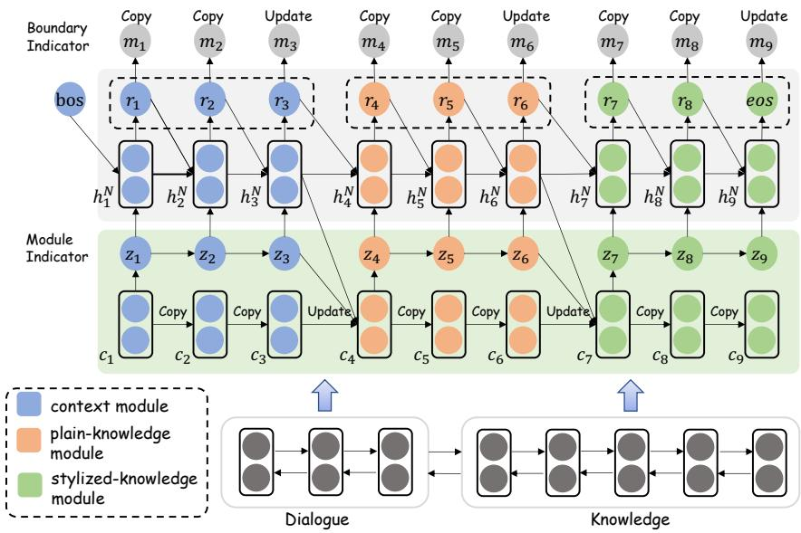
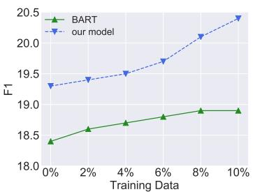
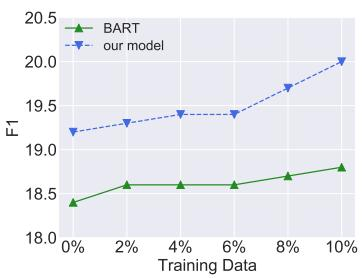
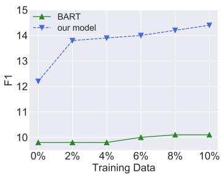
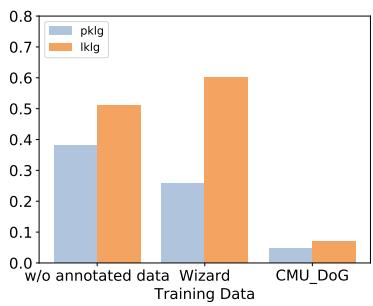
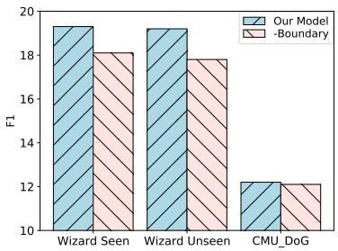

# Learning to Express in Knowledge-Grounded Conversation

Xueliang Zhao1,2, Tingchen Fu3, Chongyang Tao4, Wei Wu5, Dongyan Zhao1,2∗, Rui Yan3∗

1Wangxuan Institute of Computer Technology, Peking University

2Center for Data Science, AAIS, Peking University

3Gaoling School of Artificial Intelligence, Renmin University of China 4Microsoft 5Meituan, Beijing, China

{xl.zhao,zhaody}@pku.edu.cn ruiyan@ruc.edu.cn {lucas.futingchen,chongyangtao,wuwei19850318}@gmail.com

## Abstract

Grounding dialogue generation by extra knowledge has shown great potentials towards building a system capable of replying with knowledgeable and engaging responses. Existing studies focus on how to synthesize a response with proper knowledge, yet neglect that the same knowledge could be expressed differently by speakers even under the same context. In this work, we mainly consider two aspects of knowledge expression, namely the structure of the response and style of the content in each part. We therefore introduce two sequential latent variables to represent the structure and the content style respectively. We propose a segmentation-based generation model and op timize the model by a variational approach to discover the underlying pattern of knowledge expression in a response. Evaluation results on two benchmarks indicate that our model can learn the structure style defined by a few examples and generate responses in desired content style.

## 1 Introduction

Building an open domain dialogue system has attracted increasing attention from the community of AI and NLP. Despite the impressive progress, existing models are notorious for replying with generic and bland responses. To bridge the gap, researchers resort to ground dialogue generation by extra knowledge such as unstructured documents (Zhou et al., 2018c; Dinan et al., 2019). By this means, the documents serve as content sources and make a dialogue system knowledgeable regarding various concepts in a discussion.

However, existing studies focus on how to synthesize a response with proper knowledge (Dinan et al., 2019; Kim et al., 2020; Zhao et al., 2020b), but pay little attention to the fact that the same knowledge could be expressed differently even under the same context. These models usually employ a regular decoder to generate the response in an auto-regressive manner given the contextual representations of knowledge and dialogue context, which makes the generation process less explainable and controllable.

<table><tr><td rowspan=1 colspan=3>Knowledge</td></tr><tr><td rowspan=1 colspan=3>• MovieName: Frozen• Year: 2013• Rating: Rotten Tomatoes: 89%, Metacritics: 74/10o, CinemaScore: A+• Cast: Kristen Bell as Anna, the 18-year-old Princess of Arendelle and Elsa&#x27;s younger sister, LivvyStubenrauch as 5-year-old Anna, Katie Lopez as 5-year-old Anna (singing), Agatha Lee Monn as9-year-old Anna ...• ..</td></tr><tr><td rowspan=1 colspan=3>Conversations</td></tr><tr><td rowspan=1 colspan=1>Usert:</td><td rowspan=1 colspan=1>I was really surprised that disney choseKristen Bell to be the voice of Anna inFrozen</td><td rowspan=1 colspan=1>I was really surprised that disney choseKristen Bell to be the voice of Anna inFrozen</td></tr><tr><td rowspan=1 colspan=1>User2:</td><td rowspan=1 colspan=1>Yes, I didn&#x27;t imagine it&#x27;d be her!</td><td rowspan=1 colspan=1>Yes, I didn&#x27;t imagine it&#x27;d be her!</td></tr><tr><td rowspan=1 colspan=1>User2:</td><td rowspan=1 colspan=1>What do you think about the rating?</td><td rowspan=1 colspan=1>What do you think about the rating?</td></tr><tr><td rowspan=1 colspan=1>User1:</td><td rowspan=1 colspan=1>74 in Metacritics. I believeit deserves,indeed.</td><td rowspan=1 colspan=1>The rating is 74 in Metacritics.Let me say,high enough for a Disney move</td></tr><tr><td rowspan=1 colspan=1>User1:</td><td rowspan=1 colspan=1>And I&#x27;d give credit to three differentvoice actors for anna.I&#x27;m reallyimpressed. What about you?</td><td rowspan=1 colspan=1>And I do think it was overkill to use threedifferent voice actors for anna.Do youagree?</td></tr></table>

Table 1: A case from CMU\_DoG. Given the same knowledge and context, the last two turns in left and right conversations exhibit positive and negative sentiments, respectively. Each utterance can be decomposed into knowledge-related and knowledge-irrelevant segments.

In general, the expression style of response is composed of two aspects: the structure of the response and the style of the content in each part. As the example shown in Table 1, knowledge-related phrases and clauses tend to be long, like “And I’d give credit to three different voice actors for anna.”, or short, like “74 in Metacritics”. Besides, they may appear at the beginning of the sentence, or at the end. For the sake of description, we decompose a response into a sequence of non-overlapping segments, each is either related to certain background knowledge and diverse in content style, or almost irrelevant to the knowledge but simply playing the role of stitching the context and carrying on the conversation. We therefore define the structure style as the distribution and number of two kinds of segments. The structure style itself is far from dominant in the sentence expression, since different speakers could convey converse attitude even if the context and the knowledge are exactly the same. So it is necessary to introduce the content style as the expression fashion within each knowledge-related segment. We further introduce two latent variables to facilitate end-to-end training, one for predicting the start and end positions of a segment, the other for deciding the category of each segment. Since the human annotations for sentence segmentation are absent and enumerating over all possibilities to maximize the likelihood of the response is timeconsuming, we propose a variational framework for segmentation-based generation and induce an evidence lower bound of the likelihood.

Formally, our model follows an encoder-decoder architecture. The encoder is to obtain the contextual representation of conversational context and knowledge in a regular way. The decoder consists of three types of modules: (1) context module, for response only based on context without knowledge; (2) plain-knowledge module, for response referring knowledge but without particular style; and (3) stylized-knowledge module, for response referring knowledge and with a specific style. The context module is the only module not relying on knowledge, but simply paying attention to contextual information. Compared with plain-knowledge module, stylized-knowledge module has unique adapters, which is their primary discrepancy. When decoding, the decoder first predicts the segmentation of the response and then makes a choice in three kinds of modules to generate a single segment. Both the segmentation and the module selection are instructed under sequential latent variables.

We train our model on the Reddit Corpus published by Li et al. (2020) and evaluate our model on two benchmarks of knowledge-grounded conversation: Wizard of Wikipedia (Wizard) (Dinan et al., 2019) and CMU Document Grounded Conversation (CMU\_DoG) (Zhou et al., 2018c). Evaluation results indicate that our model can significantly outperform state-of-the-art methods in the zeroresource setting (i.e., only trained on the Reddit Corpus). In addition, the performance of our model improves significantly on Wizard and CMU\_DoG with the presence of only 10% training data and the segment distributions after fine-tuning are consistent with our prior knowledge about the two datasets, indicating that our model can learn the structure style with little cost. Finally, our model outperforms previous state-of-the-art models on the accuracy of performing sentiment classification using generated responses, which indicates that the model can be controlled to express knowledge with the desired content style.

Contributions in this work are three-fold: (1) exploration of the knowledge expression in knowledge-grounded conversation; (2) proposal of a variational segmentation-based generation model to discover the underlying expression style in a response; (3) empirical verification of the effectiveness of the proposed model on two benchmarks of knowledge-grounded conversation.

## 2 Related Work

On the vanilla encoder-decoder architecture (Shang et al., 2015; Vinyals and Le, 2015), various extensions have been made to model the structure of dialogue contexts (Serban et al., 2016, 2017; Zhang et al., 2019a); to improve diversity of responses (Li et al., 2015; Xing et al., 2017; Zhao et al., 2017; Tao et al., 2018); to control attributes of responses (Xu et al., 2019; Zhou et al., 2018a; Wang et al., 2018; See et al., 2019); and to bias responses to some specific personas (Li et al., 2016; Zhang et al., 2018). Recently, grounding dialogue generation by extra knowledge has seemed promising to bridge the gap between conversation with existing systems and conversation with humans, and the knowledge could be obtained from knowledge graphs (Zhou et al., 2018b; Moon et al., 2019; Tuan et al., 2019), retrieved from unstructured documents (Dinan et al., 2019; Lian et al., 2019; Zhao et al., 2019, 2020a; Kim et al., 2020; Li et al., 2020; Fu et al., 2022) or visual background (Mostafazadeh et al., 2017; Shuster et al., 2018; Huber et al., 2018). In this work, we study document-grounded dialogue generation. Rather than selecting knowledge relevant to dialogue context and directly exploiting pretrained language models to generate the response, we focus on expressing knowledge in this task.

The idea of sequence modeling via segmentation (Wang et al., 2017; Kim et al., 2019) has attracted widespread attention in several natural language processing tasks. In text segmentation task, Wang et al. (2017) propose a probabilistic model for sequence modeling via their segmentation and a “Sleep-WAke Network” (SWAN) method. In machine translation, Huang et al. (2017) propose a neural phrase-based machine translation system that models phrase structures in the target language using SWAN. In data-to-text generation, Wiseman et al. (2018) develop a neural template-like generation model with a HSMM decoder, which is learned tractably by backpropagating through a dynamic program; to tackle the problem of weak Markov assumption for the segment transition probability, Shen et al. (2020) propose to explicitly segment target text into fragments and align them with their data correspondences, and jointly learn the segmentation and correspondence via dynamic programming.

## 3 Approach

We start by providing the problem formalization and overview of the proposed model in Sec.3.1. Then in Sec.3.2 we describe the design for each components. Lastly, we elaborate how to optimize the components with variational inference and weak supervision in Sec.3.3.

## 3.1 Overview

Suppose that we have a dataset $\begin{array} { r l } { \mathcal { D } } & { { } = } \end{array}$ $\{ ( U _ { i } , K _ { i } , R _ { i } ) \} _ { i = 1 } ^ { N }$ , where $\begin{array} { r l r } { \forall i } & { { } \in } & { \{ 1 , \ldots , N \} } \end{array}$ $K _ { i }$ serves as background knowledge of the dialogue $( U _ { i } , R _ { i } )$ with $K _ { i , j }$ being the j-th sentence, $U _ { i }$ is the context of the dialogue with $U _ { i , j }$ the j-th utterance, and $R _ { i }$ is the response. To bias the expression to a specific structure style, we further assume that there are a few examples $\begin{array} { c c l } { \mathcal { D } _ { s t y } } & { = } & { \{ ( U _ { i } , K _ { i } , R _ { i } ) \} _ { i = 1 } ^ { M } } \end{array}$ provided by users depicting the required style for knowledge expression. Note that we have $N \gg M$ , since corpus in a specific expression style is rare and difficult to acquire. The goal is to learn a generation model $p _ { \theta } ( R | U , K )$ (θ denotes the parameters of the model) from , to generate a response R following $p _ { \theta } ( R | U , K )$ given a new dialogue context U and the associated knowledge K. Different from previous KGC generation model, we allow users to either (1) bias the structure style of $P _ { \theta } ( R | U , K )$ to $\mathcal { D } _ { s t y }$ with little cost; or (2) switch the content style of knowledge expression in R.

Figure 1 gives an overview of the proposed model, which is based on the encoder-decoder architecture. The encoder generates the contextual representations of the dialogue and knowledge, while the decoder generates the segments one after another. $\mathbf { h } _ { t } ^ { N }$ encodes the dialogue context up to timestep $t - 1$ with N denoting the number of decoder layers. Given $R = \left( r _ { 1 } , \cdot \cdot \cdot , r _ { t } , \cdot \cdot \cdot , r _ { l _ { r } } \right)$ with $r _ { t }$ referring the t-th token of R whose length is supposed to be $l _ { r } ,$ the variable $Z = \{ z _ { t } \} _ { t = 1 } ^ { l _ { r } }$ is utilized to control the choice of module of each segment (Module Indicator), and its historical information is encoded by $\{ \mathbf { c } _ { t } \} _ { t = 0 } ^ { l _ { r } } . ~ M = \{ m _ { t } \} _ { t = 1 } ^ { l _ { r } }$ is a sequence of binary variables and used to determine the boundary of each segment (Boundary Indicator). Specifically, $m _ { t } = 1$ indicating that the current segment is already completed and a new segment should be created at the next timestep. Otherwise, $m _ { t } = 0$ and the current segment remains unfinished. The generative process is disassembled into two steps: (1) determine the type of a new segment based on previously generated text and previous segment types; (2) generate within the current segment until the binary variable $m _ { t } = 1$

## 3.2 Model Architecture

Context and Knowledge Encoding. We exploit the pre-trained BART (Lewis et al., 2020) as the backbone of our architecture, which is pretrained using a variety of denoising objectives and achieves state-of-the-art results on a range of text generation tasks. Given the dialogue context $U = ( U _ { 1 } , \cdots , U _ { n } )$ , we simply concatenate them as $\left( u _ { 1 } , \cdots , u _ { l _ { u } } \right)$ . Similarly, we concatenate the associated knowledge $K = ( K _ { 1 } , \cdots , K _ { m } )$ as $( k _ { 1 } , \cdots , k _ { l _ { k } } ) . l _ { u }$ and $l _ { k }$ are the length of dialogue context and background knowledge respectively. The input of the encoder is then defined as:

$$
I = [ \mathrm { B O S } ] k _ { 1 } \ldots k _ { l _ { k } } [ \mathrm { E O S } ] u _ { 1 } \ldots u _ { l _ { u } } [ \mathrm { E O S } ] .\tag{1}
$$

The input I is truncated or padded to the maximum capacity and then passes through the stacked self-attention layers and results in a knowledgeaware context representation C, and a contextaware knowledge representation K. Specifically, the context-aware knowledge representation is defined as $\mathbf { K } = [ \mathbf { h } _ { 1 } ^ { e n c } , \cdot \cdot \cdot , \mathbf { h } _ { l _ { k } + 1 } ^ { e n c } ]$ where $\mathbf { h } _ { t } ^ { e n c }$ is the last layer of BART encoder at time t. Similarly, the knowledge-aware context representation is defined as $\mathbf { C } = [ \mathbf { h } _ { l _ { k } + 2 } ^ { e n c } , \cdot \cdot \cdot , \mathbf { h } _ { l _ { k } + l _ { u } + 2 } ^ { e n c } ]$

Prior of Module Indicator. We use the sequential discrete latent variable $Z = \{ z _ { t } \} _ { t = 1 } ^ { l _ { r } }$ to decide which module to invoke at each timestep. The transition of $z _ { t }$ occurs only when a segment is completed, which is decided by the binary boundary variable M. The prior quantifies the distribution of $z _ { t }$ before we observe the segment, and it is reasonable to assume that the prior of $z _ { t }$ depends on previous module choices $z _ { < t }$ and previously generated text. Then the transition of $Z$ is defined as:

  
Figure 1: Architecture of the proposed model. $\mathbf { \ddot { c } c o p y } ^ { , , }$ means $m _ { t } = 0$ and the state of the module indicator $c _ { t + 1 }$ remains unchanged. $\mathrm { \displaystyle \tilde { \Delta } U p d a t e ^ { \prime } }$ indicates that $m _ { t } = 1$ and the state has been updated to include the information from the previous segment.

$$
\begin{array} { r l r } & { } & { p _ { \theta _ { z } } ( z _ { t } | r _ { < t } , z _ { < t } , m _ { t - 1 } ) = m _ { t - 1 } \cdot \tilde { p } ( z _ { t } | \mathbf { c } _ { t } ) } \\ & { } & { ~ + ( 1 - m _ { t - 1 } ) \cdot \delta ( z _ { t } = z _ { t - 1 } ) , } \end{array}\tag{2}
$$

where $\delta$ is a Kronecker delta function. $\mathbf { c } _ { t }$ encodes all previous latent states $z _ { < t }$ and generated text $r _ { < t }$ as follows:

$$
\mathbf { c } _ { t } = m _ { t - 1 } \cdot f _ { z - \mathrm { r n n } } ( \tilde { \mathbf { z } } _ { t - 1 } , \mathbf { c } _ { t - 1 } ) + ( 1 - m _ { t - 1 } ) \cdot \mathbf { c } _ { t - 1 } .\tag{3}
$$

$\tilde { \mathbf { z } } _ { t - 1 } = [ \mathbf { e } _ { t - 1 } ; \mathbf { h } _ { t - 1 } ^ { N , d e c } ]$ with $\mathbf { e } _ { t - 1 }$ the embedding of $z _ { t - 1 }$ and $\mathbf { h } _ { t - 1 } ^ { N , d e c }$ the representation of last generated token. Specifically, $m _ { t - 1 } = 0$ means that the next timestep t is still in the same segment as the previous timestep $t - 1$ and thus the latent variable $z _ { t }$ should not be updated. Otherwise, it means that current segment is completed and $z _ { t }$ is updated with the transition function $\tilde { p } ( \boldsymbol { z } _ { t } | \mathbf { c } _ { t } )$ Because we only have $N _ { s t y } + 2$ options when choosing a module, where $N _ { s t y }$ is the number of different user-defined styles in addition to 2 default styles, so in this model, the latent variable $z _ { t }$ ranges in natural integer to denote corresponding style type. Specifically, $z _ { t } ~ = ~ 0$ denotes choosing the context expression module to generate a knowledge-irrelevant segment; $z _ { t } ~ = ~ 1$ tells the model to choose the knowledge expression module without specially customized style; we leave the $z _ { t } \ge 2$ to be user-defined so as to select the knowledge expression module combined with customized style. The transition function $\tilde { p } ( \boldsymbol { z } _ { t } | \mathbf { c } _ { t } )$ is then implemented as a multinomial distribution parameterized by Softmax $( f _ { z - \mathrm { m l p } } ( \mathbf { c } _ { t } ) ) ^ { 1 }$

Prior of Boundary Indicator. The boundary indicator $\textit { M } = \{ m _ { t } \} _ { t = 1 } ^ { l _ { r } }$ depicts the segmental structure of the response, with $m _ { t } ~ = ~ 1$ indicates that a new segment should start at time $t + 1$ . Presumably, the prior of $m _ { t }$ could be inferred from $r _ { < t }$ and $z _ { t }$ . We model the distribution $p _ { \theta _ { m } } ( m _ { t } | r _ { \leq t } , z _ { t } )$ by a Bernoulli distribution parameterized by $\sigma ( f _ { m - \mathrm { m l p } } ( [ \mathbf { e } _ { t } ; \mathbf { h } _ { t } ^ { N , d e c } ] ) )$ , where $\sigma$ denotes the sigmoid function.

Stylized Generation. As mentioned above, the generation process involves scheduling different modules according to $z _ { t }$ . Here we give a systematic description of the generation process. The decoder accepts the token generated last timestep $r _ { t - 1 }$ as input, performs transformation in N decoder layers, finally obtains a dense representation.

We use $\mathbf { h } _ { t } ^ { l }$ to denote the hidden state after the l-th layer at timestep t, which is a shorthand for $\mathbf { h } _ { t } ^ { l , d e c }$ for brevity. Specially, ${ \bf h } _ { t } ^ { 0 }$ is the output of the embedding layer. When $z _ { t } ~ = ~ 0$ , it implies that knowledge encoding is unnecessary for current segment so $\bar { \mathbf { h } _ { t } ^ { l } }$ is defined as:

$$
\mathbf { h } _ { t } ^ { l } = \operatorname { D e c o d e r L a y e r } ( \mathbf { h } _ { t } ^ { l - 1 } , \mathbf { H } _ { t - 1 } ^ { l - 1 } , \mathbf { C } ) ,\tag{4}
$$

where $\mathbf { H } _ { t - 1 } ^ { l } = [ \mathbf { h } _ { 1 } ^ { l } , \cdot \cdot \cdot , \mathbf { h } _ { t - 1 } ^ { l } ]$ is a sequence of decoder hidden states in previous timesteps, and

C is the context representation mentioned above. DecoderLayer $( \cdot , \cdot , \cdot )$ is implemented as pre-trained BART decoder layer where $\mathbf { h } _ { t } ^ { l - 1 }$ first plays selfattention on $\mathbf { H } _ { t - 1 } ^ { l - 1 }$ then performs cross-attention on C. The probability $p ( r _ { t } | r _ { < t } , z _ { t } = 0 )$ is defined as a multinomial distribution parameterized by Softmax $( f _ { r - \mathrm { m l p } } ( \mathbf { h } _ { t } ^ { N } ) )$ , where $\mathbf { h } _ { t } ^ { N }$ encodes the generated tokens up to timestep t 1. When $z _ { t } = 1$ the implementation of decoder layer is analogous to the $z _ { t } = 0$ case except that we replace C with $\mathbf { K } .$ , since knowledge is needed:

$$
\mathbf { h } _ { t } ^ { l } = \operatorname { D e c o d e r L a y e r } ( \mathbf { h } _ { t } ^ { l - 1 } , \mathbf { H } _ { t - 1 } ^ { l - 1 } , \mathbf { K } ) .\tag{5}
$$

To generate a segment with a particular customized style when $z _ { t } \ge 2 ,$ , we introduce some adapters to bias the generation efficiently following Houlsby et al. (2019). Specifically, the hidden state $\mathbf { h } _ { t } ^ { l }$ is defined as:

$$
\mathbf { h } _ { t } ^ { l } = \operatorname { D e c o d e r L a y e r } _ { a d p } ( \mathbf { h } _ { t } ^ { l - 1 } , \mathbf { H } _ { t - 1 } ^ { l - 1 } , \mathbf { K } ) ,\tag{6}
$$

where DecoderLaye $\Gamma _ { a d p } ( \cdot , \cdot , \cdot )$ denotes the transformer decoder layer with adapters inserted. To make the style fine-grained and adjustable, each style has a unique set of adapters. Different styles have no adapter in common. In addition, our model has the ability to learn to express in any style, as long as a discriminator for the desired style is provided.2

## 3.3 Learning Details

We introduce auxiliary distributions $q _ { \phi _ { m } } ( M | R ) =$ $\textstyle \prod _ { t = 1 } ^ { l _ { r } } q _ { \phi _ { m } } ( m _ { t } | R )$ and $\begin{array} { r l r l } { q _ { \phi _ { z } } ( Z | M , R ) } & { { } } & { = } \end{array}$ $\textstyle \prod _ { t = 1 } ^ { l _ { r } } q _ { \phi _ { z } } ( z _ { t } | M , R )$ which serve as an approximation to the intractable posterior of the boundary indicator M and the module indicator $Z .$ . We then apply variational approximation which gives the following evidence lower bound objective (ELBO) (Hoffman et al., 2013):

$$
\begin{array} { r l } & { \log p _ { \theta } ( R | U , K ) } \\ & { \geq \mathbb { E } _ { q _ { \phi _ { m } } ( M | R ) } \left( \mathbb { E } _ { q _ { \phi _ { z } } ( Z | M , R ) } \underset { t = 1 } { \overset { l _ { r } } { \sum } } \log p _ { \theta } \big ( r _ { t } | r _ { < t } , z _ { t } \big ) \right. } \\ & { \left. - \underset { t = 1 } { \overset { l _ { r } } { \sum } } m _ { t - 1 } \cdot D _ { \mathrm { K L } } \big ( q _ { \phi _ { z } } \big ( z _ { t } | M , R ) \big | \big | p _ { \theta _ { z } } \big ( z _ { t } \big ) \big ) \right) } \\ & { - \underset { t = 1 } { \overset { l _ { r } } { \sum } } D _ { \mathrm { K L } } \big ( q _ { \phi _ { m } } ( m _ { t } | R ) \big | \big | p _ { \theta _ { m } } ( m _ { t } ) \big ) , } \end{array}\tag{7}
$$

where $p _ { \theta _ { z } } ( z _ { t } )$ and $p _ { \theta _ { m } } ( m _ { t } )$ stand for $p _ { \theta _ { z } } ( z _ { t } | r _ { < t } , z _ { < t } , m _ { t - 1 } )$ and $p _ { \theta _ { m } } ( m _ { t } | r _ { \leq t } , z _ { t } )$ respectively, and $D _ { \mathrm { K L } } ( \cdot \| \cdot ) )$ refers to Kullback–Leibler divergence. Detailed derivations are presented in the appendix.

Based on the intuition that the response provides hints about the segmentation, we construct the posterior distribution $q _ { \phi _ { m } } ( m _ { t } | R )$ as a Bernoulli distribution parameterized by $\sigma ( f _ { m - \mathrm { m l p } } ^ { \prime } ( \psi _ { t } ) )$ $\psi _ { t }$ is a feature extracted from a bi-directional LSTM $\psi ( R )$ Since the module indicator is kept unchanged within a segment, the posterior distribution $q _ { \phi _ { z } } ( z _ { t } | M , R )$ is conditioned on the boundary indicator $m _ { t - 1 }$ and defined as:

$$
\begin{array} { r l } & { q _ { \phi _ { z } } ( z _ { t } | M , R ) = m _ { t - 1 } \cdot \tilde { q } ( z _ { t } | \psi _ { t } ) } \\ & { \qquad + ( 1 - m _ { t - 1 } ) \cdot \delta ( z _ { t } = z _ { t - 1 } ) , } \end{array}\tag{8}
$$

where $\delta ( \cdot )$ denotes Dirac delta function and the transition function $\tilde { q } ( \boldsymbol { z } _ { t } | \psi _ { t } )$ is implemented as a multinomial distribution parameterized by Softmax $\left( f _ { z - \mathrm { m l p } } ^ { \prime } ( \psi _ { t } ) \right)$ . Once we have the posterior distribution, we apply Gumbel-Softmax (Jang et al., 2016) to take samples of $m _ { t }$ and $z _ { t }$

Weak Supervision on M and Z. We first use StanfordNLP toolkit (Manning et al., 2014) to parse every response in the training set as a sequence of segments, and use $\tilde { M } = \{ \tilde { m } _ { t } \} _ { t = 1 } ^ { l _ { r } }$ to denote the results of segmentation labeling. The pseudo label of module choice $\tilde { Z } = \{ z _ { t } \} _ { t = 1 } ^ { \bar { l } _ { r } }$ is tagged in a similar way to multiclass classification, determined by (1) the similarity between each segment and knowledge and (2) the classification confidence of the style discriminator. More details about the construction of $\tilde { Z }$ and $\tilde { M }$ are provided in the appendix.

With $\tilde { Z }$ and $\tilde { M }$ , the loss function of weak supervision is defined as:

$$
\begin{array} { l } { \displaystyle \mathcal { L } _ { m } = - \sum _ { t = 1 } ^ { l _ { r } } \log p _ { \theta _ { m } } ( \tilde { m } _ { t } \vert r _ { \le t } , \tilde { z } _ { t } ) , } \\ { \displaystyle \mathcal { L } _ { z } = - \sum _ { t = 1 } ^ { l _ { r } } \tilde { m } _ { t - 1 } \cdot \log p _ { \theta _ { z } } ( \tilde { z } _ { t } \vert r _ { < t } , \tilde { z } _ { < t } , \tilde { m } _ { t - 1 } ) . } \end{array}\tag{9}
$$

The learning algorithm is summarized and provided in the appendix.

## 4 Experiments

## 4.1 Datasets

We test our model on benchmarks of knowledgegrounded dialogue generation, including Wizard of

<table><tr><td rowspan="2">Training Data</td><td rowspan="2">Models</td><td colspan="4">Wizard Seen</td><td colspan="4">Wizard Unseen</td><td colspan="4">CMU_DoG</td></tr><tr><td>PPL</td><td>F1</td><td>D-1</td><td>D-2</td><td>PPL</td><td>F1</td><td>D-1</td><td>D-2</td><td>PPL</td><td>F1</td><td>D-1</td><td>D-2</td></tr><tr><td rowspan="3">Reddit Corpus</td><td>BART</td><td>40.1</td><td>18.4</td><td>0.076</td><td>0.355</td><td>42.9</td><td>18.4</td><td>0.049</td><td>0.237</td><td>75.8</td><td>9.8</td><td>0.021</td><td>0.131</td></tr><tr><td>ZRKGC</td><td>41.1</td><td>18.9</td><td>0.055</td><td>0.246</td><td>42.7</td><td>18.8</td><td>0.037</td><td>0.179</td><td>53.8</td><td>12.2</td><td>0.015</td><td>0.094</td></tr><tr><td>Our Model</td><td>35.9</td><td>19.3</td><td>0.082</td><td>0.383</td><td>38.4</td><td>19.2</td><td>0.060</td><td>0.292</td><td>60.4</td><td>12.2</td><td>0.028</td><td>0.186</td></tr><tr><td rowspan="3">Reddit Corpus + 10% annotated data</td><td>BART</td><td>32.7</td><td>18.9</td><td>0.073</td><td>0.357</td><td>35.0</td><td>18.8</td><td>0.049</td><td>0.235</td><td>49.5</td><td>10.1</td><td>0.019</td><td>0.110</td></tr><tr><td>ZRKGC</td><td>29.1</td><td>19.1</td><td>0.072</td><td>0.309</td><td>31.6</td><td>18.9</td><td>0.048</td><td>0.209</td><td>38.0</td><td>13.7</td><td>0.010</td><td>0.062</td></tr><tr><td>Our Model</td><td>28.6</td><td>20.4</td><td>0.073</td><td>0.366</td><td>30.7</td><td>20.0</td><td>0.052</td><td>0.270</td><td>40.8</td><td>14.4</td><td>0.015</td><td>0.122</td></tr></table>

Table 2: Automatic evaluation results. Numbers in bold mean that the improvement to the best performing baseline is statistically significant (t-test with p-value < 0.05).

Wikipedia (Wizard) (Dinan et al., 2019) and CMU Document Grounded Conversations (CMU\_DoG) (Zhou et al., 2018c). We choose the Reddit Corpus published by (Li et al., 2020) as  for pre-training. Since it is abundant in expression style as a corpus from online forum, the two latent variables could be well initialized. We use part of the training data of Wizard and CMU\_DoG as $\mathcal { D } _ { s t y }$ respectively, for these two datasets are distinctive in expression style and differ from each other. The dialogues in CMU\_DoG tend to be causal and short, with most utterances irrelevant to knowledge while the responses in Wizard are usually long and knowledgeable, as some phrases are directly extracted from wiki articles.

More details about the datasets are described in the appendix.

## 4.2 Experimental Setup

In this paper, we mainly consider two experimental setups, corresponding to the two aspects of knowledge expression. To explore how our model can be used to control the distribution of different kinds of segments (knowledge-related and knowledgeirrelevant), we first train the model on the Reddit Corpus and then fine-tune it on a small amount of examples in Wizard and CMU\_DoG, respectively.4 To verify whether our model can generate the knowledge-related segments in the desired style, we still train the model on the Reddit Corpus, and use a style tag to control the generation process. In this experimental setup, we are primarily concerned with generating with two kinds of styles, positive and negative, where $z _ { t } = 2 \cdot \operatorname* { m i n } ( 1 , z _ { t } )$ tells the model to generate a response in positive sentiment and $z _ { t } = 3 \cdot \operatorname* { m i n } ( 1 , z _ { t } )$ is for response in negative sentiment.

Evaluation Metrics. Following Dinan et al. (2019), we choose PPL and unigram F1 as the metrics to evaluate the appropriateness. We further use Distinct-1/2 (D-1/2), which are calculated as ratios of distinct unigrams and bigrams in responses respectively, to evaluate the distinctness. We also employ classification accuracy as the evaluation metrics for style control experiments.5 Due to space limitation, we provide automatic evaluation results on more metrics (i.e., BLEU-1, METEOR, and ROUGE-L) in the appendix.

To further verify whether our model could learn structure style and content style, we randomly sample 300 examples from Test Seen of Wizard, and the test set of CMU\_DoG respectively, and recruit 6 well-educated native speakers to do qualitative analysis on the responses generated by our model and all baselines. The annotators need to judge the quality of the responses from four aspects (i.e., fluency, context coherence, knowledge relevance and style consistency), and assign a score from 0, 1, 2 (representing “bad”, “fair” and “good” respectively) to each response for each aspect. The agreement among all annotators is measured via Fleiss’ kappa (Fleiss, 1971). More details about the setup of human evaluation as well as the results on learning content style are provided in the appendix.

## 4.3 Baselines

For the exploration of structure style, we select the following models as baselines: (1) BART (Lewis et al., 2020): a model that achieves state-of-theart performance on various text generation tasks. Note that our model degrades into BART once we remove the module indicator Z and the boundary indicator M; (2) Zero-resource Knowledge-grounded Conversation (ZRKGC) (Li et al., 2020)6: a model that is based on UniLM (Dong et al., 2019) and optimized with Generalized EM method.

For the content style, we consider the following models as baselines: (1) Emotional Chatting

<table><tr><td rowspan="2">Models</td><td colspan="5">Wizard Seen</td><td colspan="5">CMU_DoG</td></tr><tr><td>Fluency</td><td>Context Coherence</td><td>Knowledge Relevance</td><td>Style Consistency</td><td>Kappa</td><td>Fluency</td><td>Context Coherence</td><td>Knowledge Relevance</td><td>Style Consistency</td><td>Kappa</td></tr><tr><td>BART</td><td>1.68</td><td>1.56</td><td>1.52</td><td>1.34</td><td>0.64</td><td>1.62</td><td>1.57</td><td>1.55</td><td>1.31</td><td>0.63</td></tr><tr><td>ZRKGC</td><td>1.62</td><td>1.59</td><td>1.55</td><td>1.36</td><td>0.65</td><td>1.61</td><td>1.53</td><td>1.65</td><td>1.56</td><td>0.66</td></tr><tr><td>Our Model</td><td>1.71</td><td>1.64</td><td>1.66</td><td>1.77</td><td>0.60</td><td>1.61</td><td>1.66</td><td>1.63</td><td>1.76</td><td>0.74</td></tr></table>

Table 3: Human evaluation results on learning structure style.

Machine (ECM) (Zhou et al., $2 0 1 8 \mathrm { a } ) ^ { 7 } \colon$ : a model which can generate appropriate responses not only content-relevant but also emotional consistent; (2) variant of DialoGPT (Zhang et al., 2019b): we add a sentiment indicating token at the first of the sequence and explore whether such simple heuristics works for controlling knowledge expression; (3) CTRL (Keskar et al., 2019) 8 : a large-scale model trained on conditional codes to govern the style and content of generation.

Our model and all baselines are trained on the identical Reddit Corpus to maintain fairness.

## 4.4 Results on Learning Structure Style

In this section, we demonstrate the effectiveness of our segmentation-based generation framework in both low-resource setting and zero-resource setting and empirically verify that our model can learn structure style with a few annotated examples.

In zero-resource setting, we trained our model on the Reddit Corpus published by Li et al. (2020) and tested on Wizard and CMU\_DoG respectively. Automatic evaluation results are shown in Table 2. It could be observed that: (1) our model significantly outperforms ZRKGC and BART on most metrics and achieves the new state-of-the-art performance on Wizard. It is impressive that our model exceeds BART in CMU\_DoG especially since the proposed model degrades into BART without two sequential latent variables Z and M. The result serves as strong evidence for the effect of two latent variables, which enable the model to learn complex expression style in Reddit Corpus to handle flexible expression in CMU\_DoG. By contrast, BART is far from satisfying with only a regular decoder. (2) our model exceeds ZRKGC significantly in terms of Distinct metrics, for ZRKGC mainly focuses on leveraging external knowledge sources for response generation, but falls short on expression diversity. In the low-resource setting, after training our model on the Reddit Corpus, we then fine-tune it with only 10% training size of Wizard and CMU\_DoG respectively (i.e., $\mathcal { D } _ { s t y }$ in Sec 3.1) to adjust $p ( z _ { t } )$ and $p ( m _ { t } )$ to a new structure style. When provided with only 10% training data, our model gets obvious improvement ( 1% increase in F1) in contrast with BART ( 0.5% increase in F1) and ZRKGC ( 0.2% increase in F1), proving that the proposed model can learn more sophisticated structure style through quick adjustment on a specific dataset with little cost.9

Human Evaluation. Table 3 shows human evaluation results on learning structure style. It could be observed that: (1) our model is significantly superior to others on style consistency, indicating that the model can learn a consistent expression style with very little data. (2) our model has better performance on context coherence and knowledge relevance, tallying with its impressive performance in the low-resource scenario.

Fine-tuning with Limited Annotated Data. We first train the model on the Reddit Corpus and then fine-tune it with the amount of annotated data (e.g., Wizard and CMU\_DoG) gradually increasing from 2% to 10%. To have a more intuitive understanding of the effects of latent variables Z and M, we compare the proposed model with BART, which generates the response with a single decoder. The evaluation results are shown in Figure 2. It can be concluded from the result that: (1) our model can learn the expression style of a particular dataset more efficiently. As the training data increases, our model has a more significant improvement in terms of the F1 metric; (2) our model performs better in meager resources since there is a considerable gap between our model and BART when the training data is close to 0%; (3) the expression style of CMU\_DoG can be learned with less data because the model has a significant change in performance after using 2% CMU\_DoG training data.

Refashioning of Knowledge-related Segments. To know how our model adjusts to different datasets, we compare the knowledge-related segments before and after trained with annotated data from two aspects: (1) the average proportion of knowledge-related segments $( p k l g )$ in a sentence; (2) the average proportion of words belonging to knowledge-related segments $( l k l g )$ . The motivation behind is that the frequency and length of these two kinds of segments generally indicates how well the latent variable is learned to capture the knowledge expression structure. We identify these two kinds of segmentation by comparing their lexical similarities with the knowledge. Figure 3 reports the results. The results indicate that our model could learn the underlying structure style of both datasets, with the great difference of pklg and $l k l g$ before and after fine-tuning as evidence. After fine-tuning with Wizard data, pklg drops to 0.26 while the $l k l g$ grows up a bit, indicating that the knowledge-related segments generated by our model are fewer and longer, which tallies with the fact that the responses in Wizard are probably directly copied from background knowledge. However, after CMU\_DoG data is fed to the model, both $p k l g$ and $l k l g$ shrink drastically, which agrees with the fact that crowd-sourcing workers converse more liberally online and the responses are less relevant to the background knowledge.

  
(a) Wizard Seen

  
(b) Wizard Unseen

  
(c) CMU\_DoG

Figure 2: Performance of different models wrt. training data size.
<table><tr><td rowspan="3">Models</td><td colspan="4">Wizard Seen</td><td colspan="4">Wizard Unseen</td><td colspan="4">CMU_DoG</td></tr><tr><td colspan="2">positive</td><td colspan="2">negative</td><td colspan="2">positive</td><td colspan="2">negative</td><td colspan="2">positive</td><td colspan="2">negative</td></tr><tr><td>F1</td><td>Acc</td><td>F1</td><td>Acc</td><td>F1</td><td>Acc</td><td>F1</td><td>Acc</td><td>F1</td><td>Acc</td><td>F1</td><td>Acc</td></tr><tr><td>ECM</td><td>10.5</td><td>55.8</td><td>10.2</td><td>60.7</td><td>10.1</td><td>55.7</td><td>10.1</td><td>57.6</td><td>7.6</td><td>41.5</td><td>8.3</td><td>55.4</td></tr><tr><td>DialoGPT</td><td>12.1</td><td>54.1</td><td>12.1</td><td>46.9</td><td>12.0</td><td>56.0</td><td>12.0</td><td>45.0</td><td>9.2</td><td>44.9</td><td>9.2</td><td>55.1</td></tr><tr><td>CTRL</td><td>15.3</td><td>71.9</td><td>14.9</td><td>55.3</td><td>14.9</td><td>75.0</td><td>14.6</td><td>52.3</td><td>9.3</td><td>70.2</td><td>9.2</td><td>61.7</td></tr><tr><td>Our Model</td><td>19.7</td><td>70.3</td><td>19.2</td><td>70.7</td><td>19.4</td><td>73.1</td><td>19.2</td><td>69.9</td><td>12.7</td><td>74.8</td><td>12.2</td><td>68.0</td></tr></table>

Table 4: Evaluation results on sentiment control. Numbers in bold mean that the improvement to the best performing baseline is statistically significant (t-test with p-value < 0.05).

  
Figure 3: The effect of fine-tuning on different data.

## 4.5 Results on Learning Content Style

We further investigate whether the proposed model could express knowledge with the desired sentiment. Specifically, we introduce two sets of style adapters to endow knowledge expression in two different sentiments, namely positive and negative. So in this scenario, it is required that responses are not only coherent with context but also limited in positive or negative sentiment. To apply ECM on knowledge-grounded conversation, we label the sentiment category for each response with a classifier pre-trained on the SST (Socher et al., 2013) training set. For DialoGPT, we similarly annotate each response with a sentiment category and append the sentiment token before the context tokens. The evaluation results are shown in Table 4. We can conclude that: (1) The proposed model outperforms all baseline models in terms of all metrics, which indicates that our model can control the sentiment of knowledge expression and guarantee high quality of the generated responses; (2) Simply adding a sentiment indicating token at the beginning of the sequence can not effectively control the style of knowledge expression, as the performance of DialoGPT on sentiment control is poor; (3) Although ECM is designed for sentiment control, it still fails to perform well in this task, proving that sentiment control in the knowledge-grounded conversation is rather difficult. Besides, ECM can only control the sentiment of the whole response but is helpless to manage every knowledge-related segment at a fine-grained level.

## 5 Conclusions

We explore knowledge expression in knowledgegrounded conversation and break down the expression style of a response into the structure of the response (structure style) and the style of the content in each part (content style). We propose a variational segmentation-based generation model to discover the underlying expression style in response. Specifically, we introduce two latent variables to model these two aspects of expression style respectively and induce an evidence lower bound of the likelihood. Evaluation results on two benchmarks of the task indicate that our model can learn the structure style with little cost and generate responses in desired content style without any human-annotated data.

## Ethical Considerations

It’s crucial for an open-domain dialogue system to be able to automatically detect and discover the underlying structural pattern of a sentence. With the ability to handle a variety of expression styles, whether positive or negative, serious or casual, our work suggests that we are getting closer to the goal of creating an artificial intelligent dialogue system that can freely communicate with humans, which is beyond the wildest dreams of most AI and NLP researchers. However, a detailed survey should be undertaken in advance to consider the immediate audience’s and developers’ interests, as well as any potential stakeholder groups.

Furthermore, knowledge-grounded dialogue systems have the potential to fabricate facts and distribute rumors and false information, particularly when the source of external background knowledge is unreliable. If the knowledge candidate set is contaminated by fake news, the response generated by the dialogue system is likely to suffer from the “hallucination” issue. Controlling the source of knowledge sentences, such as paragraphs extracted from the wiki, authoritative news sites, or authoritative product documents, is a necessary and practical strategy.

## Acknowledgement

Thanks for the anonymous reviewers for their constructive comments. This work was supported by the National Key Research and Development Program of China (No. 2020AAA0106600), National Natural Science Foundation of China (NSFC Grant No. 62122089 and No. 61876196), and Beijing Outstanding Young Scientist Program (No. BJJWZYJH012019100020098). Rui Yan is also supported by Beijing Academy of Artificial Intelligence (BAAI).

## References

Emily Dinan, Stephen Roller, Kurt Shuster, Angela Fan, Michael Auli, and Jason Weston. 2019. Wizard of wikipedia: Knowledge-powered conversational agents. In ICLR.

Li Dong, Nan Yang, Wenhui Wang, Furu Wei, Xiaodong Liu, Yu Wang, Jianfeng Gao, Ming Zhou, and Hsiao-Wuen Hon. 2019. Unified language model pre-training for natural language understanding and generation. In Advances in Neural Information Processing Systems, pages 13042–13054.

Joseph L Fleiss. 1971. Measuring nominal scale agreement among many raters. Psychological bulletin, 76(5):378.

Tingchen Fu, Xueliang Zhao, Chongyang Tao, Ji-Rong Wen, and Rui Yan. 2022. There are a thousand hamlets in a thousand people’s eyes: Enhancing knowledge-grounded dialogue with personal memory. arXiv preprint arXiv:2204.02624.

Matthew D Hoffman, David M Blei, Chong Wang, and John Paisley. 2013. Stochastic variational inference. Journal ofMachine Learning Research, 14(5).

Neil Houlsby, Andrei Giurgiu, Stanislaw Jastrzebski, Bruna Morrone, Quentin De Laroussilhe, Andrea Gesmundo, Mona Attariyan, and Sylvain Gelly. 2019. Parameter-efficient transfer learning for nlp. In International Conference on Machine Learning, pages 2790–2799. PMLR.

Po-Sen Huang, Chong Wang, Sitao Huang, Dengyong Zhou, and Li Deng. 2017. Towards neural phrase-based machine translation. arXiv preprint arXiv:1706.05565.

Bernd Huber, Daniel McDuff, Chris Brockett, Michel Galley, and Bill Dolan. 2018. Emotional dialogue generation using image-grounded language models. In CHI, page 277. ACM.

Eric Jang, Shixiang Gu, and Ben Poole. 2016. Categorical reparameterization with gumbel-softmax. arXiv preprint arXiv:1611.01144.

Nitish Shirish Keskar, Bryan McCann, Lav R Varshney, Caiming Xiong, and Richard Socher. 2019. Ctrl: A conditional transformer language model for controllable generation. arXiv preprint arXiv:1909.05858.

Byeongchang Kim, Jaewoo Ahn, and Gunhee Kim. 2020. Sequential latent knowledge selection for knowledge-grounded dialogue. arXiv preprint arXiv:2002.07510.

Taesup Kim, Sungjin Ahn, and Yoshua Bengio. 2019. Variational temporal abstraction. In Proceedings of the 33rd International Conference on Neural Information Processing Systems, pages 11570–11579.

Diederik P Kingma and Jimmy Ba. 2015. Adam: A method for stochastic optimization. In ICLR.

Mike Lewis, Yinhan Liu, Naman Goyal, Marjan Ghazvininejad, Abdelrahman Mohamed, Omer Levy, Veselin Stoyanov, and Luke Zettlemoyer. 2020. Bart: Denoising sequence-to-sequence pre-training for natural language generation, translation, and comprehension. In Proceedings of the 58th Annual Meeting of the Association for Computational Linguistics, pages 7871–7880.

Jiwei Li, Michel Galley, Chris Brockett, Jianfeng Gao, and Bill Dolan. 2015. A diversity-promoting objective function for neural conversation models. NAACL, pages 110–119.

Jiwei Li, Michel Galley, Chris Brockett, Georgios Spithourakis, Jianfeng Gao, and Bill Dolan. 2016. A persona-based neural conversation model. In ACL, pages 994–1003.

Linxiao Li, Can Xu, Wei Wu, Yufan Zhao, Xueliang Zhao, and Chongyang Tao. 2020. Zero-resource knowledge-grounded dialogue generation. arXiv preprint arXiv:2008.12918.

Rongzhong Lian, Min Xie, Fan Wang, Jinhua Peng, and Hua Wu. 2019. Learning to select knowledge for response generation in dialog systems. arXiv preprint arXiv:1902.04911.

Christopher D Manning, Mihai Surdeanu, John Bauer, Jenny Rose Finkel, Steven Bethard, and David Mc-Closky. 2014. The stanford corenlp natural language processing toolkit. In Proceedings of 52nd annual meeting ofthe associationfor computational linguistics: system demonstrations, pages 55–60.

Seungwhan Moon, Pararth Shah, Anuj Kumar, and Rajen Subba. 2019. Opendialkg: Explainable conversational reasoning with attention-based walks over knowledge graphs. In Proceedings of the 57th Annual Meeting ofthe Associationfor Computational Linguistics, pages 845–854.

Nasrin Mostafazadeh, Chris Brockett, Bill Dolan, Michel Galley, Jianfeng Gao, Georgios Spithourakis, and Lucy Vanderwende. 2017. Image-grounded conversations: Multimodal context for natural question and response generation. In Proceedings of

the Eighth International Joint Conference on Natural Language Processing (Volume 1: Long Papers), pages 462–472.

Abigail See, Stephen Roller, Douwe Kiela, and Jason Weston. 2019. What makes a good conversation? how controllable attributes affect human judgments. arXiv preprint arXiv:1902.08654.

Iulian Vlad Serban, Alessandro Sordoni, Yoshua Bengio, Aaron C Courville, and Joelle Pineau. 2016. Building end-to-end dialogue systems using generative hierarchical neural network models. In AAAI, volume 16, pages 3776–3784.

Iulian Vlad Serban, Alessandro Sordoni, Ryan Lowe, Laurent Charlin, Joelle Pineau, Aaron C Courville, and Yoshua Bengio. 2017. A hierarchical latent variable encoder-decoder model for generating dialogues. In AAAI, pages 3295–3301.

Lifeng Shang, Zhengdong Lu, and Hang Li. 2015. Neural responding machine for short-text conversation. In ACL, pages 1577–1586.

Xiaoyu Shen, Ernie Chang, Hui Su, Cheng Niu, and Dietrich Klakow. 2020. Neural data-to-text generation via jointly learning the segmentation and correspondence. In Proceedings of the 58th Annual Meeting of the Association for Computational Linguistics, pages 7155–7165.

Kurt Shuster, Samuel Humeau, Antoine Bordes, and Jason Weston. 2018. Engaging image chat: Modeling personality in grounded dialogue. arXiv preprint arXiv:1811.00945.

Richard Socher, Alex Perelygin, Jean Wu, Jason Chuang, Christopher D Manning, Andrew Y Ng, and Christopher Potts. 2013. Recursive deep models for semantic compositionality over a sentiment treebank. In Proceedings of the 2013 conference on empirical methods in natural language processing, pages 1631–1642.

Chongyang Tao, Shen Gao, Mingyue Shang, Wei Wu, Dongyan Zhao, and Rui Yan. 2018. Get the point of my utterance! learning towards effective responses with multi-head attention mechanism. In IJCAI, pages 4418–4424.

Yi-Lin Tuan, Yun-Nung Chen, and Hung-yi Lee. 2019. Dykgchat: Benchmarking dialogue generation grounding on dynamic knowledge graphs. In Proceedings of the 2019 Conference on Empirical Methods in Natural Language Processing and the 9th International Joint Conference on Natural Language Processing (EMNLP-IJCNLP), pages 1855–1865.

Oriol Vinyals and Quoc Le. 2015. A neural conversational model. arXiv preprint arXiv:1506.05869.

Chong Wang, Yining Wang, Po-Sen Huang, Abdelrahman Mohamed, Dengyong Zhou, and Li Deng. 2017. Sequence modeling via segmentations. In International Conference on Machine Learning, pages 3674– 3683. PMLR.

Yansen Wang, Chenyi Liu, Minlie Huang, and Liqiang Nie. 2018. Learning to ask questions in open-domain conversational systems with typed decoders. In Proceedings of the 56th Annual Meeting of the Association for Computational Linguistics (Volume 1: Long Papers), pages 2193–2203.

Sam Wiseman, Stuart M Shieber, and Alexander M Rush. 2018. Learning neural templates for text generation. In Proceedings ofthe 2018 Conference on Empirical Methods in Natural Language Processing, pages 3174–3187.

Chen Xing, Wei Wu, Jie Liu, Yalou Huang, Ming Zhou, and Wei-Ying Ma. 2017. Topic aware neural response generation. In AAAI, pages 3351–3357.

Can Xu, Wei Wu, Chongyang Tao, Huang Hu, Matt Schuerman, and Ying Wang. 2019. Neural response generation with meta-words. arXiv preprint arXiv:1906.06050.

Hainan Zhang, Yanyan Lan, Liang Pang, Jiafeng Guo, and Xueqi Cheng. 2019a. Recosa: Detecting the relevant contexts with self-attention for multi-turn dialogue generation. In Proceedings ofthe 57th Annual Meeting of the Association for Computational Linguistics, pages 3721–3730.

Saizheng Zhang, Emily Dinan, Jack Urbanek, Arthur Szlam, Douwe Kiela, and Jason Weston. 2018. Personalizing dialogue agents: I have a dog, do you have pets too? arXiv preprint arXiv:1801.07243.

Yizhe Zhang, Siqi Sun, Michel Galley, Yen-Chun Chen, Chris Brockett, Xiang Gao, Jianfeng Gao, Jingjing Liu, and Bill Dolan. 2019b. Dialogpt: Large-scale generative pre-training for conversational response generation. arXiv preprint arXiv:1911.00536.

Tiancheng Zhao, Ran Zhao, and Maxine Eskenazi. 2017. Learning discourse-level diversity for neural dialog models using conditional variational autoencoders. In ACL, pages 654–664.

Xueliang Zhao, Chongyang Tao, Wei Wu, Can Xu, Dongyan Zhao, and Rui Yan. 2019. A documentgrounded matching network for response selection in retrieval-based chatbots. In IJCAI, pages 5443–5449.

Xueliang Zhao, Wei Wu, Chongyang Tao, Can Xu, Dongyan Zhao, and Rui Yan. 2020a. Low-resource knowledge-grounded dialogue generation. In International Conference on Learning Representations.

Xueliang Zhao, Wei Wu, Can Xu, Chongyang Tao, Dongyan Zhao, and Rui Yan. 2020b. Knowledgegrounded dialogue generation with pre-trained language models. In Proceedings of the 2020 Conference on Empirical Methods in Natural Language Processing (EMNLP), pages 3377–3390.

Hao Zhou, Minlie Huang, Tianyang Zhang, Xiaoyan Zhu, and Bing Liu. 2018a. Emotional chatting machine: Emotional conversation generation with internal and external memory. In Thirty-Second AAAI Conference on Artificial Intelligence.

Hao Zhou, Tom Young, Minlie Huang, Haizhou Zhao, Jingfang Xu, and Xiaoyan Zhu. 2018b. Commonsense knowledge aware conversation generation with graph attention. In IJCAI, pages 4623–4629.

Kangyan Zhou, Shrimai Prabhumoye, and Alan W Black. 2018c. A dataset for document grounded conversations. arXiv preprint arXiv:1809.07358.

## A Appendix

$$
\begin{array} { r l } { \mathbf { A . 1 } } & { \mathbf { D e r i v a t i o n ~ o f ~ K L B O } } \\ & { \mathbf { \Pi . k e p } \rho ( R | \langle X , K \rangle } \\ & { = \log \bigstar \sum _ { p ( R , M , Z ) } } \\ & { \quad \quad ( \kappa , \varepsilon ) } \\ & { = \log \bigstar \sum _ { q ( M , Z ) \in \{ M , Z \} \in \{ M , Z \} } } \\ & { \quad \quad ( \mathcal { A } , \varepsilon ) } \\ & { = \log \mathcal { E } _ { \{ \tilde { X } , \tilde { X } , Z \} \sim \{ \mathcal { N } , \tilde { X } \} } \frac { p ( R , M , Z ) } { q ( M , Z ) / N } } \\ & { \quad \quad \quad \quad \quad \quad \quad \quad \quad \quad \quad \quad \quad \quad \quad \quad \quad \quad \quad \quad \quad } \\ & { \quad \quad \quad \quad \quad \quad \quad \quad \quad \quad \quad \quad \quad \quad \quad \quad \quad \quad \quad \quad \quad \quad \quad \quad \quad \quad } \\ & { \quad \quad \quad \quad \quad \quad \quad \quad \quad \quad \quad \quad \quad \quad \quad \quad \quad \quad \quad \quad \quad \quad \quad \quad \quad \quad \quad \quad } \\ & { \quad \quad \quad \quad \quad \quad \quad \quad \quad \quad \quad \quad \quad \quad \quad \quad \quad \quad \quad \quad \quad \quad \quad \quad \quad \quad \quad \quad \quad \quad } \\ & { \quad \quad \quad \quad \quad \quad \quad \quad \quad \quad \quad \quad \quad \quad \quad \quad \quad \quad \quad \quad \quad \quad \quad \quad \quad \quad \quad \quad \quad \quad \quad } \\ & { \quad \quad \quad \quad \quad \quad \quad \quad \quad \quad \quad \quad \quad \quad \quad \quad \quad \quad \quad \quad \quad \quad \quad \quad \quad \quad \quad \quad \quad \quad \quad } \\ & { \quad \quad \quad \quad \quad \quad \quad \quad \quad \quad \quad \quad \quad \quad \quad \quad \quad \quad \quad \quad \quad \quad \quad \quad \quad \quad \quad \quad \quad \quad \quad \quad } \\ & { \quad \quad \quad \quad \quad \quad \quad \quad \quad \quad \quad \quad \quad \quad \quad \quad \quad \quad \quad \quad \quad \quad \quad \quad \quad \quad \quad \quad \quad \quad \quad \quad } \\ &  \quad \quad \quad \quad \quad \end{array}\tag{10}
$$

According to the mean-filed approximation, $\begin{array} { r l r } { q ( M , Z ) } & { { } \approx } & { q ( M ) q ( Z ) } \end{array}$ Therefore, $\mathbb { E } _ { ( M , Z ) \sim q ( M , Z | R ) } \log p ( R | M , Z )$ and ${  { \mathbb E } } _ { ( M , Z ) \sim q ( M , Z | R ) } \big ( \log q ( M , Z | R ) - \log p ( M , Z ) \big )$ 0 can be re-written as:

$$
\begin{array} { r l } {  { \mathbb { E } _ { ( M , Z ) \sim q ( M , Z | R ) } \log p ( R | M , Z ) } } \\ & { = \mathbb { E } _ { M \sim q ( M | R ) } ( \mathbb { E } _ { Z \sim q ( Z | M , R ) } \sum _ { t = 1 } ^ { l _ { r } } \log p ( r _ { t } | r _ { < t } , z _ { t } ) ) ) } \end{array}\tag{11}
$$

$$
\begin{array} { r l } & { \mathbb { E } _ { \xi \sim \frac { \lambda } { \lambda } \sim 0 } \times \exp ( \frac { \lambda } { \xi } \exp ( \lambda \xi ( T - \xi \xi ) ) ) } \\ & { = \mathbb { E } _ { \xi \sim \frac { \lambda } { \lambda } \sim 0 } \exp ( \mathbb { E } _ { \xi \sim \frac { \lambda } { \lambda } \sim 0 } \lambda \ln ( \exp ( \lambda \xi ( \frac { \lambda } { \xi } ) ) ) ) } \\ & { \quad \quad \quad \quad \quad \quad \quad \quad \quad \quad \quad \quad \quad \quad \quad \quad \quad \quad \quad \quad \quad \quad \quad \quad \quad \quad \quad } \\ & { \quad \quad \quad \quad \quad \quad \quad \quad \quad \quad \quad \quad \quad \quad \quad \quad \quad \quad \quad \quad \quad \quad \quad \quad \quad \quad \quad \quad \quad \quad \quad \quad \quad \quad \quad \quad \quad \quad \quad } \\ & & { = \mathbb { E } _ { \xi \sim \frac { \lambda } { \lambda } \sim 0 } \exp ( \lambda ( \frac { \lambda } { \xi } ) ( T - \frac { \lambda } { T - \xi } ) ) ) \times \quad \mathrm { d o t } \quad \exp ( 2 \lambda \xi ) } \\ & { \quad \quad \quad \quad \quad \quad \quad \quad \quad \quad \quad \quad \quad \quad \quad \quad \quad \quad \quad \quad \quad \quad \quad \quad \quad \quad \quad \quad \quad \quad \quad \quad \quad \quad \quad } \\ & { = \mathbb { E } _ { \xi \sim \frac { \lambda } { \lambda } \sim 0 } \exp ( \frac { \lambda } { \xi } ( \frac { \lambda } { T - \xi } ) ) ) \times \quad \mathrm { d o t } \quad \exp ( 2 \lambda \xi ) \times \frac { \lambda } { \lambda } ( \frac { \lambda } { \xi } ) ) } \\ & { \quad \quad \quad \quad \quad \quad \quad \quad \quad \quad \quad \quad \quad \quad \quad \quad \quad \quad \quad \quad \quad \quad \quad \quad \quad \quad \quad \quad \quad \quad \quad \quad \quad } \\ &  = \frac { \lambda } { \xi \sim \frac { \lambda } { \lambda } \sim 0 } \exp ( \frac { \lambda } \end{array}\tag{12}
$$

## A.2 Details about the Construction of $\tilde { \textbf { M } }$ and Z˜

In this section, we provide more details about of construction of M˜ and $\tilde { Z } .$ . For every response in the training set, we parse it as a syntax tree using StanfordNLP toolkit (Manning et al., 2014). The syntax tree we obtain is in a hierarchical and nested structure. The root node of the tree represents the whole response sentence and the root node of every subtree represents a corresponding phrase, a small part of a sentence. For example, if a phrase could be divided into three parts, then the node representing the phrase has three child nodes and each represents a part of the phrase. After we acquire the parsing tree, segmentation is then carried out recursively. To be concrete, we traverse the parsing tree by deepfirst search order. Every time we arrive at a node, compute the similarity10 between the knowledge and the phrase represented by the node. If the similarity is above the threshold $\mu _ { s e g }$ , we mark the phrase as a segment and search in this branch terminates. Else we continue to search the child nodes of the current node to segment at a more refined level. We use $\tilde { M } = \{ \tilde { m } _ { t } \} _ { t = 1 } ^ { \bar { l } _ { r } }$ to denote the results of segmentation labeling.

The pseudo label of module choice $\tilde { Z } = \{ z _ { t } \} _ { t = 1 } ^ { l _ { r } }$ is tagged in a similar way to multiclass classification. Specifically, for a segment $( r _ { s } , \cdots , r _ { e } )$ where s and e are the start and end position of a segment respectively. If the similarity between this segment and the knowledge falls below a threshold $\mu _ { k n l }$ , its pseudo label $\left( z _ { s } , \cdots , z _ { e } \right)$ will be set to 0. Otherwise we send the segment to a series of style discriminators one after another until the classification confidence given by a discriminator is above $\mu _ { { s t y } _ { i } }$ and pseudo module choice label will be set to $i + 1$ If all discriminators fail to classify the segment at a confidence greater than $\mu _ { s t y _ { i } } , ( z _ { s } , \cdot \cdot \cdot , z _ { e } )$ are all 1, indicating knowledge should be expressed without particular style.

## A.3 Learning Algorithm

The learning algorithm is summarized in Algorithm

Training Data. We choose the Reddit Corpus published by (Li et al., 2020) as  for pre-training. The data contains 842, 521 context-knowledgeresponse triples for training and 2, 737 contextknowledge-response triples for validation. On average, each dialogue contains 3.1 utterances in both sets, and the average length of the utterance is 16.0 in training and is 16.1 in validation.

Evaluation Data. We test our model on benchmarks of knowledge-grounded dialogue generation, including Wizard of Wikipedia (Wizard) (Dinan et al., 2019) and CMU Document Grounded Conversations (CMU\_DoG) (Zhou et al., 2018c). Both datasets are split into training sets, validation sets, and test sets by the data owners. We follow Dinan et al. (2019) and conduct the pre-processing with the code published on $\mathrm { P a r l A I ^ { 1 1 } }$ . Topics in Wizard cover a wide range (1, 365 in total), and each conversation happens between a wizard who has access to the knowledge about a specific topic and an apprentice who is just eager to learn from the wizard about the topic. The test set is split into two subsets. Test Seen only contains dialogues with topics that have already appeared in the training set, while topics in Test Unseen never appear in the training set and the validation set. Different from Wizard, CMU\_DoG focuses on movie domain, and besides wizard-apprentice conversations, the data also contain conversations between two workers who know the document and try to discuss the content in depth. In both datasets, only the turns where knowledge is accessible are considered in response generation. Table 5 reports the statistics of the Wizard data and the CMU\_DoG data

Algorithm 1 Learning Algorithm   
1: Input: Training data , thresholds for weak supervision $\mu _ { s e g } , \mu _ { k n l }$ and $\mu _ { s t y } ,$ discriminator $\left\{ D i s _ { i } \right\} _ { i = 1 } ^ { N _ { s t y } }$ , maximum step $M ,$   
adapter training step $M ^ { ' }$   
2: for $m \gets 1$ to M do   
3: Sample a mini-batch $\{ ( U _ { i } , K _ { i } , R _ { i } ) \}$ from $\mathcal { D } .$   
4: Conduct segmentation on $R _ { i }$ to get M˜ .   
5: for $i \gets 1$ to $N _ { s e g }$ do   
6: for $j  1$ to $\dot { N } _ { s t y }$ do   
7: Use $D i s _ { j }$ to classify response segment $( r _ { s _ { i } } , \cdots , r _ { e _ { i } } ) .$   
8: if Confidence of $D i s _ { j } \geq \mu _ { s t y }$ and $( z _ { s _ { i } } , \cdots , z _ { e _ { i } } )$ are not assigned then   
9: $( z _ { s _ { i } } , \cdot \cdot \cdot , z _ { e _ { i } } ) \gets j + 1$   
10: end if   
11: end for   
12: end for   
13: $\mathbf { i f } \ m \leq M ^ { \prime }$ then   
14: Update the adapters based on the first term in ELBO.   
15: else   
16: Update the parameters $\theta \left( \mathrm { i . e . , } \theta _ { m } , \theta _ { z } \right.$ and the parameters in $p ( r _ { t } ) )$ and $\phi \left( \mathrm { i } . \mathrm { e } . , \phi _ { m } \right.$ and $\phi _ { z } )$ based on ELBO and weak   
supervision.   
17: end if   
18: end for   
19: return Generation Model $p _ { \theta } ( R | U , K )$ with prior distribution $p _ { \theta _ { m } }$ and $p _ { \theta _ { z } }$

## A.5 More Implementation Details

We employ a knowledge selection (KS) module to select the top 7 related sentences in knowledge. The KS module is implemented based on Robertabase (125M) and trained on the Reddit Corpus. Specifically, we treat the sentence which has the highest F1 score with the response as the positive sample, and the negative sample is randomly sampled from all the other knowledge sentences. We train the KS module via maximum likelihood estimation (MLE) with a batch size of 64 and an initial learning rate of $1 e - 5$ . The threshold $\mu _ { s e g } ,$ $\mu _ { k n l } , \mu _ { p o s }$ and $\mu _ { n e g } { } ^ { 1 2 }$ in weak supervision are set as 0.9, 0.5, 0.8 and 0.8, respectively. The encoderdecoder architecture is implemented on the basis of Bart-base (139M) and trained on the Reddit Corpus with a batch size of 64 and an initial learning rate of $5 e - 6$ . The parameters for prior and posterior distributions of $Z$ and M $( \mathrm { i . e . , } \theta _ { z } , \theta _ { m } , \phi _ { z }$ and $\phi _ { m } )$ are initialized randomly, and optimized with a learning rate of $1 e - 4 .$ . The parameters for adapters are initialized randomly and optimized with a learning rate of $2 e - 3$ . We only train the adapters for the first 1000 steps. We utilize gated recurrent units (GRUs) as the basic units in $f _ { z - \mathrm { r n n } } .$ We set the hidden size and the number of layers of RNN in our model (i.e., $f _ { z - \mathrm { r m n } }$ and $\psi ( \cdot ) )$ as 128 and 1 respectively. The embedding size for Z is set as 128 and the adapter size is set as 64. When finetuning the model on the Wizard and CMU\_DoG datasets, the learning rate and the batch size are set as $5 e - 5$ and 32 respectively. We employ greedy search in response decoding. All models are learned with Adam (Kingma and Ba, 2015) optimizer with $\beta _ { 1 } ~ = ~ 0 . 9$ and $\beta _ { 2 } ~ = ~ 0 . 9 9 9$ We increase the learning rate linearly for the first 200 steps and decrease it thereafter proportionally to the inverse square root of the step number. Early stopping on validation is adopted as a regularization strategy. All models are trained on a 8 RTX 2080 Ti machine.

<table><tr><td rowspan="2"></td><td colspan="4">Wizard of Wikipedia</td><td colspan="3">CMU_DoG</td></tr><tr><td>Train</td><td>Valid</td><td>Test Seen</td><td>Test Unseen</td><td>Train</td><td>Valid</td><td>Test</td></tr><tr><td># Utterances</td><td>166,787</td><td>17,715</td><td>8,715</td><td>8,782</td><td>74,717</td><td>4,993</td><td>13,646</td></tr><tr><td># Conversations</td><td>18,430</td><td>1,948</td><td>965</td><td>968</td><td>3,373</td><td>229</td><td>619</td></tr><tr><td># Topics/Documents</td><td>1,247</td><td>599</td><td>533</td><td>58</td><td>30</td><td>30</td><td>30</td></tr><tr><td>Avg. # of Turns</td><td>9.0</td><td>9.1</td><td>9.0</td><td>9.1</td><td>22.2</td><td>21.8</td><td>22.0</td></tr></table>

Table 5: Statistics of the Wizard data and the CMU\_DoG data.
<table><tr><td rowspan="2">Training Data</td><td rowspan="2">Models</td><td colspan="4">Wizard Seen</td><td colspan="4">Wizard Unseen</td><td colspan="4">CMU_DoG</td></tr><tr><td>PPL</td><td>BLEU-1</td><td>ROUGE-L</td><td>METEOR</td><td>PPL</td><td>BLEU-1</td><td>ROUGE-L</td><td>METEOR</td><td>PPL</td><td>BLEU-1</td><td>ROUGE-L</td><td>METEOR-L</td></tr><tr><td rowspan="3">Reddit Corpus</td><td>BART</td><td>40.1</td><td>0.206</td><td>0.164</td><td>0.099</td><td>42.9</td><td>0.202</td><td>0.167</td><td>0.099</td><td>75.8</td><td>0.141</td><td>0.117</td><td>0.060</td></tr><tr><td>ZRKGC</td><td>41.1</td><td>0.225</td><td>0.163</td><td>0.099</td><td>42.7</td><td>0.220</td><td>0.164</td><td>0.100</td><td>53.8</td><td>0.161</td><td>0.128</td><td>0.075</td></tr><tr><td>Ours</td><td>35.9</td><td>0.235</td><td>0.168</td><td>0.095</td><td>38.4</td><td>0.232</td><td>0.169</td><td>0.095</td><td>60.4</td><td>0.166</td><td>0.131</td><td>0.069</td></tr><tr><td rowspan="3">Reddit Corpus +10% training data</td><td>BART</td><td>32.7</td><td>0.203</td><td>0.174</td><td>0.103</td><td>35.0</td><td>0.199</td><td>0.175</td><td>0.103</td><td>49.5</td><td>0.141</td><td>0.122</td><td>0.067</td></tr><tr><td>ZRKGC</td><td>29.1</td><td>0.227</td><td>0.175</td><td>0.101</td><td>31.6</td><td>0.222</td><td>0.176</td><td>0.100</td><td>38.0</td><td>0.173</td><td>0.139</td><td>0.083</td></tr><tr><td>Ours</td><td>28.6</td><td>0.237</td><td>0.181</td><td>0.103</td><td>30.7</td><td>0.231</td><td>0.176</td><td>0.101</td><td>40.8</td><td>0.182</td><td>0.139</td><td>0.080</td></tr></table>

Table 6: More Results about Automatic Evaluation.

## A.6 More Results about Automatic Evaluation

Table 6 reports more results about the automatic evaluation, from which we can see that our model still outperforms the baselines.

## A.7 Human Evaluation

We randomly sample 300 examples from Test Seen of Wizard, and the test set of CMU\_DoG respectively, and recruit 6 well-educated native speakers to do qualitative analysis on the responses generated by our model and all baselines. For each of the 300 examples, an annotator is provided with the context, the ground-truth knowledge, model responses and the associated style types. For evaluation of structure style, we defined two kinds of structure styles based on two datasets, namely the Wizard-like style $S _ { w i z a r d }$ and the CMU\_DoG-like style $S _ { c m u d o g }$ While for evaluation of content style, we roughly divide content styles in two categories, $S _ { p o s }$ and $S _ { n e g }$ for convenience. The responses provided by different models are randomly shuffled to hide their sources. The annotators need to judge the quality of the responses from four aspects: (1) fluency: whether the response is fluent without any grammatical errors; (2) context coherence: whether the response is coherent with the context; (3) knowledge relevance: whether the response is relevant with the knowledge; and (4) style consistency: whether the response exhibits the desired style. Each annotator assigns a score from 0, 1, 2 (representing “bad”, “fair” and “good” respectively) to each response for each aspect. Each response obtains four scores for aforementioned four aspects, and the agreement among all annotators is measured via Fleiss’ kappa (Fleiss, 1971).

Results on Learning content style. Table 7 reports the human evaluation results on learning content style. The three models are trained on the Reddit Corpus. We can conclude that: (1) by introducing two latent variables and a number of adapters for different styles, our model can generate responses in desired content style (i.e., $S _ { p o s }$ and $S _ { n e g } )$ more accurately and achieve significant improvement on style consistency, which is consistent with the results in Table 4; (2) our model also outperforms ECM and DialoGPT on fluency, context coherency and knowledge relevance thanks to the capacity of large-scale pre-trained language models and the introduction of external knowledge respectively.

## A.8 Comparison with More Baselines

We compare with models trained on full training data, and Table 8 shows the evaluation results. First, it is noted that our model outperforms KnowledGPT in terms of F1 by using only 10% training data13 on CMU\_DoG, which provides a strong support for the effectiveness of the proposed model.

<table><tr><td rowspan="2">Models</td><td colspan="5">Wizard Seen</td><td colspan="5">CMU_DoG</td></tr><tr><td>Fluency</td><td>Context Coherence</td><td>Knowledge Relevance</td><td>Style Consistency</td><td>Kappa</td><td>Fluency</td><td>Context Coherence</td><td>Knowledge Relevance</td><td>Style Consistency</td><td>Kappa</td></tr><tr><td>ECM</td><td>0.85</td><td>0.94</td><td>1.02</td><td>1.24</td><td>0.65</td><td>0.96</td><td>0.95</td><td>1.18</td><td>1.08</td><td>0.72</td></tr><tr><td>DialoGPT</td><td>1.57</td><td>1.41</td><td>1.19</td><td>1.26</td><td>0.75</td><td>1.55</td><td>1.62</td><td>1.09</td><td>1.02</td><td>0.65</td></tr><tr><td>Our</td><td>1.64</td><td>1.60</td><td>1.78</td><td>1.72</td><td>0.76</td><td>1.59</td><td>1.63</td><td>1.51</td><td>1.69</td><td>0.62</td></tr></table>

Table 7: Human evaluation results on learning content style.
<table><tr><td rowspan="2">Training Data</td><td rowspan="2">Models</td><td colspan="3">Wizard Seen</td><td colspan="3">Wizard Unseen</td><td colspan="3">CMU_DoG</td></tr><tr><td>F1</td><td>D-1</td><td>D-2</td><td>F1</td><td>D-1</td><td>D-2</td><td>F1</td><td>D-1</td><td>D-2</td></tr><tr><td rowspan="5">100% annotated data</td><td>TMN</td><td>15.9</td><td>0.041</td><td>0.176</td><td>14.3</td><td>0.025</td><td>0.106</td><td>9.9</td><td>0.003</td><td>0.008</td></tr><tr><td>SKT</td><td>19.3</td><td>0.085</td><td>0.300</td><td>16.1</td><td>0.056</td><td>0.188</td><td>-</td><td></td><td></td></tr><tr><td>DRD</td><td>19.3</td><td>0.065</td><td>0.252</td><td>17.9</td><td>0.046</td><td>0.177</td><td>10.7</td><td>0.010</td><td>0.044</td></tr><tr><td>KnowledGPT</td><td>22.0</td><td>0.141</td><td>0.431</td><td>20.5</td><td>0.094</td><td>0.290</td><td>13.5</td><td>0.023</td><td>0.113</td></tr><tr><td>Our Model</td><td>22.0</td><td>0.128</td><td>0.415</td><td>20.8</td><td>0.090</td><td>0.278</td><td>15.3</td><td>0.031</td><td>0.121</td></tr><tr><td rowspan="3">Reddit Corpus</td><td>BART</td><td>18.4</td><td>0.076</td><td>0.355</td><td>18.4</td><td>0.049</td><td>0.237</td><td>9.8</td><td>0.021</td><td>0.131</td></tr><tr><td>ZRKGC</td><td>18.9</td><td>0.055</td><td>0.246</td><td>18.8</td><td>0.037</td><td>0.179</td><td>12.2</td><td>0.015</td><td>0.094</td></tr><tr><td>Our Model</td><td>19.3</td><td>0.082</td><td>0.383</td><td>19.2</td><td>0.060</td><td>0.292</td><td>12.2</td><td>0.028</td><td>0.186</td></tr><tr><td>Reddit Corpus + 10% annotated data</td><td>Our Model</td><td>20.4</td><td>0.073</td><td>0.366</td><td>20.0</td><td>0.052</td><td>0.270</td><td>14.4</td><td>0.015</td><td>0.122</td></tr><tr><td>Reddit Corpus + 100% annotated data</td><td>Our Model</td><td>21.9</td><td>0.134</td><td>0.453</td><td>21.2</td><td>0.103</td><td>0.302</td><td>15.5</td><td>0.041</td><td>0.134</td></tr></table>

Table 8: Automatic evaluation results.

Second, by adjusting the structure style on a small amount of data, the gap between our model and KnowledGPT is further narrowed, while the improvements on ZRKGC and BART are trivial.

## A.9 Ablation over Weak Supervision

To have more insights into the impact of weak supervision on the performance of our model, we compare the proposed model with the following variants: (1)-weak supervision on Z: the weak supervision on module indicator Z is removed; (2)- weak supervision on Z and M: the weak supervision on module indicator and boundary indicator is removed. Table 9 reports the evaluation results. We can conclude that (1) the weak supervision objectives significantly improve model performance; (2) the weak supervision objectives play a more crucial role on CMU\_DoG, as removing them causes a dramatic drop in performance. The reason is that this dataset has more sophisticated expression styles and it is difficult to learn these styles without auxiliary supervision signals.

## A.10 Ablation over Boundary Indicator

Since the module indicator is conditioned on the boundary indicator, we are curious about what will happen if the M is removed. The ablation result is shown on Figure 4. There is an evident drop on Wizard Seen and Wizard Unseen, verifying the effect of boundary indicator in assisting the module indicator. The margin is tiny on CMU\_DoG, perhaps because its structure feature is easier to capture, so the module indicator could works properly itself.

  
Figure 4: Ablation results on Wizard and CMU\_DoG.

## A.11 Case Study

This section mainly studies how different models vary in knowledge expression for the same context and background knowledge. Table 10 shows an example from the test set of CMU\_DoG. This example contains the background knowledge which gives a plot from the movie, and the dialogue context which is generated by discussing the content in the knowledge. We choose the following four models to generate the response in corresponding style given the dialogue context and knowledge, and all models are pre-trained with the Reddit Corpus: (1) Wizard Model for $S _ { w i z a r d } \mathrm { : }$ the model fine-tuned with 10% training data in Wizard; (2) CMU\_DoG Model for $S _ { c m u d o g } \mathrm { : }$ the model fine-tuned with 10% training data in CMU\_DoG; (3) Positive Model for $S _ { p o s }$ : the model forced to express knowledge with positive sentiment; (4) Negative Model for $S _ { n e g } \mathrm { : }$ the model forced to express knowledge with negative sentiment. We can see that the knowlege expression style of the Wizard Model and CMU\_DoG Model are quite different. The central part of the Wizard Model response is copied from the background knowledge, which is consistent with the style of Wizard data. The response generated by CMU\_DoG Model is more casual in knowledge expression, and the content is mainly related to the conversation context. Besides, responses generated by the Positive Model exhibit evident positive sentiment, while responses generated by the Negative Model show relatively negative sentiment.

<table><tr><td rowspan="2">Training Data</td><td rowspan="2">Models</td><td colspan="3">Wizard Seen</td><td colspan="3">Wizard Unseen</td><td colspan="3">CMU_DoG</td></tr><tr><td>F1</td><td>D-1</td><td>D-2</td><td>F1</td><td>D-1</td><td>D-2</td><td>F1</td><td>D-1</td><td>D-2</td></tr><tr><td rowspan="3">Reddit Corpus</td><td>Our model</td><td>19.3</td><td>0.082</td><td>0.383</td><td>19.2</td><td>0.060</td><td>0.292</td><td>12.2</td><td>0.028</td><td>0.186</td></tr><tr><td>-weak supervision on Z</td><td>19.1</td><td>0.077</td><td>0.362</td><td>19.1</td><td>0.056</td><td>0.270</td><td>10.2</td><td>0.027</td><td>0.155</td></tr><tr><td>-weak supervision on Z and M</td><td>19.1</td><td>0.083</td><td>0.382</td><td>18.8</td><td>0.058</td><td>0.270</td><td>9.5</td><td>0.023</td><td>0.147</td></tr><tr><td rowspan="3">Reddit Corpus + 10% annotated data</td><td>Our model</td><td>20.4</td><td>0.073</td><td>0.366</td><td>20.0</td><td>0.052</td><td>0.270</td><td>14.4</td><td>0.015</td><td>0.122</td></tr><tr><td>-weak supervision on Z</td><td>19.5</td><td>0.072</td><td>0.354</td><td>19.3</td><td>0.051</td><td>0.250</td><td>13.2</td><td>0.014</td><td>0.115</td></tr><tr><td>-weak supervision on Z and M</td><td>19.5</td><td>0.077</td><td>0.366</td><td>19.2</td><td>0.054</td><td>0.258</td><td>13.5</td><td>0.013</td><td>0.091</td></tr></table>

Table 9: Ablation study over the weak supervision. Numbers in bold means that the improvement to variants is statistically significant (t-test with p-value < 0.05)
<table><tr><td rowspan=1 colspan=1>Knowledge</td><td rowspan=1 colspan=1>MovieName: How to Train Your DragonBack at the village, Hiccup subdues a captive dragon in his final training test in front of his father instead ofkilling it, but Stoick inadvertently angers the dragon into attacking.Toothless attempts to protect Hiccup in the ensuing panic but is instead captured by the Vikings.Hiccup accidentally reveals to Stoick that Toothless is capable of locating the dragons&#x27; nest.Stoick disowns his son and sets off for the nest with Toothless chained to the lead ship as a guideThe Vikings expel most of the dragons but are overwhelmed by the Red Death until Hiccup, Astrid and theirfellow pupils fly in riding the training dragons from the academy and provide cover fire.Hiccup almost drowns trying to break Toothless free from a sinking ship but Stoick saves them both and thenreconciles with his son.Toothless and Hiccup destroy the Red Death but Hiccup is injured in the fight.Hiccup regains consciousness on Berk where his lower left leg has been replaced by a prosthesis, and theVikings and the dragons now live in harmony.</td></tr><tr><td rowspan=1 colspan=1>Context</td><td rowspan=1 colspan=1>User1: Now I keep thinking about phantom pain and whatnot... will he walk with his new prothesis?Was doesviking prothesis look like?!User2: ...but now they live there together! Schweet.User1: Yes!</td></tr><tr><td rowspan=1 colspan=1>Ground Truth</td><td rowspan=1 colspan=1>Probably sharp and imposing!</td></tr><tr><td rowspan=1 colspan=1>Wizard Model</td><td rowspan=1 colspan=1>They live in a house together . It&#x27;s the same as before but with toothless and hiccup now living on berk where hislower left leg has been replaced by a prosthesis.</td></tr><tr><td rowspan=1 colspan=1>CMU_DoG Model</td><td rowspan=1 colspan=1>What is the new prothesis ?! It &#x27;s a Viking</td></tr><tr><td rowspan=1 colspan=1>Positive Model</td><td rowspan=1 colspan=1>Vikings live in harmony now have the dragons living together and are all still alive to be united.</td></tr><tr><td rowspan=1 colspan=1>Negative Model</td><td rowspan=1 colspan=1>Though Vikings and the dragons live in harmony, Hiccup can no longer walk with this lower left leg.</td></tr></table>

Table 10: A case from test set of CMU\_DoG.