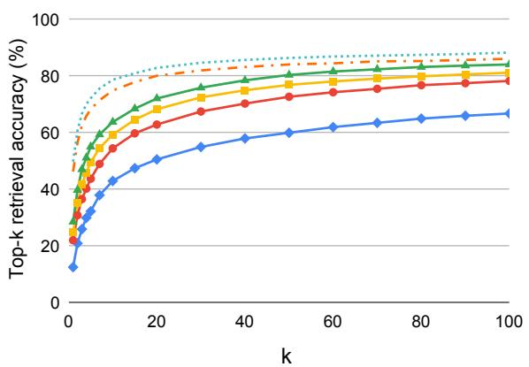
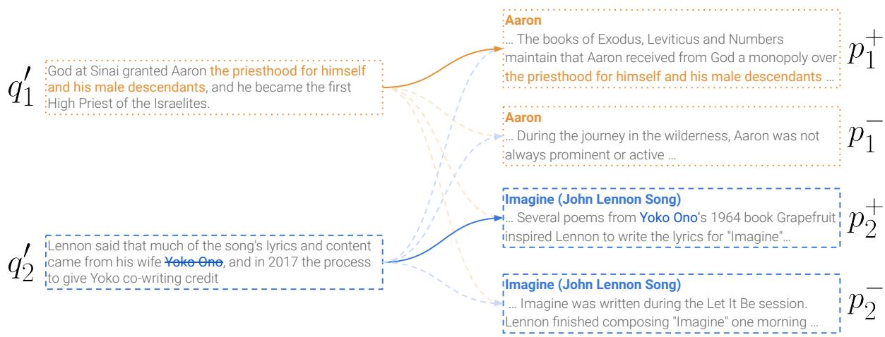

# Learning to Retrieve Passages without Supervision

Ori Ram Gal Shachaf Omer Levy Jonathan Berant Amir Globerson

Blavatnik School of Computer Science, Tel Aviv University ori.ram@cs.tau.ac.il

## Abstract

Dense retrievers for open-domain question answering (ODQA) have been shown to achieve impressive performance by training on large datasets of question-passage pairs. In this work we ask whether this dependence on labeled data can be reduced via unsupervised pretraining that is geared towards ODQA. We show this is in fact possible, via a novel pretraining scheme designed for retrieval. Our “recurring span retrieval” approach uses recurring spans across passages in a document to create pseudo examples for contrastive learning. Our pretraining scheme directly controls for term overlap across pseudo queries and relevant passages, thus allowing to model both lexical and semantic relations between them. The resulting model, named Spider, performs surprisingly well without any labeled training examples on a wide range of ODQA datasets. Specifically, it significantly outperforms all other pretrained baselines in a zero-shot setting, and is competitive with BM25, a strong sparse baseline. Moreover, a hybrid retriever over Spider and BM25 improves over both, and is often competitive with DPR models, which are trained on tens of thousands of examples. Last, notable gains are observed when using Spider as an initialization for supervised training.1

## 1 Introduction

State-of-the-art models for retrieval in open domain question answering are based on learning dense text representations (Lee et al., 2019; Karpukhin et al., 2020; Qu et al., 2021). However, such models rely on large datasets of question-passage pairs for training. These datasets are expensive and sometimes even impractical to collect (e.g., for new languages or domains), and models trained on them often fail

ICT BM25 Spider (Ours) Spider (Ours) + BM25 DPR DPR + BM25

  
Figure 1: Top-k retrieval accuracy of various unsupervised methods (solid lines) on the test set of Natural Questions (NQ). DPR (dotted) is supervised (trained on NQ) and given for reference.

to generalize to new question distributions (Sciavolino et al., 2021; Reddy et al., 2021).

The above difficulty motivates the development of retrieval models that do not rely on large annotated training sets, but are instead trained only on unlabeled text. Indeed, self-supervision for retrieval has gained considerable attention recently (Lee et al., 2019; Guu et al., 2020; Sachan et al., 2021a; Fan et al., 2021). However, when applied in a “zero-shot” manner, such models are still outperformed by sparse retrievers like BM25 (Robertson and Zaragoza, 2009) and by supervised models (see Sachan et al. 2021a). Moreover, models like REALM (Guu et al., 2020) and MSS (Sachan et al., 2021a,b) that train a retriever and a reader jointly (i.e. in an end-to-end fashion), treating retrieval as a latent variable, outperform contrastive models like ICT (Lee et al., 2019), but are much more computationally-intensive.

In this work we introduce Spider (Span-based unsupervised dense retriever), a dense model pretrained in a contrastive fashion from selfsupervision only (Bhattacharjee et al., 2022), which achieves retrieval accuracy that significantly improves over unsupervised methods (both contrastive and end-to-end), and is much cheaper to train compared to end-to-end models.

  
Figure 2: An example of our pretraining approach: Given a document  (e.g. the article “Aaron” in Wikipedia), we take two passages that contain a recurring span $S .$ One of them is transformed into a short query (left) $q ^ { \bar { \prime } }$ using a random window surrounding S, in which S is either kept (top) or removed (bottom). The second passage is then considered the target for retrieval $p ^ { + }$ , while a random passage from that does not contain S is considered the negative $p ^ { - }$ (right). Each batch is comprised of multiple such examples, and the pretraining task is to select the passage $p _ { i } ^ { + }$ for each query $q _ { i } ^ { \prime }$ (solid line) from the passages of all examples (in-batch negatives; dashed lines).

Spider is based on a novel self-supervised scheme: recurring span retrieval. We leverage recurring spans in different passages of the same document (e.g. “Yoko Ono” in Figure 2) to create pseudo examples for self-supervised contrastive learning, where one of the passages containing the span is transformed into a short query that (distantly) resembles a natural question, and the other is the target for retrieval. Additionally, we randomly choose whether to keep or remove the recurring span from the query to explicitly model cases where there is substantial overlap between a question and its target passage, as well as cases where such overlap is small.

We evaluate Spider on several ODQA benchmarks. Spider narrows the gap between unsupervised dense retrievers and DPR on all benchmarks (Figure 1, Table 1), outperforming all contrastive and end-to-end unsupervised models in top-5 & top-20 accuracy consistently across datasets. Furthermore, we demonstrate that Spider and BM25 are complementary, and that applying their simple combination (Ma et al., 2021) improves retrieval accuracy over both, sometimes outperforming a supervised DPR model.

We further demonstrate the utility of Spider as an off-the-shelf retriever via cross-dataset evaluation (i.e., when supervised models are tested against datasets which they were not trained on), a setting that often challenges dense retrievers (Sciavolino et al., 2021; Reddy et al., 2021). In this setting, Spider is competitive with supervised dense retrievers trained on an abundance of training examples.

Last, Spider significantly outperforms other pretrained models when used as an initialization towards DPR training, and also shows strong crossdataset generalization. For example, Spider finetuned on TriviaQA is, to the best of our knowledge, the first dense model to outperform BM25 on the challenging EntityQuestions dataset (Sciavolino et al., 2021).

Taken together, our results demonstrate the potential of pretraining for reducing the reliance of ODQA models on training data.

## 2 Background

In open-domain question answering (ODQA), the goal is to find the answer to a given question over a large corpus, e.g. Wikipedia (Voorhees and Tice, 2000; Chen et al., 2017; Chen and Yih, 2020). This task has gained considerable attention following recent advancement in machine reading comprehension, where models reached human parity in extracting an answer from a paragraph given a question (Devlin et al., 2019; Raffel et al., 2020).

Due to the high cost of applying such reading comprehension models, or readers, over the entire corpus, state-of-the-art systems for ODQA first apply an efficient retriever – either sparse (Robertson and Zaragoza, 2009; Chen et al., 2017) or dense (Lee et al., 2019; Karpukhin et al., 2020) – in order to reduce the search space of the reader.

Recently, dense retrieval models have shown promising results on ODQA, even outperforming strong sparse methods that operate on the lexical-level, e.g. BM25. Specifically, the dominant approach employs a dual-encoder architecture, where documents and questions are mapped to a shared continuous space such that proximity in that space represents the relevance between pairs of documents and questions. Formally, let $\mathcal { C } = \{ p _ { 1 } , . . . , p _ { m } \}$ be a corpus of passages. Each passage $p \in { \mathcal { C } }$ is fed to a passage encoder $E _ { P }$ such that $E _ { P } ( p ) \in \mathbb { R } ^ { d }$ . Similarly, the question encoder $E _ { Q }$ is defined such that the representation of a question $q$ is given by $E _ { Q } ( q ) \in \mathbb { R } ^ { d }$ . Then, the relevance of a passage $p$ for q is given by:

$$
\begin{array} { r } { s ( q , p ) = E _ { Q } ( q ) ^ { \top } E _ { P } ( p ) . } \end{array}
$$

Given a question $q ,$ the retriever finds the top-k candidates with respect to $s ( q , \cdot )$ , i.e. $\mathrm { t o p } { - } k _ { p \in \mathcal { C } } \ s ( q , p )$ . In order to perform this operation efficiently at test time, a maximum-inner product search (MIPS) index (Johnson et al., 2021) is built over the encoded passages $\{ E _ { P } ( p _ { 1 } ) , . . . , E _ { P } ( p _ { m } ) \}$

While considerable work has been devoted to create pretraining schemes for dense retrieval (Lee et al. 2019; Guu et al. 2020; inter alia), it generally assumed access to large training datasets after pretraining. In contrast, we seek to improve dense retrieval in the challenging unsupervised setting.

Our contribution towards this goal is twofold. First, we construct a self-supervised pretraining method based on recurring spans across passages in a document to emulate the training process of dual-encoders for dense retrieval. Our pretraining is simpler and cheaper in terms of compute than end-to-end models like REALM (Guu et al., 2020) and MSS (Sachan et al., 2021a). Second, we demonstrate that a simple combination of BM25 with our models leads to a strong hybrid retriever that rivals the performance of models trained with tens of thousands of examples.

## 3 Our Model: Spider

We now describe our approach for pretraining dense retrievers, which is based on a new selfsupervised task (Section 3.1). Our pretraining is based on the notion of recurring spans (Ram et al., 2021) within a document: given two paragraphs with the same recurring span, we construct a query from one of the paragraphs, while the other is taken as the target for retrieval (Figure 2). Other paragraphs in the document that do not contain the recurring span are used as negative examples. We train a model from this self-supervision in a contrastive fashion.

Since sparse lexical methods are known to complement dense retrieval (Luan et al., 2021; Ma et al., 2021), we also incorporate a simple hybrid retriever (combining BM25 and Spider) in our experiments (Section 3.2).

## 3.1 Pretraining: Recurring Span Retrieval

Given a document $\mathcal { D } \subset \mathcal { C }$ with multiple passages (e.g. an article in Wikipedia), we define crosspassage recurring spans in $\mathcal { D }$ as arbitrary n-grams that appear more than once and in more than one passage in $\mathcal { D }$ . Let $S$ be a cross-passage recurring span in ${ \mathcal { D } } ,$ and $\mathcal { D } _ { S } \subset \mathcal { D }$ be the set of passages in the document that contain $S ,$ , so $| \mathcal { D } _ { S } | > 1$ by definition. First, we randomly choose a query passage $q \in \mathcal { D } _ { S }$ In order to resemble a natural language question, we apply a heuristic query transformation $T$ , which takes a short random window from $q$ surrounding $S$ to get $q ^ { \prime } = T ( q )$ (described in detail below).

Similar to DPR, each query has one corresponding positive passage $p ^ { + }$ and one corresponding negative passage p−. For $p ^ { + }$ , we sample another random passage from $\mathcal { D }$ that contains $S$ (i.e. $p ^ { + } \in \mathcal { D } _ { S } \backslash \{ q \} )$ . For $p$ −, we choose a passage from that does not contain S (i.e. $p ^ { - } \in \mathcal { D } \setminus \mathcal { D } _ { S } )$ . The article title is prepended to both passages (bot not to the query).

Figure 2 illustrates this process. We focus on the first example (in orange), which is comprised of three passages from the Wikipedia article “Aaron”. The span “the priesthoodfor himselfand his male descendants” appears in two passages in the article. One of the passages was transformed into a query (denoted by $q _ { 1 } ^ { \prime } )$ ), while the other $( p _ { 1 } ^ { + } )$ is taken as a positive passage. Another random passage from the article $( p _ { 1 } ^ { - } )$ is considered its negative.

As the example demonstrates, existence of recurring spans in two different passages often implies semantic similarity between their contexts.

Query Transformation As discussed above, after we randomly choose a query passage q (with a recurring span S), we apply a query transformation on $q .$ The main goal is to make the queries more “similar” to open-domain questions (e.g. in terms of lengths).

First, we define the context to keep from q. Since passages are much longer than typical natural questions,2 we take a random window containing S. The window length \` is chosen uniformly between 5 and 30 to resemble questions of different lengths. The actual window is then chosen at random from all possible windows of length \` that contain S.

Second, we randomly choose whether to keep S in $q ^ { \prime }$ or remove it. This choice reflects two complementary skills for retrieval – the former requires lexical matching (as S appears in both $q ^ { \prime }$ and $p ^ { + } )$ while the latter intuitively encourages semantic contextual representations.

The queries in Figure 2 (left) demonstrate this process. In the top query, the recurring span “the priesthood for himself and his male descendants” was kept as is. In the bottom query, the span “Yoko $o n o '$ was removed.

Span Filtering To focus on meaningful spans with semantically similar contexts, we apply several filters on recurring spans. First, we adopt the filters from Ram et al. (2021): (1) spans only include whole words, (2) only maximal spans are considered, (3) spans that contain only stop words are filtered out, (4) spans contain up to 10 tokens. In addition, we add another filter: (5) spans should contain at least 2 tokens. Note that in contrast to methods based on salient spans (Glass et al., 2020; Guu et al., 2020; Roberts et al., 2020; Sachan et al., $^ { 2 0 2 1 \mathrm { a } , \mathrm { b } ) }$ , our filters do not require a trained model.

Training At each time step of pretraining, we take a batch of m examples $\{ ( q _ { i } ^ { \prime } , p _ { i } ^ { + } , p _ { i } ^ { - } ) \} _ { i = 1 } ^ { m }$ , and optimize the cross-entropy loss with respect to the positive passage $p _ { i } ^ { + }$ for each query $q _ { i } ^ { \prime }$ in a contrastive fashion (i.e., with in-batch negatives), similar to Karpukhin et al. (2020):

$$
- \log \frac { \exp \left( s ( q _ { i } ^ { \prime } , p _ { i } ^ { + } ) \right) } { \sum _ { j = 1 } ^ { m } \left( \exp \left( s ( q _ { i } ^ { \prime } , p _ { j } ^ { + } ) \right) + \exp \left( s ( q _ { i } ^ { \prime } , p _ { j } ^ { - } ) \right) \right) }
$$

## 3.2 Hybrid Dense-Sparse Retrieval

It is well established that the strong lexical matching skills of sparse models such as BM25 (Robertson and Zaragoza, 2009) are complementary to dense representation models. Ma et al. (2021) demonstrated strong improvements by using hybrid dense-sparse retrieval, based on BM25 and DPR. Specifically, they define the joint score of a hybrid retriever via a linear combination of the scores given by the two models, i.e. $s _ { \mathrm { h y b r i d } } ( q , p ) =$ $s ( q , p ) + \alpha \cdot \mathbf { B } \mathbf { M } 2 5 ( q , p )$ . They tune α on a validation set of each of the datasets. A similar approach was considered by Luan et al. (2021). Since tuning hyperparameters is unrealistic in our settings, we simply set $\alpha = 1 . 0$ for all hybrid models. Thus, we define:

$$
s _ { \mathrm { h y b r i d } } ( q , p ) = s ( q , p ) + \mathbf { B } \mathbf { M } 2 5 ( q , p )
$$

We adopt the normalization technique from Ma et al. (2021). We begin by fetching the $\mathrm { t o p } { - } k ^ { \prime }$ (where $k ^ { \prime } > k )$ passages from each of the models. If a passage p is found in the top-k0 of a dense retriever but not of BM25, then $\mathbf { B M } 2 5 ( q , p )$ is set to the minimum value from the $\mathrm { t o p } { - } k ^ { \prime }$ results of BM25 (and vice versa).

## 4 Experimental Setup

To evaluate how different retrievers work on different settings and given different amounts of supervision, we simulate various scenarios by using existing datasets, with an emphasis on the unsupervised setting.

## 4.1 Datasets

We evaluate our method on six datasets commonly used in prior work, all over Wikipedia: Natural Questions $\mathrm { ( N Q ; }$ Kwiatkowski et al. 2019), TriviaQA (Joshi et al., 2017), WebQuestions (WQ; Berant et al. 2013), CuratedTREC (TREC; Baudiš and Šedivý 2015), SQuAD (Rajpurkar et al., 2016) and EntityQuestions (EntityQs; Sciavolino et al. 2021). The datasets vary significantly in the distribution of questions and the size of training data.

Lewis et al. (2021a) showed that there exists a significant overlap between train and test questions in ODQA datasets, which poses an issue in our case: supervised models can memorize training questions while unsupervised methods cannot. Thus, we also report the results on the “no answer overlap” portion of the test sets created by Lewis et al. (2021a) for NQ, TriviaQA and WQ.

## 4.2 Baselines

We consider a variety of baselines, including supervised and self-supervised dense models, as well as sparse methods. All dense models share the architecture of BERT-base (namely a transformer encoder; Vaswani et al. 2017), including the number of parameters (110M) and uncased vocabulary. In addition, all pretrained dense models use weight sharing between query and passage encoders (only during pretraining). $E _ { Q } ( q )$ and $E _ { P } ( p )$ are defined as the representation of the [CLS] token. Similar to Gao and Callan (2021a), we do not consider the models trained in Chang et al. (2020), as they rely on Wikipedia links, and were not made public.

We now list our baselines (see App. A for further details). As a sparse baseline model, we follow prior work and take BM25 (Robertson and Zaragoza, 2009). We consider several unsupervised dense retrieval models: ICT (Lee et al., 2019; Sachan et al., 2021a), Condenser and CoCondenser (Gao and Callan, 2021a,b). We also compare our approach with an unsupervised model trained in an end-to-end fashion (i.e. jointly with a reader): Masked Salient Spans (MSS; Sachan et al. 2021a,b). In addition, we add the results of the unsupervised Contriever model (Izacard et al., 2021), a contemporary work. Last, we add results of DPR (Karpukhin et al., 2020), a supervised model, for reference.

## 4.3 Evaluation Settings

We evaluate our method and baselines in a broad range of scenarios. We report top-k retrieval accuracy, i.e. the percentage of questions for which the answer span is found in the top-k passages.

Unsupervised Setting Models are trained only on unlabeled data, and evaluated on all datasets without using any labeled examples (i.e. in a zeroshot mode). As a reference point, we also compare to DPR, which is supervised.

Cross-Dataset Generalization To test the robustness of different models across datasets, we compare Spider to DPR models tested on datasets they were not trained on.3 The motivation behind these experiments is to determine the quality of all models as “off-the-shelf” retrievers, namely on data from unseen distributions of questions.

Supervised Setting We compare Spider to other pretrained models for retrieval when fine-tuned on different amounts of training examples, similar to Karpukhin et al. (2020). Specifically, we consider the settings where 128 examples, 1024 examples and full datasets are available. We restrict these experiments to NQ and TriviaQA due to the high cost of running them for all datasets and baselines.

## 4.4 Implementation Details

We base our implementation on the official code of DPR (Karpukhin et al., 2020), which is built on Hugging Face Transformers (Wolf et al., 2020).

Passage Corpus We adopt the same corpus and preprocessing as Karpukhin et al. (2020), namely the English Wikipedia dump from Dec. 20, 2018 (following Lee et al. 2019) with blocks of 100 words as retrieval units. Preprocessing (Chen et al., 2017) removes semi-structured data (e.g., lists, infoboxes, tables, and disambiguation pages), resulting in roughly 21 million passages. This corpus is used for both pretraining and all downstream experiments.

Pretraining We train Spider for 200,000 steps, using batches of size 1024. similar to ICT and Condenser, the model is initialized from the uncased BERT-base model, and weight sharing between the passage and query encoders is applied. Each pseudo-query has one corresponding positive example and one negative example.4 Overall, the model is expected to predict the positive passage out of a total of 2048 passages.5 The learning rate is warmed up along the first 1% of the training steps to a maximum value of $2 \cdot 1 0 ^ { - 5 }$ , after which linear decay is applied. We use Adam (Kingma and Ba, 2015) with its default hyperparameters as our optimizer, and apply a dropout rate of 0.1 to all layers. We utilize eight 80GB A100 GPUs for pretraining, which takes roughly two days. In our ablation study (see Section 5.4), we lower the learning rate to 10−5 and the batch size to 512 in order to fit in eight Quadro RTX 8000 GPUs.6 Each ablation takes two days.

Fine-Tuning For fine-tuning, we use the hyperparameters from Karpukhin et al. (2020), and do not perform any hyperparameter tuning. Specifically, we train using Adam (Kingma and Ba, 2015) with bias-corrected moment estimates (Zhang et al., 2021), and a learning rate of $1 0 ^ { - 5 }$ with warmup and linear decay. We use batch size of 128 for 40 epochs with two exceptions. First, when finetuning DPR-WQ and DPR-TREC, we run for 100 epochs for consistency with the original paper. Second, when fine-tuning on 128 examples only, we lower the batch size to 32 and run for 80 epochs.7 We use BM25 negatives produced by Karpukhin et al. (2020), and do not create hard negatives by the model itself (Xiong et al., 2021).

<table><tr><td rowspan="2">Model</td><td colspan="3">NQ</td><td colspan="3">TriviaQA</td><td colspan="3">WQ</td></tr><tr><td>Top-5</td><td>Top-20</td><td>Top-100</td><td>Top-5</td><td>Top-20</td><td>Top-100</td><td>Top-5</td><td>Top-20</td><td>Top-100</td></tr><tr><td colspan="10">Supervised Models</td></tr><tr><td>DPR-Single</td><td>68.3</td><td>80.1</td><td>86.1</td><td>71.2</td><td>79.7</td><td>85.1</td><td>62.8</td><td>74.3</td><td>82.2</td></tr><tr><td>DPR-Multi</td><td>67.1</td><td>79.5</td><td>86.1</td><td>69.8</td><td>78.9</td><td>84.8</td><td>64.0</td><td>75.1</td><td>83.0</td></tr><tr><td>DPR-Single + BM25</td><td>72.2</td><td>82.9</td><td>88.3</td><td>75.4</td><td>82.4</td><td>86.5</td><td>64.4</td><td>75.1</td><td>83.1</td></tr><tr><td>DPR-Mutli + BM25</td><td>71.9</td><td>82.6</td><td>88.2</td><td>76.1</td><td>82.6</td><td>86.5</td><td>67.3</td><td>77.2</td><td>84.5</td></tr><tr><td colspan="10">Unsupervised Models</td></tr><tr><td>BM25</td><td>43.8</td><td>62.9</td><td>78.3</td><td>66.3</td><td>76.4</td><td>83.2</td><td>41.8</td><td>62.4</td><td>75.5</td></tr><tr><td>ICT*</td><td>32.3</td><td>50.6</td><td>66.8</td><td>40.2</td><td>57.5</td><td>73.6</td><td>25.2</td><td>43.4</td><td>65.7</td></tr><tr><td>Condenser</td><td>13.0</td><td>25.5</td><td>43.4</td><td>4.5</td><td>9.6</td><td>18.5</td><td>20.3</td><td>35.8</td><td>51.9</td></tr><tr><td>CoCondenser</td><td>28.9</td><td>46.8</td><td>63.5</td><td>7.5</td><td>13.8</td><td>24.3</td><td>30.2</td><td>50.7</td><td>68.7</td></tr><tr><td>MSS*</td><td>41.7</td><td>59.8</td><td>74.9</td><td>53.3</td><td>68.2</td><td>79.4</td><td>29.0</td><td>49.2</td><td>68.4</td></tr><tr><td>Contriever**</td><td>47.2</td><td>67.2</td><td>81.3</td><td>59.5</td><td>74.2</td><td>83.2</td><td></td><td></td><td></td></tr><tr><td>Spider</td><td>49.6</td><td>68.3</td><td>81.2</td><td>63.6</td><td>75.8</td><td>83.5</td><td>46.8</td><td>65.9</td><td>79.7</td></tr><tr><td>Spider + BM25</td><td>55.1</td><td>72.1</td><td>84.1</td><td>71.7</td><td>80.0</td><td>85.5</td><td>51.0</td><td>69.1</td><td>81.1</td></tr></table>

Table 1: Top-k retrieval accuracy (i.e., the percentage of questions for which the answer is present in the top-k passages) on the test sets of three datasets for supervised and unsupervised approaches. DPR-Single is trained on the corresponding dataset only. We mark in bold the best unsupervised method for each dataset. Further results are given in Tables 5&6. ∗Results reported in Sachan et al. (2021a,b); ∗∗Results reported in Izacard et al. (2021).

Retrieval When performing dense retrieval, we apply exact search using FAISS (Johnson et al., 2021). This is done due to the high memory demand of creating an HNSW index for each experiment (Karpukhin et al., 2020). For sparse retrieval (i.e. BM25), we utilize the Pyserini library (Lin et al., 2021), built on top of Anserini (Yang et al., 2017, 2018). For hybrid retrieval, we set $k ^ { \prime } = 1 0 0 0$ similar to Ma et al. (2021).

## 5 Results

Our experiments show that Spider significantly improves performance in the challenging unsupervised retrieval setting, even outperforming strong supervised models in many cases. Thus, it enables the use of such retrievers when no examples are available. When used for supervised DPR training, we observe significant improvements over the baselines as well. We perform ablation studies that demonstrate the importance of our pretraining design choices.

## 5.1 Unsupervised Setting

Table 1 shows the performance of Spider (measured by top-k retrieval accuracy) compared to other unsupervised baselines on three datasets, without additional fine-tuning. Results for remaining datasets are given in Table 5 and Table 6. Supervised baselines (i.e. DPR) are given for reference. Results demonstrate the effectiveness of Spider w.r.t. other dense pretrained models, across all datasets. For example, the average margin between Spider and ICT is more than 15 points. Moreover, Spider outperforms DPR-Single on three of the datasets (TREC, SQuAD and EntityQs). When DPR is better than our model, the gap narrows for higher values of k. In addition, it is evident that Spider is able to outperform BM25 in some datasets (NQ, WQ and TREC), while the opposite is true for others (TriviaQA, SQuAD and EntityQuestions). However, our hybrid retriever is able to combine the merits of each of them into a stronger model, significantly improving over both across all datasets. For example, on TriviaQA, Spider and BM25 achieve 75.8% and 76.4% top-20 retrieval accuracy, respectively. The hybrid model significantly improves over both models and obtains 80.0%, better than DPR-Single and DPR-Multi (79.7% and 78.9%, respectively).

<table><tr><td>Model</td><td># Examples</td><td>NQ</td><td>TriviaQA</td><td>WQ</td><td>TREC</td><td>SQuAD</td><td>EntityQs</td></tr><tr><td>DPR-NQ</td><td>58,880</td><td></td><td>69.0</td><td>68.8</td><td>85.9</td><td>48.9</td><td>49.7</td></tr><tr><td>DPR-TriviaQA</td><td>60,413</td><td>67.5</td><td></td><td>71.4</td><td>87.9</td><td>55.8</td><td>62.7</td></tr><tr><td>DPR-WQ</td><td>2,474</td><td>59.4</td><td>66.7</td><td></td><td>82.0</td><td>52.3</td><td>58.3</td></tr><tr><td>DPR-TREC</td><td>1,125</td><td>57.9</td><td>64.0</td><td>61.7</td><td></td><td>49.4</td><td>46.9</td></tr><tr><td>DPR-SQuAD</td><td>70,096</td><td>47.0</td><td>60.0</td><td>56.0</td><td>77.2</td><td></td><td>30.9</td></tr><tr><td>DPR-Multi</td><td>122,892</td><td></td><td></td><td></td><td></td><td>52.0</td><td>56.7</td></tr><tr><td>BM25</td><td>None</td><td>62.9</td><td>76.4</td><td>62.4</td><td>81.1</td><td>71.2</td><td>71.4</td></tr><tr><td>ICT</td><td>None</td><td>50.6</td><td>57.5</td><td>43.4</td><td></td><td>45.1</td><td></td></tr><tr><td>Spider</td><td>None</td><td>68.3</td><td>75.8</td><td>65.9</td><td>82.6</td><td>61.0</td><td>66.3</td></tr><tr><td>Spider-NQ</td><td>58,880</td><td></td><td>77.2</td><td>74.2</td><td>89.9</td><td>57.7</td><td>61.9</td></tr><tr><td>Spider-TriviaQA</td><td>60,413</td><td>75.5</td><td></td><td>73.7</td><td>91.2</td><td>68.1</td><td>72.9</td></tr></table>

Table 2: Top-20 retrieval accuracy in a cross-dataset “zero-shot” setting, where models are evaluated against datasets not seen during their training. DPR-x and Spider-x are models trained on the full dataset x, initialized from BERT and Spider, respectively. DPR-Multi was trained on NQ, TriviaQA, WQ and TREC. # Examples is the number of labeled examples used to train the model. Top-100 retrieval accuracy results are given in Table 7.

Moreover, we observe that Spider consistently surpasses Contriever, with substantial gains for lower values of k.

## 5.2 Cross-Dataset Generalization

An important merit of Spider is the fact that a single model can obtain good results across many datasets, i.e. in a “zero-shot” setting. Table 2 demonstrates the results of supervised models in these scenarios, where DPR models are tested on datasets they were not trained on. Spider outperforms four of the six DPR models (DPR-WQ, DPR-TREC, DPR-SQuAD and DPR-Multi) across all datasets. In addition, it significantly outperforms DPR-NQ, which is a widely-used retriever,8 on three datasets out of five. Finally, DPR-TriviaQA outperforms Spider on three datasets.

When fine-tuning Spider on NQ and TriviaQA (see Sections 4.3;5.3), the resulting models show strong generalization to other datasets. For example, Spider-NQ outperforms DPR-NQ (initialized from BERT) by 4-12 points. Similar trends are observed for the models trained on TriviaQA. Specifically, Spider-TriviaQA is able to outperform BM25 on EntityQuestions, that is known to challenge dense retrievers (Sciavolino et al., 2021).

## 5.3 Supervised Setting

Table 3 shows the performance when fine-tuning pretrained models on 128 examples, 1024 examples and full datasets from NQ and TriviaQA. Spider establishes notable gains compared to all other dense baselines on both datasets and for all training data sizes. When only 128 examples are available, Spider significantly outperforms all other models, with absolute gaps of 3-11% on both datasets. On TriviaQA, Spider fine-tuned on 128 examples is able to outperform all other baselines when they are trained on 1024 examples. Similar trends are observed for the 1024-example setting (absolute gaps of 1.7-6.2%).

Even though Spider was mainly designed for unsupervised settings, it outperforms other pretrained models in the full dataset as well. On both datasets, Spider obtains the best results, improving over DPR models (initialized from BERT) by 1.9-6.5%.

## 5.4 Ablation Study

We perform an ablation study on the query transformation applied on the query passage q. We then test the contribution of the negative passage p− to the performance of our model. Last, we scale up both the batch size and the number of pretraining steps.

Choice of Query Transformation During pretraining, we apply a query transformation on the query q. We sample a random window containing the recurring span S and either remove or keep S. We now test the effect of these choices on our model. We consider two more options for the context taken from q: (1) the whole passage, for which we replace S with a [MASK] token (as the context is very long, it makes sense to provide the retriever with a signal on what span is sought in the answer), and (2) a prefix of random length preceding S, for which we always remove S from the context (as it is in any case, by definition, in the end of q0). The top two rows in Table 4 correspond to these ablations. Indeed, both are inferior to taking a random window surrounding S (one before the last row).

<table><tr><td rowspan="2">Model</td><td colspan="4">NQ</td><td colspan="4">TriviaQA</td></tr><tr><td>Top-1</td><td>Top-5</td><td>Top-20</td><td>Top-100</td><td>Top-1</td><td>Top-5</td><td>Top-20</td><td>Top-100</td></tr><tr><td>BM25</td><td>22.1</td><td>43.8</td><td>62.9</td><td>78.3</td><td>46.3</td><td>66.3</td><td>76.4</td><td>83.2</td></tr><tr><td></td><td colspan="8">128 examples</td></tr><tr><td>BERT</td><td>12.7</td><td>27.3</td><td>43.5</td><td>60.6</td><td>16.7</td><td>33.4</td><td>49.4</td><td>65.4</td></tr><tr><td>ICT</td><td>22.8</td><td>45.5</td><td>64.1</td><td>78.3</td><td>32.7</td><td>54.5</td><td>68.9</td><td>79.5</td></tr><tr><td>Condenser</td><td>17.6</td><td>36.8</td><td>52.7</td><td>68.6</td><td>26.1</td><td>45.9</td><td>60.2</td><td>73.7</td></tr><tr><td>CoCondenser</td><td>23.2</td><td>47.9</td><td>65.2</td><td>79.2</td><td>36.3</td><td>60.1</td><td>72.8</td><td>81.6</td></tr><tr><td>Spider</td><td>31.7</td><td>57.7</td><td>74.3</td><td>84.6</td><td>47.5</td><td>68.5</td><td>78.5</td><td>85.1</td></tr><tr><td></td><td colspan="8">1024 examples</td></tr><tr><td>BERT</td><td>26.6</td><td>49.6</td><td>65.3</td><td>78.1</td><td>32.6</td><td>52.7</td><td>66.1</td><td>77.9</td></tr><tr><td>ICT</td><td>30.4</td><td>55.8</td><td>72.4</td><td>83.4</td><td>38.8</td><td>60.0</td><td>72.8</td><td>82.3</td></tr><tr><td>Condenser</td><td>30.8</td><td>55.1</td><td>71.7</td><td>82.2</td><td>40.7</td><td>61.1</td><td>72.4</td><td>81.2</td></tr><tr><td>CoCondenser</td><td>32.7</td><td>60.1</td><td>75.6</td><td>84.8</td><td>43.3</td><td>65.4</td><td>76.2</td><td>83.6</td></tr><tr><td>Spider</td><td>37.0</td><td>63.0</td><td>77.9</td><td>86.5</td><td>49.5</td><td>69.5</td><td>79.3</td><td>85.5</td></tr><tr><td></td><td colspan="8">Full Dataset</td></tr><tr><td>BERT</td><td>46.3</td><td>68.3</td><td>80.1</td><td>86.1</td><td>53.7</td><td>71.2</td><td>79.7</td><td>85.1</td></tr><tr><td>ICT</td><td>46.4</td><td>69.6</td><td>80.9</td><td>87.6</td><td>55.1</td><td>72.3</td><td>80.4</td><td>85.8</td></tr><tr><td>Condenser</td><td>47.0</td><td>70.1</td><td>81.4</td><td>87.0</td><td>57.4</td><td>73.4</td><td>81.1</td><td>86.1</td></tr><tr><td>CoCondenser</td><td>47.8</td><td>70.1</td><td>80.9</td><td>87.5</td><td>58.7</td><td>75.0</td><td>82.2</td><td>86.5</td></tr><tr><td>Spider</td><td>49.4</td><td>72.2</td><td>82.4</td><td>88.0</td><td>60.2</td><td>76.1</td><td>83.1</td><td>87.2</td></tr></table>

Table 3: Top-k retrieval accuracy of different pretrained models on the test sets of Natural Questions and TriviaQA, after fine-tuning on various sizes of training data: 128 examples, 1024 examples and the full datasets. All models are fine-tuned using the data produced by Karpukhin et al. (2020), i.e., BM25-based negative examples.

In addition, we test whether alternating between keeping and removing S is indeed better than applying only one of them consistently. The third, fourth and fifth rows of Table 4 verify that our motivation was indeed correct: Alternating between the two is superior to each of them on its own.

Effect of Negative Passages During pretraining, each query $q _ { i } ^ { \prime }$ has one positive passage $p _ { i } ^ { + }$ and one negative passage $p _ { i } ^ { - }$ . We pretrain a model without negative passages at all, i.e. the target is to select the positive $p _ { i } ^ { + }$ , given the positive passages of all other examples $\{ p _ { j } ^ { + } \} _ { j = 1 } ^ { m }$ . This model corresponds to the row with # negatives = 0 (i.e. the sixth row in Table 4). As expected, the top-k retrieval accuracy of the model drops significantly (2-6% for different k values) with respect to the same model with # negatives = 1 as a result of this choice, which is consistent with Karpukhin et al. (2020).

Scaling up Batch Size and Training Steps We scale up the batch size and observe improvements of 0.6-1.2%. We train our model for longer (200K steps instead of 100K), which leads to additional 1.1-1.8% improvements (last two rows in Table 4).

## 6 Related Work

Pretraining for dense retrieval has recently gained considerable attention, following the success of self-supervised models in many tasks (Devlin et al., 2019; Liu et al., 2019; Brown et al., 2020). While most works focus on fine-tuning such retrievers on large datasets after pretraining (Lee et al., 2019; Chang et al., 2020; Guu et al., 2020; Sachan et al., 2021a; Gao and Callan, 2021a), we attempt to bridge the gap between unsupervised dense models and strong sparse (e.g. BM25; Robertson and Zaragoza 2009) or supervised dense baselines (e.g. DPR; Karpukhin et al. 2020). A concurrent work by Oguz et al.˘ (2021) presented DPR-PAQ, which shows strong results on NQ after pretraining. However, their approach utilizes PAQ (Lewis et al., 2021b), a dataset which was generated using models trained on NQ, and is therefore not unsupervised.

Leveraging recurring spans for self-supervised pretraining has previously been considered for numerous tasks, e.g. coreference resolution and coreferential reasoning (Kocijan et al., 2019; Varkel and Globerson, 2020; Ye et al., 2020) and question answering (Ram et al., 2021; Bian et al., 2021; Castel et al., 2021). Glass et al. (2020) utilize recurring spans across documents to create pseudo-examples

<table><tr><td colspan="2">Query Transformation</td><td rowspan="2">#Negs</td><td rowspan="2">Batch Size</td><td rowspan="2"></td><td colspan="4">NQ (Dev Set)</td></tr><tr><td>Context</td><td>Recurring Span</td><td># Steps</td><td>Top-1</td><td>Top-5</td><td>Top-20 Top-100</td></tr><tr><td>Whole passage</td><td>Replace with a [MASK]</td><td>1</td><td>512</td><td>100,000</td><td>17.5</td><td>36.8</td><td>52.7</td><td>67.3</td></tr><tr><td>Prefix</td><td>Remove</td><td>1</td><td>512</td><td>100,000</td><td>18.9</td><td>39.7</td><td>58.0</td><td>72.4</td></tr><tr><td>Random window</td><td>Remove</td><td>1</td><td>512</td><td>100,000</td><td>18.6</td><td>39.2</td><td>56.8</td><td>71.7</td></tr><tr><td>Random window</td><td>Keep</td><td>1</td><td>512</td><td>100,000</td><td>20.3</td><td>42.0</td><td>61.1</td><td>75.9</td></tr><tr><td>Random window</td><td>Remove / Keep</td><td>1</td><td>512</td><td>100,000</td><td>21.5</td><td>44.5</td><td>62.3</td><td>76.2</td></tr><tr><td>Random window</td><td>Remove / Keep</td><td>0</td><td>512</td><td>100,000</td><td>16.3</td><td>38.8</td><td>58.1</td><td>74.1</td></tr><tr><td>Random window</td><td>Remove / Keep</td><td>1</td><td>1,024</td><td>100,000</td><td>22.1</td><td>45.4</td><td>63.5</td><td>77.0</td></tr><tr><td>Random window</td><td>Remove / Keep</td><td>1</td><td>1,024</td><td>200,000</td><td>23.4</td><td>46.5</td><td>65.3</td><td>78.2</td></tr></table>

Table 4: Ablation study on the development set of Natural Questions. The top rows of the table describe ablations on the query transformation: We first determine the context to take from the query passage, and then decide what operation will be applied on the recurring span. The bottom rows of the table study the contribution of the negative passage p− (# Negs = 0 stands for no negative examples), as well as scaling up the batch size (i.e. the number of queries at each batch) and the total number of training steps. The last row corresponds to our model Spider.

for QA.

While we focus in this work on dual-encoder architectures, other architectures for dense retrieval have been introduced recently. Luan et al. (2021) showed that replacing a single representation with multiple vectors per document enjoys favorable theoretical and empirical properties. Khattab and Zaharia (2020) introduced late-interaction models, where contextualized representations of query and document tokens are first computed, and a cheap interaction step that models their fine-grained relevance is then applied. Phrase-based retrieval (Seo et al., 2018, 2019) eliminates the need for a reader during inference, as it directly retrieves the answer span given a query. Lee et al. (2021a) demonstrated strong end-to-end ODQA results with this approach, and Lee et al. (2021b) showed that it is also effective for passage retrieval. Our pretraining scheme can be seamlessly used for those architectures as well.

## 7 Conclusion

In this work, we explore learning dense retrievers from unlabeled data. Our results demonstrate that existing models struggle in this setup. We introduce a new pretraining scheme for dual-encoders that dramatically improves performance, reaching good results without any labeled examples. Our results suggest that careful design of a pretraining task is important for learning unsupervised models that are effective retrievers for ODQA.

## Acknowledgements

We thank Yuval Kirstain and anonymous reviewers for valuable feedback and discussions, and Devendra Singh Sachan for his help with running the ICT and MSS baselines. This project was funded by the European Research Council (ERC) under the European Unions Horizon 2020 research and innovation programme (grant ERC HOLI 819080), the Blavatnik Fund, the Alon Scholarship, the Yandex Initiative for Machine Learning and Intel Corporation.

## References

Petr Baudiš and Jan Šedivý. 2015. Modeling of the question answering task in the YodaQA system. In Proceedings of the 6th International Conference on Experimental IR Meets Multilinguality, Multimodality, and Interaction - Volume 9283, CLEF’15, page 222–228, Berlin, Heidelberg. Springer-Verlag.

Jonathan Berant, Andrew Chou, Roy Frostig, and Percy Liang. 2013. Semantic parsing on Freebase from question-answer pairs. In Proceedings of the 2013 Conference on Empirical Methods in Natural Language Processing, pages 1533–1544, Seattle, Washington, USA. Association for Computational Linguistics.

Amrita Bhattacharjee, Mansooreh Karami, and Huan Liu. 2022. Text transformations in contrastive selfsupervised learning: A review.

Ning Bian, Xianpei Han, Bo Chen, Hongyu Lin, Ben He, and Le Sun. 2021. Bridging the gap between language model and reading comprehension: Unsupervised MRC via self-supervision.

Tom B. Brown, Benjamin Mann, Nick Ryder, Melanie Subbiah, Jared Kaplan, Prafulla Dhariwal, Arvind Neelakantan, Pranav Shyam, Girish Sastry, Amanda Askell, Sandhini Agarwal, Ariel Herbert-Voss, Gretchen Krueger, Tom Henighan, Rewon Child, Aditya Ramesh, Daniel M. Ziegler, Jeffrey Wu, Clemens Winter, Christopher Hesse, Mark Chen,

Eric Sigler, Mateusz Litwin, Scott Gray, Benjamin Chess, Jack Clark, Christopher Berner, Sam Mc-Candlish, Alec Radford, Ilya Sutskever, and Dario Amodei. 2020. Language models are few-shot learners. In Advances in Neural Information Processing Systems.

Or Castel, Ori Ram, Avia Efrat, and Omer Levy. 2021. How optimal is greedy decoding for extractive question answering?

Wei-Cheng Chang, Felix X. Yu, Yin-Wen Chang, Yiming Yang, and Sanjiv Kumar. 2020. Pre-training tasks for embedding-based large-scale retrieval. In 8th International Conference on Learning Representations, ICLR 2020.

Danqi Chen, Adam Fisch, Jason Weston, and Antoine Bordes. 2017. Reading Wikipedia to answer opendomain questions. In Proceedings of the 55th Annual Meeting of the Association for Computational Linguistics (Volume 1: Long Papers), pages 1870– 1879, Vancouver, Canada. Association for Computational Linguistics.

Danqi Chen and Wen-tau Yih. 2020. Open-domain question answering. In Proceedings of the 58th Annual Meeting of the Association for Computational Linguistics: Tutorial Abstracts, pages 34–37, Online. Association for Computational Linguistics.

Jacob Devlin, Ming-Wei Chang, Kenton Lee, and Kristina Toutanova. 2019. BERT: Pre-training of deep bidirectional transformers for language understanding. In Proceedings of the 2019 Conference of the North American Chapter of the Association for Computational Linguistics: Human Language Technologies, Volume 1 (Long and Short Papers), pages 4171–4186, Minneapolis, Minnesota. Association for Computational Linguistics.

Yixing Fan, Xiaohui Xie, Yinqiong Cai, Jia Chen, Xinyu Ma, Xiangsheng Li, Ruqing Zhang, and Jiafeng Guo. 2021. Pre-training methods in information retrieval.

Luyu Gao and Jamie Callan. 2021a. Condenser: a pretraining architecture for dense retrieval. In Proceedings of the 2021 Conference on Empirical Methods in Natural Language Processing, pages 981–993, Online and Punta Cana, Dominican Republic. Association for Computational Linguistics.

Luyu Gao and Jamie Callan. 2021b. Unsupervised corpus aware language model pre-training for dense passage retrieval.

Michael Glass, Alfio Gliozzo, Rishav Chakravarti, Anthony Ferritto, Lin Pan, G P Shrivatsa Bhargav, Dinesh Garg, and Avi Sil. 2020. Span selection pretraining for question answering. In Proceedings of the 58th Annual Meeting of the Association for Computational Linguistics, pages 2773–2782, Online. Association for Computational Linguistics.

Kelvin Guu, Kenton Lee, Zora Tung, Panupong Pasupat, and Mingwei Chang. 2020. Retrieval augmented language model pre-training. In Proceedings of the 37th International Conference on Machine Learning, volume 119 of Proceedings of Machine Learning Research, pages 3929–3938. PMLR.

Gautier Izacard, Mathilde Caron, Lucas Hosseini, Sebastian Riedel, Piotr Bojanowski, Armand Joulin, and Edouard Grave. 2021. Towards unsupervised dense information retrieval with contrastive learning.

Jeff Johnson, Matthijs Douze, and Hervé Jégou. 2021. Billion-scale similarity search with GPUs. IEEE Transactions on Big Data, 7(3):535–547.

Mandar Joshi, Eunsol Choi, Daniel Weld, and Luke Zettlemoyer. 2017. TriviaQA: A large scale distantly supervised challenge dataset for reading comprehension. In Proceedings ofthe 55th Annual Meeting ofthe Associationfor Computational Linguistics (Volume 1: Long Papers), pages 1601–1611, Vancouver, Canada. Association for Computational Linguistics.

Vladimir Karpukhin, Barlas Oguz, Sewon Min, Patrick Lewis, Ledell Wu, Sergey Edunov, Danqi Chen, and Wen-tau Yih. 2020. Dense passage retrieval for open-domain question answering. In Proceedings of the 2020 Conference on Empirical Methods in Natural Language Processing (EMNLP), pages 6769– 6781, Online. Association for Computational Linguistics.

Omar Khattab and Matei Zaharia. 2020. ColBERT: Efficient and effective passage search via contextualized late interaction over BERT. In Proceedings of the 43rd International ACM SIGIR Conference on Research and Development in Information Retrieval, SIGIR ’20, page 39–48, New York, NY, USA. Association for Computing Machinery.

Diederik P. Kingma and Jimmy Ba. 2015. Adam: A method for stochastic optimization. In International Conference on Learning Representations.

Vid Kocijan, Oana-Maria Camburu, Ana-Maria Cretu, Yordan Yordanov, Phil Blunsom, and Thomas Lukasiewicz. 2019. WikiCREM: A large unsupervised corpus for coreference resolution. In Proceedings of the 2019 Conference on Empirical Methods in Natural Language Processing and the 9th International Joint Conference on Natural Language Processing (EMNLP-IJCNLP), pages 4303–4312, Hong Kong, China. Association for Computational Linguistics.

Tom Kwiatkowski, Jennimaria Palomaki, Olivia Redfield, Michael Collins, Ankur Parikh, Chris Alberti, Danielle Epstein, Illia Polosukhin, Jacob Devlin, Kenton Lee, Kristina Toutanova, Llion Jones, Matthew Kelcey, Ming-Wei Chang, Andrew M. Dai, Jakob Uszkoreit, Quoc Le, and Slav Petrov. 2019.

Natural questions: A benchmark for question answering research. Transactions of the Association for Computational Linguistics, 7:452–466.

Jinhyuk Lee, Mujeen Sung, Jaewoo Kang, and Danqi Chen. 2021a. Learning dense representations of phrases at scale. In Proceedings of the 59th Annual Meeting of the Association for Computational Linguistics and the 11th International Joint Conference on Natural Language Processing (Volume 1: Long Papers), pages 6634–6647, Online. Association for Computational Linguistics.

Jinhyuk Lee, Alexander Wettig, and Danqi Chen. 2021b. Phrase retrieval learns passage retrieval, too. In Proceedings of the 2021 Conference on Empirical Methods in Natural Language Processing, pages 3661–3672, Online and Punta Cana, Dominican Republic. Association for Computational Linguistics.

Kenton Lee, Ming-Wei Chang, and Kristina Toutanova. 2019. Latent retrieval for weakly supervised open domain question answering. In Proceedings of the 57th Annual Meeting of the Association for Computational Linguistics, pages 6086–6096, Florence, Italy. Association for Computational Linguistics.

Patrick Lewis, Pontus Stenetorp, and Sebastian Riedel. 2021a. Question and answer test-train overlap in open-domain question answering datasets. In Proceedings of the 16th Conference of the European Chapter of the Association for Computational Linguistics: Main Volume, pages 1000–1008, Online. Association for Computational Linguistics.

Patrick Lewis, Yuxiang Wu, Linqing Liu, Pasquale Minervini, Heinrich Küttler, Aleksandra Piktus, Pontus Stenetorp, and Sebastian Riedel. 2021b. PAQ: 65 million probably-asked questions and what you can do with them. Transactions of the Association for Computational Linguistics, 9(0):1098–1115.

Jimmy Lin, Xueguang Ma, Sheng-Chieh Lin, Jheng-Hong Yang, Ronak Pradeep, and Rodrigo Nogueira. 2021. Pyserini: An easy-to-use python toolkit to support replicable IR research with sparse and dense representations.

Yinhan Liu, Myle Ott, Naman Goyal, Jingfei Du, Mandar Joshi, Danqi Chen, Omer Levy, Mike Lewis, Luke Zettlemoyer, and Veselin Stoyanov. 2019. RoBERTa: A robustly optimized bert pretraining approach.

Yi Luan, Jacob Eisenstein, Kristina Toutanova, and Michael Collins. 2021. Sparse, Dense, and Attentional Representations for Text Retrieval. Transactions of the Association for Computational Linguistics, 9:329–345.

Xueguang Ma, Kai Sun, Ronak Pradeep, and Jimmy Lin. 2021. A replication study of dense passage retriever.

Barlas Oguz, Kushal Lakhotia, Anchit Gupta, Patrick˘ Lewis, Vladimir Karpukhin, Aleksandra Piktus, Xilun Chen, Sebastian Riedel, Wen tau Yih, Sonal Gupta, and Yashar Mehdad. 2021. Domain-matched pre-training tasks for dense retrieval.

Yingqi Qu, Yuchen Ding, Jing Liu, Kai Liu, Ruiyang Ren, Wayne Xin Zhao, Daxiang Dong, Hua Wu, and Haifeng Wang. 2021. RocketQA: An optimized training approach to dense passage retrieval for open-domain question answering. In Proceedings of the 2021 Conference of the North American Chapter of the Association for Computational Linguistics: Human Language Technologies, pages 5835–5847, Online. Association for Computational Linguistics.

Colin Raffel, Noam Shazeer, Adam Roberts, Katherine Lee, Sharan Narang, Michael Matena, Yanqi Zhou, Wei Li, and Peter J. Liu. 2020. Exploring the limits of transfer learning with a unified text-totext transformer. Journal of Machine Learning Research, 21(140):1–67.

Pranav Rajpurkar, Jian Zhang, Konstantin Lopyrev, and Percy Liang. 2016. SQuAD: 100,000+ questions for machine comprehension of text. In Proceedings of the 2016 Conference on Empirical Methods in Natural Language Processing, pages 2383–2392, Austin, Texas. Association for Computational Linguistics.

Ori Ram, Yuval Kirstain, Jonathan Berant, Amir Globerson, and Omer Levy. 2021. Few-shot question answering by pretraining span selection. In Proceedings ofthe 59th Annual Meeting ofthe Association for Computational Linguistics and the 11th International Joint Conference on Natural Language Processing (Volume 1: Long Papers), pages 3066– 3079, Online. Association for Computational Linguistics.

Revanth Gangi Reddy, Vikas Yadav, Md Arafat Sultan, Martin Franz, Vittorio Castelli, Heng Ji, and Avirup Sil. 2021. Towards robust neural retrieval models with synthetic pre-training.

Adam Roberts, Colin Raffel, and Noam Shazeer. 2020. How much knowledge can you pack into the parameters of a language model? In Proceedings of the 2020 Conference on Empirical Methods in Natural Language Processing (EMNLP), pages 5418–5426, Online. Association for Computational Linguistics.

Stephen Robertson and Hugo Zaragoza. 2009. The probabilistic relevance framework: BM25 and beyond. Found. Trends Inf. Retr., 3(4):333–389.

Devendra Sachan, Mostofa Patwary, Mohammad Shoeybi, Neel Kant, Wei Ping, William L. Hamilton, and Bryan Catanzaro. 2021a. End-to-end training of neural retrievers for open-domain question answering. In Proceedings of the 59th Annual Meeting ofthe Associationfor Computational Linguistics and the 11th International Joint Conference on Natural Language Processing (Volume 1: Long Papers),

pages 6648–6662, Online. Association for Computational Linguistics.

Devendra Singh Sachan, Siva Reddy, William L. Hamilton, Chris Dyer, and Dani Yogatama. 2021b. End-to-end training of multi-document reader and retriever for open-domain question answering. In Advances in Neural Information Processing Systems.

Christopher Sciavolino, Zexuan Zhong, Jinhyuk Lee, and Danqi Chen. 2021. Simple entity-centric questions challenge dense retrievers. In Proceedings of the 2021 Conference on Empirical Methods in Natural Language Processing, pages 6138–6148, Online and Punta Cana, Dominican Republic. Association for Computational Linguistics.

Minjoon Seo, Tom Kwiatkowski, Ankur Parikh, Ali Farhadi, and Hannaneh Hajishirzi. 2018. Phraseindexed question answering: A new challenge for scalable document comprehension. In Proceedings of the 2018 Conference on Empirical Methods in Natural Language Processing, pages 559–564, Brussels, Belgium. Association for Computational Linguistics.

Minjoon Seo, Jinhyuk Lee, Tom Kwiatkowski, Ankur Parikh, Ali Farhadi, and Hannaneh Hajishirzi. 2019. Real-time open-domain question answering with dense-sparse phrase index. In Proceedings of the 57th Annual Meeting of the Association for Computational Linguistics, pages 4430–4441, Florence, Italy. Association for Computational Linguistics.

Yuval Varkel and Amir Globerson. 2020. Pre-training mention representations in coreference models. In Proceedings of the 2020 Conference on Empirical Methods in Natural Language Processing (EMNLP), pages 8534–8540, Online. Association for Computational Linguistics.

Ashish Vaswani, Noam Shazeer, Niki Parmar, Jakob Uszkoreit, Llion Jones, Aidan N Gomez, Ł ukasz Kaiser, and Illia Polosukhin. 2017. Attention is all you need. In Advances in Neural Information Processing Systems 30, pages 5998–6008.

Ellen M. Voorhees and Dawn M. Tice. 2000. The TREC-8 question answering track. In Proceedings of the Second International Conference on Language Resources and Evaluation (LREC’00), Athens, Greece. European Language Resources Association (ELRA).

Thomas Wolf, Lysandre Debut, Victor Sanh, Julien Chaumond, Clement Delangue, Anthony Moi, Pierric Cistac, Tim Rault, Remi Louf, Morgan Funtowicz, Joe Davison, Sam Shleifer, Patrick von Platen, Clara Ma, Yacine Jernite, Julien Plu, Canwen Xu, Teven Le Scao, Sylvain Gugger, Mariama Drame, Quentin Lhoest, and Alexander Rush. 2020. Transformers: State-of-the-art natural language processing. In Proceedings of the 2020 Conference on Empirical Methods in Natural Language Processing:

System Demonstrations, pages 38–45, Online. Association for Computational Linguistics.

Lee Xiong, Chenyan Xiong, Ye Li, Kwok-Fung Tang, Jialin Liu, Paul N. Bennett, Junaid Ahmed, and Arnold Overwijk. 2021. Approximate nearest neighbor negative contrastive learning for dense text retrieval. In International Conference on Learning Representations.

Peilin Yang, Hui Fang, and Jimmy Lin. 2017. Anserini: Enabling the use of lucene for information retrieval research. In Proceedings of the 40th International ACM SIGIR Conference on Research and Development in Information Retrieval, SIGIR ’17, page 1253–1256, New York, NY, USA. Association for Computing Machinery.

Peilin Yang, Hui Fang, and Jimmy Lin. 2018. Anserini: Reproducible ranking baselines using lucene. J. Data and Information Quality, 10(4).

Deming Ye, Yankai Lin, Jiaju Du, Zhenghao Liu, Peng Li, Maosong Sun, and Zhiyuan Liu. 2020. Coreferential Reasoning Learning for Language Representation. In Proceedings of the 2020 Conference on Empirical Methods in Natural Language Processing (EMNLP), pages 7170–7186, Online. Association for Computational Linguistics.

Tianyi Zhang, Felix Wu, Arzoo Katiyar, Kilian Q Weinberger, and Yoav Artzi. 2021. Revisiting fewsample BERT fine-tuning. In International Conference on Learning Representations.

## A Baselines: Further Details

BM25 (Robertson and Zaragoza, 2009) A sparse bag-of-words model that extends TF-IDF (i.e. reward rare terms that appear in both q and p) by accounting for document length and term frequency saturation.

BERT (Devlin et al., 2019) was pretrained on two self-supervised tasks: Masked Language Modeling (MLM) and Next Sentence Prediction (NSP). We evaluate BERT only in the supervised setting, namely as a backbone for fine-tuning, similar to DPR.

ICT (Lee et al., 2019) A dual-encoder model which was pretrained on the Inverse Cloze Task. Given a batch of passages, ICT masks a sentence from each passage, and trains to predict what is the source passage for each sentence. ICT encourages lexical matching by keeping the sentence in the original passage with low probability. Note that unlike our approach, ICT is trained to produce representations to corrupted passages. In addition, we encourage lexical matching of individual terms in the query, rather than the entire query as ICT.

<table><tr><td rowspan="2">Model</td><td colspan="3">CuratedTREC</td><td colspan="3">SQuAD</td><td colspan="3">EntityQuestions</td></tr><tr><td>Top-5</td><td>Top-20</td><td>Top-100</td><td>Top-5</td><td>Top-20</td><td>Top-100</td><td>Top-5</td><td>Top-20</td><td>Top-100</td></tr><tr><td colspan="10">Supervised Models</td></tr><tr><td>DPR-Single</td><td>66.6</td><td>81.7</td><td>89.9</td><td>40.8</td><td>58.4</td><td>74.9</td><td>38.1</td><td>49.7</td><td>63.2</td></tr><tr><td>DPR-Multi</td><td>80.0</td><td>89.2</td><td>93.9</td><td>35.6</td><td>52.0</td><td>67.8</td><td>44.7</td><td>56.7</td><td>70.0</td></tr><tr><td>DPR-Single + BM25</td><td>75.8</td><td>87.0</td><td>93.8</td><td>66.9</td><td>77.9</td><td>86.3</td><td>61.1</td><td>71.7</td><td>81.3</td></tr><tr><td>DPR-Mutli + BM25</td><td>84.7</td><td>90.3</td><td>95.4</td><td>58.5</td><td>72.1</td><td>83.0</td><td>63.2</td><td>73.3</td><td>82.6</td></tr><tr><td colspan="10">Unsupervised Models</td></tr><tr><td>BM25</td><td>64.6</td><td>81.1</td><td>90.3</td><td>57.5</td><td>71.2</td><td>82.0</td><td>61.0</td><td>71.4</td><td>80.0</td></tr><tr><td>ICT*</td><td></td><td></td><td></td><td>26.5</td><td>45.1</td><td>65.2</td><td></td><td></td><td></td></tr><tr><td>Condenser</td><td>9.9</td><td>20.2</td><td>34.4</td><td>6.1</td><td>13.2</td><td>25.3</td><td>1.0</td><td>2.7</td><td>7.6</td></tr><tr><td>CoCondenser</td><td>11.7</td><td>22.5</td><td>39.3</td><td>8.5</td><td>16.5</td><td>28.8</td><td>0.5</td><td>1.4</td><td>8.7</td></tr><tr><td>MSS*</td><td></td><td></td><td></td><td>33.9</td><td>51.3</td><td>68.4</td><td></td><td></td><td></td></tr><tr><td>Spider</td><td>65.9</td><td>82.6</td><td>92.8</td><td>43.6</td><td>61.0</td><td>76.0</td><td>54.5</td><td>66.3</td><td>77.4</td></tr><tr><td>Spider + BM25</td><td>74.5</td><td>86.5</td><td>93.9</td><td>60.9</td><td>74.6</td><td>84.5</td><td>65.4</td><td>75.0</td><td>82.6</td></tr></table>

Table 5: Results for an evaluation setup as in Table 1 for the remaining datasets. Top-k retrieval accuracy (i.e., the percentage of questions for which the answer is present in the top-k passages) for supervised and unsupervised approaches. DPR-Single is trained on the corresponding dataset only. We mark in bold the best unsupervised method for each dataset. ∗Results shared with us by the authors of Sachan et al. (2021a,b).

Sachan et al. (2021a) trained their own ICT model, which shows stronger performance than Lee et al. (2019). The authors shared new results with us, in which TREC and EntityQs are missing. Since their model is not public, for fine-tuning we use the model trained by Lee et al. (2019).

Condenser & CoCondenser (Gao and Callan, 2021a,b) Condenser is an architecture that aims to produce dense sequence-level (i.e. sentences and passages) representations via a variant of the MLM pretraining task. Specifically, to predict a masked token xt, they condition the prediction on two representations: (1) a representation of x from an earlier layer in the encoder, and (2) a dense sequence-level representation of the [CLS] token at the last layer of the network. CoCondenser adds a “corpus-aware” loss alongside MLM to create better embeddings by sampling two sub-spans from each sequence and train in a contrastive fashion.

MSS (Sachan et al., 2021a,b) An unsupervised model in which a dense retriever and a reader are trained jointly end-to-end. First, salient spans (e.g. entities) are identified using a NER model. Then, some of them are masked. The training objective is to predict these missing spans while using retrieved documents as evidence. Due to the latent nature of the retrieval process in this model, its training is substantially more expensive than contrastive learning. In addition, it requires frequent updates of the encoded evidence corpus.

Contriever (Izacard et al., 2021) A contemporary work. Contriever is an unsupervised dense model trained in a contrastive fashion, using random cropping to generate two views of a given input.

DPR (Karpukhin et al., 2020) A supervised model for ODQA based on dual-encoders and trained in a contrastive fashion (see Section 2). All DPR models considered in the paper are initialized with a BERT-base encoder, and trained on full datasets: DPR-Single models are trained on a single dataset, and are also referred to as DPR-x, where x is the name of the dataset. DPR-Multi was trained onNQ, TriviaQA, WQ and TREC. For DPR-NQ and DPR-Multi, we use the checkpoints released by the authors. We re-train the other DPR-Single models (which were not made public) using the same hyper-parameters as Karpukhin et al. (2020). We do not train a DPR model on EntityQs. The models we trained are consistent with the results of Karpukhin et al. (2020), except for DPR-SQuAD, where we did not manage to reproduce the original results.

## B Further Results

Table 5 and Table 6 show the top-k accuracy for the unsupervised setting (complements Table 1) for additional datasets. Table 7 shows the top-100 accuracy for the cross-dataset setting (complements Table 2).

<table><tr><td rowspan="2">Model</td><td colspan="3">NQ (No Overlap)</td><td colspan="3">TriviaQA (No Overlap)</td><td colspan="3">WQ (No Overlap)</td></tr><tr><td>Top-5</td><td>Top-20</td><td>Top-100</td><td>Top-5</td><td>Top-20</td><td>Top-100</td><td>Top-5</td><td>Top-20</td><td>Top-100</td></tr><tr><td colspan="10">Supervised Models</td></tr><tr><td>DPR-Single</td><td>54.5</td><td>68.7</td><td>76.8</td><td>48.0</td><td>56.4</td><td>62.6</td><td>47.2</td><td>60.0</td><td>71.1</td></tr><tr><td>DPR-Multi</td><td>54.2</td><td>68.8</td><td>77.1</td><td>46.9</td><td>55.8</td><td>62.4</td><td>48.0</td><td>60.5</td><td>70.4</td></tr><tr><td>DPR-Single + BM25</td><td>60.9</td><td>74.0</td><td>81.1</td><td>53.4</td><td>60.2</td><td>64.9</td><td>50.5</td><td>62.4</td><td>72.8</td></tr><tr><td>DPR-Mutli + BM25</td><td>61.7</td><td>73.7</td><td>80.9</td><td>54.6</td><td>60.9</td><td>65.2</td><td>53.3</td><td>63.8</td><td>73.0</td></tr><tr><td colspan="10">Unsupervised Models</td></tr><tr><td>BM25</td><td>38.8</td><td>55.5</td><td>70.1</td><td>47.3</td><td>56.0</td><td>62.4</td><td>35.4</td><td>53.6</td><td>66.4</td></tr><tr><td>ICT*</td><td>27.6</td><td>44.1</td><td>58.8</td><td>26.2</td><td>38.5</td><td>51.5</td><td>19.4</td><td>33.2</td><td>52.5</td></tr><tr><td>Condenser</td><td>6.5</td><td>13.3</td><td>26.6</td><td>1.8</td><td>4.2</td><td>9.1</td><td>9.0</td><td>19.3</td><td>30.8</td></tr><tr><td>CoCondenser</td><td>23.8</td><td>36.8</td><td>52.4</td><td>4.6</td><td>8.0</td><td>13.8</td><td>21.3</td><td>38.3</td><td>54.2</td></tr><tr><td>MSS*</td><td>33.2</td><td>49.7</td><td>66.1</td><td>36.2</td><td>47.9</td><td>58.0</td><td>19.7</td><td>36.9</td><td>54.1</td></tr><tr><td>Spider</td><td>44.3</td><td>60.7</td><td>73.7</td><td>45.2</td><td>55.6</td><td>62.7</td><td>38.1</td><td>54.8</td><td>69.7</td></tr><tr><td>Spider + BM25</td><td>49.3</td><td>65.2</td><td>77.6</td><td>51.9</td><td>59.4</td><td>64.6</td><td>42.9</td><td>58.4</td><td>72.0</td></tr></table>

Table 6: Top-k retrieval accuracy (i.e., the percentage of questions for which the answer is present in the top-k passages) on the “no-answer-overlap” portion of the test sets of three datasets (Lewis et al., 2021a) for supervised and unsupervised approaches. DPR-Single is trained on the corresponding dataset only. We mark in bold the best unsupervised method for each dataset. ∗Results shared with us by the authors of Sachan et al. (2021a,b).
<table><tr><td>Model</td><td># Examples</td><td>NQ</td><td>TriviaQA</td><td>WQ</td><td>TREC</td><td>SQuAD</td><td>EntityQs</td></tr><tr><td>DPR-NQ</td><td>58,880</td><td></td><td>78.7</td><td>78.3</td><td>92.1</td><td>65.2</td><td>63.2</td></tr><tr><td>DPR-TriviaQA</td><td>60,413</td><td>79.7</td><td></td><td>81.2</td><td>93.7</td><td>71.1</td><td>74.6</td></tr><tr><td>DPR-WQ</td><td>2,474</td><td>72.6</td><td>77.9</td><td></td><td>90.8</td><td>67.6</td><td>70.2</td></tr><tr><td>DPR-TREC</td><td>1,125</td><td>71.0</td><td>76.0</td><td>74.6</td><td></td><td>65.3</td><td>61.1</td></tr><tr><td>DPR-SQuAD</td><td>70,096</td><td>65.1</td><td>75.6</td><td>72.9</td><td>89.5</td><td></td><td>49.3</td></tr><tr><td>DPR-Multi</td><td>122,892</td><td></td><td></td><td></td><td></td><td>67.8</td><td>70.0</td></tr><tr><td>BM25</td><td>None</td><td>78.3</td><td>83.2</td><td>75.5</td><td>90.3</td><td>82.0</td><td>80.0</td></tr><tr><td>ICT</td><td>None</td><td>66.8</td><td>73.6</td><td>65.7</td><td></td><td>65.2</td><td></td></tr><tr><td>Spider</td><td>None</td><td>81.2</td><td>83.5</td><td>79.7</td><td>92.8</td><td>76.0</td><td>77.4</td></tr><tr><td>Spider-NQ</td><td>58,880</td><td></td><td>83.7</td><td>82.5</td><td>94.1</td><td>72.8</td><td>74.1</td></tr><tr><td>Spider-TriviaQA</td><td>60,413</td><td>85.0</td><td></td><td>83.3</td><td>95.4</td><td>80.6</td><td>81.4</td></tr></table>

Table 7: Results for an evaluation setup as in Table 2, measured by top-100 retrieval accuracy in a cross-dataset “zero-shot” setting, where models are evaluated against datasets not seen during their training. DPR-x is a model trained on the full dataset x, and DPR-Multi was trained on NQ, TriviaQA, WQ and TREC. # Examples is the number of labeled examples used to train the model.

## C Limitations & Risks

We point to several limitations and potential risks of Spider. First, there is still a gap in performance between supervised and unsupervised models, as can be observed in Table 1. Second, self-supervised pretraining is heavier in terms of compute than standard supervised training like DPR. Third, Spider was trained on data solely from Wikipedia, which might hurt its performance when applied to other domains. Last, our model may introduce biases as other pretrained language models, e.g. against under-represented groups.

## D Dataset Statistics

Table 8 shows the number of examples in each of the datasets used in our evaluation suite.

<table><tr><td>Dataset</td><td>Train</td><td>Test</td></tr><tr><td>Natural Questions TriviaQA</td><td>58,880 60,413</td><td>3,610 11,313</td></tr><tr><td>WebQuestions</td><td>2,474</td><td>2,032</td></tr><tr><td>CuratedTREC</td><td>1,125</td><td>694</td></tr><tr><td>SQuAD EntityQs</td><td>70,096</td><td>10,570</td></tr><tr><td></td><td></td><td>22,075</td></tr><tr><td>No (Answer) Overlap Datasets</td><td></td><td></td></tr><tr><td>Natural Questions</td><td></td><td>1,313</td></tr><tr><td>TriviaQA</td><td>一</td><td>3,201</td></tr><tr><td>WebQuestions</td><td></td><td>856</td></tr></table>

Table 8: Dataset statistics: number of training and test examples in each dataset.