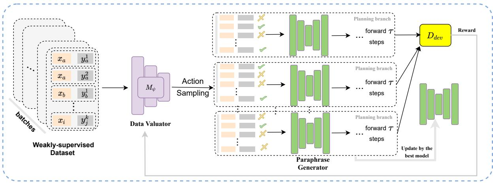

# Learning to Selectively Learn for Weakly Supervised Paraphrase Generation with Model-based Reinforcement Learning

Haiyan Yin, Dingcheng Li, Ping Li

Cognitive Computing Lab

Baidu Research

10900 NE 8th St, Bellevue, WA 98004, USA {haiyanyin18, dingchengl, pingli98}@gmail.com

## Abstract

Paraphrase generation is an important language generation task attempting to interpret user intents and systematically generate new phrases of identical meanings to the given ones. However, the effectiveness of paraphrase generation is constrained by the access to the golden labeled data pairs where both the amount and the quality of the training data pairs are restricted. In this paper, we propose a new weakly supervised paraphrase generation approach that extends the success of a recent work that leverages reinforcement learning (RL) for effective model training with data selection. While data selection is privileged for the target task which has noisy data, developing a reinforced selective learning regime faces several unresolved challenges. In this paper, we carry on important discussions about the above problem and present a new model that could partially overcome the discussed issues with a model-based planning feature and a reward normalization feature. We perform extensive evaluation on four weakly supervised paraphrase generation tasks where the results show that our method could significantly improve the state-of-the-art performance on the evaluation datasets.

## 1 Introduction

Paraphrase generation is an important natural language generation task which aims to generate a target sentence that encapsulates the meaning of a given source sentence while conforming to the style of some desired exemplar. It plays an essential role in many real-world applications for natural language processing, such as semantic parsing (Berant and Liang, 2014; Wu et al., 2021), machine translation (Resnik et al., 2010; Mallinson et al., 2017), recommend system (Falke et al., 2020) and question answering (Fader et al., 2013; Rinaldi et al., 2003; Duboué and Chu-Carroll, 2006). Different from other controllable text generation tasks where golden labelled data pairs are accessible and often being readily available, for paraphrase generation tasks, large scale of parallel paraphrase samples are often extremely hard to collect because generating them would often consume extensive domain knowledge or the generation could hardly be standardized. Therefore, the chance of performing supervised learning in real life scenarios would be considerably limited.

To overcome the data unattainable issue, unsupervised and semi-supervised approaches have achieved growing attention in the recent decade. Generally, the unsupervised approaches adopt sampling-based or editing-based techniques (Bowman et al., 2016; Miao et al., 2019) to remedy golden standard knowledge but they generally result in less coherent or controllable target phrases due to their lose of supervision. Therefore, in our paper, we focus on weakly-supervised paraphrase generation which has demonstrated great effectiveness in many major natural language processing tasks (Dehghani et al., 2017; Sun et al., 2020). Although weakly-supervised approaches have successfully pushed forward the state-of-theart performance standard for the language-based tasks, when employed for paraphrase generation, they still face the challenge of how to acquire highquality paired paraphrase data and therefore lead to noisy data pairs which might bring negative effect to the downstream task of training paraphrase generation models.

To overcome the aforementioned challenge and effectively train paraphrase generation models from noisy and not equally informative paraphrase pairs, we adopt a learning to selectively learn approach. That is, a meta model is learned to select intuitive paraphrase pairs while eliminating the low quality ones. Thus the paraphrase generation model which is jointly learned with the meta data selector model could achieve better performance through the carefully specified selective learning process. Nonetheless, it is impossible for learning an effective meta data selection policy to be a supervised learning task due to the missing of optimal target selection policy. To overcome this issue, we adopt a reinforcement learning-based approach to learn effective selection policy without supervised signal. To this end, we extend the success of previous reinforcement learning-based approach for data selection (Ding et al., 2021). However, formulating a Markov decision process (MDP) for the paraphrase learning process is a non-trivial task. In previous works, several important parts of their MDP formulation, such as the design of reward signal, are in need of further investigation (Yoon et al., 2019; Ding et al., 2021) and there also lacks in depth discussion on the challenge of solving the reinforcement learning problem. In this paper, we are motivated to extend this important line of using reinforcement learning to perform selective learning in weakly-supervised paraphrase generation problems and thus overcoming the data unattainable issue. Overall we present several key insights into formulating the MDP for the selective learning problem as well as developing a model-based reinforcement learning framework to effectively solving the MDP.

This paper has three main contributions:

• We present a novel model-based reinforcement learning approach for effectively training paraphrase generation models under weakly supervised regime, where our proposed reinforcement learning approach could effectively overcome some of the major limitations of the existing works for data selection.

• We present an in-depth discussion on the challenges and the potential ways to formulate the selective weakly supervised paraphrase generation tasks with reinforcement learning, which sheds light on the important direction of developing more sophisticated reinforcement learning frameworks for weakly supervised paraphrase generation.

• We present extensive empirical evaluation results on four evaluation datasets where the weakly supervised datasets are generated from supervised or unsupervised manner. The evaluation results show that our proposed method could lead to substantially better performance than all the considered baseline approaches over all the evaluation datasets.

## 2 Related Work

Paraphrase Generation has long been an important research problem for the natural language processing community. Traditional methods solve this problem by exploiting linguistic knowledge (Wubben et al., 2010; McKeown, 1979) or utilizing statistical machine translation (Quirk et al., 2004; Dolan et al., 2004). As being a sequence generation task, most of recently emerged approaches are framed as instances of the deep neural networks-based sequence-to-sequence (seq2seq) models (Prakash et al., 2016; Chen et al., 2020). Early works are mostly developed under a supervised setting while discarding the noise in the datasets. Two representative examples are the Residual LSTM (Prakash et al., 2016) and BERT (Chen et al., 2020). Later on, researchers start to work on improving the quality of the paraphrases, such as leveraging retrieval augmented (Kazemnejad et al., 2020; Lewis et al., 2020b; Hashimoto et al., 2018) or syntactic structure-based (Iyyer et al., 2018; Chen et al., 2019) approaches to produce better paraphrases. Besides the aforementioned approaches, there are also another lines of methods that attempt to al leviate the labeling cost with attempts like unsupervised learning (Bowman et al., 2016; Fu et al., 2019; Bao et al., 2019; Miao et al., 2019; Wang et al., 2020) as well as simulated annealing (Liu et al., 2020b) and reinforcement learning (Siddique et al., 2020). Compared to the conventional reinforcement learning methods which consider the generators as the policy models, our work models the policy as a meta learner to accomplish a data selection objective. Our work is mostly related to (Ding et al., 2021), but we adopt a very different reinforcement learning approach which is the key for effective selective learning.

Selective Learning refers to the case of selecting items, e.g., features or data points, to learn from among other items. It motivates many important fields in machine learning, such as active learning (Cohn et al., 1996; Settles, 2009; Xu et al., 2013; Fan et al., 2019; Liu et al., 2020a) and robust machine learning (Hendrycks et al., 2018; Reed et al., 2015; Mirzasoleiman et al., 2020). Our work is motivated by the existing instance-wise active data/feature acquisition approaches. One typical example is the conventional linear model that poses sparsity inducing prior distribution to the model (Tibshirani, 1996) and thus actively selects important features to the model. Recently, there also emerged approaches that adopt reinforcement learning to actively find optimal feature subsets (Yoon et al., 2019; Shim et al., 2018; Zannone et al., 2019). Though such attempts have demonstrated certain efficacy in handling instance-wise feature selection, they only deal with non timeseries data in non NLP domains, while the focus of our work is to deal with noisy labeled pairs in paraphrase generation tasks. Our work is mostly related to the instance-level active data acquisition approaches (Yoon et al., 2020; Ding et al., 2021), which are mostly adopted under the circumstances of data efficient or cost-sensitive learning or when dealing with noisy data. Yoon et al. (2020) and Ding et al. (2021) are formulation-wise identical while Yoon et al. (2020) is among the very first model for active data selective learning, whereas Ding et al. (2021) applies it on the task of paraphrase generation. Our work extends this important direction to perform selective learning but we formulate a new model-based reinforcement learning method which aims to overcome partial limitations for the existing work and is empirically proven to be more effective than it on all the experimental domains.

## 3 Reinforced Selective Learning for Paraphrase Generation

We present the general formulation for reinforcement learning-based selective weakly-supervised paraphrase generation problems.

## 3.1 Weakly-Supervised Paraphrase Generation Problem

Paraphrase generation is a sequence-to-sequence natural language generation problem. Formally, given a set of $N$ source sentences ${ \boldsymbol { \mathcal { X } } } = \{ \mathbf { x } _ { i } \} _ { i = 1 } ^ { N }$ where each sentence $X _ { i }$ is a set of discrete tokens, i.e., $\mathbf { x } _ { i } ~ = ~ \{ o _ { j } \} _ { j = 1 } ^ { T }$ , paraphrase generation aims to obtain a non-parallel output sentences $\mathbf { \Delta } y = \{ \mathbf { y } _ { i } \} _ { i = 1 } ^ { N }$ , where each $y _ { i }$ encapsulates identical meaning to $x _ { i }$ but comes in the form following some desired exemplars. When training paraphrase generation model, obtaining golden labeled target $\mathcal { V }$ is a critical challenge. Therefore, we consider a weakly-supervised paraphrase generation regime, forming a set of pseudo labeled pairs termed as $\mathcal { D } _ { p s e u d o } = \{ \mathbf { x } _ { i } , \mathbf { y } _ { i } \} _ { i = 1 } ^ { N }$ . When training models under the weakly-supervised regime, our work adopts a commonly taken assumption in weakly-supervised learning works. That is, the model has access only to a small set of high-quality parallel sentences $\mathcal { D } _ { d e v } = \{ \mathbf { x } _ { i } , \mathbf { y } _ { i } \} _ { i = 1 } ^ { L } \left( L < < M \right)$ which could be considered as golden labeled pairs.

To generate high-quality target for the pseudo labeled pairs, retrieval-based expansion approach is adopted to generate paraphrase $\{ \mathbf { y } _ { i } \} _ { i = 1 } ^ { N }$ which has recently demonstrated great effectiveness in text generation tasks (Kazemnejad et al., 2020; Lewis et al., 2020b). Specifically, for each source sentence $\mathbf { X } _ { i } ,$ BM25 (Robertson and Zaragoza, 2009) is first adopted as an effective retriever. Then we use Elastic Search (Gormley and Tong, 2015) to create search indexes for fast searching similar sentences to $\mathbf { x } _ { i }$ . The benefit of using such a combination is that the method provides flexibility for weak supervision while being training-free. Though there are considerable possibilities for adopting alternative approaches such as training-based methods for generating paraphrases, we demonstrate that our adopted method already yields promising performance.

Given the training data $\mathcal { D } _ { p s e u d o }$ and $\mathcal { D } _ { d e v }$ , the paraphrase generation model is optimized by Maximum Likelihood Estimation (MLE), i.e.,

$$
\mathcal { L } ( \psi ) = \sum _ { ( x , y ) \sim \mathcal { D } _ { p s e u d o } } - \log p _ { \psi } \left( y | x \right) .\tag{1}
$$

## 3.2 Markov Decision Process

Reinforcement learning is an area of machine learning concerned with how to learn sequential/nonsequential decision making policies for the problems formulated as Markov Decision Processes.

Formally, a Markov Decision Process is formulated as a tuple $< S , A , P , R , \gamma >$ , where $S$ is a set of states, A is a set of actions, $P$ is a transition probability matrix, R is the reward function applied upon a state-action pair, and $\gamma$ is a discountfactor. Among the transition probability matrix, each of its entry determines the probability of transiting from one state to another. In the reinforcement learning environment, actions are executed state by state, forming time sequences. At each time step, the agent observes a state, determines an action to be issued under the state, and receives a reward from the environment suggesting the or optimality of the action given the state. The state is Markovian, which means that the decision could be solely determined by the presented state and not on its preceding states. The objective of reinforcement learning is to maximize the cumulative rewards received by the agent.

## 3.3 Reinforced Paraphrase Generation

We now present a detailed discussion on how to technically combine reinforcement learning with paraphrase generation and devise a reinforcement learning-based selective learning paradigm.

Given the training regime with noisy labeled data, evaluating the value of the data would be a fundamental problem. To tackle this problem, we target at utilizing reinforcement learning techniques to learn an adaptive data valuator model $M _ { \phi } ( \cdot )$ which could be jointly updated with the paraphrase generator model and intuitively give value evaluation over the pseudo paraphrase pairs. Generally, $M _ { \phi } ( \cdot )$ could be considered as a reinforcement learning agent that we train to maximize the reward signal which is quantitatively represented as improvement achieved by the generator throughout the model training period. With this regard, we present how to formulate the Markov Decision Process (MDP) from corresponding state, action and reward for the selective learning of paraphrase generation task in the following section. We also discuss the challenges of MDP formulation in selective learning and potential ways to improve it.

STATE The state refers to what the agent observe for decision making. It is the representation of the informative features for an instance or a group of data instances to be evaluated. Ideally, the information conveyed by a state should dynamically change throughout the learning process. With endto-end RL, the state could be represented by lowlevel raw features, such as image pixels. It is privileged to use high-level representations for state which could potentially ease the policy learning. In our case, we adopt a very common representation for thestate sentences, which is extracted from a pretrained language model. Generally it reflects the static importance of data to the task without detailed modeling on the learning process. However, the importance values for the data inferred by our model are dynamic due to the dynamic updates of model parameters.

ACTION In selective learning, the way we could model action is relatively fixed. That is, an action needs to tell the decision about whether a data point or a group of pints need to be selected or not. In this paper, we model the action as a Bernoulli variable over each data point. There is generally less space to improve the action modeling part in the reinforced paraphrase generation process.

REWARD The reward signal is designated to tell the benefit of selecting a data instance to update the model over its paraphrase generation quality. It is also the most problematic item to model in the MDP. While the data valuator model is jointly trained with the generator model, it is impossible to obtain a golden standard reward signal to tell the importance of data for the dynamic learning environment. Most of the existing selective learning approach model the reward from the improvement of the downstream task performance before and after the model is updated by the data instance placed in a mini batch of samples. However, such performance score-based reward modeling has the following two major limitations: (1) it generates a reward over a group of mini batch samples and thus could not yield precise term over each independent data point; (2) the reward score has a changing distribution whose scale keeps decreasing and eventually converges to 0, which could bring difficulty to the policy learning (upon convergence the performance would no more increase and therefore lead to a mean of 0 over the reward). Most of the existing works consider the performance scorebased reward modeling only without compensating its scaling or independence issue. We develop a method with model-based and scaling flavour to partially overcome the aforementioned challenges.

## 4 MB-RPG: Model-based Reinforced Paraphrase Generation Framework

In this section, we introduce our proposed Modelbased Reinforced Paraphrase Generation framework (MB-RPG). The overview of MB-RPG is shown in Figure 1. The essences of MB-RPG can be summarised as two points. One, MB-RPG adopts model-based planning attempting to perform decision making based on multi-step lookahead. This way, we can address the first limitation, namely, the short-slightness brought by the conventional score-based approach, one-step look-ahead. Two, MB-RPG adopts a reward scaling module to normalize the reward as a fixed distribution to overcome the stochasticity of reward distribution.

## 4.1 Model-based Planning

We present a sophisticated method where the decision making system is developed to learn the policy based on long term effects, in order to overcome the limitation of the existing works where the reward is inferred from short-term noisy prediction lossbased metrics. In fact, the model-based planning method has been long studied and been proved effective in the reinforcement learning literature (Oh et al., 2015; Wang and Ba, 2020). Unlike modelfree reinforcement learning approaches where the agent experiences single-length trajectory, at each time step the episodes expand along one of the action directions instead. Accordingly, the resulting single chain enables our model-based approach to expand future trajectories through multiple action directions and perform the decision making based on the planned roll-outs. Let τ be the planned future steps, i.e., at each time step, the policy network makes decision based on the planned τ-step future states along multiple (e.g., all) action directions. Then the multi-step reward for each action direction can be formulated as follows:

  
Figure 1: Overview to our proposed Model-Based Reinforced Paraphrase Generation (MB-RPG) framework. Our method takes weakly-supervised dataset obtained from a retrieval-based method as its training data. At each time step, model-based planning is performed which expands the forward direction along multiple action directions and then perform multi-step look ahead. Then the generator is updated by the best model after the τ-step planning.

$$
\begin{array} { r l r } {  { \mathcal { R } ( s _ { j } , a _ { j } ) = \mathbb { E } \Big [ \sum _ { t = j } ^ { j + \tau } r ( s _ { t } , a _ { t } ) \Big ] , } } \\ & { } & { \quad \mathrm { w h e r e } s _ { t + 1 } \sim \Psi ( s _ { t + 1 } | s _ { t } , a _ { t } ) , ~ } \end{array}\tag{2}
$$

where $\Psi ( \cdot )$ is the learned model of the environment (e.g., one-step transition model). In our case, as the environment is only determined by the parameter value for the generator model, we specify one independent generator model at each planning direction. That is, over the N action directions, we will reserve one model to expand each action direction. After planning, the decision of which sample to use is made deterministic by selecting argmaxk $R ( s _ { j } , a _ { k } )$ . The aggressive planning scheme enables the decision making to consider prioritizing the actions with better long-term effect. This would typically significantly accelerate the exploration efficiency for the policy training. Such planning would only take effect on the action sampling part, i.e., which samples to be activated to choose would be determined by planning. With this design, the learning part is unaffected and conveniently inherits a model-free nature.

## 4.2 Reward Scaling

One problem in our prediction-loss based reward modeling is that the reward signal would have a noisy distribution whose mean would gradually decay and eventually converge to 0. In order to resolve it, inspired by many principled reinforcement learning methods such as Actor-critic (Konda and Tsitsiklis, 1999) and PopArt (Hessel et al., 2019), we propose a simple yet effective reward scaling approach to normalize the reward signal to a static distribution. To this end, our normalization method stores the scalar reward signals within a recent window, which would typically consume very minimal amount of memory. Then when we update the policy model, we normalize the reward signal for each transition in the following manner,

$$
\hat { R } _ { j } = \frac { R _ { j } - R ^ { m i n } } { R ^ { m a x } - R ^ { m i n } }\tag{3}
$$

where $R _ { j }$ and $\hat { R } _ { j }$ are the raw and normalized reward signals, $R ^ { m i n }$ and $R ^ { m a x }$ are the minimal and maximal values obtained from the window of rewards. With the normalized reward signal, the data selection policy could be optimized by the REINI-FORCE algorithm (Sutton et al., 1999). We present the pseudocode for MB-RPG in Algorithm 1.

Algorithm 1: Pseudocode for Model-based   
Reinforced Paraphrase Generation (MB-  
RPG) Algorithm   
Input: Weakly-labeled parallel dataset   
$\mathcal { D } _ { p s e u d o } ,$ pretrained language model   
gθ(y x) and RL selector pφ(s x).   
Output: A paraphrase generation model   
gθ(y x).   
1 while not done do   
2 Sample N mini-batches of data $\mathcal { D } _ { B } ^ { 1 . . N }$   
from pseudo   
/\* Model-based Look-ahead \*/   
3 for agent 1, N do   
4 $g _ { \theta } ^ { a g e n t }  g _ { \theta }$   
5 for step 1, N do   
/\* Data selection \*/   
6 Compute state representation st   
7 Compute selection probabilities   
8 Sample a for each instance   
/\* Generator look ahead \*/   
9 Update $g _ { \theta } ^ { a g e n t }$ with the samples   
10 end   
11 end   
12 Compute reward using validation data   
for each agent model;   
/\* Generator greedy update \*/   
13 Update gθ(y x) with the agent with   
maximum reward;   
/\* Valuator update (RL) \*/   
14 Update RL selector p (s x) with the   
reward.   
15 end

## 5 Experiments

In this section, we present extensive empirical evaluation results on comparing our method with its various counterparts on four commonly used paraphrase generation datasets1.

## 5.1 Experimental Setting

Evaluation Datasets. For comparison, we consider to adopt both supervised and unsupervised datasets. Note that our method adopts a semisupervised setting where the target paraphrases are generated following a retrieval-based method introduced in Section 3.1 and thus alleviates the need for golden labeled target data. Overall, we experiment with the following four datasets. The first two datasets for supervised setting and the last two for unsupervised scenario:

• Quora-s: corresponds to the Quora Question Pairs (QQP) dataset2 which consists of 400,000 question pairs and each pair comes with a binary tag telling whether that pair is paraphrase or not. To split the dataset for training and testing, we follow the existing works (Li et al., 2018; Kazemnejad et al., 2020; Ding et al., 2021) and use randomly sampled non-overlapping parallel pairs with sizes 100K, 3K and 30K for training, validation and testing, respectively.

• Twitter: is the Twitter News URL Corpus3 proposed by Lan et al. (2017). The dataset is created by large-scale sentential paraphrases from Twitter by linking tweets through shared URL. Following (Li et al., 2018; Kazemnejad et al., 2020; Ding et al., 2021), we randomly sample 110K instances from automatically labelled data as our training dataset and two non-overlapping datasets of sizes 1K and 5K from the humanannotated data to form the validation set and the testing set, respectively.

• Quora-U: is the unsupervised version of Quoras. To make a fair comparison, we follow the settings of the works (Miao et al., 2019; Liu et al., 2020b) and use two sets of 3K and 20K non-overlapping pairs as the validation set and the testing set, respectively.

• MSCOCO: is the COCO image captioning dataset4. It consists of over 500K captioning paraphrase pairs for more than 120K images. To create the datasets for training and testing we follow Lin et al. (2014) to split the dataset and adopt an identical evaluation protocol presented in Liu et al. (2020b).

Implementation. We adopt a pretrained transformer encoder-decoder (sequence-to-sequence) WS-BART (Lewis et al., 2020a) as the backbone of the generator in our proposed method MB-RPG.

<table><tr><td rowspan="2"></td><td rowspan="2">Method</td><td colspan="4">Quora-S</td><td colspan="4">Twitter</td></tr><tr><td>BLEU-2</td><td>BLEU-4</td><td>ROUGE-1</td><td>ROUGE-2</td><td>BLEU-2</td><td>BLEU-4</td><td>ROUGE-1</td><td>ROUGE-2</td></tr><tr><td rowspan="5">Supervised</td><td>Res-LSTM</td><td>38.52</td><td>24.56</td><td>59.69</td><td>32.71</td><td>32.13</td><td>25.92</td><td>41.77</td><td>27.94</td></tr><tr><td>Transformer</td><td>42.91</td><td>30.38</td><td>61.25</td><td>34.23</td><td>40.34</td><td>32.14</td><td>44.53</td><td>29.55</td></tr><tr><td>RbM</td><td>43.54</td><td></td><td>38.11</td><td>32.84</td><td>44.67</td><td></td><td>41.87</td><td>24.23</td></tr><tr><td>RaE</td><td>40.35</td><td>25.37</td><td>62.71</td><td>31.77</td><td>44.33</td><td>34.16</td><td>47.55</td><td>31.53</td></tr><tr><td>FSET</td><td>51.03</td><td>33.46</td><td>66.17</td><td>39.55</td><td>46.35</td><td>34.62</td><td>49.53</td><td>32.04</td></tr><tr><td rowspan="3">Weakly-supervised</td><td>WS-BART</td><td>44.19</td><td>31.18</td><td>58.69</td><td>33.39</td><td>45.03</td><td>34.00</td><td>51.34</td><td>35.89</td></tr><tr><td>LTSL</td><td>49.18</td><td>36.05</td><td>63.06</td><td>39.71</td><td>49.30</td><td>37.94</td><td>56.02</td><td>40.61</td></tr><tr><td>MB-RPG</td><td>54.88</td><td>41.56</td><td>67.66</td><td>43.98</td><td>51.65</td><td>39.58</td><td>61.45</td><td>44.19</td></tr></table>

<table><tr><td rowspan="2"></td><td rowspan="2">Method</td><td colspan="4">Quora-U</td><td colspan="4">MSCOCO</td></tr><tr><td>iBLEU</td><td>BLEU</td><td>ROUGE-1</td><td>ROUGE-2</td><td>iBLEU</td><td>BLEU</td><td>ROUGE-1</td><td>ROUGE-2</td></tr><tr><td rowspan="5">Unsupervised</td><td>VAE</td><td>8.16</td><td>13.96</td><td>44.55</td><td>22.64</td><td>7.48</td><td>11.09</td><td>31.78</td><td>8.66</td></tr><tr><td>CGMH</td><td>9.94</td><td>15.73</td><td>48.73</td><td>26.12</td><td>7.84</td><td>11.45</td><td>32.19</td><td>8.67</td></tr><tr><td>USPA</td><td>12.02</td><td>18.21</td><td>59.51</td><td>32.63</td><td>9.26</td><td>14.16</td><td>37.18</td><td>11.21</td></tr><tr><td>PUP</td><td>14.91</td><td>19.68</td><td>59.77</td><td>30.47</td><td>10.72</td><td>15.81</td><td>37.38</td><td>13.87</td></tr><tr><td>DBlock</td><td>20.93</td><td>26.76</td><td>65.60</td><td>42.09</td><td>=</td><td>=</td><td>=</td><td></td></tr><tr><td rowspan="3">Weakly-supervised</td><td>WS-BART</td><td>29.30</td><td>27.63</td><td>58.43</td><td>33.39</td><td>20.11</td><td>15.90</td><td>40.65</td><td>15.62</td></tr><tr><td>LTSL</td><td>31.20</td><td>29.25</td><td>62.71</td><td>39.21</td><td>23.25</td><td>18.87</td><td>45.18</td><td>19.17</td></tr><tr><td>MB-RPG</td><td>33.56</td><td>33.85</td><td>66.30</td><td>42.48</td><td>28.09</td><td>19.39</td><td>49.42</td><td>25.18</td></tr></table>

Table 1: Performance scores for our method MB-RPG as well as all the baseline methods on four paraphrasing datasets under supervised or unsupervised learning setting.

To improve the efficiency of reinforcement learning, we model the reinforced data valuator model $M _ { \psi }$ as a pretrained BERT followed by two fullyconnected trainable layers as the head for policy output. BERT serves as a feature extractor and is kept fixed during policy learning. We present other details for our method in appendix.

Baseline Methods. We compare our method with twelve benchmark approaches including the stateof-the-art method. In general, the baselines come from the following three categories: (i) supervised methods that are trained with highquality supervised target paraphrases, i.e., Transformer (Vaswani et al., 2017), RbM (Li et al., 2018), Residual LSTM (Prakash et al., 2016) and two retrieval-based methods FSET (Kazemnejad et al., 2020) and RaE (Hashimoto et al., 2018); (ii) unsupervised methods that do not have access to the parallel data, including Constrained sentence Generation with Metropolis-Hastings (CGMH) (Miao et al., 2019) VAE (Bowman et al., 2016), Unsupervised Paraphrase generation with Simulated Annealing (UPSA) (Liu et al., 2020b) and Progressive Unsupervised Paraphrasing (PUP) (Siddique et al., 2020), Dynamic Blocking (DBlock) (Niu et al., 2020); (iii) semisupervised methods including WS-BART (Lewis et al., 2020a) which corresponds to BART trained upon the weakly-supervised data and Learning To Selectively Learn (LTSL) (Ding et al., 2021) which is the most closely related method to ours. LTSL also adopts reinforcement learning for selective learning and our approach is a model-based improved version over its vanilla policy gradient formulation. Also note that both LTSL and MB-RPG adopts BART as the pretrained generator.

## 5.2 Benchmark Results

We present the benchmark results on all the compared methods on the four evaluation datasets in Table 1. Note that our proposed method is denoted as MB-RPG. Overall, we could conclude that MB-RPG outperforms all its baselines with significant margins in terms of BLEU scores and ROUGE scores across the four evaluation datasets.

From the results, we could notice that under the supervised setting, most methods, such as Transformer and FSET, could significantly outperform most of the results obtained from the unsupervised setting (e.g., CGMH and VAE). Compared with the supervised methods, even though our method does not touch the supervised labels, it could still outperform the supervised methods by noticeable margins. This further indicates that our method is promising to be adopted in many real life applications where there is rather limited access to the golden labelled paraphrase pairs.

Compared to the unsupervised approaches, MB-RPG is also superior especially in terms of the iBLEU and BLEU metrics. The main reason might be that the word editing or sampling attempts proposed in the unsupervised baselines yield less desirable target paraphrases and thus makes the performance of the model trained under the unsupervised data fall far below our method and various supervised baselines. The inferior performance of the unsupervised methods has also been empirically evaluated and discussed by Niu et al. (2020).

<table><tr><td rowspan="2">Method</td><td colspan="4">Quora-S</td></tr><tr><td>BLEU-2</td><td>BLEU-4</td><td>ROUGE-1</td><td>ROUGE-2</td></tr><tr><td>WS-BART</td><td>44.19</td><td>31.18</td><td>58.69</td><td>33.39</td></tr><tr><td>w/o planning</td><td>50.67</td><td>38.29</td><td>64.12</td><td>41.28</td></tr><tr><td>w/o rew norm</td><td>51.26</td><td>42.32</td><td>66.25</td><td>40.23</td></tr><tr><td>LTSL</td><td>49.18</td><td>36.05</td><td>63.06</td><td>39.71</td></tr><tr><td>MB-RPG</td><td>54.88</td><td>41.56</td><td>67.66</td><td>43.98</td></tr></table>

Table 2: Ablation study results for the planning and reward normalization components on Quora-s.

From Table 1, we could notice that the performance of MB-RPG is much better than its closest counterpart LTSL, while LTSL is also a reinforcement learning-based selective learning method. In both supervised and unsupervised scenarios, MB-RPG could outperform LTSL consistently by a noticeable margins. The average improvements on BLEU-2 and BLEU-4 scores are 4.02 and 3.57 respectively. On each BLEU or ROUGE metrics, MB-RPG achieves better scores than LTSL. This shows that our proposed method MB-RPG achieves state-of-the-art method on various paraphrase generation benchmark datasets. It also shows that using model-based planning and refining the noisy reward could bring considerable benefit to the data valuation process. Such result sheds lights to the research of refining the formulation for the Markov Decision Process and coming up with more adequate reinforcement learning frameworks to facilitate better data valuation. The results reveals that the performance of the vanilla WS-BART is inferior than LTSL or MB-RPG, both of which adopt WS-BART as their generators’ backbone.

## 5.3 Ablation Study

To thoroughly evaluate the effect of the individual components we proposed upon the vanilla policy gradient method, we present an ablation study to evaluate the individual effect of such components. Specifically, we consider three ablated baselines: 1) w/o planning: our model without the model-based planning module; 2) w/o rew norm: our model without the reward normalization module; 3) LTSL: without both planning and reward normalization modules. We present the results in Table 2. From the results, we notice that the baseline w/o rew planning achieves similar results with LTSL which is not comparable to our proposed method. It verifies the importance of leveraging the model-based planning to reduce the noise among the short-term onestep reward signals. From the results shown in Table 2, we also notice that the baseline w/o rew norm achieves better results than LTSL, but not as good as the full version of our method. This shows that reward normalization is an essential step to train the Markov Decision Process formulated for selective paraphrase generation. The aforementioned results also reveal that the model-based planning module and the reward normalization module are two modules with relatively parallel effects of each other without much conflicting situations. Lastly, we wish to highlight that the WS-BART without reinforcement learning-based selective learning essentially performs very outstanding by itself. However, leveraging reinforcement learning-based selective learning could result in significant boost to the performance of WS-BART. This shows that reinforced selective learning is a promising direction to consider for improving the SOTA performance in paraphrase generation or other generation tasks.

## 6 Conclusion

Our work tackles an important problem of leveraging reinforcement learning-based selective learning techniques to effectively deal with the noisy label issue in paraphrase generation tasks. We introduce a model-based framework which performs planning to capture the long-term effects for efficient exploration so as to overcome the noisy short-term reward issue experienced by most of the existing approaches. We also propose an effective reward normalization approach which could normalize the noisy reward signal to a distribution with a fixed zero-mean. We demonstrate that our proposed method could outperform baseline approaches with significant margins on the testified domains. Future work includes refining the state and reward terms in the Markov Decision Process for better data valuation or feature selections. One ongoing work is to integrate MB-RPG into our previous feature exploration work in video recommendation (Li et al., 2020) to improve feature quality. Another one is to employ MB-RPG in our RL-based coreference resolution to filter out irrelevant features (Fei et al., 2019). In addition, we could consider constructing the policy model upon alternative generator backbone. Also, we could consider inferring the reward from different sources, such as incorporating auxiliary language models in the training.

## References

Yu Bao, Hao Zhou, Shujian Huang, Lei Li, Lili Mou, Olga Vechtomova, Xin-Yu Dai, and Jiajun Chen. 2019. Generating sentences from disentangled syntactic and semantic spaces. In Proceedings of the 57th Conference of the Association for Computational Linguistics (ACL), pages 6008–6019, Florence, Italy.

Jonathan Berant and Percy Liang. 2014. Semantic parsing via paraphrasing. In Proceedings of the 52nd Annual Meeting ofthe Associationfor Computational Linguistics (ACL), pages 1415–1425, Baltimore, MD.

Samuel R. Bowman, Luke Vilnis, Oriol Vinyals, Andrew M. Dai, Rafal Józefowicz, and Samy Bengio. 2016. Generating sentences from a continuous space. In Proceedings of the 20th SIGNLL Conference on Computational Natural Language Learning (CoNLL), pages 10–21, Berlin, Germany.

Mingda Chen, Qingming Tang, Sam Wiseman, and Kevin Gimpel. 2019. Controllable paraphrase generation with a syntactic exemplar. In Proceedings of the 57th Conference of the Association for Computational Linguistics (ACL), pages 5972–5984, Florence, Italy.

Yen-Chun Chen, Zhe Gan, Yu Cheng, Jingzhou Liu, and Jingjing Liu. 2020. Distilling knowledge learned in BERT for text generation. In Proceedings of the 58th Annual Meeting of the Association for Computational Linguistics (ACL), pages 7893– 7905, Online.

David A. Cohn, Zoubin Ghahramani, and Michael I. Jordan. 1996. Active learning with statistical models. J. Artif. Intell. Res., 4:129–145.

Mostafa Dehghani, Hamed Zamani, Aliaksei Severyn, Jaap Kamps, and W. Bruce Croft. 2017. Neural ranking models with weak supervision. In Proceedings ofthe 40th International ACM SIGIR Conference on Research and Development in Information Retrieval (SIGIR), pages 65–74, Shinjuku, Tokyo, Japan.

Kaize Ding, Dingcheng Li, Alexander Hanbo Li, Xing Fan, Chenlei Guo, Yang Liu, and Huan Liu. 2021. Learning to selectively learn for weakly-supervised paraphrase generation. In Proceedings of the 2021 Conference on Empirical Methods in Natural Language Processing (EMNLP), pages 5930–5940, Virtual Event / Punta Cana, Dominican Republic.

Bill Dolan, Chris Quirk, and Chris Brockett. 2004. Unsupervised construction of large paraphrase corpora: Exploiting massively parallel news sources. In Proceedings ofthe 20th International Conference on Computational Linguistics (COLING), Geneva, Switzerland.

Pablo Ariel Duboué and Jennifer Chu-Carroll. 2006. Answering the question you wish they had asked:

The impact of paraphrasing for question answering. In Proceedings of Human Language Technology Conference of the North American Chapter of the Association of Computational Linguistics (HLT-NAACL), New York, NY.

Anthony Fader, Luke S. Zettlemoyer, and Oren Etzioni. 2013. Paraphrase-driven learning for open question answering. In Proceedings of the 51st Annual Meeting of the Association for Computational Linguistics (ACL), pages 1608–1618, Sofia, Bulgaria.

Tobias Falke, Markus Boese, Daniil Sorokin, Caglar Tirkaz, and Patrick Lehnen. 2020. Leveraging user paraphrasing behavior in dialog systems to automatically collect annotations for long-tail utterances. In Proceedings of the 28th International Conference on Computational Linguistics (COLING), Industry Track, pages 21–32, Online.

Miao Fan, Chao Feng, Mingming Sun, and Ping Li. 2019. Reinforced product metadata selection for helpfulness assessment of customer reviews. In Proceedings of the 2019 Conference on Empirical Methods in Natural Language Processing and the 9th International Joint Conference on Natural Language Processing (EMNLP-IJCNLP), pages 1675– 1683, Hong Kong, China.

Hongliang Fei, Xu Li, Dingcheng Li, and Ping Li. 2019. End-to-end deep reinforcement learning based coreference resolution. In Proceedings of the 57th Conference of the Association for Computational Linguistics (ACL), pages 660–665, Florence, Italy.

Yao Fu, Yansong Feng, and John P. Cunningham. 2019. Paraphrase generation with latent bag of words. In Advances in Neural Information Processing Systems (NeurIPS), pages 13623–13634, Vancouver, Canada.

Clinton Gormley and Zachary Tong. 2015. Elasticsearch: the definitive guide: a distributed real-time search and analytics engine. O’Reilly Media, Inc.

Tatsunori B. Hashimoto, Kelvin Guu, Yonatan Oren, and Percy Liang. 2018. A retrieve-and-edit framework for predicting structured outputs. In Advances in Neural Information Processing Systems (NeurIPS), pages 10073–10083, Montréal, Canada.

Dan Hendrycks, Mantas Mazeika, Duncan Wilson, and Kevin Gimpel. 2018. Using trusted data to train deep networks on labels corrupted by severe noise. In Advances in Neural Information Processing Systems (NeurIPS), pages 10477–10486, Montréal, Canada.

Matteo Hessel, Hubert Soyer, Lasse Espeholt, Wojciech Czarnecki, Simon Schmitt, and Hado van Hasselt. 2019. Multi-task deep reinforcement learning with popart. In Proceedings of the Thirty-Third AAAI Conference on Artificial Intelligence (AAAI), pages 3796–3803, Honolulu, HI.

Mohit Iyyer, John Wieting, Kevin Gimpel, and Luke Zettlemoyer. 2018. Adversarial example generation with syntactically controlled paraphrase networks. In Proceedings of the 2018 Conference of the North American Chapter of the Association for Computational Linguistics: Human Language Technologies (NAACL-HLT), pages 1875–1885, New Orleans, LA.

Amirhossein Kazemnejad, Mohammadreza Salehi, and Mahdieh Soleymani Baghshah. 2020. Paraphrase generation by learning how to edit from samples. In Proceedings ofthe 58th Annual Meeting ofthe Association for Computational Linguistics (ACL), pages 6010–6021, Online.

Vijay R. Konda and John N. Tsitsiklis. 1999. Actorcritic algorithms. In Advances in Neural Information Processing Systems (NIPS), pages 1008–1014, Denver, CO.

Wuwei Lan, Siyu Qiu, Hua He, and Wei Xu. 2017. A continuously growing dataset of sentential paraphrases. In Proceedings of the 2017 Conference on Empirical Methods in Natural Language Processing (EMNLP), pages 1224–1234, Copenhagen, Denmark.

Mike Lewis, Yinhan Liu, Naman Goyal, Marjan Ghazvininejad, Abdelrahman Mohamed, Omer Levy, Veselin Stoyanov, and Luke Zettlemoyer. 2020a. BART: denoising sequence-to-sequence pretraining for natural language generation, translation, and comprehension. In Proceedings of the 58th Annual Meeting of the Association for Computational Linguistics (ACL), pages 7871–7880, Online.

Patrick S. H. Lewis, Ethan Perez, Aleksandra Piktus, Fabio Petroni, Vladimir Karpukhin, Naman Goyal, Heinrich Küttler, Mike Lewis, Wen-tau Yih, Tim Rocktäschel, Sebastian Riedel, and Douwe Kiela. 2020b. Retrieval-augmented generation for knowledge-intensive NLP tasks. In Advances in Neural Information Processing Systems (NeurIPS), virtual.

Dingcheng Li, Xu Li, Jun Wang, and Ping Li. 2020. Video recommendation with multi-gate mixture of experts soft actor critic. In Proceedings of the 43rd International ACM SIGIR Conference on Research and Development in Information Retrieval (SIGIR), pages 1553–1556, Virtual Event, China.

Zichao Li, Xin Jiang, Lifeng Shang, and Hang Li. 2018. Paraphrase generation with deep reinforcement learning. In Proceedings of the 2018 Conference on Empirical Methods in Natural Language Processing (EMNLP), pages 3865–3878, Brussels, Belgium.

Tsung-Yi Lin, Michael Maire, Serge J. Belongie, James Hays, Pietro Perona, Deva Ramanan, Piotr Dollár, and C. Lawrence Zitnick. 2014. Microsoft COCO: common objects in context. In Proceedings of the 13th European Conference on Computer Vision

(ECCV), Part V, pages 740–755, Zurich Switzerland.

Guiliang Liu, Xu Li, Mingming Sun, and Ping Li. 2020a. An advantage actor-critic algorithm with confidence exploration for open information extraction. In Proceedings ofthe 2020 SIAM International Conference on Data Mining (SDM), pages 217–225, Cincinnati, OH.

Xianggen Liu, Lili Mou, Fandong Meng, Hao Zhou, Jie Zhou, and Sen Song. 2020b. Unsupervised paraphrasing by simulated annealing. In Proceedings of the 58th Annual Meeting ofthe Associationfor Computational Linguistics (ACL), pages 302–312, Online.

Jonathan Mallinson, Rico Sennrich, and Mirella Lapata. 2017. Paraphrasing revisited with neural machine translation. In Proceedings of the 15th Conference ofthe European Chapter ofthe Associationfor Computational Linguistics (EACL), pages 881–893, Valencia, Spain.

Kathleen R. McKeown. 1979. Paraphrasing using given and new information in a question-answer system. In Proceedings of the 17th Annual Meeting of the Association for Computational Linguistics (ACL), University of California at San Diego, La Jolla, CA.

Ning Miao, Hao Zhou, Lili Mou, Rui Yan, and Lei Li. 2019. CGMH: constrained sentence generation by metropolis-hastings sampling. In Proceedings of the Thirty-Third AAAI Conference on Artificial Intelligence (AAAI), pages 6834–6842, Honolulu, HI.

Baharan Mirzasoleiman, Kaidi Cao, and Jure Leskovec. 2020. Coresets for robust training of deep neural networks against noisy labels. In Advances in Neural Information Processing Systems (NeurIPS), virtual.

Tong Niu, Semih Yavuz, Yingbo Zhou, Huan Wang, Nitish Shirish Keskar, and Caiming Xiong. 2020. Unsupervised paraphrase generation via dynamic blocking. arXiv preprint arXiv:2010.12885.

Junhyuk Oh, Xiaoxiao Guo, Honglak Lee, Richard L. Lewis, and Satinder P. Singh. 2015. Actionconditional video prediction using deep networks in atari games. In Advances in Neural Information Processing Systems (NIPS), pages 2863–2871, Montreal, Canada.

Aaditya Prakash, Sadid A. Hasan, Kathy Lee, Vivek V. Datla, Ashequl Qadir, Joey Liu, and Oladimeji Farri. 2016. Neural paraphrase generation with stacked residual LSTM networks. In Proceedings of the 26th International Conference on Computational Linguistics (COLING), pages 2923–2934, Osaka, Japan.

Chris Quirk, Chris Brockett, and William B. Dolan. 2004. Monolingual machine translation for paraphrase generation. In Proceedings of the 2004 Conference on Empirical Methods in Natural Language

Processing (EMNLP), pages 142–149, Barcelona, Spain.

Scott E. Reed, Honglak Lee, Dragomir Anguelov, Christian Szegedy, Dumitru Erhan, and Andrew Rabinovich. 2015. Training deep neural networks on noisy labels with bootstrapping. In Proceedings of the 3rd International Conference on Learning Representations (ICLR Workshop), San Diego, CA.

Philip Resnik, Olivia Buzek, Chang Hu, Yakov Kronrod, Alexander J. Quinn, and Benjamin B. Bederson. 2010. Improving translation via targeted paraphrasing. In Proceedings of the 2010 Conference on Empirical Methods in Natural Language Processing (EMNLP), pages 127–137, MIT Stata Center, Massachusetts.

Fabio Rinaldi, James Dowdall, Kaarel Kaljurand, Michael Hess, and Diego Mollá Aliod. 2003. Exploiting paraphrases in a question answering system. In Proceedings of the Second International Workshop on Paraphrasing (IWP@ACL), pages 25–32, Sapporo, Japan.

Stephen E. Robertson and Hugo Zaragoza. 2009. The Probabilistic Relevance Framework: BM25 and Beyond, volume 3.

Burr Settles. 2009. Active learning literature survey.

Hajin Shim, Sung Ju Hwang, and Eunho Yang. 2018. Joint active feature acquisition and classification with variable-size set encoding. In Advances in Neural Information Processing Systems (NeurIPS), pages 1375–1385, Montréal, Canada.

A. B. Siddique, Samet Oymak, and Vagelis Hristidis. 2020. Unsupervised paraphrasing via deep reinforcement learning. In Proceedings of the 26th ACM SIGKDD Conference on Knowledge Discovery and Data Mining (KDD), pages 1800–1809, Virtual Event, CA.

Zijun Sun, Chun Fan, Xiaofei Sun, Yuxian Meng, Fei Wu, and Jiwei Li. 2020. Neural semi-supervised learning for text classification under large-scale pretraining. arXiv preprint arXiv:2011.08626.

Richard S. Sutton, David A. McAllester, Satinder P. Singh, and Yishay Mansour. 1999. Policy gradient methods for reinforcement learning with function approximation. In Advances in Neural Information Processing Systems (NIPS), pages 1057–1063, Denver, CO.

Robert Tibshirani. 1996. Regression shrinkage and selection via the lasso. Journal ofthe Royal Statistical Society: Series B (Methodological), 58(1):267–288.

Ashish Vaswani, Noam Shazeer, Niki Parmar, Jakob Uszkoreit, Llion Jones, Aidan N. Gomez, Lukasz Kaiser, and Illia Polosukhin. 2017. Attention is all you need. In Advances in Neural Information Processing Systems (NIPS), pages 5998–6008, Long Beach, CA.

Tingwu Wang and Jimmy Ba. 2020. Exploring modelbased planning with policy networks. In Proceedings of the 8th International Conference on Learning Representations (ICLR), Addis Ababa, Ethiopia.

Zhuoyi Wang, Yigong Wang, Yu Lin, Evan Delord, and Latifur Khan. 2020. Few-sample and adversarial representation learning for continual stream mining. In Proceedings ofthe Web Conference (WWW), pages 718–728, Taipei.

Shan Wu, Bo Chen, Chunlei Xin, Xianpei Han, Le Sun, Weipeng Zhang, Jiansong Chen, Fan Yang, and Xunliang Cai. 2021. From paraphrasing to semantic parsing: Unsupervised semantic parsing via synchronous semantic decoding. In Proceedings of the 59th Annual Meeting of the Association for Computational Linguistics and the 11th International Joint Conference on Natural Language Processing (ACL/IJCNLP), pages 5110–5121, Virtual Event.

Sander Wubben, Antal van den Bosch, and Emiel Krahmer. 2010. Paraphrase generation as monolingual translation: Data and evaluation. In Proceedings of the Sixth International Natural Language Generation Conference (INLG), Trim, Co. Meath, Ireland.

Yan Xu, Fuming Sun, and Xue Zhang. 2013. Literature survey of active learning in multimedia annotation and retrieval. In Proceedings of the International Conference on Internet Multimedia Computing and Service (ICIMCS), pages 237–242, Huangshan, China.

Jinsung Yoon, Sercan Ömer Arik, and Tomas Pfister. 2020. Data valuation using reinforcement learning. In Proceedings ofthe 37th International Conference on Machine Learning (ICML), pages 10842–10851, Virtual Event.

Jinsung Yoon, James Jordon, and Mihaela van der Schaar. 2019. INVASE: instance-wise variable selection using neural networks. In Proceedings ofthe 7th International Conference on Learning Representations (ICLR), New Orleans, LA.

Sara Zannone, José Miguel Hernández-Lobato, Cheng Zhang, and Konstantina Palla. 2019. Odin: Optimal discovery of high-value information using modelbased deep reinforcement learning. In ICML Realworld Sequential Decision Making Workshop.