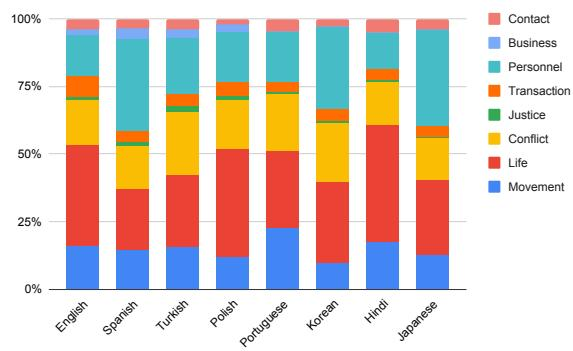
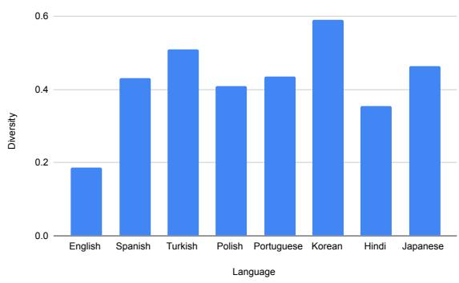

# MINION: a Large-Scale and Diverse Dataset for Multilingual Event Detection

Amir Pouran Ben Veyseh1, Minh Van Nguyen1,

Franck Dernoncourt2, and Thien Huu Nguyen1

1 Dept. of Computer and Information Science, University of Oregon, Eugene, OR, USA 2 Adobe Research, Seattle, WA, USA

{apouranb,minhnv,thien}@cs.uoregon.edu, dernonco@adobe.com

## Abstract

Event Detection (ED) is the task of identify ing and classifying trigger words of event mentions in text. Despite considerable research efforts in recent years for English text, the task of ED in other languages has been significantly less explored. Switching to non-English lan guages, important research questions for ED include how well existing ED models perform on different languages, how challenging ED is in other languages, and how well ED knowledge and annotation can be transferred across languages. To answer those questions, it is crucial to obtain multilingual ED datasets that provide consistent event annotation for multiple languages. There exist some multilingual ED datasets; however, they tend to cover a handful of languages and mainly focus on popular ones. Many languages are not covered in existing multilingual ED datasets. In addition, the current datasets are often small and not accessible to the public. To overcome those shortcomings, we introduce a new large-scale mul tilingual dataset for ED (called MINION) that consistently annotates events for 8 different languages; 5 of them have not been supported by existing multilingual datasets. We also perform extensive experiments and analysis to demonstrate the challenges and transferability of ED across languages in MINION that in all call for more research effort in this area. We will release the dataset to promote future research on multilingual ED.

## 1 Introduction

Event Detection (ED) is one of the critical steps for an Event Extraction system in Information Extraction (IE) that aims is to recognize mentions of events in text, i.e., change of state of real world entities. Specifically, an ED system identifies the word(s) that most clearly refer to the occurrence of an event, i.e., event trigger, and also detects the type of event that is evoked by the event trigger. For instance, in the sentence “The city was reportedly struck by F16 missiles.”, the word “struck” is the trigger for an ATTACK event. An ED model can be incorporated into other IE pipelines to facilitate the extraction of information related to events and entities, thereby supporting various downstream applications such as knowledge base construction, question answering and text summarization.

Due to its importance, ED has been extensively studied in the IE and NLP community over the past decade. Existing methods for ED extend from feature-based models (Ahn, 2006; Liao and Grishman, 2010; Miwa et al., 2014a), to advanced deep learning methods (Nguyen and Grishman, 2015; Chen et al., 2015; Sha et al., 2018; Wang et al., 2019; Yang et al., 2019; Cui et al., 2020; Lai et al., 2020; Pouran Ben Veyseh et al., 2021b). As such, the creation of large annotated datasets for ED, e.g., ACE 2005 (Walker et al., 2006), has been critical to progress measurement and growing development of ED research. However, a majority of current datasets for ED only provide annotation for texts in a single language (i.e., monolingual datasets). For instance, the recent challenging datasets for ED, e.g., MAVEN (Wang et al., 2020), RAMS (Ebner et al., 2020), or CySecED (Man et al., 2020), are all proposed for English documents only. In addition, there are a few existing datasets that include ED annotation for multiple languages (multilingual datasets), e.g., ACE 2005 (Walker et al., 2006), TAC KBP (Mitamura et al., 2016, 2017), and TempEval-2 (Verhagen et al., 2010). However, those multilingual datasets only cover a handful of languages (i.e., 3 languages in ACE 2005 and TAC KBP, and 6 languages in TempEval-2), mainly focusing on popular languages such as English, Chinese, Arabic, and Spanish, and leaving many other languages unexplored for ED. For instance, Turkish and Polish are not covered in existing multilingual datasets for ED. We also note that existing ED datasets tend to employ different annotation schema and guidelines that prevent the combination of current datasets to create a larger one. In all, the limited coverage of languages and annotation discrepancy in current monolingual/multilingual ED datasets hinder comprehensive studies for the challenges of ED in diverse languages. It also limits thorough evaluations for multilingual generalization of ED models. Finally, we note that the major multilingual datasets for ED are not publicly accessible due to the licence of involving documents, e.g., ACE 2005 and TAC KBP, thus further impeding research effort in this area.

To address such issues, our goal is to introduce a new Multilingual Event Detection dataset (called MINION) to support multilingual research for ED. In particular, we provide a large-scale dataset that manually annotates event triggers for 8 typologically different languages, i.e., English, Spanish, Portuguese, Polish, Turkish, Hindi, Japanese and Korean. Among them, the five languages Portuguese, Polish, Turkish, Hindi, and Japanese are not covered in existing popular datasets for multilingual ED (i.e., ACE 2005, TAC KBP, and TempEval-2). To facilitate public release and sharing of the dataset, we employ the event articles from Wikipedia for annotation in 8 languages. In addition, to improve quality of the data, we inherit the annotation schema and guideline in ACE 2005, the well-designed and widely-used dataset for ED research. In total, our MINION dataset involves more than 50K annotated event triggers, which is much larger than those in existing multilingual ED datasets (i.e., less than 11K and 27K in ACE 2005 and TempEval-2 respectively). We expect that the significantly larger size with more diverse set of languages and public texts in MINION can contribute to accelerate and extend research in ED to a larger population.

Given the proposed dataset, we conduct thorough analysis on MINION using the state-of-theart (SOTA) models for ED. In particular, we first study the challenges of ED in different languages using monolingual evaluations where ED models are trained and tested in the same languages. Our experiments suggest that the performance of existing ED models is not yet satisfactory in multiple languages and the model performance on non-English languages is in general poorer than those for English. We also show that current pre-trained language models for specific languages (i.e., monolingual models) are less effective for ED models than multilingual pre-trained language models, e.g., mBERT (Devlin et al., 2019). In all, our findings highlight greater challenges of ED for non-English languages that should be further pursued in future research.

In addition, our MINION dataset also facilitate zero-shot cross-lingual transfer learning experiments that serve to reveal the transferability of ED knowledge and annotation across languages. In these experiments, ED models are trained on English data (the source language), but tested in other target languages. Our results in this setting demonstrate a wide range of cross-lingual performance for different target languages in MINION that introduces a diverse set of languages and data for ED research. Finally, we report extensive analysis on MINION to provide further data insights for future ED research, including challenges of data annotation, language differences, and cross-dataset evaluation. We will release MINION to foster future research for multilingual ED.

## 2 Data Annotation

Our dataset MINION follows the same definition of events as the annotation guideline in ACE 2005 (Walker et al., 2006). Specifically, an event is defined as an occurrence that results in the change of state of a real world entity. Moreover, an event mention is evoked by an event trigger which most clearly describes the occurrence of the event. While event triggers are mostly single words, we also allow multi-word event triggers to better accommodate ED annotation in multiple languages. For instance, the phrasal verb “tayin etmek” with two words in Turkish, meaning “appoint”, is necessary to express the event type Start-Position.

We also inherit the annotation schema/ontology (i.e., to define event types for annotation) and guideline in ACE 2005 to benefit from its well-designed documentation and be consistent with most of prior ED research. However, to improve the quality of the annotated data, we prune some event sub-types from the original ACE 2005 ontology in our dataset. In particular, event sub-types that have very similar meanings in some language are not included in our final ontology. This promotes the distinction between event labels and avoids confusion for annotators to provide high-quality data in different languages. For instance, the event sub-types Convict and Sentence are very similar in Turkish (i.e., both Convict and Sentence can be translated as Mahkum etmek in Turkish), thus being removed in our ontology. In addition, we also exclude event sub-types in ACE 2005 that are not frequent in our collected data from Wikipedia (more details on data collection later), e.g., Nominate and Declare-Bankruptcy. Finally, 16 event sub-types (for 8 event types) are preserved in the final event schema for our dataset. We provide detailed explanation and sample sentences for the event types in our dataset in the Appendix A.

## 2.1 Candidate Selection

As mentioned in the introduction, we aim to annotate ED data for 8 languages, i.e., English, Spanish, Portuguese, Polish, Turkish, Hindi, Japanese and Korean. These languages are selected due to their diversity in term of typology and novelty w.r.t. to existing multilingual ED datasets that can be helpful for multilingual model development and generalization evaluation. To collect text data for annotation in each language, we employ the articles of the language-specific editions of Wikipedia. Specifically, for each language, we obtain its latest dump of Wikipedia articles1, then process the dump with the parser WikiExtractor (Attardi, 2015) to extract textual and meta data for articles. To increase the likelihood of encountering event mentions for effective annotation, we utilize the articles that are classified under one of the sub-categories of the Event category in Wikipedia. In particular, we focus on six sub-categories Economy, Politics, Technology, Crimes, Nature, and Military due to their relevance to the event types in our ontology. Note that we map these (sub)categories in English to the corresponding (sub)categories in other languages using the provided links in Wikipedia. Afterward, to split the texts into sentences and tokens, we leverage the multilingual toolkit Trankit (Nguyen et al., 2021a) that has demonstrated state-of-the-art performance for such tasks in our languages.

Given a Wikipedia article, an approach for ED annotation is to ask the annotators to annotate the entire document for event triggers at once. However, as Wikipedia articles tend to be long, this approach might be overwhelming for annotators, thus potentially limiting the annotation quality. To this end, motivated by the annotation with 5-sentence windows in the RAMS dataset (Ebner et al., 2020), we split each article into segments of 5 sentences that will be annotated separately by annotators. In this way, annotators only need to process a shorter context at a time to improve the attention and accuracy of annotated data. This annotation approach is also supported by a large amount of prior ED research where a majority of previous ED models have employed context information in single sentences to deliver high extraction performance for the event types in ACE 2005 (Nguyen and Grishman, 2015, 2018; Wang et al., 2019; Yang et al., 2019; Cui et al., 2020), including models for multiple languages (M’hamdi et al., 2019; Ahmad et al., 2021; Nguyen et al., 2021b).

## 2.2 Annotation Process

To annotate the produced article segments, we hire annotators from upwork.com, a crowd-sourcing platform with freelancer annotators across the globe. In particular, our annotator candidate pool for each language of interest involves native speakers of the language who also have experience on related data annotation projects (e.g., for named entity recognition), an approval rate higher than 95%, and fluency in English. These information is provided by annotator profiles in Upwork. In the next step, the candidates are trained for ED annotation using the English annotation guideline and examples for the designed event schema in our dataset (i.e., inherited from ACE 2005). Finally, we ask the candidates to take an annotation test designed for ED in English and only candidates with passing results are officially selected for the annotators of our multilingual ED dataset. Overall, we recruit several annotators for each language of interest as shown in Table 2. To prepare for the actual annotation, the annotators for each language will work together to produce a translation of the English annotation guideline/examples where language-specific annotation rules are discussed and included in the translated guideline to form common annotation perception for the language. The translated guideline and examples are also verified by our language experts to avoid any potential conflicts and issues.

Finally, given the language-specific guidelines, the annotators for each language will independently annotate a chunk of article segments for that language. The breakdown numbers of annotated text segments for each language and Wikipedia subcategory in our MINION dataset are shown in Table 3. As such, 20% of the annotated text segments for each language is selected for co-annotation by the annotators to measure inter-annotator agreement (IAA) scores while the remaining 80% is distributed to annotators for separate annotation. Table 2 reports the Krippendorff’s alpha (Krippendorff, 2011) with MASI distance metric (Passonneau, 2006) for the IAA scores of each language in our dataset. After independent annotation, the annotators will resolve the conflict cases to produce the final version of our MINION dataset. Overall, our dataset demonstrates high agreement scores for all the 8 languages, thus providing a high-quality dataset for multilingual ED.

<table><tr><td>Category</td><td>English</td><td>Spanish</td><td>Portuguese</td><td>Polish</td><td>Turkish</td><td>Hindi</td><td>Japanese</td><td>Korean</td></tr><tr><td>Economy</td><td>1,095</td><td>112</td><td>168</td><td>315</td><td>297</td><td>189</td><td>199</td><td>250</td></tr><tr><td>Politics</td><td>3,202</td><td>308</td><td>772</td><td>1,270</td><td>1,233</td><td>349</td><td>232</td><td>248</td></tr><tr><td>Technology</td><td>2,171</td><td>189</td><td>400</td><td>712</td><td>815</td><td>295</td><td>312</td><td>249</td></tr><tr><td>Crimes</td><td>893</td><td>78</td><td>220</td><td>152</td><td>118</td><td>95</td><td>80</td><td>73</td></tr><tr><td>Nature</td><td>1,195</td><td>398</td><td>705</td><td>455</td><td>398</td><td>245</td><td>299</td><td>185</td></tr><tr><td>Military</td><td>4,444</td><td>415</td><td>1,003</td><td>1,575</td><td>1,619</td><td>326</td><td>378</td><td>495</td></tr><tr><td>Total</td><td>13,000</td><td>1,500</td><td>3,268</td><td>4,479</td><td>4,480</td><td>1,499</td><td>1,500</td><td>1,500</td></tr></table>

Table 1: Numbers of annotated segments in each Wikipedia subcategory for the 8 languages.

<table><tr><td>Language</td><td>#Annotator</td><td>IAA</td></tr><tr><td>English</td><td>10</td><td>0.834</td></tr><tr><td>Spanish</td><td>10</td><td>0.812</td></tr><tr><td>Portuguese</td><td>5</td><td>0.803</td></tr><tr><td>Polish</td><td>8</td><td>0.799</td></tr><tr><td>Turkish</td><td>10</td><td>0.813</td></tr><tr><td>Hindi</td><td>6</td><td>0.803</td></tr><tr><td>Japanese</td><td>5</td><td>0.789</td></tr><tr><td>Korean</td><td>6</td><td>0.810</td></tr></table>

Table 2: Agreement scores for 8 languages in MINION.

## 2.3 Data Analysis

The main statistics for our MINION dataset is provided in Table 3. This table shows that for a majority of languages, there are multiple event triggers in a text segment, thereby introducing a challenge for ED models due to the overlap of event context. In addition, the table shows that text segments in some languages are more replete with event mentions than those for other languages. Specifically, comparing Polish and English text segments, the density of event mentions in Polish is almost two times more than that for English. Finally, Figure 1 shows the distributions of 8 event types for the 8 languages in our dataset. As can be seen, the languages in our dataset tend to involve different levels of discrepancy regarding the distributions over event types. As such, the type density and distribution divergence between languages suggest other challenges that robust ED models should handle to perform well across languages in MINION.

## 2.4 Annotation Challenges

Despite the high inter-annotator agreement scores, there are some conflicts between our annotators during the annotation process due to the ambiguity of event triggers, especially in the multilingual setting. This section highlights some of the key ambiguities/conflicts that we encounter during our analysis of annotation results from the annotators. Note that all of these conflicts have been resolved by the annotators in the final version of our dataset.

Language-Specific Challenges: Despite common notion of events in different languages, each language might has its own exceptions regarding how an event trigger should be annotated, causing confusions/conflict for our annotators in the annotation process. One exception concerns the necessity to include event arguments in the annotation of an event trigger in some language. For example, in the Polish sentence “Samolot sie rozbił” (translated as “The plane crashed itself”), some annotators believe that the meaning of the verb “rozbił” (i.e., crashed) is incomplete if its argument word “sie” (i.e., itself) is not associated. As such, annotating both the verb and its argument (i.e., “sie rozbił”) is necessary to express an event in this case. However, other annotators suggest that only annotating the word “rozbił” is sufficient. Our annotators have decided to annotate event triggers along with necessary arguments to achieve their complete meanings in such cases.

Background Knowledge: Background knowledge is sometime important to correctly recognize an event trigger in input text. In such cases, the annotators might have conflicting event annotation decisions for a word as their levels of background knowledge are different. For instance, in the sentence “The match was canceled in the memory of victims ofKatyn crime”, some annotators annotate the word “crime” as a Die event trigger as they know that “crime” is referring to a mass execution event. However, some annotators do not consider “crime” as an event trigger as they are not aware of the execution event. Eventually, we have decided to annotate the text segments based on only the presented information in the input texts to resolve conflicts and avoid inconsistency.

<table><tr><td>Language</td><td>#Seg.</td><td>Avg. Length</td><td>#Triggers</td><td>Avg. #Trigger/Seg.</td><td>Most Frequent Types</td><td>Challenging Type</td><td>Language Family</td></tr><tr><td>English</td><td>13,000</td><td>123</td><td>17,644</td><td>1.35</td><td>Life, Conflict, Movement</td><td>Personnel</td><td>Germanic</td></tr><tr><td>Spanish</td><td>3,268</td><td>112</td><td>6,063</td><td>1.85</td><td>Personnel, Life, Conflict</td><td>Conflict</td><td>Italic</td></tr><tr><td>Portuguese</td><td>1,500</td><td>102</td><td>1,875</td><td>1.25</td><td>Life, Movement, Conflict</td><td>Personnel</td><td>Italic</td></tr><tr><td>Polish</td><td>4,479</td><td>108</td><td>11,891</td><td>2.65</td><td>Life, Personnel, Conflict</td><td>Transaction</td><td>Balto-Slavic</td></tr><tr><td>Turkish</td><td>4,480</td><td>117</td><td>8,394</td><td>1.87</td><td>Life, Conflict, Personnel</td><td>Personnel</td><td>Turkic</td></tr><tr><td>Hindi</td><td>1,499</td><td>98</td><td>1,811</td><td>1.20</td><td>Life, Movement, Conflict</td><td>Conflict</td><td>Indo-Iranian</td></tr><tr><td>Japanese</td><td>1,500</td><td>99</td><td>1,730</td><td>1.15</td><td>Personnel, Life, Conflict</td><td>Personnel</td><td>Japonic</td></tr><tr><td>Korean</td><td>1,500</td><td>103</td><td>1,526</td><td>1.01</td><td>Personnel, Life, Conflict</td><td>Personnel</td><td>Koreanic</td></tr><tr><td>Total</td><td>31,226</td><td>-</td><td>50,934</td><td>-</td><td></td><td>-</td><td></td></tr></table>

Table 3: Statistics of the MINION dataset. Seg. represent text segments. All annotated segments consist of 5 sentences and their lengths (Avg. Length) are computed in terms of number of tokens. “Challenging $T y p e ^ { , , }$ indicates the type whose event trigger annotation involves the largest disagreement between annotators in each language.

  
Figure 1: Distributions of event types in each language

## 3 Experiments

This section aims to study the challenges of ED for 8 languages in our MINION dataset. As such, we evaluate the performance of the state-of-theart (SOTA) ED models in the monolingual situations where models are trained and tested on the annotated data of the same language. To prepare for the experiments, we randomly split the annotated data for each language in MINION into separate training/development/test sets with the ratio of 80/10/10 (respectively). As MINION allows multiword event triggers to accommodate language specialities in multiple languages, we model the ED task in our dataset as a sequence labeling problem. Concretely, given an input text segment $D =$ $[ w _ { 1 } , w _ { 2 } , \ldots , w _ { n } ]$ with n words, ED models need to predict the label sequence $Y = [ y _ { 1 } , y _ { 2 } , \dots , y _ { n } ]$ where $y _ { i }$ indicates the label for the word $w _ { i } \in D$ using the BIO tagging schema.

To this end, following prior work on multilingual ED (Wang et al., 2020) and cross-lingual ED (M’hamdi et al., 2019), we examine the following representative SOTA models for sequencelabeling ED: (1) Transformer: A pre-trained transformer-based language model (PTLM), e.g., mBERT (Devlin et al., 2019), is augmented with a feed-forward network to predict a label for each word in the input text; (2) Transformer+CRF: This model also employs an PTLM as the Transformer model; however, a Conditional Random Field (CRF) layer is additionally introduced as the final layer to predict the label sequence Y; (3) Transformer+BiLSTM: This model extends the Transformer model by injecting a bidirectional Long Short-Term Memory network (BiLSTM) between the PTLM and the feed-forward network to further abstract the representation vectors; and (4) Transformer+BiLSTM+CRF: This model is similar to the Transformer+BiLSTM model with an exception that a CRF layer is employed in the end for label sequence prediction. As such, to implement the models, we explore two SOTA multilingual PTLMs models, i.e., mBERT (Devlin et al., 2019) and XLMR (Conneau et al., 2020) (their base versions) for text encoding. In the model notation, we will replace the prefix “Transformer” with “mBERT” or “XLMR” depending on the actual PTLM to use (e.g., mBERT, mBERT+CRF, mBERT+BiLSTM). Following prior work (Wang et al., 2020; M’hamdi et al., 2019), in the experiments, we evaluate the models using precision, recall and F1 scores for correctly predicting event trigger boundaries and types in text.

Our fine-tuning process suggests similar values of hyper-parameters for the models across languages in MINION. In particular, for English, we use one layer for BiLSTM modules with 300 dimensions for the hidden states (for Transformer+BiLSTM and Transformer+BiLSTM+CRF). For feed-forward networks, we employ 2 layers with 200 dimensions for the hidden vectors. The learning rate is set to 1e-4 for the Adam optimizer and the batch size of 8 is employed during training.

<table><tr><td rowspan="2">Language</td><td colspan="3">mBERT</td><td colspan="3">mBERT+CRF</td><td colspan="3">mBERT+BiLSTM</td><td colspan="3">mBERT+BiLSTM+CRF</td></tr><tr><td>P</td><td>R</td><td>F1</td><td>P R</td><td></td><td>F1</td><td>P</td><td>R</td><td>F1</td><td>P</td><td>R</td><td>F1</td></tr><tr><td>English</td><td>77.37</td><td>79.69</td><td>78.51</td><td>75.46</td><td>78.81</td><td>77.10</td><td>76.63</td><td>79.60</td><td>78.09</td><td>80.23</td><td>79.39</td><td>79.81</td></tr><tr><td>Spanish</td><td>71.87</td><td>65.56</td><td>68.57</td><td>69.77</td><td>64.77</td><td>67.18</td><td>65.23</td><td>65.35</td><td>65.29</td><td>67.39</td><td>66.06</td><td>66.72</td></tr><tr><td>Portuguese</td><td>80.33</td><td>73.50</td><td>76.76</td><td>78.75</td><td>72.36</td><td>75.42</td><td>76.49</td><td>73.52</td><td>74.98</td><td>77.46</td><td>73.84</td><td>75.61</td></tr><tr><td>Polish</td><td>70.42</td><td>68.48</td><td>69.43</td><td>69.68</td><td>67.03</td><td>68.33</td><td>70.25</td><td>65.87</td><td>67.99</td><td>72.43</td><td>65.38</td><td>68.73</td></tr><tr><td>Turkish</td><td>63.2</td><td>64.99</td><td>64.08</td><td>62.95</td><td>63.29</td><td>63.12</td><td>63.55</td><td>64.82</td><td>64.18</td><td>64.21</td><td>67.70</td><td>65.91</td></tr><tr><td>Hindi</td><td>73.15</td><td>72.19</td><td>72.67</td><td>71.83</td><td>73.18</td><td>72.50</td><td>70.18</td><td>70.08</td><td>70.13</td><td>71.38</td><td>72.22</td><td>71.80</td></tr><tr><td>Japanese</td><td>71.83</td><td>60.00</td><td>65.28</td><td>70.80</td><td>59.41</td><td>64.61</td><td>71.43</td><td>56.47</td><td>63.08</td><td>72.67</td><td>58.84</td><td>65.03</td></tr><tr><td>Korean</td><td>78.48</td><td>75.15</td><td>76.78</td><td>76.90</td><td>74.94</td><td>75.91</td><td>77.83</td><td>75.60</td><td>76.70</td><td>78.27</td><td>77.99</td><td>78.13</td></tr><tr><td>Avg.</td><td>73.33</td><td>69.95</td><td>71.51</td><td>72.02</td><td>69.22</td><td>70.52</td><td>71.45</td><td>68.91</td><td>70.06</td><td>73.01</td><td>70.18</td><td>71.47</td></tr></table>

Table 4: Performance of the ED models in the monolingual setting using mBERT on MINION.
<table><tr><td rowspan="2">Language</td><td colspan="3">XLMR</td><td colspan="3">XLMR+CRF</td><td colspan="3">XLMR+BiLSTM</td><td colspan="3">XLMR+BiLSTM+CRF</td></tr><tr><td>P</td><td>R</td><td>F1</td><td>P</td><td>R</td><td>F1</td><td>P</td><td>R</td><td>F1</td><td>P</td><td>R</td><td>F1</td></tr><tr><td>English</td><td>81.45</td><td>77.79</td><td>79.58</td><td>80.15</td><td>75.79</td><td>77.91</td><td>78.46</td><td>74.84</td><td>76.61</td><td>79.26</td><td>76.18</td><td>77.69</td></tr><tr><td>Spanish</td><td>73.74</td><td>67.88</td><td>70.69</td><td>72.27</td><td>66.69</td><td>69.37</td><td>70.28</td><td>65.86</td><td>68.00</td><td>71.34</td><td>67.03</td><td>69.12</td></tr><tr><td>Portuguese</td><td>72.50</td><td>76.72</td><td>74.25</td><td>70.28</td><td>76.35</td><td>73.19</td><td>69.07</td><td>80.22</td><td>74.23</td><td>70.44</td><td>80.46</td><td>75.12</td></tr><tr><td>Polish</td><td>70.76</td><td>69.61</td><td>70.18</td><td>71.91</td><td>64.81</td><td>68.18</td><td>70.37</td><td>65.24</td><td>67.71</td><td>72.30</td><td>66.76</td><td>69.42</td></tr><tr><td>Turkish</td><td>63.66</td><td>66.71</td><td>65.15</td><td>62.18</td><td>65.99</td><td>64.03</td><td>64.30</td><td>60.15</td><td>62.16</td><td>65.12</td><td>62.07</td><td>63.56</td></tr><tr><td>Hindi</td><td>77.04</td><td>68.87</td><td>72.72</td><td>76.54</td><td>66.74</td><td>71.31</td><td>76.69</td><td>65.76</td><td>70.81</td><td>75.39</td><td>68.60</td><td>71.84</td></tr><tr><td>Japanese</td><td>72.30</td><td>63.69</td><td>67.72</td><td>71.10</td><td>61.58</td><td>66.00</td><td>70.89</td><td>63.92</td><td>67.23</td><td>72.64</td><td>60.77</td><td>66.18</td></tr><tr><td>Korean</td><td>74.32</td><td>82.42</td><td>78.16</td><td>73.16</td><td>81.35</td><td>77.04</td><td>72.69</td><td>78.31</td><td>75.40</td><td>73.00</td><td>79.34</td><td>76.04</td></tr><tr><td>Avg.</td><td>73.22</td><td>71.71</td><td>72.31</td><td>72.20</td><td>69.91</td><td>70.88</td><td>71.59</td><td>69.29</td><td>70.27</td><td>72.44</td><td>70.15</td><td>71.12</td></tr></table>

Table 5: Performance of the ED models in the monolingual setting using XLMR on MINION.

Monolingual Performance: The performance of the four ED models on the test data of each language are presented in Tables 4 (for mBERT) and 5 (for XLMR). There are several observations from these tables. First, the best average F1 score of the models over different languages is 72.31% (achieved by the XLMR model). This performance is still considerably lower than a perfect model, thus suggesting significant challenges of ED in multiple languages and calling for more research effort in this area. Second, the performance of the models for non-English language is significantly worse than the English counterpart. This difference thus further highlights the necessity of more research on ED for non-English languages. Finally, the superior performance of XLMR over other models in almost all languages indicates better effectiveness of the multilingual PTLM model XLMR for ED in different languages (compared to mBERT). It also implies that traditional BiLSTM and CRF layers for sequence labeling are less necessary for multilingual ED when a PTLM is employed for text encoding. As such, in the following experiments, we will employ Transformer as the main ED model for further analysis.

Monolingual PTLMs: To better understand the benefits of multilingual PTLMs (i.e., mBERT and XLMR) for multilingual ED, we further evaluate the performance the Transformer model when monolingual language-specific PTLMs are leveraged to encode input texts (i.e., replacing mBERT and XLMR). Accordingly, for monolingual language-specific PTLMs, we consider both BERT-based and RoBERTa-based models for comprehensiveness. Tables 6 (for BERT) and 7 (for RoBERTa) report the monolingual performance of Transformer when monolingual language-specific PTLMs are employed. Note that we only show ED performance for languages where monolingual PTLMs are publicly available. As can be seen, compared to multilingual PTLMs, monolingual PTLMs (based on BERT or RoBERTa) improve the performance of Transformer for English. However, for other languages, monolingual PTLMs are on-par (for BERT-based models) or significantly worse (for RoBERTa-based models) than multilingual PTLMs for ED, thus demonstrating the general advantage of multilingual PTLMs for ED. In addition, it is suggestive that future work can explore methods to improve monolingual language-specific PTLMs for ED in different languages.

<table><tr><td>Language</td><td>P</td><td>R</td><td>F1</td></tr><tr><td>English (Devlin et al., 2019) Spanish (Cañete et al., 2020)</td><td>78.12 72.73</td><td>81.61</td><td>79.83</td></tr><tr><td rowspan="2">Portuguese (Souza et al., 2020)</td><td>81.82</td><td>62.25</td><td>67.08</td></tr><tr><td>71.79</td><td>72.00</td><td>76.60</td></tr><tr><td>Polish (Kłeczek, 2021) Turkish (MDZ, 2021)</td><td>67.75</td><td>65.00 60.57</td><td>68.23 63.96</td></tr></table>

Table 6: Test data performance of Transformer in the monolingual setting using available language-specific BERT models on MINION. The citations indicate the sources of the language-specific BERT.
<table><tr><td>Language</td><td>P</td><td>R</td><td>F1</td></tr><tr><td>English (Liu et al., 2019) Spanish (MMG, 2021)</td><td>82.56</td><td>78.96</td><td>80.73</td></tr><tr><td>Polish (CLARIN-PL, 2021)</td><td>72.54 71.55</td><td>58.61 66.86</td><td>64.84 69.12</td></tr><tr><td>Hindi (Parmar, 2021)</td><td>71.70</td><td>50.67</td><td>59.38</td></tr><tr><td>Japanese (Wongso, 2021)</td><td>67.53</td><td>36.62</td><td>47.49</td></tr></table>

Table 7: Test data performance of Transformer in the monolingual setting using available language-specific RoBERTa models on MINION. The citations indicate the sources of the language-specific RoBERTa.

Cross-lingual Performance: To understand the transferability of ED knowledge and annotation across languages, we explore the cross-lingual evaluation setting where models are trained on English data (the source language) and directly evaluated on test data of other target languages in MINION. As such, we report the cross-lingual performance of Transformer with both mBERT and XLMR as the PTLMs in Table 8. Note that we inherit the same hyper-parameters selected for Transformer in the fine-tuning process of monolingual experiments for consistency.

Compared to the monolingual performance counterparts of mBERT and XLMR in Tables 4 and 5, it is clear that the performance of Transformer in non-English languages decreases significantly in the cross-lingual evaluation, i.e., the average performance loss due to cross-lingual evaluation is 15.2% for both mBERT and XLMR. We also observe a wide range of cross-lingual performance for the target languages in Table 8, thus suggesting the diverse nature of the data and languages in MINION to support robust model development for ED. Among the target languages, Portuguese exhibits the smallest performance difference between monolingual and cross-lingual settings while the largest performance loss with cross-lingual transfer occurs in Japanese, Turkish, Korean, and Hindi. One possible reason for such performance loss is due to the language structure difference where Japanese, Turkish, Korean, and Hindi follow the Subject-Object-Verb word order while English and other languages in our dataset utilize the Subject-Verb-Object order. Another reason can be linked to different patterns/distributions of event triggers in different languages. For instance, some languages tend to mention the events using verbs (e.g., in English 78% of the triggers are verb) while other languages might use more diverse parts of speech to express event trigger (e.g., in Japanese only 63% of triggers are verbs). Also, Section 4 provide an additional explanation regarding the diversity of event triggers in different languages. In all, the cross-lingual performance in our MINION dataset demonstrates the challenges of transferring ED knowledge across languages that can be further studied in future work.

<table><tr><td rowspan="2">Language</td><td colspan="3">mBERT</td><td colspan="3">XLMR</td></tr><tr><td>P</td><td>R</td><td>F1</td><td>P</td><td>R</td><td>F1</td></tr><tr><td>English</td><td>77.37</td><td>79.69</td><td>78.51</td><td>81.45</td><td>77.79</td><td>79.58</td></tr><tr><td>Spanish</td><td>74.32</td><td>54.14</td><td>62.64</td><td>78.27</td><td>52.48</td><td>62.83</td></tr><tr><td>Portuguese</td><td>70.79</td><td>71.50</td><td>71.14</td><td>73.36</td><td>72.18</td><td>72.77</td></tr><tr><td>Polish</td><td>73.83</td><td>49.84</td><td>59.51</td><td>79.55</td><td>48.33</td><td>60.13</td></tr><tr><td>Turkish</td><td>69.25</td><td>35.14</td><td>46.62</td><td>66.84</td><td>36.49</td><td>47.21</td></tr><tr><td>Hindi</td><td>66.10</td><td>51.66</td><td>57.99</td><td>64.74</td><td>52.84</td><td>58.19</td></tr><tr><td>Japanese</td><td>52.44</td><td>25.29</td><td>34.13</td><td>55.39</td><td>25.71</td><td>35.12</td></tr><tr><td>Korean</td><td>67.24</td><td>42.27</td><td>55.52</td><td>80.69</td><td>43.80</td><td>56.78</td></tr></table>

Table 8: Cross-lingual performance of Transformer that is trained on English training data and evaluated on test data of other languages in MINION.

## 4 Analysis

This section provides additional analysis to better understand the multilingual ED task in MINION.

Cross-dataset Evaluation: As the event ontology in MINION is inherited and pruned from the ACE 2005 dataset, it is helpful to learn how the annotated events in MINION is different from those in ACE 2005. To this end, we propose to evaluate model performance on the cross-dataset setting: models are trained on the English data of ACE 2005 and evaluated on test data of different languages in MINION. In particular, we utilize the standard data split from prior work (Nguyen and Grishman, 2015; Chen et al., 2015; Wang et al., 2019) to obtain English training and development data in ACE 2005. Also, we filter the ACE 2005 data so only triggers of event sub-types in our MINION dataset are retained for a compatibility between two datasets. Due to its superior performance in previous experiments, we employ the Transformer model with XLMR in this experiment. The hyperparameters for the model is fine-tuned on the development data of ACE 2005. Table 9 shows the model performance in the cross-dataset evaluation. Compared to the corresponding cross-lingual performance of MINION in Table 8, it is clear that the performance on MINION is significantly worse when the model is trained on ACE 2005 data. As such, a possible explanation for this performance loss includes domain difference between ACE 2005 and MINION, i.e., MINION involve Wikipedia articles while ACE 2005 is based on news articles, conversational telephone speeches, and others. In addition, as the size of English training data in MINION (i.e., over 14K triggers) is significantly larger than those for ACE 2005 (i.e., less than 6K triggers), the training data in MINION might cover more event patterns to produce better performance for ED models. Future work can explore this crossdataset evaluation setting to build more robust models for ED.

<table><tr><td>Language</td><td>P</td><td>R</td><td>F1</td></tr><tr><td>English</td><td>60.24</td><td>59.62</td><td>59.93</td></tr><tr><td>Spanish</td><td>61.48</td><td>44.63</td><td>51.72</td></tr><tr><td>Portuguese</td><td>61.98</td><td>46.09</td><td>52.87</td></tr><tr><td>Polish</td><td>70.23</td><td>38.06</td><td>49.37</td></tr><tr><td>Turkish</td><td>58.19</td><td>29.32</td><td>38.99</td></tr><tr><td>Hindi</td><td>57.8</td><td>21.63</td><td>31.48</td></tr><tr><td>Japanese</td><td>42.91</td><td>22.10</td><td>29.17</td></tr><tr><td>Korean</td><td>71.84</td><td>28.01</td><td>40.31</td></tr></table>

Table 9: Performance of the XLMR model that is trained on the English training data of ACE 2005 and evaluated on the test data of each language in MINION.

Trigger Diversity in Different Languages: To understand how events are expressed in different languages, we explore the ratio of unique trigger words over the total number of event triggers for an event sub-type (called unique ratio). Figure 2 shows the averages of unique ratios over event sub-types for different languages in our MINION dataset. As such the diagram shows that English is relatively simpler than other languages in ED as its diversity of event triggers for event types is the least among all the considered languages. Korean, Turkish, and Japanese are the languages that exhibit the largest diversities of event triggers. This further helps to explain the worst cross-lingual performance of models from English to Korean,

<table><tr><td rowspan="2">Language</td><td colspan="5">Trained on English Trained on Spanish</td></tr><tr><td>P R</td><td>F1</td><td>P</td><td>R</td><td>F1</td></tr><tr><td>Portuguese</td><td>74.35</td><td>51.99</td><td>61.19</td><td>75.55 55.80</td><td>64.19</td></tr><tr><td>Polish</td><td>70.28</td><td>42.26 52.78</td><td>71.08</td><td>48.39</td><td>57.58</td></tr><tr><td>Turkish</td><td>60.16</td><td>30.14 40.16</td><td>62.19</td><td>34.42</td><td>44.31</td></tr><tr><td>Hindi</td><td>60.27</td><td>42.31</td><td>49.72 59.24</td><td>48.23</td><td>53.17</td></tr><tr><td>Japanese</td><td>49.31</td><td>21.78</td><td>30.21 55.48</td><td>22.60</td><td>32.12</td></tr><tr><td>Korean</td><td>72.98</td><td>36.37</td><td>48.55</td><td>73.90 40.16</td><td>52.04</td></tr></table>

Table 10: Performance of XLMR in the cross-lingual setting when it is trained on English and Spanish. For both languages, 3,000 random samples from the training set of the corresponding language are selected to train the model.

Turkish, and Japanese in Table 8.

Challenging the Supremacy of English for Event Detection: English has been the major language for ED research. In particular, in crosslingual transfer learning for ED, English has often been considered as a high-resource source language to train ED models to apply to other target languages (M’hamdi et al., 2019; Nguyen et al., 2021b). In this experiment, we argue that English is not necessary the optimal source language for crosslingual transfer learning of ED. In particular, using Transformer with XLMR as the base model, we train the model on the training data of both English and Spanish; the resulting models are evaluated on the test data of the other languages in MINION. To ensure a fair comparison, we use the same size of training data for English and Spanish, i.e., 3,000 annotated text segments randomly sampled in MIN-ION. Table 10 presents the cross-lingual performance of the models. The table demonstrates that using Spanish as the source language can achieve better performance than English for all the target languages in MINION. As such, our findings suggest that choosing appropriate source languages for cross-lingual transfer learning of ED is important and can be further explored in future work.

## 5 Related Work

Early attempts for ED have employed feature-based models (Ahn, 2006; Ji and Grishman, 2008; Patwardhan and Riloff, 2009; Liao and Grishman, 2010; Hong et al., 2011; Li et al., 2013; Miwa et al., 2014b; Yang and Mitchell, 2016) while deep learning has recently been proven to be a better approach for ED (Nguyen and Grishman, 2015; Chen et al., 2015; Nguyen et al., 2016; Sha et al., 2018; Yang et al., 2019; Wang et al., 2019; Cui et al., 2020; Lai et al., 2020, 2021a; Ngo Trung et al., 2021;

  
Figure 2: The average ratios of unique event triggers over event sub-types for each language in MINION.

Pouran Ben Veyseh et al., 2021a). There have also been recent efforts on creating new datasets for ED for different domains, including biomedical texts (Kim et al., 2009), literary texts (Sims et al., 2019), cybersecurity texts (Satyapanich et al., 2020; Man et al., 2020), Wikipedia texts (Wang et al., 2020), fine-grained event types (Le and Nguyen, 2021), and historical texts (Lai et al., 2021b). However, such prior works and datasets for ED are mainly devoted to English, ignoring challenges in many non-English languages. Non-English datasets for ED also exist (Kobylinski and Wasiluk´ , 2019; Sahoo et al., 2020); however, these datasets are only annotated for one language with divergent ontology and annotation guidelines, thus unable to support comprehensive studies and transferability research for ED on multiple languages.

Existing ED datasets that cover multiple languages involve ACE 2005 (Walker et al., 2006), TAC KBP (Mitamura et al., 2016, 2017), and TempEval-2 (Verhagen et al., 2010). Among such datasets, ACE 2005 is the most popular dataset used in prior multilingual/cross-lingual ED research (Chen and Ji, 2009; M’hamdi et al., 2019; Ahmad et al., 2021; Nguyen et al., 2021c; Nguyen and Nguyen, 2021). However, such multilingual datasets suffer from the issues of small data size, limited language coverage with greater focus on popular languages, and inaccessibility to the public as discussed in the introduction. Finally, we also note some prior works that claim event detection datasets for non-English datasets (Im et al., 2009; Küçük and Yazici, 2011; Lejeune et al., 2015). However, such datasets are not comparable to our dataset as their event detection task is indeed a sentence classification problem where established definition of events with event triggers are not followed and annotated.

## 6 Conclusion

We introduce a new dataset for ED in 8 typologically different languages. The dataset is significantly larger and covers more and newer languages than prior resources. Specifically, 31,226 text segments from language-specific articles of Wikipedia are manually annotated in the dataset. Our experiments and analysis demonstrate the high quality of the dataset and the multilingual challenges of ED, providing ample room for future research in this direction. In the future, we will extend the dataset to include event argument annotations.

## Acknowledgement

This research has been supported by the Army Research Office (ARO) grant W911NF-21-1-0112 and the NSF grant CNS-1747798 to the IU-CRC Center for Big Learning. This research is also based upon work supported by the Office of the Director of National Intelligence (ODNI), Intelligence Advanced Research Projects Activity (IARPA), via IARPA Contract No. 2019- 19051600006 under the Better Extraction from Text Towards Enhanced Retrieval (BETTER) Program. The views and conclusions contained herein are those of the authors and should not be interpreted as necessarily representing the official policies, either expressed or implied, of ARO, ODNI, IARPA, the Department of Defense, or the U.S. Government. The U.S. Government is authorized to reproduce and distribute reprints for governmental purposes notwithstanding any copyright annotation therein. This document does not contain technology or technical data controlled under either the U.S. International Traffic in Arms Regulations or the U.S. Export Administration Regulations. We thank the anonymous reviewers and Tracy King for their helpful feedback.

## References

Wasi Uddin Ahmad, Nanyun Peng, and Kai-Wei Chang. 2021. Gate: Graph attention transformer encoder for cross-lingual relation and event extraction. In Proceedings ofthe Associationfor the Advancement ofArtificial Intelligence (AAAI).

David Ahn. 2006. The stages of event extraction. In Proceedings of the Workshop on Annotating and Reasoning about Time and Events.

Giusepppe Attardi. 2015. Wikiextractor. https:// github.com/attardi/wikiextractor.

José Cañete, Gabriel Chaperon, Rodrigo Fuentes, Jou-Hui Ho, Hojin Kang, and Jorge Pérez. 2020. Spanish pre-trained bert model and evaluation data. In PML4DC at International Conference on Learning Representations (ICLR) 2020.

Yubo Chen, Liheng Xu, Kang Liu, Daojian Zeng, and Jun Zhao. 2015. Event extraction via dynamic multipooling convolutional neural networks. In Proceedings of the Annual Meeting of the Association for Computational Linguistics (ACL).

Zheng Chen and Heng Ji. 2009. Can one language bootstrap the other: A case study on event extraction. In Proceedings of the NAACL-HLT 2009 Workshop on Semi-supervised Learningfor Natural Language Processing.

CLARIN-PL CLARIN-PL. 2021. Polish roberta.

Alexis Conneau, Kartikay Khandelwal, Naman Goyal, Vishrav Chaudhary, Guillaume Wenzek, Francisco Guzmán, Edouard Grave, Myle Ott, Luke Zettlemoyer, and Veselin Stoyanov. 2020. Unsupervised cross-lingual representation learning at scale. In Proceedings of the 58th Annual Meeting of the Associationfor Computational Linguistics.

Shiyao Cui, Bowen Yu, Tingwen Liu, Zhenyu Zhang, Xuebin Wang, and Jinqiao Shi. 2020. Edge-enhanced graph convolution networks for event detection with syntactic relation. In Findings of the Association for Computational Linguistics: EMNLP 2020, pages 2329–2339, Online. Association for Computational Linguistics.

Jacob Devlin, Ming-Wei Chang, Kenton Lee, and Kristina Toutanova. 2019. BERT: Pre-training of deep bidirectional transformers for language understanding. In Proceedings ofthe 2019 Conference of the North American Chapter ofthe Associationfor Computational Linguistics: Human Language Technologies, Volume 1 (Long and Short Papers), pages 4171–4186, Minneapolis, Minnesota. Association for Computational Linguistics.

Seth Ebner, Patrick Xia, Ryan Culkin, Kyle Rawlins, and Benjamin Van Durme. 2020. Multi-sentence argument linking. In Proceedings of the 58th Annual Meeting ofthe Associationfor Computational Linguistics.

Yu Hong, Jianfeng Zhang, Bin Ma, Jianmin Yao, Guodong Zhou, and Qiaoming Zhu. 2011. Using cross-entity inference to improve event extraction. In Proceedings ofthe Annual Meeting ofthe Association for Computational Linguistics (ACL).

Seohyun Im, Hyunjo You, Hayun Jang, Seungho Nam, and Hyopil Shin. 2009. KTimeML: Specification of temporal and event expressions in Korean text. In Proceedings of the 7th Workshop on Asian Language Resources (ALR7).

Heng Ji and Ralph Grishman. 2008. Refining event extraction through cross-document inference. In Proceedings of the Annual Meeting of the Association for Computational Linguistics (ACL).

Jin-Dong Kim, Tomoko Ohta, Sampo Pyysalo, Yoshinobu Kano, and Jun’ichi Tsujii. 2009. Overview of BioNLP’09 shared task on event extraction. In Proceedings of the BioNLP 2009 Workshop Companion Volumefor Shared Task.

Łukasz Kobylinski and Michał Wasiluk. 2019.´ Deep learning in event detection in Polish. In Proceedings of the 10th Global Wordnet Conference, pages 216– 221, Wroclaw, Poland. Global Wordnet Association.

Klaus Krippendorff. 2011. Computing krippendorff’s alpha-reliability.

Dilek Küçük and Adnan Yazici. 2011. Exploiting information extraction techniques for automatic semantic video indexing with an application to turkish news videos. In Knowl. Based Syst.

Darek Kłeczek. 2021. Polish bert.

Viet Lai, Franck Dernoncourt, and Thien Huu Nguyen. 2021a. Learning prototype representations across few-shot tasks for event detection. In Proceedings of the 2021 Conference on Empirical Methods in Natural Language Processing, pages 5270–5277, Online and Punta Cana, Dominican Republic. Association for Computational Linguistics.

Viet Lai, Minh Van Nguyen, Heidi Kaufman, and Thien Huu Nguyen. 2021b. Event extraction from historical texts: A new dataset for black rebellions. In Findings of the Association for Computational Linguistics: ACL-IJCNLP 2021, pages 2390–2400, Online. Association for Computational Linguistics.

Viet Dac Lai, Tuan Ngo Nguyen, and Thien Huu Nguyen. 2020. Event detection: Gate diversity and syntactic importance scores for graph convolution neural networks. In Proceedings of the 2020 Conference on Empirical Methods in Natural Language Processing (EMNLP), pages 5405–5411, Online. Association for Computational Linguistics.

Duong Le and Thien Huu Nguyen. 2021. Fine-grained event trigger detection. In Proceedings of the 16th Conference of the European Chapter of the Associationfor Computational Linguistics: Main Volume, pages 2745–2752, Online. Association for Computational Linguistics.

Gaël Lejeune, Romain Brixtel, Antoine Doucet, and Nadine Lucas. 2015. Multilingual event extraction for epidemic detection. In Artif. Intell. Medicine.

Qi Li, Heng Ji, and Liang Huang. 2013. Joint event extraction via structured prediction with global features. In Proceedings of the Annual Meeting of the Associationfor Computational Linguistics (ACL).

Shasha Liao and Ralph Grishman. 2010. Filtered ranking for bootstrapping in event extraction. In Proceedings of the 23rd International Conference on Computational Linguistics (Coling 2010).

Yinhan Liu, Myle Ott, Naman Goyal, Jingfei Du, Mandar Joshi, Danqi Chen, Omer Levy, Mike Lewis, Luke Zettlemoyer, and Veselin Stoyanov. 2019. Roberta: A robustly optimized bert pretraining approach.

Duc Trong Hieu Man, Duc Trong Le, Amir Pouran Ben Veyseh, Thuat Nguyen, and Thien Huu Nguyen. 2020. Introducing a new dataset for event detection in cybersecurity texts. In Proceedings of the 2020 Conference on Empirical Methods in Natural Language Processing (EMNLP).

Digital Library team MDZ. 2021. Turkish bert.

Meryem M’hamdi, Marjorie Freedman, and Jonathan May. 2019. Contextualized cross-lingual event trigger extraction with minimal resources. In Proceedings ofthe 23rd Conference on Computational Natural Language Learning (CoNLL).

Teruko Mitamura, Zhengzhong Liu, and Eduard H. Hovy. 2016. Overview of TAC-KBP 2016 event nugget track. In Proceedings of the Text Analysis Conference (TAC).

Teruko Mitamura, Zhengzhong Liu, and Eduard H. Hovy. 2017. Events detection, coreference and sequencing: What’s next? overview of the TAC KBP 2017 event track. In Proceedings ofthe Text Analysis Conference (TAC).

Makoto Miwa, Paul Thompson, Ioannis Korkontzelos, and Sophia Ananiadou. 2014a. Comparable study of event extraction in newswire and biomedical domains. In Proceedings of COLING 2014, the 25th International Conference on Computational Linguistics: Technical Papers.

Makoto Miwa, Paul Thompson, Ioannis Korkontzelos, and Sophia Ananiadou. 2014b. Comparable study of event extraction in newswire and biomedical domains. In Proceedings of the International Conference on Computational Linguistics (COLING).

MMG MMG. 2021. Spanish roberta.

Nghia Ngo Trung, Duy Phung, and Thien Huu Nguyen. 2021. Unsupervised domain adaptation for event detection using domain-specific adapters. In Findings of the Association for Computational Linguistics: ACL-IJCNLP 2021, pages 4015–4025, Online. Association for Computational Linguistics.

Minh Van Nguyen, Viet Dac Lai, Amir Pouran Ben Veyseh, and Thien Huu Nguyen. 2021a. Trankit: A light-weight transformer-based toolkit for multilingual natural language processing. In Proceedings of the 16th Conference of the European Chapter of the Association for Computational Linguistics: System Demonstrations.

Minh Van Nguyen and Thien Huu Nguyen. 2021. Improving cross-lingual transfer for event argument extraction with language-universal sentence structures. In Proceedings of the Sixth Arabic Natural Language Processing Workshop, pages 237–243, Kyiv, Ukraine (Virtual). Association for Computational Linguistics.

Minh Van Nguyen, Tuan Ngo Nguyen, Bonan Min, and Thien Huu Nguyen. 2021b. Crosslingual transfer learning for relation and event extraction via word category and class alignments. In Proceedings of the 2021 Conference on Empirical Methods in Natural Language Processing, pages 5414–5426, Online and Punta Cana, Dominican Republic. Association for Computational Linguistics.

Minh Van Nguyen, Tuan Ngo Nguyen, Bonan Min, and Thien Huu Nguyen. 2021c. Crosslingual transfer learning for relation and event extraction via word category and class alignments. In Proceedings of the 2021 Conference on Empirical Methods in Natural Language Processing, pages 5414–5426, Online and Punta Cana, Dominican Republic. Association for Computational Linguistics.

Thien Huu Nguyen, Kyunghyun Cho, and Ralph Grishman. 2016. Joint event extraction via recurrent neural networks. In Proceedings of the Conference of the North American Chapter of the Association for Computational Linguistics: Human Language Technologies (NAACL-HLT).

Thien Huu Nguyen and Ralph Grishman. 2015. Event detection and domain adaptation with convolutional neural networks. In Proceedings of the 53rd Annual Meeting of the Association for Computational Linguistics and the 7th International Joint Conference on Natural Language Processing (Volume 2: Short Papers).

Thien Huu Nguyen and Ralph Grishman. 2018. Graph convolutional networks with argument-aware pooling for event detection. In Proceedings of the AAAI Conference on Artificial Intelligence.

Suraj Parmar. 2021. Hindi roberta.

Rebecca Passonneau. 2006. Measuring agreement on set-valued items (masi) for semantic and pragmatic annotation. In The International Conference on Language Resources and Evaluation (LREC).

Siddharth Patwardhan and Ellen Riloff. 2009. A unified model of phrasal and sentential evidence for information extraction. In Proceedings of the Conference on Empirical Methods in Natural Language Processing (EMNLP).

Amir Pouran Ben Veyseh, Viet Lai, Franck Dernoncourt, and Thien Huu Nguyen. 2021a. Unleash GPT-2 power for event detection. In Proceedings of the 59th Annual Meeting ofthe Associationfor Computational Linguistics and the 11th International Joint Conference on Natural Language Processing (Volume 1: Long Papers), pages 6271–6282, Online. Association for Computational Linguistics.

Amir Pouran Ben Veyseh, Minh Van Nguyen, Nghia Ngo Trung, Bonan Min, and Thien Huu Nguyen. 2021b. Modeling document-level context for event detection via important context selection. In Proceedings ofthe 2021 Conference on Empirical Methods in Natural Language Processing.

Sovan Kumar Sahoo, Saumajit Saha, Asif Ekbal, and Pushpak Bhattacharyya. 2020. A platform for event extraction in Hindi. In Proceedings ofthe 12th Language Resources and Evaluation Conference, pages 2241–2250, Marseille, France. European Language Resources Association.

Taneeya Satyapanich, Francis Ferraro, and Tim Finin. 2020. Casie: Extracting cybersecurity event information from text. In Proceedings of the AAAI conference on artificial intelligence.

Lei Sha, Feng Qian, Baobao Chang, and Zhifang Sui. 2018. Jointly extracting event triggers and arguments by dependency-bridge rnn and tensor-based argument interaction. In Proceedings ofthe Associationfor the Advancement ofArtificial Intelligence (AAAI).

Matthew Sims, Jong Ho Park, and David Bamman. 2019. Literary event detection. In Proceedings ofthe 57th Annual Meeting ofthe Associationfor Computational Linguistics, pages 3623–3634, Florence, Italy. Association for Computational Linguistics.

Fábio Souza, Rodrigo Nogueira, and Roberto Lotufo. 2020. BERTimbau: pretrained BERT models for Brazilian Portuguese. In 9th Brazilian Conference on Intelligent Systems, BRACIS, Rio Grande do Sul, Brazil, October 20-23.

Marc Verhagen, Roser Saurí, Tommaso Caselli, and James Pustejovsky. 2010. SemEval-2010 task 13: TempEval-2. In Proceedings ofthe 5th International Workshop on Semantic Evaluation.

Christopher Walker, Stephanie Strassel, Julie Medero, and Kazuaki Maeda. 2006. Ace 2005 multilingual training corpus. In Technical report, Linguistic Data Consortium.

Xiaozhi Wang, Xu Han, Zhiyuan Liu, Maosong Sun, and Peng Li. 2019. Adversarial training for weakly supervised event detection. In Proceedings of the 2019 Conference of the North American Chapter of the Associationfor Computational Linguistics: Human Language Technologies, Volume 1 (Long and Short Papers), pages 998–1008, Minneapolis, Minnesota. Association for Computational Linguistics.

Xiaozhi Wang, Ziqi Wang, Xu Han, Wangyi Jiang, Rong Han, Zhiyuan Liu, Juanzi Li, Peng Li, Yankai Lin, and Jie Zhou. 2020. Maven: A massive general domain event detection dataset. In Proceedings ofthe Annual Meeting ofthe Associationfor Computational Linguistics (ACL).

Wilson Wongso. 2021. Japanese roberta.

Bishan Yang and Tom M. Mitchell. 2016. Joint extraction of events and entities within a document context. In Proceedings ofthe Conference ofthe North American Chapter of the Association for Computational Linguistics: Human Language Technologies (NAACL-HLT).

Sen Yang, Dawei Feng, Linbo Qiao, Zhigang Kan, and Dongsheng Li. 2019. Exploring pre-trained language models for event extraction and generation. In Proceedings of the 57th Annual Meeting of the Associationfor Computational Linguistics, pages 5284– 5294, Florence, Italy. Association for Computational Linguistics.

## A Event Types in MINION

There are 16 event types annotated in the proposed MINION dataset. Table 11 shows the event types along with their description and examples. We inherit event type definition and examples from ACE annotation guideline2 (Walker et al., 2006).

<table><tr><td rowspan=1 colspan=1>ID</td><td rowspan=1 colspan=1>Type_SubType</td><td rowspan=1 colspan=1>Description</td><td rowspan=1 colspan=1>Example (triggers are highlighted)</td></tr><tr><td rowspan=1 colspan=1>1</td><td rowspan=1 colspan=1>Life_Be-Born</td><td rowspan=1 colspan=1>A BE-BORN Event occurs whenever a PERSON Entity is given birth to.Please note that we do not include the birth of other things or ideas.</td><td rowspan=1 colspan=1>• Jane Doe was born in Casper, Wyoming on March 18, 1964.• They have been linked to cancer, birth defects, and other geneticabnormalities.</td></tr><tr><td rowspan=1 colspan=1>2</td><td rowspan=1 colspan=1>Life_Marry</td><td rowspan=1 colspan=1>MARRY Events are official Events, where two people are married underthe legal definition.</td><td rowspan=1 colspan=1>• Jane Doe and John Smith were married on June 9. 1998• Residents were unable to register marriages.</td></tr><tr><td rowspan=1 colspan=1>3</td><td rowspan=1 colspan=1>Life_Divorce</td><td rowspan=1 colspan=1>A DIVORCE Event occurs whenever two people are officially divorcedunder the legal definition of divorce. We do not include separations orchurch annulments.</td><td rowspan=1 colspan=1>• The couple divorced four years later.• Fox and his four adopted children, he is divorced will move intoguest quarters behind the presidential residence</td></tr><tr><td rowspan=1 colspan=1>4</td><td rowspan=1 colspan=1>Life_Injure</td><td rowspan=1 colspan=1>An INJURE Event occurs whenever a PERSON Entity experiencesphysical harm. INJURE Events can be accidental, intentional orself-inflicted.</td><td rowspan=1 colspan=1>• Two soldiers were wounded in the attack• She was badly hurt in an automobile accident.</td></tr><tr><td rowspan=1 colspan=1>5</td><td rowspan=1 colspan=1>Life_Die</td><td rowspan=1 colspan=1>A DIE Event occurs whenever the life of a PERSON Entity ends. DIEEvents can be accidental, intentional or self-inflicted.</td><td rowspan=1 colspan=1>• Terrorist groups have threatened to kill foreign hostages• John Hinckley attempted to assassinate Ronald Reagan</td></tr><tr><td rowspan=1 colspan=1>6</td><td rowspan=1 colspan=1>Movement_Transport</td><td rowspan=1 colspan=1>A TRANSPORT Event occurs whenever an ARTIFACT (WEAPON orVEHICLE) or a PERSON is moved from one PLACE (GPE, FACILITY,LOCATION) to another.</td><td rowspan=1 colspan=1>• Zone escaped the incident with minor injuries, and Kimes wasmoved to the prison&#x27;s disciplinary housing unit, the authoritiessaid.• The aid was aimed at repairing houses damaged by Israelibombing and buving additional ambulances&quot; to transport therising number of wounded.</td></tr><tr><td rowspan=1 colspan=1>7</td><td rowspan=1 colspan=1>Transaction_Transfer-Ownership</td><td rowspan=1 colspan=1>TRANSFER-OWNERSHIP Events refer to the buying, selling, loaning,borrowing, giving, or receiving of artifacts or organizations</td><td rowspan=1 colspan=1>• There is also a scandal that erupted over Russia&#x27;s declaration thatit will sell weapons to Iran, contrary to the earlier madeagreement.• China has purchased two nuclear submarines from Russia.</td></tr><tr><td rowspan=1 colspan=1>8</td><td rowspan=1 colspan=1>Transaction_Transfer-Money</td><td rowspan=1 colspan=1>TRANSFER-MONEY Events refer to the giving, receiving, borrowing,or lending money when it is not in the context of purchasing something.The canonical examples are: (1) people giving money to organizations(and getting nothing tangible in return); and (2) organizations lendingmoney to people or other orgs.</td><td rowspan=1 colspan=1>• The organization survives on donations.</td></tr><tr><td rowspan=1 colspan=1>9</td><td rowspan=1 colspan=1>Conflict_Attack</td><td rowspan=1 colspan=1>An ATTACK Event is defined as a violent physical act causing harm ordamage. ATTACK Events include any such Event not covered by theINJURE or DIE subtypes, including Events where there is no statedagent. The ATTACK Event type includes less specific violence-relatednouns such as &#x27;conflict&#x27;, &#x27;clashes&#x27;, and &#x27;fighting&#x27;. &#x27;Gunfire&#x27;, which hasthe qualities of both an Event and a weapon, should always be tagged asan ATTACK Event, if only for the sake of consistency. A &#x27;coup&#x27; is akind of ATTACK (and so is a &#x27;war&#x27;).</td><td rowspan=1 colspan=1>• U.S. forces continued to bomb Fallujah.• A car bomb exploded in central Baghdad</td></tr><tr><td rowspan=1 colspan=1>10</td><td rowspan=1 colspan=1>Conflict Demonstrate</td><td rowspan=1 colspan=1>A DEMONSRATE Event occurs whenever a large number of peoplecome together in a public area to protest or demand some sort of officialaction. DEMONSTRATE Events include, but are not limited to,protests, sit-ins, strikes, and riots.</td><td rowspan=1 colspan=1>• Thousands of people rioted in Port-au-Prince, Haiti over theweekend.• The union began its strike on Monday.</td></tr><tr><td rowspan=1 colspan=1>11</td><td rowspan=1 colspan=1>Contact_Meet</td><td rowspan=1 colspan=1>A MEET Event occurs whenever two or more Entities come together ata single location and interact with one another face-to-face. MEETEvents include talks, summits, conferences, meetings, visits, and anyother Event where two or more parties get together at some location.</td><td rowspan=1 colspan=1>• Bush and Putin met earlier this week to discuss Chechnva• China, Japan, the United States, and both Koreas will hold ameeting this month.</td></tr><tr><td rowspan=1 colspan=1>12</td><td rowspan=1 colspan=1>Contact_Phone-Write</td><td rowspan=1 colspan=1>A PHONE-WRITE Event occurs when two or more people directlyengage in discussion which does not take place ‘face-to-face&#x27;. To makethis Event less open-ended, we limit it to written or telephonethat takes place in person should be considered a MEET Event. Thevery common &#x27;PERSON told reporters&#x27; is not a taggable Event, nor isissued a statement&#x27;. A PHONE-WRITE Event must be explicit phoneor written communication between two or more parties.</td><td rowspan=1 colspan=1>• John called Jane last night.</td></tr><tr><td rowspan=1 colspan=1>13</td><td rowspan=1 colspan=1>Personnel_Start-Position</td><td rowspan=1 colspan=1>A START-POSITION Event occurs whenever a PERSON Entity beginsworking for (or changes offices within) an ORGANIZATION or GPE.This includes government officials starting their terms, whether electedor appointed.</td><td rowspan=1 colspan=1>• Foo Corp. hired Mary Smith in June 1998.• Mary Smith joined Foo Corp. in June 1998.</td></tr><tr><td rowspan=1 colspan=1>14</td><td rowspan=1 colspan=1>Personnel_End-Position</td><td rowspan=1 colspan=1>An END-POSITION Event occurs whenever a PERSON Entity stopsworking for (or changes offices within) an ORGANIZATION or GPE.The change of office case will only be taggable when the office beingleft is explicitly mentioned within the scope of the Event. This includesgovernment officials ending terms, whether elected or appointed.</td><td rowspan=1 colspan=1>• Richard Jr. had 14 months, before he was laid off in October• Georgia fired football coach Jim Donnan Monday after adisappointing 7-4 season that started with the Bulldogs ranked No.10 and picked to win the SEC East, his players said.</td></tr><tr><td rowspan=1 colspan=1>15</td><td rowspan=1 colspan=1>Justice_Arrest-Jail</td><td rowspan=1 colspan=1>its PERSON representatives).</td><td rowspan=1 colspan=1>• Florida police arrested James Harvey in Coral Springs on Friday.• Since May, Russia has jailed over 20 suspected terrorists withouta trial.</td></tr><tr><td rowspan=1 colspan=1>16</td><td rowspan=1 colspan=1>Business_Start-Organization</td><td rowspan=1 colspan=1>A START-ORG Event occurs whenever a new ORGANIZATION iscreated.</td><td rowspan=1 colspan=1>• Joseph Conrad Parkhurst, who founded the motorcycle magazineCycle World in 1962, has died.• British Airways PLC plans to sell Go, its profitable cut-price</td></tr></table>

Table 11: Event types along with their descriptions and examples in MINION.