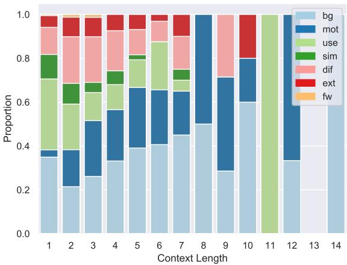
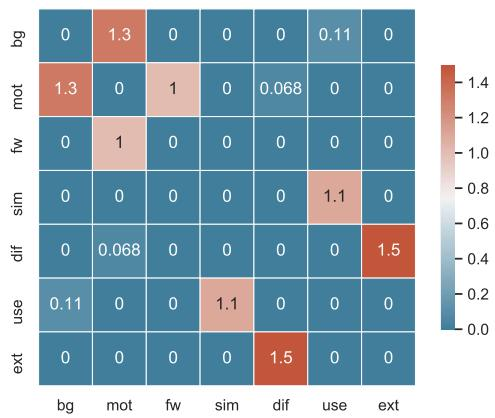
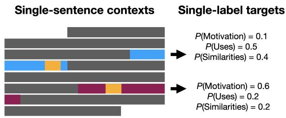
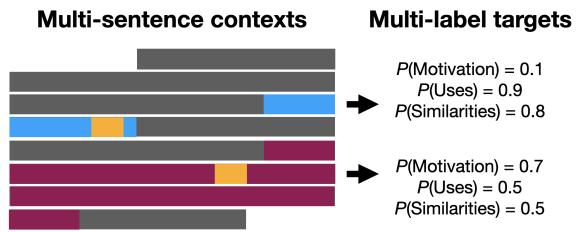
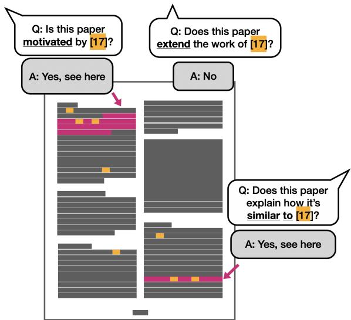
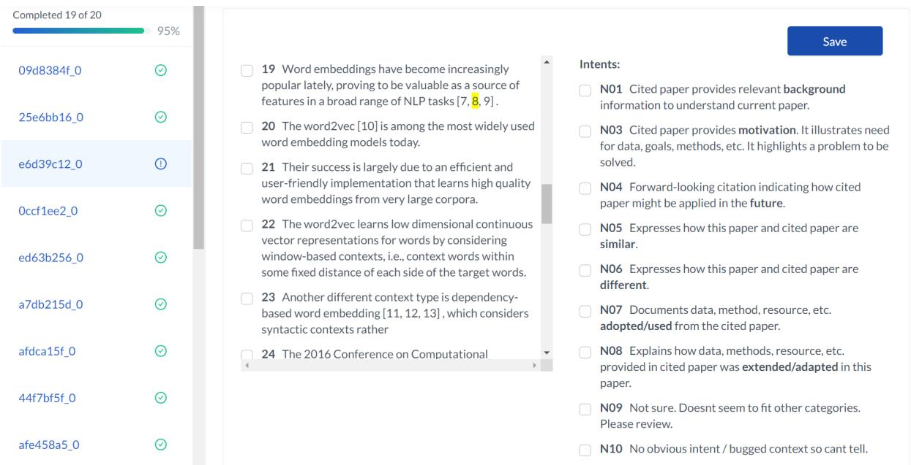
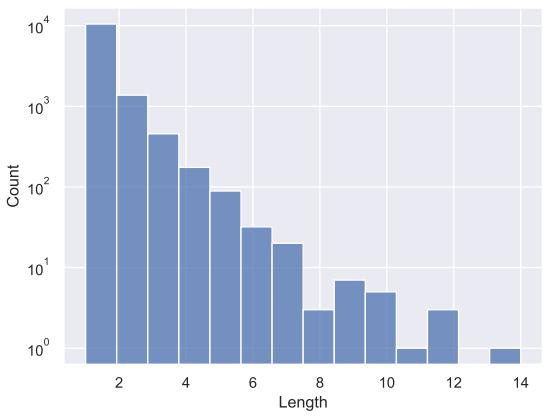
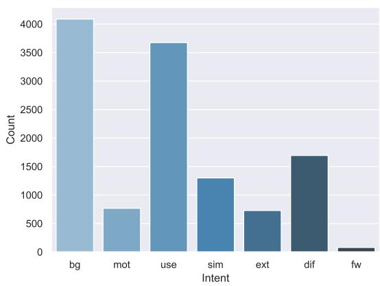

# MULTICITE: Modeling realistic citations requires moving beyond the single-sentence single-label setting

Anne Lauscher∗1 Brandon Ko2 Bailey Kuehl3 Sophie Johnson3 Arman Cohan3 David Jurgens4 Kyle Lo3

1MilaNLP, Bocconi University, Italy, 2University of Washington, Seattle WA, 3AI2, Seattle WA, 4School of Information, University of Michigan, Ann Arbor MI

anne.lauscher@unibocconi.it, 2bk36@cs.washington.edu,

3{armanc,baileyk,sophiej,kylel}@allenai.org, 4jurgens@umich.edu

## Abstract

Citation context analysis (CCA) is an important task in natural language processing that studies how and why scholars discuss each others’ work. Despite decades of study, computational methods for CCA have largely relied on overly-simplistic assumptions of how authors cite, which ignore several important phenomena. For instance, scholarly papers often contain rich discussions of cited work that span multiple sentences and express multiple intents concurrently. Yet, recent work in CCA is often approached as a single-sentence, single-label classification task, and thus many datasets used to develop modern computational approaches fail to capture this interesting discourse. To address this research gap, we highlight three understudied phenomena for CCA and release MULTICITE, a new dataset of 12.6K citation contexts from 1.2K computational linguistics papers that fully models these phenomena. Not only is it the largest collection of expert-annotated citation contexts to-date, MULTICITE contains multi-sentence, multi-label citation contexts annotated throughout entire full paper texts. We demonstrate how MULTICITE can enable the development of new computational methods on three important CCA tasks. We release our code and dataset at https://github.com/allenai/multicite.

## 1 Introduction

Citations connect the current paper to the broader discourse of science (e.g., Garfield, 1955; Siddharthan and Teufel, 2007), help signal future impact and uses (e.g., McKeown et al., 2016), and, in downstream applications, can aid in summarizing a work’s contributions (e.g., Qazvinian and Radev, 2008; Cohan and Goharian, 2015; Lauscher et al., 2017a). The study of the role and purpose of citations, known as citation context analysis (CCA

Swales, 1986), has uncovered traces of how ideas have influenced a field, collaboration and competition among peers, and trends in scientific fields.

Computational approaches to CCA have largely focused on classifying the intent or purpose of a particular citation. With the advent of deep neural models, recent CCA research efforts have focused on increasing the size of the published resources (Cohan et al., 2019; Tuarob et al., 2019; Pride and Knoth, 2020). However, larger data sets have come at the expense of oversimplifying the rich discourse patterns surrounding citations, especially as complexity of annotation is often traded for large-scale data collection. The aforementioned recent large-scale resources, for instance, have approached CCA as a single-sentence, single-label classification task, overlooking the richness and nuance with which citations are used in discourse.

Contributions. In this work, we aim to fuel and inspire research into new or understudied tasks in CCA and their respective computational methods motivated by complex phenomena in scholarly citations. Our contributions are three-fold.

1) First, we identify three phenomena of citation behavior in scholarly literature that remain understudied by prior work in CCA (§2). We then propose future CCA research also consider efforts into three tasks well-motivated by these phenomena: (§5) multi-label classification given a variablelength citation context, (§6) context identification given a citation, and the novel (§7) evidence-based assessment of citing-cited paper relationships.

2) Second, to support these tasks and other new forms of CCA research, we introduce a novel resource (§4), the Multi-Sentence Multi-Label Multi-Mention Citation (MULTICITE) corpus, an expert-annotated collection of 1.2K fulltext English-language publications from computational linguistics with 12.6K labeled citation contexts. MULTICITE substantially opens up new opportunities in CCA by being the only dataset which captures all three understudied phenomena and is large enough to support development of modern computational methods, i.e., deep neural models.

3) Finally, we lay the groundwork for future CCA research by demonstrating how one can use our new resource to develop modern computational methods to tackle each of the proposed analysis tasks. Our experiments establish strong baselines against which future work can compare.

## 2 Understudied Phenomena in CCA

Using examples, we highlight and motivate three understudied phenomena in CCA, showing that each reflects natural ways in which authors cite.

Multi-sentence contexts. While a citation appears in a particular sentence, its discussion may span that sentence and beyond. For example, consider the sentence:

“Gliozzo et al., (2005) succeeded eliminating this requirement by using the category name alone as the initial keyword, yet obtaining superior performance within the keyword-based approach.”

This sentence alone provides background information about a previous approach and consequently, one could describe its function as Background from that text. However, the subsequent sentence continues the discussion of the citation:

“The goal of our research is to further improve the scheme of text categorization from category name, which was hardly explored in prior work.”

Only by including this sentence can we identify the underlying intent of the authors: the cited publication is used as Motivation for the presented research. Through our annotation process (§4) we find that 17.1% of citation contexts involve multiple sentences. Thus, we argue that correctly modeling the precise scope of a citation – that is, its associated context – is necessary for understanding the discourse role it plays in the citing paper.

Multiple interpretations of function. A single citation may have multiple concurrent interpretations for its function. Not to be dismissed as simply being ambiguous, these multiple interpretations can stem from extended discussion of how the citing paper relates to the cited paper. Consider the sentence:

This sentence can be labeled as Similarities. However, another possibility is to label this sentence as Uses, as the authors are adopting a definition of the cited work. Further, a citation can exhibit multiple interpretations through partially overlapping or entirely different contexts:

“Results Table 1 compares the published BERT BASE resultsfrom Devlin et al. (2019) to our reimplementation with either static or dynamic masking. Wefind that our reimplementation with static masking performs similar to the original BERT model, and dynamic masking is comparable or slightly better than static masking.”

Here, the published results from the well-known BERT paper are a research artefact that is Used as a baseline (sentence 1). Then, the authors compare their reimplementation as well as their extension to these results (sentence 2), resulting in expressed Similarities as well as Differences. Through our annotation process (§4) we find that 19.3% of citations have multiple interpretations. These multiple concurrent interpretations partially explain the existence of citation contexts that extend beyond the sentence boundary, and consequently are necessary to fully model how a particular citation contributes to the scientific discourse within a paper.

Multiple mentions densely throughout paper. A single reference may be cited (or mentioned) multiple times throughout a paper, potentially with each citation’s occurrence serving a different function(s) depending on what the citing author is trying to communicate. Modeling these different citation mentions is critical to understanding all the ways a single reference paper may influence another. For instance, in §4, our paper Extends the citation labeling scheme of Jurgens et al. (2018) and then reports Similarities in dataset patterns in a separate mention. Through our annotation process in §4, we find referenced papers can be mentioned throughout a citing paper on average 9.1 times, yielding an average of 3.8 distinct interpretations over the course of a citing paper. Recognizing all the myriad functions a single reference can play throughout a citing paper is key to fully understanding the complex relationship between papers.

Motivated by these phenomena, we curate a novel resource (§4) from which we derive and formalize three CCA tasks that account for these phenomena. Systems developed to tackle these tasks can be viewed as answering the following CCA questions: (1) Given a citation context, what are all the different possible interpretations of its function or role within the citing paper (§5)? (2) Given a citation mention, what constitutes the relevant, surrounding passage that comprises its “context” (§6)? (3) Given a pair of citing-cited works, what function(s) does the cited work serve within the citing work and what are the evidential passages supporting this assessment (§7)?

## 3 Related Work

The importance and role of citations in understanding scholarly work has been recognized across multiple disciplines, from sociology (e.g., Garfield et al., 1964, 1970) to computer science (e.g., McKeown et al., 2016; Yasunaga et al., 2019; Lauscher et al., 2019; Daquino et al., 2020). Prior work in CCA has largely focused on classifying interpretations of a citation along varying dimensions, such as function (e.g., Teufel et al., 2006; Lauscher et al., 2017b), sentiment (e.g., Athar, 2011; Jha et al., 2016), or relative importance to a paper (Valenzuela et al., 2015). However, these works have frequently simplified their analyses, overlooking the important phenomena in §2.

We describe prior computational work on CCA with respect to the three phenomena pursued here. Table 1 overviews their corresponding published resources1 and shows the variation in which datasets support different lines of citation inquiry.

## Mostly single-sentence or fixed-width contexts.

While social scientists studying citations have acknowledged the broader context needed to understand citations (Swales, 1986), computational work has largely treated the citing sentence as the only context needed for CCA methods (e.g., Athar, 2011; Dong and Schäfer, 2011). In particular, while annotators in many works had access to larger context, the resulting resources still labeled only a single sentence. A handful of works have acknowledged the importance of multi-sentence, precise, and flexible or variable-length context windows (e.g., Elkiss et al., 2008; Kaplan et al., 2009; Athar and Teufel, 2012; Abu-Jbara et al., 2013; Kaplan et al., 2016, inter alia); yet, the resources associated with these works have either primarily focused on sentiment, rather than the more complex notion of citation function, or have opted for an arbitrary fixed-sized window as the correct context. In contrast, our work provides precisely-defined contexts for each citation function present. The exception is Abu-Jbara et al. (2013), who also annotate variable-length contexts, but unlike us, first extract a fixed window of 4 sentences and do not consider how citations with multiple functions can each have their respective (different) contexts.

Few capture multiple interpretations. Prior computational work has largely assumed a citation has only a single rhetorical function, or when multiple intents are present, that there is only one primary function that warrants annotation. Indeed, in some of the preceding works, ambiguous citations were reportedly removed (e.g., Cohan et al., 2019), leading to an artificial simplification of the task. Of computational work, only Athar and Teufel (2012) has attempted to model multiple interpretations. In their work, up to four sentences surrounding a citation are each assigned one sentiment-related label. In contrast, our new resource recognizes the existence of citations with multiple concurrent labels (possibly with varying contexts for a single citation) and each label is annotated with the specific context associated with that interpretation.

Lack intentional sampling for dense citations. Prior works have employed different strategies for selecting which citations they annotate. Works focused on citation sentiment have tended to label all citations within a paper or all mentions of a particular paper. However, works focusing on more complex interpretations like rhetorical function have included more selective sampling, e.g., targeting or up-sampling certain sections. For instance, while Abu-Jbara et al. (2013) model more complex citation contexts, they focus only on citations to a small specific set of highly-cited references found within a much larger set of papers. This sampling strategy can result in many references occurring only once within the citing paper, which yields datasets not much different from ones from works that do not consider multiple mentions at all (Cohan et al., 2019). Such datasets would not support CCA methods that attempt to learn holistic interpretations of how papers relate via access to many within-paper mentions. Our work is the first to consider a dedicated sampling strategy that identifies papers likely to be densely populated with myriad mentions of a particular reference (§4).

## 4 MULTICITE: A New Resource for CCA

We describe the curation process and present dataset statistics for MULTICITE, the first resource for CCA that captures all three phenomena of interest and is large enough to support development of modern neural approaches—It is the largest collection of expert-annotated citation contexts to-date.

<table><tr><td>Author/ Year</td><td>Concept†</td><td>Size</td><td>Context?</td><td>Multi-label?</td><td>Dense sampling?</td></tr><tr><td>Pride and Knoth (2020)</td><td>Purpose &amp; Influence</td><td>11,233</td><td>Single sentence</td><td>x</td><td>x</td></tr><tr><td>Cohan et al. (2019)</td><td>Intent</td><td>11,020</td><td>Single sentence</td><td>x</td><td>x</td></tr><tr><td>Ravi et al. (2018)</td><td>Sentiment</td><td>8,925</td><td>Single sentence</td><td>x</td><td>x</td></tr><tr><td>Tuarob et al. (2019)</td><td>Algorithm&#x27;s Function</td><td>8,796</td><td>3 sentences</td><td>x</td><td>x</td></tr><tr><td>Athar (2011)</td><td>Sentiment</td><td>8,736</td><td>Single sentence</td><td>x</td><td>x</td></tr><tr><td>Abu-Jbara et al. (2013)</td><td>Purpose &amp; Polarity</td><td>3,271</td><td>Variable within ±4 sent</td><td>x</td><td>x</td></tr><tr><td>Teufel et al. (2006)</td><td>Function</td><td>2,829</td><td>Surrounding paragraph</td><td>x</td><td>x</td></tr><tr><td>Jochim and Schütze (2012)</td><td>Citation Facets</td><td>2,008</td><td>Did not annotate contexts</td><td>x</td><td>x</td></tr><tr><td>Jurgens et al. (2018)</td><td>Function</td><td>1,969</td><td>Surrounding 300 chars</td><td>x</td><td>x</td></tr><tr><td>Athar and Teufel (2012)</td><td>Sentiment</td><td>1,741</td><td>Variable up to 4 sents</td><td>1 label/sent.</td><td>x</td></tr><tr><td>MULTICITE (this work)</td><td>Function</td><td>12,653</td><td>Variable, per-label</td><td>√</td><td>√</td></tr></table>

Table 1: Existing CCA datasets compared to this work along three dimensions: (1) How they define citation Contexts, (2) Whether they handle Multiple Labels per citation, and (3) Whether they employed a Sampling strategy to obtain Dense citations of a reference throughout the citing paper.

  
(a) Label distribution per context length.

  
(b) Pointwise mutual information (PMI) between labels.  
Figure 1: Results of corpus-level analysis in §4 revealing interactions between phenomena present in MULTICITE. We use the following abbreviations for the functions: Background (bg), Motivation (mot), Uses (use), Similarities (sim), Extends (ext), Differences (diff), Future Work (fw).

## 4.1 Curation process

Sampling. We procure an initial corpus of 50K full-text papers from the ACL Anthology and arXiv (with cs.CL category) using S2ORC (Lo et al., 2020), a large collection of papers released to support computing research.2 To find papers that likely exhibit our phenomena of interest, we employ the following strategy: For each paper’s references, we compute the number of distinct paragraphs in which the reference’s citation marker(s) appear, normalized by the total number of paragraphs. Retrieving the top k paper-reference pairs yields papers in which the target reference is cited many times (hopefully in many different ways).

Labeling scheme. We extend the labeling scheme of Jurgens et al. (2018) for classified citations by their rhetorical function, mirroring the approach of Teufel (2014) to differentiate between citations that identify Similarities versus those identifying Differences. The full scheme with examples is shown in Supplemental Table 5.

Annotation protocol. Annotators were given a citing paper’s full text and a target reference whose citations to consider. They were instructed to (1) read the text surrounding each mention of the target reference (highlighted automatically), (2) consider all rhetorical function labels associated with the mention, (3) and for each candidate label, to indicate every sentence3 belonging to the context for that label. To reduce ambiguity around what does (or doesn’t) belong in a citation context, we trained annotators to resolve non-citation coreferences to the cited paper as the dominant (but not only) way to observe a multi-sentence context and to continue reading until they felt confident about the labels assigned. Furthermore, for difficult cases, we instructed them to temporarily remove context sentences to see whether the label could still be inferred. Furthermore, annotators were encouraged to skip and leave comments for difficult cases which were routed to two experienced annotators for adjudication.

Recruiting and training. We hired nine NLP graduate students via Upwork. Each student went through an hour of one-on-one training and another hour of independent annotations, which were manually reviewed and used for another hour of oneon-one training focused on feedback and correcting common mistakes. Annotators were then allowed to work independently on batches of 20 papers at a time with manual annotation review after each batch for quality control. Annotators were paid between \$25-35 USD per hour4 and understood that their annotations would be publicly-released as a resource for research.

Inter-annotator agreement (IAA). Producing a single measure of IAA is difficult for data collected in this manner: annotators might agree on labels but disagree on the choice of context, vice versa, or disagree on both fronts. While some prior work has developed IAA measures that capture both context selection and labeling, e.g., γ by Mathet et al. (2015), such methods aren’t widelyadopted in NLP and thus resulting IAA values can be difficult to interpret. We opted instead to recruit two new annotators to perform two tasks: (a) identify all function labels when shown a gold context, and (b) identify context sentences when shown a citation mention and gold label pair. For (a), the two achieved an average accuracy of 0.76 when counting any gold label match as correct, and 0.70 when only counting cases when all predicted labels match the gold annotations as correct (n = 54). For (b), the two achieved an average sentence-level F1 score of 0.64, 0.63 and 0.65, respectively for gold contexts of length 1, 2 or 3+ sentences, and an overall Cohen’s Kappa of 0.65 (n = 120).

## 4.2 Corpus statistics

MULTICITE consists of 1,193 papers from CL and NLP (with an average of 139.7 sentences per paper) with 12,653 annotated citation contexts. We highlight three key aspects. (1) We find that over one in six contexts (17.1%) extends beyond a single sentence. MULTICITE provides 2,167 multi-sentence contexts, with 161 reaching 5+ sentences. See Supplemental Figure 5a for further breakdown. (2) Nearly one in five citations (19.3%) also have multiple interpretations. Of the 2,084 multi-labeled citations, most have two labels but a handful have up to four. Our label distribution is skewed with the Background and Uses appearing most frequently and Future Work the least; this is in-line with prior work (e.g., Pride and Knoth, 2020). See Supplemental Figure 5b for a full label distribution. (3) Regarding mention occurrence, we find that our sampling strategy successfully finds interesting paperreference pairs as the average of citation occurrences in a paper is 9.1. In addition, our intuition about mentions exhibiting different interpretations is supported by an average of 3.8 unique functions across all mentions of a given reference.

Looking at interactions between phenomena, we observe two interesting findings. First, we observe in Figure 1a that while every label is capable of being expressed with only a few sentences, there are surprisingly few single-sentence Motivation contexts. Second, pointwise mutual information (PMI) between the labels (Figure 1b) shows high co-occurrence in Extends and Differences.

## 4.3 Limitations

While our new resource is the largest citation dataset, our design choices introduce some limitations. Due to task complexity, annotators labeled only direct citations but not indirect mentions (e.g. entity names used without citation). Our choice in open data, including the full texts, potentially allows future work to add these to our corpus. Further, our citation annotation scheme features seven classes, which itself is a simplification of the complex ways in which citations are used. While others have proposed 12-class (Teufel, 2014) or even 35-class (Garzone and Mercer, 2000) annotation schemes to capture long-tail citation uses, we ultimately opted for a simpler scheme that facilitates scalable annotation and easier model development.

  
Figure 2: Shift in task form for citation context classification. Within a document (grey), each citation mention (orange) is associated with a surrounding context. Multisentence setting can contain both single-sentence (blue) and multi-sentence (purple) contexts. Multi-label scores need not sum to one as in the single-label setting.

## 5 Citation Context Classification

The first task we consider makes use of both the multi-sentence and multi-label phenomena described in §2: multi-label classification. One can view this as the multi-label extension to the traditional multi-class classification task common in prior work (see Figure 2), but we show experimentally that models using variable-length gold contexts yield superior results. This motivates (1) a shift in computational research away from assuming fixed-window (often 1-sentence) inputs, and (2) additional investment in understudied tasks like citation context identification (§6).

## 5.1 Modeling approach

Using Transformer (Vaswani et al., 2017) models, which have demonstrated success on many text classification tasks and datasets, we train both multiclass and multi-label predictors. For multi-class predictors (which output a single label), we follow common practices in adding a linear classification layer over the [CLS] token at the beginning of each input context and applying a softmax for prediction. For multi-label classification, we deviate by replacing the softmax with a sigmoid operation per label to produce multi-label outputs; we set our sigmoid prediction threshold to 0.5.

## 5.2 Experimental Setup

We conduct a series of experiments aligned with previous works (e.g., Jha et al., 2016), in which we feed varying amounts of context sentences to a text classification model. These experiments aim to understand the importance of variable-length inputs and to establish computational baselines to support future research on MULTICITE.

Data processing. We perform a train-validationtest split of MULTICITE at a paper-level; to avoid leakage, all examples from the same paper are assigned to the same split resulting in 5,491 training, 2,447 validation, and 3,313 test instances. Because citation contexts can contain mentions of multiple papers, we remove task ambiguity by tagging the target paper’s mention with [CITE] tokens.

Training and optimization. We use pretrained SciBERT-base and RoBERTa-large weights from Huggingface Transformers (Wolf et al., 2020). We optimize the models using the average over binary cross-entropy losses for each label using Adam (Kingma and Ba, 2015) with a batch size of 32. We use grid search based on validation set performance to set the learning rate (1e-5 or 2e-5) and number of epochs (between 1 and 9).

Evaluation. We compute two types of accuracies: a strict version, in which a prediction is correct iff all predicted labels match exactly the gold annotation; and a weak version, in which a prediction is correct if at least one of the predicted labels matches the gold classes. The weak measure reflects an upper bound on performance (i.e., whether the model can detect any of the correct intents) and allows us to compare our multi-label models with models that only return single-labels. We perform this evaluation both across all MULTICITE test examples as well as broken down by specific gold context sizes (up to 4 sentences).

## 5.3 Results

We present single run results on the test set in Table 2,5 and observe two important findings:

Variable-length contexts improve performance. Despite high occurrence of 1-sentence contexts in our corpus, a model trained on variable-length gold contexts still outperforms that trained only on single-sentence inputs (see rows “1” versus “gold”). Surprisingly, the variable-length model even outperforms the single-sentence model even on singlesentence test examples (see column “size = 1”).

<table><tr><td></td><td colspan="2">size = 1</td><td colspan="2">size = 2</td><td colspan="2">size = 3</td><td colspan="2">size = 4</td><td colspan="2">all</td></tr><tr><td>train on:</td><td>weak</td><td>strict</td><td>weak</td><td>strict</td><td>weak</td><td>strict</td><td>weak</td><td>strict</td><td>weak</td><td>strict</td></tr><tr><td>1</td><td>0.78</td><td>0.69</td><td>0.45</td><td>0.28</td><td>0.47</td><td>0.24</td><td>0.51</td><td>0.18</td><td>0.74</td><td>0.62</td></tr><tr><td>3</td><td>0.74</td><td>0.64</td><td>0.59</td><td>0.39</td><td>0.54</td><td>0.29</td><td>0.62</td><td>0.23</td><td>0.72</td><td>0.60</td></tr><tr><td>5</td><td>0.71</td><td>0.61</td><td>0.50</td><td>0.33</td><td>0.46</td><td>0.27</td><td>0.54</td><td>0.18</td><td>0.68</td><td>0.57</td></tr><tr><td>7</td><td>0.62</td><td>0.54</td><td>0.43</td><td>0.28</td><td>0.48</td><td>0.27</td><td>0.51</td><td>0.15</td><td>0.60</td><td>0.50</td></tr><tr><td>9</td><td>0.56</td><td>0.50</td><td>0.37</td><td>0.25</td><td>0.37</td><td>0.21</td><td>0.56</td><td>0.18</td><td>0.53</td><td>0.46</td></tr><tr><td>gold</td><td>0.80</td><td>0.70</td><td>0.68</td><td>0.46</td><td>0.66</td><td>0.39</td><td>0.64</td><td>0.26</td><td>0.78</td><td>0.66</td></tr></table>

Table 2: Weak and strict accuracy scores of multi-label classifiers on MULTICITE. Column “train on:” reflects the size of contexts seen at training time; rows “1”, “3”, “5”, “7” and “9” are fixed-width window sizes that contain gold citation context, while row “gold” means training with variable-length gold contexts. Columns “size = ?” correspond to the size of gold contexts supplied at test time. Best performances per column are bolded.

We hypothesize that due to the training on variable length gold contexts, the model is able to better capture the fine-grained differences between the many intent classes, and thus, performs better than a model that has seen restricted contexts only. For instance, as the label distribution varies across the different context lengths (cf. Figure 1), the input context length might serve as an additional signal to the variable-length classification model, while a model trained on a fixed window can not make any use of such length-dependent signals.

Fixed-width windows don’t cut it. One cannot simply train on fixed-width windows and hope to achieve the same performance boost as we see with variable-length contexts. In fact, the variablelength model outperforms fixed-width models even on test examples where the gold context and fixedwidth window exactly match (see rows “3” versus “gold”, column “size = 3”).

## 6 Identifying Citation Contexts

Motivated by the need for variable-length gold contexts, the second task we consider is citation context identification (Abu-Jbara et al., 2013), which has seen little research since the advent of neural models. We demonstrate experimentally how MULTICITE can be used to train modern neural models for this understudied task, thereby setting first Transformer baselines to support future study.

## 6.1 Experimental setup

Task formulation. We adopt the task formulation from Abu-Jbara et al. (2013): given a window of sentences around a target paper citation mention, predict the sentences belonging to that citation’s context—a set of sentences that are sufficient for identifying that citation’s label(s), e.g., intent.

Modeling approach. We consider models for sentence-level sequence tagging (Dernoncourt and Lee, 2017; Cohan et al., 2018), which have been used successfully to group sentences in scholarly abstracts by their discourse roles. We establish a first computational baseline on this task by adapting the approach from Cohan et al. (2018)—a SciBERT (Beltagy et al., 2019) model trained to receive as input a window of sentences separated by separator tokens [SEP], and apply a linear classification to these tokens to output sentence-level predictions.

Data processing. To study how model performance may depend on window sizes, we generate examples from every gold citation context in MULTICITE with windows of 2, 4, 6, 8 and 10 sentences.6 For each window size, we follow four desiderata: (1) As in §5, we reduce task ambiguity by tagging the target paper’s citation mention with [CITE] tokens. (2) Windows must contain nonzero context and non-context sentences. (3) Windows must contain gold contexts entirely without truncation. This results in fewer total examples for small window sizes. For instance, for windows of 2 and 6 sentences, we create 10,453 and 12,506 examples, respectively, a 20% increase in data from multi-sentence contexts. (4) To prevent exploiting positional information, gold contexts cannot always be centered in the window. We construct windows by, randomly appending non-context sentences around golds until the desired window size.

We perform 5-fold cross validation with a 70-10- 20 train-validation-test data split. To avoid leakage, all examples from the same paper are assigned to the same split in a given fold.

<table><tr><td>Window</td><td>Micro-F1</td><td>Macro-F1</td></tr><tr><td>2</td><td>75.17</td><td>80.17</td></tr><tr><td>4</td><td>81.16</td><td>85.61</td></tr><tr><td>6</td><td>79.91</td><td>84.35</td></tr><tr><td>8</td><td>76.64</td><td>81.56</td></tr><tr><td>10</td><td>72.14</td><td>77.42</td></tr></table>

Table 3: Test results for citation context identification across models trained with various input window size configurations. Best performing model row is bolded.

Training and optimization. We use pretrained weights for SciBERT-base available on Huggingface Transformers (Wolf et al., 2020), which we fine-tune with a binary (context or not) crossentropy loss over the sentence-level predictions. We use the Adam (Kingma and Ba, 2015) optimizer with a linear learning rate scheduler (with max learning rate of 3e-5 after 100 warmup steps, batch size of 36, and up to a maximum of 5 epochs). We manually chose these hyperparameters using validation performance across all folds.

Evaluation. We evaluate these models using two sentence-level F1 metrics. The micro-averaged F1 evaluates the performance across all sentences across the entire corpus as to whether they were correctly (or incorrectly) classified as belonging to the context of the target citation mention. The macro-averaged F1 averages F1-scores across sentences first computed within each paper.

We take special care to ensure fair comparison across models trained on different window sizes. For instance, the Window=2 processing only contains single-sentence contexts and model performance on only considering these examples reaches high 90 F1 scores. Instead, our evaluation is processing-agnostic—small window models are penalized for defaulting to “not context” predictions for sentences beyond their window.

## 6.2 Results

As we increase window size, performance on both metrics increases as shown in Table 3, but only to a point. Large context windows create difficulty in the model’s training due to the increased number of non-context sentences. While the performance is high enough that our model can likely serve as an effective preprocessing step for other CCA models needing variable-sized windows, our results point to the challenge and potential for new models to improve upon in identifying contextual boundaries of citation discourse.

  
Figure 3: Evidence-based assessment of citing-cited paper relationships. Given a document with all citation mentions (orange) of a target paper identified, we aim to answer questions about the function of the cited paper ([17]) within the citing work, and provide snippets as supporting evidence (pink).

## 7 Evidence-based Assessment of Citing-Cited Paper Relationships

Dense citations to a single reference reveal a multifaceted relationship between the citing and cited papers. The dense annotations in MULTICITE allow development of CCA methods that model these document-level relationships, e.g., assessing holistically how the cited work has influenced the design or outcome of the citing work. Consider an application scenario where a user wants to know why a given paper cites another. A hypothetical system might provide a paper-level assessment of their relationship and citation contexts as supporting evidence from the citing paper’s full text.

Motivated by this aspirational application, we propose a CCA task requiring document-level understanding of dense citations: Answering questions about citing-cited paper relationships by operating across multiple mentions within paper full-text. Figure 3 provides a schematic of this task, which demonstrates the novel research potential of MULTICITE at supporting higher-level CCA, and by casting CCA as a form of question answering (QA), highlights compatibility with modern attempts on scientific QA (Dasigi et al., 2021).

## 7.1 Experimental Setup

While building such a system is beyond the scope of our work, we demonstrate through experiments how MULTICITE can support development of QA models behind such applications.

Task formulation. We adapt the scientific QA task form in Dasigi et al. (2021) to our CCA setting by mapping each citation function to a questionanswer template. For instance, Background becomes a question “Does the paper cite [TARGET] for background information?” and answer “Yes”, and the Background citation context then becomes evidence for that answer.

Modeling approach. We consider the Qasper (Dasigi et al., 2021) document-grounded QA model pretrained to answer questions about NLP papers with supporting evidence. Qasper is based on the Longformer-Encoder-Decoder (LED) (Beltagy et al., 2020) architecture, which enables it to encode an entire paper’s full text as a single input string. Like the model in §6, input sentences are separated by tokens </s>, which are used to predict binary labels of Evidence (or not) via a linear classification layer. Unlike the model in §6, LED also generates strings, which we train to produce answer strings “Yes” or “No”.

Data processing. We use the same trainvalidation-test split from §5. For each citing-cited paper pair, we create seven questions (one for each of our seven rhetorical functions). To create positive examples, for all functions with at least one gold citation context, we create a “Yes”-answer and provide the first7 gold context as evidence. To create negative examples, we create a “No”-answer without evidence. This results in 4,074 training, 1,764 validation, and 2,499 test question-answer pairs.

Training and optimization. We use code and pretrained weights from Dasigi et al. (2021), which we finetune on our derived QA pairs using a joint answer-evidence loss (and within-batch loss scaling for class imbalance) from the original work. We train using Adam (Kingma and Ba, 2015) for up to 5 epochs. We use the validation set for early stopping and grid search over batch sizes 2, 4, 8 or 16 and max learning rate of 3e-5 or 5e-5.

Evaluation. Following Dasigi et al. (2021), we evaluate the model using the Answer-F1 and Evidence-F1 metrics defined in that work, where Answer-F1 captures correctness of the generated answer span and Evidence-F1 captures performance in extracting gold citation context sentences.

<table><tr><td></td><td>Answer F1</td><td>Evidence F1</td></tr><tr><td>Majority SL</td><td>0.61</td><td>0.48</td></tr><tr><td>Majority ML</td><td>0.72</td><td>0.48</td></tr><tr><td>Qasper</td><td>0.75</td><td>0.48</td></tr></table>

Table 4: Test results of the Qasper model finetuned on document-level QA examples from MULTICITE.

Baselines. We compare our model to two heuristic baselines. In MAJORITY SINGLE LABEL (SL), we always predict “Yes” for the majority class— Background. In MAJORITY MULTIPLE LABELS (ML), we predict for each of the seven question templates the majority answer (“Yes” or “No”).

## 7.2 Results

We present single run results on the test set in Table 4. While the Qasper model outperforms the heuristics at assessing citing-cited paper relationships (Answer F1), the gains from supervision are minor, and citation contexts retrieval (Evidence F1) does not outperform simple heuristics. This highlights the difficulty in this document-level understanding task and the potential for future research into powerful models capable of higher-level CCA.

## 8 Conclusion

Aiming to inspire novel research in CCA, we have acknowledged the existence of three understudied phenomena, and present MULTICITE, a novel resource that is both the largest corpus of citation contexts to-date and captures all three phenomena. We employ MULTICITE in three experiments demonstrating the importance of these phenomena, establishing strong baselines, and showcasing ways of conducting novel CCA. In the future, we intend to increase diversity of the dataset by extending it to cover more disciplines of science. We make all code and data publicly available at https://github.com/allenai/multicite.

## Acknowledgements

This work was supported in part by NSF Convergence Accelerator Award #2132318. We thank Sam Skjonsberg and Mark Neumann for their help on the annotation interface. We would also like to thank Noah Smith for helping us connect with collaborators on this project and the anonymous reviewers for their insightful feedback.

## References

Amjad Abu-Jbara, Jefferson Ezra, and Dragomir Radev. 2013. Purpose and polarity of citation: Towards nlp-based bibliometrics. In Proceedings of the Conference of the North American Chapter of the Associationfor Computational Linguistics: Human Language Technologies, pages 596–606. Association for Computational Linguistics (ACL).

Awais Athar. 2011. Sentiment Analysis of Citations Using Sentence Structure-based Features. In Proceedings ofthe ACL 2011 Student Session, HLT-SS ’11, pages 81–87, Stroudsburg, PA, USA. Association for Computational Linguistics.

Awais Athar and Simone Teufel. 2012. Contextenhanced citation sentiment detection. In Proceedings ofthe 2012 Conference ofthe North American Chapter of the Association for Computational Linguistics: Human Language Technologies, pages 597– 601, Montréal, Canada. Association for Computational Linguistics.

Iz Beltagy, Kyle Lo, and Arman Cohan. 2019. SciB-ERT: A pretrained language model for scientific text. In Proceedings of the Conference on Empirical Methods in Natural Language Processing and the 9th International Joint Conference on Natural Language Processing (EMNLP-IJCNLP). Association for Computational Linguistics.

Iz Beltagy, Matthew E. Peters, and Arman Cohan. 2020. Longformer: The long-document transformer. arXiv:2004.05150.

Arman Cohan, Waleed Ammar, Madeleine van Zuylen, and Field Cady. 2019. Structural scaffolds for citation intent classification in scientific publications. In Proceedings ofthe Conference ofthe North American Chapter of the Association for Computational Linguistics. Association for Computational Linguistics.

Arman Cohan, Franck Dernoncourt, Doo Soon Kim, Trung Bui, Seokhwan Kim, Walter Chang, and Nazli Goharian. 2018. A discourse-aware attention model for abstractive summarization of long documents. In Proceedings of the 2018 Conference of the North American Chapter of the Association for Computational Linguistics: Human Language Technologies, Volume 2 (Short Papers), pages 615–621, New Orleans, Louisiana. Association for Computational Linguistics.

Arman Cohan and Nazli Goharian. 2015. Scientific article summarization using citation-context and article’s discourse structure. In Proceedings ofthe 2015 Conference on Empirical Methods in Natural Language Processing, pages 390–400, Lisbon, Portugal. Association for Computational Linguistics.

Marilena Daquino, Silvio Peroni, David Shotton, Giovanni Colavizza, Behnam Ghavimi, Anne Lauscher, Philipp Mayr, Matteo Romanello, and Philipp Zumstein. 2020. The opencitations data model. In The

Semantic Web – ISWC 2020, pages 447–463, Cham. Springer International Publishing.

Pradeep Dasigi, Kyle Lo, Iz Beltagy, Arman Cohan, Noah A. Smith, and Matt Gardner. 2021. A dataset of information-seeking questions and answers anchored in research papers. In Proceedings of the 2021 Conference ofthe North American Chapter of the Associationfor Computational Linguistics: Human Language Technologies, pages 4599–4610, Online. Association for Computational Linguistics.

Franck Dernoncourt and Ji Young Lee. 2017. Pubmed 200k RCT: a dataset for sequential sentence classification in medical abstracts. CoRR, abs/1710.06071.

Cailing Dong and Ulrich Schäfer. 2011. Ensemble-style self-training on citation classification. In Proceedings of the 5th International Joint Conference on Natural Language Processing, pages 623–631. Association for Computational Linguistics.

Aaron Elkiss, Siwei Shen, Anthony Fader, Güne¸s Erkan, David States, and Dragomir Radev. 2008. Blind men and elephants: What do citation summaries tell us about a research article? J. Am. Soc. Inf. Sci. Technol., 59(1):51–62.

Eugene Garfield. 1955. Citation indexes for science. Science, 122(3159):108–111.

Eugene Garfield, Irving H Sher, and Richard J Torpie. 1964. The use of citation data in writing the history of science. Technical report, Institute for Scientific Information Inc Philadelphia PA.

Eugene Garfield et al. 1970. Citation indexing for studying science. Nature, 227(5259):669–671.

Mark Garzone and Robert E Mercer. 2000. Towards an automated citation classifier. In Conference of the canadian society for computational studies of intelligence, pages 337–346. Springer.

Myriam Hernández-Alvarez and José Gomez. 2016. Survey about citation context analysis: Tasks, techniques, and resources. Natural Language Engineering, 22(3):327–349.

Sehrish Iqbal, Saeed-Ul Hassan, Naif Radi Aljohani, Salem Alelyani, Raheel Nawaz, and Lutz Bornmann. 2020. A decade of in-text citation analysis based on natural language processing and machine learning techniques: An overview of empirical studies. arXiv preprint arXiv:2008.13020.

Rahul Jha, Amjad-Abu Jbara, Vahed Qazvinian, and Dragomir R. Radev. 2016. NLP-driven citation analysis for scientometrics. Natural Language Engineering, pages 1–38.

Charles Jochim and Hinrich Schütze. 2012. Towards a Generic and Flexible Citation Classifier Based on a Faceted Classification Scheme. In Proceedings of the 24th International Conference on Computational Linguistics (COLING 2012).

David Jurgens, Srijan Kumar, Raine Hoover, Dan Mc-Farland, and Dan Jurafsky. 2018. Measuring the evolution of a scientific field through citation frames. Transactions of the Association for Computational Linguistics, 6:391–406.

Dain Kaplan, Ryu Iida, and Takenobu Tokunaga. 2009. Automatic extraction of citation contexts for research paper summarization: A coreference-chain based approach. In Proceedings of the 2009 Workshop on Text and Citation Analysisfor Scholarly Digital Libraries (NLPIR4DL), pages 88–95, Suntec City, Singapore. Association for Computational Linguistics.

Dain Kaplan, Takenobu Tokunaga, and Simone Teufel. 2016. Citation block determination using textual coherence. Journal of Information Processing, 24(3):540–553.

Diederik P. Kingma and Jimmy Ba. 2015. Adam: A method for stochastic optimization. In 3rd International Conference on Learning Representations, ICLR 2015, Conference Track Proceedings, San Diego, CA, USA.

Anne Lauscher, Goran Glavaš, and Kai Eckert. 2017a. University of mannheim@ clscisumm-17: Citationbased summarization of scientific articles using semantic textual similarity. In CEUR workshop proceedings, volume 2002, pages 33–42. RWTH.

Anne Lauscher, Goran Glavaš, Simone Paolo Ponzetto, and Kai Eckert. 2017b. Investigating convolutional networks and domain-specific embeddings for semantic classification of citations. In Proceedings ofthe 6th International Workshop on Mining Scientific Publications, WOSP 2017, page 24–28, New York, NY, USA. Association for Computing Machinery.

Anne Lauscher, Yide Song, and Kiril Gashteovski. 2019. Minscie: citation-centered open information extraction. In 2019 ACM/IEEE Joint Conference on Digital Libraries (JCDL), pages 386–387. IEEE.

Kyle Lo, Lucy Lu Wang, Mark Neumann, Rodney Kinney, and Daniel Weld. 2020. S2ORC: The semantic scholar open research corpus. In Proceedings ofthe 58th Annual Meeting ofthe Associationfor Computational Linguistics, pages 4969–4983, Online. Association for Computational Linguistics.

Yann Mathet, Antoine Widlöcher, and Jean-Philippe Mé- tivier. 2015. The unified and holistic method gamma (Î3) for inter-annotator agreement measure and alignment. Computational Linguistics, 41(3):437–479.

Kathy McKeown, Hal Daume, Snigdha Chaturvedi, John Paparrizos, Kapil Thadani, Pablo Barrio, Or Biran, Suvarna Bothe, Michael Collins, Kenneth R. Fleischmann, Luis Gravano, Rahul Jha, Ben King, Kevin McInerney, Taesun Moon, Arvind Neelakantan, Diarmuid O’Seaghdha, Dragomir Radev, Clay Templeton, and Simone Teufel. 2016. Predicting the impact of scientific concepts using full-text features. J. Assoc. Inf. Sci. Technol., 67(11):2684–2696.

Mark Neumann, Daniel King, Iz Beltagy, and Waleed Ammar. 2019. ScispaCy: Fast and robust models for biomedical natural language processing. In Proceedings of the 18th BioNLP Workshop and Shared Task, pages 319–327, Florence, Italy. Association for Computational Linguistics.

David Pride and Petr Knoth. 2020. An authoritative approach to citation classification. In Proceedings of the ACM/IEEE Joint Conference on Digital Libraries (JCDL). Association for Computing Machinery.

Vahed Qazvinian and Dragomir R. Radev. 2008. Scientific paper summarization using citation summary networks. In Proceedings ofthe 22nd International Conference on Computational Linguistics (Coling 2008), pages 689–696, Manchester, UK. Coling 2008 Organizing Committee.

Kumar Ravi, Srirangaraj Setlur, Vadlamani Ravi, and Venu Govindaraju. 2018. Article citation sentiment analysis using deep learning. In 2018 IEEE 17th International Conference on Cognitive Informatics & Cognitive Computing (ICCI\* CC), pages 78–85. IEEE.

Advaith Siddharthan and Simone Teufel. 2007. Whose idea was this, and why does it matter? attributing scientific work to citations. In Human Language Technologies 2007: The Conference of the North American Chapter ofthe Associationfor Computational Linguistics; Proceedings of the Main Conference, pages 316–323, Rochester, New York. Association for Computational Linguistics.

John Swales. 1986. Citation analysis and discourse analysis. Applied linguistics, 7(1):39–56.

Simone Teufel. 2014. Scientific argumentation detection as limited-domain intention recognition. In ArgNLP.

Simone Teufel, Advaith Siddharthan, and Dan Tidhar. 2006. Automatic Classification of Citation Function. In Proceedings ofthe 2006 Conference on Empirical Methods in Natural Language Processing, EMNLP ’06, pages 103–110, Stroudsburg, PA, USA. Association for Computational Linguistics.

Suppawong Tuarob, Sung Woo Kang, Poom Wettayakorn, Chanatip Pornprasit, Tanakitti Sachati, Saeed-Ul Hassan, and Peter Haddawy. 2019. Automatic classification of algorithm citation functions in scientific literature. IEEE Transactions on Knowledge and Data Engineering.

Marco Valenzuela, Vu Ha, and Oren Etzioni. 2015. Identifying meaningful citations. In AAAI workshop: Scholarly big data.

Ashish Vaswani, Noam Shazeer, Niki Parmar, Jakob Uszkoreit, Llion Jones, Aidan N Gomez, Ł ukasz Kaiser, and Illia Polosukhin. 2017. Attention is all you need. In Advances in Neural Information Processing Systems, volume 30. Curran Associates, Inc.

Thomas Wolf, Lysandre Debut, Victor Sanh, Julien Chaumond, Clement Delangue, Anthony Moi, Pierric Cistac, Tim Rault, Remi Louf, Morgan Funtowicz, Joe Davison, Sam Shleifer, Patrick von Platen, Clara Ma, Yacine Jernite, Julien Plu, Canwen Xu, Teven Le Scao, Sylvain Gugger, Mariama Drame, Quentin Lhoest, and Alexander Rush. 2020. Transformers: State-of-the-art natural language processing. In Proceedings ofthe 2020 Conference on Empirical Methods in Natural Language Processing: System Demonstrations, pages 38–45, Online. Association for Computational Linguistics.

Michihiro Yasunaga, Jungo Kasai, Rui Zhang, Alexander R Fabbri, Irene Li, Dan Friedman, and Dragomir R Radev. 2019. Scisummnet: A large annotated corpus and content-impact models for scientific paper summarization with citation networks. In Proceedings of the AAAI Conference on Artificial Intelligence, volume 33, pages 7386–7393.

## A Reliability of the Mention Annotation

To compute the reliability of the automatic mention annotation, we let annotators manually identify all references to the cited work including citation markers, scientific entity names, and other co-references, e.g., “The authors ...”, in a small sample of 262 publication pairs. We then compute the agreement with the gamma tool (Mathet et al., 2015) and obtain a mean score of 0.60 gamma macro averaged over the publications. We therefore explicitly instruct our annotators to use the highlighting as a rough guidance but to manually check for other mentions and co-references.

## B Intent Labeling Scheme

We describe each intent of our labeling scheme in Table 5.

## C Annotation Interface

A screenshot of the annotation interface is shown in Figure 4.

## D Detailed Data Analysis

We show the detailed context length distribution and intent distribution in Figures 5. While most citations contexts are only a single sentence, our analysis shows a substantial long tail of context lengths. The distribution of citation functions mirrors results seen in similar annotation schemes such as Jurgens et al. (2018) and Pride and Knoth (2020). However, note that the Differences and Similarities classes occur with different frequencies, with authors more likely to highlight distinguishing features of their own work. This finding helps support our choice in explicitly splitting the CompareOr-Contrast category of Jurgens et al. (2018) in the labeling scheme we use for MULTICITE.

## E Detailed Model Descriptions

SciBERT is only available in base configuration (12 layers, 12 attention heads, 768 as hidden size, cased vocabulary with size 31, 116). For RoBERTa, we employ the large version (24 layers, 16 attention heads, hidden size 1024, cased vocabulary with size 50, 265). Links to code base and pretrained models are given in Table 6.

## F Full table for §5

<table><tr><td>Intent</td><td>Description</td></tr><tr><td>Background</td><td>The target paper provides relevant information for this domain.</td></tr><tr><td>Motivation</td><td>The target paper provides motivation for the source paper. For instance, it illustrates the need for data, goals, methods etc.</td></tr><tr><td>Uses</td><td>The source paper uses an idea, method, tool, etc. of the target paper.</td></tr><tr><td>Extends</td><td>The source paper extends an idea, method, tool, etc. of the target paper.</td></tr><tr><td>Similarities</td><td>The source paper expresses similarities towards the target paper. Either similarities between the source and the target paper or similarities between another publication and the target paper.</td></tr><tr><td>Differences</td><td>The source paper expresses differences towards the target paper. Either differences between the source and the target paper or differences between another publication and the target paper.</td></tr><tr><td></td><td>Future Work The target paper is a potential avenue for future research. Often corresponds to hedging or speculative language about work not yet performed.</td></tr></table>

Table 5: Our citation intent labeling scheme based on Jurgens et al. (2018). We differ from their scheme by splitting their ComparisonOrContrast into separate categories—Similarities or Differences—which are represented in other annotation schemes

  
Figure 4: The interface of our dedicated annotation platform: on the left hand side, the annotator can browse through their assigned papers; in the center, each sentence (choosable via checkboxes) of the citing paper is displayed with citation mentions of the target reference paper highlighted in yellow; on the right hand side, available rhetorical function labels (choosable via checkboxes).

  
(a) Context length distribution (log scale).

  
(b) Distribution of rhetorical function classes.  
Figure 5: Corpus-level statistics from analysis in §4. We use the following function abbreviations: Background (bg), Motivation (mot), Uses (use), Similarities (sim), Extends (ext), Differences (diff), Future Work (fw).

<table><tr><td>Codebase</td><td>Model</td><td>URL</td></tr><tr><td rowspan="3">Transformers</td><td></td><td>https://github.com/huggingface/transformers</td></tr><tr><td></td><td>SciBERT https://huggingface.co/allenai/scibert_scivocab_ uncased</td></tr><tr><td></td><td>RoBERTa https://huggingface.co/roberta-large</td></tr></table>

Table 6: Links to codebases and pretrained models used in this work.

<table><tr><td rowspan="2"></td><td rowspan="2">train on:</td><td colspan="2">size = 1 support = 2795</td><td colspan="2">size = 2 support = 335</td><td colspan="2">size = 3  $\mathrm { s u p p o r t } = 1 1 2$ </td><td colspan="2">size = 4  $\mathrm { s u p p o r t } = 3 9$ </td><td colspan="2">all  $\mathrm { s u p p o r t } = 3 3 1 3$ </td></tr><tr><td>weak</td><td>strict</td><td>weak</td><td>strict</td><td>weak</td><td>strict</td><td>weak</td><td>strict</td><td>weak</td><td>strict</td></tr><tr><td rowspan="6">SciBERT</td><td>1</td><td>0.78</td><td>0.69</td><td>0.45</td><td>0.28</td><td>0.47</td><td>0.24</td><td>0.51</td><td>0.18</td><td>0.74</td><td>0.62</td></tr><tr><td>3</td><td>0.74</td><td>0.64</td><td>0.59</td><td>0.39</td><td>0.54</td><td>0.29</td><td>0.62</td><td>0.23</td><td>0.72</td><td>0.60</td></tr><tr><td>5</td><td>0.71</td><td>0.61</td><td>0.50</td><td>0.33</td><td>0.46</td><td>0.27</td><td>0.54</td><td>0.18</td><td>0.68</td><td>0.57</td></tr><tr><td>7</td><td>0.62</td><td>0.54</td><td>0.43</td><td>0.28</td><td>0.48</td><td>0.27</td><td>0.51</td><td>0.15</td><td>0.60</td><td>0.50</td></tr><tr><td>9</td><td>0.56</td><td>0.50</td><td>0.37</td><td>0.25</td><td>0.37</td><td>0.21</td><td>0.56</td><td>0.18</td><td>0.53</td><td>0.46</td></tr><tr><td>gold</td><td>0.80</td><td>0.70</td><td>0.68</td><td>0.46</td><td>0.66</td><td>0.39</td><td>0.64</td><td>0.26</td><td>0.78</td><td>0.66</td></tr><tr><td rowspan="6">RoBERTa</td><td>1</td><td>0.80</td><td>0.69</td><td>0.46</td><td>0.29</td><td>0.46</td><td>0.25</td><td>0.56</td><td>0.18</td><td>0.75</td><td>0.63</td></tr><tr><td>3</td><td>0.78</td><td>0.66</td><td>0.59</td><td>0.41</td><td>0.50</td><td>0.27</td><td>0.62</td><td>0.18</td><td>0.75</td><td>0.61</td></tr><tr><td>5</td><td>0.75</td><td>0.63</td><td>0.54</td><td>0.39</td><td>0.54</td><td>0.32</td><td>0.59</td><td>0.21</td><td>0.72</td><td>0.59</td></tr><tr><td>7</td><td>0.73</td><td>0.62</td><td>0.53</td><td>0.37</td><td>0.44</td><td>0.24</td><td>0.56</td><td>0.21</td><td>0.70</td><td>0.58</td></tr><tr><td>9</td><td>0.71</td><td>0.59</td><td>0.54</td><td>0.36</td><td>0.46</td><td>0.26</td><td>0.54</td><td>0.15</td><td>0.68</td><td>0.55</td></tr><tr><td>gold</td><td>0.81</td><td>0.69</td><td>0.70</td><td>0.50</td><td>0.67</td><td>0.45</td><td>0.59</td><td>0.28</td><td>0.79</td><td>0.66</td></tr></table>

Table 7: Expanded results from Table 2 to include RoBERTa scores. The conclusions drawn in §5 are the same.