# Machine-in-the-Loop Rewriting for Creative Image Captioning

Vishakh Padmakumar New York University vishakh@nyu.edu

He He New York University hehe@cs.nyu.edu

## Abstract

Machine-in-the-loop writing aims to build models that assist humans to accomplish their writing tasks more effectively. Prior work has found that providing users a machine-written draft or sentence-level continuations has limited success since the generated text tends to deviate from users’ intention. To allow the user to retain control over the content, we train a rewriting model that, when prompted, modifies specified spans of text within the user’s original draft to introduce descriptive and figurative elements in the text. We evaluate the model on its ability to collaborate with humans on the task of creative image captioning. On a user study through Amazon Mechanical Turk, our model is rated to be more helpful by users than a baseline infilling language model. In addition, third-party evaluation shows that users write more descriptive and figurative captions when collaborating with our model compared to completing the task alone. However, the improvement is not uniform across user groups: the model is more helpful to skilled users, which risks widening the gap between skilled and novice users, highlighting a need for careful, user-centric evaluation of interactive systems.1

## 1 Introduction

Creative writing tasks are challenging for humans because of their open-ended nature. Prior work shows that exposing authors to a collaborator that provides independent suggestions can spark new ideas (Garfield, 2008). This has motivated a line of work in machine-in-the-loop writing (Clark et al., 2018; Roemmele and Gordon, 2015; Samuel et al., 2016) where a human collaborates with a model to complete a writing task. However, recent work has shown that providing humans a draft generated by a machine is not very helpful because it may diverge from the direction envisioned by the author (Clark et al., 2018). As a result, very little machinegenerated text is ultimately retained (Akoury et al., 2020).

In this work, we aim to provide a form of interaction that gives human authors more control over the content while also assisting them to better express their own ideas (Roemmele and Gordon, 2015). We focus on the setting where authors have a clear writing outline but would benefit from suggestions on wording or framing. To allow authors to control the content, we develop a machine-in-the-loop system called Creative Rewriting Assistant (CRA) which either rewrites a span of text or infills between two pieces of text when requested (Figure 1). CRA is a sequence-to-sequence model, building upon recent advances in controllable text generation (Shih et al., 2019; Ma et al., 2020; Kumar et al., 2020) and text infilling (Donahue et al., 2020; Fedus et al., 2018; Joshi et al., 2019; Shen et al., 2020). We train the CRA model on a pseudo-parallel corpus of sentence pairs—a generic sentence and a more descriptive or figurative alternative (Section 3.1).

We evaluate the model on the task of creative image captioning (Section 2). Users that collaborate with CRA report that it is significantly more helpful than a baseline infilling language model (Section 5.1). Additionally, through a controlled experiment, we find that, on average, users writing with CRA produce more creative captions than those writing without assistance, highlighting the endto-end benefit of our machine-in-the-loop setup (Section 5.3). In particular, users writing with the model produce captions with a more diverse vocabulary.

To understand how the system impacts different users, we analyze the user-model interaction logs (Section 6) and find that the machine-in-the-loop setup is more helpful to skilled writers because they tend to request targeted suggestions for shorter spans of text while giving the model sufficient context. This highlights a need to study the impact of study of interactive systems on different user groups as these become more ubiquitous in assisting content generation given that this technology could result in an even wider gap in performance between different users.

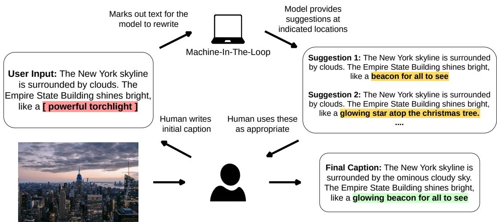  
Figure 1: Machine-in-the-loop rewriting for image captioning. The human is the central actor in the writing process and initiates interactions with the model by indicating what spans of text are to be rewritten . The model provides suggestions at these locations and the user chooses how to use them

## 2 System Overview

Creative Image Captioning To evaluate our system, ideally, we would use tasks like poem or story writing. However, it is challenging to control the content for a fair comparison of different systems on such open-ended tasks. Therefore, we evaluate on a proxy task, creative image captioning (Chen et al., 2015), where the user is asked to write an expressive caption (a figurative or descriptive one as opposed to a literal one) for a given image. The user is given access to a model that provides editing suggestions while they are working on the task. Our goal is to study if collaborating with the model makes them more effective at completing the task. Note that our model does not use the image when generating the suggestions, which is analogous to real use cases where the model does not have access to the author’s global writing plan but instead provide improvements based on the local textual context.

Machine-in-the-Loop Rewriting An overview of our system is illustrated in Figure 1. The user collaborates with the model to complete the writing task. We follow the user-initiative setup (Clark et al., 2018) where the model provides suggestions only when requested by the user. The system facilitates two types of editing: span rewriting and text infilling. Given a piece of text (written by the user), to request span rewriting, the user demarcates spans within the text that need to be rewritten. The model then edits the marked spans. For example, given “The iPhone was a [great piece of technology] that changed the world”, the model suggests the rewrite “The iPhone was a revolution in technology that changed the world”. To request text infilling, the user marks blanks to be infilled. For example, given “The lion stalks the deer, a in its element”, the model infills “The lion stalks the deer, a predator in its element”.

By limiting the edits to local spans, we alleviate the issue of deviating from the input content or generating incoherent text (Holtzman et al., 2019; Wang and Sennrich, 2020). For both rewriting and infilling, multiple suggestions are provided for the user to consider. Then, they have the option to either accept a suggestion and continue writing, or reject them and retain their initial draft. This interactive process continues until the user is satisfied with the text and indicates the completion of the writing task.

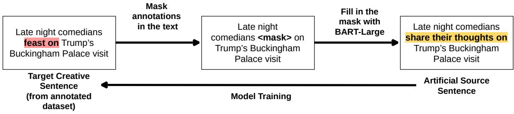

Figure 2: Training data creation. The source sentence is created by masking out the annotated span and infilling it using BART-Large . The model is then trained to produce the creative sentence from the synthesized source sentence.
<table><tr><td rowspan=1 colspan=1>Source</td><td rowspan=1 colspan=1>Domain</td><td rowspan=1 colspan=1>Annotation</td><td rowspan=1 colspan=1>Example</td></tr><tr><td rowspan=1 colspan=1>Mohammad   et  al.(2016)</td><td rowspan=1 colspan=1>WordNet examplesentences</td><td rowspan=1 colspan=1>Words thatt elicitemotion</td><td rowspan=1 colspan=1>I attacked the problem as soon as I was up.</td></tr><tr><td rowspan=1 colspan=1>Gordon et al. (2015)</td><td rowspan=1 colspan=1>Text collected byMohler et al. (2015)</td><td rowspan=1 colspan=1>Metaphors in text</td><td rowspan=1 colspan=1>I will be out in the city today, feeling the vinousveinous thrust of blood, the apple-red circula-tion of democracy, its carnal knowledge with-out wisdom.</td></tr><tr><td rowspan=1 colspan=1>Bostan et al. (2020)</td><td rowspan=1 colspan=1>Headlines</td><td rowspan=1 colspan=1>Textual cues associ-ated with emotion</td><td rowspan=1 colspan=1>Detention centers will shock the conscience ofthe nation.</td></tr><tr><td rowspan=1 colspan=1>Niculae and Danescu-Niculescu-Mizil (2014)</td><td rowspan=1 colspan=1>Product reviews</td><td rowspan=1 colspan=1>Figurative language</td><td rowspan=1 colspan=1>The stones appeared dull and almost opaque,like black onyx, with none of the sparkle youwould expect from something called a diamond.</td></tr><tr><td rowspan=1 colspan=1>Steen et al. (2010)</td><td rowspan=1 colspan=1>News, fiction andacademic text</td><td rowspan=1 colspan=1>Metaphors and per-sonification</td><td rowspan=1 colspan=1>Like a buzzard in the eyrie, he would flyaround.</td></tr></table>

Table 1: Sources of creative text and annotations used for creating training examples.

## 3 Approach

## 3.1 Learning from Creative Text

Our goal is to train a model capable of rewriting specific spans of an input sentence requested by a user, to assist them with the creative writing task. To this end, we need a dataset of paired sentences where the target sentence is produced by replacing or inserting text spans in the source sentence to make it more descriptive or figurative. While no such datasets exist, there are many resources that study creative text by annotating text spans with their corresponding literary devices (including metaphors, emotional cues, and figurative comparisons). We thus take the creative text from these datasets as the target sentences, and synthesize the source sentences by replacing the annotated creative spans with infills from a generic language model, which typically produces less creative text. An example is shown in Figure 2.

Specifically, we start with a creative sentence from one of the datasets listed in Table 1, mask the annotated creative spans in it, and infill them using the pre-trained BART model (Lewis et al., 2019) to generate the non-creative source sentence. For each pair from this pseudo-parallel corpus, we create one rewriting example by inserting the rewrite markers, <replace> and </replace>, at the beginning and the end of the rewritten span, as well as one infilling example by replacing the span with a mask token, <mask>. We then train CRA to predict the creative sentences given the generic source sentence using cross-entropy loss.

## 3.2 Learning from Interactions

One important advantage of machine-in-the-loop systems is that they can be improved given user feedback. Once users interact with CRA, we obtain their reaction to the suggestions, i.e. acceptance and rejection. This feedback allows us to update the model, so that it adapts to the observed user preference over time. Specifically, we create an example pair whenever the user indicates a preference for one sentence over another when presented with model suggestions. When the user accepts a suggestion, we take the accepted suggestion as the target (creative) sentence and the user’s initial input as the source (non-creative) sentence. Similarly, when the user rejects a suggestion, we take the rejected suggestion as the source and the user’s initial input as the target. Thus, the model always learns to improve the source sentence. We then add these new pairs to a similar-sized subset of the original training examples (to prevent forgetting) and fine-tune the rewriting model on the combined dataset.

## 4 Experimental Design

We train the CRA model using the scheme laid out in Section 3.1 and deploy it in the machine-in-theloop setup detailed in Section 2 in order to answer the following research questions.

User Experience When we study collaborative writing, the key stakeholder is the user so we evaluate if users writing in tandem with CRA find the model helpful. To answer this, we run a user study and compare suggestions obtained from CRA and a baseline BART model in the machine-in-the-loop setup (Section 5.1). Once CRA is deployed with real users, we would like to adapt it to users’ preferences inferred from the observed interactions. Hence we also compare a user-adapted model (per Section 3.2) to the previously deployed CRA (Section 5.2).

Quality of the Writing We also want to study the outcome of the collaboration. In particular, does CRA help users’ write higher quality captions for images? We compare captions collected from the machine-in-the-loop setup to those obtained from solo-writers using third-party annotators to see if users write more creative captions in a collaborative setup (Section 5.3).

Broader Impact of Collaboration In the machine-in-the-loop setup, we introduce CRA into the writing process. This intervention potentially impacts different users differently. In particular, we study how skilled and novice user groups interact with CRA to understand how such a model impacts the skill gap between users of different backgrounds (Section 6).

## 5 Experiments

User Study We hire users on Amazon Mechanical Turk to perform the creative image captioning task. A screenshot of our user interface and the details about worker remuneration are provided in Appendix B. The plan for our user study was approved by the Institutional Review Board of our university. Each user is presented with an image and asked to write a caption that is as figurative and/or descriptive as possible with at least 100 characters. The images were randomly sampled from the figurative subset of the Déjà Captions dataset (Chen et al., 2015), where the gold caption contains literary elements like metaphors and hyperbole. We ask users to request suggestions from the model at least twice while they are writing; however, they are free to ignore the suggestions. Users are instructed to use square brackets (as seen in Figure 1) to mark spans to be rewritten and underscore to indicate blanks to be infilled. They can edit the text with the model iteratively until they are satisfied with the caption. Once users submit the final caption, they are asked to complete a survey to rate the helpfulness and grammaticality of the assistant as well as their satisfaction with the final caption. The full task instruction is provided in Appendix B.

Model Details To train the CRA model, we first create the pseudo-parallel corpus as detailed in Section 3.1. Using creative sentences from all the sources from Table 1, we obtain a corpus containing 42,000 training pairs, 2,000 validation pairs, and 1,626 test pairs. The CRA model is trained by fine-tuning the fairseq (Ott et al., 2019) implementation of BART on the training set of this corpus We train the BART-Large pre-trained checkpoint from fairseq for 5 epochs with a learning rate of $3 \times 1 0 ^ { - 5 }$ . The learning rate was selected by held-out perplexity on the validation set. We use the recommended default values in fairseq for the hyperparameters of the Adam optimizer (Kingma and Ba, 2014), dropout rate, and learning rate scheduler.2

To evaluate whether CRA provides helpful suggestions, we compare its performance to a pretrained infilling language model, BART (Lewis et al., 2019). When using BART for rewriting, we mask and then infill the spans of text demarcated by users (regardless of whether they are meant to be rewritten or infilled). To produce creative generations, a balance between diversity and fluency is desired during decoding. A small internal pilot shows a lack of diversity in beam search outputs. Thus, we use top-k sampling for both models, with k set to 10.

## 5.1 User Evaluation of Suggestion Quality

To evaluate the quality of the suggestions provided by CRA vs. the pre-trained BART baseline, we conduct A/B testing on 50 images randomly sampled from the Déjà Captions dataset. Upon connecting to our server, each user is randomly assigned to work with either BART or CRA. We ensure that each image has one caption from each model. In addition, users working with both models are recruited from the same pool during the same time period, which minimizes the difference in performance due to individual users.

Once the task is completed, we ask the user to answer the following questions about the model on a Likert scale of 1 (worst) to 5 (best):

• How helpful were the model suggestions?

• How grammatically correct were the model suggestions?

• How satisfied were you with the final caption? In addition, to analyze the effect of users’ initial writing ability, we ask them to assess their writing skills:

• How would you rate your own writing ability on a scale of 1 to 5? 1—I don’t have much experience with writing or am not too confident with the language, to 5—I have writing experience and/or have considerable proficiency with the English language.

We also examine if this user-rated helpfulness tallies with automatic metrics that we compute on the observed interactions.

Results The results from the survey are presented in Table 2. Each reported value is an average of 50 user responses. We find that, on average, users find CRA to be more helpful than BART and report no significant difference between the two models in terms of grammaticality. By training CRA on the pseudo-parallel creative corpus, we align the model suggestions better to the creative writing task, resulting in a more helpful collaborator.

To see if the human evaluation tallies with automatic metrics, we calculate the fraction of model suggestions accepted by the users, across the 50 user responses, is reported in Table 3. CRA has a higher acceptance rate than BART, consistent with the helpfulness rating from users. The total number of suggestions requested from BART is slightly higher, perhaps explained by its lower acceptance rate—users may persist with variants upon receiving unsatisfactory suggestions.

Accepting a suggestion does not necessarily mean that it is useful since the user may further edit it. In fact, prior work has shown that a large fraction of the suggested text is not retained by the user (Akoury et al., 2020). To measure how much of the accepted suggestions are actually used, we calculated the Rouge-L recall score of accepted suggestions against the final caption submitted by the user. As shown in Table 3, larger fractions of CRA’s suggestions were retained by users.

<table><tr><td rowspan=1 colspan=1>Question</td><td rowspan=1 colspan=1>BART</td><td rowspan=1 colspan=1>CRA</td></tr><tr><td rowspan=1 colspan=1>Helpfulness</td><td rowspan=1 colspan=1>2.23*</td><td rowspan=1 colspan=1>3.06*</td></tr><tr><td rowspan=1 colspan=1>Grammaticality</td><td rowspan=1 colspan=1>2.96</td><td rowspan=1 colspan=1>3.22</td></tr><tr><td rowspan=1 colspan=1>Satisfaction</td><td rowspan=1 colspan=1>3.69</td><td rowspan=1 colspan=1>3.65</td></tr></table>

Table 2: User evaluation of model performance for pretrained BART baseline vs. CRA. Each value is an average across 50 user scores per model. Bold values correspond to the higher average. Rows marked with an asterisk indicates statistically significant differences (pvalue < 0.05 according to a Mann-Whitney-Wilcoxon test). Users find the CRA model to be more helpful by a statistically significant margin.

<table><tr><td rowspan=1 colspan=1></td><td rowspan=1 colspan=1>#request</td><td rowspan=1 colspan=1># accepted</td><td rowspan=1 colspan=1>%accepted</td><td rowspan=1 colspan=1>Rouge-L</td></tr><tr><td rowspan=1 colspan=1>BART</td><td rowspan=1 colspan=1>151</td><td rowspan=1 colspan=1>37</td><td rowspan=1 colspan=1>24.5</td><td rowspan=1 colspan=1>0.744</td></tr><tr><td rowspan=1 colspan=1>CRA</td><td rowspan=1 colspan=1>141</td><td rowspan=1 colspan=1>45</td><td rowspan=1 colspan=1>31.9</td><td rowspan=1 colspan=1>0.824</td></tr></table>

Table 3: Interaction statistics - How many suggestions were requested and accepted for the different models aggregated across 50 users for each model and the Rouge-L recall scores of accepted model generations against the final caption submitted by the user. The higher score of the two is bolded. Users accept more suggestions and retain more text from CRA.

## 5.2 Effect of Learning from User Interaction

From Section 5.1, we see that users find CRA to be more helpful than an infilling baseline model. In order to further align CRA to users’ preferences, we fine-tune the model on paired examples created from their acceptance and rejection of the model suggestions (Section 3.2). The interactions with 50 users (collaborating with the CRA) result in a dataset of 474 pairs of sentences. To ensure that the model does not overfit to these examples and forget prior training on the pseudo-parallel creative corpus (Section 3.1), we also sampled 450 sentence pairs from it and added these to the interaction dataset. We then fine-tune the previously deployed CRA model for 5 epochs on this dataset. We choose the learning rate of 3 10−6 using five-fold crossvalidation with the criteria of label smoothed crossentropy loss 3. We evaluate this user-adapted CRA model against the initial CRA model on a fresh sample of 50 images, following the A/B testing setup from Section 5.1 .

Does user feedback improve the model? Our hypothesis is that adapting the model to user feedback should make it more helpful for subsequent users. From Table 4, we see that the users do find the updated model to be slightly more helpful than the initial model on average; however, a Mann-Whitney-Wilcoxon test shows that this difference is not statistically significant (p-value = 0.402). A possible reason is that the different usage patterns of different users leads to the model getting noisy feedback and not significantly improving on the initial trained state. Thus, a potential future direction is to explore adapting the model separately to each user in a few-shot setting, possibly with longer interactions.

<table><tr><td rowspan=1 colspan=1>Question</td><td rowspan=1 colspan=1>InitialCRA</td><td rowspan=1 colspan=1>User-adaptedČRA</td></tr><tr><td rowspan=1 colspan=1>Helpfulness</td><td rowspan=1 colspan=1>2.81</td><td rowspan=1 colspan=1>3.05</td></tr><tr><td rowspan=1 colspan=1>Grammaticality</td><td rowspan=1 colspan=1>2.87</td><td rowspan=1 colspan=1>3.26</td></tr><tr><td rowspan=1 colspan=1>Satisfaction</td><td rowspan=1 colspan=1>3.67</td><td rowspan=1 colspan=1>3.78</td></tr></table>

Table 4: User evaluation of model performance for the initial model vs. the adapted model trained on user interactions averaged across 50 user scores. Bold values indicate the higher average. Users find the adapted model to be more helpful, although the difference is not statistically significant.

## 5.3 End-to-End System Evaluation

In Section 5.1, we observe that users find CRA more helpful than a baseline BART model. However, is the quality of the caption improved by collaborating with the model? To answer this question, we collect three captions for each of the 100 images using three systems: two machine-in-the-loop systems using CRA and BART respectively, and one solo writing setup. For solo writing, we recruit workers from the same pool as before (Amazon Mechanical Turk) and provide them the same instructions as in the machine-in-the-loop setup, except that all mentions of model assistance are removed. We then ask a ‘third-party’ human annotator (who did not participate in the writing task) to compare the captions pairwise for each image. The annotator is presented with two captions for the same image and asked to pick the more creative caption of the two. In this manner, we collect 3 separate annotations for each pairwise comparison for each image and decide the winning caption based on a majority vote.

Does working with CRA improve the final caption? From Table 5, we observe that both collaborative setups (Human+CRA and Human+BART) outperformed the solo-writing setup according to the majority vote. While prior work in the creative domain was unable to match the performance of the human-only baseline using a less controllable assistant that provides full length drafts (Clark et al., 2018), here we show that collaborative setups are able to improve creative output of human users, inline with the expectations of literature on creativity support systems (Garfield, 2008).

<table><tr><td></td><td colspan="2">Majority Vote Wins</td><td></td></tr><tr><td>Human-Only</td><td>45</td><td>55</td><td>Human+BART</td></tr><tr><td>Human-Only</td><td>43</td><td>57</td><td>Human+CRA</td></tr><tr><td>Human+BART</td><td>48</td><td>52</td><td>Human+CRA</td></tr></table>

Table 5: Pairwise comparison of 100 captions from machine-in-the-loop writing with our model (Human+CRA) and the baseline (Human + BART) as well as a human writing without assistance (Human Only). Wins were decided by a majority vote amongst 3 crowd workers. Users write better captions in a collaborative setup.

How does CRA influence the captions? To analyze how model intervention affects the output text, we measure the count of unique trigrams in 100 captions produced from the Human+CRA setup and the Human-Only setup. Collaborative users are exposed to suggestions from an external model so we expect the generated text to contain more diverse vocabulary usage. From Figure 3, we see that, on average, captions generated from the collaborative setup do contain more unique trigrams.

The improvement in written captions because of the collaboration does not only come from direct model interventions the text. Some users also reported4 that considering different alternatives suggested by the model provided inspiration on how to improve the text (even though the suggestions are not accepted).

<table><tr><td rowspan=1 colspan=1>ID</td><td rowspan=1 colspan=1>Demarcated Source Sentence</td><td rowspan=1 colspan=1>Accepted Suggestion</td><td rowspan=1 colspan=1>Edit</td></tr><tr><td rowspan=1 colspan=1>1</td><td rowspan=1 colspan=1>A solemn woman place her mother&#x27;s diary on astepping stone her late father laid in the garden.The [ surrounding pale grass gently swayin the cold breeze ] while the woman ponderstimes of the past. Reminiscence now takingover and winter&#x27;s beginning, the woman bracesherself for dreary time to come.</td><td rowspan=1 colspan=1>A solemn woman place her mother&#x27;s diary on astepping stone her late father laid in the garden.The pale grass gently danced and teased in thewind while the woman pondered times of the past.Reminiscence now taking over and winter&#x27;s begin-ning peaks, the woman braces herself for drearytime to come.</td><td rowspan=1 colspan=1>Figurative lan-guage</td></tr><tr><td rowspan=1 colspan=1>2</td><td rowspan=1 colspan=1>A man walks along the seashore with the hori-zon looming in the background. The darkclouds  _ as the sun sets for the day.</td><td rowspan=1 colspan=1>A man walks along the seashore with the hori-zon looming in the background. The dark cloudsslowly disperse as the sun sets for the day.</td><td rowspan=1 colspan=1>Precise word-ing</td></tr><tr><td rowspan=1 colspan=1>3</td><td rowspan=1 colspan=1>The image represents wisdom and profoundintelligence. It is the face of a man who leadthe nation with grace and honor. It is a statuethat reflects the [ moral aspect of Americanpeople today ].</td><td rowspan=1 colspan=1>The image represents wisdom and profound intelli-gence. It is the face of a man who lead the nationwith grace and honor. It is a statue that reflectsthe moral aspect of a great man who lived andbreathed the ideals of freedom and democracy</td><td rowspan=1 colspan=1>Embellishment</td></tr></table>

Table 6: Examples where the model was successful in providing assistance. Bold spans in the source and target sentences are what marked by users and rewritten by the model, respectively.
<table><tr><td rowspan=1 colspan=1>ID</td><td rowspan=1 colspan=1>Demarcated Source Sentence</td><td rowspan=1 colspan=1>Poor Suggestion</td><td rowspan=1 colspan=1>ErrorType</td></tr><tr><td rowspan=1 colspan=1>1</td><td rowspan=1 colspan=1>In front of a wall, a girl with blonde hair is onher hands who seems to be [coming out of amagical door ]</td><td rowspan=1 colspan=1>In front of a wall, a girl with blonde hair is on herhands who seems to be laughing out loud.</td><td rowspan=1 colspan=1>Contentdrift</td></tr><tr><td rowspan=1 colspan=1>2</td><td rowspan=1 colspan=1>A child stands tall in a [ wave ] on the beach.</td><td rowspan=1 colspan=1>A child stands tall in a motorized scooter on thebeach.</td><td rowspan=1 colspan=1>Contentdrift</td></tr><tr><td rowspan=1 colspan=1>3</td><td rowspan=1 colspan=1>I am witnessing a field of golden grain with atall flower is blooming. That flower is not yetfully grown, yet its shades of purple are thereand plainly visible. [ Overall, the image isnice. I do believe, however, that the qualityof the image could be sharpened a bit. ]</td><td rowspan=1 colspan=1>I am witnessing a field of golden grain with a tallflower is blooming. That flower is not yet fullygrown, yet its shades of purple are there and plainlyvisible. Overall, the image is nice. I do believe,however, that the quality of the image could besharpened a bit.</td><td rowspan=1 colspan=1>Repeatedthe source</td></tr><tr><td rowspan=1 colspan=1>4</td><td rowspan=1 colspan=1>A beautiful [ sunset.A ] beautiful sunset in theocean lighting up the sky in exotic colors.</td><td rowspan=1 colspan=1>A beautiful sunset in the ocean lighting up the skyin exotic colors. A breathtaking view of nature atits best.</td><td rowspan=1 colspan=1>Excessiveediting</td></tr></table>

Table 7: Examples of rejected model suggestions. Bold spans in the source and target sentences are marked by users and rewritten by the model, respectively.

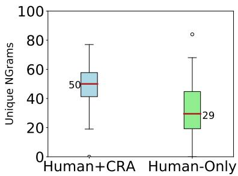  
Figure 3: Comparison of text generated from a collaborative setup (Human+CRA) and solo-writers (Human-Only). Collaborative users tend to write more diverse captions containing more unique trigrams (N=3)

## 5.4 Error Analysis

To provide the full picture of CRA, we manually labeled 50 rejected suggestions to identify common error modes. Some illustrative examples of these are listed in Table 7. The most common failure case (21 out of the 50) is content drift: when the model is asked to replace key content words, sometimes the rewritten text changes the meaning of the user draft. This is seen in Examples 1 and 2 in Table 7, where the model changes “wave” to “motorized scooter”; while the suggestion is coherent, it changes the original meaning of the sentence. This is likely an artifact of how we create the pseudo-parallel corpus of training data: When BART performs infilling, the text introduced is not guaranteed to preserve the original content.5 The second common error type (14 out of the 50) is to copy the source text verbatim (example 3 in Table 7), especially when a long text span (e.g., a full sentence) is rewritten, which is rare in our training data. Lastly, there is a small fraction of cases (9 out of the 50) when the model makes suggestions outside the desired demarcated region—this is often seen when the demarcated text spans two sentences and contains incoherent phrases (example 4 in Table 7).

## 6 How Does CRA Impact Different Users?

Which users find CRA more helpful? Our main hypothesis is that CRA benefits human authors by giving them more control over the global content and providing local wording suggestions (Roemmele and Gordon, 2015). Thus, its effectiveness relies on the assumption that the user has a coherent writing plan, which may or may not be true depending on the skill level of the writer. To analyze the influence of users’ inherent writing skill on model effectiveness, we put users into two groups based on their self-assessed writing ability (1 is the least skilled and 5 is the most skilled). A user is considered a skilled writer if they rate themselves higher than 3 and otherwise a novice writer. Out of the 50 users who interacted with CRA, 22 fall into the novice group and 28 fall into the skilled group. As a sanity check, the self-reported skill level is consistent with the result from the thirdparty evaluation—more captions written by skilled writers were judged as the winning caption than the novice writers (72.72% vs. 46.42%).

We show the ratings of helpfulness of CRA and the acceptance rate of model suggestions by user group in Table 8. We observe that skilled writers find the model more helpful and accept a higher fraction of the provided suggestions, while novice writers tend to request more suggestions with a lower acceptance rate. This is consistent with the hypothesis that the skilled writers have a more clear plan thereby playing to the model’s strengths.

To understand if the discrepancy in reported model helpfulness between the two groups is due to them requesting different kinds of suggestions, we identify the characteristics of edits that CRA is good at and compare them to the requests made by the two groups.

Why is CRA more helpful to skilled users? The model is more effective at editing longer sentences. A longer context allows the model to better infer the content and style of the requested suggestion, so we expect that the model would be more effective at editing longer sentences. In Figure 4a, we see that the accepted suggestions are indeed generated from longer source sentences compared to the rejected ones. From Figure 4c, we also see that skilled writers tend to write longer sentences (which CRA is good at); this partially explains why skilled users find the model to be more helpful. Figure 4d also shows us that though skilled writers tend to write longer sentences, they request smaller fractions of these sentences to be rewritten. Examples 1 and 2 in Table 6 are representative of this scenario where the model provides helpful suggestions.

<table><tr><td rowspan=1 colspan=1></td><td rowspan=1 colspan=1>Novice</td><td rowspan=1 colspan=1>Skilled</td></tr><tr><td rowspan=1 colspan=1>Helpfulness</td><td rowspan=1 colspan=1>2.27*</td><td rowspan=1 colspan=1>3.23*</td></tr><tr><td rowspan=1 colspan=1># request</td><td rowspan=1 colspan=1>3.04</td><td rowspan=1 colspan=1>2.64</td></tr><tr><td rowspan=1 colspan=1>% accepted</td><td rowspan=1 colspan=1>29.8</td><td rowspan=1 colspan=1>33.7</td></tr></table>

Table 8: Breakdown of model performance grouped by self-assessed writing skill. The rows correspond to average ratings of model helpfulness from the user survey, the average number of requests made to the model and the acceptance rate of received suggestions for both user groups. Rows marked with an asterisk indicates statistically significant differences $( p \mathrm { - v a l u e < 0 . 0 5 }$ on a Mann-Whitney-Wilcoxon test). Bold values correspond to the higher score. Skilled writers find the model significantly more helpful, request fewer suggestions but accept a higher percentage of them.

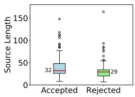  
(a)

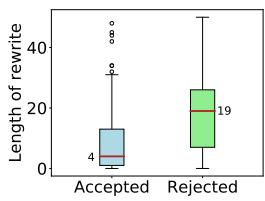  
(b)

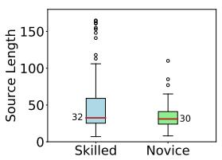  
(c)

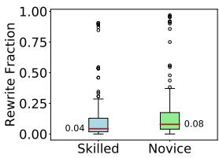  
(d)  
Figure 4: Analysis of interactions in terms of length of source sentences provided to the model (a, c) and rewritten spans in the generated text (b, d). In each boxplot, the box indicates the interquartile range with the median values marked by the red line. Length is measured in terms of number of characters. We see that the model is more effective when given longer source context sentences (a) and generating smaller rewritten spans of text in the target sentences (b). Skilled writers find the model to be more effective (Table 8) because they play to the model’s strengths by writing longer context sentences (c) and requesting shorter spans to be rewritten in them (d).

Takeaways This finding of disproportionate assistance highlights a need for careful, user-centric study of interactive systems as they become more ubiquitous. Given that the use of technology could widen the gap in performance between different users, future direction to explore include developing models that assist both sets of users equally and also developing evaluation metrics that capture how performance varies across users.

## 7 Related Work and Discussion

Collaborative writing. Our work builds on ex isting literature on collaborative writing. Early approaches (Swanson and Gordon, 2012; Roemmele and Gordon, 2015) that provide text suggestions to users in the creative domain were retrievalbased. Creative Help (Roemmele and Gordon, 2015) retrieved sentence-level suggestions at locations specified by a user from a large corpus of stories. A follow-up study (Roemmele and Gordon, 2018) found that grammaticality and the presence of noun phrases in the text were indicative of helpful suggestions. We observe similar trends in Section 6 and Appendix E.2. More recently, collab orative systems have incorporated text generation models for assistance. Clark et al. (2018) evaluated a machine-in-the-loop setting on the tasks of story and slogan writing. They tested one system that generates sentence-level continuations for story writing and another one that generates a slogan from a given set of keywords, and found that solo-writing was a very competitive baseline. Akoury et al. (2020) gave human writers a machinegenerated draft for storytelling and observed that writers tend to retain only a fraction of the generated text. Coenen et al. (2021) frames collaborative writing as a conversation between a human and a dialog system leveraging large language models. Our work is closest to Ito et al. (2020), which demonstrated that a collaborative rewriting system helps non-native English speakers revise drafts of research papers. We focus on the more challenging domain of creative writing where users are more se lective of the suggestions they accept. In addition, we study how the assistant helps with the creating writing process in an end-to-end manner, whereas Ito et al. (2020) focus on editing a given draft.

Editing models. Transformer models have shown to be good at editing text to change the style (Shih et al., 2019; Krishna et al., 2020), debias text (Ma et al., 2020), post-edit translations (Grangier and Auli, 2018; Wang et al., 2020) and simplify text (Kumar et al., 2020). Chakrabarty et al. (2021) train a model to generate metaphors employing a pseudo-parallel corpus of metaphoric sentences and corresponding literal sentences similar to how we use the sources of creative text. Additionally, infilling literature (Donahue et al., 2020; Fedus et al., 2018; Joshi et al., 2019; Shen et al., 2020) has shown that we can train models to fill in blanks. We incorporate editing models to collaborative writing which adapts to human feedback.

## 8 Conclusions and Future Work

In this paper, we develop a Creative Rewriting Assistant that is able to effectively assist users to complete the task of creative image captioning. Our machine-in-the-loop rewriting setup allows human users to control the content of their writing while utilizing the strengths of text generation models. Our model is found to be more useful for skilled users, so it remains to be explored how to better assist novice writers. One direction is to explore generating text from keywords because these users might need help with planning the global content and structure of their writing. Additionally, the most common error mode we see amongst the rejected suggestions is content drift, so another challenge is to balance faithfulness to the author’s content with creativity in text generation.

## Acknowledgements

We would like to thank the anonymous reviewers for their helpful comments. This work is supported by the National Science Foundation under Grant No. 1922658 and the Samsung Advanced Institute of Technology (Next Generation Deep Learning: From Pattern Recognition to AI).

## References

Nader Akoury, Shufan Wang, Josh Whiting, Stephen Hood, Nanyun Peng, and Mohit Iyyer. 2020. STO-RIUM: A Dataset and Evaluation Platform for Machine-in-the-Loop Story Generation. In Proceedings ofthe 2020 Conference on Empirical Methods in Natural Language Processing (EMNLP), pages 6470–6484, Online. Association for Computational Linguistics.

Laura Ana Maria Bostan, Evgeny Kim, and Roman Klinger. 2020. GoodNewsEveryone: A corpus of news headlines annotated with emotions, semantic roles, and reader perception. In Proceedings of the 12th Language Resources and Evaluation Conference, pages 1554–1566, Marseille, France. European Language Resources Association.

Tuhin Chakrabarty, Xurui Zhang, Smaranda Muresan, and Nanyun Peng. 2021. MERMAID: Metaphor generation with symbolism and discriminative decoding. In Proceedings ofthe 2021 Conference ofthe North American Chapter of the Association for Computational Linguistics: Human Language Technologies, pages 4250–4261, Online. Association for Computational Linguistics.

Jianfu Chen, Polina Kuznetsova, David Warren, and Yejin Choi. 2015. Déjà image-captions: A corpus of expressive descriptions in repetition. In Proceedings of the 2015 Conference of the North American Chapter of the Association for Computational Linguistics: Human Language Technologies, pages 504–514, Denver, Colorado. Association for Computational Linguistics.

Elizabeth Clark, Anne Spencer Ross, Chenhao Tan, Yangfeng Ji, and Noah A Smith. 2018. Creative writing with a machine in the loop: Case studies on slogans and stories. In 23rd International Conference on Intelligent User Interfaces, pages 329–340.

Andy Coenen, Luke Davis, Daphne Ippolito, Emily Reif, and Ann Yuan. 2021. Wordcraft: a humanai collaborative editor for story writing. CoRR, abs/2107.07430.

Chris Donahue, Mina Lee, and Percy Liang. 2020. Enabling language models to fill in the blanks. In Association for Computational Linguistics (ACL).

William Fedus, Ian Goodfellow, and Andrew M. Dai. 2018. Maskgan: Better text generation via filling in the. In International Conference on Learning Representations (ICLR).

Monica J Garfield. 2008. Creativity support systems. In Handbook on Decision Support Systems 2, pages 745–758. Springer.

Jonathan Gordon, Jerry Hobbs, Jonathan May, Michael Mohler, Fabrizio Morbini, Bryan Rink, Marc Tomlinson, and Suzanne Wertheim. 2015. A corpus of rich metaphor annotation. In Proceedings of the Third

Workshop on Metaphor in NLP, pages 56–66, Denver, Colorado. Association for Computational Linguistics.

David Grangier and Michael Auli. 2018. QuickEdit: Editing text & translations by crossing words out. In Proceedings ofthe 2018 Conference ofthe North American Chapter ofthe Association for Computational Linguistics: Human Language Technologies, Volume 1 (Long Papers), pages 272–282, New Orleans, Louisiana. Association for Computational Linguistics.

Ari Holtzman, Jan Buys, Li Du, Maxwell Forbes, and Yejin Choi. 2019. The curious case of neural text degeneration. In International Conference on Learning Representations.

Takumi Ito, Tatsuki Kuribayashi, Masatoshi Hidaka, Jun Suzuki, and Kentaro Inui. 2020. Langsmith: An interactive academic text revision system. In Proceedings ofthe 2020 Conference on Empirical Methods in Natural Language Processing: System Demonstrations, pages 216–226, Online. Association for Computational Linguistics.

Mandar Joshi, Danqi Chen, Yinhan Liu, Daniel S. Weld, Luke Zettlemoyer, and Omer Levy. 2019. Span-BERT: Improving pre-training by representing and predicting spans. arXiv preprint arXiv:1907.10529.

Diederik P Kingma and Jimmy Ba. 2014. Adam: A method for stochastic optimization. arXiv preprint arXiv:1412.6980.

Kalpesh Krishna, Josh Wieting, and Mohit Iyyer. 2020. Reformulating unsupervised style transfer as paraphrase generation. In Empirical Methods in Natural Language Processing.

Dhruv Kumar, Lili Mou, Lukasz Golab, and Olga Vechtomova. 2020. Iterative edit-based unsupervised sentence simplification. In Proceedings ofthe 58th Annual Meeting ofthe Associationfor Computational Linguistics, pages 7918–7928, Online. Association for Computational Linguistics.

Mike Lewis, Yinhan Liu, Naman Goyal, Marjan Ghazvininejad, Abdelrahman Mohamed, Omer Levy, Ves Stoyanov, and Luke Zettlemoyer. 2019. Bart: Denoising sequence-to-sequence pre-training for natural language generation, translation, and comprehension. arXiv preprint arXiv:1910.13461.

Xinyao Ma, Maarten Sap, Hannah Rashkin, and Yejin Choi. 2020. Powertransformer: Unsupervised controllable revision for biased language correction. In EMNLP.

Saif Mohammad, Ekaterina Shutova, and Peter Turney. 2016. Metaphor as a medium for emotion: An empirical study. In Proceedings of the Fifth Joint Conference on Lexical and Computational Semantics, pages 23–33, Berlin, Germany. Association for Computational Linguistics.

Michael Mohler, Marc T Tomlinson, and Bryan Rink. 2015. Cross-lingual semantic generalization for the detection of metaphor. Computational Linguistics and Intelligent Text Processing.

Vlad Niculae and Cristian Danescu-Niculescu-Mizil. 2014. Brighter than gold: Figurative language in user generated comparisons. In Proceedings of the 2014 Conference on Empirical Methods in Natural Language Processing (EMNLP), pages 2008–2018, Doha, Qatar. Association for Computational Linguistics.

Myle Ott, Sergey Edunov, Alexei Baevski, Angela Fan, Sam Gross, Nathan Ng, David Grangier, and Michael Auli. 2019. fairseq: A fast, extensible toolkit for sequence modeling. In Proceedings of NAACL-HLT 2019: Demonstrations.

Melissa Roemmele and Andrew Gordon. 2018. Linguistic features of helpfulness in automated support for creative writing. In Proceedings of the First Workshop on Storytelling, pages 14–19, New Orleans, Louisiana. Association for Computational Linguistics.

Melissa Roemmele and Andrew S Gordon. 2015. Creative help: A story writing assistant. In International Conference on Interactive Digital Storytelling, pages 81–92. Springer.

Ben Samuel, Michael Mateas, and Noah Wardrip-Fruin. 2016. The design of writing buddy: a mixedinitiative approach towards computational story collaboration. In International Conference on Interactive Digital Storytelling, pages 388–396. Springer.

Tianxiao Shen, Victor Quach, Regina Barzilay, and Tommi Jaakkola. 2020. Blank language models. In Proceedings of the 2020 Conference on Empirical Methods in Natural Language Processing (EMNLP), pages 5186–5198.

Yong-Siang Shih, Wei-Cheng Chang, and Yiming Yang. 2019. XL-Editor: Post-editing sentences with xlnet. arXiv preprint arXiv:1910.10479.

G.J. Steen, A.G. Dorst, J.B. Herrmann, A.A. Kaal, T. Krennmayr, and T. Pasma. 2010. A methodfor linguistic metaphor identification. From MIP to MIPVU. Number 14 in Converging Evidence in Language and Communication Research. John Benjamins.

Reid Swanson and Andrew S. Gordon. 2012. Say anything: Using textual case-based reasoning to enable open-domain interactive storytelling. ACM Trans. Interact. Intell. Syst., 2(3).

Chaojun Wang and Rico Sennrich. 2020. On exposure bias, hallucination and domain shift in neural machine translation. In Proceedings of the 58th Annual Meeting of the Association for Computational Linguistics, pages 3544–3552, Online. Association for Computational Linguistics.

Qian Wang, Jiajun Zhang, Lemao Liu, Guoping Huang, and Chengqing Zong. 2020. Touch editing: A flexible one-time interaction approach for translation. In Proceedings of the 1st Conference of the Asia-Pacific Chapter ofthe Associationfor Computational Linguistics and the 10th International Joint Conference on Natural Language Processing, pages 1–11, Suzhou, China. Association for Computational Linguistics.

## A Ethical Considerations

Disproportionate assistance. One of the findings of our work was that the collaboration model discussed is more effective at assisting users who are already skilled at writing tasks. We noted in the paper that an important direction of future work is to develop systems that cater to the novice user group as well. An ethical consideration is that if such a system in its current state were deployed, it could lead to an increase in the disparity in performance between the two user groups. We believe that recording this observation is important as human-centered machine learning systems become more prevalent.

Appropriate remuneration for crowd workers. To complete the HIT on AMT, workers need to interact with the model a minimum of 2 times before submitting the caption—it is explicitly mentioned that they are free to reject the suggestions and accepting/rejecting suggestions has no bearing on the payment. From a small internal pilot (also confirmed with Mechanical Turk experiments) we estimate an average completion time to be 10 minutes with an additional 2 minutes to read the instructions, so the payment is set to \$3 for the HIT (prorated to an hourly wage of \$15). The estimated completion time for third-party evaluation was 1 minute so the payment was set to \$0.25 per annotation (prorated to an hourly wage of \$15).

## B HIT Instructions and Details

Figure 5 is a screenshot of the interface presented to the crowdworkers for the writing task.

## B.1 Instructions for crowdworkers completing the writing task

• Along with the first question in the survey is a link to the image captioning task. Navigate there. You will see a panel on the top left that shows you an image that you need to describe.

• You’re free to interpret the image as you please—be as descriptive/figurative as possible.

• To help you with the same, we have a feature where you can highlight a part of your text with square brackets (‘[’, ‘]’) and request targeted suggestions in that area. Please look at the accompanying examples on how to use it effectively.

• While writing we find that we are often able to provide content but to make the text more interesting is difficult, hopefully the assistant helps there. You will always have the option to reject the suggestions of the assistant and switch back to your original text. Bear in mind that the assistant isn’t really great at guessing content words.

• To complete the task, continue editing until you are happy with the description. We require that you at least request suggestions from the assistant for a minimum of two times, even if you choose to reject the suggestions.

## B.2 Instructions for crowdworkers evaluating the captions

• Choose the better (more descriptive and/or figurative) caption for the image.

• A better caption is your subjective judgement, the rubrics to make the choice are that the caption is descriptive and/or figurative in its interpretation of the image (Refer the examples for further clarification).

• The explanation asked is supposed to be very brief. A single word of if you like it for being descriptive or interpretive will do.

• Relevance of the caption to the image is your subjective choice whether the caption appropriately represents what is in the image and is not just a catchy piece of text unrelated to the image.

• A caption that you deem irrelevant should never be the better caption, unless both are irrelevant.

## C User Feedback from Mechanical Turk

We present some user feedback obtained from the task—these cover some of the positive and negative comments we received. The negative comments are representative of some of the issues we highlight in section 5.4

## Positive

• I was impressed by how well this worked. I feel like my writing did improve by using the suggestions. At the very least it gave me good ideas.

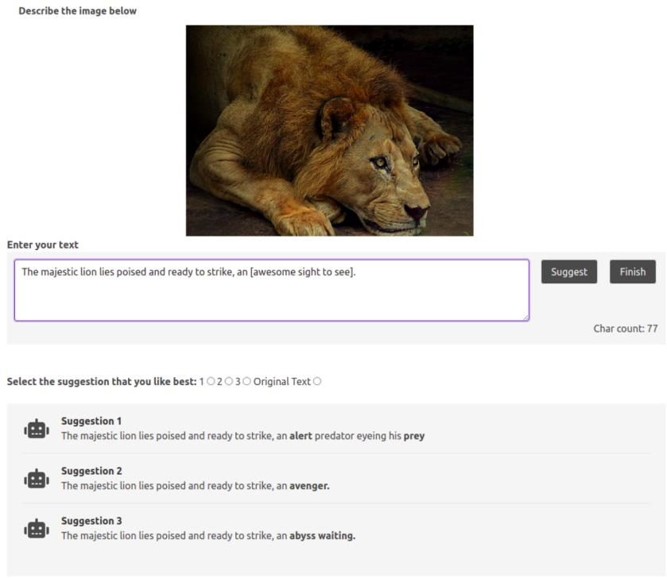  
Figure 5: User interface. The user demarcates the span they want suggestions for in a text box and the model offers three suggestions for the user to pick from. This continues iteratively till the human is satisfied and submits the caption to finish the task.

• I got great suggestions that offered me words that I hadn’t considered and fit even better than my own writing so I was pleased with the suggestions.

• I think everything was clear and straightforward and I enjoyed the interface.

## Negative

• The suggestions were sometimes too far from the meaning of the original text so that they no longer made sense or were not grammatically correct.

• The instructions were fine, but the suggestions sure leave a lot to be desired. It replaced ’bright yellow’ with red a couple of times.

## D Details for Reproducibility Checklist

## D.1 Model Details

We use a pre-trained BART-Large (406M parameters) model as the starting point for our experiments, which was made available through the fairseq (Ott et al., 2019) implementation. Unless mentioned otherwise, the recommended values for the hyperparameters were taken from the released fine tuning script in the library. We selected the learning rate for Section 5.1 using validation perplexity as a metric varying the value from $1 \times 1 0 ^ { - 5 } \mathrm { ~ t o ~ } 1 \times 1 0 ^ { - 4 }$ . The source code for our experiments, both to set up the interface and train the model, will be made available upon publication of this work. Model training was on a Titan Xp single GPU machine with 12GB of memory. The same machine was also used to host the server for the interactive experiments. A model inference is made for each request from the users.

## D.2 Data Details

All the datasets from Table 1 are publicly available already. As highlighted in Section 6, one reason our model suffers from content drift is because the creation process does not guarantee that the content in the source and target is identical. So prior to making the pseudo-parallel corpus from Section 3 available, we aim to filter out those examples which suffer from content drift. The dataset of interactions from Section 3.2 cannot be directly shared.

## E Further Analysis

Longer model rewrites get rejected more frequently. Our assumption is that users want to control the content of the caption. When the model rewrites a longer span and adds more new text to the draft, it is likely to diverge from the original content given by the user. We compare the length of new text introduced into the draft by CRA in both the accepted and rejected suggestions. From Figure 4b, we see that longer revisions are more likely to be rejected.

## E.1 Collaborative vs Human Writing

In Section 5.3, we saw that humans writing in a collaborative setup tend to produce better creative output. To analyze how model intervention affects the text, we collected some statistics on the 100 final captions produced from the Human+CRA setup and the Human-Only setup. We see that users in the collaborative setup write longer captions (Figure 6a) that tend to have more unique n-grams (Figure 3), indicative that users are incorporating more diverse elements into their text as a result of model interaction. We also calculate the perplexity of the final captions using a pre-trained GPT2 model. From Figure 6c, we see that the captions with CRA intervention have a lower average perplexity despite having higher lexical diversity. Also we see that the perplexity scores from the collaborative setup have significantly less variance than the human-only captions indicating that collaboration makes different people’s writing more similar to each other.

## E.2 POS Tags

To examine the kind of text that is helpful to users, we analyze the linguistic characteristics of accepted suggestions and rejected suggestions.

Accepted suggestions have more adjectives, adverbs and nouns. Figure 7 shows the fraction of different POS tags in the revised span of accepted suggestions and rejected suggestions. Accepted suggestions tend to have a larger fraction of adverbs, adjectives and nouns, whereas rejected suggestions have a large fraction of determiners. Prior work (Roemmele and Gordon, 2018) also observed that the presence of noun phrases in suggestions has a positive correlation with helpfulness.

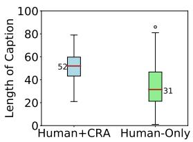  
(a)

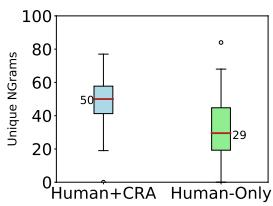  
(b)

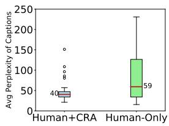  
(c)  
Figure 6: Comparison of text generated from a collaborative setup (Human+CRA) and solo-writers (Human-Only). We see that collaborative users tend to write longer captions (Figure 6a), that contain more unique N-grams (Figure 6b, N=3), and on average have a lower perplexity (Figure 6c), as evaluated using a pre-trained GPT2 model. We use perplexity as a proxy for fluency in text. Collaborative users tend to consider more diverse options for text while retaining fluency in the text.

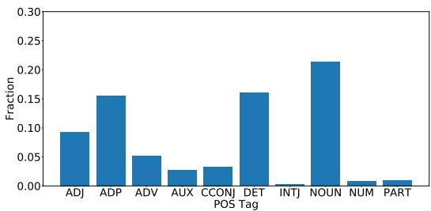  
(a) POS tags of rewritten text for all accepted suggestions.

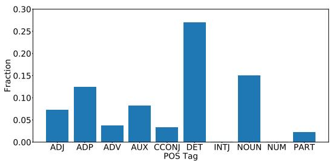  
(b) POS tags of rewritten text for all rejected suggestions.

Figure 7: The 10 most common POS tags in accepted and rejected suggestions: Accepted suggestions tend to have more adjectives, adverbs and nouns and rejected suggestions tend to have higher fraction of determiners