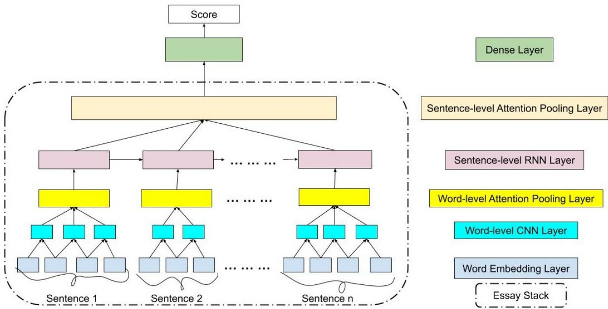
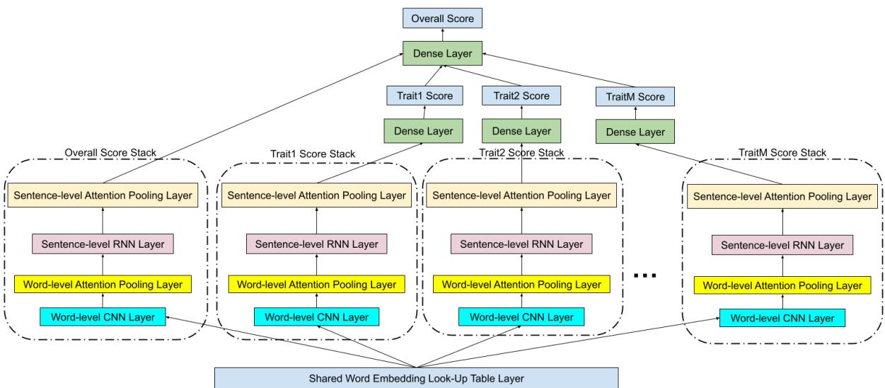
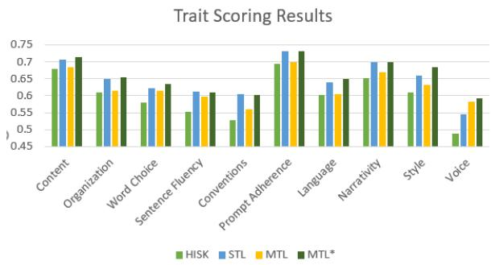

# Many Hands Make Light Work: Using Essay Traits to Automatically Score Essays

♣Rahul Kumar, ♠Sandeep Mathias, ♢Sriparna Saha, ♡ Pushpak Bhattacharyya ♣Department of Computer Science and Engineering, IIT Kanpur   
♠Department of Computer Science and Engineering, Presidency University, Bangalore ♢Department of Computer Science and Engineering, IIT Patna ♡Department of Computer Science and Engineering, IIT Bombay   
♣rahul@iitk.ac.in, ♠sandeepalbert@presidencyuniversity.in, ♢sriparna@iitp.ac.in, ♡pb@cse.iitb.ac.in

## Abstract

Most research in the area of automatic essay grading (AEG) is geared towards scoring the essay holistically while there has also been little work done on scoring individual essay traits. In this paper, we describe a way to score essays using a multi-task learning (MTL) approach, where scoring the essay holistically is the primary task, and scoring the essay traits is the auxiliary task. We compare our results with a single-task learning (STL) approach, using both LSTMs and BiLSTMs. To find out which traits work best for different types of essays, we conduct ablation tests for each of the essay traits. We also report the runtime and number of training parameters for each system. We find that MTL-based BiLSTM system gives the best results for scoring the essay holistically, as well as performing well on scoring the essay traits. The MTL systems also give a speed-up of between 2.30 to 3.70 times the speed of the STL system, when it comes to scoring the essay and all the traits.

## 1 Introduction

An essay is a piece of text that is written in response to a topic, called a prompt (Mathias and Bhattacharyya, 2020). Qualitative evaluation of the essay consumes a lot of time and resources. Hence, in 1966, Page proposed a method of automatically scoring essays using computers (Page, 1966), giving rise to the domain of Automatic Essay Grading.

Essay traits are different aspects of the essay that can aid in explaining the score assigned to the essay. Examples of essay traits include content (how much information is present in the essay) (Page, 1966), organization (how well the essay is structured) (Persing et al., 2010), style (how well written the essay is) (Page, 1966), prompt adherence (how much the essay stays on topic for the essay prompt) (Persing and Ng, 2014), etc.

Most of the research work done in the field of AEG is geared toward scoring the essay holistically, rather than studying the importance of essay traits in the overall essay score. In this paper, we ask the question:

## “Can we use information learnt from scoring essay traits to score an essay holistically?”

In our paper, not only do we score essays holistically, but we also describe how to score essay traits simultaneously in a multi-task learning framework. Scoring essay traits is essential as it could help in explaining why the essay was scored the way it was, as well as providing valuable insights to the writer about what aspects of the essay were well-written and what the writer needs to improve.

Multi-task learning is a machine learning technique where we use information from multiple auxiliary tasks to perform a primary task (Caruana, 1997). In our experiments, scoring the individual essay traits is the auxiliary task, and scoring the essay holistically is the primary task. In addition to this, we also study the impact of scoring an essay trait as the primary task while the other traits and overall essay score are auxiliary tasks.

Contributions. In this paper, we describe a way to simultaneously score essay traits and the essay itself using multi-task learning. We evaluate our system against different types of essays and essay traits. We also share our code and the data for reproducibility and further research1.

## 2 Motivation

Most of the work done in the area of automatic essay grading is in the area of holistic AEG - where we provide a single score for the entire essay based on its quality. However, for writers of an essay, a holistic score alone would not be enough. Providing trait-specific scores will tell the writer which aspects of the essay need improvement.

In our dataset, we observe that writers of good essays usually have a lot of content, appropriate word choice, very few errors, etc. Essays that are poorly written often lack one or more of these qualities (i.e. they are either too short, have lots of errors, etc.). We, therefore, observe a high correlation between individual trait scores and the overall essay score (Pearson correlation trait scores and overall essay score > 0.7 across all essay sets in our dataset). Hence, we believe that using essay trait scores will benefit in scoring the essay holistically, as their scores will provide more relevant information to the AEG system.

## 3 Related Work

## 3.1 Holistic Essay Grading

Holistic essay grading involves assigning an overall score for an essay (Mathias and Bhattacharyya, 2020). The first AEG system was designed by Page (1966). In the decade of the 2000s there were a lot of AEG systems which were developed commercially (see Shermis and Burstein (2013) for more details).

After the release of Kaggle’s Automatic Student Assessment Prize’s (ASAP) Automatic Essay Grading (AEG) dataset in 20122, there has been a lot of research on holistic essay grading. Initial approaches, such as those of Phandi et al. (2015) and Zesch et al. (2015) used feature engineering techniques and domain adaptation in scoring the essays. More recent papers look at using a number of deep learning approaches, such as LSTMs (Taghipour and Ng, 2016; Tay et al., 2018) and CNNs (Dong and Zhang, 2016) or both (Dong et al., 2017; Zhang and Litman, 2018, 2020). Zhang and Litman (2020) describe a way to extract important information, called topical components, from a source-dependent response3.

## 3.2 Trait-specific Essay Grading

In the last decade or so, there has been some work done in scoring essay traits such as sentence fluency (Chae and Nenkova, 2009), organization (Persing et al., 2010; Taghipour, 2017; Mathias et al., 2018; Song et al., 2020), thesis clarity (Persing and Ng, 2013; Ke et al., 2019) coherence (Somasundaran et al., 2014; Mathias et al., 2018), prompt adherence (Persing and Ng, 2014), argument strength (Persing and Ng, 2015; Taghipour, 2017), stance (Persing and Ng, 2016), style (Mathias and Bhattacharyya, 2018b) and narrative quality (Somasundaran et al., 2018). None of the above work, however, uses trait information to score the essay holistically.

There has also been work on scoring multiple essay traits (Taghipour, 2017; Mathias and Bhattacharyya, 2018a, 2020). (Rama and Vajjala, 2021) discuss solutions across multiple languages (German, Czech and Italian). Mathias and Bhattacharyya (2020) describes work on the use of neural networks for scoring essay traits. Our work combines the scores of essay traits for holistic essay grading. We focus on using trait-specific essay grading to improve the performance of an automatic essay grading system. We also show how using multi-task learning - simultaneously scoring both the essay and its traits - we are able to speed up the training of our system without too much of a loss in scoring the essay traits. (Ridley et al., 2021) describe a multi-task learning approach to grade essays and their traits using a neural network. Our system differs from theirs with respect to the shared layers and trait-specific layers. While Ridley et al. (2021) share the embedding and word-specific layers (to get sentence representations), we share only the embedding layer.

## 3.3 Multi-task Learning

Multitask Learning was proposed by Caruana (1997) where the argument was that training signals from related tasks could help in a better generalization of the model. Collobert et al. (2011) successfully demonstrated how tasks like Part-of-Speech tagging, chunking and Named Entity Recognition can help each other when trained jointly using deep neural networks. Song et al. (2020) described a multi-task learning approach to score organization in essays, where the auxiliary tasks were classifying the sentences and paragraphs, and the primary task was scoring the essay’s organization. Cao et al.

(2020) also use a domain adaptive MTL approach to grade essays, where their auxiliary tasks are sentence reordering, noise identification, as well as domain adversarial training. However, they also use all the other essay sets as part of their training, whereas we use only the essays present in the respective essay set for training.

## 4 System Architecture

## 4.1 STL Essay Grading Stack

For scoring the essays, we use essay grading stacks. Each stack is used for scoring a single essay trait. The architecture of the stack is based on the architecture of the holistic essay grading system proposed by Dong et al. (2017). The essay grading stack takes the essay as input (split into tokens and sentences) and returns the score of the essay / essay trait as the output. Figure 1 shows the architecture for the essay grading stack.

For each essay, we first split the essay into tokens and sentences. This is given as an input to the essay grading stack. In the word embedding layer, we look up the word embeddings of each token. Just like Taghipour and Ng (2016), Dong et al. (2017), Tay et al. (2018), Mathias and Bhattacharyya (2020) and Mathias et al. (2020), we use the most frequent 4000 words of the training data as the vocabulary with all other words mapping to a special unknown token. This is done mainly to capture out-of-vocabulary words, as well words that generally don’t belong in the topic4. If the vocabulary size is too small, then a number of words will be marked as spelling errors. On the other hand, if the vocabulary size is too large, a lot of spurious words would also be learnt as important ones.

This sequence of word embeddings is then sent to the next layer - the 1 dimension CNN layer - to get local information from nearby words. The output of this layer is aggregated using attention pooling to get the sentence representation of the sentence. This is done for all sentences in the essay.

Each of the sentence representations are then sent through a recurrent layer. We experiment on two different types of recurrent layers - a unidirectional LSTM (Hochreiter and Schmidhuber, 1997) and bidirectional LSTM (BiLSTM) - as the recurrent layer. The outputs of the recurrent layer are pooled using attention pooling to get the representation for the essay. This essay representation is then sent through a fully-connected Dense layer with a sigmoid activation function to score the essay either holistically or a particular essay trait. For our experiments, we minimize the mean squared error loss.

Prior to input, we scale the scores to the range of [0, 1] using min-max normalization. The output of the sigmoid function is a scalar in the range of [0, 1] which is rescaled back up to a score in the original score range and rounded off to get the score for the essay. This essay stack is used for the scoring of the single-task learning (STL) models.

## 4.2 MTL Model

The architecture of our MTL model for an essay of M traits is shown in Figure 2. Here, the word embedding layer is shared across all the tasks. In the multi-task learning framework, each stack is used to learn an essay representation for each essay trait. In a similar manner, the essay representation for the overall score is learnt and it is concatenated with the predicted trait scores before being sent to a Dense layer with a sigmoid activation function to score the essay holistically. For calculating each score - both overall and trait scores - we use the mean squared error loss function. We experimented with multiple weights for the loss function for the essay trait scoring task, but settled on uniform weights for all the traits and the overall scoring task. This is done because we want to get accurate predictions of the traits scores which are used for predicting the overall score.

## 5 Dataset Used

For our experiments, we use the Automated Student’s Assessment Prize (ASAP) Automatic Essay Grading (AEG) dataset. The dataset has a total of 8 essay sets - where each essay set has a number of essays written in response to the same essay prompt. In total, there are nearly 13,000 English essays in the dataset, written by American high school students from classes 7 to 10.

Table 1 gives the properties of each of the essay sets in our dataset. It reports the overall essay scoring range, traits scoring, average word count, number of traits, number of essays and essay type.

We use the overall scores directly from the ASAP AEG dataset. Since the original dataset only provided trait-specific scores for Prompts 7 & 8, we use the trait-specific scores provided by Mathias and Bhattacharyya (2018a).

Figure 1: Essay stack architecture. This is the architecture for the Single-Task Learning systems.
<table><tr><td rowspan=1 colspan=1>Essay Set</td><td rowspan=1 colspan=1>Score Range</td><td rowspan=1 colspan=1>Trait Sc. Range</td><td rowspan=1 colspan=1>Word Count</td><td rowspan=1 colspan=1>No. of Traits</td><td rowspan=1 colspan=1>No. of Essays</td><td></td><td rowspan=1 colspan=2>Essay Type</td></tr><tr><td rowspan=1 colspan=1>Prompt 1</td><td rowspan=1 colspan=1>2-12</td><td rowspan=1 colspan=1>1-6</td><td rowspan=1 colspan=1>350</td><td rowspan=1 colspan=1>5</td><td rowspan=1 colspan=1>1783</td><td></td><td rowspan=2 colspan=2>Argumentative / PersuasiveArgumentative / Persuasive</td></tr><tr><td rowspan=1 colspan=1>Prompt 2</td><td rowspan=1 colspan=1>1-6</td><td rowspan=1 colspan=1>1-6</td><td rowspan=1 colspan=1>350</td><td rowspan=1 colspan=1>5</td><td rowspan=1 colspan=1>1800</td><td></td></tr><tr><td rowspan=1 colspan=1>Prompt 3</td><td rowspan=1 colspan=1>0-3</td><td rowspan=1 colspan=1>0-3</td><td rowspan=1 colspan=1>100</td><td rowspan=1 colspan=1>4</td><td rowspan=1 colspan=1>1726</td><td></td><td rowspan=1 colspan=2>Source-Dependent Response</td></tr><tr><td rowspan=1 colspan=1>Prompt 4</td><td rowspan=1 colspan=1>0-3</td><td rowspan=1 colspan=1>0-3</td><td rowspan=1 colspan=1>100</td><td rowspan=1 colspan=1>4</td><td rowspan=1 colspan=1>1772</td><td></td><td rowspan=2 colspan=2>Source-Dependent ResponseSource-Dependent Response</td></tr><tr><td rowspan=1 colspan=1>Prompt 5</td><td rowspan=1 colspan=1>0-4</td><td rowspan=1 colspan=1>0-4</td><td rowspan=1 colspan=1>125</td><td rowspan=1 colspan=1>4</td><td rowspan=1 colspan=1>1805</td><td></td><td rowspan=1 colspan=2>Source-Depender</td></tr><tr><td rowspan=2 colspan=1>Prompt 6</td><td rowspan=2 colspan=1>0-4</td><td rowspan=2 colspan=1>0-4</td><td rowspan=2 colspan=1>150</td><td rowspan=2 colspan=1>4</td><td rowspan=2 colspan=1>1800</td><td rowspan=4 colspan=3>Narrative / Descriptive</td></tr><tr><td rowspan=1 colspan=1>endent 1</td></tr><tr><td rowspan=1 colspan=1>Prompt 7</td><td rowspan=1 colspan=1>0-30</td><td rowspan=1 colspan=1>0-6</td><td rowspan=1 colspan=1>300</td><td rowspan=1 colspan=1>4</td><td rowspan=1 colspan=1>1569</td></tr><tr><td rowspan=1 colspan=1>Prompt 8</td><td rowspan=1 colspan=1>0-60</td><td rowspan=1 colspan=1>0-12</td><td rowspan=1 colspan=1>600</td><td rowspan=1 colspan=1>6</td><td rowspan=1 colspan=1>723</td></tr><tr><td rowspan=1 colspan=1>Total</td><td rowspan=1 colspan=1>0-60</td><td rowspan=1 colspan=1>0-12</td><td rowspan=1 colspan=1>100-600</td><td rowspan=1 colspan=1>4-6</td><td rowspan=1 colspan=1>12978</td><td></td><td rowspan=1 colspan=2></td></tr></table>

Table 1: Properties of the different essay sets in the ASAP AEG dataset we used in our experiments. Average word count numbers are rounded up to the nearest multiple of 25.

Depending on the type of prompt for the essay set, each essay set has a different set of traits. Argumentative / Persuasive essays are essays which the writer is prompted to take a stand on a topic and argue for their stance. These essay sets have traits like content, organization, word choice, sentence fluency, and conventions. Source-dependent responses (Zhang and Litman, 2018) are essays where the writer reads a piece of text and answers a question based on the text that they just read5. These essay sets have traits like content, prompt adherence (Persing and Ng, 2014), language and narrativity (Somasundaran et al., 2018). Narrative / Descriptive essays are essays where the writer has to narrate a story or incident or anecdote. They have traits like content, organization, style, conventions, voice, word choice, and sentence fluency6. Table 2 lists the different essay traits for each essay set.

## 6 Experiments

## 6.1 Evaluation Metric

We use Cohen’s Kappa with quadratic weights (Cohen, 1968) (QWK) as the evaluation metric. This is done for the following reasons. Firstly, the final scores predicted by the system are distinct numbers/grades, rather than continuous values; so we cannot use the Pearson Correlation Coefficient or Mean Squared Error. Secondly, evaluation metrics like F-Score and accuracy do not take into account chance agreements. For example, if we are to grade every essay with the mean score or most frequent score, we would get F-Score and accuracy as high as 60% or more, whereas the Kappa score will be 0! Thirdly, the fact that the scores given are ordered (i.e. $0 < 1 < 2 < 3 . . . )$ means that we need to use weighted Kappa to capture the distance between the actual and predicted scores. Between linear weighted Kappa and QWK, we choose QWK because it rewards matches and punishes mismatches more distinctly than linear weighted Kappa.

Figure 2: Architecture of our MTL system showing an input essay with M traits being scored, with the overall score and each trait’s essay grading stack.
<table><tr><td>Essay Set</td><td>Trait 1</td><td>Trait 2</td><td>Trait 3</td><td>Trait 4</td><td>Trait 5</td><td>Trait 6</td></tr><tr><td>Prompt 1</td><td>Content</td><td>Organization</td><td>Word Choice</td><td>Sentence Fluency</td><td>Conventions</td><td>N/A</td></tr><tr><td>Prompt 2</td><td>Content</td><td>Organization</td><td>Word Choice</td><td>Sentence Fluency</td><td>Conventions</td><td>N/A</td></tr><tr><td>Prompt 3</td><td>Content</td><td>Prompt Adherence</td><td>Language</td><td>Narrativity</td><td>N/A</td><td>N/A</td></tr><tr><td>Prompt 4</td><td>Content</td><td>Prompt Adherence</td><td>Language</td><td>Narrativity</td><td>N/A</td><td>N/A</td></tr><tr><td>Prompt 5</td><td>Content</td><td>Prompt Adherence</td><td>Language</td><td>Narrativity</td><td>N/A</td><td>N/A</td></tr><tr><td>Prompt 6</td><td>Content</td><td>Prompt Adherence</td><td>Language</td><td>Narrativity</td><td>N/A</td><td>N/A</td></tr><tr><td>Prompt 7</td><td>Content</td><td>Organization</td><td>Style</td><td>Conventions</td><td>N/A</td><td>N/A</td></tr><tr><td>Prompt 8</td><td>Content</td><td>Organization</td><td>Voice</td><td>Word Choice</td><td>Sentence Fluency</td><td>Conventions</td></tr></table>

Table 2: Traits that are present in each essay set in our dataset. The trait scores are taken from the original ASAP dataset, as well as from ASAP++ (Mathias and Bhattacharyya, 2018a).

## 6.2 Evaluation Method

We evaluate our experiments using five-fold cross validation. We use the same data splits as used by Taghipour and Ng (2016). To avoid overfitting, we choose the model which gives the best result on the validation set for evaluating on the test set, and we report the mean value of all 5 folds.

<table><tr><td rowspan=1 colspan=1>Layer</td><td rowspan=1 colspan=1>Param. Name</td><td rowspan=1 colspan=1>Param. Value</td></tr><tr><td rowspan=1 colspan=1>Embedding</td><td rowspan=1 colspan=1>Embedding Dim.Embeddings</td><td rowspan=1 colspan=1>50GloVe</td></tr><tr><td rowspan=1 colspan=1>Word CNN</td><td rowspan=1 colspan=1>Window SizeFilters</td><td rowspan=1 colspan=1>5100</td></tr><tr><td rowspan=1 colspan=1>Sentence LSTM</td><td rowspan=1 colspan=1>Hidden Units</td><td rowspan=1 colspan=1>100</td></tr><tr><td rowspan=1 colspan=1></td><td rowspan=1 colspan=1>EpochsBatch SizeDropout RateInitial Learning RateMomentumOptimizer</td><td rowspan=1 colspan=1>1001000.50.0010.9RMSProp</td></tr></table>

Table 3: Neural network hyper-parameters for each layer, showing the hyper-parameter name and its corresponding value.

## 6.3 Experiment Configuration

Table 3 gives the different hyperparameters used in our systems. For the sake of uniformity, we use these hyperparameters irrespective of the network configuration (STL vs MTL, or LSTM vs BiLSTM).

<table><tr><td>Essay Set</td><td>Kernel</td><td>STL-LSTM</td><td>STL-BiLSTM</td><td>MTL-LSTM</td><td>MTL-BiLSTM</td><td>BERT-STL</td></tr><tr><td>Prompt 1</td><td>0.804</td><td>0.813</td><td>0.818</td><td>0.830*</td><td>0.831*</td><td>0.800</td></tr><tr><td>Prompt 2</td><td>0.687</td><td>0.660</td><td>0.658</td><td>0.667</td><td>0.689**</td><td>0.679</td></tr><tr><td>Prompt 3</td><td>0.704</td><td>0.661</td><td>0.653</td><td>0.644</td><td>0.687**</td><td>0.679</td></tr><tr><td>Prompt 4</td><td>0.743</td><td>0.790</td><td>0.780</td><td>0.786</td><td>0.798</td><td>0.822</td></tr><tr><td>Prompt 5</td><td>0.799</td><td>0.798</td><td>0.789</td><td>0.782</td><td>0.800</td><td>0.803</td></tr><tr><td>Prompt 6</td><td>0.753</td><td>0.807</td><td>0.803</td><td>0.806</td><td>0.813**</td><td>0.797</td></tr><tr><td>Prompt 7</td><td>0.698</td><td>0.792</td><td>0.786</td><td>0.791</td><td>0.795*</td><td>0.827</td></tr><tr><td>Prompt 8</td><td>0.552</td><td>0.678</td><td>0.697</td><td>0.679</td><td>0.699**</td><td>0.725</td></tr><tr><td>Mean QWK</td><td>0.717</td><td>0.750</td><td>0.748</td><td>0.748</td><td>0.764**</td><td>0.767</td></tr></table>

Table 4: Results of our experiments for scoring the essays holistically. Figures in boldface represent the best results per essay set. \* represents a statistically significant improvement using the MTL systems over the STL-LSTM system. ⋆ represents a statistically significant improvement of using the MTL-BiLSTM system over the MTL-LSTM system.

To evaluate the performance of our systems in scoring the essay overall, we use 4 different configurations - STL-LSTM, STL-BiLSTM, MTL-LSTM, and MTL-BiLSTM. In addition to the above systems, we also compare our approach with a state-of-the-art string kernel system designed by Cozma et al. (2018), using the same splits for training, testing, and validation7, as well as a baseline transformer-based implementation (BERT-STL), using the BERT-base-uncased model. We run this baseline model for 100 epochs and a batch size of 30, all other hyperparameters remaining default.

We also study the effect of using our system to grade an essay trait as the primary task, and score the other traits and the essay overall as auxiliary tasks (MTL\*).

In the STL configurations, we train our system to predict a single score at a time- either the overall essay score or the score for any of the essay traits. In the MTL configurations, our system learns to score the essay and all its traits simultaneously. The LSTM configurations use only a forward direction LSTM, while the BiLSTM configurations use a bidirectional (i.e. forward and reverse) LSTM.

## 7 Results and Analysis

In this section, we report our results and analyze them for different experiments.

## 7.1 Performance on Holistic Essay Scoring

Table 4 gives the QWK scores of each of our systems as they score each essay set holistically. The different systems used are the Single Task Learning (STL) (only scoring the essay overall) and Multitask Learning (MTL) (scoring the essay and the traits simultaneously). The first column lists out the different essay sets (Prompts 1 to 8). The next three columns report results for STL using both LSTM and BiLSTM, as well as results using the string kernel-based approach of Cozma et al. (2018). The next two columns report results for the MTL systems using both LSTM and BiLSTM. The last column shows the results using the baseline BERT-STL system.

From the table, we see that the MTL-BiLSTM performs the best of all the non-transformer systems (almost as good as the results of our BERT-STL system). In order to see if the improvements observed are statistically significant, we run the Paired T-Test for each of the essay sets and compare the results using a p-value of $p < 0 . 0 5$

## 7.2 Performance on Scoring Essay Traits

We also look at how our system performs in the auxiliary tasks - namely scoring the different essay traits. Figure 3 gives the results of our experiments in scoring the essay traits, using the String Kernel (HISK) (Cozma et al., 2018), CNN-LSTM (STL) (Dong et al., 2017), and Our Systems (MTL and MTL\*). We use the same evaluation method, which we used for scoring essay traits, with the same data splits. For the STL systems, we train them for every essay trait individually. MTL\* is the results of using our system to score essay trait as the primary task, and score the other traits and the essay overall as auxiliary tasks.

We compare the results with that of our MTL-BiLSTM system, which was trained to score the essay traits as auxiliary tasks. Figure 3 gives the results of our experiments. From the figure, we see that, while the STL-LSTM system is able to outperform our MTL-BiLSTM system, the MTL\* system (where the traits are primary tasks) outperforms the STL-LSTM system. While the STL system optimizes for scoring only a trait, the MTL\* system learns information from other traits to score the given essay trait.

  
Figure 3: Results of the performance of scoring traits for different systems. The different systems are Histogram Intersection String Kernel (HISK) using ν support vector regressor (Cozma et al., 2018), LSTM-CNN Single-task Learning System (STL) (Dong et al., 2017), our system (MTL) where the traits are auxiliary tasks, and our system (MTL\*) where the traits are the primary task. NOTE that the y-axis starts from a QWK of 0.45. This was done to highlight the difference in the performance of each system for each trait.

One of the reasons for the different trait performance depends on how easy (or difficult) it is to score the individual trait, as well which all essay traits have the particular trait. For example, prompt adherence has a higher average QWK than the other traits because it is present mainly in the source-dependent essays (which have a mean QWK over 1% higher than the mean QWK across all essay sets). Similarly, Voice has the lowest QWK mainly because it is present only in Prompt # 8, which has a very low holistic QWK.

## 7.3 Scoring Traits as the Primary Task

An interesting question for analysis is “What if we score the traits as the primary task?” In order to do that, we changed our system to make scoring one of the trait as the primary task, and scoring the rest of the traits as well as the essay overall, as auxiliary tasks. The comparison of these results are shown in Figure 3 (in the MTL\* column). We see that our MTL\* system outperforms the STL-based system on scoring individual traits, although it would take a lot longer time to train (as it would be equivalent to running the MTL system between 4 to 6 times).

## 7.4 Ablation Tests

In order to know which trait is most important for each essay set, we run a series of ablation tests. For each essay set, we ablate one essay trait at a time before scoring the essay. Table 5 reports the results of the ablation test. The values in the table correspond to the drop in performance in scoring the essay holistically. We find that the Content is the most important essay trait for 3 of the essay sets. Prompt Adherence and Word Choice are the most important traits for 2 of the essay sets where they are scored.

## 7.5 Error Analysis

As we have seen, the MTL model generally helps over the STL model when it comes to holistic essay scoring, especially if there is no well-defined rule (Example: Holistic Score = Sum of trait scores) for scoring the essay holistically.

A possible scenario where STL could help over MTL is if the holistic score is a well-defined function of the trait scores AND the STL system can predict the trait scores with a good deal of accuracy. The essay sets corresponding to Prompts 7 & 8 are two such essay sets, where the overall score is a function of the individual trait scores. To verify this, we ran the experiments in a pipelined manner - first scoring the essay traits, then calculating the holistic score using the predicted trait scores and comparing it with the gold standard holistic scores. We found no difference in QWK for Prompt 7 (a QWK of 0.796 vs. 0.795), but a much lesser performance with Prompt 8 (a QWK of 0.684 vs. 0.699) as compared to our MTL-based system. One of the main reasons for this is due to the poor performance in predicting the trait scores as single tasks.

## 7.6 Runtime Analysis

We also ran experiments to see how much resources and time our approaches will take. Table 6 gives the total training time (in hours). The total training time is the total time taken to train our system to score the essay holistically as well as all the traits in that essay set for all 100 epochs. We also report the speed-up when using the MTL approach as compared to the STL approach. From our results, we observe a 2.30 to 3.70 speed-up in using the MTL models as compared to using the STL models. The BERT-STL experiments ran for about 5 days (113 hours).

We also report the average number of training parameters per system in Table 7. For the STL systems, the number of trainable parameters is the same irrespective of essay set. For the MTL systems, the models, the number of training parameters varies based on the number of essay traits in the essay set. Prompts 3 to 7, which have only 4 traits, have about 1.38 million training parameters. On the other hand, Prompt 8, which has 6 essay traits, has over 1.85 million training parameters.

<table><tr><td>Essay Trait</td><td>Prompt 1</td><td>Prompt 2</td><td>Prompt 3</td><td>Prompt 4</td><td>Prompt 5</td><td>Prompt 6</td><td>Prompt 7</td><td>Prompt 8</td></tr><tr><td>Content</td><td>0.0148</td><td>0.0092</td><td>0.0064</td><td>0.0074</td><td>0.0030</td><td>0.0128</td><td>0.0102</td><td>0.0102</td></tr><tr><td>Organization</td><td>0.0122</td><td>0.0088</td><td></td><td></td><td></td><td></td><td>0.0090</td><td>0.0052</td></tr><tr><td>Word Choice</td><td>0.0080</td><td>0.0164</td><td></td><td></td><td></td><td></td><td></td><td>0.0264</td></tr><tr><td>Sentence Fluency</td><td>0.0086</td><td>0.0036</td><td></td><td></td><td></td><td></td><td></td><td>0.0196</td></tr><tr><td>Conventions</td><td>0.0090</td><td>0.0018</td><td></td><td></td><td></td><td></td><td>0.0076</td><td>0.0056</td></tr><tr><td>Prompt Adherence</td><td></td><td></td><td>0.0282</td><td>0.0112</td><td>0.0026</td><td>0.0044</td><td></td><td></td></tr><tr><td>Language</td><td></td><td></td><td>0.0080</td><td>0.0108</td><td>0.0088</td><td>0.0030</td><td></td><td></td></tr><tr><td>Narrativity</td><td></td><td></td><td>0.0092</td><td>0.0050</td><td>0.0124</td><td>0.0062</td><td></td><td></td></tr><tr><td>Style</td><td></td><td></td><td></td><td></td><td></td><td></td><td>0.0030</td><td></td></tr><tr><td>Voice</td><td></td><td></td><td></td><td></td><td></td><td></td><td></td><td>0.0094</td></tr></table>

Table 5: Results of the ablation tests. The numbers show the drop in performance when we ablate each of the essay traits from each of the essay sets (Prompt 1 to 8). The most important features in each essay set are written in boldface and underlined. Cells with a — in them mean that the essay trait was not present in that essay set.

<table><tr><td rowspan=1 colspan=1>System</td><td rowspan=1 colspan=1>STL Time</td><td rowspan=1 colspan=1>MTL Time</td><td rowspan=1 colspan=1>Speed-Up</td></tr><tr><td rowspan=1 colspan=1>LSTMBiLSTM</td><td rowspan=1 colspan=1>24.62 hours40.98 hours</td><td rowspan=1 colspan=1>10.45 hours11.32 hours</td><td rowspan=1 colspan=1>2.303.70</td></tr></table>

Table 6: Total training time for each system for all prompts, traits and folds, using our neural network systems.

<table><tr><td>System</td><td>Average</td><td>Range</td></tr><tr><td>STL-LSTM</td><td>326K</td><td>326K</td></tr><tr><td>STL-BiLSTM</td><td>436K</td><td>436K</td></tr><tr><td>MTL-LSTM</td><td>891K</td><td>829K - 1.08M</td></tr><tr><td>MTL-BiLSTM</td><td>1.5M</td><td>1.38M - 1.85M</td></tr></table>

Table 7: Average and range of training parameters per essay set for each system.

All our experiments were run on an Nvidia GeForce GTX 1080 Ti Graphics Card with 12GB of GPU memory, using Python version 3.5.2, Keras version 2.2.4 and Tensorflow version 1.148.

## 7.7 Comparison with Transformer Models

Most modern NLP systems have started to use attention-based transformer networks and large pretrained language models. Yang et al. (2020), Cao et al. (2020), and Uto et al. (2020) use the BERTbase-uncased (Devlin et al., 2019) pre-trained language model to perofrm automatic essay grading achieving QWKs in the range of 0.79 to 0.805. However, BERT has about 110 million parameters (compared to our largest model with just under 2 million parameters). Another limiting factor with using BERT is the fact that we can only input 512 tokens. This is a problem, especially for Prompt 8, where the average essay length is about 650 words. Mayfield and Black (2020) describe some of the other limitations of using BERT for scoring essays.

## 8 Conclusion and Future Work

In this paper, we described an approach to use multi-task learning to automatically score essays and their traits. We achieve this by concatenating a representation of the essay with the trait scores - predicted as an auxiliary task. We compared our results with single-task learning models as well. We found out that the MTL system with the Bi-Directional LSTM outperforms the STL-based systems and has results comparable with a baseline BERT-STL system. We then ran an ablation test and found out which essay trait was important for the corresponding essay sets. We also report our system’s performance, which shows a 2.30 to 3.70 speed-up of using the multi-task learning system, compared to using a single task learning system.

An exciting avenue of future work is using trait scoring to aid in providing text feedback to the writer, like showing where the low score for the trait originates, similar to Hellman et al. (2020) (for content scoring), rather than a trait-specific score only. We also plan to investigate using ALBERT (Lan et al., 2020), in lieu of the essay stack, to grade essays and their traits simultaneously. We also plan to explore how to extend our approach in generalizing our system, training it on essays written in response to one set of source prompts, and tested it on essays written for another prompt.

## Acknowledgements

The authors would like to thank the anonymous reviewers of the ACL Rolling Review for their comments in helping improve this work.

The authors would also like to acknowledge the different research grants in the various host institutions, namely:

• The Young Faculty Research Fellowship (YFRF) Award supported by the Visveshvaraya Ph.D. Scheme for Electronics and IT, Ministry of Electronics and Information Technology (MeitY), Government of India, being implemented by Digital India Corporation (formerly Media Lab Asia).

• The Presidency University Faculty Seed Grant Award.

for funding us in carrying out our research.

## References

Yue Cao, Hanqi Jin, Xiaojun Wan, and Zhiwei Yu. 2020. Domain-adaptive neural automated essay scoring. In Proceedings of the 43rd International ACM SIGIR Conference on Research and Development in Information Retrieval, pages 1011–1020.

Rich Caruana. 1997. Multitask learning. Machine learning, 28(1):41–75.

Jieun Chae and Ani Nenkova. 2009. Predicting the fluency of text with shallow structural features: Case studies of machine translation and human-written text. In Proceedings of the 12th Conference of the European Chapter ofthe ACL (EACL 2009), pages 139–147, Athens, Greece. Association for Computational Linguistics.

Jacob Cohen. 1968. Weighted kappa: nominal scale agreement provision for scaled disagreement or partial credit. Psychological bulletin, 70(4):213.

Ronan Collobert, Jason Weston, Léon Bottou, Michael Karlen, Koray Kavukcuoglu, and Pavel Kuksa. 2011. Natural language processing (almost) from scratch. Journal of Machine Learning Research, 12(Aug):2493–2537.

Mad˘ alina Cozma, Andrei Butnaru, and Radu Tudor˘ Ionescu. 2018. Automated essay scoring with string kernels and word embeddings. In Proceedings ofthe 56th Annual Meeting of the Association for Computational Linguistics (Volume 2: Short Papers), pages 503–509, Melbourne, Australia. Association for Computational Linguistics.

Jacob Devlin, Ming-Wei Chang, Kenton Lee, and Kristina Toutanova. 2019. BERT: Pre-training of deep bidirectional transformers for language understanding. In Proceedings of the 2019 Conference of the North American Chapter ofthe Associationfor Computational Linguistics: Human Language Technologies, Volume 1 (Long and Short Papers), pages 4171–4186, Minneapolis, Minnesota. Association for Computational Linguistics.

Fei Dong and Yue Zhang. 2016. Automatic features for essay scoring – an empirical study. In Proceedings of the 2016 Conference on Empirical Methods in Natural Language Processing, pages 1072–1077, Austin, Texas. Association for Computational Linguistics.

Fei Dong, Yue Zhang, and Jie Yang. 2017. Attentionbased recurrent convolutional neural network for automatic essay scoring. In Proceedings of the 21st Conference on Computational Natural Language Learning (CoNLL 2017), pages 153–162, Vancouver, Canada. Association for Computational Linguistics.

Scott Hellman, William Murray, Adam Wiemerslage, Mark Rosenstein, Peter Foltz, Lee Becker, and Marcia Derr. 2020. Multiple instance learning for content feedback localization without annotation. In Proceedings ofthe Fifteenth Workshop on Innovative Use ofNLPfor Building Educational Applications, pages 30–40, Seattle, WA, USA → Online. Association for Computational Linguistics.

Sepp Hochreiter and Jürgen Schmidhuber. 1997. Long short-term memory. Neural computation, 9(8):1735– 1780.

Zixuan Ke, Hrishikesh Inamdar, Hui Lin, and Vincent Ng. 2019. Give me more feedback II: Annotating thesis strength and related attributes in student essays. In Proceedings ofthe 57th Annual Meeting of the Associationfor Computational Linguistics, pages 3994–4004, Florence, Italy. Association for Computational Linguistics.

Zhenzhong Lan, Mingda Chen, Sebastian Goodman, Kevin Gimpel, Piyush Sharma, and Radu Soricut. 2020. Albert: A lite bert for self-supervised learning of language representations. In International Conference on Learning Representations.

Sandeep Mathias and Pushpak Bhattacharyya. 2018a. ASAP++: Enriching the ASAP automated essay grading dataset with essay attribute scores. In Proceedings of the Eleventh International Conference on Language Resources and Evaluation (LREC 2018), Miyazaki, Japan. European Language Resources Association (ELRA).

Sandeep Mathias and Pushpak Bhattacharyya. 2018b. Thank “goodness”! a way to measure style in student essays. In Proceedings of the 5th Workshop on Natural Language Processing Techniques for Educational Applications, pages 35–41, Melbourne, Australia. Association for Computational Linguistics.

Sandeep Mathias and Pushpak Bhattacharyya. 2020. Can neural networks automatically score essay traits? In Proceedings of the Fifteenth Workshop on Innovative Use of NLP for Building Educational Applications, pages 85–91, Seattle, WA, USA (Online). Association for Computational Linguistics.

Sandeep Mathias, Diptesh Kanojia, Kevin Patel, Samarth Agrawal, Abhijit Mishra, and Pushpak Bhattacharyya. 2018. Eyes are the windows to the soul: Predicting the rating of text quality using gaze behaviour. In Proceedings of the 56th Annual Meeting of the Association for Computational Linguistics (Volume 1: Long Papers), pages 2352–2362, Melbourne, Australia. Association for Computational Linguistics.

Sandeep Mathias, Rudra Murthy, Diptesh Kanojia, Abhijit Mishra, and Pushpak Bhattacharyya. 2020. Happy are those who grade without seeing: A multitask learning approach to grade essays using gaze behaviour. In Proceedings ofthe 1st Conference ofthe Asia-Pacific Chapter ofthe Associationfor Computational Linguistics and the 10th International Joint Conference on Natural Language Processing, pages 858–872, Suzhou, China. Association for Computational Linguistics.

Elijah Mayfield and Alan W Black. 2020. Should you fine-tune BERT for automated essay scoring? In Proceedings of the Fifteenth Workshop on Innovative Use of NLP for Building Educational Applications, pages 151–162, Seattle, WA, USA (Online). Association for Computational Linguistics.

Ellis B Page. 1966. The imminence of... grading essays by computer. The Phi Delta Kappan, 47(5):238–243.

Isaac Persing, Alan Davis, and Vincent Ng. 2010. Modeling organization in student essays. In Proceedings of the 2010 Conference on Empirical Methods in Natural Language Processing, pages 229–239, Cambridge, MA. Association for Computational Linguistics.

Isaac Persing and Vincent Ng. 2013. Modeling thesis clarity in student essays. In Proceedings of the 51st Annual Meeting of the Association for Computational Linguistics (Volume 1: Long Papers), pages 260– 269, Sofia, Bulgaria. Association for Computational Linguistics.

Isaac Persing and Vincent Ng. 2014. Modeling prompt adherence in student essays. In Proceedings of the 52nd Annual Meeting of the Association for Computational Linguistics (Volume 1: Long Papers), pages 1534–1543, Baltimore, Maryland. Association for Computational Linguistics.

Isaac Persing and Vincent Ng. 2015. Modeling argument strength in student essays. In Proceedings of the 53rd Annual Meeting ofthe Associationfor Computational Linguistics and the 7th International Joint Conference on Natural Language Processing (Volume 1: Long Papers), pages 543–552, Beijing, China. Association for Computational Linguistics.

Isaac Persing and Vincent Ng. 2016. Modeling stance in student essays. In Proceedings of the 54th Annual Meeting of the Association for Computational Linguistics (Volume 1: Long Papers), pages 2174–2184, Berlin, Germany. Association for Computational Linguistics.

Peter Phandi, Kian Ming A. Chai, and Hwee Tou Ng. 2015. Flexible domain adaptation for automated essay scoring using correlated linear regression. In Proceedings of the 2015 Conference on Empirical Methods in Natural Language Processing, pages 431– 439, Lisbon, Portugal. Association for Computational Linguistics.

Taraka Rama and Sowmya Vajjala. 2021. Are pretrained text representations useful for multilingual and multi-dimensional language proficiency modeling?

Robert Ridley, Liang He, Xin-yu Dai, Shujian Huang, and Jiajun Chen. 2021. Automated cross-prompt scoring of essay traits. In Proceedings of the AAAI Conference on Artificial Intelligence, volume 35, pages 13745–13753.

Mark D Shermis and Jill Burstein. 2013. Handbook of automated essay evaluation: Current applications and new directions. Routledge.

Swapna Somasundaran, Jill Burstein, and Martin Chodorow. 2014. Lexical chaining for measuring discourse coherence quality in test-taker essays. In Proceedings ofCOLING 2014, the 25th International Conference on Computational Linguistics: Technical Papers, pages 950–961, Dublin, Ireland. Dublin City University and Association for Computational Linguistics.

Swapna Somasundaran, Michael Flor, Martin Chodorow, Hillary Molloy, Binod Gyawali, and Laura McCulla. 2018. Towards evaluating narrative quality in student writing. Transactions of the Association for Computational Linguistics, 6:91–106.

Wei Song, Ziyao Song, Lizhen Liu, and Ruiji Fu. 2020. Hierarchical multi-task learning for organization evaluation of argumentative student essays. In Proceedings of the Twenty-Ninth International Joint Conference on Artificial Intelligence, IJCAI-20, pages 3875–3881.

Kaveh Taghipour. 2017. Robust trait-specific essay scoring using neural networks and density estimators. Ph.D. thesis, National University of Singapore (Singapore).

Kaveh Taghipour and Hwee Tou Ng. 2016. A neural approach to automated essay scoring. In Proceedings ofthe 2016 Conference on Empirical Methods in Natural Language Processing, pages 1882–1891, Austin, Texas. Association for Computational Linguistics.

Yi Tay, Minh Phan, Luu Anh Tuan, and Siu Cheung Hui. 2018. Skipflow: Incorporating neural coherence features for end-to-end automatic text scoring. In Proceedings ofthe Thirty-Second AAAI Conference on Artificial Intelligence (AAAI-18), pages 5948–5955.

Masaki Uto, Yikuan Xie, and Maomi Ueno. 2020. Neural automated essay scoring incorporating handcrafted features. In Proceedings of the 28th International Conference on Computational Linguistics, pages 6077–6088, Barcelona, Spain (Online). International Committee on Computational Linguistics.

Ruosong Yang, Jiannong Cao, Zhiyuan Wen, Youzheng Wu, and Xiaodong He. 2020. Enhancing automated essay scoring performance via fine-tuning pre-trained language models with combination of regression and ranking. In Findings of the Association for Computational Linguistics: EMNLP 2020, pages 1560–1569, Online. Association for Computational Linguistics.

Torsten Zesch, Michael Wojatzki, and Dirk Scholten-Akoun. 2015. Task-independent features for automated essay grading. In Proceedings of the Tenth Workshop on Innovative Use of NLP for Building Educational Applications, pages 224–232, Denver, Colorado. Association for Computational Linguistics.

Haoran Zhang and Diane Litman. 2018. Co-attention based neural network for source-dependent essay scoring. In Proceedings of the Thirteenth Workshop on Innovative Use of NLP for Building Educational Applications, pages 399–409, New Orleans, Louisiana. Association for Computational Linguistics.

Haoran Zhang and Diane Litman. 2020. Automated topical component extraction using neural network attention scores from source-based essay scoring. In Proceedings ofthe 58th Annual Meeting ofthe Association for Computational Linguistics, pages 8569– 8584, Online. Association for Computational Linguistics.