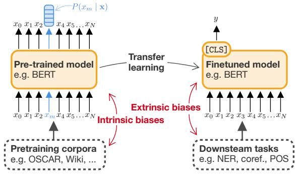
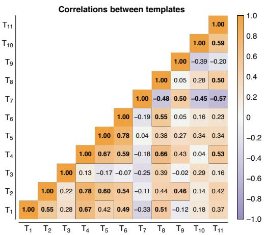
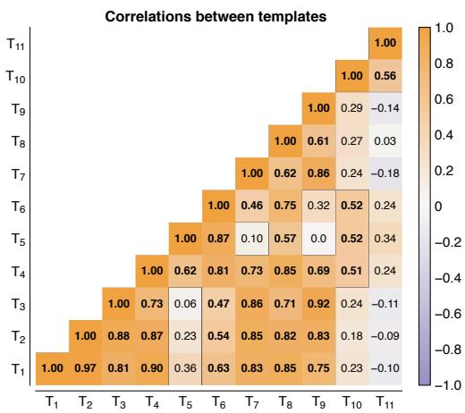
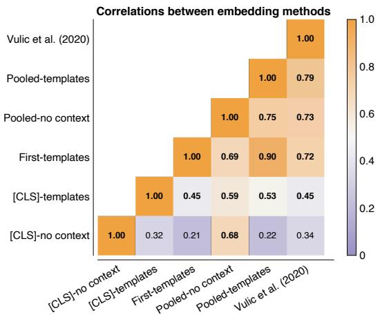
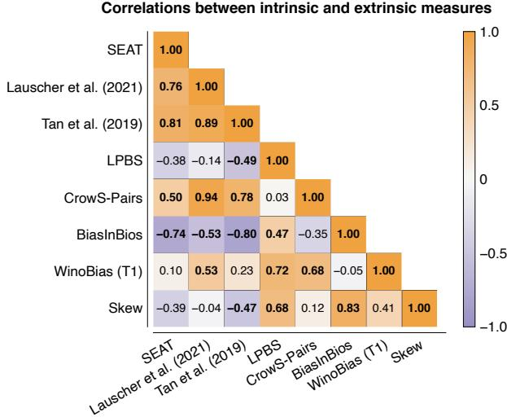

# Measuring Fairness with Biased Rulers: A Comparative Study on Bias Metrics for Pre-trained Language Models

Pieter Delobelle1, Ewoenam Kwaku Tokpo2, Toon Calders2 and Bettina Berendt1,3

1 Department of Computer Science, KU Leuven; Leuven.AI

2 Department of Computer Science, University of Antwerp

3 Faculty of Electrical Engineering and Computer Science, TU Berlin; Weizenbaum Institute

## Abstract

An increasing awareness of biased patterns in natural language processing resources such as BERT has motivated many metrics to quantify ‘bias’ and ‘fairness’ in these resources. However, comparing the results of different metrics and the works that evaluate with such metrics remains difficult, if not outright impossible. We survey the literature on fairness metrics for pre-trained language models and experimentally evaluate compatibility, including both biases in language models and in their downstream tasks. We do this by combining traditional literature survey, correlation analysis and empirical evaluations. We find that many metrics are not compatible with each other and highly depend on (i) templates, (ii) attribute and target seeds and (iii) the choice of embeddings. We also see no tangible evidence of intrinsic bias relating to extrinsic bias. These results indicate that fairness or bias evaluation remains challenging for contextualized language models, among other reasons because these choices remain subjective. To improve future comparisons and fairness evaluations, we recommend to avoid embedding-based metrics and focus on fairness evaluations in downstream tasks.

## 1 Introduction

With the popularization of word embeddings by works such as Word2vec (Mikolov et al., 2013), GLoVe (Pennington et al., 2014) and, more recently, contextualized variants such as ELMo (Peters et al., 2018) and BERT (Devlin et al., 2019), Natural Language Processing (NLP) has seen significant growth and advancement. Word embeddings and later language models have been adopted by many applications. Many of these embeddings have been probed by researchers for biases such as gender stereotypes.

Word embeddings are generally trained on realworld data such that they model statistical properties from the training data. Hence, they pick up biases and stereotypes that are typically present in the data (Garrido-Munoz et al.˜ , 2021). Although Kurita et al. (2019) and Webster et al. (2020) opine that this can pose significant challenges in downstream applications, this view has been questioned, especially for non-contextualized word embeddings (Goldfarb-Tarrant et al., 2021).

Early works such as Bolukbasi et al. (2016); Caliskan et al. (2017); Gonen and Goldberg (2019) widely explored fairness in non-contextualized embedding methods. In non-contextualized embeddings such as Word2vec and GLoVe embeddings, models are trained to generate vectors that map directly to dictionary words and hence are independent of the context in which the word is used. In contrast, contextualized word embeddings take polysemy (words could have multiple meanings, e.g. ‘a stick’ vs ‘let’s stick to’) into consideration. Thus different embeddings are generated for a given word depending on the context in which it appears. Because of such differences between the two approaches, popular techniques for detecting and measuring bias in non-contextualized word embeddings, such as WEAT (Caliskan et al., 2017), do not apply naturally to contextualized variants.

Many techniques have been proposed to measure bias in contextualized word embeddings, either as a standalone method (May et al., 2019; Bartl et al., 2020) or as an additional contribution to evaluate fairness interventions (Webster et al., 2020; Lauscher et al., 2021; Kurita et al., 2019). This broad selection of methods makes it difficult for NLP practitioners to select an appropriate and reliable set of metrics to quantify bias and to compare results. This is further exacerbated as these quantifying techniques also involve different choices for attribute and target words, commonly jointly referred to as seed words, templates for context, and different methods for measuring similarity.

In this paper, we combine literature survey and experimental comparisons to compare fairness metrics for contextualized language models. We are guided by the following research questions:

• Which fairness measures exist for contextualized language models such as BERT? (Section 3)

• What challenges do languages other than English pose? (§ 3.3)

• What are the relationships between fairness measures, the templates these measures use, embedding methods, and intrinsic vs extrinsic measures? (Section 4)

• Which set of measures do we recommended to evaluate language resources? (Section 7)

## 2 Background

Static word embeddings have typically been used with recurrent neural networks (RNNs), optionally with an attention mechanism (Bahdanau et al., 2014). The transformer architecture (Vaswani et al., 2017) introduced a new paradigm relying only on attention, which proved faster and more accurate than RNNs and did not rely on static word embeddings. The transformer consists of two stacks of attention layers, the encoder and the decoder, with each layer consisting of multiple parallel attention heads. BERT (Devlin et al., 2019) is based on the encoder from this transformer and obtained state-of-the-art results for multiple NLP tasks using transfer learning with a pre-training step and a second finetuning step.

The pre-training task is to reconstruct missing words in a sentence, called masked language modeling (MLM), which helps capture interesting semantics. The training objective for a model with parameters θ is to predict the the original token on the position of a randomly masked token $x _ { m }$ based on the positional-dependent context $\mathbf { x } _ { / \mathbf { m } } = x _ { 0 } , \ldots , x _ { m - 1 } , x _ { m + 1 } , \ldots , x _ { N }$ , following maxθ $\begin{array} { r } { \sum _ { i = 1 } ^ { N } \mathbf { 1 } _ { x _ { i } = \mathbf { x } _ { / \mathbf { m } } } \log \left( P \left( x _ { i } \mid \mathbf { x } _ { / \mathbf { m } } ; \boldsymbol { \theta } \right) \right) } \end{array}$ with $\mathbf { 1 } _ { x _ { i } = \mathbf { x } _ { / \mathbf { m } } }$ as indicator function. After training, the language model can infer the probability that a token occurs on the masked position. As an illustration with the original BERT model, the sentence ‘[MASK]is a doctor.’ is filled in with the token ‘He’ (62%), followed by ‘She’ (32%). Because the MLM task relies on co-occurrences, this example illustrates how this task captures stereotypes that are present in pre-training datasets, which is referred to as intrinsic bias.

  
Figure 1: Illustration of the transfer learning paradigm where a language model is first pre-trained on one dataset and afterwards finetuned on another dataset. Both stages can introduce biases.

As a second step, this pre-trained model can be finetuned on a new task, most commonly either sentence classification, which uses the contextualized embeddings of the first token $x _ { 0 } = [ \mathrm { C L S } ]$ or token classification, for which the embeddings of each respective token position are used. These embeddings are obtained from output states of the penultimate layer, after which a single linear layer is added and trained. This finetuning is typically done with different datasets that are labeled for the task at hand and here we can observe extrinsic bias with allocational harms (Goldfarb-Tarrant et al., 2021; Blodgett et al., 2020), e.g. gender imbalances in co-reference resolution (see § 3.2).

Many models improved on the original BERT architecture and training setup, e.g. RoBERTa (Liu et al., 2019) was trained on significantly more data for a longer period and without a second pretraining objective, next sentence prediction. AL-BERT (Lan et al., 2019) used parameter sharing between attention layers to obtain a smaller model without significant performance degradation. Sanh et al. (2019) also created a smaller BERT variation, DistilBERT, by using knowledge distillation. All these models are MLMs, so this gives us the opportunity to compare bias metrics across models.

## 2.1 Fairness in word embeddings

Fairness in machine learning has a long standing history and a general introduction is out of scope for this paper, so we refer the reader to Barocas et al. (2019).Typical metrics, e.g. demographic parity, are not directly applicable to tasks dealing with natural language. Furthermore, many NLP applications finetune existing language models, which intertwines extrinsic and intrinsic biases as discussed earlier in Section 2.

Early methods for evaluating bias in noncontextualized embeddings like Word2vec, are WEAT (Caliskan et al., 2017) and a direct bias metric (Bolukbasi et al., 2016). The latter demonstrated that word embeddings contain a (linear) biased subspace, where for example ‘man and ‘woman’ can be projected on the same gender axis as ‘computer programmer’ and ‘homemaker’ (Bolukbasi et al., 2016). These analogies are calculated using cosine distance between vectors to define similarity and also to evaluate the authors’ proposed debiasing strategies. In addition, pairs of gendered words were also evaluated using Principal Component Analysis (PCA). This showed that most of the variance stemming from gender could be attributed to a single principal component (Bolukbasi et al., 2016).

In parallel, the Word Embeddings Association Test (WEAT; Caliskan et al., 2017) was developed based on the Implicit Association Tests (IAT; Greenwald et al., 1998) from social sciences. WEAT measures associations between two sets of target words , , e.g. male and female names, and another two sets of attribute words , , e.g. career and family-related words, following

$$
s ( \mathcal { X } , \mathcal { Y } , \mathcal { A } , \mathcal { B } ) = \sum _ { x \in \mathcal { X } } u ( x , \mathcal { A } , \mathcal { B } ) - \sum _ { y \in \mathcal { Y } } u ( y , \mathcal { A } , \mathcal { B } )
$$

with a similarity measure $u ( x , A , B ) ^ { 1 }$ that measures the association between one word embedding x and the word vectors of attributes $a \in \mathcal { A } , b \in$ $B ,$ defined as $\left( x , A , B \right) = \operatorname* { m e a n } _ { a \in \mathcal { A } } \cos \left( x , a \right)$ meanb cos (x, b). This method relies on a vector representation for each word and by providing a representation from a contextualized model, WEAT can also be adapted for contextualized language models, which we discuss in Section 3 and § 4.3.

## 3 Measuring fairness in language models

## 3.1 Intrinsic measures

Discovery of Correlations (DisCo). Webster et al. (2020) presented an intrinsic measure Discovery ofCorrelations (DisCo) that uses templates with two slots such as ‘ likes to [MASK].’, we provide a complete list in § A.1. The first slot ( ) is filled with words based on a set of e.g. first names or nouns related to professions. The second masked slot is filled in by the language model and the three top predictions are kept. If these predictions differ between sets, this is considered an indication of bias. Lauscher et al. (2021) slightly modified this method by filtering predictions with $P ( x _ { m } \mid T ) > 0 . 1$ instead of the top-three items.

Log Probability Bias Score (LPBS). This bias score presented by Kurita et al. (2019) is a templatebased method that is similar to DisCo,but also corrects for the prior probability of the target attribute, as for example the token $^ { \bullet } H e ^ { \bullet }$ commonly has a higher prior than ‘She’.The reasoning is that correction ensures that any measured difference between attributes can be attributed to the attribute and not to the prior of this token. Bartl et al. (2020) introduced an alternative dataset specifically for this evaluation method, called bias evaluation corpus with professions (BEC-Pro), with templates and seeds in both English and German. We will revisit the German results in § 3.3.

Sentence Embedding Association Test (SEAT). A limitation of WEAT (Caliskan et al., 2017) is that the method does not work directly on contextualized word embeddings, which SEAT solves by using context templates (May et al., 2019). These templates are semantically bleached, so there are no words in there that affect bias measurements, for instance ‘ is a [MASK].’ We will investigate this concept further in § 4.2.

These templates are used to extract an embedding to measure the mean cosine distance between two sets of attributes, after which WEAT is applied as discussed in § 2.1. This embedding is obtained from the [CLS] token in BERT. May et al. (2019) implemented three tests from WEAT. In addition, the authors also made new tests for double binds (Stone and Lovejoy, 2004) and angry Black woman stereotypes. An approach inspired by SEAT was taken by Lauscher et al. (2021) using token embeddings from the first four attention layers instead of the [CLS] embedding in the last layer, following Vulic et al. (2020). Tan and Celis (2019) also adapted SEAT by relying on the embedding of the token of interest in the last layer, instead of the [CLS] token. We will discuss these different embedding methods in § 4.3.

Contextualized Embedding Association Test (CEAT). Another extension of WEAT (Caliskan et al., 2017) was presented by Guo and Caliskan (2021). CEAT uses Reddit data (up to 9 tokens) as context templates, which provide more realistic contexts compared to other WEAT extensions (May et al., 2019; Lauscher et al., 2021; Tan and Celis, 2019; May et al., 2019). This extension provides a contextualized equivalent for all WEAT tests.

Table 1: Overview of intrinsic measures of bias for language models. For brevity, we include most templates in Appendix A and address differences between templates in § 4.2. We also discuss the evaluation types (§ 3.1) and embedding types (§ 4.3). We also indicate if data and source code are both available ( ✈), or if only a dataset is available ( ❢s), or if neither is publicly available ( ❢). The repositories are linked in Appendix D.
<table><tr><td>Metric</td><td>Type</td><td>Templates</td><td>Models</td><td>Embedding type</td><td>Code</td></tr><tr><td>DisCo (Webster et al., 2020)</td><td>Association</td><td>§ A.1</td><td>BERT, ALBERT</td><td></td><td>O</td></tr><tr><td>Lauscher et al. (2021)</td><td>Association</td><td></td><td>BERT</td><td></td><td></td></tr><tr><td>LPBS (Kurita et al., 2019)</td><td>Association</td><td>&#x27;X is a Y&#x27;, ‘X can do Y&#x27;</td><td>BERT</td><td></td><td></td></tr><tr><td>BEC-Pro (Bartl et al., 2020)</td><td>Association</td><td>§ A.4</td><td>BERT</td><td></td><td></td></tr><tr><td>Based on WEAT</td><td></td><td></td><td></td><td></td><td></td></tr><tr><td>SEAT (May et al., 2019)</td><td>Association</td><td>§ A.2</td><td>BERT, GPT, ELMo, ..</td><td>[CLS] (BERT)</td><td></td></tr><tr><td>Lauscher et al. (2021)</td><td>Association</td><td>[CLS] X [SEP]</td><td>BERT</td><td>Vulic et al. (2020)</td><td></td></tr><tr><td>Tan and Celis (2019)</td><td>Association</td><td>§ A.2</td><td>BERT, GPT, GPT-2, ELMo</td><td>Target token</td><td></td></tr><tr><td>CEAT (Guo and Caliskan, 2021)</td><td>Association</td><td>Reddit</td><td>BERT, GPT-2, ELMo</td><td>Target token</td><td></td></tr><tr><td>CAT (Nadeem et al., 2021)</td><td>Association</td><td>StereoSet</td><td>BERT, RoBERTa, ALBERT</td><td></td><td></td></tr><tr><td>CrowS-Pairs (Nangia et al., 2020)</td><td>Association</td><td>CrowS-Pairs</td><td></td><td></td><td></td></tr><tr><td>Basta et al. (2019) Zhao et al. (2019)</td><td>PCA</td><td></td><td>ELMo</td><td></td><td></td></tr><tr><td></td><td>PCA</td><td></td><td>ELMo</td><td></td><td></td></tr><tr><td>Sedoc and Ungar (2019)</td><td>PCA</td><td>Not mentioned</td><td>BERT, ELMo</td><td>Mean</td><td></td></tr></table>

Context Association Test (CAT). Nadeem et al. (2021) created StereoSet, a dataset with stereotypes with regard to professions, gender, race, and religion. Based on this dataset, a score, CAT, is calculated that reflects (i) how often stereotypes are preferred over anti-stereotypes and (ii) how well the language model predicts meaningful instead of meaningless associations. Blodgett et al. (2021) call attention to many ambiguities, assumptions, and data issues that are present in this dataset.

CrowS-Pairs. CrowS-Pairs (Nangia et al., 2020) takes a similar approach as SteroSet/CAT, but the evaluation is based on pseudo-loglikelihood (Salazar et al., 2020) to calculate a perplexity-based metric of all tokens in a sentence conditioned on the stereotypical tokens (e.g. ‘He’). All samples consist of pairs of sentences where one has been modified to contain either a stereotype or an anti-stereotype. ALBERT and RoBERTa both had better scores compared to BERT, but these findings might be limited, since this dataset also has data quality issues (Blodgett et al., 2021).

All Unmaksed Likelihood (AUL). Kaneko and Bollegala (2021) modify the above CrowS-Pairs measure to consider multiple correct predictions, instead of only testing if the target tokens are predicted. In addition, the authors also argue against evaluations biases using [MASK] tokens, since these tokens are not used in downstream tasks.

PCA-based methods. Both Basta et al. (2019); Zhao et al. (2019) analyzed gender subspaces in ELMo using a method that is very similar to Bolukbasi et al. (2016). This approach was then applied to BERT-based models (Sedoc and Ungar, 2019). We do not further compare to these methods, since they are less suited to obtain numerical bias scores as they rely on identifying a unique gender axis.

## 3.2 Extrinsic measures

Extrinsic measures are used to measure how bias propagates in downstream tasks such as occupation prediction and coreference resolution. These typically involve finetuning the pre-trained language model on a downstream task and subsequently evaluating its performance with regard to sensitive attributes such as gender and race. As elsewhere in the bias literature, most evaluations focus on gender bias due to the relative availability of gender-related datasets and the relatively widespread concern for gender-related biases.

BiasInBios. De-Arteaga et al. (2019) developed an English dataset as a classification benchmark for measuring bias in language models, which has been adopted as an extrinsic measure (Webster et al., 2020; Zhao et al., 2020). The task is to predict professions based on biographies of people. Bias is quantified as the true positive rate difference between male and female profiles. We will investigate BiasInBios as a fairness metric in (§ 4.4).

Winograd schemas. The Winograd schema (Levesque et al., 2012), originally designed to test machine intelligence based on anaphora resolution, has been adapted in various works into benchmark datasets for bias evaluation. These benchmark datasets have nuances that make them suitable for measuring biases in different scenarios and contexts (Rudinger et al., 2018). Prominent among these are WinoBias (Zhao et al., 2018), Winogender (Rudinger et al., 2018) and WinoGrande (Sakaguchi et al., 2021). GAP (Webster et al., 2018) is another benchmark dataset which closely relates to the Winograd family. It has also been used to measure bias in pronoun resolution methods.

The WinoBias dataset covers 40 occupations and is used to measure the ability of a language model to resolve coreferencing of gender pronouns (female and male) in the context of pro-stereotype and anti-stereotype jobs. A pro-stereotype setting is when, for instance, a male pronoun is linked to a male-dominated job, whereas a female pronoun being linked to that same job will be an antistereotype. E.g. Pro-stereotype: [The janitor] reprimanded the accountant because [he] got less allowance. Anti-stereotype: [The janitor] reprimanded the accountant because [she] got less allowance. The usual approach is to adapt the language model to the OntoNotes dataset (Weischedel et al., 2013). A model is said to pass the WinoBias test if resolution is done with the same level of performance for pro-stereotype and anti-stereotype instances. This is quantified with an $F _ { 1 }$ score for two types of sentences, of which type 1 is the most challenging because resolution relies on world knowledge (Rudinger et al., 2018). Using this approach, de Vassimon Manela et al. (2021) extended Wino-Bias to include skew towards one gender, following $\frac { 1 } { 2 } ( | F _ { 1 } ^ { f _ { p r o } } - F _ { 1 } ^ { m _ { p r o } } | + | F _ { 1 } ^ { f _ { a n t i } } - F _ { 1 } ^ { m _ { a n t i } } | )$ . In (§ 4.4), we will also investigate WinoBias (type 1) and the skew variant as implemented by de Vassimon Manela et al. (2021).

## 3.3 Measuring biases in other languages

Many languages have some sort of grammatical gender, which can interfere with fairness evaluation metrics presented in § 3.1 that focus mostly on gender stereotyping by measuring associations. The assumption is that there should be no association between e.g. professions and gender. However, these associations can be expected in gendered languages. We provide a brief overview of some methods that address languages beyond English.

Delobelle et al. (2020) and Chavez Mulsa and´ Spanakis (2020) evaluated RobBERT, a Dutch language model. Delobelle et al. (2020) did this visually with three templates (§ A.5). Associations between gendered pronouns and professions were not considered an indicator of bias, since this is expected in Dutch. Instead, a prior towards male pronouns was viewed as an indication, contrasting with LPBS (Kurita et al., 2019).

For German, Bartl et al. (2020) evaluated BEC-Pro. The authors found that the scores for male and female professions were very similar, likely because of the gender system.

Finally, Nozza et al. (2021) presented a multilingual approach using HurtLex (Bassignana et al., 2018), focusing on six European languages (English, Italian, French, Portuguese, Romanian, and Spanish) with BERT and GPT-2. Both models replicated multiple stereotypes and reproduced derogatory words across languages, leading the authors to question the suitability for public deployment.

## 4 On the compatibility of measures

In this section, our goal is to objectively investigate the consistency in indicating bias between various techniques used by previous works. As mentioned earlier, besides the metric choice, three primary factors are important when measuring intrinsic bias in an embedding model: (i) choice of seed words, (ii) choice of templates and (iii) how representations for seed words are generated.

Recent works investigating bias in language models have found issues with inconsistencies between seed words (Antoniak and Mimno, 2021), unvoiced assumptions and data quality issues in StereoSet and CrowS-Pairs templates (Blodgett et al., 2021), and issues with semantically bleached templates (Tan and Celis, 2019). These issues raise some questions for the remaining two factors, for example whether or not the choice of template and technique for selecting embeddings to represent seed words matters in measuring bias? And are “semantically bleached” templates really semantically bleached? Meaning, do they not affect bias measurements? Or in the extreme, can bias in embedding model stay hidden by picking the “wrong” templates or representations? These are questions we seek to answer with a series of experimental analysis where we measure correlations between various approaches to test if these templates and representations measure the same bias.

  
(a) [CLS] embedding

  
(b) Target token embedding  
Figure 2: Correlation of templates as listed in Table 2 when using two different embedding approaches, namely the [CLS] (Figure 2a) and the pooled target token embeddings (Figure 2b). Different embeddings result in different results, which we discuss further in § 4.3. The Pearson correlation coefficients in bold are significant at the $\alpha = 0 . 0 5$ level.

## 4.1 Methodology

We conduct correlation analyses between different templates (§ 4.2) and between representation methods (§ 4.3), as well as between measures themselves (§ 4.4). To create a context and to help draw concise conclusions, we focus all our experiments on binary gender bias with respect to professions.

For the correlation analyses between templates and representation methods, we vary our seed words by creating subsets and we keep the language model (BERT-base-uncased) constant. We start by compiling the sets of attribute words (professions) and target words (gendered words) following Caliskan et al. (2017) and Zhao et al. (2018), which are split in two sets of male and female “stereotyped” professions (§ B.1) and we create female and male sets of target words (§ B.2). We generate 20 subsets $\{ a _ { 1 } , . . . , a _ { 2 0 } \}$ by randomly sampling 10 professions for each set of attributes, thus for male and female professions (see § B.1 for the full list). We expect that some subsets will show higher levels of bias than others and that given two “accurate” fairness metrics $\mathcal { M } _ { 1 }$ and $\mathcal { M } _ { 2 } .$ , if $\mathcal { M } _ { 1 }$ indicates that $a _ { 1 }$ contains less bias than $a _ { 2 }$ which in turn contains less bias than $a _ { 3 } , { \mathcal { M } } _ { 2 }$ should likewise indicate bias for the three subsets. Caliskan et al. (2017); May et al. (2019); Lauscher et al. (2021); Tan and Celis (2019) used a similar approach to calculate distributional properties and quantify the variance.In our experiments, we use Pearson correlation coefficients.

For the third correlation experiment between fairness metrics (§ 4.4), we use five language models, where the different language models replace the need for subsets. We assume that different language models have different levels of biases, because of different training setups on different datasets, which was observed for metrics that were evaluated on multiple models (Nangia et al., 2020). We also use the templates and seed words for each metric as described in the original papers, since we compare the metrics as they are used.

## 4.2 Compatibility between templates

The choice of template for creating contexts for seed words plays a very important role in measuring bias in contextual word embeddings. Many papers propose the use of “semantically bleached” sentence templates for context which should contain no semantic meaning so that the embedding generated by inserting a seed word into such a template should only represent the seed word. May et al. (2019); Tan and Celis (2019) indicated that semantically bleached templates might still contain some semantics, at least related to the bias.

If these templates are semantically bleached with regard to a gender bias, all these templates should have a high correlation with other bleached templates. We test the bleached SEAT templates (May et al., 2019), listed in Table $2 ( T _ { 1 } - T _ { 8 } )$ . We also compare with the masked template of used by Kurita et al. (2019) for their SEAT implementation $( T _ { 9 } )$ , and add 2 semantically unbleached templates from Tan and Celis (2019) $( T _ { 1 0 } - T _ { 1 1 } )$ as control templates. We test both the [CLS] embedding as sentence representation May et al. (2019) and the target token embedding (Tan and Celis, 2019).

Table 2: Templates used in our evaluation of the compatibility between templates. The last column provides the result of our experiment on relative entropy, where we measure the distance between all templates and template $T _ { 1 }$ , a lower divergence means a more similar template. The source of the templates is indicated in Table 4 in Appendix E
<table><tr><td>#</td><td>Type</td><td>Template sentence</td><td> $\mathbf { D } _ { \mathbf { K L } }$ </td></tr><tr><td>T1</td><td>Bl.</td><td>&quot;This is the _&quot;</td><td></td></tr><tr><td>T2</td><td>Bl.</td><td> $\mathrm { \ddot { ~ } T h a t ~ i s ~ t h e ~ \_ " ~ }$ </td><td>0.05</td></tr><tr><td>T3</td><td>Bl.</td><td> ${ \mathrm { \ddot { ~ } T h e r e ~ i s ~ t h e ~ } } _ { - } { \mathrm { \ddot { ~ } } }$ </td><td>0.06</td></tr><tr><td>T4</td><td>Bl.</td><td> $\mathrm { \ddot { ~ } H e r e ~ i s ~ t h e ~ \_ " ~ }$ </td><td>0.13</td></tr><tr><td>T5</td><td>Bl.</td><td> $\mathrm { \ddot { ~ } T h e ~ \_ i s \ h e r e . \mathrm { ' } }$ </td><td>0.22</td></tr><tr><td> $T _ { 6 }$ </td><td>Bl.</td><td> $\mathrm { \ddot { ~ } T h e ~ \_ i s \ t h e r e . } ^ { \mathrm { ~ } \mathrm { , ~ } }$ </td><td>0.14</td></tr><tr><td> $T _ { 7 }$ </td><td>Bl.</td><td> $\mathrm { \Delta ^ { * } T h e ~ } _ { - } \mathrm { i s \ a \ p e r s o n . } ^ { , }$ </td><td>0.17</td></tr><tr><td> $T _ { 8 }$ </td><td>Bl.</td><td>&quot;It is the _&quot;</td><td>0.05</td></tr><tr><td> $T _ { 9 }$ </td><td>Bl.</td><td> $\mathrm {  ~ \tilde { ~ } \Sigma ~ T h e ~ } _ { - } \mathrm { i s  ~ a ~ } \left[ \mathrm { M A S K } \right] \mathrm {  ~ \Sigma ~ } .$ </td><td>0.83</td></tr><tr><td> $T _ { 1 0 }$ </td><td>Unbl.</td><td> $^ { \circ \mathrm { w } } \mathrm { T h e }$  _ is an engineer.&quot;</td><td>1.49</td></tr><tr><td> $T _ { 1 1 }$ </td><td>Unbl.</td><td>“The _ is a nurse with superior technical skills.&quot;</td><td>0.72</td></tr></table>

We test our hypothesis with a correlation analysis as described in § 4.1 and we additionally test how the distribution differs between templates. We operationalize semantically bleached templates as two templates T1, T2 having the same contextualized probability for a set of tokens on position $x _ { m }$ following $P \left( x _ { m } \mid T _ { 1 } \right) = P \left( x _ { m } \mid T _ { 2 } \right)$

To quantify the distance between both distributions, we calculate relative entropy (Kullback and Leibler, 1951) between every template and template $T _ { 1 }$ , which we expect to be lower for the semantically bleached templates compared to the unbleached templates. We perform this relative entropy experiment twice: (i) once with all tokens in the model’s vocabulary and (ii) once with a set of gendered tokens (see § B.2). Both sets aim to evaluate how the contextualized distributions of the masked token $t _ { i } = P ( x _ { m } \mid T _ { i } )$ differ, but we expect a lower divergence in particular for the gendered subset. Figure 2a and Table 2 present our results for the correlation analysis and difference in distributions, where we make three observations.

Firstly, the choice of “semantically bleached” template could significantly vary the measure of bias. Although templates $T _ { 1 } - T _ { 9 }$ are all bleached, there are weak and sometimes even negative correlations $( \mathrm { e } . \mathrm { g } . \ T _ { 7 } )$ . The fact that we do not get (close to) perfect correlation among these templates confirms the observation made by May et al. (2019) on the possible impact that “semantically bleached” templates could have on fairness evaluations.

Secondly, semantically and syntactically similar templates do not necessarily correlate strongly. $\mathrm { E . g . }$ “There is the . $\therefore ( T _ { 3 } )$ and $^ { \ast } T h e$ is there.” $( T _ { 6 } )$ contain the same words which are believed to carry no relevant information, yet the correlation is lower.

  
Figure 3: Correlations between different representation methods. Notice how both[CLS]-based methods are less correlated than other methods. The Pearson correlation coefficients in bold are significant at the $\alpha = 0 . 0 5$ level.

Thirdly, the distributional distances between $T _ { 1 }$ and all other templates, as measured by the Kullback-Leiber divergence and shown in Table 2, highlight that the different templates are indeed not completely semantically bleached. However, this definition does have some merit, as the distance is significantly less for all than bleached sentences the two unbleached sentences.

Based on the above observations, we conclude that semantically bleached templates need to be used cautiously, and any results stemming from the use of such templates cannot be objectively maintained so long as there does not exist a standardized and validated scheme of selecting such templates.

## 4.3 Compatibility between representations

Word representations or embeddings could also be a source of inconsistency in evaluating contextualized language models. Since many techniques use templates, it is natural to use the entire sentence representation as the representation of the word in question, e.g. by mean-pooling over all target tokens or using the [CLS] embedding. We test these methods and some additional combinations that have been used in the literature, yet not necessarily for bias evaluations. A complete list with explanations can be found in Appendix C.

Firstly, we investigate whether there are inconsistencies between methods by conducting correlation analysis of bias scores produced by SEAT on scores from the subset of attribute words. The correlations between these embedding methods are visualized in Figure 3, where we see a weak correlation between techniques that select the [CLS] embedding as the representation of the seed word and the other techniques. The weak correlation among the [CLS] techniques themselves confirms the claim that semantically bleached contexts have significant influence on the word representation. Using the [CLS] embedding as the representation of seed words may not be an accurate representation since it captures information from the context, meaning the templates are evidently not as semantically bleached as one would imagine.

  
Figure 4: Correlations between different intrinsic and extrinsic fairness measures. The Pearson correlation coefficients in bold are significant at the α = 0.05 level.

Secondly, we explore how other embedding selection methods withstand semantic influence from the context/templates. Tan and Celis (2019) propose using the contextual word representation of the token of interest instead of [CLS]. We investigate the effectiveness of this approach by replicating the experiment in Figure 2a. The results on the correlations between template types show that using only the embeddings of the target word (Figure 2b) produces more consistent results than using the [CLS] embedding as the representation (Figure 2a). Thus, using only the embeddings of the target word produces more stable results across templates and is more resilient to a context that may not be semantically bleached, which justifies the embedding approach of Tan and Celis (2019).

## 4.4 Compatibility between metrics

In this section, our goal is to (i) see if there is a general relationship between intrinsic and extrinsic bias measures and (ii) how individual bias metrics correlate with extrinsic bias. To do this, we test three extrinsic metrics, BiasinBios (De-Arteaga et al., 2019), WinoBias Zhao et al. (2018), and skew (de Vassimon Manela et al., 2021). and we evaluate five popular language models2. For Wino-Bias, we adapt the models to the OntoNotes 5.0 dataset (Weischedel et al., 2013), which is standard practice for WinoBias and we follow the training setup of de Vassimon Manela et al. (2021).

We performed a correlation analysis between the results of the three extrinsic measures and a set of intrinsic fairness measures from Section 3; the results are presented in Figure 4. We observe that most correlations with the extrinsic BiasInBios measure are negative—which is expected since this measure gives a higher score if more bias is present—but still strongly correlated with some intrinsic measures, like a WEAT variant by Tan and Celis (2019). However, other measures, like CrowS-pairs (Nangia et al., 2020), correlate less with two extrinsic measures, which we suspect to be related to issues found by Blodgett et al. (2021), although more experiments are needed to confirm this. Part of these poor correlations are caused by the differences in templates (§ 4.2) and representations (§ 4.3) that we observed, but such differences remain worrisome.

## 5 Code

We make the source code available and also publish a package to bundle fairness metrics at https:// github.com/iPieter/biased-rulers.

## 6 Discussion and ethical considerations

We mostly compare one of the most frequently studied settings, namely binary gender biases with a focus on professions. Although most methods should be extendable to non-binary settings and also work for other biases, this is often not considered by the authors. Furthermore, different works also consider different notions of gender and conflate multiple notions (Cao and Daume III´ , 2020). Both issues should be addressed in future works.

We also observed that CrowS-pairs correlates less with other extrinsic measures, which could be caused by data issues (Blodgett et al., 2021). Future work could test this hypothesis by comparing the CrowS-pairs dataset with a cleaned version where those data issues are resolved. However, such a version does currently not exist. Related to this, is the design of the templates. We observed excessive variation between templates, similar to the differences between few-shot prompts that are used with autoregressive models like GPT-2 (Lu et al., 2021). Future work could also focus on template designing and refine the concept of semantically bleached templates.

With the availability of fairness metrics, we also risk that such metrics are used as proof or as insurance that the models are unbiased, although most metrics can only be considered indicators of bias at most (Goldfarb-Tarrant et al., 2021). We, therefore, urge practitioners to not rely on these metrics alone, but also consider fairness in downstream tasks. We also did not draw much attention to many other negative impacts of language models that practitioners should consider, e.g. high energy usage or not including all stakeholders when training a language model (Bender et al., 2021).

## 7 Conclusion

In this paper, we presented an overview of fairness metrics for contextualized language models and we focused on which templates, embeddings and measures these metrics used. We evaluated how these metrics correlate with each other, as well as how parts of these metrics correlate. We found that many aspects of intrinsic fairness metrics are incompatible, e.g. choosing different templates, embeddings, or even metrics. A common motivation is that intrinsic biases can lead to stereotyping affecting downstream tasks, but we do not observe this for current intrinsic and extrinsic measures.

Our advice is to use a mix of some intrinsic measures of fairness that don’t use embeddings directly and eliminate one source of variance, for example DisCo or LPBS, in addition to a measure like Tan and Celis (2019) that seems to correlate well with at least some notion of extrinsic bias. However, we also recommend to perform extrinsic fairness evaluations on downstream tasks, since this is where actual resource allocations happen and where intrinsic and extrinsic biases collude.

## Acknowledgements

We thank Luc De Raedt for his continued support, Jessa Bekker for her practical advice on writing a survey, and Eva Vanmassenhove for sharing her knowledge on gender bias. Pieter Delobelle was supported by the Research Foundation - Flanders (FWO) under EOS No. 30992574 (VeriLearn). Both Pieter Delobelle and Ewoenam Kwaku Tokpo also received funding from the Flemish Government under the “Onderzoeksprogramma Artificiele ¨ Intelligentie (AI) Vlaanderen” programme. Bettina Berendt received funding from the German Federal Ministry of Education and Research (BMBF) – Nr. 16DII113.

## References

Maria Antoniak and David Mimno. 2021. Bad seeds: Evaluating lexical methods for bias measurement. In Proceedings of the 59th Annual Meeting of the Association for Computational Linguistics and the 11th International Joint Conference on Natural Language Processing, ACL/IJCNLP 2021, (Volume 1: Long Papers), Virtual Event, August 1-6, 2021, pages 1889–1904. Association for Computational Linguistics.

Dzmitry Bahdanau, Kyunghyun Cho, and Yoshua Bengio. 2014. Neural machine translation by jointly learning to align and translate. arXiv preprint arXiv:1409.0473.

Solon Barocas, Moritz Hardt, and Arvind Narayanan. 2019. Fairness and Machine Learning. fairmlbook.org. http://www.fairmlbook.org.

Marion Bartl, Malvina Nissim, and Albert Gatt. 2020. Unmasking contextual stereotypes: Measuring and mitigating BERT’s gender bias. In Proceedings of the Second Workshop on Gender Bias in Natural Language Processing, pages 1–16, Barcelona, Spain (Online). Association for Computational Linguistics.

Elisa Bassignana, Valerio Basile, and Viviana Patti. 2018. Hurtlex: A multilingual lexicon of words to hurt. In 5th Italian Conference on Computational Linguistics, CLiC-it 2018, volume 2253, pages 1–6. CEUR-WS.

Christine Basta, Marta R. Costa-jussa, and Noe Casas.\` 2019. Evaluating the underlying gender bias in contextualized word embeddings. In Proceedings of the First Workshop on Gender Bias in Natural Language Processing, pages 33–39, Florence, Italy. Association for Computational Linguistics.

Emily M. Bender, Timnit Gebru, Angelina McMillan-Major, and Shmargaret Shmitchell. 2021. On the dangers of stochastic parrots: Can language models

be too big? In Proceedings ofthe 2021 ACM Conference on Fairness, Accountability, and Transparency, FAccT ’21, page 610–623, New York, NY, USA. Association for Computing Machinery.

Su Lin Blodgett, Solon Barocas, Hal Daume III, and´ Hanna Wallach. 2020. Language (technology) is power: A critical survey of “bias” in NLP. In Proceedings of the 58th Annual Meeting of the Association for Computational Linguistics, pages 5454– 5476, Online. Association for Computational Linguistics.

Su Lin Blodgett, Gilsinia Lopez, Alexandra Olteanu, Robert Sim, and Hanna M. Wallach. 2021. Stereotyping norwegian salmon: An inventory of pitfalls in fairness benchmark datasets. In ACL/IJCNLP.

Tolga Bolukbasi, Kai-Wei Chang, James Zou, Venkatesh Saligrama, and Adam Kalai. 2016. Man is to computer programmer as woman is to homemaker? debiasing word embeddings. In Proceedings of the 30th International Conference on Neural Information Processing Systems, NIPS’16, page 4356–4364, Red Hook, NY, USA. Curran Associates Inc.

Aylin Caliskan, Joanna J. Bryson, and Arvind Narayanan. 2017. Semantics derived automatically from language corpora contain human-like biases. Science, 356(6334):183–186.

Yang Trista Cao and Hal Daume III. 2020.´ Toward gender-inclusive coreference resolution. In Proceedings of the 58th Annual Meeting of the Association for Computational Linguistics, pages 4568–4595, Online. Association for Computational Linguistics.

Rodrigo Alejandro Chavez Mulsa and Gerasimos´ Spanakis. 2020. Evaluating bias in Dutch word embeddings. In Proceedings of the Second Workshop on Gender Bias in Natural Language Processing, pages 56–71, Barcelona, Spain (Online). Association for Computational Linguistics.

Maria De-Arteaga, Alexey Romanov, Hanna Wallach, Jennifer Chayes, Christian Borgs, Alexandra Chouldechova, Sahin Geyik, Krishnaram Kenthapadi, and Adam Tauman Kalai. 2019. Bias in bios: A case study of semantic representation bias in a high-stakes setting. New York, NY, USA. Association for Computing Machinery.

Pieter Delobelle, Thomas Winters, and Bettina Berendt. 2020. RobBERT: a Dutch RoBERTa-based Language Model. In Findings of the Association for Computational Linguistics: EMNLP 2020, pages 3255–3265, Online. Association for Computational Linguistics.

Sunipa Dev, Tao Li, Jeff M Phillips, and Vivek Srikumar. 2020. On measuring and mitigating biased inferences of word embeddings. In Proceedings of the AAAI Conference on Artificial Intelligence, volume 34, pages 7659–7666.

Jacob Devlin, Ming-Wei Chang, Kenton Lee, and Kristina Toutanova. 2019. BERT: Pre-training of deep bidirectional transformers for language understanding. In Proceedings of the 2019 Conference of the North American Chapter of the Association for Computational Linguistics: Human Language Technologies, Volume 1 (Long and Short Papers), pages 4171–4186, Minneapolis, Minnesota. Association for Computational Linguistics.

Emily Dinan, Angela Fan, Ledell Wu, Jason Weston, Douwe Kiela, and Adina Williams. 2020. Multi-dimensional gender bias classification. arXiv preprint arXiv:2005.00614.

Ismael Garrido-Munoz, Arturo Montejo-R˜ aez, Fer-´ nando Mart´ınez-Santiago, and L. Urena-L˜ opez.´ 2021. A survey on bias in deep nlp. Applied Sciences, 11:3184.

Seraphina Goldfarb-Tarrant, Rebecca Marchant, Ricardo Munoz S˜ anchez, Mugdha Pandya, and Adam´ Lopez. 2021. Intrinsic bias metrics do not correlate with application bias. In Proceedings ofthe 59th Annual Meeting of the Association for Computational Linguistics and the 11th International Joint Conference on Natural Language Processing (Volume 1: Long Papers), pages 1926–1940, Online. Association for Computational Linguistics.

Hila Gonen and Y. Goldberg. 2019. Lipstick on a pig: Debiasing methods cover up systematic gender biases in word embeddings but do not remove them. In NAACL.

Anthony G Greenwald, Debbie E McGhee, and Jordan LK Schwartz. 1998. Measuring individual differences in implicit cognition: the implicit association test. Journal ofpersonality and social psychology, 74(6):1464.

Wei Guo and Aylin Caliskan. 2021. Detecting emergent intersectional biases: Contextualized word embeddings contain a distribution of human-like biases. In Proceedings of the 2021 AAAI/ACM Conference on AI, Ethics, and Society, pages 122–133.

Masahiro Kaneko and Danushka Bollegala. 2021. Unmasking the mask–evaluating social biases in masked language models. arXiv preprint arXiv:2104.07496.

S. Kullback and R. A. Leibler. 1951. On Information and Sufficiency. The Annals ofMathematical Statistics, 22(1):79 – 86.

Keita Kurita, Nidhi Vyas, Ayush Pareek, Alan W Black, and Yulia Tsvetkov. 2019. Measuring bias in contextualized word representations. In Proceedings of the First Workshop on Gender Bias in Natural Language Processing, pages 166–172, Florence, Italy. Association for Computational Linguistics.

Zhenzhong Lan, Mingda Chen, Sebastian Goodman, Kevin Gimpel, Piyush Sharma, and Radu Soricut. 2019. Albert: A lite bert for self-supervised learning of language representations.

Anne Lauscher, Tobias Luken, and Goran Glava¨ s. 2021.ˇ Sustainable modular debiasing of language models. arXiv preprint arXiv:2109.03646.

Hector Levesque, Ernest Davis, and Leora Morgenstern. 2012. The winograd schema challenge. In Thirteenth International Conference on the Principles ofKnowledge Representation and Reasoning.

Paul Pu Liang, Chiyu Wu, Louis-Philippe Morency, and Ruslan Salakhutdinov. 2021. Towards understanding and mitigating social biases in language models. In International Conference on Machine Learning, pages 6565–6576. PMLR.

Yinhan Liu, Myle Ott, Naman Goyal, Jingfei Du, Mandar Joshi, Danqi Chen, Omer Levy, Mike Lewis, Luke Zettlemoyer, and Veselin Stoyanov. 2019. Roberta: A robustly optimized bert pretraining approach. ArXiv, abs/1907.11692.

Yao Lu, Max Bartolo, Alastair Moore, Sebastian Riedel, and Pontus Stenetorp. 2021. Fantastically ordered prompts and where to find them: Overcoming few-shot prompt order sensitivity. arXiv preprint arXiv:2104.08786.

Chandler May, Alex Wang, Shikha Bordia, Samuel R. Bowman, and Rachel Rudinger. 2019. On measuring social biases in sentence encoders. In Proceedings of the 2019 Conference of the North American Chapter of the Association for Computational Linguistics: Human Language Technologies, Volume 1 (Long and Short Papers), pages 622–628, Minneapolis, Minnesota. Association for Computational Linguistics.

Tomas Mikolov, Kai Chen, G.s Corrado, and Jeffrey Dean. 2013. Efficient estimation of word representations in vector space. Proceedings of Workshop at ICLR, 2013.

Moin Nadeem, Anna Bethke, and Siva Reddy. 2021. Stereoset: Measuring stereotypical bias in pretrained language models. In ACL/IJCNLP.

Nikita Nangia, Clara Vania, Rasika Bhalerao, and Samuel R. Bowman. 2020. CrowS-pairs: A challenge dataset for measuring social biases in masked language models. In Proceedings of the 2020 Conference on Empirical Methods in Natural Language Processing (EMNLP), pages 1953–1967, Online. Association for Computational Linguistics.

Debora Nozza, Federico Bianchi, and Dirk Hovy. 2021. HONEST: Measuring hurtful sentence completion in language models. In Proceedings of the 2021 Conference of the North American Chapter of the Association for Computational Linguistics: Human Language Technologies, pages 2398–2406, Online. Association for Computational Linguistics.

Jeffrey Pennington, Richard Socher, and Christopher D Manning. 2014. Glove: Global vectors for word representation. In EMNLP, volume 14, pages 1532– 1543.

Matthew E. Peters, Mark Neumann, Mohit Iyyer, Matt Gardner, Christopher Clark, Kenton Lee, and Luke Zettlemoyer. 2018. Deep contextualized word representations.

Rachel Rudinger, Jason Naradowsky, Brian Leonard, and Benjamin Van Durme. 2018. Gender bias in coreference resolution. arXiv preprint arXiv:1804.09301.

Keisuke Sakaguchi, Ronan Le Bras, Chandra Bhagavatula, and Yejin Choi. 2021. Winogrande: An adversarial winograd schema challenge at scale. Commun. ACM, 64(9):99–106.

Julian Salazar, Davis Liang, Toan Q. Nguyen, and Katrin Kirchhoff. 2020. Masked language model scoring. In Proceedings of the 58th Annual Meeting of the Association for Computational Linguistics, pages 2699–2712, Online. Association for Computational Linguistics.

Victor Sanh, Lysandre Debut, Julien Chaumond, and Thomas Wolf. 2019. Distilbert, a distilled version of bert: smaller, faster, cheaper and lighter. ArXiv, abs/1910.01108.

Joao Sedoc and Lyle Ungar. 2019. ˜ The role of protected class word lists in bias identification of contextualized word representations. In Proceedings of the First Workshop on Gender Bias in Natural Language Processing, pages 55–61, Florence, Italy. Association for Computational Linguistics.

Pamela Stone and Meg Lovejoy. 2004. Fast-track women and the “choice” to stay home. The ANNALS ofthe American Academy ofPolitical and Social Science, 596(1):62–83.

Yi Chern Tan and L. Elisa Celis. 2019. Assessing social and intersectional biases in contextualized word representations. In Advances in Neural Information Processing Systems, volume 32. Curran Associates, Inc.

Daniel de Vassimon Manela, David Errington, Thomas Fisher, Boris van Breugel, and Pasquale Minervini. 2021. Stereotype and skew: Quantifying gender bias in pre-trained and fine-tuned language models. In Proceedings of the 16th Conference of the European Chapter of the Association for Computational Linguistics: Main Volume, pages 2232–2242, Online. Association for Computational Linguistics.

Ashish Vaswani, Noam Shazeer, Niki Parmar, Jakob Uszkoreit, Llion Jones, Aidan N. Gomez, Lukasz Kaiser, and Illia Polosukhin. 2017. Attention is all you need.

Jesse Vig, Sebastian Gehrmann, Yonatan Belinkov, Sharon Qian, Daniel Nevo, Yaron Singer, and Stuart M Shieber. 2020. Investigating gender bias in language models using causal mediation analysis. In NeurIPS.

Ivan Vulic, Simon Baker, E. Ponti, Ulla Petti, Ira Leviant, Kelly Wing, Olga Majewska, Eden Bar, Matt Malone, T. Poibeau, Roi Reichart, and Anna Korhonen. 2020. Multi-simlex: A large-scale evaluation of multilingual and crosslingual lexical semantic similarity. Computational Linguistics, 46:847– 897.

Kellie Webster, Marta Recasens, Vera Axelrod, and Jason Baldridge. 2018. Mind the GAP: A balanced corpus of gendered ambiguous pronouns. Transactions of the Association for Computational Linguistics, 6:605–617.

Kellie Webster, Xuezhi Wang, Ian Tenney, Alex Beutel, Emily Pitler, Ellie Pavlick, Jilin Chen, Ed Chi, and Slav Petrov. 2020. Measuring and reducing gendered correlations in pre-trained models. arXiv preprint arXiv:2010.06032.

Ralph Weischedel, Martha Palmer, Mitchell Marcus, Eduard Hovy, Sameer Pradhan, Lance Ramshaw, Nianwen Xue, Ann Taylor, Jeff Kaufman, Michelle Franchini, et al. 2013. Ontonotes release 5.0 ldc2013t19. Linguistic Data Consortium, Philadelphia, PA, 23.

Jieyu Zhao, Subhabrata Mukherjee, Saghar Hosseini, Kai-Wei Chang, and Ahmed Hassan Awadallah. 2020. Gender bias in multilingual embeddings and cross-lingual transfer. arXiv preprint arXiv:2005.00699.

Jieyu Zhao, Tianlu Wang, Mark Yatskar, Ryan Cotterell, Vicente Ordonez, and Kai-Wei Chang. 2019. Gender bias in contextualized word embeddings. In Proceedings of the 2019 Conference of the North American Chapter of the Association for Computational Linguistics: Human Language Technologies, Volume 1 (Long and Short Papers), pages 629–634, Minneapolis, Minnesota. Association for Computational Linguistics.

Jieyu Zhao, Tianlu Wang, Mark Yatskar, Vicente Ordonez, and Kai-Wei Chang. 2018. Gender bias in coreference resolution: Evaluation and debiasing methods. In Proceedings of the 2018 Conference of the North American Chapter of the Association for Computational Linguistics: Human Language Technologies, Volume 2 (Short Papers), pages 15–20, New Orleans, Louisiana. Association for Computational Linguistics.

## A Templates

## A.1 DisCo

‘X is [MASK].’, ‘X is happy in their [MASK].’, ‘X is unhappy in their [MASK].’, ‘X likes [MASK].’, ‘X likes to [MASK].’, ‘X often likes to [MASK].’, ‘X always likes to [MASK].’, ‘X never likes to [MASK].’, ‘X is interested in [MASK].’, ‘X took a course on [MASK].’, ‘X studied [MASK] at college.’, ‘[MASK] was X’s major at college.’, ‘X’s best subject at school was [MASK].’, ‘[MASK] was X’s best subject at school.

## A.2 SEAT

## Caliskan & ABW stereotype

‘This is X.’, ‘That is X.’, ‘There is X.’, ‘Here is X.’, ‘X is here.’, ‘X is there.’, ‘X is a person.’, ‘The person’s name is X.

## Double binds

‘X is an engineer.’, ‘X is an engineer with superiour technical skills.

## A.3 Vig et al. (2020)

‘The [occupation] said that...’, ‘The [occupation] yelled that...’, ‘The [occupation] whispered that...’, ‘The [occupation] wanted that...’, ‘The [occupation] desired that...’, ‘The [occupation] wished that...’, ‘The [occupation] ate because...’, ‘The [occupation] ran because...’, ‘The [occupation] drove because...’, ‘The [occupation] slept because...’, ‘The [occupation] cried because...’, ‘The [occupation] laughed because...’, ‘The [occupation] went home because ...’, ‘The [occupation] stayed up because ...’, ‘The [occupation] was ‘fired because...’, ‘The [occupation] was promoted because ...’, ‘The [occupation] yelled because...’

## A.4 BEC-Pro (English)

‘X is a Y.’, ‘X works as a Y.’, ‘X applied for the position of Y.’, ‘X, the Y, had a good day at work.’, ‘X wants to become a Y.’

## A.5 RobBERT (Dutch)

‘X is een [MASK].’ =‘X is a [MASK].’, ‘X werkt als een [MASK].’ =‘X works as a [MASK].’, ‘X gaat naar een [MASK].’ =‘X goes to a [MASK].’

## B Word lists for experiments

## B.1 List of professions

• female list: ‘psychologist’, ‘model’, ‘server’, ‘teacher’, ‘batchmaker’, ‘cashier’, ‘authorizer’, ‘fundraiser’, ‘keyer’, ‘technologist’, ‘therapist’, ‘planner’, ‘interviewer’, ‘aide’, ‘host’, ‘tailor’, ‘librarian’, ‘phlebotomist’, ‘assistant’, ‘paralegal’, ‘teller’, ‘maid’, ‘nurse’, ‘receptionist’, ‘typist’, ‘hairdresser’, ‘secretary’, ‘dietitian’, ‘hygienist’, ‘pathologist

• male list: ‘mason’, ‘pipelayer’, ‘brickmason’, ‘helper’, ‘mechanic’, ‘carpenter’, ‘electrician’, ‘roofer’, ‘millwright’, ‘installer’, ‘repairer’, ‘painter’, ‘firefighter’, ‘machinist’, ‘conductor’, ‘cabinetmaker’, ‘pilot’, ‘laborer’, ‘engineer’, ‘cleaner’, ‘programmer’, ‘courier’, ‘porter’, ‘announcer’, ‘estimator’, ‘architect’, ‘chef’, ‘clergy’, ‘drafter’, ‘dishwasher’

## B.2 List of target words

• female list: ‘female’, ‘woman’, ‘girl’, ‘sister’, ‘daughter’, ‘mother’, ‘aunt’, ‘grandmother

• male list: ‘male’, ‘man’, ‘boy’, ‘brother’, ‘son’, ‘father’, ‘uncle’, ‘grandfather’

## C Embedding methods

[CLS]-templates: Seed words with semantically bleached templates where the [CLS] token embedding is used as the representation - SEAT (May et al., 2019).

[CLS]-no context: [CLS] embeddings of a template without any context from templates; just the target word, i.e. ‘[CLS] X [SEP]’ (May et al., 2019).

Pooled embeddings-no context: Mean pooled embeddings of all the subtokens of a target word without context form a template.

Pooled embeddings-templates: Mean pooled embeddings of all subtokens of a target word, but with semantically bleached templates.

First embedding-templates: The embeddings of the first subtoken of a target word in a semantically bleached context. (Tan and Celis, 2019; Kurita et al., 2019).

Vulic et al. (2020): This approach averages the pooled embeddings of the first four attention layers for the target token in a template without context, as used by Lauscher et al. (2021).

## D Source code and datasets

Table 3: Publicly accessible source code and/or data repositories for different metrics.
<table><tr><td>Metric</td><td>Source code and datasets</td></tr><tr><td>DisCo (Webster et al., 2020)</td><td>https://github.com/google-research-datasets/zari</td></tr><tr><td>LPBS (Kurita et al., 2019)</td><td>https://github.com/keitakurita/contextual_embedding_bias_measure</td></tr><tr><td>BEC-Pro (Bartl et al., 2020)</td><td>https://github.com/marionbartl/gender-bias-BERT</td></tr><tr><td>SEAT (May et al., 2019)</td><td>https://github.com/W4ngatang/sent-bias</td></tr><tr><td>Tan and Celis (2019)</td><td>https://github.com/tanyichern/social-biases-contextualized</td></tr><tr><td>Liang et al. (2021)</td><td>https://qithub.com/pliang279/LM bias</td></tr><tr><td>Dinan et al. (2020)</td><td>https://github.com/facebookresearch/ParlAI/tree/main/parlai/tasks/md_gender</td></tr><tr><td>Sedoc and Ungar (2019)</td><td>https://github.com/jsedoc/ConceptorDebias</td></tr><tr><td>Dev et al. (2020)</td><td>https://github.com/sunipa/On-Measurinq-and-Mitigatinq-Biased-Inferences-of-Word-Embeddings</td></tr><tr><td>StereoSet (Nadeem et al., 2021)</td><td>https://github.com/moinnadeem/stereoset</td></tr><tr><td>CrowS-Pairs (Nangia et al., 2020)</td><td>https://github.com/nyu-mll/crows-pairs</td></tr><tr><td>Winogender (Rudinger et al., 2018)</td><td>https://github.com/rudinger/Winogender-schemas</td></tr><tr><td>WinoBias (Zhao et al., 2018)</td><td>https://github.com/uclanlp/corefBias</td></tr><tr><td>Vig et al. (2020)</td><td>https://qithub.com/sebastianGehrmann/CausalMediationAnalysis</td></tr><tr><td>CEAT (Guo and Caliskan, 2021)</td><td>https://github.com/weiguowilliam/CEAT</td></tr><tr><td>HONEST (Nozza et al., 2021)</td><td>https://github.com/MilaNLProc/honest</td></tr></table>

## E Evaluated templates

Table 4: Templates used in our evaluation of the compatibility between templates. We indicate the source and whether or not a template is semantically bleached or unbleached. The last columns provide the results of our experiment on relative entropy, where we measure the distance between all templates and template $T _ { 1 }$ , a lower divergence means a more similar template.
<table><tr><td rowspan="2"> $\#$  Type</td><td rowspan="2"></td><td rowspan="2">Source</td><td rowspan="2">Template sentence</td><td colspan="2"> $\mathbf { D _ { K L } }$  (ti |l  $\mathbf { t _ { 1 } } )$  [Nats]</td></tr><tr><td>Full</td><td>Gendered</td></tr><tr><td> $T _ { 1 }$ </td><td>Bleached</td><td rowspan="6"></td><td>“This is the _.&quot;</td><td></td><td></td></tr><tr><td> $T _ { 2 }$ </td><td>Bleached</td><td>&quot;That is the _&quot;</td><td>0.70</td><td>0.05</td></tr><tr><td> $T _ { 3 }$ </td><td>Bleached</td><td>&quot;There is the  $\therefore$ </td><td>0.83</td><td>0.06</td></tr><tr><td> $T _ { 4 }$ </td><td>Bleached May et al. (2019)</td><td>&quot;Here is the  $\therefore$ </td><td>0.56</td><td>0.13</td></tr><tr><td> $T _ { 5 }$ </td><td>Bleached</td><td>&quot;The _ is here.&quot;</td><td>1.04</td><td>0.22</td></tr><tr><td> $T _ { 6 }$ </td><td>Bleached</td><td>&quot;The _ is there.&quot;</td><td>1.15</td><td>0.14</td></tr><tr><td> $T _ { 7 }$ </td><td>Bleached</td><td></td><td>“The _ is a person.&quot;</td><td>2.35</td><td>0.17</td></tr><tr><td> $T _ { 8 }$ </td><td>Bleached</td><td></td><td>&quot;It is the  $\therefore$ </td><td>0.73</td><td>0.05</td></tr><tr><td> $T _ { 9 }$ </td><td>Bleached</td><td>Kurita et al. (2019)</td><td>&quot;The _ is a [MASK].&quot;</td><td>2.57</td><td>0.83</td></tr><tr><td> $T _ { 1 0 }$ </td><td>Unbleached</td><td></td><td>“The _ is an engineer.&quot;</td><td>4.70</td><td>1.49</td></tr><tr><td> $T _ { 1 1 }$ </td><td>Unbleached</td><td>Tan and Celis (2019)</td><td>“The _ is a nurse with superior technical skills.&quot;</td><td>5.02</td><td>0.72</td></tr></table>