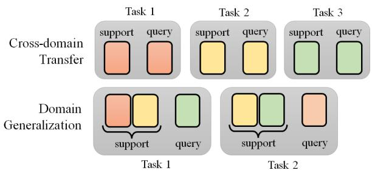

# Meta Learning for Natural Language Processing: A Survey

Hung-yi Lee National Taiwan University hungyilee@ntu.edu.tw

Shang-Wen Li Amazon AI∗ shangwel@amazon.com

Ngoc Thang Vu University of Stuttgart thangvu@ims.uni-stuttgart.de

## Abstract

Deep learning has been the mainstream technique in natural language processing (NLP) area. However, the techniques require many labeled data and are less generalizable across domains. Meta-learning is an arising field in machine learning studying approaches to learn better learning algorithms. Approaches aim at improving algorithms in various aspects, including data efficiency and generalizability. Efficacy of approaches has been shown in many NLP tasks, but there is no systematic survey of these approaches in NLP, which hinders more researchers from joining the field. Our goal with this survey paper is to offer researchers pointers to relevant meta-learning works in NLP and attract more attention from the NLP community to drive future innovation. This paper first introduces the general concepts of meta-learning and the common approaches. Then we summarize task construction settings and application of meta-learning for various NLP problems and review the development of meta-learning in NLP community.

## 1 Introduction

Recently, deep learning (DL) based natural language processing (NLP) has been one of the research mainstreams and yields significant performance improvement in many NLP problems. However, DL models are data-hungry. The downside limits such models’ application to different domains, languages, countries, or styles because collecting in-genre data for model training are costly.

To address the challenges, meta-learning techniques are gaining attention. Meta-learning, or Learning to Learn, aims to learn better learning algorithms, including better parameter initialization (Finn et al., 2017), optimization strategy (Andrychowicz et al., 2016; Ravi and Larochelle, 2017), network architecture (Zoph and Le, 2017; Zoph et al., 2018; Pham et al., 2018a), distance metrics (Vinyals et al., 2016; Gao et al., 2019a; Sung et al., 2018), and beyond (Mishra et al., 2018). Meta-learning allows faster fine-tuning, converges to better performance, yields more generalizable models, and it achieves outstanding results for few-shot image classificaition (Triantafillou et al., 2020). The benefits alleviate the dependency of learning algorithms on labels and make model development more scalable. Image processing is one of the machine learning areas with abundant applications and established most of the examples in the previous survey papers on meta-learning (Hospedales et al., 2021; Huisman et al., 2021).

On the other hand, there are works showing benefits of meta-learning techniques in performance and data efficiency via applying meta-learning to NLP problems. Please refer to Tables 2 and 3 in the appendix for NLP applications improved by metalearning. Tutorial (Lee et al., 2021b) and Workshop (Lee et al., 2021a) are organized at ACL 2021 to encourage exchange and collaboration among NLP researchers interested in these techniques. To facilitate more NLP researchers and practitioners benefiting from the advance of meta-learning and participating in the area, we provide a systematic survey of meta-learning to NLP problems in this paper. There is another survey paper on meta-learning in NLP (Yin, 2020). While Yin (2020) describes meta-learning methods in general, this paper focuses on the idea of making meta-learning successful when applied to NLP and provides a broader review of publications on NLP meta-learning. This paper is organized as below.

• A brief introduction of meta-learning backgrounds, general concepts, and algorithms in Section 2.

• Common settings for constructing metalearning tasks in Section 3.

• Adaptation of general meta-learning approaches to NLP problems in Section 4.

• Meta-learning approaches for special topics, including knowledge distillation and life-long learning for NLP applications in Section 5.

Due to space constraints, we will not give too many detailed descriptions of general meta-learning techniques in this survey paper. For general concepts of meta-learning, we encourage readers to read the previous overview paper (Yin, 2020; Hospedales et al., 2021; Huisman et al., 2021).

## 2 Background Knowledge for Meta Learning

The goal of machine learning (ML) is to find a function $f _ { \boldsymbol { \theta } } ( \boldsymbol { x } )$ parametrized by model parameters θ for inference from training data. For machine translation (MT), the input x is a sentence, while $f _ { \boldsymbol { \theta } } ( \boldsymbol { x } )$ is the translation of x; for automatic speech recognitoin (ASR), x is an utterance, while $f _ { \boldsymbol { \theta } } ( \boldsymbol { x } )$ is the transcription; In DL, θ are the network parameters, or weights and biases of a network. To learn $\theta ,$ there is a loss function $l ( \theta ; \mathcal { D } )$ , where is a set of paired examples for training,

$$
{ \mathcal { D } } = \{ ( x _ { 1 } , y _ { 1 } ) , ( x _ { 2 } , y _ { 2 } ) , . . . , ( x _ { K } , y _ { K } ) \} ,\tag{1}
$$

where $x _ { k }$ is function input, $y _ { k }$ is the ground truth, and K is the number of examples in . The loss function l(θ; ) is defined as below:

$$
l ( \theta ; \mathcal { D } ) = \sum _ { k = 1 } ^ { K } d ( f _ { \theta } ( x _ { k } ) , y _ { k } ) .\tag{2}
$$

where $d ( f _ { \theta } ( x _ { k } ) , y _ { k } )$ is the “distance” between the function output $f _ { \boldsymbol { \theta } } ( \boldsymbol { x } _ { k } )$ and the ground truth $y _ { k }$ . For classification problem, $d ( . , . )$ can be cross-entropy; for regression, it can be L1/L2 distance. The following optimization problem is solved to find the optimal parameter set $\theta ^ { * }$ for inference via minimizing the loss function $l ( \theta ; \mathcal { D } )$

$$
\theta ^ { * } = \arg \operatorname* { m i n } _ { \theta } l ( \theta ; { \mathcal { D } } ) .\tag{3}
$$

In meta-learning, what we want to learn is a learning algorithm. The learning algorithm can also be considered as a function, denoted as $F _ { \phi } ( . )$ The input of $F _ { \phi } ( . )$ is the training data, while the output of the function $F _ { \phi } ( . )$ is the learned model parameters, or $\theta ^ { * }$ in (3). The learning algorithm $F _ { \phi } ( . )$ is parameterized by meta-parameters $\phi ,$ which is what we want to learn in meta-learning. If $F _ { \phi } ( . )$ represents gradient descent for deep network, φ can be initial parameters, learning rate, network architecture, etc. Different meta-learning approaches focus on learning different components. For example, model-agnostic meta-learning (MAML) focuses on learning initial parameters (Finn et al., 2017), which will be further descried in Section 4.1. Learning to Compare methods like Prototypical Network (Snell et al., 2017) in Section 4.2 learn the latent representation of the inputs and their distance metrics for comparison. Network architecture search (NAS) in Section 4.3 learns the network architecture (Zoph and Le, 2017; Zoph et al., 2018; Pham et al., 2018a).

To learn meta-parameters $\phi ,$ meta-training tasks $\mathcal { T } _ { t r a i n }$ are required.

$$
\mathcal { T } _ { t r a i n } = \{ \mathcal { T } _ { 1 } , \mathcal { T } _ { 2 } , . . . , \mathcal { T } _ { N } \} ,\tag{4}
$$

where $\mathcal { T } _ { n }$ is a task, and N is the number of tasks in $\mathscr { T } _ { t r a i n }$ . Usually, all the tasks belong to the same NLP problem; for example, all the $\mathcal { T } _ { n }$ are QA but from different corpora, but it is also possible that the tasks belong to various problems. Each task $\mathcal { T } _ { n }$ includes a support set $S _ { n }$ and a query set $\mathcal { Q } _ { n }$ . Both $S _ { n }$ and $\mathcal { Q } _ { n }$ are paired examples as  in (1). The support set plays the role of training data in typical ML, while the query set can be understood as the testing data in typical ML. However, to not confuse the reader, we use the terms support and query sets in the context of meta-learning instead of training and testing sets.

In meta-learning, there is a loss function $L ( \phi ; \mathcal { T } _ { t r a i n } )$ , which represents how “bad” a learning algorihtm paramereized by $\phi$ is on $\mathcal { T } _ { t r a i n } .$ $L ( \phi ; \mathcal { T } _ { t r a i n } )$ is the performance over all the tasks in train,

$$
L ( \phi ; { \mathcal { T } } _ { t r a i n } ) = \sum _ { n = 1 } ^ { N } l ( \theta ^ { n } ; { \mathcal { Q } } _ { n } ) .\tag{5}
$$

The definition of the function l(.) above is the same as in (2). $l ( \theta ^ { n } ; \mathcal { Q } _ { n } )$ for each task $\mathcal { T } _ { n }$ is obtained as below. For each task $\mathcal { T } _ { n }$ in $\mathcal { T } _ { t r a i n }$ , we use a support set $S _ { n }$ to learn a model by the learning algorihtm $F _ { \phi }$ . The learned model is denoted as $\theta ^ { n }$ where $\theta ^ { n } = F _ { \phi } ( S _ { n } )$ . This procedure is equivalent to typical ML training. We called this step withintask training. Then $\theta ^ { n }$ is evaluated on $\mathcal { Q } _ { n }$ to obtain $l ( \theta ^ { n } ; \mathcal { Q } _ { n } )$ in (5). We called this step within-task testing. One execution of within-task training and followed by one execution of within-task testing is called an episode.

The optimization task below is solved to learn meta-parameteres $\phi$

$$
\phi ^ { * } = \arg \operatorname* { m i n } _ { \phi } L ( \phi ; \mathcal { T } _ { t r a i n } ) .\tag{6}
$$

If $\phi$ is differentiable with respect to $L ( \phi ; \mathcal { T } _ { t r a i n } )$ then we can use gradient descent to learn metaparameters; if not, we can use reinforcement learning algorithm or evolutionary algorithm. Solving (6) is called cross-task training in this paper, which usually involves running many episodes on meta-training tasks. To evaluate $\phi ^ { * }$ , we need meta-testing tasks $\tau _ { t e s t }$ , tasks for evaluating algorithms parameterized by meta-parameters $\phi ^ { * 1 }$ . We do cross-task testing on $\tau _ { t e s t }$ , that is, running an episode on each meta-testing task to evaluate algorithms parameterized by meta-parameters $\phi ^ { * }$

In order to facilitate the reading of our paper, we summarize the most important terminologies and their meanings in Table 1 in the appendix.

## 3 Task Construction

In this section, we discuss different settings of constructing meta-training tasks $\mathscr { T } _ { t r a i n }$ and metatesting tasks $\tau _ { t e s t }$

## 3.1 Cross-domain Transfer

A typical setting for constructing the tasks is based on domains (Qian and Yu, 2019; Yan et al., 2020; Li et al., 2020a; Park et al., 2021; Chen et al., 2020b; Huang et al., 2020a; Dai et al., 2020; Wang et al., 2021b; Dingliwal et al., 2021; Qian et al., 2021). In this setting, all the tasks, no matter belonging to $\mathcal { T } _ { t r a i n }$ or $\tau _ { t e s t }$ , are the same NLP problems. In each task $\mathcal { T } _ { n }$ , the support set $S _ { n }$ and the query set $\mathcal { Q } _ { n }$ are from the same domain, while different tasks contain the examples from different domains. In each task, the model is trained on the support set of a domain (usually having a small size) and evaluated on the query set in the same domain, which can be considered as domain adaptation. From the meta-training tasks $\mathcal { T } _ { t r a i n }$ , cross-task training finds meta-parameters $\phi ^ { * }$ parameterizing the learning algorithm $F _ { \phi ^ { * } }$ . With a sufficient number of tasks in $\mathcal { T } _ { t r a i n }$ , cross-task training should find a suitable $\phi ^ { * }$ for a wide range of domains, and thus also works well on the tasks in $\tau _ { t e s t }$ containing the domains unseen during cross-task training. Hence, metalearning can be considered as one way to improve domain adaptation. If the support set in each task includes only a few examples, the meta-learning has to find the meta-parameters $\phi ^ { * }$ that can learn from a small support set and generalize well to the query set in the same domain. Therefore, metalearning is considered one way to achievefew-shot learning.

The cross-domain setting is widespread. We only provide a few examples in this subsection. In MT, each meta-training task includes the documents from a specific domain (e.g., news, laws, etc.), while each meta-testing task also contains documents from one domain but not covered by the meta-training tasks (e.g., medical records) (Li et al., 2020a). For another example, both meta-training and meta-testing tasks are DST. The meta-training tasks include hotel booking, flight ticket booking, etc., while the testing task is taxi booking (Huang et al., 2020a; Wang et al., 2021b; Dingliwal et al., 2021). Domain has different meanings in different NLP problems. For example, in speech processing tasks, the domains can refer to accents (Winata et al., 2020b; Huang et al., 2021) or speakers (Klejch et al., 2019; Wu et al., 2021b; Huang et al., 2022).

## 3.2 Cross-lingual Transfer

If we consider different languages as different domains, then the cross-lingual transfer can be regarded as a special case of cross-domain transfer. Suppose each task contains the examples of an NLP problem from one language, and different tasks are in different languages. In this case, crosstask training finds meta-parameters $\phi ^ { * }$ from the languages in $\mathcal { T } _ { t r a i n }$ , and cross-task testing evaluate the meta-parameters $\phi ^ { * }$ on new langauges in $\tau _ { t e s t }$ This setting aims at finding the learning algorithm $F _ { \phi ^ { * } } ( . )$ that works well on the NLP problem of any language given the support set of the language. Cross-language settings have been applied to NLI and QA in X-MAML (Nooralahzadeh et al., 2020), documentation classification (van der Heijden et al., 2021), dependency parsing (Langedijk et al., 2021), MT (Gu et al., 2018), and ASR (Hsu et al., 2020; Winata et al., 2020a; Chen et al., 2020d; Xiao et al., 2021).

For the meta-learning methods aiming at learning the initial parameters like MAML (will be introduced in Section 4.1), the network architecture used in all tasks must have the same network architecture. A unified network architecture across all tasks is not obvious in cross-lingual learning because the vocabularies in different tasks are different. Before multilingual pretrained models are available, unified word embeddings across languages are required. Gu et al. (2018) uses the universal lexical representation to overcome the input-output mismatch across different languages. Recently, by using multilingual pretrained models as encoders, such as M-BERT (Devlin et al., 2019) or XLM-R (Conneau et al., 2020), all languages can share the same network architecture (Nooralahzadeh et al., 2020; van der Heijden et al., 2021).

## 3.3 Cross-problem Training

Here the meta-training and meta-testing tasks can come from different problems. For example, the meta-training tasks include MT and NLI, while the meta-testing tasks include QA and DST. The cross-problem setting is not usual, but there are still some examples. In Bansal et al. (2020a), the meta-training tasks are the GLUE benchmark tasks (Wang et al., 2018), while the meta-testing tasks are NLP problems, including entity typing, NLI, sentiment classification, and various other text classification tasks, not in the GLUE. All the meta-training and meta-testing tasks can be formulated as classification but with different classes. In Indurthi et al. (2020), the meta-training tasks are MT and ASR, while the meta-testing task is speech translation (ST). CrossFit is a benchmark corpus for this cross-problem setting (Ye et al., 2021).

The intrinsic challenge in the cross-problem setting is that different NLP problems may need very different meta-parameters in learning algorithms, so it may be challenging to find unified meta-parameters on the meta-training tasks that can generalize to meta-testing tasks. In addition, the meta-learning algorithms learning initial parameters such as MAML require all the tasks to have a unified network architecture. If different problems need different network architecture, then the original MAML cannot be used in the crossproblem setting. LEOPARD (Bansal et al., 2020a) and ProtoMAML (van der Heijden et al., 2021) are the MAML variants that can be used in the classification tasks with different class numbers. Both approaches use the data of a class to generate the class-specific head, so only the parameters of the head parameter generation model are required. The head parameter generation model is shared across all classes, so the network architecture becomes class-number agnostic. On the other hand, recently, universal models for a wide range of NLP problems have been emgered (Raffel et al., 2019; Chen et al., 2021; Ao et al., 2021). We believe the development of the universal models will intrigue the cross-problem setting in meta-learning.

  
Figure 1: The task construction of cross-domain tranfer in Section 3.1 and domain generalization in Section 3.4. Different colors represents data from different domains.

## 3.4 Domain Generalization

Traditional supervised learning assumes that the training and testing data have the same distribution. Domain shift refers to the problem that a model performs poorly when training data and testing data have very different statistics. Domain adaptation in Section 3.1 uses little domain-specific data to adapt the model2. On the other hand, domain generalization techniques attempt to alleviate the domain mismatch issue by producing models that generalize well to novel testing domains.

Meta-learning can also be used to realize domain generalization by learning an algorithm that can train from one domain but evaluate on the other. To simulate the domain generalization scenario, a set of meta-training tasks are constructed by sampling data from different domains as the support and query sets. With the meta-training tasks above, cross-task training will find the meta-parameters φ∗ that work well on the scenario where the training (support) and testing (query) examples are from different domains. Fig. 1 shows how to construct tasks for domain generalization and compares the construction with the cross-domain transfer setting. The setting has been used to improve the domain generalization for semantic parsing (Wang et al.,

2021a) and language generalization3 for sentiment classification and relevance classification (Li et al., 2020c).

## 3.5 Task Augmentation

In meta-learning, it is critical to have a large number of diverse tasks in the meta-training tasks $\mathscr { T } _ { t r a i n }$ to find a set of meta-parameters $\phi ^ { * }$ that can generalize well to the meta-testing tasks. However, considering the setting in the previous subsections, different tasks contain examples in various domains, language, or even NLP problems, so a large and diverse $\mathcal { T } _ { t r a i n }$ are often not available. In typical ML, data augmentation comes in handy when data is lacking. In meta-learning, augmenting tasks is similarly understood as data augmentation in ML. Data augmentation becomes task augmentation because the “training examples” in meta-learning are a collection of tasks. Task augmentation approaches in meta-learning can be categorized into two main directions: a) Inventing more tasks (without human labeling efforts) to increase the number and diversity of the meta-training tasks $\mathcal { T } _ { t r a i n }$ . b) Splitting training data from one single dataset into homogenous partitions that allow applying meta-learning techniques and therefore improve the performance. NLP-specific methods have been proposed in both categories.

Inventing more tasks The main question is how to construct a massive amount of tasks efficiently. There is already some general task augmentation approahces proposed for general metalearning (Yao et al., 2021a; Ni et al., 2021; Rajendran et al., 2020; Yao et al., 2021b). Here we only focus on NLP-specific approaches. Inspired from the self-supervised learning, Bansal et al. (2020b) generates a large number of cloze tasks, which can be considered as multi-class classification tasks but obtained without labeling effort, to augment the meta-training tasks. Bansal et al. (2021) further explores the influence of unsupervised task distribution and creates task distributions that are inductive to better meta-training efficacy. The self-supervised generated tasks improve the performance on a wide range of different meta-testing tasks which are classification problems (Bansal et al., 2020b), and it even performs comparably with supervised meta-learning methods on FewRel 2.0 benchmark (Gao et al., 2019b) on 5-shot evaluation (Bansal et al., 2021).

Generating tasks from a monolithic corpus Many tasks can be constructed with one monolithic corpus (Huang et al. (2018); Guo et al. (2019); Wu et al. (2019); Jiang et al. (2019); Chien and Lieow (2019); Li et al. (2020b); MacLaughlin et al. (2020); Wang et al. (2020a); Pasunuru and Bansal (2020); Xu et al. (2021a); Murty et al. (2021)). First, the training set of the corpus is split into support partition, $\mathcal { D } _ { s } .$ , and query partition, $\mathcal { D } _ { q }$ . Two subsets of examples are sampled from $\mathcal { D } _ { s }$ and $\mathcal { D } _ { q }$ as the support set, , and query set, $\mathcal { Q } ,$ respectively. In each episode, model parameters $\theta$ are updated with ${ \mathcal { S } } ,$ and then the losses are computed with the updated model and . The meta-parameters $\phi$ are then updated based on the losses, as the metalearning framework introduced in Section 2. The test set of the corpus is used to build $\tau _ { t e s t }$ for evaluation. As compared to constructing $\mathcal { T } _ { t r a i n }$ from multiple relevant corpora, which are often not available, building $\mathscr { T } _ { t r a i n }$ with one corpus makes metalearning methodology more applicable. Besides, results obtained from one corpus are more comparable with existing NLP studies. However, only using a single data stream makes the resulting models less generalizable to various attributes such as domains and languages.

How to sample the data points to form a task4 is the key in such category. In NAS research in Section 4.3, the support and query sets are usually randomly sampled. Learning to Compare in Section 4.2 splits the data points of different classes in different tasks based on some predefined criteria. There are some NLP-specific ways to construct the tasks. In Huang et al. (2018), a relevance function is designed to sample the support set  based on its relevance to the query set . In Guo et al. (2019), a retrieval model is used to retrieve the support set from the whole dataset. DReCa (Murty et al., 2021) applies clustering on BERT representations to create tasks.

## 4 Meta-Learning for NLP Tasks

This section shows the most popular meta-learning methods for NLP and how they fit into NLP tasks. Due to space limitations, only the major trends are mentioned. Please refer to Table 2 and 3 in the appendix for a complete survey.

## 4.1 Learning to Initialize

In typical DL, gradient descent is widely used to solve (3). Gradient descent starts from a set of initial parameters $\theta ^ { 0 }$ , and then the parameters θ are updated iteratively according to the directions of the gradient. There is a series of meta-learning approaches targeting at learning the initial parameters $\theta ^ { 0 }$ . In these learn-to-init approaches, the metaparameters $\phi$ to be learned are the initial parameters $\theta ^ { 0 }$ for gradient descent, or $\phi = \theta ^ { 0 }$ . MAML (Finn et al., 2017) and its first-order approximation, FO-MAML (Finn et al., 2017), Reptile (Nichol et al., 2018), etc., are the representative approaches of learn-to-init. We surveyed a large number of papers using MAML-based approaches to NLP applications in the last three years and summarized them in Table 4 in the appendix.

Learning to Initialize v.s. Self-supervised Learning The learn-to-init approaches aim at learning a set of good initial parameters. On the other hand, self-supervised approaches like BERT also have the same target. There is a natural question: are they complementary? Based on the survey in Table 4 in the appendix, it is common to use the self-supervised models to “initialize” the meta-parameters φ in learn-to-init approaches. To find the optimal $\phi ^ { * }$ in (5), gradient descent is used as well, and thus the “initial parameters for initial parameters”, or $\phi ^ { 0 }$ is required. A self-supervised model usually serves the role of $\phi ^ { 0 }$ , and the learnto-init approaches further update $\phi ^ { 0 }$ to find $\phi ^ { * }$

Learn-to-init and self-supervised learning are complementary. The self-supervised objectives are different from the objective of the target NLP problem, so there is a “learning gap”. On the other hand, learn-to-init approaches learn to achieve good performance on the query sets of the meta-training tasks, so it directly optimizes the objective of the NLP problems. The benefit of self-supervised learning is that it does not require labeled data, while labeling is still needed to prepare the examples in meta-training tasks.

Learning to Initialize v.s. Multi-task Learning Multi-task learning is another way to initialize model parameters, which usually serves as the baseline of learn-to-init in the literature. In multitask learning, all the labelled data from the metatraining tasks is put together to train a model. That is, all the support sets $S _ { n }$ and query sets $\mathcal { Q } _ { n }$ in the meta-training tasks $\mathcal { T } _ { t r a i n }$ are put together as a training set $\mathcal { D } ,$ and the loss (3) is optimized to find a parameter $\theta ^ { * }$ . Then $\theta ^ { * }$ is used as initial parameters for the meta-testing tasks.

Both multi-task learning and meta-learning leverage the examples in the meta-training tasks, but with different training criteria. Learn-to-init finds the initial parameters suitable to be updated by updating the model on the support sets and then evaluating it on the query sets. In contrast, multi-task learning does not consider that the initial parameters would be further updated at all during training. Therefore, in terms of performance, learn-to-init is usually shown to be better than multi-task learning (Dou et al., 2019; Chen et al., 2020b). On the other hand, in terms of training speed, metalearning, which optimizes (5), is more computationally intensive than multi-task learning optimizing (3).

Three-stage Initialization Since learn-to-init, multi-task, self-supervised learning all have their pros and cons, they can be integrated to draw on the strong points of each other. A common way to integrate the three approaches is “three-stage initialization” as below. a) First, initialize a model by self-supervised learning, which leverages unlabeled data. Its objective is usually not directly related to the target NLP problem. b) Then, multitask learning is used to fine-tune the self-supervised model. The objective of multi-task learning is the target NLP problem but does not consider the update procedure in gradient descent. c) Finally, learn-to-init, which finds the initial parameters suitable for update, is used to fine-tune the multi-task model.

Learn-to-init is chosen to be the last stage because its training objective is closest to the target of looking for good initial parameters, but it is the most computationally intensive method, and thus it is only used to change the model a little bit. The three-stage initialization has been tested in several works (Nooralahzadeh et al., 2020; Wu et al., 2021b; van der Heijden et al., 2021; Langedijk et al., 2021), but it does not always improve the performance (Wu et al., 2021b; van der Heijden et al., 2021).

Challenges Learn-to-init is an essential paradigm for few-shot learning and usually achieves outstanding results in the few-shot learning benchmarks of image classification (Triantafillou et al., 2020). However, it has fallen short of yielding state-of-the-art results on NLP few-shot learning benchmarks (Ye et al., 2021; Chen et al., 2022; Bragg et al., 2021). For example, on the cross-task few-shot learning benchmark, CrossFit, simple multi-task learning outperforms existing learn-to-init in many cases (Ye et al., 2021). One possible reason is meta-learning methods are susceptible to hyper-parameters and even random seeds (Antoniou et al., 2019). Hence, it is difficult to obtain decent performance without exhaustively tuning hyperparameters. The research about developing more stable learn-to-init methods may lead to more practical real-world applications for the approaches. There is a study about stabilizing the cross-task training of learn-to-init methods by reducing the variance of gradients for NLP (Wang et al., 2021b).

## 4.2 Learning to Compare

Learning to Compare methods are widely applied to NLP tasks. Among many others, we find applications of Learning to Compare methods in text classification (Yu et al., 2018; Tan et al., 2019; Geng et al., 2019; Sun et al., 2019b; Geng et al., 2020), sequence labeling (Hou et al., 2020; Oguz and Vu, 2021), semantic relation classification (Ye and Ling, 2019; Chen et al., 2019a; Gao et al., 2019a; Ren et al., 2020), knowledege completion (Xiong et al., 2018; Wang et al., 2019b; Zhang et al., 2020; Sheng et al., 2020) and speech recognition (Lux and Vu, 2021) tasks.

Most of the proposed methods are based on Matching Network (Vinyals et al., 2016), Prototypical Network (Snell et al., 2017) and Relation Network (Sung et al., 2018), and extend these architectures in two aspects: a) how to embed text input in a vector space with/without context information, and b) how to compute the distance/similarity/relation between two inputs in this space. Since these questions have had deep roots in the computation linguistics research for many years (Schutze¨ , 1992; Manning and Schutze, 1999), Learning to Compare methods is one of the most important methods among other meta-learning methods in the context of NLP despite their simplicity. Notably, to date, such family of methods is mainly applied to classification tasks.

## 4.3 Neural Network Architecture Search

Neural network architecture search (NAS) is another common meta-learning technique applied to NLP including language modeling (WikiText-103 (Merity et al., 2017), PTB (Mikolov et al., 2010)), NER (CoNLL-2003 (Sang and De Meulder, 2003)), TC (GLUE (Wang et al., 2019a)), and MT (WMT’14 (Bojar et al., 2014)). As discussed in Section 3.5, these techniques are often trained/evaluated with a single, matched dataset, which is different from other meta-learning approaches.

Moreover, in contrast to conventional NAS methods that focus on learning the topology in an individual recurrent or convolutional cell, NAS methods have to be redesigned in order to make the search space suitable for NLP problems, where contextual information often plays an important role. Jiang et al. (2019) pioneers the application of NAS to NLP tasks beyond language modeling (NER in this case), and improves differentiable NAS by redesigning its search space for natural language processing. Li et al. (2020b) extends the search space of NAS to cover more RNN architectures and allow the exploring of intra- and inter-token connection to increase the expressibility of searched networks. As the popularity of pretrained language models (PLM) grows in NLP area, researchers also apply NAS to discover better topology for PLM such as BERT. Wang et al. (2020a) introduces Hardware-Aware Transformers (HAT) to search Transformer architecture optimized for inference speed and memory footprint in different hardware platforms. NAS-BERT (Xu et al., 2021b) and AdaBERT (Chen et al., 2020a) explores taskagnostic and task-dependent network compression techniques with NAS respectively. EfficientBERT (Dong et al., 2021) applies NAS to search for more efficient architecture of feed-forward network that is suitable for edge device deployment.

To show the efficacy of NAS, we summarize the performance of several state-of-the-art NAS approaches on GLUE benchmarks (Wang et al., 2019a) in Table 5 in the appendix. These approaches are applied to BERT to discover architectures with smaller sizes, faster inference speed, and better model accuracy. For comparison, performance from original and manually compressed BERT models is also presented. The results show that the BERT architecture improved by NAS yields performance competitive to BERT (c.f., 82.3 from EfficientBERT vs 82.5 from BERT) and is 6.9x smaller and 4.4x faster. The searched architecture also outperforms manually designed, parameter- and inference-efficient model (MobileBERTTINY) at similar size and speed. These results suggest the efficacy of NAS in discovering more efficient network architectures. As NLP researchers continue to design even larger PLMs while the need of deployment on edge devices grows, we expect there will be increasing investment in innovating NAS techniques to make PLM networks more compact and accelerate inference.

Challenges The main bottleneck for NAS being widely applied is the prohibitive requirement in computation resources for architecture search. Approaches such as Efficient Neural Architecture Search (ENAS, Pham et al. (2018b)) and Flexible and Expressive Neural Architecture Search (FE-NAS, Pasunuru and Bansal (2020)) are proposed to improve the search efficiency. As PLMs usually have bulky sizes and slow training speed, search efficiency is even more critical when applying NAS to PLM. Weight-sharing techniques are often applied to accelerate searching (Wang et al., 2020a; Dong et al., 2021; Xu et al., 2021b).

## 4.4 Meta-learning for Data Selection

Multi-linguality, multi-task, and multi-label see many impacts on NLP problems due to the diversity of human languages. To learn models with balanced performance over attributes (e.g., languages, tasks, labels), a common approach is to weight the training examples for data selection to learn models with balanced performance over the attributes, and it is a natural assumption that meta-learning techniques derive more generalizable weighting than manually tuned hyperparameters. For example, Wu et al. (2019) add another gradient update step wrapping the conventional classifier update for training meta-parameters that controls the weight when aggregating losses from different labels to update classifier’s parameters. In addition to gradient update, meta-learned weights are also applied directly to training examples for data selection to address the issue of noisy labeling. Shu et al. (2019) propose a technique to jointly learn a classifier and a weighting function, where a conventional gradient update for the classifier and a meta-learning update for the weighting is performed alternatively. The function weights examples to mitigate model overfitting towards biased training data caused by corrupted labels or class imbalance. Zheng et al. (2021) apply a similar framework but extend the weighting with a label correction model. Both techniques show improvement over SOTA in text classification with biased training data.

Additionally, as the progress in the research of pre-training and transfer learning, there is a trend of leveraging datasets in multiple languages, domains, or tasks to jointly pre-train models to learn transferable knowledge. A meta-learned data selector can also help in this scenario by choosing examples that benefit model training and transferability. For instance, Wang et al. (2020b) investigate the common challenge of imbalanced training examples across languages in multilingual MT, which is conventionally addressed by tuning hyperparameters manually to up-sample languages with less resources. The authors propose Differentiable Data Selection (DDS) to parameterize the sampling strategies. DDS is trained with episodes and REIN-FORCE algorithm to optimize parameters of sampler and MT models in an alternating way for the MT models to converge with better performance across languages. Pham et al. (2021) formulate data sampling for multilingual MT as a problem of back-translation to generate examples of parallel utterances from unlabeled corpora in target language. The back-translation is jointly trained with MT models to improve translation result through better distribution of training examples and data augmentation. Tarunesh et al. (2021) further study knowledge transferring across tasks and languages. The authors combine Reptile and DDS to metalearn samplers with six different languages (en, hi, es, de, fr, and zh) and five different tasks (QA, NLI, paraphrase identification, POS tagging, and NER) and demonstrate competitive performance on XTREME multilingual benchmark dataset (Hu et al., 2020).

## 5 Meta-learning beyond Accuracy

In the previous sections, meta-learning is used to obtain better evaluation metrics for NLP applications. This section illustrates how meta-learning can improve NLP applications from more aspects beyond performance.

## 5.1 Learn to Knowledge Distillation

Knowledge distillation method was proposed in (Hinton et al., 2015). The main goal is to transfer knowledge from a so-called teacher model, e.g., a vast neural network trained with a lot of training data, to a more compact student model, e.g., a neural network with much less trainable parameters. The main weaknesses of this method are as follows: a) the number of teacher models is fixed to one that could limit the power of the transferring process; b) the teacher model is not optimized for the transferring process and c) the teacher model is not aware of the student model during the transferring process. Meta-learning methods can be applied to partially fix these issues. The high-level idea is to increase the number of teacher models and the number of student models and consider each pair of a teacher model and a student model as a task in the meta-learning framework. By doing so, we can train a meta teacher model that works better than a single teacher model (Pan et al., 2020), and we can optimize the transferring process and force the teacher model to be aware of the student model (Zhou et al., 2022).

## 5.2 Learn to Life-long learning

This subsection discusses how to use meta-learning to improve lifelong learning (LLL) (Chen and Liu, 2018). The real world is changing and evolving from time to time, and therefore machines naturally need to update and adapt to the new data they receive. However, when a trained deep neural network is adapted to a new dataset with a different distribution, it often loses the knowledge previously acquired and performs the previous seen data worse than before. This phenomenon is called catastrophic forgetting (McCloskey and Cohen, 1989). There is a wide range of LLL approaches aiming for solving catastrophic forgetting (Parisi et al., 2019). Among them, the following directions apply meta-learning: 5

Meta-learning for Regularization-based LLL methods Regularization-based LLL methods aim to consolidate essential parameters in a model when adapting models with new data (Kirkpatrick et al., 2017; Zenke et al., 2017; Schwarz et al., 2018; Aljundi et al., 2018; Ehret et al., 2021). Metalearning targets “how to consolidate” and has some successful examples in NLP applications. KnowledgeEditor (De Cao et al., 2021) learns the parameter update strategies that can learn the new data and simultaneously retain the same predictions on the old data. KnowledgeEditor has been applied to factchecking and QA. Editable Training (Sinitsin et al., 2020) employs learn-to-init approaches to find the set of initial parameters, ensuring that new knowledge can be learned after updates without harming the performance of old data. Editable Training empirically demonstrates the effectiveness on MT.

Meta-learning for Data-based LLL Methods The basic idea of data-based methods is to store a limited number of previously seen training examples in memory and then use them for empirical replay, that is, training on seen examples to recover knowledge learned (Sprechmann et al., 2018; de Masson d'Autume et al., 2019; Sun et al., 2019a) or to derive optimization constraints (Lopez-Paz and Ranzato, 2017; Li and Hoiem, 2017; Saha and Roy, 2021). A hurdle for data-based approaches is the need to store an unrealistically large number of training examples in memory to achieve good performance. To achieve sample efficiency, Obamuyide and Vlachos (2019a); Wang et al. (2020c); Wu et al. (2021a) uses meta-learning to learn a better adaptation algorithm that recovers the knowledge learned with a limited amount of previously seen data. Experiments on text classification and QA benchmarks validate the effectiveness of the framework, achieving state-of-the-art performance using only 1% of the memory size (Wang et al., 2020c).

## 6 Conclusion

This paper investigates how meta-learning is used in NLP applications. We review the task construction settings (Section 3), the commonly used methods including learning to initialize, learning to compare and neural architecture search (Section 4), and highlight research directions that go beyond improving performance (Section 5). We hope this paper will encourage more researchers in the NLP community to work on meta-learning.

## References

Rahaf Aljundi, Francesca Babiloni, Mohamed Elhoseiny, Marcus Rohrbach, and Tinne Tuytelaars. 2018. Memory aware synapses: Learning what (not) to forget. In ECCV.

Marcin Andrychowicz, Misha Denil, Sergio Gomez, Matthew W. Hoffman, David Pfau, Tom Schaul, Brendan Shillingford, and Nando de Freitas. 2016. Learning to learn by gradient descent by gradient descent. In NIPS.

Antreas Antoniou, Harrison Edwards, and Amos Storkey. 2019. How to train your MAML. In International Conference on Learning Representations.

Junyi Ao, Rui Wang, Long Zhou, Shujie Liu, Shuo Ren, Yu Wu, Tom Ko, Qing Li, Yu Zhang, Zhihua Wei, Yao Qian, Jinyu Li, and Furu Wei. 2021. SpeechT5: Unifiedmodal encoder-decoder pre-training for spoken language processing.

Cyprien de Masson d'Autume, Sebastian Ruder, Lingpeng Kong, and Dani Yogatama. 2019. Episodic memory in lifelong language learning. In NeurIPS.

Trapit Bansal, Karthick Prasad Gunasekaran, Tong Wang, Tsendsuren Munkhdalai, and Andrew McCallum. 2021. Diverse distributions of self-supervised tasks for metalearning in NLP. In Proceedings of the 2021 Conference on Empirical Methods in Natural Language Processing.

Trapit Bansal, Rishikesh Jha, and Andrew McCallum. 2020a. Learning to few-shot learn across diverse natural language classification tasks. In Proceedings of the 28th International Conference on Computational Linguistics.

Trapit Bansal, Rishikesh Jha, Tsendsuren Munkhdalai, and Andrew McCallum. 2020b. Self-supervised meta-learning for few-shot natural language classification tasks. In Proceedings ofthe 2020 Conference on Empirical Methods in Natural Language Processing (EMNLP).

Ahmed Baruwa, Mojeed Abisiga, Ibrahim Gbadegesin, and Afeez Fakunle. 2019. Leveraging end-to-end speech recognition with neural architecture search. In IJSER.

Ondrej Bojar, Christian Buck, Christian Federmann, Barry Haddow, Philipp Koehn, Johannes Leveling, Christof Monz, Pavel Pecina, Matt Post, Herve Saint-Amand, Radu Soricut, Lucia Specia, and Ales Tamchyna. 2014. Findings of the 2014 workshop on statistical machine translation. In Proceedings of the Ninth Workshop on Statistical Machine Translation.

Avishek Joey Bose, Ankit Jain, Piero Molino, and William L. Hamilton. 2020. Meta-graph: Few shot link prediction via meta learning.

Jonathan Bragg, Arman Cohan, Kyle Lo, and Iz Beltagy. 2021. FLEX: Unifying evaluation for few-shot nlp. In Advances in Neural Information Processing Systems.

Daoyuan Chen, Yaliang Li, Minghui Qiu, Zhen Wang, Bofang Li, Bolin Ding, Hongbo Deng, Jun Huang, Wei Lin, and Jingren Zhou. 2020a. Adabert: Task-adaptive bert compression with differentiable neural architecture search. In IJCAI.

Mingyang Chen, Wen Zhang, Wei Zhang, Qiang Chen, and Huajun Chen. 2019a. Meta relational learning for few-shot link prediction in knowledge graphs. In Proceedings ofthe 2019 Conference on Empirical Methods in Natural Language Processing and the 9th International Joint Conference on Natural Language Processing (EMNLP-IJCNLP).

Xilun Chen, Asish Ghoshal, Yashar Mehdad, Luke Zettlemoyer, and Sonal Gupta. 2020b. Low-resource domain adaptation for compositional task-oriented semantic parsing. In Proceedings of the 2020 Conference on Empirical Methods in Natural Language Processing (EMNLP).

Yanda Chen, Ruiqi Zhong, Sheng Zha, George Karypis, and He He. 2022. Meta-learning via language model in-context tuning. ACL.

Yangbin Chen, Tom Ko, Lifeng Shang, Xiao Chen, Xin Jiang, and Qing Li. 2020c. An investigation of few-shot learning in spoken term classification. In INTERSPEECH.

Yi-Chen Chen, Po-Han Chi, Shu wen Yang, Kai-Wei Chang, Jheng hao Lin, Sung-Feng Huang, Da-Rong Liu, Chi-Liang Liu, Cheng-Kuang Lee, and Hung yi Lee. 2021. Speech-Net: A universal modularized model for speech processing tasks.

Yi-Chen Chen, Jui-Yang Hsu, Cheng-Kuang Lee, and Hung yi Lee. 2020d. DARTS-ASR: Differentiable architecture search for multilingual speech recognition and adaptation. In INTERSPEECH.

Yutian Chen, Yannis Assael, Brendan Shillingford, David Budden, Scott Reed, Heiga Zen, Quan Wang, Luis C. Cobo, Andrew Trask, Ben Laurie, Caglar Gulcehre, Aaron van den¨ Oord, Oriol Vinyals, and Nando de Freitas. 2019b. Sample efficient adaptive text-to-speech. In ICLR.

Zhiyuan Chen and Bing Liu. 2018. Lifelong machine learning. Synthesis Lectures on Artificial Intelligence and Machine Learning, 12.

Jen-Tzung Chien and Wei Xiang Lieow. 2019. Meta learning for hyperparameter optimization in dialogue system. In INTERSPEECH.

Henry Conklin, Bailin Wang, Kenny Smith, and Ivan Titov. 2021. Meta-learning to compositionally generalize. In Proceedings ofthe 59th Annual Meeting ofthe Association for Computational Linguistics and the 11th International Joint Conference on Natural Language Processing (Volume 1: Long Papers).

Alexis Conneau, Kartikay Khandelwal, Naman Goyal, Vishrav Chaudhary, Guillaume Wenzek, Francisco Guzman,´ Edouard Grave, Myle Ott, Luke Zettlemoyer, and Veselin Stoyanov. 2020. Unsupervised cross-lingual representation learning at scale. In Proceedings ofthe 58th Annual Meeting ofthe Associationfor Computational Linguistics.

Yinpei Dai, Hangyu Li, Chengguang Tang, Yongbin Li, Jian Sun, and Xiaodan Zhu. 2020. Learning low-resource endto-end goal-oriented dialog for fast and reliable system deployment. In Proceedings of the 58th Annual Meeting of the Association for Computational Linguistics.

Nicola De Cao, Wilker Aziz, and Ivan Titov. 2021. Editing factual knowledge in language models. In Proceedings ofthe 2021 Conference on Empirical Methods in Natural Language Processing.

Jacob Devlin, Ming-Wei Chang, Kenton Lee, and Kristina Toutanova. 2019. BERT: Pre-training of deep bidirectional transformers for language understanding. In Proceedings of the 2019 Conference of the North American Chapter ofthe Associationfor Computational Linguistics: Human Language Technologies, Volume 1 (Long and Short Papers).

Saket Dingliwal, Shuyang Gao, Sanchit Agarwal, Chien-Wei Lin, Tagyoung Chung, and Dilek Hakkani-Tur. 2021. Few shot dialogue state tracking using meta-learning. In Proceedings ofthe 16th Conference ofthe European Chapter of the Association for Computational Linguistics: Main Volume.

Chenhe Dong, Guangrun Wang, Hang Xu, Jiefeng Peng, Xiaozhe Ren, and Xiaodan Liang. 2021. EfficientBERT: Progressively searching multilayer perceptron via warm-up knowledge distillation. In EMNLP.

Zi-Yi Dou, Keyi Yu, and Antonios Anastasopoulos. 2019. Investigating meta-learning algorithms for low-resource natural language understanding tasks. In Proceedings of the 2019 Conference on Empirical Methods in Natural Language Processing and the 9th International Joint Conference on Natural Language Processing (EMNLP-IJCNLP).

Benjamin Ehret, Christian Henning, Maria Cervera, Alexander Meulemans, Johannes Von Oswald, and Benjamin F Grewe. 2021. Continual learning in recurrent neural networks. In International Conference on Learning Representations.

Ryan Eloff, Herman A. Engelbrecht, and Herman Kamper. 2019. Multimodal one-shot learning of speech and images. In ICASSP.

Chelsea Finn, Pieter Abbeel, and Sergey Levine. 2017. Modelagnostic meta-learning for fast adaptation of deep networks. In ICML.

Chelsea Finn, Aravind Rajeswaran, Sham Kakade, and Sergey Levine. 2019. Online meta-learning. In ICML.

Tianyu Gao, Xu Han, Zhiyuan Liu, and Maosong Sun. 2019a. Hybrid attention-based prototypical networks for noisy few-shot relation classification. In AAAI.

Tianyu Gao, Xu Han, Hao Zhu, Zhiyuan Liu, Peng Li, Maosong Sun, and Jie Zhou. 2019b. FewRel 2.0: Towards more challenging few-shot relation classification. In Proceedings of the 2019 Conference on Empirical Methods in Natural Language Processing and the 9th International Joint Conference on Natural Language Processing (EMNLP-IJCNLP).

Jezabel Garcia, Federica Freddi, Jamie McGowan, Tim Nieradzik, Feng-Ting Liao, Ye Tian, Da-shan Shiu, and Alberto Bernacchia. 2021. Cross-lingual transfer with MAML on trees. In Proceedings ofthe Second Workshop on Domain Adaptationfor NLP.

Ruiying Geng, Binhua Li, Yongbin Li, Jian Sun, and Xiaodan Zhu. 2020. Dynamic memory induction networks for fewshot text classification. In Proceedings ofthe 58th Annual Meeting ofthe Associationfor Computational Linguistics.

Ruiying Geng, Binhua Li, Yongbin Li, Xiaodan Zhu, Ping Jian, and Jian Sun. 2019. Induction networks for few-shot text classification. In Proceedings ofthe 2019 Conference on Empirical Methods in Natural Language Processing and the 9th International Joint Conference on Natural Language Processing (EMNLP-IJCNLP).

Jiatao Gu, Yong Wang, Yun Chen, Victor O. K. Li, and Kyunghyun Cho. 2018. Meta-learning for low-resource neural machine translation. In Proceedings of the 2018 Conference on Empirical Methods in Natural Language Processing.

Daya Guo, Duyu Tang, Nan Duan, Ming Zhou, and Jian Yin. 2019. Coupling retrieval and meta-learning for contextdependent semantic parsing. In Proceedings of the 57th Annual Meeting of the Association for Computational Linguistics.

Niels van der Heijden, Helen Yannakoudakis, Pushkar Mishra, and Ekaterina Shutova. 2021. Multilingual and crosslingual document classification: A meta-learning approach. In Proceedings of the 16th Conference of the European Chapter of the Association for Computational Linguistics: Main Volume.

Geoffrey Hinton, Oriol Vinyals, and Jeff Dean. 2015. Distilling the knowledge in a neural network. arXiv preprint arXiv:1503.02531.

Nithin Holla, Pushkar Mishra, Helen Yannakoudakis, and Ekaterina Shutova. 2020. Learning to learn to disambiguate: Meta-learning for few-shot word sense disambiguation. In Findings ofthe Associationfor Computational Linguistics: EMNLP 2020.

Timothy M Hospedales, Antreas Antoniou, Paul Micaelli, and Amos J. Storkey. 2021. Meta-learning in neural networks: A survey. IEEE Transactions on Pattern Analysis and Machine Intelligence, pages 1–1.

Yutai Hou, Wanxiang Che, Yongkui Lai, Zhihan Zhou, Yijia Liu, Han Liu, and Ting Liu. 2020. Few-shot slot tagging with collapsed dependency transfer and label-enhanced task-adaptive projection network. In Proceedings of the 58th Annual Meeting ofthe Associationfor Computational Linguistics.

Jui-Yang Hsu, Yuan-Jui Chen, and Hung yi Lee. 2020. Meta learning for end-to-end low-resource speech recognition. In ICASSP.

Junjie Hu, Sebastian Ruder, Aditya Siddhant, Graham Neubig, Orhan Firat, and Melvin Johnson. 2020. Xtreme: A massively multilingual multi-task benchmark for evaluating cross-lingual generalisation. In ICML.

Ziniu Hu, Ting Chen, Kai-Wei Chang, and Yizhou Sun. 2019. Few-shot representation learning for out-of-vocabulary words. In Proceedings of the 57th Annual Meeting of the Associationfor Computational Linguistics.

Yuncheng Hua, Yuan-Fang Li, Gholamreza Haffari, Guilin Qi, and Tongtong Wu. 2020. Few-shot complex knowledge base question answering via meta reinforcement learning. In Proceedings ofthe 2020 Conference on Empirical Methods in Natural Language Processing (EMNLP).

Kuan-Po Huang, Yuan-Kuei Wu, and Hung yi Lee. 2021. Multi-accent speech separation with one shot learning. In metaNLP ACL.

Po-Sen Huang, Chenglong Wang, Rishabh Singh, Wen tau Yih, and Xiaodong He. 2018. Natural language to structured query generation via meta-learning. In NAACL.

Sung-feng Huang, Chyi-Jiunn Lin, Da-rong Liu, Yi-chen Chen, and Hung-yi Lee. 2022. Meta-TTS: Meta-learning for few-shot speaker adaptive text-to-speech. IEEE/ACM Transactions on Audio, Speech, and Language Processing.

Yi Huang, Junlan Feng, Min Hu, Xiaoting Wu, Xiaoyu Du, and Shuo Ma. 2020a. Meta-reinforced multi-domain state generator for dialogue systems. In Proceedings of the 58th Annual Meeting of the Association for Computational Linguistics.

Yi Huang, Junlan Feng, Shuo Ma, Xiaoyu Du, and Xiaoting Wu. 2020b. Towards low-resource semi-supervised dialogue generation with meta-learning. In Findings of the Associationfor Computational Linguistics: EMNLP 2020.

Jaesung Huh, Minjae Lee, Heesoo Heo, Seongkyu Mun, and Joon Son Chung. 2021. Metric learning for keyword spotting. In 2021 IEEE Spoken Language Technology Workshop (SLT).

Mike Huisman, Jan N. van Rijn, and Aske Plaat. 2021. A survey of deep meta-learning. In AI Review (AIRE) Journal.

Sathish Indurthi, Houjeung Han, Nikhil Kumar Lakumarapu, Beomseok Lee, Insoo Chung, Sangha Kim, and Chanwoo Kim. 2020. Data efficient direct speech-to-text translation with modality agnostic meta-learning. In ICASSP.

Yufan Jiang, Chi Hu, Tong Xiao, Chunliang Zhang, and Jingbo Zhu. 2019. Improved differentiable architecture search for language modeling and named entity recognition. In Proceedings of the 2019 Conference on Empirical Methods in Natural Language Processing and the 9th International Joint Conference on Natural Language Processing (EMNLP-IJCNLP).

Zhen Ke, Liang Shi, Songtao Sun, Erli Meng, Bin Wang, and Xipeng Qiu. 2021. Pre-training with meta learning for Chinese word segmentation. In Proceedings of the 2021 Conference of the North American Chapter of the Associationfor Computational Linguistics: Human Language Technologies.

James Kirkpatrick, Razvan Pascanu, Neil Rabinowitz, Joel Veness, Guillaume Desjardins, Andrei A. Rusu, Kieran Milan, John Quan, Tiago Ramalho, Agnieszka Grabska-Barwinska, et al. 2017. Overcoming catastrophic forgetting in neural networks. Proceedings of the National Academy ofSciences, 114.

Ondˇrej Klejch, Joachim Fainberg, and Peter Bell. 2018. Learning to adapt:a meta-learning approach for speaker adaptation. In INTERSPEECH.

Ondˇrej Klejch, Joachim Fainberg, Peter Bell, and Steve Renals. 2019. Speaker adaptive training using model agnostic metalearning. In ASRU.

Wouter M. Kouw and Marco Loog. 2021. A review of domain adaptation without target labels. IEEE Transactions on Pattern Analysis and Machine Intelligence, 43(3):766–785.

Anna Langedijk, Verna Dankers, Phillip Lippe, Sander Bos, Bryan Cardenas Guevara, Helen Yannakoudakis, and Eka terina Shutova. 2021. Meta-learning for fast cross-lingual adaptation in dependency parsing. In arXiv.

Hung-Yi Lee, Mitra Mohtarami, Shang-Wen Li, Di Jin, Mandy Korpusik, Shuyan Dong, Ngoc Thang Vu, and Dilek Hakkani-Tur. 2021a. Proceedings of the 1st workshop on meta learning and its applications to natural language processing. In Proceedings ofthe 1st Workshop on Meta Learning and Its Applications to Natural Language Processing.

Hung-yi Lee, Ngoc Thang Vu, and Shang-Wen Li. 2021b. Meta learning and its applications to natural language processing. ACL-IJCNLP 2021, page 15.

Da Li, Yongxin Yang, Yi-Zhe Song, and Timothy M. Hospedales. 2018. Learning to generalize: Meta-learning for domain generalization. In AAAI.

Rumeng Li, Xun Wang, and Hong Yu. 2020a. MetaMT, a meta learning method leveraging multiple domain data for low resource machine translation. Proceedings ofthe AAAI Conference on Artificial Intelligence, 34(05).

Yinqiao Li, Chi Hu, Yuhao Zhang, Nuo Xu, Yufan Jiang, Tong Xiao, Jingbo Zhu, Tongran Liu, and Changliang Li. 2020b. Learning architectures from an extended search space for language modeling. In Proceedings of the 58th Annual Meeting ofthe Associationfor Computational Linguistics.

Zheng Li, Mukul Kumar, William Headden, Bing Yin, Ying Wei, Yu Zhang, and Qiang Yang. 2020c. Learn to crosslingual transfer with meta graph learning across heterogeneous languages. In Proceedings ofthe 2020 Conference on Empirical Methods in Natural Language Processing (EMNLP).

Zhizhong Li and Derek Hoiem. 2017. Learning without forgetting. IEEE Transactions on Pattern Analysis and Machine Intelligence, 40.

David Lopez-Paz and Marc’Aurelio Ranzato. 2017. Gradient episodic memory for continual learning. In NeurIPS.

Florian Lux and Ngoc Thang Vu. 2021. Meta-learning for improving rare word recognition in end-to-end asr. In ICASSP 2021-2021 IEEE International Conference on Acoustics, Speech and Signal Processing (ICASSP), pages 5974–5978. IEEE.

Xin Lv, Yuxian Gu, Xu Han, Lei Hou, Juanzi Li, and Zhiyuan Liu. 2019. Adapting meta knowledge graph information for multi-hop reasoning over few-shot relations. In Proceedings of the 2019 Conference on Empirical Methods in Natural Language Processing and the 9th International Joint Conference on Natural Language Processing (EMNLP-IJCNLP).

Ansel MacLaughlin, Jwala Dhamala, Anoop Kumar, Sriram Venkatapathy, Ragav Venkatesan, and Rahul Gupta. 2020. Evaluating the effectiveness of efficient neural architecture search for sentence-pair tasks. In Proceedings ofthe First Workshop on Insights from Negative Results in NLP.

Andrea Madotto, Zhaojiang Lin, Chien-Sheng Wu, and Pascale Fung. 2019. Personalizing dialogue agents via metalearning. In Proceedings ofthe 57th Annual Meeting ofthe Associationfor Computational Linguistics.

Christopher Manning and Hinrich Schutze. 1999. Foundations of statistical natural language processing.

Hanna Mazzawi, Xavi Gonzalvo, Aleks Kracun, Prashant Sridhar, Niranjan Subrahmanya, Ignacio Lopez Moreno, Hyun Jin Park, and Patrick Violette. 2019. Improving keyword spotting and language identification via neural architecture search at scale. In INTERSPEECH.

Michael McCloskey and Neal J Cohen. 1989. Catastrophic interference in connectionist networks: The sequential learning problem. In Psychology of Learning and Motivation, volume 24.

Stephen Merity, Bryan McCann, and Richard Socher. 2017. Revisiting activation regularization for language rnns. arXiv preprint arXiv:1708.01009.

Meryem M’hamdi, Doo Soon Kim, Franck Dernoncourt, Trung Bui, Xiang Ren, and Jonathan May. 2021. X-METRA-ADA: Cross-lingual meta-transfer learning adaptation to natural language understanding and question answering. In Proceedings of the 2021 Conference of the North American Chapter ofthe Associationfor Computational Linguistics: Human Language Technologies.

Fei Mi, Minlie Huang, Jiyong Zhang, and Boi Faltings. 2019. Meta-learning for low-resource natural language generation in task-oriented dialogue systems. In IJCAI.

Toma´s Mikolov, Martin Karafi ˇ at, Luk ´ a´s Burget, Jan ˇ Cernock ˇ y,\` and Sanjeev Khudanpur. 2010. Recurrent neural network based language model. In INTERSPEECH.

Nikhil Mishra, Mostafa Rohaninejad, Xi Chen, and Pieter Abbeel. 2018. A simple neural attentive meta-learner. In ICLR.

Shikhar Murty, Tatsunori B. Hashimoto, and Christopher Manning. 2021. DReCa: A general task augmentation strategy for few-shot natural language inference. In Proceedings of the 2021 Conference of the North American Chapter of the Association for Computational Linguistics: Human Language Technologies.

Renkun Ni, Micah Goldblum, Amr Sharaf, Kezhi Kong, and Tom Goldstein. 2021. Data augmentation for metalearning. In Proceedings ofthe 38th International Conference on Machine Learning, volume 139 of Proceedings of Machine Learning Research, pages 8152–8161. PMLR.

Alex Nichol, Joshua Achiam, and John Schulman. 2018. On first-order meta-learning algorithms.

Farhad Nooralahzadeh, Giannis Bekoulis, Johannes Bjerva, and Isabelle Augenstein. 2020. Zero-shot cross-lingual transfer with meta learning. In Proceedings of the 2020 Conference on Empirical Methods in Natural Language Processing (EMNLP).

Abiola Obamuyide and Andreas Vlachos. 2019a. Metalearning improves lifelong relation extraction. In Proceedings ofthe 4th Workshop on Representation Learningfor NLP (RepL4NLP-2019).

Abiola Obamuyide and Andreas Vlachos. 2019b. Modelagnostic meta-learning for relation classification with limited supervision. In Proceedings ofthe 57th Annual Meeting of the Association for Computational Linguistics.

Cennet Oguz and Ngoc Thang Vu. 2021. Few-shot learning for slot tagging with attentive relational network. In Proceedings ofthe 16th Conference ofthe European Chapter of the Association for Computational Linguistics: Main Volume.

Haojie Pan, Chengyu Wang, Minghui Qiu, Yichang Zhang, Yaliang Li, and Jun Huang. 2020. Meta-KD: A meta knowledge distillation framework for language model compression across domains. arXiv preprint arXiv:2012.01266.

German I. Parisi, Ronald Kemker, Jose L. Part, Christopher Kanan, and Stefan Wermter. 2019. Continual lifelong learning with neural networks: A review. Neural Networks, 113:54–71.

Cheonbok Park, Yunwon Tae, TaeHee Kim, Soyoung Yang, Mohammad Azam Khan, Lucy Park, and Jaegul Choo. 2021. Unsupervised neural machine translation for lowresource domains via meta-learning. In Proceedings ofthe 59th Annual Meeting ofthe Associationfor Computational Linguistics and the 11th International Joint Conference on Natural Language Processing (Volume 1: Long Papers).

Archit Parnami and Minwoo Lee. 2020. Few-shot keyword spotting with prototypical networks.

Ramakanth Pasunuru and Mohit Bansal. 2019. Continual and multi-task architecture search. In Proceedings ofthe 57th Annual Meeting ofthe Associationfor Computational Linguistics.

Ramakanth Pasunuru and Mohit Bansal. 2020. FENAS: Flexible and expressive neural architecture search. In Findings of the Association for Computational Linguistics: EMNLP 2020.

Hieu Pham, Melody Guan, Barret Zoph, Quoc Le, and Jeff Dean. 2018a. Efficient neural architecture search via parameter sharing. In ICML.

Hieu Pham, Melody Guan, Barret Zoph, Quoc Le, and Jeff Dean. 2018b. Efficient neural architecture search via parameters sharing. In ICML.

Hieu Pham, Xinyi Wang, Yiming Yang, and Graham Neubig. 2021. Meta back-translation. In ICLR.

Kun Qian, Wei Wei, and Zhou Yu. 2021. A student-teacher architecture for dialog domain adaptation under the metalearning setting. In AAAI.

Kun Qian and Zhou Yu. 2019. Domain adaptive dialog generation via meta learning. In Proceedings ofthe 57th Annual Meeting ofthe Associationfor Computational Linguistics.

Colin Raffel, Noam Shazeer, Adam Roberts, Katherine Lee, Sharan Narang, Michael Matena, Yanqi Zhou, Wei Li, and Peter J Liu. 2019. Exploring the limits of transfer learning with a unified text-to-text transformer. arXiv preprint arXiv:1910.10683.

Janarthanan Rajendran, Alexander Irpan, and Eric Jang. 2020. Meta-learning requires meta-augmentation. In NeurIPS.

Sachin Ravi and Hugo Larochelle. 2017. Optimization as a model for few-shot learning. In ICLR.

Haopeng Ren, Yi Cai, Xiaofeng Chen, Guohua Wang, and Qing Li. 2020. A two-phase prototypical network model for incremental few-shot relation classification. In Proceedings of the 28th International Conference on Computational Linguistics.

Gobinda Saha and Kaushik Roy. 2021. Gradient projection memory for continual learning. ICLR.

Erik Tjong Kim Sang and Fien De Meulder. 2003. Introduction to the CoNLL-2003 shared task: Languageindependent named entity recognition. In HLT-NAACL.

H Schutze. 1992. Dimensions of meaning. In¨ Proceedings of the 1992 ACM/IEEE conference on Supercomputing, pages 787–796.

Jonathan Schwarz, Wojciech Czarnecki, Jelena Luketina, Agnieszka Grabska-Barwinska, Yee Whye Teh, Razvan Pascanu, and Raia Hadsell. 2018. Progress & compress: A scalable framework for continual learning. In ICML.

Joan Serra, Santiago Pascual, and Carlos Segura. 2019. Blow:\` a single-scale hyperconditioned flow for non-parallel rawaudio voice conversion. In NeurIPS.

Jiawei Sheng, Shu Guo, Zhenyu Chen, Juwei Yue, Lihong Wang, Tingwen Liu, and Hongbo Xu. 2020. Adaptive attentional network for few-shot knowledge graph completion. In Proceedings ofthe 2020 Conference on Empirical Methods in Natural Language Processing (EMNLP).

Jun Shu, Qi Xie, Lixuan Yi, Qian Zhao, Sanping Zhou, Zongben Xu, and Deyu Meng. 2019. Meta-Weight-Net: Learning an explicit mapping for sample weighting. In NeurIPS.

Anton Sinitsin, Vsevolod Plokhotnyuk, Dmitriy Pyrkin, Sergei Popov, and Artem Babenko. 2020. Editable neural networks. In ICLR.

Jake Snell, Kevin Swersky, and Richard S. Zemel. 2017. Prototypical networks for few-shot learning. In NIPS.

Pablo Sprechmann, Siddhant M. Jayakumar, Jack W. Rae, Alexander Pritzel, Adria Puigdom\` enech Badia, Benigno\` Uria, Oriol Vinyals, Demis Hassabis, Razvan Pascanu, and Charles Blundell. 2018. Memory-based parameter adaptation. In ICLR.

Fan-Keng Sun, Cheng-Hao Ho, and Hung-Yi Lee. 2019a. LAMOL: LAnguage MOdeling for Lifelong Language Learning. In ICLR.

Jingyuan Sun, Shaonan Wang, and Chengqing Zong. 2018. Memory, show the way: Memory based few shot word representation learning. In Proceedings ofthe 2018 Conference on Empirical Methods in Natural Language Processing.

Shengli Sun, Qingfeng Sun, Kevin Zhou, and Tengchao Lv. 2019b. Hierarchical attention prototypical networks for few-shot text classification. In Proceedings of the 2019 Conference on Empirical Methods in Natural Language Processing and the 9th International Joint Conference on Natural Language Processing (EMNLP-IJCNLP).

Zhiqing Sun, Hongkun Yu, Xiaodan Song, Renjie Liu, Yiming Yang, and Denny Zhou. 2020. MobileBERT: a compact task-agnostic BERT for resource-limited devices. In ACL.

Flood Sung, Yongxin Yang, Li Zhang, Tao Xiang, Philip H.S. Torr, and Timothy M. Hospedales. 2018. Learning to compare: Relation network for few-shot learning. In CVPR.

D´ıdac Sur´ıs, Dave Epstein, Heng Ji, Shih-Fu Chang, and Carl Vondrick. 2019. Learning to learn words from narrated video. In ECCV.

Ming Tan, Yang Yu, Haoyu Wang, Dakuo Wang, Saloni Potdar, Shiyu Chang, and Mo Yu. 2019. Out-of-Domain detection for low-resource text classification tasks. In Proceedings of the 2019 Conference on Empirical Methods in Natural Language Processing and the 9th International Joint Conference on Natural Language Processing (EMNLP-IJCNLP).

Ishan Tarunesh, Sushil Khyalia, Vishwajeet Kumar, Ganesh Ramakrishnan, and Preethi Jyothi. 2021. Meta-learning for effective multi-task and multilingual modelling. In EACL.

Eleni Triantafillou, Tyler Zhu, Vincent Dumoulin, Pascal Lamblin, Utku Evci, Kelvin Xu, Ross Goroshin, Carles Gelada, Kevin Swersky, Pierre-Antoine Manzagol, and Hugo Larochelle. 2020. Meta-Dataset: A dataset of datasets for learning to learn from few examples. In International Conference on Learning Representations.

Oriol Vinyals, Charles Blundell, Timothy Lillicrap, Koray Kavukcuoglu, and Daan Wierstra. 2016. Matching networks for one shot learning. In NIPS.

Alex Wang, Amanpreet Singh, Julian Michael, Felix Hill, Omer Levy, and Samuel Bowman. 2018. GLUE: A multitask benchmark and analysis platform for natural language understanding. In Proceedings ofthe 2018 EMNLP Workshop BlackboxNLP: Analyzing and Interpreting Neural Networksfor NLP.

Alex Wang, Amanpreet Singh, Julian Michael, Felix Hill, Omer Levy, and Samuel R Bowman. 2019a. Glue: A multi-task benchmark and analysis platform for natural language understanding. In ICLR.

Bailin Wang, Mirella Lapata, and Ivan Titov. 2021a. Metalearning for domain generalization in semantic parsing. In Proceedings ofthe 2021 Conference ofthe North American Chapter ofthe Associationfor Computational Linguistics: Human Language Technologies.

Hanrui Wang, Zhanghao Wu, Zhijian Liu, Han Cai, Ligeng Zhu, Chuang Gan, and Song Han. 2020a. HAT: Hardwareaware transformers for efficient natural language processing. In Proceedings of the 58th Annual Meeting of the Associationfor Computational Linguistics.

Lingxiao Wang, Kevin Huang, Tengyu Ma, Quanquan Gu, and Jing Huang. 2021b. Variance-reduced first-order metalearning for natural language processing tasks. In Proceedings of the 2021 Conference of the North American Chapter of the Association for Computational Linguistics: Human Language Technologies.

Xinyi Wang, Yulia Tsvetkov, and Graham Neubig. 2020b. Balancing training for multilingual neural machine translation. In Proceedings ofthe 58th Annual Meeting ofthe Association for Computational Linguistics.

Zihao Wang, Kwunping Lai, Piji Li, Lidong Bing, and Wai Lam. 2019b. Tackling long-tailed relations and uncommon entities in knowledge graph completion. In Proceedings of the 2019 Conference on Empirical Methods in Natural Language Processing and the 9th International Joint Conference on Natural Language Processing (EMNLP-IJCNLP).

Zirui Wang, Sanket Vaibhav Mehta, Barnabas Poczos, and Jaime Carbonell. 2020c. Efficient meta lifelong-learning with limited memory. In Proceedings ofthe 2020 Conference on Empirical Methods in Natural Language Processing (EMNLP).

Genta Indra Winata, Samuel Cahyawijaya, Zhaojiang Lin, Zihan Liu, Peng Xu, and Pascale Fung. 2020a. Metatransfer learning for code-switched speech recognition. In Proceedings ofthe 58th Annual Meeting ofthe Association for Computational Linguistics.

Genta Indra Winata, Samuel Cahyawijaya, Zihan Liu, Zhaojiang Lin, Andrea Madotto, Peng Xu, and Pascale Fung. 2020b. Learning fast adaptation on cross-accented speech recognition. In INTERSPEECH.

Jiawei Wu, Wenhan Xiong, and William Yang Wang. 2019. Learning to learn and predict: A meta-learning approach for multi-label classification. In Proceedings ofthe 2019 Conference on Empirical Methods in Natural Language Processing and the 9th International Joint Conference on Natural Language Processing (EMNLP-IJCNLP).

Qianhui Wu, Zijia Lin, Guoxin Wang, Hui Chen, Borje F. ¨ Karlsson, Biqing Huang, and Chin-Yew Lin. 2020. Enhanced meta-learning for cross-lingual named entity recognition with minimal resources. In AAAI.

Tongtong Wu, Xuekai Li, Yuan-Fang Li, Reza Haffari, Guilin Qi, Yujin Zhu, and Guoqiang Xu. 2021a. Curriculum-meta learning for order-robust continual relation extraction. In AAAI.

Yuan-Kuei Wu, Kuan-Po Huang, Yu Tsao, and Hung-yi Lee. 2021b. One shot learning for speech separation. In ICASSP.

Mengzhou Xia, Guoqing Zheng, Subhabrata Mukherjee, Milad Shokouhi, Graham Neubig, and Ahmed Hassan Awadallah. 2021. MetaXL: Meta representation transformation for low-resource cross-lingual learning. In Proceedings of the 2021 Conference of the North American Chapter ofthe Associationfor Computational Linguistics: Human Language Technologies.

Yubei Xiao, Ke Gong, Pan Zhou, Guolin Zheng, Xiaodan Liang, and Liang Lin. 2021. Adversarial meta sampling for multilingual low-resource speech recognition. In AAAI.

Wenhan Xiong, Mo Yu, Shiyu Chang, Xiaoxiao Guo, and William Yang Wang. 2018. One-shot relational learning for knowledge graphs. In Proceedings ofthe 2018 Conference on Empirical Methods in Natural Language Processing.

Guangyue Xu, Parisa Kordjamshidi, and Joyce Chai. 2021a. Zero-shot compositional concept learning. In Proceedings ofthe First Workshop on Meta Learning and Its Applications to Natural Language Processing.

Jin Xu, Xu Tan, Renqian Luo, Kaitao Song, Jian Li, Tao Qin, and Tie-Yan Liu. 2021b. Nas-bert: task-agnostic and adaptive-size bert compression with neural architecture search. In Proceedings of the 27th ACM SIGKDD Conference on Knowledge Discovery & Data Mining.

Weijia Xu, Batool Haider, Jason Krone, and Saab Mansour. 2021c. Soft layer selection with meta-learning for zeroshot cross-lingual transfer. In Proceedings of the First Workshop on Meta Learning and Its Applications to Natural Language Processing.

Ming Yan, Hao Zhang, Di Jin, and Joey Tianyi Zhou. 2020. Multi-source meta transfer for low resource multiplechoice question answering. In Proceedings of the 58th Annual Meeting ofthe Associationfor Computational Linguistics.

Huaxiu Yao, Long-Kai Huang, Linjun Zhang, Ying Wei, Li Tian, James Zou, Junzhou Huang, and Zhenhui Li. 2021a. Improving generalization in meta-learning via task augmentation. In Proceedings of the 38th International Conference on Machine Learning, volume 139 of Proceedings ofMachine Learning Research, pages 11887–11897. PMLR.

Huaxiu Yao, Linjun Zhang, and Chelsea Finn. 2021b. Metalearning with fewer tasks through task interpolation.

Pauching Yap, Hippolyt Ritter, and David Barber. 2021. Addressing catastrophic forgetting in few-shot problems. In ICML.

Qinyuan Ye, Bill Yuchen Lin, and Xiang Ren. 2021. CrossFit: A few-shot learning challenge for cross-task generalization in NLP. In Proceedings of the 2021 Conference on Empirical Methods in Natural Language Processing.

Zhi-Xiu Ye and Zhen-Hua Ling. 2019. Multi-level matching and aggregation network for few-shot relation classification. In Proceedings of the 57th Annual Meeting of the Associationfor Computational Linguistics.

Wenpeng Yin. 2020. Meta-learning for few-shot natural language processing: A survey. arXiv preprint arXiv:2007.09604.

Mo Yu, Xiaoxiao Guo, Jinfeng Yi, Shiyu Chang, Saloni Potdar, Yu Cheng, Gerald Tesauro, Haoyu Wang, and Bowen Zhou. 2018. Diverse few-shot text classification with multiple metrics. In Proceedings ofthe 2018 Conference ofthe North American Chapter ofthe Associationfor Computational Linguistics: Human Language Technologies, Volume 1 (Long Papers).

Friedemann Zenke, Ben Poole, and Surya Ganguli. 2017. Continual learning through synaptic intelligence. In ICML.

Chuxu Zhang, Huaxiu Yao, Chao Huang, Meng Jiang, Zhenhui Li, and Nitesh V Chawla. 2020. Few-shot knowledge graph completion. In AAAI.

Guoqing Zheng, Ahmed H. Awadallah, and Susan Dumais. 2021. Meta label correction for noisy label learning. In AAAI.

Wangchunshu Zhou, Canwen Xu, and Julian McAuley. 2022. BERT learns to teach: Knowledge distillation with meta learning. ACL.

Barret Zoph and Quoc V. Le. 2017. Neural architecture search with reinforcement learning. In ICLR.

Barret Zoph, Vijay Vasudevan, Jonathon Shlens, and Quoc V. Le. 2018. Learning transferable architectures for scalable image recognition. In CVPR.

## A Appendx

Table 1: Terminologies and their meanings.
<table><tr><td>Terminologies</td><td>Meaning</td></tr><tr><td>(NLP) Problem Model Parameter</td><td>a type of NLP problems like QA, POS, or MT</td></tr><tr><td></td><td>parameters of models making inference for underlying problems</td></tr><tr><td>Meta-parameter</td><td>parameters of learning algorithms (e.g., model init, optimizers) that are shared across tasks</td></tr><tr><td>Support Set</td><td>a set of training examples for updating model parameters</td></tr><tr><td>Query Set</td><td>a set of testing examples for evaluating model parameters</td></tr><tr><td>Task</td><td>combination of one support set and one query set</td></tr><tr><td>Within-task Training</td><td>learning model parameter with support set</td></tr><tr><td>Within-task Testing</td><td>using query set to evaluate model parameters</td></tr><tr><td>Episode</td><td>one execution of within-task training and followed by one execution of within-task testing</td></tr><tr><td>Meta-training Tasks</td><td>tasks generated for learning meta-parameter</td></tr><tr><td>Meta-testing Tasks</td><td>tasks generated for evaluating algorithms parameterized by meta-parameter</td></tr><tr><td>Cross-task Training Ccross-task Testing</td><td>learning meta-parameter, which usually involves running many episodes on meta-training tasks</td></tr></table>

Table 2: An organization of works on meta-learning in NLP. The Application column lists the applications that are performed in corresponding papers. We use the following abbreviations. QA: Question Answering. MT: Machine Translation. TC: Text Classification (including Natural Langauge Inference). IE: Information Extraction (including Relation Classificaiton and Knowledge Graph Completion). WE: Word Ebedding TAG: Sequence Tagging. PAR: Parsing. DST: Dialgoue State Tracking. DG: Dialgoue Generation (including Natural Language Generation). MG: Multimodal Grounding. ASR: Automatic Speech Recognition. SS: Source Separation. KS: Keyword Spotting. VC: Voice Cloning. SED: Sound Event Detection. The Method column lists the involving meta-learning methods. INIT is learning to initialize; COM is learning to compare; NAS is network architecture search; OPT is learning to optimize; ALG is learning the learning algorithm; SEL is learning to select data. Task construction column lists the way each work is built for training meta-parameters. Please refer to Section 3 for the description about task construction.
<table><tr><td>Work</td><td>Method</td><td>Application</td><td>Task construction</td></tr><tr><td>(Dou et al., 2019)</td><td>INIT</td><td>TC</td><td>Cross-problem</td></tr><tr><td>(Bansal et al., 2020a)</td><td>INIT</td><td>TC</td><td>Cross-problem</td></tr><tr><td>(Holla et al., 2020)</td><td>INIT</td><td>TC</td><td>A task includes sentences containing the same word with different senses.</td></tr><tr><td>(Zhou et al., 2022)</td><td>INIT</td><td>TC</td><td>Knowledge Distallation</td></tr><tr><td>(Pan et al., 2020)</td><td>COM</td><td>TC</td><td>Knowledge Distallation</td></tr><tr><td>(van der Heijden et al., 2021)</td><td>INIT</td><td>TC</td><td>Cross-lingual</td></tr><tr><td>(Bansal et al., 2020b)</td><td>INIT</td><td>TC</td><td>Cross-problem (some tasks are generated in an self-supervised way)</td></tr><tr><td>(Murty et al., 2021)</td><td>INIT</td><td>TC</td><td>Cross-problem</td></tr><tr><td>(Wang et al., 2021b)</td><td>INIT</td><td>TC, DST</td><td>Cross-domain</td></tr><tr><td>(Yu et al., 2018)</td><td>COM</td><td>TC</td><td>Cross-domain</td></tr><tr><td>(Tan et al., 2019)</td><td>COM</td><td>TC</td><td>Cross-domain</td></tr><tr><td>(Geng et al., 2019)</td><td>COM</td><td>TC</td><td>Cross-domain</td></tr><tr><td>(Sun et al., 2019b)</td><td>COM</td><td>TC</td><td>The tasks are seperated by class labels.</td></tr><tr><td>(Geng et al., 2020)</td><td>COM</td><td>TC</td><td>The tasks are seperated by class labels.</td></tr><tr><td>(Li et al., 2020c)</td><td>COM</td><td>TC</td><td>Domain Generalization</td></tr><tr><td>(Wu et al., 2019)</td><td>OPT</td><td>TC</td><td>Monolithic</td></tr><tr><td>(Pasunuru and Bansal, 2020)</td><td>NAS</td><td>TC</td><td>Monolithic</td></tr><tr><td>(Pasunuru and Bansal, 2019)</td><td>NAS</td><td>TC</td><td>Monolithic</td></tr><tr><td>(Xu et al., 2021c)</td><td>OPT</td><td>TC</td><td>Domain Generalization</td></tr><tr><td>(Zheng et al., 2021)</td><td>SEL</td><td>TC</td><td>Monolithic</td></tr><tr><td>(Wu et al., 2020)</td><td>INIT</td><td>TAG</td><td>Cross-lingual</td></tr><tr><td>(Xia et al., 2021)</td><td>INIT</td><td>TC, TAG</td><td>Cross-lingual</td></tr><tr><td>(Hou et al., 2020)</td><td>COM</td><td>TAG</td><td>Cross-domain</td></tr><tr><td>(Oguz and Vu, 2021)</td><td>COM</td><td>TAG</td><td>The tasks are seperated by class labels.</td></tr><tr><td>(Li et al., 2020b)</td><td>NAS</td><td>DG</td><td>Monolithic</td></tr><tr><td>(Jiang et al., 2019)</td><td>NAS</td><td>TAG</td><td>Monolithic</td></tr><tr><td>(Obamuyide and Vlachos, 2019b)</td><td>INIT</td><td>IE</td><td>Each task includes the examples for a relation.</td></tr><tr><td>(Bose et al., 2020)</td><td>INIT</td><td>IE</td><td>Each task is a graph.</td></tr><tr><td>(Lv et al., 2019)</td><td>INIT</td><td>IE</td><td>Each task includes the examples for a relation.</td></tr><tr><td>(Chen et al., 2019a)</td><td>COM</td><td>IE</td><td>Each task includes the examples for a relation.</td></tr><tr><td>(Gao et al., 2019a)</td><td>COM</td><td>IE</td><td>Each task includes the examples for a relation.</td></tr><tr><td>(Ren et al., 2020)</td><td>COM</td><td>IE</td><td>Each task includes the examples for a relation.</td></tr><tr><td>(Xiong et al., 2018)</td><td>COM</td><td>IE</td><td>Each task includes the examples for a relation.</td></tr><tr><td>(Wang et al., 2019b)</td><td>INIT</td><td>IE</td><td>Each task includes the examples for a relation.</td></tr><tr><td>(Zhang et al., 2020)</td><td>COM</td><td>IE</td><td>Each task includes the examples for a relation.</td></tr><tr><td>(Sheng et al., 2020)</td><td>COM</td><td>IE</td><td>Each task includes the examples for a relation.</td></tr><tr><td>(Hu et al., 2019)</td><td>INIT</td><td>WE</td><td>Each task includes the context of a word.</td></tr><tr><td>(Sun et al., 2018)</td><td>COM</td><td>WE</td><td>Each task includes the context of a word.</td></tr><tr><td>(M&#x27;hamdi et al., 2021)</td><td>INIT</td><td>QA, TAG</td><td>Cross-lingual, Domain Generalization</td></tr><tr><td>(Nooralahzadeh et al., 2020)</td><td>INIT</td><td>QA, TC</td><td>Cross-lingual</td></tr><tr><td>(Yan et al., 2020)</td><td>INIT</td><td>QA</td><td>Cross-domain</td></tr><tr><td>(Gu et al., 2018)</td><td>INIT</td><td>MT</td><td>Cross-lingual</td></tr><tr><td>(Indurthi et al., 2020)</td><td>INIT</td><td>MT</td><td>Cross-problem</td></tr><tr><td>(Li et al., 2020a)</td><td>INIT</td><td>MT</td><td>Cross-domain</td></tr><tr><td>(Park et al., 2021)</td><td>INIT</td><td>MT</td><td>Cross-domain</td></tr><tr><td>(Wang et al., 2020b)</td><td>SEL</td><td>MT</td><td>Monolithic</td></tr></table>

Table 3: Continue of Table 2. Pham et al. (2021) learns a backtranslation model for data augmentation, so it is considered as SEL.
<table><tr><td>Work</td><td>Method</td><td>Application</td><td>Task construction</td></tr><tr><td>(Pham et al., 2021)</td><td>SEL</td><td>MT</td><td>Monolithic</td></tr><tr><td>(Guo et al., 2019)</td><td>INIT</td><td>PAR</td><td>Monolithic</td></tr><tr><td>(Huang et al., 2018)</td><td>INIT</td><td>PAR</td><td>Monolithic</td></tr><tr><td>(Langedijk et al., 2021)</td><td>INIT</td><td>PAR</td><td>Cross-lingual</td></tr><tr><td>(Chen et al., 2020b)</td><td>INIT</td><td>PAR</td><td>Cross-domain</td></tr><tr><td>(Wang et al., 2021a)</td><td>INIT</td><td>PAR</td><td>Domain Generalization</td></tr><tr><td>(Qian and Yu, 2019)</td><td>INIT</td><td>DG</td><td>Cross-domain</td></tr><tr><td>(Madotto et al., 2019)</td><td>INIT</td><td>DG</td><td>Cross-domain (each domain is one type of persona)</td></tr><tr><td>(Mi et al., 2019)</td><td>INIT</td><td>DG</td><td>Cross-domain</td></tr><tr><td>(Huang et al., 2020a)</td><td>INIT</td><td>DST</td><td>Cross-domain</td></tr><tr><td>(Dingliwal et al., 2021)</td><td>INIT</td><td>DST</td><td>Cross-domain</td></tr><tr><td>(Huang et al., 2020b)</td><td>INIT</td><td>DST</td><td>Cross-domain</td></tr><tr><td>(Dai et al., 2020)</td><td>INIT</td><td>DG</td><td>Cross-domain</td></tr><tr><td>(Qian et al., 2021)</td><td>INIT</td><td>DG</td><td>Cross-domain</td></tr><tr><td>(Chien and Lieow, 2019)</td><td>OPT</td><td>DG</td><td>Monolithic</td></tr><tr><td>(Hsu et al., 2020)</td><td>INIT</td><td>ASR</td><td>Cross-lingual</td></tr><tr><td>(Klejch et al., 2019)</td><td>INIT</td><td>ASR</td><td>Cross-domain (each domain refers to a speaker)</td></tr><tr><td>(Winata et al., 2020a)</td><td>INIT</td><td>ASR</td><td>Cross-lingual</td></tr><tr><td>(Winata et al., 2020b)</td><td>INIT</td><td>ASR</td><td>Cross-domain (each domain refers to a accent)</td></tr><tr><td>(Xiao et al., 2021)</td><td>INIT</td><td>ASR</td><td>Cross-lingual</td></tr><tr><td>(Klejch et al., 2018)</td><td>OPT</td><td>ASR</td><td>Cross-domain (each domain refers to a speaker)</td></tr><tr><td>(Chen et al., 2020d)</td><td>NAS</td><td>ASR</td><td>Cross-lingual</td></tr><tr><td>(Baruwa et al., 2019)</td><td>NAS</td><td>ASR</td><td>Monolithic</td></tr><tr><td>(Wu et al., 2021b)</td><td>INIT</td><td>SS</td><td>Cross-domain (each domain refers to a speaker)</td></tr><tr><td>(Huang et al., 2021)</td><td>INIT</td><td>SS</td><td>Cross-domain(each domain refers to a accent)</td></tr><tr><td>(Chen et al., 2020c)</td><td>INIT</td><td>KS</td><td>The tasks are separated by keyword sets.</td></tr><tr><td>(Parnami and Lee, 2020)</td><td>COM</td><td>KS</td><td>The tasks are separated by keyword sets.</td></tr><tr><td>(Huh et al., 2021)</td><td>COM</td><td>KS</td><td>The tasks are separated by keyword sets.</td></tr><tr><td>(Mazzawi et al., 2019)</td><td>NAS</td><td>KS</td><td>Monolithic</td></tr><tr><td>(Lux and Vu, 2021)</td><td>COM</td><td>KS</td><td>The tasks are separated by keyword sets.</td></tr><tr><td>(Serrà et al., 2019)</td><td>ALG</td><td>VC</td><td>Cross-domain (each domain refers to a speaker)</td></tr><tr><td>(Chen et al., 2019b)</td><td>ALG</td><td>VC</td><td>Cross-domain (each domain refers to a speaker)</td></tr><tr><td>(Huang et al., 2022)</td><td>INIT</td><td>VC</td><td>Cross-domain (each domain refers to a speaker)</td></tr><tr><td>(Tarunesh et al., 2021)</td><td>INIT, SEL</td><td>QA, TC, TAG</td><td>Cross-lingual, Cross-problem</td></tr><tr><td>(Eloff et al., 2019)</td><td>COM</td><td>MG</td><td>Monolithic</td></tr><tr><td>(Surís et al., 2019)</td><td>ALG</td><td>MG</td><td>Each task contains multiple examples of text-image pairs.</td></tr><tr><td>(Xu et al., 2021a)</td><td>COM</td><td>MG</td><td>Each task contains an image and a word set.</td></tr><tr><td>(De Cao et al., 2021)</td><td>OPT</td><td>TC, QA</td><td>Life-long learning</td></tr><tr><td>(Sinitsin et al., 2020)</td><td>INIT</td><td>MT</td><td>Life-long learning</td></tr><tr><td>(Wang et al., 2020c)</td><td>INIT</td><td>TC, QA</td><td>Life-long learning</td></tr><tr><td>(Wu et al., 2021a)</td><td>INIT</td><td>IE</td><td>Life-long learning</td></tr><tr><td>(Obamuyide and Vlachos, 2019a)</td><td>INIT</td><td>IE</td><td>Life-long learning</td></tr></table>

Table 4: Summary of learn-to-init variants. This table contains the following information. (1) Method: There are many variants in the learn-to-init family. The most representative one is MAML. Typical MAML (Finn et al., 2017) has large computation intensity, so the first-order approximations like FOMAML (Finn et al., 2017) and Reptile (Nichol et al., 2018) are widely used. DG-MAML (Li et al., 2018) is for domain generalization. Typical learn-to-init assumes that all the tasks use the same network architecture, but LEOPARD (Bansal et al., 2020a) and Proto(FO)MAML (Triantafillou et al., 2020) are proposed to overcome the limitation. (2) How to Initialize the Initialization: Learn-to-init approaches aim at learning the initial parameters. But where does the initialization of MAML come from? We found that using self-supervised pre-training as initialization is common. The table specifies the pre-trained models used to initialize the learn-to-init methods. ’-’ means the initial parameters are learned from random initialization or cannot tell based on the descriptions in the papers.
<table><tr><td>Work</td><td>Method</td><td>How to Initailize the Initailization</td></tr><tr><td>(Bansal et al., 2020a)</td><td>LEOPARD</td><td>BERT</td></tr><tr><td>(Li et al., 2020a)</td><td>MAML</td><td>Word Embedding</td></tr><tr><td>(Park et al., 2021)</td><td>MAML</td><td>XLM</td></tr><tr><td>(Gu et al., 2018)</td><td>FOMAML</td><td>Word Embedding</td></tr><tr><td>(Langedijk et al., 2021)</td><td>FOMAML</td><td>mBERT</td></tr><tr><td>(Chen et al., 2020b)</td><td>Reptile</td><td>BART</td></tr><tr><td>(Huang et al., 2020a)</td><td>MAML</td><td>BERT</td></tr><tr><td>(Wang et al., 2021b)</td><td>Propose a new method based on Reptile</td><td>Word Embedding</td></tr><tr><td>(Dingliwal et al., 2021)</td><td>Reptile</td><td>RoBERTa</td></tr><tr><td>(Qian and Yu, 2019)</td><td>MAML</td><td>Word Embedding</td></tr><tr><td>(Qian et al., 2021)</td><td>MAML</td><td>Word Embedding</td></tr><tr><td>(Madotto et al., 2019)</td><td>MAML</td><td>Word Embedding</td></tr><tr><td>(Dai et al., 2020)</td><td>MAML</td><td></td></tr><tr><td>(Hsu et al., 2020)</td><td>FOMAML</td><td>Multilingual ASR</td></tr><tr><td>(Xiao et al., 2021)</td><td>MAML/FOMAML/Reptile</td><td></td></tr><tr><td>(Winata et al., 2020b)</td><td>MAML</td><td>Pretrain by Supervised Learning</td></tr><tr><td>(Klejch et al., 2019)</td><td>FOMAML</td><td></td></tr><tr><td>(Huang et al., 2021)</td><td>MAML/FOMAML</td><td></td></tr><tr><td>(Indurthi et al., 2020)</td><td>FOMAML</td><td></td></tr><tr><td>(Winata et al., 2020a)</td><td>FOMAML</td><td></td></tr><tr><td>(Wu et al., 2021b)</td><td>MAML</td><td>Pretrain by Multi-task Learning</td></tr><tr><td>(Ke et al., 2021)</td><td>MAML</td><td>BERT</td></tr><tr><td>(Xia et al., 2021)</td><td>MetaXL</td><td>mBERT/XLM-R</td></tr><tr><td>(Dou et al., 2019)</td><td>MAML/FOMAML/Reptile</td><td>BERT</td></tr><tr><td>(Obamuyide and Vlachos, 2019b)</td><td>FOMAML</td><td>Word Embedding</td></tr><tr><td>(Lv et al., 2019)</td><td>MAML</td><td></td></tr><tr><td>(Holla et al., 2020)</td><td>FOMAML/Proto(FO)MAML</td><td>Word Embedding/ELMo/BERT</td></tr><tr><td>(Huang et al., 2020b)</td><td>MAML</td><td>Word Embedding</td></tr><tr><td>(Mi et al., 2019)</td><td>MAML</td><td></td></tr><tr><td>(Wang et al., 2021a)</td><td>DG-MAML</td><td>BERT</td></tr><tr><td>(Conklin et al., 2021)</td><td>DG-MAML</td><td></td></tr><tr><td>(M&#x27;hamdi et al., 2021)</td><td>MAML</td><td>mBERT</td></tr><tr><td>(Nooralahzadeh et al., 2020)</td><td>MAML</td><td>BERT/mBERT/XLM-R</td></tr><tr><td>(Garcia et al., 2021)</td><td>MAML</td><td>mBERT</td></tr><tr><td>(van der Heijden et al., 2021)</td><td>FOMAML/Reptile/Proto(FO)MAML</td><td>XLM-R</td></tr><tr><td>(Bansal et al., 2020b)</td><td>LEOPARD</td><td>BERT</td></tr><tr><td>(Murty et al., 2021)</td><td>FOMAML</td><td>BERT</td></tr><tr><td>(Hua et al., 2020)</td><td>Reptile</td><td></td></tr><tr><td>(Yan et al., 2020)</td><td>MÂML</td><td>BERT/RoBERTa</td></tr><tr><td>(Wang et al., 2019b)</td><td>Reptile</td><td></td></tr><tr><td>(Bose et al., 2020)</td><td>Meta-Graph</td><td></td></tr></table>

Table 5: Performance of selected NAS approaches on the test set of GLUE benchmark.
<table><tr><td>Model</td><td>#Params</td><td>Latency</td><td>MNLI</td><td>QQP</td><td>QNLI</td><td>SST-2</td><td>MRPC</td><td>RTE</td><td>Avg</td></tr><tr><td>BERTBASE (Google)</td><td>108.9M</td><td>362ms</td><td>84.6</td><td>71.2</td><td>90.5</td><td>93.5</td><td>88.9</td><td>66.4</td><td>82.5</td></tr><tr><td>MobileBERTTINY (Sun et al., 2020)</td><td>15.1M</td><td>96ms</td><td>81.5</td><td>68.9</td><td>89.5</td><td>91.7</td><td>87.9</td><td>65.1</td><td>80.8</td></tr><tr><td>AdaBERT (Chen et al., 2020a)</td><td>6.4-9.5M</td><td>12.4-28.5ms</td><td>81.6</td><td>70.7</td><td>86.8</td><td>91.8</td><td>85.1</td><td>64.4</td><td>80.1</td></tr><tr><td>EfficientBERT (Dong et al., 2021)</td><td>16M</td><td>103ms</td><td>83.0</td><td>71.2</td><td>90.6</td><td>92.3</td><td>88.9</td><td>67.8</td><td>82.3</td></tr></table>