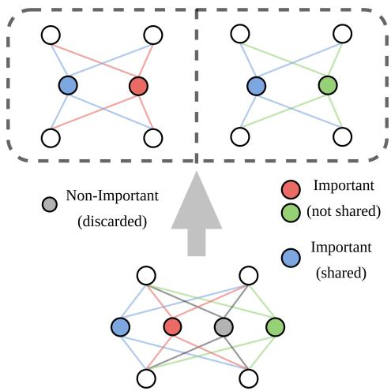
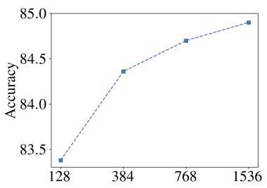
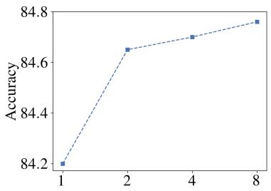
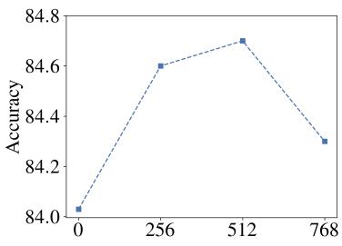
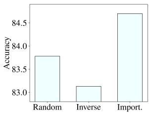
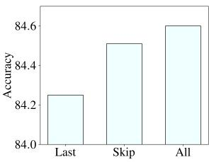
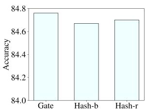
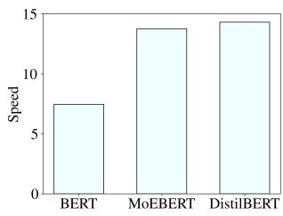

# MoEBERT: from BERT to Mixture-of-Experts via Importance-Guided Adaptation

Simiao Zuo‡∗, Qingru Zhang‡, Chen Liang‡, Pengcheng He⋄,

Tuo Zhao‡ and Weizhu Chen⋄

‡Georgia Institute of Technology ⋄Microsoft

{simiaozuo,qzhang441,cliang73,tourzhao}@gatech.edu {Pengcheng.H,wzchen}@microsoft.com

## Abstract

Pre-trained language models have demonstrated superior performance in various natural language processing tasks. However, these models usually contain hundreds of millions of parameters, which limits their practicality because of latency requirements in real-world applications. Existing methods train small compressed models via knowledge distillation. However, performance of these small models drops significantly compared with the pretrained models due to their reduced model capacity. We propose MoEBERT, which uses a Mixture-of-Experts structure to increase model capacity and inference speed. We initialize MoEBERT by adapting the feed-forward neural networks in a pre-trained model into multi ple experts. As such, representation power of the pre-trained model is largely retained. Dur ing inference, only one of the experts is activated, such that speed can be improved. We also propose a layer-wise distillation method to train MoEBERT. We validate the efficiency and effectiveness of MoEBERT on natural language understanding and question answering tasks. Results show that the proposed method outperforms existing task-specific distillation algorithms. For example, our method outperforms previous approaches by over 2% on the MNLI (mismatched) dataset. Our code is publicly available at https://github.com/ SimiaoZuo/MoEBERT.

## 1 Introduction

Pre-trained language models have demonstrated superior performance in various natural language processing tasks, such as natural language understanding (Devlin et al., 2019; Liu et al., 2019; He et al., 2021b) and natural language generation (Radford et al., 2019; Brown et al., 2020). These models can contain billions of parameters, e.g., T5 (Raffel et al., 2019) contains up to 11 billion parameters, and GPT-3 (Brown et al., 2020) consists of up to

175 billion parameters. Their extreme sizes bring challenges in serving the models to real-world applications due to latency requirements.

Model compression through knowledge distillation (Romero et al., 2015; Hinton et al., 2015) is a promising approach that reduces the computational overhead of pre-trained language models while maintaining their superior performance. In knowledge distillation, a large pre-trained language model serves as a teacher, and a smaller student model is trained to mimic the teacher’s behavior. Distillation approaches can be categorized into two groups: task-agnostic (Sanh et al., 2019; Jiao et al., 2020; Wang et al., 2020, 2021; Sun et al., 2020a) and task-specific (Turc et al., 2019; Sun et al., 2019; Li et al., 2020; Hou et al., 2020; Sun et al., 2020b; Xu et al., 2020). Task-agnostic distillation pre-trains the student and then fine-tunes it on downstream tasks; while task-specific distillation directly fine-tunes the student after initializing it from a pre-trained model. Note that task-agnostic approaches are often combined with task-specific distillation during fine-tuning for better performance (Jiao et al., 2020). We focus on task-specific distillation in this work.

One major drawback of existing knowledge distillation approaches is the drop in model performance caused by the reduced representation power. That is, because the student model has fewer parameters than the teacher, its model capacity is smaller. For example, the student model in Distil-BERT (Sanh et al., 2019) has 66 million parameters, about half the size of the teacher (BERT-base, Devlin et al. 2019). Consequently, performance of DistilBERT drops significantly compared with BERT-base, e.g., over 2% on MNLI (82.2 v.s. 84.5) and over 3% on CoLA (54.7 v.s. 51.3).

We resort to the Mixture-of-Experts (MoE, Shazeer et al. 2017) structure to remedy the representation power issue. MoE models can increase model capacity while keeping the inference computational cost constant. A layer of a MoE model (Shazeer et al., 2017; Lepikhin et al., 2021; Fedus et al., 2021; Yang et al., 2021; Zuo et al., 2021) consists of an attention mechanism and multiple feed-forward neural networks (FFNs) in parallel. Each of the FFNs is called an expert. During training and inference, an input adaptively activates a fixed number of experts (usually one or two). In this way, the computational cost of a MoE model remains constant during inference, regardless of the total number of experts. Such a property facilitates compression without reducing model capacity.

However, MoE models are difficult to train-fromscratch and usually require a significant amount of parameters, e.g., 7.4 billion parameters for Switchbase (Fedus et al., 2021). We propose MoEBERT, which incorporates the MoE structure into pretrained language models for fine-tuning. Our model can speedup inference while retaining the representation power of the pre-trained language model. Specifically, we incorporate the expert structure by adapting the FFNs in a pre-trained model into multiple experts. For example, the hidden dimension of the FFN is 3072 in BERT-base (Devlin et al., 2019), and we adapt it into 4 experts, each has a hidden dimension 768. In this way, the amount of effective parameters (i.e., parameters involved in computing the representation of an input) is cut by half, and we obtain a 2 speedup. We remark that MoEBERT utilizes more parameters of the pretrained model than existing approaches, such that it has greater representation power.

To adapt the FFNs into experts, we propose an importance-based method. Empirically, there are some neurons in the FFNs that contribute more to the model performance than the other ones. That is, removing the important neurons causes significant performance drop. Such a property can be quantified by the importance score (Molchanov et al., 2019; Xiao et al., 2019; Liang et al., 2021). When initializing MoEBERT, we share the most important neurons (i.e., the ones with the highest scores) among the experts, and the other neurons are distributed evenly. This strategy has two advantages: first, the shared neurons preserve performance of the pre-trained model; second, the nonshared neurons promote diversity among experts, which further boost model performance. After initialization, MoEBERT is trained using a layer-wise task-specific distillation algorithm.

We demonstrate efficiency and effectiveness of

MoEBERT on natural language understanding and question answering tasks. On the GLUE (Wang et al., 2019) benchmark, our method significantly outperforms existing distillation algorithms. For example, MoEBERT exceeds performance of stateof-the-art task-specific distillation approaches by over 2% on the MNLI (mismatched) dataset. For question answering, MoEBERT increases F1 by 2.6 on SQuAD v1.1 (Rajpurkar et al., 2016) and 7.0 on SQuAD v2.0 (Rajpurkar et al., 2018) compared with existing algorithms.

The rest of the paper is organized as follows: we introduce background and related works in Section 2; we describe MoEBERT in Section $_ { 3 ; }$ experimental results are provided in Section 4; and Section 5 concludes the paper.

## 2 Background

## 2.1 Backbone: Transformer

The Transformer (Vaswani et al., 2017) backbone has been widely adopted in pre-trained language models. The model contains several identicallyconstructed Transformer layers. Each layer has a multi-head self-attention mechanism and a twolayer feed-forward neural network (FFN).

Suppose the output of the attention mechanism is A. Then, the FFN is defined as:

$$
\mathbf { H } = \sigma ( \mathbf { A } \mathbf { W } _ { 1 } + \mathbf { b } _ { 1 } ) , \ \mathbf { X } ^ { \ell } = \mathbf { W } _ { 2 } \mathbf { H } + \mathbf { b } _ { 2 } ,\tag{1}
$$

where $\mathbf { W } _ { 1 } \in \mathbb { R } ^ { d \times d _ { h } }$ $\mathbf { W } _ { 2 } ~ \in ~ \mathbb { R } ^ { d _ { h } \times d }$ $\mathbf { b } _ { 1 } \in \mathbb { R } ^ { d _ { h } }$ and $\mathbf { b } _ { 2 } \in \mathbb { R } ^ { d }$ are weights of the FFN, and σ is the activation function. Here d denotes the embedding dimension, and $d _ { h }$ denotes the hidden dimension of the FFN.

## 2.2 Mixture-of-Experts Models

Mixture-of-Experts models consist of multiple expert layers, which are similar to the Transformer layers. Each of these layers contain a self-attention mechanism and multiple FFNs (Eq. 1) in parallel, where each FFN is called an expert.

Let $\{ E _ { i } \} _ { i = 1 } ^ { N }$ denote the experts, and N denotes the total number of experts. Similar to Eq. 1, the experts in layer ℓ take the attention output A as the input. For each $\mathbf { a } _ { t }$ (the t-th row of A) that corresponds to an input token, the corresponding output $\mathbf { x } _ { t } ^ { \ell }$ of layer ℓ is

$$
\mathbf { x } _ { t } ^ { \ell } = \sum _ { i \in \mathcal { T } } p _ { i } ( \mathbf { a } _ { t } ) E _ { i } ( \mathbf { a } _ { t } ) .\tag{2}
$$

Here, $\mathcal { T } \subset \{ 1 \cdots N \}$ is the activated set of experts with $| \mathcal { T } | = K$ , and $p _ { i }$ is the weight of expert $E _ { i }$ .

Different approaches have been proposed to construct $\tau$ and compute $p _ { i }$ . For example, Shazeer et al. (2017) take

$$
p _ { i } ( \mathbf { a } _ { t } ) = [ \mathrm { s o f t m a x } \left( \mathbf { a } _ { t } \mathbf { W } _ { g } \right) ] _ { i } ,\tag{3}
$$

where $\mathbf { W } _ { g }$ is a weight matrix. Consequently, is constructed as the experts that yield top-K largest $p _ { i } .$ . However, such an approach suffers from load imbalance, i.e., $\mathbf { W } _ { g }$ collapses such that nearly all the inputs are routed to the same expert. Existing works adopt various ad-hoc heuristics to mitigate this issue, e.g., adding Gaussian noise to Eq. 3 (Shazeer et al., 2017), limiting the maximum number of inputs that can be routed to an expert (Lepikhin et al., 2021), imposing a load balancing loss (Lepikhin et al., 2021; Fedus et al., 2021), and using linear assignment (Lewis et al., 2021). In contrast, Roller et al. 2021 completely remove the gate and pre-assign tokens to experts using hash functions, in which case we can take $p _ { i } = 1 / K$

In Eq. 2, a token only activates K instead of N experts, and usually $K \ll N$ , e.g., K = 2 and $N = 2 0 4 8$ in GShard (Lepikhin et al., 2021). As such, the number of FLOPs for one forward pass does not scale with the number of experts. Such a property paves the way for increasing inference speed of a pre-trained model without decreasing the model capacity, i.e., we can adapt the FFNs in a pretrained model into several smaller components, and only activate one of the components for a specific input token.

## 2.3 Pre-trained Language Models

Pre-trained language models (Peters et al., 2018; Devlin et al., 2019; Raffel et al., 2019; Liu et al., 2019; Brown et al., 2020; He et al., 2021b,a) have demonstrated superior performance in various natural language processing tasks. These models are trained on an enormous amount of unlabeled data, such that they contain rich semantic information that benefits downstream tasks. Fine-tuning pretrained language models achieves state-of-the-art performance in tasks such that natural language understanding (He et al., 2021a) and natural language generation (Brown et al., 2020).

## 2.4 Knowledge Distillation

Knowledge distillation (Romero et al., 2015; Hinton et al., 2015) compensates for the performance drop caused by model compression. In knowledge distillation, a small student model mimics the behavior of a large teacher model. For example, DistilBERT (Sanh et al., 2019) uses the teacher’s soft prediction probability to train the student model; TinyBERT (Jiao et al., 2020) aligns the student’s layer outputs (including attention outputs and hidden states) with the teacher’s; MiniLM (Wang et al., 2020, 2021) utilizes self-attention distillation; and CoDIR (Sun et al., 2020a) proposes to use a contrastive objective such that the student can distinguish positive samples from negative ones according to the teacher’s outputs.

There are also heated discussions on the number of layers to distill. For example, Wang et al. (2020, 2021) distill the attention outputs of the last layer; Sun et al. (2019) choose specific layers to distill; and Jiao et al. (2020) use different weights for different transformer layers.

There are two variants of knowledge distillation: task-agnostic (Sanh et al., 2019; Jiao et al., 2020; Wang et al., 2020, 2021; Sun et al., 2020a) and task-specific (Turc et al., 2019; Sun et al., 2019; Li et al., 2020; Hou et al., 2020; Sun et al., 2020b; Xu et al., 2020). The former requires pre-training a small model using knowledge distillation and then fine-tuning on downstream tasks, while the latter directly fine-tunes the small model. Note that taskagnostic approaches are often combined with taskspecific distillation for better performance, e.g., TinyBERT (Jiao et al., 2020). In this work, we focus on task-specific distillation.

## 3 Method

In this section, we first present an algorithm that adapts a pre-trained language model into a MoE model. Such a structure enables inference speedup by reducing the number of parameters involved in computing an input token’s representation. Then, we introduce a layer-wise task-specific distillation method that compensates for the performance drop caused by model compression.

## 3.1 Importance-Guided Adaptation of Pre-trained Language Models

Adapting the FFNs in a pre-trained language model into multiple experts facilitates inference speedup while retaining model capacity. This is because in a MoE model, only a subset of parameters are used to compute the representation of a given token (Eq. 2). These activated parameters are referred to as effective parameters. For example, by adapting the FFNs in a pre-trained BERT-base (Devlin et al., 2019) (with hidden dimension 3072) model into 4 experts (each has hidden dimension 768), the number of effective parameters reduces by half, such that we obtain $\mathbf { a } \times 2$ speedup.

  
Figure 1: Adapting a two-layer FFN into two experts. The blue neuron is the most important one, and is shared between the two experts. The red and green neurons are the second and third important ones, and are assigned to expert one and two, respectively.

Empirically, we find that randomly converting a FFN into experts works poorly (see Figure 3a in the experiments). This is because there are some columns in $\mathbf { W } _ { 1 } \in \mathbb { R } ^ { d \times d _ { h } }$ (correspondingly some rows in $\mathbf { W } _ { 2 }$ in Eq. 1) contribute more than the others to model performance.

The importance score (Molchanov et al., 2019; Xiao et al., 2019; Liang et al., 2021), originally introduced in model pruning literature, measures such parameter importance. For a dataset  with sample pairs $\{ ( x , y ) \}$ , the score is defined as

$$
\begin{array} { r l } & { I _ { j } = \displaystyle \sum _ { ( x , y ) \in \mathcal { D } } \bigg | ( \mathbf { w } _ { j } ^ { 1 } ) ^ { \top } \nabla _ { \mathbf { w } _ { j } ^ { 1 } } \mathcal { L } ( x , y ) } \\ & { \qquad + ( \mathbf { w } _ { j } ^ { 2 } ) ^ { \top } \nabla _ { \mathbf { w } _ { j } ^ { 2 } } \mathcal { L } ( x , y ) \bigg | . } \end{array}\tag{4}
$$

Here $\mathbf { w } _ { j } ^ { 1 } \in \mathbb { R } ^ { d }$ is the j-th column of $\mathbf { W } _ { 1 } , \mathbf { w } _ { j } ^ { 2 }$ is the $j \mathrm { - t h }$ row of $\mathbf { W } _ { 2 }$ , and $ { \mathcal Ḋ L Ḍ } ( x , y )$ is the loss.

The importance score in Eq. 4 indicates variation of the loss if we remove the neuron. That is,

$$
\begin{array} { r } { | \mathcal { L } _ { \mathbf { w } } - \mathcal { L } _ { \mathbf { w } = \mathbf { 0 } } | \approx \Big | ( \mathbf { w } - \mathbf { 0 } ) ^ { \top } \nabla _ { \mathbf { w } } \mathcal { L } _ { \mathbf { w } } \Big | } \\ { = | \mathbf { w } ^ { \top } \nabla _ { \mathbf { w } } \mathcal { L } _ { \mathbf { w } } | , ~ } \end{array}
$$

where ${ \mathcal { L } } _ { \mathbf { w } }$ is the loss with neuron1 w and ${ \mathcal { L } } _ { \mathbf { w } = \mathbf { 0 } }$ is the loss without neuron w. Here the approximation is based on the first order Taylor expansion of ${ \mathcal { L } } _ { \mathbf { w } }$ around ${ \bf w = 0 }$

After computing $I _ { j }$ for all the columns, we adapt $\mathbf { W } _ { 1 }$ into experts.2 The columns are sorted in ascending order according to their importance scores as $\mathbf { w } _ { ( 1 ) } ^ { 1 } \cdots \mathbf { w } _ { ( d _ { h } ) } ^ { 1 }$ , where $\mathbf { w } _ { ( 1 ) } ^ { 1 }$ has the largest $I _ { j }$ and $\mathbf { w } _ { ( d _ { h } ) } ^ { 1 }$ the smallest. Empirically, we find that sharing the most important columns benefits model performance. Based on this finding, suppose we share the top-s columns and we adapt the FFN into N experts, then expert e contains columns $\{ \mathbf { w } _ { ( 1 ) } ^ { 1 } , \cdot \cdot \cdot , \mathbf { w } _ { ( s ) } ^ { 1 } , \mathbf { w } _ { ( s + e ) } ^ { 1 } , \mathbf { w } _ { ( s + e + N ) } ^ { 1 } , \cdot \cdot \cdot \}$ Note that we discard the least important columns to keep the size of each expert as $\lfloor d / N \rfloor$ . Figure 1 is an illustration of adapting a FFN with 4 neurons in a pre-trained model into two experts.

## 3.2 Layer-wise Distillation

To remedy the performance drop caused by adapting a pre-trained model to a MoE model, we adopt a layer-wise task-specific distillation algorithm. We use BERT-base (Devlin et al., 2019) as both the student (i.e., the MoE model) and the teacher. We distill both the Transformer layer output $\mathbf { X } ^ { \ell } \left( \mathrm { E q } . 2 \right)$ and the final prediction probability.

For the Transformer layers, the distillation loss is the mean squared error between the teacher’s layer output $\mathbf { X } _ { \mathrm { t e a } } ^ { \ell }$ and the student’s layer output $\mathbf { X } ^ { \ell }$ obtained from Eq. 2.3 Concretely, for an input x, the Transformer layer distillation loss is

$$
\mathcal { L } _ { \mathrm { t r m } } ( x ) = \sum _ { \ell = 0 } ^ { L } \mathrm { M S E } ( \mathbf { X } ^ { \ell } , \mathbf { X } _ { \mathrm { t e a } } ^ { \ell } ) ,\tag{5}
$$

where $L$ is the total number of layers. Notice that we include the MSE loss of the embedding layer outputs $\mathbf { X } ^ { 0 }$ and ${ \bf X } _ { \mathrm { t e a } } ^ { 0 }$

Let f denotes the MoE model and $f _ { \mathrm { t e a } }$ the teacher model. We obtain the prediction probability for an input x as $p = f ( x )$ and $p _ { \mathrm { t e a } } = f _ { \mathrm { t e a } } ( x )$ where $p$ is the prediction of the MoE model and $p _ { \mathrm { t e a } }$ is the prediction of the teacher model. Then the distillation loss for the prediction layer is

$$
\mathcal { L } _ { \mathrm { p r e d } } ( x ) = \frac { 1 } { 2 } \left( \mathrm { K L } ( p | | p _ { \mathrm { t e a } } ) + \mathrm { K L } ( p _ { \mathrm { t e a } } | | p ) \right) ,\tag{6}
$$

where KL is the Kullback–Leibler divergence.

The layer-wise distillation loss is the sum of Eq. 5 and Eq. 6, defined as

$$
\mathcal { L } _ { \mathrm { d i s t i l l } } ( x ) = \mathcal { L } _ { \mathrm { t r m } } ( x ) + \mathcal { L } _ { \mathrm { p r e d } } ( x ) .\tag{7}
$$

We will discuss variants of $\operatorname { E q . 7 }$ in the experiments.

## 3.3 Model Training

We employ the random hashing strategy (Roller et al., 2021) to train the experts. That is, each token is pre-assigned to a random expert, and this assignment remains the same during training and inference. We will discuss more about other routing strategies of the MoE model in the experiments.

Given the training dataset $\mathcal { D }$ and samples $\{ ( x , y ) \}$ , the training objective is

$$
\mathcal { L } = \sum _ { ( x , y ) \in \mathcal { D } } \mathrm { C E } ( f ( x ) , y ) + \lambda _ { \mathrm { d i s t i l l } } \mathcal { L } _ { \mathrm { d i s t i l l } } ( x ) ,
$$

where CE is the cross-entropy loss and $\lambda _ { \mathrm { d i s t i l l } }$ is a hyper-parameter.

## 4 Experiments

In this section, we evaluate the effectiveness and efficiency of the proposed algorithm on natural language understanding and question answering tasks. We implement our algorithm using the Huggingface Transformers4 (Wolf et al., 2019) code-base. All the experiments are conducted on NVIDIA V100 GPUs.

## 4.1 Datasets

GLUE. We evaluate performance of the proposed method on the General Language Understanding Evaluation (GLUE) benchmark (Wang et al., 2019), which is a collection of nine natural language understanding tasks. The benchmark includes two single-sentence classification tasks: SST-2 (Socher et al., 2013) is a binary classification task that classifies movie reviews to positive or negative, and CoLA (Warstadt et al., 2019) is a linguistic acceptability task. GLUE also contains three similarity and paraphrase tasks: MRPC (Dolan and Brockett, 2005) is a paraphrase detection task; STS-B (Cer et al., 2017) is a text similarity task; and QQP is a duplication detection task. There are also four natural language inference tasks in GLUE: MNLI (Williams et al., 2018); QNLI (Rajpurkar et al., 2016); RTE (Dagan et al., 2006; Bar-Haim et al., 2006; Giampiccolo et al., 2007; Bentivogli et al., 2009); and WNLI (Levesque et al., 2012). Following previous works on model distillation, we exclude STS-B and WNLI in the experiments. Dataset details are summarized in Appendix A.

Question Answering. We evaluate the proposed algorithm on two question answering datasets:

SQuAD v1.1 (Rajpurkar et al., 2016) and SQuAD v2.0 (Rajpurkar et al., 2018). These tasks are treated as a sequence labeling problem, where we predict the probability of each token being the start and end of the answer span. Dataset details can be found in Appendix A.

## 4.2 Baselines

We compare our method with both task-agnostic and task-specific distillation methods.

In task-agnostic distillation, we pre-train a small language model through knowledge distillation, and then fine-tune on downstream tasks. The finetuning procedure also incorporates task-specific distillation for better performance.

DistilBERT (Sanh et al., 2019) pre-trains a small language model by distilling the temperaturecontrolled soft prediction probability.

TinyBERT (Jiao et al., 2020) is a task-agnostic distillation method that adopts layer-wise distillation.

MiniLMv1 (Wang et al., 2020) and MiniLMv2 (Wang et al., 2021) pre-train a small language model by aligning the attention distribution between the teacher model and the student model.

CoDIR (Contrastive Distillation, Sun et al. 2020a) proposes a framework that distills knowledge through intermediate Transformer layers of the teacher via a contrastive objective.

In task-specific distillation, a pre-trained language model is directly compressed and fine-tuned.

PKD (Patient Knowledge Distillation, Sun et al. 2019) proposes a method where the student patiently learns from multiple intermediate Transformer layers of the teacher.

BERT-of-Theseus (Xu et al., 2020) proposes a progressive module replacing method for knowledge distillation.

## 4.3 Implementation Details

In the experiments, we use BERT-base (Devlin et al., 2019) as both the student model and the teacher model. That is, we first transform the pretrained model into a MoE model, and then apply layer-wise task-specific knowledge distillation. We set the number of experts in the MoE model to 4, and the hidden dimension of each expert is set to 768, a quarter of the hidden dimension of BERTbase. The other configurations remain unchanged. We share the top-512 important neurons among the experts (see Section 3.1). The number of effective parameters of the MoE model is 66M (v.s. 110M for BERT-base), which is the same as the baseline models. We use the random hashing strategy (Roller et al., 2021) to train the MoE model, we will discuss more later. Detailed training and hyperparameter settings can be found in Appendix B.

<table><tr><td></td><td>RTE Acc</td><td>CoLA Mcc</td><td>MRPC F1/Acc</td><td>SST-2 Acc</td><td>QNLI Acc</td><td>QQP F1/Acc</td><td>MNLI m/mm</td></tr><tr><td>BERT-base</td><td>63.5</td><td>54.7</td><td>89.0/84.1</td><td>92.9</td><td>91.1</td><td>88.3/90.9</td><td>84.5/84.4</td></tr><tr><td colspan="8">Task-agnostic</td></tr><tr><td>DistilBERT</td><td>59.9</td><td>51.3</td><td>87.5/-</td><td>92.7</td><td>89.2</td><td>-/88.5</td><td>82.2/-</td></tr><tr><td>TinyBERT (w/o aug)</td><td>72.2</td><td>42.8</td><td>88.4/-</td><td>91.6</td><td>90.5</td><td>-/90.6</td><td>83.5/-</td></tr><tr><td>MiniLMv1</td><td>71.5</td><td>49.2</td><td>88.4/-</td><td>92.0</td><td>91.0</td><td>-/91.0</td><td>84.0/-</td></tr><tr><td>MiniLMv2</td><td>72.1</td><td>52.5</td><td>88.9/-</td><td>92.4</td><td>90.8</td><td>-/91.1</td><td>84.2/-</td></tr><tr><td>CoDIR (pre+fine)</td><td>67.1</td><td>53.7</td><td>89.6/-</td><td>93.6</td><td>90.1</td><td>-/89.1</td><td>83.5/82.7</td></tr><tr><td colspan="8">Task-specific</td></tr><tr><td>PKD</td><td>65.5</td><td>24.8</td><td>86.4/-</td><td>92.0</td><td>89.0</td><td>-/88.9</td><td>81.5/81.0</td></tr><tr><td>BERT-of-Theseus</td><td>68.2</td><td>51.1</td><td>89.0/-</td><td>91.5</td><td>89.5</td><td>-/89.6</td><td>82.3/-</td></tr><tr><td>CoDIR (fine)</td><td>65.6</td><td>53.6</td><td>89.4/-</td><td>93.6</td><td>90.4</td><td>-/89.1</td><td>83.6/82.8</td></tr><tr><td colspan="8">Ours (task-specific)</td></tr><tr><td>MoEBERT</td><td>74.0</td><td>55.4</td><td>92.6/89.5</td><td>93.0</td><td>91.3</td><td>88.4/91.4</td><td>84.5/84.8</td></tr></table>

Table 1: Experimental results on the GLUE development set. The best results are shown in bold. All the models are trained without data augmentation. All the models have 66M parameters, except BERT-base (110M parameters). We report mean over three runs. Model references: BERT (Devlin et al., 2019), DistilBERT (Sanh et al., 2019), TinyBERT (Jiao et al., 2020), MiniLMv1 (Wang et al., 2020), MiniLMv2 (Wang et al., 2021), CoDIR (Sun et al., 2020a), PKD (Sun et al., 2019), BERT-of-Theseus (Xu et al., 2020).

## 4.4 Main Results

Table 1 summarizes experimental results on the GLUE benchmark. Notice that our method outperforms all of the baseline methods in 6/7 tasks. In general task-agnostic distillation behaves better than task-specific algorithms because of the pretraining stage. For example, the best-performing task-specific method (BERT-of-Theseus) has a 68.2 accuracy on the RTE dataset, whereas accuracy of MiniLMv2 and TinyBERT are greater than 72. Using the proposed method, MoEBERT obtains a 74.0 accuracy on RTE without any pre-training, indicating the effectiveness of the MoE architecture. We remark that MoEBERT behaves on par or better than the vanilla BERT-base model in all of the tasks. This shows that there exists redundancy in pre-trained language models, which paves the way for model compression.

Table 2 summarizes experimental results on two question answering datasets: SQuAD v1.1 and SQuAD v2.0. Notice that MoEBERT significantly outperforms all of the baseline methods in terms of both evaluation metrics: exact match (EM) and F1. Similar to the findings in Table 1, taskagnostic distillation methods generally behave better than task-specific ones. For example, PKD has a 69.8 F1 score on SQuAD 2.0, while performance of MiniLMv1 and MiniLMv2 is over 76. Using the proposed MoE architecture, performance of our method exceeds both task-specific and task-agnostic distillation, e.g., the F1 score of MoEBERT on SQuAD 2.0 is 76.8, which is 7.0 higher than PKD (task-specific) and 0.4 higher than MiniLMv2 (task-agnostic).

## 4.5 Ablation Study

Expert dimension. We examine the affect of expert dimension, and experimental results are illustrated in Figure 2a. As we increase the dimension of the experts, model performance improves. This is because of the increased model capacity due to a larger number of effective parameters.

Number of experts. Figure 2b summarizes experimental results when we modify the number of experts. As we increase the number of experts, model performance improves because we effectively enlarge model capacity. We remark that having only one expert is equivalent to compressing the model without incorporating MoE. In this case performance is unsatisfactory because of the limited representation power of the model.

<table><tr><td></td><td>SQuAD v1.1 EM</td><td>F1</td><td>SQuAD v2.0 EM</td><td>F1</td></tr><tr><td>BERT-base (Devlin et al., 2019)</td><td>80.7</td><td>88.4</td><td>74.5</td><td>77.7</td></tr><tr><td colspan="5">Task-agnostic</td></tr><tr><td>DistilBERT (Sanh et al., 2019) TinyBERT (w/o aug) (Jiao et al., 2020)</td><td>78.1</td><td>86.2</td><td>66.0</td><td>69.5 73.1</td></tr><tr><td>MiniLMv1 (Wang et al., 2020) MiniLMv2 (Wang et al., 2021)</td><td></td><td></td><td></td><td>76.4 76.3</td></tr><tr><td>Task-specific</td><td></td><td></td><td></td><td></td></tr><tr><td>PKD (Sun et al., 2019)</td><td>77.1</td><td>85.3</td><td>66.3</td><td>69.8</td></tr><tr><td>Ours (task-specific) MoEBERT</td><td>80.4</td><td>87.9</td><td>73.6</td><td>76.8</td></tr></table>

Table 2: Experimental results on SQuAD v1.1 and SQuAD v2.0. The best results are shown in bold. All the models are trained without data augmentation. All the models have 66M parameters, except BERT-base (109M parameters). Here EM means exact match.

  
(a) Expert dimension.

  
(b) Number of experts.

  
(c) Shared dimension.

Figure 2: Ablation study on MNLI. We report the average accuracy of MNLI-m and MNLI-mm. As default settings, we have expert dimension 768, number of experts 4, and shared dimension 512.
<table><tr><td></td><td>RTE Acc</td><td>MNLI m/mm</td><td>SQuAD v2.0 EM/F1</td></tr><tr><td>MoEBERT</td><td>74.0</td><td>84.5/84.8</td><td>73.6/76.8</td></tr><tr><td>-distill</td><td>73.3</td><td>83.2/84.0</td><td>72.5/76.0</td></tr></table>

Table 3: Effectiveness of layer-wise distillation.

Shared dimension. Recall that we share important neurons among the experts when adapting the FFNs. In Figure 2c we examine the effect of varying the number of shared neurons. Notice that sharing no neurons yields the worst performance, indicating the effectiveness of the sharing strategy. Also notice that performance of sharing all the neurons is also unsatisfactory. We attribute this to the lack of diversity among the experts.

## 4.6 Analysis

Effectiveness of distillation. After adapting the FFNs in the pre-trained BERT-base model into experts, we train MoEBERT using layer-wise knowledge distillation. In Table 3, we examine the effectiveness of the proposed distillation method. We show experimental results on RTE, MNLI and SQuAD v2.0, where we remove the distillation and directly fine-tune the adapted model. Results show that by removing the distillation module, model performance significantly drops, e.g., accuracy decreases by 0.7 on RTE and the exact match score decreases by 1.1 on SQuAD v2.0.

Effectiveness of importance-based adaptation. Recall that we adapt the FFNs in BERT-base into experts according to the neurons’ importance scores (Eq. 4). We examine the method’s effectiveness by experimenting on two different strategies: randomly split the FFNs into experts (denoted Random), and adapt (and share) the FFNs according to the inverse importance, i.e., we share the neurons with the smallest scores (denoted Inverse). Figure 3a illustrated the results. Notice that performance significantly drops when we apply random splitting compared with Import (the method we use). Moreover, performance of Inverse is even worse than random splitting, which further demonstrates the effectiveness of the importance metric.

  
(a) Adaptation methods.

  
(b) Distillation methods.

  
(c) Routing methods in MoE.

  
Figure 4: Inference speed (examples/second, CPU) on the SST-2 dataset.  
Figure 3: Experimental results of model variants on MNLI (average of m and mm). Our methods are denoted Import, All and Hash-r in the subfigures, respectively.

Different distillation methods. MoEBERT is trained using a layer-wise distillation method (Eq. 7), where we add a distillation loss to every intermediate layer (denoted All). We examine two variants: (1) we only distill the hidden states of the last layer (denoted Last); (2) we distill the hidden states of every other layer (denoted Skip). Figure 3b shows experimental results. We see that only distilling the last layer yields unsatisfactory performance; while the Skip method obtains similar results compared with All (the method we use).

Different routing methods. By default, we use a random hashing strategy (denoted Hash-r) to route input tokens to experts (Roller et al., 2021). That is, each token in the vocabulary is pre-assigned to a random expert, and this assignment remains the same during training and inference. We examine other routing strategies:

1. We employ sentence-based routing with a trainable gate as in Eq. 3 (denoted Gate). Note that in this case, token representations in a sentence are averaged to compute the sentence representation, which is then fed to the gating mechanism for routing. Such a sentence-level routing strategy can significantly reduce communication overhead in MoE models. Therefore, it is advantageous for inference compared with other routing methods.

2. We use a balanced hash list (Roller et al.,   
2021), i.e., tokens are pre-assigned to experts

<table><tr><td></td><td>RTE Acc</td><td>Acc</td><td>MNLI-m MNLI-mm Acc</td></tr><tr><td> $\mathbf { B E R T _ { l a r g e } }$ </td><td>71.1</td><td>86.3</td><td>86.2</td></tr><tr><td> $\mathbf { M o E B E R T _ { l a r g e } }$ </td><td>72.2</td><td>86.3</td><td>86.5</td></tr></table>

Table 4: Distilling BERT-large on RTE and MNLI.

according to frequency, such that each expert receives approximately the same amount of inputs (denoted Hash-b).

From Figure 3c, we see that all the methods yield similar performance. Therefore, MoEBERT is robust to routing strategies.

Inference speed. We examine inference speed of BERT, DistilBERT and MoEBERT on the SST-2 dataset, and Figure 4 illustrates the results. Note that for MoEBERT , we use the sentence-based gating mechanism as in Figure 3c. All the methods are evaluated on the same CPU, and we set the maximum sequence length to 128 and the batch size to 1. We see that the speed of MoEBERT is slightly slower than DistilBERT, but significantly faster than BERT. Such a speed difference is because of two reasons. First, the gating mechanism in MoEBERT causes additional inference latency. Second, DistilBERT develops a shallower model, i.e., it only has 6 layers instead of 12 layers; whereas MoEBERT is a narrower model, i.e., the hidden dimension is 768 instead of 3072.

Compressing larger models. Task-specific distillation methods do not require pre-training. Therefore, these methods can be easily applied to other model architectures and sizes beyond BERT-base. We compress the BERT-large model. Specifically, we adapt the FFNs in BERT-large (with hidden dimension 4096) into four experts, such that each expert has hidden dimension 1024. We share the top-512 neurons among experts according to the importance score. After compression, the number of effective parameters is reduces by half. Table 4 demonstrates experimental results on RTE and MNLI. We see that similar to the findings in Table 1, MoEBERT behaves on par or better than BERT-large in all of the experiments.

## 5 Conclusion

We present MoEBERT, which uses a Mixture-of-Experts structure to distill pre-trained language models. Our proposed method can speedup inference by adapting the feed-forward neural networks (FFNs) in a pre-trained language model into multiple experts. Moreover, the proposed method largely retains model capacity of the pre-trained model. This is in contrast to existing approaches, where the representation power of the compressed model is limited, resulting in unsatisfactory performance. To adapt the FFNs into experts, we adopt an importance-based method, which identifies and shares the most important neurons in a FFN among the experts. We further propose a layer-wise taskspecific distillation algorithm to train MoEBERT . We conduct systematic experiments on natural language understanding and question answering tasks. Results show that the proposed method outperforms existing distillation approaches.

## Ethical Statement

This paper proposes MoEBERT, which uses a Mixture-of-Experts structure to increase model capacity and inference speed. We demonstrate that MoEBERT can be used for model compression. Experiments are conducted by fine-tuning pre-trained language models on natural language understanding and question answering tasks. In all the experiments, we use publicly available data and models, and we build our algorithms using public code bases. We do not find any ethical concerns.

## References

Roy Bar-Haim, Ido Dagan, Bill Dolan, Lisa Ferro, and Danilo Giampiccolo. 2006. The second PASCAL recognising textual entailment challenge. In Proceedings ofthe Second PASCAL Challenges Workshop on Recognising Textual Entailment.

Luisa Bentivogli, Ido Dagan, Hoa Trang Dang, Danilo Giampiccolo, and Bernardo Magnini. 2009. The fifth pascal recognizing textual entailment challenge. In In Proc Text Analysis Conference (TAC’09.

Tom B. Brown, Benjamin Mann, Nick Ryder, Melanie Subbiah, Jared Kaplan, Prafulla Dhariwal, Arvind Neelakantan, Pranav Shyam, Girish Sastry, Amanda Askell, Sandhini Agarwal, Ariel Herbert-Voss, Gretchen Krueger, Tom Henighan, Rewon Child, Aditya Ramesh, Daniel M. Ziegler, Jeffrey Wu, Clemens Winter, Christopher Hesse, Mark Chen, Eric Sigler, Mateusz Litwin, Scott Gray, Benjamin Chess, Jack Clark, Christopher Berner, Sam McCandlish, Alec Radford, Ilya Sutskever, and Dario Amodei. 2020. Language models are few-shot learners. In Advances in Neural Information Processing Systems 33: Annual Conference on Neural Information Processing Systems 2020, NeurIPS 2020, December 6-12, 2020, virtual.

Daniel Cer, Mona Diab, Eneko Agirre, Iñigo Lopez-Gazpio, and Lucia Specia. 2017. SemEval-2017 task 1: Semantic textual similarity multilingual and crosslingual focused evaluation. In Proceedings of the 11th International Workshop on Semantic Evaluation (SemEval-2017), pages 1–14, Vancouver, Canada. Association for Computational Linguistics.

Ido Dagan, Oren Glickman, and Bernardo Magnini. 2006. The pascal recognising textual entailment challenge. In Proceedings of the First International Conference on Machine Learning Challenges: Evaluating Predictive Uncertainty Visual Object Classification, and Recognizing Textual Entailment, MLCW’05, pages 177–190, Berlin, Heidelberg. Springer-Verlag.

Jacob Devlin, Ming-Wei Chang, Kenton Lee, and Kristina Toutanova. 2019. BERT: Pre-training of deep bidirectional transformers for language understanding. In Proceedings ofthe 2019 Conference of the North American Chapter ofthe Associationfor Computational Linguistics: Human Language Technologies, Volume 1 (Long and Short Papers), pages 4171–4186, Minneapolis, Minnesota. Association for Computational Linguistics.

William B. Dolan and Chris Brockett. 2005. Automatically constructing a corpus of sentential paraphrases. In Proceedings ofthe Third International Workshop on Paraphrasing (IWP2005).

William Fedus, Barret Zoph, and Noam Shazeer. 2021. Switch transformers: Scaling to trillion parameter models with simple and efficient sparsity. ArXiv preprint, abs/2101.03961.

Danilo Giampiccolo, Bernardo Magnini, Ido Dagan, and Bill Dolan. 2007. The third PASCAL recognizing textual entailment challenge. In Proceedings ofthe ACL-PASCAL Workshop on Textual Entailment and Paraphrasing, pages 1–9, Prague. Association for Computational Linguistics.

Pengcheng He, Jianfeng Gao, and Weizhu Chen. 2021a. Debertav3: Improving deberta using electra-style pretraining with gradient-disentangled embedding sharing. ArXiv preprint, abs/2111.09543.

Pengcheng He, Xiaodong Liu, Jianfeng Gao, and Weizhu Chen. 2021b. Deberta: decoding-enhanced bert with disentangled attention. In 9th International Conference on Learning Representations, ICLR 2021, Virtual Event, Austria, May 3-7, 2021. OpenReview.net.

Geoffrey Hinton, Oriol Vinyals, and Jeff Dean. 2015. Distilling the knowledge in a neural network. ArXiv preprint, abs/1503.02531.

Lu Hou, Zhiqi Huang, Lifeng Shang, Xin Jiang, Xiao Chen, and Qun Liu. 2020. Dynabert: Dynamic BERT with adaptive width and depth. In Advances in Neural Information Processing Systems 33: Annual Conference on Neural Information Processing Systems 2020, NeurIPS 2020, December 6-12, 2020, virtual.

Xiaoqi Jiao, Yichun Yin, Lifeng Shang, Xin Jiang, Xiao Chen, Linlin Li, Fang Wang, and Qun Liu. 2020. TinyBERT: Distilling BERT for natural language understanding. In Findings ofthe Associationfor Computational Linguistics: EMNLP 2020, pages 4163– 4174, Online. Association for Computational Linguistics.

Diederik P. Kingma and Jimmy Ba. 2015. Adam: A method for stochastic optimization. In 3rd International Conference on Learning Representations, ICLR 2015, San Diego, CA, USA, May 7-9, 2015, Conference Track Proceedings.

Dmitry Lepikhin, HyoukJoong Lee, Yuanzhong Xu, Dehao Chen, Orhan Firat, Yanping Huang, Maxim Krikun, Noam Shazeer, and Zhifeng Chen. 2021. Gshard: Scaling giant models with conditional computation and automatic sharding. In 9th International Conference on Learning Representations, ICLR 2021, Virtual Event, Austria, May 3-7, 2021. OpenReview.net.

Hector Levesque, Ernest Davis, and Leora Morgenstern. 2012. The winograd schema challenge. In Thirteenth International Conference on the Principles of Knowledge Representation and Reasoning.

Mike Lewis, Shruti Bhosale, Tim Dettmers, Naman Goyal, and Luke Zettlemoyer. 2021. BASE layers: Simplifying training of large, sparse models. In Proceedings of the 38th International Conference on Machine Learning, ICML 2021, 18-24 July 2021, Virtual Event, volume 139 of Proceedings ofMachine Learning Research, pages 6265–6274. PMLR.

Jianquan Li, Xiaokang Liu, Honghong Zhao, Ruifeng Xu, Min Yang, and Yaohong Jin. 2020. BERT-EMD: Many-to-many layer mapping for BERT compression with earth mover’s distance. In Proceedings of the 2020 Conference on Empirical Methods in Natural Language Processing (EMNLP), pages 3009–3018, Online. Association for Computational Linguistics.

Chen Liang, Simiao Zuo, Minshuo Chen, Haoming Jiang, Xiaodong Liu, Pengcheng He, Tuo Zhao, and Weizhu Chen. 2021. Super tickets in pre-trained

language models: From model compression to improving generalization. In Proceedings of the 59th Annual Meeting ofthe Associationfor Computational Linguistics and the 11th International Joint Conference on Natural Language Processing (Volume 1: Long Papers), pages 6524–6538, Online. Association for Computational Linguistics.

Yinhan Liu, Myle Ott, Naman Goyal, Jingfei Du, Mandar Joshi, Danqi Chen, Omer Levy, Mike Lewis, Luke Zettlemoyer, and Veselin Stoyanov. 2019. Roberta: A robustly optimized bert pretraining approach. ArXiv preprint, abs/1907.11692.

Pavlo Molchanov, Arun Mallya, Stephen Tyree, Iuri Frosio, and Jan Kautz. 2019. Importance estimation for neural network pruning. In IEEE Conference on Computer Vision and Pattern Recognition, CVPR 2019, Long Beach, CA, USA, June 16-20, 2019, pages 11264–11272. Computer Vision Foundation / IEEE.

Matthew E. Peters, Mark Neumann, Mohit Iyyer, Matt Gardner, Christopher Clark, Kenton Lee, and Luke Zettlemoyer. 2018. Deep contextualized word representations. In Proceedings ofthe 2018 Conference of the North American Chapter ofthe Associationfor Computational Linguistics: Human Language Technologies, Volume 1 (Long Papers), pages 2227–2237, New Orleans, Louisiana. Association for Computational Linguistics.

Alec Radford, Jeffrey Wu, Rewon Child, David Luan, Dario Amodei, and Ilya Sutskever. 2019. Language models are unsupervised multitask learners. OpenAI blog, 1(8):9.

Colin Raffel, Noam Shazeer, Adam Roberts, Katherine Lee, Sharan Narang, Michael Matena, Yanqi Zhou, Wei Li, and Peter J Liu. 2019. Exploring the limits of transfer learning with a unified text-to-text transformer. ArXiv preprint, abs/1910.10683.

Pranav Rajpurkar, Robin Jia, and Percy Liang. 2018. Know what you don’t know: Unanswerable questions for SQuAD. In Proceedings ofthe 56th Annual Meeting of the Association for Computational Linguistics (Volume 2: Short Papers), pages 784–789, Melbourne, Australia. Association for Computational Linguistics.

Pranav Rajpurkar, Jian Zhang, Konstantin Lopyrev, and Percy Liang. 2016. SQuAD: 100,000+ questions for machine comprehension of text. In Proceedings of the 2016 Conference on Empirical Methods in Natural Language Processing, pages 2383–2392, Austin, Texas. Association for Computational Linguistics.

Stephen Roller, Sainbayar Sukhbaatar, Arthur Szlam, and Jason Weston. 2021. Hash layers for large sparse models. ArXiv preprint, abs/2106.04426.

Adriana Romero, Nicolas Ballas, Samira Ebrahimi Kahou, Antoine Chassang, Carlo Gatta, and Yoshua Bengio. 2015. Fitnets: Hints for thin deep nets. In

3rd International Conference on Learning Representations, ICLR 2015, San Diego, CA, USA, May 7-9, 2015, Conference Track Proceedings.

Victor Sanh, Lysandre Debut, Julien Chaumond, and Thomas Wolf. 2019. Distilbert, a distilled version of bert: smaller, faster, cheaper and lighter. ArXiv preprint, abs/1910.01108.

Noam Shazeer, Azalia Mirhoseini, Krzysztof Maziarz, Andy Davis, Quoc V. Le, Geoffrey E. Hinton, and Jeff Dean. 2017. Outrageously large neural networks: The sparsely-gated mixture-of-experts layer. In 5th International Conference on Learning Representations, ICLR 2017, Toulon, France, April 24-26, 2017, Conference Track Proceedings. OpenReview.net.

Richard Socher, Alex Perelygin, Jean Wu, Jason Chuang, Christopher D. Manning, Andrew Ng, and Christopher Potts. 2013. Recursive deep models for semantic compositionality over a sentiment treebank. In Proceedings of the 2013 Conference on Empirical Methods in Natural Language Processing, pages 1631–1642, Seattle, Washington, USA. Association for Computational Linguistics.

Siqi Sun, Yu Cheng, Zhe Gan, and Jingjing Liu. 2019. Patient knowledge distillation for BERT model compression. In Proceedings ofthe 2019 Conference on Empirical Methods in Natural Language Processing and the 9th International Joint Conference on Natural Language Processing (EMNLP-IJCNLP), pages 4323–4332, Hong Kong, China. Association for Computational Linguistics.

Siqi Sun, Zhe Gan, Yuwei Fang, Yu Cheng, Shuohang Wang, and Jingjing Liu. 2020a. Contrastive distillation on intermediate representations for language model compression. In Proceedings ofthe 2020 Conference on Empirical Methods in Natural Language Processing (EMNLP), pages 498–508, Online. Association for Computational Linguistics.

Zhiqing Sun, Hongkun Yu, Xiaodan Song, Renjie Liu, Yiming Yang, and Denny Zhou. 2020b. Mobile-BERT: a compact task-agnostic BERT for resourcelimited devices. In Proceedings ofthe 58th Annual Meeting of the Association for Computational Linguistics, pages 2158–2170, Online. Association for Computational Linguistics.

Iulia Turc, Ming-Wei Chang, Kenton Lee, and Kristina Toutanova. 2019. Well-read students learn better: On the importance of pre-training compact models. ArXiv preprint, abs/1908.08962.

Ashish Vaswani, Noam Shazeer, Niki Parmar, Jakob Uszkoreit, Llion Jones, Aidan N. Gomez, Lukasz Kaiser, and Illia Polosukhin. 2017. Attention is all you need. In Advances in Neural Information Processing Systems 30: Annual Conference on Neural Information Processing Systems 2017, December 4-9, 2017, Long Beach, CA, USA, pages 5998–6008.

Alex Wang, Amanpreet Singh, Julian Michael, Felix Hill, Omer Levy, and Samuel R. Bowman. 2019. GLUE: A multi-task benchmark and analysis platform for natural language understanding. In 7th International Conference on Learning Representations, ICLR 2019, New Orleans, LA, USA, May 6-9, 2019. OpenReview.net.

Wenhui Wang, Hangbo Bao, Shaohan Huang, Li Dong, and Furu Wei. 2021. MiniLMv2: Multi-head selfattention relation distillation for compressing pretrained transformers. In Findings ofthe Association for Computational Linguistics: ACL-IJCNLP 2021, pages 2140–2151, Online. Association for Computational Linguistics.

Wenhui Wang, Furu Wei, Li Dong, Hangbo Bao, Nan Yang, and Ming Zhou. 2020. Minilm: Deep selfattention distillation for task-agnostic compression of pre-trained transformers. In Advances in Neural Information Processing Systems 33: Annual Conference on Neural Information Processing Systems 2020, NeurIPS 2020, December 6-12, 2020, virtual.

Alex Warstadt, Amanpreet Singh, and Samuel R. Bowman. 2019. Neural network acceptability judgments. Transactions of the Association for Computational Linguistics, 7:625–641.

Adina Williams, Nikita Nangia, and Samuel Bowman. 2018. A broad-coverage challenge corpus for sentence understanding through inference. In Proceedings of the 2018 Conference of the North American Chapter of the Association for Computational Linguistics: Human Language Technologies, Volume 1 (Long Papers), pages 1112–1122, New Orleans, Louisiana. Association for Computational Linguistics.

Thomas Wolf, Lysandre Debut, Victor Sanh, Julien Chaumond, Clement Delangue, Anthony Moi, Pierric Cistac, Tim Rault, Rémi Louf, Morgan Funtowicz, et al. 2019. Huggingface’s transformers: State-ofthe-art natural language processing. ArXiv preprint, abs/1910.03771.

Xia Xiao, Zigeng Wang, and Sanguthevar Rajasekaran. 2019. Autoprune: Automatic network pruning by regularizing auxiliary parameters. In Advances in Neural Information Processing Systems 32: Annual Conference on Neural Information Processing Systems 2019, NeurIPS 2019, December 8-14, 2019, Vancouver, BC, Canada, pages 13681–13691.

Canwen Xu, Wangchunshu Zhou, Tao Ge, Furu Wei, and Ming Zhou. 2020. BERT-of-theseus: Compressing BERT by progressive module replacing. In Proceedings of the 2020 Conference on Empirical Methods in Natural Language Processing (EMNLP), pages 7859–7869, Online. Association for Computational Linguistics.

An Yang, Junyang Lin, Rui Men, Chang Zhou, Le Jiang, Xianyan Jia, Ang Wang, Jie Zhang, Jiamang Wang, Yong Li, et al. 2021. Exploring sparse expert models and beyond. ArXiv preprint, abs/2105.15082.

Simiao Zuo, Xiaodong Liu, Jian Jiao, Young Jin Kim, Hany Hassan, Ruofei Zhang, Tuo Zhao, and Jianfeng Gao. 2021. Taming sparsely activated transformer with stochastic experts. arXiv preprint arXiv:2110.04260.

## A Dataset details

Statistics of the GLUE benchmark is summarized in Table 6. Statistics of the question answering datasets (SQuAD v1.1 and SQuAD v2.0) are summarized in Table 5.

<table><tr><td></td><td>#Train</td><td>#Validation</td></tr><tr><td>SQuAD v1.1</td><td>87,599</td><td>10,570</td></tr><tr><td>SQuAD v2.0</td><td>130,319</td><td>11,873</td></tr></table>

Table 5: Statistics of the SQuAD dataset.

## B Training Details

We use Adam (Kingma and Ba, 2015) as the optimizer with parameters $( \beta _ { 1 } , \beta _ { 2 } ) \ : = \ : ( 0 . 9 , 0 . 9 9 9 )$ We employ gradient clipping with a maximum gradient norm 1.0, and we choose weight decay from $\{ 0 , 0 . 0 1 , 0 . 1 \}$ . The learning rate is chosen from $\left\{ 1 \times 1 0 ^ { - 5 } , 2 \times 1 0 ^ { - 5 } , 3 \times 1 0 ^ { - 5 } , 4 \times 1 0 ^ { - 5 } \right\}$ , and we do not use learning rate warm-up. We train the model for 3, 4, 5, 10 epochs with a batch size chosen from 8, 16, 32, 64 . The weight of the distillation loss λdistil is chosen from 1, 2, 3, 4, 5 .

Hyper-parameters for distilling BERT-base is summarized in Table 7. We use Adam (Kingma and Ba, 2015) as the optimizer with parameters $( \beta _ { 1 } , \beta _ { 2 } ) = ( 0 . 9 , 0 . 9 9 9 )$ ). We employ gradient clipping with a maximum gradient norm 1.0. We do not use learning rate warm-up. For the GLUE benchmark, we use a maximum sequence length of 512 except MNLI and QQP, where we set the maximum sequence length to 128. For the SQuAD datasets, the maximum sequence length is set to 384.

<table><tr><td rowspan=1 colspan=1>Corpus</td><td rowspan=1 colspan=1>Task</td><td rowspan=1 colspan=2>#Train |#Dev |</td><td rowspan=1 colspan=1>#Test |</td><td rowspan=1 colspan=1>#Label</td><td rowspan=1 colspan=1>Metrics</td></tr><tr><td rowspan=1 colspan=7>Single-Sentence Classification (GLUE)</td></tr><tr><td rowspan=1 colspan=1>CoLA</td><td rowspan=1 colspan=1>Acceptability</td><td rowspan=1 colspan=1>8.5k</td><td rowspan=1 colspan=1>1k</td><td rowspan=1 colspan=1>1k</td><td rowspan=1 colspan=1>2</td><td rowspan=1 colspan=1>Matthews corr</td></tr><tr><td rowspan=1 colspan=1>SST</td><td rowspan=1 colspan=1>Sentiment</td><td rowspan=1 colspan=1>67k</td><td rowspan=1 colspan=1>872</td><td rowspan=1 colspan=1>1.8k</td><td rowspan=1 colspan=1>2</td><td rowspan=1 colspan=1>Accuracy</td></tr><tr><td rowspan=1 colspan=7>Pairwise Text Classification (GLUE)</td></tr><tr><td rowspan=1 colspan=1>MNLI</td><td rowspan=1 colspan=1>NLI</td><td rowspan=1 colspan=1>393k</td><td rowspan=1 colspan=1>20k</td><td rowspan=1 colspan=1>20k</td><td rowspan=1 colspan=1>3</td><td rowspan=1 colspan=1>Accuracy</td></tr><tr><td rowspan=1 colspan=1>RTE</td><td rowspan=1 colspan=1>NLI</td><td rowspan=1 colspan=1>2.5k</td><td rowspan=1 colspan=1>276</td><td rowspan=1 colspan=1>3k</td><td rowspan=1 colspan=1>2</td><td rowspan=1 colspan=1>Accuracy</td></tr><tr><td rowspan=1 colspan=1>QQP</td><td rowspan=1 colspan=1>Paraphrase</td><td rowspan=1 colspan=1>364k</td><td rowspan=1 colspan=1>40k</td><td rowspan=1 colspan=1>391k</td><td rowspan=1 colspan=1>2</td><td rowspan=1 colspan=1>Accuracy/F1</td></tr><tr><td rowspan=1 colspan=1>MRPC</td><td rowspan=1 colspan=1>Paraphrase</td><td rowspan=1 colspan=1>3.7k</td><td rowspan=1 colspan=1>408</td><td rowspan=1 colspan=1>1.7k</td><td rowspan=1 colspan=1>2</td><td rowspan=1 colspan=1>Accuracy/F1</td></tr><tr><td rowspan=1 colspan=1>QNLI</td><td rowspan=1 colspan=1>QA/NLI</td><td rowspan=1 colspan=1>108k</td><td rowspan=1 colspan=1>5.7k</td><td rowspan=1 colspan=1>5.7k</td><td rowspan=1 colspan=1>2</td><td rowspan=1 colspan=1>Accuracy</td></tr><tr><td rowspan=1 colspan=7>Text Similarity (GLUE)</td></tr><tr><td rowspan=1 colspan=1>STS-B</td><td rowspan=1 colspan=1>Similarity</td><td rowspan=1 colspan=1>7k</td><td rowspan=1 colspan=1>1.5k</td><td rowspan=1 colspan=1>1.4k</td><td rowspan=1 colspan=1>1</td><td rowspan=1 colspan=1>Pearson/Spearman corr</td></tr></table>

Table 6: Summary of the GLUE benchmark.

<table><tr><td></td><td>lr</td><td>batch</td><td>epoch</td><td>decay</td><td> $\lambda _ { \mathrm { d i s t i l l } }$ </td></tr><tr><td>RTE</td><td> $1 \times 1 0 ^ { - 5 }$ </td><td> $1 \times 8$ </td><td>10</td><td>0.01</td><td>1.0</td></tr><tr><td>CoLA</td><td> $2 \times 1 0 ^ { - 5 }$ </td><td> $1 \times 8$ </td><td>10</td><td>0.0</td><td>3.0</td></tr><tr><td>MRPC</td><td> $3 \times 1 0 ^ { - 5 }$ </td><td> $1 \times 8$ </td><td>5</td><td>0.0</td><td>2.0</td></tr><tr><td>SST-2</td><td> $2 \times 1 0 ^ { - 5 }$ </td><td> $2 \times 8$ </td><td>5</td><td>0.0</td><td>1.0</td></tr><tr><td>QNLI</td><td> $2 \times 1 0 ^ { - 5 }$ </td><td> $4 \times 8$ </td><td>5</td><td>0.0</td><td>2.0</td></tr><tr><td>QQP</td><td> $3 \times 1 0 ^ { - 5 }$ </td><td> $8 \times 8$ </td><td>5</td><td>0.0</td><td>1.0</td></tr><tr><td>MNLI</td><td> $5 \times 1 0 ^ { - 5 }$ </td><td> $8 \times 8$ </td><td>5</td><td>0.0</td><td>5.0</td></tr><tr><td> $\mathrm { S Q u A D \ v { l . } l }$ </td><td> $3 \times 1 0 ^ { - 5 }$ </td><td> $4 \times 8$ </td><td>5</td><td>0.01</td><td>2.0</td></tr><tr><td> $\mathrm { S Q u A D } \mathrm { v } 2 . 0$ </td><td> $3 \times 1 0 ^ { - 5 }$ </td><td> $2 \times 8$ </td><td>4</td><td>0.1</td><td>1.0</td></tr></table>

Table 7: Hyper-parameters for distilling BERT-base. From left to right: learning rate; batch size $( 2 \times 8$ means we use a batch size of 2 and 8 GPUs); number of training epochs; weight decay; and weight of the distillation loss.