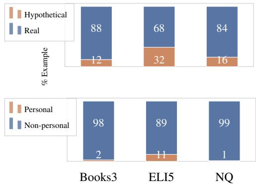
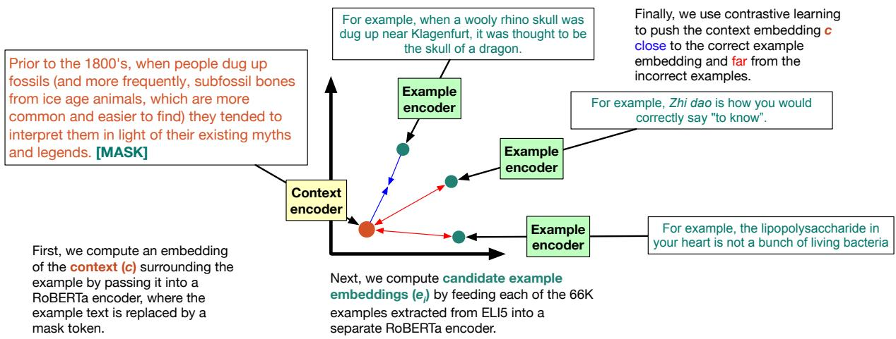
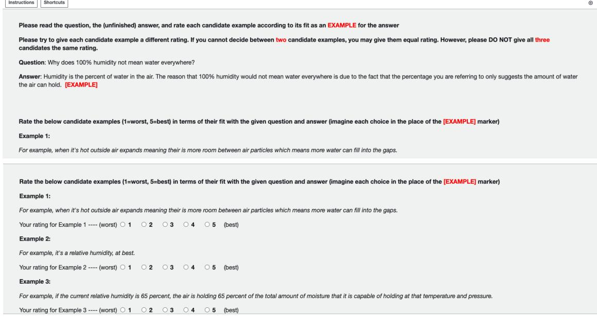
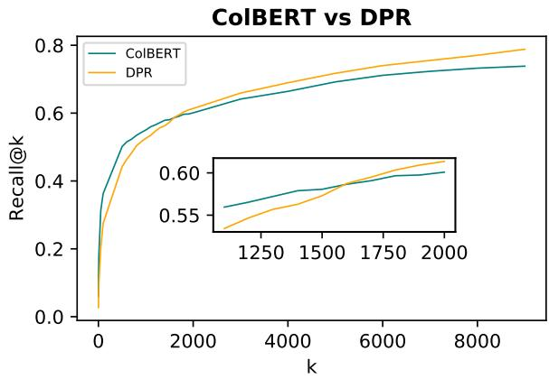
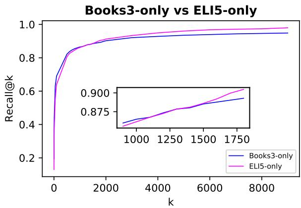

# Modeling Exemplification in Long-form Question Answering via Retrieval

Shufan Wang1, Fangyuan Xu2, Laure Thompson1, Eunsol Choi2, Mohit Iyyer1 1 College of Information and Computer Sciences, University of Massachusetts Amherst 2 Department of Computer Science, The University of Texas at Austin {shufanwang, laurejt, miyyer}@cs.umass.edu {fangyuan, eunsol}@utexas.edu

## Abstract

Exemplification is a process by which writers explain or clarify a concept by providing an example. While common in all forms of writing, exemplification is particularly useful in the task of long-form question answering (LFQA), where a complicated answer can be made more understandable through simple examples. In this paper, we provide the first computational study of exemplification in QA, performing a fine-grained annotation of different types of examples (e.g., hypotheticals, anecdotes) in three corpora. We show that not only do state-of-theart LFQA models struggle to generate relevant examples, but also that standard evaluation metrics such as ROUGE are insufficient to judge exemplification quality. We propose to treat exemplification as a retrieval problem in which a partially-written answer is used to query a large set of human-written examples extracted from a corpus. Our approach allows a reliable rankingtype automatic metrics that correlates well with human evaluation. A human evaluation shows that our model’s retrieved examples are more relevant than examples generated from a stateof-the-art LFQA model.

## 1 Introduction

When an author introduces a complicated concept, they commonly follow it up with a concrete example to help clarify their intended meaning. This process, known as exemplification, occurs in diverse forms, including hypothetical examples, personal anecdotes, and analogies (Clouse, 2013). Exemplification is particularly common within the NLP task of long-form question answering (LFQA), where an author wants to communicate a concept unknown to the question asker. Consider the following QA pair from the r/explainlikeimfive subreddit (Fan et al., 2019):

San Francisco’s Millennium Tower, built on mud and sand, has already sunk 18 inches into the ground.

Here, the answerer uses a specific example to emphasize the importance of building on a solid foundation. In general, explaining via exemplification is a fundamental technique in these kinds of pedagogical scenarios (Hyland, 2007), and it warrants separate study due to its importance in LFQA and the challenges in evaluating it. However, existing work on building LFQA models (Fan et al., 2019) does not give special treatment to exemplification or any other discourse phenomena, choosing instead to evaluate model outputs against reference answers using metrics such as ROUGE (Lin, 2004) that are not meaningful for this task (Krishna et al., 2021). In the above QA pair, any other structurallyunstable building (e.g., the Leaning Tower of Pisa) could serve as a valid example, but an LFQA model would be unfairly penalized for generating one of these acceptable alternatives.

In this paper, we first conduct a detailed study of exemplification across three different domains: Wikipedia, web articles, and community answers to questions from the ELI5 LFQA dataset. We extract sentences and clauses associated with exemplification by matching on explicit markers such as “for example” and “(e.g., ...)” and annotate 300 examples from this dataset. Our analysis reveals significant variation in occurrence frequencies of different forms of exemplification (e.g., hypothetical vs. specific examples) across the three domains.

Next, we focus on improving the modeling and evaluation of the subtask of exemplification within LFQA. We propose to treat it as a retrieval problem rather than a generation problem: given a question and a prefix of a reference answer (in the above QA pair, all of the text before “For example”), a model must retrieve the ground-truth example that follows the prefix (the sentence about the Millenium Tower) from the set of all exemplifying sentences and clauses in the dataset. We can use retrieval metrics such as recall@k to evaluate a model’s ability to select the ground-truth example, which are more informative than metrics such as ROUGE.

We demonstrate that pretraining our retriever on a large-scale dataset of exemplifying units extracted from the Books3 corpus (Gao et al., 2020) and then fine-tuning it on ELI5 examples results in substantial improvements on these ranking metrics. Finally, we crowdsource human evaluation comparing our retriever’s outputs with those generated by the state-of-the-art ELI5 model of Krishna et al. (2021) and find that workers prefer the retriever’s outputs far more frequently than those of the generation model. We hope that our work spurs more research into the evaluation and modeling of exemplification and other complex discourse phenomena present in LFQA. To facilitate future research, we publicly release the code and trained models from our work.1

## 2 Exploring Exemplification

In this section, we first describe our data extraction process, which we use to mine instances of exemplification from three datasets (and domains): ELI5 (Fan et al., 2019), Natural Questions (Kwiatkowski et al., 2019) and Books3 (Gao et al., 2020). This process involves matching on a set of “exemplification markers” and collecting both the text of the matching example (a sentence or clause) as well as the surrounding context on both sides. We then conduct a fine-grained human annotation study on the extracted data, breaking exemplification down into different types and exploring how they are used across the different domains.

## 2.1 Extracting a Dataset of Exemplification

Exemplification markers: Hyland (2007) annotated a diverse collection of articles from multiple disciplines with a variety of rhetorical practices2 and found that more than 75% of “examples" are signalled parenthetically or lexically with the use of the three most frequent “exemplification markers”: “such as”, “for example”, “e.g.”. Empirically, we find that the “such as” marker is noisy at signalling exemplification and often leads to ambiguous cases where it is hard to automatically detect the example boundary. Hence, we take the other two most frequent exemplification markers, namely “for example” and “e.g.”, and extract the parenthesesenclosed clauses and sentences that contain these exemplification markers as examples.

<table><tr><td></td><td>ELI5</td><td>NQ</td><td>Books3</td></tr><tr><td># training examples</td><td>65,157</td><td>1,209</td><td>2,848,171</td></tr><tr><td># validation examples</td><td>1,185</td><td>52</td><td>712,043</td></tr><tr><td>avg. # context words</td><td>123.7</td><td>74.0</td><td>155.7</td></tr><tr><td>avg. # example words</td><td>23.3</td><td>33.1</td><td>27.1</td></tr><tr><td>avg. # right words tokens</td><td>135.3</td><td>54.8</td><td>107.5</td></tr></table>

Table 1: Statistics of extracted example-in-context data.

Examples from Diverse Domains Using these two exemplification markers, we extract a dataset of examples in context from two popular LFQA datasets that come from different domains, ELI5 (Fan et al., 2019, Reddit answers) and Natural Questions (Kwiatkowski et al., 2019, Wikipedia passages).3 To study the exemplification phenomenon from a more diverse perspective, we also extract examples along with their surrounding context from the Books3 Corpus (Gao et al., 2020), a large-scale 100GB collection of books spanning a variety of topics and genres. Table 1 contains detailed statistics for the extracted example-incontext datasets.

## 2.2 Fine-grained Annotation Study

With the extracted dataset of examples, we conduct an in-depth analysis to understand different uses of exemplification in various domains. We (the authors) annotate a total of 300 examples extracted using exemplification markers from Natural Questions, ELI5 and Books3 as below. Fifty examples are annotated by two annotators (for purposes of computing agreement, reported in Section 2.3) and the rest are annotated by one annotator.

Given an extracted example and its left and right context, we first filter out around 7% of the extracted examples, either because they are extraction artifacts or because the marker is used for functions other than exemplification (e.g., referring to a figure or table). After this basic check, we annotate both structural information about the example (e.g., discourse units such as the anchor of the example) and semantic information about how it is used in the context. Table 2 contains statistics of the annotated subset.4

<table><tr><td>Dataset</td><td>Valid</td><td>Extracted</td><td>% Valid</td></tr><tr><td>ELI5</td><td>87</td><td>93</td><td>94%</td></tr><tr><td>NQ</td><td>89</td><td>95</td><td>94%</td></tr><tr><td>Books3</td><td>85</td><td>94</td><td>90%</td></tr><tr><td>Total</td><td>261</td><td>282</td><td>93%</td></tr></table>

Table 2: Statistics of annotated examples.

## 2.2.1 Discourse units

Exemplification is usually expressed through three discourse units (Meyer, 1992; Triki, 2021): the anchor (also known as “exemplified unit”), the exemplification marker, and the example text itself (“exemplifying unit”). We annotate the anchor (marked as bold) and example (marked as italics). Concretely, in example (1) below, the anchor is “euryhaline species”, the exemplifying marker is “e.g.”, and the exemplifying unit is “Flounder”. As in the study of Triki (2021), we find that these units mainly come in two forms: (1) nominal groups that refer to entities, or (2) clauses that represent statements.

(1) However , some fish show a tremendous ability to effectively osmoregulate across a broad range of salinities ; fish with this ability are known as euryhaline species , e.g., Flounder.

(2) Players earn you points, depending on their performance. For example, your QB might throw for 200 yards, earning 1 point per 10 yards,for 20 points.

During our initial investigation, we also noticed examples (3) which are signalled implicitly (i.e. without exemplification markers).5 Identifying such examples automatically is beyond the scope of our study and warrants future work.

(3) The biggest driver of disparity in tech jobs is cost of living. If it costs 2000 a month to live in Boston, and 200 a month to live in India, then salaries will reflect that.

Table 3 shows that the length of the discourse units is roughly the same across the three datasets, which supports our experimental decision in Section 3 of using sentences as the base unit for example retrieval. We also find that all of the anchors we annotated occur before the examples, suggesting that using preceding context to retrieve examples gives the model sufficient information.

<table><tr><td>Dataset</td><td># samples</td><td>Anchor</td><td>Example</td></tr><tr><td>ELI5</td><td>87</td><td>1.1/16.6</td><td>1.3/29.2</td></tr><tr><td>NQ</td><td>89</td><td>1.0/15.4</td><td>1.4/25.1</td></tr><tr><td>Books3</td><td>85</td><td>1.1/17.0</td><td>1.2/25.1</td></tr><tr><td>Type</td><td></td><td></td><td></td></tr><tr><td>Real</td><td>209</td><td>1.1/14.5</td><td>1.3/24.6</td></tr><tr><td>Hypothetical</td><td>52</td><td>1.2/23.4</td><td>1.2/33.7</td></tr><tr><td>Personal</td><td>13</td><td>1.1/18.1</td><td>2/49.6</td></tr><tr><td>Not-personal</td><td>248</td><td>1.1/16.3</td><td>1.2/25.2</td></tr></table>

Table 3: Length of the discourse units per dataset and type, presented as average # sentences / # words.

## 2.2.2 Real vs. Hypothetical Examples

One notable categorization found during our investigation and also identified by Triki (2021) is whether the examples are real, specific scenarios, or hypothetically-constructed scenarios. We detail the definition of the two types here:

Real examples: These examples are either real entities (4) or specific scenarios (5) that are constructed as fact clauses.

(4) CEOs lead a range of organizations , including public and private corporations, non-profit organizations and even some government organizations (e.g., Crown corporations).

(5) For a given pressure , different liquids boil at different temperatures. For example, water boils at 100° C (212° F) at sea level, but at 93.4° C (200.1° F) at 2,000 metres (6,600ft) altitude.

Hypothetical examples: In contrast, hypothetical examples are scenarios constructed by the author. According to Triki (2021), hypothetical examples often come with the use of conditional clauses if or signalled via assume. These examples are generally more complicated and are specifically constructed for the purpose of exemplification.

(6) The reasoning is that if you share your life with someone then anything you do during that time is made possible by their support. For example, ifyour wife is a stay at home wife and your a business man making lots of money, the reasoning is that you would not have the same amount oftime to dedicate to work ifyou had to look after your own house and/or children.

We observe a different distribution of the two types of examples in the three datasets (Figure 1, top). ELI5 contains more hypothetical examples (32%) than the other two datasets (16% for NQ, 12% for Books3), showing that hypothetical examples are commonly used to explain complicated concepts. We also note that hypothetical examples are generally longer than real ones (33.7 v.s. 24.6 words, as seen in Table 3), aligning with our observation that these examples are more complicated.

  
Figure 1: Distribution of different types of examples across three datasets.

## 2.2.3 Personal Information

Previous work found that exemplification is “rarely personalized” in academic texts (Ädel, 2006), referring to the uncommon use of first person pronouns or reference to the author. In contrast, we found a consistent presence of personal information in the examples we examined, in the form of either personal anecdotes (7) or an example situated in the author’s own circumstance (e.g., in my city...). We thus also annotate whether the exemplifying units contain personal information or not.

## (7) ... But they also give advice a doctor might have forgotten. For example about 6 months ago I went to the urgent care centerfor ear pain and was prescribed an ear drop antibiotic. ...

We observe differences in the presence of personal information across the three datasets (Figure 1, bottom) – ELI5 answers, which are written by users from online community forum, contain a substantial portion of examples with personal information (12%), while such information is rarely present in the other two datasets. There is also a notable length difference between examples with and without personal information (49.6 v.s. 25.2 words), showing that more detailed description is provided for personal anecdotes. The observation that ELI5 contains many personal examples raises concerns that language models trained on such datasets will generate personal examples that cannot be verified or meaningfully interpreted.

## 2.3 Annotation agreement

We report agreement for the three annotation tasks performed on the 50 two-way annotated samples. For discourse unit annotation, we find high unigram overlap between the two annotations (0.81 for the anchor and 0.92 for the example). For annotation of real vs. hypothetical examples and the presence of personal information, we find a modest to high agreement with a Cohen’s kappa of 0.48 for both. Additionally, we observe annotations of real v.s. hypothetical example to be split when the example refers to abstract actions, such as the one below (8).

(8) Carpets are used for a variety of purposes , including insulating a person ’s feet from a cold tile or concrete floor , making a room more comfortable as a place to sit on the floor (e.g. , when playing with children or as a prayer rug ) , reducing sound from walking ( particularly in apartment buildings ) and adding decoration or colour to a room .

## 3 Retrieving Examples in LFQA

Our annotation and analysis of the extracted exemplification dataset reveals the diversity and complexity of this discourse phenomenon. In this section, we shift our focus towards building retrievalbased models to produce examples based on a given LFQA context. First, we define our exampleretrieval task formally and introduce our evaluation metrics. Then, we describe our contrastive-learning based retriever model, which closely follows the retriever implementation in Thai et al. (2022), and baseline retrieval models, and report their performances.

## 3.1 Task Definition

Given a context (part of the answer to a given LFQA question) with a masked out exemplifying unit, model is asked to retrieve that masked unit from a retrieval corpus. We consider two settings for context: (1) concatenation of left and right contexts surrounding the exemplifying unit and (2) left context preceding the exemplifying unit only (as in Figure 2). Both left and right contexts are truncated to 256 tokens surrounding the exemplifying unit. We use all 66K exemplifying units extracted from the 272K QA instances in the training and development portion of ELI5 dataset (Petroni et al., 2021) as the retrieval corpus. To illustrate the input format, consider the below answer to the question “Why didn’t anyone discover dinosaur fossils before the 1800s?”:

  
Figure 2: Our EGRET model uses dual RoBERTa encoders to embed (1) the context surrounding an exemplifying unit and (2) all 66K exemplifying units extracted from ELI5. A contrastive objective is then used to move the context embedding close to the embedding of the ground-truth exemplifying unit that occurs within that context, and far from all other negative exemplifying units.

Prior to the 1800’s, when people dug up fossils (and more frequently, subfossil bones from ice age animals, which are more common and easier to find) they tended to interpret them in light of their existing myths and legends. [MASK] Because fossils are almost always found as a jumble of bones rather than a neat skeleton and because they are incomplete... nobody looked at dinosaur skeletons and realized what the animals that made them actually looked like.

## where the [MASK] token corresponds to

For example, when a wooly rhino skull was dug up near Klagenfurt, it was thought to be the skull of a dragon.

The first quote block showing the masked answer will be used as a query to retrieve the exemplifying unit in the second quote block.

This retrieval task is challenging due not only to the size of the candidate set but also because of the topical similarity between many ELI5 questions, which was previously noted by Krishna et al. (2021). Retrieving based on lexical overlap, as in BM-25 and other string-matching based approaches, cannot identify exemplifying units that are relevant but share little overlap with the context.

## 3.2 Evaluation Data / Metric

For evaluation data, we use 1,185 context-example pairs automatically identified from 1,507 QA instances in the ELI5 development set (Petroni et al., 2021) by our discourse marker heuristics. We evaluate the performance of our retriever by measuring how reliable it is at retrieving ground-truth examples from the candidate example set. Concretely, given the candidate set of examples, each model should output a ranked list of all examples according to their fit for the context. We evaluate these rankings using recall@k of the ground-truth example (where k  1, 3, 5, 10, 50, 100) from the set of all 66K examples in ELI5. By using retrieverbased evaluation metrics, we can directly measure a model’s ability to understand and exemplify a context, in contrast to string overlap metrics like ROUGE (Lin, 2004) which are uninformative for this task.

## 3.3 Models

We first introduce our model (EGRET) and describe baseline retrieval methods. We use all baseline models in a zero-shot manner (without additional fine-tuning on exemplification dataset).

EGRET: an example retriever for LFQA We train an example retriever model (EGRET) on our extracted exemplification dataset from training portion of ELI5 (Fan et al., 2019), which contains 65K extracted context-example pairs. Our retriever consists of dual Transformer encoders (Vaswani et al., 2017), one to encode the context query and the other to encode candidate examples (Figure 2). Both encoders are initialized as pretrained RoBERTa-base models (Liu et al., 2019), as in the dense-RELiC model of Thai et al. (2022). To obtain a query embedding $c _ { i } ,$ we feed the query encoder the surrounding context of a masked-out example, as in Figure 2. Similarly, we use the other encoder to compute embeddings of the ground-truth example $( e _ { i } ^ { + } )$ as well as negative examples sampled from other contexts, forming a set E of example embeddings. We fine-tune both encoders in EGRET with a contrastive learning objective (van den Oord et al., 2018; Chen et al., 2020):

<table><tr><td rowspan="2">Model</td><td rowspan="2">Context</td><td colspan="6">Recall@k (↑)</td><td rowspan="2">Avg rank (↓)</td></tr><tr><td>1</td><td>3</td><td>5</td><td>10</td><td>50</td><td>100</td></tr><tr><td colspan="10">[zero-shot] baselines, including pretrained dense retrievers</td></tr><tr><td>Random</td><td></td><td>0.0</td><td>0.0</td><td>0.01</td><td>0.02</td><td>0.08</td><td>0.15</td><td>33171.0</td></tr><tr><td>BM25 (Robertson et al., 1995)</td><td>L</td><td>4.6</td><td>9.5</td><td>12.1</td><td>16.2</td><td>25.6</td><td>30.4</td><td>24940.1</td></tr><tr><td>DPR (Karpukhin et al., 2020)</td><td>L</td><td>2.7</td><td>5.2</td><td>7.1</td><td>9.7</td><td>20.3</td><td>27.5</td><td>7796.9</td></tr><tr><td>ColBERT (Khattab and Zaharia, 2020)</td><td>L</td><td>6.0</td><td>11.8</td><td>14.3</td><td>18.2</td><td>31.2</td><td>36.3</td><td>9948.6</td></tr><tr><td>SBERT (Reimers and Gurevych, 2021)</td><td>L</td><td>5.7</td><td>11.6</td><td>15.0</td><td>20.4</td><td>34.3</td><td>42.2</td><td>5122.7</td></tr><tr><td>BM25 (Robertson et al., 1995)</td><td>L+R</td><td>8.7</td><td>16.1</td><td>20.0</td><td>24.8</td><td>38.0</td><td>42.7</td><td>13968.8</td></tr><tr><td>DPR (Karpukhin et al., 2020)</td><td>L+R</td><td>4.4</td><td>8.6</td><td>11.1</td><td>15.7</td><td>27.2</td><td>33.5</td><td>5684.0</td></tr><tr><td>ColBERT (Khattab and Zaharia, 2020)</td><td>L+R</td><td>8.9</td><td>16.4</td><td>18.9</td><td>23.3</td><td>36.3</td><td>42.2</td><td>8636.0</td></tr><tr><td>SBERT (Reimers and Gurevych, 2021)</td><td>L+R</td><td>9.2</td><td>16.3</td><td>21.2</td><td>27.1</td><td>44.2</td><td>51.3</td><td>3216.7</td></tr><tr><td colspan="9">our models, trained on exemplification data</td></tr><tr><td>EGRET (ELI5)</td><td>L</td><td>13.0</td><td>22.8</td><td>29.3</td><td>36.5</td><td>55.2</td><td>64.0</td><td>807.2</td></tr><tr><td>EGRET (Books3 only)</td><td>L</td><td>19.3</td><td>30.4</td><td>36.8</td><td>44.1</td><td>63.1</td><td>69.0</td><td>2427.6</td></tr><tr><td>EGRET (Books3 + ELI5)</td><td>L</td><td>21.1</td><td>33.5</td><td>39.2</td><td>46.8</td><td>66.7</td><td>73.0</td><td>609.8</td></tr><tr><td>EGRET (ELI5)</td><td>L+R</td><td>23.5</td><td>35.6</td><td>41.9</td><td>51.0</td><td>71.0</td><td>77.6</td><td>300.6</td></tr><tr><td>EGRET (Books3 only)</td><td> $\mathrm { L } { + } \mathrm { R }$ </td><td>33.4</td><td>47.8</td><td>53.8</td><td>61.5</td><td>76.5</td><td>82.5</td><td>632.9</td></tr><tr><td>EGRET (Books3 + ELI5)</td><td> $\mathrm { L } { + } \mathrm { R }$ </td><td>36.9</td><td>50.6</td><td>58.2</td><td>64.8</td><td>80.2</td><td>85.8</td><td>188.4</td></tr></table>

Table 4: Our EGRET model outperforms pretrained (or non-parametric) baselines on the example retrieval task, indicating that exemplification cannot be solved by term matching or coarse query-context similarity alone. Pretraining EGRET on out-of-distribution examples from Books3 results in large improvements in recall@k. Finally, including context to the right of the exemplifying unit significantly boosts performance.

$$
\mathcal { L } ( \boldsymbol { \theta } ) = - \sum _ { ( c _ { i } , e _ { i } ) \in E } \log \frac { \exp c _ { i } \cdot e _ { i } ^ { + } } { \sum _ { e _ { j } \in E } \exp c _ { i } \cdot e _ { j } }\tag{1}
$$

This objective places the context vector $c _ { i }$ close to that of the ground-truth example vector $e _ { i } ^ { + }$ of an example, and far from other examples $e _ { j }$ in the batch E (“in-batch” negative samples). We train both the left-context-only and the left-and-rightcontext models on a single RTX-8000 GPU for 10 epochs, using the Adam optimizer (Kingma and Ba, 2015) with learning rate initialized at 1e 5 for 10 epochs with early stopping. Both models converge in 4 epochs of training over the ELI5 dataset.

Pretraining EGRET on a huge set of examples: While the EGRET model described above is trained on the ELI5 dataset, exemplification is pervasive in many kinds of texts, as shown by our annotation in Section 2. Thus, we also experiment with a transfer learning scenario by pretraining EGRET on a dataset of 3.5 million examples extracted from Books3 (Gao et al., 2020), and then fine-tuning the resulting model on the ELI5 examples. We perform Books3 pretraining for both left-contextonly and left-and-right-context models on a single

RTX-8000 GPU for 5 epochs using Adam with learning rate initialized at 1e ´ 5. Both models converge after one epoch of fine-tuning over the ELI5 dataset.

Baselines: We compare EGRET to a term matching method as well as three publicly-available pretrained dense retrievers.

BM25 (Robertson et al., 1995): BM25 retrieves text via a scoring function reliant on lexical overlap. We use the implementation from the rank\_bm25 library,6 with the default BM25Okapi as the similarity algorithm.

DPR (Karpukhin et al., 2020): DPR is a retriever model trained on Natural Questions (Kwiatkowski et al., 2019) that computes dense representations of queries and evidence paragraphs for retrieval.

ColBERT (Khattab and Zaharia, 2020): Col-BERT similarly uses pretrained language models to embed text, but contextualizes query and candidate documents using late interaction and was trained on MS MARCO (Bajaj et al., 2018).

SBERT (Reimers and Gurevych, 2021): SBERT is a sentence-BERT-based encoder model with down-project layers that outperforms DPR on the MS MARCO dataset.

## 4 Results & Analysis

We report results from baseline retrievers and our trained models in Table 4. We also conduct a human evaluation to compare retrieved examples from EGRET (L) to examples generated by the state-of-the-art LFQA Routing Transformer model of Krishna et al. (2021).

## 4.1 Automatic Evaluation

While all models outperform random baselines, our trained EGRET models (Fan et al., 2019) consistently outperform both the lexical baseline (BM25) and other neural baselines. Among the baseline models, SBERT model, trained on MSMARCO dataset, consistently outperforms other models and DPR model lags behind the lexical baseline.7

Including context after the exemplifying unit improves recall: As a sanity check, we observe that including more context (L+R) significantly boosts recall for both EGRET and all baselines compared to including just context before the exemplifying unit (L). In addition to providing more constraints over the exemplifying unit, we also observe improvements on multi-sentence exemplifying units due to term matching; as this L+R setting is not particularly realistic, we analyze only the L configuration moving forward.

Pretraining improves example retrieval: Pretraining on out-of-distribution Books3 examples substantially boosts EGRET’s performance, with the best left-context-only model achieving a recall@1 of 21.1% compared to 13.0% without pretraining. In fact, an EGRET model pretrained on Books3 without fine-tuning on in-domain ELI5 data (19.3% recall@1) outperforms the ELI5-only EGRET. While Figure 1 shows that the distribution over exemplification types differs based on the dataset/domain, our results suggest that many aspects of exemplification apply generally to wide forms of writing, and that the pretrained Books3 EGRET could be useful for many other applications.

## 4.2 Human evaluation of retrieved examples vs. generated examples

How do the examples retrieved by EGRET compare to examples generated by a state-of-the-art LFQA model? In theory, generative LFQA models can produce examples tailored to any input context; in practice, however, they struggle to generate relevant and informative examples. On the other hand, retriever models will always produce humanwritten examples, but it may not always be possible to retrieve a relevant example for an arbitrary heldout context. To explore this trade-off, we conduct a human evaluation by providing Mechanical Turk workers with an ELI5 question and context, and asking them to both rank and rate (on a 5 point Likert scale) three candidate exemplifying units: (1) the ground-truth; (2) the top-ranked retrieval from EGRET, restricted to only cases where this retrieval is not the ground-truth; and (3) a generated output from the state-of-the-art c-REALM-RT model of Krishna et al. (2021).8

Task setup: In the ranking task, we ask workers to produce a ranking of the three choices (e.g., 1>2>3). We allow equality (e.g., 1=2>3) since multiple candidates can be equally valid for a given context. In the rating task, we ask workers to evaluate how well each example fits with the given context on a scale of 1 to 5. For both tasks, we collect three annotations per item for 100 total items, and we pay \$0.35 per item for an estimated hourly wage of \$21 per hour.9 While a completely fair comparison of EGRET to c-REALM-RT is infeasible due to differences in training objective and architecture, we choose to focus only on sentencelevel exemplifying units that begin with “For example”. We provide the question, left context, and “For example” marker to c-REALM-RT and decode using nucleus sampling with p “ 0.9 until a sen- tence boundary (e.g., period) is generated. For the retrieved output, we use EGRET(Books3 + ELI5, L) since the RT model has access to only the left context.

EGRET retrievals are preferred over generated exemplifying units: In both tasks, crowdworkers exhibit a clear preference for exemplifying units retrieved by EGRET compared to those generated by c-REALM-RT. While both tasks are fairly subjective, as shown by the low interannotator agreement measured by Krippendorf’s alpha, the results indicates that as of now, exemplification in LFQA is better handled by retrieval models than generative models, and that research into hybrid generation/retrieval LFQA models is a promising direction.

<table><tr><td>Left context</td><td>Ground-truth</td><td>EGRET-retrieved vs others</td><td>Analysis</td></tr><tr><td>Evolution is not a force to- wards the optimum, it&#x27;s a force towards the minimum neces- sary.</td><td>For example, if grass was poi- sonous, it would be better for its survival, as less animals would come eat it.</td><td>[EGRET-retrieved]: For example, we move incredible slowly when compared to the maximum speed allowed in the universe. (R:0.111 / H:5.0) [Highest ROUGE-L]: For example, if a certain percent- age of snakes are venomous, then the more snakes in a given area the more venomous. (R:0.22)</td><td>ROUGE is not a viable eval- uation for example quality. Our EGRET&#x27;s retrieved ex- ample was rated a 5/5 by all three crowdworkers but achieves lower ROUGE than an irrelevant example.</td></tr><tr><td>... You&#x27;re brain is asleep and not paying any attention to your body so it ignores all of these stimuli unless they be- come too hard to ignore.</td><td>For example if the touching turns to slapping, the talking turns to yelling, or the light in the eyes turns to really bright light in the eyes.</td><td>[EGRET-retrieved]: For example, if you&#x27;re in a room with a clock ticking you don&#x27;t notice the ticking after a while. (H:4.0) [c-REALM-RTGenerated]: For example, its not just that your brain is dead. (H:2.0)</td><td>TheEGRET-retrieved exam- ple effectively illustrates the phenomenon in the context and receives a higher average rating from crowdworkers than the generated example and even the ground-truth (3.3).</td></tr><tr><td>Multiple births mean less time per offspring. Each indi- vidual offspring therefore has a lower chance of survival, ... Seems like the larger mammals tend to have single births.</td><td>For example, polar bears and elephants usually have single births.</td><td>[EGRET-retrieved]: For example, in mammals, a typi- cal litter will be one offspring per pair of nipples as this is as many individuals a female can reasonably sustain. [c-REALM-RTGenerated]: For example, ok, this is as close I can get to explaining in ELI5 terms.</td><td>EGRETretrieves an example based on a key entity from the context (mammals) but fails to address the concept to be exem- plified (&quot;single births&quot;)</td></tr></table>

Table 5: Instances where EGRET retrieves exemplifying units that are rated highly by Humans but have low ROUGE score with the ground-truth example (top); where model retrievals are rated as more meaningful than those generated by the c-REALM-RT model (middle); and where EGRET fails to retrieve a relevant example by relying too much on lexical overlap and c-REALM-RT fails by producing an overly-generic output (bottom).
<table><tr><td></td><td> $\mathbf { R a t i n g } _ { \mathrm { S T D } } \left( \uparrow \right)$ </td><td>Krip. α</td></tr><tr><td>c-REALM-RT</td><td> $2 . 8 0 \phantom { 0 } _ { 0 . 7 7 5 }$ </td><td>0.058</td></tr><tr><td>EGRET (Books3 + ELI5, L)</td><td> $3 . 5 5 _ { 0 . 6 3 6 }$ </td><td>0.125</td></tr><tr><td>Ground-truth</td><td> $3 . 7 0 _ { 0 . 5 9 7 }$ </td><td>0.128</td></tr></table>

Table 6: Crowdworkers rate EGRET retrievals higher (on a scale of 1 to 5 of how well the exemplifying unit fits with the context) than the SOTA generative LFQA model.
<table><tr><td></td><td>RankingstD (↓)</td><td>Krip. α</td></tr><tr><td>c-REALM-RT</td><td> $2 . 2 6 _ { 0 . 2 7 1 }$ </td><td>0.168</td></tr><tr><td>EGRET (Books3 + ELI5, L)</td><td>1.880.252</td><td>0.154</td></tr><tr><td>Ground-truth</td><td> $1 . 7 1 _ { 0 . 2 8 4 }$ </td><td>0.200</td></tr></table>

Table 7: On our ranking task (1=best, 3=worst), crowdworkers prefer EGRET retrievals over the generative LFQA model.

One limitation of our retrieval approach is that it will fail when the candidate set contains no relevant examples for a given context, which is not (at least in theory) an issue with generative models. However, we observe from our error analysis (Table 8) that both approaches at times produce seemingly relevant but incorrect examples. Furthermore, our human evaluations show that generative model fails to produce relevant examples for 79% of the contexts and consistently receive lower ratings than the retrieval model. This gap indicates that effectively incorporating retrieved information into the answer generation process is an important future research direction.

Our human study is coarse, judging the overall quality of the example, and future experiments could perform more fine-grained ratings of properties such as grammaticality and relevance.

## 5 Related Work

Linguistic studies of exemplification: Early work (Kurohashi and Nagao, 1994) studies automatic detection of discourse relations including exemplification. Several works have studied exemplification in the domains of academic writing and teaching (Hyland, 2007; Oliveira and Brown, 2016; Triki, 2021). They proposed the following categorization of examples: general example (an instance of a general category); analogy (a parallel or similar case); counterexample (example that opposes or contradicts the anchor) and extreme example (boundary cases, in the sense of being more of an unusual instance than a representative, generic case). During our initial investigation, we noticed that majority of the examples in our dataset are general examples, which aligns with the findings in Hyland (2007). The dominance of general examples could also be due to the choice of our exemplification markers – all examples given by Hyland (2007) for analogy have the exemplification marker "like", which we found noisy for automatic extraction. Li and Nenkova (2016) examine the closely-related instantiation discourse relation, where one text span explains in further detail the events described in another text span.

<table><tr><td>Left context</td><td>Ground truth</td><td>Retrieved/Generated</td><td>Error Analysis</td></tr><tr><td>Dog&#x27;s do not pass a mirror test so it&#x27;s highly unlikely they have a sense of self.[...]They do recognize there names, it&#x27;s a bit of an illusion though.</td><td>For example if you have two dogs, and you give one of them a treat when you say Fido, and the other when you say Clifford, they learn that the respective words only apply</td><td>[EGRET] For example people can identify their own dog.</td><td>EGRETretrieved relevant but se- mantically incorrect example (peo- ple identify their dog, instead of how dog identify themselves).</td></tr><tr><td>An economist would say healthcare has a positive externality.[...]There are some things you can buy that make everyone better off.</td><td>For example: going to the doctor every time you are sick will make you less likely to make other people sick.</td><td>[EGRET] For example, a butterfly house, a free cinema, games con- soles etc.</td><td>EGRETretrieved examples related to the immediate preceding context (&quot;some things you can buy...&quot;) but failed to retrieved examples based on earlier context (about healthcare).</td></tr><tr><td>4 billion - Economic and Military aid for Pakistan, Egypt, and Jordan. The goal is to have a few people in the mideast who call us allies. Es- sentially, we buy their cooperation. That cooperation is sometimes use- ful.</td><td>For example, when we killed Osama Bin Laden, we sent troops into Pak- istan. Normally, countries don&#x27;t tol- erate troops from other countries. The Pakistanis did complain a little, but they didn&#x27;t do anything about it.</td><td>[c-REALM-RT] For example, for ev- eryone here talking about how a lot of aid works: If we put money to- wards helping foreign countries re- build, we are imposing restrictions on domestic activity. [...]</td><td>c-REALM-RTgenerated an on-topic hypothetical example, which contra- dicts with the context.</td></tr><tr><td>You don&#x27;t usually work on the same files because everything is split up between the departments. I haven&#x27;t used USD yet but I have encoun- tered the following workflow in different studios (using Maya).</td><td>For example: a character that has been rigged by one (or more, but not at the same time) rigger goes to the animators. Every animator works with the same character rig BUT each animator works on his/her own shot.[...]</td><td>[c-REALM-RT] For example, as a starting point: I&#x27;m a post graduate and work in the final sector of the project, not the project itself. Most of the work is done with other stu- dios around the world who are made up of multiple departments.[...]</td><td>c-REALM-RTgenerated a personal example that is irrelevant to the con- text.</td></tr></table>

Table 8: Error analysis of retrieved and generated examples.

Long-form question answering: Our work studies exemplification mainly within the task of long-form question answering (LFQA), which involves generating paragraph-length answers to open-ended questions. Previous work has approached this problem using retrieval-augmented generation (Fan et al., 2019; Lewis et al., 2020), while Nakano et al. (2021) set up an interactive language model that learns LFQA through human interaction. Krishna et al. (2021) demonstrate that lexical overlap metrics such as ROUGE are not meaningful for this task. With a series of human annotations, Xu et al. (2022) study the discourse structures of long-form answers and identify exemplification as one of the functional roles commonly present in different types of long-form answers.

Neural retrieval models: Our EGRET retriever builds on recently-developed neural models that retrieve evidence documents for open-retrieval question answering (Karpukhin et al., 2020; Guu et al., 2020) and fact-checking (Samarinas et al., 2021). These models demonstrate superior performance compared to non-neural methods like BM25 (Robertson et al., 1995); that said recent sparse/dense hybrid retrievers (Luan et al., 2021) could be interesting to explore on our exemplification task in the future.

## 6 Conclusion

In this work, we present the first computational study of exemplification in long-form question answering. We perform a detailed annotation over the use of exemplification across various domains and observe different distributions over complex exemplification types and units. While existing LFQA systems are conditional language models that do not give special treatment to exemplification, we propose to retrieve examples based on their context instead of generating them. We develop EGRET, a simple dual encoder trained with a contrastive learning objective, that outperforms a diverse set of baselines on this task of example retrieval, which we can meaningfully evaluate using simple ranking metrics instead of unsuitable metrics like ROUGE. We hope that our work spurs researchers to consider separately modeling and evaluating the fine-grained linguistic and discourse phenomena found in LFQA data.

## Ethical Considerations

We make use of pretrained language models to both generate and retrieve text in this work. Representations from pretrained language models are known to cause ethical concerns, such as perpetuating racial or gender bias (Field et al., 2021; Gala et al., 2020). We advise using caution and adopting a post-processing strategy to filter potentially offensive text produced by pretrained language models before releasing text content to users. Additionally, we note that most existing LFQA datasets (including the ELI5 dataset used in this work) and benchmarks are collected from English text sources. We hope future works can explore the use of exemplification in other languages.

## Acknowledgements

We are grateful to the UMass NLP group for many helpful discussions. We thank Yapei Chang, Kalpesh Krishna, Katherine Thai for sharing their retriever models with us, as well as Tu Vu and Andrew Drozdov for sharing their compute resources. We would also like to thank the anonymous reviewers for their insightful feedback. SW and MI were supported by awards IIS-1955567 and IIS-2046248 from the National Science Foundation.

## References

Annelie Ädel. 2006. Metadiscourse in l1 and l2 english.

Payal Bajaj, Daniel Campos, Nick Craswell, Li Deng, Jianfeng Gao, Xiaodong Liu, Rangan Majumder, Andrew McNamara, Bhaskar Mitra, Tri Nguyen, Mir Rosenberg, Xia Song, Alina Stoica, Saurabh Tiwary, and Tong Wang. 2018. Ms marco: A human generated machine reading comprehension dataset.

Ting Chen, Simon Kornblith, Mohammad Norouzi, and Geoffrey Hinton. 2020. A simple framework for contrastive learning of visual representations. In Proceedings of the International Conference of Machine Learning.

Barbara Fine Clouse. 2013. The student writer. McGraw-Hill.

Angela Fan, Yacine Jernite, Ethan Perez, David Grangier, Jason Weston, and Michael Auli. 2019. ELI5: Long form question answering. In Proceedings of the 57th Annual Meeting of the Association for Computational Linguistics, pages 3558–3567, Florence, Italy. Association for Computational Linguistics.

Anjalie Field, Su Lin Blodgett, Zeerak Waseem, and Yulia Tsvetkov. 2021. A survey of race, racism, and

anti-racism in NLP. In Proceedings ofthe 59th Annual Meeting of the Association for Computational Linguistics and the 11th International Joint Conference on Natural Language Processing (Volume 1: Long Papers), pages 1905–1925, Online. Association for Computational Linguistics.

Dhruvil Gala, Mohammad Omar Khursheed, Hannah Lerner, Brendan O’Connor, and Mohit Iyyer. 2020. Analyzing gender bias within narrative tropes. In Workshop on NLP and CSS at EMNLP.

Leo Gao, Stella Biderman, Sid Black, Laurence Golding, Travis Hoppe, Charles Foster, Jason Phang, Horace He, Anish Thite, Noa Nabeshima, Shawn Presser, and Connor Leahy. 2020. The Pile: An 800gb dataset of diverse text for language modeling. arXiv preprint arXiv:2101.00027.

Kelvin Guu, Kenton Lee, Zora Tung, Panupong Pasupat, and Ming-Wei Chang. 2020. Realm: Retrievalaugmented language model pre-training. ArXiv, abs/2002.08909.

Ken Hyland. 2007. Applying a gloss: exemplifying and reformulating in academic discourse. Applied Linguistics, 28:266–285.

Vladimir Karpukhin, Barlas Oguz, Sewon Min, Patrick Lewis, Ledell Wu, Sergey Edunov, Danqi Chen, and Wen-tau Yih. 2020. Dense passage retrieval for opendomain question answering. In Proceedings ofEmpirical Methods in Natural Language Processing.

Omar Khattab and Matei Zaharia. 2020. Colbert: Efficient and effective passage search via contextualized late interaction over bert.

Diederik P. Kingma and Jimmy Ba. 2015. Adam: A method for stochastic optimization. In 3rd International Conference on Learning Representations, ICLR 2015, San Diego, CA, USA, May 7-9, 2015, Conference Track Proceedings.

Kalpesh Krishna, Aurko Roy, and Mohit Iyyer. 2021. Hurdles to progress in long-form question answering. In North American Association for Computational Linguistics.

Sadao Kurohashi and Makoto Nagao. 1994. Automatic detection of discourse structure by checking surface information in sentences. In COLING 1994 Volume 2: The 15th International Conference on Computational Linguistics.

Tom Kwiatkowski, Jennimaria Palomaki, Olivia Redfield, Michael Collins, Ankur Parikh, Chris Alberti, Danielle Epstein, Illia Polosukhin, Matthew Kelcey, Jacob Devlin, Kenton Lee, Kristina N. Toutanova, Llion Jones, Ming-Wei Chang, Andrew Dai, Jakob Uszkoreit, Quoc Le, and Slav Petrov. 2019. Natural questions: a benchmark for question answering research. Transactions of the Association of Computational Linguistics.

Patrick Lewis, Ethan Perez, Aleksandara Piktus, Fabio Petroni, Vladimir Karpukhin, Naman Goyal, Heinrich Kuttler, Mike Lewis, Wen tau Yih, Tim Rocktäschel, Sebastian Riedel, and Douwe Kiela. 2020. Retrieval-augmented generation for knowledgeintensive nlp tasks. ArXiv, abs/2005.11401.

Junyi Jessy Li and Ani Nenkova. 2016. The instantiation discourse relation: A corpus analysis of its properties and improved detection. In NAACL.

Chin-Yew Lin. 2004. Rouge: A package for automatic evaluation of summaries. In Text summarization branches out, pages 74–81.

Yinhan Liu, Myle Ott, Naman Goyal, Jingfei Du, Mandar Joshi, Danqi Chen, Omer Levy, Mike Lewis, Luke Zettlemoyer, and Veselin Stoyanov. 2019. Roberta: A robustly optimized BERT pretraining approach. arXiv preprint arXiv:1907.11692.

Yi Luan, Jacob Eisenstein, Kristina Toutanova, and Michael Collins. 2021. Sparse, Dense, and Attentional Representations for Text Retrieval. Transactions ofthe Associationfor Computational Linguistics, 9:329–345.

Charles F. Meyer. 1992. Apposition in contemporary english.

Reiichiro Nakano, Jacob Hilton, Suchir Balaji, Jeff Wu, Long Ouyang, Christina Kim, Christopher Hesse, Shantanu Jain, Vineet Kosaraju, William Saunders, Xu Jiang, Karl Cobbe, Tyna Eloundou, Gretchen Krueger, Kevin Button, Matthew Knight, Benjamin Chess, and John Schulman. 2021. Webgpt: Browserassisted question-answering with human feedback. CoRR, abs/2112.09332.

Alandeom W. Oliveira and Adam Oliver Brown. 2016. Exemplification in science instruction: Teaching and learning through examples. Journal ofResearch in Science Teaching, 53:737–767.

Fabio Petroni, Aleksandra Piktus, Angela Fan, Patrick Lewis, Majid Yazdani, Nicola De Cao, James Thorne, Yacine Jernite, Vladimir Karpukhin, Jean Maillard, Vassilis Plachouras, Tim Rocktäschel, and Sebastian Riedel. 2021. KILT: a benchmark for knowledge intensive language tasks. In Proceedings ofthe 2021 Conference of the North American Chapter of the Associationfor Computational Linguistics: Human Language Technologies, pages 2523–2544, Online. Association for Computational Linguistics.

Jack W. Rae, Anna Potapenko, Siddhant M. Jayakumar, Chloe Hillier, and Timothy P. Lillicrap. 2020. Compressive transformers for long-range sequence modelling. In International Conference on Learning Representations.

Nils Reimers and Iryna Gurevych. 2021. The curse of dense low-dimensional information retrieval for large index sizes. In Proceedings of the 59th Annual Meeting ofthe Associationfor Computational

Linguistics and the 11th International Joint Conference on Natural Language Processing (Volume 2: Short Papers), pages 605–611, Online. Association for Computational Linguistics.

Stephen E Robertson, Steve Walker, Susan Jones, Micheline M Hancock-Beaulieu, Mike Gatford, et al. 1995. Okapi at trec-3. Nist Special Publication Sp, 109:109.

Chris Samarinas, Wynne Hsu, and Mong Li Lee. 2021. Improving evidence retrieval for automated explainable fact-checking. In Proceedings ofthe 2021 Conference ofthe North American Chapter ofthe Associationfor Computational Linguistics: Human Language Technologies: Demonstrations, pages 84–91, Online. Association for Computational Linguistics.

Katherine Thai, Yapei Chang, Kalpesh Krishna, and Mohit Iyyer. 2022. Relic: Retrieving evidence for literary claims. In Association of Computational Linguistics.

Nesrine Triki. 2021. Exemplification in research articles: Structural, semantic and metadiscursive properties across disciplines. Journal ofEnglishfor Academic Purposes, 54:101039.

Aäron van den Oord, Yazhe Li, and Oriol Vinyals. 2018. Representation learning with contrastive predictive coding. ArXiv, abs/1807.03748.

Ashish Vaswani, Noam M. Shazeer, Niki Parmar, Jakob Uszkoreit, Llion Jones, Aidan N. Gomez, Lukasz Kaiser, and Illia Polosukhin. 2017. Attention is all you need. ArXiv, abs/1706.03762.

Fangyuan Xu, Junyi Jessy Li, and Eunsol Choi. 2022. How do we answer complex questions: Discourse structure of long-form answers. In Proceedings ofthe Annual Meeting ofthe Associationfor Computational Linguistics. Long paper.

# A Evaluation Interface on Mechanic Turk

Given a question, a partial answer (context) and three candidate examples, a worker is asked to rate all three candidate examples, according to their fit with the question and the given context.

## B Variations in Recall@k

Table 4 shows that ColBERT outperforms DPR in various recall@k measures when k is relatively small (less than 100) and yet underperforms DPR in the average rank. Similar phenomenon occurs with EGRET-Books3-only and EGRET-ELI5-only too. We further computed the recall@k for all these models when k is very large (close to 10, 000). Fig. 3 and Fig. 4 show that despite their lower recall@k when k is relatively small, DPR and EGRET-ELI5-only yield higher recall@k when k is relatively large, compared to ColBERT and EGRET-Books3-only respectively. With better performance at the long tail (when k is relatively large), DPR and EGRET-ELI5-only also produce lower average ranks in Table 4.

Figure 3: ColBERT gives higher recall@k compared to DPR when k is relatively small but lower recall@k when k is larger  
  
Figure 4: EGRET-Books3-only gives higher recall@k compared to EGRET-ELI5-only when k is relatively small but lower recall@k when k is larger

<table><tr><td>Dataset Type</td><td></td><td>Personal</td><td>Left context</td><td>Extracted Example</td></tr><tr><td>NQ</td><td>Real</td><td></td><td>Group Areas Act was the title of three acts of the Parliament of South Africa enacted under the apartheid government of South Africa. The acts assigned racial groups to different residential and busi- ness sections in urban areas in a system of urban apartheid.An effect of the law was to exclude non-Whites from living in the most developed areas , which</td><td>(e.g. , Sea Point , Lansdowne , Cape Town , Claremont , Cape Town ).</td></tr><tr><td>NQ</td><td colspan="2">Hypothetical</td><td>were restricted to Whites Although the safest way to recognize a chord &#x27;s root is , after having reduced the chord to close spacing , to rearrange it as a stack of thirds , there are shortcuts to this : [...] With chord types, such as chords with added sixths or chords over pedal points, more than one pos- sible chordal analysis may be possible.</td><td>For example, in a tonal piece of music , the notes C, E, G, A, sounded as a chord , could be analyzed as a C major sixth chord in root position ( a major triad – C, E, G – with an added sixth – A – above the root ) or as a first inversion A minor seventh chord ( the A minor seventh chord contains the notes A, C, E and G, but in this example, the C note, the third of the A minor chord, is in the</td></tr><tr><td>ELI5</td><td colspan="2">Real</td><td>my uncle owns a pretty large recycling business. They export the majority of their newly created raw materials to the places that produce with the materials (China).[...] Raw material are often re- made into base products several times over before it gets to a manufacturing plant.</td><td>For example: My uncle&#x27;s business is pri- marily plastics. They get cast offs, sec- onds, etc plastic from all kinds of US manufacturers. They then sort, filter and break down the plastic to the most ba- sic starting point (often really small non died beads) and ship it to China. [...]</td></tr><tr><td>ELI5</td><td colspan="2">Hypothetical√</td><td>OP I guess you are coming from movies/ace attorney but avoiding that. Let&#x27;s say you have the most cut and dry murder case [...] There are a limited number of prosecutors, judges, and defense attorneys</td><td>(for example I currently intern at a med- ical malpractice firm and if we were forced to do criminal defense I would actually be the most qualifed one there to do so- at a firm where the youngest attorney still has 15 years of experience)</td></tr><tr><td>Books3 Real</td><td colspan="2"></td><td>People in a second group were given a verbal description, with which they were to construct an image of walking along the two segments</td><td>For example, people were told to imag- ine they would &quot;Go forward 3 m, turn clockwise 90°, then go forward 3 m.&quot; For example, if you toss roasted beets (a notoriously earthy and sweet vegetable</td></tr><tr><td>Books3 Hypothetical</td><td colspan="2"></td><td>When we cook together, I have to stay alert because she is always throwing a lemon at me—sometimes double down on acid and mix lemon juice with a little bit of vinegar to get the sunny sweet-sour note of the citrus along with earthy, apple, or wine notes of a vinegar for greater complexity</td><td>that some might say tastes like soil) with just lemon juice, olive oil, and salt, it would no doubt be good, but if you supplement the sunny lemon juice with a tiny splash of sherry vinegar for its woodsy earthiness, you get a roasted beet dish that is far more complex and delicious than if you had used only one or the other.</td></tr></table>

Table A1: Different types of annotated examples in the three datasets. The anchor and example are highlighted.