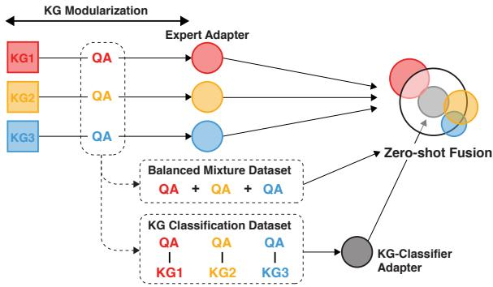
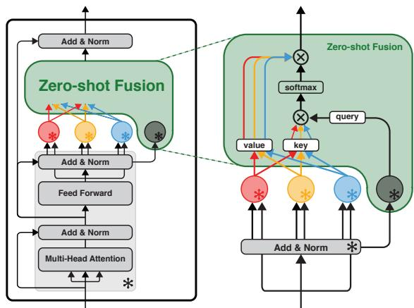
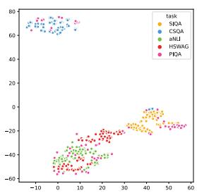
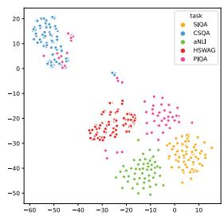
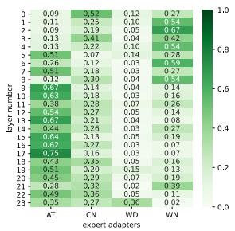
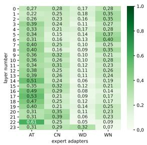
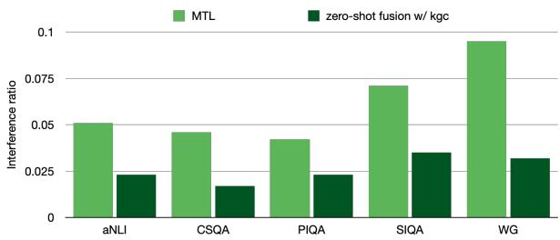
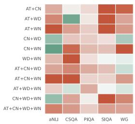
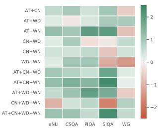
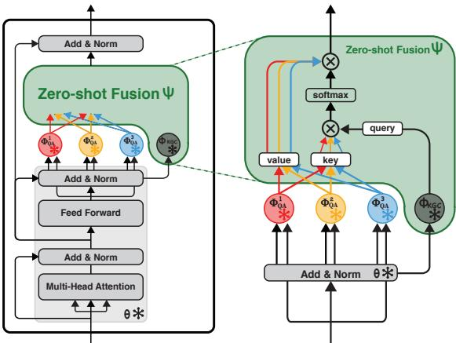

# Modularized Transfer Learning with Multiple Knowledge Graphs for Zero-shot Commonsense Reasoning

Yu Jin Kim1, Beong-woo Kwak1, Youngwook Kim1, Reinald Kim Amplayo2∗

Seung-won Hwang3 and Jinyoung Yeo1†

1Yonsei University, Seoul, Korea 2Google Research, London, UK

3Seoul National University, Seoul, Korea

{yujin000731, beongwoo.kwak, youngwook, jinyeo}@yonsei.ac.kr reinald@google.com, seungwonh@snu.ac.kr

## Abstract

Commonsense reasoning systems should be able to generalize to diverse reasoning cases. However, most state-of-the-art approaches depend on expensive data annotations and overfit to a specific benchmark without learning how to perform general semantic reasoning. To overcome these drawbacks, zero-shot QA systems have shown promise as a robust learning scheme by transforming a commonsense knowledge graph (KG) into synthetic QAform samples for model training. Considering the increasing type of different commonsense KGs, this paper aims to extend the zero-shot transfer learning scenario into multiple-source settings, where different KGs can be utilized synergetically. Towards this goal, we propose to mitigate the loss of knowledge from the interference among the different knowledge sources, by developing a modular variant of the knowledge aggregation as a new zero-shot commonsense reasoning framework. Results on five commonsense reasoning benchmarks demonstrate the efficacy of our framework, improving the performance with multiple KGs.

## 1 Introduction

The ability to understand natural language through commonsense reasoning is one of the core focuses in the field of natural language processing. To measure and study the different aspects of commonsense reasoning, several datasets are developed, such as SocialIQA (Sap et al., 2019b), CommonsenseQA (Talmor et al., 2018), and PhysicalIQA (Bisk et al., 2020), each requiring different type of commonsense knowledge (e.g., social, taxonomic, causal, declarative, etc) to select the correct answer. While large-scale neural systems (Devlin et al., 2018; Yang et al., 2019; Liu et al., 2019b) have shown human-level accuracy on these benchmarks, recent studies (Mitra et al., 2019) also criticize that these models solve individual datasets, rather than learning how to perform general semantic reasoning. To this end, Ma et al. (2021) suggested zero-shot evaluation as a genuine measure for the reasoning capability of the machine.

Inspired by this new metric, in this work, we focus on building unsupervised zero-shot multiplechoice QA systems. That is, we target an arbitrary commonsense reasoning task where conventional approaches (that rely heavily on task-specific supervision) are not applicable to such zero-shot learning scenarios. To learn QA models without expensive annotation efforts, recent works (Ma et al., 2021; Banerjee and Baral, 2020; Malaviya et al., 2020) propose to generate a synthetic QA dataset using a commonsense KG such as ATOMIC (Sap et al., 2019a) and ConceptNet (Speer et al., 2017). Such an approach mostly focuses only on one specific type of reasoning relations (e.g., if-then relation, or declarative relation), neglecting the fact that real-world QA systems require simultaneously considering different types of reasoning abilities (e.g., declarative and social, or causal and physical reasoning; Ilievski et al., 2021; Chang et al., 2021).

To consider different types of reasoning, this paper extends ideas from the aforementioned zeroshot learning to the multi-source case such that it benefits from different types of commonsense knowledge on individual KGs. For example, ATOMIC (Sap et al., 2019a) focuses on social commonsense while ConceptNet (Speer et al., 2017) contains conceptual knowledge. A practical approach is multi-task learning (MTL; Caruana, 1997; Liu et al., 2019a), which learns a shared encoder for different synthetic QA datasets from multiple KGs. Despite its effectiveness, MTL scheme suffers from interference among different KGs, which results in forgetting previously learned knowledge when trained on new KG which has different kinds of knowledge (Pilault et al., 2021; Pfeiffer et al., 2021; Wang et al., 2021a; Wu et al., 2020).

To address these limitations, we propose a novel, modularized framework that aims to learn multiple expert models for KGs, then conduct zero-shot fusion to allow collaboration among KGs. For this purpose, we leverage AdapterFusion (Pfeiffer et al., 2021) where multiple tiny modules between Transformer blocks called adapters (Houlsby et al., 2019) can be combined after independent training, thus allowing a continual integration of the adapters without retraining the entire framework. Specifically, we treat the adapters as different KG-specific experts, and combine them using an attention-like fusion module. To improve the fusion of adapters, we suggest a KG-alignment adapter that guides to the apt expert adapters. Here, we use KGs in three different synthetic supervision training: (1) KG-specific QA datasets to train the KG-specific expert adapters, (2) a KG classification datasets to train the KG-alignment adapter, and (3) a balanced mixture of KG-specific QA datasets to train the fusion module. Our modularized method alleviates the interference between different KGs, which is the pitfall of MTL from our empirical observation, and thus combines multiple KGs into a synergetic zero-shot framework.

Our contributions are: (1) We suggest a simple, yet effective KG modularization strategy for the use of multiple KGs in commonsense reasoning. (2) We then explore the use of AdapterFusion (Pfeiffer et al., 2021) for better knowledge aggregation based on the KG modularization in zero-shot setting. We believe that such modularized transfer learning is critical to using different knowledge sources synergetically against interference between them. (3) In extensive experiments on various commonsense reasoning benchmarks, our framework achieves significant improvements over baselines using a single KG, even using multiple KGs, which implies the robustness in commonsense reasoning.

## 2 Related Work & Preliminaries

## 2.1 Zero-shot Commonsense Reasoning

Many researchers have recently focused on building unsupervised models without any benchmark supervisions (i.e., zero-shot learning). In such zeroshot setting, KGs are often used as an external resource for improving model prior (e.g., continually learned from pre-trained language models) (Banerjee and Baral, 2020; Bosselut and Choi, 2019; Ma et al., 2021), especially for commonsense reasoning, as much existing work couples language models with neural/symbolic commonsense KGs.

However, most of existing work are either assuming the existence of the alignment information between tasks and KGs (Banerjee and Baral, 2020) or an integrated KG (Ma et al., 2021). For example, ATOMIC2020 (Hwang et al., 2021), a commonsense KG which incorporates tuples from ConceptNet and ATOMIC with new relations and further crowdsourcing, combines multiple KGs into a new integrated KG, but as widely known (Ilievski et al., 2020; Hwang et al., 2021), heterogeneous schema between different KGs may limit triplets that can be integrated.1 Rather than such symbolic KG integration with the inevitable loss of knowledge, in this work, we explore the neural KG integration leveraging the multiple KGs without additional processing and alignment information between KG and task.

## 2.2 Transfer Learning with Modular Approaches

The idea of having specialized parameters, or socalled experts, has been widely studied to integrate multiple sources of knowledge via transfer learning. The adapter module (Rebuffi et al., 2017; Houlsby et al., 2019) has been explored as one of such approaches, introducing a small number of task-specific parameters at every layer of pretrained language model (PLM) while sharing the parameters of underlying PLM which is fixed. To address the limitations of transfer learning due to high re-training cost, many works utilize the multiple adapter modules for individual tasks with different domains (Puigcerver et al., 2020; Bapna et al., 2019; Rücklé et al., 2020; Madotto et al., 2021) considering each adapter to be an expert of each domain. Similar to our work, K-Adapter (Wang et al., 2021a) encodes factual and linguistic knowledge to each adapter, but in this paper, we further explore how to mitigate catastrophic forgetting or interference among multiple adapters for better knowledge transfer in zero-shot setting.

## 2.3 Multi-Task Learning

MTL (Liu et al., 2019a; Zhang and Yang, 2017; Caruana, 1997) learns a shared representation while aggregating knowledge across multiple learning tasks, often leading to better generalization ability of a model. However, parametric aggregation of knowledge with MTL has following limitations: (1) retraining the full model when adding new tasks (Houlsby et al., 2019; Pfeiffer et al., 2021, 2020b) (2) catastrophic forgetting and interference between tasks leading to difficulties of solving each task equally well (Pilault et al., 2021; Wu et al., 2020; Yu et al., 2020) and (3) inconsistent effect (Lourie et al., 2021). To deal with these challenges, Mixture-of-Experts (MoE) is a parameterized generalization of ensembling techniques, which has been adapted for MTL with gating network trained to optimize each task (Ma et al., 2018). However, simple linear gating networks are too shallow and thus may destruct task knowledge for commonsense reasoning.

To address this problem, AdapterFusion (Pfeiffer et al., 2021) has been proposed to fuse task specific parameters called adapters for the given target task leveraging attention-like mechanism. AdapterFusion aggregates adapters, which is trained independently for each task, in a non-destructive manner mitigating aforementioned MTL problems such as forgetting and interference between tasks. Recently, it has been used for zero-shot cross-lingual transfer framework (Pfeiffer et al., 2020c; Wang et al., 2021b), which motivates our work to transfer multi-source knowledge with less interference for zero-shot commonsense reasoning.

## 3 Modularized Zero-shot Framework

In our setup, we repurpose synthetic QA generation (Ma et al., 2021) for the task of knowledgedriven zero-shot learning for commonsense reasoning, i.e., we transform a KG into multiple $( Q _ { i } , A _ { i } )$ pairs where $Q _ { i }$ is a natural language question and $A _ { i } = \{ A _ { i , 1 } , . . . , A _ { i , m } \}$ is the set of options with m answer candidates. Specifically, given a triple $( e ^ { h e a d } , r , e ^ { t a i l } )$ in a KG, where $e ^ { h e a d } , e ^ { t a i l }$ and r denote head/tail entity and relation respectively, we transform $e ^ { h e a d }$ and r into a natural language question $Q _ { i }$ using templates. For the option set $A _ { i } ,$ we use the combination of the correct answer $e ^ { t a i l }$ and m 1 distractors which are tail entities from other triples sampled randomly (Ma et al., 2021). Details are described in Appendix B.

Formally, we denote $( Q _ { i } , A _ { i } )$ as one QA sample. The goal is to learn a QA model from the synthetic QA sample. In a downstream task $( e . g .$ reasoning benchmarks such as SocialIQA and CommonsenseQA), we need to predict answers given non-synthetic test samples $( Q ^ { t e s t } , A ^ { t e s t } )$ . In the training stage, we are given K KG-driven datasets $\{ \mathcal { D } _ { Q A } ^ { k } \} _ { k = 1 } ^ { K }$ from K different KGs, where $\mathcal { D } _ { Q A } ^ { k }$ is a dataset with $N _ { k }$ samples for KG k as follows:

<table><tr><td rowspan=1 colspan=1>QA from ATOMIC (Sap et al., 2019a)</td></tr><tr><td rowspan=1 colspan=1>Q: Dana speeds on the highway. Dana is seen asA1: considerate A2: risky(√) A3: lazy</td></tr><tr><td rowspan=1 colspan=1>QA from ConceptNet (Speer et al., 2017)</td></tr><tr><td rowspan=1 colspan=1>Q: pentode is a [MASK]A1: ascocarp A2: girls footwear A3: vacuum tube(√)</td></tr><tr><td rowspan=1 colspan=1>QA from WikiData (Vrandečić and Krötzsch, 2014)</td></tr><tr><td rowspan=1 colspan=1>Q: badminton is a [MASK]A1: fable A2: juvenile justice A3: type of sport(√)</td></tr><tr><td rowspan=1 colspan=1>QA from WordNet (Miller, 1995)</td></tr><tr><td rowspan=1 colspan=1>Q: princewood is part of [MASK]A1: shaddock A2: genus $\mathbf { C o r d i a } ( \checkmark )$ A3: family Columbidae</td></tr></table>

Table 1: Synthetic QA examples. We use templates to convert $( e ^ { \dot { h } e a d } , r )$ into a natural language sentence.

$$
\mathcal { D } _ { Q A } ^ { k } = \{ ( Q _ { i } , A _ { i } , l a b e l ) \} _ { i = 1 } ^ { N _ { k } }\tag{1}
$$

where label is the index of the correct answer for each sample. In this work, as shown in Table 1, we generate four synthetic QA datasets from ATOMIC, ConceptNet, WikiData, and WordNet (More details are in Appendix C).

For effective use of multiple KGs at once with less interference, we present a modularized framework, which is a novel approach to knowledge transfer for the zero-shot setting as shown in Figure 1. As a modular approach, we train the multiple KG-specific adapters (expert adapters) with each dataset from KG. Based on these pre-trained adapters, we use a zero-shot fusion method to aggregate knowledge of each adapter leveraging AdapterFusion (Pfeiffer et al., 2021) as a base architecture with the balanced mixture of each KG dataset. Further, for better knowledge fusion, we suggest a KG-alignment aware adapter (KG-Classifier adapter) as a guide for detecting alignment with given sample in zero-shot reasoning. Here, we utilize KG classification dataset by verifying the synthetic QAs. Algorithm 1 in Appendix outlines the overall process of our proposed framework. We summarize the notations in Appendix A.

## 3.1 KG Modularization

First, we modularize the KGs to preserve their intrinsic knowledge. Considering the importance of using a suitable and well-aligned KG (Ma et al., 2019, 2021) on a downstream task, the subtle difference between each KG should be learned by the model without any interference from each other. Accordingly, we adopt the adapter module (Houlsby et al., 2019) which repurposes a pretrained language model (PLM) to incorporate each

  
Figure 1: Illustration of the proposed modularized framework for zero-shot commonsense reasoning. Each colored square represents different KGs. Not only for KG modularization, we re-use a set of synthetic QA datasets from the multiple KGs for the purpose of KG classification and zero-shot fusion, which enables better knowledge aggregation.

KG as tiny modules in between Transformer blocks. Specifically, as illustrated in Figure 2 (except for green area), the adapter training strategy involves injecting new layers (parameterized by Φ) into the original PLM (parameterized by θ). The weights of the original PLM are untouched, while the new adapter layers are initialized at random. Formally, we call each adapter trained with $\mathcal { D } _ { Q A } ^ { k }$ as an expert adapter for KG $k ,$ parameterized by $\Phi _ { Q A } ^ { k }$

When a QA sample $( Q _ { i } , A _ { i } )$ is given for dataset $\mathcal { D } _ { Q A } ^ { k }$ , we first concatenate question $Q _ { i }$ and each answer option $A _ { i } = \{ A _ { i , 1 } , . . . , A _ { i , m } \}$ to generate input sequences $T _ { i } = \{ T _ { i , 1 } , . . . , T _ { i , m } \}$ . Then, we compute a score $S _ { i , j }$ (Ma et al., 2021) for the answer candidate $A _ { i , j }$ is computed as follows:

$$
S _ { i , j } = - \frac { 1 } { | T _ { i , j } | } \sum _ { t = 1 } ^ { | T _ { i , j } | } l o g P ( w _ { t } | . . . w _ { t - 1 } , w _ { t + 1 } . . . ; \theta , \Phi )\tag{2}
$$

where wt is a word token in the sequence $T _ { i , j }$ and P is the conditional probability from Transformer blocks parameterized by θ and Φ. To train the adapter $\Phi _ { Q A } ^ { k }$ , we use the marginal ranking loss (Ma et al., 2021) as follows:

$$
\mathcal { L } _ { Q A } = \frac { 1 } { m } \sum _ { i = 1 } ^ { N _ { k } } \sum _ { j = 1 \atop j \neq l a b e l } ^ { m } m a x ( 0 , \eta - S _ { i , l a b e l } + S _ { i , j } )\tag{3}
$$

where η represents the margin.

$$
\Phi _ { Q A } ^ { k }  \underset { \Phi } { \operatorname { a r g m i n } } \mathcal { L } _ { Q A } ( \mathcal { D } _ { Q A } ^ { k } ; \theta , \Phi )\tag{4}
$$

where KG-invariant parameters θ are fixed and only KG-dependent parameters $\Phi _ { Q A } ^ { k }$ are learned, which enables to store the corresponding knowledge separately without any interference. Further, we can parallelize the training of adapter for all KGs. The efficiency of adapter training allows our modularization to be more scalable.

## 3.2 Zero-shot Fusion

Once the expert adapters are learned, we combine the knowledge from each expert adapter using an attention-like mechanism. We present a novel fusion strategy as shown in Figure 2, which is referred to as the zero-shot fusion. In contrast to Adapter-Fusion (Pfeiffer et al., 2021) where the focus is learning to transfer knowledge to a specific target task, our zero-shot fusion aims to generalize this transfer to any arbitrary target task. Specifically, the zero-shot fusion parameters Ψ learn to combine fixed expert adapters which are parameterized by $\Phi _ { Q A } ^ { 1 } , . . . , \Phi _ { Q A } ^ { K }$ . In each Transformer layer l of PLM with the injected fusion layer, the zero-shot fusion parameters $\Psi _ { Q A }$ consist of query, key, and value matrices, denoted by $\mathbf { W } _ { l } ^ { Q } , \mathbf { W } _ { l } ^ { K }$ , and $\mathbf { W } _ { l } ^ { V }$ respectively. These parameters are used to learn the balancing between the representation of each expert adapters through attention-like mechanism. While fixing both the parameters θ and all expert adapters $\Phi _ { Q A } ^ { 1 } , . . . , \Phi _ { Q A } ^ { K }$ , the only trainable weights $\Psi _ { Q A }$ on the fusion layer learns to combine the knowledge from different K expert adapters by using the subset of $\{ \mathcal { D } _ { Q A } ^ { k } \} _ { k = 1 } ^ { K }$ by random sampling. Here, we balance the ratio between the K knowledge-driven datasets as N samples (details are in Appendix D). Formally,

$$
\Psi _ { Q A }  \underset { \Psi } { \mathrm { a r g m i n } } \sum _ { k = 1 } ^ { K } \mathcal { L } _ { Q A } ( \mathcal { D } _ { Q A } ^ { k } ; \boldsymbol { \theta } , \{ \Phi _ { Q A } ^ { k } \} _ { k = 1 } ^ { K } , \Psi )\tag{5}
$$

where Ψ refers to the initialized zero-shot fusion parameters.

More specifically, in the l-th Transformer layer, let $h _ { P L M } ^ { l }$ and $h _ { E } ^ { k , \tilde { l } }$ be the representations of underlying PLM parameterized by θ and an expert adapter parameterized by $\Phi _ { Q A } ^ { k } ,$ respectively. Then, using the hidden representation $h _ { P L M } ^ { l }$ of PLM as a query, the fusion layer performs the attention-like function as follows:

$$
\mathbf { K } _ { l } , \mathbf { V } _ { l } = [ h _ { E } ^ { 1 , l } , . . . , h _ { E } ^ { K , l } ]\tag{6}
$$

$$
\mathbf { Q } _ { l } = h _ { P L M } ^ { l }\tag{7}
$$

$$
\mathbf { z } _ { l } = \mathrm { A t t e n t i o n } ( \mathbf { Q } _ { l } \mathbf { W } _ { l } ^ { Q } , \mathbf { K } _ { l } \mathbf { W } _ { l } ^ { K } , \mathbf { V } _ { l } \mathbf { W } _ { l } ^ { V } )\tag{8}
$$

  
Figure 2: Illustration of the zero-shot fusion architecture with KG-Classifier adapter. Each colored circle represents expert adapters, except the black circle which denotes KG-Classifier adapter. indicates the fixed layer. Details are in Appendix F

where $\mathbf { z } _ { l }$ is passed to the next Transformer layer. Given a sample, the zero-shot fusion learns the suitable balancing parameters between the expert adapters for zero-shot reasoning. Eventually, it learns to identify generalizability across commonsense reasoning tasks.

## 3.3 KG-Classifier Adapter

AdapterFusion uses the PLM hidden representation $h _ { P L M } ^ { l }$ as a query which is learned when training on a specific downstream task. In our zero-shot setting, however, we use a mixture of synthetic QA for fusion training, which is not exactly a training dataset for a downstream task. To compensate for this issue, we present KG-Classifier adapter, which is a KG alignment-aware adapter, which is motivated from the fact that the ability to find which KG has an alignment with the given sample can be helpful as a role of providing a guidance for better performance (Ma et al., 2019, 2021).

Specifically, we propose a novel training task for KG-Classifier adapter, which requires predicting the KG for the given sample of the task. For that, given $\{ \mathcal { D } _ { Q A } ^ { k } \} _ { k = 1 } ^ { K }$ , we first transform a QA sample $( Q _ { i } , A _ { i } )$ into a new KG classification sample $\left[ Q _ { i } ; A _ { i , l a b e l } \right]$ where [; ] is the concatenation. Then, we obtain a new label $y _ { i } ~ \in ~ \{ 0 , 1 \} ^ { K }$ indicating the corresponding KG source. The samples are in Appendix E. Formally, KG classification dataset $\mathcal { D } _ { K G C }$ is defined as:

$$
\mathcal { D } _ { K G C } = \{ ( [ Q _ { i } ; A _ { i , l a b e l } ] , y _ { i } ) \} _ { i = 1 } ^ { M }\tag{9}
$$

where M is the total size of $\{ \mathcal { D } _ { Q A } ^ { k } \} _ { k = 1 } ^ { K }$

Based on $\mathcal { D } _ { K G C }$ , we learn the KG-Classifier adapter parameterized by θ and $\Phi _ { K G C }$ . First, a classification sample i is encoded into $h _ { C L S } \in$ $\mathbb { R } ^ { H }$ then scored as $\hat { y } _ { i } \in \mathbb { R } ^ { K }$ with a linear layer $W _ { K G C } \in \mathbb { R } ^ { K \times H } , i . e . , \hat { y } _ { i } = W _ { K G C } h _ { C L S }$ . Once $\hat { y } _ { i }$ is normalized by a softmax layer, the network is trained to minimize the cross-entropy loss $\mathcal { L } _ { K G C }$ between the prediction $\hat { y } _ { i }$ and its ground truth yi:

$$
\Phi _ { K G C }  \underset { \Phi } { \mathrm { a r g m i n } } \sum _ { i = 1 } ^ { M } \mathcal { L } _ { K G C } ( y _ { i } , \hat { y } _ { i } ; \theta , \Phi )\tag{10}
$$

We propose to use the representation of KG-Classifier adapter as a query in attention-like mechanism, referred to as the zero-shot fusion with KG-Classifier adapter. That is, using the hidden representation $h _ { K G C } ^ { l }$ of a KG-Classifier adapter parameterized by ΦKGC as a query, we substitute $\mathbf { Q } _ { l }$ in Eq. (11) as follows:

$$
\mathbf { Q } _ { l } = h _ { K G C } ^ { l }\tag{11}
$$

The overall zero-shot fusion architecture including KG-Classifier is illustrated in Figure 2.

## 4 Experiments

In this section we evaluate the efficacy of our framework on five commonsense reasoning tasks. We denote KG-Classifier adapter by KG-C adapter.

## 4.1 Experimental Settings

All our experiments are conducted in a zero-shot setting, in which the models do not have access to the official training data or labels of the benchmark. For the evaluation, we use the validation set of each benchmark2, however, the validation set of each benchmark can be role as an test set since it is not used for hyperparameter tuning or model selection. We use accuracy as a metric.

## 4.1.1 Benchmarks

We evaluate our proposed framework on five question-answering benchmarks for commonsense reasoning: SocialIQA (SIQA) (Sap et al., 2019b), CommonsenseQA (CSQA) (Talmor et al., 2018), Abductive NLI (a-NLI) (Bhagavatula et al., 2020), PhysicalIQA (PIQA) (Bisk et al., 2020), and Wino-Grande (WG) (Sakaguchi et al., 2020). Each commonsense benchmark evaluates a specific kind of knowledge: social commonsense for SIQA, concept-level commonsense for CSQA, abductive reasoning for a-NLI, physical commonsense for PIQA, and pronoun resolution ability for WG.3 The details are presented in Appendix G.

<table><tr><td>Model</td><td>KG</td><td>a-NLI</td><td>CSQA</td><td>PIQA</td><td>SIQA</td><td>WG</td><td>Avg.</td></tr><tr><td>Random</td><td></td><td>50.0</td><td>20.0</td><td>50.0</td><td>33.3</td><td>50.0</td><td>40.7</td></tr><tr><td>Majority</td><td></td><td>50.8</td><td>20.9</td><td>50.5</td><td>33.6</td><td>50.4</td><td>41.2</td></tr><tr><td>GPT2-L</td><td></td><td>56.5</td><td>41.4</td><td>68.9</td><td>44.6</td><td>53.2</td><td>52.9</td></tr><tr><td>RoBERTa-L</td><td></td><td>65.5</td><td>45.0</td><td>67.6</td><td>47.3</td><td>57.5</td><td>56.6</td></tr><tr><td>Self-talk (Shwartz et al., 2020)</td><td></td><td></td><td>32.4</td><td>70.2</td><td>46.2</td><td>54.7</td><td></td></tr><tr><td>COMET-DynaGen (Bosselut and Choi, 2019)</td><td>AT</td><td></td><td></td><td></td><td>50.1</td><td></td><td></td></tr><tr><td>SMLM (Banerjee and Baral, 2020)</td><td>*</td><td>65.3</td><td>38.8</td><td>一</td><td>48.5</td><td></td><td></td></tr><tr><td>RoBERTa-L (MR) (Ma et al., 2021)</td><td>AT</td><td>70.8</td><td>64.2</td><td>72.1</td><td>63.1</td><td>59.2</td><td>65.9</td></tr><tr><td>RoBERTa-L (MR) (Ma et al., 2021)</td><td>CN,WD,WN</td><td>70.0</td><td>67.9</td><td>72.0</td><td>54.8</td><td>59.4</td><td>64.8</td></tr><tr><td>RoBERTa-L (MR) (Ma et al., 2021)</td><td>Whole</td><td>70.5</td><td>67.4</td><td>72.4</td><td>63.2</td><td>60.9</td><td>66.9</td></tr><tr><td>MTL</td><td>Whole</td><td>69.8 (± 0.5)</td><td>66.0 (± 0.9)</td><td>71.2 (± 0.8)</td><td>62.2 (± 1.0)</td><td>59.5 (± 0.2)</td><td>65.7</td></tr><tr><td>zero-shot fusion w/o KG-C adapter</td><td>Whole</td><td>72.3(±0.4)</td><td>67.9(±0.2)</td><td>73.1(±0.4)</td><td>65.9(±0.5)</td><td>59.7(±0.2)</td><td>67.8</td></tr><tr><td>zero-shot fusion w/ KG-C adapter</td><td>Whole</td><td>72.5(±0.2)</td><td>68.2(±0.2)</td><td>72.9(±0.4)</td><td>66.6(±0.1)</td><td>60.8(±0.1)</td><td>68.2</td></tr></table>

Table 2: Zero-shot evaluation results with different combinations of models and knowledge sources across five commonsense tasks. AT, CN, WD and WN represent ATOMIC, ConceptNet, WikiData and WordNet, respectively. Whole represents the combination of AT, CN, WD and WN. Bold text indicates the best performance on each benchmark. RoBERTa-L (MR) used the synthetic dataset after filtering, while we use the raw version. SMLM (\*) used different KG which has strong alignment with each task (e.g.AT for SIQA).

## 4.1.2 Baselines

We compare our framework with the following baselines. First, to show the characteristics of each benchmark, we use the random or the most frequent label as Random and Majority baseline, respectively. RoBERTa-L and GPT2-L is the performance of each PLM without any finetuning. Also, as the baseline for the unsupervised learning model using KGs, we report the performance of Self-talk (Shwartz et al., 2020), COMET-DynaGen (Bosselut and Choi, 2019), SMLM (Banerjee and Baral, 2020) as presented in original papers.

For further analysis in 4.4 and 4.5, we set the following models that are pre-trained on the synthetic QA datasets from KGs as baselines:

• Single-Task Learning (STL): The model is pre-trained on a synthetic QA dataset generated from a single KG. Specifically, we experiment two architectural choices: PLM (STL-PLM) and PLM with adapters (STL-Adapter). For each architecture, there are four STL models for each of synthetic QA datasets derived from ATOMIC, ConceptNet, WikiData, and WordNet. We note that the trained STL-Adapter is an expert adapter from a specific KG in our framework. The performance of each STL baseline is shown in Appendix I Table 9 and Table 10.

• Multi-Task Learning (MTL): The model is pre-trained on multiple synthetic QA datasets, each of which is generated from a KG. We experiment with a PLM trained on all four aforementioned synthetic QA datasets. We note that the difference between STL-PLM and MTL is whether to use one synthetic QA dataset or multiple synthetic QA datasets for its training.

## 4.1.3 Implementations

We employ RoBERTa-L (Liu et al., 2019b) from Hugging Face’s transformers toolkit for all experiments. We follow the default settings from Ma et al. (2021). Our implementation uses Adapter (Houlsby et al., 2019) and AdapterFusion (Pfeiffer et al., 2021) as a base model architecture from AdpaterHub (Pfeiffer et al., 2020a). We run our experiments with three different random seeds. The implementation details are described in Appendix H.

## 4.2 Main Results

Table 2 shows the zero-shot evaluation results on five benchmark datasets. Generally, zero-shot fusion scores higher than the baselines across all benchmarks, and further, zero-shot fusion shows the best performance in all benchmarks except WG. We note that although Ma et al. (2021) uses the synthetic QA dataset after sample filtering, our method achieves comparable performance with the best performance in WG, even with the raw dataset. Also, the average score of all evaluation benchmarks (the last column of Table 2) shows that zero-shot fusion has generalisability in commonsense reasoning.

In addition, zero-shot fusion achieves consistent improvements over MTL. These results indicate that our proposed zero-shot fusion method attributes to fusing the knowledge of multiple KGs more synergetically regardless of the task.

Moreover, as an ablation, we compare the zeroshot fusion with and without KG-C adapter to explore the efficacy of the KG-C adapter. We can observe that zero-shot fusion with KG-C adapter improves the average accuracy by 0.4%, which implies that the use of KG-C adapter improves the overall performance and makes our method generalize better on most of the evaluation benchmarks.

## 4.3 Impact of the KG-Classifier Adapter

To assess the effects of the KG-C adapter itself, we visualize and compare the final layer [CLS] token representation between PLM and KG-C adapter. Figure 3 shows t-SNE (Van der Maaten and Hinton, 2008) plots of all representation of five benchmark datasets. In this figure, every sample is mapped into a 1024-dimensional feature space through RoBERTa-L model and projected back into a twodimensional plane by t-SNE. We can observe that KG-C adapter can separate the samples of different benchmarks well despite being unseen data. It verifies that KG-awareness acquired with the KG classification task is beneficial to categorize the given sample. The KG-C adapter can thus generate a relevant KG-aware query for a given sample and help to fuse representations from suitable expert adapters in our proposed framework.

Further, we explore how the KG-C adapter affects zero-shot fusion which is based on an attention-like mechanism (Pfeiffer et al., 2021) compared to zero-shot fusion without KG-C adapter. Here, while zero-shot fusion without KG-C adapter simply uses the representation of PLM as a query, zero-shot fusion with KG-C adapter leverages the representation of KG-C adapter. To illustrate this strength, we visualize the attention probability of [CLS] token from each fusion layer as a representative in Figure 4. The column of the darker cell indicates the adapter that has the bigger influence on the fused representation. We can observe that zero-shot fusion with KG-C adapter fuses the knowledge from different experts with a subtle difference rather than focusing on a single expert severely. This implies that KG-C adapter enables the delicate balancing between multiple knowledge sources based on the KG-alignment awareness, which leads to performance improvements in commonsense reasoning tasks. Interestingly, both cases have the ability not to focus on the expert adapter based on WikiData, which can be seen as a redundant expert.4 This observation would benefit from the further study that explores the optimal combination of KGs by expert selection or rejection.

  
(a) PLM

  
(b) KG-Classifier adapter

Figure 3: t-SNE visualization of the hidden representation from (a) PLM and (b) KG-C adapter. Each color denotes the five different benchmark samples.  
  
(a) w/o KG-C adapter

  
(b) w/KG-C adapter  
Figure 4: Comparison of attention probability between zero-shot fusion with/without KG-C adapter. The xand y-axis indicate expert adapters and the fusion layer number in RoBERTa-L, respectively. The darker color indicates higher attention probability in fusion layer.

## 4.4 Mitigating Interference

In this experiment, we compare the amount of interference in the MTL and zero-shot fusion with KG-C adapter. We propose a novel evaluation metric, the interference ratio, which is the percentage of the incorrectly predicted samples by the multi-KG models among the correctly predicted samples from the STL models in common.

Using the interference ratio, we can precisely compare the negative effects of multi-KG models on knowledge aggregation since the only reason to get the correct samples wrong is the interference caused by learning with additional KGs. We present the interference ratio of the models on five benchmark datasets in Figure 5. This figure shows that MTL has the higher interference ratio than the competing models across all benchmarks. Our method achieves a substantially better ratio, especially when KG-C adapter is used. This demonstrates the efficacy of our framework in mitigating interference between knowledge, which is one of the major problems of MTL.

  
Figure 5: Interference ratio of multi-KG models on five benchmarks. The lower indicates less interference.

## 4.5 Visualization of Knowledge Aggregation

To verify the ability of our model to aggregate different types of KGs, we compare the relative performance gains of MTL and zero-shot fusion with KG-C adapter when increasing the number of KGs. The performance of all KG-combinations for each framework is presented in Table 9 and Table 10. We visualize the improvement of performance for five benchmark development sets, leveraging heatmaps in Figure 6. Here, for the sake of brevity, we denote our framework with KG-C adapter as our method.

For MTL in Figure 6 (a), the color of the cell denotes the relative improvement of MTL with the combination of KGs over the best performance among the STL-PLM of KGs. Also, for our method in Figure 6 (b), the relative improvement is measured based on the best performance among the STL-Adapter of KGs, considering the difference of the base architecture for MTL (i.e. PLM) and zeroshot fusion (i.e. PLM with adapter). The green and red colors denote the increase and decrease of performance, respectively, when using multiple KGs together. The greener color on the cells indicates that the approach benefits from an increasing number of KGs, which implies aggregating knowledge successfully.

In Figure 6, while the MTL tends to show the decrease of the performance when more KGs are utilized for training, our method obtains relative performance improvement across most of benchmarks. In both framework, the slightly degraded performance of the combination of KGs without ATOMIC could be due to the strong alignment between ATOMIC and SIQA. Except for the above case, we can observe that as more KGs are leveraged, the color of the cell gets greener, which implies that our method gains more advantages for better performance. This demonstrates that our method enables knowledge aggregation for multiple KGs synergetically.

  
(a) MTL

  
(b) zero-shot fusion  
w/ KG-C adapter  
Figure 6: Relative improvement upon the STL on five benchmarks. The x- and y-axis indicate the benchmark and the combination of the KGs, respectively. The value of each cell indicates the relative performance improvement of using multiple KGs over the highest performance among STLs. The green and red colors denote the improvement or decrease of relative performance, respectively.

## 5 Conclusion

Despite the existence of various types of commonsense KGs, utilizing multiple KGs has not been explored enough in the commonsense reasoning field. Motivated by this, this paper proposes a modularized transfer learning framework to fuse the knowledge from multiple KGs efficiently for zero-shot commonsense reasoning. Our framework consists of KG modularization for expert adapter, zero-shot fusion and KG-Classifier adapter. Extensive experiments show that our framework obtains strong improvements over MTL on five commonsense reasoning benchmarks.

In the future, our work can be extended to adapt our methods to further various multiple KGs with studies of appropriate scale for KG modularization. In addition, based on our hypothesis that the existence of an optimal combination, we can explore the study for the optional use of modularized KG experts for the best transfer learning.

## Acknowledgements

This work was partly supported by Institute of Information & communications Technology Planning & Evaluation (IITP) grant funded by the Korea government (MSIT) (No. 2020-0-01361, Artificial Intelligence Graduate School Program (Yonsei University)) and (No. 2022-0-00077, AI Technology Development for Commonsense Extraction, Reasoning, and Inference from Heterogeneous Data) and the National Research Foundation of Korea (NRF) grant funded by the Korea government (MSIT) (No. 2021-11-1055). Jinyoung Yeo is a corresponding author.

## References

Pratyay Banerjee and Chitta Baral. 2020. Selfsupervised knowledge triplet learning for zero-shot question answering. EMNLP.

Ankur Bapna, Naveen Arivazhagan, and Orhan Firat. 2019. Simple, scalable adaptation for neural machine translation. EMNLP.

Chandra Bhagavatula, Ronan Le Bras, Chaitanya Malaviya, Keisuke Sakaguchi, Ari Holtzman, Hannah Rashkin, Doug Downey, Wen tau Yih, and Yejin Choi. 2020. Abductive commonsense reasoning. ICLR.

Yonatan Bisk, Rowan Zellers, Ronan Le bras, Jianfeng Gao, and Yejin Choi. 2020. Piqa: Reasoning about physical commonsense in natural language. In AAAI.

Antoine Bosselut and Yejin Choi. 2019. Dynamic knowledge graph construction for zero-shot commonsense question answering. arXiv e-prints, pages arXiv–1911.

Rich Caruana. 1997. Multitask learning. Machine learning, 28(1):41–75.

Ting-Yun Chang, Yang Liu, Karthik Gopalakrishnan, Behnam Hedayatnia, Pei Zhou, and Dilek Hakkani-Tur. 2021. Incorporating commonsense knowledge graph in pretrained models for social commonsense tasks. EMNLP-Workshop.

Jacob Devlin, Ming-Wei Chang, Kenton Lee, and Kristina Toutanova. 2018. Bert: Pre-training of deep bidirectional transformers for language understand ing. arXiv preprint arXiv:1810.04805.

Neil Houlsby, Andrei Giurgiu, Stanislaw Jastrzebski, Bruna Morrone, Quentin De Laroussilhe, Andrea Gesmundo, Mona Attariyan, and Sylvain Gelly. 2019. Parameter-efficient transfer learning for nlp. In PMLR, pages 2790–2799. PMLR.

Jena D Hwang, Chandra Bhagavatula, Ronan Le Bras, Jeff Da, Keisuke Sakaguchi, Antoine Bosselut, and Yejin Choi. 2021. Comet-atomic 2020: On symbolic and neural commonsense knowledge graphs.

Filip Ilievski, Alessandro Oltramari, Kaixin Ma, Bin Zhang, Deborah L McGuinness, and Pedro Szekely. 2021. Dimensions of commonsense knowledge. Knowledge-Based Systems.

Filip Ilievski, Pedro Szekely, Jingwei Cheng, Fu Zhang, and Ehsan Qasemi. 2020. Consolidating commonsense knowledge. arXiv preprint arXiv:2006.06114.

Xiaodong Liu, Pengcheng He, Weizhu Chen, and Jianfeng Gao. 2019a. Multi-task deep neural networks for natural language understanding. ACL.

Yinhan Liu, Myle Ott, Naman Goyal, Jingfei Du, Mandar Joshi, Danqi Chen, Omer Levy, Mike Lewis, Luke Zettlemoyer, and Veselin Stoyanov. 2019b. Roberta: A robustly optimized bert pretraining approach. arXiv preprint arXiv:1907.11692.

Nicholas Lourie, Ronan Le Bras, Chandra Bhagavatula, and Yejin Choi. 2021. Unicorn on rainbow: A universal commonsense reasoning model on a new multitask benchmark. arXiv preprint arXiv:2103.13009.

Jiaqi Ma, Zhe Zhao, Xinyang Yi, Jilin Chen, Lichan Hong, and Ed H Chi. 2018. Modeling task relationships in multi-task learning with multi-gate mixtureof-experts. In ACM SIGKDD.

Kaixin Ma, Jonathan Francis, Quanyang Lu, Eric Nyberg, and Alessandro Oltramari. 2019. Towards generalizable neuro-symbolic systems for commonsense question answering. EMNLP.

Kaixin Ma, Filip Ilievski, Jonathan Francis, Yonatan Bisk, Eric Nyberg, and Alessandro Oltramari. 2021. Knowledge-driven data construction for zero-shot evaluation in commonsense question answering.

Andrea Madotto, Zhaojiang Lin, Yejin Bang, and Pascale Fung. 2021. The adapter-bot: All-in-one controllable conversational model.

Chaitanya Malaviya, Chandra Bhagavatula, Antoine Bosselut, and Yejin Choi. 2020. Commonsense knowledge base completion with structural and semantic context. In AAAI.

George A Miller. 1995. Wordnet: a lexical database for english. Communications of the ACM.

Arindam Mitra, Pratyay Banerjee, Kuntal Kumar Pal, Swaroop Mishra, and Chitta Baral. 2019. Exploring ways to incorporate additional knowledge to improve natural language commonsense question answering. arXiv preprint arXiv:1909.08855.

Jonas Pfeiffer, Aishwarya Kamath, Andreas Rücklé, Kyunghyun Cho, and Iryna Gurevych. 2021. Adapterfusion: Non-destructive task composition for transfer learning. EACL.

Jonas Pfeiffer, Andreas Rücklé, Clifton Poth, Aishwarya Kamath, Ivan Vulic, Sebastian Ruder,´ Kyunghyun Cho, and Iryna Gurevych. 2020a. Adapterhub: A framework for adapting transformers.

Jonas Pfeiffer, Edwin Simpson, and Iryna Gurevych. 2020b. Low resource multi-task sequence tagging– revisiting dynamic conditional random fields. arXiv preprint arXiv:2005.00250.

Jonas Pfeiffer, Ivan Vulic, Iryna Gurevych, and Sebas-´ tian Ruder. 2020c. Mad-x: An adapter-based framework for multi-task cross-lingual transfer. arXiv preprint arXiv:2005.00052.

Jonathan Pilault, Amine Elhattami, and Christopher Pal. 2021. Conditionally adaptive multi-task learning: Improving transfer learning in nlp using fewer parameters & less data. ICLR.

Joan Puigcerver, Carlos Riquelme, Basil Mustafa, Cedric Renggli, André Susano Pinto, Sylvain Gelly, Daniel Keysers, and Neil Houlsby. 2020. Scalable transfer learning with expert models. arXiv preprint arXiv:2009.13239.

Sylvestre-Alvise Rebuffi, Hakan Bilen, and Andrea Vedaldi. 2017. Learning multiple visual domains with residual adapters. arXiv preprint arXiv:1705.08045.

Andreas Rücklé, Jonas Pfeiffer, and Iryna Gurevych. 2020. Multicqa: Zero-shot transfer of selfsupervised text matching models on a massive scale. EMNLP.

Keisuke Sakaguchi, Ronan Le Bras, Chandra Bhagavatula, and Yejin Choi. 2020. Winogrande: An adversarial winograd schema challenge at scale. In AAAI.

Maarten Sap, Ronan Le Bras, Emily Allaway, Chandra Bhagavatula, Nicholas Lourie, Hannah Rashkin, Brendan Roof, Noah A Smith, and Yejin Choi. 2019a. Atomic: An atlas of machine commonsense for if-then reasoning. In AAAI.

Maarten Sap, Hannah Rashkin, Derek Chen, Ronan Le-Bras, and Yejin Choi. 2019b. Socialiqa: Commonsense reasoning about social interactions. EMNLP.

Vered Shwartz, Peter West, Ronan Le Bras, Chandra Bhagavatula, and Yejin Choi. 2020. Unsupervised commonsense question answering with selftalk. EMNLP.

Robyn Speer, Joshua Chin, and Catherine Havasi. 2017. Conceptnet 5.5: An open multilingual graph of general knowledge. In AAAI.

Alon Talmor, Jonathan Herzig, Nicholas Lourie, and Jonathan Berant. 2018. Commonsenseqa: A question answering challenge targeting commonsense knowledge. NAACL.

Laurens Van der Maaten and Geoffrey Hinton. 2008. Visualizing data using t-sne. JMLR.

Denny Vrandeciˇ c and Markus Krötzsch. 2014. Wiki-´ data: a free collaborative knowledgebase. ACM.

Ruize Wang, Duyu Tang, Nan Duan, Zhongyu Wei, Xuanjing Huang, Jianshu Ji, Guihong Cao, Daxin Jiang, and Ming Zhou. 2021a. K-adapter: Infusing knowledge into pre-trained models with adapters. ACL.

Xinyi Wang, Yulia Tsvetkov, Sebastian Ruder, and Graham Neubig. 2021b. Efficient test time adapter ensembling for low-resource language varieties.

Sen Wu, Hongyang R Zhang, and Christopher Ré. 2020. Understanding and improving information transfer in multi-task learning. ICLR.

Zhilin Yang, Zihang Dai, Yiming Yang, Jaime Carbonell, Russ R Salakhutdinov, and Quoc V Le. 2019. Xlnet: Generalized autoregressive pretraining for language understanding. NIPS.

Tianhe Yu, Saurabh Kumar, Abhishek Gupta, Sergey Levine, Karol Hausman, and Chelsea Finn. 2020. Gradient surgery for multi-task learning. NIPS.

Rowan Zellers, Yonatan Bisk, Roy Schwartz, and Yejin Choi. 2018. Swag: A large-scale adversarial dataset for grounded commonsense inference. EMNLP.

Rowan Zellers, Ari Holtzman, Yonatan Bisk, Ali Farhadi, and Yejin Choi. 2019. Hellaswag: Can a machine really finish your sentence? ACL.

Yu Zhang and Qiang Yang. 2017. A survey on multitask learning. arXiv preprint arXiv:1707.08114.

## A List of Notations

We summarize the notations used in this paper in Table 7.

## B Synthetic QA

We generate QA for four KGs (ATOMIC, ConceptNet, WikiData and WordNet) based on synthetic QA generation (Ma et al., 2021) without sample filtering. We use the prefixes for relation of triplet as shown in Table 3 for generating synthetic QA (refer to Ma et al. (2021)). Table 4 shows the statistics of the synthetic QA dataset from KGs. The samples of synthetic QA with source triplet are shown in Table 5.

<table><tr><td>relation</td><td>prefix</td></tr><tr><td>xAttr</td><td>. PersonX is seen as</td></tr><tr><td>xIntent</td><td>. Before, PersonX wanted</td></tr><tr><td>xNeed</td><td>. Before, PersonX needed to</td></tr><tr><td>xReact</td><td>. As a result, PersonX felt</td></tr><tr><td>xWant</td><td>. As a result, PersonX wanted to</td></tr><tr><td>xEffect</td><td>. PersonX then</td></tr><tr><td>oReact</td><td>. As a result, others felt</td></tr><tr><td>oWant</td><td>. As a result, others wanted to</td></tr><tr><td>oEffect</td><td>. Others then</td></tr><tr><td>Causes</td><td>can cause [MASK]</td></tr><tr><td>UsedFor</td><td>can be used for [MASK]</td></tr><tr><td>CapableOf</td><td>is capable of [MASK]</td></tr><tr><td>CausesDesire</td><td>causes desire for [MASK]</td></tr><tr><td>IsA.</td><td>is a [MASK]</td></tr><tr><td>SymbolOf</td><td>is a symbol of [MASK]</td></tr><tr><td>MadeOf</td><td>can be made of [MASK]</td></tr><tr><td>LocatedNear</td><td>is often located near [MASK]</td></tr><tr><td>Desires</td><td>desires [MASK]</td></tr><tr><td>AtLocation</td><td>can be found at [MASK]</td></tr><tr><td>HasProperty</td><td>has property [MASK]</td></tr><tr><td>PartOf</td><td>is part of [MASK]</td></tr><tr><td>HasFirstSubevent</td><td>starts by [MASK]</td></tr><tr><td>HasLastSubevent</td><td>ends by [MASK]</td></tr></table>

Table 3: Prefixes used for synthetic QA dataset

<table><tr><td>KG</td><td>Train</td><td>Validation</td><td>Total</td></tr><tr><td>ATOMIC</td><td>534,833</td><td>60,289</td><td>595,122</td></tr><tr><td>ConceptNet</td><td>363,645</td><td>19,140</td><td>382,785</td></tr><tr><td>WikiData</td><td>42,342</td><td>2,229</td><td>44,571</td></tr><tr><td>WordNet</td><td>256,922</td><td>13,523</td><td>270,445</td></tr><tr><td>Whole</td><td>1,197,742</td><td>95,181</td><td>1,292,923</td></tr></table>

Table 4: Synthetic QA dataset statistics. Whole represents the combination of AT,CN,WD and WN.

## C Commonsense Knowledge Graphs

A variety of KGs have been proposed to provide large-scale high quality collection of different commonsense knowledge types: ATOMIC (Sap et al.,

<table><tr><td rowspan=1 colspan=1>QA from ATOMIC (Sap et al., 2019a)</td></tr><tr><td rowspan=1 colspan=1> ${ \overline { { ( e ^ { h } , r , e ^ { t } ) } } } \colon$ (Dana speeds on the highway., xAttr, risky)Q: Dana speeds on the highway. Dana is seen asA1: considerate A2: risky(√) A3: lazy</td></tr><tr><td rowspan=1 colspan=1>QA from ConceptNet (Speer et al., 2017)</td></tr><tr><td rowspan=1 colspan=1> ${ \overline { { ( e ^ { h } , r , e ^ { t } ) } } } \colon$ (pentode, IsA, vacuum tube)Q: pentode is a [MASK]A1: ascocarp A2: girls footwear A3: vacuum tube(√)</td></tr><tr><td rowspan=1 colspan=1>QA from WikiData (Vrandečić and Krötzsch, 2014)</td></tr><tr><td rowspan=1 colspan=1> ${ \overline { { ( e ^ { h } , r , e ^ { t } ) } } } \colon$ (badminton, IsA, type of sport)Q: badminton is a [MASK]A1: fable A2: juvenile justice A3: type of sport(√)</td></tr><tr><td rowspan=1 colspan=1>QA from WordNet (Miller, 1995)</td></tr><tr><td rowspan=1 colspan=1> ${ \overline { { ( e ^ { h } , r , e ^ { t } ) } } } \colon$ (princewood, PartOf, genus Cordia)Q: princewood is part of [MASK]A1: shaddock A2: genus Cordia(√) A3: familyColumbidae</td></tr></table>

Table 5: Synthetic QA examples. We use templates to convert a question $( e ^ { h e a d } , r )$ into a natural language.

2019a) focuses on inferential knowledge organized as typed if-then relations with variables $( e . g . , \stackrel {  } { { \psi } } X$ pays Y a compliment, then Y will likely return the compliment”). ConceptNet (Speer et al., 2017) mainly consists of taxonomic and lexical knowledge (e.g., RelatedTo, Synonym, and IsA) and physical commonsense knowledge (e.g., MadeOf and PartOf). WikiData (Vrandeciˇ c and Krötzsch´ , 2014) is a general-domain KG which has a close relation with Wikipedia. WordNet (Miller, 1995) is a large lexical source of words and taxonomical system.

## D Dataset for Zero-shot Fusion

For zero-shot fusion training, we use balanced mixture of synthetic QA from different KGs by random sampling. The statistics of dataset for zero-shot fusion is shown in Table 6. For validation dataset, we balance between the ATOMIC, ConceptNet and WordNet due to the lack of synthetic QA validation dataset from WikiData.

<table><tr><td>KG</td><td>Train</td><td>Validation</td><td>Total</td></tr><tr><td>+ATOMIC</td><td>2,500</td><td>2,500</td><td>5,000</td></tr><tr><td>+ConceptNet</td><td>2,500</td><td>2,500</td><td>5,000</td></tr><tr><td>+WikiData</td><td>2,500</td><td>2,229</td><td>4,729</td></tr><tr><td>+WordNet</td><td>2,500</td><td>2,500</td><td>5,000</td></tr><tr><td>Total</td><td>10,000</td><td>9,729</td><td>19,729</td></tr></table>

Table 6: Statistics of the dataset for zero-shot fusion

<table><tr><td>Notation</td><td>Meaning</td></tr><tr><td> $\overline { { ( e ^ { h e a d } , r , e ^ { t a i l } ) } }$ </td><td>Triple of KG (head entity, relation, tail entity)</td></tr><tr><td> $Q _ { i }$ </td><td>Natural language Question of sample i</td></tr><tr><td> $A _ { i } = \{ A _ { i , 1 } , . . . , A _ { i , m } \}$ </td><td>A set of answer options of sample i,  $A _ { i , j }$  denotes j-th answer option of sample  $i ( 1 \leq j \leq m )$ </td></tr><tr><td> $T _ { i } = \{ T _ { i , 1 } , . . . , T _ { i , m } \}$ </td><td>Input sequences generated by concatenation of  $Q _ { i }$  and Ai</td></tr><tr><td>Wt</td><td>A word t-th token in the sequence  $T _ { i , j }$ </td></tr><tr><td> ${ \it l a b e l }$ </td><td>the index of the correct answer for sample</td></tr><tr><td> $\mathcal { D } _ { Q A } ^ { k }$ </td><td>Synthetic QA generated by KG k,  $1 \leq k \leq K$ </td></tr><tr><td> $N _ { k }$ </td><td>The number of samples for  $\mathcal { D } _ { Q A } ^ { k } , 1 \le k \le K$ </td></tr><tr><td> $\theta$ </td><td>Parameters for pre-trained LM</td></tr><tr><td> $\Phi _ { Q A } ^ { k }$ </td><td>Parameters for the expert adapter of KG k,  $1 \leq k \leq K$ </td></tr><tr><td> $\Phi _ { K G C }$ </td><td>Parameters for the KG-Classifier adapter</td></tr><tr><td> $\Psi _ { Q A }$ </td><td>Parameters for the fusion layer</td></tr><tr><td></td><td>The index of Transformer layer</td></tr><tr><td> $\mathbf { W } _ { \iota } ^ { Q }$ </td><td>Query matrix of fusion layer in lth Transformer layer</td></tr><tr><td> $\mathbf { W } _ { l } ^ { K }$ </td><td>Key matrix of fusion layer in lth Transformer layer</td></tr><tr><td> $\mathbf { W } _ { l } ^ { V }$ </td><td>Value matrix of fusion layer in lth Transformer layer</td></tr><tr><td> $h _ { P L M } ^ { l }$ </td><td>Hidden representation of PLM parameterized by θ in lth Transformer layer</td></tr><tr><td> $h _ { E } ^ { k , l }$ </td><td>Hidden representation of expert adapter parameterized by  $\Phi _ { Q A } ^ { k }$  in lth Transformer layer</td></tr><tr><td> $h _ { K G C } ^ { l }$ </td><td>Hidden representation of KG-Classifier adapter parameterized by  $\Phi _ { K G C }$  in lth Transformer layer</td></tr></table>

Table 7: Notations and their meanings

## E KG-Classification Dataset

We suggest KG-Classification dataset $\mathcal { D } _ { K G C }$ for KG-Classifier adapter training. The example of transformation from synthetic QA dataset $\mathcal { D } _ { Q A }$ is shown in Table 8. The dataset size is equal to the whole dataset of synthetic QA (refer to Table 4).

<table><tr><td rowspan=1 colspan=1>QA → KG-Classification ATOMIC</td></tr><tr><td rowspan=1 colspan=1>Q: Dana speeds on the highway. Dana is seen asA1: considerate A2: risky(√) A3: lazy</td></tr><tr><td rowspan=1 colspan=1>S: Dana speeds on the highway. Dana is seen as risky.A: Atomic</td></tr><tr><td rowspan=1 colspan=1>QA → KG-Classification ConceptNet</td></tr><tr><td rowspan=1 colspan=1>Q: pentode is a [MASK]A1: ascocarp A2: girls footwear A3: vacuum tube(√)</td></tr><tr><td rowspan=1 colspan=1>S: pentode is a vacuum tube.A: ConceptNet</td></tr><tr><td rowspan=1 colspan=1>QA → KG-Classification WikiData</td></tr><tr><td rowspan=1 colspan=1>Q: badminton is a [MASK]A1: fable A2: juvenile justice A3: type of sport(√)</td></tr><tr><td rowspan=1 colspan=1>S: badminton is a type of sport.A: WikiData</td></tr><tr><td rowspan=1 colspan=1>QA → KG-Classification WordNet</td></tr><tr><td rowspan=1 colspan=1>Q: princewood is part of [MASK]A1: shaddock A2: genus Cordia(√) A3: familyColumbidae</td></tr><tr><td rowspan=1 colspan=1>S: princewood is part of genus Cordia.A: WordNet</td></tr></table>

Table 8: KG-Classification examples from synthetic QA dataset of each KG

## F Zero-shot architecture with parameters

We describe the illustration of the zero-shot fusion architecture with parameters in Figure 7.

  
Figure 7: Illustration of the zero-shot fusion architecture with parameters. Each colored circle represents expert adapters, except the black circle which denotes KG-Classifier adapter. indicates the fixed layer.

## G Commonsense Reasoning Benchmarks

SocialIQA (SIQA) (Sap et al., 2019b) requires reasoning for emotional and social intelligence in everyday situations. Each QA consists of a context that comes from ATOMIC, a question which is based on the relations in ATOMIC, and 3 answer candidates. It contains 38,000 multiple-choice questions, which is generated by crowdsourcing. CommonsenseQA (CSQA) (Talmor et al., 2018) evaluates a broad range of concept-level commonsense reasoning. Each multiple-choice question, answer and distractors are designed by crowdsourcing based on the ConceptNet.

Abductive NLI (a-NLI) (Bhagavatula et al., 2020) asks to infer the most plausible explanation based on the given causal situation to test abductive reasoning in narratives. Each sample consists of the beginning and the end of the story with two possible options to be an explanation for the given situation.

PhysicalIQA (PIQA) (Bisk et al., 2020) requires physical commonsense reasoning to select the most sensible solution for the given goal among the two choices. Its dataset is comprised of over 16,000 training samples, 2K validation samples, and 3K test samples.

HellaSWAG (HSWAG) (Zellers et al., 2019) is an evolved version of SWAG (Zellers et al., 2018), which asks to infer the most proper story based on the given situation. The dataset consists of 70K questions with four answer options.

## H Implementation Details

In all our experiments, we use max sequence length 128, batch size 32, weight decay 0.01, adam $\beta _ { 1 }$ 0.9, adam β2 0.99, adam epsilion 1e−8, warm-up proportion 0.05, and margin 1.0. The experiments are conducted split across NVIDIA GeForce 3090 and NVIDIA RTX A5000.

## H.1 Baselines

The baseline models for STL-PLM and MTL are trained with learning rate $1 e ^ { - 5 }$ for single epoch.

## H.2 Adapter

For expert adapters, we use learning rate $8 e ^ { - 5 }$ after tuning in $\{ 5 e ^ { - 6 } , 8 e ^ { - 6 } , 1 e ^ { - 5 } , 5 e ^ { - 5 } , 8 e ^ { - 5 } , 1 e ^ { - 4 } \}$ For KG-Classifier adapter, we use learning rate 1e−5, batch size 64 for five epochs.

## H.3 Zero-shot fusion

After experiment with learning rates $\{ 1 e ^ { - 5 } , 8 e ^ { - 5 } \}$ we empirically find that a learning rate of $1 e ^ { - 5 }$ works well on zero-shot fusion without/with $K G \cdot$ Classifier adapter, respectively. Here, we set the attention drop probability 0.1. As we used extremely smaller subset of the synthetic QA dataset, zeroshot fusions are trained for five epochs.

## I Knowledge aggregation of zero-shot fusion

In order to validate the efficacy on knowledge aggregation of zero-shot fusion over the STL, we present the results of each framework with various combination of KGs in Table 9 and Table 10.

<table><tr><td>Model</td><td>KG</td><td>a-NLI</td><td>CSQA</td><td>PIQA</td><td>SIQA</td><td>WG</td><td>Avg.</td></tr><tr><td rowspan="4">STL-PLM</td><td>AT</td><td>71.6</td><td>64.0</td><td>72.2</td><td>63.2</td><td>60.5</td><td>66.3</td></tr><tr><td>CN</td><td>67.9</td><td>68.5</td><td>72.6</td><td>54.6</td><td>58.6</td><td>64.4</td></tr><tr><td>WD</td><td>68.4</td><td>64.7</td><td>72.0</td><td>53.7</td><td>58.6</td><td>63.5</td></tr><tr><td>WN</td><td>67.2</td><td>61.4</td><td>71.7</td><td>53.5</td><td>58.9</td><td>62.5</td></tr><tr><td rowspan="6">MTL</td><td>AT, CN</td><td>70.5</td><td>68.4</td><td>72.2</td><td>60.1</td><td>58.2</td><td>65.9</td></tr><tr><td>AT, WD</td><td>69.9</td><td>66.4</td><td>72.0</td><td>60.1</td><td>59.3</td><td>65.5</td></tr><tr><td>AT, WN</td><td>69.1</td><td>62.7</td><td>71.6</td><td>59.1</td><td>59.1</td><td>64.3</td></tr><tr><td>CN, WD</td><td>69.6</td><td>67.8</td><td>72.0</td><td>54.3</td><td>59.5</td><td>64.6</td></tr><tr><td>CN, WN</td><td>69.8</td><td>66.3</td><td>71.7</td><td>53.8</td><td>56.4</td><td>63.6</td></tr><tr><td>WD, WN</td><td>67.5</td><td>62.0</td><td>71.7</td><td>53.7</td><td>59.0</td><td>62.8</td></tr><tr><td rowspan="4">MTL</td><td>AT, CN, WD</td><td>70.4</td><td>66.8</td><td>71.5</td><td>62.4</td><td>61.0</td><td>66.4</td></tr><tr><td>AT, CN, WN</td><td>68.5</td><td>65.7</td><td>72.1</td><td>62.7</td><td>59.1</td><td>65.6</td></tr><tr><td>AT, WD, WN</td><td>71.0</td><td>65.1</td><td>71.1</td><td>63.2</td><td>60.8</td><td>66.2</td></tr><tr><td>CN, WD, WN</td><td>69.6</td><td>67.3</td><td>72.5</td><td>52.0</td><td>57.2</td><td>63.7</td></tr><tr><td>MTL</td><td>AT, CN, WD, WN</td><td>69.8</td><td>67.1</td><td>72.0</td><td>61.9</td><td>59.3</td><td>66.0</td></tr></table>

Table 9: STL-PLM and MTL performance across five commonsense tasks in various combination of KGs. AT, CN, WD and WN represent ATOMIC, ConceptNet, WikiData and WordNet, respectively. We run our experiment with seed 42.

<table><tr><td>Model</td><td>KG</td><td>a-NLI</td><td>CSQA</td><td>PIQA</td><td>SIQA</td><td>WG</td><td>Avg.</td></tr><tr><td rowspan="5">STL-Adapter</td><td>AT</td><td>71.3</td><td>66.5</td><td>71.1</td><td>64.4</td><td>60.3</td><td>66.7</td></tr><tr><td>CN</td><td>70.6</td><td>67.2</td><td>72.4</td><td>55.5</td><td>58.7</td><td>64.9</td></tr><tr><td>WD</td><td>66.8</td><td>61.6</td><td>69.9</td><td>51.8</td><td>58.5</td><td>61.7</td></tr><tr><td>WN</td><td>67.6</td><td>60.0</td><td>70.3</td><td>54.0</td><td>57.0</td><td>61.8</td></tr><tr><td>AT,CN,WD,WN</td><td>71.5</td><td>66.7</td><td>72.1</td><td>64.7</td><td>59.0</td><td>66.8</td></tr><tr><td rowspan="6">zero-shot fusion w/KGC-adapter</td><td>AT, CN</td><td>71.9</td><td>68.1</td><td>72.8</td><td>65.4</td><td>59.7</td><td>67.6</td></tr><tr><td>AT, WD</td><td>71.5</td><td>66.3</td><td>71.4</td><td>65.3</td><td>61.2</td><td>67.1</td></tr><tr><td>AT, WN</td><td>72.5</td><td>67.5</td><td>73.1</td><td>66.4</td><td>59.5</td><td>67.8</td></tr><tr><td>CN, WD</td><td>70.8</td><td>68.1</td><td>72.1</td><td>55.3</td><td>59.3</td><td>65.1</td></tr><tr><td>CN, WN</td><td>71.0</td><td>67.6</td><td>73.0</td><td>54.8</td><td>59.1</td><td>65.1</td></tr><tr><td>WD, WN</td><td>67.8</td><td>62.6</td><td>71.3</td><td>52.9</td><td>57.1</td><td>62.3</td></tr><tr><td rowspan="4">zero-shot fusion w/KGC-adapter</td><td>AT, CN, WD</td><td>72.3</td><td>68.0</td><td>72.9</td><td>66.2</td><td>60.5</td><td>68.0</td></tr><tr><td>AT, CN, WN</td><td>72.5</td><td>68.7</td><td>73.8</td><td>66.8</td><td>60.4</td><td>68.4</td></tr><tr><td>AT, WD, WN</td><td>71.9</td><td>67.6</td><td>73.0</td><td>66.0</td><td>59.7</td><td>67.6</td></tr><tr><td>CN, WD, WN</td><td>69.6</td><td>67.6</td><td>73.1</td><td>53.7</td><td>59.5</td><td>64.7</td></tr><tr><td>zero-shot fusion w/KGC-adapter</td><td>AT, CN, WD, WN</td><td>72.4</td><td>68.3</td><td>73.0</td><td>66.7</td><td>60.9</td><td>68.3</td></tr></table>

Table 10: STL-Adapter and zero-shot fusion w/ KG-C adapter performance across five commonsense tasks in various combination of KGs. AT, CN, WD and WN represent ATOMIC, ConceptNet, WikiData and WordNet, respectively. Whole represents the combination of AT, CN, WD and WN. We run our experiment with seed 42.

Algorithm 1: Proposed framework for zero-shot commonsense reasoning   
Input: PLM parameters θ, K KGs   
Output: Reasoning model parameters $( \theta , \{ \Phi _ { Q A } ^ { k } \} _ { k = 1 } ^ { K } , \Phi _ { K G C } , \Psi _ { Q A } )$   
$\{ \mathcal { D } _ { Q A } ^ { k } \} _ { k = 1 } ^ { K } $ Generate synthetic QA samples from multiple KGs (Eq. 1)   
KGC Generate KG classification samples from multiple KGs (Eq. 9)   
for each KG k = 1, ..., K do   
$\begin{array} { r l } { \ L } & { { } \Phi _ { Q A } ^ { k } \gets \mathrm { a r g m i n } _ { \Phi } \mathcal L _ { Q A } ( \mathcal D _ { Q A } ^ { k } ; \theta , \Phi ) \ ( \mathrm { E q . ~ } 4 ) } \end{array}$   
ΦKGC ← argminΦ Mi=1 LKGC (DKGC ; θ, Φ) (Eq. 10)   
PΨQA ← argminΨ Kk=1 LQA(DkQA; θ, {ΦkQA}Kk=1, ΦKGC , Ψ) (Eq. 5 and 11)   
return $( \theta , \{ \Phi _ { Q A } ^ { k } \} _ { k = 1 } ^ { K } , \Phi _ { K G C } , \Psi _ { Q A } )$