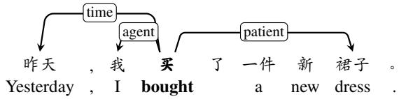
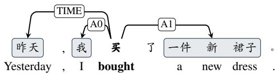
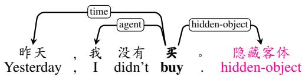
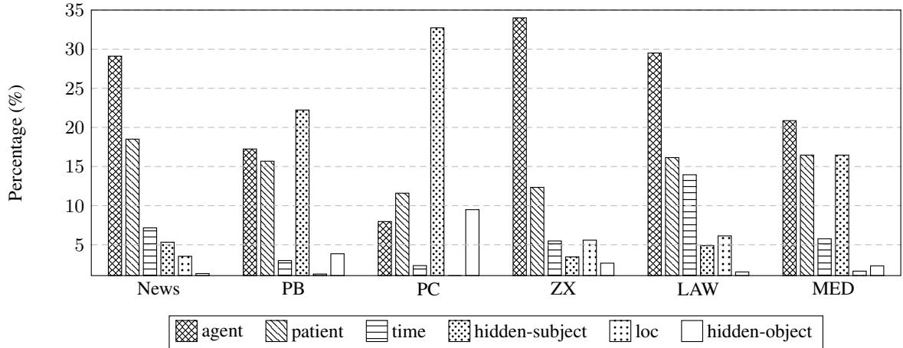
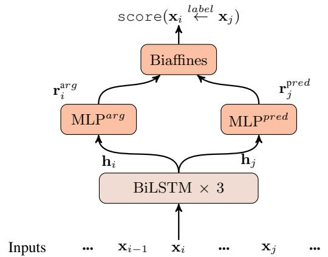
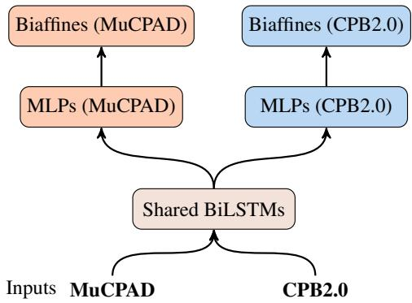

# MuCPAD: A Multi-Domain Chinese Predicate-Argument Dataset

Yahui Liu, Haoping Yang, Chen Gong∗, Qingrong Xia, Zhenghua Li, Min Zhang Institute of Artificial Intelligence, School of Computer Science and Technology,

Soochow University, China

{yahuiliu.nlp,hpyang3,gongchen.nlp}@foxmail.com, kirosummer.nlp@gmail.com, {zhli13,minzhang}@suda.edu.cn

## Abstract

During the past decade, neural network models have made tremendous progress on indomain semantic role labeling (SRL). However, performance drops dramatically under the out-of-domain setting. In order to facilitate research on cross-domain SRL, this paper presents MuCPAD, a multi-domain Chinese predicate-argument dataset, which consists of 30,897 sentences and 92,051 predicates from six different domains. MuCPAD exhibits three important features. 1) Based on a frame-free annotation methodology, we avoid writing complex frames for new predicates. 2) We explicitly annotate omitted core arguments to recover more complete semantic structure, considering that omission of content words is ubiquitous in multi-domain Chinese texts. 3) We compile 53 pages of annotation guidelines and adopt strict double annotation for improving data quality. This paper describes in detail the annotation methodology and annotation process of MuC-PAD, and presents in-depth data analysis. We also give benchmark results on cross-domain SRL based on MuCPAD.

## 1 Introduction

As a fundamental NLP task, semantic role labeling (SRL), also known as shallow semantic parsing, aims to capture the major semantic information of a sentence based on predicate-argument structure. Basically, SRL tries to answer “who did what to whom where and when” (Màrquez et al., 2008). Previous works have shown that SRL can help various downstream tasks, including information extraction (Bastianelli et al., 2013), plagiarism detection (Paul and Jamal, 2015), machine translation (Shi et al., 2016), reading comprehension (Zhang et al., 2020), etc.

Figure 1 gives two examples of SRL structure. According to the definition of semantic roles, there exist two typical representation forms, i.e., the word-based and the span-based. This work adopts the word-based form, in which an argument corresponds to a single word. In contrast, span-based SRL, adopted by most previous datasets, takes a word span as an argument. The direction of arcs is from predicates to arguments, and the labels indicate the types of semantic roles. For example, the arc from “买(bought)” to “裙子(dress)” with a label “patient” means that the semantic role between the predicate “买(bought)” and the argument “裙 子(dress)” is “patient”.

  
(a) Word-based SRL representation adopted in MuCPAD

  
(b) Span-based SRL representation adopted in CPB and CNB  
Figure 1: Examples of two SRL formulations.

Recently, Chinese SRL research has achieved tremendous progress, thanks to the rise of deep learning methods (Marcheggiani et al., 2017; He et al., 2018; Cai et al., 2018), especially of powerful pre-trained language models (PLMs) (Shi and Lin, 2019; Conia and Navigli, 2020; Paolini et al., 2021). However, existing studies on Chinese SRL mainly focus on the in-domain setting, where training and test data are from the same domain (Wang et al., 2015; Guo et al., 2016b; Xia et al., 2017). SRL performance drops dramatically when the domain of test data is different from that of the training data, known as the domain adaptation problem.

Meanwhile, with the rapid growth of usergenerated web data, cross-domain SRL has become an important and challenging task in realistic NLP systems (Jiang and Zhai, 2007; Ramponi and Plank, 2020). However, due to the scarcity of multi-domain labeled data, recent research on SRL makes very limited progress in the domain adaptation scenario.

  
Figure 2: An example sentence with an omitted core argument in MuCPAD.

As far as we know, there are three publicly available Chinese SRL datasets, i.e., Chinese Proposition Bank (CPB) (Xue and Palmer, 2005), Chinese NomBank (CNB) (Xue, 2006a), and Chinese Sem-Bank (CSB) (Xia et al., 2017). All these datasets mainly contain canonical texts from newspapers or magazine/textbook articles.

In order to facilitate research on cross-domain SRL, this paper presents MuCPAD, a multi-domain Chinese predicate-argument dataset, consisting of 30,897 sentences and 92,051 predicates, from 6 different domains. Overall, MuCPAD has the following important features.

(1) Following CSB instead of CPB and CNB, we adopt a frame-free annotation methodology, considering that it requires a very high level of linguistic background to define new frames for new predicates or new senses, and a lot of new predicates or new senses may appear in multi-domain texts.

(2) As shown in Figure 2, we explicitly annotate omitted core arguments with two special labels, i.e., “hidden-subject” and “hidden-object”, in order to capture richer semantics expressed by predicates. It is ubiquitous that people try to avoid repetition by omitting previous content in context, especially in non-canonical Chinese texts.

(3) We adopt strict double annotation for all sentences in order to improve quality. If two annotators submit inconsistent results, a senior annotator determines the final answer. We also compile 53 pages of annotation guidelines to be studied and referred to by the annotators.

Based on our newly annotated MuCPAD, we conduct preliminary cross-domain SRL experiments and analysis. We enhance the basic SRL model by exploiting CPB2.0 as a heterogeneous dataset under the multi-task learning (MTL) framework, and by utilizing powerful contextualized word representations from pretrained language models (PLMs).

We release MuCPAD along with our annotation guidelines for research usage at https://github.com/SUDA-LA/MuCPAD.

## 2 Related Work

English SRL Data. Large-scale annotated data is a prerequisite to develop high-performance SRL systems (Fürstenau and Lapata, 2009; Xia et al., 2020). The most representative ones in English are FrameNet (Baker et al., 1998), PropBank (Kingsbury and Palmer, 2002), and NomBank (Meyers et al., 2004). FrameNet is a large-scale manually annotated semantic lexicon resource and uses semantic frames to represent meanings of words. A frame corresponds to a sense of a word, and defines the specific meanings of its core roles (i.e., “A0-A5”). In other words, labels for core semantic roles have predicate-sense-specific meanings.

PropBank and NomBank are built by adding predicate-argument structures to the constituents of syntactic parser trees in Penn Treebank (Marcus et al., 1993). Their semantic roles are naturally span-based, instead of word-based. PropBank considers verbal predicates, while NomBank supplements nominal predicates. Following FrameNet, PropBank and NomBank use frames to represent semantic meanings of predicates. However, the development of frames is both time-consuming and labor-intensive, and requires annotators to be equipped with strong linguistic background.

The texts of PropBank and NomBank are mainly from the news domain, i.e., Wall Street Journal, except 426 sentences from the Brown corpus, which is usually used as an out-of-domain section of Prop-Bank.

It is also noteworthy that there are PropBankstyle SRL data for other languages, such as Portuguese (Duran and Aluísio, 2011, 2012), Arabic (Pradhan et al., 2012), Finnish (Haverinen et al., 2015), and Turkish (Sahin and Adali, 2018).

Chinese SRL Data. CPB (Xue and Palmer, 2005), CNB (Xue, 2006a), and CSB (Xia et al., 2017) are the three publicly available SRL datasets in Chinese. CPB and CNB, corresponding to Prop-Bank and NomBank in English respectively, add predicate-argument structure of verbal predicates and nominal predicates into Penn Chinese Treebank (Marcus et al., 1993). The semantic roles are based on pre-defined frames as well. Moreover, sentences in CPB and CNB mainly come from canonical texts, such Xinhua newswire, Hong Kong news, and Sinorama Magazine (Hajic et al., 2009).

<table><tr><td rowspan=1 colspan=5></td><td rowspan=1 colspan=4>Label</td><td rowspan=1 colspan=5>Example</td><td rowspan=1 colspan=1>Argument</td></tr><tr><td rowspan=1 colspan=5>Core roles</td><td rowspan=1 colspan=4>agentco-agentexpe (experiencer)hidden-subjectpatientpred-patient (predicate-patient)dativerelativehidden-objectsubj-obj (subject-object)</td><td rowspan=1 colspan=5>我[打]他(I [hit] him)我和他[讨论] (I [discuss] with him)天气真[好] (The weather [is] really good)[吃]饭了吗？([Ate]?)他被[打]了 (He was [hit])他[喜欢]打篮球(He [likes] playing basketball)[给]他书([Give] him a book)这[是]他的书(This [is] his book)你[吃]了吗？(Have you [eaten]?)温度计[伸入]水中(The thermometer is dipped into the water)</td><td rowspan=1 colspan=1>我(I)我(I)、他(him)天气(weather)隐藏主体(hidden-subject)他(he)打(play)他(him)书(book)隐藏客体(hidden-object)温度计(thermometer)</td></tr><tr><td rowspan=1 colspan=5></td><td rowspan=1 colspan=4>tool (instument)material</td><td rowspan=1 colspan=5>用钢笔[写]字([Write] with pen)用颜料[刷]墙([Brush] the wall with pigment)</td><td rowspan=1 colspan=1>钢笔(pen)颜料(pigment)</td></tr><tr><td rowspan=1 colspan=4></td><td rowspan=1 colspan=1></td><td rowspan=1 colspan=1></td><td rowspan=1 colspan=5>manner</td><td rowspan=1 colspan=4>按计划[执行] ([Perform] according to pla</td></tr><tr><td rowspan=2 colspan=5></td><td rowspan=1 colspan=1></td><td rowspan=2 colspan=5>loc (location)beg-loc (begin location)</td><td rowspan=2 colspan=4>在学校[学习]([Study] at school)</td></tr><tr><td></td><td rowspan=7 colspan=5>[流]入大海([Flow] to the ocean)向西[流] ([Flow] to the west)星期天去[打篮球]([Play] basketball on Sunday)比赛七点开始[进行] (The game [starts] at seven o &#x27;clock)</td></tr><tr><td rowspan=2 colspan=5></td><td rowspan=2 colspan=4>end-loc (end location)</td><td></td></tr><tr><td rowspan=1 colspan=3>dir (direction)</td><td></td></tr><tr><td rowspan=1 colspan=5>Non-core roles</td><td rowspan=1 colspan=2>time</td><td></td><td></td><td></td></tr><tr><td rowspan=5 colspan=5></td><td rowspan=3 colspan=2>beg-tm (begin time)</td><td rowspan=4 colspan=2></td><td></td></tr><tr><td rowspan=1 colspan=1></td><td></td></tr><tr><td rowspan=2 colspan=2></td><td></td></tr><tr><td rowspan=3 colspan=4></td><td rowspan=1 colspan=2>end-tm (end time)</td><td rowspan=1 colspan=2>]到三点(The meeting [runs] unti</td><td rowspan=1 colspan=3>ntil three o'clock)</td><td rowspan=4 colspan=1>三点(three o&#x27;clock)数学(mathematics)爱(love)一圈(a lap)面(met)</td></tr><tr><td rowspan=1 colspan=3>range</td><td rowspan=1 colspan=1></td><td></td><td rowspan=1 colspan=5>在数学上[有]天赋([Have] an aptitude for mathematics)</td></tr><tr><td rowspan=1 colspan=4></td><td rowspan=1 colspan=3></td><td rowspan=2 colspan=4>quantityseparated</td><td rowspan=2 colspan=4>我因为爱你才[撒谎] (I [lied] because I love you)我[跑]了一圈(I [ran] a lap)我们[见]过面(We have [met])</td></tr><tr><td rowspan=1 colspan=5></td><td></td><td></td></tr></table>

Table 1: Semantic role labels adopted in our guidelines. Predicates in the example sentences are marked by “[]”.

In contrast, CSB uses general-purpose role labels, such as “agent” and “patient”, and the sentences are mainly from canonical texts such as online articles and news as well.

Domain adaptation. Domain adaptation has been an important and challenging research topic in NLP (Daumé III, 2007; Ganin and Lempitsky, 2015; Guo et al., 2016a; Kim et al., 2017; Clark et al., 2018; Zhao et al., 2018).

Kim et al. (2016) proposed a neural sharedprivate model for the cross-domain slot sequence tagging task, which utilizes separate BiLSTM encoders to obtain domain-invariant and domainspecific representations, achieving significant improvements on all domains. Jia et al. (2019) proposed parameter generation networks for crossdomain NER. They idea is dynamically generate parameters of network modules (such as BiLSTMs) according to predicted domain distribution.

To facilitate cross-domain Chinese dependency parsing research, Li et al. (2019a) proposed a largescale multi-domain dataset for Chinese dependency parsing. They organized the NLPCC-2019 shared task on cross-domain dependency parsing (Peng et al., 2019). Li et al. (2019b) rank the first place in the shared task, based on a tri-training approach.

However, possibly due to the lack of multidomain data, research on cross-domain SRL is scarce so far. We hope our newly annotated MuC-PAD can promote future research in this direction.

## 3 Data Annotation

This section describe the annotation methodology and annotation process of MuCPAD in detail.

Annotation guidelines. After an extensive survey of previous works on SRL data annotation, we compile 53 pages of annotation guidelines. We adopt 24 fine-grained general-purpose role labels to capture the semantic relationships between predicates and arguments, as shown in Table 1, most of which are borrowed from the guidelines of CSB. In particular, we introduce two special labels, i.e., “hidden-subject” and “hidden-object”, to explicitly annotate omitted core arguments. Our guidelines illustrate each label in detail using concrete examples, and are gradually improved according to feedback of annotators during the course of the annotation project.

<table><tr><td></td><td>News</td><td>PB</td><td>PC</td><td>ZX</td><td>LAW</td><td>MED</td></tr><tr><td></td><td>#Sent 16,974</td><td>43,753</td><td>3,890</td><td>1,575</td><td>2,813</td><td>1,892</td></tr><tr><td></td><td>#Pred 40,989</td><td>11,317</td><td>17,074 5,891 11,156 5,624</td><td></td><td></td><td></td></tr></table>

Table 2: Statistics of annotated data. “#Pred” and “#Sent” represent the number of predicates and sentences.

Data selection. We select the data to annotate from six domains, i.e., news, product blogs (PB), product comments (PC), web fictions (ZX), legals (LAW), and medical (MED) domains. Table 2 shows the data statistics.

News consists of the sentences in Chinese Sem-Bank (Xia et al., 2017) and CoNLL-2009 Chinese dataset (Hajic et al., 2009). Specifically, we choose all 10.3K sentences with 16.5K predicates from Chinese SemBank (Xia et al., 2017) and randomly select 6.7K sentences with 24.5K predicates from CoNLL-2009 Chinese dataset (Hajic et al., 2009). Both PB and PC are non-canonical data from Taobao1, where PB is from Taobao headline website, and PC is comments on products written by users. ZX is selected from a popular Chinese fantasy novel called “Zhuxian” (ZX, known as “Jade Dynasty”). LAW is extracted from the China artificial intelligence law challenge 2018.2 MED is crawled from the medical section of People’s Daily Online3 and Sina.com4.

After selecting the sentences, we also need to select the concerned predicates in the sentences for annotators to annotate their corresponding arguments. For news domain, we directly choose the predicates in Chinese SemBank and CoNLL-2009 Chinese dataset. For other 5 domains, we choose the predicates according to several predefined rules which are carefully designed by considering both the dependency tree structures of the sentences and a frame dictionary extracted from the Chinese frames5. For example, the root words of dependency trees are considered as predicates; the head words with “subject” or “object” dependency labels are considered as predicates; all the words that can be matched in the frame dictionary are considered as predicates.

Quality Control. We employ 20 undergraduate students as annotators, and select 5 experienced annotators as expert annotators to handle annotation inconsistency issues. All the annotators are paid for their work, and the salary is determined by their annotation quantity and quality. The average salary is 28 RMB per hour.

Before real annotation, each annotator is trained for several hours to be familiar with our guidelines and our annotation tool. During the annotation process, we adopt a strict double annotation workflow to guarantee the annotation quality. Specifically, each task is randomly assigned to two annotators to annotate independently. If the submissions from the pair of two annotators are the same, the consistent answer is taken as the final answer. Otherwise, the task is assigned to a third expert annotator to decide the final answer by comparing and analyzing the inconsistent submissions.

Annotation tool. We build a browser-based annotation tool to support the double annotation workflow. For each annotation sentence, the annotation tool highlights the predicate in the sentence for the annotators to annotate all the arguments of the highlighted predicate. We also design a “not-predicate” checkbox in the annotation tool and ask annotators to click this checkbox to inform us when the highlighted word is out of the range of the predicate types in our guidelines.

## 4 Analysis on MuCPAD

In this section, we analyze the MuCPAD dataset from different perspectives to gain more insights.

Annotation consistency. As aforementioned, each task is assigned to two annotators. If the two submissions are inconsistent, a third expert annotator is asked to handle the inconsistency and decide the final results. The first major row in Table 3 shows the predicate- and argument-wise annotation consistency ratios (Marcus et al., 1994; Guo et al., 2018) in all domains.

The predicate-wise consistency ratio is defined as $\frac { \# \mathrm { P r e d } _ { \tt a n n o A f l a n n o B } } { \# \mathrm { P r e d } _ { \tt a n n o A l u a n n o B } }$ , where the denominator is the total number of predicates submitted by all annotators, and the numerator is the number of predicates with consistent arguments from all annotator pairs. We can see that the predicate-wise annotation consistency ratios in most domains are lower than 60%. Even the highest predicate-wise consistency ratio, which is achieved in PC domain, is only 71.23%.

<table><tr><td></td><td></td><td>News</td><td>PB</td><td>PC</td><td>ZX</td><td>LAW</td><td>MED</td><td>AVG</td></tr><tr><td>Consistency ratio</td><td>predicate-wise</td><td>48.86</td><td>57.58</td><td>71.23</td><td>48.86</td><td>47.18</td><td>50.57</td><td>54.05</td></tr><tr><td rowspan="7">Argument-wise annotation accuracy</td><td>argument-wise</td><td>74.48</td><td>74.67</td><td>83.63</td><td>74.65</td><td>71.49</td><td>73.24</td><td>75.36</td></tr><tr><td>overall</td><td>85.86</td><td>82.08</td><td>89.40</td><td>83.80</td><td>84.57</td><td>85.78</td><td>85.25</td></tr><tr><td>agent</td><td>93.50</td><td>82.19</td><td>88.16</td><td>91.45</td><td>85.54</td><td>86.09</td><td>87.82</td></tr><tr><td>time</td><td>91.17</td><td>88.98</td><td>85.02</td><td>83.69</td><td>85.65</td><td>86.87</td><td>86.90</td></tr><tr><td>hidden-subject</td><td>88.79</td><td>90.61</td><td>94.45</td><td>79.65</td><td>85.54</td><td>90.45</td><td>88.25</td></tr><tr><td>patient</td><td>87.02 85.96</td><td>88.36 79.12</td><td>90.20 83.71</td><td>86.32</td><td>85.66</td><td>89.26 79.30</td><td>87.80</td></tr><tr><td>loc pred-patient</td><td>85.12</td><td>84.28</td><td>84.08</td><td>84.32 83.97</td><td>84.25 84.11</td><td>84.58</td><td>82.78</td></tr><tr><td>expe</td><td>81.58</td><td>85.27</td><td>90.89</td><td>86.39</td><td>84.20</td><td>87.67</td><td>84.36 86.00</td></tr></table>

Table 3: Analysis on consistency ratio and accuracy. $\mathrm { \bf { \ddot { A } V } G } ^ { \prime \prime }$ is obtained by averaging the values of the six domains. For the first major row, “AVG” represents the average predicate/argument-wise consistency ratios in six domains. For the second major row, $\ddot { \bf \Phi } ^ { 6 } \mathrm { A V G } ^ { 9 }$ represents the average accuracy of overall/each label in six domains. Boldface indicates the maximum value of each row, underline represents the minimum value of each row.

This means that more than a quarter of the annotation tasks need to be further checked by a third expert annotator, demonstrating the difficulty of the SRL annotation task and the importance of performing strict double annotation to guarantee data quality.

In addition, it is worth noting that the predicatewise consistency ratio in PC domain is much higher than that in the other five domains. We believe this is related to the average number of arguments per predicate. For further investigation, we calculate the average number of arguments and find the number of average arguments per predicate is the lowest in PC domain. Therefore, it is relatively easier for the annotators to recognize the arguments in PC domain.

The argument-wise consistency ratio is defined as $\frac { \# \mathbb { A } \mathbb { r } \mathbb { g } _ { \mathrm { a n n o A } \cap \mathrm { a n n o B } } } { \# \mathbb { A } \mathbb { r } \mathbb { g } _ { \mathrm { a n n o A } \cup \mathrm { a n n o B } } }$ , where the denominator is the total number of arguments submitted by all annotator pairs, and the numerator is the number of arguments that receive the same arcs and labels from the annotator pairs. As shown in Table 3, the argument-wise consistency ratios in most of the domains are lower than 75%, except that PC achieves the highest argument-wise consistency ratio of 83.63%.

Annotation accuracy. In the second major row of Table 3, we present the argument-wise annotation accuracy. The overall argument-wise annotation accuracy is defined as $\frac { \sum _ { i = 1 } ^ { n } \# \mathbb { A } \mathbb { r } \mathbb { g } _ { \mathrm { c o r r e c t } _ { i } } } { 2 \times \# \mathbb { A } \mathbb { r } \mathbb { g } _ { \mathrm { q o l d } } }$ , where the numerator is the sum of the number of correctly annotated arguments submitted by all annotators;

the denominator is the total number of all gold arguments; n is the number of annotators. The reason for $^ { 6 6 } 2 \times ^ { , 9 }$ in the denominator is that each task is annotated twice since it is assigned to two annotators for double annotation. The annotation accuracies in all the domains are more than 80%, indicating that our guidelines are reasonable, which ensures the quality of annotation data.

To gain more insights into the accuracy regarding different labels, we calculate the accuracy of 5 core labels and 2 non-core labels with high proportions for further analysis, which is shown in the third major row of Table 3. The argument-wise annotation accuracy for each label is calculated by $\frac { \sum _ { i = 1 } ^ { n } \# \mathbb { A } \mathbb { r } \mathsf { g } _ { \mathtt { c o r r e c t } _ { i } } ^ { l } } { 2 \times \# \mathbb { A } \mathbb { r } \mathsf { g } _ { \mathtt { q o l d } } ^ { l } }$ , where the numerator is the sum of the number of correctly annotated arguments with the concerned label l submitted by all annotators, the denominator is the total number of all gold arguments with the concerned label $l ; n$ is the number of annotators. As we can see, “hidden-subject” achieves the highest average accuracy, demonstrating the omitted subject is easy to recognize. The lowest average accuracy is 82.78% on “loc”, probably because it is a non-core label with the lowest proportion of all labels and is prone to be ignored by the annotators.

Label distribution. Figure 3 illustrates the label distribution in the 6 domains. The labels in Figure 3 are sorted in descending order by their proportion in News data. We choose 2 core labels and 2 noncore labels with the highest proportions in News data. Besides, we also analyze “hidden-subject”

  
Figure 3: Label distribution in different domains.

and “hidden-object” since their distributions in different domains are specific. As shown in Figure 3, the label distributions are vary across different domains.

For PC, both “hidden-subject” and “hiddenobject” account for the largest proportion compared with that for all the other 5 domains, which means PC contains the most omitted core arguments. The reason is that PC is user-generated comments on a concerned product, and people tend to directly write the comment of the concerned product and omit the product name and the personal pronoun. For example, in the sentence “很 (very) 喜欢 (like), 买 (buy) 了 好 (very) 多 (much)”, both the hiddensubjects and the hidden-objects of the predicates “喜欢 (like)” and “买 (buy)” are omitted. The omitted core arguments in PB also take relatively large proportion, similar to the reason for PC.

For ZX, it has the most “agent” roles and the least “hidden-subject” roles compared with other domains. This is owing to the genre of ZX texts, which are extracted from a popular Chinese fantasy novel with a lot of fictional characters. In order to make the story more understandable by readers, the names of the fictional characters are often explicitly written in the sentences, leading to more “agent” roles and fewer “hidden-subject” roles.

For LAW, it has more “time” roles and “loc” roles than other domains, since the elements (i.e., time and location) of the cases are usually frequently occurred to provide more accurate information.

For MED, the number of “hidden-subject” label accounts for a large proportion among all the labels in MED, only fewer than that of “agent” label, mainly because the descriptions of symptoms in

MED usually omit the subjects. For example, in the sentence “酒精(alcohol) 中毒(poisoning): 发 生(occur) 昏迷(coma) 不能(cannot) 催吐(induce vomiting), the subjects of the predicates “中 毒(poisoning)”, “发生(poisoning)”, “昏迷(coma)”, “不能(cannot)” are all omitted.

Looking into the distribution of “hidden-subject” and “hidden-object” labels in all the domains, we find that hidden labels exist in all the domains, especially in non-canonical texts like PC and PB, demonstrating the necessity of annotating hidden labels. In addition, “hidden-subject” takes a higher proportion than “hidden-object” in all the 6 domains, reflecting that the subject of the predicate in Chinese sentences is often omitted.

Annotation difficulties. To understand difficulties during annotation, we calculate the proportion of the arguments with the same arcs but different labels from two annotators among all the arguments with the same arcs. We find that the confusion pattern “agent, expe” accounts for the largest proportion of 22.23%, which means the label “agent” is prone to be confused with “expe”. This is possibly because the POS for some predicates is subtle and vague in Chinese, causing the confusion of the argument labels. Taking the sentence “纽扣(Buttons) 一天(a day) 坏(getting broken) 一个(one)” as an example, “坏(getting broken)” may be misunderstood as an adjective and thus the argument “纽 扣(buttons)” is incorrectly annotated as “expe”. Actually, “坏(getting broken)” acts as a verb in this sentence and the correct label of “纽扣(buttons)” is “agent”. The second confusion pattern is “patient, pred-patient”, with a proportion of 12.6%, due to the misunderstanding of the POS of the argument. It is also difficult for annotators to distinguish “agent” and “patient”. For example, in the sentence “新(new) 衣服(cloths) 被(was) 弄脏 了(soiled)”, the preposition “被(was)” is omitted. As a result, the label of “新(new) 衣服(cloths)”, which is “patient”, may be confused with “agent” due to the omission.

## 5 Approach

Based on our newly annotated multi-domain Chinese SRL data, we conduct preliminary experiments, aiming to provide benchmark results. Specifically, we present a simple basic SRL model and enhance the model with the contextualized word representations from BERT for further improvements. Besides, we also present a MTL framework to improve the SRL performance by learning from multiple heterogeneous datasets simultaneously (Conia et al., 2021).

In this work, we focus on the predicate-given setting, which means we do argument identification and classification according to the given predicates in one sentence.

Following previous works (Cai et al., 2018; Zhang et al., 2019), we treat the predicate-given SRL task as a word pair classification problem and try to find the predicate-argument structure $\hat { y }$ with the highest score:

$$
\pmb { \hat { y } } = \underset { \pmb { y } \in \mathcal { V } ( \pmb { x } ) } { \mathrm { a r g m a x } } s c o r e ( \pmb { x } , \pmb { y } )\tag{1}
$$

where $\mathcal { V } ( \pmb { x } ) = \{ ( i , j , r ) | i \in \mathcal { P } , 1 \leq j \leq n , r \in$ represents the set of all possible predicateargument pairs. $\mathcal { P }$ is the set of given predicates, n is the number of sentence, and is the semantic role label set, which contains 24 semantic role labels and an extra “None” label to indicate there is no semantic relationship between the given predicate and the j-th word.

## 5.1 Basic SRL Model

Inspired by previous works (Cai et al., 2018; Zhang et al., 2019), we build a basic SRL model that utilizes the biaffine attention mechanism (Dozat and Manning, 2017) to score each candidate predicateargument pair. Figure 4 shows the architecture of the basic model. During both training and evaluation, multiple predicates in the same sentence are handled simultaneously. First, the input sentence is encoded; then, scores between predicates and all other words are computed; finally, the roles of each predicate are determined via local classification.

  
Figure 4: The architecture of our basic SRL model.

The input vector is the concatenation of the pre-trained word embedding ${ \bf e } _ { i } ^ { p r e }$ , the randomly initialized word embedding $\mathbf { e } _ { i } ^ { r }$ , the character-based word representation $\mathbf { r } _ { i } ^ { c } .$ , and the predicate indicator embedding $\mathbf { e } _ { i } ^ { p }$

$$
\mathbf { x } _ { i } = \mathbf { e } _ { i } ^ { p r e } \oplus \mathbf { e } _ { i } ^ { r } \oplus \mathbf { r } _ { i } ^ { c } \oplus \mathbf { e } _ { i } ^ { p }
$$

where $\mathbf { r } _ { i } ^ { c }$ is produced by CNN, and the Boolean predicate indicator is true only for words that are given predicates.

A three-layer BiLSTM is applied to obtain context-aware representation of each word, i.e., hi.

Two separate MLPs are applied over hi to get two lower-dimensional representation $\mathbf { h } _ { i } ^ { p r e d }$ (as predicate) and $\mathbf { h } _ { i } ^ { a r g }$ (as candidate argument).

Biaffines are used to compute scores of labels between a predicate and a word.

During training, we adopt the local cross-entropy loss. To obtain cross-domain results on the basic SRL model, we train the model on source domain data and make predictions on target domain data.

## 5.2 Enhancing with BERT

Recently proposed PLMs, such as BERT (Devlin et al., 2019), have shown the great power in learning and capturing contextualized representations and have proven to be beneficial in a variety of NLP tasks, such as information retrieval (Yang et al., 2019b), question answering (Yang et al., 2019a), and word segmentation (Huang et al., 2020). In this work, we extract the fixed contextualized representations from BERT for words and treat them as additional features to augment the input representation, i.e., $\mathbf { x } _ { i } = \mathbf { e } _ { i } ^ { p r e } \oplus \bar { \mathbf { e } _ { i } ^ { r } } \oplus { \mathbf { r } _ { i } ^ { c } } \oplus \mathbf { e } _ { i } ^ { p } \mathrm { \hat { \oplus } } \mathbf { e } _ { i } ^ { B \hat { E } R T }$

<table><tr><td>(#Pred / #Sent)</td><td>Source</td><td>PB</td><td>PC</td><td>zX</td><td>LAW</td><td>MED</td><td>CPB2.0</td></tr><tr><td>Train</td><td>32,790 / 13,022</td><td></td><td></td><td></td><td>一</td><td></td><td> $7 2 , 6 1 6 / 1 3 , 1 7 0$ </td></tr><tr><td>Dev</td><td>4,098 / 1,875</td><td></td><td>3,796 / 1,2555,658 / 1,295</td><td>1,784 / 492</td><td>3,718 / 778</td><td>1,874 / 478</td><td></td></tr><tr><td>Test</td><td>4,101 / 2,077</td><td></td><td></td><td></td><td>7,521 / 2,49811,416 / 2,5954,107 / 1,0837,438 / 2,0353,750 / 1,414</td><td></td><td>一</td></tr></table>

Table 4: Statistics of MuCPAD and CPB2.0. “#Pred” and “#Sent” represent the number of predicates and sentences.

  
Figure 5: The framework of MTL.

## 5.3 Utilizing Heterogeneous Data with MTL

MTL is a commonly used method to improve the model performance by learning the underlying knowledge from multiple related tasks or datasets (Collobert and Weston, 2008; Guo et al., 2016a; Li et al., 2019a). In this work, we design a MTL framework to utilize heterogeneous SRL datasets to boost the SRL model performance.

As shown in Figure 5, we extend the basic SRL model to the MTL framework. Specifically, the SRL parsing on MuCPAD data and CPB2.0 data are considered as two separate tasks. They share the same word/predicate embeddings and BiLSTM parameters. Over the shared BiLSTMs, two separate MLPs and biaffines are employed for MuC-PAD and CPB2.0 SRL parsing respectively.

## 6 Experiments

Data. Our experiments mainly focus on zero-shot single-source domain adaptation, that is, we have labeled training data for the source domain, and do not have labeled training data for the target domain. Specifically, we use the News domain of MuCPAD as the source domain, and the other five domains as target domains. The data statistics for source and target domains are shown in Table 4. For the auxiliary data used in the MTL framework, we randomly select 13,170 sentences with 72,616 predicates from CPB2.0 (Xue, 2006b), which belongs to the same newswire genre with the source domain data.

Evaluation metric. We adopt the standard precision $( \frac { \# \mathbb { A } \mathbb { r } \mathbb { g } _ { \tt c o r r e c t } } { \# \mathbb { A } \mathbb { r } \mathbb { g } _ { \tt p r e d } } )$ , recall $( \frac { \# \mathbb { \breve { A } } \Sigma \mathfrak { g } _ { \mathsf { c o r r e c t } } } { \# \mathbb { A } \Sigma \mathfrak { g } _ { \mathsf { g o l d } } } )$ , and F1 score $( \frac { 2 P R } { P + R } )$ for SRL evaluation.

Settings. We implement the basic SRL model and MTL framework with PyTorch6 and mainly follow the hyperparameters of Cai et al. (2018), such as the dimensions of embeddings, learning rate, and dropout ratios. We use bert-base-chinese7 to obtain contextualized representations for words, and the dimension of the BERT representations is 768. During training, early stopping is triggered if the peak performance in dev data does not increase in 50 consecutive iterations.

Results of the basic model. The first row of Table 5 presents the results in the source/target domain dev/test data using the basic SRL model trained on the source data.

First, it is obvious that the performance in all the five target domains drops dramatically compared with the results on source data, with the gap of more than 18% in F1. This indicates that the model trained on source data has a challenge in making reliable predictions on target domain data due to the distributional mismatch between different domains. Second, we find that the basic SRL model performs better on ZX and LAW compared with the other three target domains data, i.e., PB, PC, and MED. The probable reason is that ZX and LAW are novel and legal case, respectively, which are more canonical in text. Third, PB has the lowest F1 score in both dev and test. This can be explained by the fact that PB is non-canonical data from Taobao headline website. The dissimilarity between the source training data and PB target data causes the low performance.

Results with BERT. The second row of Table 5 shows the results of the baseline with BERT representations. We can see that the results of “Baseline+BERT” consistently increase by large margins compared with the corresponding baseline models without BERT (as shown in the first major row of table 5), demonstrating the great power of BERT in contextualized representation.

<table><tr><td></td><td colspan="2">Source</td><td colspan="2">PB</td><td colspan="2">PC</td><td colspan="2">ZX</td><td colspan="2">LAW</td><td colspan="2">MED</td><td rowspan="2">AVG</td></tr><tr><td></td><td>dev</td><td>test</td><td>dev</td><td>test</td><td>dev</td><td>test</td><td>dev</td><td>test</td><td>dev</td><td>test</td><td>dev</td><td>test</td></tr><tr><td>Baseline</td><td>69.55</td><td>68.40</td><td>44.24</td><td>44.59</td><td>46.12</td><td>47.37</td><td>50.98</td><td>49.26</td><td>47.05</td><td>49.77</td><td>44.88</td><td>46.70</td><td>50.74</td></tr><tr><td>Baseline+BERT</td><td>80.25</td><td>79.46</td><td>64.28</td><td>66.23</td><td>66.77</td><td>67.14</td><td>71.65</td><td>71.77</td><td>70.47</td><td>73.28</td><td>66.06</td><td>67.97</td><td>70.44</td></tr><tr><td>Baseline+MTL</td><td>74.55</td><td>73.43</td><td>46.95</td><td>47.36</td><td>48.61</td><td>48.95</td><td>54.38</td><td>53.54</td><td>48.55</td><td>51.25</td><td>54.53</td><td>55.26</td><td>54.78</td></tr><tr><td>Baseline+MTL+BERT</td><td>81.05</td><td>80.85</td><td>64.35</td><td>65.27</td><td>67.75</td><td>68.13</td><td>72.44</td><td>71.72</td><td>70.53</td><td>73.79</td><td>66.38</td><td>69.07</td><td>70.94</td></tr></table>

Table 5: F1 scores of different models on MuCPAD. “AVG” is obtained by averaging the values of both dev and test in all domains.

Results with heterogeneous CPB2.0. As shown in the third row of Table 5, benefiting from the additional semantic information provided by the auxiliary CPB2.0 data using the MTL framework, the SRL performance in all domains are improved compared with the baseline model. This indicates that the MTL framework is effective in capturing and learning the underlying common knowledge from heterogeneous data.

On the one hand, comparing the improvements brought by MTL in all domains, we find that MED data obtains the largest gains of 9.65%/8.56% F1 in dev/test, respectively. The main reason is that the MED data belongs to the same newswire domain as the auxiliary CPB2.0 data. On the other hand, the improvement in LAW is the smallest. This can be explained by the difference in label distribution between LAW and CPB2.0. For example, as mentioned in Section 4, the labels “time” and “loc” in LAW account for the largest proportion (13.95% and 6.14% respectively) compared with other domains. However, the proportions of “time” and “loc” in CPB2.0 data are only 6.10% and 3.40% respectively (about half of that in LAW). Therefore, CPB2.0 cannot provide much more valid information to increase the performance of these labels.

Results with BERT and heterogeneous CPB2.0. Finally, when utilizing both BERT representations and the heterogeneous CPB2.0 data on our baseline, the enhanced model gives the best or comparable results in 5 of the 6 domains, with an average increase of 0.5% F1, showing that the MTL framework is effective in utilizing heterogeneous data and can complement the information obtained from BERT representations.

## 7 Conclusions

This paper presents a multi-domain Chinese predicate-argument dataset, named MuCPAD, which consists of 30,897 sentences with 92,051 predicates and covers 6 different domains. In particular, we adopt a frame-free annotation methodology, which does not require high-level linguistic background for defining frames for large amounts of new predicates or new senses in multi-domain data. Besides, considering that omission of content words is ubiquitous in Chinese, we explicitly annotate omitted core arguments with two special designed labels “hidden-subject” and “hidden-object” for better semantic understanding. To ensure annotation quality, we adopt strict double annotation and ask a third expert to handle annotation inconsistency. We also perform analysis on MuCPAD from different perspectives. Finally, we conduct preliminary cross-domain experiments and analysis on MuCPAD.

## Acknowledgements

The authors would like to thank the anonymous reviewers for the helpful comments. We are greatly grateful to all our annotators for their hard work in data annotation. This work was supported by the National Natural Science Foundation of China (Grant No. 62176173, 61876116), and a project funded by the Priority Academic Program Development of Jiangsu Higher Education Institutions.

## References

Collin F Baker, Charles J Fillmore, and John B Lowe. 1998. The berkeley framenet project. In Proceedings of COLING-ACL, pages 86–90.

Emanuele Bastianelli, Giuseppe Castellucci, Danilo Croce, and Roberto Basili. 2013. Textual inference

and meaning representation in human robot interaction. In Proceedings of JSSP, pages 65–69.

Jiaxun Cai, Shexia He, Zuchao Li, and Hai Zhao. 2018. A full end-to-end semantic role labeler, syntacticagnostic over syntactic-aware? In Proceedings of COLING, pages 2753–2765.

Kevin Clark, Minh-Thang Luong, Christopher D. Manning, and Quoc V. Le. 2018. Semi-supervised sequence modeling with cross-view training. In Proceedings ofEMNLP, pages 1914–1925.

Ronan Collobert and Jason Weston. 2008. A unified architecture for natural language processing: deep neural networks with multitask learning. In Proceedings ofICML, pages 160–167.

Simone Conia, Andrea Bacciu, and Roberto Navigli. 2021. Unifying cross-lingual semantic role labeling with heterogeneous linguistic resources. In Proceed ings ofNAACL-HLT, pages 338–351.

Simone Conia and Roberto Navigli. 2020. Bridging the gap in multilingual semantic role labeling: a language-agnostic approach. In Proceedings ofCOL-ING, pages 1396–1410.

Hal Daumé III. 2007. Frustratingly easy domain adaptation. In Proceedings of ACL, pages 256–263.

Jacob Devlin, Ming-Wei Chang, Kenton Lee, and Kristina Toutanova. 2019. Bert: Pre-training of deep bidirectional transformers for language understanding. In Proceedings of NAACL-HLT, pages 4171– 4186.

Timothy Dozat and Christopher D. Manning. 2017. Deep biaffine attention for neural dependency parsing. In Proceedings of ICLR.

Magali Sanches Duran and Sandra Maria Aluísio. 2011. Propbank-br: a brazilian portuguese corpus annotated with semantic role labels. In Proceedings of STIL.

Magali Sanches Duran and Sandra Maria Aluísio. 2012. "Propbank-br: a Brazilian treebank annotated with semantic role labels". In Proceedings ofLREC, pages 1862–1867.

Hagen Fürstenau and Mirella Lapata. 2009. Semisupervised semantic role labeling. In Proceedings of EACL, pages 220–228.

Yaroslav Ganin and Victor Lempitsky. 2015. Unsupervised domain adaptation by backpropagation. In Proceedings ofICML, pages 1180–1189.

Jiang Guo, Wanxiang Che, Haifeng Wang, and Ting Liu. 2016a. A universal framework for inductive transfer parsing across multi-typed treebanks. In Proceedings of COLING, pages 12–22.

Jiang Guo, Wanxiang Che, Haifeng Wang, Ting Liu, and Jun Xu. 2016b. A unified architecture for semantic role labeling and relation classification. In Proceedings ofCOLING, pages 1264–1274.

L. Guo, L. I. Zhenghua, X. Peng, and M. Zhang. 2018. Annotation guideline of chinese dependency treebank from multi-domain and multi-source texts. Journal ofChinese Information Processing, 32(10):28–35.

Jan Hajic, Massimiliano Ciaramita, Richard Johansson, Daisuke Kawahara, M Antònia Martí, Lluís Màrquez, Adam Meyers, Joakim Nivre, Sebastian Padó, Jan Štepánek, et al. 2009. The CoNLL-2009 shared task: ˇ Syntactic and semantic dependencies in multiple languages. In Proceedings ofCoNLL, pages 1–18.

Katri Haverinen, Jenna Kanerva, Samuel Kohonen, Anna Missilä, Stina Ojala, Timo Viljanen, Veronika Laippala, and Filip Ginter. 2015. The finnish proposition bank. Language Resources and Evaluation, 49:907–926.

Shexia He, Zuchao Li, Hai Zhao, and Hongxiao Bai. 2018. Syntax for semantic role labeling, to be, or not to be. In Proceedings ofACL, pages 2061–2071.

Weipeng Huang, Xingyi Cheng, Kunlong Chen, Taifeng Wang, and Wei Chu. 2020. Towards fast and accurate neural Chinese word segmentation with multi-criteria learning. In Proceedings ofCOLING, pages 2062– 2072.

Chen Jia, Liang Xiao, and Yue Zhang. 2019. Crossdomain NER using cross-domain language modeling. In Proceedings ofACL, pages 2464–2474.

Jing Jiang and Chengxiang Zhai. 2007. Instance weighting for domain adaptation in nlp. In Proceedings of ACL, pages 264–271.

Young-Bum Kim, Karl Stratos, and Dongchan Kim. 2017. Adversarial adaptation of synthetic or stale data. In Proceedings of ACL, pages 1297–1307.

Young-Bum Kim, Karl Stratos, and Ruhi Sarikaya. 2016. Frustratingly easy neural domain adaptation. In Proceedings of COLING, pages 387–396.

Paul Kingsbury and Martha Palmer. 2002. From treebank to propbank. pages 1989–1993.

Zhenghua Li, Xue Peng, Min Zhang, Rui Wang, and Luo Si. 2019a. Semi-supervised domain adaptation for dependency parsing. In Proceedings of ACL, pages 2386–2395.

Zuchao Li, Junru Zhou, Hai Zhao, and Rui Wang. 2019b. Cross-domain transfer learning for dependency parsing. In Proceedings ofNLPCC, pages 835–844.

Diego Marcheggiani, Anton Frolov, and Ivan Titov. 2017. A simple and accurate syntax-agnostic neural model for dependency-based semantic role labeling. In Proceedings of CoNLL, pages 411–420.

Mitch Marcus, Grace Kim, Mary Ann Marcinkiewicz, Robert MacIntyre, Ann Bies, Mark Ferguson, Karen Katz, and Britta Schasberger. 1994. The Penn Treebank: Annotating predicate argument structure. In Proceedings ofHLT, pages 114–119.

Mitchell Marcus, Beatrice Santorini, and Mary Ann Marcinkiewicz. 1993. Building a large annotated corpus of english: The penn treebank. Computational Linguistics, 19:313–330.

Lluís Màrquez, Xavier Carreras, Kenneth C Litkowski, and Suzanne Stevenson. 2008. Semantic role labeling: an introduction to the special issue. Computational linguistics, 34(2):145–159.

Adam Meyers, Ruth Reeves, Catherine Macleod, Rachel Szekely, Veronika Zielinska, Brian Young, and Ralph Grishman. 2004. Annotating noun argument structure for nombank. In Proceedings of LREC, volume 4, pages 803–806.

Giovanni Paolini, Ben Athiwaratkun, Jason Krone, Jie Ma, Alessandro Achille, Rishita Anubhai, Cicero Nogueira dos Santos, Bing Xiang, and Stefano Soatto. 2021. Structured prediction as translation between augmented natural languages. arXiv preprint arXiv:2101.05779.

Merin Paul and Sangeetha Jamal. 2015. An improved srl based plagiarism detection technique using sentence ranking. Procedia Computer Science, 46:223–230.

Xue Peng, Zhenghua Li, Min Zhang, Rui Wang, Yue Zhang, and Luo Si. 2019. Overview of the nlpcc 2019 shared task: Cross-domain dependency parsing. In Proceedings ofNLPCC, pages 760–771.

Sameer Pradhan, Alessandro Moschitti, Nianwen Xue, Olga Uryupina, and Yuchen Zhang. 2012. CoNLL-2012 shared task: Modeling multilingual unrestricted coreference in OntoNotes. In Proceedings of EMNLP-CoNLL, pages 1–40.

Alan Ramponi and Barbara Plank. 2020. Neural unsupervised domain adaptation in nlp-a survey. In Proceedings of COLING, pages 6838–6855.

Gözde Gül Sahin and Esref Adali. 2018. Annotation of semantic roles for the turkish proposition bank. Language Resources and Evaluation, 52:673–706.

Chen Shi, Shujie Liu, Shuo Ren, Shi Feng, Mu Li, Ming Zhou, Xu Sun, and Houfeng Wang. 2016. Knowledge-based semantic embedding for machine translation. In Proceedings of ACL, pages 2245– 2254.

Peng Shi and Jimmy Lin. 2019. Simple bert models for relation extraction and semantic role labeling. arXiv preprint arXiv:1904.05255.

Zhen Wang, Tingsong Jiang, Baobao Chang, and Zhifang Sui. 2015. Chinese semantic role labeling with bidirectional recurrent neural networks. In Proceedings ofEMNLP, pages 1626–1631.

Qiaolin Xia, Lei Sha, Baobao Chang, and Zhifang Sui. 2017. A progressive learning approach to Chinese srl using heterogeneous data. In Proceedings of ACL, pages 2069–2077.

Qingrong Xia, Rui Wang, Zhenghua Li, Yue Zhang, and Min Zhang. 2020. Semantic role labeling with heterogeneous syntactic knowledge. In Proceedings of COLING, pages 2979–2990.

Nianwen Xue. 2006a. Annotating the predicateargument structure of Chinese nominalizations. In Proceedings ofLREC, pages 1382–1387.

Nianwen Xue. 2006b. Semantic role labeling of nominalized predicates in Chinese. In Proceedings of NAACL-HLT, pages 431–438.

Nianwen Xue and Martha Palmer. 2005. Automatic semantic role labeling for chinese verbs. In Proceedings ofIJCAI, pages 1160–1165.

Wei Yang, Yuqing Xie, Aileen Lin, Xingyu Li, Luchen Tan, Kun Xiong, Ming Li, and Jimmy Lin. 2019a. End-to-end open-domain question answering with bertserini. In Proceedings of NAACL-HLT, pages 72–77.

Wei Yang, Haotian Zhang, and Jimmy Lin. 2019b. Simple applications of bert for ad hoc document retrieval. volume abs/1903.10972.

Yue Zhang, Rui Wang, and Luo Si. 2019. Syntaxenhanced self-attention-based semantic role labeling. In Proceedings of EMNLP-IJCNLP, pages 616–626.

Zhuosheng Zhang, Yuwei Wu, Hai Zhao, Zuchao Li, Shuailiang Zhang, Xi Zhou, and Xiang Zhou. 2020. Semantics-aware BERT for language understanding. In Proceedings ofAAAI, pages 9628–9635.

Han Zhao, Shanghang Zhang, Guanhang Wu, José MF Moura, Joao P Costeira, and Geoffrey J Gordon. 2018. Adversarial multiple source domain adaptation. In Proceedings of ICLR, pages 8559–8570.