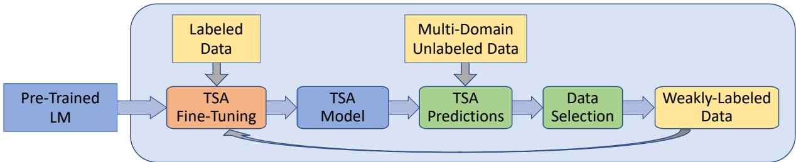
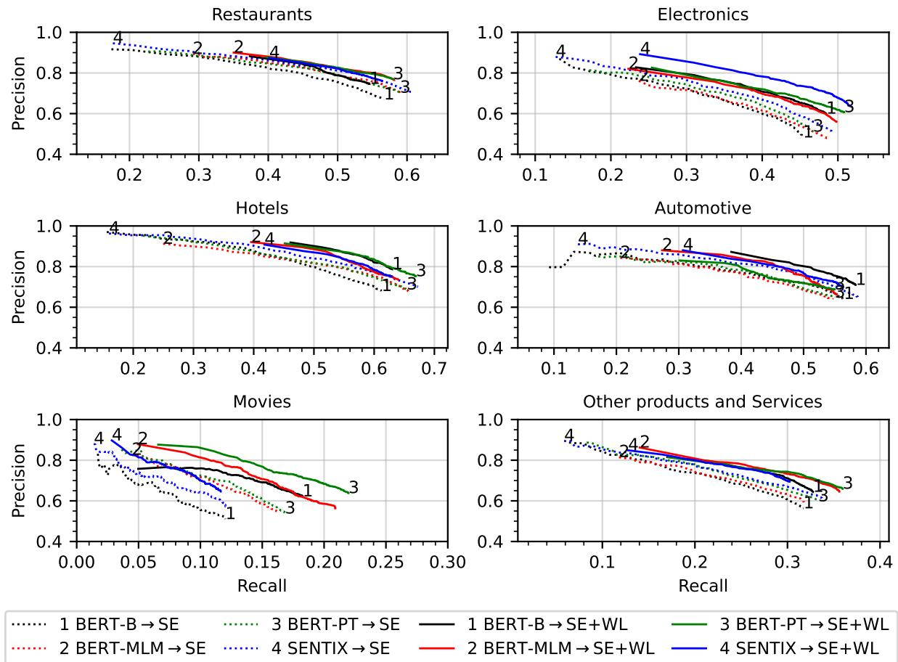
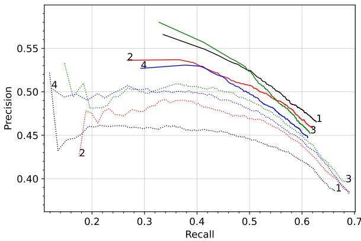

# Multi-Domain Targeted Sentiment Analysis

Orith Toledo-Ronen, Matan Orbach, Yoav Katz, Noam Slonim

IBM Research

{oritht, matano, katz, noams}@il.ibm.com

## Abstract

Targeted Sentiment Analysis (TSA) is a central task for generating insights from consumer reviews. Such content is extremely diverse, with sites like Amazon or Yelp containing reviews on products and businesses from many different domains. A real-world TSA system should gracefully handle that diversity. This can be achieved by a multi-domain model – one that is robust to the domain of the analyzed texts, and performs well on various domains. To address this scenario, we present a multi-domain TSA system based on augmenting a given training set with diverse weak labels from assorted do mains. These are obtained through self-training on the YELP reviews corpus. Extensive experiments with our approach on three evaluation datasets across different domains demonstrate the effectiveness of our solution. We further analyze how restrictions imposed on the available labeled data affect the performance, and compare the proposed method to the costly alternative of manually gathering diverse TSA labeled data. Our results and analysis show that our approach is a promising step towards a practical domain-robust TSA system.

## 1 Introduction

Customer reviews of products and businesses provide insights for both consumers and companies. They help companies understand customer satisfaction or guide marketing campaigns, and aid consumers in their decision-making. Sentiment analysis plays a central role in the analysis of such material, by aiming to understand the sentiment expressed in a review document or in a single review sentence (Liu, 2012). Beyond these high-level trends, identifying the sentiment towards a specific product feature or an entity is important. Such a fine-grained analysis includes the key task of Targeted Sentiment Analysis (TSA), aimed at detecting sentiment-bearing terms in texts and classifying the sentiment towards them. For example, in the sentence "The room was noisy, but the food was tasty," the targets are room and food with negative and positive sentiments, respectively. Our focus in this work is on TSA of user reviews in English.

A real-world TSA system has to successfully process diverse data. From toothbrushes to phones, airline companies to local retailers, the online content today covers a broad range of reviews in many domains. Ideally, a system for such a multi-domain scenario should be able to cope with inputs from any domain, those that were seen during training, and, perhaps more importantly, those that were not.

To the best of our knowledge, this work is the first to pursue TSA in a multi-domain setup, intending to support input from multiple unknown domains. Many previous works have used the indomain setup of training and testing on data from the same domain (e.g. Li et al. (2019b)). Newer works focus on the cross-domain setup, yet most have explored a pairwise evaluation of training on one source domain and evaluating on a single known target domain (e.g. Rietzler et al. (2020); Gong et al. (2020)).

Broadly, multi-domain learning (Joshi et al., 2012) includes training and evaluation using data from multiple domains (e.g. Dredze and Crammer (2008); Qin et al. (2020); Dai et al. (2021b)). Sometimes, it is assumed that the input texts are accompanied by a domain label (e.g. Joshi et al. (2012)). Here, we do not assume a domain label is given – this has the advantage of allowing easier practical use of our model, without having to specify the domain as part of the input. In other cases, evaluation is limited to domains represented in training, or otherwise performed in a zero-shot setup only on unseen domains (Wang et al., 2020). Our system handles both cases simultaneously, processing data from domains well-represented in the training data as well as from unseen domains.

For practical reasons, implementing a multidomain system with a single model that can handle all domains is desirable. This can save valuable resources such as memory or GPUs, which are in high demand by contemporary language models (LMs). For example, it is impractical to expect that an online service providing TSA analysis will have a per-domain model, each keeping its many parameters in memory, along with perhaps a set of pre-allocated GPUs. Our goal is therefore to have a single multi-domain model that performs well on both seen and unseen domains. This is reminiscent of works in multilingual NLP that develop a single model that handles multiple languages (e.g. M-BERT released by Devlin et al. (2019), Liang et al. (2020), Toledo-Ronen et al. (2020)).

A possible approach to our setting is training on a diverse TSA dataset, potentially encompassing many of the domains that the system is applied to. However, obtaining such a dataset is a challenge. The existing TSA datasets are limited in their diversity, and the collection of a new large scale diverse TSA dataset is complex (Orbach et al., 2021).

The road we take is therefore based on augmenting a TSA dataset of limited diversity with assortment of weak labels, through self-training – one of the earliest ideas for utilizing unlabeled data in training (Chapelle et al., 2009). To show that our approach is feasible, we performed an extensive empirical evaluation with several LMs that were fine-tuned with labeled data from the SEMEVAL dataset of Pontiki et al. (2014) (henceforth SE). This dataset is limited to two domains: restaurants or laptops. Each model went through several selftraining iterations and evaluated on three TSA publicly available datasets: SE, the MAMS dataset of restaurant reviews (Jiang et al., 2019), and the YASO dataset of open-domain reviews (Orbach et al., 2021).

As part of our evaluation, we created two new TSA resources. The first is an annotation layer on top of the YASO dataset, specifying the domain of each review. This allows a per-domain evaluation providing insights on the performance of seen and unseen domains. The second resource is a set of manually annotated TSA reviews, which can be an ad-hoc diverse TSA training set, an alternative to the proposed method. We show that even in the presence of such data in training our approach is valuable. Both resources are available online.1

In summary, the main contributions of this work are: (i) the first exploration of TSA in a multidomain setup; (ii) demonstrating the feasibility of multi-domain TSA by an extensive evaluation on three datasets and the use of self-training; (iii) the release of additional TSA resources: a new annotation layer for the YASO dataset, and a set of fully annotated reviews.

## 2 Related work

TSA The TSA task has been extensively studied in different scenarios. Some works considered it as a pipeline of two subtasks: (i) aspect-term extraction (TE) for identifying target terms in texts (e.g. Li et al. (2018); Xu et al. (2018)), and (ii) aspect-term sentiment classification (SC) for determining the sentiment towards a given target term (e.g. Dai et al. (2021a); Li et al. (2019c); Wang et al. (2018)). Full TSA systems may combine these building blocks by running TE and then SC in a pipeline. Others, like our system, use a single engine that provides an end-to-end solution to the whole task, and may be based on pre-trained language models (e.g. Li et al. (2019b); Phan and Ogunbona (2020)) or a generative approach (Yan et al., 2021; Zhang et al., 2021). In a cross-domain setup, TSA research includes Chen and Qian (2021) on TE, Rietzler et al. (2020) on SC, Wang and Pan (2020); Pereg et al. (2020) for joint TE and opinion term extraction and Gong et al. (2020) for the full TSA task. In contrast with our setup, these works all evaluate on one known domain.

Domain Adaptation A plethora of domain adaptation (DA) methods have been developed for handling data from domains that are under-represented in training. Several DA variants exist, of which the most common one handles a single known target domain. For sentiment analysis, DA is especially important, as sentiment baring words tend to differ between domains (Ruder et al., 2017). One promising DA approach is adjusting a given LM to a target domain using pre-training tasks performed on unlabeled data from that domain (Xu et al., 2019; Rietzler et al., 2020; Zhou et al., 2020). Another recently proposed direction of DA explored self-training for sentiment analysis (e.g. Liu et al. (2021)).

Self Training At the core of our approach is the iterative process of self-training. This methodology has been successfully applied for varied research problems, e.g. object detection (Rosenberg et al., 2005), parsing (McClosky et al., 2006), handwritten digit recognition (Lee, 2013) and image classification (Zou et al., 2019) (see also the survey by Triguero et al. (2015)). Since the emergence of pre-trained LMs, several works have explored finetuning these models through self-training. Some examples are works on sentiment and topic classification (Yu et al., 2021), negation detection (Su et al., 2021), toxic span detection (Suman and Jain, 2021), text classification (Karamanolakis et al., 2021) and machine translation (Sun et al., 2021).

## 3 Method

Our self-training approach augments a given TSA training set with weak-labels (WL) generated from a large multi-domain corpus. The process (depicted in Figure 1) starts by training an initial TSA model on that given training data. Then, that model produces TSA predictions on a large unlabeled corpus of diverse reviews. Finally, some of the predictions are selected and added as weak labels to the original training set. A new model is then trained with the augmented data, applied to produce new predictions on the unlabeled data, and the whole process (detailed below) can repeat for several iterations.

## 3.1 TSA Engine

We consider TSA as a sequence tagging problem, where the model predicts a discrete label for each token of the input sequence. The possible labels are: positive (P), negative (N) or none (O). The first two labels represent tokens that are part of a sentiment target, and the O label represents all other non-target tokens. For example, given "Here is a nice electric car", the desired output is the target electric car, identified from the output word-level sequence $( 0 , 0 , 0 , 0 , \mathrm { P } , \mathrm { P } )$ . During inference, for each sub-word piece within the input text, the labels scores outputted by the transformer model are converted into probabilities by applying softmax, and the highest probability label is selected. The sub-word pieces predictions within each word are then merged by inducing the label of the first word piece with sentiment on the other word-pieces. Finally, consecutive word sequences having the same label (P or N) constitute one predicted target.

Our tagging scheme falls under the category of a unified tagging scheme (Li et al., 2019a) with IO labels. Previous works with a unified scheme used the more complex IOBES labels (Li et al., 2019a,b), where the B and E labels designate the beginning and end of a target, respectively, and S represents a single token target. Observing that the labeled data rarely includes two adjacent targets, the B and E labels were omitted (following Breck et al. (2007)). The S label was excluded since in practice tokenization was to sub-word pieces, making the prediction of a single S label redundant.

## 3.2 Unlabeled Data Set

We use the YELP reviews data to create the weaklylabeled dataset for training. We start the process by extracting 2M sentences from the YELP corpus2. The corpus contains the text of the review documents and a list of business categories that correspond to each review. The reviews were initially selected at random, and then some reviews were removed by two conditions: reviews that are rated as not useful (with useful=0) and reviews of businesses with no business categories. For each review, we assigned a single representative domain based on its business categories. The domain was determined by the first match between the review’s categories and a predefined list of domains constructed from the categories in the corpus ordered by their popularity.

Following the document-level filtering, each review was split into sentences, and the sentences were further filtered by: 1) length: only sentences with 10-50 words were selected; and 2) sentiment: at least one sentiment word should appear in the sentence. For the sentiment filter, we used a general-purpose lexicon – the Opinion Lexicon (Hu and Liu, 2004) that was automatically expanded by an SVM classifier and filtered as described in Bar-Haim et al. (2017). From that lexicon, we took all the sentiment words with score S with confidence threshold of $| S | > 0 . 7$ , resulting with 7497 sentiment words.

Finally, the representative domain of each review was assigned to all its selected sentences. Overall, we identified 18 different domains in the 2M extracted sentences, as shown in Table 1. We can see that 60% of the extracted data is from restaurants reviews, but the other 40% of the data cover a variety of other domains.

## 3.3 Generating Weak labels

The process, depicted in Figure 1, starts by training a model on TSA labeled data (henceforth, the LD model), followed by iteratively generating TSA weak labels by self-training. The initial LD model is used for predicting TSA target spans and sentiments on the unsupervised data. Each prediction is associated with a score S. We use it as a confidence score and select a subset of the sentences according to the following recipe: 1) targets: sentences with targets that have confidence S > 0.9 are selected if all other targets in the same sentence have $S < = 0 . 5$ . The high-confidence targets are added to the TSA weak labels and the other predictions are ignored; 2) non-targets: sentences with no predictions or if all the predicted targets have score $S < = 0 . 5$ are selected and all the predictions are ignored. To limit the amount of this part of the data, these sentences are randomly selected from 10% of the data. 3) domain balancing: the number of sentences per domain is limited to 20k for each part of the data – for sentences with targets and for those with no identified targets. This creates a balance between the representation of different domains in the data. Without balancing, about half of the selected data is from restaurants and other domains are under-represented.

<table><tr><td>Domain</td><td>Sentences</td><td>Domain</td><td>Sentences</td></tr><tr><td>Restaurants</td><td>1,195,156</td><td>Entertainment</td><td>47,618</td></tr><tr><td>Food</td><td>109,278</td><td>Bars</td><td>31,449</td></tr><tr><td>Beauty&amp;Spas</td><td>106,023</td><td>Pets</td><td>26,679</td></tr><tr><td>Šervices</td><td>102,471</td><td>Local Flavor</td><td>10,688</td></tr><tr><td>Travel</td><td>92,600</td><td>Education</td><td>6,561</td></tr><tr><td>Shopping</td><td>87,224</td><td>Nightlife</td><td>3,855</td></tr><tr><td>Automôtive</td><td>66,107</td><td>Television</td><td>2,170</td></tr><tr><td>Health</td><td>60,768</td><td>Religious</td><td>1,468</td></tr><tr><td>Active Life</td><td>49,094</td><td>Media</td><td>791</td></tr></table>

Table 1: Data extracted from the YELP corpus with total of 2M sentences in 18 domains.

The selected sentences (those with TSA weak labels and those with no targets) are then added to the labeled data, and a new TSA model is finetuned and used for TSA prediction and sentence selection over the entire unsupervised dataset in the next iteration. We repeated the process of WL generation and model training 3 times and used the model from the third iteration for evaluation. The total number of sentences in the WL data generated from the 2M sentences extracted from YELP is about 280k. This number depends on the initial LD model and on the number of iterations performed.

## 4 Empirical Evaluation

## 4.1 Evaluation Data

YASO In Orbach et al. (2021), we presented the YASO TSA dataset comprising of user reviews from multiple sources. This dataset covers reviews from many domains, and is thus a good choice for multi-domain evaluation. While YASO allows an assessment on diverse reviews, its data is unbalanced between domains, thus biasing a standard evaluation towards the more common domains. A per-domain evaluation is therefore complementary, and can help validate that a model performs well on all domains, not just the common ones. Such an evaluation can also aid in discerning between performance on domains that are well-represented in the labeled data and ones that are unseen, thus verifying that the evaluated model performs well in both cases.

To facilitate such a per-domain evaluation, we augmented YASO with a domain label for each of its annotated reviews. The assigned labels were produced automatically, when possible, or otherwise they were manually set by one of the authors. Since YASO contains annotated reviews from multiple sources, the assigned label depended on the source: reviews taken from the Stanford Sentiment Treebank (Socher et al., 2013; Pang and Lee, 2005) were assigned the movies domain label. Reviews from the OPINOSIS source (Ganesan et al., 2010) were assigned a label of electronics, automotive or hotels, based on the topic provided in that corpus for each review. For example, reviews on transmission\_toyota\_camry\_2007 were assigned to automotive. In the YELP source, each review is associated with a list of business categories. These categories were used as domain labels: we manually selected 8 prominent categories as domains, and automatically matched the reviews to the domains using the category lists. Reviews matched to multiple categories were manually examined and assigned the most fitting domain from the matched categories. Texts from the AMAZON source (Keung et al., 2020) were manually read and labeled.

Finally, the assigned domain labels were categorized into: restaurants (with 400 sentences), electronics (412), hotels (161), automotive (144), movies (500) and other (596). This extra annotation layer of the YASO evaluation data is available online (see §1). As suggested in Orbach et al. (2021), YASO is used solely for evaluation.

MAMS Jiang et al. (2019) collected the MAMS dataset over restaurant reviews. In MAMS, each sentence has at least two targets3 annotated with different sentiments. The sentiments are either positive, negative or neutral. To match our setup, the neutral labels were removed from these data. The

  
Figure 1: Weak labels generation and TSA modeling process.

500 sentences of the MAMS test set serve as an additional evaluation set.

SE Pontiki et al. (2014) created the popular SE dataset of restaurants and laptops reviews. We follow the standard split of SE into two sets with 6072 training sentences and 1600 test sentences. In each set, the sentences are balanced between the two domains. As in MAMS, the neutral labels were removed, as well as the mixed sentiment labels.

## 4.2 Language Models

The following four pre-trained LMs were used in our experiments:

BERT-B (Devlin et al., 2019) The BERT-base uncased model with 110M parameters.

BERT-MLM To adjust BERT-B to user reviews and sentiment analysis, we further pre-train it on the Masked Language Model (MLM) task, using the 2M review sentences extracted from YELP (see §3.2). Our masking includes two randomly selected sets: (i) 15% of the words in each sentence, as in BERT-B; (ii) 30% of the sentiment words in each sentence. The sentiment words are taken from the union of two sentiment lexicons, one of Bar-Haim et al. (2017) (with a confidence threshold of 0.7), and the other created by Toledo-Ronen et al. (2018) (with a confidence threshold of 0.5, yielding 445 words not present in the first lexicon). Our masking of sentiment words is similar to the method used by Zhou et al. (2020), yet we do not use the emoticon masking.

BERT-PT (Xu et al., 2019) A variant of BERT-B post-trained on the MLM and Next Sentence Prediction tasks using YELP data from the restaurants domain, and question answering data.4

SENTIX (Zhou et al., 2020) A sentiment-aware language model for cross-domain sentiment analysis. This model was pre-trained with reviews from

Yelp and Amazon, using an MLM task that randomly masks sentiment words, emoticons, and regular words.

## 4.3 Experimental setting

Training Our fine-tuning used a cross-entropy loss, the Adam optimizer (Kingma and Ba, 2014) with a learning rate of 3e-5 and epsilon of 1e-8. The training process was running with batch size of 32 on 2 GPUs with a maximum of 15 epochs and early stopping with min\_delta of 0.005. In each experiment, 20% of the training set sentences were randomly sampled and used as a development set. The optimized metric on this set was the overall token $F _ { 1 }$ classification rate.

Evaluation For each experiment, we trained 10 models with different random seeds. Then, the per-domain performance metrics were computed for each run, and averaged for a final per-domain result (mean and standard deviation). These perdomain results were macro-averaged to obtain the overall performance on each dataset. As evaluation metrics we report the precision (P), recall (R), and $F _ { 1 }$ (mean and std), of exact match predictions.

## 4.4 In-Domain Results

Before showing the multi-domain results that are the focus of this work, we present the in-domain performance of our system on the widely-used SE evaluation data. These results, summarized in Table 2, serve as a sanity check for our system on a well-known benchmark in a well-explored setup.

Explicitly, several single-domain models were created by fine-tuning each pre-trained LM with training data from one SE domain, either restaurants (R) or laptops (L). These models, denoted $\mathrm { S E } _ { R / L }$ , were evaluated on test data from the same domain they were trained on. For BERT-B, the results of this evaluation (top row of Table 2) were inline with previous works (cf. Wang et al. (2021)).

For each LM, Table 2 further shows the results with added WL data $( \mathrm { S E } _ { R / L } \mathrm { + W L } )$ , created using the corresponding $\mathrm { S E } _ { R / L }$ model on the diverse YELP corpus. Interestingly, in all cases augmenting the training set with these WL improves results over the models trained without such data.

<table><tr><td rowspan="2">LM</td><td rowspan="2">Train Set</td><td colspan="3">Restaurants</td><td rowspan="2"></td><td colspan="3">Laptops</td></tr><tr><td>P</td><td>R</td><td>F1</td><td>P</td><td>R</td><td>F1</td></tr><tr><td>BERT-B</td><td> $\mathbf { S E } _ { R / L }$ </td><td>67.7 74.0</td><td>77.3</td><td> $7 2 . 1 \pm 0 . 8$ </td><td></td><td>55.9</td><td>65.8 63.4</td><td> $6 0 . 4 \pm { 1 . 3 }$ </td></tr><tr><td>BERT-MLM</td><td> $\mathbf { S E } _ { R / L } + \mathbf { W L }$   $\mathbf { S E } _ { R / L }$ </td><td>70.9</td><td>75.3 81.7</td><td> ${ \bf 7 4 . 6 \pm 0 . 5 }$   $7 5 . 9 \pm 0 . 7$ </td><td>63.7 57.4</td><td>64.8</td><td></td><td> ${ \bf 6 3 . 6 \pm 0 . 8 }$   $6 0 . 8 \pm { 1 . 3 }$ </td></tr><tr><td>BERT-PT</td><td> $\mathbf { S E } _ { R / L } + \mathbf { W L }$   $\mathbf { S E } _ { R / L }$ </td><td>76.0 71.6</td><td>79.8 81.4</td><td> $7 7 . 8 \pm 0 . 3$   $7 6 . 1 \pm 0 . 8$ </td><td>62.4 58.1</td><td></td><td>63.3 67.2</td><td> ${ \bf 6 2 . 8 \pm 0 . 8 }$   $6 2 . 3 \pm { 1 . 5 }$ </td></tr><tr><td>SENTIX</td><td> $\mathbf { S E } _ { R / L } ^ { - } + \mathbf { W L }$   $\mathbf { S E } _ { R / L }$   $\mathbf { S E } _ { R / L } + \mathbf { W L }$ </td><td>78.4 70.4 76.3</td><td>77.1 80.2 78.4</td><td> $7 7 . 7 \pm 0 . 6$   $\overline { { 7 4 . 9 \pm 0 . 7 } }$   $7 7 . 4 \pm 0 . 3$ </td><td>63.6 60.3 65.7</td><td>65.0 70.6 67.5</td><td></td><td> ${ \bf 6 4 . 2 \pm 0 . 9 }$   $6 5 . 0 \pm 1 . 1$   ${ \bf 6 6 . 6 \pm 0 . 7 }$ </td></tr></table>

Table 2: In-domain results on SE comparing fine-tuning of four LMs with in-domain labeled data $( { \bf S E } _ { R / L } )$ and with self-training $( \mathbf { S } \mathbf { E } _ { R / L } + \mathbf { W } \mathbf { L } )$ .

## 4.5 Multi-Domain Results

For the main evaluation of our approach, we finetuned each LM with the full SE training set (with data of both the R and L domains), generated the WL data by self-training starting from the baseline model (SE), and then fine-tuned the final model (SE +WL). Table 3 presents the results obtained with these fine-tuned models, on YASO, MAMS, and SE. In all cases, $F _ { 1 }$ is improved by employing self-training. For example, with BERT-B, there is a 10% relative gain in $F _ { 1 }$ on YASO and MAMS, and a 3% relative gain on SE. Even with stronger base models such as SENTIX or BERT-PT that incorporate domain knowledge into the language model, we see gains of several points in $F _ { 1 }$ by adding the WL data. The gain in $F _ { 1 }$ is mostly due to gain in precision, sometimes at some cost in recall (specifically for MAMS). The variance of $F _ { 1 }$ across the different training runs is significantly reduced.

Figure 2 further details per-domain results on YASO, showing precision/recall curves for each fine-tuned LM with and without self-training. As above, each curve is the average of 10 per-run curves. In most cases, the self-trained models outperform the initial corresponding fine-tuned SE models. This result is also apparent in Figure 3 for MAMS. Here, although recall is decreased for self-trained models their precision is significantly improved across the entire curve.

Next, we compare our self-supervision approach with the cross-domain TSA work of Gong et al. (2020).5 To adjust their system to a multi-domain setup, we use the full SE training set (R and L) as the labeled data from the source domain (as in our system), and a random sample from the YELP unlabeled data to represent the target domain. The number of sentences in the sample equals the size of the training set, as in their experiments. The sample was also balanced across all 18 domains.

Table 4 includes the results of this comparison. On YASO, their baseline results (Gong-BASE) improve when integrating their domain adaptation components (Gong-UDA), yet they are lower than with our self-supervision results (except for on SE).

## 4.6 Impact of the Initial LD Model

The quality and quantity of the TSA labeled data used for training the initial TSA model are important factors for the quality of the weak labels induced by its predictions. This, in turn, affects the quality of the entire self-training process. This experiment explores this effect, by imposing restrictions on the training set of the initial TSA model.

In this context, we experimented with three variants. One model was fine-tuned with half of the SE data $( \mathrm { S E } _ { h } )$ , selected at random from each domain, such that overall the samples were balanced between the two domains. Two more models were fine-tuned with SE data from one domain – restaurants $( \mathrm { S E } _ { R } )$ or laptops $\left( \mathrm { S E } _ { L } \right)$ . For all models, the number of sentences in the training set was half the size of the full SE data.

Table 5 summarizes the results of our experiments with these models, focusing on the BERT-

<table><tr><td rowspan="2">LM</td><td rowspan="2">Train Set</td><td colspan="4">YASO</td><td colspan="3">MAMS</td><td colspan="3">SE</td></tr><tr><td>P</td><td>R</td><td>F1</td><td>P</td><td>R</td><td></td><td>F1</td><td>P</td><td>R</td><td>F1</td></tr><tr><td rowspan="2">BERT-B</td><td>SE</td><td>59.1</td><td>43.9</td><td> $\overline { { 4 8 . 7 \pm 2 . 1 } }$ </td><td>38.5</td><td>66.4</td><td></td><td> $\overline { { 4 8 . 7 \pm 1 . 6 } }$ </td><td>63.6</td><td>72.4</td><td> $\overline { { 6 7 . 7 \pm 1 . 0 } }$ </td></tr><tr><td>SE+WL</td><td>68.5</td><td>45.9</td><td> ${ \bf 5 3 . 7 \pm 1 . 1 }$ </td><td>46.5</td><td></td><td>62.7</td><td> ${ \pm } 3 . 4 \pm 0 . 7$ </td><td>67.6</td><td>71.7</td><td> ${ \bf 6 9 . 6 \pm 0 . 7 }$ </td></tr><tr><td rowspan="2">BERT-MLM</td><td>SE</td><td>60.5</td><td>46.0</td><td> $\overline { { 5 0 . 6 \pm 1 . 5 } }$ </td><td></td><td>38.4</td><td>69.2</td><td> $\overline { { 4 9 . 3 \pm 1 . 2 } }$ </td><td>65.1</td><td>73.7</td><td> $\overline { { 6 9 . 1 \pm 0 . 8 } }$ </td></tr><tr><td>SE+WL</td><td>65.6</td><td>47.3</td><td> ${ \pm } 4 . 0 \pm 0 . 9$ </td><td></td><td>45.8</td><td>62.1</td><td> $5 2 . 7 \pm 0 . 6$ </td><td>69.6</td><td>74.4</td><td> ${ \bf 7 1 . 9 \pm 0 . 7 }$ </td></tr><tr><td rowspan="2">BERT-PT</td><td>SE</td><td>61.4</td><td>46.0</td><td> $\overline { { 5 1 . 3 \pm 1 . 5 } }$ </td><td>39.6</td><td>68.3</td><td></td><td> $\overline { { 5 0 . 1 \pm 1 . 1 } }$ </td><td>65.5</td><td>73.0</td><td> $\overline { { 6 9 . 0 \pm 1 . 0 } }$ </td></tr><tr><td> $\mathbf { S E + W L }$ </td><td>68.6</td><td>48.1</td><td> ${ \pm } 5 5 . 4 \pm 1 . 0$ </td><td>45.2</td><td></td><td>61.5</td><td> ${ \bf 5 2 . 1 \pm 0 . 7 }$ </td><td>69.6</td><td>74.3</td><td> ${ \bf 7 1 . 9 \pm 0 . 7 }$ </td></tr><tr><td rowspan="2">SENTIX</td><td>SE</td><td>62.4</td><td>47.0</td><td> $\overline { { 5 1 . 5 \pm 1 . 4 } }$ </td><td>38.2</td><td></td><td>69.0</td><td> $\overline { { 4 9 . 2 \pm 1 . 0 } }$ </td><td>64.8</td><td>75.4</td><td> $\overline { { 6 9 . 7 \pm 0 . 9 } }$  一</td></tr><tr><td> $\mathbf { S E + W L }$ </td><td>69.8</td><td>44.9</td><td> ${ \pm } 2 . 4 \pm 0 . 7$ </td><td></td><td>44.7</td><td>61.1</td><td> ${ \bf 5 1 . 6 \pm 0 . 3 }$ </td><td>71.5</td><td>74.9</td><td> $7 3 . 1 \pm 0 . 5$ </td></tr></table>

Table 3: Multi-domain results comparing the fine-tuning of four LMs with labeled data only (SE) and with selftraining (SE+WL), on the three evaluation datasets.
<table><tr><td rowspan="2">System</td><td rowspan="2">Train Set</td><td colspan="3">YASO</td><td colspan="3">MAMS</td><td colspan="3">SE</td></tr><tr><td>P</td><td>R</td><td>F1</td><td>P</td><td>R</td><td>F1</td><td>P</td><td>R</td><td>F1</td></tr><tr><td>Gong-BASE</td><td>SE</td><td>66.3</td><td>43.8</td><td> $\overline { { 5 0 . 8 \pm 1 . 1 } }$ </td><td>42.5</td><td>68.4</td><td> $\overline { { 5 2 . 4 \pm 0 . 7 } }$ </td><td>69.6</td><td>74.4</td><td> $\overline { { 7 1 . 9 \pm 0 . 7 } }$ </td></tr><tr><td>Gong-UDA</td><td> $\mathbf { S E } \to \mathbf { Y E L P }$ </td><td>60.8</td><td>48.5</td><td> $5 2 . 7 \pm 1 . 1$ </td><td>38.6</td><td>72.5</td><td> $5 0 . 4 \pm 0 . 2$ </td><td>65.1</td><td>77.4</td><td> $7 0 . 7 \pm 1 . 4$ </td></tr><tr><td rowspan="2">Ours</td><td>SE</td><td>59.1</td><td>43.9</td><td> $\overline { { 4 8 . 7 \pm 2 . 1 } }$ </td><td>38.5</td><td>66.4</td><td> $\overline { { 4 8 . 7 \pm 1 . 6 } }$ </td><td>63.6</td><td>72.4</td><td> $6 7 . 7 \pm 1 . 0$ </td></tr><tr><td> $\mathbf { S E + W L }$ </td><td>68.5</td><td>45.9</td><td> ${ \pm } 3 . 7 \pm 1 . 1$ </td><td>46.5</td><td>62.7</td><td> ${ \pm } 3 . 4 \pm 0 . 7$ </td><td>67.6</td><td>71.7</td><td> $6 9 . 6 \pm 0 . 7$ </td></tr></table>

Table 4: Multi-domain results with Gong et al. (2020) (baseline (BASE) and the UDA approach; average of 3 training runs) compared with our results (baseline (SE) and self-training (SE+WL)). All the results are with BERT-B.

MLM pre-trained model. As expected, training on a single domain, or with half of the data, leads to lower performance. The results on the MAMS restaurants data are typical for a cross-domain setup. When training on laptop reviews alone, recall drops almost entirely to 2.6, and self-training improves upon that poor performance to some extent. Overall, across all datasets and all training data starting points, performance consistently improves when self-supervision is used.

## 4.7 Diversifying the Training Set

An alternative to our weak-labeling approach is diversifying the TSA training set by manual labeling. To explore this option, we collected an ad-hoc TSA training dataset that contains 952 sentences of reviews from multiple domains. The collection started with reviews written by crowd annotators in a given domain, on a topic of their choice.6 The reviews were then annotated for TSA by asking annotators to mark all sentiment-bearing targets in each sentence. This step is similar to the candidates annotation phase described in Orbach et al. (2021). However, unlike in our previous work, the detected candidates we collected were not passed through another verification step, to reduce costs. This results in noisier data, unfit for evaluation purposes, yet a manual examination has shown it is of sufficient quality for training.

Table 6 shows the performance obtained using this new dataset for training. The collected multidomain labels (henceforth MD) were combined with the SE data for fine-tuning the BERT-B and BERT-MLM models. Comparing the results of fine-tuning with data from limited domains (SE) to fine-tuning with the additional MD data, performance significantly improves on the diverse YASO evaluation set. On MAMS the improvement is small, presumably because the restaurants domain is well covered in the SE training set. On the SE test set the improvement is negligible or non-existent. When comparing our approach using the WL data to the MD alternative, there is an improvement in F1 on both MAMS and SE, yet results on YASO are somewhat lower. However, the precision achieved by our approach is consistently better on all three evaluation sets compared to the alternative method. Similar trends are observed using BERT-MLM. Overall, the results with WL are better or close to those with MD, with the advantage that no manual labeling is required.

## 5 Manual Error Analysis

The automatic evaluation reported above is based on exact-span matches, and may be too strict in some cases. For example, in "The best thing about this place is the different sauces," the YASO labeled data contains the target the different sauces, thus counting a prediction of sauces as an error. Alternative evaluation options may circumvent this problem. For example, the above prediction would be considered as correct using overlapping span matches. However, changing the automatic evaluation can introduce new issues and and may be too lenient. Continuing the above example, with an overlapping span match, a prediction of the entire sentence is also considered as correct.

Figure 2: Per-domain precision-recall curves on YASO of fine-tuning the four LMs (numbered 1-4 at the end of each line) with self-training (solid lines, tuned on SE+WL data) and without it (dotted lines, tuned on SE data).  
  
Figure 3: Precision-recall results on MAMS with selftraining (solid lines) and without it (dotted lines). The graph uses the same legend as Figure 2.

Due to these issues, we complement the automatic evaluation with a manual one, comparing the output of an initial LD model to its self-trained counterpart. The error analysis was performed on one experimental setup, with the BERT-MLM pretrained model and the entire SE dataset for training the LD model. We further focus on the YASO dataset: for each model, 30 predictions considered as errors by the automatic evaluation were randomly sampled from each of the 6 domains. One of the authors categorized these predictions into one of four options: invalid target, correct target identified with wrong sentiment or span, borderline target that can be accepted, and a clearly correct target. The latter are presumably due to the strictness of the exact-matches based evaluation.

Table 7 presents the results of this manual analysis. Overall, the self-trained model (SE+WL) predicts less non-targets. Moreover, it identifies more valid targets than the baseline model. As for the other two categories of errors, the borderline and wrong span/sentiment, the two models are on par. These results emphasize the importance of manual error analysis, and show that even in this detailed analysis, which goes beyond the labeling information available in the YASO evaluation set, we find that the multi-domain model with the WL is better.

<table><tr><td></td><td></td><td colspan="3">YASO</td><td colspan="3">MAMS</td><td colspan="3">SE</td></tr><tr><td>LM</td><td>Train Set</td><td>P</td><td>R</td><td>F1</td><td>P</td><td>R</td><td>F1</td><td>P</td><td>R</td><td>F1</td></tr><tr><td rowspan="8">BERT-MLM</td><td>SE</td><td>60.5</td><td>46.0</td><td> $5 0 . 6 \pm 1 . 5$ </td><td>38.4</td><td>69.2</td><td> $4 9 . 3 \pm 1 . 2$ </td><td>65.1</td><td>73.7</td><td> $6 9 . 1 \pm 0 . 8$ </td></tr><tr><td>SE+WL</td><td>65.6</td><td>47.3</td><td> ${ \pm } 4 . 0 \pm 0 . 9$ </td><td>45.8</td><td>62.1</td><td> ${ \bar { \bf 5 } } 2 . 7 \pm 0 . 6$ </td><td>69.6</td><td>74.4</td><td> ${ \bf 7 1 . 9 \pm 0 . 7 }$ </td></tr><tr><td> $\overline { { \mathbf { S } \mathbf { E } _ { h } } }$ </td><td>58.3</td><td>46.0</td><td> $\overline { { 4 9 . 9 \pm 1 . 3 } }$ </td><td>35.6</td><td>67.7</td><td> $\overline { { 4 6 . 7 \pm 1 . 0 } }$ </td><td>62.5</td><td>72.4</td><td> $\overline { { 6 7 . 1 \pm 1 . 0 } }$ </td></tr><tr><td> ${ \bf S E } _ { h } ^ { \mathrm { ~ \tiny ~ + ~ } } { \bf W L }$ </td><td>66.0</td><td>42.4</td><td> ${ \pm } 0 . 3 \pm 1 . 2$ </td><td>44.2</td><td>61.0</td><td> ${ \bf 5 1 . 3 \pm 0 . 7 }$ </td><td>68.7</td><td>67.4</td><td> ${ \bf 6 8 . 0 \pm 0 . 8 }$ </td></tr><tr><td> $\overline { { \mathbf { S } \mathbf { E } _ { R } } }$ </td><td>61.8</td><td>40.5</td><td> $\overline { { 4 7 . 1 \pm 2 . 1 } }$ </td><td>36.5</td><td>68.7</td><td> $\overline { { 4 7 . 6 \pm 1 . 4 } }$ </td><td>58.1</td><td>58.8</td><td> $\overline { { 5 7 . 9 \pm 1 . 3 } }$ </td></tr><tr><td> $\mathbf { S E } _ { R ^ { + } } ^ { - } \mathbf { W L }$ </td><td>69.1</td><td>40.2</td><td> ${ \bf 4 9 . 4 \pm 1 . 1 }$ </td><td>42.8</td><td>64.9</td><td> ${ \bf 5 1 . 6 \pm 0 . 7 }$ </td><td>64.2</td><td>59.3</td><td> ${ \bf 6 1 . 2 \pm 0 . 9 }$ </td></tr><tr><td> $\overline { { \mathbf { S } \mathbf { E } _ { L } } }$ </td><td>60.4</td><td>21.7</td><td> $2 7 . 9 \pm 2 . 5$ </td><td>37.3</td><td>2.6</td><td> $\overline { { 4 . 9 \pm 2 . 1 } }$ </td><td>70.0</td><td>36.5</td><td> $\overline { { 3 7 . 9 \pm 2 . 2 } }$ </td></tr><tr><td> $\mathbf { S E } _ { L } ^ { - } + \mathbf { W L }$ </td><td>67.0</td><td>22.5</td><td> ${ \bf 3 0 . 6 \pm 1 . 5 }$ </td><td>51.2</td><td>4.4</td><td> ${ \bf 8 . 1 \pm 1 . 0 }$ </td><td>71.5</td><td>36.8</td><td> ${ \bf 4 0 . 5 \pm 1 . 0 }$ </td></tr></table>

Table 5: Multi-domain results comparing the fine-tuning of BERT-MLM with labeled data only (SE) and with self-training (SE+WL), with four initial models trained with data from: the entire SE data (SE), half the data from each of the SE domains $( \mathbf { S E } _ { h } )$ , or a single SE domain – restaurants $( \mathbf { S E } _ { R } )$ or laptops $( \mathbf { S } \mathbf { E } _ { L } )$ .
<table><tr><td></td><td></td><td colspan="4">YASO</td><td colspan="3">MAMS</td><td colspan="3">SE</td></tr><tr><td>LM</td><td>Train Set</td><td>P</td><td>R</td><td>F1</td><td></td><td>R</td><td></td><td></td><td></td><td></td><td>F1</td></tr><tr><td rowspan="2">BERT-B</td><td>SE+MD</td><td>62.2</td><td>50.2</td><td> ${ \overline { { 5 4 . 2 \pm 1 . 8 } } }$ </td><td></td><td>38.8</td><td>67.6</td><td> $\overline { { 4 9 . 3 \pm 1 . 0 } }$ </td><td>62.5</td><td>R 73.7</td><td> $6 7 . 6 \pm 1 . 0$ </td></tr><tr><td>SE+WL</td><td>68.5</td><td>45.9</td><td> $5 3 . 7 \pm 1 . 1$ </td><td></td><td>46.5</td><td>62.7</td><td> ${ \pm } 3 . 4 \pm 0 . 7$ </td><td>67.6</td><td>71.7</td><td> ${ \bf 6 9 . 6 \pm 0 . 7 }$ </td></tr><tr><td rowspan="2">BERT-MLM</td><td>SE+MD</td><td>63.1</td><td>51.1</td><td> $\overline { { 5 5 . 1 \pm 1 . 3 } }$ </td><td></td><td>39.3</td><td>67.2</td><td> $\overline { { 4 9 . 6 \pm 0 . 8 } }$ </td><td>64.9</td><td>74.5</td><td> $\overline { { 6 9 . 4 \pm 1 . 0 } }$ </td></tr><tr><td>SE+WL</td><td>65.6</td><td>47.3</td><td> $5 4 . 0 \pm 0 . 9$ </td><td></td><td>45.8</td><td>62.1</td><td> $5 2 . 7 \pm 0 . 6$ </td><td>69.6</td><td>74.4</td><td> ${ \bf 7 1 . 9 \pm 0 . 7 }$ </td></tr></table>

Table 6: A comparison of fine-tuning two LMs with data augmented through self-training (SE+WL) or combined with a multi-domain TSA dataset (SE+MD).

<table><tr><td>Error Analysis</td><td>SE</td><td>SE+WL</td></tr><tr><td>Invalid target</td><td>27.2%</td><td>17.8%</td></tr><tr><td>Wrong sentiment/span</td><td>18.3%</td><td>18.3%</td></tr><tr><td>Borderline target</td><td>14.4%</td><td>16.1%</td></tr><tr><td>Correct target</td><td>40.0%</td><td>47.8%</td></tr></table>

Table 7: Error analysis results on randomly selected wrong predictions on YASO evaluation. Predictions are obtained by the MLM baseline model fine-tuned with the SE data (left) and with SE+WL data (right).

## 6 Conclusion

This work addressed a multi-domain TSA setting in which a system is trained on data from a small number of domains, and is applied to texts from any domain. Our proposed method has employed self-learning to augment an existing TSA dataset with weak labels obtained from a large corpus.

An empirical evaluation of our approach has demonstrated that the self-supervision technique, often used when having a training set of limited size, is also effective for enhancing the diversity of the training data. Specifically, our results show that the self-trained multi-domain model consistently improves performance, for various underlying LMs, and with different starting points: data from two domains, removing half of the data, or restricting to only one domain. Interestingly, even in the presence of a diverse TSA labeled data, our approach was comparable to the performance obtained with that data. This allows avoiding the burden and costs associated with manual TSA data collection.

In addition to finding targets and their sentiments, other related tasks aim to extract the corresponding opinion term (Peng et al., 2020), identify the relevant aspect category (Wan et al., 2020), or both (Cai et al., 2021). As future work, our approach may be applied to these more complex tasks as well. Similarly, it may be useful for developing a multilingual TSA system, by utilizing weak labels produced on unlabeled reviews data in non-English languages.

## Acknowledgments

We wish to thank Artem Spector for the development of the experimental infrastructure. We also thank the anonymous reviewers for their insightful comments and feedback.

## References

Roy Bar-Haim, Lilach Edelstein, Charles Jochim, and Noam Slonim. 2017. Improving claim stance classification with lexical knowledge expansion and context utilization. In Proceedings of the 4th Workshop on Argument Mining, pages 32–38, Copenhagen, Denmark. Association for Computational Linguistics.

Eric Breck, Yejin Choi, and Claire Cardie. 2007. Identifying expressions of opinion in context. In IJCAI, volume 7, pages 2683–2688.

Hongjie Cai, Rui Xia, and Jianfei Yu. 2021. Aspectcategory-opinion-sentiment quadruple extraction with implicit aspects and opinions. In Proceedings of the 59th Annual Meeting of the Association for Computational Linguistics and the 11th International Joint Conference on Natural Language Processing (Volume 1: Long Papers), pages 340–350, Online. Association for Computational Linguistics.

Olivier Chapelle, Bernhard Scholkopf, and Alexander Zien. 2009. Semi-supervised learning (chapelle, o. et al., eds.; 2006)[book reviews]. IEEE Transactions on Neural Networks, 20(3):542–542.

Zhuang Chen and Tieyun Qian. 2021. Bridge-based active domain adaptation for aspect term extraction. In Proceedings ofthe 59th Annual Meeting ofthe Associationfor Computational Linguistics and the 11th International Joint Conference on Natural Language Processing (Volume 1: Long Papers), pages 317–327, Online. Association for Computational Linguistics.

Junqi Dai, Hang Yan, Tianxiang Sun, Pengfei Liu, and Xipeng Qiu. 2021a. Does syntax matter? a strong baseline for aspect-based sentiment analysis with RoBERTa. In Proceedings ofthe 2021 Conference ofthe North American Chapter ofthe Associationfor Computational Linguistics: Human Language Technologies, pages 1816–1829, Online. Association for Computational Linguistics.

Yinpei Dai, Hangyu Li, Yongbin Li, Jian Sun, Fei Huang, Luo Si, and Xiaodan Zhu. 2021b. Preview, attend and review: Schema-aware curriculum learning for multi-domain dialogue state tracking. In Proceedings ofthe 59th Annual Meeting ofthe Associationfor Computational Linguistics and the 11th International Joint Conference on Natural Language Processing (Volume 2: Short Papers), pages 879–885, Online. Association for Computational Linguistics.

Jacob Devlin, Ming-Wei Chang, Kenton Lee, and Kristina Toutanova. 2019. BERT: Pre-training of Deep Bidirectional Transformers for Language Understanding. In Proceedings ofNAACL-HLT, pages 4171–4186.

Mark Dredze and Koby Crammer. 2008. Online methods for multi-domain learning and adaptation. In Proceedings of the 2008 Conference on Empirical Methods in Natural Language Processing, pages 689– 697.

Kavita Ganesan, ChengXiang Zhai, and Jiawei Han. 2010. Opinosis: a graph-based approach to abstractive summarization of highly redundant opinions. In Proceedings ofthe 23rd International Conference on Computational Linguistics, pages 340–348. Association for Computational Linguistics.

Chenggong Gong, Jianfei Yu, and Rui Xia. 2020. Unified feature and instance based domain adaptation for aspect-based sentiment analysis. In Proceedings of the 2020 Conference on Empirical Methods in Natural Language Processing (EMNLP), pages 7035– 7045, Online. Association for Computational Linguistics.

Minqing Hu and Bing Liu. 2004. Mining and summarizing customer reviews. In Proceedings of the Tenth ACM SIGKDD International Conference on Knowledge Discovery and Data Mining, KDD ’04, page 168–177, New York, NY, USA. Association for Computing Machinery.

Qingnan Jiang, Lei Chen, Ruifeng Xu, Xiang Ao, and Min Yang. 2019. A challenge dataset and effective models for aspect-based sentiment analysis. In Proceedings of the 2019 Conference on Empirical Methods in Natural Language Processing and the 9th International Joint Conference on Natural Language Processing (EMNLP-IJCNLP), pages 6280– 6285, Hong Kong, China. Association for Computational Linguistics.

Mahesh Joshi, Mark Dredze, William Cohen, and Carolyn Rose. 2012. Multi-domain learning: when do domains matter? In Proceedings of the 2012 Joint Conference on Empirical Methods in Natural Language Processing and Computational Natural Language Learning, pages 1302–1312.

Giannis Karamanolakis, Subhabrata Mukherjee, Guoqing Zheng, and Ahmed Hassan Awadallah. 2021. Self-training with weak supervision. In Proceedings ofthe 2021 Conference ofthe North American Chapter ofthe Associationfor Computational Linguistics: Human Language Technologies, pages 845–863, Online. Association for Computational Linguistics.

Phillip Keung, Yichao Lu, György Szarvas, and Noah A Smith. 2020. The multilingual amazon reviews corpus. arXiv preprint arXiv:2010.02573.

Diederik P. Kingma and Jimmy Ba. 2014. Adam: A method for stochastic optimization.

Dong-Hyun Lee. 2013. Pseudo-label : The simple and efficient semi-supervised learning method for deep neural networks. In Workshop on challenges in representation learning, ICML, volume 3, page 2.

Xin Li, Lidong Bing, Piji Li, and Wai Lam. 2019a. A unified model for opinion target extraction and target sentiment prediction. In Proceedings of the AAAI Conference on Artificial Intelligence, volume 33, pages 6714–6721.

Xin Li, Lidong Bing, Piji Li, Wai Lam, and Zhimou Yang. 2018. Aspect term extraction with history attention and selective transformation. In Proceedings ofthe Twenty-Seventh International Joint Conference on Artificial Intelligence, IJCAI-18, pages 4194–4200. International Joint Conferences on Artificial Intelligence Organization.

Xin Li, Lidong Bing, Wenxuan Zhang, and Wai Lam. 2019b. Exploiting BERT for end-to-end aspect-based sentiment analysis. In Proceedings of the 5th Workshop on Noisy User-generated Text (W-NUT 2019), pages 34–41, Hong Kong, China. Association for Computational Linguistics.

Zheng Li, Ying Wei, Yu Zhang, Xiang Zhang, and Xin Li. 2019c. Exploiting coarse-to-fine task transfer for aspect-level sentiment classification. In Proceedings of the AAAI Conference on Artificial Intelligence, volume 33, pages 4253–4260.

Yaobo Liang, Nan Duan, Yeyun Gong, Ning Wu, Fenfei Guo, Weizhen Qi, Ming Gong, Linjun Shou, Daxin Jiang, Guihong Cao, et al. 2020. XGLUE: A New Benchmark Dataset for Cross-lingual Pretraining, Understanding and Generation. arXiv preprint arXiv:2004.01401.

Bing Liu. 2012. Sentiment analysis and opinion mining. Synthesis lectures on human language technologies, 5(1):1–167.

Hong Liu, Jianmin Wang, and Mingsheng Long. 2021. Cycle self-training for domain adaptation.

David McClosky, Eugene Charniak, and Mark Johnson. 2006. Effective self-training for parsing. In Proceedings of the Human Language Technology Conference of the NAACL, Main Conference, pages 152–159, New York City, USA. Association for Computational Linguistics.

Matan Orbach, Orith Toledo-Ronen, Artem Spector, Ranit Aharonov, Yoav Katz, and Noam Slonim. 2021. YASO: A targeted sentiment analysis evaluation dataset for open-domain reviews.

Bo Pang and Lillian Lee. 2005. Seeing stars: Exploiting class relationships for sentiment categorization with respect to rating scales. arXiv preprint cs/0506075.

Haiyun Peng, Lu Xu, Lidong Bing, Fei Huang, Wei Lu, and Luo Si. 2020. Knowing what, how and why: A near complete solution for aspect-based sentiment analysis. In The Thirty-Fourth AAAI Conference on Artificial Intelligence, AAAI 2020, The Thirty-Second Innovative Applications ofArtificial Intelligence Conference, IAAI 2020, The Tenth AAAI Symposium on Educational Advances in Artificial Intelligence, EAAI 2020, New York, NY, USA, February 7-12, 2020, pages 8600–8607. AAAI Press.

Oren Pereg, Daniel Korat, and Moshe Wasserblat. 2020. Syntactically aware cross-domain aspect and opinion terms extraction. In Proceedings of the 28th International Conference on Computational Linguistics,

pages 1772–1777, Barcelona, Spain (Online). International Committee on Computational Linguistics.

Minh Hieu Phan and Philip O. Ogunbona. 2020. Modelling context and syntactical features for aspectbased sentiment analysis. In Proceedings of the 58th Annual Meeting of the Association for Computational Linguistics, pages 3211–3220, Online. Association for Computational Linguistics.

Maria Pontiki, Dimitris Galanis, John Pavlopoulos, Harris Papageorgiou, Ion Androutsopoulos, and Suresh Manandhar. 2014. SemEval-2014 task 4: Aspect based sentiment analysis. In Proceedings of the 8th International Workshop on Semantic Evaluation (SemEval 2014), pages 27–35, Dublin, Ireland. Association for Computational Linguistics.

Libo Qin, Xiao Xu, Wanxiang Che, Yue Zhang, and Ting Liu. 2020. Dynamic fusion network for multidomain end-to-end task-oriented dialog. In Proceedings ofthe 58th Annual Meeting ofthe Association for Computational Linguistics, pages 6344–6354, Online. Association for Computational Linguistics.

Alexander Rietzler, Sebastian Stabinger, Paul Opitz, and Stefan Engl. 2020. Adapt or get left behind: Domain adaptation through BERT language model finetuning for aspect-target sentiment classification. In Proceedings ofthe 12th Language Resources and Evaluation Conference, pages 4933–4941, Marseille, France. European Language Resources Association.

Chuck Rosenberg, Martial Hebert, and Henry Schneiderman. 2005. Semi-supervised self-training of object detection models. In Proceedings of the Seventh IEEE Workshops on Application of Computer Vision (WACV/MOTION’05) - Volume 1 - Volume 01, WACV-MOTION ’05, page 29–36, USA. IEEE Computer Society.

Sebastian Ruder, Parsa Ghaffari, and John G. Breslin. 2017. Data selection strategies for multi-domain sentiment analysis.

Richard Socher, Alex Perelygin, Jean Wu, Jason Chuang, Christopher D. Manning, Andrew Ng, and Christopher Potts. 2013. Recursive deep models for semantic compositionality over a sentiment treebank. In Proceedings of the 2013 Conference on Empirical Methods in Natural Language Processing, pages 1631–1642, Seattle, Washington, USA. Association for Computational Linguistics.

Xin Su, Yiyun Zhao, and Steven Bethard. 2021. The University of Arizona at SemEval-2021 task 10: Applying self-training, active learning and data augmentation to source-free domain adaptation. In Proceedings ofthe 15th International Workshop on Semantic Evaluation (SemEval-2021), pages 458–466, Online. Association for Computational Linguistics.

Thakur Ashutosh Suman and Abhinav Jain. 2021. AStarTwice at SemEval-2021 task 5: Toxic span detection using RoBERTa-CRF, domain specific pretraining and self-training. In Proceedings of the

15th International Workshop on Semantic Evaluation (SemEval-2021), pages 875–880, Online. Association for Computational Linguistics.

Haipeng Sun, Rui Wang, Kehai Chen, Masao Utiyama, Eiichiro Sumita, and Tiejun Zhao. 2021. Selftraining for unsupervised neural machine translation in unbalanced training data scenarios. In Proceedings ofthe 2021 Conference ofthe North American Chapter ofthe Associationfor Computational Linguistics: Human Language Technologies, pages 3975–3981, Online. Association for Computational Linguistics.

Orith Toledo-Ronen, Roy Bar-Haim, Alon Halfon, Charles Jochim, Amir Menczel, Ranit Aharonov, and Noam Slonim. 2018. Learning sentiment composition from sentiment lexicons. In Proceedings ofthe 27th International Conference on Computational Linguistics, pages 2230–2241, Santa Fe, New Mexico, USA. Association for Computational Linguistics.

Orith Toledo-Ronen, Matan Orbach, Yonatan Bilu, Artem Spector, and Noam Slonim. 2020. Multilingual argument mining: Datasets and analysis. In Findings ofthe Associationfor Computational Linguistics: EMNLP 2020, pages 303–317, Online. Association for Computational Linguistics.

Isaac Triguero, Salvador García, and Francisco Herrera. 2015. Self-labeled techniques for semi-supervised learning: Taxonomy, software and empirical study. Knowl. Inf. Syst., 42(2):245–284.

Hai Wan, Yufei Yang, Jianfeng Du, Yanan Liu, Kunxun Qi, and Jeff Z Pan. 2020. Target-aspect-sentiment joint detection for aspect-based sentiment analysis. In Proceedings ofthe AAAI Conference on Artificial Intelligence, volume 34, pages 9122–9129.

Jing Wang, Mayank Kulkarni, and Daniel Preotiuc-Pietro. 2020. Multi-domain named entity recognition with genre-aware and agnostic inference. In Proceedings ofthe 58th Annual Meeting ofthe Association for Computational Linguistics, pages 8476–8488, Online. Association for Computational Linguistics.

Shuai Wang, Sahisnu Mazumder, Bing Liu, Mianwei Zhou, and Yi Chang. 2018. Target-sensitive memory networks for aspect sentiment classification. In Proceedings of the 56th Annual Meeting of the Association for Computational Linguistics (Volume 1: Long Papers), pages 957–967, Melbourne, Australia. Association for Computational Linguistics.

Wenya Wang and Sinno Jialin Pan. 2020. Syntactically meaningful and transferable recursive neural networks for aspect and opinion extraction. Computational Linguistics, 45(4):705–736.

Xinyi Wang, Guangluan Xu, Zequn Zhang, Li Jin, and Xian Sun. 2021. End-to-end aspect-based sentiment analysis with hierarchical multi-task learning. Neurocomputing, 455:178–188.

Hu Xu, Bing Liu, Lei Shu, and Philip Yu. 2019. BERT post-training for review reading comprehension and aspect-based sentiment analysis. In Proceedings of the 2019 Conference of the North American Chapter ofthe Associationfor Computational Linguistics: Human Language Technologies, Volume 1 (Long and Short Papers), pages 2324–2335, Minneapolis, Minnesota. Association for Computational Linguistics.

Hu Xu, Bing Liu, Lei Shu, and Philip S. Yu. 2018. Double embeddings and CNN-based sequence labeling for aspect extraction. In Proceedings ofthe 56th Annual Meeting of the Association for Computational Linguistics (Volume 2: Short Papers), pages 592–598, Melbourne, Australia. Association for Computational Linguistics.

Hang Yan, Junqi Dai, Tuo Ji, Xipeng Qiu, and Zheng Zhang. 2021. A unified generative framework for aspect-based sentiment analysis. In Proceedings of the 59th Annual Meeting of the Association for Computational Linguistics and the 11th International Joint Conference on Natural Language Processing (Volume 1: Long Papers), pages 2416–2429, Online. Association for Computational Linguistics.

Yue Yu, Simiao Zuo, Haoming Jiang, Wendi Ren, Tuo Zhao, and Chao Zhang. 2021. Fine-tuning pretrained language model with weak supervision: A contrastive-regularized self-training approach. In Proceedings of the 2021 Conference of the North American Chapter ofthe Association for Computational Linguistics: Human Language Technologies, pages 1063–1077, Online. Association for Computational Linguistics.

Wenxuan Zhang, Xin Li, Yang Deng, Lidong Bing, and Wai Lam. 2021. Towards generative aspect-based sentiment analysis. In Proceedings of the 59th Annual Meeting ofthe Associationfor Computational Linguistics and the 11th International Joint Conference on Natural Language Processing (Volume 2: Short Papers), pages 504–510, Online. Association for Computational Linguistics.

Jie Zhou, Junfeng Tian, Rui Wang, Yuanbin Wu, Wenming Xiao, and Liang He. 2020. SentiX: A sentiment-aware pre-trained model for cross-domain sentiment analysis. In Proceedings ofthe 28th International Conference on Computational Linguistics, pages 568–579, Barcelona, Spain (Online). International Committee on Computational Linguistics.

Yang Zou, Zhiding Yu, Xiaofeng Liu, B. V. K. Vijaya Kumar, and Jinsong Wang. 2019. Confidence regularized self-training. 2019 IEEE/CVF International Conference on Computer Vision (ICCV), pages 5981– 5990.