# Multi-Relational Graph Transformer for Automatic Short Answer Grading †

Rajat Agarwal Varun Khurana∗ Karish Grover∗ Mukesh Mohania Vikram Goyal Indraprastha Institute of Information Technology, Delhi {rajata, varun19124, karish19471, mukesh, vikram}@iiitd.ac.in

## Abstract

The recent transition to the online educational domain has increased the need for Automatic Short Answer Grading (ASAG). ASAG automatically evaluates a student’s response against a (given) correct response and thus has been a prevalent semantic matching task. Most existing methods utilize sequential context to compare two sentences and ignore the structural context of the sentence; therefore, these methods may not result in the desired performance. In this paper, we overcome this problem by proposing a Multi-Relational Graph Transformer, MitiGaTe, to prepare token representations considering the structural context. Abstract Meaning Representation (AMR) graph is created by parsing the text response and then segregated into multiple subgraphs, each corresponding to a particular relationship in AMR. A Graph Transformer is used to prepare relation-specific token embeddings within each subgraph, then aggregated to obtain a subgraph representation. Finally, we compare the correct answer and the student response subgraph representations to yield a final score. Experimental results on Mohler’s dataset show that our system outperforms the existing stateof-the-art methods. We have released our implementation1, as we believe that our model can be useful for many future applications.

## 1 Introduction

Grading student work is critical for assessing their course understanding. However, answer grading can become monotonous and tedious for teachers. Automatic Short Answer Grading (ASAG) task is to assign ordinal scores to student answers, given some ‘model’ answer by an academician or instructor. Figure 1 presents a sample question, model answer, and student answers from an undergraduate computer science course (Mohler et al., 2011). One of the early approaches for solving the ASAG task has been to build models based on humandesigned features (Mohler et al., 2011; Sultan et al., 2016). Recent works utilize deep learning methods such as convolutional neural networks (CNNs), long short-term memory networks (LSTMs), Transformer (Vaswani et al., 2017) to learn the representation of student responses and to avoid designing features manually (Alikaniotis et al., 2016; Hassan et al., 2018; Kumar et al., 2017; Riordan et al., 2017; Yang et al., 2018). Due to semantic heterogeneity, the main problem in assessing student responses given instructor-provided model answers is a complex natural language understanding task (the same answer could be articulated in different ways)(Gomaa et al., 2013).

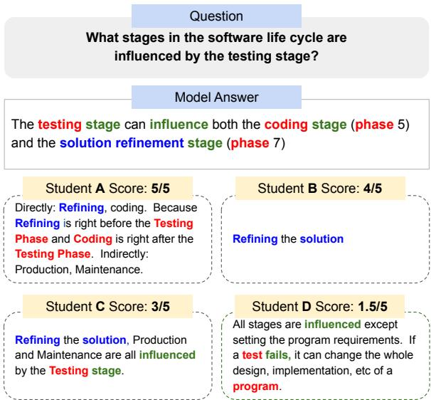  
Figure 1: A motivating example for using multiple relations in automatic short answer grading.

We hypothesise that a student’s answer will be considered correct if the keywords in the answer are in the right relationship with the corresponding words from the model answer. As can be seen from Figure 1, Student A is awarded full marks because the words like Testing Phase and Coding are adequately associated with words in the model answer like testing stage and coding phase. However, other students are awarded partial marks because not a lot of words in those correspond to some relation in the model answer, i.e. the decreasing score corresponds to the decreasing number of relations in the model answer being captured in the student response. This motivates us to incorporate structural relationship context information for effective comparison. We discuss the various types of relations captured in detail in the further sections.

This paper applies the principle of short text matching to solve the problem of grading short subjective student’s response. The key steps for textual matching are efficient textual representation, followed by semantic matching. In literature, we see that short text matching is broadly based on two approaches: sequence-based and structurebased. Sequence-based models fully exploit semantic information of sentences without incorporating syntactic information (Mueller and Thyagarajan, 2016), (He et al., 2015; Cer et al., 2018; Conneau et al., 2017; Agirre et al., 2014). Recent works by (Vashishth et al., 2019; Croce et al., 2011; Severyn et al., 2013) have found that the structural information of sentences is beneficial for sentence representation. Therefore, structurebased neural networks (Le et al., 2018; Yao et al., 2019; Huang et al., 2019), (Defferrard et al., 2016; Liu et al., 2020) exhibit better performance than sequence-based models. Graph Convolutional Network (GCN) (Kipf and Welling, 2016) can extract semantic and syntactic information of sentences simultaneously from the graph. GCN first propagates information among nodes and their neighbors and then provides node representation by aggre gating the received information. However, GCNs are designed for homogeneous graphs and cannot handle different types of nodes and relationships in the graph. Recently there have been attempts to explore relationships in the graphs. Schlichtkrull et al. (2018) introduces RGCN to handle relationships in knowledge graphs by using specific matrices for each relationship. Nevertheless, it focuses only on characteristics of the relations and does not study different types of features associated with a node.

This paper introduces a Multi-Relational Graph Transformer (MitiGaTe) for ASAG to incorporate the structural context. We first transform a sentence into an Abstract Meaning Representation (AMR) graph (Banarescu et al., 2013). AMR parses a sentence into a rooted directed graph. Then subgraphs are prepared corresponding to the relationships (types of edges) in the original AMR graph. For each subgraph, MitiGaTe prepares relationspecific token representations and aggregates them to obtain a subgraph representation. Finally, these relation-enriched subgraph representations of the student and the model answer are matched using multi-perspective matching (Wang et al., 2017) and the matching result yields the student score. We evaluate our model on the benchmark Mohler’s dataset (Mohler et al., 2011) and it outperforms the current state ofthe art models.

Our main contributions can be summarized as follows:

1. We propose a Graph Transformer-based technique to incorporate relation-enriched structural information for ASAG.

2. We also demonstrate that including the semantic representation of a relationship in the preparation of token embeddings improves the model’s overall performance.

3. We perform a case study to show that Miti-GaTe can provide reasonable feedback to students explaining the (in)correct parts of the student answer.

4. MitiGaTe is evaluated through extensive experiments on a benchmarking dataset. The experimental results verify our proposed model’s performance.

## 2 Related Work

ASAG: Traditional methods utilize handcrafted features, such as lexical similarity features (Dzikovska et al., 2013), graph alignment features (Mohler et al., 2011), n-gram features (Heilman and Madnani, 2013), soft cardinality text overlap features (Jimenez et al., 2013), averaged word vector text similarity features (Sultan et al., 2016) and other shallow lexical features (Ott et al., 2013). More recently, deep learning approaches have been utilized for the automatic short answer scoring task. Mueller and Thyagarajan (2016) proposed a siamese adaptation of the LSTM network for labelled data comprised of pairs of variable-length sequences. Zhao et al. (2017) proposed an efficient memory networks-powered automated scoring model. Riordan et al. (2017) explored simple LSTM and CNN-based architectures for short answer scoring. Kumar et al. (2017) proposed a method involving Siamese biLSTMs, a novel pooling layer based on the Sinkhorn distance between LSTM state sequences, and a support vector ordinal output layer. However, the approaches mentioned above do not incorporate the structural information, and as a result, the matching performed is partly inadequate (Croce et al., 2011; Severyn et al., 2013).

Application of GCN on NLP: GCN is a simplified graph neural network (GNN) introduced by (Kipf and Welling, 2016) to perform semi-supervised classification. In NLP, GCN is mainly explored in tasks such as semantic role labeling (Marcheggiani and Titov, 2017), machine translation (Bastings et al., 2017). Yao et al. (2019) first model a whole corpus as a graph where documents and words are regarded as nodes. However, most GNNs were designed for homogeneous graphs and could not handle different nodes and relations in heterogeneous graphs.

Unlike the existing methods, we consider the role of relations to improve the learning of more fine-grained node representation.

## 3 Methodology

We formally define the ASAG short text matching problem as follows: Given two sentences $\boldsymbol { \mathcal { A } } ^ { M } =$ $\left. { \bar { \it { w } } } _ { 1 } ^ { M } , w _ { 2 } ^ { M } , \dots \right\}$ and $\mathcal { A } ^ { S } = \{ w _ { 1 } ^ { S } , w _ { 2 } ^ { S } , \ldots \}$ , where $\mathcal { A } ^ { M }$ and $\mathcal { A } ^ { S }$ refers to Model and Student answer respectively with w as words in the sentence, the goal of a text-matching model $\mathbf { f } ( { \mathcal { A } } ^ { M } , { \mathcal { A } } ^ { S } )$ is to compute the semantic similarity of $\mathcal { A } ^ { M }$ and $\mathcal { A } ^ { S }$

In this section, we discuss a graph-based matching model. To create graphs from the input sentences, we first parse each sentence into an AMR graph (Section 3.1). Further, we prepare subgraphs $G _ { s u b }$ from AMR graphs corresponding to each relation (Section 3.2). The intuition behind subgraph splitting is to get relation-enriched structural information which can improve matching performance and interestingly can be used to provide a reasonable feedback to students (Section 5.5). We then create relation-specific token representation $\mathbf { h } _ { w , r }$ from each subgraph and aggregate them to a final subgraph representation denoted as $g _ { r , M } ^ { \phi }$ for model and $g _ { r , S } ^ { \phi }$ for student answer (Section 3.3). Lastly, we compare them in Section 3.4 to predict the grading score in Section 3.5.

As shown in Figure 3, our model consists of five layers namely, Text to AMR conversion, Subgraph preparation layer, Graph Transformer Encoder layer, Subgraph matching layer and lastly, score prediction layer. We discuss each layer below.

## 3.1 AMR Parsing

The meaning of a sentence is represented by AMR as a rooted directed graph. Here, nodes represent the concepts or predicates and are not always directly related to words. Edges in AMR represent the relations between concepts such as subject/object. AMR provides a high-level abstraction by capturing meaningful content but ignores functional and inflectional words in a sentence (Xu et al., 2021).

We choose AMR over dependency parser for sentence parsing because unlike the dependency structure of a sentence where each word token is a node in the dependency tree, AMR concepts and relations abstract away from actual word tokens. Content words generally become concepts while function words either become relations or get omitted if they do not contribute to the meaning of a sentence, which is more intuitive and suitable for the ASAG task, unlike dependency parser that merely extracts grammatical relations between entities. Further, the AMR parser parses semantically similar but syntactically dissimilar answers into nearly similar graphs, which ensures that students who answer differently are not penalised.

We use the AMR Model $\mathsf { A P I } ^ { 2 }$ from amrlib library to create AMR graphs $\mathcal { G } = ( \nu , \mathcal { E } )$ of a given input sentence . Each node $v \in V$ in the AMR graph represents a concept or predicate. Edge $e _ { i , j }$ denotes the specific relation type between nodes $v _ { i }$ and $v _ { j }$ . The details are dicussed in Section 4.2. AMR Graphs for student answers in Figure 1 are shown in Appendix A.

## 3.2 Subgraph Preparation Layer

We transform the original AMR graph into subgraphs based on the number of relations or types of edges in the graph. All the subgraphs have the same number of nodes as the original graph. However, only a particular type of edge is enabled, and all other types of edges are disabled in the subgraph corresponding to relation $r .$

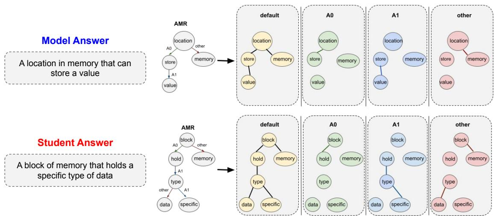  
Figure 2: Example to show subgraph splitting and intuition behind using AMR for ASAG task. Similar relations in model and student answers have similar structures. Example, location and store in model answer are connected as $A _ { 0 }$ and similarly block and hold in student answer are connected with $A _ { 0 }$ . This applies to other relations as well.

We first group all edge types into one to get a homogeneous subgraph referred to as the default subgraph default. The default subgraph is an undirected graph that contains the complete connected information in the original graph. Then we split the input graph into multiple subgraphs according to the edge types. Figure 2 demonstrates the subgraph preparation by an example.

AMR uses approximately 100 different relations to capture the semantics. Thus, it would be inefficient to capture all these relations in separate subgraphs as many of these occur rarely. In this work, we have used ARG1 and ARG0 relations to capture primary information, and all remaining relations are grouped as an other relation. We will be denoting ARG1 and ARG0 relations as $A _ { 1 }$ and $A _ { 0 }$ for the scope of this paper.

With reference to the PropBank3 guidelines, the $A _ { 0 }$ label is assigned to arguments which are understood as agents, causers or experiencers. The $A _ { 1 }$ label is usually assigned to the patient argument, i.e. the argument which undergoes the change of state or is being affected by the action. The other category could include relations for quantities like :unit, date-entities like :time, and semantic relations like :consist-of. More information about the various types of relations captured by AMR can be found in the original paper (Banarescu et al., 2013).

Hence, we can denote the collection of these subgraphs as $G _ { s u b } .$ , where,

$$
G _ { s u b } = \{ d e f a u l t , A _ { 0 } , A _ { 1 } , o t h e r \}\tag{1}
$$

## 3.3 Preparing Node and Subgraph Representation

In this layer, we prepare a relation-specific subgraph representation that reflects the characteristics of tokens in a particular relation. We perform two steps: firstly, we prepare relation-specific node representation using Graph Transformer and secondly, all relation-specific node representations are aggregated into a relation-specific subgraph representation. Below we discuss the process for tokens in $\mathcal { A } ^ { M }$ and the same process is applied to $\mathcal { A } ^ { S }$

## 3.3.1 Relation-Specific Node Representation

Our model is adapted from the Transformer model introduced by (Vaswani et al., 2017). It is a sequence-to-sequence neural architecture originally used for neural machine translation. It uses encoder-decoder architecture. The encoder consists of two sublayers: a self-attention mechanism and a position-wise feed-forward network. The selfattention mechanism employs H attention heads, and each of them learns a distinct attention function. Finally, the outputs of all attention heads are concatenated, followed by feed-forward layers, residual connections and normalization. The encoder computes the token representations iteratively using the output of the previous layer as input.

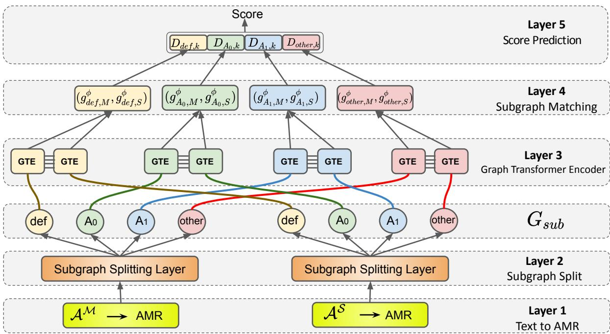  
Figure 3: The framework of the proposed model MitiGaTe employs Graph Transformer for learning the structural context of a sentence. Please refer to Section 3 for more details.

Transformer (Vaswani et al., 2017) treats the sentence as a fully-connected graph. In MitiGaTe, we mask the non-neighbor nodes’ attention while updating each node’s representation. Specifically, we mask the attention $w _ { i j }$ for node $j \notin \mathcal { N } _ { i } ^ { + }$ , where $\mathcal { N } _ { i } ^ { + }$ is the set of neighbors of node i in the graph including self-loop.

So given the input sequence $x = ( x _ { 1 } , \ldots , x _ { n } ) $ the output representation of node i, denoted as $h _ { i } ^ { l + \mathrm { 1 } }$ for l + 1th layer is computed as follows:

$$
h _ { i } ^ { l + 1 } = O _ { h } ^ { l } \vert \vert _ { k = 1 } ^ { H } ( \sum _ { j \in \mathcal { N } _ { i } ^ { + } } w _ { i j } ^ { k , l } V ^ { k , l } h _ { j } ^ { l } )\tag{2}
$$

$$
e _ { i j } ^ { l + 1 } = O _ { e } ^ { l } | | _ { k = 1 } ^ { H } ( \hat { w } _ { i j } ^ { k , l } )\tag{3}
$$

$$
w _ { i j } ^ { k , l } = \mathrm { s o f t m a x } _ { j } ( \hat { w } _ { i j } ^ { k , l } )\tag{4}
$$

$$
\hat { w } _ { i j } ^ { k , l } = ( \frac { Q ^ { k , l } h _ { i } ^ { l } \cdot K ^ { k , l } h _ { j } ^ { l } } { \sqrt { d _ { k } } } ) \cdot E ^ { k , l } e _ { i j } ^ { l }\tag{5}
$$

where $Q ^ { k , l } , K ^ { k , l } , V ^ { k , l } , E ^ { k , l } \in \mathbb R ^ { d _ { k } \times d } , O _ { h } ^ { l }$ $O _ { e } ^ { l }$ $\in \mathbb { R } ^ { d \times d }$ are trainable parameter matrices, k = 1 to H denotes the number of attention heads and denotes concatenation. Following (Dwivedi and Bresson, 2020) we explicitly incorporate edge representation $e _ { i j } ^ { l }$ to improve attention weights $w _ { i j } ^ { k , \hat { l } }$ . This above mentioned process of Graph Transformer is applied for each relation $r \in G _ { s u b }$ . For brevity, we denote node representation of the last layer as $h _ { w , r }$ where w represents a word and r denotes a specific relation.

A side point to note is that a subgraph has a single type of edge (a homogeneous graph), and therefore $e _ { i j } ^ { l }$ is the same within a Graph Transformer corresponding to relation r. However, $e _ { i j } ^ { l }$ gets updated over the layers similar to node representation $h _ { i } ^ { l } .$ . We think that it stores a semantic representation of a relation which helps in improving the predictions as described in Section 5.3.

## 3.3.2 Relation-Specific Subgraph Representation

In particular, this component takes $h _ { w , r } , r \in G _ { s u b }$ and computes relation-specific subgraph representation $g _ { r } ^ { \phi }$ as a mean of $h _ { w , r }$ using following equation:

$$
g _ { r , M } ^ { \phi } = \frac { \sum _ { w \in A _ { M } } h _ { w , r } } { | | \mathcal { A } _ { M } | | } , \forall r \in G _ { s u b }\tag{6}
$$

where $\lvert \lvert A _ { M } \rvert \rvert$ denotes the length of the sentence or the number of nodes in a subgraph. Similarly, we create $g _ { r , S } ^ { \phi }$ for the subgraphs associated with student textual sentence.

## 3.4 Graph Matching Layer

After obtaining all the subgraph representations which have syntactically and semantically rich information, we utilize the multi-perspective cosine

distance (Wang et al., 2017) to compare $g _ { r , M } ^ { \phi }$ and $g _ { r , S } ^ { \phi }$

$$
\mathcal { D } _ { r , k } = c o s i n e ( w _ { k } ^ { c o s } \odot g _ { r , M } ^ { \phi } , w _ { k } ^ { c o s } \odot g _ { r , S } ^ { \phi } )\tag{7}
$$

$$
\mathcal { D } = [ \mathcal { D } , \mathcal { D } _ { r , k } ]\tag{8}
$$

Where $k \in \{ 1 , 2 , \ldots , P \}$ (P is number of perspectives). $w _ { k } ^ { c o s }$ is a parameter vector, which assigns different weights to different perspectives. With $P$ perspectives $d _ { 1 } , d _ { 2 } , \ldots , d _ { P }$ , the $\mathcal { D } _ { r , k }$ is updated to $P$ size. The concatenation of two vectors is denoted using [., .], where  is initialized with a Null value and later it stores the concatenated value of all $\mathcal { D } _ { r , k }$ stores the matching score for all relation-specific subgraphs.

## 3.5 Score Prediction Layer

Student score Score is calculated by using a fully connected layer F F N which takes  as input and has an output layer of a single dimension.

$$
S c o r e = F F N ( { \mathcal { D } } )\tag{9}
$$

During training phase we have used RMSE loss, where $y _ { i }$ and $\hat { y } _ { i }$ represents the ground truth and predicted values respectively.

$$
R M S E = \sqrt { \frac { 1 } { n } \sum _ { i = 1 } ^ { N } ( y _ { i } - \hat { y } _ { i } ) ^ { 2 } }\tag{10}
$$

## 4 Experimental Setup

## 4.1 Dataset

In our experiments, we use the Mohler’s dataset (Mohler et al., 2011). It consists of 80 questions of an undergraduate Data Structures course. 2273 student responses are recorded in the dataset, which is evaluated independently by two academicians. We have considered the average scores as model scores. The score lies within a range of 0 to 5. We have considered it as a regression problem.

## 4.2 Data Processing

As described in section 3.1, we use the Model API from the amrlib library to create Abstract Meaning Representation graphs $\mathcal { G } = ( \nu , \mathcal { E } )$ of a given input sentence .

It is crucial to note that we consider the AMR representation as undirected while constructing the adjacency list. This can be intuitively justified as if there exists a relation (say A0) between $w _ { a }$ and $w _ { b } \ ( w _ { a }  w _ { b } )$ the same relation justifies $w _ { b } $ $w _ { a }$ , and could thus be helpful in the final score prediction.

When we parse an original sentence $s$ = $\{ w _ { 1 } , w _ { 2 } , . . . \mathrm { ~ } w _ { n } \}$ , we get a directed AMR graph. Our next step is to convert the AMR to a NetworkX4 graph. While creating the NetworkX graphs, the GloVe5 embeddings for all the words i.e. the nodes in the AMR graph, are embedded as features in the NetworkX graph. We apply Principal Component Analysis (PCA) (Abdi and Williams, 2010) on the original 300D Glove embeddings to reduce it to a lower dimension. Before feeding into the graph transformer, we convert all the NetworkX graphs to DGL format6. A similar procedure is repeated for all subgraphs.

It is noteworthy that in some cases, AMR representation contains certain phrases like have degree, which is actually a combination of two or more words (have and degree). Such phrases/words don’t have a GloVe representation and are thus treated as out-of-vocabulary.

## 4.3 Parameter Settings

The graph transformer has 2 layers since it gives the best results as observed in preliminary experiments. We use 4 attention heads as we observed that the model performance deteriorates if more/fewer heads are used as described in Section 5.4. We have also added self-loops to include each graph node while updating its representation. The subgraph representation is the mean of node representations. We use P = 16 in the graph matching layer, where $P$ is the number of perspectives defined in Section 3.4.

We employ the RMSProp optimizer to minimize RMSE loss. The batch size is set to 128 and the initial learning rate to 0.0007. The ‘ReduceLROn-Plateau’ scheduler is used to reduce the learning rate by a factor of 0.5 when the loss stagnates, with a patience level of 15 epochs. Our implementation uses PyTorch 7, a popular deep learning framework in Python. All experiments are run on Intel Xenon CPU with 1 Nvidia Quadro P5000 GPU.

## 4.4 Baselines and Metrics

For evaluating MitiGaTe on (Mohler et al., 2011) dataset, we compare against the following baselines. BOW (Mohler et al., 2011) is a simple model based on Bag Of Words. Tf-idf (Mohler et al., 2011) is a simple tf-idf similarity between $\mathcal { A } ^ { M }$ and $\mathcal { A } ^ { S }$ . Sultan et al. (Sultan et al., 2016), a fast, simple and high performance system which uses Random Forest classifier. Kumar et al. (Kumar et al., 2017) uses a Siamese LSTM network. Word2Vec, GloVe and FastText (Gaddipati et al., 2020) are context independent token embedding models. ELMO, GPT, BERT and GPT-2 (Gaddipati et al., 2020) are deep learning based context based token embedding models. GCN (Kipf and Welling, 2016) performs homogeneous graph convolutions. GAT (Hamilton et al., 2017) performs the attentive weighted sum to update node representation. GraphSAGE (Hamilton et al., 2017) is a framework for inductive representation learning. All GNN baselines use the default subgraph as input, and have 2 layers. RGCN (Schlichtkrull et al., 2018) employs relation specific transformation matrix to incorporate relations in the graph.

We use Root mean square error (RMSE) for performance evaluation, which gives a fair assessment of students’ responses. A lower metric value corresponds to better model.

## 5 Results and Analysis

In this section, we attempt to answer following questions: RQ1. How does each subgraph influence the final results? (Section 5.2) RQ2. Does incorporating edge representation while computing node representation improve the final results? (Section 5.3) RQ3. Can MitiGaTe provide feedback to students i.e. Why did a student lose marks? (Section 5.5)

## 5.1 Results on Mohler’s Data

Table 1 presents the results of our model on the Mohler’s dataset. We can see that our model outperforms all of the previous models by a significant margin. It demonstrates the importance of incorporating relation-enriched structural context in the tokens for effective text comparison. The existing baseline models can be categorized as (i) Handcrafted features (ii) Deep Learning-based models (iii) Word Embeddings based on sequential context information (iv) Graph-based, which store the structural information and relationship information.

ELMo outperforms the other transfer learning models. It is fundamentally a direct result of the capacity of the model to assign context-dependent word-vectors. RGCN performs better than other graph-based baselines because it incorporates the relation-specific information in the form of a heterogeneous graph. Nevertheless, it focuses only on the characteristics of the relations and does not study different types of features associated with a node. Our results establish that incorporating the relationenriched structural information (MitiGaTe) contributes to significant performance improvement in the downstream task. This observation is generic and can be applied to different applications beyond ASAG.

<table><tr><td rowspan=1 colspan=1>Model</td><td rowspan=1 colspan=1>Features</td><td rowspan=1 colspan=1>RMSE</td></tr><tr><td rowspan=3 colspan=1>BOWtf-idf</td><td rowspan=3 colspan=1>SVM RankSVRSVR</td><td rowspan=1 colspan=1>1.042</td></tr><tr><td rowspan=2 colspan=1>0.999</td></tr><tr><td rowspan=2 colspan=1>0.887</td></tr><tr><td rowspan=1 colspan=1>Sultan</td><td rowspan=1 colspan=1>LR + SIM</td></tr><tr><td rowspan=1 colspan=1>Kumar</td><td rowspan=1 colspan=1>Siamese</td><td rowspan=1 colspan=1>0.830</td></tr><tr><td rowspan=6 colspan=1>Word2VecGloVeFastText</td><td rowspan=1 colspan=1>SOWE</td><td rowspan=1 colspan=1>1.025</td></tr><tr><td rowspan=1 colspan=1>SIM+Verb</td><td rowspan=1 colspan=1>1.016</td></tr><tr><td rowspan=2 colspan=1>SOWESIM+Verb</td><td rowspan=1 colspan=1>1.036</td></tr><tr><td rowspan=1 colspan=1>1.002</td></tr><tr><td rowspan=2 colspan=1>SOWESIM+Verb</td><td rowspan=1 colspan=1>1.023</td></tr><tr><td rowspan=1 colspan=1>0.956</td></tr><tr><td rowspan=1 colspan=1>ELMO</td><td rowspan=1 colspan=1>SOWE</td><td rowspan=1 colspan=1>0.978</td></tr><tr><td rowspan=1 colspan=1>GPT</td><td rowspan=1 colspan=1>SOWE</td><td rowspan=1 colspan=1>1.082</td></tr><tr><td rowspan=1 colspan=1>BERT</td><td rowspan=1 colspan=1>SOWE</td><td rowspan=1 colspan=1>1.057</td></tr><tr><td rowspan=1 colspan=1>GPT-2</td><td rowspan=1 colspan=1>SOWE</td><td rowspan=1 colspan=1>1.065</td></tr><tr><td rowspan=1 colspan=1>GCN</td><td rowspan=1 colspan=1>HG</td><td rowspan=1 colspan=1>0.991</td></tr><tr><td rowspan=1 colspan=1>GAT</td><td rowspan=1 colspan=1>AWG</td><td rowspan=1 colspan=1>0.974</td></tr><tr><td rowspan=1 colspan=1>GraphSAGE</td><td rowspan=1 colspan=1>HG</td><td rowspan=1 colspan=1>0.986</td></tr><tr><td rowspan=1 colspan=1>RGCN</td><td rowspan=1 colspan=1>HtG</td><td rowspan=1 colspan=1>0.892</td></tr><tr><td rowspan=1 colspan=1>MitiGaTe</td><td rowspan=1 colspan=1>MRGT</td><td rowspan=1 colspan=1>0.762</td></tr></table>

Table 1: MitiGaTe Evaluation on Mohler Dataset (Mohler et al., 2011). SVM = Support Vector Machine, SVR = Support Vector Regression; LR = Length Ratio between desired answer and student answer; SIM = Similarity score; SOWE = Sum Of Word Embeddings; HG = Homogeneous Graph; AWG = Attention Weighted Graph, HtG = Heterogeneous Graph, MRGT = Multirelational Graph Transformer.

## 5.2 Influence of Subgraphs

In this section, we investigate how each subgraph influences the final results of our best model MitiGaTe. Table 2 shows the effect of using different combinations of relation-specific subgraphs on the result. Using only the default subgraph implies that the model does not consider the relational information in inputs, i.e., considers a simple homogeneous graph. We see that it performs better than GCN (mentioned in Table 1) because it uses a Graph Transformer encoder. On using $A _ { 0 }$ $A _ { 1 }$ and other subgraphs separately, the model performance degrades as they capture a subset of the relations captured by default.

<table><tr><td rowspan=1 colspan=1>Model</td><td rowspan=1 colspan=1>RMSE</td></tr><tr><td rowspan=1 colspan=1>MitiGaTe</td><td rowspan=1 colspan=1>0.762</td></tr><tr><td rowspan=2 colspan=1> $\operatorname { O n l y } d e f a u l t$  ${ \mathrm { O n l y ~ } } A _ { 0 }$  $\mathrm { O n l y } A _ { 1 }$  $\operatorname { O n l y } o t h e r$ </td><td rowspan=1 colspan=1>0.968</td></tr><tr><td rowspan=1 colspan=1>1.0171.0201.144</td></tr><tr><td rowspan=2 colspan=1> $\overline { { \mathrm { O n l y ~ } d e f a u l t } } + o t h e r$ Only $\mathop { d e f a u l t } + A _ { 1 }$ Only ${ d e f a u l t + A _ { 0 } }$ </td><td rowspan=1 colspan=1>1.178</td></tr><tr><td rowspan=1 colspan=1>0.9490.872</td></tr><tr><td rowspan=4 colspan=1> $\mathbf { M i t i G a T e } \cdot A _ { 0 }$  $\mathbf { M i t i G a T e } \cdot d e f a u l t$  $\mathbf { M i t i G a T e } - A _ { 1 }$  $\mathbf { M i t i G a T e } \cdot o t h e r$ </td><td rowspan=1 colspan=1>0.925</td></tr><tr><td rowspan=1 colspan=1>0.888</td></tr><tr><td rowspan=1 colspan=1>0.816</td></tr><tr><td rowspan=1 colspan=1>0.794</td></tr></table>

Table 2: Influence of relation-specific subgraphs on performance. MitiGaTe uses def ault + $A _ { 0 } + A _ { 1 }$ + other subgraphs.

Using the default subgraph along with the primary relations $A _ { 0 }$ and $A _ { 1 }$ improves the performance because incorporating multiple relations supplements the syntactic and semantic information. We think that the reason for performance degradation to 1.178 RMSE on using the other subgraph along with def ault, is that we have stored all remaining relations available in the AMR under the other class.

Furthermore we can observe that on removing the individual subgraphs one-by-one from Miti-GaTe, the performance deteriorates in all cases. These results corroborate the hypothesis that utilizing multi-relational information helps in improving the overall outcomes. The relation $A _ { 0 }$ stores the information related to agents or causers, and therefore it influences the results the most.

## 5.3 Influence of Edge Representations

Table 5.3 demonstrates that incorporating the edge representations in the graph transformer certainly helps in improving the attention weights, and therefore the overall results have improved significantly. The edge embeddings are initialized with random values, but they get updated in the layers of the graph transformer. As stated earlier, we expect that the edge embeddings store a relation’s semantic representation. From the results, we can infer that a relation’s semantic representation plays an essential role in the overall process.

<table><tr><td>Model</td><td>RMSE</td></tr><tr><td>MitiGaTe w/o edge representation</td><td>0.864</td></tr><tr><td>MitiGaTe w/ edge representation</td><td>0.762</td></tr></table>

## 5.4 Analysis of Parameters

We study the impact of the number of transformer layers and attention heads on MitiGaTe. The results are summarized in Figure 4. We vary the number of layers keeping the number of heads fixed as 4. The performance first improves with increasing layers as a deeper model receives better information from multi-hop neighbors. However, too many layers lead to performance degradation, and we see that this is due to the over-smoothing problem discussed by (Li et al., 2018). Next, the number of attention heads is varied keeping the number of layers fixed as 2. We observe that more attention heads improve the performance during training but are redundant during the testing. This is consistent with the observation of (Michel et al., 2019).

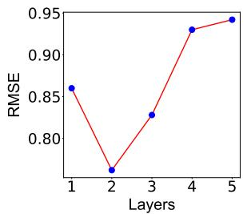

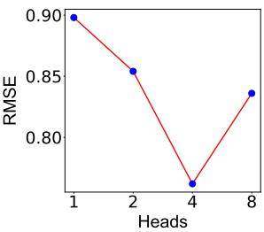  
Figure 4: Effect of parameters on RMSE (Layers, Heads).

## 5.5 Case Study: Feedback to Students

In addition to scoring a student response, a significant focus of the human evaluation is giving feedback on why a student lost marks. MitiGaTe matches tokens at the relation-level as illustrated in Figure 5. Student C scored 3/5 because of the corresponding matching of words belonging to the same relation in student and model answers. There exists the same relation $A _ { 1 }$ between words refine and solve, in model answer and words refine and solution in student answer. Similarly the other and $A _ { 0 }$ relations have been highlighted in the Figure 5. However, the student loses marks because there are a few relationships between words like code and phase in the model answer, which are not present in the student response. These relations can be used to highlight the (in)correct parts of the student answer. We see that the relational matching information intuitively acts as feedback to explain the final scores.

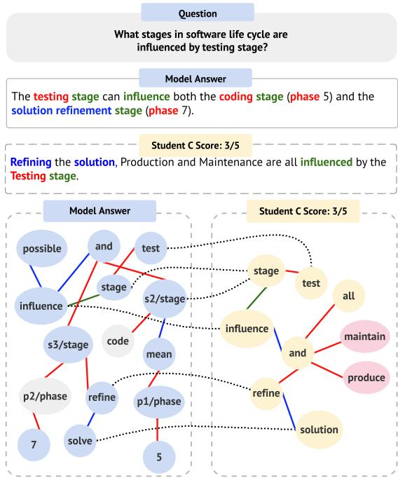  
Figure 5: Example from Figure 1, demonstrating how the model performs matching at the relation-level. The green, red and blue color edges indicate $A _ { 0 } , A _ { 1 } ,$ other relations respectively. Dotted lines denote the relationspecific token matching. Grey nodes indicate the missing content, and pink nodes denote the extra information provided in student answer.

## 6 Conclusion

In this paper, we have proposed MitiGaTe for ASAG. It prepares token embeddings considering the structural context of a sentence and thus provides a more efficient matching method by considering multiple relations at a granular level. Experimental results show that MitiGaTe outperforms the existing ASAG systems by a significant margin, and can be extended to give an intuitive feedback to explain the provided score.

In the future, we would like to investigate how to deal with long and multi-lingual answers. Our approach uses an AMR graph, and thus such tasks will need a compatible AMR parser. We also aim to incorporate the explainability of the final scoring to generate more comprehensive evaluator feedback.

## References

Hervé Abdi and Lynne J Williams. 2010. Principal component analysis. Wiley interdisciplinary reviews: computational statistics, 2(4):433–459.

Eneko Agirre, Carmen Banea, Claire Cardie, Daniel Cer, Mona Diab, Aitor Gonzalez-Agirre, Weiwei Guo, Rada Mihalcea, German Rigau, and Janyce Wiebe. 2014. Semeval-2014 task 10: Multilingual semantic textual similarity. In Proceedings of the 8th international workshop on semantic evaluation (SemEval 2014), pages 81–91.

Dimitrios Alikaniotis, Helen Yannakoudakis, and Marek Rei. 2016. Automatic text scoring using neural networks. arXiv preprint arXiv:1606.04289.

Laura Banarescu, Claire Bonial, Shu Cai, Madalina Georgescu, Kira Griffitt, Ulf Hermjakob, Kevin Knight, Philipp Koehn, Martha Palmer, and Nathan Schneider. 2013. Abstract Meaning Representation for sembanking. In Proceedings ofthe 7th Linguistic Annotation Workshop and Interoperability with Discourse, pages 178–186, Sofia, Bulgaria. Association for Computational Linguistics.

Jasmijn Bastings, Ivan Titov, Wilker Aziz, Diego Marcheggiani, and Khalil Sima’an. 2017. Graph convolutional encoders for syntax-aware neural machine translation. arXiv preprint arXiv:1704.04675.

Daniel Cer, Yinfei Yang, Sheng-yi Kong, Nan Hua, Nicole Limtiaco, Rhomni St John, Noah Constant, Mario Guajardo-Céspedes, Steve Yuan, Chris Tar, et al. 2018. Universal sentence encoder. arXiv preprint arXiv:1803.11175.

Alexis Conneau, Douwe Kiela, Holger Schwenk, Loic Barrault, and Antoine Bordes. 2017. Supervised learning of universal sentence representations from natural language inference data. arXiv preprint arXiv:1705.02364.

Danilo Croce, Alessandro Moschitti, and Roberto Basili. 2011. Structured lexical similarity via convolution kernels on dependency trees. In Proceedings of the 2011 Conference on Empirical Methods in Natural Language Processing, pages 1034–1046.

Michaël Defferrard, Xavier Bresson, and Pierre Vandergheynst. 2016. Convolutional neural networks on graphs with fast localized spectral filtering. Advances in neural information processing systems, 29:3844– 3852.

Vijay Prakash Dwivedi and Xavier Bresson. 2020. A generalization of transformer networks to graphs. arXiv preprint arXiv:2012.09699.

Myroslava O Dzikovska, Rodney D Nielsen, Chris Brew, Claudia Leacock, Danilo Giampiccolo, Luisa Bentivogli, Peter Clark, Ido Dagan, and Hoa T Dang. 2013. Semeval-2013 task 7: The joint student response analysis and 8th recognizing textual entailment challenge. Technical report, NORTH TEXAS STATE UNIV DENTON.

Sasi Kiran Gaddipati, Deebul Nair, and Paul G Plöger. 2020. Comparative evaluation of pretrained transfer learning models on automatic short answer grading. arXiv preprint arXiv:2009.01303.

Wael H Gomaa, Aly A Fahmy, et al. 2013. A survey of text similarity approaches. international journal of Computer Applications, 68(13):13–18.

William L Hamilton, Rex Ying, and Jure Leskovec. 2017. Inductive representation learning on large graphs. In Proceedings of the 31st International Conference on Neural Information Processing Systems, pages 1025–1035.

Sarah Hassan, Aly A. Fahmy, and Mohammad El-Ramly. 2018. Automatic short answer scoring based on paragraph embeddings. International Journal of Advanced Computer Science and Applications, 9(10).

Hua He, Kevin Gimpel, and Jimmy Lin. 2015. Multiperspective sentence similarity modeling with convolutional neural networks. In Proceedings ofthe 2015 conference on empirical methods in natural language processing, pages 1576–1586.

Michael Heilman and Nitin Madnani. 2013. Ets: Domain adaptation and stacking for short answer scoring. In Second Joint Conference on Lexical and Computational Semantics (\* SEM), Volume 2: Proceedings of the Seventh International Workshop on Semantic Evaluation (SemEval 2013), pages 275–279.

Lianzhe Huang, Dehong Ma, Sujian Li, Xiaodong Zhang, and Houfeng Wang. 2019. Text level graph neural network for text classification. arXiv preprint arXiv:1910.02356.

Sergio Jimenez, Claudia Becerra, and Alexander Gelbukh. 2013. Softcardinality: Hierarchical text overlap for student response analysis. In Second Joint Conference on Lexical and Computational Semantics (\* SEM), Volume 2: Proceedings ofthe Seventh International Workshop on Semantic Evaluation (SemEval 2013), pages 280–284.

Thomas N Kipf and Max Welling. 2016. Semisupervised classification with graph convolutional networks. arXiv preprint arXiv:1609.02907.

Sachin Kumar, Soumen Chakrabarti, and Shourya Roy. 2017. Earth mover’s distance pooling over siamese lstms for automatic short answer grading. In IJCAI, pages 2046–2052.

Yuquan Le, Zhi-Jie Wang, Zhe Quan, Jiawei He, and Bin Yao. 2018. Acv-tree: A new method for sentence similarity modeling. In IJCAI, pages 4137–4143.

Qimai Li, Zhichao Han, and Xiao-Ming Wu. 2018. Deeper insights into graph convolutional networks for semi-supervised learning. In Thirty-Second AAAI conference on artificial intelligence.

Xien Liu, Xinxin You, Xiao Zhang, Ji Wu, and Ping Lv. 2020. Tensor graph convolutional networks for text classification. In Proceedings ofthe AAAI Conference on Artificial Intelligence, volume 34, pages 8409–8416.

Diego Marcheggiani and Ivan Titov. 2017. Encoding sentences with graph convolutional networks for semantic role labeling. arXiv preprint arXiv:1703.04826.

Paul Michel, Omer Levy, and Graham Neubig. 2019. Are sixteen heads really better than one? Advances in Neural Information Processing Systems, 32:14014– 14024.

Michael Mohler, Razvan Bunescu, and Rada Mihalcea. 2011. Learning to grade short answer questions using semantic similarity measures and dependency graph alignments. In Proceedings of the 49th Annual Meeting ofthe Associationfor Computational Linguistics: Human Language Technologies, pages 752–762, Portland, Oregon, USA. Association for Computational Linguistics.

Jonas Mueller and Aditya Thyagarajan. 2016. Siamese recurrent architectures for learning sentence similarity. In Proceedings of the AAAI conference on artificial intelligence, volume 30.

Niels Ott, Ramon Ziai, Michael Hahn, and Detmar Meurers. 2013. Comet: Integrating different levels of linguistic modeling for meaning assessment. In Second Joint Conference on Lexical and Computational Semantics (\* SEM), Volume 2: Proceedings ofthe Seventh International Workshop on Semantic Evaluation (SemEval 2013), pages 608–616.

Brian Riordan, Andrea Horbach, Aoife Cahill, Torsten Zesch, and Chungmin Lee. 2017. Investigating neural architectures for short answer scoring. In Proceedings of the 12th Workshop on Innovative Use of NLP for Building Educational Applications, pages 159–168.

Michael Schlichtkrull, Thomas N Kipf, Peter Bloem, Rianne Van Den Berg, Ivan Titov, and Max Welling. 2018. Modeling relational data with graph convolutional networks. In European semantic web conference, pages 593–607. Springer.

Aliaksei Severyn, Massimo Nicosia, and Alessandro Moschitti. 2013. Building structures from classifiers for passage reranking. In Proceedings of the 22nd ACM international conference on Information & Knowledge Management, pages 969–978.

Md Arafat Sultan, Cristobal Salazar, and Tamara Sumner. 2016. Fast and easy short answer grading with high accuracy. In Proceedings of the 2016 Conference of the North American Chapter of the Association for Computational Linguistics: Human Language Technologies, pages 1070–1075.

Shikhar Vashishth, Manik Bhandari, Prateek Yadav, Piyush Rai, Chiranjib Bhattacharyya, and Partha Talukdar. 2019. Incorporating syntactic and semantic information in word embeddings using graph convolutional networks. In Proceedings ofthe 57th Annual Meeting of the Association for Computational Linguistics, pages 3308–3318.

Ashish Vaswani, Noam Shazeer, Niki Parmar, Jakob Uszkoreit, Llion Jones, Aidan N Gomez, Łukasz Kaiser, and Illia Polosukhin. 2017. Attention is all you need. In Advances in neural information processing systems, pages 5998–6008.

Zhiguo Wang, Wael Hamza, and Radu Florian. 2017. Bilateral multi-perspective matching for natural language sentences. arXiv preprint arXiv:1702.03814.

Weiwen Xu, Huihui Zhang, Deng Cai, and Wai Lam. 2021. Dynamic semantic graph construction and reasoning for explainable multi-hop science question answering. arXiv preprint arXiv:2105.11776.

Xi Yang, Yuwei Huang, Fuzhen Zhuang, Lishan Zhang, and Shengquan Yu. 2018. Automatic chinese short answer grading with deep autoencoder. In International Conference on Artificial Intelligence in Education, pages 399–404. Springer.

Liang Yao, Chengsheng Mao, and Yuan Luo. 2019. Graph convolutional networks for text classification. In Proceedings ofthe AAAI conference on artificial intelligence, volume 33, pages 7370–7377.

Siyuan Zhao, Yaqiong Zhang, Xiaolu Xiong, Anthony Botelho, and Neil Heffernan. 2017. A memoryaugmented neural model for automated grading. In Proceedings of the fourth (2017) ACM conference on learning@ scale, pages 189–192.

## A AMR Representation

In this section, we demonstrate the generated AMR graphs of the model and student answers shown in Figure 1.

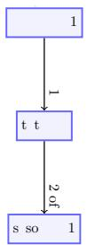  
Figure 6: Student B: Refining the solution

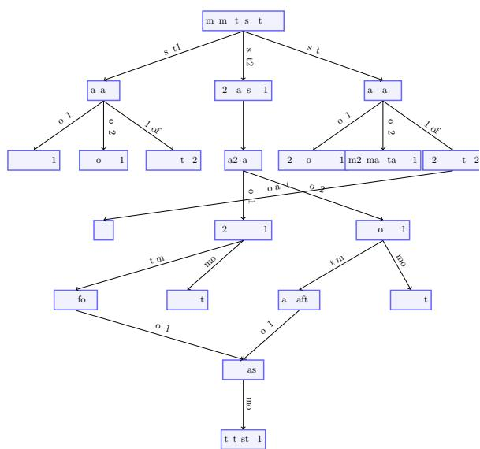  
Figure 7: Student A: Directly: Refining, coding. Because Refining is right before the Testing Phase and Coding is right after the Testing Phase. Indirectly: Production, Maintenance.

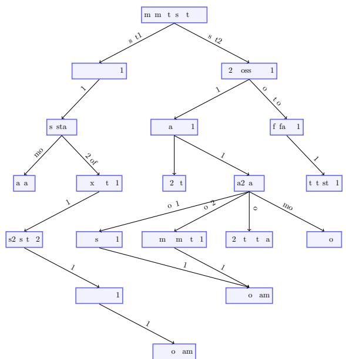  
Figure 8: Student D: All stages are influenced except setting the program requirements. Ifa testfails, it can change the whole design, implementation, etc ofa program.

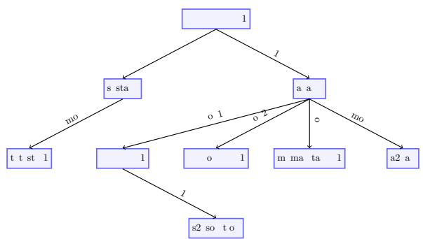  
Figure 9: Student C: Refining the solution, Production and Maintenance are all influenced by the Testing stage.

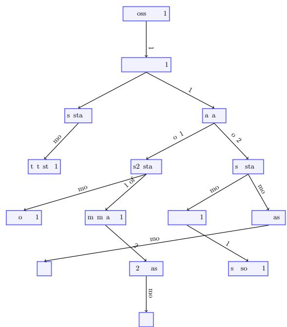  
Figure 10: Model Answer: The testing stage can influence both the coding stage (phase 5) and the solution refinement stage (phase 7)