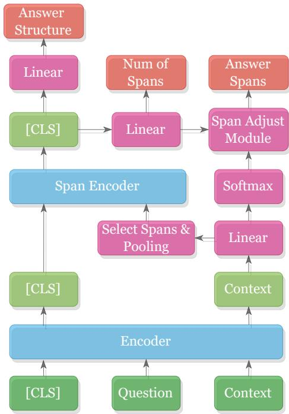
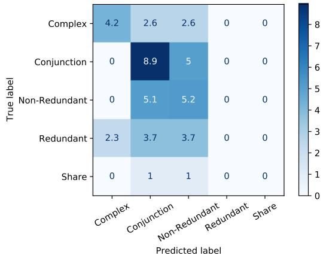

# MultiSpanQA: A Dataset for Multi-Span Question Answering

Haonan Li♠

Maria Vasardani♦

Martin Tomko♥

Timothy Baldwin♠,♣

School of Computing and Information Systems, The University of Melbourne Department of Infrastructure Engineering, The University of Melbourne Department of Geospatial Science, RMIT University Department of Natural Language Processing, MBZUAI

haonanl5@student.unimelb.edu.au, maria.vasardani2@rmit.edu.au tomkom@unimelb.edu.au, tb@ldwin.net

## Abstract

Most existing reading comprehension datasets focus on single-span answers, which can be extracted as a single contiguous span from a given text passage. Multi-span questions, i.e., questions whose answer is a series of multiple discontiguous spans in the text, are common in real life but are less studied. In this paper, we present MultiSpanQA1, a new dataset that focuses on questions with multi-span answers. Raw questions and contexts are extracted from the Natural Questions (Kwiatkowski et al., 2019) dataset. After multi-span re-annotation, MultiSpanQA consists of over a total of 6,000 multi-span questions in the basic version, and over 19,000 examples with unanswerable questions, and questions with single-, and multispan answers in the expanded version. We introduce new metrics for the purposes of multispan question answering evaluation, and establish several baselines using advanced models. Finally, we propose a new model which beats all baselines and achieves the state-of-the-art on our dataset.

## 1 Introduction

The task of reading comprehension, where models are required to process a text and answer questions about it, has seen rapid progress in recent years. As systems have increasingly matched humans on popular datasets (Rajpurkar et al., 2016, 2018), researchers have developed newer, more complex formulations of the task, such as very long contexts and answers (Kwiatkowski et al., 2019), multi-hop reasoning (Yang et al., 2018), and discrete operations over the content of paragraphs (Dua et al., 2019). One thing these datasets have in common is that the answer is constrained to be a single span that can be extracted or computed from the context.

However, in practice, the answer to a question will often consist of multiple parts. As in the example in Figure 1, the answer set contains 10 countries,

Question: Which countries does the Danube River flow through?

Passage: ... Originating in Germany, the Danube flows southeast for 2,850 km (1,770 mi), passing through or bordering Austria, Slovakia, Hungary, Croatia, Serbia, Romania, Bulgaria, Moldova and Ukraine before draining into the Black Sea. ...

Answer set: {Germany, Austria, Slovakia, Hungary, Croatia, Serbia, Romania, Bulgaria, Moldova, Ukraine }

Figure 1: Example of a multi-span question and answer pair.

some of which are discontiguous in the passage. Such cases are largely ignored in existing reading comprehension research, in part because there are no datasets of multi-span questions.

In this paper, we introduce MultiSpanQA, a new reading comprehension dataset consisting of 6,536 multi-span examples. The raw questions and passages are extracted from Natural Questions (“NQ”: Kwiatkowski et al. (2019)), a large-scale opendomain QA dataset. Trained annotators were asked to identify question–passage pairs where the answer was multi-span, and annotate the spans. In addition to the basic version of the dataset consisting entirely of multi-span answers, we also prepare an expanded version with a selection of unanswerable questions, and questions with single- and multispan answers, intended to reflect a more realistic QA setup.

We further classify answer semantics into 5 categories, and manually label the logical structure of the answer spans. We introduce metrics to evaluate multi-span QA systems across these different tasks.

We propose several baselines, and a new model which casts the task as a sequence tagging problem. The proposed model combines a sequence tagger with a span number predictor, span structure predictor, and span adjustment module. Experimental results show that the proposed model surpasses all baselines and achieves 59.28% exact-match F1 score and 76.50% partial-match F1 score.

To summarize, our contributions are:

A new reading comprehension dataset containing 6.5k high-quality multi-span answers, along with analysis and metrics for multi-span QA.

A novel label set for capturing the semantics of multi-span answers, with annotations.

A new model for multi-span reading comprehension which achieves state-of-the-art results on our dataset.

## 2 Related Work

## 2.1 Question Answering Datasets

Extractive QA Most existing extractive QA datasets such as SQuAD (Rajpurkar et al., 2016), SQuAD2.0 (Rajpurkar et al., 2018), SearchQA (Dunn et al., 2017), and QuAC (Choi et al., 2018) restrict the answer passage to a single span of text. SQuAD and SQuAD 2.0 limit the answer passage to a short paragraph from Wikipedia; the bestperforming systems have now exceeded human performance on these datasets. QuAC frames the task in a dialogue setting by introducing a teacher and student, where the student repeatedly asks the teacher questions about a topic and the teacher tries to find answers from the given passage. That is, it supports information seeking through multi-turn conversation. TriviaQA (Joshi et al., 2017) and HotpotQA (Yang et al., 2018) extend the answer context from single passage to multiple passages, while HotpotQA further requires reasoning over multiple passages to answer the question. However, all of these datasets limit the answer to a single text span from the provided answer context.

DROP (Dua et al., 2019) requires systems to resolve (possibly multiple) references in a question, and perform discrete operations (such as addition, sorting, or counting) over them. However, because these operations are mostly numeric, the spans are almost exclusively semantically homogeneous and related to numeric values. MASH-QA (Dua et al., 2019) extends the answer space to texts that span across a longer document, but this dataset is highly domain-specific, in the healthcare domain. Quoref (Dasigi et al., 2019) and Natural Questions (“NQ”: Kwiatkowski et al. (2019)) both contain multi-span answers. Quoref requires systems to resolve coreference among entities, to aid in span-selection. NQ is a large-scale dataset that provides questions with very long answer contexts. The proportion of multispan answers is around 10% and 2% in Quoref and NQ, respectively. However in each case, multispan answers are captured as a single span, with no annotation of the internal structure of the component spans. WikiHowQA and WebQA (Cui et al., 2021) both focus on non-factoid (e.g., how, why) questions, with answers mostly being long spans or full sentences.

Generative QA Generative QA datasets usually require systems to answer questions in the form of several sentences, either selected from the provided answer context or generated based on it. WikiQA (Yang et al., 2015) and MS Marco (Nguyen et al., 2016) are two open-domain generative QA datasets, where answers in WikiQA are mostly sentences from the answer passage, while answers in MS Marco are free-form sentences generated by crowd workers. NarrativeQA (Kociský et al., 2018) is a dataset of movie and book summaries. SearchQA (Dunn et al., 2017), ELI5 (Fan et al., 2019), and CoQA (Reddy et al., 2019) are three multiple-document datasets. SearchQA is constructed from question–answer pairs crawled from Jeopardy!, and most questions can be answered with a short (99% less than 5 tokens) extractive span from a single document. ELI5 requires systems to generate paragraph-length answers by summarizing information from multiple documents. CoQA contains conversational questions, with freeform text as answers.

Cloze style Cloze datasets such as CNN/Daily Mail (Hermann et al., 2015), Children’s Book Test (CBT) (Hill et al., 2016), and BookTest (Bajgar et al., 2016) require systems to predict a missing word from a passage. However, researchers have shown that this task is artificial, and can be largely solved with simple methods and relatively little reasoning (Chen et al., 2016).

## 2.2 Multi-span Models

Dua et al. (2019) proposed to predict the number of output spans for each question, by applying a single-span predictor recursively, making training complex. Segal et al. (2020) first proposed to treat multi-span QA as a sequence tagging task, in the form of a multi-head architecture (Dua et al., 2019) to perform arithmetic operations between the predicted spans. Hu et al. (2019) applied the non-maximum suppression (NMS) algorithm (Rosenfeld and Thurston, 1971) to prune redundant bounding boxes from the top-k predicted spans of a single-span predictor. Pang et al. (2019) proposed HAS-QA, which supports multi-span prediction by computing answer probabilities at the question, paragraph and span levels. A common feature of these works is that the predicted spans are fed into an aggregation module, and the answers are usually a single span chosen from the prediction, or a number computed from them. Cui et al. (2021) proposed a model which can extract list-form answers across multiple spans. Their work mainly focuses on capturing the sequential and progressive relationships between long-span descriptions.

## 3 Dataset Construction and Composition

In this section, we describe how we construct MultiSpanQA, and provide a statistical breakdown of its composition.

## 3.1 Data Collection and Preprocessing

The question–passage pairs were selected from Natural Questions (NQ: Kwiatkowski et al. (2019)), a large-scale open-domain QA dataset made up of (question, passage, long answer, short answer) quadruples where: the questions are real queries issued to the Google search engine; the passage is a Wikipedia page which may or may not contain the information required to answer the question; the long answer is a paragraph from the page containing all information required to infer the answer; and the short answer is one or more text spans that answer the question. Both long and short answers can be NULL if no viable answer candidate exists on the page.

To create MultiSpanQA, we first extract NQ questions annotated with multiple short answers, and consider the long answer to be the answer passage. We then remove paragraphs that don’t contain any question part, to eliminate the informationretrieval component of NQ and focus more on the short answer extraction problem. To make the dataset easy to use, we strip HTML from the passages, so that they only contain plain text. As table structure cannot be captured in the plain text after removing HTML, we remove the passages that contain tables. Ultimately, around 6700 candidates remain where each candidate is a triple of (question, passage, set of answer spans).

To aid the annotation process, we classifies the samples into 5 categories according to the expected answer type of questions using a BERT-based classifier trained on the TREC Question Classification dataset (Li and Roth, 2002). The classes are DE-SCRIPTION, LOCATION, HUMAN, NUMERIC, and OTHER ENTITY. Table 1 shows the breakdown and an example of each answer type class.

<table><tr><td>Answer type</td><td>%</td><td>Example</td></tr><tr><td>DESCRIPTION</td><td>16.4</td><td>other gases</td></tr><tr><td>LOCATION</td><td>18.6</td><td>Vermont</td></tr><tr><td>HUMAN</td><td>46.1</td><td>George Benson</td></tr><tr><td>NUMERIC</td><td>7.3</td><td>9,677 ft</td></tr><tr><td>OTHER ENTITY</td><td>15.4</td><td>Torah</td></tr></table>

Table 1: Proportion and examples of answer types in MultiSpanQA.

## 3.2 Issues in Existing Dataset

NQ was originally annotated by around 50 annotators, with an average annotation time of 80 seconds per instance. However, we found a number of issues with the dataset: (1) grammatical errors in questions, due to them being actual queries submitted to the Google search engine by real users; (2) answer boundary inconsistencies or errors, such as the entity University of Melbourne being annotated as an answer in one example but The University of Melbourne being annotated in another; and (3) wrong or incomplete answers: some questions are not answered or are answered incompletely in the annotated answer span, for example, to answer the question Which countries does the River Danube flow through?, 10 countries should be included in the answer span while only 9 are annotated. These issues are relatively uncommon overall in the dataset, but occur disproportionately in multi-span answers.

## 3.3 High Quality Re-annotation

We (re-)annotated all the data using the Brat annotation tool (Stenetorp et al., 2012).2 Three annotators were provided with a category-specific annotation guide (broken down across the 5 predicted answer types), and annotated the data on a per-category basis.3

For each annotation instance, we show the question, passage, and the original multiple answer spans to the annotator. The first-pass annotation was according to the following four categories:

<table><tr><td>Answer structure</td><td>%</td><td>Example</td></tr><tr><td>Conjunction</td><td>82.6</td><td>Q: What purpose do aircraft carriers serve for aircraft? Passage: carrying, arming, deploying, and recovering</td></tr><tr><td>Multi-part- disjunction (Redun- dant)</td><td>4.5</td><td>Q: When does the Force Unleashed 2 take place? Passage: The game takes place approximately six months after the events of the frst game, and a year before the frst Star Wars.</td></tr><tr><td>Multi-part- disjunction (Non- Redundant)</td><td>9.6</td><td>Q: When was the last year they made the Toyota Matrix? Passage: Sales of the Matrix were discontinued in the United States in 2013, and in Canada in 2014.</td></tr><tr><td>Complex</td><td>3.1</td><td>Q: When was the Battle of Dien Bien Phu and what was the result? Passage: The battle occurred between March and May 1954 and cul- minated in a comprehensive French defeat that influenced negotiations underway at Geneva among several nations over the future of Indochina.</td></tr><tr><td>Shared Structure</td><td>0.2</td><td>Q: What does Triangle Transit offer? Passage: scheduled, fixed-route regional and commuter bus service</td></tr></table>

Table 2: Answer structure breakdown and examples.

Good example: the question is clear, and the answer spans are labelled consistent with the annotation guide, in which case accept the instance as is.

Bad question: the question is ungrammatical or not aligned with the passage content, in which case rewrite the question while preserving its original intended meaning where possible (otherwise reject).

Bad answer span(s): the answer span(s) are incorrect or incomplete, in which case remove the inappropriate spans and select the correct spans.

Bad question–answer pair: the question doesn’t align with the passage content (e.g. there is no answer there) or there are not multiple answer spans in the passage (e.g. there is only a single answer span), in which case reject the instance.

Although all examples in our dataset contain multiple answer spans, the semantic structure varies considerably. We hand-annotate this via a novel 5-way annotation scheme, as follows (see Table 2 for examples):

1. CONJUNCTION: Each span is part of the answer, and the answer is complete only when all of the spans are combined

MULTI-PART-DISJUNCTION: Each span is a complete (but independent) answer to the question, with one of the following structures:

– 2. REDUNDANT: the multiple spans refer to the same concept or entity. For example, in the example in Table 2, each span is a full answer to the question, specified using different temporal reference points.

– 3. NON-REDUNDANT: the different spans refer to different concepts or entities, each of which is independently correct in its respective context. For example, in the example in Table 2 each span is independently correct in the context of a particular national market.

4. COMPLEX: The question is complex (made up of multiple sub-parts), and each span is an answer to a different sub-part, the internal logic of which is not enumeration. For example, in the example in Table 2, the two spans are independent answers to the two subquestions in the original question.

5. SHARED STRUCTURE: Spans are enumerated in the form of a syntactically-coordinated structure, sharing either a modifier or a head (i.e. the first word(s) of the first span or last word(s) of the last span). For example, in the example in Table 2, the three spans share the syntactic head bus service, and the full answer is equivalent to scheduled bus service + fixed-route regional bus service + commuter bus service.

<table><tr><td>#Spans</td><td>2</td><td>3</td><td>4-5</td><td>6-8</td><td>9-12</td><td>13-21</td></tr><tr><td>Count</td><td>3,791</td><td>1,414</td><td>915</td><td>337</td><td>71</td><td>8</td></tr></table>

Table 3: Number of answer spans in MultiSpanQA.

## 3.4 Dataset Statistics

The annotation was performed by three trained annotators with an average annotation time of 70 seconds per instance. To test the inter-annotator agreement (IAA), we randomly selected 100 instances for each pairing of the three annotators to anntotate. The same annotation (of all spans) of an instance is considered as an agreement, and any difference in one instance is considered as a disagreement. The average pairwise IAA is 0.86 for answer spans and 0.94 for answer structures (both based on macroaveraged exact match F1 score), with some disagreements between CONJUNCTION and MULTI-PART-DISJUNCTION (NON-REDUNDANT). To better understand the composition of MultiSpanQA, we compare our annotations with those in NQ, and provide some basic statistics. Compared to the original annotations in NQ, the annotators rejected 3.1% of instances, re-wrote the question for 5.6% of instances, and modified the answer span annotations for 22% of instances.

MultiSpanQA contains 6,536 instances with 5,230 for training, 653 for validation, and 653 for test. Table 3 provides the distribution of the number of answer spans in the dataset, from which we see the number of spans ranges from 2 to 21, but 80% of instances contain 2 or 3 spans, and only about 1% of instances contain more than 9 spans.

## 3.5 Dataset Expansion

In its basic form, the MultiSpanQA dataset contains only multiple-span answers, and the correct answer can always be located in the passage (in the form of multiple answer spans). However, in a real-world QA scenario, single-span answer questions and unanswerable questions (i.e. the answer is not contained in the passage) would realistically exist. To create a more realistic and challenging variant of the dataset, we add a comparable number of single-span question–answer pairs and unanswerable instances to MultiSpanQA, by randomly sampling from NQ and applying the same preprocessing. The total size of the expanded dataset is 19,608 instances (three times the basic version, partitioned similarly to the basic version).

## 4 Models

Formally, given a question and passage pair q, p , the task of multi-span QA involves finding all answer spans $s _ { 1 } , s _ { 2 } , . . . s _ { n }$ , which are neither duplicated nor overlap with each other, as well as predict the answer structures.

## 4.1 Baselines

Single-span Baseline Because most existing reading comprehension datasets only have singlespan answers, single-span architectures are widely used in reading comprehension research. Usually, a pre-trained model is used to encode the question and passage, and output a contextualised representation for all input tokens. Then two feed-forward networks are used to compute a score for each token which indicates whether the token is the start or end of the answer. Finally, a softmax layer followed by an argmax function is used to produce the start and end positions of the answer.

To make MultiSpanQA trainable for a singlespan architecture, we experimented with two preprocessing methods, and created two baselines accordingly:

1. Mark the start of the answer as the start position of the first answer span and mark the end of the answer as the end position of the last answer span. In this way, the model can learn to find the shortest span that includes all answer spans. We select the best prediction for evaluation.

2. Suppose an instance has n answer spans, we replace the instance with n instances, one for each span with a single-span answer.

In this way, we can apply single-span answer models to our dataset.

For evaluation, to enable multi-span prediction, we output the 20 highest-scoring predictions, and tune a threshold t to select the answer spans with a confidence score larger than t that optimises performance on the training set. We remove overlapping predictions based on confidence scores, rejecting predictions with lower confidence scores. Note that for both baselines, we apply the pre-processing to the training data only.

Sequence Tagging Baseline Following Segal et al. (2020), we cast question answering as a sequence tagging task, predicting for each token whether it is part of an answer. In our experiments, we use the popular IOB tagging scheme to mark answer spans in the passage where B denotes the first token of an answer span, I denotes subsequent tokens within a span, and O denotes tokens that are not part of an answer span.

  
Figure 2: Proposed multi-span QA model architecture.

## 4.2 Proposed Model

By investigating the failures of the sequence tagging baseline, we find there is an issue that the model struggles to capture global information. For example, the number of answer spans may be specified in the question, but cannot be imposed as a constraint on the tagger. To better use such global information, we propose a span encoder, a number of span predictor, an answer structure predictor, and a span adjustment module (as in Figure 2), which can be combined with any on-the-fly sequence tagger (encoder).

Contextualiseed Encoder Given a pair of question $q$ and passage $p ,$ we first encode the question and context together using a sequence pair encoder as:

$$
H = { \mathrm { E n c o d e r } } ( \langle q , p \rangle ) \in \mathbb { R } ^ { l \times h }\tag{1}
$$

where $H = [ H _ { [ C L S | } ; H _ { q } ; H _ { p ] }$ is the contextualised token representation of all input tokens with a pooled global token [CLS], h is the hidden-layer size, and l is the input length.

After encoding, we fetch the hidden states of the context tokens and input them to a linear classifier to perform a preliminary token-level answer span

prediction, as:

$$
T _ { p } = F F N ( H _ { p } ) \in \mathbb { R } ^ { l _ { p } \times t }\tag{2}
$$

where $l _ { p }$ denotes the length of passage, and t denotes the number of labels $( t = 3$ in for IOB tagging scheme).

Span Encoder According to the arg max of preliminary predictions $T _ { p } { \mathrm { : } }$ , we take the continuous token representations of the predicted spans as span representation $s _ { 1 } , s _ { 2 } , . . . s _ { n } ,$ where $s _ { i } =$ $[ H _ { s _ { i } } , H _ { s _ { i } + 1 } , . . . H _ { s _ { i } + k - 1 } ] \in \mathbb { R } ^ { k \times h }$ , k is the length of the span, which varies across spans. Average pooling is then applied to the span representations $s _ { i }$ to generate a fixed-length span representation $S _ { i } \in \mathbb { R } ^ { 1 \times h }$

We then concat the hidden state of [CLS] token $H _ { [ C L S ] }$ with the span representations $S _ { i }$ as ${ \cal I } _ { s p a n } \dot { = } [ \ddot { H _ { [ C L S ] } } , S _ { 1 } , . . . S _ { n } ]$ , and input them into a span encoder as:

$$
I = { \mathrm { S p a n E n c o d e r } } ( I _ { s p a n } ) \in \mathbb { R } ^ { ( n + 1 ) \times h }\tag{3}
$$

Objective Function We fetch the hidden state of span-level [CLS] token $I _ { [ C L S ] }$ and input it to two feed-forward networks to predict the number of answer spans and the answer structure, respectively, as below:

$$
P _ { n u m } = F F N ( I _ { [ C L S ] } )\tag{4}
$$

$$
P _ { s t r u c t u r e } = F F N ( I _ { [ C L S ] } )\tag{5}
$$

We use cross-entropy loss for answer span and structure prediction, and mean-square loss for span number regression. For training, we use the weighted sum of the three losses:

$$
\mathcal { L } = \mathcal { L } _ { s p a n s } + \lambda _ { 1 } \mathcal { L } _ { n u m } + \lambda _ { 2 } \mathcal { L } _ { s t r u c t u r e }\tag{6}
$$

Finally, a span adjustment module is used to explicitly combine the predicted span number with the span texts. We first assign a confidence score to each label of the preliminary classification using a softmax layer:

$$
\alpha _ { c o n f } = \mathrm { s o f t m a x } ( U _ { p } ) \in \mathbb { R } ^ { l _ { p } \times t }\tag{7}
$$

The confidence of a predicted answer span $a _ { i }$ is defined as the maximum confidence of the tokens within $a _ { i } .$ . Suppose there are k spans that been tagged as answers and the predicted number of span is n, if $n < k .$ , we rank the predicted spans by confidence score, and keep the top-n answer spans as answers.

<table><tr><td rowspan="2">Method</td><td colspan="6">MultiSpanQA</td><td colspan="6">MultiSpanQA (expand)</td></tr><tr><td colspan="3">Exact Match</td><td colspan="3">Partial Match</td><td colspan="3">Exact Match</td><td colspan="3">Partial Match</td></tr><tr><td></td><td>P</td><td>R</td><td>F</td><td>P</td><td>R</td><td>F</td><td>P</td><td>R</td><td>F</td><td>P</td><td>R</td><td>F</td></tr><tr><td>Single (v1)</td><td>1.07</td><td>0.37</td><td>0.55</td><td>28.04</td><td>69.99</td><td>40.04</td><td>8.98</td><td>5.53</td><td>6.85</td><td>59.83</td><td>71.27</td><td>65.05</td></tr><tr><td>Single (v1) + t</td><td>1.32</td><td>0.53</td><td>0.76</td><td>27.89</td><td>73.48</td><td>40.44</td><td>8.81</td><td>5.82</td><td>7.01</td><td>57.63</td><td>73.03</td><td>64.42</td></tr><tr><td>Single (v2)</td><td>15.92</td><td>5.55</td><td>8.23</td><td>58.86</td><td>48.23</td><td>53.02</td><td>12.60</td><td>7.77</td><td>9.61</td><td>67.64</td><td>58.36</td><td>62.66</td></tr><tr><td>Single (v2) + t</td><td>16.20</td><td>12.98</td><td>14.41</td><td>60.31</td><td>76.78</td><td>67.56</td><td>13.36</td><td>12.05</td><td>12.66</td><td>63.01</td><td>73.09</td><td>67.73</td></tr><tr><td>Tagger</td><td>52.45</td><td>61.11</td><td>56.45</td><td>75.91</td><td>74.53</td><td>75.22</td><td>39.43</td><td>43.54</td><td>41.38</td><td>70.79</td><td>69.42</td><td>70.10</td></tr><tr><td>Multi (joint)</td><td>54.51</td><td>62.55</td><td>58.25</td><td>77.53</td><td>75.49</td><td>76.50</td><td>40.14</td><td>42.88</td><td>41.47</td><td>73.09</td><td>69.68</td><td>71.35</td></tr><tr><td>Multi (full)</td><td>58.12</td><td>60.50</td><td>59.28</td><td>79.56</td><td>73.23</td><td>76.26</td><td>42.74</td><td>41.81</td><td>42.26</td><td>74.05</td><td>68.06</td><td>70.47</td></tr></table>

Table 4: Model performance on MultiSpanQA test set. “Single” without “t” means the single-span baseline with single-span prediction. “Single” with $\mathbf { \ddot { \Delta t } } ^ { \prime \prime }$ means we additionally tune a confidence score threshold to choose multiple spans from the n-best single-span predictions. “Tagger” means the sequence tagging baseline. “Multi (joint)” represents the proposed tagger model joint training with span number prediction and structure prediction, “Multi (full)” signifies “Multi (joint)” with the proposed span adjustment module.

<table><tr><td rowspan="2">Answer Type</td><td colspan="3">Exact Match</td><td rowspan="2">Structure</td></tr><tr><td>P</td><td>R</td><td>F</td></tr><tr><td>DESCRIPTION</td><td>25.56</td><td>34.34</td><td>29.31</td><td>82.50</td></tr><tr><td>LOCATION</td><td>57.22</td><td>67.30</td><td>61.85</td><td>93.06</td></tr><tr><td>HUMAN</td><td>70.10</td><td>75.55</td><td>72.72</td><td>84.83</td></tr><tr><td>NUMERIC</td><td>41.02</td><td>44.13</td><td>42.52</td><td>72.41</td></tr><tr><td>OTHER ENTITY</td><td>64.89</td><td>65.08</td><td>64.99</td><td>77.55</td></tr></table>

Table 5: Results on MultiSpanQA (expanded) dev set over different question types.

## 5 Experiments

## 5.1 Setup

For all baselines and our model, we use the HuggingFace implementation of $B E R T _ { B a s e }$ (Wolf et al., 2019; Devlin et al., 2019) as our encoder with max\_sequence\_length = 512 and doc\_stride = 128 to deal with long passages. For the proposed span encoder, we use a multi-head self-attention layer with 4 heads followed by a linear layer to encode the spans. The maximum span number is set to 30 for the input of the span encoder. For training, we use the BertAdam optimizer with default hyperparameters and learning rate of 3e-5. All models are trained with a batch size of 4 for 3 epochs. We use a two-layer feed-forward network with a ReLU activation function for all linear layers.

## 5.2 Evaluation Metrics

For answer structure prediction, we use accuracy to evaluate the model performance. For answer span prediction, we evaluate in terms of exact match and partial match performance.

Exact match An exact match occurs when a prediction fully matches one of the ground-truth answers, and the F1 score is computed by treating the predicted and ground-truth answer spans as a set of spans. We use micro-averaged precision, recall, and F1 score for evaluation based on the standard formulation of Precision $= T P / ( T P + F P )$ $\mathrm { R e c a l l } \ = \ T P / ( T P + F N )$ , and ${ \mathrm { F } } 1 ~ = ~ 2 ~ *$ Precision Recall /(Precision + Recall), where TP (True Positive) is the number of answer spans correctly predicted by the model, F P (False Positive) is the number of spans incorrectly predicted by the model, and FN (False Negative) is the number of answer spans not predicted by the model. In the case of an unanswerable question with the expanded dataset, we use a virtual span which indicates no answer.

Partial Match To measure the overlap between the predictions and ground truth answers, we propose the partial match precision, recall, and F1 by treating each predicted span or ground-truth answer span as a string. In detail, for each pair of prediction $p _ { i }$ and ground truth answer $t _ { j }$ , we define the partial retrieved score and partial relevant score as the length of the longest common substring (LCS) between $p _ { i }$ and $t _ { j }$ , divided by the length of $p _ { i }$ and $t _ { j } .$ , respectively, as:

$$
s _ { i j } ^ { r e t } = l e n ( L C S ( p _ { i } , t _ { j } ) ) / l e n ( p _ { i } )\tag{8}
$$

$$
s _ { i j } ^ { r e l } = l e n ( L C S ( p _ { i } , t _ { j } ) ) / l e n ( t _ { j } )\tag{9}
$$

Suppose there are n predictions and m ground truth answers for a question. Since we do not know the correspondence between predictions and answers, we compute the partial retrieved score between a prediction and all answers and keep the highest one as the retrieved score of the prediction. Similarly, for each ground truth answer, the relevant score is the highest one between it and all predictions. The precision, recall, and F1 are finally defined as follows:

<table><tr><td rowspan="2">#Span</td><td colspan="3">Exact Match</td><td rowspan="2">Structure</td></tr><tr><td>P</td><td>R</td><td>F</td></tr><tr><td>1</td><td>34.95</td><td>45.09</td><td>39.38</td><td>Acc</td></tr><tr><td>2-3</td><td>54.13</td><td>64.08</td><td>58.69</td><td>81.92</td></tr><tr><td>4-7</td><td>62.50</td><td>63.70</td><td>63.09</td><td>91.89</td></tr><tr><td>&gt;7</td><td>82.25</td><td>71.83</td><td>76.69</td><td>81.25</td></tr></table>

Table 6: Results on MultiSpanQA (expanded) dev set categorised by number of spans.

$$
\operatorname { P r e c i s i o n } = { \frac { \sum _ { i = 1 } ^ { n } \operatorname* { m a x } _ { j \in [ 1 , m ] } ( s _ { i j } { } ^ { r e t } ) } { n } }\tag{10}
$$

$$
{ \mathrm { R e c a l l } } = { \frac { \sum _ { j = 1 } ^ { m } \operatorname* { m a x } _ { i \in [ 1 , n ] } ( s _ { i j } ^ { \ r e l } ) } { m } }\tag{11}
$$

$$
\mathrm { F 1 } = \frac { \mathrm { 2 } * \mathrm { P r e c i s i o n } * \mathrm { R e c a l l } } { \mathrm { P r e c i s i o n } + \mathrm { R e c a l l } }\tag{12}
$$

We use micro-averaged scores for all metrics.

## 5.3 Results and Analysis

Table 4 shows the dev set results on MultiSpanQA, where the left part is results on multi-span questions only (the basic dataset), and the right part is the results on the expanded dataset (including singlespan answers and unanswerable questions).

Single-span model From the table, we see that single-span (v1) gets very low exact match scores but higher partial match scores (compared to exact match), as it is trained to find a single long span that overlaps with all answer spans. By comparison, single-span (v2) improves the exact match scores on the basic dataset because it is trained on independent single-span answers. This is also the reason that: (1) single-span (v1) always gets a lower score in partial match precision and a higher score in partial match recall compared with single model (v2); and (2) after applying the tuned threshold, singlespan (v2) gets a clear boost while single-span (v1) does not exhibit a substantial change in results. The overall performance of the single-span baselines is relatively low, simply because the models can only predict a single-span answer, which is incompatible with the MultiSpanQA dataset.

Sequence tagging model Compared to the single-span baselines, the sequence tagging models perform much better. Without changing the encoder, there is an improvement of over 30 absolute points on the exact match metrics, and about 8 for the partial match F1 metric in MultiSpanQA. Performance is boosted using joint training with span number prediction and answer semantics prediction. Our proposed model achieves the best F1 score in most settings.

Another interesting finding is that single-span models usually attain higher precision, while sequence tagging models attain higher recall. This demonstrates that single-span models are more accurate in the single-span answer they predict, while sequence tagging models predictably tend to make more predictions.

Comparing the two datasets Comparing results on the two datasets, we see that single-span baselines are boosted over the expanded dataset (where we add single-span answers and unanswerable questions), as single-span answers are more tractable for these simpler models. The relative improvements for sequence tagging models are more modest, but they still have a clear advantage over the single-span baselines.

Difficulty analysis To explore the difficulty of the MultiSpanQA dataset, we report the dev set results categorised by answer type in Table 5 and categorised by the number of spans in Table 6. From the answer type perspective, the model performs best on HUMAN questions, followed by OTHER ENTITY and LOCATION (largely following the natural distribution of the respective classes in the dataset). There is quite a drop for the NUMERIC class, and a big drop again for the DESCRIPTION class, which was also the class our annotators found most difficulty with.

From the perspective of the number of spans, the model performs best on questions with many (> 7) answers. We think this is because the answers are usually a list of spans with similar semantics, often structured as a simple coordination. The performance drops as the answer number decreases because the syntactic pattern in which answer spans occurs is less predictable.

Answer Semantics From the answer type perspective, LOCATION answers usually have easily predictable structure, while the structure of NU-MERIC answers is the most difficult to predict.

  
Figure 3: Confusion matrix of answer structure prediction, based on log values.

From the perspective of the number of spans, answers consisting of 4–7 spans are relatively easy to predict and there is no significant difference between answers contain few (2 or 3) spans or many (> 7) spans. Figure 3 shows the confusion matrix of the answer structure predictions. We can see that our model tends to predict CONJUNCTION and NON-REDUNDANT, and there are no REDUNDANT or SHARE predictions.

The overall answer structure accuracy is 84.38%, which is slightly higher than the proportion of CONJUNCTION (the majority class) in the dataset. This suggests that directly applying a simple feedforward network to the pooled encoder output is ineffective for answer semantics prediction, and that this should be an area for future model refinement.

## 6 Conclusion

We present MultiSpanQA, a reading comprehension dataset where answers consist of multiple discrete spans. As part of this, we proposed a method for classifying the semantic structure of answers, based on the semantic relation between answer spans. We also provide an expanded version of the dataset which includes unanswerable questions and single-answer questions, to make it both more challenging and more realistic. We additionally presented a number of models for multi-span QA extraction, and found that the best-performing model was sequence tagging-based, augmented by a span number prediction module and span adjustment module.

## Acknowledgements

The authors would like to thank the anonymous reviewers for their constructive reviews. This research was undertaken using the LIEF HPC-GPGPU Facility hosted at the University of Melbourne. This Facility was established with the assistance of LIEF Grant LE170100200. This research was supported by Australian Research Council grant DP170100109.

## References

Ondrej Bajgar, Rudolf Kadlec, and Jan Kleindienst. 2016. Embracing data abundance: BookTest dataset for reading comprehension. CoRR, abs/1610.00956.

Danqi Chen, Jason Bolton, and Christopher D. Manning. 2016. A thorough examination of the CNN/daily mail reading comprehension task. In Proceedings of the 54th Annual Meeting of the Association for Computational Linguistics (Volume 1: Long Papers), pages 2358–2367, Berlin, Germany. Association for Computational Linguistics.

Eunsol Choi, He He, Mohit Iyyer, Mark Yatskar, Wentau Yih, Yejin Choi, Percy Liang, and Luke Zettlemoyer. 2018. QuAC: Question answering in context. In Proceedings of the 2018 Conference on Empirical Methods in Natural Language Processing, pages 2174–2184.

Peng Cui, Dongyao Hu, and Le Hu. 2021. ListReader: Extracting list-form answers for opinion questions. CoRR, abs/2110.11692.

Pradeep Dasigi, Nelson F. Liu, Ana Marasovic, Noah A. Smith, and Matt Gardner. 2019. Quoref: A reading comprehension dataset with questions requiring coreferential reasoning. In Proceedings of the 2019 Conference on Empirical Methods in Natural Language Processing and the 9th International Joint Conference on Natural Language Processing, pages 5924–5931.

Jacob Devlin, Ming-Wei Chang, Kenton Lee, and Kristina Toutanova. 2019. BERT: pre-training of deep bidirectional transformers for language understanding. In Proceedings ofthe 2019 Conference of the North American Chapter of the Association for Computational Linguistics: Human Language Technologies, Minneapolis, USA, pages 4171–4186.

Dheeru Dua, Yizhong Wang, Pradeep Dasigi, Gabriel Stanovsky, Sameer Singh, and Matt Gardner. 2019. DROP: A reading comprehension benchmark requiring discrete reasoning over paragraphs. In Proceedings of the 2019 Conference of the North American Chapter of the Association for Computational Linguistics: Human Language Technologies, pages 2368–2378.

Matthew Dunn, Levent Sagun, Mike Higgins, V. Ugur Güney, Volkan Cirik, and Kyunghyun Cho. 2017. SearchQA: A new Q&A dataset augmented with context from a search engine. CoRR, abs/1704.05179.

Angela Fan, Yacine Jernite, Ethan Perez, David Grangier, Jason Weston, and Michael Auli. 2019. ELI5: long form question answering. In Proceedings of the 57th Conference ofthe Associationfor Computational Linguistics, pages 3558–3567.

Karl Moritz Hermann, Tomás Kociský, Edward Grefenstette, Lasse Espeholt, Will Kay, Mustafa Suleyman, and Phil Blunsom. 2015. Teaching machines to read and comprehend. In Annual Conference on Neural Information Processing Systems, pages 1693–1701.

Felix Hill, Antoine Bordes, Sumit Chopra, and Jason Weston. 2016. The Goldilocks principle: Reading children’s books with explicit memory representations. In 4th International Conference on Learning Representations.

Minghao Hu, Yuxing Peng, Zhen Huang, and Dongsheng Li. 2019. A multi-type multi-span network for reading comprehension that requires discrete reasoning. In Proceedings of the 2019 Conference on Empirical Methods in Natural Language Processing and the 9th International Joint Conference on Natu ral Language Processing, pages 1596–1606.

Mandar Joshi, Eunsol Choi, Daniel S. Weld, and Luke Zettlemoyer. 2017. TriviaQA: A large scale distantly supervised challenge dataset for reading comprehension. In Proceedings ofthe 55th Annual Meeting of the Association for Computational Linguistics, pages 1601–1611.

Tomás Kociský, Jonathan Schwarz, Phil Blunsom, Chris Dyer, Karl Moritz Hermann, Gábor Melis, and Edward Grefenstette. 2018. The NarrativeQA reading comprehension challenge. Transactions of the Association for Computational Linguistics, 6:317– 328.

Tom Kwiatkowski, Jennimaria Palomaki, Olivia Redfield, Michael Collins, Ankur P. Parikh, Chris Alberti, Danielle Epstein, Illia Polosukhin, Jacob Devlin, Kenton Lee, Kristina Toutanova, Llion Jones, Matthew Kelcey, Ming-Wei Chang, Andrew M. Dai, Jakob Uszkoreit, Quoc Le, and Slav Petrov. 2019. Natural Questions: A benchmark for question answering research. Transactions of the Association for Computational Linguistics, 7:452–466.

Xin Li and Dan Roth. 2002. Learning question classifiers. In 19th International Conference on Computational Linguistics.

Tri Nguyen, Mir Rosenberg, Xia Song, Jianfeng Gao, Saurabh Tiwary, Rangan Majumder, and Li Deng. 2016. MS MARCO: A human generated machine reading comprehension dataset. In Proceedings

of the Workshop on Cognitive Computation: Integrating Neural and Symbolic Approaches 2016 colocated with the 30th Annual Conference on Neural Information Processing Systems, volume 1773.

Liang Pang, Yanyan Lan, Jiafeng Guo, Jun Xu, Lixin Su, and Xueqi Cheng. 2019. HAS-QA: hierarchical answer spans model for open-domain question answering. In The Thirty-Third AAAI Conference on Artificial Intelligence, pages 6875–6882.

Pranav Rajpurkar, Robin Jia, and Percy Liang. 2018. Know what you don’t know: Unanswerable questions for SQuAD. In Proceedings of the 56th Annual Meeting of the Association for Computational Linguistics, pages 784–789.

Pranav Rajpurkar, Jian Zhang, Konstantin Lopyrev, and Percy Liang. 2016. SQuAD: 100,000+ questions for machine comprehension of text. In Proceedings of the 2016 Conference on Empirical Methods in Natural Language Processing, pages 2383–2392.

Siva Reddy, Danqi Chen, and Christopher D. Manning. 2019. CoQA: A conversational question answering challenge. Transactions of the Association for Computational Linguistics, 7:249–266.

Azriel Rosenfeld and Mark Thurston. 1971. Edge and curve detection for visual scene analysis. IEEE Transactions on Computers, 20(5):562–569.

Elad Segal, Avia Efrat, Mor Shoham, Amir Globerson, and Jonathan Berant. 2020. A simple and effective model for answering multi-span questions. In Proceedings ofthe 2020 Conference on Empirical Methods in Natural Language Processing, pages 3074– 3080.

Pontus Stenetorp, Sampo Pyysalo, Goran Topic,´ Tomoko Ohta, Sophia Ananiadou, and Jun’ichi Tsujii. 2012. brat: a web-based tool for NLP-assisted text annotation. In Proceedings of the Demonstrations at the 13th Conference of the European Chapter ofthe Associationfor Computational Linguistics, pages 102–107, Avignon, France. Association for Computational Linguistics.

Thomas Wolf, Lysandre Debut, Victor Sanh, Julien Chaumond, Clement Delangue, Anthony Moi, Pierric Cistac, Tim Rault, Rémi Louf, Morgan Funtowicz, and Jamie Brew. 2019. HuggingFace’s transformers: State-of-the-art natural language processing. CoRR, abs/1910.03771.

Yi Yang, Wen-tau Yih, and Christopher Meek. 2015. WikiQA: A challenge dataset for open-domain question answering. In Proceedings of the 2015 Conference on Empirical Methods in Natural Language Processing, pages 2013–2018.

Zhilin Yang, Peng Qi, Saizheng Zhang, Yoshua Bengio, William W. Cohen, Ruslan Salakhutdinov, and Christopher D. Manning. 2018. HotpotQA: A dataset for diverse, explainable multi-hop question answering. In Proceedings of the 2018 Conference

on Empirical Methods in Natural Language Processing, pages 2369–2380.