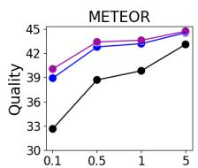
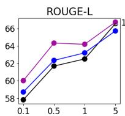
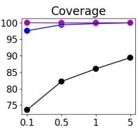
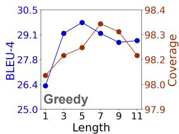
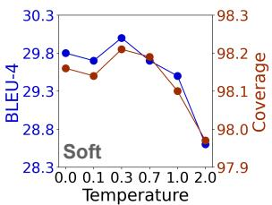
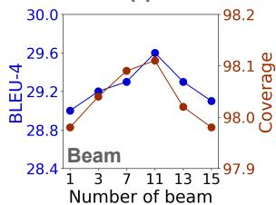
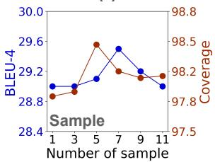
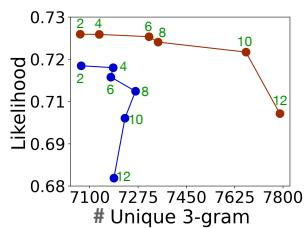
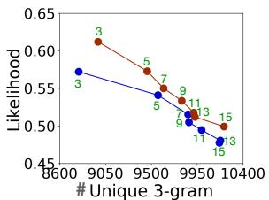
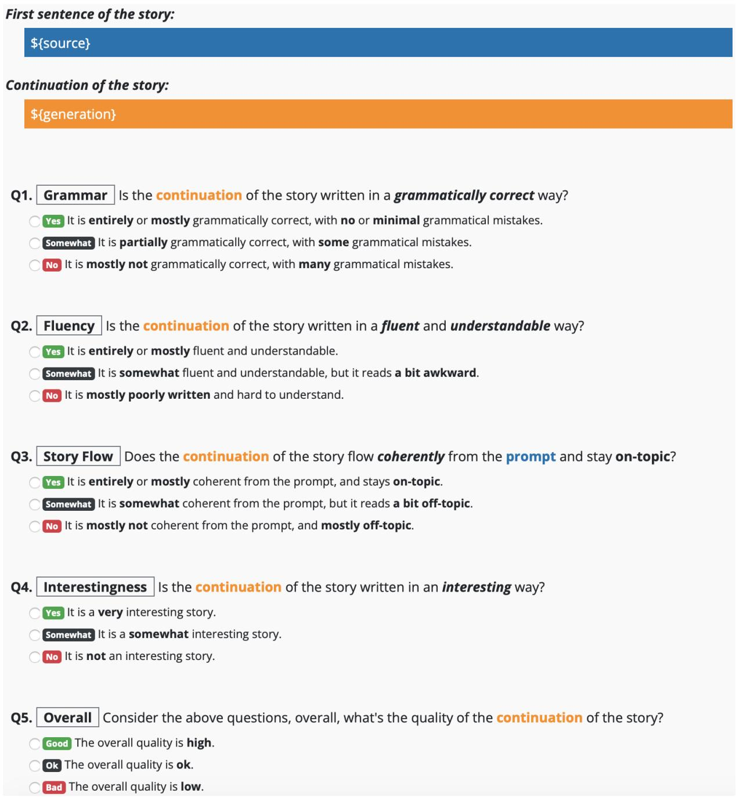

# NEUROLOGIC AFesque Decoding: Constrained Text Generation with Lookahead Heuristics

Ximing Lu‡† ♥Sean Welleck†‡ ♥Peter West†

Liwei Jiang‡† Jungo Kasai‡† Daniel Khashabi‡ Ronan Le Bras‡

Lianhui Qin† Youngjae Yu‡ Rowan Zellers† Noah A. Smith†‡ Yejin Choi†‡

‡Allen Institute for Artificial Intelligence

†Paul G. Allen School of Computer Science & Engineering, University of Washington

## Abstract

The dominant paradigm for neural text generation is left-to-right decoding from autoregressive language models. Constrained or controllable generation under complex lexical constraints, however, requires foresight to plan ahead for feasible future paths.

Drawing inspiration from the A\* search algorithm, we propose NEUROLOGIC AFesque,1 a decoding algorithm that incorporates heuristic estimates of future cost. We develop lookahead heuristics that are efficient for large-scale language models, making our method a dropin replacement for common techniques such as beam search and top-k sampling. To enable constrained generation, we build on NEU-ROLOGIC decoding (Lu et al., 2021), combining its flexibility in incorporating logical constraints with $\mathbf { A } ^ { \dot { \star } }$ esque estimates of future constraint satisfaction.

Our approach outperforms competitive baselines on five generation tasks, and achieves new state-of-the-art performance on table-totext generation, constrained machine translation, and keyword-constrained generation. The improvements are particularly notable on tasks that require complex constraint satisfaction or in few-shot or zero-shot settings. NEU-ROLOGIC $\mathsf { A } ^ { \star }$ esque illustrates the power of decoding for improving and enabling new capabilities of large-scale language models.

## 1 Introduction

The dominant paradigm for neural text generation is based on left-to-right decoding from autoregressive language models such as GPT-2/3 (Radford et al., 2019; Brown et al., 2020). Under this paradigm, common decoding techniques such as beam search or top-k/p sampling (Holtzman et al., 2020) determine which token to generate next based on what happened in the past, without explicitly looking ahead into the future. While

Write a sentence with these concepts car drive snow

  
Figure 1: NEUROLOGICF leverages lookahead heuristics to guide generations towards those that satisfy the given task-specific constraints. In this example from the COMMONGEN task, although summer is a more likely next word given the already-generated past, NEUROLOGICF looks ahead to see that selecting winter results in a generation that incorporates unsatisfied constraint snow with a higher probability later on. Thus, winter is preferred despite being lower probability than summer.

this lack of foresight often suffices for open-ended text generation – where any coherent text can be acceptable – for constrained text generation, planning ahead is crucial for incorporating all desired content in the generated output (Hu et al., 2017; Dathathri et al., 2019).

Classical search algorithms such as $\mathbf { A } ^ { * }$ search (Hart et al., 1968; Pearl, 1984; Korf, 1985) address the challenge of planning ahead by using heuristic estimation of future cost when making decisions. Drawing inspiration from $\mathbf { A } ^ { * }$ search, we develop NEUROLOGIC $\mathsf { A } ^ { \star }$ esque (shortened to NEUROLOGICF), which combines A\*-like heuristic estimates of future cost (e.g., perplexity, constraint satisfaction) with common decoding algorithms for neural text generation (e.g., beam search, top-k sampling), while preserving the efficiency demanded by large-scale neural language models.

As selecting the next token to generate based on the optimal future cost is NP-complete (Chen et al., 2018), we develop lookahead heuristics, which approximate cost at each decoding step based on continuations of the sequence-so-far. Figure 1 shows an example, where NEUROLOGIC $\mathsf { A } ^ { \star }$ esque guides generation towards a decision that would have been ignored based on the past alone, but is selected after looking ahead and incorporating the probability that constraints are satisfied in the future.

Our approach builds on NEUROLOGIC Decoding of Lu et al. (2021), a variation of beam-search for controlling generation through rich logic-based lexical constraints expressed in Conjunctive Normal Form (CNF). Our work generalizes Lu et al. (2021) by (1) incorporating novel lookahead heuristics to estimate future contraint satisfaction, and (2) developing additional unconstrained variants that can work with an empty set of constraints. These new algorithm variants support broad applications of $\mathrm { { N E U R O L O G I C } ^ { \star } }$ , including unconstrained generation, as demonstrated in our experiments.

Our experiments across five generation tasks demonstrate that our approach outperforms competitive baselines. We test NEUROLOGICF in conjunction with both supervised and unsupervised models and find that the performance gain is pronounced especially in zero-shot or few-shot settings. On the COMMONGEN benchmark, using NEUROLOGICF with an off-the-shelf language model outperforms a host of supervised baselines with conventional decoding algorithms, demonstrating that a strong inference-time algorithm such as NEUROLOGICF can alleviate the need for costly annotated datasets. Moreover, NEUROLOGICF achieves state-of-the-art performance in various settings, including WMT17 English-German machine translation with lexical constraints (Dinu et al., 2019) and few-shot E2ENLG table-to-text generation (Chen et al., 2020b).

In summary, we develop NEUROLOGIC $\mathsf { A } ^ { \star }$ esque, a new decoding algorithm for effective and efficient text generation. To our knowledge this is the first $\mathbf { A } ^ { * } .$ -like algorithm for guided text generation via lookahead heuristics. Our algorithm is versatile, as it can be applied to a variety of tasks via inference-time constraints, reducing the need for costly labeled data. Extensive experiments show its effectiveness on several important generation benchmarks.

## 2 NEUROLOGIC AFesque Decoding

We describe NEUROLOGIC $\mathsf { A } ^ { \star }$ esque Decoding (shortened as NEUROLOGICF), our decoding algorithm motivated by $\mathbf { A } ^ { * }$ search (Hart et al., 1968), a best-first search algorithm that finds high-scoring paths using a heuristic estimate of future return. We first introduce the decoding problem, and then describe our heuristics with a novel lookahead procedure for adapting NEUROLOGICF search to unconstrained and constrained generation with largescale autoregressive models.

## 2.1 Decoding With $\mathbf { A } ^ { \star }$ esque Lookahead

Decoding. Sequence-to-sequence generation is the task of generating an output sequence y given an input sequence x. We consider standard leftto-right, autoregressive models, $p _ { \theta } ( \mathbf { y } \mid \mathbf { x } ) =$ $\textstyle \prod _ { t = 1 } ^ { | \mathbf { y } | } p _ { \theta } ( y _ { t } \mid \mathbf { y } _ { < t } , \mathbf { x } )$ , and omit x to reduce clutter. Decoding consists of solving,

$$
\mathbf { y } _ { * } = \arg \operatorname* { m a x } _ { \mathbf { y } \in \mathcal { Y } } F ( \mathbf { y } ) ,\tag{1}
$$

where $\mathcal { V }$ is the set of all sequences. In our setting, the objective $F ( \mathbf { y } )$ takes the form $s ( \mathbf { y } ) + H ( \mathbf { y } )$ where $s ( \mathbf { y } )$ is log $p _ { \theta } ( \mathbf { y } )$ , and $H ( \mathbf { y } )$ is either zero when no constraints are specified, or is a score for satisfying constraints on y.

Our method takes the perspective of decoding as discrete search, in which states are partial prefixes, $\mathbf { y } _ { < t }$ , actions are tokens in vocabulary $\gamma _ { \mathrm { \scriptsize ~ ( i . e . ~ } }$ $y _ { t } \in \mathcal { V } )$ , and transitions add a token to a prefix, $\mathbf { y } _ { < t } \circ y _ { t }$ . Each step of decoding consists of (1) expanding a set of candidate next-states, (2) scoring each candidate, and (3) selecting the k best candidates:

$$
\begin{array} { r l } & { Y _ { t } ^ { \prime } = \{ \mathbf { y } _ { < t } \circ y _ { t } \mid \mathbf { y } _ { < t } \in Y _ { t - 1 } , y _ { t } \in \mathscr { V } \} , } \\ & { Y _ { t } = \underset { ( \mathbf { y } _ { < t } , y _ { t } ) \in Y _ { t } ^ { \prime } } { \arg \mathrm { t o p k } } \ \{ f ( \mathbf { y } _ { < t } , y _ { t } ) \} , } \end{array}\tag{2}
$$

where $Y _ { 0 } ~ = ~ \{ \langle b o s \rangle \}$ and $f ( \cdot )$ is a scoring function that approximates the objective $F .$ . Common decoding algorithms such as beam search score candidates without considering future tokens, e.g., $f ( \mathbf { y } _ { < t } , y _ { t } ) = \log p _ { \theta } ( \mathbf { y } _ { \le t } )$

Lookahead heuristics. Our method incorporates an estimate of the future into candidate selection. Ideally, we want to select candidates that are on optimal trajectories, replacing Equation 2 with:

$$
Y _ { t } = \underset { ( \mathbf { y } < t , y _ { t } ) \in Y _ { t } ^ { \prime } } { \arg \operatorname { t o p k } } \left\{ \underset { \mathbf { y } > t } { \operatorname* { m a x } } F ( \mathbf { y } _ { < t } , y _ { t } , \mathbf { y } _ { > t } ) \right\} ,\tag{3}
$$

where $\mathbf { y } { } _ { > t }$ represents future trajectories. However, computing Equation 3 presents two difficulties: 1) the objective $F ( \mathbf { y } )$ may be unknown or difficult to compute, and 2) the space of $\mathbf { y } { } _ { > t }$ is prohibitively large.

Motivated by $\mathbf { A } ^ { * }$ search (Hart et al., 1968), a best-first search algorithm that finds high-scoring paths by selecting actions that maximize:

$$
f ( a ) = s ( a ) + h ( a ) ,
$$

where $s ( a )$ is the score-so-far and $h ( a )$ is a heuristic estimate of the future score, we approximate the objective using a lightweight heuristic $h ( \cdot )$

$$
Y _ { t } = \arg \operatorname * { t o p k } _ { \mathbf { y } _ { \leq t } \in Y _ { t } ^ { \prime } } \left\{ s ( \mathbf { y } _ { \leq t } ) + \underset { \mathbf { y } _ { > t } } { \operatorname* { m a x } } h ( \mathbf { y } _ { < t } , y _ { t } , \mathbf { y } _ { > t } ) \right\} ,\tag{4}
$$

where $s ( \mathbf { y } _ { \leq t } ) = \log p _ { \theta } ( \mathbf { y } _ { \leq t } )$ . To make the search tractable, we search over a set of lookahead continuations, approximating Equation 3 as,

$$
Y _ { t } = \underset { \mathbf { y } _ { \le t } \in Y _ { t } ^ { \prime } } { \arg \operatorname { t o p k } } \left\{ s ( \mathbf { y } _ { \le t } ) + \underset { \mathcal { L } _ { \ell } ( \mathbf { y } _ { \le t } ) } { \operatorname* { m a x } } h ( \mathbf { y } _ { \le t + \ell } ) \right\} ,\tag{5}
$$

where each element $\mathbf { y } _ { t + 1 : t + \ell }$ of $\mathcal { L } _ { \ell } ( \mathbf { y } _ { \leq t } )$ is a length-\` continuation of $\mathbf { y } _ { \leq t }$ . Beam search corresponds to setting \` and h to 0.

$\mathbf { A } ^ { \star }$ esque decoding. Beam search, $\mathbf { A } ^ { * }$ search, and our method fall under a general class of algorithms that differ based on (1) which candidates are expanded, (2) which candidates are pruned, (3) how candidates are scored (Meister et al., 2020). We inherit the practical advantages of beam search-style expansion and pruning, while drawing on A\*-like heuristics to incorporate estimates of the future, and refer to our method as $\mathbf { A } ^ { \star }$ esque decoding.

Generating lookaheads. We compare several methods for generating the lookaheads $\mathcal { L } _ { \ell } ( \mathbf { y } _ { \le t } )$

The greedy lookahead produces a single sequence, $\begin{array} { r c l } { \mathcal { L } _ { \ell } } & { = } & { \left\{ \mathbf { y } _ { t + 1 : t + \ell } \right\} } \end{array}$ , starting from $\mathbf { y } _ { \leq t }$ and selecting each token according to $\begin{array} { r l } { y _ { t ^ { \prime } } } & { { } = } \end{array}$ arg $\operatorname* { m a x } _ { y \in \mathcal { V } } p _ { \theta } ( y \mid \mathbf { y } _ { < t ^ { \prime } } )$

We also consider a soft lookahead which interpolates between providing the greedy token and a uniform mixture of tokens as input at each step. Specifically, we adjust the model’s probabilities with a temperature, $\tilde { p } _ { \theta } ( y _ { t } \mid \mathbf { y } _ { < t } ) = \mathrm { s o f t m a x } ( s _ { t } / \tau )$ where $s _ { t } \in \mathbb { R } ^ { | \nu | }$ is a vector of logits, and feed the expected token embedding as input at step t,

$$
e _ { t } = \mathbb { E } _ { y _ { t } \sim \tilde { p } ( y _ { t } | \mathbf { y } _ { < t } ) } [ E ( y _ { t } ) ] ,\tag{6}
$$

where $E \in \mathbb { R } ^ { | \nu | \times d }$ is the model’s token embedding matrix. The soft lookahead moves from providing the greedy token as input $( \tau  0 )$ to a uniform mixture of tokens $( \tau  \infty )$ based on the value of temperature τ . When using the soft lookahead, we use $\tilde { p }$ in place of $p$ when scoring tokens. The soft (and greedy) lookahead is efficient, but only explores a single trajectory.

The beam lookahead trades off efficiency for exploration, returning a set $\mathcal { L } _ { \ell }$ containing the top-k candidates obtained by running beam search for \` steps starting from $\mathbf { y } _ { < t }$

Finally, the sampling lookahead explores beyond the highly-probable beam search continuations, generating each $\mathbf { y } _ { t + 1 : t + \ell } \in \mathcal { L } _ { \ell }$ using,

$$
y _ { t ^ { \prime } } \sim p _ { \boldsymbol \theta } ( y \mid \mathbf { y } _ { < t ^ { \prime } } ) ,
$$

for $t ^ { \prime }$ from t+1 to $t { + } \mathbf { k }$

Next, we move to our proposed lookahead heuristics, starting with the unconstrained setting.

## 2.2 Unconstrained Generation with NEUROLOGICF

First we consider a standard decoding setting,

$$
\underset { \mathbf { y } \in \mathcal { Y } } { \arg \operatorname* { m a x } } \log p _ { \theta } ( \mathbf { y } \mid \mathbf { x } ) .
$$

We score candidates based on a combination of the history and estimated future, by using the likelihood of the lookahead as a heuristic. That is, at the tth step of decoding, we use Equation 5 with:

$$
h ( \mathbf { y } _ { \leq t + \ell } ) = \lambda \log p _ { \theta } ( \mathbf { y } _ { t + 1 : t + \ell } \mid \mathbf { y } _ { \leq t } , \mathbf { x } ) ,\tag{7}
$$

where λ controls how much we rely on the estimated future versus the history, similar to weighted $\mathbf { A } ^ { * }$ (Pohl, 1970).

## 2.3 NEUROLOGICF for Constrained Generation

Our lookahead heuristics lend themselves to decoding with lexical constraints in a way that standard beam search does not. For constrained generation, we build on and generalize NEUROLOGIC decoding algorithm of Lu et al. (2021)—a beambased search algorithm that supports a wide class of logical constraints for lexically constrained generation—with estimates of future constraint satisfaction.

Background of NEUROLOGIC. NEUROLOGIC (Lu et al., 2021) accepts lexical constraints in CNF:

$$
\underbrace { \left( D _ { 1 } \vee D _ { 2 } \cdot \cdot \cdot \vee D _ { i } \right) } _ { C _ { 1 } } \wedge \cdot \cdot \cdot \wedge \underbrace { \left( D _ { i ^ { \prime } } \vee \cdot \cdot \cdot \vee D _ { N } \right) } _ { C _ { M } }
$$

where each $D _ { i }$ represents a single positive or negative constraint, $D ( \mathbf { a } , \mathbf { y } ) { \mathrm { o r } } \lnot D ( \mathbf { a } , \mathbf { y } )$ , enforcing the phrase a to be included in or omitted from y. Lu et al. (2021) refer to each constraint $D _ { i }$ as a literal, and each disjunction $C _ { j }$ of literals as a clause.

NEUROLOGIC is a beam-based approximate search for an objective which seeks fluent sequences in which all clauses are satisfied:

$$
\underset { \mathbf { y } \in \mathcal { Y } } { \arg \operatorname* { m a x } } p _ { \boldsymbol { \theta } } ( \mathbf { y } \mid \mathbf { x } ) - \lambda ^ { \prime } \sum _ { j = 1 } ^ { M } ( 1 - C _ { j } ) ,
$$

where $\lambda ^ { \prime } \gg 0$ penalizes unsatisfied clauses. At each step of the search, NEUROLOGIC scores each of the $k \times | \mathcal { V } |$ candidates $\left( \mathbf { y } _ { < t } , y _ { t } \right)$ based on whether they (partially) satisfy new constraints,

$$
f ( \mathbf { y } _ { \le t } ) = \log p _ { \theta } ( \mathbf { y } _ { \le t } \mid \mathbf { x } ) + \lambda _ { 1 } \operatorname* { m a x } _ { D ( \mathbf { a } , \mathbf { y } _ { \le t } ) } \frac { | \hat { \mathbf { a } } | } { | \mathbf { a } | } ,\tag{8}
$$

where the maximization is over a set of unsatisfied multi-token constraints a tracked by NEURO-LOGIC, and ˆa is the prefix of a in the ongoing generation. For example, for $\mathbf { y } _ { \leq t } = \mathbf { \tilde { \tilde { T } } } h e$ boy climbs an apple” and constraint $\scriptstyle \mathbf { a } = { } ^ {  } a p p l e t r e e ^ { \cdots }$ , ˆa is $^ { * } a p p l e ^ { , * }$ Intuitively, this function rewards candidates that are in the process of satisfying a constraint.

In lieu of taking the top-k scoring candidates (Equation 5), NEUROLOGIC prunes candidates that contain clauses that violate constraints, groups the candidates to promote diversity, and selects highscoring candidates from each group. We use the same pruning and grouping approach, and refer the reader to Lu et al. (2021) for further details.

NEUROLOGICF decoding. Our method improves upon the NEUROLOGIC scoring function with an estimate of future constraint satisfaction. Our key addition is a lookahead heuristic that adjusts a candidate $( \mathbf { y } _ { < t } , y _ { t } ) ^ { , } \mathbf { s }$ score proportional to the probability of satisfying additional unsatisfied constraints in the lookahead $\mathbf { y } _ { t + 1 : t + \ell } ;$

$$
\begin{array} { r l } & { h _ { \mathrm { f u t u r e } } ( \mathbf { y } _ { \leq t + \ell } ) = } \\ & { \lambda _ { 2 } \underset { D ( \mathbf { a } , \mathbf { y } _ { \leq t } ) } { \operatorname* { m a x } } \log p _ { \theta } ( D ( \mathbf { a } , \mathbf { y } _ { t + 1 : t + \ell } ) \mid \mathbf { x } , \mathbf { y } _ { \leq t } ) , } \end{array}\tag{9}
$$

where we define the probability that constraint a is satisfied using the most probable subsequence,

$$
\begin{array} { r l } & { p _ { \theta } ( D ( \mathbf { a } , \mathbf { y } _ { t + 1 : t + \ell } ) \mid \mathbf { x } , \mathbf { y } _ { \leq t } ) = } \\ & { \underset { t ^ { \prime } \in [ t , t + \ell ] } { \operatorname* { m a x } } p _ { \theta } ( \mathbf { y } _ { t ^ { \prime } : t ^ { \prime } + | \mathbf { a } | } = \mathbf { a } \mid \mathbf { x } , \mathbf { y } _ { < t ^ { \prime } } ) , } \end{array}\tag{10}
$$

$\lambda _ { 2 }$ is a scaling hyperparameter for the heuristic.

Intuitively, this lookahead heuristic brings two benefits. When $y _ { t }$ is a token that would satisfy a multi-token constraint, the lookahead incorporates the score of thefull constraint. When $y _ { t }$ is a token that is not part of a constraint, the lookahead allows for incorporating the score of a future constraint that would be satisfied if $y _ { t }$ was selected.

We add our lookahead heuristic to the NEU-ROLOGIC scoring function (Equation 8), and call the resulting decoding procedure NEUROLOGIC $\mathsf { A } ^ { \star }$ esque (or, NEUROLOGICF in short).

## 3 Experiments

We first consider constrained generation benchmarks: COMMONGEN (§3.1), constrained machine translation (§3.2), table-to-text generation (§3.3), and constrained question generation (§3.4). NEUROLOGICF consistently outperforms previous approaches, especially in zero-shot and fewshot cases. These low-resource settings are particularly important, as many practical tasks face data scarcity. Finally, we find that $\mathsf { A } ^ { \star }$ esque lookahead is useful even without constraints, as shown in unconstrained story generation task (§3.5).

Metrics. As automatic metrics, we use: BLEU (Papineni et al., 2002), ROUGE (Lin, 2004), METEOR (Banerjee and Lavie, 2005), CIDEr (Vedantam et al., 2015), SPICE (Anderson et al., 2016) and NIST (Lin and Hovy, 2003).

## 3.1 Constrained Commonsense Generation

COMMONGEN (Lin et al., 2020) is a commonsense generation task with lexical constraints: given a set of concepts (e.g., {throw, run, javelin, track}), models need to generate a coherent sentence describing a plausible scenario using all given concepts (e.g., $\mathbf { \ddot { a } }$ man runs on a track and throws a javelin.”).

Approach and Baselines. Following Lu et al. (2021), we enforce that each concept $c _ { i }$ appear in output y under some morphological inflection. We test in both supervised and zero-shot settings. In the supervised setting, we finetune GPT-2 (Radford et al., 2019) as a sequence-to-sequence model. In the zero-shot setting, we use GPT-2 off-the-shelf (no fine-tuning) and rely on constrained decoding to guide generation. We compare with previous constrained decoding algorithms CBS (Anderson et al., 2017), GBS (Hokamp and Liu, 2017), DBA (Post and Vilar, 2018a), NEUROLOGIC (Lu et al., 2021) and TSMH (Zhang et al., 2020).

Metrics. We report standard automatic metrics as well as coverage, the average percentage of concepts present in generations. Additionally, we conduct human evaluation on 100 test examples using Amazon Mechanical Turk (AMT), with 3 annotators per example (template in Appendix D). Workers rate each generation on language quality, scenario plausibility, coverage ofgiven concepts, and an overall score on a 3-point Likert scale.2

<table><tr><td rowspan="2">Decode Method</td><td colspan="6">Automatic Evaluation</td><td colspan="4">Human Evaluation</td></tr><tr><td></td><td></td><td>ROUGE-L BLEU-4 METEOR CIDEr SPICE</td><td></td><td></td><td>Coverage</td><td>Quality</td><td>Plausibility</td><td>Concepts Overall</td><td></td></tr><tr><td>Supervised</td><td></td><td></td><td></td><td></td><td></td><td></td><td></td><td></td><td></td><td></td></tr><tr><td>CBS (Anderson et al., 2017)</td><td>38.8</td><td>20.6</td><td>28.5</td><td>12.9</td><td>27.1</td><td>97.6</td><td>2.27</td><td>2.35</td><td>2.51</td><td>2.23</td></tr><tr><td>GBS (Hokamp and Liu, 2017)</td><td>38.2</td><td>18.4</td><td>26.7</td><td>11.7</td><td>26.1</td><td>97.4</td><td>2.06</td><td>2.17</td><td>2.29</td><td>2.01</td></tr><tr><td>DBA (Post and Vilar, 2018a)</td><td>38.3</td><td>18.7</td><td>27.7</td><td>12.4</td><td>26.3</td><td>97.5</td><td>2.23</td><td>2.30</td><td>2.43</td><td>2.15</td></tr><tr><td>NEUROLOGIC (Lu et al., 2021)</td><td>42.8</td><td>26.7</td><td>30.2</td><td>14.7</td><td>30.3</td><td>97.7</td><td>2.54</td><td>2.56</td><td>2.67</td><td>2.50</td></tr><tr><td>NEUROLOGIC* (greedy)</td><td>43.6</td><td>28.2</td><td>30.8</td><td>15.2</td><td>30.8</td><td>97.8</td><td>2.66</td><td>2.67</td><td>2.73</td><td>2.59</td></tr><tr><td>NEUROLOGIC* (sample)</td><td>43.4</td><td>27.9</td><td>30.8</td><td>15.3</td><td>31.0</td><td>97.7</td><td>2.64</td><td>2.64</td><td>2.74</td><td>2.58</td></tr><tr><td>NEUROLOGIC* (beam)</td><td>43.2</td><td>28.2</td><td>30.7</td><td>15.2</td><td>31.0</td><td>97.6</td><td>2.68</td><td>2.67</td><td>2.76</td><td>2.60</td></tr><tr><td>Unsupervised</td><td></td><td></td><td></td><td></td><td></td><td></td><td></td><td></td><td></td><td></td></tr><tr><td>TSMH (Zhang et al., 2020)</td><td>24.7</td><td>2.2</td><td>14.5</td><td>3.6</td><td>15.4</td><td>71.5</td><td>1.85</td><td>1.92</td><td>1.95</td><td>1.63</td></tr><tr><td>NEUROLoGIC (Lu et al., 2021)</td><td>41.9</td><td>24.7</td><td>29.5</td><td>14.4</td><td>27.5</td><td>96.7</td><td>2.64</td><td>2.52</td><td>2.68</td><td>2.50</td></tr><tr><td>NEUROLOGIC* (greedy)</td><td>44.3</td><td>28.6</td><td>30.7</td><td>15.6</td><td>29.6</td><td>97.1</td><td>2.78</td><td>2.70</td><td>2.77</td><td>2.70</td></tr></table>

Table 1: Performance of various decoding methods with supervised or off-the-shelf GPT-2 on the COMMONGEN test set, measured with automatic and human evaluations. We only tried NEUROLOGICF (greedy) in the unsupervised setting because of the computational cost. The best numbers are bolded and the second best ones are underlined.

<table><tr><td>Words</td><td>Method</td><td>Generation</td></tr><tr><td>cut</td><td>GBS</td><td>Cut a piece of wood to use as a fence.</td></tr><tr><td>piece</td><td>DBA</td><td>Cut a piece of wood to use as a fence.</td></tr><tr><td>use</td><td>NEUROLOGIC</td><td>Piece of wood used for cutting.</td></tr><tr><td>wood</td><td>NEUROLOGIC</td><td>A man cuts a piece of wood using a circular saw.</td></tr><tr><td>ball</td><td>GBS</td><td>A dog is run over by a ball and mouth agape.</td></tr><tr><td>dog</td><td>DBA</td><td>A dog is run over by a ball and bites his mouth.</td></tr><tr><td>mouth</td><td>NEUROLOGIC</td><td>A dog is running and chewing on a ball in its mouth.</td></tr><tr><td>run</td><td>NEUROLOGIC*</td><td>A dog running with a ball in its mouth.</td></tr><tr><td>dog</td><td>GBS</td><td>Soap and water scrubbed dog with a towel.</td></tr><tr><td>scrub</td><td>DBA</td><td>Soap and water on a dog and scrubbed skin.</td></tr><tr><td>soap</td><td>NEUROLOGIC</td><td>A dog is scrubbing his paws with soap and water.</td></tr><tr><td>water</td><td></td><td>NEUROLOGIC* A man is scrubbing a dog with soap and water.</td></tr></table>

Table 2: Example generations for the COMMONGEN task across supervised NEUROLOGICF and baselines, including GBS (Hokamp and Liu, 2017), DBA (Post and Vilar, 2018a), and NEUROLOGIC (Lu et al., 2021).

Results. Table 1 compares different constrained decoding methods on top of the finetuned and offthe-shelf GPT-2, in supervised and zero-shot settings respectively. The key observations are:

1. NEUROLOGICF outperforms all previous constrained-decoding methods in both supervised and zero-shot settings. Surprisingly, unsupervised NEUROLOGICF outperforms all supervised methods based on human evaluation.

2. Compared to vanilla NEUROLOGIC, NEUROLOGICF improves generation quality while maintaining high constraint satisfaction. The difference is especially substantial in the zero-shot setting. Intuitively, this setting leaves more room for incorporating constraint-driven signals due to the lack of supervision.

<table><tr><td>Method</td><td colspan="2">Dinu et al. BLEU Term%</td><td colspan="2">Marian MT BLEU Term%</td></tr><tr><td>Unconstrained</td><td>25.8</td><td>76.3</td><td>32.9</td><td>85.0</td></tr><tr><td>train-by-app.</td><td>26.0</td><td>92.9</td><td></td><td></td></tr><tr><td>train-by-rep.</td><td>26.0</td><td>94.5</td><td></td><td></td></tr><tr><td>Post and Vilar (2018a)</td><td>25.3</td><td>82.0</td><td>33.0</td><td>94.3</td></tr><tr><td>NEUROLOGIC</td><td>26.5</td><td>95.1</td><td>33.4</td><td>97.1</td></tr><tr><td>NEUROLOGIC* (greedy)</td><td>26.7</td><td>95.8</td><td>33.7</td><td>97.2</td></tr><tr><td>NEUROLOGIC* (sample)</td><td>26.6</td><td>95.4</td><td>33.7</td><td>97.2</td></tr><tr><td>NEUROLOGIC* (beam)</td><td>26.6</td><td>95.8</td><td>33.6</td><td>97.2</td></tr></table>

Table 3: Results on constrained MT. The left section uses the same two-layer transformer as Dinu et al. (2019), while the right one uses a stronger Marian MT EN-DE model. The highlighted methods modify training data specifically for constrained generation, and thus cannot be applied to off-the-shelf models. The best numbers are bold, second best are underlined.

3. NEUROLOGICF reaches similar performance using different lookahead strategies, among which beam lookahead slightly outperforms the others based on human evaluation, and greedy lookahead has the lowest runtime. We analyze lookahead strategies further in Appendix A.

## 3.2 Constrained Machine Translation

Next, we test on constrained machine translation (MT). It is often critical to have control over MT systems, such as to incorporate domain-specific terminology (Post and Vilar, 2018a; Dinu et al., 2019). To achieve this goal, recent work proposed constrained decoding algorithms (Chatterjee et al., 2017; Hokamp and Liu, 2017; Hasler et al., 2018; Hu et al., 2019, inter alia) or specialized training (Dinu et al., 2019). We demonstrate that

<table><tr><td>#T</td><td># Sents.</td><td>Decode Method</td><td>BLEU</td><td>Term%</td></tr><tr><td rowspan="3">1</td><td rowspan="3">378</td><td>Beam search</td><td>25.4</td><td>79.6</td></tr><tr><td>NEUROLOGIC</td><td>26.2</td><td>95.2</td></tr><tr><td>NEUROLOGIC*</td><td>26.3</td><td>95.8</td></tr><tr><td rowspan="3">2+</td><td rowspan="3">36</td><td>Beam search</td><td>28.1</td><td>85.0</td></tr><tr><td>NEUROLOGIC</td><td>28.9</td><td>93.7</td></tr><tr><td>NEUROLOGIC★</td><td>29.3</td><td>96.5</td></tr></table>

Table 4: Constrained MT performance broken down by the number of constraint terms (# T). All configurations use the two-layer tranformer from Dinu et al. (2019). The best numbers are bolded and the second best ones are underlined.

NEUROLOGICF can be readily applied to off-theshelf MT systems for constrained machine translation. We follow Dinu et al. (2019) and evaluate on the WMT17 EN-DE test set (Bojar et al., 2017). The constraint here is to integrate given custom terminologies into the translation output; constraint terms are automatically created from the IATE EU terminology database for 414 test sentences.

Approach, Baselines, and Metrics. We experiment with two MT systems: Dinu et al. (twolayer transformer) and the off-the-shelf Marian MT (Junczys-Dowmunt et al., 2018). We compare with previous constrained decoding algorithms, including DBA (Post and Vilar, 2018a), NEUROLOGIC (Lu et al., 2021), and also specialized training proposed by Dinu et al. (2019). Following Dinu et al. (2019), we report BLEU and term use rates, i.e., percentage of times given constraint terms were generated out of total number of constraint terms.

Results. Table 3 presents experimental results with Dinu et al.’s model and Marian MT. In both cases, NEUROLOGICF outperforms prior methods in BLEU and term coverage. Besides higher quality and coverage, NEUROLOGICF is plug-and-play, working with any off-the-shelf MT system, unlike previous training-based methods. Table 4 breaks down the performance by the number of constraint terms. We see that the improvement brought by NEUROLOGICF is especially large when given complex constraints with multiple terms. (e.g., 96.5 vs. 93.7 from NEUROLOGIC in term of coverage).

## 3.3 Table-to-text Generation

Next we test on the table-to-text task, where models need to generate natural language for structured table data. Constrained generation ensures that the output text is factual and consistent with the input data. We follow the few-shot setup of Chen et al. (2020b) on the E2ENLG (Dušek et al., 2018)

<table><tr><td>Decode Method</td><td colspan="6">NIST BLEU METEOR CIDEr ROUGE Coverage</td></tr><tr><td>Beam Search</td><td>3.82</td><td>42.8</td><td>32.6</td><td>10.8</td><td>57.8</td><td>73.6</td></tr><tr><td>CBS</td><td>6.50</td><td>42.3</td><td>36.4</td><td>13.0</td><td>54.3</td><td>91.6</td></tr><tr><td>GBS</td><td>6.26</td><td>40.7</td><td>36.7</td><td>12.9</td><td>54.2</td><td>94.1</td></tr><tr><td>NEUROLOGIC</td><td>6.95</td><td>47.6</td><td>38.9</td><td>16.3</td><td>58.7</td><td>97.6</td></tr><tr><td>NEUROLOGIC* (greedy)</td><td>7.11</td><td>49.2</td><td>40.0</td><td>17.5</td><td>60.0</td><td>100.0</td></tr><tr><td>NEUROLOGIC* (beam)</td><td>7.01</td><td>48.9</td><td>40.0</td><td>17.2</td><td>59.8</td><td>99.9</td></tr><tr><td>NEUROLOGIC* (sample)</td><td>7.11</td><td>49.3</td><td>40.1</td><td>17.5</td><td>60.0</td><td>100.0</td></tr></table>

Table 5: Performance of different decoding methods with few-shot GPT-2 finetuned on 0.1% E2ENLG data. The best numbers are bold, second best are underlined.
<table><tr><td>Method</td><td>0.1%</td><td>0.5%</td><td>1%</td><td>5%</td></tr><tr><td>TGen (Dušek and Jurčíček, 2016) Template-GPT-2 (Chen et al., 2020a)</td><td>3.6</td><td>27.9</td><td>35.2</td><td>57.3</td></tr><tr><td rowspan="3">KGPT-Graph (Chen et al., 2020b) KGPT-Seq (Chen et al., 2020b)</td><td>22.5</td><td>47.8</td><td>53.3</td><td>59.9</td></tr><tr><td>39.8</td><td>53.3</td><td>55.1</td><td>61.5</td></tr><tr><td>40.2</td><td>53.0</td><td>54.1</td><td>61.1</td></tr><tr><td>GPT-2</td><td>42.8</td><td>57.1</td><td>56.8</td><td>61.1</td></tr><tr><td> $\mathrm { G P T - } 2 + \mathrm { N E U R O L O G I C }$ </td><td>47.6</td><td>56.9</td><td>58.0</td><td>62.9</td></tr><tr><td>GPT-2 + NEUROLOGIC* (greedy)</td><td>49.2</td><td>58.0</td><td>58.4</td><td>63.4</td></tr></table>

Table 6: Few-shot results (BLEU-4) on E2ENLG test set with 0.1%, 0.5%, 1%, 5% of training instances. The best numbers are bold, second best are underlined.

dataset, where randomly-sampled 0.1%, 0.5%, 1%, or 5% of training instances are used for finetuning.

Approach, Baselines, and Metrics. Following Shen et al. (2019), we linearize data tables into strings and finetune GPT-2 with few-shot examples. We compare NEUROLOGICF with three previous constrained decoding algorithms: CBS (Anderson et al., 2017), GBS (Hokamp and Liu, 2017), and NEUROLOGIC (Lu et al., 2021), based on few-shot GPT-2 finetuned with 0.1% data. Then we compare NEUROLOGICF on top of GPT-2, with previous table-to-text methods, including TGen (Dušek and Jurcíˇ cekˇ , 2016), Template-GPT-2 (Chen et al., 2020a), KGPT (Chen et al., 2020b), in multiple few-shot settings with various numbers of training instances. We report standard automatic metrics, as well as information coverage, i.e., percentage of information present in the generation.

Results. Table 5 compares various decoding methods with few-shot GPT-2 finetuned on 0.1% of the data. NEUROLOGICF substantially outperforms previous methods on all metrics, consistently improving quality while achieving near-perfect constraint satisfaction. Previous work (CBS and GBS) improves constraint satisfaction, but negatively affects quality, indicated by drops in BLEU and ROUGE. Table 6 compares NEUROLOGICF on top of GPT-2 with previous table-to-text approaches. As before, NEUROLOGICF outperforms past approaches by a large margin, even if the latter ones leverage specialized model architectures or additional pretraining on massive table-to-text corpora. Additionally, Figure 2 compares the performance (y-axis) of few-shot GPT-2 with NEUROLOGICF (purple line), NEUROLOGIC (blue line), and conventional beam search (black line) as a function of the varying percentage of training instances (xaxis). The benefit of NEUROLOGICF grows as data size is reduced. Indeed, constrained decoding enables impressive low-resource performance.

  
Figure 2: Performance (y-axis) of supervised GPT-2 on E2ENLG, with a varying percentage of training data for supervision (x-axis). The purple, blue, and black lines denote decoding with NEUROLOGICF, NEUROLOGIC and conventional beam search, respectively.

## 3.4 Constrained Question Generation

Next, we consider constrained question generation (Zhang et al., 2020), where models need to generate interrogative questions using given keywords. This task is zero-shot without any training data, further testing the capacity of NEUROLOGICF to guide off-the-shelf models without finetuning.

Approach, Baselines, and Metrics. We use GPT-2 off-the-shelf and compare NEUROLOGICF with previous constrained decoding methods, including CGMH (Miao et al., 2019), TSMH (Zhang et al., 2020) and NEUROLOGIC (Lu et al., 2021). We report standard generation metrics and keyword coverage as in §3.1. We conduct human evaluation following subsection 3.1, to measure grammar, fluency, meaningfulness, and overall quality of the generated questions, using a 3-point Likert scale3 (template in Appendix D).

Results. Table 7 presents comparisons across different decoding methods based on off-the-shelf language models. NEUROLOGICF outperforms all previous methods with respect to both automatic and manual metrics; it enhances the generation quality while achieving perfect constraint satisfaction. The difference between NEUROLOGIC and NEUROL $\scriptstyle . 0 \mathrm { G I C } ^ { \star }$ is particularly large compared to other tasks. We suspect that the search problem is much harder here, due to the lack of supervision and complex logical constraints involving both keywords and syntax. As a whole, the results demonstrate the effectiveness of NEUROLOGICF in tackling challenging constrained generation problems.

## 3.5 Unconstrained Story Generation

Finally, we demonstrate NEUROLOGICF can also improve unconstrained generation. We investigate whether $\mathsf { A } ^ { \star }$ esque decoding with our unconstrained lookahead heuristic (Equation 7) can (1) improve beam search, which typically struggles in openended settings (Holtzman et al., 2020; Welleck et al., 2019b), and (2) improve sampling algorithms that are commonly used in open-ended generation. We consider conditional story generation on the RocStories dataset (Mostafazadeh et al., 2016): given a first sentence x, generate the full story y.

Approach, Baselines and Metrics. We use GPT-2, fine-tuned on the RocStories training set. We apply $\mathsf { A } ^ { \star }$ esque decoding to (1) beam search, the setting used so far in the experiments, and (2) top-k sampling (Fan et al., 2018), a commonly used sampling algorithm in open-ended generation. For top-k sampling, we use the heuristic to adjust the probability scores, then renormalize. We use standard automatic metrics: perplexity and BLEU for fluency, and unique n-grams as a measure of diversity. We conduct human evaluation following subsection 3.1, for story flow and overall quality on a 3-point Likert scale4 (template in Appendix D).

Results. Table 8 presents the results of beam search and top-k sampling with and without $\mathsf { A } ^ { \star }$ esque heuristics. $\mathsf { A } ^ { \star }$ esque heuristics result in more fluent, coherent and interesting stories for both beam search and top-k sampling. For beam search, $\mathsf { A } ^ { \star }$ esque not only enhances generation quality– e.g. improving human evaluation scores from 2.32 to 2.63–but also boosts generation diversity, reflected by number of unique n-grams. For top-k sampling, $\mathsf { A } ^ { \star }$ esque heuristics improve quality, while maintaining comparable diversity. We further analyze quality and diversity tradeoff in Appendix A. Moreover, we notice that beam lookahead works the best for beam search, and greedy lookahead works the best for top-k sampling. We suspect that beam lookahead gives the most accurate estimate of future beam path, while greedy lookahead provides an estimate which better resembles a continuation from top-k sampling.

<table><tr><td rowspan="2">Decode Method</td><td colspan="6">Automatic Evaluation</td><td colspan="4">Human Evaluation</td></tr><tr><td>ROUGE BLEU METEOR CIDEr SPICE</td><td></td><td></td><td></td><td></td><td>Coverage</td><td>Grammar Fluency Meaningfulness Overall</td><td></td><td></td><td></td></tr><tr><td>CGMH (Miao et al., 2019)</td><td>28.8</td><td>2.0</td><td>18.0</td><td>5.5</td><td>21.5</td><td>18.3</td><td>2.28</td><td>2.34</td><td>2.11</td><td>2.02</td></tr><tr><td>TSMH (Zhang et al., 2020)</td><td>42.0</td><td>4.3</td><td>25.9</td><td>10.4</td><td>37.7</td><td>92.7</td><td>2.35</td><td>2.28</td><td>2.37</td><td>2.22</td></tr><tr><td>NEURoLoGIC (Lu et al., 2021)</td><td>38.8</td><td>11.2</td><td>24.5</td><td>18.0</td><td>41.7</td><td>90.6</td><td>2.78</td><td>2.71</td><td>2.49</td><td>2.51</td></tr><tr><td>NEUROLOGIC* (greedy)</td><td>43.7</td><td>14.7</td><td>28.0</td><td>20.9</td><td>47.7</td><td>100.0</td><td>2.83</td><td>2.77</td><td>2.74</td><td>2.76</td></tr><tr><td>NEUROLOGIC* (beam)</td><td>42.9</td><td>14.4</td><td>27.8</td><td>20.3</td><td>46.9</td><td>100.0</td><td>2.81</td><td>2.86</td><td>2.76</td><td>2.75</td></tr><tr><td>NEUROLOGIC* (sample)</td><td>43.5</td><td>14.6</td><td>28.2</td><td>20.8</td><td>47.8</td><td>100.0</td><td>2.83</td><td>2.75</td><td>2.76</td><td>2.73</td></tr></table>

Table 7: Performance of different unsupervised decoding algorithms on constrained question generation.
<table><tr><td rowspan="2">Decode Method</td><td colspan="3">Fluency</td><td colspan="3">Diversity</td><td colspan="2">Human Eval</td></tr><tr><td>PPL</td><td>BLEU-1</td><td>BLEU-2</td><td>Uniq. 2-gram</td><td>Uniq. 3-gram</td><td>Uniq. 4-gram</td><td>Coherence</td><td>Overall</td></tr><tr><td>beam search</td><td>2.24</td><td>33.7</td><td>16.5</td><td>20.13k</td><td>34.09k</td><td>41.91k</td><td>2.46</td><td>2.32</td></tr><tr><td>beam search + A*esque (greedy)</td><td>2.11</td><td>34.3</td><td>16.7</td><td>20.63k</td><td>34.94k</td><td>43.02k</td><td>2.56</td><td>2.57</td></tr><tr><td>beam search + A*esque (beam)</td><td>2.14</td><td>34.4</td><td>16.8</td><td>20.68k</td><td>35.03k</td><td>43.12k</td><td>2.62</td><td>2.63</td></tr><tr><td>beam search + A*esque (sample)</td><td>2.16</td><td>34.4</td><td>16.7</td><td>20.78k</td><td>35.41k</td><td>43.64k</td><td>2.59</td><td>2.57</td></tr><tr><td>top-k sample</td><td>4.01</td><td>31.4</td><td>13.9</td><td>28.54k</td><td>48.36k</td><td>56.62k</td><td>2.23</td><td>2.15</td></tr><tr><td>top-k sample + A*esque (greedy)</td><td>3.68</td><td>32.1</td><td>14.3</td><td>28.47k</td><td>48.44k</td><td>56.63k</td><td>2.48</td><td>2.47</td></tr><tr><td>top-k sample + A*esque (beam)</td><td>3.75</td><td>32.2</td><td>14.4</td><td>28.53k</td><td>48.27k</td><td>56.36k</td><td>2.39</td><td>2.34</td></tr><tr><td>top-k sample + A*esque (sample)</td><td>3.70</td><td>32.0</td><td>14.2</td><td>28.57k</td><td>48.04k</td><td>56.15k</td><td>2.47</td><td>2.44</td></tr></table>

Table 8: Performance of different decoding algorithms on RocStories test set.

## 4 Related Work

A\* search in NLP. Many classical NLP problems (e.g., parsing, text alignment) can be seen as structured prediction subject to a set of taskspecific constraints. For many such problems, $\mathbf { A } ^ { * }$ search has been used effectively (Och et al., 2001; Haghighi et al., 2007; Hopkins and Langmead, 2009; Meister et al., 2020). For example, Klein and Manning (2003); Zhang and Gildea (2006); Auli and Lopez (2011); Lee et al. (2016) have used it in the context of parsing. Similar approaches are used for finding high-probability alignments (Naim et al., 2013). Despite these applications, applying informed heuristic search to text generation with autoregressive language models (this work’s focus) has been underexplored.

Decoding strategies for text generation. The rise of autoregressive language models like GPT (Radford et al., 2018) has inspired work on decoding strategies (Post and Vilar, 2018a; Ippolito et al., 2019; Zheng et al., 2020; Leblond et al., 2021; West et al., 2021). These works often focus on incorporating factors like diversity (Ippolito et al., 2019), fluency (Holtzman et al., 2020), or constraints (Anderson et al., 2017; Hokamp and Liu, 2017; Post and Vilar, 2018b; Miao et al., 2019; Welleck et al., 2019a; Zhang et al., 2020; Qin et al., 2020; Lu et al., 2021). Constrained beam search (Anderson et al., 2017) and grid beam search (Hokamp and Liu, 2017) extend beam search to satisfy lexical constraints during generation. Lu et al. (2021) incorporate logic-based constraints into beam search, which we extend with lookahead heuristics.

Other work addresses the mismatch between monotonic decoding and satisfying constraints that can depend on a full generation, through MCMC sampling (Miao et al., 2019; Zhang et al., 2020), recursive non-monotonic generation (Welleck et al., 2019a), continuous optimization (Qin et al., 2020), or generated contexts (West et al., 2021). Unlike these past works, NEUROLOGIC $\mathsf { A } ^ { \star }$ esque explicitly decodes future text to estimate the viability of different paths for satisfying constraints.

## 5 Conclusion

Inspired by the $\mathbf { A } ^ { * }$ search algorithm, we introduce NEUROLOGIC $\mathsf { A } ^ { \star }$ esque decoding, which brings A\*-like heuristic estimates of the future to common left-to-right decoding algorithms for neural text generation. $\mathsf { A } ^ { \star }$ esque lookahead heuristics improve over existing decoding methods (e.g., NEU-ROLOGIC, beam, greedy, sample decoding methods) in both constrained and unconstrained settings across a wide spectrum of tasks. Our work demonstrates the promise of moving beyond the current paradigm of unidirectional decoding for text generation, by taking bidirectional information from both the past and future into account to generate more globally coherent text.

## Acknowledgment

This work was supported in part by the Natural Sciences and Engineering Research Council of Canada (NSERC) (funding reference number 401233309), DARPA MCS program through NIWC Pacific (N66001-19-2-4031), Google Cloud Compute, and Allen Institute for AI, Microsoft PhD Fellowship.

## Broader Impact and Ethical Implications

Our method deals with improving neural text generation, thus inheriting the potential impact and risks brought by text generation applications (e.g. dual use, see Pandya (2019); Brown et al. (2020)). Constraining generation through logical constraints offers the promise of improved control, consistency, and human-machine collaboration in highimpact applications such as translation, machineaided writing, and education. On the other hand, constrained generation methods could foreseeably be used to generate text that contains biased, offensive, and/or hateful keywords (e.g., extremist texts; McGuffie and Newhouse, 2020). For a broader discussion of these risks, and of the risks of large pretrained language models in general, refer to discussions in Brown et al. (2020); Bender et al. (2021).

## References

Peter Anderson, Basura Fernando, Mark Johnson, and Stephen Gould. 2016. Spice: Semantic propositional image caption evaluation. In European conference on computer vision, pages 382–398. Springer.

Peter Anderson, Basura Fernando, Mark Johnson, and Stephen Gould. 2017. Guided open vocabulary image captioning with constrained beam search. In Proceedings of the 2017 Conference on Empirical Methods in Natural Language Processing, pages 936–945, Copenhagen, Denmark. Association for Computational Linguistics.

Michael Auli and Adam Lopez. 2011. Efficient CCG parsing: A\* versus adaptive supertagging. In Proceedings of the 49th Annual Meeting of the Association for Computational Linguistics: Human Language Technologies, pages 1577–1585, Portland, Oregon, USA. Association for Computational Linguistics.

Satanjeev Banerjee and Alon Lavie. 2005. Meteor: An automatic metric for mt evaluation with improved correlation with human judgments. In Proceedings of the acl workshop on intrinsic and extrinsic evaluation measures for machine translation and/or summarization, pages 65–72.

Emily Bender, Timnit Gebru, Angelina McMillan-Major, and Shmargaret Shmitchell. 2021. On the dangers of stochastic parrots: Can language models be too big? In Proceedings ofthe 2021 ACM Conference on Fairness, Accountability, and Transparency (FAccT).

Ondˇrej Bojar, Rajen Chatterjee, Christian Federmann, Yvette Graham, Barry Haddow, Shujian Huang, Matthias Huck, Philipp Koehn, Qun Liu, Varvara Logacheva, Christof Monz, Matteo Negri, Matt Post, Raphael Rubino, Lucia Specia, and Marco Turchi. 2017. Findings of the 2017 conference on machine translation (WMT17). In Proceedings of the Second Conference on Machine Translation, pages 169– 214, Copenhagen, Denmark. Association for Computational Linguistics.

T. Brown, B. Mann, Nick Ryder, Melanie Subbiah, J. Kaplan, Prafulla Dhariwal, Arvind Neelakantan, Pranav Shyam, Girish Sastry, Amanda Askell, Sandhini Agarwal, Ariel Herbert-Voss, G. Krüger, T. Henighan, R. Child, Aditya Ramesh, D. Ziegler, Jeffrey Wu, Clemens Winter, Christopher Hesse, Mark Chen, E. Sigler, Mateusz Litwin, Scott Gray, Benjamin Chess, J. Clark, Christopher Berner, Sam McCandlish, A. Radford, Ilya Sutskever, and Dario Amodei. 2020. Language models are few-shot learners. In Advances in Neural Information Processing Systems (NeurIPS).

Rajen Chatterjee, Matteo Negri, Marco Turchi, Marcello Federico, Lucia Specia, and Frédéric Blain. 2017. Guiding neural machine translation decoding with external knowledge. In Proceedings of the Second Conference on Machine Translation, pages 157– 168, Copenhagen, Denmark. Association for Computational Linguistics.

Wenhu Chen, Jianshu Chen, Yu Su, Zhiyu Chen, and William Yang Wang. 2020a. Logical natural language generation from open-domain tables. In Proceedings of the 58th Annual Meeting of the Association for Computational Linguistics, pages 7929– 7942, Online. Association for Computational Linguistics.

Wenhu Chen, Yu Su, Xifeng Yan, and William Yang Wang. 2020b. KGPT: Knowledge-grounded pretraining for data-to-text generation. In Proceedings of the 2020 Conference on Empirical Methods in Natural Language Processing (EMNLP), pages 8635–8648, Online. Association for Computational Linguistics.

Yining Chen, Sorcha Gilroy, Andreas Maletti, Jonathan May, and Kevin Knight. 2018. Recurrent neural networks as weighted language recognizers. In Proceedings ofthe 2018 Conference ofthe North American Chapter of the Association for Computational Linguistics: Human Language Technologies, Volume 1 (Long Papers), pages 2261–2271, New Orleans, Louisiana. Association for Computational Linguistics.

Sumanth Dathathri, Andrea Madotto, Janice Lan, Jane Hung, Eric Frank, Piero Molino, Jason Yosinski, and Rosanne Liu. 2019. Plug and play language models: A simple approach to controlled text generation. In International Conference on Learning Representations.

Georgiana Dinu, Prashant Mathur, Marcello Federico, and Yaser Al-Onaizan. 2019. Training neural machine translation to apply terminology constraints. In Proceedings of the 57th Annual Meeting of the Association for Computational Linguistics, pages 3063–3068, Florence, Italy. Association for Computational Linguistics.

Ondˇrej Dušek and Filip Jurcíˇ cek. 2016.ˇ Sequence-tosequence generation for spoken dialogue via deep syntax trees and strings. In Proceedings of the 54th Annual Meeting of the Association for Computational Linguistics (Volume 2: Short Papers), pages 45–51, Berlin, Germany. Association for Computational Linguistics.

Ondˇrej Dušek, Jekaterina Novikova, and Verena Rieser. 2018. Findings of the E2E NLG Challenge. In Proc. of the 11th International Conference on Natural Language Generation, pages 322–328, Tilburg, The Netherlands. Association for Computational Linguistics.

Angela Fan, Mike Lewis, and Yann Dauphin. 2018. Hierarchical neural story generation. In Proceedings of the 56th Annual Meeting of the Association for Computational Linguistics (Volume 1: Long Papers), pages 889–898, Melbourne, Australia. Association for Computational Linguistics.

Aria Haghighi, John DeNero, and Dan Klein. 2007. Approximate factoring for A\* search. In Human Language Technologies 2007: The Conference of the North American Chapter of the Association for Computational Linguistics; Proceedings ofthe Main Conference, pages 412–419, Rochester, New York. Association for Computational Linguistics.

Peter E. Hart, Nils J. Nilsson, and Bertram Raphael. 1968. A formal basis for the heuristic determination of minimum cost paths. IEEE Transactions on Systems Science and Cybernetics, 4(2):100–107.

Eva Hasler, Adrià de Gispert, Gonzalo Iglesias, and Bill Byrne. 2018. Neural machine translation decoding with terminology constraints. In Proceedings of the 2018 Conference of the North American Chapter ofthe Associationfor Computational Linguistics: Human Language Technologies, Volume 2 (Short Papers), pages 506–512, New Orleans, Louisiana. Association for Computational Linguistics.

Chris Hokamp and Qun Liu. 2017. Lexically constrained decoding for sequence generation using grid beam search. In Proceedings of the 55th Annual Meeting of the Association for Computational Linguistics (Volume 1: Long Papers), pages 1535–1546, Vancouver, Canada. Association for Computational Linguistics.

Ari Holtzman, Jan Buys, Li Du, Maxwell Forbes, and Yejin Choi. 2020. The curious case of neural text degeneration. In International Conference on Learning Representations.

Mark Hopkins and Greg Langmead. 2009. Cube pruning as heuristic search. In Proceedings of the 2009 Conference on Empirical Methods in Natural Language Processing, pages 62–71.

J. Edward Hu, Huda Khayrallah, Ryan Culkin, Patrick Xia, Tongfei Chen, Matt Post, and Benjamin Van Durme. 2019. Improved lexically constrained decoding for translation and monolingual rewriting. In Proceedings ofthe 2019 Conference ofthe North American Chapter of the Association for Computational Linguistics: Human Language Technologies, Volume 1 (Long and Short Papers), pages 839–850, Minneapolis, Minnesota. Association for Computational Linguistics.

Zhiting Hu, Zichao Yang, Xiaodan Liang, Ruslan Salakhutdinov, and Eric P Xing. 2017. Toward controlled generation of text. In International Conference on Machine Learning, pages 1587–1596. PMLR.

Daphne Ippolito, Reno Kriz, João Sedoc, Maria Kustikova, and Chris Callison-Burch. 2019. Comparison of diverse decoding methods from conditional language models. In Proceedings of the 57th Annual Meeting of the Association for Computational Linguistics, pages 3752–3762.

Marcin Junczys-Dowmunt, Roman Grundkiewicz, Tomasz Dwojak, Hieu Hoang, Kenneth Heafield, Tom Neckermann, Frank Seide, Ulrich Germann, Alham Fikri Aji, Nikolay Bogoychev, André F. T. Martins, and Alexandra Birch. 2018. Marian: Fast neural machine translation in C++. In Proceedings of ACL 2018, System Demonstrations, pages 116– 121, Melbourne, Australia. Association for Computational Linguistics.

Dan Klein and Christopher D. Manning. 2003. A\* parsing: Fast exact Viterbi parse selection. In Proceedings of the 2003 Human Language Technology Conference ofthe North American Chapter ofthe Association for Computational Linguistics, pages 119– 126.

Richard E Korf. 1985. Depth-first iterative-deepening: An optimal admissible tree search. Artificial intelligence, 27(1):97–109.

Klaus Krippendorff. 2007. Computing krippendorff’s alpha reliability. Departmental papers (ASC), page 43.

Rémi Leblond, Jean-Baptiste Alayrac, Laurent Sifre, Miruna Pislar, Jean-Baptiste Lespiau, Ioannis Antonoglou, Karen Simonyan, and Oriol Vinyals. 2021. Machine translation decoding beyond beam search. arXiv preprint arXiv:2104.05336.

Kenton Lee, Mike Lewis, and Luke Zettlemoyer. 2016. Global neural CCG parsing with optimality guarantees. In Proceedings of the 2016 Conference on Empirical Methods in Natural Language Processing, pages 2366–2376, Austin, Texas. Association for Computational Linguistics.

Xiang Lisa Li and Percy Liang. 2021. Prefix-tuning: Optimizing continuous prompts for generation. In Proceedings of the 59th Annual Meeting of the Association for Computational Linguistics and the 11th International Joint Conference on Natural Language Processing (Volume 1: Long Papers), pages 4582–4597, Online. Association for Computational Linguistics.

Bill Yuchen Lin, Ming Shen, Wangchunshu Zhou, Pei Zhou, Chandra Bhagavatula, Yejin Choi, and Xiang Ren. 2020. Commongen: A constrained text generation challenge for generative commonsense reasoning. In Findings ofEMNLP.

Chin-Yew Lin. 2004. Rouge: A package for automatic evaluation of summaries. Text Summarization Branches Out.

Chin-Yew Lin and Eduard Hovy. 2003. Automatic evaluation of summaries using n-gram cooccurrence statistics. In Proceedings ofthe 2003 Human Language Technology Conference of the North American Chapter of the Association for Computational Linguistics, pages 150–157.

Ximing Lu, Peter West, Rowan Zellers, Ronan Le Bras, Chandra Bhagavatula, and Yejin Choi. 2021. Neuro-Logic decoding: (un)supervised neural text generation with predicate logic constraints. In Proceedings ofthe 2021 Conference ofthe North American Chapter ofthe Associationfor Computational Linguistics: Human Language Technologies, pages 4288–4299, Online. Association for Computational Linguistics.

Kris McGuffie and Alex Newhouse. 2020. The radicalization risks of gpt-3 and advanced neural language models. arXiv.

Clara Meister, Tim Vieira, and Ryan Cotterell. 2020. Best-first beam search. Transactions of the Associationfor Computational Linguistics, 8:795–809.

Ning Miao, Hao Zhou, Lili Mou, Rui Yan, and Lei Li. 2019. Cgmh: Constrained sentence generation by metropolis-hastings sampling. In Proceedings of the AAAI Conference on Artificial Intelligence, volume 33, pages 6834–6842.

Nasrin Mostafazadeh, Nathanael Chambers, Xiaodong He, Devi Parikh, Dhruv Batra, Lucy Vanderwende, Pushmeet Kohli, and James Allen. 2016. A corpus and cloze evaluation for deeper understanding of commonsense stories. In Proceedings of the 2016 Conference of the North American Chapter of the Association for Computational Linguistics: Human Language Technologies, pages 839–849, San Diego, California. Association for Computational Linguistics.

Iftekhar Naim, Daniel Gildea, Walter Lasecki, and Jeffrey P Bigham. 2013. Text alignment for real-time crowd captioning. In Proceedings of the 2013 Conference of the North American Chapter of the Association for Computational Linguistics: Human Language Technologies, pages 201–210.

Franz Josef Och, Nicola Ueffing, and Hermann Ney. 2001. An efficient a\* search algorithm for statistical machine translation. In Proceedings of the ACL 2001 Workshop on Data-Driven Methods in Machine Translation.

Jayshree Pandya. 2019. The dual-use dilemma of artificial intelligence. Forbes Magazine.

Kishore Papineni, Salim Roukos, Todd Ward, and Wei-Jing Zhu. 2002. BLEU: a method for automatic evaluation of machine translation. In ACL, pages 311– 318.

Judea Pearl. 1984. Heuristics - intelligent search strategies for computer problem solving. In Addison-Wesley series in artificial intelligence.

Ira Pohl. 1970. First Results on the Effect of Error in Heuristic Search.

Matt Post and David Vilar. 2018a. Fast lexically constrained decoding with dynamic beam allocation for neural machine translation. In Proceedings of the 2018 Conference of the North American Chapter of the Association for Computational Linguistics: Human Language Technologies, Volume 1 (Long Papers), pages 1314–1324, New Orleans, Louisiana. Association for Computational Linguistics.

Matt Post and David Vilar. 2018b. Fast lexically constrained decoding with dynamic beam allocation for neural machine translation. In Proceedings of the 2018 Conference of the North American Chapter of the Association for Computational Linguistics: Human Language Technologies, Volume 1 (Long Papers), pages 1314–1324.

Lianhui Qin, Vered Shwartz, Peter West, Chandra Bhagavatula, Jena D Hwang, Ronan Le Bras, Antoine Bosselut, and Yejin Choi. 2020. Backpropagationbased decoding for unsupervised counterfactual and abductive reasoning. In EMNLP.

Alec Radford, Karthik Narasimhan, Tim Salimans, and Ilya Sutskever. 2018. Improving language understanding by generative pre-training.

Alec Radford, Jeffrey Wu, Rewon Child, David Luan, Dario Amodei, and Ilya Sutskever. 2019. Language models are unsupervised multitask learners. OpenAI Blog, 1(8):9.

Sheng Shen, Daniel Fried, Jacob Andreas, and Dan Klein. 2019. Pragmatically informative text generation. In Proceedings of the 2019 Conference of the North American Chapter of the Association for Computational Linguistics: Human Language Technologies, Volume 1 (Long and Short Papers),

pages 4060–4067, Minneapolis, Minnesota. Association for Computational Linguistics.

Ramakrishna Vedantam, C Lawrence Zitnick, and Devi Parikh. 2015. Cider: Consensus-based image description evaluation. In Proceedings of the IEEE conference on computer vision and pattern recognition, pages 4566–4575.

Sean Welleck, Kianté Brantley, Hal Daumé Iii, and Kyunghyun Cho. 2019a. Non-monotonic sequential text generation. In International Conference on Machine Learning, pages 6716–6726. PMLR.

Sean Welleck, Ilia Kulikov, Stephen Roller, Emily Dinan, Kyunghyun Cho, and Jason Weston. 2019b. Neural text generation with unlikelihood training. In International Conference on Learning Representations.

Peter West, Ximing Lu, Ari Holtzman, Chandra Bhagavatula, Jena D. Hwang, and Yejin Choi. 2021. Reflective decoding: Beyond unidirectional generation with off-the-shelf language models. In ACL/IJCNLP.

Thomas Wolf, Lysandre Debut, Victor Sanh, Julien Chaumond, Clement Delangue, Anthony Moi, Pierric Cistac, Tim Rault, Remi Louf, Morgan Funtowicz, Joe Davison, Sam Shleifer, Patrick von Platen, Clara Ma, Yacine Jernite, Julien Plu, Canwen Xu, Teven Le Scao, Sylvain Gugger, Mariama Drame, Quentin Lhoest, and Alexander Rush. 2020. Transformers: State-of-the-art natural language processing. In Proceedings of the 2020 Conference on Empirical Methods in Natural Language Processing (EMNLP): System Demonstrations.

Hao Zhang and Daniel Gildea. 2006. Efficient search for inversion transduction grammar. In Proceedings of the 2006 Conference on Empirical Methods in Natural Language Processing, pages 224–231.

Maosen Zhang, Nan Jiang, Lei Li, and Yexiang Xue. 2020. Language generation via combinatorial constraint satisfaction: A tree search enhanced Monte-Carlo approach. In Findings of the Association for Computational Linguistics: EMNLP 2020, pages 1286–1298, Online. Association for Computational Linguistics.

Renjie Zheng, Mingbo Ma, Baigong Zheng, Kaibo Liu, and Liang Huang. 2020. Opportunistic decoding with timely correction for simultaneous translation. In Proceedings ofthe 58th Annual Meeting ofthe Association for Computational Linguistics, pages 437– 442.

  
(a)

  
(c)

(b)  
  
(d)  
Figure 3: Effect of varying the primary hyperparameter for each lookahead strategy (§2.1) – (a) greedy (lookahead length), (b) soft (temperature), (c) beam (number of beams), and (d) sample (number of samples). Performance is measured on the COMMONGEN validation set, using BLEU-4 and Coverage.

## A Further Experiments

## A.1 Constrained Commonsense Generation

Studying Lookahead Strategies. We further use COMMONGEN to study the lookahead strategies for NEUROLOGICF proposed in §2.1 (Figure 3). With infinite lookahead length \` and number of lookaheads $| \mathcal { L } _ { \ell } |$ , lookahead decoding exactly solves Equation 3, finding an optimal trajectory. In practice these are finite, meaning that the quality of the lookahead approximation can depend on the lookahead strategy and its hyperparameters. For practical choices of \` and $| \mathcal { L } _ { \ell } |$ , we empirically study how varying the lookahead strategy and hyperparameters affects performance. In Figure 3, we study the greedy, soft, beam, and sampling lookahead strategies.

Figure 3(a) shows the effect of increasing the lookahead length \` for the greedy lookahead strategy. Increasing the length improves up to one point – e.g., 5-7 steps – then decreases thereafter, likely due to the difficulty of long-horizon approximation.

Figure 3(b) studies the temperature in the soft lookahead, showing that greedy $( \tau ~ = ~ 0 . 0 )$ performs well, with slight gains if τ is carefully selected. The results suggest that one can safely bypass tuning τ using fast, greedy lookahead.

Next, Figure 3(c) shows that with beam lookahead, increasing the beam width improves performance up to a certain point (here, 11). Similarly, increasing the number of samples with sampling lookahead improves over a single sample, and then reaches an inflection point (Figure 3(d)).

  
(a)

  
(b)  
Figure 4: Likelihood (y-axis) vs. number of unique 3- grams (x-axis) using supervised GPT-2 on RocStories. Figure (a) denotes decoding with beam search, with a varying amount of beam size. Figure (b) denotes decoding with top-k sampling, with a varying amount of k value. The brown and blue lines denote with and without $\mathsf { A } ^ { \star }$ esque heuristics separately.

## A.2 Unconstrained Story Generation

Fluency and Diversity Tradeoff We study the effect of $\mathsf { A } ^ { \star }$ esque decoding in unconstrained generation with different decoding hyperparameters: beam size in beam search and k value in top-k sampling. Figure 4 plots the fluency (measured by likelihood) versus diversity (measured by unique 3-grams) for generations with various beam sizes or top-k values. Ideally, we want generations to be both fluent and diverse (top right). However, we observe a fluency and diversity tradeoff in practice. $\mathsf { A } ^ { \star }$ esque decoding flattens this trend and results in larger area under the curve. The effect is especially strong with beam search. In summary, $\mathsf { A } ^ { \star }$ esque decoding yields a more favorable balance of fluency and diversity compared to conventional decoding methods, regardless of hyperparameters.

## B Runtime

<table><tr><td>Decoding Method</td><td>Runtime</td></tr><tr><td>Beam Search</td><td>0.20</td></tr><tr><td>NEUROLOGIC</td><td>2.04</td></tr><tr><td>NEUROLOGIC  $\mathsf { A } ^ { \star }$  esque</td><td>19.24</td></tr></table>

Table 9: Runtime (seconds per sentence) of different decoding algorithms with finetuned GPT2-L on the COMMONGEN dataset

## C Experimental Details

## C.1 Off-the-Shelf Models

We download off-the-shelf models, including pretrained GPT-2 and Marian MT, from HuggingFace

Transformers (Wolf et al., 2020), which are implemented in the PyTorch deep learning framework.

## C.2 Model Training Details

All training is performed on a single NVIDIA Quadro RTX 8000 GPU and costs about 100 GPU hours in total. Our method is implemented with PyTorch an the Huggingface Transformers library.

## C.2.1 COMMONGEN

For supervised setting, we finetune GPT-2 for conditional generation. We follow Lu et al. (2021)’s setup and use their hyperparameters for finetuning, as shown in Table 10.

<table><tr><td>Hyperparameter</td><td>Assignment</td></tr><tr><td>model</td><td>GPT2-Large</td></tr><tr><td>number of parameters</td><td>774M</td></tr><tr><td>number of steps</td><td>15 epochs</td></tr><tr><td>batch size</td><td>64</td></tr><tr><td>learning rate optimizer</td><td>Adam</td></tr><tr><td>Adam epsilon</td><td>1e-8</td></tr><tr><td>Adam initial learning rate</td><td>1e-5</td></tr><tr><td>learning rate scheduler</td><td>linear with warmup</td></tr><tr><td>warmup steps</td><td>1.5 epoch</td></tr><tr><td>weight decay</td><td>0</td></tr></table>

Table 10: Hyperparameters for finetuning GPT-2 on COMMONGEN dataset.

## C.2.2 Constrained Machine Translation

For fair comparison, we reproduced MT model (two-layer transformer) used by Dinu et al. (2019), using the same setup and hyperparameters reported in their original paper.

## C.2.3 Table-to-text Generation

We finetune GPT-2 with random sampled few-shot training instances from E2ENLG dataset. We used the same hyperparameters for finetuning with Li and Liang (2021), as shown in Table 11.

<table><tr><td>Hyperparameter</td><td>Assignment</td></tr><tr><td>model</td><td>GPT2-Large</td></tr><tr><td>number of parameters</td><td>774M</td></tr><tr><td>number of steps</td><td>5 epochs</td></tr><tr><td>batch size</td><td>5</td></tr><tr><td>learning rate optimizer</td><td>Adam</td></tr><tr><td>Adam epsilon</td><td>1e-8</td></tr><tr><td>Adam initial learning rate</td><td>5e-5</td></tr><tr><td>learning rate scheduler</td><td>linear with warmup</td></tr><tr><td>warmup steps</td><td>100</td></tr><tr><td>weight decay</td><td>0</td></tr></table>

Table 11: Hyperparameters for finetuning GPT-2 on E2ENLG dataset.

## C.2.4 Unconstrained Story Generation

We finetune GPT-2 for conditional story generation on the RocStories dataset: given a first sentence x, generate the full story y. Hyperparameters for finetuning are given in Table 12.

<table><tr><td>Hyperparameter</td><td>Assignment</td></tr><tr><td>model</td><td>GPT2-Large</td></tr><tr><td>number of parameters</td><td>774M</td></tr><tr><td>number of steps</td><td>10 epochs</td></tr><tr><td>batch size</td><td>64</td></tr><tr><td>learning rate optimizer</td><td>Adam</td></tr><tr><td>Adam epsilon</td><td>1e-8</td></tr><tr><td>Adam initial learning rate</td><td>1e-5</td></tr><tr><td>learning rate scheduler</td><td>linear with warmup</td></tr><tr><td>warmup steps</td><td>1 epoch</td></tr><tr><td>weight decay</td><td>0</td></tr></table>

Table 12: Hyperparameters for finetuning GPT-2 on the RocStories dataset.

## C.3 Generation Details

All generation is performed on a single NVIDIA Quadro RTX 8000 GPU and costs about 100 GPU hours in total.

## C.3.1 COMMONGEN

NEUROLOGICF hyperparameters for COMMONGEN in supervised and zero-shot setting are shown in Table 13 and Table 14 separately. We use the same NEUROLOGIC hyperparameters with Lu et al. (2021), including beam size, α, β and $\lambda _ { 1 }$ . We performed a hyperparameter grid search for the scaling factor $\lambda _ { 2 }$ over the range [0, 0.3], for the look ahead step over the the range [1, 15], for the look ahead temperature over the the range [0, 1.0], for the look ahead beam width over the the range [1, 10], and for the look ahead number of sample over the the range [1, 10], using a small subset of COMMONGEN development set.

<table><tr><td>Hyperparameter</td><td>Assignment</td></tr><tr><td>beam size</td><td>20</td></tr><tr><td>pruning threshold α</td><td>50</td></tr><tr><td>pruning threshold β</td><td>2</td></tr><tr><td>scaling factor λ₁</td><td>0</td></tr><tr><td>scaling factor λ2</td><td>0.25</td></tr><tr><td>look ahead step</td><td>5</td></tr><tr><td>look ahead (greedy) temperature</td><td>0</td></tr><tr><td>look ahead (beam) beam width</td><td>5</td></tr><tr><td>look ahead (sample) number of sample</td><td>4</td></tr><tr><td>pruning threshold α</td><td>500000</td></tr><tr><td>pruning threshold β</td><td>2</td></tr><tr><td>scaling factor  $\lambda _ { 1 }$ </td><td>0</td></tr><tr><td>scaling factor  $\lambda _ { 2 }$ </td><td>0.175</td></tr><tr><td>look ahead step</td><td>5</td></tr><tr><td>look ahead (greedy) temperature</td><td>0</td></tr></table>

Table 13: NEUROLOGICF hyperparameters for COMMONGEN in supervised setting.

Table 14: NEUROLOGICF hyperparameters for COMMONGEN in zero-shot setting.

## C.3.2 Constrained Machine Translation

NEUROLOGICF hyperparameters for constrained machine translation are shown in Table 15. We use the same beam size with Dinu et al. (2019) for fair comparison. We performed a hyperparameter grid search for the pruning threshold α over the range [50, 300], for the pruning threshold $\beta$ over the range [1, 3], for the scaling factor $\lambda _ { 1 }$ over the range [0, 1.0], for the scaling factor $\lambda _ { 2 }$ over the range [0, 0.3], for the look ahead step over the the range [5, 40], using a subset of WMT2013 IATE development set. We use the same hyperparameters for look ahead temperature, look ahead beam width, and look ahead number of sample with supervised COMMONGEN and omit the hyperparameter search due to the computational cost.

<table><tr><td>Hyperparameter</td><td>Assignment</td></tr><tr><td>beam size</td><td>5</td></tr><tr><td>pruning threshold α</td><td>200</td></tr><tr><td>pruning threshold  $\beta$ </td><td>2</td></tr><tr><td>scaling factor  $\lambda _ { 1 }$ </td><td>0.25</td></tr><tr><td>scaling factor  $\lambda _ { 2 }$ </td><td>0.05</td></tr><tr><td>look ahead step</td><td>35</td></tr><tr><td>look ahead (greedy) temperature</td><td>0</td></tr><tr><td>look ahead (beam) beam width</td><td>5</td></tr><tr><td>look ahead (sample) number of sample</td><td>4</td></tr></table>

Table 15: NEUROLOGICF hyperparameters for constrained machine translation.

## C.3.3 Table-to-text Generation

NEUROL $\scriptstyle { \mathrm { O G I C } } ^ { \star }$ hyperparameters for table-to-text generation are shown in Table 16. We performed a hyperparameter grid search for the scaling factor $\lambda _ { 2 }$ over the range [0, 0.3], for the look ahead step over the the range [1, 15], using E2ENLG development set. For other hyperparameters, we use the same value with supervised COMMONGEN and omit the hyperparameter search due to the computational cost.

<table><tr><td>Hyperparameter</td><td>Assignment</td></tr><tr><td>beam size</td><td>20</td></tr><tr><td>pruning threshold α</td><td>50</td></tr><tr><td>pruning threshold  $\beta$ </td><td>2</td></tr><tr><td>scaling factor  $\lambda _ { 1 }$ </td><td>0</td></tr><tr><td>scaling factor λ2</td><td>0.05</td></tr><tr><td>look ahead step</td><td>7</td></tr><tr><td>look ahead (greedy) temperature</td><td>0</td></tr><tr><td>look ahead (beam) beam width</td><td>5</td></tr><tr><td>look ahead (sample) number of sample</td><td>4</td></tr></table>

Table 16: NEUROLOGICF hyperparameters for tableto-text generation.

## C.3.4 Constrained Question Generation

NEUROLOGICF hyperparameters for constrained question generation are shown in Table 17. The task is zero-shot and doesn’t provide train or development set, so we use the same decoding hyperparameters with zero-shot COMMONGEN.

<table><tr><td>Hyperparameter</td><td>Assignment</td></tr><tr><td>beam size</td><td>20</td></tr><tr><td>pruning threshold α</td><td>500000</td></tr><tr><td>pruning threshold  $\beta$ </td><td>2</td></tr><tr><td>scaling factor  $\lambda _ { 1 }$ </td><td>0</td></tr><tr><td>scaling factor  $\lambda _ { 2 }$ </td><td>0.175</td></tr><tr><td>look ahead step</td><td>5</td></tr><tr><td>look ahead (greedy) temperature</td><td>0</td></tr><tr><td>look ahead (beam) beam width</td><td>5</td></tr><tr><td>look ahead (sample) number of sample</td><td>4</td></tr></table>

Table 17: NEUROLOGICF hyperparameters for constrained question generation.

## C.3.5 Unconstrained Story Generation

AFesque hyperparameters with beam search and top-k sampling for unconstrained story generation are shown in Table 18 and Table 19 separately. We performed a hyperparameter grid search for the scaling factor $\lambda _ { 2 }$ over the range [0, 1.0], for the look ahead step over the the range [1, 15], for the look ahead temperature over the the range [0, 1.0], for the look ahead beam width over the the range [1, 15], and for the look ahead number of sample over the the range [1, 15], using a small subset of RocStories development set.

## C.4 Dataset Details

Details of datasets used for downstream tasks are provided in Table 22.

## D Human Evaluation

We include screenshots of the human evaluation templates for CommonGen (Figure 5), Constrained

<table><tr><td>Hyperparameter</td><td>Assignment</td></tr><tr><td>beam size</td><td>4</td></tr><tr><td>scaling factor  $\lambda _ { 2 }$ </td><td>0.6</td></tr><tr><td>look ahead step</td><td>4</td></tr><tr><td>look ahead (greedy) temperature</td><td>0</td></tr><tr><td>look ahead (beam) beam width</td><td>4</td></tr><tr><td>look ahead (sample) number of sample</td><td>15</td></tr></table>

Table 18: $\mathsf { A } ^ { \star }$ esque hyperparameters with beam search for unconstrained story generation.
<table><tr><td>Hyperparameter</td><td>Assignment</td></tr><tr><td>k value</td><td>5</td></tr><tr><td>scaling factor  $\lambda _ { 2 }$ </td><td>0.5</td></tr><tr><td>look ahead step</td><td>3</td></tr><tr><td>look ahead (greedy) temperature</td><td>0</td></tr><tr><td>look ahead (beam) beam width</td><td>4</td></tr><tr><td>look ahead (sample) number of sample</td><td>15</td></tr></table>

Table 19: $\mathsf { A } ^ { \star }$ esque hyperparameters with top-k sampling for unconstrained story generation.

Question Generation (Figure 6), and RocStories (Figure 7) tasks. We ensure the annotators are paid adequately for at least \$15 per hour and we inform annotators that their annotations are used for model evaluation purpose.

## E Qualitative Generation Examples

Qualitative examples of the constrained question generation and unconstrained story generation are shown in Table 21 and 20.

## F Limitations and Risks.

Limitations. For constrained generation, NEU-ROLOGIC $\mathsf { A } ^ { \star }$ esque decoding can only take the constraints that can be formulated as logical expressions as described in the paper; we leave it to future work to expand the scope of such logical constraints.

Risks. Constrained generation methods could foreseeably be used to generate text that contains biased, offensive, and/or hateful keywords. (e.g., extremist texts; McGuffie and Newhouse, 2020). For a broader discussion of these risks, and of the risks of large pretrained language models in general, refer to discussions in Brown et al. (2020); Bender et al. (2021).

  
Figure 5: Human evaluation template for the Constrained Commonsense Generation task.

  
Figure 6: Human evaluation template for the Interrogative Sentence Generation task.

  
Figure 7: Human evaluation template for the RocStories task.

<table><tr><td>Prompt</td><td>Method</td><td>Generation</td></tr><tr><td>I wanted to buy a video game console.</td><td>beam search beam search + A* esque</td><td>I went to the store and looked at all the options. I decided to go with the PS4. I went home and waited for the PS4 to arrive. When the PS4 arrived, I was very excited. I went to the store and looked at all the options. I decided to go with the PS4 because it was the most expensive. When I got home, I plugged the PS4 into my TV. The PS4 turned on and I was happy.</td></tr><tr><td>My roommate is from Germany.</td><td>beam search  $\mathrm { s e a r c h + A ^ { \star } e s q u e }$  beam</td><td>She moved to the United States when she was 16. She has been in the United States for 10 years now. She is a great roommate. He came to the United States when he was 10 years old. He had a hard time adjusting to American culture. One day, he decided to move back to Germany. He was very happy to be back in his homeland.</td></tr><tr><td>Oliver was nervous about his wedding.</td><td>beam search beam search + A*esque</td><td>He had never been to a wedding before. He decided to go to the rehearsal dinner. The rehearsal dinner went very well. Oliver had a great time at his wedding. He had never been married before and didn&#x27;t know what to expect. When the day of the wedding came, he was very nervous. When he walked down the aisle, he knew it was going to be great. Oliver and his wife had a wonderful wedding.</td></tr><tr><td>My friends all love to go to the club to dance.</td><td>beam search beam search + A* esque</td><td>One day I decided to go with them. We went to the club and had a great time. We danced all night and had a great time. We decided to go back next week. One day, I decided to go with them. We went to the club and danced all night. When we got home, I told my friends about the fun we had. They all agreed that it was the best night of their lives.</td></tr></table>

Table 20: Example generations for unconstrained story generation using beam search with and without $\mathsf { A } ^ { \star }$ esque.

<table><tr><td>Words</td><td>Method</td><td>Generation</td></tr><tr><td rowspan="4">waste water heat</td><td>CGMH TSMH</td><td>what waste is there, it seems now? where was the waste - water heater?</td></tr><tr><td>NEUROLOGIC</td><td>How much water is waste heat?</td></tr><tr><td>NEUROLOGIC*</td><td>Why do we waste so much water to heat our homes?</td></tr><tr><td>CGMH</td><td>when would she finally turn twenty - one?</td></tr><tr><td rowspan="4">Naples plague killed</td><td></td><td>why was the plague epidemic in naples not</td></tr><tr><td>TSMH</td><td>in fact killed? Who was killed in the plague in Naples?</td></tr><tr><td>NEUROLOGIC</td><td>How many people are killed by the plague</td></tr><tr><td>NEUROLOGIC★</td><td>in Naples?</td></tr><tr><td rowspan="4">aspect imperialism</td><td>CGMH</td><td>what war was ever fought after american imperialism collapsed? what are some controversial aspects of</td></tr><tr><td>controversial TSMH</td><td>present - day american imperialism?</td></tr><tr><td>NEUROLOGIC</td><td>Whose imperialism is it, anyway?</td></tr><tr><td>NEUROLOGIC★</td><td>What is the most controversial aspect of imperialism?</td></tr><tr><td rowspan="4">engines efficient steam</td><td>CGMH</td><td>or were they the very first steam engines efficient enough for mass - production?</td></tr><tr><td>TSMH</td><td>why are steam engines so energy-efficient, just like fossil fuels?</td></tr><tr><td>NEUROLOGIC</td><td>Why do you think steam engines are so efficient?</td></tr><tr><td></td><td>NEUROLOGIC*Why are steam engines so efficient?</td></tr></table>

Table 21: Example generations for constrained question generation with NEUROLOGICFand baselines, including CGMH (Miao et al., 2019), TSMH (Zhang et al., 2020) and NEUROLOGIC (Lu et al., 2021).

<table><tr><td>Dataset</td><td>train</td><td>dev.</td><td>test</td></tr><tr><td>CoMMONGEN (Lin et al., 2020)</td><td>32,651</td><td>993</td><td>1,497</td></tr><tr><td>WMT2013/2017 IATE (Dinu et al., 2019)</td><td></td><td>581</td><td>414</td></tr><tr><td>E2ENLG (Dušek et al., 2018)</td><td>4,862</td><td>547</td><td>630</td></tr><tr><td>Interrogative question (Zhang et al., 2020)</td><td></td><td></td><td>300</td></tr><tr><td>RocStories (Mostafazadeh et al., 2016)</td><td>45,496</td><td>1,871</td><td>1,871</td></tr></table>

Table 22: Details of datasets in downstream tasks.