# NewsEdits: A News Article Revision Dataset and a Document-Level Reasoning Challenge

Alexander Spangher1, Xiang Ren1, Jonathan May1, Nanyun Peng2 1Information Sciences Institute, University of Southern California 2Computer Science Department, University of California, Los Angeles {spangher, xiangren, jonmay}@usc.edu, violetpeng@cs.ucla.edu

## Abstract

News article revision histories provide clues to narrative and factual evolution in news articles. To facilitate analysis of this evolution, we present the first publicly available dataset of news revision histories, NewsEdits. Our dataset is large-scale and multilingual; it contains 1.2 million articles with 4.6 million versions from over 22 English- and French-language newspaper sources based in three countries, spanning 15 years of coverage (2006-2021).1

We define article-level edit actions: Addition, Deletion, Edit and Refactor, and develop a highaccuracy extraction algorithm to identify these actions. To underscore the factual nature of many edit actions, we conduct analyses showing that added and deleted sentences are more likely to contain updating events, main content and quotes than unchanged sentences.

Finally, to explore whether edit actions are predictable, we introduce three novel tasks aimed at predicting actions performed during version updates. We show that these tasks are possible for expert humans but are challenging for large NLP models. We hope this can spur research in narrative framing and help provide predictive tools for journalists chasing breaking news.

## 1 Introduction

Revision histories gathered from various natural language domains like Wikipedia (Grundkiewicz and Junczys-Dowmunt, 2014), Wikihow (Faruqui et al., 2018) and student learner essays (Zhang and Litman, 2015) have primarily been studied to explore stylistic changes, such as grammatical error correction (Shah et al., 2020) and argumentation design (Afrin et al., 2020). However, deeper questions about content updates and narrative evolution are underexplored: Whichfacts are uncertain and likely to be changed? Which events are likely to update? What voices andperspectives are needed to complete a narrative?

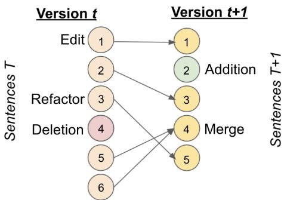  
Figure 1: We identify sentence-level operations – Edit, Addition, Deletion and Refactor – between two versions of a news article (merges, shown here, and splits are a special cases of Edits). We propose tasks aimed at predicting these operations on article versions. We characterize aspects of additions, deletions and edits. We hope NewsEdits can contribute to research on narrative and factual development patterns.

Existing edits corpora do not address these questions due to the nature of previously studied domains: as shown in Yang et al. (2017), the distribution of edits in other domains, like Wikipedia, tend to focus on syntax or style edits. In this work, we introduce a novel domain for revision histories, news article revision histories which, we show, covers the updating of events. Many edits in news either (1) incorporate new information (2) update events or (3) broaden perspectives (Section 3).

Our dataset, NewsEdits, contains 1.2 million articles with 4.6 million versions. We develop a document-level view for studying revisions and define four edit actions to characterize changes between versions: sentence Addition, Deletion, Edit and Refactor (i.e. the sentence is moved within a document). We introduce algorithms for identifying these actions. We count over 40 million Edits, Additions, Deletions or Refactors in NewsEdits.

We argue that news is an important, practical medium to study questions about narrative,factual and stylistic development. This is because, we hypothesize, there are consistent patterns in the way articles update in the breaking news cycle (Usher, 2018). To prove this hypothesis, we show that updates are predictable. We design three tasks: (1) “predict whether an article will be updated,” (2) “predict how much of an article will updated,” (3) “predict sentence-level edit actions.” We show that current large language model (LLM)-based predictors provide a strong baseline above random guessing in most tasks, though expert human journalists perform significantly better. Our insights are twofold: (a) article updates are predictable and follow common patterns which humans are able to discern (b) significant modeling progress is needed to address the questions outlined above. See Section 4.6 for more details.

Finally, we show that the NewsEdits dataset can bring value to a number of specific, ongoing research directions: event-temporal relation extraction (Ning et al., 2018; Han et al., 2019a), article link prediction (Shahaf and Guestrin, 2010), factguided updates (Shah et al., 2020), misinformation detection (Appelman and Hettinga, 2015), headline generation (Shen et al., 2017) and author attribution (Savoy, 2013), as well as numerous directions in computational journalism (Cohen et al., 2011; Spangher et al., 2020) and communications fields (Spangher et al., 2021b).

Our contributions are the following:

1. We introduce NewsEdits, the first public academic corpus of news revision histories.

2. We develop a document-level view of structural edits and introduce a highly scalable sentence-matching algorithm to label sentences in our dataset as Addition, Deletion, Edit, Refactor. We use these labels to conduct analyses characterizing these operations.

3. We introduce three novel prediction tasks to assess reasoning about whether and how an article will change. We show that current large language models perform poorly compared with expert human judgement.

## 2 The NewsEdits Dataset

NewsEdits is a dataset of 1.2 million articles and 4.6 million versions. In Section 2.1, we discuss the sources from which we gathered our dataset. In Section 2.2, we discuss the categories of edit-actions designed to characterize changes between versions, and in Section 2.3, we discuss the algorithm we built to identify these edit-actions.

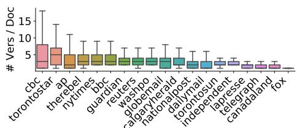  
Figure 2: Number of versions per article, by outlet.

## 2.1 Data Collection

We collect a dataset of news article versions. An article is defined by a unique URL, while a version is one publication (of many) to that same URL. We combine data from two online sources that monitor news article updates: NewsSniffer2 and Twitter accounts powered by DiffEngine.3 These sources were chosen because, together, they tracked most major U.S., British and Canadian news outlets (Kirchhoff, 2010). Our corpus consists of article versions from 22 media outlets over a 15-year timescale (2006-2021), including The New York Times, Washington Post and Associated Press. Although the median number of updates per article is 2, as shown in Figure 2, this varies depending on the outlet. More dataset details in Appendix E.

## 2.2 Edit-Action Operations

Since we are interested in how an entire news article updates between versions, we focus on sentence edits (document-level actions), not word edits (sentence-level actions). Identifying that sentences are added and deleted (vs. updated), can help us study the degree of change an edit introduces in the article (Daxenberger and Gurevych, 2012, 2013; Fong and Biuk-Aghai, 2010).

Thus, we define the following sentence-level edit-actions, shown in Figure 1: Addition, Deletion, Edit and Refactor. Additions should contain novel information and Deletions should remove information from the article. Edits should be substantially similar except for syntactic changes, rephrased and minimally changed or updated information. Special cases of the Edit operation result in sentences that are merged or split without substantial changes. See Section 2.3 for more details.

Refactors are intentionally moved in an article.4

<table><tr><td colspan="3">BERT-Based</td><td colspan="2">Subsequence Matching</td><td colspan="2">BLEU-Based</td></tr><tr><td colspan="2">Method</td><td>F1-Score</td><td>Method</td><td>F1-Score</td><td>Method</td><td>F1-Score</td></tr><tr><td rowspan="3">Hungarian</td><td>TB-mini</td><td>88.5</td><td>ngram-1</td><td>86.0</td><td>BLEU-1</td><td>86.7</td></tr><tr><td>TB-medium</td><td>88.7</td><td>ngram-2</td><td>88.7</td><td>BLEU-2</td><td>89.2</td></tr><tr><td>RB-base</td><td>88.6</td><td>ngram-3</td><td>88.5</td><td>BLEU-3</td><td>88.8</td></tr><tr><td rowspan="3">Max</td><td>TB-mini</td><td>89.0</td><td>ngram-4</td><td>88.2</td><td>BLEU-1,2</td><td>88.8</td></tr><tr><td>TB-medium</td><td>89.5</td><td></td><td></td><td> $_ { \mathrm { B L E U - l } , 2 , 3 }$ </td><td>89.1</td></tr><tr><td>RB-base</td><td>89.4</td><td></td><td></td><td></td><td></td></tr></table>

Table 1: F1 scores on validation data for matching algorithms. Left-hand group shows embedding-based methods (TinyBert (TB) and RoBERTa (RB)) with Maximum or Hungarian matching. Middle group shows ngram methods. Right-hand group shows BLEU for different ngram weightings (1,2 and 1,2,3 are uniform weightings over unigrams, bigrams and trigrams).

Refactors are important because, based on the inverse pyramid5 (Pöttker, 2003) of article structure, sentences that are higher in an article are more important (Scanlan, 2003). Thus, Refactors give us insight into the changing importance of sentences in a narrative.

## 2.3 Edit-Action Extraction

To extract these edit-actions, we need to be able to construct a bipartite graph linking sentences between two versions of an article (example graph shown in Figure 1). If an edge exists between a sentence in one version and a sentence in the other, the sentence is an Edit (or Unchanged). If no edge exists, the sentence is an Addition (if the sentence exists in the newer version only) or Deletion (if it exists in the older version only). We identify Refactors based on an algorithm we develop: in short, we identify a minimal set of edges in the graph which causes all observed edge-crossings. For details on this algorithm, see Appendix F.

In order to construct this bipartite graph, we need a scalable, effective, sentence-similarity algorithm. There is a wide body ofresearch in assessing sentence-similarity (Quan et al., 2019; Abujar et al., 2019; Yao et al., 2018; Chen et al., 2018). However, many of these algorithms measure symmetric sentence-similarity. As shown in Figure 1, two sentences from the old version can be merged in the new version.6 The symmetric similarity between these three sentences would be low, leading us to label the old sentences as Deletions and the new one an Addition, even ifthey were minimally edited (for concrete examples, see Table 14). This violates our tag definitions (Section 2.2). So, we need to measure one-way similarity between sentences, allowing us to label merged and split sentences as Edits. Our algorithm is an asymmetrical version of the maximum alignment metric described by Kajiwara and Komachi (2016):

$$
\mathrm { S i m } _ { a s y m } ( x , y ) = \frac { 1 } { \left| x \right| } \sum _ { i = 1 } ^ { \left| x \right| } \operatorname* { m a x } _ { j } \phi ( x _ { i } , y _ { j } )
$$

where $\phi \left( x _ { i } , y _ { j } \right)$ similarity between words $x _ { i }$ in sentence x and $y _ { j }$ in sentence y.

We test several word-similarity functions, $\phi$ The first uses a simple lexical overlap, where $\phi \left( x _ { i } , y _ { j } \right) = 1 { \mathrm { ~ i f ~ } } l e m m a ( x _ { i } ) = l e m m a ( y _ { j } )$ and 0 oth-( ) = ( ) = ( )erwise.7 The second uses word-embeddings, where $\phi \left( x _ { i } , y _ { j } \right) = E m b ( x _ { i } ) \cdot E m b ( y _ { j } )$ , and $E m b ( x _ { i } )$ is the embedding derived from a pretrained language model (Jiao et al., 2020; Liu et al., 2019).

Each φ function assesses word-similarity; the next two methods use $\phi$ to assess sentence similarity. Maximum alignment counts the number of word-matches between two sentences, allowing many-to-many word-matches between sentences. Hungarian matching (Kuhn, 1955) is similar, except it only allows one-to-one matches. We compare these with BLEU variations (Papineni et al., 2002), which have been used previously to assess sentence similarity (Faruqui et al., 2018).

## 2.4 Edit-Action Extraction Quality

Although our sentence-similarity algorithm is unsupervised, we need to collect ground-truth data in order to set hyperparameters (i.e. the similarity threshold above which sentences are considered a match) and evaluate different algorithms. To do this, we manually identify sentence matches in 280 documents. We asked two expert annotators to identify matches if sentences are nearly the same, they contain the same information but are stylistically different, or if they have substantial overlap in meaning and narrative function. See Appendix G for more details on the annotation task. We use 50% of these human-annotated labels to set hyperparameters, and 50% to evaluate match predictions, shown in Table 1. Maximum Alignment with TinyBERT-medium embeddings (Jiao et al., 2020) (Max-TB-medium) performs best.8

<table><tr><td></td><td>Total Num.</td><td>% of Sents.</td></tr><tr><td>Edits</td><td>26.6 mil.</td><td>17.6 %</td></tr><tr><td>Additions</td><td>10.2 mil.</td><td>6.8%</td></tr><tr><td>Deletions</td><td>5.4 mil.</td><td>3.6 %</td></tr><tr><td>Refactors</td><td>1.6 mil.</td><td>1.1 %</td></tr></table>

Table 2: Summary Statistics for Sentence Operations

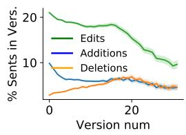

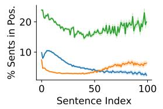  
(a) Edit-actions by version (b) Edit-actions by sentence (% total in version). position (%).  
Figure 3: Dynamics of edit actions.

## 3 Exploratory Analysis

We extract all edit actions in our dataset using methods described in the previous section. Statistics on the total number of operations are shown in Table 2. In this section, we analyze Additions, Deletions and Edits to explore when, how and why these editactions are made and the clues this provides as to why articles are updated. We leave a descriptive analysis of Refactors to future work.

Insight #1: Timing and location of additions, deletions and edits reflect patterns of breaking news and inverse pyramid article structure. How do editing operations evolve from earlier to later versions, and where do they occur in the news article?

In Figure 3a, we show that edit-actions in an article’s early versions are primarily adding or updating information: new articles tend to have roughly 20% of their sentences edited, 10% added and few deleted. This fits a pattern of breaking news lifecycles: an event occurs, reporters publish a short draft quickly, and then they update as new information is learned (Hansen et al., 1994; Lewis and Cushion, 2009). We further observe, as is demonstrated in Figure 6 in the appendix, that updates occur rapidly: outlets known for breaking news9 have a median article-update time of 2 hours.

<table><tr><td></td><td>Add.</td><td>Del.</td><td>Unchang.</td></tr><tr><td>Contains Event</td><td>38.5</td><td>39.3</td><td>31.4</td></tr><tr><td>Contains Quote</td><td>48.4</td><td>50.0</td><td>39.2</td></tr><tr><td>Discourse: Main</td><td>4.4</td><td>4.9</td><td>3.6</td></tr><tr><td>Discourse: Cause</td><td>29.0</td><td>30.2</td><td>23.6</td></tr><tr><td>Discourse: Distant</td><td>63.5</td><td>61.4</td><td>68.1</td></tr></table>

Table 3: % Additions, Deletions or Unchanged sentences that contain Events or Quotes, or have news discourse role: Main (main events), Cause (immediate context) or Distant (history, analysis). F  .01, n 7,368,634.

An article’s later lifecycle, we see, is determined by churn: 5% of sentences are added and 5% are deleted every version. As seen in Figure 3b, additions and edits are more likely to occur in the beginning of an article, while deletions are more likely at the end, indicating newer information is prioritized in an inverse pyramid structural fashion. Insight #2: Additions and deletions are more likely to contain fact-patterns associated with breaking news (quotes, events, or main ideas) than unchanged sentences. In the previous section, we showed that the timing and position of edit-actions reflects breaking news scenarios. To provide further clues about the semantics of editactions, we sample Additions, Deletions and unchanged sentences and study the kinds of information contained in these sentences. We study three different fact-patterns associated with breaking news: events, quotes and main ideas (Ekström et al., 2021; Usher, 2018). To measure the prevalence ofthese fact-patterns, we sample 200,000 documents (7 million sentences) from our corpus and run an event-extraction pipeline (Ma et al., 2021), quote-detection pipeline (Spangher et al., 2020), and news discourse model (Spangher et al., 2021a). As shown in Table 3, we find added and deleted sentences have significantly more events, quotes and Main-Idea and Cause discourse than unchanged sentences. (See Appendix B for more details.)

Insight #3: Edited sentences often contain updating events. The analyses in the previous sections have established that edit-actions both are positioned in the article in ways that resemble, and contain information that is described by, breaking news epistemologies (Ekström et al., 2021). A remaining question is whether the edit-actions change fact-patterns themselves, rather than simply changing the style or other attributes of sentences.

<table><tr><td>Event Chains</td></tr><tr><td>(attack, killed), (injured, killed), (shot, dead), (shot, killed) (attack, injured), (injured, died), (election, won), (meeting,</td></tr><tr><td>talks), (talks, meeting), (elections, election), (war, conflict)</td></tr></table>

Table 4: Selection of top event extracted from edited sentence pairs across article versions.

One way to measure this is to explore whether edit-actions update the events in a story (Han et al., 2019b). We focus on pairs of edited sentences. We randomly sample Edits from documents in our corpus (n  432,329 pairs) and extract events using Ma et al. (2021)’s model. We find that edited sentence pairs are more likely to contain events (43.5%) than unchanged sentences (31.4%). Further, we find that 37.1% of edited sentences with events contain different across versions. We give a sample of pairs in Table 4. This shows that many within sentence operations update events.

Taken together, we have shown in this analysis that factual updates drive many of the edit operations that we have constructed to describe NewsEdits revision histories. Next, we will measure how predictable these update patterns are.

## 4 Predictive Analysis on NewsEdits

As shown in Section 3, many edit-actions show breaking news patterns, which Usher (2018) observed follow common update patterns. Now, we explore how predictable these operations are, to address whether future work on the fundamental research questions addressed in Section 1 around narrative design is feasible.

In this section, we outline three tasks that involve predicting the future states of articles based on the current state. These tasks, we hypothesize, outline several modeling challenges: (1) identify indicators ofuncertainty used in news writing10 (Ekström et al., 2021), (2) identify informational incompleteness, like source representation (Spangher et al., 2020) and (3) identify prototypical event patterns (Wu et al., 2022). These are all strategies that expert human evaluators used when performing our tasks (Section 4.6). The tasks range from easier to harder, based on the sparsity of the data available for each task and the dimensionality of the prediction. We show that they are predictable but present a challenge for current language modeling approaches: expert humans perform these tasks much more accurately than LLM-based baselines.

In addition to serving a model-probing and dataexplanatory purpose, these tasks are also practical: journalists told us in interviews that being able to perform these predictive tasks could help newsrooms allocate reporting resources in a breaking news scenario.11

## 4.1 Task Description and Training Data Construction

We now describe our tasks. For all three tasks, we focus on breaking news by filtering NewsEdits down to short articles (# sents [5, 15]) with low ∈version number (<20) from select outlets.12

Task 1: Will this document update? Given the text of an article at version v, predict if v 1. This probes whether the model can learn a high-level notion of change, irrespective of the fact that different edit-actions have different consequences for the information presented in a news article.

For Task 1, y 1 if a newer version of an article was published and 0 otherwise. We sample 100,000 short article versions from NewsEdits, balancing across length, version number, and y.

Task 2: How much will it update? Given the text of an article at version v, predict in the next version how many Additions, Deletions, Edits, Refactors will occur. This moves beyond Task #1 and requires the model to learn more about how each edit-action category changes an article.

For Task 2, y counts of sentence-level labels (Num. Additions, Num. Deletions, Num. Refactors, Num. Edits) described in the previous sections, aggregated per document. Each count is binned: 0,1 , 0,3 , 3, and is predicted separately as a multiclass classification problem. We sample 150,000 short article versions balancing for sources, length and version number.

Task 3: How will it update? For each sentence in version v, predict whether: (1) the sentence itself will change (i.e. it will be a Deletion or Edit) (2) a Refactor will occur (i.e. it will be moved either up or down in the document) or (3) an Addition will occur (i.e. either above or below the sentence). This task, which we hypothesize is the hardest task, requires the model to reason specifically about the informational components of each sentence and understand nuance about structure and form in a news article (i.e. like the inverse pyramid structure (Pöttker, 2003)).

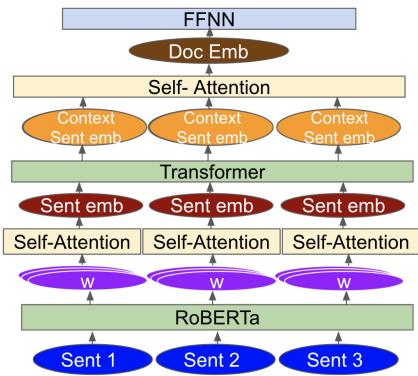  
Figure 4: Architecture diagram for the model used for our tasks. Word-embeddings are averaged using Self-Attention to form sentence-vectors. A minimal transformer layer is used to contextualize these vectors (+Contextual Layer). In Tasks 1 and 2, self-attention is used to generate a document-embedding vector.

For Task 3, y  individual sentence-level labels. Labels are derived for the following subtasks mentioned above: (1) Sentence Operations is a categorical label comprising: [Deletion, Edit, Unchanged], expressed as a one-hot vector. (2) Refactor is a categorical label comprising: [Up, Down, Unchanged], also expressed as a one-hot vector. (3) Addition Above and Addition Below are each binary labels expressing whether 1 sentences was added above or below the target sentence. Because some sentences had Additions above and below, we chose to model this subtask as two separate classification tasks. We sample 100,000 short article versions, balancing for sources, length and version number.

For each task, the input X is a document represented as a sequence of sentences. For each evaluation set, we sample 4k documents balancing for class labels (some labels are highly imbalanced and cannot be balanced).

## 4.2 Modeling

We benchmark our tasks using a RoBERTa-based architecture shown in Figure 4. Spangher et al. (2021a) showed that a RoBERTa-based architecture (Liu et al., 2019) with a contextualization layer outperformed other LLM-based architectures like Reimers and Gurevych (2019) for document-level understanding tasks (further insight given in Section 4.6).

In our model, each sentence from document d is fed into a pretrained RoBERTa Base model13 to obtain contextualized word embeddings. The word embeddings are then averaged using self-attention, creating sentence vectors. For Task 3, these vectors are then used directly for sentence-level predictions. For Tasks 1 and 2 these vectors are condensed further, using self-attention, into a single document vector which is then used for document-level predictions. The sentence vectors are optionally contextualized to incorporate knowledge of surrounding sentences, using a small Transformer layer14 (+Contextualized in Tables 5, 6, 7).

We experiment with the following variations. For Task 2, we train with less data (n  30,000 version pairs) and more data (n 150,000 version pairs), balanced as described in Section 4.1, to test whether a larger dataset would help the models generalize better. We also experiment, for all tasks, with freezing the bottom 6 layers of the RoBERTa architecture (+Partially Frozen) to probe whether pretrained knowledge is helpful for these tasks. Additionally, we experiment giving the version number of the older version as an additional input feature alongside the text of the document (+Version).

Finally, for Tasks 2 and 3, we attempt to jointly model all subtasksusing separate prediction heads for each subtask but sharing all other layers. We use uniform loss weighting between the tasks. Spangher et al. (2021a) showed that various document-level understanding tasks could benefit by being modeled jointly. For our tasks, we hypothesize that decisions around one operation might affect another: i.e. if a writer deletes many sentences in one draft they might also add sentences, so we test whether jointly modeling has a positive effect.

We do not consider any feature engineering on the input text, like performing event extraction (Ma et al., 2021), even though results in Section 3 show that certain types of edit-actions are more likely to contain events. We wish to establish a strong baseline and test whether models can learn salient features on their own. For more discussion on modeling choices and hyperparameter values, see Appendix D.

<table><tr><td rowspan="2"></td><td colspan="2">Num. Additions</td><td colspan="2">Num. Deletions</td><td colspan="2">Num. Edits</td><td colspan="2">Num. Refactors</td></tr><tr><td>Mac F1</td><td>Mic F1</td><td>Mac F1</td><td>Mic F1</td><td>Mac F1</td><td>Mic F1</td><td>Mac F1</td><td>Mic F1</td></tr><tr><td>Most Popular</td><td>19.8</td><td>25.0</td><td>25.6</td><td>47.8</td><td>21.9</td><td>32.0</td><td>39.2</td><td>64.5</td></tr><tr><td>Random</td><td>32.5</td><td>33.9</td><td>30.2</td><td>36.4</td><td>31.7</td><td>35.1</td><td>25.8</td><td>35.1</td></tr><tr><td>Baseline (n = 30, 000)</td><td>22.1</td><td>27.9</td><td>25.6</td><td>46.5</td><td>21.4</td><td>30.6</td><td>35.2</td><td>64.5</td></tr><tr><td>(n = 150,000)</td><td>29.7</td><td>36.3</td><td>25.7</td><td>48.1</td><td>22.4</td><td>32.8</td><td>39.2</td><td>64.6</td></tr><tr><td>+Partially Frozen</td><td>52.2</td><td>54.0</td><td>44.8</td><td>59.0</td><td>49.3</td><td>53.1</td><td>44.3</td><td>65.6</td></tr><tr><td>+Contextual</td><td>50.7</td><td>52.2</td><td>41.0</td><td>57.4</td><td>50.8</td><td>54.8</td><td>45.0</td><td>64.3</td></tr><tr><td>+Version</td><td>52.0</td><td>54.5</td><td>45.3</td><td>59.8</td><td>49.9</td><td>53.7</td><td>43.8</td><td>63.1</td></tr><tr><td>+Multitask</td><td>46.7</td><td>50.2</td><td>28.2</td><td>48.4</td><td>42.1</td><td>49.5</td><td>40.3</td><td>55.1</td></tr><tr><td>Human</td><td>66.4</td><td>69.3</td><td>64.6</td><td>67.5</td><td>65.9</td><td>75.6</td><td>71.3</td><td>70.7</td></tr></table>

Table 5: Task 2 Benchmarks: Baseline model performance for document-level update tasks. Counts of Added, Deleted, Edited and Refactored sentences are binned into roughly equal-sized “low” ( 0,1 sentences), “medium” ( 0,3 sentences), “high” ( 3, sentences) bins. Macro and Micro F1 calculated across bins. (Scores shown are median of 1,000 bootstrap resamples of the evaluation dataset.)

<table><tr><td></td><td colspan="2">Additions</td><td colspan="2">Sentence Operations</td><td colspan="2">Refactors</td></tr><tr><td></td><td>Above (F1)</td><td>Below (F1)</td><td>Mac. F1</td><td>Mic. F1</td><td>Mac. F1</td><td>Mic. F1</td></tr><tr><td>Most Popular</td><td>0.0</td><td>0.00</td><td>18.1</td><td>20.2</td><td>34.7</td><td>53.3</td></tr><tr><td>Random</td><td>11.8</td><td>14.4</td><td>28.0</td><td>38.3</td><td>24.7</td><td>34.7</td></tr><tr><td>Baseline</td><td>8.3</td><td>0.1</td><td>36.5</td><td>61.9</td><td>35.2</td><td>54.2</td></tr><tr><td>+Partially Frozen</td><td>3.5</td><td>0.0</td><td>35.4</td><td>60.9</td><td>35.4</td><td>54.6</td></tr><tr><td>+Version</td><td>0.1</td><td>0.0</td><td>30.3</td><td>59.0</td><td>41.6</td><td>57.2</td></tr><tr><td>+Multitask.</td><td>0.0</td><td>0.0</td><td>27.5</td><td>57.8</td><td>39.5</td><td>54.8</td></tr><tr><td>Human</td><td>38.6</td><td>46.7</td><td>63.8</td><td>63.5</td><td>45.6</td><td>91.5</td></tr></table>

Table 6: Task 3 Benchmarks: Baseline model performance for sentence-Level tasks. Addition tasks are: “Was a sentence added below the target sentence?”, “Was a sentence added above the target sentence?” Sentence Operations columns are three operations that occur on the target sentence: “Deletion”, “Editing”, “Unchanged”. Refactor is binned into whether the target sentence is “Moved Up”, “Moved Down” or “Unchanged”. (Scores shown are median of 1,000 bootstrap resamples of the evaluation dataset.)

<table><tr><td colspan="2">F1</td><td></td><td>F1</td></tr><tr><td>Most Popular</td><td>56.6</td><td>Baseline</td><td>60.8</td></tr><tr><td>Random</td><td>50.6</td><td>+Partially Frozen</td><td>66.0</td></tr><tr><td>Human</td><td>80.1</td><td>+Contextual</td><td>61.7</td></tr><tr><td colspan="2"></td><td>+Version</td><td>77.6</td></tr></table>

Table 7: Task 1 Benchmarks: Baseline model performance for next-version prediction task. Label is binary. (Scores are median of 1,000 bootstrap resamples of the evaluation dataset.)

## 4.3 Human Performance

To evaluate how well human editors agree on edits, we design two human evaluation tasks and recruit 5 journalists with 1 year of editing experience at major U.S. and international media outlets.

Evaluation Task 1: We show users the text of an article and ask them whether or not there will be an update. Collectively, they annotate 100 articles. After completing each round, they are shown the true labels. This evaluates Task 1.

Evaluation Task 2: We show users the sentences of an article, and they are able to move sentences, mark them as deleted or edited, and add sentenceblocks above or below sentences. They are not asked to write any text, only mark the high-level actions of “I would add a sentence,” etc. Collectively they annotate 350 news articles. After each annotation, they see what edits actually happened. The raw output evaluates Task 3 and we aggregate their actions for each article to evaluate Task 2. They are instructed to use their expert intuition and they are interviewed afterwards on the strategies used to make these predictions. (See Appendix G for task guidelines and interviews).

## 4.4 Results

As shown in Tables 5, 6, and 7, model-performance indicates that our tasks do range from easier (Task 1) to harder (Task 3). While our models show improvements above Random, and Most Popular in almost all subtasks, a notable exception is Task 3’s Addition subtasks, where the models do not clearly beat Random. We note that this was also the most difficult subtask for human evaluators.

<table><tr><td>Topic (↑)</td><td>F1</td><td>Topic (↓)</td><td>F1</td><td>y (Add)</td><td>F1</td></tr><tr><td>U.S. Pol.</td><td>38.1</td><td>Local Pol.</td><td>66.8</td><td>[0, 1)</td><td>16.2</td></tr><tr><td>Business</td><td>48.4</td><td>War</td><td>61.8</td><td>[1, 5)</td><td>59.7</td></tr><tr><td>U.K. Pol.</td><td>50.4</td><td>Crime</td><td>58.3</td><td>[5, 100)</td><td>0.9</td></tr></table>

Table 8: Error Analysis: LDA (first two columns): Documents belonging to some topics are easier to predict than others. By label (last column): medium-range growth is easier to predict.

We observe that +Partially Frozen increases performance on Task 2, boosting performance in all subtasks by 10 points. In contrast, it does not increase performance on Task 3, perhaps indicating that the subtasks in Task 3 are difficult for the current LLM paradigm. Although adding version embeddings (+Version) boosts performance for Task 1, it does not seem to measurably increase performance for the other tasks. Finally, performing Task 2 and 3 as multitask learning problems decreases performance for all subtasks.

In contrast, human evaluators beat model performance across tasks, most consistently in Task 2, with on average performance 20 F1-score points above Baseline models. On Task 3, human performance also is high relative to model performance. We observe that, despite Additions in Task 3 being the hardest task, as judged by human and model performance, humans showed a  40 point increase above model performance. Humans are also better at correctly identifying minority classes, with a wider performance gap seen for Macro F1 scores (i.e. see Sentence Operations, where the majority of sentences are unchanged).

## 4.5 Error Analysis

We perform an error analysis on the Task 2 task and find that there are several categories of edits that are easier to predict than others. We run Latent Dirichlet allocation on 40,000 articles, shown in Table 8.15 We assign documents to their highest topic and find that articles covering certain news topics (like War) update in a much more predictable pattern than others (like Business), with a spread of over 26 F1-score points. Further, we find that certain edit-patterns are easier to differentiate, like articles that grow between 1-5 sentences (Table 8). This show us ways to select for subsets of our dataset that are more standard in their update patterns.

The class imbalance of this dataset (Table 2) results in the Most Popular scoring highly. To mitigate this, we evaluate on balanced datasets. Class imbalanced training approaches (Li et al., 2020; Spangher et al., 2021a) might be of further help.

## 4.6 Evaluator Interviews

To better understand the process involved with successful human annotation, we conducted evaluator interviews. We noticed that evaluators first identified whether the main news event was still occurring, or if it was in the past. For the former, they tried to predict when the event would update.16 For the latter, they considered discourse components to determine if an article was narratively complete and analyzed the specificity of the quotes.17 They determined where to add information in the story based on structural analysis, and stressed the importance of the inverse pyramid for informational uncertainty: information later in an article had more uncertainty; if confirmed, it would be moved up in later versions.18 Finally, they considered the emotional salience of events; if a sentence described an event causing harm, it would be moved up.19

Clearly, these tasks demand strong worldknowledge and common sense, as well and highlevel discourse, structural and narrative awareness.20 Combining these different forms of reasoning, our results show, is challenging for current language models, which, for many subtasks, perform worse than guessing. +Multitask performance actually decreases performance for both Task 2 and Task 3, indicating that these models learn features that do not generalize across subtasks. This contrasts with what our evaluators said: their decision to delete sentences often used the same reasoning as, and were dependent on, their decisions to add.

However, we see potential for improvement in these tasks. Current LLMs have been shown to identify common arcs in story-telling (Boyd et al., 2020), identify event-sequences (Han et al., 2019b) and reason about discourse structures (Spangher et al., 2021a; Li et al., 2021). Further, for the ROCStories challenge, which presents four sentences and tasks the model with predicting the fifth (Mostafazadeh et al., 2017, 2016), LLMs have been shown to perform scene reconstruction (Tian et al., 2020b), story planning (Yao et al., 2019; Peng et al., 2018), and structural common sense reasoning (Chen et al., 2019). These are all aspects of reasoning that our evaluators told us they relied on. Narrative arcs in journalism are often standard and structured (Neiger and Tenenboim-Weinblatt, 2016), so we see potential for improvement.

## 5 Related Work

A significant contribution of this work, we feel, is the introduction of a large corpus of news edits into revision-history research and the framing of questions around sentence-level edit-actions. Despite the centrality ofnews writing in NLP (Marcus et al., 1993; Carlson et al., 2003; Pustejovsky et al., 2003; Walker et al., 2006), we know of no academic corpus of news revision histories. Two works that analyze news edits to predict article quality (Tamori et al., 2017; Hitomi et al., 2017) do not release their datasets.21 WikiNews22 articles and editorannotations have been used for document summarization (Bravo-Marquez and Manriquez, 2012), timeline synthesis (Zhang and Wan, 2017; Minard et al., 2016), word-identification (Yimam et al., 2017) and entity salience (Wu et al., 2020). However, we are not aware ofany work using WikiNews revision histories. We did not include WikiNews because its collaborative community edits differ from professional news edits.

Since at least 2006, internet activists have tracked changes made to major digital news articles (Herrmann, 2006). NewsDiffs.org, NewsSniffer and DiffEngine are platforms which researchers have used to study instances of gender and racial bias in article drafts,23 (Brisbane, 2012; Burke, 2016; Jones and Neubert, 2017; Fass and Main, 2014) shifting portrayals of social events, (Johnson et al., 2016) and lack of media transparency (Gourarie, 2015). These tools collect article versions from RSS feeds and the Internet Archive. Major newspapers24 and thousands of government websites25 are being analyzed. We use DiffEngine and NewsSniffer to construct NewsEdits.

Wikihow (Anthonio et al., 2020; Bhat et al., 2020) and Source Code Diffs (Tan and Bockisch, 2019; Shen et al., 2019; Tsantalis et al., 2018; Silva and Valente, 2017; Marrese-Taylor et al., 2020; Xu et al., 2019) use revision histories from domains and for purposes different than ours. Many tasks have benefited from studying Wikipedia Revisions, like text simplification (Yatskar et al., 2010), textual entailment (Zanzotto and Pennacchiotti, 2010), discourse learning (Daxenberger and Gurevych, 2013) and grammatical error correction (Faruqui et al., 2018). However, most tasks focus on word-level edit operations to explore sentence-level changes. Ours focuses on sentence-level operations to explore document-level changes. Research in Student Learner Essays focuses on editing revisions made during essay-writing (Leacock et al., 2010; Wang et al., 2020; Zhang, 2020; Zhang and Litman, 2015). Researchers categorize the intention and effects of each edit (Zhang et al., 2017; Afrin et al., 2020), but do not try to predict edits.

## 6 Conclusion

In this work, we have introduced the first largescale dataset of news edits, extracted edit-actions, and shown that many were fact-based. We showed that edit-actions are predictable by experts but challenging for current LM-backed classifierss. Going forward, we will develop a schema describing the types of edits. We are inspired by the Wikipedia Intentions schema developed by Yang et al. (2017), and are working in collaboration with journalists to further clarify the differences. This development will help to clarify the nature of these edits as well as focus further directions of inquiry.

## 7 Acknowledgements

We are grateful to Amanda Stent, Sz-Rung Shiang, Gabriel Kahn, Casey Williams, Meg Robbins, I-Hung Hsu, Mozhdeh Gheini, Jiao Sun and our anonymous reviewers for invaluable feedback. Spangher is grateful for Bloomberg for supporting this research with a PhD fellowship. May is supported by DARPA Contract FA8750-19-2-0500.

## 8 Ethical Considerations

## 8.1 Dataset

We received permission from the original owners of the datasets, NewsSniffer and DiffEngine. Both sources are shared under strong sharing licenses. NewsSniffer is released under an AGPL-3.0 License,26 which is a strong “CopyLeft” license. DiffEngine is released under an Attribution-NoDerivatives 4.0 International license.27

Our use is within the bounds of intended use given in writing by the original dataset creators, and is within the scope of their licensing.

## 8.2 Privacy

We believe that there are no adverse privacy implications in this dataset. The dataset comprises news articles that were already published in the public domain with the expectation of widespread distribution. We did not engage in any concerted effort to assess whether information within the dataset was libelious, slanderous or otherwise unprotected speech. We instructed annotators to be aware that this was a possibility and to report to us if they saw anything, but we did not receive any reports. We discuss this more below.

## 8.3 Limitations and Risks

The primary theoretical limitation in our work is that we did not include a robust non-Western language source; indeed, our only two languages were English and French. We tried to obtain sources in non-Western newspapers and reached out to a number of activists that use the DiffEngine platform to collect news outside of the Western world, including activists from Russia and Brazil. Unfortunately, we were not able to get a responses.

Thus, this work should be viewed with that important caveat. We cannot assume a priori that all cultures necessarily follow this approach to breaking news and indeed all of the theoretical works that we cite in justifying our directions also focus on English-language newspapers. We provide documentation in the Appendix about the language, source, timeline and size of each media outlet that we use in this dataset.

One possible risk is that some of the information contained in earlier versions of news articles was updated or removed for the express purpose that it was potentially unprotected speech: libel, slander, etc. We discussed this with the original authors of NewsSniffer and DiffEngine. During their years of operation, neither author has received any requests to take versions down. Furthermore, instances of First Amendment lawsuits where the plaintiff was successful in challenging content are rare in the U.S. We are not as familiar with the guidelines of protected speech in other countries.

Another risk we see is the misuse of this work on edits for the purpose of disparaging and denigrating media outlets. Many ofthese news tracker websites have been used for noble purposes (e.g. holding newspapers accountable for when they make stylistic edits or try to update without giving notice). But we live in a political environment that is often hostile to the core democracy-preserving role of the media. We focus on fact-based updates and hope that this resource is not used to unnecessarily find fault with media outlets.

## 8.4 Computational Resources

The experiments in our paper require computational resources. All our models run on a single 30GB NVIDIA V100 GPU, along with storage and CPU capabilities provided by AWS. While our experiments do not need to leverage model or data parallelism, we still recognize that not all researchers have access to this resource level.

We use Huggingface RoBERTa-base models for our predictive tasks, and release the code of all the custom architectures that we construct at https: //github.com/isi-nlp/NewsEdits.git. Our models do not exceed 300 million parameters.

## 8.5 Annotators

We recruited annotators from professional journalism networks like the NICAR listserve.28 All the annotators consented to annotate as part of the experiment, and were paid \$1 per task, above the highest minimum wage in the U.S. Of our five annotators, three are based in large U.S. cities, one lives in a small U.S. city and one lives in a large Brazilian city. Four annotators identify as white and one identifies as Latinx. Four annotators identify as male and one identifies as female. This data collection process is covered under a university IRB. We do not publish personal details about the annotations, and their interviews were given with consent and full awareness that they would be published in full.

## References

Sheikh Abujar, Mahmudul Hasan, and Syed Akhter Hossain. 2019. Sentence similarity estimation for text summarization using deep learning. In Proceedings of the 2nd International Conference on Data Engineering and Communication Technology, pages 155–164. Springer.

Tazin Afrin, Elaine Lin Wang, Diane Litman, Lindsay Clare Matsumura, and Richard Correnti. 2020. Annotation and classification of evidence and reasoning revisions in argumentative writing. In Proceedings ofthe Fifteenth Workshop on Innovative Use of NLPfor Building Educational Applications, pages 75–84.

Talita Anthonio, Irshad Bhat, and Michael Roth. 2020. wikiHowToImprove: A resource and analyses on edits in instructional texts. In Proceedings of the 12th Language Resources and Evaluation Conference, pages 5721–5729, Marseille, France. European Language Resources Association.

Alyssa Appelman and Kirstie Hettinga. 2015. Do news corrections affect credibility? not necessarily. Newspaper Research Journal, 36(4):415–425.

Irshad Bhat, Talita Anthonio, and Michael Roth. 2020. Towards modeling revision requirements in wikiHow instructions. In Proceedings of the 2020 Conference on Empirical Methods in Natural Language Processing (EMNLP), pages 8407–8414, Online. Association for Computational Linguistics.

David M. Blei, Andrew Y. Ng, and Michael I. Jordan. 2003. Latent dirichlet allocation. J. Mach. Learn. Res., 3:993–1022.

Ryan L Boyd, Kate G Blackburn, and James W Pennebaker. 2020. The narrative arc: Revealing core narrative structures through text analysis. Science advances, 6(32):eaba2196.

Felipe Bravo-Marquez and Manuel Manriquez. 2012. A zipf-like distant supervision approach for multidocument summarization using wikinews articles. In International Symposium on String Processing and Information Retrieval, pages 143–154. Springer.

Arthur S. Brisbane. 2012. Insider’s view of changes, from outside. The New York Times.

Austin Burke. 2016. Newsdiffs: A tool for tracking changes to online news articles - vr research - public records research: Opposition research.

Lynn Carlson, Daniel Marcu, and Mary Ellen Okurowski. 2003. Building a discourse-tagged corpus in the framework of rhetorical structure theory. In Current and new directions in discourse and dialogue, pages 85–112. Springer.

Jiaao Chen, Jianshu Chen, and Zhou Yu. 2019. Incorporating structured commonsense knowledge in

story completion. In Proceedings ofthe AAAI Conference on Artificial Intelligence, volume 33, pages 6244–6251.

Qingyu Chen, Sun Kim, W John Wilbur, and Zhiyong Lu. 2018. Sentence similarity measures revisited: ranking sentences in pubmed documents. In Proceedings ofthe 2018 ACM International Conference on Bioinformatics, Computational Biology, and Health Informatics, pages 531–532.

Prafulla Kumar Choubey, Aaron Lee, Ruihong Huang, and Lu Wang. 2020. Discourse as a function ofevent: Profiling discourse structure in news articles around the main event. In Proceedings ofthe 58th Annual Meeting of the Association for Computational Linguistics, pages 5374–5386, Online. Association for Computational Linguistics.

Sarah Cohen, James T Hamilton, and Fred Turner. 2011. Computational journalism. Communications of the ACM, 54(10):66–71.

Johannes Daxenberger and Iryna Gurevych. 2012. A corpus-based study of edit categories in featured and non-featured Wikipedia articles. In Proceedings of COLING 2012, pages 711–726, Mumbai, India. The COLING 2012 Organizing Committee.

Johannes Daxenberger and Iryna Gurevych. 2013. Automatically classifying edit categories in wikipedia revisions. In Proceedings ofthe 2013 Conference on Empirical Methods in Natural Language Processing, pages 578–589.

Mats Ekström, Amanda Ramsälv, and Oscar Westlund. 2021. The epistemologies of breaking news. Journalism Studies, 22(2):174–192.

Manaal Faruqui, Ellie Pavlick, Ian Tenney, and Dipanjan Das. 2018. WikiAtomicEdits: A multilingual corpus of Wikipedia edits for modeling language and discourse. pages 305–315.

John Fass and Angus Main. 2014. Revealing the news: How online news changes without you noticing. Digital Journalism, 2(3):366–382.

Emilio Ferrara. 2017. Disinformation and social bot operations in the run up to the 2017 french presidential election. arXiv preprint arXiv:1707.00086.

Peter Kin-Fong Fong and Robert P Biuk-Aghai. 2010. What did they do? deriving high-level edit histories in wikis. In Proceedings of the 6th International Symposium on Wikis and Open Collaboration, pages 1–10.

Zhenxin Fu, Xiaoye Tan, Nanyun Peng, Dongyan Zhao, and Rui Yan. 2018. Style transfer in text: Exploration and evaluation. In Proceedings ofthe AAAI Conference on Artificial Intelligence, volume 32.

Norm Goldstein. 1953. The Associate Press Rules Regulations and General Orders.

Chava Gourarie. 2015. Why ’diffing’ could make news organizations more transparent. Columbia Journalism Review.

Roman Grundkiewicz and Marcin Junczys-Dowmunt. 2014. The wiked error corpus: A corpus of corrective wikipedia edits and its application to grammatical error correction. In International Conference on Natural Language Processing, pages 478–490. Springer.

Raj Kumar Gupta and Yinping Yang. 2019. Predicting and understanding news social popularity with emotional salience features. In Proceedings ofthe 27th ACM International Conference on Multimedia, pages 139–147.

Rujun Han, I-Hung Hsu, Mu Yang, Aram Galstyan, Ralph Weischedel, and Nanyun Peng. 2019a. Deep structured neural network for event temporal relation extraction. In The 2019 SIGNLL Conference on Computational Natural Language Learning (CoNLL).

Rujun Han, Qiang Ning, and Nanyun Peng. 2019b. Joint event and temporal relation extraction with shared representations and structured prediction. In Proceedings ofthe 2019 Conference on Empirical Methods in Natural Language Processing and the 9th International Joint Conference on Natural Language Processing (EMNLP-IJCNLP), pages 434–444, Hong Kong, China. Association for Computational Linguistics.

Kathleen A Hansen, Jean Ward, Joan L Conners, and Mark Neuzil. 1994. Local breaking news: Sources, technology, and news routines. Journalism Quarterly, 71(3):561–572.

Tatsunori B. Hashimoto, Kelvin Guu, Yonatan Oren, and Percy Liang. 2018. A retrieve-and-edit framework for predicting structured outputs. In Proceedings ofthe 32nd International Conference on Neural Information Processing Systems, NIPS’18, page 10073–10083, Red Hook, NY, USA. Curran Associates Inc.

Steve Herrmann. 2006. The editors: Sniffing out edits. BBC.

Yuta Hitomi, Hideaki Tamori, Naoaki Okazaki, and Kentaro Inui. 2017. Proofread sentence generation as multi-task learning with editing operation prediction. In Proceedings ofthe Eighth International Joint Conference on Natural Language Processing (Volume 2: Short Papers), pages 436–441.

Xiaoqi Jiao, Yichun Yin, Lifeng Shang, Xin Jiang, Xiao Chen, Linlin Li, Fang Wang, and Qun Liu. 2020. TinyBERT: Distilling BERT for natural language understanding. In Findings of the Association for Computational Linguistics: EMNLP 2020, pages 4163–4174, Online. Association for Computational Linguistics.

Erik W Johnson, Jonathan P Schreiner, and Jon Agnone. 2016. The effect of new york times event coding techniques on social movement analyses of protest

data. In Narratives ofIdentity in Social Movements, Conflicts and Change. Emerald Group Publishing Limited.

Gina M Jones and Michael Neubert. 2017. Using RSS to improve web harvest results for news web sites. Journal ofWestern Archives, 8(2):3.

Tomoyuki Kajiwara and Mamoru Komachi. 2016. Building a monolingual parallel corpus for text simplification using sentence similarity based on alignment between word embeddings. In Proceedings of COLING 2016, the 26th International Conference on Computational Linguistics: Technical Papers, pages 1147–1158, Osaka, Japan. The COLING 2016 Organizing Committee.

Suzanne M Kirchhoff. 2010. US newspaper industry in transition. DIANE Publishing.

Harold W Kuhn. 1955. The hungarian method for the assignment problem. Naval research logistics quarterly, 2(1-2):83–97.

Claudia Leacock, Martin Chodorow, Michael Gamon, and Joel Tetreault. 2010. Automated grammatical error detection for language learners. Synthesis lectures on human language technologies, 3(1):1–134.

Justin Lewis and Stephen Cushion. 2009. The thirst to be first: An analysis of breaking news stories and their impact on the quality of 24-hour news coverage in the uk. Journalism Practice, 3(3):304–318.

Xiangci Li, Gully Burns, and Nanyun Peng. 2021. Scientific discourse tagging for evidence extraction. In Proceedings of the 16th Conference of the European Chapter ofthe Association for Computational Linguistics: Main Volume, pages 2550–2562, Online. Association for Computational Linguistics.

Xiaoya Li, Xiaofei Sun, Yuxian Meng, Junjun Liang, Fei Wu, and Jiwei Li. 2020. Dice loss for dataimbalanced NLP tasks. In Proceedings ofthe 58th Annual Meeting of the Association for Computational Linguistics, pages 465–476, Online. Association for Computational Linguistics.

Yinhan Liu, Myle Ott, Naman Goyal, Jingfei Du, Mandar Joshi, Danqi Chen, Omer Levy, Mike Lewis, Luke Zettlemoyer, and Veselin Stoyanov. 2019. Roberta: A robustly optimized bert pretraining approach. arXiv preprint arXiv:1907.11692.

Sidi Lu and Nanyun Peng. 2021. On efficient training, controllability and compositional generalization of insertion-based language generators. arXiv preprint arXiv:2102.11008.

Mingyu Derek Ma, Jiao Sun, Mu Yang, Kung-Hsiang Huang, Nuan Wen, Shikhar Singh, Rujun Han, and Nanyun Peng. 2021. Eventplus: A temporal event understanding pipeline. arXiv preprint arXiv:2101.04922.

Mitchell Marcus, Beatrice Santorini, and Mary Ann Marcinkiewicz. 1993. Building a large annotated corpus of english: The penn treebank.

Edison Marrese-Taylor, Pablo Loyola, Jorge A Balazs, and Yutaka Matsuo. 2020. Learning to describe editing activities in collaborative environments: A case study on github and wikipedia. In Proceedings ofthe 34th Pacific Asia Conference on Language, Information and Computation, pages 188–198.

Ninareh Mehrabi, Thamme Gowda, Fred Morstatter, Nanyun Peng, and Aram Galstyan. 2020. Man is to person as woman is to location: Measuring gender bias in named entity recognition. In Proceedings of the 31st ACM Conference on Hypertext and Social Media, pages 231–232.

Anne-Lyse Minard, Manuela Speranza, Ruben Urizar, Begona Altuna, Marieke Van Erp, Anneleen Schoen, and Chantal Van Son. 2016. Meantime, the newsreader multilingual event and time corpus. In Proceedings ofthe Tenth International Conference on Language Resources and Evaluation (LREC’16), pages 4417–4422.

Nasrin Mostafazadeh, Nathanael Chambers, Xiaodong He, Devi Parikh, Dhruv Batra, Lucy Vanderwende, Pushmeet Kohli, and James Allen. 2016. A corpus and cloze evaluation for deeper understanding of commonsense stories. In Proceedings ofthe 2016 Conference of the North American Chapter of the Associationfor Computational Linguistics: Human Language Technologies, pages 839–849.

Nasrin Mostafazadeh, Michael Roth, Annie Louis, Nathanael Chambers, and James Allen. 2017. Lsdsem 2017 shared task: The story cloze test. In Proceedings ofthe 2nd Workshop on Linking Models of Lexical, Sentential and Discourse-level Semantics, pages 46–51.

Motti Neiger and Keren Tenenboim-Weinblatt. 2016. Understanding journalism through a nuanced deconstruction of temporal layers in news narratives. Journal ofCommunication, 66(1):139–160.

Rasmus Kleis Nielsen. 2015. The uncertain future of local journalism. Pre-publication version ofchapter in Rasmus Kleis Nielsen (ed.).

Qiang Ning, Hao Wu, and Dan Roth. 2018. A multiaxis annotation scheme for event temporal relations. arXiv preprint arXiv:1804.07828.

Kishore Papineni, Salim Roukos, Todd Ward, and Wei-Jing Zhu. 2002. Bleu: a method for automatic evaluation of machine translation. In Proceedings ofthe 40th annual meeting of the Association for Computational Linguistics, pages 311–318.

Nanyun Peng, Marjan Ghazvininejad, Jonathan May, and Kevin Knight. 2018. Towards controllable story generation. In Proceedings of the First Workshop on Storytelling, pages 43–49.

Horst Pöttker. 2003. News and its communicative quality: the inverted pyramid—when and why did it appear? Journalism Studies, 4(4):501–511.

James Pustejovsky, Patrick Hanks, Roser Sauri, Andrew See, Robert Gaizauskas, Andrea Setzer, Dragomir Radev, Beth Sundheim, David Day, Lisa Ferro, et al. 2003. The timebank corpus. In Corpus linguistics, volume 2003, page 40. Lancaster, UK.

Zhe Quan, Zhi-Jie Wang, Yuquan Le, Bin Yao, Kenli Li, and Jian Yin. 2019. An efficient framework for sentence similarity modeling. IEEE/ACM Transactions on Audio, Speech, and Language Processing, 27(4):853–865.

Nils Reimers and Iryna Gurevych. 2019. Sentence-bert: Sentence embeddings using siamese bert-networks. arXiv preprint arXiv:1908.10084.

Jacques Savoy. 2013. Authorship attribution based on a probabilistic topic model. Information Processing & Management, 49(1):341–354.

Chip Scanlan. 2003. Writing from the top down: Pros and cons of the inverted pyramid. Poynter Online., Erişim tarihi, 14.

Darsh Shah, Tal Schuster, and Regina Barzilay. 2020. Automatic fact-guided sentence modification. In Proceedings ofthe AAAI Conference on Artificial Intelligence, volume 34, pages 8791–8798.

Dafna Shahaf and Carlos Guestrin. 2010. Connecting the dots between news articles. In Proceedings of the 16th ACM SIGKDD international conference on Knowledge discovery and data mining, pages 623–632.

Bo Shen, Wei Zhang, Haiyan Zhao, Guangtai Liang, Zhi Jin, and Qianxiang Wang. 2019. Intellimerge: a refactoring-aware software merging technique. Proceedings of the ACM on Programming Languages, 3(OOPSLA):1–28.

Shi-Qi Shen, Yan-Kai Lin, Cun-Chao Tu, Yu Zhao, Zhi-Yuan Liu, Mao-Song Sun, et al. 2017. Recent advances on neural headline generation. Journal of computer science and technology, 32(4):768–784.

Danilo Silva and Marco Tulio Valente. 2017. Refdiff: detecting refactorings in version histories. In 2017 IEEE/ACM 14th International Conference on Mining Software Repositories (MSR), pages 269–279. IEEE.

Alexander Spangher, Jonathan May, Emilio Ferrara, and Nanyun Peng. 2020. “don’t quote me on that”: Finding mixtures of sources in news articles. In Proceedings ofComputation+Journalism Conference.

Alexander Spangher, Jonathan May, Sz-Rung Shiang, and Lingjia Deng. 2021a. Multitask semi-supervised learning for class-imbalanced discourse classification. In Proceedings of the 2021 Conference on Empirical Methods in Natural Language Processing, pages 498–517, Online and Punta Cana, Dominican Republic. Association for Computational Linguistics.

Alexander Spangher, Amberg-Lynn Scott, and Ke Huang-Isherwood. 2021b. “what’s the diff?”: Examining news article updates and changing narratives during the uss theodore roosevelt coronavirus crisis. In Annenberg Scymposium.

Bernd Carsten Stahl. 2006. On the difference or equality of information, misinformation, and disinformation: A critical research perspective. Informing Science, 9.

Hideaki Tamori, Yuta Hitomi, Naoaki Okazaki, and Kentaro Inui. 2017. Analyzing the revision logs of a Japanese newspaper for article quality assessment. In Proceedings ofthe 2017 EMNLP Workshop: Natural Language Processing meets Journalism, pages 46–50, Copenhagen, Denmark. Association for Computational Linguistics.

Liang Tan and Christoph Bockisch. 2019. A survey of refactoring detection tools. In Software Engineering (Workshops), pages 100–105.

Yufei Tian, Tuhin Chakrabarty, Fred Morstatter, and Nanyun Peng. 2020a. Identifying cultural differences through multi-lingual wikipedia. arXiv preprint arXiv:2004.04938.

Zhixing Tian, Yuanzhe Zhang, Kang Liu, Jun Zhao, Yantao Jia, and Zhicheng Sheng. 2020b. Scene restoring for narrative machine reading comprehension. In Proceedings of the 2020 Conference on Empirical Methods in Natural Language Processing (EMNLP), pages 3063–3073.

Nikolaos Tsantalis, Matin Mansouri, Laleh Eshkevari, Davood Mazinanian, and Danny Dig. 2018. Accurate and efficient refactoring detection in commit history. In 2018 IEEE/ACM 40th International Conference on Software Engineering (ICSE), pages 483–494. IEEE.

Nikki Usher. 2018. Breaking news production processes in us metropolitan newspapers: Immediacy and journalistic authority. Journalism, 19(1):21–36.

Teun A Van Dijk. 1983. Discourse analysis: Its development and application to the structure of news. Journal ofcommunication, 33(2):20–43.

Christopher Walker, Stephanie Strassel, Julie Medero, and Kazuaki Maeda. 2006. ACE 2005 multilingual training corpus LDC2006T06. Linguistic Data Consortium, Philadelphia.

Elaine Lin Wang, Lindsay Clare Matsumura, Richard Correnti, Diane Litman, Haoran Zhang, Emily Howe, Ahmed Magooda, and Rafael Quintana. 2020. eRevis(ing): Students’ revision of text evidence use in an automated writing evaluation system. Assessing Writing, 44:100449.

Thomas Wolf, Lysandre Debut, Victor Sanh, Julien Chaumond, Clement Delangue, Anthony Moi, Pierric Cistac, Tim Rault, Remi Louf, Morgan Funtowicz, Joe Davison, Sam Shleifer, Patrick von Platen, Clara Ma, Yacine Jernite, Julien Plu, Canwen Xu, Teven Le Scao, Sylvain Gugger, Mariama Drame, Quentin

Lhoest, and Alexander Rush. 2020. transformers: State-of-the-art natural language processing. In Proceedings of the 2020 Conference on Empirical Methods in Natural Language Processing: System Demonstrations, pages 38–45, Online. Association for Computational Linguistics.

Chuan Wu, Evangelos Kanoulas, Maarten de Rijke, and Wei Lu. 2020. Wn-salience: A corpus of news articles with entity salience annotations. In Proceedings ofThe 12th Language Resources and Evaluation Conference, pages 2095–2102.

Te-Lin Wu, Alex Spangher, Pegah Alipoormolabashi, Marjorie Freedman, Ralph Weischedel, and Nanyun Peng. 2022. Understanding multimodal procedural knowledge by sequencing multimodal instructional manuals. In Proceedings ofthe Conference ofthe 60th Annual Meeting ofthe Associationfor Computational Linguistics (ACL).

Shengbin Xu, Yuan Yao, Feng Xu, Tianxiao Gu, Hanghang Tong, and Jian Lu. 2019. Commit message generation for source code changes. In IJCAI.

Diyi Yang, Aaron Halfaker, Robert Kraut, and Eduard Hovy. 2017. Identifying semantic edit intentions from revisions in wikipedia. In Proceedings of the 2017 Conference on Empirical Methods in Natural Language Processing, pages 2000–2010.

Haipeng Yao, Huiwen Liu, and Peiying Zhang. 2018. A novel sentence similarity model with word embedding based on convolutional neural network. Concurrency and Computation: Practice and Experience, 30(23):e4415.

Lili Yao, Nanyun Peng, Ralph Weischedel, Kevin Knight, Dongyan Zhao, and Rui Yan. 2019. Planand-write: Towards better automatic storytelling. In Proceedings of the AAAI Conference on Artificial Intelligence, volume 33, pages 7378–7385.

Mark Yatskar, Bo Pang, Cristian Danescu-Niculescu-Mizil, and Lillian Lee. 2010. For the sake of simplicity: Unsupervised extraction of lexical simplifications from Wikipedia. In Human Language Technologies: The 2010 Annual Conference ofthe North American Chapter ofthe Associationfor Computational Linguistics, pages 365–368, Los Angeles, California. Association for Computational Linguistics.

Seid Muhie Yimam, Sanja Štajner, Martin Riedl, and Chris Biemann. 2017. Cwig3g2-complex word identification task across three text genres and two user groups. In Proceedings ofthe Eighth International Joint Conference on Natural Language Processing (Volume 2: Short Papers), pages 401–407.

Pengcheng Yin, Graham Neubig, Miltiadis Allamanis, Marc Brockschmidt, and Alexander L Gaunt. 2018. Learning to represent edits. arXiv preprint arXiv:1810.13337.

Fabio Massimo Zanzotto and Marco Pennacchiotti. 2010. Expanding textual entailment corpora from wikipedia using co-training. In Proceedings ofthe 2nd Workshop on The People’s Web Meets NLP: Collaboratively Constructed Semantic Resources, pages 28–36.

Fan Zhang, Homa B Hashemi, Rebecca Hwa, and Diane Litman. 2017. A corpus of annotated revisions for studying argumentative writing. In Proceedings of the 55th Annual Meeting of the Association for Computational Linguistics (Volume 1: Long Papers), pages 1568–1578.

Fan Zhang and Diane Litman. 2015. Annotation and classification of argumentative writing revisions. In Proceedings ofthe Tenth Workshop on Innovative Use of NLP for Building Educational Applications, pages 133–143, Denver, Colorado. Association for Computational Linguistics.

Jianmin Zhang and Xiaojun Wan. 2017. Towards automatic construction of news overview articles by news synthesis. In Proceedings of the 2017 Conference on Empirical Methods in Natural Language Processing, pages 2111–2116.

Zhe Victor Zhang. 2020. Engaging with automated writing evaluation (AWE) feedback on L2 writing: Student perceptions and revisions. Assessing Writing, 43:100439.

## A Dataset: Broader Scope

We expect that NewsEditswill be useful for a range of existing tasks for revision corpora, such as edit language modeling (Yin et al., 2018) and grammatical error correction (Grundkiewicz and Junczys-Dowmunt, 2014). We also think NewsEdits can impact other areas of NLP research and computational journalism, including:

1. Resource Allocation in Newsrooms Newsrooms are often tasked with covering multiple breaking news stories that are unfolding simultanesouly (Usher, 2018). When multiple stories are being published to cover breaking news, or multiple news events are breaking at the same time, newsrooms are often forced to make decisions on which journalists to assign to continue reporting stories. This becomes especially pronounced in an era of budget cuts and localjournalism shortages (Nielsen, 2015). We interviewed 3 journalists with over 20 years of experience at major breaking news outlets. They agreed that a predictive system that performed the tasks explored in Section 4 would be very helpful for allowing editors track which stories are most likely to change the most, allowing them to keep resources on these stories.

2. Event-temporal relation extraction (Ning et al., 2018) and Fact-guided updates (Shah et al., 2020). As shown in Tables 3 and 4, added and edited sentences are both more likely to contain events, and event updates. We see potential for using these sentences to train revise-and-edit (Hashimoto et al., 2018) models.

3. Misinformation: Journalists often issue formal Corrections when they discover errors in their reporting (Appelman and Hettinga, 2015).29 We found 14,301 corrections in added sentences across the same sample with a custom lexicon.30 This might be used to help compare malicious campaigns with honest errors (Ferrara, 2017).

4. Headline Generation (Shen et al., 2017). Across a sample of 2 million version pairs, we count 376,944, or 17% that have a headline update. Headlines have been used to predict emotional salience (Gupta and Yang, 2019). Modeling edits that result in headline changes can help differentiate salient from non-salient edits.

5. Authorship Attribution is the task of predicting which authors were involved in writing an article. We found 2,747 Contributor Lines31 added to articles. This can provide a temporal extension to author-attribution models such as Savoy (2013).

6. Identifying Informational Needs: Source inclusion (Spangher et al., 2020) and discourse structures (Choubey et al., 2020; Spangher et al., 2021a) of static articles have been studied. We see this corpus as being useful for studying when these narrative elements are added.

Directions that we have not explored, but possibly interesting include: style transfer (Fu et al., 2018), detecting bias in news articles (Mehrabi et al., 2020), cross-cultural sensitivity (Tian et al., 2020a), insertion-based article generation (Lu and Peng, 2021), and framing changes in response to an unfolding story (Spangher et al., 2021b).

## B Exploratory Analysis Details

Insight #2 in Section 3 was based on several experiments that we ran. Here we provide more details about the experiments we ran.

Events: We sample of 200,000 documents (7 million sentences) from our corpus32 and use Eventplus (Ma et al., 2021) to extract all events. We find added/deleted sentences have significantly more events than unchanged sentences.

Quotes: Using a quote extraction pipeline (Spangher et al., 2020), we extract explicit and implicit quotes from the sample of documents used above. The pipeline identifies patterns associated with quotes (e.g. double quotation marks) to distantly supervise training an algorithm to extract a wide variety of implicit and explicit quotes with high accuracy (.8 F1-score). We find added/deleted sentences contain significantly more quotes than unchanged sentences.

News Discourse: We train a model to identify three coarse-grained discourse categories in news text: Main (i.e. main story) Cause (i.e. immediate context), and Distant (i.e. history, analysis, etc.) We use a news discourse schema (Van Dijk, 1983) and a labeled dataset which contains 800 news articles labeled on the sentence-level (Choubey et al., 2020). We train a model on this dataset to score news articles in our dataset.33 Then, we filter to Addition, Deletion, etc. sentences. We show that added and deleted sentences are significantly more likely than unchanged sentences to be Main or Cause sentences, while unchanged sentences are significantly more likely to be Distant.

## C Error Analysis: Continued

As discussed in Section 4.5, we perform Latent Dirichlet Allocation (Blei et al., 2003) to softcluster documents. In Table 9, we show the top k 10 words for each topic i (i.e. $\beta _ { 1 , . . . k } ^ { i }$ where $\beta _ { 1 } ^ { i } > \beta _ { 2 } ^ { i } > . . . > \beta _ { k } ^ { i } )$

## D Experiment Details

## D.1 Modeling Decisions

For Task 1, we sample documents in our training dataset, balancing across versions and y and exclude articles with more than 6,000 characters. However, because of the imbalanced nature of the dataset, we could not fully balance.

As is seen in Table 2, +Version, the version number of the old version had a large effect on the performance of the model, boosting performance by over 10 points. We believe that this is permissible, because the version number of the old article is available at prediction time. Interestingly, the effect is actually the opposite of what we would expect. As can be seen in Figure 5, the more versions an article has, the more likely it is to contain another version. This is perhaps because articles with many versions are breaking news articles, and they behave differently than articles with fewer versions. To more properly test a model’s ability to judge breaking news specifically, we can create a validation set where all versions of a set of articles are included; thus the model is forced to identify at early versions whether an article is a breaking news story or not.

For Task 2, we first experiment with different regression modeling heads before reframing the task as a classification task. We test with Linear Regression and Poisson Regression, seeking to learn the raw counts. However, we found that we were not able to improve above random in any subtask and reframed the problem as a binned classification problem.

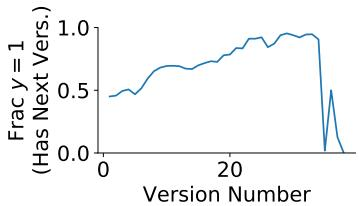  
Figure 5: Percentage of the training dataset for Task 1 which contains y 1, or where another version of the article has been published.

## D.2 Hyperparameters and Training

For all tasks, we used pretrained RoBERTa Base from Wolf et al. (2020). We used reasonable defaults for learning rate, dropout and other hyperparameters explored in Spangher et al. (2021a), which we describe now. For all tasks, we used AdamW as an optimizer, with values $\beta _ { 1 } = . 9 , \beta _ { 2 } = . 9 9 , \varepsilon = 1 e - 8 .$ We used batch-size  1 but experimented with different gradient accumulations (i.e. effective batch size) 10,20,100 . We did not find much impact to varying this parameter. We used a learning rate of 1e-6 as in Spangher et al. (2021a). Early in experimentation, we trained for 10 epochs, but did not observe any improvement past the 3rd epoch, so we limited training to 5 epochs. We used a dropout probability of .1, 0 warmup steps and 0 weight decay. The embedding dimensionality for the pretrained RoBERTa Base we used is 768, and for all other layers, we used a hidden-dimension of 512.

For deriving sentence embeddings, we tested several different methods. We tested both using the <sep> token from RoBERTa and averaging the word-embeddings of each word-piece, as in Spangher et al. (2021a), but found that a third method—using self-attention over the word embeddings, or a learned, weighted average—performed the best. We concatenated a sentence-level positional embedding vector, as in Spangher et al. (2021a), with a max cutoff of 40 positional embeddings (i.e. every sentence with an index greater than 40 was assigned the same vector.)

## E Dataset Details

Here, we give additional details on the dataset, starting with relevant analyses and ending with technical details that should guide the user on how to access our dataset.

<table><tr><td>U.S. Politics (topic 0)</td><td>U.K. Politics (topic 2)</td><td>Police Crime (topic 5)</td><td>Aviation (topic 6)</td><td>Tragedy (topic 7)</td><td>War (topic 9)</td><td>Criminals Crime (topic 12)</td><td>School (topic 13)</td><td>Violence Crime (topic 18)</td></tr><tr><td>mr president trump minister</td><td>government party mr labour</td><td>police man old year</td><td>people airport plane aircraft</td><td>family died hospital old</td><td>killed people attack</td><td>court year old</td><td>school year world</td><td>police officers people</td></tr></table>

Table 9: Topic Model: Top Topics, selected on the bases of the number of documents they are most-expressed in. Labels are assigned by the researchers post-hoc. Several topics appear to be subsets of a broader Crime topic: we note the superclass Crime in parentheses. The specific Crime topic mentioned in the main body is the Violence topic (Topic 18)

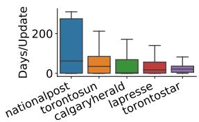  
(a) Distribution over days per update, group 1. Median across all sources in this group is 21 days.

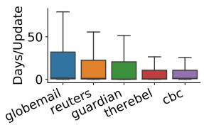  
(b) Distribution over days per update, group 2. Median across all sources in this group is .9 days

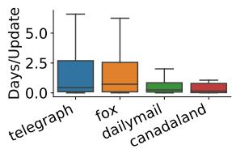

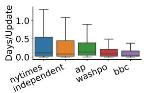  
(c) Distribution over days per (d) Distribution over days per update, group 3. Median update, group 4. Median across all sources in this group across all sources in this group is .35 days, or 8.4 hours is .05 days, or 1.33 hours.  
Figure 6: Average time between version updates. We break sources into four primary groups with similar update distributions.

## E.1.1 Amount of time between Versions

We are especially interested in rapid updates, because, by limits imposed by this timescale on how

## E.1 Additional Analysis

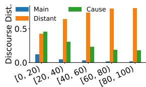

The amount of time between republication of an article varies widely across news outlets, and has a large role in determining what kinds of stories are being republished. As can be seen in Figure 6, we group sources into 4 categories: (1) Figure 6a, those that update articles over weeks (tabloids and magazines), (2) Figure 6b, those that update articles on a daily basis, on median, (3) Figure 6c, those that update 2-3 times a day, and (4) Figure 6d, those that update hourly, or breaking news outlets.

Document Length (# sents)  
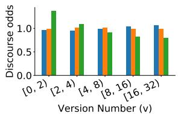

(a) Distributions over dis- (b) Odds of discourse elecourse tags, by article length. ment, by version. odds p d v p d !v .  
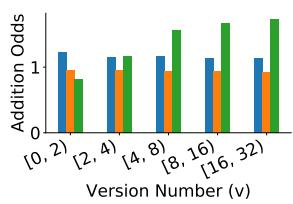

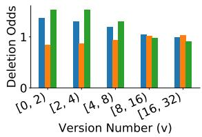  
(c) Odds of discourse element (d) Odds ofdiscourse element in added sentences. odds in deleted sentences. odds $p ( d | \nu , a ) / p ( d | \nu , ! a )$ p d v,del p d v,!del .  
Figure 7: Dynamics of news discourse composition size across time. d refers to discourse label, v refers to version and a, del refer to is\_added, is\_deleted

much information can be gathered by journalists, these updates are more likely to contain single units of information, updates and quotes. Thus, in our experiments, we focus on The New York Times, Independent, Associated Press, Washington Post, and BBC. We also include Guardian and Reuters because they typically compete directly with the previously mentioned outlets in terms of content and style, even if they do not publish as frequently.

## E.1.2 Discourse Across Time

We are interested in the dynamics of articles over time. Although this analysis is still ongoing, we seek to understand how, as the article grows through time, the types of information included in it changes.We show in Figure 7a and 7b that in later versions and longer articles34 sentences are dominated by Distant discourse.

<table><tr><td>Unchanged</td><td>said, trump, people, president, concerns, government, year</td></tr><tr><td>Add/Del</td><td>says, senate, law, death, wednesday, monday, tuesday</td></tr></table>

Table 10: Top Words in Additions/Deletions vs. top words in unchanged sentences.

Interestingly, later versions are also more likely to have Main and Cause discourse added. Based on our annotator interviews, we surmise that this is because, for breaking news, a journalist is frequently trying to assess the causes behind the story. In early drafts, we also see Main sentences being removed. This is due to, as the story is updating in early versions, the Main event is most likely to be changing.

## E.1.3 Top Words

Top Words: We characterize added and deleted sentences by their word usage in Table 10. Words indicating present-tense, recent updates are more likely: day-names like “Monday” or “Tuesday” and the present-tense verb “says” (compared with the past-tense “said” in unchanged sentences).

## E.1.4 Collection of Corrections, Authorship

To identify instances of Corrections in added sentences, we used the following lexicon:

“was corrected”, “revised”, “clarification”, “earlier error”, “version”, “article”

Here are some examples of corrections:

• CORRECTION: An earlier version of this story ascribed to Nato spokesman Brig Gen Carsten Jacobsen comments suggesting that after Saturdayś shooting, people would have to be “looking over their shoulders” in Afghan ministries.

• CORRECTION 19 November 2012:An earlier version of this story incorrectly referred to “gargoyles”, not “spires”.

• Correction 7 March 2012: An earlier version of this story mistakenly said Rushbrook’s car had been travelling at 140mph at the time of the crash.

To identify instances of Contributor Lines, we use the following lexicon:

“reporting by”, “additional reporting”, “contributed reporting”, “editing by”

Here are some examples of contributor lines:

• Additional reporting by Simon Browning.

• ’The article relied heavily on reporting by Reuters and the BBC, and it cited Reuters in saying that during a visit in October 1989 by Pope John Paul II to South Korea, China had prevented the pope’s airplane from flying through Chinese airspace.

• The revelation comes after reporting by The New York Times last week showing that the head of communications at the N.I.H.’s parent agency, the Department of Health and Human Services, also accused federal scientists of using the coronavirus to try to defeat Mr. Trump.

• Additional reporting by Daniel Strauss in Richmond, Virginia, Richard Luscombe in West Palm Beach, Florida, and Ed Pilkington in Essex Junction, Vermont.

## E.2 Dataset Tables and Fields

Our dataset is released in a set of 5 SQLite tables. Three of them are primary data tables, and two are summary-statistic tables. Our primary data tables are: articles, sentence\_diffs, word\_diffs; the first two of which are shown in Tables 12a and 12b (word\_diffs shares a similar structure with sentence\_diffs). We compile two summary statistics tables to cache statistics from sentence\_diffs and word\_diffs; they calculate metrics such as NUM\_SENTENCES\_ADDED and NUM\_SENTENCES\_REMOVED per article.35

The sentence\_diffs data table’s schema is shown in Table 12 and some column-abbreviated sample rows are shown in Table 14. As can be seen, the diffs are calculated and organized on a sentencelevel. Each row shows a comparison of sentences between two adjacent versions of the same article.36 Every row in sentence\_diffs contains index columns: SOURCE, A\_ID, VERSION\_OLD, and VERSION\_NEW. These columns can be used to uniquely map each row in sentence\_diffs to two rows in article.37

<table><tr><td>Source</td><td># Articles</td><td># Versions</td><td>Start</td><td>End</td><td>Ctry.</td><td>Lang.</td><td>Coll.</td></tr><tr><td>BBC</td><td>307,616</td><td>1,244,490</td><td>2006-08</td><td>2021-01</td><td>U.K.</td><td>En.</td><td>NS</td></tr><tr><td>Guardian</td><td>231,252</td><td>852,324</td><td>2012-01</td><td>2021-01</td><td>U.K.</td><td>En.</td><td>NS</td></tr><tr><td>Nytimes</td><td>87,556</td><td>395,643</td><td>2012-08</td><td>2020-12</td><td>U.S.</td><td>En.</td><td>NS</td></tr><tr><td>Telegraph</td><td>78,619</td><td>124,128</td><td>2017-01</td><td>2018-09</td><td>U.K.</td><td>En.</td><td>NS</td></tr><tr><td>Fox</td><td>78,566</td><td>117,171</td><td>2017-01</td><td>2018-09</td><td>U.S.</td><td>En.</td><td>DE</td></tr><tr><td>CNN</td><td>58,569</td><td>117,202</td><td>2017-01</td><td>2018-09</td><td>U.S.</td><td>En.</td><td>DE</td></tr><tr><td>Independent</td><td>55,009</td><td>158,881</td><td>2014-01</td><td>2018-05</td><td>U.K.</td><td>En.</td><td>NS</td></tr><tr><td>CBĆ</td><td>54,012</td><td>387,292</td><td>2017-08</td><td>2018-09</td><td>Ca.</td><td>En.</td><td>DE</td></tr><tr><td>Dailymail</td><td>50,639</td><td>166,260</td><td>2017-01</td><td>2018-09</td><td>U.K.</td><td>En.</td><td>DE</td></tr><tr><td>BBĆ</td><td>42,797</td><td>99,082</td><td>2017-01</td><td>2018-09</td><td>U.K.</td><td>En.</td><td>DE</td></tr><tr><td>La Presse</td><td>40,978</td><td>73,447</td><td>2017-08</td><td>2018-09</td><td>Ca.</td><td>Fr-Ca.</td><td>DE</td></tr><tr><td>Torontostar</td><td>33,523</td><td>310,112</td><td>2017-08</td><td>2018-07</td><td>Ca.</td><td>En.</td><td>DE</td></tr><tr><td>Globemail</td><td>32,552</td><td>91,820</td><td>2017-08</td><td>2018-09</td><td>Ca.</td><td>En.</td><td>DE</td></tr><tr><td>Reuters</td><td>31,359</td><td>143,303</td><td>2017-01</td><td>2018-09</td><td>U.K.</td><td>En.</td><td>DE</td></tr><tr><td>National Post</td><td>22,934</td><td>63,085</td><td>2017-08</td><td>2018-09</td><td>Ca.</td><td>En.</td><td>DE</td></tr><tr><td>Associated Press</td><td>22,381</td><td>97,314</td><td>2017-01</td><td>2018-09</td><td>U.S.</td><td>En.</td><td>DE</td></tr><tr><td>Washington Post</td><td>19,184</td><td>68,612</td><td>2014-01</td><td>2020-07</td><td>U.S.</td><td>En.</td><td>NS</td></tr><tr><td>Toronto Sun</td><td>19,121</td><td>46,353</td><td>2017-08</td><td>2018-09</td><td>Ca.</td><td>En.</td><td>DE</td></tr><tr><td>Calgary Herald</td><td>7,728</td><td>33,427</td><td>2017-08</td><td>2018-09</td><td>Ca.</td><td>En.</td><td>DE</td></tr><tr><td>The Rebel</td><td>4,344</td><td>19,383</td><td>2017-08</td><td>2018-09</td><td>Ca.</td><td>En.</td><td>DE</td></tr><tr><td>Canada Land</td><td>65</td><td>101</td><td>2017-12</td><td>2018-09</td><td>Ca.</td><td>En.</td><td>DE</td></tr></table>

Table 11: A summary of the number of total number of articles and versions for different media outlets which comprise our dataset. Also shown is the original collection that they were derived from (DE for DiffEngine, and NS from NewsSniffer), and the date-ranges during which articles from each outlet were collected.

## E.3 TAG columns in sentence\_diffs

The columns TAG\_OLD and TAG\_NEW in sentence\_diffs have specific meaning: how to transform from version to its adjacent version. In other words, TAG\_OLD conveys where to find SENT\_OLD in VERSION\_NEW and whether to change it, whereas TAG\_NEW does the same for SENT\_NEW in VERSION\_OLD.

More concretely, consider the examples in Table 14b, 14a and 14c. As can be seen, each tag is 3-part and has the following components. Component 1 can be either M, A, or R. M means that the sentence in the current version was Matched with a sentence in the adjacent version, A means that a sentence was Added to the new version and R means the sentence was Removed from the old version.38 Component 2 is only present for Matched sentences, and refers to the index or indices of the sentence(s) in the adjacent version.39 Additionally, Component 3 is also only present if the sentence is Matched. It can be either C or U. C refers to whether the matched sentence was Changed and U to whether it was Unchanged.

Although not shown or described in detail, all M sentences have corresponding entry-matches in word\_diffs table, which has a similar schema and tagging aim.

A user might use these tags in the following ways:

1. To compare only atomic edits, as in Faruqui et al. (2018), a user could filter sentence\_diffs to sentences where M..C is in TAG\_OLD (or equivalently, TAG\_NEW). Then, they would join TAG\_OLD.Component\_2 with SENTENCE\_ID. Finally, they would select SENT\_OLD, SENT\_NEW.40

2. To view only refactorings, or when a sentence is moved from one location in the article to another, a user could filter sentence\_diffs to only sentences containing M..U and follow a similar join process as in use-case 1.

3. To model which sentences might be added, i.e. p sentencei articlet 1 sentencei articlet , a user would select all sentences in SENT\_OLD, and all sentences in SENT\_NEW where A is in TAG\_NEW.

4. To model the inverse of use-case 3, i.e. which sentences would be removed, or p sentencei articlet 1 sentencei articlet , a user would select all sentences in SENT\_NEW, and all sentences in SENT\_OLD where R is in TAG\_OLD.

<table><tr><td rowspan=1 colspan=1>Column Name</td><td rowspan=1 colspan=1>Type</td><td rowspan=1 colspan=1>Column Name</td><td rowspan=1 colspan=1>Type</td><td rowspan=1 colspan=1>Column Name</td><td rowspan=1 colspan=1>Type</td></tr><tr><td rowspan=2 colspan=1>SOURCEA_IDVERSION_ID</td><td rowspan=2 colspan=1>indexindexindex</td><td rowspan=1 colspan=1>TITLE</td><td rowspan=1 colspan=1>text</td><td rowspan=2 colspan=1>CREATEDARCHIVE_URLNUM_VER-SIONS</td><td rowspan=2 colspan=1>texttextint</td></tr><tr><td rowspan=1 colspan=1>URLTEXT</td><td rowspan=1 colspan=1>texttext</td></tr></table>

(a) DB schema for the article table. SOURCE, A\_ID and VERSION\_ID are the primary key columns.
<table><tr><td>Column Name</td><td>Type</td><td>Column Name</td><td>Type</td><td>Column Name</td><td>Type</td></tr><tr><td>SOURCE</td><td>index</td><td>V_NEW_ID</td><td>index</td><td>TAG_OLD</td><td>text</td></tr><tr><td>A_ID</td><td>index</td><td>SENTENCE_ID</td><td>index</td><td>SENT_NEW</td><td>text</td></tr><tr><td>V_OLD_ID</td><td>index</td><td>SENT_OLD</td><td>text</td><td> $\mathrm { T A G \_ N E W }$ </td><td>text</td></tr></table>

(b) DB schema for the sentence\_diffs table (word\_diffs is similar). Table compares version pairs of articles. The rows in the table are on the sentence-level; V\_OLD\_ID refers to the index of the old version, V\_NEW\_ID refers to the index of the new version. TAG\_OLD gives information for how to transition from the old version to the new version; TAG\_NEW is the inverse.

Table 12: Schemas for two databases central to our content organization scheme.

## E.4 Comparison With Other Edits Corpora

Here, we give a tabular comparison with other edits corpora, showing our

## F Algorithm Details

In this section, we give further examples further justify our asymmetrical sentence-matching algorithm. The examples shown in Tables 14b, 14a and 14c illustrate our requirements. The first example, shown in Table 14b, occurs when a sentence is edited syntactically, but its meaning does not change.42 So, we need our sentence-matching algorithm to use a sentence-similarity measure that considers semantic changes and does not consider surface-level changes. The second example, shown in Table 14a, occurs when a sentence is split (or inversely, two sentences are merged.) Thus, we need our sentence matching algorithm to consider manyto-one matchings for sentences. The third example, shown in Table 14c, occurs when sentence-order is rearranged, arbitrarily, throughout a piece. Finally, we need our sentence-matching algorithm to perform all pairwise comparisons of sentences.

## F.1 Refactors

To identify which sentences were intentionally moved rather than moved as a consequence of other document-level changes, we develop an iterative algorithm based on the idea that a refactor is an intentional sentence movement that creates an edgecrossing. Algorithm 2 givens our algorithm.

In English, our algorithm represents sentence matches between two article versions as a bipartite graph. We use a Binary Tree to recursively find all edge crossings in that graph. This idea is based off of the solution for an SPOJ challenge problem: https://www.spoj.com/problems/ MSE06H/.43 We extend this problem to return the set of all edge crossings, not just the crossing number.

input :Article versions vold, vnew, Match   
Threshold T   
output :maps $m _ { o l d } .$ new, $m _ { o l d  }$ new   
initialize;   
$m _ { o l d \right. n e w } , m _ { o l d \left. n e w } = \{ \} , \{ \} ;$   
// match $\nu _ { o l d }  \nu _ { n e w }$   
for $( i , s _ { i } ) \in \nu _ { o l d }$ →do   
$d = \mathrm { m a x } _ { s _ { j } \in \nu _ { n e w } } \mathrm { S i m } _ { a s y m } \left( s _ { i } , s _ { j } \right)$   
$j = \arg \operatorname* { m a x } _ { s _ { j } \in \nu _ { n e w } } \mathrm { S i m } _ { a s y m } ( s _ { i } , s _ { j } )$   
$m _ { o l d  n e w } [ i ] ^ { \prime } = j \times \mathbb { 1 } [ d > T ]$   
end   
// match $\nu _ { o l d }  \nu _ { n e w }$   
for $( j , s _ { j } ) \in \nu _ { n e w }$ ←do   
$d = \mathrm { { m a x } } _ { s _ { i } \in \nu _ { o l d } } \mathrm { { S i m } } _ { a s y m } \left( s _ { j } , s _ { i } \right)$   
$\begin{array} { r } { i = \arg \operatorname* { m a x } _ { s _ { i } \in \nu _ { o l d } } \mathrm { S i m } _ { a s y m } \big ( s _ { j } , s _ { i } \big ) } \end{array}$   
$m _ { o l d  n e w } [ j ] = \stackrel {  } { i } \times \mathbb { 1 } [ d > T ]$   
end  
Algorithm 1: Asymmetrical sentencematching algorithm. Input $\nu _ { o l d } , \nu _ { n e w }$ are lists of sentences, and output is an index mapper. If a sentence maps to $0 \ ( \mathrm { i } . \mathrm { e } . \ d < T )$ , there is no match. $S i m _ { a s y m }$ is described in text.

Then, we filter edge crossings to a candidate set, applying the following conditions in order and stopping when there is only one edge crossing left: (1) edges that have the most number of crossings (2) edges that extend the most distance or (3) edges that move upwards. In most cases, we only apply the first and then the second conditions. In very rare cases, we apply all three. In rarer cases, we apply all three and still have multiple candidate edges. In those cases, we just choose the first edge in the candidate set. We continue removing edges until we have no more crossings.

<table><tr><td rowspan=1 colspan=1>Corpus</td><td rowspan=1 colspan=1># Revisions</td><td rowspan=1 colspan=1>Language</td><td rowspan=1 colspan=1>Source</td><td rowspan=1 colspan=1>Goal</td></tr><tr><td rowspan=1 colspan=1>WiKed ErrorCorpus</td><td rowspan=1 colspan=1>12 million changed sen-tences</td><td rowspan=1 colspan=1>English</td><td rowspan=1 colspan=1>Wikipedia</td><td rowspan=1 colspan=1>Grammatical ErrorCorrection (GEC)</td></tr><tr><td rowspan=1 colspan=1>WikiAtomic-Edits</td><td rowspan=1 colspan=1>43 million &quot;atomic ed-its&quot;41</td><td rowspan=1 colspan=1>8    lan-guages</td><td rowspan=1 colspan=1>Wikipedia</td><td rowspan=1 colspan=1>Language Model-ing</td></tr><tr><td rowspan=1 colspan=1>WiCoPaCo</td><td rowspan=1 colspan=1>70,000 changed sentences</td><td rowspan=1 colspan=1>French</td><td rowspan=1 colspan=1>Wikipedia</td><td rowspan=1 colspan=1>GEC and Sentenceparaphrasing</td></tr><tr><td rowspan=1 colspan=1>WikiHow-ToImprove</td><td rowspan=1 colspan=1>2.7 million changed sen-tences</td><td rowspan=1 colspan=1>English</td><td rowspan=1 colspan=1>WikiHow</td><td rowspan=1 colspan=1>Version prediction,article   improve-ment</td></tr><tr><td rowspan=1 colspan=1>NewsEdits</td><td rowspan=1 colspan=1>36.1 million changed sen-tences, 21.7 million addedsentences, 14.2 million re-moved sentences. 72 mil-lion atomic edits.</td><td rowspan=1 colspan=1>EnglishandFrench</td><td rowspan=1 colspan=1>22 media out-lets</td><td rowspan=1 colspan=1>Language model-ing, event sequenc-ing, computationaljournalism</td></tr></table>

Table 13: A comparison of natural langauge revision history corpora.

## G Annotation-Task Descriptions

## G.1 Task: Sentence Matching

We give our annotators the following instructions:

The goal of this exercise is to help us identify sentences in an article-rewrite that contain substantially new information. To do this, you will identiy which sentences match between two versions of an article.

## Two sentences match if:

1. They are nearly the same, word-forword.

2. They convey the same information but are stylistically different.

3. They have slightly different information but have substantial overlap in meaning and narrative function.

Examples of Option 3 include (please see the “Examples” section for real examples):

1. Updating events.

• (Ex) The man was presumed missing. → The man was found in his home.

• (Ex) The death count was at 23. → 50 were found dead.

• (Ex) The senators are still negotiating the details. → The senators have reached a deal.

2. An improved analysis.

• (Ex) The president is likely seeking improved relations. → The president is likely hoping that hardliners will give way to moderates, improving relations.

• (Ex) The storm, a Category IV, is expected to hit Texas. → The storm, downgraded to Category III, is projected to stay mainly in the Gulf.

• (Ex) Analysts widely think the shock will be temporary. → The shock, caused by widespread shipping delays, might last into December, but will ultimately subside.

3. A quote that is very similar or serves the same purpose.

• (Ex) “We knew we had to get it done.” said Senator Murphy. → “At the end ofthe day, no one could leave until we had a deal” said Senator Harris.

• (Ex) “It was gripping.” said the bystander. → “I couldn’t stop watching.” said a moviegoer.

<table><tr><td>Sent Idx</td><td>Old Tag</td><td>Old Version</td><td>New Version</td><td>New Tag M</td></tr><tr><td>1</td><td>M 1 C</td><td>The Bundesbank would only refer to an in- Weidmann terview Mr. gave to Spiegel magazine last week, in which said, “I can do my job best by staying in office.&quot;</td><td>The Bundesbank would only refer to an in- published terview in Der Spiegel maga- zine last week, in which Mr. Weidmann said, “I can carry out my duty best if remain in office.&quot;</td><td>1C</td></tr></table>

(a) Demo 1: Word-Level atomic edit corrections applied when a sentence-level match is found, using the difflib Python library.
<table><tr><td rowspan=1 colspan=1>SentIdx</td><td rowspan=1 colspan=1>OldTag</td><td rowspan=1 colspan=1>Old Version</td><td rowspan=1 colspan=1>New Version</td><td rowspan=1 colspan=1>NewTag</td></tr><tr><td rowspan=1 colspan=1>1</td><td rowspan=1 colspan=1>M12C</td><td rowspan=1 colspan=1>DALLAS—Ebola patient Thomas Eric Dun-can told his fiancee the day he was diagnosedlast week that he regrets exposing her to thedeadly virusand had he known he was car-rying Ebola, he would have “preferred to stayin Liberia and died than bring this to you,&quot; afamily friend said</td><td rowspan=1 colspan=1>DALLAS—Ebola patient Thomas Eric Dun-can told his fiancee the day he was diagnosedlast week that he regrets exposing her to thedeadly virus</td><td rowspan=1 colspan=1>M1</td></tr><tr><td rowspan=1 colspan=1>2</td><td rowspan=1 colspan=1></td><td rowspan=1 colspan=1></td><td rowspan=1 colspan=1>Had he known he was carrying Ebola, hewould have “preferred to stay in Liberia anddied than bring this to you,&quot; a family friendsaid.</td><td rowspan=1 colspan=1>M1C</td></tr></table>

(b) Demo 2: A sentence that is split results in the addition ofa new sentence, but is matched with the previous dependent clause. Minimal word-level edits are applied.
<table><tr><td rowspan=1 colspan=1>SentIdx</td><td rowspan=1 colspan=1>OldTag</td><td rowspan=1 colspan=1>Old Version</td><td rowspan=1 colspan=1>New Version</td><td rowspan=1 colspan=1>NewTag</td></tr><tr><td rowspan=1 colspan=1>1</td><td rowspan=1 colspan=1>M2U</td><td rowspan=1 colspan=1>“The mother, this was the first time seeingher son since he got to the States.</td><td rowspan=1 colspan=1>“She has not seen him for 12 years, and thefirst time she saw him was through a monitor,&quot;said Lloyd.</td><td rowspan=1 colspan=1>M2U</td></tr><tr><td rowspan=1 colspan=1>2</td><td rowspan=1 colspan=1>M1U</td><td rowspan=1 colspan=1>She has not seen him for 12 years, and thefirst time she saw him was through a monitor,’said Lloyd.</td><td rowspan=1 colspan=1>“The mother, this was the first time seeingher son since he got to the States.&quot;</td><td rowspan=1 colspan=1>M1U</td></tr><tr><td rowspan=1 colspan=1>3</td><td rowspan=1 colspan=1></td><td rowspan=1 colspan=1></td><td rowspan=1 colspan=1>&quot;She wept, and wept, and wept.&quot;</td><td rowspan=1 colspan=1>A</td></tr></table>

(c) Demo 3: Two features shown: (1) Refactoring, or order-swapping, makes sentences appear as though they have been deleted and then added. Swapped sentences are matched through their tags. (2) The last sentence is a newly added sentence and is not matched with any other sentence.  
Table 14: Here we show demos of three tricky edge-cases and how our tagging scheme handles them. Old Tag annotates a Old Version relative to changes in the New Version (or “converts” the Old Version to the New Version). New Tag is the inverse. Tag components: Component 1: M, A, R. Whether the sentence is Matched, Added, or Removed. Component 2: Index. If Matched, what is the index of the sentence in version that it is matched to. Component 3: C, U. If Matched, is the sentence Changed or Unchanged.

Two sentences do not match if:

1. They contain substantially different information.

2. They serve different narrative functions.

3. There is a much better match for one sentence somewhere else in the document.

Things to keep in mind:

• Two sentences might match even if they are in different parts of the document.

• One sentence can match with multiple other sentences, because that sentence might be split up into multiple sentences, each with similar information as parts of the original.

• Sentences don’t have to match.

– Substantially new information, perspectives or narrative tools might be added in a new version.

– Substantially old information, perspectives or narrative tools might be removed from an old version.

input :Sentence matches, i.e. edges e between doc i and doc j, as a list of tuples:   
$e _ { i } = { \big ( } s _ { i 1 } , s _ { i 2 } { \big ) } , e _ { j } = { \big ( } s _ { j 1 } , s _ { j 2 } { \big ) } \ldots$   
output :Minimal set of edges r that, when removed, eliminate all crossings.   
$/ /$ Subroutine identifies all edge crossings in $e ^ { \prime }$ and returns mapping   
$c = \{ e _ { i } \to \left[ e _ { j } , e _ { k } . . . \right] , e _ { j } \to \ldots \}$ from each edge to all its crossings.   
c getEdgeCrossings e   
while $| c | > 0$ do   
// Find candidate set: all edges with maximum crossings.   
$m = \operatorname* { m a x } _ { i } \lvert c [ e _ { i } ^ { \prime } ] \rvert$   
$e ^ { \prime } = e _ { i } ^ { \prime }$ ∣ [where $\left. c [ e _ { i } ^ { \prime } ] \right. = m$   
if $\left| e ^ { \prime } \right| > 1$ ∣then   
$/ /$ Filter candidate set: all edges $\in { e ^ { \prime } }$ that extend the maximum   
distance.   
$d = \operatorname* { m a x } _ { i } | e _ { i } ^ { \prime } [ 0 ] - e _ { i } ^ { \prime } [ 1 ] |$   
$e ^ { \prime } = e _ { i } ^ { \prime }$ where $\left| e _ { i } ^ { \prime } [ 0 ] - e _ { i } ^ { \prime } [ 1 ] \right| = d$   
if $\left| e ^ { \prime } \right| > 1$ then   
$/ /$ Filter candidate set: all edges $\in { e ^ { \prime } }$ that move up.   
$e ^ { \prime } = e _ { i } ^ { \prime }$ where $e _ { i } ^ { \prime } [ 1 ] - e _ { i } ^ { \prime } [ 0 ] < 0$   
else   
else   
end   
// Take first element of $e ^ { \prime }$ as the candidate to remove.   
$t = e ^ { \prime } [ 0 ]$   
= [ ]r.push t   
$/ /$ Remove t from c and from all $c [ e _ { i } ^ { \prime } ]$ lists that contain it.   
c  removeEdge t

Algorithm 2: Identifying Refactors. We define refactors as the minimal set of edge crossings in a   
bipartite graph which, when removed, remove all edge crossings.

Annotators completed the task by drawing lines between sentences in different versions ofan article. An example is shown in Figure 8. We use highlighting to show when non overlapping sequences in the inbox, using simple lexical overlap. If the user mouses over a text block, they can see which words do no match between all textblocks on the other side. Although this might bias them towards our lexical matching algorithms, we do not see them beaking TB-medium. This was very helpful for reducing the cognitive overload of the task.

## G.2 Task: Edit Actions

In this task, workers were instructed to perform edit operations to an article version in anticipation of what the next version would look like. We recruited 5 workers: journalists who collectively had over a decade of experience working for outlets like The New York Times, Huffington Post, Vice, a local outlet in Maine, and freelancing.

We gave our workers the following instructions.

You will be adding, deleting and moving sentences around in a news article to anticipate what a future version looks like.

• Add a sentence either below or above the current sentence by pressing the Add ↑ or Add ↓ buttons. Adding a sentence means that you feel there is substantially new information, a novel viewpoint or quote, or necessary background information that needs to be present.

• Move a sentence by dragging it around on the canvas. Moving a sentence, (or what we’re calling refactoring) means that the importance of a sentence should be either increased or decreased within the article. Please note: refactors are rare!

• Delete a sentence by hitting the Delete button. Deleting an Added sentence just reverses that action— we will not record this. Deleting a sentence that is present means you feel it needs to be (a) substantially rewritten (ergo: a new sentence should also be Added), or (b) the sentence no longer applies given new information that was added.

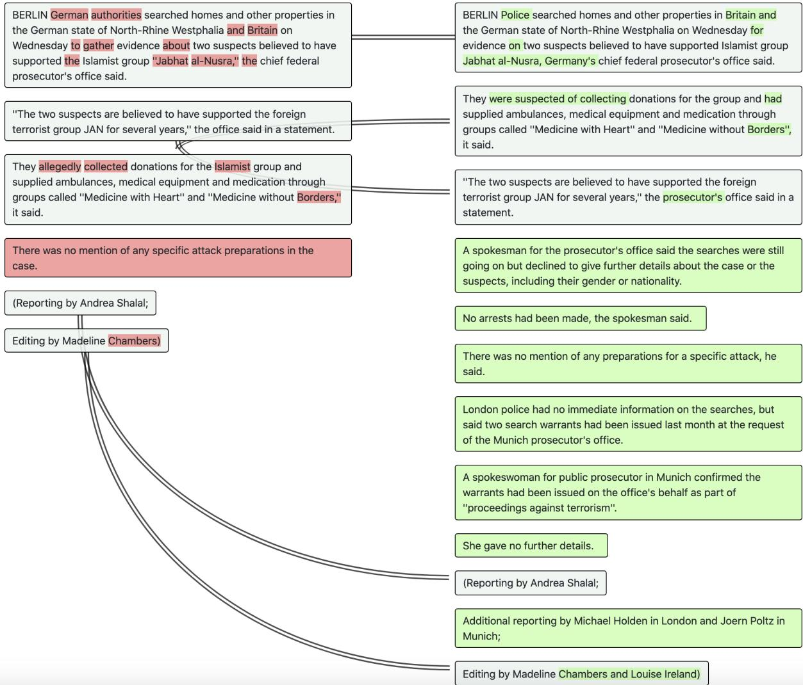  
Figure 8: Example of Sentence Matching Task. All lines represent sentences that have been matched. When the user hits “Submit”, additional coloring is added to the unmatched sentences, which represent Addition (green, right) and Deletion (red, left) sentences.

• Edit a sentence by hitting the Edit button. Editing a sentence means that the wording might change a little bit due to other changes happening around the sentence or events within the sentence being updated.

• Leaving a sentence unchanged means that you don’t really expect the sentence to change at all in the next version of the article.

When you’re ready to submit, please hit the Submit button and please check to see what the actual edits were so you can improve for next task!

<table><tr><td>Worker Id</td><td>Num Tasks Completed</td></tr><tr><td>ASQL7ZBXI7WF6</td><td>101</td></tr><tr><td>A2E8P5A3IKROKB</td><td>92</td></tr><tr><td>A17GX84A96WF6C</td><td>31</td></tr><tr><td>A1685VEOIJIUMR</td><td>13</td></tr><tr><td>A2USH7VYFMU1ME</td><td>5</td></tr><tr><td>A30BGCC8EC1NW</td><td>3</td></tr></table>

Table 15: Count of Tasks Completed per worker

## G.3 Annotator Analysis

We seek here to characterize the performance of different expert annotators. We see in Table 15 that there are three workers which do over 30 tasks each. We characterize the per-task accuracy by counting the number of edit-operations per document, and seeing if they got the same number as the true number of edits (each expressed as a binned count i.e. low: 0,1 operations, medium: 1,3 operations, high: 3, operations).

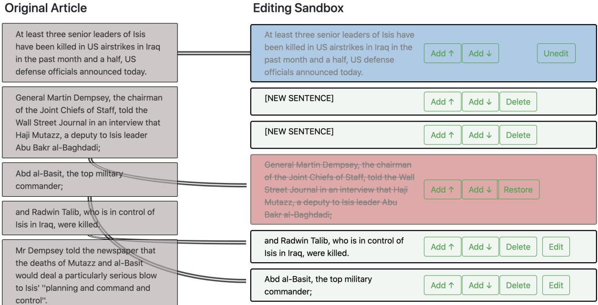  
Figure 9: Example of Editing Task. The gray boxes on the left serve as a reference for how the original article was written. The sandbox on the right is where annotators actually perform the task. The first sentence has been Edited, two sentences have been Added, the third has been Deleted and the fourth has been Refactored downwards.

<table><tr><td>Worker Id</td><td>Accuracy Across Tasks</td></tr><tr><td>A2E8P5A3IKROKB</td><td>76.6</td></tr><tr><td>A30BGCC8EC1NW</td><td>58.3</td></tr><tr><td>ASQL7ZBXI7WF6</td><td>46.0</td></tr><tr><td>A17GX84A96WF6C</td><td>38.7</td></tr><tr><td>A2USH7VYFMU1ME</td><td>35.0</td></tr><tr><td>A1685VEOIJIUMR</td><td>30.8</td></tr></table>

Table 16: Accuracy across document tasks (i.e. % bins correct across document-level subtasks: Added, Edited, Deleted, Refactored).

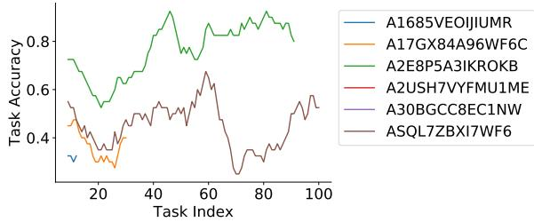  
Figure 10: Worker Accuracy over time, by task

We show that there is a wide variety of performances, in Table 16, with some workers getting over 75% of the operations correct and others getting 30% correct.

Interestingly, we see that there is a learning process occurring. In Figure 10, we see that workers get better over time as they do more tasks. This indicates that the training procedure of letting them see the edits that actually happened is successful at teaching them the style and patterns the edits will take.

## G.4 Annotator Interview 1

This annotator was involved in the Editing task.   
They edited 50 stories.

1. What was your general thought process? Well, my first general though was: “how do I do this update?” Then I thought back to the instructions, and really tried to predict how the AP44 would update.

I then had to decide what timespan I’d use—in general, I assumed a 24 hour update window, but sometimes it was different. If the story updates 2 hours after news breaks vs. 2 days, it will look very different

Sometimes, I would read the story, try to figure out what the story was about, ask what was missing, what I’d include in a story if I was reporting it fully. A lot of times what I felt were missing were more causal analysis, more quotes, more perspectives.

As I was going through, I almost always decided to edit the lede, and was almost always correct with that. Most leads, I thought, could be more efficient, they could incorporate more details from further down in the story into the lede. Also, as stories unfolded, the actor responsible for the event becomes clear, that information will get added to the lede. For example, a building collapses in Manhattan -> faulty beam causes the building collapse. This detail often only becomes apparent afterwards.

What I realized doing this was that there are different genres of breaking news article, and genre matters a lot for how it gets updated. These are the following categories:

(a) Stories where the future is contingent, and you’re making predictions in realtime.

ex) A sailor went missing off the isle of Mann. This story is fundamentally about an unknown – will he be discovered or not? This is one of the harder ones to figure out how to update. How it plays out determines how it will be updated. If the search goes on for a long time, you’ll have more details, you’ll have quotes from his family, conditions on the water. If he’s found, this stuff becomes irrelevant. You’ll have information about how he gets found, then you’ll have information about how many people get updated.

ex) A story was about “Trump is about to make a speech”. “Trump expected to speak”. I updated it as if event didn’t happen yet. But the real update actually contained him speaking. Stories about when multiple futures can happen, without knowing the timescale of the update, are difficult to predict.

I determined whether an event was unfolding by looking for several clues. I looked for certain words: “expected”, “scheduled”, etc. Usually this signals an event-update. I looked for stories where there’s a ton of uncertainty.

Another clue was that the only sources are official statements (ex. “Officials in Yemen say something happened”.) The space of possible change increases. You’re going to get conflicting reports, eye-witnesses contradicting official statements.

Some articles included direct appeals to readers—“don’t use the A4 if you’re traveling between London, etc.” For crime articles: “if you have any information, please contact agency.” This kind of direct appeal is not relevant in the next version.

(b) Past stories when the event is totally in the

past.

For these stories, I looked for vagueness of the original article to determine what would be updated. If it’s more specific, for example, with exact death toll numbers, information about specific actors and victims, the less it’s going to be updated. For these stories, my tendency was to add at least 1-2 sentences of context towards the end of every story. If you’re writing for Reuters, you might not need that.

In general, I wanted to see some background, people involved.

The quotes you’re getting, are they press releases or are they directly from people? Ifthey more official statements and press releases, then you’ll see more updates in the form of specific victim quotes.

One general note: most breaking stories were about bad things. Disasters, crashes, missing people, etc. For a bombing, there’s a pretty predictable pattern of expansion. Death toll will get added, more eyewitness accounts. It has an expansionary trajectory.

2. How did you determine if a sentence needed to be added? I decided to add anywhere I saw vagueness. I added a lot towards the beginning, right after the nut graf is where I added the most sentences. If I saw a sentence taken from a press release, I added after that, assuming that the journalist would get a more fleshed-out quote from someone.

Often I added [sentences] at the end to add context. I never added something before the lead.

Maybe a story has two ideas, then I’d add sentences to the second half to flesh out a second idea.

Sometimes I thought about different categories of information—quotes, analysis, etc.—and it was obvious if some of that was missing.

3. How did you determine ifa sentence needed to be deleted?

I very rarely thought things needed to be deleted

One of the challenges of the experiment was that it was hard to indicate how to combine sentences. I got around this by hitting “edit” for sentences that needed to be combined. Then I’d delete ones below, assuming that the edited sentence would include a clause from the sentence

below it.

Structural sentences and cues got deleted often. Sentences like “More follows”, etc. Nothing integral to the substance of the story.

I noticed that almost always, [informational content of sentences that had been deleted] had been reincorporated.

4. How did you determine ifa sentence needed to be moved up/down?

I did this by feel, what seemed important. One example: A building collapse in Morocco. A sentence way towards the end had a report about weak foundations, that needed to be brought up. This indicated that the journalist became more confident about something

The inverted pyramid so widely used, in a breaking news it’s fairly easy to weight the importance of different elements. Thus, I rarely felt the need to move items upwards.

Sometimes I saw examples of when what was initially a small quote from official was expanded in a later version. Then, it was brought up because the quote became more important. But usually, my instinct would not be to move quotes from officials up.

5. Did it help to see what actually happened after you finished the task?

Usually there was 1-2 things that we had done that were basically the same.

A couple of times, [I] was satisfied to see that the updated story made the same decision to switch sentences around.

6. Any general closing thoughts?

Most interesting thing was to see how formally constrained journalists and editors are, and how much these forms and genres shape your thought and your work.

There are assumptions get baked into the genres about who’s credible, what kinds of things carry weight, sorts of outcomes deserve special attention, a whole epistemic framework.

Even though there’s a lot of variation, there’s a fair amount of consistency.

I was disappointed that, especially for rapidly expanding stories, the edits were mainly causes and main events. I saw very few structural, causal analyses added to breaking stories. There was some analysis that got added to one story about bombings in the Middle East, but still, not a whole lot about how the specific conflict originated.

## G.5 Annotator Interview 2

This annotator was involved in both the editing task and the version-prediction task. They annotated over 100 examples of the first task, and 50 of the second.

1. What was your general thoughtprocess while doing the edits task?

First, before starting, I made the assumption that every story would need edits, because I think everything could always use more work. In reality, if the article wasn’t updated the way it was, I was representing one option. My process was:

(a) Read the whole story, don’t make any changes at first.

(b) Then, I would think about what I thought was the most important sentence.

(c) I would often pull that high up into the lede, and then I’d add a sentence before or after.

The factors that determined the most important part of the article were:

(a) Some indication of harm done or the most recent development. I always took “harm done” as the most important part of a story.

For example: Death count—20 people were killed in some explosion vs. a bomb went off here. Moved the “20 people killed” higher because that was a harm ex. Officials are investigating whether so-and-so doctored documents.

(b) Then, I would add/delete and edit based on these. So, I would create a new sentence and edit the next sentence to give more context.

2. How did you determine if a sentence needed to be added?

So, after identifying the lede that I described previously, I went through and looked through what parts I felt needed more context or a quote. Getting quotes was very important. Often I identified events that I thought warranted a reaction, acknowledgment, information from a source. If these weren’t there, I added a sentence. I didn’t keep a checklist of these elements (i.e. “quote”, “context”, etc.) It was more a gut feeling about what it needed. If I were going back and doing it again, I would write out a checklist.

Often, especially when the news was unpredictable, I would often add a sentence in the beginning saying “I don’t know what this sentence is going to be, but it’s going to be something”. In other words, I was adding context to what the unknown would be. I was able to do this pretty successfully, to predict what context would happen around the unpredictable event.

Where I tried to add more information to flesh out certain unknowns:

(a) If an official said something that needed to be followed up on, I would delete these and add new sentences

(b) I had hoped that the reporter would get that information themselves through eyewitnesses, court documents, etc.

(c) Sometimes an official would give filler quotes like: “we’ll have more information later this afternoon”. These would be replaced with the actual update.

(d) Context: I would add historical context. How often has something been occurring in this area, etc. Many of real updates did have these contextual sentences.

3. How did you decide whether a sentence needed to be edited?

After I decided what would be moved up, I looked at details (dates, people, etc.). Sentences with details were the ones that were most likely to be edited.

4. How did you determine if a sentence needed to be deleted?

I deleted sentences that were redundant. I identified filler quotes (e.g. officials saying they’ll get more information soon.). These would be deleted when, presumably, more information did come in. Sometimes a quote was redundant to a sentence that was already there. One of the challenges was deciding when to delete or edit a sentence.

5. How did you determine ifa sentence needed to be moved up/down?

I almost always moved sentences upwards, to the top. As we discussed previously, the top then needs to have room for an update. Again, as we discussed previously, I used harm and recent developments as a metric to decide where to move. The context was also moved around based on when the events took place.

I also tried to focus on recent developments. For example: “Officials are investigating whether so-and-so doctored documents”. I would move that to the top. I pulled up the active part of the article to express what was actually happening.

6. What things did you get wrong?

I was really bad at predicting stories that were “delete all”, “replace all”. I struggled more with stories that were about political leaders speaking at an event or speaking at a conference, because these ended up going different ways. Sometimes they made a big announcement that would make headlines, but it was hard to known beforehand what that announcement would be.

For crime, or spot news, it was clearer that an event was unfolding and would have specific updates. By “spot news”, I mean stories about crimes, fires, rescues, weather events/disasters, etc. – something unexpected as opposed to articles about events that have been planned, like the example of a political figure speaking at a conference. It was these unexpected events that actually follow more predictable paths when they unfold.

I saw a lot of discrepancies between sentences I chose to edit, and then the actual result was that they got deleted. For example, the death toll was in a sentence, and I’d edit that sentence, but they chose to add a sentence with the same information. The sentence matching algorithm didn’t do a good job with informational units that were not at the sentence level.

7. How did you assess uncertainty in an article?

Often it was topic-based. I can’t think of key indicators that I used to assess uncertainty. 8. Was really helpful after I made the edits to see what actually happened?

I tried to balanced this with what my natural instincts were. I did get better over time. I did feel more confident over time. The changes would be more in my decisions to edit vs. add/delete. In my head, I had the same end result in mind, but they edited it and I added a new sentence. I never felt I was widely off

9. Did you see a lot ofanalytical pieces? Or mainly breaking news?

I saw a mix of stuff that was analytical vs. factual. There were certainly more breaking news events, events that were going to happen and change on the same day. However, I did see some day 2 stories. Sometimes, they were updates that were part of an ongoing investigation. The breaking stories and spot news, crime, were the easiest to do. Those ones seem much more formulaic.

10. What wasyour general thoughtprocess while doing the versioning task? How did you identify versions that updated?

This one was trickier because I would assume that everything would be updated, everything would be improved. The mindset change that I made was “Will this story itself be edited, or will they write a followup with more information?” Once I made this separation this became easier 11. Whatpatterns did you observe in this task?

The timing of when I thought an update would occur ended up mattering a lot. I paid closer attention to stories that would have updates within the same day or a short period of time. The longer the time-periods between updates, the more likely a new piece would be published instead of an update.

Again, crime and spot news it was clear — the person was on the scene at this minute, they’d get more information.

The other giveaways were “so and so is expected to deliver remarks later this afternoon.” It wasn’t quite a preview of the event but it would clearly be updated

The other thing that made me choose to mark a story as “would be updated” is if there was a key perspective missing or if there was no quotes at all. By “key perspective”, I mean, a key quote from a participant that is usually present in this type of story. For a crime, for example, this included: Law enforcement perspective, witness, family. In general, it means that both sides are represented.

12. Were there examples that you thought would update that didn’t?

There were some with stock figures, quarterly earnings, that I initially thought would be updated, but I had seen the examples that were filled out, but I’d be more accepting that this was a final report and that it’s not going to have any quotes. I became better at identifying which types of pieces wouldn’t have context or quotes.

13. Anything I may have missed?

I tried to flag a couple of articles that transferred over inaccurately. Sometimes there were cases of where one article published to the same URL was something completely different. Sometimes there were calls for subscribing to newsletters or related story links. I deleted ones that were repetitive. This might have influenced results on some articles. These structural updates were annoying.

14. Could you see solving this kind of prediction task as being useful in a newsroom?

I could see it being used as a people management tool. Newsrooms are desperate for any kind of methodology to guide the decisions they make. Deciding who should attack a new story, and who should stay put working on their old piece would help a lot!