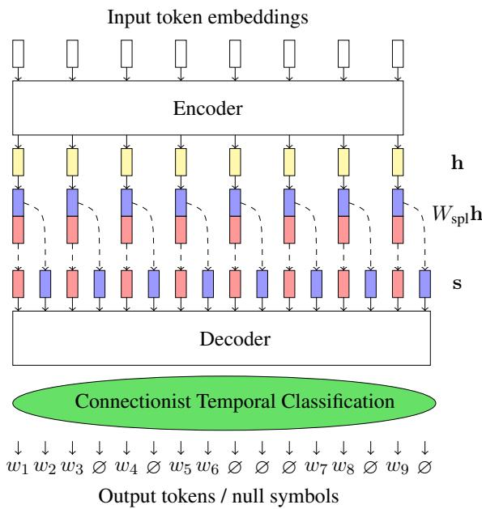
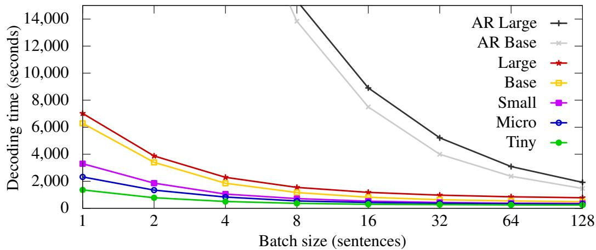
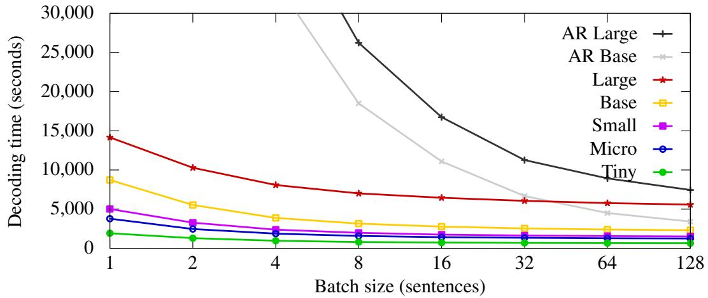
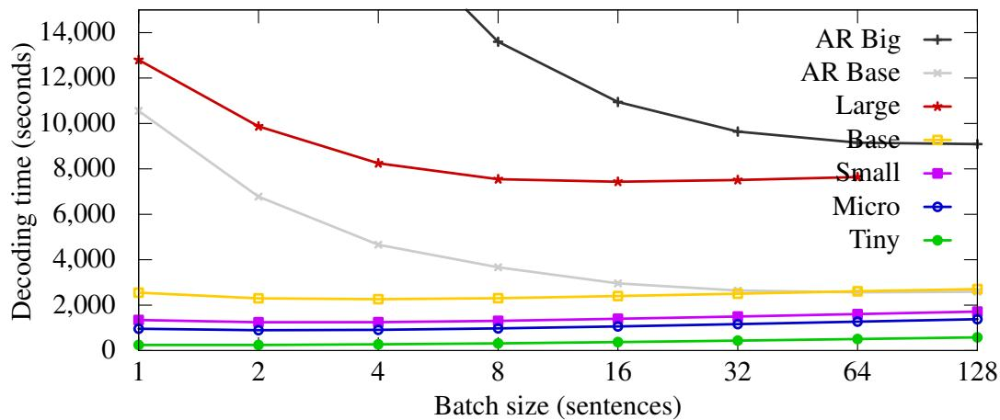

# Non-Autoregressive Machine Translation: It’s Not as Fast as it Seems

Jindrich Helclˇ 1,2 and Barry Haddow1 and Alexandra Birch1

1School of Informatics, University of Edinburgh 2Faculty of Mathematics and Physics, Charles University {jhelcl,bhaddow,a.birch}@ed.ac.uk

## Abstract

Efficient machine translation models are commercially important as they can increase inference speeds, and reduce costs and carbon emissions. Recently, there has been much interest in non-autoregressive (NAR) models, which promise faster translation. In parallel to the research on NAR models, there have been successful attempts to create optimized autoregressive models as part of the WMT shared task on efficient translation. In this paper, we point out flaws in the evaluation methodology present in the literature on NAR models and we provide a fair comparison between a stateof-the-art NAR model and the autoregressive submissions to the shared task. We make the case for consistent evaluation of NAR models, and also for the importance of comparing NAR models with other widely used methods for improving efficiency. We run experiments with a connectionist-temporal-classification-based (CTC) NAR model implemented in C++ and compare it with AR models using wall clock times. Our results show that, although NAR models are faster on GPUs, with small batch sizes, they are almost always slower under more realistic usage conditions. We call for more realistic and extensive evaluation of NAR models in future work.

## 1 Introduction

Non-autoregressive neural machine translation (NAR NMT, or NAT; Gu et al., 2018; Lee et al., 2018) is an emerging subfield of NMT which focuses on increasing the translation speed by changing the model architecture.

The defining feature of non-autoregressive models is the conditional independence assumption on the output probability distributions; this is in contrast to autoregressive models, where the output distributions are conditioned on the previous outputs. This conditional independence allows one to decode the target tokens in parallel. This can substantially reduce the decoding time, especially for longer target sentences.

The decoding speed is assessed by translating a test set and measuring the overall time the process takes. This may sound simple, but there are various aspects to be considered that can affect decoding speed, such as batching, number of hypotheses in beam search or hardware used (i.e., using CPU or GPU). Decoding speed evaluation is a challenging task, especially when it comes to comparability across different approaches. Unlike translation quality, decoding speed can be measured exactly. However, also unlike translation quality, different results are obtained from the same system under different evaluation environments. The WMT Efficient Translation Shared Task aims to evaluate efficiency research and encourages the reporting of a range of speed and translation quality values to better understand the trade-off across different model configurations (Heafield et al., 2021). In this paper, we follow the emerging best practices developed in the Efficiency Shared Task and directly compare with the submitted systems.

In the development of NAR models, modeling error and its subsequent negative effect on translation quality remains the biggest issue. Therefore, the goal of contemporary research is to close the performance gap between the AR models and their NAR counterparts, while maintaining high decoding speed. Considering these stated research goals, the evaluation should comprise of assessing translation quality as well as decoding speed.

Translation quality is usually evaluated by scoring translations of an unseen test set either using automatic metrics, such as BLEU (Papineni et al., 2002), ChrF (Popovic´, 2015) or COMET (Rei et al., 2020), or using human evaluation. To prevent methods from eventually overfitting to a single test set, new test sets are published each year as part of the WMT News Translation Shared Task. In contrast, translation quality evaluation in

NAR research is measured almost exclusively on the WMT 14 English-German test set, using only BLEU scores. Automatic evaluation of translation quality remains an open research problem, but current research advises against relying on a single metric, and especially against relying on only BLEU (Mathur et al., 2020; Kocmi et al., 2021). In our experiments, we follow the recent best practices by using multiple metrics and recent test sets.

In this paper, we examine the evaluation methodology generally accepted in literature on NAR methods, and we identify a number of flaws. First, the results are reported on different hardware architectures, which makes them incomparable, even when comparing only relative speedups. Second, most of the methods only report latency (decoding with a single sentence per batch) using a GPU; we show that this is the only setup favors NAR models. Third, the reported baseline performance is usually questionable, both in terms of speed and translation quality. Finally, despite the fact that the main motivation for using NAR models is the lower time complexity, the findings of the efficiency task are ignored in most of the NAR papers.

We try to connect the separate worlds of NAR and efficient translation research. We train nonautoregressive models based on connectionist temporal classification (CTC), an approach previously shown to be effective (Libovický and Helcl, 2018; Ghazvininejad et al., 2020; Gu and Kong, 2021). We employ a number of techniques for improving the translation quality, including data cleaning and sequence-level knowledge distillation (Kim and Rush, 2016). We evaluate our models following a unified evaluation methodology: In order to compare the translation quality with the rest of the NAR literature, we report BLEU scores measured on the WMT 14 test set, on which we achieve state-ofthe-art performance among (both single-step and iterative) NAR methods; we also evaluate the translation quality and decoding speed of our models in the same conditions as the efficiency task.

We find that despite achieving very good results among the NAT models on the WMT 14 test set, our models fall behind in translation quality when measured on the recent WMT 21 test set using three different automatic evaluation metrics. Moreover, we show that GPU decoding latency is the only scenario in which non-autoregressive models outperform autoregressive models.

This paper contributes to the research community in the following aspects: First, we point out weaknesses in standard evaluation methodology of non-autoregressive models. Second, we link the worlds of non-autoregressive translation and optimization of autoregressive models to provide a better understanding of the results achieved in the related work.

## 2 Non-Autoregressive NMT

The current state-of-the-art NMT models are autoregressive – the output distributions are conditioned on the previously generated tokens (Bahdanau et al., 2016; Vaswani et al., 2017). The decoding process is sequential in its nature, limiting the opportunities for parallelization.

Non-autoregressive models use output distributions which are conditionally independent of each other, which opens up the possibility of parallelization. Formally, the probability of a sequence y given the input x in a non-autoregressive model with parameters θ is modeled as

$$
p _ { \theta } ( y | x ) = \prod _ { y _ { i } \in y } p ( y _ { i } | x , \theta ) .\tag{1}
$$

Unsurprisingly, the independence assumption in NAR models has a negative impact on the translation quality. The culprit for this behavior is the multimodality problem – the inability of the model to differentiate between different modes of the joint probability distribution over output sequences inside the distributions corresponding to individual time steps. A classic example of this issue is the sentence “Thank you” with its two equally probable German translations “Danke schön” and “Vielen Dank” (Gu et al., 2018). Because of the independence assumption, a non-autoregressive model cannot assign high probabilities to these two translations without also allowing for the incorrect sentences “Vielen schön” and “Danke Dank”.

Knowledge distillation (Kim and Rush, 2016) has been successfully employed to reduce the negative influence of the multimodality problem in NAR models (Gu et al., 2018; Saharia et al., 2020). Synthetic data tends to be less diverse than authentic texts, therefore the number of equally likely translation candidates gets smaller (Zhou et al., 2020).

A number of techniques have been proposed for training NAR models, including iterative methods (Lee et al., 2018; Ghazvininejad et al., 2019), auxiliary training objectives (Wang et al., 2019; Qian et al., 2021), or latent variables (Gu et al., 2018;

Lee et al., 2018; Kaiser et al., 2018). In some form, all of the aforementioned approaches use explicit target length estimation, and rely on one-to-one correspondence between the output distributions and the reference sentence.

A group of methods that relax the requirement of the strict one-to-one alignment between the model outputs and the ground-truth target sequence include aligned cross-entropy (Ghazvininejad et al., 2020) and connectionist temporal classification (Libovický and Helcl, 2018).

The schema of the CTC-based model, as proposed by Libovický and Helcl (2018), is shown in Figure 1. The model extends the Transformer architecture (Vaswani et al., 2017). It consists of an encoder, a state-splitting layer, and a nonautoregressive decoder. The encoder has the same architecture as in the Transformer model. The state-splitting layer, applied on the encoder output, linearly projects and splits each state into k states with the same dimension. The decoder consists of a stack of Transformer layers. Unlike the Transformer model, the self-attention in the non-autoregressive decoder does not use the causal mask, so the model is not prevented from attending to future states. Since the output length is fixed to k-times the length of the source sentence, the model is permitted to output blank tokens. Different positions of the blank tokens in the output sequence represent different alignments between the outputs and the ground-truth sequence. Connectionist temporal classification (Graves et al., 2006) is a dynamic algorithm that efficiently computes the standard cross-entropy loss summed over all possible alignments.

We choose the CTC-based architecture for our models because it has been previously shown to be effective for NAR NMT (Gu and Kong, 2021; Saharia et al., 2020) and performs well in the context of non-autoregressive research. It is also one of the fastest NAR architectures since it is not iterative.

## 3 Evaluation Methodology

The research goal of the non-autoregressive methods is to improve translation quality while maintaining the speedup brought by the conditional independence assumption. This means that careful thought should be given to both quantifying the speed gains and the translation quality evaluation. The speed-vs-quality trade-off can be characterized by the Pareto frontier. In this section we discuss the evaluation from both perspectives.

  
Figure 1: The schema of the CTC-based nonautoregressive architecture. We show the original image from Libovický and Helcl (2018).

Translation Quality. In the world of nonautoregressive NMT, the experimental settings are not very diverse. The primary language pair for translation experiments is English-German, sometimes accompanied by English-Romanian to simulate the low-resource scenario. These language pairs, along with the widely used test sets – WMT 14 (Bojar et al., 2014) for En-De and WMT 16 (Bojar et al., 2016) for En-Ro – became the de facto standard benchmark for NAR model evaluation.

A common weakness seen in the literature is the use of weak baseline models. The base variant of the Transformer model is used almost exclusively (Gu et al., 2018; Gu and Kong, 2021; Lee et al., 2018; Ghazvininejad et al., 2020; Qian et al., 2021). We argue that using weaker baselines might lead to overrating the positive effects brought by proposed improvements. Since the baseline autoregressive models are used to generate the synthetic parallel data for knowledge distillation, the weakness is potentially further amplified in this step.

Evaluation is normally with automatic metrics only, and often only BLEU is reported. In light of recent research casting further doubt on the reliability of BLEU as a measure of translation quality (Kocmi et al., 2021), we argue that this is insufficient.

Decoding Speed. The current standard in evaluation of NAR models is to measure translation latency using a GPU, i.e., the average time to translate a single sentence without batching. Since the time depends on the hardware, relative speedup is usually reported along with latency.

This is a reasonable approach but we need to keep in mind the associated difficulties. First, the results achieved on different hardware architectures are not easily comparable even when considering the relative speedups. We also note that the relative speedup values should always be accompanied by the corresponding decoding times in absolute numbers. Sometimes, this information is missing from the published results (Qian et al., 2021).

We argue that measuring only GPU latency disregards other use-cases. In the WMT Efficiency Shared Task, the decoding speed is measured in five scenarios. The speed is reported using a GPU with and without batching, using all 36 CPU cores (also, with and without batching), and using a single CPU core without batching. In batched decoding, the shared task participants could choose the optimal batch size. Our results in Section 5 show that measuring latency is the only one that favors NAR models, and as the batch size increases, AR models quickly reach higher translation speeds.

## 4 Experiments

We experiment with non-autoregressive models for English-German translation. We used the data provided by the WMT 21 News Translation Shared Task organizers (Akhbardeh et al., 2021).

As our baseline model, we use the CTC-based NAR model as described by Libovický and Helcl (2018). We use stack of 6 encoder and 6 decoder layers, separated by the state splitting layer which extends the state sequence 3 times.

We implement our models1 in the Marian toolkit (Junczys-Dowmunt et al., 2018). For the CTC loss computation, we use the warp-ctc library (Amodei et al., 2016).

## 4.1 Teacher Models

For training our baseline autoregressive models, we closely follow the approach of Chen et al. (2021). The preparation of the baseline models consists of three phases – data cleaning, backtranslation, and the training of the final models.

<table><tr><td>Data</td><td>Raw size</td><td>Cleaned size</td></tr><tr><td>Parallel – clean</td><td>3.9</td><td>3.1</td></tr><tr><td>Parallel – noisy</td><td>92.0</td><td>84.6</td></tr><tr><td>Monolingual – En</td><td>93.1</td><td>91.0</td></tr><tr><td>Monolingual – De</td><td>149.9</td><td>146.2</td></tr></table>

Table 1: The sizes of the parallel and monolingual training datasets (in millions of examples).

We train the teacher models on cleaned parallel corpora and backtranslated monolingual data. For the parallel data, we used Europarl (Koehn, 2005), the RAPID corpus (Rozis and Skadin, š, 2017), and the News Commentary corpus from OPUS (Tiedemann, 2012). We consider these three parallel datasets clean. We also use noisier parallel datasets, namely Paracrawl (Bañón et al., 2020), Common Crawl2, WikiMatrix (Schwenk et al., 2019), and Wikititles3. For backtranslation, we used the monolingual datasets from the News Crawl from the years 2018-2020, in both English and German.

We clean the parallel corpus (i.e. both clean and noisy portions) using rule-based cleaning4. Additionally, we exclude sentence pairs with non-latin characters. and we apply dual cross-entropy filtering on the noisy part of the parallel data (Junczys-Dowmunt, 2018). We train Transformer base models in both directions on the clean portion of the parallel data. Then, we select the best-scoring 75% of sentence pairs for the final parallel portion of the training dataset.

For backtranslation (Sennrich et al., 2016), we train four Transformer big models on the cleaned parallel data in both directions. We then use them in an ensemble to create the synthetic source side for the monolingual corpora. We add a special symbol to the generated sentences to help the models differentiate between synthetic and authentic source language data (Caswell et al., 2019).

We use hyperparameters of the Transformer big model, i.e. model dimension 1,024, feed-forward hidden dimension of 4,096, and 16 attention heads. For training, we use the Adam optimizer (Kingma and Ba, 2014) with β1, β2 and ϵ set to 0.9, 0.998 and 10-9 respectively. We used the inverted squareroot learning rate decay with 8,000 steps of linear warm-up and initial learning rate of $1 0 ^ { - 4 }$

The teacher models follow the same hyperparameter settings as the models for backtranslation, but are trained with the tagged backtranslations included in the data. As in the previous case, we train four teacher models with different random seeds for ensembling.

Similar to creating the backtranslations, we use the four teacher models in an ensemble to create the knowledge-distilled data (Kim and Rush, 2016). We translate the source side of the parallel data, as well as the source-language monolingual data. We do not translate back-translated data. Thus, the source side data for the student models is authentic, and the target side is synthetic, created by the teacher models.

## 4.2 Student Models

We train five variants of the student models with different hyperparameter settings. The “Large” model is our baseline model – the same number of layers as the teacher models, 6 in the encoder, followed by the state splitting layer, and another 6 layers in the decoder. The “Base” model has the same number of layers with reduced dimension of the embeddings and the feed-forward Transformer sublayer, to match the Transformer base settings. We also try reducing the numbers of encoder and decoder layers. We shrink the base model to 3-3 (“Small”), 2-2 (“Micro”), and 1-1 (“Tiny”) architectures.

We run the training of each model for three weeks on four Nvidia Pascal P100 GPUs.

## 5 Results

In this section, we try to view the results of the NAR and efficiency research in a shared perspective. We evaluate our models and present results in terms of translation quality and decoding speed. We compare the results to the related work on both non-autoregressive translation and model optimization.

Translation Quality. The research on nonautoregressive models uses the BLEU score (Papineni et al., 2002) measured on the WMT 14 test set (Bojar et al., 2014) as a standard benchmark for evaluating translation quality. We use Sacrebleu (Post, 2018) as the implementation of the BLEU score metric. Using a single test set for the whole volume of research on this topic may however produce misleading results. To bring the evaluation up to date with the current state-of-the-art translation systems, we also evaluate our models using COMET (Rei et al., 2020)5 and BLEU6 scores on the recent WMT 21 test set. The same test set was used in the WMT 21 Efficiency Task.

<table><tr><td>En → De</td><td>De → En</td></tr><tr><td>Saharia et al. (2020) 28.2 Gu and Kong (2021) 27.2</td><td>31.8</td></tr><tr><td>Qian et al. (2021) 26.6</td><td>31.3 31.0</td></tr><tr><td>Large 28.4</td><td></td></tr><tr><td>Base 23.7</td><td>31.3 30.3</td></tr><tr><td>Small 23.6</td><td>29.1</td></tr><tr><td>Micro 25.0</td><td>27.5</td></tr><tr><td>Tiny 20.3</td><td>21.7</td></tr></table>

Table 2: The BLEU scores of the NAR models on the WMT 14 test set

Table 2 shows the BLEU scores of our NAR models on the WMT 14 test set. We show the results of the five variants of the NAR models and we include three of the best-performing NAR approaches from the related work. We see from the table that using BLEU, the “Large” model scores among the best NAR models on the WMT 14 test set. As the NAR model size decreases, so does the translation quality, with the notable exception of the En De “Micro” model, which outperforms the “Base” model consistently on different test sets.

In Table 3, we report the automatic evaluation results of our AR and NAR models on the multireference WMT 21 test set (Akhbardeh et al., 2021). We compare our NAR models to the AR large teacher models from Section 4.1, an AR base model trained on the original clean data, and an AR base student model trained on the distilled data. Following Heafield et al. (2021), we use references A, C, and D for English-German translation.

We see that there is a considerable difference in the translation quality between the NAR models and the AR large teacher model. This difference grows with beam search and ensembling applied on the AR decoding, techniques not usually used with NAR models because of the speed cost. We also note that when we train an AR base model on the distilled data, it outperforms the NAR large model by a considerable margin.

<table><tr><td>En → De</td><td>COMET</td><td>BLEU</td></tr><tr><td>AR - Large</td><td>0.4110</td><td> $5 0 . 5 ~ \pm 1 . 3$ </td></tr><tr><td>+ beam</td><td>0.4053</td><td> $5 0 . 8 \ \pm 1 . 3$ </td></tr><tr><td>+ ensemble</td><td>0.4332</td><td> $5 2 . 2 \ \pm 1 . 3 $ </td></tr><tr><td>AR - Base</td><td>0.3881</td><td> $4 7 . 9 \pm 1 . 3$ </td></tr><tr><td>+ beam</td><td>0.3873</td><td> $4 8 . 0 \pm 1 . 3 $ </td></tr><tr><td>Student AR – Base NAR models</td><td>0.4550</td><td> $5 1 . 6 \pm 1 . 2$ </td></tr><tr><td>Large</td><td>0.1485</td><td> $4 7 . 8 \ \pm 1 . 2$ </td></tr><tr><td>Base</td><td></td><td> $4 1 . 8 \ \pm 1 . 1$ </td></tr><tr><td></td><td>-0.0521</td><td></td></tr><tr><td>Small</td><td>-0.0752</td><td> $4 1 . 9 \pm 1 . 1$ </td></tr><tr><td>Micro</td><td>-0.0083</td><td> $4 3 . 5 ~ \pm 1 . 1$ </td></tr><tr><td>Tiny</td><td>-0.3333</td><td> $3 4 . 7 \ \pm 1 . 0$ </td></tr></table>

Table 3: Results of quantitative evaluation of English-German translation quality using automatic metrics on the multi-reference WMT 21 test set. The confidence intervals were computed using Sacrebleu.

Another thing we notice is the enormous difference in the COMET scores between the AR and NAR models. The AR base models achieve comparable BLEU scores to the NAR large models, but differ substantially in the COMET score. From a look at the system outputs, we hypothesize that the NAR systems produce unusual errors which BLEU does not penalise as heavily as COMET. This might suggest that NAR models would rank poorly in human evaluation relative to their autoregressive counterparts, despite the reasonable BLEU score values. Another reason might be that the different errors of NAR models are causing a domain mismatch between the COMET training data and the data being evaluated.

Decoding speed. We follow the decoding time evaluation methodology of the WMT 21 Efficient Translation Shared Task (Heafield et al., 2021). We recreate the hardware conditions that were used in the task. For the GPU decoding measurements, we use a single Nvidia Ampere A100 GPU. The CPU evaluation was performed on a 36-core CPU Intel Xeon Gold 6354 server from Oracle cloud. To amortize the various computation overheads, the models submitted to the shared task are evaluated on a million sentence benchmark dataset.

We measure the overall wall time to translate the shared task dataset with different batching settings on both the GPU and the 36-core CPU. The decoding times are shown in Figures 2 and 4 for the GPU and CPU times, respectively. We do not report the single-core CPU latencies as the decoding speed of the NAR models falls far behind the efficient AR models in this setup and the translation of the dataset takes too long.

<table><tr><td>Model Latency (ms)</td></tr><tr><td>Gu et al. (2018) 39 Wang et al. (2019) 22</td></tr><tr><td>Sun et al. (2019) 37</td></tr><tr><td>Ours – Large 14</td></tr></table>

Table 4: The comparison of the decoding time of various NAR models for a single sentence in a batch on a P100 GPU. Note that this table should serve merely as an illustration, since the results were measured on different datasets.

We can see that in case of GPU decoding that all models benefit from having larger batch sizes. However, the non-autoregressive models are much faster when the batch size is small. We also ran the evaluation on an Nvidia Pascal P100 GPU, which showed that when the batch size is large enough, autoregressive models eventually match the speed of non-autoregressive models. We show the decoding times on the Pascal GPU in Figure 3. In Table 4, we compare the latencies measured on the Pascal GPU to some of the related NAR approaches that report results on this GPU type. Due to implementation reasons, the maximum batch size for our NAR models is around 220 sentences.

Comparison with Efficient AR Models. In Table 5, we present a comparison on the million sentence test set with “Edinburgh base”, one of the leading submissions in the WMT 21 efficiency task (Behnke et al., 2021), which uses the deep encoder – shallow decoder architecture (Kasai et al., 2021). First, we see that using three different evaluation metrics (ChrF, COMET, and BLEU), our models lag behind the Edinburgh base model. In line with our previous observation, we see a considerable drop in the COMET score values. In terms of decoding speed, the only scenario in which the non-autoregressive model is better is on GPU with batch size 1. This is in line with our intuition that the parallelization potential brought by the GPU is utilized more efficiently by the NAR model. On one hand, larger batches open up the parallelization possibilities to AR models. On the other hand, limited parallelization potential (in form of CPU decoding) reduces the differences between AR and NAR models. The batch size of the Edinburgh base model was 1,280 in the batched decoding setup.

  
Figure 2: The decoding times to translate the efficiency task test set using various batch size settings, computed on a single Nvidia Ampere A100 GPU, i.e. the GPU type used for evaluation in the efficiency task.

  
Figure 3: The decoding times to translate the efficiency task test set using various batch size settings, computed on a single Nvidia Pascal P100 GPU.

  
Figure 4: The decoding times to translate the efficiency task test set using various batch size settings, computed on 36 CPU cores.

<table><tr><td></td><td colspan="3">Translation quality</td><td colspan="3">Decoding time (seconds)</td></tr><tr><td></td><td>ChrF</td><td>COMET</td><td>BLEU</td><td>GPU, b&gt;1</td><td>GPU, b=1</td><td>CPU, b&gt;1</td></tr><tr><td>Edinburgh base (Behnke et al., 2021)</td><td>61.5</td><td>0.527</td><td>55.3</td><td>140</td><td>16,851</td><td>500</td></tr><tr><td>AR – Large (teacher)</td><td>59.2</td><td>0.411</td><td>50.5</td><td>1,918</td><td>&gt; 24h</td><td>9,090</td></tr><tr><td>AR – Base (student)</td><td>59.5</td><td>0.455</td><td>51.6</td><td>1,465</td><td>&gt; 24h</td><td>2,587</td></tr><tr><td>NAR – Large</td><td>58.6</td><td>0.149</td><td>47.8</td><td>782</td><td>7,020</td><td>7,434</td></tr><tr><td>NAR – Micro</td><td>57.3</td><td>-0.008</td><td>43.5</td><td>311</td><td>2,322</td><td>897</td></tr></table>

Table 5: A comparison of our AR and NAR models with one of the submissions to the WMT 21 efficiency task. We show the results of automatic translation quality evaluation using three different metrics, and the decoding time to translate the test set using a GPU and 36-core CPU with either latency (b=1) or batched (b>1) decoding.

## 6 Conclusions

In this paper, we challenge the evaluation methodology adopted by the research on non-autoregressive models for NMT.

We argue that in terms of translation quality, the evaluation should include newer test sets and metrics other than BLEU (particularly COMET and ChrF). This will provide more insight and put the results into the context of the recent research.

From the decoding speed perspective, we should bear in mind various use-cases for the model deployment, such as the hardware environment or batching conditions. Preferably, the research should evaluate the speed gains across a range of scenarios. Finally, given that the latency condition – translation of one sentence at a time on a GPU – already translates too fast to be perceived by human users of MT, there is currently no compelling scenario that warrants the deployment of NAR models.

## Acknowledgments

This project received funding from the European Union’s Horizon 2020 research and innovation programmes under grant agreements 825299 and 825303 (GoURMET, Bergamot), and from the Czech Science Foundation grant 19-26934X (NEUREM3) of the Czech Science Foundation. Our work has been using data provided by the LINDAT/CLARIAH-CZ Research Infrastructure, supported by the Ministry of Education, Youth and Sports of the Czech Republic (Project No. LM2018101).

## References

Farhad Akhbardeh, Arkady Arkhangorodsky, Magdalena Biesialska, Ondˇrej Bojar, Rajen Chatterjee, Vishrav Chaudhary, Marta R. Costa-jussa, Cristina España-Bonet, Angela Fan, Christian Federmann, Markus Freitag, Yvette Graham, Roman Grundkiewicz, Barry Haddow, Leonie Harter, Kenneth Heafield, Christopher Homan, Matthias Huck, Kwabena Amponsah-Kaakyire, Jungo Kasai, Daniel Khashabi, Kevin Knight, Tom Kocmi, Philipp Koehn, Nicholas Lourie, Christof Monz, Makoto Morishita, Masaaki Nagata, Ajay Nagesh, Toshiaki Nakazawa, Matteo Negri, Santanu Pal, Allahsera Auguste Tapo, Marco Turchi, Valentin Vydrin, and Marcos Zampieri. 2021. Findings of the 2021 conference on machine translation (WMT21). In Proceedings of the Sixth Conference on Machine Translation, pages 1–93, Online. Association for Computational Linguistics.

Dario Amodei, Sundaram Ananthanarayanan, Rishita Anubhai, Jingliang Bai, Eric Battenberg, Carl Case, Jared Casper, Bryan Catanzaro, Qiang Cheng, Guoliang Chen, Jie Chen, Jingdong Chen, Zhijie Chen, Mike Chrzanowski, Adam Coates, Greg Diamos, Ke Ding, Niandong Du, Erich Elsen, Jesse Engel, Weiwei Fang, Linxi Fan, Christopher Fougner, Liang Gao, Caixia Gong, Awni Hannun, Tony Han, Lappi Johannes, Bing Jiang, Cai Ju, Billy Jun, Patrick LeGresley, Libby Lin, Junjie Liu, Yang Liu, Weigao Li, Xiangang Li, Dongpeng Ma, Sharan Narang, Andrew Ng, Sherjil Ozair, Yiping Peng, Ryan Prenger, Sheng Qian, Zongfeng Quan, Jonathan Raiman, Vinay Rao, Sanjeev Satheesh, David Seetapun, Shubho Sengupta, Kavya Srinet, Anuroop Sriram, Haiyuan Tang, Liliang Tang, Chong Wang, Jidong Wang, Kaifu Wang, Yi Wang, Zhijian Wang, Zhiqian Wang, Shuang Wu, Likai Wei, Bo Xiao, Wen Xie, Yan Xie, Dani Yogatama, Bin Yuan, Jun Zhan, and Zhenyao Zhu. 2016. Deep speech 2 : End-toend speech recognition in english and mandarin. In

Proceedings of The 33rd International Conference on Machine Learning, volume 48 of Proceedings of Machine Learning Research, pages 173–182, New York, New York, USA. PMLR.

Dzmitry Bahdanau, Kyunghyun Cho, and Yoshua Bengio. 2016. Neural machine translation by jointly learning to align and translate.

Marta Bañón, Pinzhen Chen, Barry Haddow, Kenneth Heafield, Hieu Hoang, Miquel Esplà-Gomis, Mikel L. Forcada, Amir Kamran, Faheem Kirefu, Philipp Koehn, Sergio Ortiz Rojas, Leopoldo Pla Sempere, Gema Ramírez-Sánchez, Elsa Sarrías, Marek Strelec, Brian Thompson, William Waites, Dion Wiggins, and Jaume Zaragoza. 2020. ParaCrawl: Web-scale acquisition of parallel corpora. In Proceedings ofthe 58th Annual Meeting ofthe Associationfor Computational Linguistics, pages 4555–4567, Online. Association for Computational Linguistics.

Maximiliana Behnke, Nikolay Bogoychev, Alham Fikri Aji, Kenneth Heafield, Graeme Nail, Qianqian Zhu, Svetlana Tchistiakova, Jelmer van der Linde, Pinzhen Chen, Sidharth Kashyap, and Roman Grundkiewicz. 2021. Efficient machine translation with model pruning and quantization. In Proceedings ofthe Conference on Machine Translation at the 2021 Conference on Empirical Methods in Natural Language Processing, Punta Cana, Dominican Republic.

Ondˇrej Bojar, Christian Buck, Christian Federmann, Barry Haddow, Philipp Koehn, Johannes Leveling, Christof Monz, Pavel Pecina, Matt Post, Herve Saint-Amand, Radu Soricut, Lucia Specia, and Aleš Tamchyna. 2014. Findings of the 2014 workshop on statistical machine translation. In Proceedings of the Ninth Workshop on Statistical Machine Translation, pages 12–58, Baltimore, Maryland, USA. Association for Computational Linguistics.

Ondˇrej Bojar, Rajen Chatterjee, Christian Federmann, Yvette Graham, Barry Haddow, Matthias Huck, Antonio Jimeno Yepes, Philipp Koehn, Varvara Logacheva, Christof Monz, Matteo Negri, Aurélie Névéol, Mariana Neves, Martin Popel, Matt Post, Raphael Rubino, Carolina Scarton, Lucia Specia, Marco Turchi, Karin Verspoor, and Marcos Zampieri. 2016. Findings of the 2016 conference on machine translation. In Proceedings of the First Conference on Machine Translation: Volume 2, Shared Task Papers, pages 131–198, Berlin, Germany. Association for Computational Linguistics.

Isaac Caswell, Ciprian Chelba, and David Grangier. 2019. Tagged back-translation. In Proceedings ofthe Fourth Conference on Machine Translation (Volume 1: Research Papers), pages 53–63, Florence, Italy. Association for Computational Linguistics.

Pinzhen Chen, Jindˇrich Helcl, Ulrich Germann, Laurie Burchell, Nikolay Bogoychev, Antonio Valerio Miceli Barone, Jonas Waldendorf, Alexandra Birch, and Kenneth Heafield. 2021. The University of Edinburgh’s English-German and English-Hausa submissions to the WMT21 news translation task. In

Proceedings ofthe Conference on Machine Translation at the 2021 Conference on Empirical Methods in Natural Language Processing, Punta Cana, Dominican Republic.

Marjan Ghazvininejad, Vladimir Karpukhin, Luke Zettlemoyer, and Omer Levy. 2020. Aligned cross entropy for non-autoregressive machine translation. In Proceedings ofthe 37th International Conference on Machine Learning, volume 119 of Proceedings of Machine Learning Research, pages 3515–3523. PMLR.

Marjan Ghazvininejad, Omer Levy, Yinhan Liu, and Luke Zettlemoyer. 2019. Mask-predict: Parallel decoding of conditional masked language models. In Proceedings of the 2019 Conference on Empirical Methods in Natural Language Processing and the 9th International Joint Conference on Natural Language Processing (EMNLP-IJCNLP), pages 6112– 6121, Hong Kong, China. Association for Computational Linguistics.

Alex Graves, Santiago Fernández, Faustino Gomez, and Jürgen Schmidhuber. 2006. Connectionist temporal classification: Labelling unsegmented sequence data with recurrent neural networks. In Proceedings ofthe 23rd International Conference on Machine Learning, pages 369–376, Pittsburgh, PA, USA. JMLR.org.

Jiatao Gu, James Bradbury, Caiming Xiong, Victor O. K. Li, and Richard Socher. 2018. Non-autoregressive neural machine translation. In 6th International Conference on Learning Representations, ICLR 2018, Vancouver, BC, Canada.

Jiatao Gu and Xiang Kong. 2021. Fully nonautoregressive neural machine translation: Tricks of the trade. In Findings of the Association for Computational Linguistics: ACL-IJCNLP 2021, pages 120–133, Online. Association for Computational Linguistics.

Kenneth Heafield, Qianqian Zhu, and Roman Grundkiewicz. 2021. Findings of the WMT 2021 shared task on efficient translation. In Proceedings of the Conference on Machine Translation at the 2021 Conference on Empirical Methods in Natural Language Processing, Punta Cana, Dominican Republic.

Marcin Junczys-Dowmunt. 2018. Dual conditional cross-entropy filtering of noisy parallel corpora. In Proceedings of the Third Conference on Machine Translation: Shared Task Papers, pages 888–895, Belgium, Brussels. Association for Computational Linguistics.

Marcin Junczys-Dowmunt, Roman Grundkiewicz, Tomasz Dwojak, Hieu Hoang, Kenneth Heafield, Tom Neckermann, Frank Seide, Ulrich Germann, Alham Fikri Aji, Nikolay Bogoychev, André F. T. Martins, and Alexandra Birch. 2018. Marian: Fast neural machine translation in C++. In Proceedings of ACL 2018, System Demonstrations, pages 116–121, Melbourne, Australia. Association for Computational Linguistics.

Lukasz Kaiser, Samy Bengio, Aurko Roy, Ashish Vaswani, Niki Parmar, Jakob Uszkoreit, and Noam Shazeer. 2018. Fast decoding in sequence models using discrete latent variables. In International Conference on Machine Learning, pages 2390–2399. PMLR.

Jungo Kasai, Nikolaos Pappas, Hao Peng, James Cross, and Noah Smith. 2021. Deep encoder, shallow decoder: Reevaluating non-autoregressive machine translation. In International Conference on Learning Representations.

Yoon Kim and Alexander M. Rush. 2016. Sequencelevel knowledge distillation. In Proceedings of the 2016 Conference on Empirical Methods in Natural Language Processing, pages 1317–1327, Austin, Texas. Association for Computational Linguistics.

Diederik P Kingma and Jimmy Ba. 2014. Adam: A method for stochastic optimization. CoRR, abs/1412.6980.

Tom Kocmi, Christian Federmann, Roman Grundkiewicz, Marcin Junczys-Dowmunt, Hitokazu Matsushita, and Arul Menezes. 2021. To ship or not to ship: An extensive evaluation of automatic metrics for machine translation. arXiv preprint arXiv:2107.10821.

Philipp Koehn. 2005. Europarl: A parallel corpus for statistical machine translation. In Proceedings of Machine Translation Summit X: Papers, pages 79–86, Phuket, Thailand.

Jason Lee, Elman Mansimov, and Kyunghyun Cho. 2018. Deterministic non-autoregressive neural sequence modeling by iterative refinement. In Proceedings ofthe 2018 Conference on Empirical Methods in Natural Language Processing, pages 1173–1182, Brussels, Belgium. Association for Computational Linguistics.

Jindˇrich Libovický and Jindˇrich Helcl. 2018. End-toend non-autoregressive neural machine translation with connectionist temporal classification. In Proceedings ofthe 2018 Conference on Empirical Methods in Natural Language Processing, pages 3016– 3021, Brussels, Belgium. Association for Computational Linguistics.

Nitika Mathur, Timothy Baldwin, and Trevor Cohn. 2020. Tangled up in BLEU: Reevaluating the evaluation of automatic machine translation evaluation metrics. In Proceedings of the 58th Annual Meeting of the Association for Computational Linguistics, pages 4984–4997, Online. Association for Computational Linguistics.

Kishore Papineni, Salim Roukos, Todd Ward, and Wei-Jing Zhu. 2002. Bleu: a method for automatic evaluation of machine translation. In Proceedings ofthe 40th Annual Meeting of the Association for Computational Linguistics, pages 311–318, Philadelphia, Pennsylvania, USA. Association for Computational Linguistics.

Maja Popovic. 2015.´ chrF: character n-gram F-score for automatic MT evaluation. In Proceedings ofthe Tenth Workshop on Statistical Machine Translation, pages 392–395, Lisbon, Portugal. Association for Computational Linguistics.

Matt Post. 2018. A call for clarity in reporting BLEU scores. In Proceedings of the Third Conference on Machine Translation: Research Papers, pages 186– 191, Brussels, Belgium. Association for Computational Linguistics.

Lihua Qian, Hao Zhou, Yu Bao, Mingxuan Wang, Lin Qiu, Weinan Zhang, Yong Yu, and Lei Li. 2021. Glancing transformer for non-autoregressive neural machine translation. In Proceedings of the 59th Annual Meeting ofthe Associationfor Computational Linguistics and the 11th International Joint Conference on Natural Language Processing (Volume 1: Long Papers), pages 1993–2003, Online. Association for Computational Linguistics.

Ricardo Rei, Craig Stewart, Ana C Farinha, and Alon Lavie. 2020. COMET: A neural framework for MT evaluation. In Proceedings ofthe 2020 Conference on Empirical Methods in Natural Language Processing (EMNLP), pages 2685–2702, Online. Association for Computational Linguistics.

Roberts Rozis and Raivis Skadinš. 2017. Tilde MODEL - multilingual open data for EU languages. In Proceedings of the 21st Nordic Conference on Computational Linguistics, pages 263–265, Gothenburg, Sweden. Association for Computational Linguistics.

Chitwan Saharia, William Chan, Saurabh Saxena, and Mohammad Norouzi. 2020. Non-autoregressive machine translation with latent alignments. In Proceedings ofthe 2020 Conference on Empirical Methods in Natural Language Processing (EMNLP), pages 1098–1108, Online. Association for Computational Linguistics.

Holger Schwenk, Vishrav Chaudhary, Shuo Sun, Hongyu Gong, and Francisco Guzmán. 2019. Wikimatrix: Mining 135M parallel sentences in 1620 language pairs from wikipedia. arXiv preprint arXiv:1907.05791.

Rico Sennrich, Barry Haddow, and Alexandra Birch. 2016. Improving neural machine translation models with monolingual data. In Proceedings of the 54th Annual Meeting of the Association for Computational Linguistics (Volume 1: Long Papers), pages 86–96, Berlin, Germany. Association for Computational Linguistics.

Zhiqing Sun, Zhuohan Li, Haoqing Wang, Di He, Zi Lin, and Zhihong Deng. 2019. Fast structured decoding for sequence models. In Advances in Neural Information Processing Systems, volume 32, pages 3016– 3026. Curran Associates, Inc.

Jörg Tiedemann. 2012. Parallel data, tools and interfaces in OPUS. In Proceedings of the Eighth International Conference on Language Resources and

Evaluation (LREC’12), pages 2214–2218, Istanbul, Turkey. European Language Resources Association (ELRA).

Ashish Vaswani, Noam Shazeer, Niki Parmar, Jakob Uszkoreit, Llion Jones, Aidan N Gomez, Ł ukasz Kaiser, and Illia Polosukhin. 2017. Attention is all you need. In Advances in Neural Information Processing Systems, volume 30. Curran Associates, Inc.

Yiren Wang, Fei Tian, Di He, Tao Qin, ChengXiang Zhai, and Tie-Yan Liu. 2019. Non-autoregressive machine translation with auxiliary regularization. In Proceedings of the AAAI Conference on Artificial Intelligence, volume 33, pages 5377–5384.

Chunting Zhou, Jiatao Gu, and Graham Neubig. 2020. Understanding knowledge distillation in nonautoregressive machine translation. In 8th International Conference on Learning Representations, ICLR 2020, Addis Ababa, Ethiopia, April 26-30, 2020. OpenReview.net.