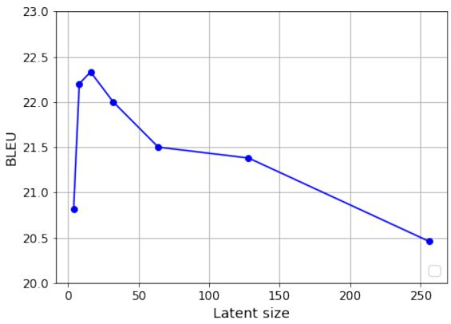
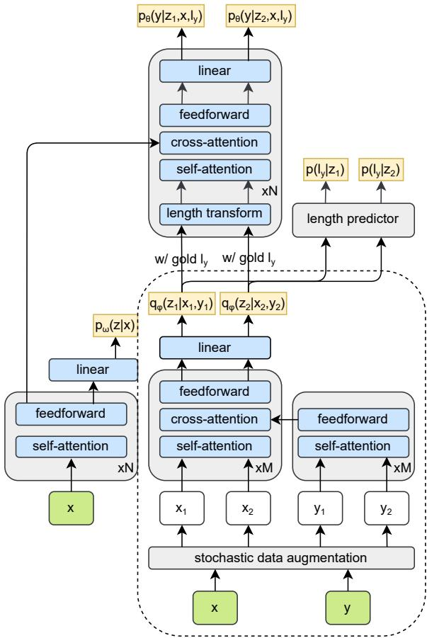
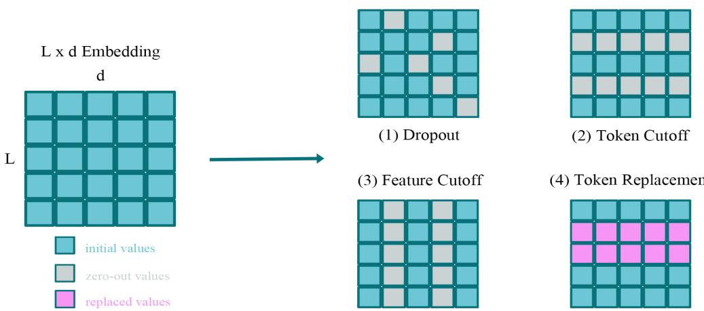
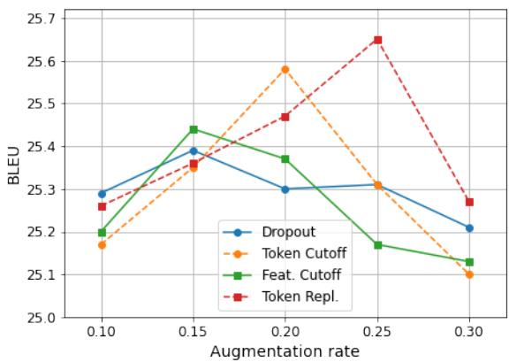
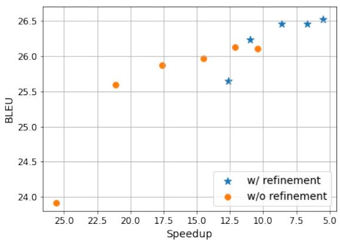

# Non-Autoregressive Neural Machine Translation with Consistency Regularization Optimized Variational Framework

Minghao Zhu and Junli Wang and Chungang Yan

Key Lab of Embedded System and Service Computing (Tongji University), Ministry of Education, Shanghai 201804, China.

National (Province-Ministry Joint) Collaborative Innovation Center for Financial Network Security, Tongji University, Shanghai 201804, China. {mzhu, junliwang, yanchungang}@tongji.edu.cn

## Abstract

Variational Autoencoder (VAE) is an effective framework to model the interdependency for non-autoregressive neural machine translation (NAT). One of the prominent VAE-based NAT frameworks, LaNMT, achieves great improvements to vanilla models, but still suffers from two main issues which lower down the translation quality: (1) mismatch between training and inference circumstances and (2) inadequacy of latent representations. In this work, we target on addressing these issues by proposing posterior consistency regularization. Specifically, we first perform stochastic data augmentation on the input samples to better adapt the model for inference circumstance, and then conduct consistency training on posterior latent variables to construct a more robust latent representations without any expansion on latent size. Experiments on En<->De and En<->Ro benchmarks confirm the effectiveness of our methods with about 1.5/0.7 and 0.8/0.3 BLEU points improvement to the baseline model with about 12.6 faster than autoregressive Transformer.

## 1 Introduction

Neural Machine Translation (NMT) achieves great success in recent years, and typical sequence-tosequence frameworks like Transformer (Vaswani et al., 2017) achieved state-of-the-art performance on the task of NMT. In this framework, source sentences are translated in an autoregressive (AT) manner where each token is generated depending on previously generated tokens. Inevitably, such sequential decoding strategy results in a high inference latency. To alleviate this issue, Nonautoregressive translation (NAT; Gu et al., 2018) was proposed to speed-up decoding procedure by generating target tokens in parallel. However, the translation quality of vanilla NAT is compromised, one of the most significant problems is multi-modality and it usually results in multiple translation results, duplicate or missing words in target sentences of NAT models (Gu et al., 2018). This situation results from the conditional independence proposed by NAT, since models are trained to maximize the log-probability of target tokens at each position while the interdependency is omitted.

The key to alleviate the multi-modality issue is to model the dependency information of targets implicitly or explicitly so decoder can easily learn and capture the information between target tokens and generate more accurate translations. For example, Ghazvininejad et al. (2019) and (2020b) model the target dependency by providing observed target tokens in training and performing iterative inference. Ran et al. (2021) generates intermediate representations by permuting the source sentences in the target order. Libovicky and Helcl\` (2018), Shao et al. (2020) and Ghazvininejad et al. (2020a) model the target dependency by introducing objective functions with alignment. Guo et al. (2020) and Wang et al. (2019) improve the translation quality by proposing additional regularizations. Zhou and Keung (2020) and Liu et al. (2021) utilize the external information like monolingual data or semantic structure to help the training.

Previous studies have validated the effectiveness of applying VAE on AT (Zhang et al. 2016; McCarthy et al. 2019; Su et al. 2018) and NAT (Kaiser et al. 2018; Shu et al. 2020) frameworks. A prominent NAT model is LaNMT1(Shu et al., 2020) which encodes the source and target tokens into intermediate Gaussian distribution latent variables and outperforms vanilla NAT with about 5.0 BLEU points on WMT14 En-De task with 12.5 speedup to base Transformer. However, there exists a slight lag behind the state-of-the-art fully NAT models. It may be attributed to two reasons: (1) The inadequate representations of latent variables. Figure 1 shows the effect of latent size to translation qualities. Obviously, the optimal capacity of latent variables is significantly lower than the model’s hidden size (512) while high-capacity latent variables conversely deteriorate the performance because the minimization between prior and posterior becomes difficult (Shu et al., 2020). (2) The mismatch between training and inference circumstances that the posterior module receives the gold sentence as inputs during training but imperfect initial translation instead during inference. Thus, in this paper, we aim to improve the robustness of the latent representation and move the training circumstance close to inference circumstance.

  
Figure 1: Effect of latent size. Values are obtained by our experiments on WMT14 En-De benchmark

To this end, we propose a consistency regularized posterior network for better latent representations and closer training-inference circumstance with no extended latent size. Specifically, it can be split into two main steps: we first apply stochastic data augmentation methods to inject stochastic noises in posterior inputs x and $y$ to get two different views $( x _ { 1 } , y _ { 1 } )$ and $( x _ { 2 } , y _ { 2 } )$ , which are then transformed to corresponding latent variables $z _ { 1 }$ $z _ { 2 }$ by the posterior network. Secondly, the consistency regularization step tries to minimise the gap between $z _ { 1 }$ and $z _ { 2 }$ since they are derived from the same pair of input x and $y .$ . These two steps enable the sequences better represented by the sizelimited latent variables which is trained to be more robust to the noises in input samples. Meanwhile, posterior module receives noisy views instead of gold samples during training, it is more adaptive to the inference time which receives imperfect initial translations as inputs.

We verified the performance and effectiveness of our methods on WMT14 En<->De and WMT16 En<->Ro benchmarks. Our methods outperform the latent variable baseline with about

1.5/0.7 and 0.8/0.3 BLEU points improvement on four benchmarks. With these improvements, we achieve the comparable performance to the stateof-the-art fully NAT approaches: 25.65/30.23 and 31.56/31.20 of BLEU scores with similar decoding speed, and it can be improved further with latent search. The contributions of our work can be summarized as follows:

• For better latent representations, we propose consistency regularization optimized posterior network, which improves the translation quality by training more robust latent variables to noises.

• We apply four data augmentation methods to cooperate with posterior consistency regularization, where all of them are also benefit to the translation quality by alleviating the mismatch between training and inference circumstances.

• We show our strategy is capable of improving the translation quality of the base latentvariable NAT model to be comparable with the state-of-the-art fully NAT frameworks.

## 2 Background

## 2.1 Non-Autoregressive Translation

Traditional sequence-to-sequence NMT models generate target sentences in an autoregressive manner. Specifically, given a source sentence $x ,$ AT frameworks model the conditional probability of $y = \{ y _ { 1 } , y _ { 2 } , \cdot \cdot \cdot , y _ { l y } \}$ by the following form:

$$
\log p ( \boldsymbol { y } | \boldsymbol { x } ) = \sum _ { i = 1 } ^ { l _ { y } } \log p ( y _ { i } | \boldsymbol { y } _ { < i } , \boldsymbol { x } )\tag{1}
$$

where $y _ { < i }$ indicates the target tokens already generated before $y _ { i }$ . Hence, the target tokens are generated sequentially which results in a high decoding latency. To alleviate this issue, vanilla NAT (Gu et al., 2018) breaks the conditional dependency by conditional independence assumption so that all tokens can be generated independently. Following its probability form:

$$
\log p ( y | x ) = \sum _ { i = 1 } ^ { l _ { y } } \log p ( y _ { i } | x )\tag{2}
$$

where each target token $y _ { i }$ now only depends on the source sentence x. Benefit from the parallel

computing capability of hardware accelerators like GPU or TPU, all tokens can be generated with one iteration in an ideal circumstance.

## 2.2 Latent-Variable Model

We mainly focus on performing optimization on the variational NAT framework proposed by Shu et al. (2020). The network architecture is constructed by four main components. An encoder $p _ { \omega } ( z | x )$ encodes the source representation of input x and computes the prior latent variable. An approximate posterior network $q _ { \phi } ( z | x , y )$ accepts both the source sentence x and target sentence y as the input and computes the posterior latent variable. A length predictor $p ( l _ { y } | z )$ predicts the length of target sentence $y ,$ and finally a decoder $p _ { \theta } ( y | x , z , l _ { y } )$ with a length transform module to transform the latent variables z to the target length $l _ { y }$ at first and reconstruct y from z with the source representations of x. Note that the $l _ { y }$ here is the gold length in training. Hence, the training objective is aiming to maximize the evidence lowerbound (ELBO):

$$
\begin{array} { r } { \mathcal { L } ( x , y ) = \mathbb { E } _ { z \sim q _ { \phi } } [ \log p _ { \theta } ( y | x , z ) ] } \\ { - \mathrm { K L } \left[ q _ { \phi } ( z | x , y ) | | p _ { \omega } ( z | x ) \right] } \\ { p _ { \theta } ( y | x , z ) = p _ { \theta } ( y | x , z , l _ { y } ) p ( l _ { y } | z ) } \end{array}\tag{3}
$$

where the latent variables z is constrained with the same length as x and the value is modeled as spherical Gaussian distribution. KL denotes Kullback-Leibler divergence.

## 2.3 Consistency Regularization

Consistency regularization is considered as an effective method on semi-supervised learning to capture the potential features from unlabeled samples (Sajjadi et al., 2016; Laine and Aila, 2017; Tarvainen and Valpola, 2017; Xie et al., 2020). It is also utilized as a complementary regularization tool with other regularization methods to prevent model from overfitting (Liang et al., 2021). In a nutshell, consistency regularization assumes a well trained model should be robust enough to any small changes in the input samples or hidden states and generate invariant outputs (Xie et al., 2020). To this end, it regularizes model’s final outputs to be invariant to input samples with small stochastic noises injected by minimizing the gap between two augmented views of one sample.

In this paper, we focus on the posterior module of the variational framework and apply consistency regularization on it instead of the whole network.

  
Figure 2: The overall pipeline of training with posterior consistency regularization

Along with data augmentation for noise injection, consistency regularization is capable to improve the representation of this module and result in better translation quality.

## 3 Approach

The posterior module is considered to train with consistency regularization and data augmentation for better translation quality. In this section, we will introduce the details of our method, including the overall network architecture, the objective and procedure of training with consistency regularization, four data augmentation methods and three decoding strategies applied for inference.

## 3.1 Model Architecture

We follow the variational model architecture proposed by Shu et al. (2020) with four main components: encoder, posterior, length predictor and decoder module. Since we apply consistency regularization on the posterior, an additional stochastic data augmentation module is added for noise injection on posterior input samples. With two augmented views derived from one sample, each sample thus appears twice in a training batch. Figure 2 shows the brief model architecture and training pipeline of our work. The part in the dashed box is the major difference to the base model.

## 3.2 Posterior Consistency Regularization

As discussed above, consistency regularization is applied on the posterior module to improve its robustness. Given a training sample with a pair of source sentence x with $l _ { x }$ tokens and target sentence $y$ with $l _ { y }$ tokens, we first apply data augmentation on both $x$ and $y$ twice to inject stochastic noises and obtain two different views (denoted as $x _ { 1 } , y _ { 1 }$ and $x _ { 2 } , y _ { 2 } )$ . Both views are forwarded to the posterior network $q _ { \phi } ( z | x , y )$ to predict the mean and variance vectors of two latent variables $z _ { 1 }$ and $z _ { 2 }$ . Since the latent variables derive from the same input sample, the consistency regularization method tries to minimize the difference between these two latent variables by measuring bidirectional KL-divergence as follows:

$$
\begin{array} { r } { \mathcal { L } _ { c o n s } = \displaystyle \frac { 1 } { 2 } ( \mathrm { K L } ( z _ { 1 } | | z _ { 2 } ) + \mathrm { K L } ( z _ { 2 } | | z _ { 1 } ) ) , } \\ { z _ { 1 } = q _ { \phi } ( Z | X = x _ { 1 } , Y = y _ { 1 } ) , } \\ { z _ { 2 } = q _ { \phi } ( Z | X = x _ { 2 } , Y = y _ { 2 } ) } \end{array}\tag{4}
$$

Combining with the basic negative log-likelihood (NLL) objective on the decoder, since there are two different z for the same sample, it is evaluated by averaging them:

$$
\mathcal { L } _ { n l l } = - \frac { 1 } { 2 } ( \log p _ { \theta } ( y | x , z _ { 1 } , l _ { y } ) + \log p _ { \theta } ( y | x , z _ { 2 } , l _ { y } ) )\tag{5}
$$

Note that the gold length $l _ { y }$ of target sentence $\mathsf { y }$ is used which is known during training. Similarly, the objective of the length predictor is calculated by:

$$
\mathcal { L } _ { l e n } = - \frac { 1 } { 2 } ( \log p ( l _ { y } | z _ { 1 } ) + \log p ( l _ { y } | z _ { 2 } ) )\tag{6}
$$

To back propagate the gradient information from the decoder and length predictor to posterior, reparameterization trick is applied to sample z from $q _ { \phi }$ where $z = \mu + \theta * \mathcal { N } ( 0 , 1 )$ in Eq.(6) and (5). Here, $\mu$ and θ indicate mean and variance vector. For encoder, it not only generates representations of source sentence x but also computes the prior latent variables. Thus, we close the KL-divergence between prior and two posterior latent variables by:

$$
\mathcal { L } _ { p r i o r } = \frac { 1 } { 2 } ( \mathrm { K L } ( z _ { 1 } | | z _ { p } ) + \mathrm { K L } ( z _ { 2 } | | z _ { p } ) )\tag{7}
$$

where $z _ { p } = p _ { \omega } ( Z | X = x )$ , z1 and $z _ { 2 }$ are obtained from (4). Finally, to achieve the similar goal of maximizing (3), we minimize the loss function by combining (4), (5), (6) and (7) as follows:

$$
\mathcal { L } _ { l o s s } = \mathcal { L } _ { n l l } + \mathcal { L } _ { l e n } + \mathcal { L } _ { p r i o r } + \alpha \mathcal { L } _ { c o n s }\tag{8}
$$

where α here is the only hyperparameter to weight the consistency regularization loss.

## 3.3 Data Augmentation Methods

Given an embedding matrix $\mathbb { R } ^ { L \times d }$ with L tokens embedded into d-dimensions vectors, to generate different views for the posterior network inputs and perform posterior consistency regularization, as well as to close the gap between training and inference circumstances, we explore four data augmentation methods for this purpose including dropout, feature cutoff, token cutoff and replacement as presented in Figure 3.

Dropout Dropout (Srivastava et al., 2014) is widely used as a regularization method to prevent neural networks from overfitting. But in this paper, we found that it is also an effective data augmentation method for noise injection. Specifically, we randomly choose values on token embeddings by a specific proportion and force them to zero.

Cutoff This is a simple but effective augmentation method proposed by Shen et al. (2020). The cutoff methods we adopt include token cutoff and feature cutoff. For token cutoff, a specific proportion of tokens are chosen from the token dimension $L$ and dropped by setting the vectors to zero. For feature cutoff, the dropped values are chosen from feature dimension d instead.

Replacement This is similar to the token replacement adopted by BERT pre-training (Devlin et al., 2019) where the chosen token vectors are replaced by the embedding of new tokens that randomly selected from the vocabulary instead of setting them to zero or any special tokens directly.

## 3.4 Decoding Strategies

Non-refinement For this strategy, we completely follow the original design (Shu et al., 2020) where the posterior network is discarded since the target sentence y is unknown during inference. The foremost step is to obtain the representations of x and the prior latent variable z from encoder with source input x. The latent variable is then used to determine the target length and generate target sentence.

  
Figure 3: Four stochastic data augmentation methods we used for noise injection

Note that to avoid randomness during inference, z is set to its mean value $\mu$ instead of reparameterization sampling. This can be summarized as follows:

$$
\begin{array} { r } { \mu _ { 0 } = \mathbb { E } _ { p _ { \omega } ( z | x ) } [ z ] , } \\ { l _ { y _ { 0 } } = \arg \operatorname* { m a x } _ { l _ { y } } p ( l _ { y } | z = \mu _ { 0 } ) , } \\ { y _ { 0 } = \arg \underset { y } { \operatorname* { m a x } } p _ { \theta } ( y | x , l _ { y _ { 0 } } , z = \mu _ { 0 } ) } \end{array}\tag{9}
$$

Deterministic Refinement The posterior network $q _ { \phi }$ can be reused to take refinement on the initial output y0 above. According to Shu et al. (2020), its original design allows multi-step iterative refinement for more precise translations, but sacrifices huge cost in decoding speed for a tiny quality improvement. Thus, we consider one-step only refinement in this paper:

$$
\begin{array} { r l r } & { } & { \mu _ { 1 } = \mathbb { E } _ { q _ { \phi } ( z | x , y _ { 0 } ) } [ z ] , } \\ & { } & { \quad l _ { y _ { 1 } } = \arg \operatorname* { m a x } _ { l _ { y } } p ( l _ { y } | z = \mu _ { 1 } ) , } \\ & { } & { \quad \quad y _ { 1 } = \arg \operatorname* { m a x } _ { y } p _ { \theta } ( y | x , l _ { y _ { 1 } } , z = \mu _ { 1 } ) } \end{array}\tag{10}
$$

Here the $y _ { 1 }$ is the final output after refinement.

Latent Search Since reparameterization is disabled in above two strategies to generate deterministic results, it is also able to search the best latent variable from Gaussian distribution. Specifically, m prior latent variables are sampled by reparameterization and decoded in parallel, result in m target candidates for each source sentence. To get the best result, we select the candidate with the highest score by averaging the log-probability of tokens as the final output. This is different from Shu et al. (2020) or Noisy Parallel Decoding (NPD;

Gu et al. 2018) which rescore the candidates by autoregressive teacher and at least cuts the decoding speed by half, our no-rescoring strategy is still effective and much faster.

## 4 Experiments

In this section, we will introduce the settings of our experiments, report the main results and compare our model to the representative NAT frameworks. Our experiments mainly focus on (1) the improvement benefit from our optimization to former VAE-based NAT model. (2) The effectiveness of consistency regularization and different data augmentation methods.

## 4.1 Experimental Setup

Dataset Four of the commonly used machine translation benchmarks are adopted to evaluate our proposed method: WMT14 English<->German2 (En-De and De-En, 4.5M) and WMT16 English<- >Romanian3 (En-Ro and Ro-En, 610K). We follow previous works’ data preprocessing configurations to preprocess the data (En-De: Shu et al., 2020, En-Ro: Ghazvininejad et al. 2019). To learn the subword vocabulary, we apply SentencePiece (Kudo and Richardson, 2018) to generate joint subword vocabulary of 32K tokens for each dataset respectively.

Knowledge Distillation Following previous studies on NAT that models are trained on distilled data generated by autoregressive teacher, we also apply sentence-level knowledge distillation for all datasets to obtain less noisy and more deterministic data. In this work, Transformer (Vaswani et al.,

<table><tr><td>Models</td><td>Iter.</td><td>WMT14 En-De</td><td>WMT14 De-En</td><td>WMT16 En-Ro</td><td>WMT16 Ro-En</td><td>Speed</td></tr><tr><td>Transformer (Vaswani et al., 2017)</td><td>N</td><td>27.30</td><td>1</td><td>1</td><td>1</td><td>1</td></tr><tr><td>Transformer (ours)</td><td>N</td><td>27.74*</td><td>31.28*</td><td>33.73*</td><td>34.38*</td><td>1.0×</td></tr><tr><td>NAT-IR (Lee et al., 2018)</td><td>10</td><td>21.61</td><td>25.48</td><td>29.32</td><td>30.19</td><td>1.5×</td></tr><tr><td>CMLM (Ghazvininejad et al., 2019)</td><td>10</td><td>27.03</td><td>30.53</td><td>33.08</td><td>33.31</td><td>1.7×</td></tr><tr><td>LevT (Gu et al., 2019)</td><td>Adv.</td><td>27.27</td><td>一</td><td>1</td><td>33.26</td><td>4.0×</td></tr><tr><td>JM-NAT (Guo et al., 2020)</td><td>10</td><td>27.69</td><td>32.24</td><td>33.52</td><td>33.72</td><td>5.7×</td></tr><tr><td>Vanilla-NAT (Gu et al., 2018)</td><td>1</td><td>17.69</td><td>21.47</td><td>27.29</td><td>29.06</td><td>15.6×</td></tr><tr><td>Imitate-NAT (Wei et al., 2019)</td><td>1</td><td>22.44</td><td>25.67</td><td>28.61</td><td>28.90</td><td>18.6×</td></tr><tr><td>FlowSeq (Ma et al., 2019)</td><td>1</td><td>23.72</td><td>28.39</td><td>29.73</td><td>30.72</td><td>1.1×</td></tr><tr><td>NAT-DCRF (Sun et al., 2019)</td><td>1</td><td>23.44</td><td>27.22</td><td>1</td><td>1</td><td>10.4×</td></tr><tr><td>NAT-REG (Wang et al., 2019)</td><td>1</td><td>20.65</td><td>24.77</td><td>1</td><td>1</td><td>27.6×</td></tr><tr><td>BoN (Shao et al., 2020)</td><td>1</td><td>20.90</td><td>24.61</td><td>28.31</td><td>29.29</td><td>10.7×</td></tr><tr><td>AXE (Ghazvininejad et al., 2020a)</td><td>1</td><td>23.53</td><td>27.90</td><td>30.75</td><td>31.54</td><td>1</td></tr><tr><td>GLAT (Qian et al., 2021)</td><td>1</td><td>25.21</td><td>29.84</td><td>31.19</td><td>32.04</td><td>15.3×</td></tr><tr><td>Reorder-NAT (Ran et al., 2021)</td><td>1</td><td>22.79</td><td>27.28</td><td>29.30</td><td>29.50</td><td>16.1×</td></tr><tr><td>SNAT (Liu et al., 2021)</td><td>1</td><td>24.64</td><td>28.42</td><td>32.87</td><td>32.21</td><td>22.6×</td></tr><tr><td>LT (Kaiser et al., 2018)</td><td>1</td><td>19.80</td><td>1</td><td>1</td><td>1</td><td>3.8×</td></tr><tr><td>LaNMT (Shu et al., 2020)</td><td>1</td><td>22.20</td><td>26.76*</td><td>29.21*</td><td>28.89*</td><td>22.2×</td></tr><tr><td>+ refinement</td><td>2</td><td>24.10</td><td>29.47*</td><td>30.76*</td><td>30.86*</td><td>12.5×</td></tr><tr><td>+ latent search w/ rescoring</td><td>2</td><td>25.10</td><td>1</td><td>1</td><td>1</td><td>6.8×</td></tr><tr><td>Ours, decode w/o refinement</td><td>1</td><td>23.92</td><td>27.39</td><td>29.90</td><td>29.04</td><td>25.6×</td></tr><tr><td>+ latent search (m=9) w/o rescoring</td><td>1</td><td>25.59</td><td>30.11</td><td>31.40</td><td>31.63</td><td>21.1×</td></tr><tr><td>decode w/ refinement</td><td>2</td><td>25.65</td><td>30.23</td><td>31.56</td><td>31.20</td><td>12.6×</td></tr><tr><td>+ latent search (m=9) w/o rescoring</td><td>2</td><td>26.23</td><td>31.23</td><td>32.50</td><td>32.14</td><td>11.0×</td></tr></table>

Table 1: BLEU scores and speedup rates for performance comparison on WMT14 En<->De and WMT16 En<->Ro benchmarks without rescoring. We report the best scores here among all tested combinations of data augmentation methods with consistency regularization. Iter. denotes the number of iterations during inference. Adv. means adaptive. / denotes the value is not reported, \* denotes the results are obtained by our implementation.

2017) with base settings is adopted and reproduced as the teacher model for data distillation.

Implementation Details The model is trained by the objective function illustrated on Eq.(8). To avoid posterior collapse, freebits annealing (Chen et al., 2017) is applied on KL terms in Eq.(7) to keep a distance between prior and posterior. Its threshold is fixed to 1 for the first half training steps, and linearly decay to 0 on the second half. For both dataset, we train the model with a batch of approximate 40K tokens for overall 100K steps on four Tesla V100 GPUs and conduct fine-tuning for additional 20K steps with annealing disabled.

For network settings, we use 6 layers encoder and decoder with $d _ { m o d e l } / d _ { f e e d f o r w a r d } =$ 512/2048. Following Shu et al. (2020), the posterior network contains 3 transformer layers and the dimension of latent variable is set to 8. We set L2 weight decay of 0.01 and dropout between attention layers with rate of 0.1/0.3 for WMT14 En<->De and WMT16 En<->Ro respectively as well as label smoothing rate ϵ = 0.1 on target tokens. Models are trained by AdamW (Loshchilov and Hutter, 2017) with settings of $\beta = ( 0 . 9 , 0 . 9 8 )$ and ϵ = 1e 4. The learning rate is warmed up for first 4000 steps to 1.4e-3 and decayed by inversesquare-root scheduler. To obtain the final model, we average 5 best checkpoints chosen by validation BLEU score. For the rate of noise injection, all four augmentation strategies are evaluated with rates from 0.1 to 0.3 on WMT14 En-De benchmark and the settings for other experiments are determined according to these results.

Evaluation For all benchmarks, we use sacre-BLEU4 (Post, 2018) to evaluate BLEU score of translation results. Following Lee et al. (2018) and Shu et al. (2020), repetition tokens are removed before generating the final outputs for evaluation. The results of latent search is obtained by the mean score of 5 independent runs on the test set of each benchmark to get more precise measures since reparameterization causes randomness in decoding.

To evaluate the decoding speed, following previous works (e.g. Gu et al. 2018, Lee et al. 2018), models are run on WMT14 En-De test set with batch size of 1 under the environment with one GPU only. The mean value of decoding latency among all samples is collected and represent as the decoding speed. Meanwhile, base Transformer is reproduced and evaluated on the same machine to obtain the speed up rates.

Baselines We set former VAE based NAT frameworks proposed by Kaiser et al. (2018) and Shu et al. (2020) as the main baselines to present the improvement of our method. We also compare our model with base Transformer and other representative NAT frameworks including iterative and fully approaches. Due to the lack of computing resources, experiments and comparison with connectionist temporal classification (CTC) based frameworks like Libovicky and Helcl\` (2018) or Gu and Kong (2021) are not considered in this paper since the decoder output is many times the length of the target sequence, which extremely consumes extra GPU storage in training. The performance measures including BLEU score and speedup rate of other models are directly obtained from the figures reported on their original paper, while some unreported measures are obtained by our implementation.

## 4.2 Results and Analysis

The main results on the benchmarks are illustrated on Table 1, we report the best scores of our experiments among different tested combinations of data augmentation methods with consistency regularization. As the performance measure shown in Table 1, our methods significantly outperform former VAE-based baselines, with about 5.8 BLEU points improvement to the discrete latent variable model (Kaiser et al., 2018) and 1.7/1.5, 0.6/0.7, 0.7/0.8, 0.1/0.3 points improvement on non-refinement/refinement decoding to continuous latent variable baseline (Shu et al., 2020) on WMT14 En<->De, and WMT16 En<->Ro benchmarks without latent search. All measures indicate that our posterior consistency regularization method greatly enhances the robustness of the latent representations and results in an improved translation quality.

Comparing to other representative AT and NAT models, our method shows the superiority of decoding speed to AT and iterative NAT models while there are less than 2 BLEU points lag behind. With the refinement decoding, our model also achieves a comparable translation quality to the state-of-theart fully-NAT approaches with similar decoding latency.

The results of latent search is encouraging. Benefit from the parallel computing capability of GPU, latent search sacrifices very small decoding speed to achieve about 0.5/1.0/0.9/0.9 BLEU improvements for refinement decoding and 1.6/2.7/1.5/2.6 BLEU improvements for non-refinement decoding on four benchmarks with m = 9 candidates.

<table><tr><td></td><td>Method</td><td>En-De</td><td>De-En</td><td>En-Ro</td></tr><tr><td rowspan="3">Wnnnennt</td><td>Baseline</td><td>24.10 25.39</td><td>29.47* 29.74</td><td>30.76* 30.85</td></tr><tr><td>Dropout Token Cutoff Feat. Cutoff</td><td>25.58 25.44</td><td>30.05 29.58</td><td>31.34 30.95</td></tr><tr><td>Token Repl. Baseline Dropout</td><td>25.65 22.20 23.53</td><td>30.23 26.76* 26.93</td><td>31.56 29.21* 29.40</td></tr></table>

Table 2: BLEU scores for baseline and our models with different data augmentation methods. \* denotes the results obtained by our implementation. Baseline indicates Shu et al. (2020)

Effectiveness of Data Augmentation Methods In this work, we adopt four different data augmentation strategies as the stochastic noise injection method to cooperate with consistency regularization. To evaluate their effectiveness and the impact for translation quality, all data augmentation methods are tested on the benchmarks. The results are reported on Table 2. The method we adopt combining posterior consistency regularization with data augmentation is effective and capable to achieve higher BLEU scores than the baseline. Specifically, token replacement achieves the highest score on all of benchmarks with refinement decoding since the posterior network is trained on sentences with incorrect tokens, this is more similar to the inference circumstance. With the non-refinement decoding, even the posterior module is disabled, the improvement is still exist for all strategies.

Effectiveness of Consistency Regularization Consistency regularization should work together with stochastic data augmentation which is widely known as a trick to train robust neural networks (Shorten and Khoshgoftaar 2019; Shen et al. 2020). Thus, to confirm that the model is not just benefit from data augmentation but the contribution of posterior consistency regularization, we perform the experiments by disabling (setting α = 0 in eq.(8)) consistency training module and train the model with four data augmentation methods respectively on WMT14 En-De dataset. The results illustrate on Table 3. Without consistency regularization, the data augmentation methods still result in improvement to baseline, but a slight lag exists behind the model with consistency regularization enabled. In other words, consistency regularization can improve the translation quality further. Thus, it is confirmed that our posterior consistency regularization method is effective and capable to train better latent representations in this work.

<table><tr><td>Method</td><td>w/o Reg. w/ Reg.</td></tr><tr><td>Baseline</td><td>24.10</td></tr><tr><td>Dropout</td><td>24.85 25.39</td></tr><tr><td>Token Cutoff</td><td>25.38 25.58</td></tr><tr><td>Feature Cutoff</td><td>25.02 25.44</td></tr><tr><td>Token Replacement</td><td>25.36 25.65</td></tr></table>

Table 3: BLEU scores on WMT14 En-De for baseline and our methods with consistency regularization enabled and disabled.

Effect of Augmentation Rate To investigate the impact of augmentation rate and choose the optimal hyperparameter, we train and evaluate the models by different augmentation rates from 0.1 to 0.3 on WMT14 En-De dataset. Results are illustrated on Figure 4. The best augmentation rate is different for each augmentation methods, alone with the increase of noise injection level, the performance of each method increases firstly and then gradually drops down. Token cutoff and replacement achieves the outstanding peak performance to others, it could be attribute to the mechanism that model can potentially learn from the incomplete sentences with incorrect or missing tokens and revise them, which mostly benefits to the refinement decoding at inference where there are massive incorrect tokens from initial translations.

  
Figure 4: Effect of the rate for augmentation methods on WMT14 En-De benchmark.

  
Figure 5: Tradeoff between decoding speed and translation quality on WMT14 En-De benchmark.

Tradeoff between Speed and Quality The tradeoff between the speedup rate and translation quality on WMT14 En-De dataset is shown in Figure 5. We draw the scatter points by evaluating the proposed model on various number of candidates from 9 to 59 sampled for latent search. It can be observed that both decoding with or without refinement can benefit from latent search. Since the excellent parallel computation capability of GPU, and no autoregressive scorer is required in our framework, the decoding speed remains acceptable. Specifically, the non-refinement decoding with more latent candidates can reach the similar quality level of refinement approach. However, refinement decoding can achieve further improvements and reaches the peak of about 26.5 BLEU points.

Summary Summarizing from the experiments and corresponding results illustrated on Table 2, 3 and Figure 4, the mechanism of data augmentation and consistency regularization in this paper can be explained in two ways: firstly, data augmentation, especially token-level strategies, help the posterior network learn the capability of encoding correct latent variables from incomplete, incorrect or noisy sentences, which narrows the gap between training and inference circumstances. Thus, our posterior network can do better refinement on the initial translation $y _ { 0 }$ from $\operatorname { E q . } ( 9 )$ which is relatively noisy and imperfect. Secondly, consistency regularization helps the posterior network learn to be more consistent on latent variables under the impact of noises in input samples, this potentially improves the robustness of latent representations which result in further improvements. In addition to the ability of sample multiple translations in parallel from latent distribution, all of these cooperate together and maximize the overall translation quality.

## Conclusion

In this work, we introduce posterior consistency regularization along with a series of data augmentation methods on the posterior module of a variational NAT model to improve its performance of translation quality. This method trains the posterior network to be consistent to stochastic noises in inputs and potentially improves its representations. Meanwhile, data augmentation closes the gap between training and inference circumstances. Both are highly benefit to decoding and refinement step. Experiments on WMT14 En<->De and WMT16 En<->Ro benchmarks show that our approach achieves a significant improvement to the baseline model and a comparable translation quality to other state-of-the-art fully NAT models with fast decoding speed. As the effectiveness of consistency regularization and data augmentation is verified by our experiments, it is promising to be applied on other models and tasks in the future.

## Acknowledgements

This work was supported by the National Key Research and Development Program of China (Grant No. 2018YFB2100801). Authors wish to thank anonymous reviewers for their critiques and constructive comments which helped improve this manuscript.

## References

Xi Chen, Diederik P. Kingma, Tim Salimans, Yan Duan, Prafulla Dhariwal, John Schulman, Ilya Sutskever, and Pieter Abbeel. 2017. Variational lossy autoencoder. In 5th International Conference on Learning Representations, ICLR 2017, Toulon, France, April 24-26, 2017, Conference Track Proceedings. Open-Review.net.

Jacob Devlin, Ming-Wei Chang, Kenton Lee, and Kristina Toutanova. 2019. Bert: Pre-training of deep bidirectional transformers for language understanding. In Proceedings of the 2019 Conference of the North American Chapter ofthe Associationfor Computational Linguistics: Human Language Technologies, Volume 1 (Long and Short Papers), pages 4171– 4186.

Marjan Ghazvininejad, Vladimir Karpukhin, Luke Zettlemoyer, and Omer Levy. 2020a. Aligned cross entropy for non-autoregressive machine translation. In International Conference on Machine Learning, pages 3515–3523. PMLR.

Marjan Ghazvininejad, Omer Levy, Yinhan Liu, and Luke Zettlemoyer. 2019. Mask-predict: Parallel decoding of conditional masked language models. In Proceedings of the 2019 Conference on Empirical Methods in Natural Language Processing and the 9th International Joint Conference on Natural Language Processing, EMNLP-IJCNLP 2019, Hong Kong, China, November 3-7, 2019, pages 6111–6120. Association for Computational Linguistics.

Marjan Ghazvininejad, Omer Levy, and Luke Zettlemoyer. 2020b. Semi-autoregressive training improves mask-predict decoding. CoRR, abs/2001.08785.

Jiatao Gu, James Bradbury, Caiming Xiong, Victor O.K. Li, and Richard Socher. 2018. Non-autoregressive neural machine translation. In International Conference on Learning Representations.

Jiatao Gu and Xiang Kong. 2021. Fully nonautoregressive neural machine translation: Tricks of the trade. In Findings of the Association for Computational Linguistics: ACL/IJCNLP 2021, Online Event, August 1-6, 2021, volume ACL/IJCNLP 2021 of Findings ofACL, pages 120–133. Association for Computational Linguistics.

Jiatao Gu, Changhan Wang, and Junbo Zhao. 2019. Levenshtein transformer. Advances in Neural Information Processing Systems, 32:11181–11191.

Junliang Guo, Linli Xu, and Enhong Chen. 2020. Jointly masked sequence-to-sequence model for nonautoregressive neural machine translation. In Proceedings of the 58th Annual Meeting of the Association for Computational Linguistics, pages 376–385.

Lukasz Kaiser, Samy Bengio, Aurko Roy, Ashish Vaswani, Niki Parmar, Jakob Uszkoreit, and Noam

Shazeer. 2018. Fast decoding in sequence models using discrete latent variables. In International Conference on Machine Learning, pages 2390–2399. PMLR.

Taku Kudo and John Richardson. 2018. SentencePiece: A simple and language independent subword tokenizer and detokenizer for neural text processing. In Proceedings of the 2018 Conference on Empirical Methods in Natural Language Processing: System Demonstrations, pages 66–71, Brussels, Belgium. Association for Computational Linguistics.

Samuli Laine and Timo Aila. 2017. Temporal ensembling for semi-supervised learning. In 5th International Conference on Learning Representations, ICLR 2017, Toulon, France, April 24-26, 2017, Conference Track Proceedings. OpenReview.net.

Jason Lee, Elman Mansimov, and Kyunghyun Cho. 2018. Deterministic non-autoregressive neural sequence modeling by iterative refinement. In Proceedings ofthe 2018 Conference on Empirical Methods in Natural Language Processing, pages 1173–1182.

Xiaobo Liang, Lijun Wu, Juntao Li, Yue Wang, Qi Meng, Tao Qin, Wei Chen, Min Zhang, and Tie-Yan Liu. 2021. R-drop: Regularized dropout for neural networks. CoRR, abs/2106.14448.

Jindˇrich Libovicky and Jind\` ˇrich Helcl. 2018. End-toend non-autoregressive neural machine translation with connectionist temporal classification. In Proceedings ofthe 2018 Conference on Empirical Methods in Natural Language Processing, pages 3016– 3021.

Ye Liu, Yao Wan, Jianguo Zhang, Wenting Zhao, and Philip Yu. 2021. Enriching non-autoregressive transformer with syntactic and semantic structures for neural machine translation. In Proceedings ofthe 16th Conference of the European Chapter of the Association for Computational Linguistics: Main Volume, pages 1235–1244, Online. Association for Computational Linguistics.

Ilya Loshchilov and Frank Hutter. 2017. Decoupled weight decay regularization. arXiv preprint arXiv:1711.05101.

Xuezhe Ma, Chunting Zhou, Xian Li, Graham Neubig, and Eduard Hovy. 2019. FlowSeq: Nonautoregressive conditional sequence generation with generative flow. In Proceedings ofthe 2019 Conference on Empirical Methods in Natural Language Processing and the 9th International Joint Conference on Natural Language Processing (EMNLP-IJCNLP), pages 4282–4292, Hong Kong, China. Association for Computational Linguistics.

Arya D McCarthy, Xian Li, Jiatao Gu, and Ning Dong. 2019. Improved variational neural machine translation by promoting mutual information. arXiv preprint arXiv:1909.09237.

Matt Post. 2018. A call for clarity in reporting BLEU scores. In Proceedings of the Third Conference on Machine Translation: Research Papers, pages 186– 191, Brussels, Belgium. Association for Computational Linguistics.

Lihua Qian, Hao Zhou, Yu Bao, Mingxuan Wang, Lin Qiu, Weinan Zhang, Yong Yu, and Lei Li. 2021. Glancing transformer for non-autoregressive neural machine translation. In Proceedings ofthe 59th Annual Meeting ofthe Associationfor Computational Linguistics and the 11th International Joint Conference on Natural Language Processing (Volume 1: Long Papers), pages 1993–2003, Online. Association for Computational Linguistics.

Qiu Ran, Yankai Lin, Peng Li, and Jie Zhou. 2021. Guiding non-autoregressive neural machine translation decoding with reordering information. In Proceedings ofthe AAAI Conference on Artificial Intelligence, volume 35, pages 13727–13735.

Mehdi Sajjadi, Mehran Javanmardi, and Tolga Tasdizen. 2016. Regularization with stochastic transformations and perturbations for deep semi-supervised learning. Advances in neural information processing systems, 29:1163–1171.

Chenze Shao, Jinchao Zhang, Yang Feng, Fandong Meng, and Jie Zhou. 2020. Minimizing the bagof-ngrams difference for non-autoregressive neural machine translation. In Proceedings of the AAAI Conference on Artificial Intelligence, volume 34, pages 198–205.

Dinghan Shen, Mingzhi Zheng, Yelong Shen, Yanru Qu, and Weizhu Chen. 2020. A simple but tough-to-beat data augmentation approach for natural language understanding and generation. CoRR, abs/2009.13818.

Connor Shorten and Taghi M Khoshgoftaar. 2019. A survey on image data augmentation for deep learning. Journal ofBig Data, 6(1):1–48.

Raphael Shu, Jason Lee, Hideki Nakayama, and Kyunghyun Cho. 2020. Latent-variable nonautoregressive neural machine translation with deterministic inference using a delta posterior. In Proceedings ofthe AAAI Conference on Artificial Intelligence, volume 34, pages 8846–8853.

Nitish Srivastava, Geoffrey Hinton, Alex Krizhevsky, Ilya Sutskever, and Ruslan Salakhutdinov. 2014. Dropout: a simple way to prevent neural networks from overfitting. The journal of machine learning research, 15(1):1929–1958.

Jinsong Su, Shan Wu, Deyi Xiong, Yaojie Lu, Xianpei Han, and Biao Zhang. 2018. Variational recurrent neural machine translation. In Proceedings of the AAAI Conference on Artificial Intelligence, volume 32.

Zhiqing Sun, Zhuohan Li, Haoqing Wang, Di He, Zi Lin, and Zhihong Deng. 2019. Fast structured decoding

for sequence models. In Advances in Neural Information Processing Systems, volume 32. Curran Associates, Inc.

Antti Tarvainen and Harri Valpola. 2017. Mean teachers are better role models: Weight-averaged consistency targets improve semi-supervised deep learning results. In 5th International Conference on Learning Representations, ICLR 2017, Toulon, France, April 24-26, 2017, Workshop Track Proceedings. OpenReview.net.

Ashish Vaswani, Noam Shazeer, Niki Parmar, Jakob Uszkoreit, Llion Jones, Aidan N Gomez, Łukasz Kaiser, and Illia Polosukhin. 2017. Attention is all you need. In Advances in neural information processing systems, pages 5998–6008.

Yiren Wang, Fei Tian, Di He, Tao Qin, ChengXiang Zhai, and Tie-Yan Liu. 2019. Non-autoregressive machine translation with auxiliary regularization. In Proceedings ofthe AAAI conference on artificial intelligence, volume 33, pages 5377–5384.

Bingzhen Wei, Mingxuan Wang, Hao Zhou, Junyang Lin, and Xu Sun. 2019. Imitation learning for nonautoregressive neural machine translation. In Proceedings of the 57th Annual Meeting of the Association for Computational Linguistics, pages 1304– 1312.

Qizhe Xie, Zihang Dai, Eduard Hovy, Thang Luong, and Quoc Le. 2020. Unsupervised data augmentation for consistency training. Advances in Neural Information Processing Systems, 33.

Biao Zhang, Deyi Xiong, Jinsong Su, Hong Duan, and Min Zhang. 2016. Variational neural machine translation. In Proceedings of the 2016 Conference on Empirical Methods in Natural Language Processing, pages 521–530, Austin, Texas. Association for Computational Linguistics.

Jiawei Zhou and Phillip Keung. 2020. Improving nonautoregressive neural machine translation with monolingual data. In Proceedings of the 58th Annual Meeting of the Association for Computational Linguistics, pages 1893–1898.