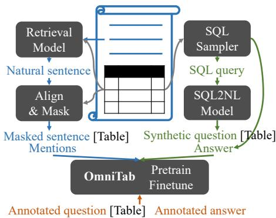
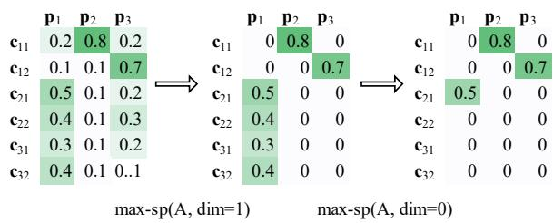
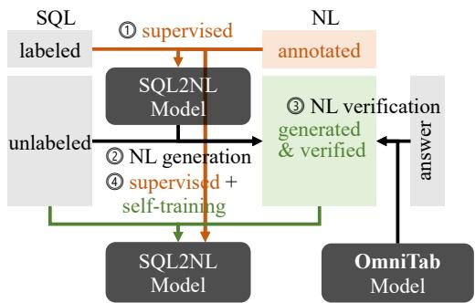
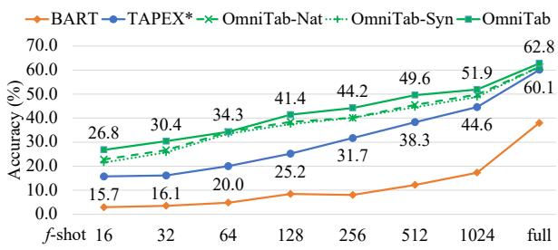
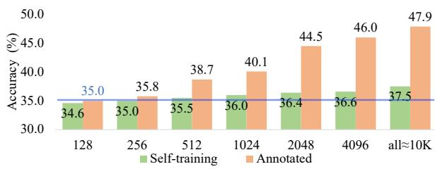
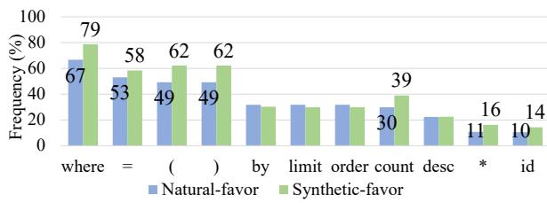

# OmniTab: Pretraining with Natural and Synthetic Data for Few-shot Table-based Question Answering

Zhengbao Jiang1∗, Yi Mao2, Pengcheng He2, Graham Neubig1, Weizhu Chen2 1Language Technologies Institute, Carnegie Mellon University 2Microsoft Azure AI {zhengbaj,gneubig}@cs.cmu.edu {maoyi,penhe,wzchen}@microsoft.com

## Abstract

The information in tables can be an important complement to text, making table-based ques tion answering (QA) systems of great value. The intrinsic complexity of handling tables often adds an extra burden to both model design and data annotation. In this paper, we aim to develop a simple table-based QA model with minimal annotation effort. Motivated by the fact that table-based QA requires both alignment between questions and tables and the ability to perform complicated reasoning over multiple table elements, we propose an omnivorous pretraining approach that consumes both natural and synthetic data to endow models with these respective abilities. Specifically, given freely available tables, we leverage retrieval to pair them with relevant natural sentences for mask-based pretraining, and synthesize NL questions by converting SQL sam pled from tables for pretraining with a QA loss. We perform extensive experiments in both few-shot and full settings, and the results clearly demonstrate the superiority of our model OmniTab, with the best multitasking approach achieving an absolute gain of 16.2% and 2.7% in 128-shot and full settings respectively, also establishing a new state-of-the-art on WikiTableQuestions. Detailed ablations and analyses reveal different characteristics of natural and synthetic data, shedding light on future directions in omnivorous pretraining.1

## 1 Introduction

Humans are voracious information omnivores, consuming information in a number of forms. Unstructured text is the form covered in most work in NLP, but another form widely used on the web, academic papers, and reports is the table, where elements are organized in rows and columns and presented in a structured and succinct way. Because of this, systems to aid information access over tables, such as table-based question answering (QA) (Pasupat and Liang, 2015; Iyyer et al., 2017; Zhong et al., 2017), hold significant promise. However, they also require understanding of the table structure and sophisticated reasoning across multiple elements to get the final answer. This intrinsic complexity not only often requires special-purpose model designs such as pipeline systems that generate structured queries as intermediate steps (Liang et al., 2018; Wang et al., 2019; Yin et al., 2020; Yu et al., 2021), but also adds an extra burden to the process of data annotation (Pasupat and Liang, 2015; Shi et al., 2020).

Given the challenges above, we ask the question: “can we create a simple model that is able to answer complex table-based questions with minimal annotation effort?” Both modeling simplicity and limited assumptions regarding data availability would make it easier to apply table-based QA systems in practical scenarios. To this end, we focus on developing a simple and generic end2end table-based QA model where only a limited number of annotated natural language (NL) questions are available; the first attempt to address this problem under few-shot settings. In order to answer table-related questions, an end2end model needs to understand both the NL question and the table, build connections between the two formats, then perform complex reasoning. Taking the manually annotated question in Fig. 1 as an example, models need to align entities (“Collateral Damage”) and concepts (“film”, “air”) in the question to elements in the table (the “Collateral Damage” cell and the “Film” and “Date” columns) and perform comparative reasoning based on chronological order (indicated by “previous” and “before”) to find the final answer. Motivated by this, we propose OmniTab, an omnivorous pretraining approach that consumes natural data to endow models with the ability to understand and align NL with tables, and synthetic data to train models to perform reasoning.

Title: List of 2002 box office number-one films in the United States
<table><tr><td>#</td><td>Date</td><td>Film</td><td>Gross</td></tr><tr><td>1</td><td>January 6, 2002</td><td>The Lord of the Rings: The Fellowship of the Ring</td><td>$23,006,447</td></tr><tr><td>5</td><td>February 3, 2002</td><td>Black Hawk Down</td><td>$11,112,555</td></tr><tr><td>6</td><td>February 10, 2002</td><td>Collateral Damage</td><td>$15,058,432</td></tr><tr><td>18</td><td>May 4, 2002</td><td>Spider-Man Star Wars Episode II:</td><td>$114,844,116</td></tr><tr><td>20</td><td>May 19, 2002</td><td>Attack of the Clones</td><td>80,027,814</td></tr><tr><td colspan="4">Input</td></tr><tr><td colspan="2">Pretrdain Natural</td><td colspan="2">Output Spider Man with its $114.8 million mark established Spider-Man, a new opening weekend record. [Table] $114.8 million</td></tr><tr><td colspan="2">Synthetic</td><td colspan="2">SELECT film WHERE gross &gt; (SELECT gross WHERE film = ‘Star Wars’) Spider-Man Which film has grossed more than Star Wars? [Table]</td></tr></table>

Figure 1: Example of natural and synthetic pretraining data and a manually annotated finetuning question. Phrases aligned with table elements and reasoning operations are marked with violet and red respectively. [Table] denotes the linearized table.

To obtain natural NL-table pairs, we propose a novel approach that leverages the multitude of tables freely available from the web, and uses retrieval to pair them with relevant NL sentences. Compared with manually defined heuristics used in previous work (Herzig et al., 2020; Yin et al., 2020), retrieval-based methods have the potential to discover better-aligned sentences. We explore different retrieval methods including string-based matching, sparse retrieval, and dense retrieval (Karpukhin et al., 2020; Khattab and Zaharia, 2020; Gao et al., 2021). Given these retrieved pairs, phrases in the sentence that align with table elements are then masked and the model takes both the masked sentence and the linearized table as input to predict masked mentions. For example, in Fig. 1 the retrieved sentence describes a particular row and contains two phrases matching cells in the table (i.e., “Spider-Man” and “\$114.8 million”) which are masked for prediction. To perform this sort of masked prediction, models need to understand that the sentence is about a record-breaking movie and refer to the table to extract the correct cells. Thus, training on this data endows models with better understanding and alignment across both formats.

For the synthetic data approach, we propose a method where structured queries such as SQL are first sampled and then converted into NL questions using an SQL2NL model, which allows for control of the reasoning operations covered by the SQL. Compared to existing work that trains directly on SQL (Liu et al., 2021), an approach hindered by the gap between structured and natural language, training on synthetic NL questions can close the gap, especially when limited annotated NL questions are available. We train the SQL2NL model with a small number of SQL-NL pairs and further boost its performance using verification-based selftraining, which selects high-quality generated NL questions based on their likelihood to generate the gold answer. The converted NL question concatenated with the linearized table is fed into the model to directly generate the final answer, as shown in the synthetic example in Fig. 1 which involves comparative reasoning indicated by the phrase “more than”. Although the fluency and naturalness of synthetic data is usually lower than natural data, learning on synthetic data provides a direct way to simulate different reasoning skills, which is relatively sparse in natural data.

  
Figure 2: The overall framework of generating and pretraining with natural data (blue pipeline), synthetic data (green pipeline), and finetuning with limited annotated questions (orange pipeline) for our OmniTab model.

Our overall framework is shown in Fig. 2. We use tables from Wikipedia and retrieve relevant sentences from the same page to generate natural text-table parallel data after masking mentions aligned to table elements (the blue pipeline on the left of Fig. 2). We use SQL queries sampled by Liu et al. (2021) and convert them to NL questions as synthetic text-table parallel data (the green pipeline on the right of Fig. 2). We use WikiTableQuestions (WTQ) (Pasupat and Liang, 2015), a widely used table-based QA dataset consisting of complex questions, as our major benchmark to evaluate our pretraining methods, and further use WikiSQL (Zhong et al., 2017) and topic-categorized WTQ (Chemmengath et al., 2021) to evaluate the robustness of our methods, all under few-shot setting with sizes ranging from 16 to 1,024. When using only 128 annotated questions, our model OmniTab improves over the best-performing baseline by an absolute gain of 13.2% and 12.3% with natural and synthetic pretraining separately and 16.2% when combined, demonstrating the effectiveness of the approach. We also achieve state-of-the-art performance on the full WTQ with an absolute gain of 2.7%. Extensive ablations and analyses reveal that natural and synthetic data indeed play the role of enhancing alignment and injecting reasoning, shedding light on future works on omnivorous pretraining.

## 2 End2End Table-based QA

In this section, we first explain the setting of tablebased QA, then introduce the input format as well as our model architecture.

Table-based QA Each example in table-based QA consists of an NL question q, a table T, and an answer a. Both questions and answers are a sequence of tokens. Each table consists of N rows $\{ r _ { i } \} _ { i = 1 } ^ { N }$ and M columns, where the token sequence in the cell located at the i-th row and j-th column is denoted as $\boldsymbol { c } _ { i , j }$ . The first row $r _ { 1 }$ is the header row, indicating the meaning of each column. Tablebased QA aims to generate the answer a given both the question q and the table T as the input.

Input Format We follow Liu et al. (2021) in concatenating the NL context with the linearized table as input. We flatten the table following a topto-bottom and left-to-right order, where we prepend “col:” to the beginning of the header and “row $i { : } ^ { \dag }$ to the beginning of the i-th row to separate different rows: $T = [ \mathrm { c o l } ; r _ { 1 }$ row $1 \colon r _ { 2 } \ldots$ . row $N \colon r _ { N } ]$ . Cells within each row are separated by a vertical bar “|” $r _ { i } = [ c _ { i , 1 } \mid c _ { i , 2 } \mid \ldots \mid c _ { i , M } ]$ . Finally, the question $\pmb q$ is prepended to the linearized table: [q T].

Model Architecture We use the state-of-the-art table-based QA model TAPEX (Liu et al., 2021) as our base model, which is based on BART (Lewis et al., 2020b). It feeds questions and tables into the encoder and generates answers from the decoder: $P ( \mathbf { \boldsymbol { a } } | \mathbf { \boldsymbol { q } } , T )$ . Multiple answers are joined with commas into a single output sequence.

## 3 OmniTab: Pretraining with Natural and Synthetic Data

As mentioned in the introduction, table-based QA requires both (1) the ability to align NL phrases with table elements that could be expressed in different wording and (2) perform reasoning such as filtering, aggregation, superlatives, comparatives, and arithmetic. Compared to synthetic data, real NL sentences relevant to the table excel at enhancing the first capability since they are more natural and fluent, exhibiting various language variations. Learning on real sentences can endow models to grasp the nuances in language and align with structured tables. On the other hand, synthetic data is flexible, manipulable, and easy to obtain. It is costless to generate synthetic data via manipulating different aspects of the generated data to incorporate various desired properties. As a result, we can generate large amounts of complicated synthetic data covering various reasoning operations, which is lacking in the NL corpora. This motivates us to explore both types of data.

## 3.1 NL-Table Alignment Through Retrieval

Using the Wikipedia table corpus released by Herzig et al. (2020), we explore three retrieval methods to construct aligned NL-Table pairs and propose a new pretraining objective.

## 3.1.1 Retrieval Protocol

Since sentences relevant to a table are usually included in the same document, we restrict our retrieval models to only consider the document containing the table, with the purpose of reducing noise and increasing efficiency.

String-based Matching For each sentence, we enumerate over all cells in the table and find the longest common substring (LCS) between a cell $\mathbf { \boldsymbol { c } } _ { i , j }$ and a sentence s. An LCS is considered as a mention to be masked if it (1) is not a stopword, (2) contains alphanumeric characters, (3) is a complete word, and (4) is longer than 70% of the length of the cell. We choose the sentence with the largest number of mentions to pair with the table.

Sparse Retrieval with BM25 Another method of string-based matching is BM25 with tables as queries and sentences as candidates. Different from the above method matching whole cells, BM25 treats tables as a bag of tokens. We linearize tables as queries and choose the most relevant sentence to compose the pair. Since BM25 retrieval does not return aligned phrases and cells, we resort to the above method detect mentions.

Dense Retrieval with Token Representations The above two methods can only consider exact string matches, which is sub-optimal because different expressions might be used between sentences and tables such as $^ { \mathrm { \tiny { \ s } } } \$ 123, 844 ,116 ^ { \mathrm { \tiny { \circ } } }$ and “\$114.8 million” in Fig. 1. Tables tend to use full and formal expressions, while expressions in NL tend to be casual, often with abbreviations. To address this issue, we propose to use dense representations to perform soft matching. Many works use a single dense vector to represent the whole query/document for retrieval (Guu et al., 2020; Karpukhin et al., 2020). However, in our case, queries are tables usually consisting of many cells,2 thus representing a whole table as a single vector might lead to information loss, which performs well below BM25 in our preliminary experiments. Additionally, retrieval based on a single vector only returns sentence-table pairs without revealing phrase-cell alignment, which is required for masking purposes. Thus, we propose to use token representation to directly match phrases and cells, similar to token-level dense retrieval (Khattab and Zaharia, 2020; Gao et al., 2021) in spirit.

  
Figure 3: Applying max-sparsify on a relevance matrix of cells and phrases on two dimensions consecutively.

Specifically, we use BART to obtain token representations for each sentence s and table T separately. We then use a named entity recognition (NER) model to detect candidate phrases $\{ p _ { l } \} _ { l = 1 } ^ { L }$ in the sentence. Each phrase and cell are represented as the average token representation, denoted as $e _ { p _ { l } }$ and $e _ { c _ { i , j } }$ respectively after normalized to a unit vector. We compute a similarity for each cellphrase pair using dot product $e _ { c _ { i , j } } \cdot e _ { p _ { l } }$ , resulting in a two-dimensional similarity matrix $\dot { \boldsymbol { A } } \in \mathbb { R } ^ { N M \times L }$ where each row and column correspond to a cell and a phrase respectively. We aggregate the relevance matrix A to derive relevance scores for ranking sentences and an assessment score for each phrase to choose salient mentions for masking. Given the fact that soft match based on dense vectors usually yields a non-zero relevance score even for irrelevant pairs, we apply the max-sparsify operator to emphasize relevant matches and eliminate noisy irrelevant matches, similarly to the max operator in Khattab and Zaharia (2020); Gao et al. (2021). The max-sp(A, dim = i) keeps the max entry along dimension i of the matrix A and changes other entries to zero. As illustrated in Fig. 3, we first apply this operator over all phrases (dim = 1), assigning each cell the best-matching phrase, then apply it over all cells (dim = 0), assigning each remaining phrase to its best-matching cell. We use the sum of the sparsified matrix as the relevance score to choose the best-matching sentences, rank remaining phrases in that sentence $( p _ { 2 } > p _ { 3 } > p _ { 1 }$ in Fig. 3), and choose phrases with scores higher than a threshold τ as mentions to be masked.

$$
\operatorname { r e l } ( s , T ) = \operatorname { s u m } ( \operatorname* { m a x } \mathrm { - s p } ( \operatorname* { m a x } \mathrm { - s p } ( A , 1 ) , 0 ) ) .\tag{1}
$$

## 3.1.2 Learning Objective

Given a retrieved sentence s associated with the table T, we apply two masking strategies: (1) randomly mask tokens in the sentence or cells in the table (2) salient mention masking where we first identify phrases in the sentence that align with table elements, then mask aligned phrases (denoted as mentions). Compared to random masking, salient masking specifically focuses on masking shared information, enabling the model to better learn the correspondence across formats, which we will verify in § 4.3. Since we use TAPEX as the base model, which is based on BART, we follow the pretraining format of BART to generate the original unmasked sequence given the input with masked tokens (in either NL or table). Instead of computing the negative log likelihood loss (NLL) over all tokens, we only compute at masked positions to emphasize the recovery of missing information:

$$
\mathcal { L } _ { \mathrm { m a s k } } = - \log P _ { \mathrm { m a s k } } ( s , T | s ^ { * } , T ^ { * } ) ,\tag{2}
$$

where $s ^ { * } / T ^ { * }$ denote the masked sentence/table, and $P _ { \mathrm { m a s k } } ( \cdot | \cdot )$ only computes loss at masked positions.

## 3.2 Synthetic Questions Converted from SQL

We use synthetic questions to simulate real tablebased questions that involve various reasoning operations, such as the comparative operation in Fig. 1. While directly synthesizing complex NL questions is challenging, it is easier to generate complex structured queries such as SQL because they follow predefined syntax, and different reasoning operations can be implemented with different SQL templates. For example, the SQL query in Fig. 1 is based on a template that compares entries w.r.t. a numerical property. This motivates us to first generate SQL (o) then convert them to NL questions (q).

  
Figure 4: The procedure of learning a SQL2NL model with verification-based self-training. Annotated / generated NL questions are denoted as orange / green.

Fortunately, Liu et al. (2021) already sampled a large corpus of SQL with associated answers based on tables from Wikipedia and used SQL plus tables as input to pretrain their model TAPEX. They achieved state-of-the-art performance on tablebased QA, making TAPEX a strong base model. However, there is a large gap between SQL and NL questions, and training solely on SQL might hinder it from closing this gap. Instead, we use NL questions in the pretraining directly. Given synthesized NL questions, we pretrain with a standard generative QA loss that takes NL questions concatenated with tables as input and decode answers obtained by executing SQL queries over tables:

$$
\mathcal { L } _ { \mathrm { Q A } } = - \log P ( \pmb { a } | \pmb { q } , T ) .\tag{3}
$$

Sampling SQL Based on Templates Liu et al. (2021) leverage tables from WTQ and instantiate different templates over them to sample large amounts of SQL, where answers are obtained by execution. Templates are automatically extracted from SQUALL (Shi et al., 2020), which includes SQL corresponding to NL questions in WTQ.

Training SQL2NL Models We use BART as our base model and finetune it with limited SQL-NL pairs to strictly conform to the few-shot setting. We use SQUALL to simulate few-shot scenarios, by assuming that only a limited number of SQL queries have annotated NL questions, which we elaborate in § 4.1. The model takes SQL as input and generates NL questions autoregressively.3

Self-training with Verification-based Selection Even with a strong model like BART, the accuracy of SQL2NL is not perfect, especially in the face of limited data. To further improve performance, we devise a verification-based self-training approach that selects high-quality NL questions generated from unlabeled SQL by assessing how likely they elicit correct answers from the table-QA model.

As illustrated in Fig. 4, we first finetune BART model on supervised SQL-NL pairs to obtain the initial SQL2NL model (①), which is used to generate NL questions for unlabeled SQL (②) in the second step. We attempted two generation methods including beam search and top-k sampling (Fan et al., 2018) and found that beam search leads to more diverse results. Thus we use a beam size of 50 to generate candidate NL questions qˆ. Third, we choose high-quality candidates for self-training based on various criteria. The most straightforward criterion is to choose questions with the highest generation probabilities for selftraining scor $\mathrm { e } _ { \mathrm { g e n . } } ( \hat { \pmb q } ) = P ^ { \mathrm { S Q L 2 N L } } ( \hat { \pmb q } | o )$ , which does not lead to improvement as we will show in the ablations (§ 4.3). Motivated by the fact that OmniTab has a strong capacity to answer table-related questions after large-scale pretraining and finetuning, we rank generated sentences by verifying how likely they elicit the correct answer using OmniTab score $\mathrm { v e r . }  ( \hat { \pmb q } ) = P ( { \pmb a } | \hat { \pmb q } , T )$ , which provides a simple and effective way to leverage the QA capacity of OmniTab to indirectly provide feedback to the SQL2NL model (③). Given the verification scores, we first pair each unlabeled SQL with the sentence with the highest score among 50 candidates, then keep the top-K SQL-NL ranked based on the score as our self-training data. At the last step, the small supervised data is combined with the enlarged selftraining data to train the final SQL2NL model (④).

## 3.3 Combining Natural and Synthetic Data

We perform multitasking using the two previously defined objectives (Eq. 2, Eq. 3) to combine natural and synthetic data. In addition, since we use TAPEX as initialization and their SQL-based pretraining has demonstrated effective in endowing models with reasoning capability, we add SQLbased pretraining in the multitask setting. ${ \mathcal { L } } _ { \mathrm { s q l } } =$ − log $P ( \mathbf { \boldsymbol { a } } | \mathbf { \boldsymbol { o } } , T )$ , resulting a combination of three parts $\mathcal { L } _ { \mathrm { m a s k } } + \mathcal { L } _ { \mathrm { Q A } } + \mathcal { L } _ { \mathrm { s q l } }$ as the multitask loss.

## 4 Experiments

We first detail the experimental settings (§ 4.1). Then we report on extensive experiments, starting with the overall result including all design elements to achieve the best results (§ 4.2), then breaking down into each design choice to analyze their individual contribution (§ 4.3). Finally, we analyze concrete examples to provide insight on different characteristics of natural and synthetic data (§ 4.4).

## 4.1 Experimental Settings

Few-shot Settings We use WikiTableQuestions (Pasupat and Liang, 2015) as our major benchmark, as it is a widely used table-based QA dataset involving various complex reasoning operations, and report the answer accuracy given by the official evaluator. Following work on few-shot QA (Ram et al., 2021), we create few-shot settings of WTQ by sampling a subset from the original training containing 11K examples in total, with sizes changing on a logarithmic scale from 16 to 1024.

Another component that requires annotated NL questions is the SQL2NL model. We use SQUALL (Shi et al., 2020), which contains 10K annotations in total, to simulate few-shot scenarios by varying the number of SQL annotated with NL from 16 to 4,096. In the f-shot setting, we use SQUALL-f to train the SQL2NL model and WTQf to finetune QA models. Since SQUALL and WTQ share the same set of NL questions, we make sure that SQUALL-f also includes the same questions as WTQ-f, so in total only f annotated questions are used in the f-shot setting.

We also report on WikiSQL (Zhong et al., 2017), another table-based QA benchmark with relatively simple questions. To evaluate robustness under topical shift, we further use WikiTableQuestions-TS which split WTQ into five topics (Chemmengath et al., 2021) based on Wikipedia categories. We follow their creation procedure to reproduce the split, and evaluate our methods by finetuning on one topic and testing on the other four topics.

Pretraining Corpora We use the table corpus by Herzig et al. (2020) extracted from Wikipedia as our source of tables for retrieval. All tables are preprocessed into a two-dimensional structure with a single header and one or multiple data rows. We use a subset of this corpus and find the corresponding Wikipedia page through its URL, which is preprocessed into sentences using SLING. Since some tables are noisy and some Wikipedia pages do not contain meaningful sentences, eventually we pair approximately 0.5M tables with sentences using our three retrieval methods. To make the synthetic data of similar size, we also use 0.5M SQL sampled by Liu et al. (2021) to generate synthetic questions.

Baselines We consider two types of models as baselines (1) pipeline methods that execute generated SQL to get answers such as TaBERT (Yin et al., 2020) with MAPO (Liang et al., 2018) as the semantic parser and (2) end2end methods that directly generate answers, such as BART (Lewis et al., 2020b), TAPAS (Herzig et al., 2020), and TAPEX (Liu et al., 2021). More discussions about table-related models can be found in the related work section in § 5. Since we also incorporate the SQL data used by TAPEX in our final multitask setting, we report TAPEX∗ when comparing with our multitask setting, which continued to train TAPEX on SQL data for as many steps as OmniTab to make a fair and rigorous comparison. We use OmniTab to denote our full model trained in the multitask setting with both natural, synthetic, and SQL data (§ 3.3).

Implementation Details During pretraining, we use a batch size of 512 and train OmniTab for 5 epochs, which takes about 20 hours on 8 V100 GPUs for multitasking on both natural and synthetic data. During finetuning, we use a batch size of 96 and finetune OmniTab for 50 epochs, which takes about 30 minutes on 8 V100 GPUs. We use a learning rate of 2e-5 for both pretraining, finetuning. We use BART-large and TAPEX-large in all experiments. For dense retrieval, since we use the max operation, all phrases have scores [ 1, 1]. We bucket phrases into bins with an interval of 0.1, manually inspect the quality of some randomly sampled phrases from each bin, and found that phrases with scores larger than $\tau = 0 . 6$ are of high quality. We use $\operatorname { s p a C y } ^ { 4 }$ to detect named entities for dense retrieval. For self-training of the SQL2NL model, we use the best-performing OmniTab model without self-training as the verification QA model, and make sure that it uses the same amount of annotations as the final model (i.e. if the final model is a f-shot model, we also use f annotations to train the verification model). In our final model, we added approximately 10K SQL-NL pairs for self-training.

<table><tr><td>Model</td><td>f-shot:</td><td>16</td><td>128 1024</td><td>full</td></tr><tr><td colspan="5">Pipeline systems TaBERT+MAPO (Yin et al., 2020)</td></tr><tr><td>End2end systems</td><td>7.7</td><td>15.1</td><td>33.3</td><td>52.3</td></tr><tr><td colspan="5">BART (Lewis et al., 2020b)</td></tr><tr><td>TAPAS (Herzig et al., 2020)</td><td>2.9 9.8</td><td>8.4 18.9</td><td>33.648.8</td><td>17.338.0</td></tr><tr><td>TAPEX (Liu et al., 2021)</td><td>10.4</td><td>23.1</td><td>45.5</td><td>59.5</td></tr><tr><td>TAPEX*</td><td>15.7</td><td>25.2</td><td>44.6</td><td>60.1</td></tr><tr><td colspan="5">Ours (end2end)</td></tr><tr><td>OmniTab w/ natural data</td><td>22.838.4</td><td></td><td>49.8</td><td>61.3</td></tr><tr><td>OmniTab w/ synthetic data</td><td></td><td>21.537.5</td><td></td><td>48.861.3</td></tr><tr><td>OmniTab (w/ all)</td><td></td><td>26.841.4</td><td></td><td>51.9 62.8</td></tr></table>

Table 1: Accuracy on WTQ test comparing OmniTab with baselines. Overall best results and best baseline results are in bold and italic separately.  
  
Figure 5: WTQ test accuracy in all settings.

## 4.2 Overall Results

The overall results comparing OmniTab with other baselines are listed in Tab. 1. Across three fewshot settings, simulating low, medium, and high resource scenarios, pretraining on natural or synthetic data individually both outperform baselines significantly, and multitasking further increases the performance by a large margin. OmniTab improves over the best baseline performance by 11.1%, 16.2%, and 6.4% across the three settings, clearly demonstrating that pretraining on natural sentences relevant to tables and synthetic questions provides OmniTab with a stronger capacity to align text and tables and perform reasoning. The two types of data are complementary to each other, which we will analyze in detail in § 4.4. Despite the fact that we focus on the few-shot setting, we also observe significant improvements of 2.7% on the full setting, establishing a new state-of-the-art on WTQ. The performance in all few-shot/full settings shown in Fig. 5 clearly indicates the superiority of OmniTab across the whole spectrum. The improvement is larger when annotations are fewer, indicating the value of pretraining especially when fewer annotations are available. We also observe improvements on WikiSQL as shown in Tab. 2, reinforcing the effectiveness of our methods.

<table><tr><td>Model f-shot:</td><td>16</td><td>128</td><td>1024</td><td>full</td></tr><tr><td>TAPEX*</td><td>43.4</td><td>63.6</td><td>75.6</td><td>88.1</td></tr><tr><td>OmniTab</td><td>63.675.6</td><td></td><td>82.9</td><td>88.7</td></tr></table>

Table 2: Accuracy on WikiSQL test.

## 4.3 Ablation Study

Next, we study the contribution of individual components, including different retrieval methods, masking strategies, self-training methods, and varying the number of training pairs.

Comparison of Different Retrieval Methods Our first ablation concerns the influence of different retrieval methods on the final performance. We examined three retrieval methods to pair tables with a relevant sentence, including string-based matching, BM25, and dense retrieval (§ 3.1), as summarized in Tab. 3. We also add a baseline (title-based heuristic) that pairs a table with the caption, article title, and description used by Herzig et al. (2020) to validate the utility of retrieval. (1) Our three retrieval methods usually perform better than the title-based heuristic, indicating that retrieving sentences based on the table content is better than fixed heuristics that always pair a table with pre-specified content. (2) By comparing two string-based matching variants, we found that selecting the sentence with the maximal number of mentions is better than sentences with minimal overlap,5 confirming our intuition that sentences more aligned with the table enable models to learn better alignment. (3) BM25 performs similarly to string-based matching, partially because we still rely on string-based matching to locate mentions after BM25 returns a similar sentence. (4) Dense retrieval with threshold τ = 0.6 achieves the best overall performance, but it is relatively sensitive to the threshold. A high threshold only keeps highly relevant phrase-cell pairs, while a low threshold can discover more partial matches for masked pretraining, leading to a trade-off between quality and quantity. Given that this initial attempt to use dense retrieval for texttable alignment directly uses BART without further tuning, further advances in retriever could likely improve this trade-off.

Random Masking vs. Salient Masking We use both salient mention masking that only masks mentions of cells in the sentence and random masking in our final model. To examine the contribution of each masking strategy, we remove one masking strategy from the underlined model at the bottom of Tab. 3. It is clear that both maskings help, with salient masking being the major contributor, which indicates that masking tokens indicative of alignment is more effective than aimless masking.

<table><tr><td>Model</td><td>f-shot:</td><td>16 128</td><td>1024</td></tr><tr><td>TAPEX (Liu et al., 2021)</td><td></td><td>10.4 23.1</td><td>45.5</td></tr><tr><td colspan="4">OmniTab w/ natural data obtained by</td></tr><tr><td>title-based heuristic</td><td></td><td>21.534.2</td><td>48.4</td></tr><tr><td>retrieval method other option</td><td></td><td></td><td></td></tr><tr><td>string-based</td><td>(min)</td><td>23.3 335.5</td><td>47.5</td></tr><tr><td></td><td>(max)</td><td>24.2 36.7</td><td>49.2</td></tr><tr><td>BM25</td><td></td><td>23.8 36.4</td><td>49.1</td></tr><tr><td></td><td>(τ = 0.5)</td><td>22.7 35.9</td><td>48.4</td></tr><tr><td>dense retrieval</td><td>(τ = 0.7)</td><td>19.8 36.8</td><td>48.2</td></tr><tr><td></td><td>(τ = 0.6)</td><td>22.8 38.4</td><td>49.8</td></tr><tr><td>dense retrieval</td><td>w/o salient mask</td><td>17.5 33.6</td><td>47.1</td></tr><tr><td>(τ = 0.6)</td><td>w/o random mask</td><td>23.1 37.8</td><td>48.5</td></tr></table>

Table 3: WTQ test accuracy when pretraining on natural data obtained by different retrieval methods, and using two masking strategies separately. Design choices used in our final model are underlined.

## Comparison of Different Self-training Methods Comparison of Different Self-training Methods

To study which element is crucial in self-training, we perform ablations to study various aspects of self-training including (1) selection criterion for questions (generation- vs verification-based) and (2) models used for verification (BART vs OmniTab) by comparing all variants under the same setting of 128 annotated SQL-NL. As summarized in Tab. 4, self-training on selected questions with the highest generation probabilities given by the SQL2NL model does not improve over the baseline without self-training, which is mainly because the SQL2NL model is too weak to output reliable generation probabilities. However, our method that selects questions with the highest probabilities to elicit answers from OmniTab (last line) improve over no self-training by a large margin (4.3%, 2.5%, and 1.8%), validating the idea of leveraging the strong QA capacity of OmniTab to assess the quality of generated questions. To confirm the source of success, we perform a sanity check that selects sentences most unlikely to elicit answers (min), and the performance indeed becomes much lower. We also replace OmniTab with BART that is only finetuned with 128 annotations, and the performance is significantly lower, confirming that stronger QA

<table><tr><td colspan="2">Model</td><td>WTQ-</td><td>16 128</td><td>1024</td></tr><tr><td colspan="2">TAPEX (Liu et al., 2021)</td><td></td><td>10.4 23.1</td><td>45.5</td></tr><tr><td colspan="5">OmniTab w/ synthetic data from SQL2NL trained</td></tr><tr><td>criteria</td><td>op.</td><td>verify</td><td></td><td></td></tr><tr><td>w/o self-training w/ generation-based</td><td></td><td></td><td>26.5 35.0</td><td>45.5</td></tr><tr><td rowspan="3">w/ verification-based</td><td>max</td><td></td><td>24.0 35.8</td><td>44.3</td></tr><tr><td>min</td><td>OmniTab</td><td>15.5</td><td>27.4 41.9</td></tr><tr><td>max max</td><td>BART OmniTab</td><td>28.9 36.4 30.8 37.5</td><td>45.4 47.3</td></tr></table>

Table 4: WTQ test accuracy when pretraining on synthetic data generated from an SQL2NL model trained with 128 annotations and various self-training methods. Design choices used in our final model are underlined.  
  
Figure 6: WTQ test accuracy (128-shot) using different numbers of annotated and self-training SQL-NL pairs.  
models can provide a better assessment.

Performance w.r.t. Number of Annotated and Self-training Pairs Here we study the influence of increasing either annotated or self-training SQL-NL pairs. We use the SQL2NL model trained with 128 annotated pairs as a starting point, and additionally using more annotated or self-training pairs. As shown in Fig. 6, using more annotated or selftraining pairs both improves over the initial performance of 35.0%. However, the improvement due to self-training still falls far behind the supervised approach, demonstrating the challenge of learning a robust SQL2NL model with very few annotations. The increasing trend of self-training suggests that further improvements may be provided by using more pairs in self-training.

## 4.4 Analysis

Roles of Natural and Synthetic Data We quantitatively verified using the multitasking experiment that natural and synthetic are complementary to each other, with the hypothetical reason that natural data excels at enhancing alignment while synthetic data is more targeted on endowing reasoning capabilities. Our analysis on cases where natural pretraining succeeds but synthetic fails and the opposite cases confirms that this is indeed the case. Enabled by the fine-grained annotation in SQUALL (Shi et al., 2020), we compare OmniTab trained on natural or synthetic data separately in the 128-shot setting, and study on the two groups of cases in the development set of WikiTableQuestions. Based on 309/315 cases favoring natural/synthetic pretraining, we witness a clear distinction on the average number of question tokens aligned with tables between the two groups in Tab. 5, indicating that natural data is indeed more targeted at addressing the alignment across formats. We also compute the frequency of each SQL keyword for the two contrasting groups of cases. As shown in Fig. 7, cases favoring synthetic data indeed involves reasoningrich keywords more frequently, such as “where = ( )” which are often used in nested queries, and “count \* id” which are often used in aggregation.

<table><tr><td>Cases favoring:</td><td>Natural</td><td>Synthetic</td></tr><tr><td>Avg #tok in questions / SQL</td><td>10.6 / 11.4</td><td>10.8 / 12.9</td></tr><tr><td>Avg #aligned question tok with tables</td><td>1.8</td><td>1.0</td></tr></table>

Table 5: Statistics of cases favoring natural vs synthetic data. Numbers indicating advantages are in bold.

  
Figure 7: Frequent SQL keywords in cases favoring natural vs synthetic data. Keywords with a large frequency difference are annotated with frequencies.

Performance under Topical Distributional Shift Last, we analyze the robustness of OmniTab under topical distributional shift on WTQ-TS, which splits WTQ into five topics. We finetune OmniTab on one topic (128-shot) and test the resulting model on all five topics. As indicated by Tab. 6, OmniTab outperforms TAPEX by a large margin across all topics, validating the robustness of our methods under topical shift.

## 5 Related Work

Table-based QA is a well-studied area from early systems using structured queries as intermediate steps (Krishnamurthy et al., 2017; Liang et al., 2018; Wang et al., 2019; Yin et al., 2020; Yu et al., 2021) to recent advances that generate answers in an end2end fashion (Herzig et al., 2020; Liu et al.,

<table><tr><td>Train/test</td><td>Sports</td><td>Culture</td><td>People</td><td>Politics</td><td>Misc</td></tr><tr><td>Sports</td><td>+16.3</td><td>+14.1</td><td>+15.8</td><td> $+ 1 4 . 4 \ \ \ + 1 8 . 8 $ </td><td></td></tr><tr><td>Culture</td><td>+13.9</td><td>+12.7</td><td>+14.3</td><td> $+ 1 3 . 0 \ \ + 1 0 . 3$ </td><td></td></tr><tr><td>People</td><td>+21.5</td><td>+14.6</td><td>+20.6</td><td> $+ 1 4 . 6 + 1 7 . 5$ </td><td></td></tr><tr><td>Politics</td><td>+18.5</td><td>+14.3</td><td>+17.8</td><td> $+ 1 6 . 0 + 1 3 . 5$ </td><td></td></tr><tr><td>Misc</td><td>+18.3</td><td>+14.7</td><td>+17.2</td><td> $+ 1 4 . 6 + 1 4 . 9$ </td><td></td></tr></table>

Table 6: Accuracy gain (128-shot) of OmniTab over TAPEX when finetuned on one topic and tested on all.

2021). Our methods follow the end2end approach because of its modeling simplicity and higher flexibility. Given large amounts of table and text on the web, table-based QA and other table-related tasks such as semantic parsing (Deng et al., 2021; Shi et al., 2021) and table understanding (Deng et al., 2020; Wang et al., 2021) start witnessing efforts invested in pretraining on both structured and unstructured information. Most works leveraging retrieval to find relevant information to assist pretraining are designed for text format only (Guu et al., 2020; Lewis et al., 2020a), while the majority of table-based pretraining still use alignment heuristics (Herzig et al., 2020; Yin et al., 2020). There are some initial attempts to perform retrieval over tables (Oguz et al. ˘ , 2020; Herzig et al., 2021; Ma et al., 2021), but they mainly use tables as an additional information source while we focus on pairing tables with text for pretraining.

## 6 Conclusion

We propose an omnivorous pretraining approach that consumes both natural and synthetic data to enhance the ability to understand and align text and tables and the ability to perform reasoning. Our extensive results demonstrate the effectiveness of both data and verify their complementary value. Our empirical results together with the case analysis indicate that omnivorous pretraining can indeed benefit from the merits of both data, encouraging future advances in retrieval and synthesis to obtain higher-quality data and better pretraining strategies to combine heterogeneous data.

## Acknowledgments

We thank Qian Liu and Pengcheng Yin for their insightful comments and suggestions.

## References

Saneem A. Chemmengath, Vishwajeet Kumar, Samarth Bharadwaj, Jaydeep Sen, Mustafa Canim,

Soumen Chakrabarti, Alfio Gliozzo, and Karthik Sankaranarayanan. 2021. Topic transferable table question answering. In Proceedings of the 2021 Conference on Empirical Methods in Natural Language Processing, EMNLP 2021, Virtual Event / Punta Cana, Dominican Republic, 7-11 November, 2021, pages 4159–4172. Association for Computational Linguistics.

Xiang Deng, Ahmed Hassan Awadallah, Christopher Meek, Oleksandr Polozov, Huan Sun, and Matthew Richardson. 2021. Structure-grounded pretraining for text-to-sql. In Proceedings of the 2021 Conference of the North American Chapter of the Association for Computational Linguistics: Human Language Technologies, NAACL-HLT 2021, Online, June 6-11, 2021, pages 1337–1350. Association for Computational Linguistics.

Xiang Deng, Huan Sun, Alyssa Lees, You Wu, and Cong Yu. 2020. TURL: table understanding through representation learning. Proc. VLDB Endow., 14(3):307–319.

Angela Fan, Mike Lewis, and Yann N. Dauphin. 2018. Hierarchical neural story generation. In Proceedings of the 56th Annual Meeting of the Association for Computational Linguistics, ACL 2018, Melbourne, Australia, July 15-20, 2018, Volume 1: Long Papers, pages 889–898. Association for Computational Linguistics.

Luyu Gao, Zhuyun Dai, and Jamie Callan. 2021. COIL: revisit exact lexical match in information retrieval with contextualized inverted list. In Proceedings of the 2021 Conference of the North American Chapter of the Association for Computational Linguistics: Human Language Technologies, NAACL-HLT 2021, Online, June 6-11, 2021, pages 3030– 3042. Association for Computational Linguistics.

Kelvin Guu, Kenton Lee, Zora Tung, Panupong Pasupat, and Ming-Wei Chang. 2020. REALM: retrievalaugmented language model pre-training. CoRR, abs/2002.08909.

Jonathan Herzig, Thomas Müller, Syrine Krichene, and Julian Eisenschlos. 2021. Open domain question answering over tables via dense retrieval. In Proceedings of the 2021 Conference of the North American Chapter of the Association for Computational Linguistics: Human Language Technologies, NAACL-HLT 2021, Online, June 6-11, 2021, pages 512–519. Association for Computational Linguistics.

Jonathan Herzig, Pawel Krzysztof Nowak, Thomas Müller, Francesco Piccinno, and Julian Martin Eisenschlos. 2020. Tapas: Weakly supervised table parsing via pre-training. In Proceedings of the 58th Annual Meeting of the Association for Computational Linguistics, ACL 2020, Online, July 5-10, 2020, pages 4320–4333. Association for Computational Linguistics.

Mohit Iyyer, Wen-tau Yih, and Ming-Wei Chang. 2017. Search-based neural structured learning for sequential question answering. In Proceedings of the 55th Annual Meeting of the Association for Computational Linguistics, ACL 2017, Vancouver, Canada, July 30 - August 4, Volume 1: Long Papers, pages 1821–1831. Association for Computational Linguistics.

Vladimir Karpukhin, Barlas Oguz, Sewon Min, Patrick S. H. Lewis, Ledell Wu, Sergey Edunov, Danqi Chen, and Wen-tau Yih. 2020. Dense passage retrieval for open-domain question answering. In Proceedings ofthe 2020 Conference on Empirical Methods in Natural Language Processing, EMNLP 2020, Online, November 16-20, 2020, pages 6769–6781. Association for Computational Linguistics.

Omar Khattab and Matei Zaharia. 2020. Colbert: Efficient and effective passage search via contextualized late interaction over BERT. In Proceedings of the 43rd International ACM SIGIR conference on research and development in Information Retrieval, SI-GIR 2020, Virtual Event, China, July 25-30, 2020, pages 39–48. ACM.

Jayant Krishnamurthy, Pradeep Dasigi, and Matt Gardner. 2017. Neural semantic parsing with type constraints for semi-structured tables. In Proceedings of the 2017 Conference on Empirical Methods in Natural Language Processing, EMNLP 2017, Copenhagen, Denmark, September 9-11, 2017, pages 1516–1526. Association for Computational Linguistics.

Mike Lewis, Marjan Ghazvininejad, Gargi Ghosh, Armen Aghajanyan, Sida I. Wang, and Luke Zettlemoyer. 2020a. Pre-training via paraphrasing. In Advances in Neural Information Processing Systems 33: Annual Conference on Neural Information Processing Systems 2020, NeurIPS 2020, December 6- 12, 2020, virtual.

Mike Lewis, Yinhan Liu, Naman Goyal, Marjan Ghazvininejad, Abdelrahman Mohamed, Omer Levy, Veselin Stoyanov, and Luke Zettlemoyer. 2020b. BART: denoising sequence-to-sequence pretraining for natural language generation, translation, and comprehension. In Proceedings of the 58th Annual Meeting of the Association for Computational Linguistics, ACL 2020, Online, July 5-10, 2020, pages 7871–7880. Association for Computational Linguistics.

Chen Liang, Mohammad Norouzi, Jonathan Berant, Quoc V. Le, and Ni Lao. 2018. Memory augmented policy optimization for program synthesis and semantic parsing. In Advances in Neural Information Processing Systems 31: Annual Conference on Neural Information Processing Systems 2018, NeurIPS 2018, December 3-8, 2018, Montréal, Canada, pages 10015–10027.

Qian Liu, Bei Chen, Jiaqi Guo, Zeqi Lin, and Jian-Guang Lou. 2021. TAPEX: table pre-training

via learning a neural SQL executor. CoRR, abs/2107.07653.

Kaixin Ma, Hao Cheng, Xiaodong Liu, Eric Nyberg, and Jianfeng Gao. 2021. Open domain question answering over virtual documents: A unified approach for data and text. CoRR, abs/2110.08417.

Barlas Oguz, Xilun Chen, Vladimir Karpukhin,˘ Stanislav Peshterliev, Dmytro Okhonko, M. Schlichtkrull, Sonal Gupta, Yashar Mehdad, and Scott Yih. 2020. Unik-qa: Unified representations of structured and unstructured knowledge for open-domain question answering.

Panupong Pasupat and Percy Liang. 2015. Compositional semantic parsing on semi-structured tables. In Proceedings ofthe 53rd Annual Meeting ofthe Associationfor Computational Linguistics and the 7th International Joint Conference on Natural Language Processing of the Asian Federation of Natural Language Processing, ACL 2015, July 26-31, 2015, Beijing, China, Volume 1: Long Papers, pages 1470– 1480. The Association for Computer Linguistics.

Ori Ram, Yuval Kirstain, Jonathan Berant, Amir Globerson, and Omer Levy. 2021. Few-shot question answering by pretraining span selection. In Proceedings of the 59th Annual Meeting of the Association for Computational Linguistics and the 11th International Joint Conference on Natural Language Processing, ACL/IJCNLP 2021, (Volume 1: Long Papers), Virtual Event, August 1-6, 2021, pages 3066–3079. Association for Computational Linguistics.

Peng Shi, Patrick Ng, Zhiguo Wang, Henghui Zhu, Alexander Hanbo Li, Jun Wang, Cícero Nogueira dos Santos, and Bing Xiang. 2021. Learning contextual representations for semantic parsing with generation-augmented pre-training. In Thirty-Fifth AAAI Conference on Artificial Intelligence, AAAI 2021, Thirty-Third Conference on Innovative Applications of Artificial Intelligence, IAAI 2021, The Eleventh Symposium on Educational Advances in Artificial Intelligence, EAAI 2021, Virtual Event, February 2-9, 2021, pages 13806–13814. AAAI Press.

Tianze Shi, Chen Zhao, Jordan L. Boyd-Graber, Hal Daumé III, and Lillian Lee. 2020. On the potential of lexico-logical alignments for semantic parsing to SQL queries. In Findings of the Association for Computational Linguistics: EMNLP 2020, Online Event, 16-20 November 2020, volume EMNLP 2020 of Findings of ACL, pages 1849–1864. Association for Computational Linguistics.

Bailin Wang, Ivan Titov, and Mirella Lapata. 2019. Learning semantic parsers from denotations with latent structured alignments and abstract programs. In Proceedings of the 2019 Conference on Empirical Methods in Natural Language Processing and the 9th International Joint Conference on Natural Language Processing, EMNLP-IJCNLP 2019, Hong

Kong, China, November 3-7, 2019, pages 3772– 3783. Association for Computational Linguistics.

Zhiruo Wang, Haoyu Dong, Ran Jia, Jia Li, Zhiyi Fu, Shi Han, and Dongmei Zhang. 2021. TUTA: treebased transformers for generally structured table pretraining. In KDD ’21: The 27th ACM SIGKDD Conference on Knowledge Discovery and Data Mining, Virtual Event, Singapore, August 14-18, 2021, pages 1780–1790. ACM.

Pengcheng Yin, Graham Neubig, Wen-tau Yih, and Sebastian Riedel. 2020. Tabert: Pretraining for joint understanding of textual and tabular data. In Proceedings of the 58th Annual Meeting of the Associationfor Computational Linguistics, ACL 2020, Online, July 5-10, 2020, pages 8413–8426. Association for Computational Linguistics.

Tao Yu, Chien-Sheng Wu, Xi Victoria Lin, Bailin Wang, Yi Chern Tan, Xinyi Yang, Dragomir R. Radev, Richard Socher, and Caiming Xiong. 2021. Grappa: Grammar-augmented pre-training for table semantic parsing. In 9th International Conference on Learning Representations, ICLR 2021, Virtual Event, Austria, May 3-7, 2021. OpenReview.net.

Victor Zhong, Caiming Xiong, and Richard Socher. 2017. Seq2sql: Generating structured queries from natural language using reinforcement learning. CoRR, abs/1709.00103.