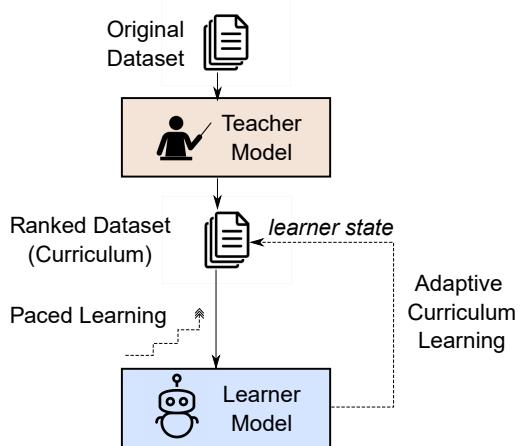
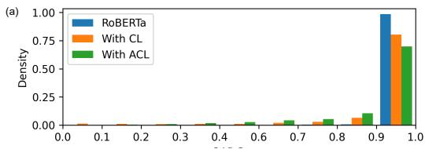
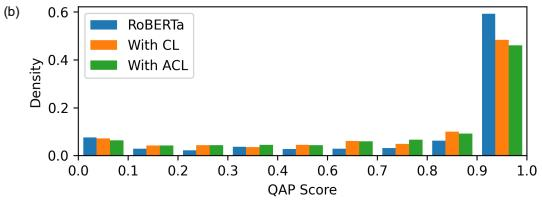
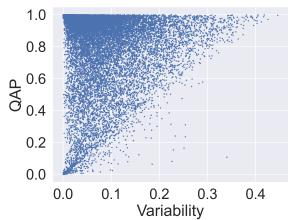
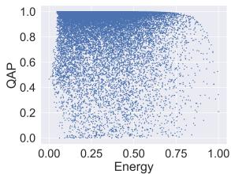
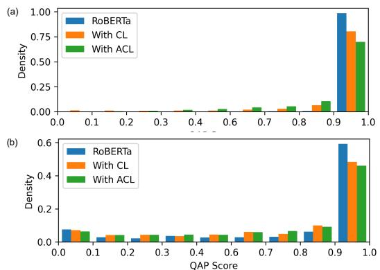
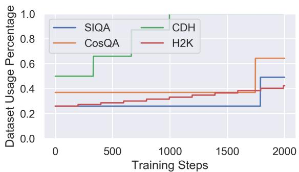

# On Curriculum Learning for Commonsense Reasoning

Adyasha Maharana Mohit Bansal Department of Computer Science University of North Carolina at Chapel Hill {adyasha, mbansal}@cs.unc.edu

## Abstract

Commonsense reasoning tasks follow a standard paradigm of finetuning pretrained lan guage models on the target task data, where samples are introduced to the model in a random order during training. However, recent research suggests that data order can have a significant impact on the performance of fine tuned models for natural language understand ing. Hence, we examine the effect of a human like easy-to-difficult curriculum during finetun ing of language models for commonsense rea soning tasks. We use paced curriculum learning to rank data and sample training mini-batches with increasing levels of difficulty from the ranked dataset during finetuning. Further, we investigate the effect of an adaptive curriculum, i.e., the data ranking is dynamically updated during training based on the current state of the learner model. We use a teacher model to measure difficulty of each sample and experiment with three measures based on question answering probability, variability and out-of distribution. To understand the effectiveness of curriculum learning in various scenarios, we apply it on full model fine-tuning as well as parameter-efficient prompt-tuning settings. Our results show that fixed as well as adap tive curriculum learning significantly improve performance for five commonsense reasoning tasks, i.e., SocialIQA, CosmosQA, CODAH, HellaSwag, WinoGrande in both tuning settings. Further, we find that prioritizing the difficult samples in the tail end of training improves generalization to unseen in-domain data as well as out-of-domain data. Our work provides evi dence and encourages research into curriculum learning for commonsense reasoning.1.

## 1 Introduction

Curriculum learning (Elman, 1993; Bengio et al., 2009) is an alternative to the typical uniform random sampling of training data and is motivated by the gradual progression of human learning from easier to difficult concepts (see Figure 1). In the machine learning paradigm, a ‘teacher’ ranks the training samples from easy to difficult and introduces them to the ‘learner’ in that order. Dodge et al. (2020) show that randomly initialized training data orders can lead to large variance in model performance on the GLUE benchmark (Wang et al., 2018). In light of such evidence, we seek to answer: Does a meaningful data order such as a curriculum based on model confidence or dataset distribution outperform a random data order? Such experiments have been carried out for some NLP tasks like machine translation (Platanios et al., 2019) and natural language understanding (Xu et al., 2020) with positive outcomes. While large pretrained models (PTLMs) have been achieving high performance on such tasks, their commonsense reasoning abilities have been limited. Moreover, the process of commonsense acquisition in humans has been shown to be informative for developing algorithms to accomplish the same in machines (Zhu et al., 2020). Hence, we study the effect of a human-like curriculum learning to improve the finetuning of PTLMs for commonsense reasoning tasks.

  
Figure 1: Curriculum Learning. The curriculum of the learner model i.e., the ranked dataset for finetuning is prepared using scores from the teacher model. The ranking remains unchanged in fixed curriculum learning whereas the learner state is used as feedback to update the ranking in adaptive curriculum learning.

To impose structure on the data order for sampling training mini-batches, we adopt paced curriculum learning by transfer as proposed in Hacohen and Weinshall (2019). In this method, a pacing function determines the speed at which the ranked data is introduced to the model during training. Ranking of the training dataset is performed using outputs from a pretrained network which has been finetuned on the target dataset using a random training order. We refer to this approach as fixed curriculum learning. During human acquisition of skill sets, a student can benefit from a curriculum that is continuously adjusted by the teacher according to the learning progress of the student. Hence, we also investigate adaptive curriculum learning for commonsense reasoning tasks. The initial data order imposed by the teacher model is updated at regular intervals during training by taking the learner model’s current state into account (Kong et al., 2021). Importantly, we propose to reverse the ranking to a difficulty-to-easy curriculum in ACL, in order to reinforce feedback from the hardto-learn data points, which has been shown to be beneficial for generalization (Swayamdipta et al., 2020). In order to measure difficulty, we explore three different data-sample informativeness scoring methods i.e. Question Answering Probability (QAP) (Zhang and Bansal, 2019), Energy-based Out-of-Distribution Score (Liu et al., 2020) and Cartography-based Variability (Swayamdipta et al., 2020). Our work is most related to Xu et al. (2020) which splits the training data into N meta-datasets, trains N models for computing the curriculum and follows a heuristically designed training regimen. In contrast, we train a single model for computing the curriculum and use Bayesian optimization (Snoek et al., 2012) to find the best pacing of the curriculum for the target dataset, which is more effective than Xu et al. (2020) as we show in Sec. 5.4, besides being computationally efficient.

We analyze these methods on five commonsense reasoning datasets dealing with various tasks such as reasoning about social interactions (SocialIQA; Sap et al. (2019)), reading comprehension (CosmosQA; Huang et al. (2019)), natural language inference (HellaSwag; Zellers et al. (2019)), pronoun resolution (WinoGrande; Sakaguchi et al. (2020)) and adversarial commonsense (CODAH; Chen et al. (2019)). We explore curriculum learning in fullmodel finetuning as parameter-efficient tuning and show significant improvements using curriculum learning on each of these datasets. We also demonstrate that curriculum learning prevents the learner model from over-fitting on the training set, which leads to improved generalization to in-domain and out-of-domain data.

## 2 Related Work

Curriculum learning (CL) is widely used in reinforcement learning (Zaremba and Sutskever, 2014; Matiisen et al., 2019; Graves et al., 2017) and neural machine translation (Platanios et al., 2019; Kocmi and Bojar, 2017; Guo et al., 2020). Sachan and Xing (2018), Penha and Hauff (2020), Xu et al. (2020) and Jafarpour et al. (2021) demonstrate the effectiveness of CL for question generation, information retrieval, natural language understanding and named entity recognition respectively. To the best of our knowledge, we are the first to examine the efficacy of CL for commonsense reasoning.

Various task-specific measures for sample complexity have been proposed in previous works, such as inter-annotator agreement for natural language inference (Laverghetta Jr et al., 2020), sub-graph depth for Abstract Meaning Representation (AMR) structures (Wang et al., 2021a), noise rate in PCA jittering-based data augmentation (Ye et al., 2021), sentence length for sequence modelling (Cirik et al., 2016), and semantic similarity for sentiment analysis (Han and Myaeng, 2017) etc. Wang et al. (2021b) use a neural density estimator to model graph embeddings distribution for the task of graph classification. We use scores based on pretrained models (Zhang and Bansal, 2019; Swayamdipta et al., 2020; Liu et al., 2020) to compute difficulty.

Kong et al. (2021) and Cai et al. (2020) demonstrate that an adaptive curriculum can improve convergence for image classification and neural response generation respectively. We examine adaptive CL for commonsense reasoning.

## 3 Methods

## 3.1 Curriculum Learning

Curriculum learning has two axes of variations, i.e., ranking of samples in terms of difficulty, and transitioning of easy to difficult samples during training. Following the transfer method proposed by Weinshall et al. (2018), we use the predictions of a model that has been trained on target dataset (without curriculum learning) in order to rank the synthetic as well as original samples by difficulty (see Teacher Model in Fig. 1). We adapt the fixed pacing function (Hacohen and Weinshall, 2019) to implement transition of easy to difficult examples and optimize for hyperparameters of the pacing functions using Bayesian optimization. The pacing function $p _ { f } ( i )$ is used to determine a sequence of subsets $X _ { 1 } , . . . , X _ { m } \subseteq X$ of size $| X _ { i } | = p _ { f } ( i ) * | X |$ from which mini-batches $\{ B _ { i } \}$ are sampled uniformly during training. Here, X is the ranked training dataset. The fixed pacing function is comprised of three parameters: (1) starting percentage, (2) increase factor, and (3) step length. The number of training iterations in each step of curriculum learning is defined as step length. The starting percentage decides maximum difficulty of the training samples introduced to the model in first step of curriculum learning. The increase factor is used to exponentially scale up the maximum difficulty at the end of each step. The usage percentage is calculated as $p _ { f } ( i ) = \bar { t } * \lambda ^ { \lfloor i / S \rfloor }$ where $t , \lambda , S$ and i are the tunable parameters i.e. starting percent, increase factor, step length and current training iteration, resp. Training is initialized by sampling from t% of the ranked dataset and the usage percentage is re-computed at the end of every $S$ iterations.

## 3.2 Adaptive Curriculum Learning

When the optimal curriculum for a student is not known in advance, a teacher usually draws up a curriculum based on past teaching experience and then adjusts with the learning progress of the student. Accordingly, Kong et al. (2021) propose initializing the curriculum using the difficulty score obtained from the teacher model and then adapt the score to the current state of the learner model (see Fig. 1). During training, the scores are updated after every L optimization steps. At the $( k + 1 )$ )th update, the difficulty score is computed as $\mu _ { k + 1 } = ( 1 - \alpha ) \mu _ { k } + \alpha \mu _ { c u r }$ where $\mu _ { c u r } , \mu _ { k }$ and $\mu _ { k + 1 }$ are difficulty scores after the current step, the kth and the $( k + 1$ )th updates respectively. α and L are tunable hyper-parameters. The ranking is flipped to a difficult-to-easy curriculum using the updated scores for subsequent training, in order to maximize exposure to difficult samples.

## 3.3 Difficulty Scoring Functions

Question Answering Probability (QAP). The probability that the teacher model can correctly predict the answer to a question is a measure of model confidence for that particular data sample (Zhang and Bansal, 2019). We propose to use this metric to rank datasets i.e. data samples with high QAP are considered as easy and those with low QAP are treated as difficult examples. Given a model with parameters $\theta ,$ the $\boldsymbol { \mathrm { Q A P } } \mu _ { i }$ for question-answer pair $( x _ { i } , y _ { i } ^ { * } )$ is measured as $\mu _ { i } = p _ { \boldsymbol { \theta } } ( y _ { i } ^ { * } | x _ { i } )$

Model Variability. Swayamdipta et al. (2020) propose the model confidence $( \hat { \mu } _ { i } )$ and variability $( \hat { \sigma } _ { i } )$ measures to identify the effect of data samples on the model’s generalization error. Specifically, $\begin{array} { r } { \hat { \mu } _ { i } ~ = ~ \frac { 1 } { E } \sum _ { e = 1 } ^ { \bar { E } } p _ { \theta } ( y _ { i } ^ { * } | x _ { i } ) } \end{array}$ and $\begin{array} { r } { \hat { \sigma _ { i } } = \sqrt { \frac { \sum _ { e = 1 } ^ { E } \left( p _ { \theta } ( y _ { i } ^ { * } | x _ { i } ) - \hat { \mu _ { i } } \right) ^ { 2 } } { E } } } \end{array}$ , where E is the number of training epochs. We rank samples in the ascending order of variability i.e. samples with low-variability are ranked as easy.

Energy. Liu et al. (2020) show that the energy score can be reliably used for distinguishing between in- and out-of-distribution (OOD) samples. We use this metric to rank OOD samples as "difficult" and in-distribution samples as "easy" in our curriculum. Energy of a given sample is computed as $\begin{array} { r } { E = - T * l o g { \sum _ { i } ^ { K } e x p ^ { f _ { i } ( x ) / T } } } \end{array}$ where $f _ { i } ( x )$ are the logits for a given sample, taken from the teacher model, and $T$ is the temperature.

## 4 Experimental Setup

We use a suite of large and small datasets formatted as multiple-choice question answering tasks for our experiments. SocialIQA (Sap et al., 2019), CosmosQA (Huang et al., 2019) and WinoGrande-XL (Sakaguchi et al., 2020) contain upto 60K training samples. Additionally, we use the CODAH dataset (Chen et al., 2019) and also follow the method in Yang et al. (2020) to create HellaSwag-2K (Zellers et al., 2019) for testing our methods in low-resource scenarios. Models are evaluated using the respective task-specific accuracies (see Appendix for dataset statistics). We use pretrained $\mathrm { R o B E R T a } _ { L A R G E }$ (Liu et al., 2019) as the teacher as well as learner model in our full-model finetuning experiments. In the first stage, the teacher model is finetuned on randomly sampled training data and used to compute the difficulty scores. Models are also subjected to grid-search based tuning of training hyperparameters in the first stage whenever necessary. In the second stage, we use Bayesian optimization for finding the optimum pacing function parameters for fixed as well as adaptive CL (and use the same training hyperparameters as first stage). For adaptive learning, we set $L = S$ and optimize for α, t, λ and S parameters. For prefixtuning experiments, we use $\mathrm { G P T } 2 _ { L A R G E }$ (Radford et al., 2019) as the PTLM for tuning. See Appendix for dataset statistics and hyperparameter bounds.

<table><tr><td>Method</td><td>SIQA</td><td>CosQA</td><td>CDH</td><td>H2K</td><td>WG</td></tr><tr><td colspan="6">Results on test set</td></tr><tr><td>RoBERTa + fixed CL</td><td>76.74* 78.14</td><td>79.23* 80.04</td><td>82.32 83.91</td><td>73.40 75.42</td><td>79.12 79.51</td></tr><tr><td>+ adaptive CL</td><td>78.53</td><td>80.43</td><td>84.75</td><td>76.10</td><td>79.97</td></tr><tr><td colspan="6">Results on validation set</td></tr><tr><td>RoBERTa + fixed CL + adaptive CL</td><td>77.78 78.86 79.22</td><td>80.45 81.0 81.57</td><td>84.28 85.92 86.03</td><td>74.72 77.23 77.89</td><td>79.63 80.11 81.05</td></tr></table>

Table 1: Results on commonsense datasets using RoBERTa and various CL methods. \*values are taken from leaderboards. $( \mathrm { S I Q A } = \mathrm { S o c i a l I Q A }$ 9 $\mathrm { { C o s Q A } = }$ CosmosQA, $\mathrm { C D H } = \mathrm { C o d a h } $ , H2K = HellaSwag2K, WG=WinoGrande-XL)
<table><tr><td>Method</td><td>SIQA</td><td>CosQA</td><td>CDH</td><td>H2K</td></tr><tr><td>RoBERTa</td><td>77.78</td><td>80.45</td><td>84.24</td><td>76.80</td></tr><tr><td>+ QAP</td><td>78.86</td><td>81.69</td><td>85.92</td><td>77.98</td></tr><tr><td>+ Energy</td><td>77.93</td><td>80.67</td><td>85.09</td><td>75.94</td></tr><tr><td>+ Variability</td><td>78.41</td><td>81.58</td><td>84.95</td><td>77.81</td></tr></table>

Table 2: Ablation results on validation set of commonsense reasoning datasets using fixed CL with RoBERTa and various difficulty measures.

## 5 Results & Analysis

## 5.1 Main Results

Our experiments with curriculum learning yield upto 2% improvements across five commonsense reasoning tasks using RoBERTa model (see Table 1). Fixed CL results in 1.4%, 0.81% and 0.4% improvement over baseline i.e. no CL (see row 1 in Table 1) for the larger datasets SocialIQA, CosmosQA and WinoGrande respectively. With adaptive CL, the improvements increase to 1.79%, 1.20% and 0.85% respectively. For the smaller datasets, we see similar benefits i.e. 1.7% and 2.5% with fixed CL, and 2.4% and 3.17% with adaptive CL over the baselines of Codah and HellaSwag-2K respectively. These results are obtained using QAP as difficulty score, which is the superior metric for measuring sample difficulty in multiple-choice datasets (see Sec. 5.2). The optimum α values in our experiments are closer to 1.0, which suggests that the initial ranking using teacher model is not quite useful after the first S training steps.

To investigate the effectiveness of curriculum learning, we compare the difficulty scores on the training and validation sets for the teacher vs. learner models. See Figure 4 for a demonstration of the same for HellaSWAG-2K. We observe that the learner model is less confident about the training data implying that there is less overfitting. This results in improved generalization to unseen data in the validation set, and more uniform distribution of QAP scores over the samples. We observe similar trends in other datasets as well (see Appendix for more figures), which suggests that curriculum learning acts as a regularizer during training. In order to further test this hypothesis, we evaluate the out-of-distribution generalization of WinoGrande models by evaluating on the Winograd Schema Challenge (WSC) dataset (Levesque et al., 2012). We observe 0.7% and 2.1% improvement in the performance on WSC using fixed and adaptive CL respectively (see Table 3), indicating that adaptive CL is especially effective at promoting generalization of the trained model. This result also aligns with the finding in Swayamdipta et al. (2020) that hard-to-learn examples play a significant role in learning and generalization.

<table><tr><td>Method</td><td>WG (ID)</td><td>WSC (OOD)</td></tr><tr><td>RoBERTa</td><td>79.63</td><td>88.07</td></tr><tr><td>+ fixed CL</td><td>80.11</td><td>88.77</td></tr><tr><td>+ adaptive CL</td><td>81.05</td><td>90.17</td></tr></table>

Table 3: In-domain (ID) and out-of-domain (OOD) accuracies for RoBERTaLARGE models trained with and without CL on the WinoGrande-XL (WG) dataset.

  
Figure 2: Comparison of QAP scores on the (a) training and (b) validation sets of HellaSwag-2K, for the RoBERTa models trained with and without CL.

## 5.2 Difficulty Metrics

We use three measures of difficulty for ranking the samples in the training data. Results on fixed CL with RoBERTa are shown in Table 2. We see the largest improvements with QAP, similar behavior with variability, and lesser or no improvements with energy. Scatter plot between QAP and variability for SIQA data samples reveals that samples with higher QAP also tend to have lower variance, hence leading to similar behavior from both metrics in curriculum learning. The energy score fails to yield benefits for CL because the datasets used in our experiments are mostly homogeneous.

<table><tr><td>Method</td><td>MNLI QNLI</td><td>QQP</td><td>RTE</td><td>SST-2</td><td>MRPC</td><td>CoLA</td><td>STS-B</td><td>Avg.</td></tr><tr><td>BERT  $\stackrel { \cdot } { \_ } A R G E$ </td><td>86.7</td><td>92.5 91.2</td><td>76.1</td><td>94.0</td><td>91.4</td><td>66.1</td><td>90.2</td><td>83.7</td></tr><tr><td>+ CL (Xu et al., 2020)</td><td>86.6</td><td>92.8 91.8</td><td>76.2</td><td>94.2</td><td>91.9</td><td>66.8</td><td>90.6</td><td>84.1</td></tr><tr><td>+ fixed CL (ours)</td><td>86.8</td><td>93.1 91.8</td><td>77.1</td><td>94.6</td><td>92.3</td><td>66.8</td><td>91.0</td><td>85.6</td></tr><tr><td>+ adaptive CL (ours)</td><td>87.9</td><td>93.5 92.7</td><td>77.9</td><td>94.6</td><td>92.4</td><td>66.5</td><td>91.8</td><td>86.1</td></tr></table>

Table 4: Results on validation sets of the GLUE dataset using fixed and adaptive CL with $\mathsf { B E R T } _ { L A R G E } .$

<table><tr><td>Method</td><td>SIQA</td><td>CosQA</td><td>CDH</td><td>H2K</td></tr><tr><td>Prefix-tuning</td><td>65.39</td><td>68.34</td><td>73.16</td><td>70.24</td></tr><tr><td>+ fixed CL + adaptive CL</td><td>66.18 66.91</td><td>69.10 69.42</td><td>75.28 75.56</td><td>72.58 72.68</td></tr></table>

Table 5: Results on validation set of commonsense reasoning datasets using prefix-tuning of GPT2 and curriculum learning with QAP as difficulty measure.

  
Figure 3: Visualization of scatter plots for QAP vs. Variability (left) and QAP vs. Energy (right) scores from the RoBERTa teacher model for SocialIQA.

## 5.3 Curriculum Learning for Prefix-Tuning

In the interest of parameter-efficient methods for training PTLMs to perform specialized tasks, we conduct CL experiments for prefix-tuning (Li and Liang, 2021) of $\mathrm { G P T } 2 _ { L A R G E }$ models on target datasets (see Appendix). We introduce a prefix of length 16 and train a reparameterization network that updates 0.2% of GPT2’s parameters for commonsense-based question answering. Results in Table 5 show that CL yields up to 1.5% improvements for smaller datasets and up to 1% improvement on larger datasets, suggesting that CL could be also effective for prompt-tuning settings.

## 5.4 Curriculum learning for Natural Language Understanding

We evaluate the performance of our proposed curriculum learning methods on conventional NLU tasks i.e. GLUE. In order to facilitate direct comparison to the meta-dataset approach presented in Xu et al. (2020), we train $\mathbf { B E R T } _ { L A R G E }$ models with our fixed as well as adaptive curriculum learning methods on all sub-tasks in GLUE (Wang et al., 2018). Results on the validation sets of GLUE are presented in Table 4. Our proposed method outperforms Xu et al. (2020) across all sub-tasks. We see upto 1% improvement on the larger datasets i.e. MNLI, QNLI and QQP. For the smaller GLUE datasets, we observe small improvement margins with curriculum learning approaches, as opposed to the larger improvements for small commonsense reasoning datasets as seen in Table 1.

<table><tr><td>SIA</td><td>Cameron gave Casey a drink. He loved helping kids and giving them things. How would Casey feel as a result? [A] very apathetic [B] very grateful [C] somewhat infdifferent</td></tr><tr><td>Codah</td><td>We organized a bonfire party. I [A] brought marshmallows to toast [B] like to play with fire [C] threw a bucket of water at the bonfire [D] howled like a wolf.</td></tr></table>

Table 6: Most difficult samples of SIQA and CODAH as ranked by QAP scores. Labels are marked in green.

## 6 Limitations

Our results are limited to the task of multiple choice question-answering based commonsense reasoning and natural language understanding, but are encouraging and warrant further research into effective adaptive CL methodologies for other NLP tasks. The adaptive curriculum learning method proposed in our paper is expensive for larger datasets since the ranking needs to be recomputed several times during training using the current version of the learner model. Further work is needed to optimize curriculum learning methods for larger datasets like AbductiveNLI (Bhagavatula et al., 2019) and for using larger models like UnifiedQA (Khashabi et al., 2020) for finding the right curriculum.

## 7 Conclusion

We conduct an empirical analysis of fixed and adaptive curriculum learning (CL) for five commonsense reasoning tasks using pretrained language models (PTLMs). Results show that CL can benefit downstream task performance when introducing a new task to a PTLM, in fully-finetuned as well prompt-tuned settings, and for in-domain as well as out-of-domain data. Our work motivates future research into CL for commonsense reasoning.

## 8 Acknowledgement

We would like to thank the reviewers for their useful feedback. This work was supported by DARPA MCS Grant N66001-19-2-4031. The views, opinions, and/or findings contained in this article are those of the authors and not of the funding agency.

## References

Yoshua Bengio, Jérôme Louradour, Ronan Collobert, and Jason Weston. 2009. Curriculum learning. In Proceedings of the 26th annual international conference on machine learning, pages 41–48.

Chandra Bhagavatula, Ronan Le Bras, Chaitanya Malaviya, Keisuke Sakaguchi, Ari Holtzman, Hannah Rashkin, Doug Downey, Wen-tau Yih, and Yejin Choi. 2019. Abductive commonsense reasoning. In International Conference on Learning Representations.

Hengyi Cai, Hongshen Chen, Cheng Zhang, Yonghao Song, Xiaofang Zhao, Yangxi Li, Dongsheng Duan, and Dawei Yin. 2020. Learning from easy to complex: Adaptive multi-curricula learning for neural dialogue generation. In Proceedings of the AAAI Conference on Artificial Intelligence, volume 34, pages 7472–7479.

Michael Chen, Mike D’Arcy, Alisa Liu, Jared Fernandez, and Doug Downey. 2019. Codah: An adversarially authored question-answer dataset for common sense. In Proceedings of the 3rd Workshop on Evaluating Vector Space Representations for NLP.

Volkan Cirik, Eduard Hovy, and Louis-Philippe Morency. 2016. Visualizing and understanding curriculum learning for long short-term memory networks. arXiv preprint arXiv:1611.06204.

Jesse Dodge, Gabriel Ilharco, Roy Schwartz, Ali Farhadi, Hannaneh Hajishirzi, and Noah Smith. 2020. Fine-tuning pretrained language models: Weight initializations, data orders, and early stopping. arXiv preprint arXiv:2002.06305.

Jeffrey L Elman. 1993. Learning and development in neural networks: The importance of starting small. Cognition, 48(1):71–99.

Alex Graves, Marc G Bellemare, Jacob Menick, Remi Munos, and Koray Kavukcuoglu. 2017. Automated curriculum learning for neural networks. In Proceedings of the 34th International Conference on Machine Learning-Volume 70, pages 1311–1320. JMLR. org.

Junliang Guo, Xu Tan, Linli Xu, Tao Qin, Enhong Chen, and Tie-Yan Liu. 2020. Fine-tuning by curriculum learning for non-autoregressive neural machine translation. In Proceedings of the AAAI Conference on Artificial Intelligence, volume 34, pages 7839–7846.

Guy Hacohen and Daphna Weinshall. 2019. On the power of curriculum learning in training deep networks. In Proceedings of the 36th International Conference on Machine Learning, ICML 2019, 9-15 June 2019, Long Beach, California, USA, volume 97 of Proceedings of Machine Learning Research, pages 2535–2544. PMLR.

Sanggyu Han and Sung-Hyon Myaeng. 2017. Treestructured curriculum learning based on semantic similarity of text. In 2017 16th IEEE International Conference on Machine Learning and Applications (ICMLA), pages 971–976. IEEE.

Lifu Huang, Ronan Le Bras, Chandra Bhagavatula, and Yejin Choi. 2019. Cosmos qa: Machine reading comprehension with contextual commonsense reasoning. In Proceedings of the 2019 Conference on Empirical Methods in Natural Language Processing and the 9th International Joint Conference on Natural Language Processing (EMNLP-IJCNLP), pages 2391–2401.

Borna Jafarpour, Dawn Sepehr, and Nick Pogrebnyakov. 2021. Active curriculum learning. In Proceedings of the First Workshop on Interactive Learning for Natural Language Processing, pages 40–45.

Daniel Khashabi, Sewon Min, Tushar Khot, Ashish Sabharwal, Oyvind Tafjord, Peter Clark, and Hannaneh Hajishirzi. 2020. Unifiedqa: Crossing format boundaries with a single qa system. In Proceedings of the 2020 Conference on Empirical Methods in Natural Language Processing: Findings, pages 1896–1907.

Tom Kocmi and Ondˇrej Bojar. 2017. Curriculum learning and minibatch bucketing in neural machine translation. In Proceedings of the International Conference Recent Advances in Natural Language Processing, RANLP 2017, pages 379–386.

Yajing Kong, Liu Liu, Jun Wang, and Dacheng Tao. 2021. Adaptive curriculum learning. In Proceedings of the IEEE/CVF International Conference on Computer Vision, pages 5067–5076.

Antonio Laverghetta Jr, Jamshidbek Mirzakhalov, and John Licato. 2020. Towards a taskagnostic model of difficulty estimation for supervised learning tasks. In Proceedings of the 1st Conference of the Asia-Pacific Chapter of the Association for Computational Linguistics and the 10th International Joint Conference on Natural Language Processing: Student Research Workshop, pages 16–23.

Hector Levesque, Ernest Davis, and Leora Morgenstern. 2012. The winograd schema challenge. In Thirteenth international conference on the principles of knowledge representation and reasoning.

Xiang Lisa Li and Percy Liang. 2021. Prefixtuning: Optimizing continuous prompts for generation. In Proceedings of the 59th Annual Meeting of the Association for Computational Linguistics and

the 11th International Joint Conference on Natural Language Processing (Volume 1: Long Papers), pages 4582–4597, Online. Association for Computational Linguistics.

Weitang Liu, Xiaoyun Wang, John Owens, and Yixuan Li. 2020. Energy-based out-of-distribution detection. Advances in Neural Information Processing Systems, 33.

Yinhan Liu, Myle Ott, Naman Goyal, Jingfei Du, Mandar Joshi, Danqi Chen, Omer Levy, Mike Lewis, Luke Zettlemoyer, and Veselin Stoyanov. 2019. Roberta: A robustly optimized bert pretraining approach. arXiv preprint arXiv:1907.11692.

Tambet Matiisen, Avital Oliver, Taco Cohen, and John Schulman. 2019. Teacher-student curriculum learning. IEEE transactions on neural networks and learning systems.

Gustavo Penha and Claudia Hauff. 2020. Curriculum learning strategies for ir. In Advances in Information Retrieval, pages 699–713, Cham. Springer International Publishing.

Emmanouil Antonios Platanios, Otilia Stretcu, Graham Neubig, Barnabas Poczos, and Tom M Mitchell. 2019. Competence-based curriculum learning for neural machine translation. In Proceedings of NAACL-HLT, pages 1162–1172.

Alec Radford, Jeffrey Wu, Rewon Child, David Luan, Dario Amodei, and Ilya Sutskever. 2019. Language models are unsupervised multitask learners.

Mrinmaya Sachan and Eric Xing. 2018. Selftraining for jointly learning to ask and answer questions. In Proceedings of the 2018 Conference of the North American Chapter of the Association for Computational Linguistics: Human Language Technologies, Volume 1 (Long Papers), pages 629– 640.

Keisuke Sakaguchi, Ronan Le Bras, Chandra Bhagavatula, and Yejin Choi. 2020. Winogrande: An adversarial winograd schema challenge at scale. In Proceedings of the AAAI Conference on Artificial Intelligence, volume 34.

Maarten Sap, Hannah Rashkin, Derek Chen, Ronan Le Bras, and Yejin Choi. 2019. Social iqa: Commonsense reasoning about social interactions. In Proceedings of the 2019 Conference on EMNLP and the 9th IJCNLP, pages 4453–4463.

Jasper Snoek, Hugo Larochelle, and Ryan P Adams. 2012. Practical bayesian optimization of machine learning algorithms. In Advances in neural information processing systems, pages 2951–2959.

Swabha Swayamdipta, Roy Schwartz, Nicholas Lourie, Yizhong Wang, Hannaneh Hajishirzi, Noah A Smith, and Yejin Choi. 2020. Dataset cartography: Mapping and diagnosing datasets with training dynamics. In Proceedings of the 2020 Conference on Empirical

Methods in Natural Language Processing (EMNLP), pages 9275–9293.

Alex Wang, Amanpreet Singh, Julian Michael, Felix Hill, Omer Levy, and Samuel Bowman. 2018. Glue: A multi-task benchmark and analysis platform for natural language understanding. In Proceedings of the 2018 EMNLP Workshop BlackboxNLP: Analyzing and Interpreting Neural Networks for NLP, pages 353–355.

Peiyi Wang, Liang Chen, Tianyu Liu, Baobao Chang, and Zhifang Sui. 2021a. Hierarchical curriculum learning for amr parsing. arXiv preprint arXiv:2110.07855.

Yiwei Wang, Wei Wang, Yuxuan Liang, Yujun Cai, and Bryan Hooi. 2021b. Curgraph: Curriculum learning for graph classification. In Proceedings of the Web Conference 2021, pages 1238–1248.

Daphna Weinshall, Gad Cohen, and Dan Amir. 2018. Curriculum learning by transfer learning: Theory and experiments with deep networks. In International Conference on Machine Learning, pages 5238–5246.

Benfeng Xu, Licheng Zhang, Zhendong Mao, Quan Wang, Hongtao Xie, and Yongdong Zhang. 2020. Curriculum learning for natural language understanding. In Proceedings of the 58th Annual Meeting of the Association for Computational Linguistics, pages 6095–6104.

Yiben Yang, Chaitanya Malaviya, Jared Fernandez, Swabha Swayamdipta, Ronan Le Bras, Ji-Ping Wang, Chandra Bhagavatula, Yejin Choi, and Doug Downey. 2020. G-daug: Generative data augmentation for commonsense reasoning. In Proceedings of the 2020 Conference on Empirical Methods in Natural Language Processing: Findings, pages 1008–1025.

Zhilin Yang, Zihang Dai, Yiming Yang, Jaime Carbonell, Russ R Salakhutdinov, and Quoc V Le. 2019. Xlnet: Generalized autoregressive pretraining for language understanding. In Advances in neural information processing systems, pages 5754–5764.

Seonghyeon Ye, Jiseon Kim, and Alice Oh. 2021. Efficient contrastive learning via novel data augmentation and curriculum learning. In Proceedings of the 2021 Conference on Empirical Methods in Natural Language Processing, pages 1832–1838.

Wojciech Zaremba and Ilya Sutskever. 2014. Learning to execute. arXiv preprint arXiv:1410.4615.

Rowan Zellers, Ari Holtzman, Yonatan Bisk, Ali Farhadi, and Yejin Choi. 2019. Hellaswag: Can a machine really finish your sentence? In Proceedings of the 57th Annual Meeting of the Association for Computational Linguistics, pages 4791–4800.

Shiyue Zhang and Mohit Bansal. 2019. Addressing semantic drift in question generation for semisupervised question answering. In Proceedings of the 2019 Conference on Empirical Methods

in Natural Language Processing and the 9th International Joint Conference on Natural Language Processing (EMNLP-IJCNLP), pages 2495–2509.

Yixin Zhu, Tao Gao, Lifeng Fan, Siyuan Huang, Mark Edmonds, Hangxin Liu, Feng Gao, Chi Zhang, Siyuan Qi, Ying Nian Wu, et al. 2020. Dark, beyond deep: A paradigm shift to cognitive ai with humanlike common sense. Engineering, 6(3):310– 345.

  
Figure 4: Comparison of $\mathsf { Q A P }$ scores on the (a) training and (b) validation sets of SocialIQA, for the RoBERTa models trained with and without CL.

## A Prefix-Tuning Model

For this scenario, we finetune a $\mathrm { { G P T } } 2 _ { L A R G E }$ model for the task of multiple-choice reasoning using prefix-tuning, wherein the weights of pretrained GPT2 are frozen, and only a matrix of prefix embeddings are trained for the target task. Following Li and Liang (2021), we prepend a prefix to the inputs of GPT2 model i.e. $z = [ \mathrm { P R E F I X } , x , y ]$ where $( x , y )$ is the question-answer input pair. We also a parameterization network to compute the prefix embeddings i.e., $P _ { \theta } = M L P ( P _ { \theta ^ { \prime } } )$ where $P _ { \theta }$ is the prefix embedding used during inference, $P _ { \theta ^ { ' } }$ is a smaller prefix matrix used for reparameterization during training and MLP is the dense layer used as the reparameterization network. We set the prefix length to $^ { 1 6 , }$ and the dimensions of $P _ { \theta ^ { ' } }$ to 512. The dimensions of $P _ { \theta }$ is 1024, according to the hidden size of $\mathrm { { G P T } } 2 _ { L A R G E }$ . This leads to a total of 0.2% trainable parameters in our prefix-tuning based GPT2 model.

## B Experimental Setup

Datasets. We use two large multiple-choice commonsense-based question answering datasets for our experiments i.e. SocialIQA (Sap et al., 2019) and CosmosQA (Huang et al., 2019). Additionally, we also use the CODAH dataset (Chen et al., 2019) folds released in Yang et al. (2019) and follow their method to create HellaSwag-2K (Zellers et al., 2019) for testing our methods on low-resource scenario. All of the above datasets are being for their intended purposes i.e. research only, in our work. All of these datasets are in the English language. Models are evaluated using the respective task-specific accuracies. See Table 9 for dataset statistics.

<table><tr><td>Hyperparameter</td><td>SocialIQA</td><td>CosmosQA</td><td>CODAH</td><td>HellaSwag2K</td><td>WinoGrande (XL)</td></tr><tr><td>Starting Percent (sp)</td><td>0.26</td><td>0.37</td><td>0.5</td><td>0.26</td><td>0.39</td></tr><tr><td>Increase Factor (inc)</td><td>1.89</td><td>1.74</td><td>1.32</td><td>1.05</td><td>1.8</td></tr><tr><td>Update Steps (S)</td><td>1789</td><td>1745</td><td>332</td><td>199</td><td>405</td></tr><tr><td>Adaptive Factor (α)</td><td>0.93</td><td>0.99</td><td>0.55</td><td>0.09</td><td>0.19</td></tr></table>

Table 7: Best adaptive curriculum learning pacing function parameters for finetuning RoBERTa on various datasets

<table><tr><td rowspan=1 colspan=1>Parameter</td><td rowspan=1 colspan=1>Bounds</td></tr><tr><td rowspan=1 colspan=2>Grid-search Based Optimization</td></tr><tr><td rowspan=1 colspan=1>Learning RateBatch Size (inc)Total Train Epochs</td><td rowspan=1 colspan=1>[1e-5, 5e-5, 1e-6, 5e-6][8, 16][3,4,5]</td></tr><tr><td rowspan=1 colspan=2>Bayesian Optimization</td></tr><tr><td rowspan=1 colspan=1>Starting Percent (t)Increase Factor (λ)*Update Steps (S)</td><td rowspan=1 colspan=1>[0.01, 0.5][1.05, 2.0][0.01, 3]*250</td></tr><tr><td rowspan=1 colspan=1>Adaptive Factor (α)</td><td rowspan=1 colspan=1>[0, 1.0]</td></tr></table>

Table 8: Optimization bounds for grid-search based tuning of training hyperparameters and bayesian optimization of curriculum learning parameters. \*We expand the search window for update steps to 2500 for larger datasets in adaptive CL
<table><tr><td>Split</td><td>SIQA</td><td>CosQA</td><td>CDH</td><td>H2K</td><td>WG</td></tr><tr><td>Train</td><td>33,410</td><td>25,778</td><td>1666</td><td>2000</td><td>40,498</td></tr><tr><td>Dev</td><td>1954</td><td>3000</td><td>566</td><td>1000</td><td>1266</td></tr><tr><td>Test</td><td>2224</td><td>7000</td><td>566</td><td>5000</td><td>1767</td></tr></table>

Table 9: Number of samples in each split of the datasets used in our experiments. (SIQA = SocialIQA, CosQA = CosmosQA, CDH = Codah, H2K = HellaSwag2K, WG=WinoGrande-XL)

Models & Hyper-parameters. We use RoBERTaLARGE Liu et al. (2019) as the main PTLM in our experiments. We perform Bayesian optimization for finding the optimum parameters for fixed as well as adaptive CL. For adaptive learning, we set L = S and optimize for α, t, λ and S parameters. All models are also subjected to grid-search based tuning of training hyperparameters.

## B.1 Hyperparameter Tuning Bounds

We perform grid-search based optimization for finding the best training hyperparameters for each training scenario and dataset. For curriculum learning based parameters, we first perform bayesian optimization (Snoek et al., 2012) of curriculum learning parameters using the best training hyperparameters for the baseline (non-CL) model. For bayesian optimization, each model is subjected to 15 iterations of optimization with 3 restarts and the tuning is based on accuracy on validation set.

  
Figure 5: Demonstration of the optimized learning pace of RoBERTa for various datasets. Usage percentage k (y-axis) at training step n (x-axis) refers to the top k% easiest examples of the ranked dataset.

For the prefix-tuning models, we perform gridsearch based tuning of training hyperparameters according to the bounds reported in Table 8 and in addition, up to 10 training epochs.

<table><tr><td rowspan=1 colspan=1>Hyperparameter</td><td rowspan=1 colspan=1>SocialIQA</td><td rowspan=1 colspan=1>CosmosQA</td><td rowspan=1 colspan=1>CODAH</td><td rowspan=1 colspan=1>HellaSwag2K</td><td rowspan=1 colspan=1>WinoGrande (XL)</td></tr><tr><td rowspan=1 colspan=1>Learning Rate</td><td rowspan=1 colspan=1>5e-6</td><td rowspan=1 colspan=1>5e-6</td><td rowspan=1 colspan=1>1e-5</td><td rowspan=1 colspan=1>1e-5</td><td rowspan=1 colspan=1>1e-5</td></tr><tr><td rowspan=1 colspan=1>Epochs</td><td rowspan=1 colspan=1>3</td><td rowspan=1 colspan=1>4</td><td rowspan=1 colspan=1>5</td><td rowspan=1 colspan=1>5</td><td rowspan=1 colspan=1>5</td></tr><tr><td rowspan=1 colspan=1>Max Gradient Norm</td><td rowspan=1 colspan=1>1.0</td><td rowspan=1 colspan=1>1.0</td><td rowspan=1 colspan=1>1.0</td><td rowspan=1 colspan=1>1.0</td><td rowspan=1 colspan=1>1.0</td></tr><tr><td rowspan=1 colspan=1>Weight Decay</td><td rowspan=1 colspan=1>0.01</td><td rowspan=1 colspan=1>0.01</td><td rowspan=1 colspan=1>0.01</td><td rowspan=1 colspan=1>0.01</td><td rowspan=1 colspan=1>0.01</td></tr><tr><td rowspan=1 colspan=1>Batch Size</td><td rowspan=1 colspan=1>8</td><td rowspan=1 colspan=1>8</td><td rowspan=1 colspan=1>16</td><td rowspan=1 colspan=1>16</td><td rowspan=1 colspan=1>16</td></tr><tr><td rowspan=1 colspan=1>Max Length</td><td rowspan=1 colspan=1>128</td><td rowspan=1 colspan=1>128</td><td rowspan=1 colspan=1>90</td><td rowspan=1 colspan=1>128</td><td rowspan=1 colspan=1>70</td></tr><tr><td rowspan=1 colspan=1>Warmup Ratio</td><td rowspan=1 colspan=1>0.06</td><td rowspan=1 colspan=1>0.06</td><td rowspan=1 colspan=1>0.06</td><td rowspan=1 colspan=1>0.06</td><td rowspan=1 colspan=1>0.06</td></tr><tr><td rowspan=1 colspan=1>LR Decay</td><td rowspan=1 colspan=1>Linear</td><td rowspan=1 colspan=1>Linear</td><td rowspan=1 colspan=1>Linear</td><td rowspan=1 colspan=1>Linear</td><td rowspan=1 colspan=1>Linear</td></tr><tr><td rowspan=1 colspan=1>Optimizer</td><td rowspan=1 colspan=1>AdamW</td><td rowspan=1 colspan=1>AdamW</td><td rowspan=1 colspan=1>AdamW</td><td rowspan=1 colspan=1>AdamW</td><td rowspan=1 colspan=1>AdamW</td></tr><tr><td rowspan=1 colspan=1>Hardware</td><td rowspan=1 colspan=1>RTX 2080 Ti</td><td rowspan=1 colspan=1>RTX 2080 Ti</td><td rowspan=1 colspan=1>RTX 2080Ti</td><td rowspan=1 colspan=1>RTX 2080Ti</td><td rowspan=1 colspan=1>RTX 2080Ti</td></tr><tr><td rowspan=1 colspan=1>Single GPU training time</td><td rowspan=1 colspan=1>5 hours</td><td rowspan=1 colspan=1>5 hours</td><td rowspan=1 colspan=1>2 hours*</td><td rowspan=1 colspan=1>2 hours</td><td rowspan=1 colspan=1>5 hours</td></tr></table>

Table 10: Training hyperparameters for finetuning RoBERTa on various datasets.