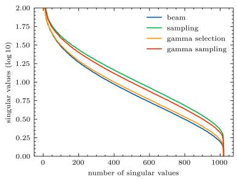
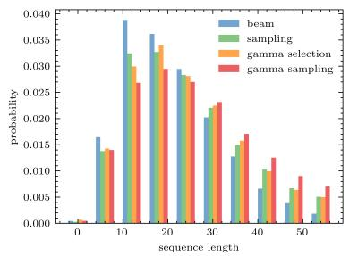
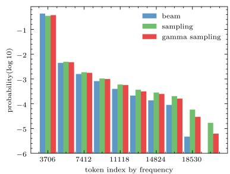

# On Synthetic Data for Back Translation∗

Jiahao Xu<sup>1</sup>, Yubin Ruan<sup>2</sup>, Wei Bi<sup>2</sup>, Guoping Huang<sup>2</sup>,

Shuming Shi<sup>2</sup>, Lihui Chen<sup>1</sup>, Lemao Liu<sup>2</sup>

<sup>1</sup>Nanyang Technological University, <sup>2</sup>Tencent AI Lab

<sup>1</sup>{jiahao004@e.,elhchen@}ntu.edu.sg

<sup>2</sup>{brantruan,victoriabi,donkeyhuang,shumingshi,redmondliu} @tencent.com

## Abstract

Back translation (BT) is one of the most significant technologies in NMT research fields. Existing attempts on BT share a common characteristic: they employ either beam search or random sampling to generate synthetic data with a backward model but seldom work studies the role of synthetic data in the performance of BT. This motivates us to ask a fundamental question: what kind of synthetic data contributes to BTperformance? Through both theoretical and empirical studies, we identify two key factors on synthetic data controlling the back-translation NMT performance, which are quality and importance. Furthermore, based on our findings, we propose a simple yet effective method to generate synthetic data to better trade off both factors so as to yield a better performance for BT. We run extensive experiments on WMT14 DE-EN, EN-DE, and RU-EN benchmark tasks. By employing our proposed method to generate synthetic data, our BT model significantly outperforms the standard BT baselines (i.e., beam and sampling based methods for data generation), which proves the effectiveness of our proposed methods.

## 1 Introduction

Since the birth of neural machine translation (NMT) (Bahdanau et al., 2014; Sutskever et al., 2014) back translation (BT) (Sennrich et al., 2016a) has quickly become one of the most significant technologies in natural language processing (NLP) research field. This is because 1) it provides a simple yet effective approach to advance the supervised NMT by leveraging monolingual data (Edunov et al., 2018) and it also serves as a key learning objective in unsupervised NMT (Artetxe et al., 2018; Lample et al., 2018); 2) back translation even plays a significant role in other NLP research fields beyond translation such as paraphrasing (Mallinson et al., 2017) and style transfer (Prabhumoye et al., 2018; Zhang et al., 2018).

Back translation consists of two steps, namely synthetic corpus generation with a backward model and parameter optimization for the forward model. Various contributions have been made on improving back translation, for instance, iterative back translation (Hoang et al., 2018), tagged back translation (Caswell et al., 2019), confidence weighting (Wang et al., 2019), data diversification (Nguyen et al., 2020). Although these efforts differ in some aspects, all of them share a common characteristic: they employ a default way to generate synthetic data in the first step of BT which is either beam search or random sampling with a backward model. Seldom work studies the consequences of synthetic corpus to back translation and hence it is unclear how synthetic data influences the final performance of BT.

The early study empirically suggests the quality of the synthetic corpus is vital for BT performance (Sennrich et al., 2016a). However, recent studies illustrate better test performance can be achieved by low quality synthetic corpus (Edunov et al., 2018). This contradictory observation indicates the quality of synthetic data is not the only element that affects the BT performance. Hence, this fact naturally raises a fundamental question: what kind of synthetic data contributes to back translation performance?

In this paper, we attempt to take a step forward toward the above fundamental question. To this end, we start from a critical objective in semi-supervised learning, which is defined by the marginal distribution of a target language. Then we derive an approximate lower bound of the objective function, which is closely related to the objective of back translation. Corresponding to this lower bound, we theoretically find two related elements for maximizing such a lower bound: quality of synthetic bilingual data and importance weight of its source. Since both elements are mutually exclusive to some extent, it may induce contradictory observation if one judges the BT performance according to a single element. In addition, such a theoretical explanation is supported by our empirical experiments. Furthermore, based on our findings, we propose a new heuristic approach to generate synthetic data whose both elements are better balanced so as to yield improvements over both sampling and beam search based methods. Extensive experiments on three WMT14 tasks show that our BT consistently outperforms the standard sampling and beam search based baselines by a significant margin.

Our contributions are three folds:

1. We point out that importance weight and quality of synthetic candidates are two key factors that affect the NMT performance.

2. We propose a simple yet effective method for synthetic corpus generation, which could better balance the quality and importance of synthetic data.

3. Our experiments prove the effectiveness of the aforementioned strategy, it outperforms beam or sampling decoding methods on three benchmark tasks.

## 2 Revisiting Back Translation

NMT builds a probabilistic model $p ( \boldsymbol { y } | \boldsymbol { x } ; \boldsymbol { \theta } )$ with neural networks parameterized by θ, which is used to translate a sentence x in source language $\mathcal { X }$ to a sentence $y$ in target language . The standard wisdom to train the model is to minimize the following objective function over a given bilingual corpus $\boldsymbol { B } = \{ ( x _ { i } , y _ { i } ) \}$

$$
\ell ( \boldsymbol { B } ; \boldsymbol { \theta } ) = \sum _ { ( \boldsymbol { x } _ { i } , \boldsymbol { y } _ { i } ) \in \boldsymbol { B } } \log p ( \boldsymbol { y } _ { i } | \boldsymbol { x } _ { i } ; \boldsymbol { \theta } )\tag{1}
$$

Recently Sennrich et al. (2016a) propose a remarkable method called Back Translation (BT) to improve NMT by using a monolingual corpus in target language besides and back translation becomes one of the most successful techniques in NMT (Fadaee and Monz, 2018; Edunov et al., 2018). At a high level, back translation can be considered as a semi-supervised method because it leverages both labeled and unlabeled data. Suppose $p ( x | y ; \pi )$ is the backward translation model whose parameter $\pi$ is optimized over $B ,$ the key idea of back translation can be summarized as the following two steps:

• Synthetic Corpus Generation: It firstly back-translates each target sentence $y \in \mathcal { M }$ to xˆ obtain a synthetic bilingual corpus $\{ ( \hat { x } , y )$ \_ $y \in \mathcal { M } \}$ by $p ( x | y ; \pi )$

• Parameter Optimization: It combines both authentic corpus $\boldsymbol { B }$ and the synthetic corpus and then optimizes the parameter θ by minimizing the loss

$$
\ell ( \boldsymbol { B } ; \theta ) + \sum _ { y \in \mathcal { M } } \log p ( y | \hat { x } ; \theta )\tag{2}
$$

To make BT more efficient, the standard configuration is widely adopted: each sentence $y$ is required to generate a single source $\hat { x }$ and both two steps are performed for a single pass. We follow this standard in this paper for generality but our idea in this paper is straightforward to apply to other configurations such as (Graça et al., 2019; Hoang et al., 2018; Nguyen et al., 2020).

In the first step, there are two main strategies to generate the synthetic corpus, i.e., deterministically decoding and randomly sampling with $p ( x | y ; \pi )$ The first strategy aims to search the best candidate as follows,

$$
\hat { x } ^ { b } = \arg \operatorname* { m a x } p ( \hat { x } | y ; \pi )\tag{3}
$$

The above optimization is achieved by the beam search decoding, which can be regarded as a degenerated shortest path problem with respect to the log $p ( \hat { x } | y ; \pi )$ with limited routing attempts. The alternative strategy is random sampling: it randomly samples a token with respect to the distribution estimated by a back-translation model at each decoding step. Such a process can be modelled by,

$$
\hat { x } ^ { s } = \mathrm { r a n d } \{ p ( \hat { x } | y ; \pi ) \}\tag{4}
$$

Research Question Prior work points out (Sennrich et al., 2016a) that the synthetic corpus with high quality is beneficial to the final performance of back translation. However, the recent studies (Edunov et al., 2018) find that NMT models with unsatisfactory BLEU score corpus, for instance, the corpus generated by sampling based strategy, also establish the state-of-the-art (SOTA) achievement among back-translation NMT models.

This contradictory fact indicates that the quality of synthetic corpus is not the sole element for back translation. This motivates us to study a fundamental question for back translation: what kind of synthetic corpus is beneficial to back translation?

## 3 Understanding Synthetic Data by Two Factors

To answer the fundamental question presented in the previous section, we first start from the marginal likelihood objective defined on the target language $\mathcal { V } ,$ , and then we theoretically explain two factors (i.e., quality and importance) that are highly related to the training objective of back translation. Finally, we empirically explain why synthetic corpus with low quality may lead to better performance than synthetic corpus with high quality by measuring both factors.

## 3.1 Theoretical Explanation

Maximizing marginal likelihood is an important principle to leverage unlabeled data. Therefore, we rethink back translation from this principle because it makes use of target monolingual corpus . For each $y \in { \mathcal { M } }$ , the marginal likelihood objective can be derived by the Bayesian Equation (5), Jansen Inequality (6), and importance sampling (7) as follows:

$$
\log p ( y ; \theta ) = \log \sum _ { x } p ( x ) p ( y | x ; \theta )\tag{5}
$$

$$
\geq \sum _ { x } p ( x ) \log p ( y | x ; \theta )\tag{6}
$$

$$
\begin{array} { l } { \displaystyle = \sum _ { x } p ( x | y ) \frac { p ( x ) } { p ( x | y ) } \log p ( y | x ; \theta ) } \\ { \displaystyle = \mathbb { E } _ { \hat { x } \sim p ( \cdot | y ) } \Big \{ \frac { p ( \hat { x } ) } { p ( \hat { x } | y ) } \log p ( y | \hat { x } ; \theta ) \Big \} } \\ { \displaystyle \approx \frac { p ( \hat { x } ) } { p ( \hat { x } | y ) } \log p ( y | \hat { x } ; \theta ) \qquad ( } \end{array}\tag{7}
$$

where $p ( x )$ is a language model on source language $\mathcal { X } , p ( x | y )$ is a backward translation model from to  which serves as the proposal distribution for importance sampling, and $\hat { x }$ is sampled from $p ( x | y )$ . If $p ( x | y )$ is set as the backward model $p ( x | y ; \pi )$ optimized on $B ,$ the last term in Equation 7 is the same as the second term in BT loss $( \mathrm { i . e . }$ log $p ( y | \hat { x } )$ in Eq. 2), and the unique difference is the multiplicative term called importance weight:

$$
\operatorname { I m p } ( { \hat { x } } ; y ) = { \frac { p ( { \hat { x } } ) } { p ( { \hat { x } } | y ) } }\tag{8}
$$

The denominator is the candidate conditional probability to target, and the numerator is the candidate distribution on source language distribution. Since Im $ { \mathrm { l p } } ( \hat { x } ; y )$ is constant with respect to the parameter $\theta ,$ maximizing log $p ( \boldsymbol { y } | \hat { x } ; \boldsymbol { \theta } )$ in BT loss implicitly maximizes Imp $( \hat { x } ; y )$ log $p ( y | \hat { x } )$ , which indicates that back translation aims to implicitly maximize the marginal likelihood objective. More importantly, according to Equation 7 we can find that the following two factors are critical to influence the marginal likelihood log $p ( y ; \theta )$ :

• Factor 1: The quality of xˆ as a translation of y corresponding to the log $p ( \boldsymbol { y } | \hat { x } ; \boldsymbol { \theta } )$ in Eq. 7.

• Factor 2: The importance of xˆ as a translation of y corresponding to Imp $( \hat { x } ; y )$ in Eq. 7.

Theoretically, if xˆ is of higher quality and contains more semantic information in y, $p ( \boldsymbol { y } | \hat { x } ; \boldsymbol { \theta } )$ would be higher and thus it would lead to a higher log $p ( \boldsymbol { y } ; \boldsymbol { \theta } )$ , which is well acknowledged by prior work (Sennrich et al., 2016a; Wang et al., 2019). In particular, if xˆ is with higher importance weight, maximizing log $p ( \boldsymbol { y } | \hat { x } ; \boldsymbol { \theta } )$ is more helpful to maximize log $p ( \boldsymbol { y } ; \boldsymbol { \theta } )$ . On the contrary, if Imp $( { \hat { x } } ; y )$ is very small, it needs to avoid such a sample xˆ from $p ( x | y )$ , which is essentially the rejection control strategy in importance sampling theory (Liu et al., 1998; Liu and Liu, 2001).

Unfortunately, in practice, both factors are mutually exclusive to some extent: if xˆ is with high quality, $p ( \hat { x } | y ; \theta )$ would be higher as well leading to lower importance weight. This fact can explain the contradictory observation in Sec 2 that BT with high-quality synthetic data sometimes leads to better testing performance, while it may deliver worse performance at other times, which will be later justified in Sec 3.2.

Estimating Two Factors To measure the quality of xˆ for each $y ,$ it is natural to use the evaluation metric such as BLEU if the reference translation x of $y$ is available. Otherwise, as a surrogate, we use the log likelihood log $p ( \hat { x } | y ; \pi )$ of the backward translation model π which is trained on the authentic data . Similarly, in order to estimate the importance of $\hat { x }$ , we train an additional language model $p ( x ; \omega )$ with GPT (Radford et al., 2018) on a large monolingual corpus for $\mathcal { X } .$ . In this way, the importance weight is estimated by

$$
\operatorname { I m p } ( \hat { x } ) \approx \frac { p ( \hat { x } ; \omega ) } { p ( \hat { x } | y ; \pi ) }
$$

<table><tr><td>Systems</td><td>BLEU(x)</td><td> $\log p ( \hat { x } | y , \pi )$ </td><td>Imp.</td><td>Test BLEU</td></tr><tr><td>beam</td><td>27.20</td><td>-15.65</td><td>-95.13</td><td>32.7</td></tr><tr><td>sampling</td><td>7.70</td><td>-157.62</td><td>-41.86</td><td>34.1</td></tr><tr><td>beam*</td><td>18.50</td><td>-26.66</td><td>-95.07</td><td>31.6</td></tr></table>

\* The checkpoint of the backward model for generating synthetic corpus are only trained for 1 epoch. However, its log p(ˆx y, π) is still measured by a standard backward model π.

Table 1: Testing BLEU (on test set), quality (measured by both BLEU and $\log p ( \hat { x } | y ; \pi ) )$ ) and importance (Imp.) estimation of synthetic data (on dev set) with beam search or random sampling on WMT14 DE-EN task.
<table><tr><td>Systems</td><td>BLEU(x)</td><td> $\log p ( \hat { x } | y , \pi )$ </td><td>Imp.</td><td>Test BLEU</td></tr><tr><td>en-de(en)_beam</td><td>31.90</td><td>-15.29</td><td>-91.07</td><td>29.7</td></tr><tr><td>en-de(en)_sampling</td><td>10.90</td><td>-139.71</td><td>-46.88</td><td>30.0</td></tr><tr><td>ru-en(ru)_beam</td><td>33.10</td><td>-15.49</td><td>-89.71</td><td>35.9</td></tr><tr><td>ru-en(ru)_sampling</td><td>9.50</td><td>-155.82</td><td>-47.47</td><td>35.6</td></tr></table>

Table 2: Testing BLEU (on test set), quality (measured by both BLEU and $\log p ( \hat { x } | y ; \pi ) )$ ) and importance (Imp.) estimation of synthetic data (on development set) with beam search or random sampling on WMT14 EN-DE and RU-EN tasks.

## 3.2 Empirical Justification

In this subsection, we aim to justify the following statements: 1) encouraging the quality of synthetic corpus may to some extent hurt the performance of BT due to the decrease of importance; 2) judging the testing performance in terms of quality only may be dangerous while it would be meaningful to judge the testing performance by taking into account both factors rather than either factor. To this end, we run some quick experiments on WMT14 datasets whose settings will be shown in Sec 5 later.

We set up two back translation systems with two different options (i.e., beam search and sampling) to generate synthetic corpus by using the best checkpoint of $p ( \hat { x } | y ; \pi )$ tuned on the development set. Both beam search and sampling based BT systems are denoted by beam and sampling. In addition, we pick another checkpoint of $p ( \hat { x } | y ; \pi )$ which is trained for only 1 epoch, and we use this weak checkpoint to set up another beam search based BT system, which is denoted as beam\*. Table 1 shows BLEU on test dataset, the quality and importance on the development set according to three systems on WMT14 DE-EN task.

In Table 1, beam is better than sampling in the quality of synthetic corpus but its testing performance is worse. This is meaningful because the former relies on the synthetic corpus with lower importance weight according to our theoretical explanation. In addition, when comparing beam with beam\*, we can find that beam delivers better testing performance because its quality is better meanwhile its importance weight is almost similar to that of beam\*. Table 2 consistently demonstrates that it is meaningless to take into account quality only when evaluating BT. These facts justify our statements and provide an answer to the fundamental question in section 2.

## 4 Improving Synthetic Data for BT

As shown in the previous section, both importance and quality of synthetic corpus are beneficial to the overall testing performance of back translation. It is a natural idea to promote both factors when generating synthetic corpus such that running BT on such corpus leads to better testing performance. However, this is difficult because both factors are mutually exclusive as discussed in Section 3. In this section, we instead propose two methods (namely data manipulation and gamma score) to trade off both factors in the hope to yield better BT performance.

## 4.1 Data Manipulation

Since the synthetic data in sampling based BT is of high importance yet low quality whereas the case for the synthetic data in beam search based BT is opposite, we propose a data manipulation method to trade off importance and quality by combining both synthetic datasets. Through balancing the ratio between beam and sampling based synthetic corpora, we expect to find an optimized beam/sampling ratio to further improve NMT model performance.

Specifically, we randomly shuffle and divide it into two parts with the first part accounting for $\gamma$ $( 0 < \gamma < 1 )$ ; then we generate translations for the first part with beam search while generating translations for the second part with sampling. Formally, we use the following corpus $\mathcal { M } ^ { c }$ as the synthetic corpus for BT:

$$
\begin{array} { c } { { \mathcal { M } ^ { c } = \{ ( \hat { x } _ { i } ^ { b } , y _ { i } ) _ { i = 0 } ^ { k } \} \cup \{ ( \hat { x } _ { j } ^ { s } , y _ { j } ) _ { j = k } ^ { | \mathcal { M } | } \} } } \\  { k = \lfloor \gamma | \mathcal { M } \rfloor \} } \end{array}
$$

Where ${ \hat { x } } ^ { b }$ denotes a translation of y generated by $p ( x | y ; \pi )$ with beam search and $\hat { x } ^ { s }$ is a translation with sampling,    means the size of the corpus, and γ is the combination ratio for beam and sampling synthetic corpora. By tuning γ here, one can modify the weightage for the number of beam and sampling sentences, to improve back-translation performance by training models on a combined synthetic corpus.

Although this method is easy to implement, its limitation is obvious. Since each $\hat { x }$ is either from beam search or from sampling, the quality of $\mathcal { M } ^ { c }$ is generally worse than that of beam search and its importance weight is generally worse than that of sampling. Consequently, we propose an alternative method in the next part of this section.

## 4.2 Gamma Score

The key idea to the alternative method is that it employs a score that balances both quality and importance to generate a translation xˆ for each $y \in \mathcal { M }$ . A natural choice of such a score is defined by the interpolation score as follows:

$$
\gamma \log \mathrm { I m p } ( \hat { x } ; \omega , \pi ) + ( 1 - \gamma ) \log p ( \hat { x } | y ; \pi )
$$

where $\gamma$ is used to trade off both factors as in corpus manipulation. With the help of this score, one may optimize the xˆ by beam search whose interpolation score is the best among all possible translations of $y \in \mathcal M$ . Unfortunately, such an implementation leads to limited performance in our preliminary experiments, due to two major challenges.

On one hand, the estimations of quality and importance weight of $\hat { x }$ are not well calibrated, and in particular, quality and importance are mutually exclusive as mentioned before. As a result, beam search with the interpolation score over the exponential space can not guarantee a desirable translation xˆ for each y. On the other hand, quality and importance weight of xˆ are not at the same scale for different $y ,$ it is difficult to balance both factors with a fixed $\gamma$ in the interpolation score for different $y .$

To alleviate these issues, we propose a simple method as follows. Specifically, firstly, instead of beam search with the interpolation score, we simply utilize the backward translation $p ( x | y ; \pi )$ to randomly sample a set of candidate translations which is denoted by $A ( y ) = \{ \hat { x } _ { i } \} _ { i } ^ { N } ( N = 5 0 $ in this paper as it works well). <sup>1</sup> Then we pick a ${ \hat { x } } _ { j }$ among $A ( y )$ according to the balancing score. Secondly, for each ${ \hat { x } } ,$ , we normalize the log values of importance and quality of each candidate by its sequence length, then normalize these values with respect to all $N$ candidates as follows:

$$
\tilde { \mathcal { F } } ( \hat { x } _ { i } ) = \frac { \log \left( \mathcal { F } ( \hat { x } _ { i } ) \right) / \log ( \hat { x } _ { i } ) - \mu _ { \mathcal { F } } } { \sigma _ { \mathcal { F } } }\tag{9}
$$

where $\mathcal { F }$ is either importance weight or quality $\mathrm { e s - }$ timations, and $\begin{array} { r } { \mu _ { \mathcal { F } } = \frac { 1 } { N } \sum _ { i } \log \mathcal { F } ( \hat { x } _ { i } ) } \end{array}$ and $\sigma _ { \mathcal { F } } =$ $\frac { \sum _ { i } ( \log \mathcal { F } ( \hat { x } _ { i } ) - \mu _ { \mathcal { F } } ) ^ { 2 } } { N - 1 }$ are mean and variance of $N$ sampled candidates with length normalized. Finally, the Gamma score is defined on the normalized values of importance and quality as follows:

$$
\begin{array} { r l } & { \Gamma ( \hat { x } _ { i } ; \omega , \pi ) = } \\ & { \mathrel { \phantom { = } } \exp \left( \gamma \mathrm { I } \tilde { \operatorname* { m p } } ( \hat { x } _ { i } ; \omega , \pi ) + ( 1 - \gamma ) \tilde { p } ( \hat { x } _ { i } | y , \pi ) \right) } \\ & { \sum _ { j } \exp \left( \gamma \mathrm { I } \tilde { \operatorname* { m p } } ( \hat { x } _ { j } ; \omega , \pi ) + ( 1 - \gamma ) \tilde { p } ( \hat { x } _ { j } | y , \pi ) \right) } \end{array}\tag{10}
$$

where <sup>˜</sup>Imp and $\tilde { p }$ are the normalized log value of importance weight and backward translation model $p ( \hat { x } | y , \pi )$ as defined in Equation 9.

Once the gamma score in Equation 10 is computed, there are two methods to select xˆ from $A ( y )$ which are deterministic and stochastic methods. For deterministic selection, we simply select the candidates with maximum gamma score among $N$ translation candidates; and for sampling, we sample a candidate according to its gamma score distribution. These two methods are called gamma selection and gamma sampling in our experiments.

## 5 Experiments

## 5.1 Settings

We run all the experiments by using fairseq (Ott et al., 2019) framework. For dataset settings, since datasets WMT14 EN-DE and DE-EN are widely used (Li et al., 2019b; Zhu et al., 2020; Li et al., 2020; Fan et al., 2021; Le et al., 2021), we follow both standard benchmarks and additionally we employ WMT14 RU-EN as the third dataset to validate the effectiveness of the proposed methods. For back translation experiment, we use an equal scale monolingual corpus randomly sampled from Newscrawl 2020 (Barrault et al., 2019) comprising 4.5 million monolingual sentences for DE-EN language pair and 2.5 million for RU-EN direction, thus total 9 million sentences for DE-EN pair and 5 million for RU-EN direction are used. We tokenize the parallel corpus using Mose tokenizer (Koehn et al., 2007), and learn a source and target shared Byte-Pair-Encoding (BPE) (Sennrich et al., 2016b)

<table><tr><td rowspan="2">Systems</td><td colspan="2">DE-EN</td></tr><tr><td>w/o bitext</td><td>w bitext</td></tr><tr><td>Transformer</td><td></td><td>32.1</td></tr><tr><td>Beam BT</td><td>27.6</td><td>32.7</td></tr><tr><td>Sampling BT</td><td>29.2</td><td>34.1</td></tr><tr><td>DM</td><td>31.3</td><td>34.2</td></tr></table>

DM means the data manipulation method.  
Table 3: Data manipulation achieves the almost the same BLEU score as sampling BT.

with 32K types. We develop on newstest2013 and report the results on newstest2014.

As for model architecture, we employ all the translation models using architecture transformer\_wmt\_en\_de\_big, which is a Big Transformer architecture with 6 blocks in the encoder and decoder, and is widely used as a standard backbone on various NMT research studies. We use the same hyperparameter settings across all the experiments, i.e., 1024 word representation size, 4096 inner dimensions of feed-forward layers, and dropout is set to 0.3 for all the experiments. In addition, for monolingual models, we apply transformer\_lm\_gpt architecture (Radford et al., 2018) on source language side of the corpus without any extra corpus. <sup>2</sup> The detailed hyperparameters used for training translation and language models are shown in Appendix.

For baseline models, we train them for 400K updating steps, and train the models with backtranslation data for 1.6M updating steps. We save the checkpoints every 100k updating intervals, and only select the checkpoints with highest develop set performance. As for the back-translation data, we study beam decoding and sampling decoding as baselines since they are the common practice for BT research (Roberts et al., 2020; Wang et al., 2019). We use baseline models’ checkpoints at 400K updating steps to generate default beam5 decoding and sampling decoding synthetic corpus without any penalty. For monolingual models, we only select the checkpoints with the best develop set performance. When tuning γ on dev sets for data manipulation methods we select it from $\{ 0 , 1 / 4 , 1 / 2 , 3 / 4 , 1 \}$ and the optimal is $\gamma = 1 / 2$ For the Gamma Score method, γ is tuned among 0.1, 0.2, 0.3, 0.4, 0.5 and it is set $\gamma = 0 . 2$ for all three tasks.

<table><tr><td>Systems</td><td>SacreBLEU</td></tr><tr><td>Transformer</td><td>32.1</td></tr><tr><td>Beam BT</td><td>32.7</td></tr><tr><td>Sampling BT</td><td>34.1</td></tr><tr><td>DM +bitext</td><td>34.2</td></tr><tr><td>Gamma sampling BT</td><td>35.0*</td></tr><tr><td>Gamma selection BT</td><td>34.7*</td></tr></table>

Table 4: BLEU score on WMT14 DE-EN testset. Gamma criterion based method outperform beam search based and sampling based back-translation NMT models. The result marked with \* denotes that it is significantly better than sampling BT with p < 0.0010.

All the experiments are conducted using 8 Nvidia V100-32GB graphic cards without any gradient accumulation or bitext upsampling, and the results in this paper are measured in case-sensitive detokenized BLEU with SacreBLEU<sup>3</sup> by Post (2018).

## 5.2 Main Results

## 5.2.1 Results on DE-EN

Data Manipulation We conduct two experiments to study the data manipulation for backtranslation NMT model performance using aforementioned corpus with and without authentic corpus.

Table 3 show the data manipulation results compared with baseline. Firstly, for synthetic corpus experiment, we find that even if only monolingual corpus is used, the performance of back-translation NMT model can still be significantly improved to 31.3 from 29.2 by sampling or 27.6 by beam, and it is only 0.7 lower than bitext baseline by BLEU score measure. Secondly, for the experiments with bitext, the best performance by data manipulation only helps the back-translation NMT model achieves almost the same performance with sampling BT. This means data manipulation methods cannot achieve a higher BLEU score than sampling or beam.

Gamma Score In this paragraph, we conduct the experiments based on gamma score method. We conduct both of the methods in this experiment: we select the candidate with highest gamma score for the deterministic method whereas sample the candidate by gamma score distribution for the stochastic method.

<table><tr><td>System</td><td>EN-DE</td><td>RU-EN</td></tr><tr><td>Transformer</td><td>27.4</td><td>34.1</td></tr><tr><td>Beam BT</td><td>29.7</td><td>35.9</td></tr><tr><td>Sampling BT</td><td>30.0</td><td>35.6</td></tr><tr><td>Gamma selection BT</td><td>31.0*</td><td>36.1*</td></tr><tr><td>Gamma sampling BT</td><td>30.9*</td><td>36.3*</td></tr></table>

Table 5: SacreBLEU score on WMT14 EN-DE and RU-EN testsets. Gamma criterion based methods outperform beam search based and sampling based backtranslation NMT models. The result marked with \* denotes that it is significantly better than both sampling and beam based BT with p < 0.001.

Once again, we use synthetic gamma corpus combined with bitext to train the back-translation NMT models on each corpus, the results are listed in 4. From the table, we can see that our proposed gamma sampling significantly outperforms the sampling based and beam search based back-translation baselines by 0.9 and 2.3 BLEU scores in terms of SacreBLEU. And our two proposed gamma score based methods outperform the data manipulation method as well.

In the rest of the experiments, we report results for both gamma selection and gamma sampling as the proposed methods and their hyperparameter γ for other tasks is fixed to 0.2.

## 5.3 Results on other Datasets

We conduct the experiments on WMT14 EN-DE and RU-EN for both gamma selection and gamma sampling as well, and table 5 shows that our proposed gamma based methods significantly outperform beam and sampling based back-translation methods on both en-de and ru-en translation for almost 1 and 0.4 BLEU score respectively. Recently, Edunov et al. (2020) point out that BLEU might overlook the contributions from back translation since it poorly correlates with human evaluation on the data generated in back translation scenario. Follow their suggestions, to better reflect the scenario of back translation, we also evaluate our experiment using COMET metric suggested by Rei et al. (2020). The results are shown in table 6 and we can see that the proposed methods perform well in terms of COMET.

Discussion on Efficiency Since our method requires to run sampling with size of 50 to generate synthetic data, its efficiency is about 10x slower than that of beam BT with size of 5 and 50x slower than that of sampling BT with size 1. Luckily, because the bottleneck of BT is not the synthetic data generation but the parameter optimization on both synthetic and authentic data, our overall overhead is less than 0.5x slower than sampling BT. In addition, since decoding is very easy to be parallelized on GPU or CPU machines, the cost of decoding is not a serious issue for our method, which makes it possible to run our method on a large scale dataset.

## 5.4 Analysis on Synthetic Corpus

In this subsection, we analyze the synthetic corpus of proposed gamma score methods on both sentence level and token level.

Sentence Level We evaluate the back-translation synthetic source sentences by their sentence representations. We use the baseline model to generate the hidden representations at the end-of-speech token as the sentence representation. Here, we compute the singular value spectrum of the representations for different back-translation corpora. 4

The spectrum is shown in figure 1(a). From the spectrum, sampling has a more uniform distribution whereas beam has the worst variety. Our proposed methods have moderate variety between sampling and beam, and gamma sampling consists of higher linguistic information richness compared with gamma selection.

Figure 1(b) shows the sequence length of the synthetic corpora of different generation methods. Beam generates the shortest synthetic sentences and gamma sampling generates the longest synthetic sentences on average. Between them, sampling and gamma selection generate almost the same sequence length, which means gamma selection candidates provide more learning signals than random sampling under the same length.

Token Level Figure 1(c) is the token frequency histogram, which shows beam has higher probability to decode high frequency tokens while sampling prefers more low frequency tokens.

  
(a) Spectrum

  
(b) Sequence Length

  
(c) Token frequency

Figure 1: Synthetic corpus analysis on singular value spectrum(a), sequence length histogram(b) and token frequency histogram(c).
<table><tr><td>System</td><td>DE-EN</td><td>EN-DE</td><td>RU-EN</td></tr><tr><td>Transformer</td><td>51.66</td><td>53.35</td><td>54.55</td></tr><tr><td>Beam BT</td><td>49.35</td><td>54.61</td><td>55.12</td></tr><tr><td>Sampling BT</td><td>52.71</td><td>56.01</td><td>54.34</td></tr><tr><td>Gamma Selection BT</td><td>53.83</td><td>58.22</td><td>57.03</td></tr><tr><td>Gamma Sampling BT</td><td>53.97</td><td>58.18</td><td>56.69</td></tr></table>

Table 6: COMET metric evaluation results on WMT14 DE-EN, EN-DE and RU-EN datasets. The testset results are in accordance with BLEU metric.

We also measure the vocabulary size, finding that the proposed gamma sampling shares the same vocabulary size as sampling method. This could be the reason that gamma sampling is based on random sampling for candidates generation.

## 6 Related Work

This section describes prior arts in back-translation for NMT, data augmentation, and semi-supervised machine translation.

Back-translation NMT Bojar and Tamchyna (2011) firstly proposed back-translation, then Bertoldi and Federico (2009); Lambert et al. (2011) apply back translation to solve the domain adaptation problems in phrase-based NMT systems. Sennrich et al. (2016a) further extend the back translation for training NMT models integrally.

For understanding the back-translation synthetic corpus, Currey et al. (2017) use a copy of target as a pseudo source, and find that NMT model performance can still be improved under the low resource settings. Caswell et al. (2019) propose tagged back-translation to indicate to the model that the given source is synthetic. To further find an optimum back-translation corpus decoding method, Imamura et al. (2018) firstly use sampling based synthetic corpus and find such a stochastic decoding method outperforms beam search on boosting NMT model performance, and Edunov et al. (2018) broaden the investigation of a number of backtranslation generation methods for synthetic source sentences. Their contribution shows that sampling or noisy synthetic data gives a much stronger training signal. Graça et al. (2019) reformulate backtranslation in the context of optimization and clarifying to improve sampling based decoding method search space, thus proposing N best list sampling. Recently, Nguyen et al. (2020) diversify the training data by multiple forward and backward models translations and combine them with the original datasets.

Data Augmentation for NMT NMT researchers are the pioneers of data augmentation studies since back-translation is a natural type of data augmentation method. (Sennrich et al., 2016a; Norouzi et al., 2016; Zhang and Zong, 2016; Bi et al., 2021). To balance the token frequency in NMT corpus, Fadaee et al. (2017) create new sentences contain low-frequency words. However, as observed by Wang et al. (2018), the improvement across different translation tasks is not consistent, and they invent SwitchOut data augmentation policy. Recht et al. (2018, 2019); Werpachowski et al. (2019) also observe such an inconsistency of variance between training corpus and testing set as well as in the generation tasks. Recently, Li et al. (2019a) try to understand data augmentation from input sensitivity and prediction margin, thus obtaining relatively low variance in generation.

Semi-supervised Machine Translation However, as high quality bitext is always limited and costly to collect, Gulcehre et al. (2015) study methods for effectively leveraging monolingual data in

NMT systems. He et al. (2016) develop a duallearning mechanism, under such a learning objective, a NMT system is able to automatically learn from unlabeled data, thus improving NMT performance iteratively. Based on iterative learning, Lample et al. (2018) investigates how to learn NMT systems when only large monolingual corpora can be used in each language.

For supervision of models, Gulcehre et al. (2017) employ the target language model hidden states into NMT decoder to further improve performance. Edunov et al. (2020) show that back-translation improves translation quality of both naturally occurring text and translationese according to professional human translators. For supervision of learning corpus, Wu et al. (2019) study both the source-side and target-side monolingual data for NMT.

## 7 Conclusion

In this work, we answer a fundamental question about synthetic data for back translation. We theoretically and empirically show two key factors namely quality and importance weight of synthetic data play an important role in back translation, and then we propose a new method to generate synthetic data which better balances both factors so as to boost the back-translation performance. For future work, we think it would be of significance to apply our synthetic data generation method to other BT methods or even to more broad NLP tasks such as paraphrasing and style transfer.

## Acknowledgements

We would like to thank anonymous (meta) reviewers for suggestions on this paper. L. Liu is the corresponding author.

## References

Mikel Artetxe, Gorka Labaka, Eneko Agirre, and Kyunghyun Cho. 2018. Unsupervised neural machine translation. In International Conference on Learning Representations.

Dzmitry Bahdanau, Kyunghyun Cho, and Yoshua Bengio. 2014. Neural machine translation by jointly learning to align and translate. arXiv preprint arXiv:1409.0473.

Loïc Barrault, Ondˇrej Bojar, Marta R. Costa-jussà, Christian Federmann, Mark Fishel, Yvette Graham, Barry Haddow, Matthias Huck, Philipp Koehn, Shervin Malmasi, Christof Monz, Mathias Müller,

Santanu Pal, Matt Post, and Marcos Zampieri. 2019. Findings of the 2019 conference on machine translation (WMT19). In Proceedings ofthe Fourth Conference on Machine Translation (Volume 2: Shared Task Papers, Day 1), pages 1–61, Florence, Italy. Association for Computational Linguistics.

Nicola Bertoldi and Marcello Federico. 2009. Domain adaptation for statistical machine translation with monolingual resources. In Proceedings ofthefourth workshop on statistical machine translation, pages 182–189.

Wei Bi, Huayang Li, and Jiacheng Huang. 2021. Data augmentation for text generation without any augmented data. In Proceedings of the 59th Annual Meeting of the Association for Computational Linguistics and the 11th International Joint Conference on Natural Language Processing (Volume 1: Long Papers), pages 2223–2237, Online. Association for Computational Linguistics.

Ondˇrej Bojar and Aleš Tamchyna. 2011. Improving translation model by monolingual data. In Proceedings of the Sixth Workshop on Statistical Machine Translation, pages 330–336.

Isaac Caswell, Ciprian Chelba, and David Grangier. 2019. Tagged back-translation. In Proceedings ofthe Fourth Conference on Machine Translation (Volume 1: Research Papers), pages 53–63.

Anna Currey, Antonio Valerio Miceli Barone, and Kenneth Heafield. 2017. Copied monolingual data improves low-resource neural machine translation. In Proceedings of the Second Conference on Machine Translation, pages 148–156, Copenhagen, Denmark. Association for Computational Linguistics.

Sergey Edunov, Myle Ott, Michael Auli, and David Grangier. 2018. Understanding back-translation at scale. In Proceedings of the 2018 Conference on Empirical Methods in Natural Language Processing, pages 489–500.

Sergey Edunov, Myle Ott, Marc’Aurelio Ranzato, and Michael Auli. 2020. On the evaluation of machine translation systems trained with back-translation. In Proceedings ofthe 58th Annual Meeting ofthe Associationfor Computational Linguistics, pages 2836– 2846.

Marzieh Fadaee, Arianna Bisazza, and Christof Monz. 2017. Data augmentation for low-resource neural machine translation. In Proceedings of the 55th Annual Meeting of the Association for Computational Linguistics (Volume 2: Short Papers), pages 567–573.

Marzieh Fadaee and Christof Monz. 2018. Backtranslation sampling by targeting difficult words in neural machine translation. In Proceedings of the 2018 Conference on Empirical Methods in Natural Language Processing, pages 436–446.

Zhihao Fan, Yeyun Gong, Dayiheng Liu, Zhongyu Wei, Siyuan Wang, Jian Jiao, Nan Duan, Ruofei Zhang, and Xuan-Jing Huang. 2021. Mask attention networks: Rethinking and strengthen transformer. In Proceedings of the 2021 Conference of the North American Chapter of the Association for Computational Linguistics: Human Language Technologies, pages 1692–1701.

Jun Gao, Di He, Xu Tan, Tao Qin, Liwei Wang, and Tieyan Liu. 2019. Representation degeneration problem in training natural language generation models. In International Conference on Learning Representations.

Miguel Graça, Yunsu Kim, Julian Schamper, Shahram Khadivi, and Hermann Ney. 2019. Generalizing back-translation in neural machine translation. In Proceedings of the Fourth Conference on Machine Translation (Volume 1: Research Papers), pages 45– 52.

Caglar Gulcehre, Orhan Firat, Kelvin Xu, Kyunghyun Cho, Loic Barrault, Huei-Chi Lin, Fethi Bougares, Holger Schwenk, and Yoshua Bengio. 2015. On using monolingual corpora in neural machine translation. arXiv preprint arXiv:1503.03535.

Caglar Gulcehre, Orhan Firat, Kelvin Xu, Kyunghyun Cho, and Yoshua Bengio. 2017. On integrating a language model into neural machine translation. Computer Speech & Language, 45:137–148.

Di He, Yingce Xia, Tao Qin, Liwei Wang, Nenghai Yu, Tie-Yan Liu, and Wei-Ying Ma. 2016. Dual learning for machine translation. In Advances in Neural Information Processing Systems, volume 29. Curran Associates, Inc.

Vu Cong Duy Hoang, Philipp Koehn, Gholamreza Haffari, and Trevor Cohn. 2018. Iterative backtranslation for neural machine translation. In Proceedings of the 2nd Workshop on Neural Machine Translation and Generation, pages 18–24.

Kenji Imamura, Atsushi Fujita, and Eiichiro Sumita. 2018. Enhancement of encoder and attention using target monolingual corpora in neural machine translation. In Proceedings ofthe 2nd Workshop on Neural Machine Translation and Generation, pages 55–63.

Diederik P Kingma and Jimmy Ba. 2015. Adam: A method for stochastic optimization. In ICLR (Poster).

Philipp Koehn, Hieu Hoang, Alexandra Birch, Chris Callison-Burch, Marcello Federico, Nicola Bertoldi, Brooke Cowan, Wade Shen, Christine Moran, Richard Zens, Chris Dyer, Ondˇrej Bojar, Alexandra Constantin, and Evan Herbst. 2007. Moses: Open source toolkit for statistical machine translation. In Proceedings of the 45th Annual Meeting of the Associationfor Computational Linguistics Companion Volume Proceedings of the Demo and Poster Sessions, pages 177–180, Prague, Czech Republic. Association for Computational Linguistics.

Patrik Lambert, Holger Schwenk, Christophe Servan, and Sadaf Abdul-Rauf. 2011. Investigations on translation model adaptation using monolingual data. In Sixth Workshop on Statistical Machine Translation, pages 284–293.

Guillaume Lample, Myle Ott, Alexis Conneau, Ludovic Denoyer, and Marc’Aurelio Ranzato. 2018. Phrasebased & neural unsupervised machine translation. In Proceedings of the 2018 Conference on Empirical Methods in Natural Language Processing, pages 5039–5049.

Giang Le, Shinka Mori, and Lane Schwartz. 2021. Illinois Japanese English News Translation for WMT 2021. In Proceedings of the Sixth Conference on Machine Translation, pages 144–153, Online. Association for Computational Linguistics.

Guanlin Li, Lemao Liu, Guoping Huang, Conghui Zhu, and Tiejun Zhao. 2019a. Understanding data augmentation in neural machine translation: Two perspectives towards generalization. In Proceedings of the 2019 Conference on Empirical Methods in Natural Language Processing and the 9th International Joint Conference on Natural Language Processing (EMNLP-IJCNLP), pages 5689–5695.

Jierui Li, Lemao Liu, Huayang Li, Guanlin Li, Guoping Huang, and Shuming Shi. 2020. Evaluating explanation methods for neural machine translation. In Proceedings ofthe 58th Annual Meeting ofthe Associationfor Computational Linguistics, pages 365–375, Online. Association for Computational Linguistics.

Xintong Li, Guanlin Li, Lemao Liu, Max Meng, and Shuming Shi. 2019b. On the word alignment from neural machine translation. In Proceedings of the 57th Annual Meeting ofthe Associationfor Computational Linguistics, pages 1293–1303.

Jun S Liu, Rong Chen, and Wing Hung Wong. 1998. Rejection control and sequential importance sampling. Journal of the American Statistical Association, 93(443):1022–1031.

Jun S Liu and Jun S Liu. 2001. Monte Carlo strategies in scientific computing, volume 10. Springer.

Jonathan Mallinson, Rico Sennrich, and Mirella Lapata. 2017. Paraphrasing revisited with neural machine translation. In Proceedings ofthe 15th Conference of the European Chapter ofthe Associationfor Computational Linguistics: Volume 1, Long Papers, pages 881–893.

Xuan-Phi Nguyen, Shafiq Joty, Wu Kui, and Ai Ti Aw. 2020. Data diversification: A simple strategy for neural machine translation.

Mohammad Norouzi, Samy Bengio, zhifeng Chen, Navdeep Jaitly, Mike Schuster, Yonghui Wu, and Dale Schuurmans. 2016. Reward augmented maximum likelihood for neural structured prediction. In Advances in Neural Information Processing Systems, volume 29. Curran Associates, Inc.

Myle Ott, Sergey Edunov, Alexei Baevski, Angela Fan, Sam Gross, Nathan Ng, David Grangier, and Michael Auli. 2019. fairseq: A fast, extensible toolkit for sequence modeling. In Proceedings of NAACL-HLT 2019: Demonstrations.

Matt Post. 2018. A call for clarity in reporting BLEU scores. In Proceedings of the Third Conference on Machine Translation: Research Papers, pages 186– 191, Belgium, Brussels. Association for Computational Linguistics.

Shrimai Prabhumoye, Yulia Tsvetkov, Ruslan Salakhutdinov, and Alan W Black. 2018. Style transfer through back-translation. In Proceedings of the 56th Annual Meeting of the Association for Computational Linguistics (Volume 1: Long Papers), pages 866–876.

Alec Radford, Karthik Narasimhan, Tim Salimans, and Ilya Sutskever. 2018. Improving language understanding by generative pre-training.

Benjamin Recht, Rebecca Roelofs, Ludwig Schmidt, and Vaishaal Shankar. 2018. Do cifar-10 classifiers generalize to cifar-10?

Benjamin Recht, Rebecca Roelofs, Ludwig Schmidt, and Vaishaal Shankar. 2019. Do imagenet classifiers generalize to imagenet? In International Conference on Machine Learning, pages 5389–5400. PMLR.

Ricardo Rei, Craig Stewart, Ana C Farinha, and Alon Lavie. 2020. Comet: A neural framework for mt evaluation. In Proceedings of the 2020 Conference on Empirical Methods in Natural Language Processing (EMNLP), pages 2685–2702.

Nicholas Roberts, Davis Liang, Graham Neubig, and Zachary C Lipton. 2020. Decoding and diversity in machine translation. arXiv preprint arXiv:2011.13477.

Rico Sennrich, Barry Haddow, and Alexandra Birch. 2016a. Improving neural machine translation models with monolingual data. In Proceedings of the 54th Annual Meeting of the Association for Computational Linguistics (Volume 1: Long Papers), pages 86–96, Berlin, Germany. Association for Computational Linguistics.

Rico Sennrich, Barry Haddow, and Alexandra Birch. 2016b. Neural machine translation of rare words with subword units. In Proceedings ofthe 54th Annual Meeting of the Association for Computational Linguistics (Volume 1: Long Papers), pages 1715– 1725.

Ilya Sutskever, Oriol Vinyals, and Quoc V Le. 2014. Sequence to sequence learning with neural networks. In Advances in neural information processing systems, pages 3104–3112.

Ashish Vaswani, Noam Shazeer, Niki Parmar, Jakob Uszkoreit, Llion Jones, Aidan N Gomez, Łukasz Kaiser, and Illia Polosukhin. 2017. Attention is all you need. In Advances in neural information processing systems, pages 5998–6008.

Shuo Wang, Yang Liu, Chao Wang, Huanbo Luan, and Maosong Sun. 2019. Improving back-translation with uncertainty-based confidence estimation. In Proceedings of the 2019 Conference on Empirical Methods in Natural Language Processing and the 9th International Joint Conference on Natural Language Processing (EMNLP-IJCNLP), pages 791–802.

Xinyi Wang, Hieu Pham, Zihang Dai, and Graham Neubig. 2018. Switchout: an efficient data augmentation algorithm for neural machine translation. In Proceedings ofthe 2018 Conference on Empirical Methods in Natural Language Processing, pages 856–861.

Roman Werpachowski, András György, and Csaba Szepesvári. 2019. Detecting overfitting via adversarial examples. Advances in Neural Information Processing Systems, 32.

Lijun Wu, Yiren Wang, Yingce Xia, Tao Qin, Jianhuang Lai, and Tie-Yan Liu. 2019. Exploiting monolingual data at scale for neural machine translation. In Proceedings of the 2019 Conference on Empirical Methods in Natural Language Processing and the 9th International Joint Conference on Natural Language Processing (EMNLP-IJCNLP), pages 4207–4216.

Jiajun Zhang and Chengqing Zong. 2016. Exploiting source-side monolingual data in neural machine translation. In Proceedings of the 2016 Conference on Empirical Methods in Natural Language Processing, pages 1535–1545.

Zhirui Zhang, Shuo Ren, Shujie Liu, Jianyong Wang, Peng Chen, Mu Li, Ming Zhou, and Enhong Chen. 2018. Style transfer as unsupervised machine translation. arXiv preprint arXiv:1808.07894.

Jinhua Zhu, Yingce Xia, Lijun Wu, Di He, Tao Qin, Wengang Zhou, Houqiang Li, and Tieyan Liu. 2020. Incorporating bert into neural machine translation. In International Conference on Learning Representations.

## A Model Details

The models are optimized using Adam optimizer (Kingma and Ba, 2015), with $\beta _ { 1 } ~ = ~ 0 . 9 , \beta _ { 2 } ~ =$ 0.98. We use the same learning rate schedular as (Vaswani et al., 2017) with maximum learning rate $7 \times 1 0 ^ { - 4 }$ , and 4000 warmup updates. We use the fairseq 10.2 as the framework and the training command as well as the model hyperparameters are listed below,

```shell
fairseq-train \
--arch transformer_wmt_en_de_big
--share-all-embeddings
--dropout 0.3
--weight-decay 0.0
--criterion
label_smoothed_cross_entropy
```

--label-smoothing 0.1  
--optimizer adam  
--adam-betas ’(0.9, 0.98)’  
--clip-norm 0.0  
--lr-scheduler inverse\_sqrt  
--warmup-updates 4000  
--max-tokens 4096  
--max-update 1600000  
--validate-interval-updates 10000  
--save-interval-updates 100000  
--lr 7e-4  
--upsample-primary 1

And the GPT model we employ is only trained on source side of bitext corpus, without extra datasets. The training command line and core settings are listed below.

fairseq-train \   
--task language\_modeling   
--arch transformer\_lm\_gpt   
--share-decoder-input-output-embed   
--dropout 0.1   
--optimizer adam   
--adam-betas ’(0.9, 0.98)’   
--weight-decay 0.01   
--clip-norm 0.0   
--lr 7e-5   
--lr-scheduler inverse\_sqrt   
--warmup-updates 8000   
--tokens-per-sample 512   
--sample-break-mode none   
--max-tokens 4096   
--update-freq 1   
--max-update 1000000   
--keep-last-epochs 5   
--validate-interval-updates 10000   
--save-interval-updates 10000