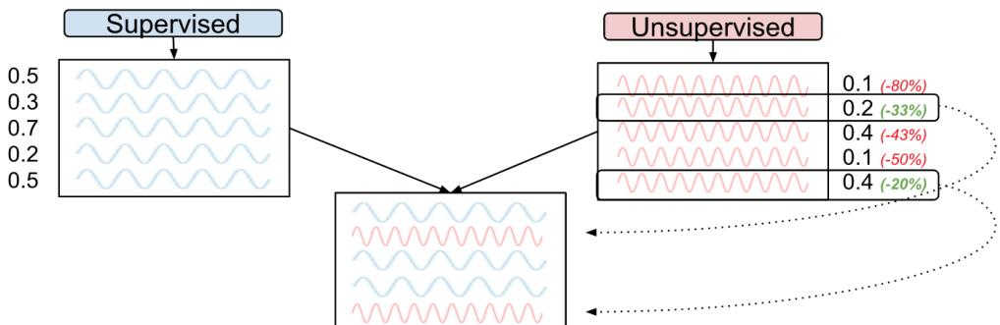

# On Systematic Style Differences between Unsupervised and Supervised MT and an Application for High-Resource Machine Translation

Kelly Marchisio∗ Johns Hopkins University kmarc@jhu.edu

Markus Freitag David Grangier Google Research {freitag, grangier}@google.com

## Abstract

Modern unsupervised machine translation (MT) systems reach reasonable translation quality under clean and controlled data conditions. As the performance gap between supervised and unsupervised MT narrows, it is interesting to ask whether the different training methods result in systematically different output beyond what is visible via quality metrics like adequacy or BLEU. We compare translations from supervised and unsupervised MT systems of similar quality, finding that unsupervised output is more fluent and more structurally different in comparison to human translation than is supervised MT. We then demonstrate a way to combine the benefits of both methods into a single system which results in improved adequacy and fluency as rated by human evaluators. Our results open the door to interesting discussions about how supervised and unsupervised MT might be different yet mutually-beneficial.

## 1 Introduction

Supervised machine translation (MT) utilizes parallel bitext to learn to translate. Ideally, this data consists of natural texts and their human translations. In a way, the goal of supervised MT training is to produce a machine that mimicks human translators in their craft. Unsupervised MT, on the other hand, uses monolingual data alone to learn to translate. Critically, unsupervised MT never sees an example ofhuman translation, and therefore must create its own style oftranslation. Unlike supervised MT where one side of each training sentence pair must be a translation, unsupervised MT can be trained with natural text alone.

In this work, we investigate the output of supervised and unsupervised MT systems of similar quality to assess whether systematic differences in translation exist. Our exploration of this research area focuses on English German for which abundant bilingual training examples exist, allowing us to train high-quality systems with both supervised and unsupervised training.

Our main contributions are:

• We observe systematic differences between the output of supervised and unsupervised MT systems of similar quality. High-quality unsupervised output appears more natural, and more structurally diverse when compared to human translation.

• We show a way to incorporate unsupervised back-translation into a standard supervised MT system, improving adequacy, naturalness, and fluency as measured by human evaluation.

Our results provoke interesting questions about what unsupervised methods might contribute beyond the traditional context of low-resource languages which lack bilingual training data, and suggest that unsupervised MT might have contributions to make for high-resource scenarios as well. It is worth exploring how combining supervised and unsupervised setups might contribute to a system better than either creates alone.

We discuss related work in §2. In §3, we introduce the dataset, model details, and evaluation setups. In §4, we characterize the differences between the output of unsupervised and supervised neural MT systems of similar quality. In §5, we demonstrate a combined system which benefits from the complementary strengths of the two methods. We summarize the paper in §6.

## 2 Related Work

Unsupervised MT Two paradigms for unsupervised MT are finding a linear transformation to align two monolingual embedding spaces (Lample et al., 2018a,b; Conneau et al., 2018; Artetxe et al., 2018, 2019), and pretraining a bi-/multilingual language model then finetuning on a translation task (Conneau and Lample, 2019; Song et al., 2019; Liu et al., 2020). We study the Masked Sequenceto-Sequence Pretraining (MASS) language model pretraining paradigm of Song et al. (2019). MASS is an encoder-decoder trained jointly with a masked language modeling objective on monolingual data. Iterative back-translation (BT) follows pretraining.

Monolingual Data in MT BT is widely-used to exploit monolingual data (Sennrich et al., 2016). “Semi-supervised” systems use monolingual and parallel data to improve performance (e.g. Artetxe et al. (2018)). Siddhant et al. (2020) combine multilingual supervised training with MASS for many languages and zero-shot translation.

Source Artifacts in Translated Text Because supervised MT is trained ideally on human-generated translation, characteristics of human translation affects the style of machine translation from such systems. Dubbed “translationese,” human translation includes source language artifacts (Koppel and Ordan, 2011) and source-independent artifacts— Translation Universals (Mauranen and Kujamäki, 2004). There are systematic biases inherent to translated texts (Baker, 1993; Selinker, 1972), and biases coming from interference from source text (Toury, 1995). In MT, Freitag et al. (2019, 2020) attribute these patterns as a source of mismatch between BLEU (Papineni et al., 2002) and human evaluation measures of quality, raising concerns that overlap-based metrics reward hypotheses with the characteristics of translated text more than those with natural language. Vanmassenhove et al. (2019, 2021) note loss of linguistic diversity and richness from MT, and Toral (2019) see related effects even after human post-editing. The impact of translated text on human evaluation has also been studied (Toral et al., 2018; Zhang and Toral, 2019; Graham et al., 2019; Fomicheva and Specia, 2016; Ma et al., 2017), as has the impact in training data (Kurokawa et al., 2009; Lembersky et al., 2012; Bogoychev and Sennrich, 2019; Riley et al., 2020).

Measuring Word Reordering Word reordering models are well-studied because they formed a critical part of statistical MT (see Bisazza and Federico (2016) for a review). Others examined metrics for measuring reordering in translation (e.g. Birch et al., 2008, 2009, 2010). Wellington et al. (2006) and Fox (2002) use part-of-speech (POS) tags in the context of parse trees, and Fox (2002) measure the similarity of French and English with respect to phrasal cohesion by calculating alignment crossings using parse trees. Most similar to us, Birch (2011) view simplified word alignments as permutations and compare distance metrics over these to quantify the amount of reordering done. They use TER computed over the alignments as a baseline. Birch and Osborne (2011)’s LRScore interpolates a reordering metric with a lexical translation metric.

## 3 Experimental Setup

## 3.1 Data

Training Experiments are in English German. For the main study comparing supervised and unsupervised MT, we use News Commentary v14 (329,000 sentences) as parallel bitext for the supervised system, and News Crawl 2007-17 as monolingual data for the unsupervised system. Deduplicated News Crawl 2007-17 has 165 million English sentences and 226 million German sentences.

The combined system demonstration at the end of our work utilizes a BT selection method. We use the bilingual training data from WMT2018 (Bojar et al., 2018) (News Commentary v13, Europarl v7, Common Crawl, EU Press Release) so that our model can be compared with well-known work using BT (e.g. Edunov et al., 2018; Caswell et al., 2019). We deduplicate and filter out pairs with > 250 tokens in either language or length ratio over 1.5, resulting in 5.2 million paired sentences.

Development and Test Sets For the main experiments, we use newstest2017 as the dev set with newstest2018 and newstest2019 for test. newstest2018 was originally created by translating one half of the test data from English German (origen) and the other half from German English (origde). Since 2019, WMT produces newstest sets with only source-original text and human translations on the target side to mitigate known issues when translating and evaluating on target-original data (e.g. Koppel and Ordan, 2011; Freitag et al., 2019).

For most experiments, we evaluate on orig-en sentences only to reflect the real use-case for translation and modern evaluation practice. We examine orig-de only for BLEU score as an additional data point of difference between supervised and unsupervised MT. Zhang and Toral (2019) show that target-language-original text should not be used for human evaluation (orig-de, in our case).

We use the newstest2018 “paraphrased” test references from Freitag et al. (2020),1 which are made for orig-en sentences only. These additional references have different structure than the source sentence but maintain semantics, and provide a way to measure system quality without favoring translations with the same structure as the source. Observing work that uses these references, BLEU is typically much lower than on original test sets, and score differences tend to be small but reflect tangible quality difference (Freitag et al., 2020).

For the system combination demonstration, we use newstest2018 for development and newstest2019 for test. We also use newstest2019 German English and swap source and target to make an orig-de English German test set, and use paraphrase references for newtest2019 (orig-en).

Testing on the official newstest2018 in the main experiments allows us to see interesting differences between unsupervised and supervised MT that are hidden with newstest2019 because it is orig-en only. Using newstest2018 for development in the system combination demonstration aligns with similar literature (e.g. Edunov et al., 2018; Caswell et al., 2019). We use SacreBLEU throughout (Post, 2018).2

## 3.2 Part-of-Speech Tagging

We use part-of-speech taggers for some experiments: universal dependencies (UD) implemented in spaCy3 and spaCy’s language-specific finegrained POS tags for German from the TIGER Corpus (Albert et al., 2003; Brants et al., 2004).

## 3.3 Models

Our unsupervised MT model is a MASS transformer with the hyperparameters of Song et al. (2019). We train MASS on the News Crawl corpora, hereafter called “Unsup.” Our supervised MT systems use the transformer-big (Vaswani et al., 2017) as implemented in Lingvo (Shen et al., 2019) with a vocabulary of 32k subword units.

To investigate differences between approaches, we train two language models (LMs) on different types of data and calculate the perplexity of translations generated by the supervised and unsupervised MT systems. We train one LM on the monolingual German News Crawl dataset with a decoder-only transformer, hereafter called the “natural text LM” (nLM). We train another on machine translated sentences which we call the “translated text LM” (tLM). We generate the training corpus by translating the English News Crawl dataset into German with a English German transformer-big model trained on the WMT18 bitext.

## 3.4 Human Evaluations

Human evaluation complements automatic evaluation and abstracts away from comparison to a human reference which favors the characteristics of translated text (Freitag et al., 2020). We score adequacy using direct assessment and run side-byside evaluations measuring fluency and adequacy preference between systems. Each campaign has 1,000 test items. For side-by-side eval, a test item includes a pair of translations of the same source sentence: one from the supervised system and one from the unsupervised. We hire 12 professional translators, who are more reliable than crowd workers (Toral, 2020; Freitag et al., 2021).

Direct Assessment Adequacy We use the template from the WMT 2019 evaluation campaign. Human translators assess a translation by how adequately it expresses the meaning of the source sentence on a 0-100 scale. Unlike WMT, we report the average rating and do not normalize the scores.

Side-by-side Adequacy Raters see a source sentence with two translations (one supervised, one unsupervised) and rate each on a 6-point scale.

Side-by-side Fluency Raters assess the alternative translations (one supervised, one unsupervised) without the source, and rate each on a 6-point scale.

## 4 Unsupervised vs. Supervised MT

The goal of this section is to analyse supervised and unsupervised systems of similar overall translation quality so that differences in quality do not confound analyses. As unsupervised systems underperform supervised systems, we use a smaller parallel corpus (news commentary) to train systems of similar quality. Table 1 summarizes the BLEU scores and human side-by-side adequacy results for both systems. Although the supervised system is below state-of-the-art, these experiments help elucidate how unsupervised and supervised output is different. Overall BLEU and human ratings suggest similar translation quality. Nevertheless, we observe notable differences between orig-de and orig-en sides of the test set when comparing both systems. Recall that orig-de has natural German text on the target side. Unsup scores higher than Sup on orig-de, suggesting that its output is more natural-sounding as it better matches text originally written in German. Performance discrepancies on orig-en and orig-de indicate that differences in system output may exist and prompt further investigation.

<table><tr><td></td><td></td><td>Overall orig-en orig-de</td><td>nt18p</td><td>Human Adq.</td></tr><tr><td>Sup</td><td>29.2</td><td>34.0 21.1</td><td>9.3</td><td>3.89</td></tr><tr><td>Unsup</td><td>30.1</td><td>30.9 27.1</td><td>9.6</td><td>3.82</td></tr></table>

Table 1: SacreBLEU & human adequacy (orig-en) on newstest2018 and newstest2018p (nt18p = paraphrase reference). nt18p is available for orig-en only.

## 4.1 Selecting Translations of Same Adequacy

To assess the translation style and compare linguistic aspects of supervised and unsupervised MT, we further must compare translations that have the same accuracy level on the segment level, so that neither confounds analysis. We use the adequacy evaluation from Table 1 and retain sentences for which both approaches yield similar adequacy scores. We divide the rating scale into bins of low (0–2), medium (3–4), and high (5–6) adequacy. Table 2 shows the percentage of sentences in each bin. For each source sentence, there is one translation by Unsup and one by Sup. If human judges assert that both translations belong in the same adequacy bin, that sentence also appears in “Both.” There are 86, 255, and 218 sentences in “Both” for low, medium, and high bins, respectively. For subsequent analyses, we examine sentences falling into “Both.”

<table><tr><td></td><td>Low</td><td>Medium</td><td>High</td></tr><tr><td>Sup</td><td>18.7%</td><td>42.1%</td><td>39.2%</td></tr><tr><td>Unsup</td><td>19.3%</td><td>44.6%</td><td>36.1%</td></tr><tr><td>Both</td><td>8.6%</td><td>25.5%</td><td>21.8%</td></tr></table>

Table 2: Percentage of sentences with low, medium and high human-evaluated adequacy ratings. “Both” are sentences which have same rating from both systems.

## 4.2 Comparing Translation Style

Measuring Structural Similarity We develop a metric to ascertain the degree of structural similarity between two sentences, regardless of language. When evaluated on a source-translation pair, it measures the influence of the source structure on the structure of the output without penalizing for differing word choice; thus it is a measure of “monotonicity” – the degree to which words are translated in-order. Given alternative translations in the same language, it assesses the degree of structural similarity between the two. Thus given a machine translation and a human translation of the same source sentence, it can measure the structural similarity between the machine and human translations.

Word alignment seems well-suited here. Like Birch (2011), we calculate Kendall’s tau (Kendall,

1938) over alignments of source-translation pairs, but do not simplify alignments to permutations. We use fast\_align (Dyer et al., 2013) but observe that it struggles to align words not on the diagonal, so sometimes skipped alignments.4 Because of this issue, we instead estimate monotonicity/structural similarity using the new metric, introduced next.

We propose measuring translation edit rate (TER, Snover et al. (2006)) over POS tag sequences. TER is a well-known word-level translation quality metric which measures the number of edits required to transform a “hypothesis” sentence into the reference, outputting a “rate” by normalizing by sentence length. Between languages, we compute TER between POS tag sequences of the source text (considered the reference) and the translation (considered the hypothesis), so that TER now measures changes in structure independent of word choice. Source-target POS sequences which can be mapped onto each other with few edits are considered similar—a sign of a monotonic translation. Given a machine translation (hypothesis) and a human reference in the same language, TER over POS tags measures structural similarity between the machine and human translations. Outputs with identical POS patterns score 0, increasing to 1+ as sequences diverge. Lower TER for (source, translation) pairs indicates monotonic translation; Lower TER for (machine translation, human translation) pairs indicates structural similarity to human translation. We call the metric “posTER”.

Monotonicity POS sequences are comparable across languages thanks to universal POS tags. Table 3 has a toy example with two possible German translations of an English source. Next to each sentence is its universal dependencies POS sequence. In the third column, TER is calculated with the POS sequence of the English source as reference and the sequence of the translation as hypothesis.

Table 4 shows posTER over universal dependencies of German translations versus the newstest2018 (orig-en) source sentences. While the standard newstest2018 references (Ref) score 0.410, newstest2018p’s (RefP) higher score of 0.546 reflects the fact that the paraphrase references are designed to have different structure than the source. Difference in overall monotonicity between Sup and Unsup is unapparent at this granularity.

Because universal dependencies are designed to suit many languages, the 17 UD categories may be too broad to adequately distinguish moderate structural difference. Whereas UD has a single class for “VERB,” the finer-grained German TIGER tags distinguish between 8 sub-verb types including infinitive, modal, and imperative. We use these languagespecific categories next to uncover differences between systems that broad categories conceal.

<table><tr><td rowspan=1 colspan=1>Sentence</td><td rowspan=1 colspan=1>POS Sequence</td><td rowspan=1 colspan=1>TER</td></tr><tr><td rowspan=1 colspan=1>I made myself a cup of coffee this morning.</td><td rowspan=1 colspan=1>PRON VERB PRON DET NOUN ADPPNOUN DET NOUN PUNCT</td><td rowspan=1 colspan=1></td></tr><tr><td rowspan=1 colspan=1>Ich habe mir heute Morgen eine TasseKaffee gemacht.</td><td rowspan=1 colspan=1>PRON AUX PRON ADV NOUN DETNOUN NOUN VERB PUNCT</td><td rowspan=1 colspan=1>0.5</td></tr><tr><td rowspan=1 colspan=1>Heute morgen habe ich mir eine TasseKaffee gemacht.</td><td rowspan=1 colspan=1>ADV ADV AUX PRON PRON DETNOUN NOUN VERB PUNCT</td><td rowspan=1 colspan=1>0.7</td></tr></table>

Table 3: posTER over universal dependencies POS sequences for example toy German translations of an English source. Row 1 is the source with its POS tag sequence. Rows 2/3 are example translations with the POS tags of each. posTER is calculated via the POS sequences of the translation (hypothesis) and the source (considered the reference).

<table><tr><td rowspan=1 colspan=1></td><td rowspan=1 colspan=1>nt18</td><td rowspan=1 colspan=1>nt18p</td><td rowspan=1 colspan=1>Sup</td><td rowspan=1 colspan=1>Unsup</td></tr><tr><td rowspan=1 colspan=1>Src</td><td rowspan=1 colspan=1>0.410</td><td rowspan=1 colspan=1>0.546</td><td rowspan=1 colspan=1>0.409</td><td rowspan=1 colspan=1>0.399</td></tr></table>

Table 4: posTER (0-1+) over universal dependencies of translations of newstest2018 (orig-en) vs. the source. = more monotonic translation. nt18p=paraphrase ref.

Similarity to Human Translation Recall that supervised MT essentially mimics human translators, while unsupervised MT learns to translate without examples. Intuitively, supervised MT output might be stylistically more like human translation, even when controlling for quality. The first indication is Sup’s lower BLEU score on nt18p—the paraphrase test set designed to have structure different than the original human translation.

We compare the structure of MT output with the human reference using German TIGER tags. Lower posTER indicates more structural similarity, while higher posTER indicates stylistic deviation from human translation. Comparison with the newstest2018 orig-en human reference is in Table 5. Sup and Unsup show negligible difference overall, but binning by adequacy shows Unsup output as less structurally similar to the human reference on the high-end of adequacy, and more similar on the low-end. This suggests systematic difference between systems, and that unsupervised MT might have more structural diversity as quality improves.

<table><tr><td></td><td>Overall</td><td>Low</td><td>Med</td><td>High</td></tr><tr><td>Sup</td><td>0.280</td><td>0.348</td><td>0.282</td><td>0.255</td></tr><tr><td>Unsup</td><td>0.287</td><td>0.313</td><td>0.298</td><td>0.296</td></tr></table>

Table 5: posTER (0-1+ scale) over TIGER POS tags of system output vs. the human reference, grouped by adequacy (newstest2018, orig-en).  = greater structural similarity to the human reference.

Naturalness The first hint that Unsup might produce more natural output than Sup is its markedly higher BLEU on the orig-de test set: 27.1, versus 21.1 from Sup. Recall that orig-de has natural German on the target side, so higher BLEU here means higher n-gram overlap with natural German.

Edunov et al. (2020) recommend augmenting BLEU-based evaluation with perplexity from a language model (LM) to assess fluency or naturalness of MT output. Perplexity (Jelinek et al., 1977) measures similarity of a text sample to a model’s training data. We contrast the likelihood of output according to two LMs: one trained on machinetranslated text (tLM) and another trained on nontranslated natural text (nLM). While machinetranslated and human-translated text differ, the LMs are nonetheless a valuable heuristic and contribute insights on whether systematic differences between MT system outputs exist. Low perplexity from the nLM indicates natural language. Low perplexity from the tLM (trained on English News Crawl that has been machine-translated into German) shows proximity to training data composed of translated text, indicating simplified language.

Sup perplexity is lower than Unsup across adequacy bins for the tLM, seen in Table 6. Conversely, Sup generally has higher perplexity from the nLM. All adequacy levels for Unsup have similar nLM perplexity, suggesting it is particularly skilled at generating fluent output. Together, these findings suggest that unsupervised MT output is more natural than supervised MT output.

Stronger Supervised MT Though analyzing systems of similar quality is important for head-tohead comparison, we evaluate a stronger supervised system for context.5 We do not have human evaluation scores, but automatic results give insight: see Table 7. The model has overall BLEU = 40.9 and a similarly large discrepancy on orig-en vs. orig-de as did the Sup system used throughout this work: 44.6 for orig-en and 34.9 for orig-de. As for structural similarity, this stronger system has lower overall posTER vs. the human reference—0.238 vs. 0.280/0.287 from Sup/Unsup—indicating even more structural similarity with the reference. For naturalness, the stronger system has lower perplexity from the nLM. As a higher-quality system, this is expected. At the same time, it scores much lower than Sup and Unsup by the tLM, where higher indicates more natural-sounding output: 29.23 vs. 41.06/58.17 for Sup/Unsup.

<table><tr><td rowspan="2"></td><td colspan="3">Natural Text LM ↓</td><td rowspan="2"></td><td colspan="3">Translated Text LM ↑</td></tr><tr><td>Overall</td><td>Low Medium</td><td>High</td><td>Overall</td><td>Low Medium</td><td>High</td></tr><tr><td>Sup</td><td>72.69</td><td>90.61</td><td>76.36</td><td>68.37</td><td>41.06</td><td>51.91</td><td>40.32</td><td>36.70</td></tr><tr><td>Unsup</td><td>67.01</td><td>68.32</td><td>60.56</td><td>69.88</td><td>58.17</td><td>61.50</td><td>53.71</td><td>57.95</td></tr></table>

Table 6: Perplexity of MT output on newstest2018 based on LMs trained on natural text vs. translated text, binned by adequacy. Sup and Unsup are comparable supervised and unsupervised MT systems, respectively. from the Natural Text LM and from the Translated Text LM indicate more natural-sounding output.

<table><tr><td colspan="2">Quality</td><td colspan="2">Structural Sim.</td><td colspan="2">Naturalness</td></tr><tr><td>BLEU</td><td>nt18p</td><td>v. Src</td><td>v. Ref</td><td>nLM</td><td>tLM</td></tr><tr><td>40.9</td><td>12.1</td><td>0.401</td><td>0.238</td><td>54.35</td><td>29.23</td></tr></table>

Table 7: Strong supervised model trained on WMT14. Structural sim. is posTER: v. Src is comparable to Table 4, v. Ref to Overall in Table 5. = more monotonic. nLM/tLM are Natural/Translated Text LMs of Table 6.

Ablation: Architecture vs. Data One reason Unsup might produce more natural-sounding output could be simply that it develops languagemodeling capabilities from natural German alone, whereas Sup must see some translated data (being trained on bitext of human translations). Next, we ask whether the improved naturalness and structural diversity is due to the unsupervised NMT architecture, or simply the natural training data.

We build a supervised en-de MT system with 329,000 paired lines of translated English source and natural German, where the source is backtranslated German News Crawl from a supervised system. In other words, we train on backtranslated data only on the source side and natural German as the target. The model thus develops its languagemodeling capabilities on natural sentences alone. If more natural output is simply a response to training on natural data, then this supervised system should perform as well in naturalness as Unsup, or better.

We train another unsupervised system on translated text only. Source-side training data is synthetic English from translating German News Crawl with a supervised system. Target-side is synthetic German which was machine-translated from English News Crawl. If naturalness solely results from data, this system should perform worst, being trained only on translated (unnatural) text.

Table 8 shows the results. The original unsupervised system (Unsup) performs best according to both LMs, having output that is more natural and less like translated text. When given only natural German to build a language model, the supervised system (Sup En-Trns/De-Orig) still produces more unnatural output than Unsup. Even when the unsupervised system uses translated data only (Unsup-Trns), its output is still more natural than the original supervised system (Sup) according to both LMs. This is a surprising result, and is interesting for future study. Together, these findings suggest that both German-original data and the unsupervised architecture encourage output to sound more natural.

## 5 Application: Leveraging Unsupervised Back-translation

Our results indicate that high-adequacy unsupervised MT output is more natural and more structurally diverse in comparison to human translation, than is supervised MT output. We are thus motivated to use these advantages to improve translation. We explore how to incorporate unsupervised MT into a supervised system via back-translation. We train for 500,000 updates for each experiment, and select models based on validation performance on newstest2018. We test on newstest2019(p).

## 5.1 Baselines

The first row of Table 9 is the supervised baseline trained on the WMT18 bitext. The second row is Unsup, used throughout this work.

We back-translate 24 million randomly-selected sentences of German News Crawl twice: once using a supervised German-English system trained on WMT18 bitext with a transformer-big architecture, and once using Unsup. Both use greedy decoding for efficiency. We augment the WMT18 bitext with either the supervised or unsupervised BT.

Seen in Table 9, adding supervised BT (+SupBT) performs as expected; minorly declining on the source-original test set (orig-en), improving on the target-original set (orig-de), and improving on the paraphrase set (nt19p). Conversely, adding unsupervised BT (+UnsupBT) severely lowers BLEU on source-original and paraphrase test sets. Randomly-partitioning the BT sentences such that 50% are supervised BT and 50% are unsupervised also lowers performance on orig-en (+50-50BT).

<table><tr><td rowspan="2"></td><td colspan="2">LM Perplexity (PPL)</td><td colspan="3">BLEU</td></tr><tr><td>Natural Text LM</td><td>Translated Text LM</td><td>Overall</td><td>orig-en</td><td>orig-de</td></tr><tr><td>Supervised (Sup)</td><td>72.69</td><td>41.06</td><td>29.2</td><td>34.0</td><td>21.1</td></tr><tr><td>Sup En-Trns/De-Örig</td><td>69.75</td><td>50.65</td><td>35.4</td><td>35.5</td><td>34.1</td></tr><tr><td>Unsup</td><td>67.01</td><td>58.17</td><td>30.1</td><td>30.9</td><td>27.1</td></tr><tr><td>Unsup-Trns</td><td>69.88</td><td>48.90</td><td>33.4</td><td>35.4</td><td>28.4</td></tr></table>

Table 8: Comparison of 4 English German MT systems: ppl from LMs trained on natural or translated text, BLEU on newstest2018.  ppl = model prefers the output. Sup En-Trns/De-Orig is supervised, trained on translated English and German-original News Crawl. Unsup is trained on natural English and German News Crawl. Unsup-Trns uses translated News Crawl only. Unsup performs best == more like natural text and less like translated text.

  
Figure 1: Back-translation selection method. Both systems translate the same source sentences. If an unsupervised output sentence is more than T% as likely as the supervised one, select the unsupervised. Here, T=65%.

## 5.2 Tagged BT

Following Caswell et al. (2019), we tag BT on the source-side. Tagging aids supervised BT (+SupBT\_Tag) and greatly improves unsupervised BT (+UnsupBT\_Tag), which outperforms the baseline and is nearly on-par with +SupBT\_Tag. Combining supervised and unsupervised BT using the same tag for both (+50-50BT\_Tag) shows no benefit over +SupBT\_Tag. +50-50BT\_TagDiff uses different tags for supervised vs. unsupervised BT.

## 5.3 Probability-Based BT Selection

We design a BT selection method based on translation probability to exclude unsupervised BT of low quality. We assume that supervised BT is “good enough.” Given translations of the same source sentence (one supervised, one unsupervised) we assert that an unsupervised translation is “good enough” if its translation probability is similar or better than that of the supervised translation. If much lower, the unsupervised output may be low-quality.

• Score each supervised and unsupervised BT with a supervised de-en system.

• Normalize the translation probabilities to con-

trol for translation difficulty and output length.

• Compare probability of the supervised and unsupervised BT of the same source sentence:

$$
\Delta P = \frac { P \mathrm { n o r m ( u n s u p ) } } { P \mathrm { n o r m ( s u p ) } }
$$

• Sort translation pairs by ∆P.

• Select the unsupervised BT for pairs scoring highest ∆P and the supervised BT for the rest.

This filters out unsupervised outputs less than a hyperparameter T% as likely as the corresponding supervised sentence and swaps them with the corresponding supervised sentence. Importantly, the same 24M source sentences are used in all experiments. The procedure is shown in Figure 1.

Full results varying T are in the Appendix for brevity, but we show two example systems in Table 9. The model we call “+MediumMix\_Tag” uses the top 40% of ranked unsupervised BT with the rest supervised (9.4M unsupervised, 14.6M supervised). “+SmallMix\_Tag” uses the top 13% of unsupervised BT (3.1M unsupervised, 20.9M supervised).6 We use the same tag for all BTs. Improvements are modest, but our goal was to demonstrate how one might use unsupervised MT output rather than build a state-of-the-art system.

+SmallMix\_Tag performs better than the previous best on newstest2018p and +MediumMix\_Tag performs highest overall on nt19p. We recall that small differences on paraphrase test sets can signal tangible quality differences (Freitag et al., 2020). Trusting BLEU on nt19p, we use +MediumMix\_Tag as our model for human evaluation.

<table><tr><td></td><td colspan="4">newstest2018</td><td colspan="3">newstest2019</td></tr><tr><td></td><td>Overall</td><td>orig-en</td><td>orig-de</td><td>nt18p</td><td>orig-en</td><td>orig-de</td><td>nt19p</td></tr><tr><td>Supervised Baseline (5.2M)</td><td>41.8</td><td>46.1</td><td>34.3</td><td>12.6</td><td>38.8</td><td>30.4</td><td>11.7</td></tr><tr><td>Unsup (used throughout this work)</td><td>30.1</td><td>30.9</td><td>27.1</td><td>9.6</td><td>24.6</td><td>28.5</td><td>8.8</td></tr><tr><td>Supervised Baseline</td><td></td><td></td><td></td><td></td><td></td><td></td><td></td></tr><tr><td>+ SupBT</td><td>43.4</td><td>43.7</td><td>41.8</td><td>12.5</td><td>37.0</td><td>39.9</td><td>12.0</td></tr><tr><td>+ UnsupBT</td><td>33.3</td><td>33.8</td><td>31.1</td><td>9.9</td><td>27.2</td><td>30.8</td><td>9.5</td></tr><tr><td>+ 50-50BT</td><td>38.0</td><td>36.4</td><td>39.0</td><td>12.9</td><td>29.4</td><td>38.3</td><td>10.0</td></tr><tr><td>+ SupBT_Tag</td><td>44.8</td><td>47.0</td><td>40.7</td><td>13.0</td><td>40.3</td><td>38.2</td><td>12.4</td></tr><tr><td>+ UnsupBT_Tag</td><td>43.3</td><td>46.9</td><td>36.9</td><td>12.9</td><td>39.1</td><td>35.0</td><td>12.2</td></tr><tr><td>+ 50-50BT_Tag</td><td>44.4</td><td>47.1</td><td>39.6</td><td>12.9</td><td>39.4</td><td>38.0</td><td>12.2</td></tr><tr><td>+ 50-50BT_TagDiff</td><td>44.4</td><td>46.8</td><td>40.1</td><td>13.0</td><td>39.9</td><td>37.9</td><td>12.4</td></tr><tr><td>+ SmallMix_Tag</td><td>44.8</td><td>46.8</td><td>40.8</td><td>13.2</td><td>39.8</td><td>38.8</td><td>12.5</td></tr><tr><td>+ MediumMix_Tag</td><td>44.7</td><td>46.8</td><td>40.8</td><td>13.0</td><td>40.1</td><td>38.2</td><td>12.6</td></tr></table>

Table 9: SacreBLEU of supervised baseline plus 24M supervised or unsupervised BTs. +MediumMix\_Tag and +SmallMix\_Tag use the BT selection method of §5.3. +MediumMix\_Tag has 9.4M unsupervised BT and 14.6M supervised BT. +SmallMix\_Tag has 3.1M and 20.9M, respectively. nt18p and nt19p are paraphrase references from Freitag et al. (2020), where small BLEU score changes can indicate tangible quality difference.

One might inquire whether improved performance is due to the simple addition of noise in light of Edunov et al. (2018), who conclude that noising BT improves MT quality. Subsequent work, however, found that benefit is not from the noise itself but rather that noise helps the system distinguish between parallel and synthetic data (Caswell et al., 2019; Marie et al., 2020). Yang et al. (2019) also propose tagging to distinguish synthetic data. With tagging instead of noising, Caswell et al. (2019) outperform Edunov et al. (2018) in 4 of 6 test sets for En-De, furthermore find that noising on top of tagging does not help. They conclude that “tagging and noising are not orthogonal signals but rather different means to the same end.” In light of this, our improved results are likely not due to increased noise but rather to systematic differences between supervised and unsupervised BT.

## 5.4 Human Evaluation

We run human evaluation with professional translators for +MediumMix\_Tag, comparing its output translation of the newstest2019 test set with two baseline models. Table 10 shows that humans prefer the combined system over the baseline outputs.7 Table 11 shows the percentage of sentences judged as “worse than,” “about the same as,” or “better than” the corresponding +SupBT\_Tag output, based on fluency. Raters again prefer the combined system. The improvements are modest, but encouragingly indicate that unsupervised MT may have something to contribute to machine translation, even in high-resource settings.

<table><tr><td></td><td>Adequacy</td></tr><tr><td>+ UnsupBT_Tag</td><td>54.82</td></tr><tr><td>+ SupBT_Tag</td><td>56.13</td></tr><tr><td>+ MediumMix_Tag</td><td>58.62</td></tr></table>

Table 10: Human-eval direct assessment (adequacy) of supervised MT with supplemental back-translation.

<table><tr><td rowspan=1 colspan=1>Better</td><td rowspan=1 colspan=1>Same</td><td rowspan=1 colspan=1>Worse</td></tr><tr><td rowspan=1 colspan=1>51.1%</td><td rowspan=1 colspan=1>3.7%</td><td rowspan=1 colspan=1>45.2%</td></tr></table>

Table 11: Human side-by-side fluency eval. Shown: % of +MediumMix\_Tag sentences judged “worse than,” “about the same,” or “better than” +SupBT\_Tag output.

## 6 Conclusion

Recent unsupervised MT systems can reach reasonable translation quality under clean and controlled data conditions, and could bring alternative translations to language pairs with ample parallel data. We perform the first systematic comparison of supervised and unsupervised MT output from systems of similar quality. We find that systematic differences do exist, and that high-quality unsupervised MT output appears more natural and more structurally diverse when compared to human translation, than does supervised MT output. Our findings indicate that there may be useful differences between supervised and unsupervised MT systems that could contribute to a system better than either achieves alone. As a first step, we demonstrate an unsupervised back-translation augmented model that takes advantage of the differences between the translation methodologies to outperform a traditional supervised system on human-evaluated measures of adequacy and fluency.

## References

Stefanie Albert, Jan Anderssen, Regine Bader, Stephanie Becker, Tobias Bracht, Sabine Brants, Thorsten Brants, Vera Demberg, Stefanie Dipper, Peter Eisenberg, et al. 2003. tiger annotationsschema. Universität des Saarlandes and Universität Stuttgart and Universität Potsdam.

Mikel Artetxe, Gorka Labaka, and Eneko Agirre. 2019. An effective approach to unsupervised machine translation. In Proceedings of the 57th Annual Meeting of the Associationfor Computational Linguistics, pages 194–203, Florence, Italy. Association for Computational Linguistics.

Mikel Artetxe, Gorka Labaka, Eneko Agirre, and Kyunghyun Cho. 2018. Unsupervised neural machine translation. In Proceedings ofthe Sixth International Conference on Learning Representations.

Mona Baker. 1993. Corpus Linguistics and Translation Studies: Implications and Applications. Text and technology: in honour ofJohn Sinclair, pages 233– 252.

Alexandra Birch. 2011. Reordering metrics for statistical machine translation.

Alexandra Birch, Phil Blunsom, and Miles Osborne. 2009. A quantitative analysis of reordering phenomena. In Proceedings ofthe Fourth Workshop on Statistical Machine Translation, pages 197–205.

Alexandra Birch and Miles Osborne. 2011. Reordering metrics for mt. In Proceedings of the 49th Annual Meeting ofthe Associationfor Computational Linguistics: Human Language Technologies, pages 1027–1035.

Alexandra Birch, Miles Osborne, and Phil Blunsom. 2010. Metrics for mt evaluation: evaluating reordering. Machine Translation, 24(1):15–26.

Alexandra Birch, Miles Osborne, and Philipp Koehn. 2008. Predicting success in machine translation. In Proceedings of the 2008 Conference on Empirical Methods in Natural Language Processing, pages 745– 754, Honolulu, Hawaii. Association for Computational Linguistics.

Arianna Bisazza and Marcello Federico. 2016. A survey of word reordering in statistical machine translation: Computational models and language phenomena. Computational linguistics, 42(2):163–205.

Nikolay Bogoychev and Rico Sennrich. 2019. Domain, Translationese and Noise in Synthetic Data for Neural Machine Translation. arXiv preprint arXiv:1911.03362.

Ondˇrej Bojar, Christian Federmann, Mark Fishel, Yvette Graham, Barry Haddow, Matthias Huck, Philipp Koehn, and Christof Monz. 2018. Findings of the 2018 conference on machine translation (wmt18). In Proceedings of the Third Conference on Machine

Translation, Volume 2: Shared Task Papers, pages 272–307, Belgium, Brussels. Association for Computational Linguistics.

Sabine Brants, Stefanie Dipper, Peter Eisenberg, Silvia Hansen-Schirra, Esther König, Wolfgang Lezius, Christian Rohrer, George Smith, and Hans Uszkoreit. 2004. Tiger: Linguistic interpretation of a german corpus. Research on language and computation, 2(4):597–620.

Isaac Caswell, Ciprian Chelba, and David Grangier. 2019. Tagged back-translation. In Proceedings ofthe Fourth Conference on Machine Translation (Volume 1: Research Papers), pages 53–63, Florence, Italy. Association for Computational Linguistics.

Alexis Conneau and Guillaume Lample. 2019. Crosslingual language model pretraining. In Advances in Neural Information Processing Systems, pages 7057– 7067.

Alexis Conneau, Guillaume Lample, Marc’Aurelio Ranzato, Ludovic Denoyer, and Hervé Jégou. 2018. Word translation without parallel data. In 6th International Conference on Learning Representations, ICLR 2018, Vancouver, BC, Canada, April 30 - May 3, 2018, Conference Track Proceedings. OpenReview.net.

Chris Dyer, Victor Chahuneau, and Noah A. Smith. 2013. A simple, fast, and effective reparameterization of IBM model 2. In Proceedings of the 2013 Conference of the North American Chapter of the Association for Computational Linguistics: Human Language Technologies, pages 644–648, Atlanta, Georgia. Association for Computational Linguistics.

Sergey Edunov, Myle Ott, Michael Auli, and David Grangier. 2018. Understanding back-translation at scale. In Proceedings of the 2018 Conference on Empirical Methods in Natural Language Processing, pages 489–500.

Sergey Edunov, Myle Ott, Marc’Aurelio Ranzato, and Michael Auli. 2020. On the evaluation of machine translation systems trained with back-translation. In Proceedings ofthe 58th Annual Meeting ofthe Associationfor Computational Linguistics, pages 2836– 2846.

Marina Fomicheva and Lucia Specia. 2016. Reference bias in monolingual machine translation evaluation. In Proceedings of the 54th Annual Meeting of the Association for Computational Linguistics (Volume 2: Short Papers), pages 77–82, Berlin, Germany. Association for Computational Linguistics.

Heidi Fox. 2002. Phrasal cohesion and statistical machine translation. In Proceedings of the 2002 Conference on Empirical Methods in Natural Language Processing (EMNLP 2002), pages 304–3111. Association for Computational Linguistics.

Markus Freitag, Isaac Caswell, and Scott Roy. 2019. APE at scale and its implications on MT evaluation biases. In Proceedings ofthe Fourth Conference on Machine Translation (Volume 1: Research Papers), pages 34–44, Florence, Italy. Association for Computational Linguistics.

Markus Freitag, George Foster, David Grangier, Viresh Ratnakar, Qijun Tan, and Wolfgang Macherey. 2021. Experts, errors, and context: A large-scale study of human evaluation for machine translation.

Markus Freitag, David Grangier, and Isaac Caswell. 2020. BLEU might be guilty but references are not innocent. In Proceedings of the 2020 Conference on Empirical Methods in Natural Language Processing (EMNLP), pages 61–71, Online. Association for Computational Linguistics.

Yvette Graham, Barry Haddow, and Philipp Koehn. 2019. Translationese in machine translation evaluation.

Fred Jelinek, Robert L Mercer, Lalit R Bahl, and James K Baker. 1977. Perplexity—a measure of the difficulty of speech recognition tasks. The Journal of the Acoustical Society ofAmerica, 62(S1):S63–S63.

Maurice G Kendall. 1938. A new measure of rank correlation. Biometrika, 30(1/2):81–93.

Moshe Koppel and Noam Ordan. 2011. Translationese and its dialects. In Proceedings of the 49th Annual Meeting of the Association for Computational Linguistics: Human Language Technologies - Volume 1, HLT ’11, pages 1318–1326, Stroudsburg, PA, USA. Association for Computational Linguistics.

David Kurokawa, Cyril Goutte, and Pierre Isabelle. 2009. Automatic detection of translated text and its impact on machine translation. In Proceedings of MT-Summit XII, pages 81–88.

Guillaume Lample, Alexis Conneau, Ludovic Denoyer, and Marc’Aurelio Ranzato. 2018a. Unsupervised machine translation using monolingual corpora only. In 6th International Conference on Learning Representations, ICLR 2018, Vancouver, BC, Canada, April 30 - May 3, 2018, Conference Track Proceedings. OpenReview.net.

Guillaume Lample, Myle Ott, Alexis Conneau, Ludovic Denoyer, and Marc’Aurelio Ranzato. 2018b. Phrasebased & neural unsupervised machine translation. CoRR, abs/1804.07755.

Gennadi Lembersky, Noam Ordan, and Shuly Wintner. 2012. Adapting translation models to translationese improves SMT. In Proceedings ofthe 13th Conference of the European Chapter of the Association for Computational Linguistics, EACL ’12, pages 255– 265, Stroudsburg, PA, USA. Association for Computational Linguistics.

Yinhan Liu, Jiatao Gu, Naman Goyal, Xian Li, Sergey Edunov, Marjan Ghazvininejad, Mike Lewis, and Luke Zettlemoyer. 2020. Multilingual denoising pre-training for neural machine translation. arXiv preprint arXiv:2001.08210.

Qingsong Ma, Yvette Graham, Timothy Baldwin, and Qun Liu. 2017. Further investigation into reference bias in monolingual evaluation of machine translation. In Proceedings of the 2017 Conference on Empirical Methods in Natural Language Processing, pages 2476–2485, Copenhagen, Denmark. Association for Computational Linguistics.

Benjamin Marie, Raphael Rubino, and Atsushi Fujita. 2020. Tagged back-translation revisited: Why does it really work? In Proceedings of the 58th Annual Meeting of the Association for Computational Linguistics, pages 5990–5997, Online. Association for Computational Linguistics.

Anna Mauranen and Pekka Kujamäki. 2004. Translation universals: Do they exist?, volume 48. John Benjamins Publishing.

Kishore Papineni, Salim Roukos, Todd Ward, and Wei-Jing Zhu. 2002. Bleu: a method for automatic evaluation of machine translation. In Proceedings of the 40th annual meeting on association for computational linguistics, pages 311–318. Association for Computational Linguistics.

Matt Post. 2018. A call for clarity in reporting BLEU scores. In Proceedings of the Third Conference on Machine Translation: Research Papers, pages 186– 191, Brussels, Belgium. Association for Computational Linguistics.

Parker Riley, Isaac Caswell, Markus Freitag, and David Grangier. 2020. Translationese as a language in “multilingual” NMT. In Proceedings ofthe 58th Annual Meeting of the Association for Computational Linguistics, pages 7737–7746, Online. Association for Computational Linguistics.

Larry Selinker. 1972. Interlanguage. International Review of Applied Linguistics, pages 209–241.

Rico Sennrich, Barry Haddow, and Alexandra Birch. 2016. Improving neural machine translation models with monolingual data. In Proceedings of the 54th Annual Meeting ofthe Associationfor Computational Linguistics (Volume 1: Long Papers), pages 86–96, Berlin, Germany. Association for Computational Linguistics.

Jonathan Shen, Patrick Nguyen, Yonghui Wu, Zhifeng Chen, Mia X. Chen, Ye Jia, Anjuli Kannan, Tara N. Sainath, and Yuan Cao et al. 2019. Lingvo: a Modular and Scalable Framework for Sequence-to-Sequence Modeling. CoRR, abs/1902.08295.

Aditya Siddhant, Ankur Bapna, Yuan Cao, Orhan Firat, Mia Chen, Sneha Kudugunta, Naveen Arivazhagan, and Yonghui Wu. 2020. Leveraging monolingual data with self-supervision for multilingual neural machine translation. arXiv preprint arXiv:2005.04816.

Matthew Snover, Bonnie Dorr, Richard Schwartz, Linnea Micciulla, and John Makhoul. 2006. A study of translation edit rate with targeted human annotation. In Proceedings of association for machine translation in the Americas, 6. Cambridge, MA.

Kaitao Song, Xu Tan, Tao Qin, Jianfeng Lu, and Tie-Yan Liu. 2019. Mass: Masked sequence to sequence pre-training for language generation. In ICML.

Antonio Toral. 2019. Post-editese: an exacerbated translationese. In Proceedings of Machine Translation Summit XVII Volume 1: Research Track, pages 273– 281, Dublin, Ireland. European Association for Machine Translation.

Antonio Toral. 2020. Reassessing Claims of Human Parity and Super-Human Performance in Machine Translation at WMT 2019. arXiv preprint arXiv:2005.05738.

Antonio Toral, Sheila Castilho, Ke Hu, and Andy Way. 2018. Attaining the Unattainable? Reassessing Claims of Human Parity in Neural Machine Translation. In Proceedings ofthe Third Conference on Machine Translation: Research Papers, pages 113–123, Belgium, Brussels. Association for Computational Linguistics.

Gideon Toury. 1995. Descriptive Translation Studies and Beyond. Benjamins translation library. John Benjamins Publishing Company.

Eva Vanmassenhove, Dimitar Shterionov, and Matthew Gwilliam. 2021. Machine translationese: Effects of algorithmic bias on linguistic complexity in machine translation. In Proceedings of the 16th Conference ofthe European Chapter ofthe Associationfor Computational Linguistics: Main Volume, pages 2203– 2213.

Eva Vanmassenhove, Dimitar Shterionov, and Andy Way. 2019. Lost in translation: Loss and decay of linguistic richness in machine translation. In Proceedings ofMachine Translation Summit XVII Volume 1: Research Track, pages 222–232, Dublin, Ireland. European Association for Machine Translation.

Ashish Vaswani, Noam Shazeer, Niki Parmar, Jakob Uszkoreit, Llion Jones, Aidan N Gomez, Ł ukasz Kaiser, and Illia Polosukhin. 2017. Attention is all you need. In I. Guyon, U. V. Luxburg, S. Bengio, H. Wallach, R. Fergus, S. Vishwanathan, and R. Garnett, editors, Advances in Neural Information Processing Systems 30, pages 5998–6008. Curran Associates, Inc.

Benjamin Wellington, Sonjia Waxmonsky, and I. Dan Melamed. 2006. Empirical lower bounds on the complexity of translational equivalence. In Proceedings of the 21st International Conference on Computational Linguistics and 44th Annual Meeting of the Association for Computational Linguistics, pages 977– 984, Sydney, Australia. Association for Computational Linguistics.

Zhen Yang, Wei Chen, Feng Wang, and Bo Xu. 2019. Effectively training neural machine translation models with monolingual data. Neurocomputing, 333:240–247.

Mike Zhang and Antonio Toral. 2019. The effect of translationese in machine translation test sets. CoRR, abs/1906.08069.

<table><tr><td></td><td colspan="4">newstest2018</td><td colspan="4">newstest2019</td></tr><tr><td></td><td colspan="4">Joint Orig-En Orig-De</td><td colspan="4">nt18p Orig-En Orig-De nt19p</td></tr><tr><td>Supervised Baseline (5.2M)</td><td>41.8</td><td>46.1</td><td>34.3</td><td>12.6</td><td>38.8</td><td>30.4</td><td></td><td>11.7</td></tr><tr><td>Unsup (same used throughout this work) Supervised Baseline</td><td>30.1</td><td>30.9</td><td>27.1</td><td>9.6</td><td>24.6</td><td></td><td>28.5</td><td>8.8</td></tr><tr><td>+ SupBT</td><td>43.4</td><td>43.7 33.8</td><td>41.8</td><td>12.5</td><td>37.0</td><td></td><td>39.9</td><td>12.0</td></tr><tr><td>+ UnsupBT</td><td>33.3 38.0</td><td>36.4</td><td>31.1 39.0</td><td>9.9 12.9</td><td></td><td>27.2 29.4</td><td>30.8 38.3</td><td>9.5 10.0</td></tr><tr><td>+ 50-50BT</td><td></td><td></td><td></td><td></td><td></td><td></td><td></td><td></td></tr><tr><td>+ SupBT_Tag</td><td>44.8</td><td>47.0</td><td>40.7</td><td>13.0</td><td>40.3</td><td></td><td>38.2</td><td>12.4</td></tr><tr><td> $+ \mathrm { U n s u p B T _ { - } T a g }$ </td><td>43.3</td><td>46.9</td><td>36.9</td><td>12.9</td><td>39.1</td><td></td><td>35.0</td><td>12.2</td></tr><tr><td> $+ 5 0 { - } 5 \mathrm { 0 B T { \_ } T a g }$ </td><td>44.4</td><td>47.1</td><td>39.6</td><td>12.9</td><td></td><td>39.4</td><td>38.0</td><td>12.2</td></tr><tr><td> $+ 5 0 { - } 5 0 \mathbf { B } \mathrm { T } \_ \mathrm { T a g D i f f }$ </td><td>44.4</td><td>46.8</td><td>40.1</td><td>13.0</td><td></td><td>39.9</td><td>37.9</td><td>12.4</td></tr><tr><td>+ 21.7M Tagged Unsup &amp; 2.3M Sup BT</td><td>44.0</td><td>46.6</td><td>39.3</td><td>13.0</td><td></td><td>39.6</td><td>36.9</td><td>12.3</td></tr><tr><td>+ 17.4M Tagged Unsup &amp; 6.6M Sup BT</td><td>44.0</td><td>46.2</td><td>40.0</td><td>13.0</td><td></td><td>40.0</td><td>37.7</td><td>12.3</td></tr><tr><td>+ 9.4M Tagged Unsup &amp; 14.6M Sup BT (+MediumMix_Tag)</td><td>44.7</td><td>46.8</td><td>40.8</td><td>13.0</td><td></td><td>40.1</td><td>38.2</td><td>12.6</td></tr><tr><td>+ 3.1M Tagged Unsup &amp; 20.9M Sup BT (+SmallMix_Tag)</td><td>44.8</td><td>46.8</td><td>40.8</td><td>13.2</td><td></td><td>39.8</td><td>38.8</td><td>12.5</td></tr><tr><td>+ 1.5M Tagged Unsup &amp; 22.5M Sup BT</td><td>44.8</td><td>47.1</td><td>40.7</td><td>13.2</td><td></td><td>40.0</td><td>38.4</td><td>12.5</td></tr><tr><td>+ 680K Tagged Unsup &amp; 23.3M Sup BT</td><td>44.4</td><td>46.4</td><td>40.7</td><td>12.9</td><td></td><td>40.0</td><td>38.1</td><td>12.4</td></tr></table>

Table 12: SacreBLEU of supervised baseline plus 24M supervised or unsupervised BTs. Systems using both use the BT selection method of §5.3 with increasing values for hyperparameter T. nt18p and nt19p are paraphrase references from Freitag et al. (2020), where small BLEU score changes can indicate tangible quality difference.