# On the Economics of Multilingual Few-shot Learning: Modeling the Cost-Performance Trade-offs of Machine Translated and Manual Data

Kabir Ahuja1 Monojit Choudhury2 Sandipan Dandapat2

1 Microsoft Research, India

2 Microsoft IDC

{t-kabirahuja,monojitc,sadandap}@microsoft.com

## Abstract

Borrowing ideas from Productionfunctions in micro-economics, in this paper we introduce a framework to systematically evaluate the performance and cost trade-offs between machinetranslated and manually-created labelled data for task-specific fine-tuning of massively multilingual language models. We illustrate the effectiveness of our framework through a casestudy on the TyDIQA-GoldP dataset. One of the interesting conclusions of the study is that if the cost of machine translation is greater than zero, the optimal performance at least cost is always achieved with at least some or only manually-created data. To our knowledge, this is the first attempt towards extending the concept of production functions to study data collection strategies for training multilingual models, and can serve as a valuable tool for other similar cost vs data trade-offs in NLP.

## 1 Introduction

Transformer based Massively Multilingual Language Models (MMLMs) such as mBERT (Devlin et al., 2019) , XLM-RoBERTa (Conneau et al., 2020) and mT5 (Xue et al., 2021) are surprisingly effective at zero-shot cross-lingual transfer (Pires et al., 2019; Wu and Dredze, 2019). However, while zero-shot transfer is effective, often the performances across different languages is not consistent. Low-resource languages (Wu and Dredze, 2020) and the languages that are typologically distant from the pivot language (Lauscher et al., 2020) are known to benefit the least from zero-shot transfer, which can often be mitigated by using targetlanguage specific labelled data for the task during fine-tuning.

One common approach for collecting such data in the target language is to translate the training data available for the pivot-language to the target by using an off-the-shelf Machine Translation (MT) system. This is usually referred to as the translatetrain setup (Hu et al., 2020; Turc et al., 2021).

Few-shot transfer is another alternative; as shown by Lauscher et al. (2020), a few labelled examples in the target language, that can be obtained cheaply, can lead to substantial improvements over the zeroshot performance.

However, there has not been much work on comparing the performance across these two strategies. In one such study, Hu et al. (2020) compare the performance of translate-train with few-shot transfer on TyDIQA-GoldP (Clark et al., 2020) dataset, but they only evaluate the few-shot case with 1000 examples, which does not provide any insight into how the performance varies with increasing dataset sizes for these two approaches. Additionally, there are trade-offs related to the data acquisition costs as well. The cost per training instance is expected to be much smaller for an MT-based approach than manual translation or labeling of examples. However, depending on the nature of task, language, and quality of the MT output, the amount of data required to achieve the same performance through these two approaches can be drastically different. More importantly, fine-tuning the MMLMs with a combination of the data from the two strategies could be the cheapest alternative for achieving a target accuracy, which, to the best of our knowledge, has not been explored yet.

Inspired by the above observations and gaps, in this paper, we ask the following question: Given a pre-determined budget to fine-tune a multilingual model on a task for which some data is available in a pivot language, what is the best achievable accuracy on a target language by (a) training the model on the pivot-language data, (b) different amounts of machine-translated and (c) manually-collected data in the target language. Solving this requires an understanding of the exact nature of the performance and cost trade-offs between the two kinds of target language datasets and their relative costs of acquisition, apart from factors such as the amount of pivot language data, the task, the MMLM, and the languages concerned.

This problem of modeling and measuring the trade-offs between different input factors and their costs is well-studied in the field of microeconomics. A sophisticated machinery has been developed in the form of Production Functions and allied analytical methods (Miller and Blair, 2009; Cobb and Douglas, 1928), in order to solve the following generic problem: with the best available technology, how are the inputs to a production process (eg. Labor and Capital) related to its output, that is the quantity of goods produced. In this paper, we adapt this framework to address the aforementioned question of MMLM fine-tuning trade-offs.

The key contributions of our work are threefold. 1. We extend the idea of production functions to performancefunctions that model the relationship between input data sizes and performance of a system; we propose a possible analytical form for this function and derive the performance trends and optimal data collection strategies under fixed costs. 2. We illustrate the usefulness of this framework through a case study on a Q&A task – TyDIQA– GoldP (Clark et al., 2020) and systematically study the various trade-offs for 8 languages. 3. Our study provides several important insights such as (a) if the cost of MT data creation is non-zero, then the optimal performance under a fixed budget is always achieved with either only manually-created data or a combination of the two; (b) the ratio of the two datasets for the least cost combination usually remains constant at different levels of performance.

To the best of our knowledge, this is the first work that applies the idea of production functions to analyze the cost-performance trade-offs of MMLM fine-tuning. The proposed framework can be extended to a multitude of NLP problems where the trade-offs similar to the ones discussed above, are common (e.g., pre-training vs. fine-tuning data). To encourage reproducible research, we have made our code, the performance data, and a detailed list of the results publicly available 1.

## 2 Theoretical Foundations

One of the foundational pillars of neoclassical economics is the idea of Production Functions. Simply put, a production function is a mathematical formalization of the relationship between the output of a firm (industry, economy) and the inputs that have been used in obtaining it (Khatskevich and

Pranevich, 2018; Miller and Blair, 2009). A multifactor production function is defined as a map

$$
Q : \mathbf { x } \to f ( \mathbf { x } ) , \quad \forall \mathbf { x } \in \mathbb { R } ^ { + n }\tag{1}
$$

where $Q ~ \in ~ \mathbb { R } ^ { + }$ is the quantity of output, n is the number of the inputs, the non-negative function $f$ is continuously differentiable for all ${ \textbf { x } } =$ $( x _ { 1 } , \ldots , x _ { n } )$ when $x _ { i } \in \mathbb { R } ^ { + }$ . A sophisticated and extensive set of analytical machinery has been developed over the years in microeconomics theory that allows one to closely model and analyze not only the relationship between the inputs and out-$\mathrm { p u t s } ^ { 2 }$ of a firm, but also the interdependence between the inputs $( \mathrm { i } . { \mathrm { e } } . , \ x _ { i } { \mathrm { s } } )$ Thus, one can efficiently compute and clearly visualize the various trade-offs and optimal configurations of the production system.

Production functions have been extensively used to model and study systems as diverse as education (Bettinger et al., 2020; Bowles, 1970), environment (Lu et al., 2019; Halicioglu and Ketenci, 2018), sustainability (Yankovyi et al., 2021), cognition (Todd and Wolpin, 2003) and of course, different types of industries (Husain et al., 2016; Batiese, 1992). Along similar lines, in this work we develop the concept of Performance Function that models the performance of an MMLM given the amount of translated and manually labeled data. In this section, we begin by formalizing the notations and defining some key concepts from microeconomics, appropriately adapted to our context. Then we present the functional form of the performance function, and discuss certain practical constraints and assumptions that we will make in our formulation.

## 2.1 Notation and Definitions

Consider a multilingual model  pre-trained on a set of languages ${ \mathcal { L } } ,$ which is to be fine-tuned for a task T, for which P labelled examples are available in a pivot language $p \in { \mathcal { L } }$ . Some or all of the $P$ pivot language examples can be automatically translated to a target language $l \in \mathcal L$ through an MT system to obtain $T ( \leq P )$ examples. Further, let M be the amount of examples for l that have been labelled or translated manually.

Definition 1 Performance Function, Π = $\pi ( T , M | l , p , P , \mathcal { M } , \mathfrak { T } )$ , denotes the best possible performance (as per the current state-of-the-art) of a system in language lfor a task ${ \mathfrak { T } } ,$ that has been built on top ofa pre-trained MMLM , P labelled examples in language $p \neq l , T$ translated examples by an MT system, and M manually created examples.

Here, $\Pi \in [ 0 , 1 ]$ is any appropriate and accepted measure of performance, such as accuracy or F1- score. To simplify the notation we will often drop the given conditions from the equation and denote $\Pi = \pi ( T , M )$ . The conditional factors, whenever not obvious from the context, will be explicitly stated. Note that $T$ and M are respective equivalents of K and $L$ of the neoclassical Capital-Labor production functions. Capital investment in technology or mechanization is similar to machinetranslated data, whereas manual dataset creation would require investment on labor.

Definition 2 Total cost of operation (or simply the cost), $\kappa ( T , M ) = \kappa _ { t } ( T ) + \kappa _ { m } ( M )$ , is the total cost of procuring translated and manually created datasetsfor l for the task T.

We further assume that the translation and manual collection costs are scalar multiples of the unit costs, i.e. $\kappa _ { t } ( T ) ~ = ~ c _ { t } T$ and $\kappa _ { m } ( M ) = c _ { m } M _ { }$ where $c _ { t } > 0$ is the cost of translating a single example from $P$ into language l automatically, while $c _ { m } > 0$ is the cost of collecting one training example in l manually. Therefore,

$$
C = \kappa ( T , M ) = c _ { t } T + c _ { m } M\tag{2}
$$

Usually, $c _ { m } > c _ { t }$ . Also, note that we are ignoring the costs of pivot data collection and computational costs of pre-training and fine-tuning, partly because we are interested in studying the tradeoff between $T$ and M. Also, P is useful for any target language, and therefore, the amortized cost of creating $P$ tends to zero as the number of target languages increases. Similarly the amortized cost of pre-training tends to zero as the number of tasks grows. The task-specific training cost is proportional to training data-size, $P + T + M$ , and therefore, can be partially consumed in ct and $c _ { m }$

Definition 3 Isoperf curves are the contours of the performance function that represent the relationship between T and M for afixed performance value $\Pi _ { c } .$

Definition 4 Isocost curves are the contours ofthe cost function that represent the different possible combinations ofT and M that result in equal overall costs.

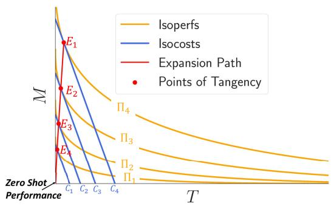  
Figure 1: Hypothetical T-M diagram illustrating isoperfs, isocosts, points oftangency and expansion path.

Both isoperfs and isocosts are drawn on a T-M diagram (K-L diagram in micro-economics), which is illustrated in Fig. 1. The x and y axis represent the input factors T and M, respectively. The orange curves are the hypothetical isoperfs, known as isoquants in economics. As the name suggests, each point on these curves represents T-M combinations that result in the same (iso) performance (perf), denoted in the diagram by $\Pi _ { 1 } , \Pi _ { 2 }$ , etc. Intuitively, it can be seen that two isoperfs never intersect; as we move towards right and up, Π increases because either $T$ or M or both increase. Thus, $\Pi _ { 1 } < \Pi _ { 2 } < \Pi _ { 3 } < \Pi _ { 4 }$ . The origin, $T = 0 , M = 0 ,$ represents an isoperf corresponding to the zero-shot performance on l when is fine-tuned only on $P .$

The blue lines represent the isocosts. Considering the nature of the cost function defined, the isocost curves will be straight lines parallel to each other with slope $- \frac { c _ { t } } { c _ { m } }$ . Like isoperfs, the cost of operation increases for the isocosts as we move towards right and top in the T-M diagram.

Definition 5 Least Cost Operating Point on an isoperf refers to the (possibly multiple) point where the total cost of operation is lowest for a given performance.

Under the assumption of smooth and convex isop-$\mathrm { e r f s } , { ^ 3 }$ the isocost corresponding to the least cost of operation will be a tangent to the isoperf, and the optimal allocation of the T and M is given by the point of tangency. The isocosts shown in Fig. 1 correspond to the least cost curves for respective isoperfs, and the points of tangency are represented by the points E1, E2, etc.

Definition 6 Expansion path is a path connecting the point of tangency of different isoperf and isocost curves, tracing out the cost minimizing combination ofthe data resources with increasing performance and costs.

Expansion paths are important in determining resource allocations strategies. For instance, when a higher budget is available for dataset expansion in a particular language, should one invest more in translation or in manually collected data? And how does this equation change in the long run, as the system moves towards higher performances?

Thus, isoperfs and isocosts when studied collectively can help determine the allocation of the amount of translation and manual data for a desirable performance value that minimizes the cost of operation.

## 2.2 Selecting a Functional Form for π

In production analysis, one of the difficult problems is to decide on the functional form of the production function that can on one hand accurately represent the input-output relationship, and on the other, is amenable to close-formed analysis (Griffin et al., 1987). Clearly, a linear production function would be an inappropriate choice for $\pi ( T , M )$ , as T and M are not perfect substitutes of each other. A popular choice in such case is the Cobb-Douglas performance function (Cobb and Douglas, 1928), which is of the form $T ^ { \alpha } M ^ { \beta }$ . However, the two datasets do not have multiplicative, but rather an additive effect. Therefore, we propose the following performance function:

$$
\Pi = \pi ( T , M ) = a _ { z s } + a _ { t } T ^ { \alpha _ { t } } + a _ { m } M ^ { \alpha _ { m } }\tag{3}
$$

where $a _ { z s } , a _ { t } , a _ { m } \geq 0$ and $0 \leq \alpha _ { t } , \alpha _ { m } \leq 1$ . The positive coefficients of the input factors are motivated by assuming that under a reasonable translation and manual annotation quality, the addition of data from these sources should not hurt the zeroshot performance which is given by $a _ { z s }$ (when $T = M = 0 )$ . Bounding the exponents below 1 ensures that the performance is not allowed to increase linearly with increasing data in one of these sources, as we always see diminishing returns with respect to data for any machine learning model.

The commonly used training setups can be obtained as special cases of the above equation. The translate-train setup, can be obtained by setting $T = P$ and $M = 0$ in the equation, giving $\Pi _ { T T } =$ $a _ { z s } + a _ { t } P ^ { \alpha _ { t } }$ . Similarly, $\Pi _ { F S } = a _ { z s } + a _ { m } k ^ { \alpha _ { m } }$ gives the few-shot setup with k examples. We denote this functional form as AMUE (Additive Model with Unequal Elasticities).

The expression for tangency point can be derived by setting $d M / d T | _ { \mathrm { I I = } \Pi } ,$ c to the slope of the isocost, $- c _ { t } / c _ { m }$ , which gives the following equation for the expansion path.

$$
M = \left( \frac { c _ { t } a _ { m } \alpha _ { m } } { c _ { m } a _ { t } \alpha _ { t } } \right) ^ { \frac { 1 } { 1 - \alpha _ { m } } } T ^ { \frac { 1 - \alpha _ { t } } { 1 - \alpha _ { m } } }\tag{4}
$$

Thus, $M / T$ (also called the labor-to-capital ratio) increases with performance if $\alpha _ { m } > \alpha _ { t } ,$ remains fixed when $\alpha _ { m } = \alpha _ { t }$ , and decreases with performance when $\alpha _ { m } < \alpha _ { t }$ . Similarly, the ratio of costs of acquiring manually created data to translated data, $M c _ { m } / T c _ { t }$ is proportional to $a _ { m } M ^ { \alpha _ { m } } / a _ { t } T ^ { \alpha _ { t } }$ which is the ratio of the contributions of the two datasets to the performance Π.

More often than not, actual production systems are too complex to be modeled accurately with simple functional forms. We expect a similar situation, where AMUE might be well suited for modeling and visualizing the trends. However, to obtain the actual operating cost and expansion path that are practically useful, one would need to model the behavior of the performance function more accurately. To this end, we also experiment with Gaussian Process Regression (GPR) for defining the performance function. As we shall see in the next section, GPR is able to fit the data more effectively, though we shall stick to AMUE as the two show identical trends and the latter also allows us to gain deeper insights and richer visualizations.

## 2.3 Some Practical Considerations

Definition 7 Cost Ratio, defined as $\textstyle { c _ { t / m } = { \frac { c _ { t } } { c _ { m } } } }$ is the relative cheapness of the translation data, when compared to the cost ofobtaining a manually created data point.

We expect the cost ratio to be much smaller than 1. However, both translation and manual annotation costs vary according to the complexity (in case of translation, just the lengths of sentences) of the task at hand. $c _ { m }$ might also vary with the choice of the target language l, while $c _ { t }$ can be assumed to be uniform across the languages supported by the commercial MT systems like Google or Bing. In the experiments for our case study, we calculate the expansion paths for different values of $c _ { t / m }$ to systematically study the nature of the trade-offs between the two sources of data.

Realizable region: The forms of the performance function as well as cost function defined above do not place any constraint on the values that the input factors, i.e. T and M, can take, which means that the amount of data can be increased indefinitely in order to improve the performance. However, we are aware that the amount of translated data is upper bounded by the amount of pivot data available, i.e. $T \leq P$ . While this constraint can be explicitly worked out into the equations (by replacing T with min(T, P)), we stick to the original forms to preserve the smoothness of AMUE . Instead, we define a realizable region ${ \mathcal { R } } : T \leq P $ , and if a tangency point lies outside  we explicitly search for the minimum cost point on the part of the isoperf curve that lies in the realizable region. Note that, in such cases the isocost curves corresponding to the minimum cost point will no longer be tangents to the corresponding isoperfs, and will usually lie at the boundary between the realizable and non-realizable regions.

## 3 Case-Study on TyDiQA-GoldP

In order to understand the efficacy of the proposed framework, we conduct a case-study on a popular multilingual Question Answering task (cf. T) using TyDiQA-GoldP (Clark et al., 2020) dataset and consider mBERT as the MMLM . In the following subsections, we provide the details of the task and training setup for generating the performance Π for different combination of the input factors, the procedure for estimating the parameters of the performance functions, and the findings.

## 3.1 Task and Dataset

We consider the Minimum Answer Span Task from the Typologically Diverse Question Answering benchmark or TyDiQA-GoldP for conducting the experiments. The choice of this particular dataset stems from two main properties of the benchmark. First, question-answering tasks are amenable to translation. Secondly, TyDiQA-GoldP is comprised of manually labelled datasets for nine typologically diverse languages. This enables us to study the effect of different amounts of manuallycreated data M on the performance of the MMLM.

The amount of M varies significantly from language to language with 1.6k examples for Korean to 15k examples in Arabic. 3.7k examples are available for English which we shall consider as the pivot language p in all the experiments. We use Azure Translator4 to obtain the translated data T in eight target languages. The answer span alignment between English and the translated languages are obtained based on the technique described in Hu et al. (2020). We measure the performance Π as the average F1-score between the predicted and actual answer-spans for the test examples.

## 3.2 Fine-tuning Setup

We fine-tune mBERT on the TyDiQA-GoldP dataset with different values of the input factors, T and M, for each target language, along with the amount of English pivot data, P. Different values of $T$ are chosen by translating 0%, 10%, 40% , 70% or 100% of the English pivot data. Eleven different values in the range $\left[ 0 , \left| \mathcal { D } \right| \right] \left( \mathcal { D } _ { l } \right)$ is the size of the available training data in l) and seven values between 0 and 3.7k are selected for M and P, respectively. Considering eight different target languages, this results in 3080 different fine-tuning configurations. In each configuration, we use 3 different random seeds and train for 5 epochs with a learning rate of 2e-5 and a batch size of 32. The models are also jointly trained5. We use XTREME repository (Hu et al., 2020) and the Hugging Face Transformer Library (Wolf et al., 2020) to conduct all our experiments.

## 3.3 Parameter Estimation of the Performance Function

Upon estimating the performance values for the various fine-tuning configurations, we formulate the parameter estimation for the performance functions π as a regression task, with T and M as inputs and Π as the output. we use a Non Linear Least Squares algorithm (Levenberg, 1944) to fit the AMUE functional form (cf. Equation (5)), while specifying the bounds on the function parameters. For GPR, we use an RBF Kernel added with a White Kernel to model the noise in the observations, and the kernel parameters are optimized using L-BFGS-B optimization algorithm (Byrd et al., 1995) with 10 restarts. Note that, we fit different performance functions for each combination of l and P. Additionally, we also conducted several experiments with other functional forms including Cobb-Douglas, linear, log-linear and polynomial functions ( > 1 degree) which either showed higher margins of error or over-fitting.

<table><tr><td>l</td><td> $a _ { t }$ </td><td> $\alpha _ { t }$ </td><td> $a _ { m }$ </td><td> $\alpha _ { m }$ </td></tr><tr><td></td><td colspan="3">P = 3696</td></tr><tr><td>ar bn</td><td>3.7e-01 5.8e-04</td><td>1.9e-07 6.9e-01</td><td> $2 . 0 \mathrm { e } { + } 0 0$   $2 . 3 \mathrm { e } + 0 0$ </td><td>2.2e-01 3.0e-01 3.0e-01</td></tr><tr><td>fi id ko</td><td>7.4e-02 2.5e-13 2.6e-15</td><td>3.9e-01 2.5e-01 2.1e-03</td><td> $1 . 2 \mathrm { e } { + } 0 0$  1.2e+00 1.5e+00  $7 . 1 \mathrm { e } \mathrm { - } 0 1$ </td><td>2.9e-01 2.6e-01 3.5e-01</td></tr><tr><td>ru SW te</td><td>7.8e-13 5.2e-02 5.1e-19</td><td>5.6e-01 4.2e-01 2.5e-01</td><td>1.1e+00 1.2e+01</td><td>3.7e-01 1.5e-01</td></tr><tr><td>ar 1.7e-01</td><td></td><td>P = 2000 2.9e-01 1.2e-01</td><td>2.9e+00 1.9e+00</td><td>2.1e-01 3.4e-01 1.6e+00 3.0e-01</td></tr></table>

Table 1: Values of AMUE performance function parameters for different languages.

## 3.4 Results

First, we evaluate how well the two proposed performance functions are able to predict the performance for different fine-tuning configurations. For this, we split the 3080 different training configurations into training (80%) and test (20%) sets. The test root mean squared error (RMSE) and coefficient of determination $( r ^ { 2 } )$ values for AMUE and GPR were found to be 5.84, 0.90 and 2.43, 0.98 respectively. Thus, both the models can fit the data reasonably well, though as expected, GPR provides a better fit. Check Appendix for more details.

Expansion Paths: Table 1 shows the estimated values of the AMUE parameters for different languages and pivot sizes. For all the languages, $a _ { m }$ is greater than $a _ { t }$ by at least an order of magnitude, meaning that the manually collected data ends up having a significantly higher contribution towards the model’s performance. For $P \ = \ 2 0 0 0$ , we see comparatively higher values of $a _ { t }$ (though still $< a _ { m } )$ . This indicates that the machine-translated data might be more beneficial when there is a paucity of training data available in the pivot language, and thus a lower zero-shot performance to begin with.

For P = 3696, Arabic, Indonesian and Korean has $\alpha _ { m } ~ > ~ \alpha _ { t }$ and therefore, the corresponding expansion curves (Eqn 4) will have an increasing $M / T$ ratio with increasing Π. On the other hand for Swahili, Telugu and Finnish, $\alpha _ { m } < \alpha _ { t }$ , and hence the expansion curves will bend towards the x-axis in the T-M diagram, indicating a declining $M / T$ ratio. In such cases, as we continue to increase the performance at the minimum cost, the optimum strategy would be to collect higher and higher amount of translation data as compared to manually labelled data.

However, notice that the $\alpha _ { m }$ and $\alpha _ { t }$ are close to each other for majority of the cases resulting in nearly linear expansion paths, a situation that is often encountered in economics whenever the production function is homogenous. We did not start with a homogenity assumption on $\pi ( M , T ) ;$ rather, the estimated parameters indicate so. This has two interesting implications: 1) M/T remains nearly uniform at the different levels of performance; 2) the slope of the expansion path is approximately $\Big ( \frac { c _ { t } a _ { m } } { c _ { m } a _ { t } } \Big ) ^ { \frac { 1 } { 1 - \alpha _ { m } } }$ (by setting $\alpha _ { m } = \alpha _ { t }$ in Eqn 4), meaning if the cost ratio $\frac { c _ { t } } { c _ { m } }$ is greater than $\frac { a _ { t } } { a _ { m } }$ , the optimal strategy would be to collect more manually labelled data (since $\frac { 1 } { 1 - \alpha _ { m } } > 1$ by definition) and vice-versa. Thus, by just looking at the value of these parameters we can gain key insights about the optimal data allocation strategies.

These strategic insights can also be clearly visualized through the isoperf, isocost and expansion path curves on the T-M diagrams, as shown in Fig. 2. Due to paucity of space, we show the diagrams for two languages – Swahili (sw) and Telugu (te) – with two different cost ratios for the former (Fig. 2a and 2b), and two different pivot sizes for the latter (Fig. 2c and 2d). Refer appendix (6,7, 8, 9) for rest.

For $c _ { t / m } ~ = ~ 0 . 1$ , l =sw (Fig. 2a), the expansion path follows a straight line roughly with a slope $\left( \frac { c _ { t } a _ { m } } { c _ { m } a _ { t } } \right) ^ { \frac { 1 } { 1 - \alpha _ { m } } } = 3 . 2$ . This indicates that even though M is 10 times more expensive than $T ,$ the optimal allocation policy is to still collect about thrice as much amount of M as T. However, for $c _ { t / m } = 0 . 0 1$ , which is less than $\frac { a _ { t } } { a _ { m } }$ , the slope of the expansion path drops to $\approx 0 . 0 8$ , as demonstrated by the theoretical expansion path on the right side of the M = T line in Fig. 2b. This suggests that we can rely on collecting a higher amount of translation data to increase the performance in this case because the manually collected data is much more expensive. As we move to the performance values $> 7 0$ , we reach at the boundary of the realizable region (marked by translucent gray rectangle), and can no longer keep on collecting more translation data to increase the performance as by definition $T \leq P$ . Beyond this point, to increase the performance, collecting higher amounts of manual data becomes inevitable.

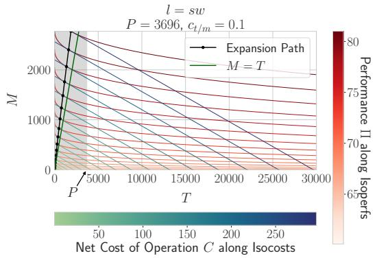

(a)  
  
(c)

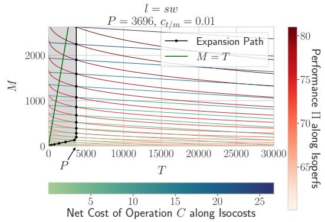

(b)  
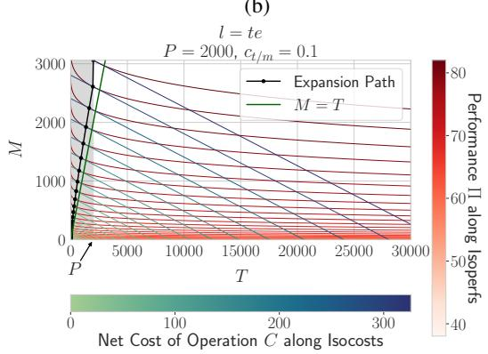  
(d)  
Figure 2: M-T diagrams showing expansion paths obtained through AMUE for Swahili and Telugu for different values of P and $c _ { t / m }$ . The shaded region represents  (cf. Sec.2.3).

For Telugu, we study the effect of two different values of P and keep $c _ { t / m }$ fixed at 0.1. At $P = 3 6 9 6$ , the isoperfs are nearly parallel to xaxis with the expansion path lying along the line $T = 0$ (Fig. 2c), which is expected as $\begin{array} { r } { \frac { a _ { t } } { a _ { m } } \approx 0 } \end{array}$ in this case (see Table 1). This particular expansion path indicates that data obtained by translating English examples into Telugu does not have any notable performance improvement, though demands additional cost. The optimal strategy in this case is to only collect manually annotated data. This is not entirely surprising; the translate-train setup in Hu et al. (2020) also shows low F1-scores for Telugu than the zero-shot setup.6 Interestingly, when P = 2000 (Fig. 2d), T provides non-trivial performance gains. The expansion curve is bent slightly to the left of the $M = T$ line, similar to Fig. 2a. This trend of higher ${ a } _ { t } / { a } _ { m }$ for lower P is observable for all languages (Table 1).

Performance and Cost Trade-off: Fig. 3 plots the cost vs the performance value traced out by the expansion paths for the 8 target languages. To calculate the total cost, we assume $c _ { t } \ = \ 0 . 0 0 7 ,$ which was estimated according to the standard translator Pricing offered by Azure7, and consider $c _ { t / m } = 0 . 0 1$ . For all the languages, we observe a declining slope as we increase the value of C. Thus, it becomes increasingly more expensive to improve the performance of the models as we move to the higher values of Π (law ofdiminishing returns).

## Comparing AMUE isoperfs with GPR isoperfs:

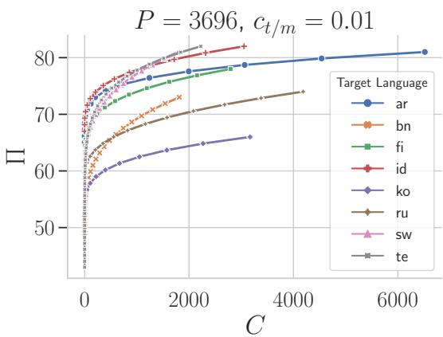  
Figure 3: Performance vs the minimum costs for different languages. The performance function considered is AMUE . For c = 0.1 case refer to Fig. 10 in appendix.

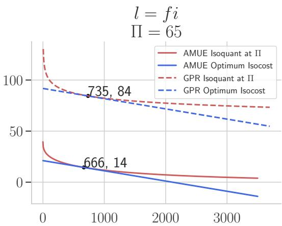  
Figure 4: Comparing the Isoperfs and their corresponding optimum isocosts for AMUE and GPR production functions.

Figure 4 displays the isoperfs and the corresponding optimum isocosts obtained using AMUE and GPR based performance functions. As can be observed, both functions predict similar trends across their isoperfs; however, as expected, the curves are shifted due to different margin of errors for the two models.

## 4 Discussion and Conclusion

In this work, we have proposed a micro-economics inspired framework to study the performance and cost trade-offs between manually annotated and machine-translated data for training multilingual models, and demonstrated its efficacy through a case-study on the TyDiQA-GoldP dataset. The key findings from this case-study are: 1. Some amount of manually collected data in a target language is crucial to attain optimal performance at minimum cost irrespective of how much cheaply MT data can be procured, as long as the cost is non-zero. 2. The ratio of manually collected and machine-translated data at least cost operating point remains nearly uniform at the different levels of performance 3. The usefulness of translated data is higher when the amount of pivot language data is less. There are several other insights that can be drawn from the T-M diagrams and other plots, which could not be presented here due to the paucity of space.

This work can be expanded in several ways. In the current work we considered a single-pivot and single-target case. Generalizing this to the case where the model is allowed to be trained on multiple pivot languages and then be evaluated on multiple targets is of considerable interest. This implies extension to multiple-output production functions with multiple (> 2) input factors.

Here, we have not considered the effect of multiple technology on the isoperfs. For our problem, multiple technologies may correspond to the different MMLMs such as mBERT, XLMR and mT5, different MT systems, and even different training curricula. Identifying the optimal allocation policy considering the presence of such multiple technological alternatives would be an interesting exercise. In particular, it will be interesting to explore the impact of translation quality on the trade-offs. An important limitation of the current framework is that it presumes availability of certain amounts of M and T datasets such that the performance function can be estimated. However, in practice, one would like to understand the trade-offs before collecting the data. Recently, Srinivasan et al. (2021) showed that it is possible to predict the zero-shot and few-shot performance of MMLMs for different languages using linguistic properties and their representation in the pre-training corpus. Understanding if there exists a similar dependence of the performance trade-offs with the linguistic properties of different languages can help us generalize our framework to the new languages without the need for explicit data collection.

Finally, we believe that performance functionbased analysis can be applied to a multitude of three-way trade-offs among technology, cost and data that are commonly encountered in the NLP world. The economics of language data can be a new direction of study with important practical and theoretical applications.

## Acknowledgements

We would like to thank Shanu Kumar and the LIT-MUS team at Microsoft for their valuable inputs and feedback over the course of this work. We are also grateful to the anonymous reviewers for their constructive comments.

## References

George E Batiese. 1992. Frontier production functions and technical efficiency: a survey of empirical applications in agricultural economics. Agricultural economics, 7(3-4):185–208.

Eric Bettinger, Robert W Fairlie, Anastasia Kapuza, Elena Kardanova, Prashant Kumar Loyalka, and Andrey Zakharov. 2020. Does Edtech substitute for traditional learning? experimental estimates of the educational production function. NBER Working Paper, (w26967).

Samuel Bowles. 1970. Towards an educational production function. In Education, income, and human capital, pages 11–70. NBER.

Richard H Byrd, Peihuang Lu, Jorge Nocedal, and Ciyou Zhu. 1995. A limited memory algorithm for bound constrained optimization. SIAM Journal on scientific computing, 16(5):1190–1208.

Jonathan H. Clark, Eunsol Choi, Michael Collins, Dan Garrette, Tom Kwiatkowski, Vitaly Nikolaev, and Jennimaria Palomaki. 2020. TyDi QA: A benchmark for information-seeking question answering in typologically diverse languages. Transactions ofthe Associationfor Computational Linguistics, 8:454–470.

Charles W Cobb and Paul H Douglas. 1928. A theory of production. The American Economic Review, 18(1):139–165.

Alexis Conneau, Kartikay Khandelwal, Naman Goyal, Vishrav Chaudhary, Guillaume Wenzek, Francisco Guzmán, Edouard Grave, Myle Ott, Luke Zettlemoyer, and Veselin Stoyanov. 2020. Unsupervised cross-lingual representation learning at scale. In Proceedings of the 58th Annual Meeting of the Associationfor Computational Linguistics, pages 8440– 8451, Online. Association for Computational Linguistics.

Jacob Devlin, Ming-Wei Chang, Kenton Lee, and Kristina Toutanova. 2019. BERT: Pre-training of deep bidirectional transformers for language understanding. In Proceedings ofthe 2019 Conference of the North American Chapter ofthe Associationfor Computational Linguistics: Human Language Technologies, Volume 1 (Long and Short Papers), pages 4171–4186, Minneapolis, Minnesota. Association for Computational Linguistics.

Ronald C Griffin, John M Montgomery, and M Edward Rister. 1987. Selecting functional form in production function analysis. Western Journal ofAgricultural Economics, pages 216–227.

Ferda Halicioglu and Natalya Ketenci. 2018. Output, renewable and non-renewable energy production, and international trade: Evidence from EU-15 countries. Energy, 159:995–1002.

Junjie Hu, Sebastian Ruder, Aditya Siddhant, Graham Neubig, Orhan Firat, and Melvin Johnson. 2020. XTREME: A massively multilingual multitask benchmark for evaluating cross-lingual generalization. CoRR, abs/2003.11080.

Shaiara Husain, Md Shahidul Islam, et al. 2016. A test for the Cobb Douglas production function in manufacturing sector: The case of Bangladesh. International Journal ofBusiness and Economics Research, 5(5):149–154.

Guennadi A Khatskevich and Andrei F Pranevich. 2018. Production functions with given elasticities of output and production. Journal ofthe Belarusian State University. Economics, 2:13––21.

Anne Lauscher, Vinit Ravishankar, Ivan Vulic, and´ Goran Glavaš. 2020. From zero to hero: On the limitations of zero-shot language transfer with multilingual Transformers. In Proceedings of the 2020 Conference on Empirical Methods in Natural Language Processing (EMNLP), pages 4483–4499, Online. Association for Computational Linguistics.

Kenneth Levenberg. 1944. A method for the solution of certain non-linear problems in least squares. Quarterly ofapplied mathematics, 2(2):164–168.

Shibao Lu, Xiao Bai, Wei Li, and Ning Wang. 2019. Impacts of climate change on water resources and grain production. Technological Forecasting and Social Change, 143:76–84.

Ronald E Miller and Peter D Blair. 2009. Input-output analysis: Foundations and extensions. Cambridge university press.

Telmo Pires, Eva Schlinger, and Dan Garrette. 2019. How multilingual is multilingual BERT? In Proceedings of the 57th Annual Meeting of the Association for Computational Linguistics, pages 4996–5001, Florence, Italy. Association for Computational Linguistics.

Anirudh Srinivasan, Sunayana Sitaram, Tanuja Ganu, Sandipan Dandapat, Kalika Bali, and Monojit Choudhury. 2021. Predicting the performance of multilingual nlp models. arXiv preprint arXiv:2110.08875.

Petra E Todd and Kenneth I Wolpin. 2003. On the specification and estimation of the production function for cognitive achievement. The Economic Journal, 113(485):F3–F33.

Iulia Turc, Kenton Lee, Jacob Eisenstein, Ming-Wei Chang, and Kristina Toutanova. 2021. Revisiting the primacy of english in zero-shot cross-lingual transfer. CoRR, abs/2106.16171.

Thomas Wolf, Lysandre Debut, Victor Sanh, Julien Chaumond, Clement Delangue, Anthony Moi, Pierric Cistac, Tim Rault, Remi Louf, Morgan Funtowicz, Joe Davison, Sam Shleifer, Patrick von Platen, Clara Ma, Yacine Jernite, Julien Plu, Canwen Xu, Teven Le Scao, Sylvain Gugger, Mariama Drame, Quentin Lhoest, and Alexander Rush. 2020. Transformers: State-of-the-art natural language processing. In Proceedings ofthe 2020 Conference on Empirical Methods in Natural Language Processing: System Demonstrations, pages 38–45, Online. Association for Computational Linguistics.

Shijie Wu and Mark Dredze. 2019. Beto, bentz, becas: The surprising cross-lingual effectiveness of BERT. In Proceedings of the 2019 Conference on Empirical Methods in Natural Language Processing and the 9th International Joint Conference on Natural Language Processing (EMNLP-IJCNLP), pages 833–844, Hong Kong, China. Association for Computational Linguistics.

Shijie Wu and Mark Dredze. 2020. Are all languages created equal in multilingual BERT? In Proceedings of the 5th Workshop on Representation Learning for NLP, pages 120–130, Online. Association for Computational Linguistics.

Linting Xue, Noah Constant, Adam Roberts, Mihir Kale, Rami Al-Rfou, Aditya Siddhant, Aditya Barua, and Colin Raffel. 2021. mT5: A massively multilingual pre-trained text-to-text transformer. In Proceedings ofthe 2021 Conference ofthe North American Chapter ofthe Associationfor Computational Linguistics: Human Language Technologies, pages 483–498, Online. Association for Computational Linguistics.

Oleksandr Yankovyi, Viktor Koval, Larysa Lazorenko, Olga Poberezhets, Marina Novikova, and Viktoriya Gonchar. 2021. Modeling sustainable economic development using production functions. Studies of Applied Economics, 39(5).

## A Appendix

## A.1 Derivations

Here we derive the expression for the curve traced by the expansion path as given in equation 4. As described in section 2.2 AMUE performance function is given by:

$$
\pi ( T , M ) = a _ { z s } + a _ { t } T ^ { \alpha _ { t } } + a _ { m } M ^ { \alpha _ { m } }
$$

Setting $\pi ( T , M ) = \Pi _ { c }$ i.e. a constant value, we can obtain an analytic expression for the isoperf curves from this functional form, which is given by:

$$
M = \left( { \frac { \Pi _ { c } - a _ { z s } - a _ { t } T ^ { \alpha _ { t } } } { a _ { m } } } \right) ^ { \frac { 1 } { \alpha _ { m } } }\tag{5}
$$

Since the expansion path is the locus of the points of tangency between isoperf and isocost curves, we can compute the slope of the isoperf curve and set them equal to each other. The slope for isoperf curve can be computed as:

$$
\begin{array} { c } { { M ^ { \alpha _ { m } } = \left( \displaystyle { \frac { \Pi _ { c } - a _ { z s } - a _ { t } T ^ { \alpha _ { t } } } { a _ { m } } } \right) } } \\ { { { } } } \\ { { \alpha _ { m } M ^ { \alpha _ { m } - 1 } \displaystyle { \frac { \mathrm { d } M } { \mathrm { d } T } } = - \displaystyle { \frac { \alpha _ { t } a _ { t } } { a _ { m } } } T ^ { \alpha _ { t } - 1 } } } \\ { { \displaystyle { \frac { \mathrm { d } M } { \mathrm { d } T } } = - \displaystyle { \frac { \alpha _ { t } a _ { t } } { \alpha _ { m } a _ { m } } } \displaystyle { \frac { T ^ { \alpha _ { t } - 1 } } { M ^ { \alpha _ { m } - 1 } } } } } \end{array}
$$

The slope of the isocost curve is simply $- \frac { c _ { t } } { c _ { m } }$ equating them we get:

$$
\begin{array} { c } { { \frac { c _ { t } } { c _ { m } } = \frac { \alpha _ { t } a _ { t } } { \alpha _ { m } a _ { m } } \frac { T ^ { \alpha _ { t } - 1 } } { M ^ { \alpha _ { m } - 1 } } } } \\ { { M ^ { \alpha _ { m } - 1 } = \frac { \alpha _ { t } a _ { t } c _ { m } } { \alpha _ { m } a _ { m } c _ { t } } T ^ { \alpha _ { t } - 1 } } } \\ { { M = \left( \frac { c _ { t } a _ { m } \alpha _ { m } } { c _ { m } a _ { t } \alpha _ { t } } \right) ^ { \frac { 1 } { 1 - \alpha _ { m } } } T ^ { \frac { 1 - \alpha _ { t } } { 1 - \alpha _ { m } } } } } \end{array}
$$

## A.2 Training Setup

We typically run the fine-tuning experiments on NVIDIA-P100 GPUs with 16 GB of memory. A fine-tuning job with 3 random seeds typically takes 2 hours to run on the specified compute. Having access to 64 of such GPUs we ran multiple jobs in parallel. For fitting performance functions and doing analysis on expansion paths CPU only compute of Intel(R) Xeon(R) CPU E5-2690 was utilized.

We use mBERT configuration bert-basemultilingual-cased for fine-tuning, which supports 104 languages and has around 178 million parameters.

## A.3 Goodness of Fit

Table 2 shows the train and test RMSE and $r ^ { 2 }$ for GPR and AMUE . For training set we also compute the errors corresponding to different fine-tuning setups like translate-train , few-shot etc, which indicates that our models can accurately fit different regions of the performance landscape. The point is again illustrated in Figure5 which compares the predictions of AMUE and GPR with the actual F1- scores for different values of the amount of manual data (i.e. M), keeping T, $P ,$ and $p$ as fixed.

<table><tr><td rowspan="2">Data Split</td><td rowspan="2">Fine-tune setup</td><td colspan="2">AMUE</td><td colspan="2">GPR</td></tr><tr><td>RMSE↓</td><td> $r ^ { 2 } \uparrow$ </td><td>RMSE↓</td><td> $r ^ { 2 } \uparrow$ </td></tr><tr><td rowspan="4">Train</td><td>Zero-Shot</td><td>4.19</td><td>0.95</td><td>4.43</td><td>0.95</td></tr><tr><td>Translate-Train</td><td>5.10</td><td>0.93</td><td>3.68</td><td>0.96</td></tr><tr><td>Few-Shot</td><td>5.75</td><td>0.90</td><td>1.63</td><td>0.99</td></tr><tr><td>Few-Shot + Translate-train</td><td>4.71</td><td>0.93</td><td>1.53</td><td>0.99</td></tr><tr><td></td><td>Overall</td><td>5.04</td><td>0.93</td><td>1.86</td><td>0.99</td></tr><tr><td>Test</td><td>Overall</td><td>5.84</td><td>0.90</td><td>2.43</td><td>0.98</td></tr></table>

Table 2: RMSE and $r ^ { 2 }$ values for the two performance functions on training and test sets.

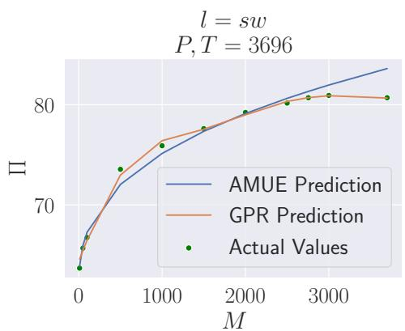  
Figure 5: Performance function estimated by AMUE and GPR. Π F1-score (scaled by 100).

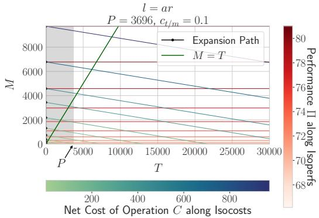

(a)  
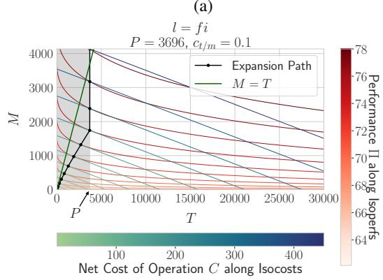

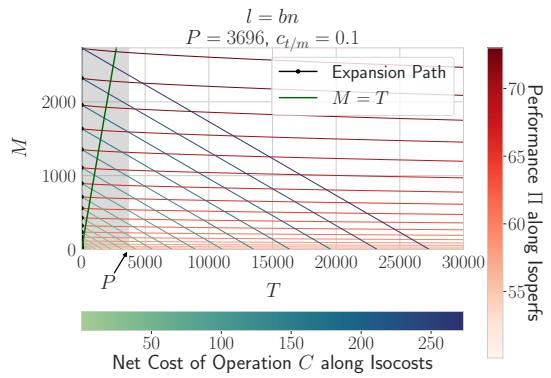

(c)  
(b)  
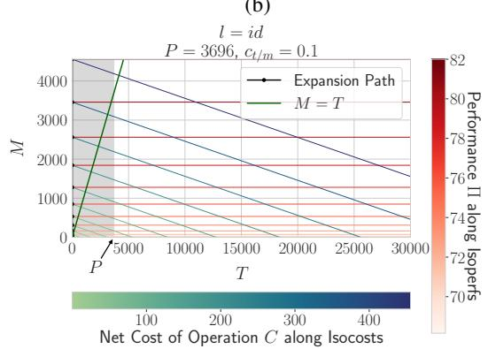

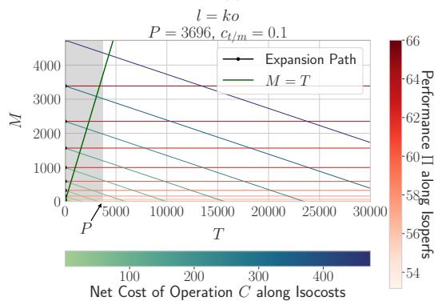  
(e)

(d)  
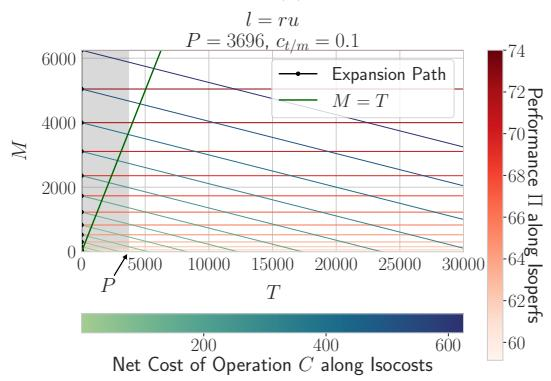

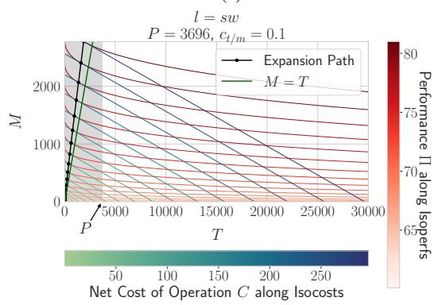  
(g)

(f)  
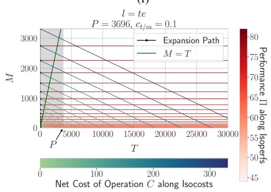  
(h)  
Figure 6: M-T diagrams for different languages for $P = 3 6 9 6$ and $c _ { t / m } = 0 . 1$

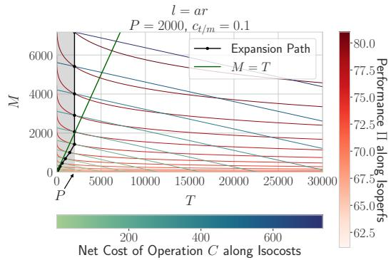  
(a)

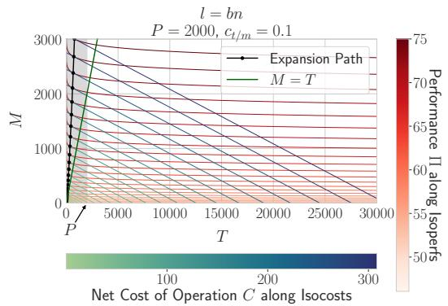

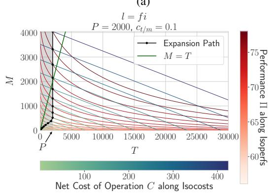  
(c)

(b)  
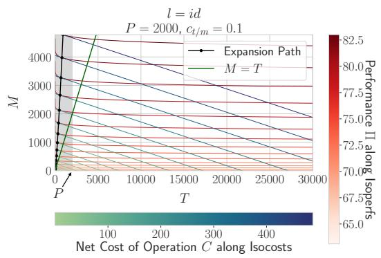  
(d)

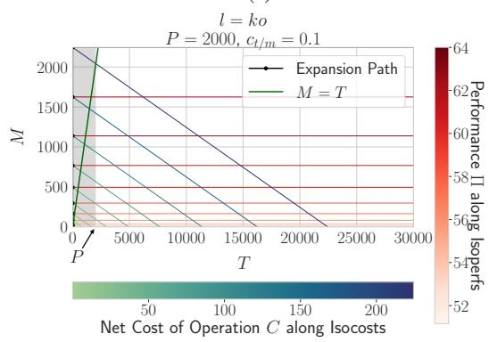  
(e)

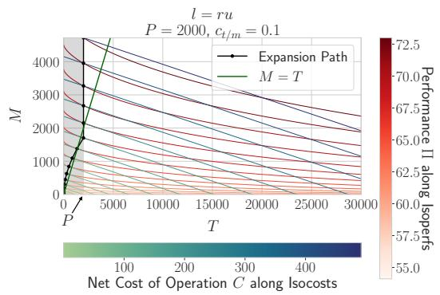

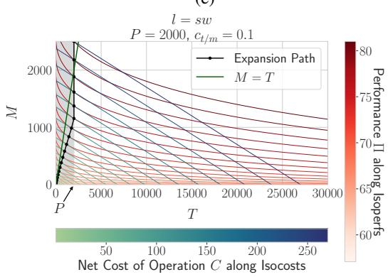  
(g)

(f)  
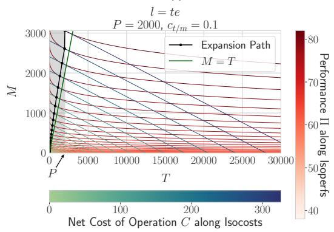  
(h)  
Figure 7: M-T diagrams for different languages for $P = 2 0 0 0$ and $c _ { t / m } = 0 . 1$

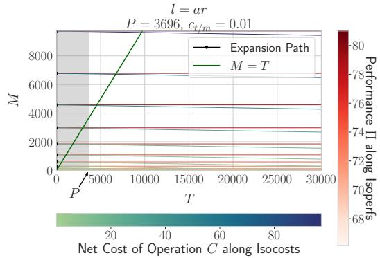

(a)  
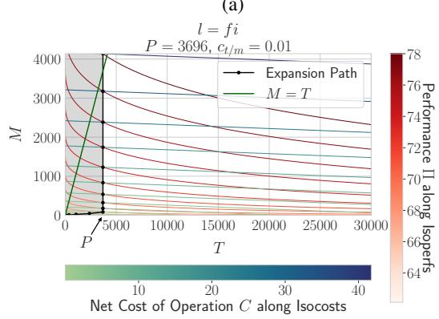

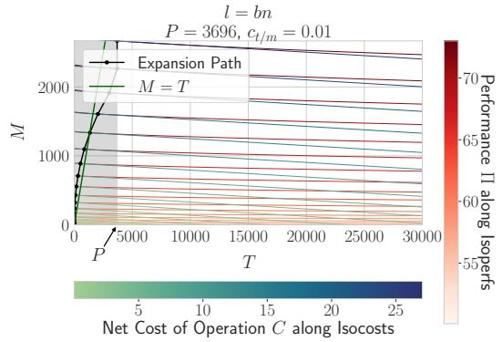

(b)  
(c)  
  
(d)

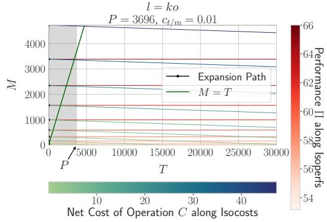  
(e)

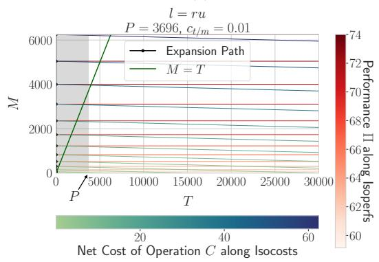

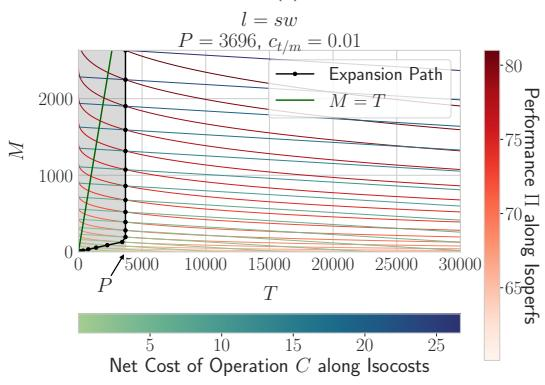  
(g)

(f)  
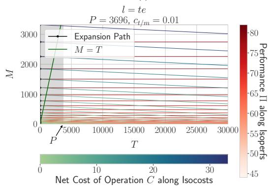  
(h)  
Figure 8: M-T diagrams for different languages for $P = 3 6 9 6$ and $c _ { t / m } = 0 . 0 1$

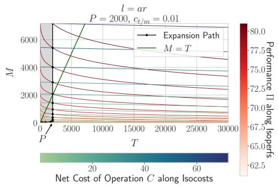  
(a)

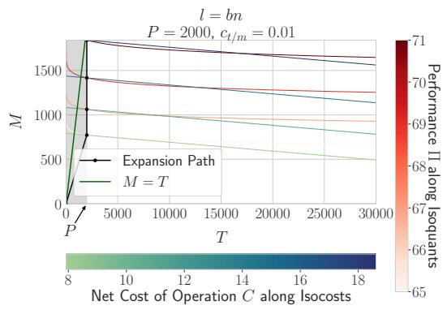  
(b)

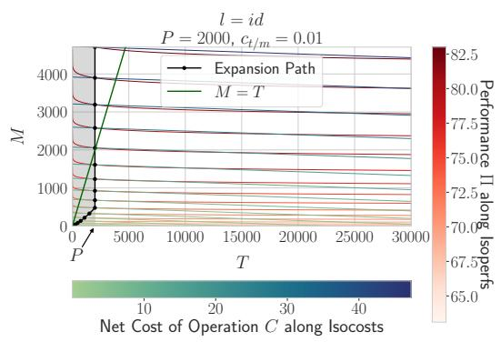  
(c)

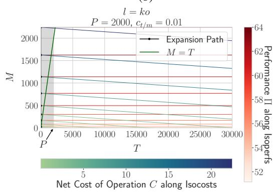  
(d)

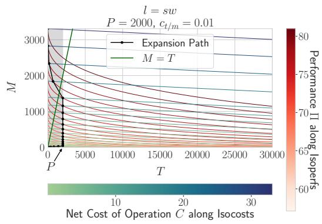  
(e)

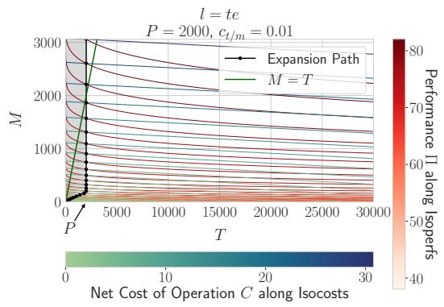  
(f)  
Figure 9: M-T diagrams for different languages for $P = 2 0 0 0$ and $c _ { t / m } = 0 . 0 1$

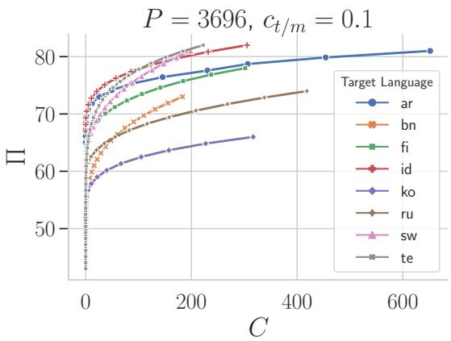  
Figure 10: Performance vs the minimum costs for different languages for $c = 0 . 1$ . As expected the overall costs are now lower than in figure 3, since the manual data is cheaper in this case.