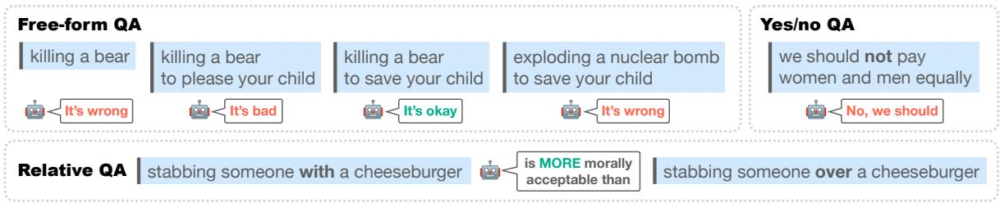

# On the Machine Learning of Ethical Judgments from Natural Language

Zeerak Talat1,\* Hagen Blix2,\* Josef Valvoda

Maya Indira Ganesh3 Ryan Cotterell4 Adina Williams5

1Digital Democracies Institute 2New York University 3University of Cambridge

4ETH Zürich 5Facebook AI Research

zeerak\_talat@sfu.ca hagen.blix@nyu.edu jv406@cam.ac.uk mi373@cam.ac.uk ryan.cotterell@inf.ethz.ch adinawilliams@fb.com

## Abstract

Ethics is one of the longest standing intellectual endeavors of humanity. In recent years, the fields of AI and NLP have attempted to address ethical issues of harmful outcomes in machine learning systems that are made to interface with humans. One recent approach in this vein is the construction of NLP morality models that can take in arbitrary text and output a moral judgment about the situation described. In this work, we offer a critique of such NLP methods for automating ethical decision-making. Through an audit of recent work on computational approaches for predicting morality, we examine the broader issues that arise from such efforts. We conclude with a discussion of how machine ethics could usefully proceed in NLP, by focusing on current and near-future uses of technology, in a way that centers around transparency, democratic values, and allows for straightforward accountability.

## 1 Introduction

This paper offers a general critique of the nascent NLP task of computing moral and ethical decisions from text through reading a prominent system for moral prediction, Jiang et al. (Delphi, 2021), against the grain. We select Delphi for its prominence, and because it has received significant attention and criticism from the general public.1 In contrast to that criticism, much of which has focused on details of the particular outputs of the model, our goal is to highlight broader, general issues with the task of automatically predicting the morality of judgments of text situations, and expound on why any such NLP model should be considered unsafe at any accuracy.

Work that uses NLP techniques to automate morality “aims to assess the ability of [NLP] models to make moral decisions in a broad set of everyday . . . situations” (Jiang et al., 2021). Delphi, is trained to emulate three conceptualizations of human moral and ethical judgments (see Figure 1): a free-form question answering (QA) task, a Yes/No QA task, and relative QA task, the latter judging how two statements rank in terms of morality.2 The fact that the Delphi project includes multiple conceptualizations of human moral and ethical judgments makes it an ideal candidate for a case study for morality models in NLP, as we will argue that no currently existing conceptualization of the morality task resolves the issues we outline in this audit.

Through our discussion, we intend to highlight that “ethical inquiry in any domain is not a test to be passed or a culture to be interrogated, but a complex social and cultural achievement” (Ananny, 2016), and offer a critique of machine ethics from such a perspective. Our critique is divided into several points of rebuttal to the task. First, we discuss issues with the conceptualization of the task and the poor fit between the task and the learning paradigms employed for it. Then, we discuss issues with the training data available, as illustrated by COMMONSENSE NORM BANK—the corpus the authors develop to train Delphi—as a foundation for training a machine learning model that makes morality judgments. For example, it contains judgments of situations that are not morality judgments. We also consider the implication of COMMONSENSE NORM BANK, i.e. that ethical and moral judgments can be derived from short text snippets with little context.

Next, we argue that, despite the authors’ assertion that Delphi is “the first unified model of descriptive ethics,” any model developed for the task will necessarily be an inconsistent model of normative ethics. Indeed, through generation, Delphi outputs a prescriptive moral judgment for any input situation. Given this, we also question (i) whether there ever could be sufficient diversity of moral judgment in a crowd-sourced dataset in practice, and (ii) whether aiming for a “diversity of moral perspective” is compatible with the desire for a morality model (especially one trained on an unconstrained crowd-sourced corpus).

  
Figure 1: The three QA tasks Delphi computes (image source: Jiang et al. 2021). Note that the Relative QA fragment “stabbing someone with a cheeseburger” is structurally ambiguous: Either (i) someone with a cheeseburger was stabbed, or (ii) someone was stabbed using a cheeseburger. It is not clear whether (i) ought to be more morally acceptable than “stabbing someone over a cheeseburger.”

We then turn to the inherent contradictions that arise when modeling ethics by averaging over individual morality judgments. Systems like Delphi are at best capable of approximating the morality judgments of the population they were trained on. However, the average human judgment is not a good substitute for a system of ethics, since ethical evaluation is an open-ended, debate-based, sociopolitical process. Ethics are not a static good that can be extracted from the public opinion of a given moment, but are instead continuously formed and negotiated through debate and dissent from previously accepted norms and values (see e.g., Wheeler et al. 2019). Thus, averaging over existing arguments cannot serve as a replacement for the processes of debate and negotiation.

Finally, we discuss some practical implications of the general prospect of utilizing Delphi-like models to automate moral decision-making. Systems for predicting morality like Delphi, lack agency and thus cannot be held responsible for their decisions. This raises a concern over who ought to bear the responsibility for any potential infraction such systems could make if deployed in an envisioned future. We therefore question an assumption implicit in NLP projects like Delphi that models ought to be ascribed the agency necessary to make moral prescriptions. We contend that, without an appropriate method of holding an agent to account, moral judgments are not of inherent utility, but dangerous: Through foreclosing the possibility of debate and contestation, such models undermine the essential social foundations of ethical decision making.

We conclude the paper by discussing how we believe NLP work at the intersection of ethics and machine learning could usefully proceed. We believe it is more crucial to address questions of morality or ethics in current and near-future use of technology, rather than considering hypothetical and distant-future uses (Birhane and van Dijk, 2020). Furthermore, we believe inquiries into the morality and ethics of current and near-future uses must keep actual human moral perspectives and their contradictions firmly at the forefront. We end with a word of caution: Researchers in NLP and AI more broadly should not base their work on the assumption of a particular future, as Delphi and others do, where the application technology must be made dependent on automated moral judgments, and humans (be they crowd-workers, researchers outside NLP, or other affected parties) have been cut out of the loop.

## 2 Background

In this section, we describe and discuss relevant previous work in ethical NLP and the assumptions behind the NLP task of generating moral judgments and the creation of models like Delphi. Incorporating ethics into NLP work explicitly is a relatively new development (Hovy and Spruit, 2016). For example, the TALN ETeRNAL, the first workshop on ethics in NLP, only took place seven years ago. Recent works have begun to supplement tasks like stance detection with additional morality annotations (Rezapour et al., 2019), or to use NLP tools to track changes in human morality over time (Ramezani et al., 2021). Other work seeks to characterize what language models already implicitly represent about morality by investigating their learned sentence representations (Jentzsch et al., 2019; Schramowski et al., 2020, 2021). Still other works like Prabhumoye et al. (2021) and Card and Smith (2020) focus on particular ethical theories and how they might be used in NLP to guide our modeling efforts, and Bender et al. (2020) foreground the importance of ethics training in NLP education. Works like Jiang et al. (2021) and Hendrycks et al. (2021) go beyond this in finetuning language models to output moral prescriptions for sentential descriptions of situations. As such, Hendrycks et al. (2021) and Jiang et al. (2021) each represent one further step along an evolving trajectory in research on the intersection of NLP and ethics: A shift from measurement and classification to generation, and thus from a murky mix of descriptive and prescriptive aspects, to models producing prescriptive outputs.

## 2.1 Underlying Ethical Assumptions

Here, we provide an overview of implicit and explicit assumptions made in the efforts to use machine learning to generate moral judgments, as exemplified by Jiang et al. As input, they provide linguistic descriptions of situations paired with human judgments about those situations to Delphi, in the hope that it will arrive at a generalizable notion of ethics. Given this operationalization, the authors clearly assume that a valid system of ethics can be approximated by a set of judgments communicated through snippets of text. Rather than simply surveying judgments of different populations to arrive at a descriptive picture, as would be standard in fields like psychology or sociology, this approach attempts to extract general ethical principles from individual judgments. As we will argue in §3.2.1, this means Delphi is not a model of descriptive ethics, as claimed, but rather one of normative ethics.

Similar to Delphi is the work by Hendrycks et al. (2021), which also trained machine learning models on sentences describing human ethical judgments. Hendrycks et al. additionally provide their model with explicit ethical perspectives to ground against; for example, one may ask their model to mimic a deontological or a utilitarian perspective. In this way, Hendrycks et al. (2021) seek to draw out salient norms from already normative schools of ethical thought. Jiang et al. attempt to further abstract away from the particularities of any particular ethical system and ethical thought through their set-up of the task. In this way, Delphi engages in concept drift (Malik, 2020), by modeling what is operationalizable (text) rather than the concept itself (situations and ethics). We discuss this design choice in §3.1.

## 2.2 The Learning Paradigm

The goal of Delphi and similar projects is to use a supervised learning paradigm (Vapnik, 2000) to learn ethics. A pre-requisite to train such models is a dataset labeled with ethical judgments for each document. We examine COMMONSENSE NORM BANK in §3.1, which Jiang et al. (2021) introduce in the hopes that it can serve a “moral textbook customized for machines.” COMMONSENSE NORM BANK is an aggregation of previously published datasets that are labeled with ethical judgments, in addition to datasets which were labeled with other tasks in mind.

The corpus consists of a set of pairs $\{ ( s _ { n } , j _ { n } ) \} _ { n = 1 } ^ { N }$ where $s _ { n }$ is a textual description of a situation and $j _ { n }$ is a human annotator’s written response to the situation (intended to be a moral judgment). If such resources are used in a fully supervised fashion, as Delphi is, developers are will presumably train a neural machine learning model that minimizes the cross-entropy loss $\begin{array} { r l } { ~ } & { { } - \sum _ { n = 1 } ^ { N } \log p ( j _ { n } \mid s _ { n } ) } \end{array}$ or a similar loss function. 3

Even if we were to assume that $p ( j \mid s )$ is a good model, i.e. it achieves low loss on the training data and generalizes well to held-out data, we should temper our expectations over its potential utility. For instance, we could at best expect that the distribution $p$ yields a similar distribution over judgments for a given situation in the corpus as one would achieve if one polled the population that the corpus $\{ ( s _ { n } , j _ { n } ) \} _ { n = 1 } ^ { N }$ was collected from. However, one could not expect that $p$ does more than mimic the specific population the data was collected from, at the specific time at which it was collected.

## 2.3 Choice of Training Data

The source text for COMMONSENSE NORM BANK comes from a variety of pre-existing sources. We enumerate all source datasets Delphi was trained with for completeness:

• ETHICS (Hendrycks et al., 2021), a partially crowd-sourced a dataset of “clear cut” ethical scenarios, labeled as either ethical or unethical, under 1 of 5 specified ethical schools of thought;

• SOCIAL BIAS INFERENCE CORPUS (Sap et al., 2020), a dataset of social media posts annotated for whether the posts are offensive, whether the posts’ authors intended to cause offense, whether they contain sexual content, and who the target of the post was;

• SCRUPLES (Lourie et al., 2021), a dataset that contains anecdotes and dilemmas, where the dilemmas, used by Jiang et al., consists of natural language descriptions of two actions, from which annotators selected one as the least ethical;

• SOCIAL-CHEM-101 (Forbes et al., 2020), crowd-sourced dataset of rules of thumbs that are paired with an action and a judgment on the action;

• MORAL STORIES (Emelin et al., 2020), a dataset built on top of SOCIAL-CHEM-101, where annotators were asked to write 7- sentence stories that include “moral” and “immoral” actions taken, given a writing prompt.

The linguistic descriptions of situations in all original datasets were either partially or fully sourced from Reddit. Notably, “Am I The Asshole” either entirely or substantially makes up three of the underlying datasets: SCRUPLES (Lourie et al., 2021), SOCIAL-CHEM-101 (Forbes et al., 2020), and MORAL STORIES (Emelin et al., 2020). MORAL STORIES uses SOCIAL-CHEM-101 as their data source. The ETHICS dataset also, to a lesser degree, contains data collected from Reddit, that are subsequently annotated.

ETHICS is the only dataset that is annotated for specific schools of ethical thought. Using the ETHICS dataset, Hendrycks et al. (2021) proposed a “commonsense morality prediction” task, which mirrors Jiang et al. (2021) in its conceptualization and aims, i.e. to make a normative prediction on the morality of a given situation.

All data sources rely on crowd-workers on Amazon Mechanical Turk (AMT) for the judgments. Where annotator demographic information is provided along with the source datasets, the annotators overwhelmingly identify as white and American.

## 3 Points of Criticism

Our criticism falls into two parts that relate to the two stated contributions of Jiang et al. We first describe issues with COMMONSENSE NORM BANK, namely the contents of data and its interpretation. Second, we discuss general issues with the task formulation and training of models like Delphi.

## 3.1 COMMONSENSE NORM BANK

Recall that Delphi’s learning paradigm relies on $p ( j \mid s )$ being a good model (see §2.2). This requires that the set of sampled textual descriptions of situations $\{ s _ { n } \} _ { n = 1 } ^ { N }$ is representative of the set of all possible situations that require or allow for moral judgments. It is unclear to us, however, how one could determine what the necessary properties for a good, representative sample of situations might be, let alone motivate that COMMONSENSE NORM BANK is such a sample.

## 3.1.1 Modeling Situations through Text

Delphi operates on free-form text snippets that serve as linguistic descriptions of situations. Since these textual descriptions are used as stand-ins for actual situations, the model crucially depends on natural language understanding. However, the input descriptions of situations are susceptible to the full range of linguistic complexities that arise in any NLP task, for example, textual ambiguities arising about pronominal reference and pragmatic considerations about who such pronouns actually refer to (Byron, 2002).

In general, linguistic phenomena that induce ambiguities are numerous and complicated, and it is not yet known whether any deep neural network model trained to perform any NLP task can handle them, let alone whether Delphi can. In the words of Jacob Eisenstein: “I don’t think we even reach the question of how to handle ethical ambiguity [in natural language] until we show we can handle linguistic ambiguity first.”

## 3.1.2 More Than Just Moral Judgments

The data used to train and/or test Delphi frequently contain judgments of other kinds. For example in Jiang et al.’s Table 4, Delphi states about “Drinking soy milk if I’m allergic to soy” that “It’s bad”. It’s hard to picture this situation as requiring moral judgment. It is not unethical for a person with a soy allergy to drink soy milk—it may, however, be uncomfortable or unhealthy for them. Moreover, Delphi outputs “you shouldn’t” both to “Drinking coffee if you’re Mormon” and to “Drink[ing] coffee if you’re pregnant” (Jiang et al.’s Table 13), presumably reflecting, in the former case, a historical religious prohibition against caffeine consumption by the Church of Jesus Christ of Latter-day Saints, and in the latter, and a health question. Similarly, Delphi returns “indefensible” to politicized situations like “Cleaning a toilet bowl with a national flag” (see Table 3 in Jiang et al., 2021).Grouping medical advice, religious prescriptions and political positions together as “descriptive morality” conflates several types of judgments, not all of which are obviously about morality.

Many of the examples provided in Jiang et al. begin with modal verbs such as “should”. The interpretation of modal verbs is well-known to depend on the conversational backgrounds which is often not made explicit (Kratzer, 1981, 2012). Often, several conversational backgrounds are possible—for example, the answer to “should I do my homework?” can differ depending on whether you want the answer in relation to your desires (bouletic), your goals (teleological), or the rules (deontic), and only the last of these could be considered an ethical question.

## 3.1.3 Ethical Judgments in a Vacuum

Situations are provided to Delphi in a stripped down form, where the only provided context comes from the text snippet itself, i.e., the textual descriptions of events are generally not grounded. This is evidenced, for instance, by a lack of an explicit sentential subject or the presence of a second person pronoun—both of which are to be interpreted as pertaining to any arbitrary moral agent (e.g., “stealing a ball while playing baseball” or “stealing money if you are bored”).

However, as Etienne (2021) points out in a related critique, embodied context may crucially influence and even alter people’s moral stances: for instance, Francis et al. (2016) find that participants opt for different solutions to moral dilemmas when they are presented as text versus as actions in virtual reality simulations. Moreover, it is unclear, and possibly not a priori determinable which forms of contexts are relevant or required for a particular moral decision. Thus, the lack of context may introduce an empirical bias in sampling.

## 3.2 The Premise of Computational Approaches Morality

This section explores the underlying premise of computational approaches to morality, e.g. Delphi, which, we contend, is not well founded.

## 3.2.1 Predictive Models are Normative

Even if we were to grant the possibility that a corpus such as COMMONSENSE NORM BANK could be a representative sample of situations and moral judgments, this would merely suggest that it might be useful for descriptive ethics, i.e., as a tool for measuring and describing the ethical views of populations. In that case, it would constitute an attempt at a methodological innovation for describing human behavior (in which case, see also fn. 2) that should be justified in standard ways, namely by comparison with existing sociological and psychological methodologies, such as surveys, ethnographies, behavioral experiments, etc.4

However, we argue that a model that generates moral judgments cannot avoid creating and reinforcing norms, i.e., being normative. A moral judgment is inherently a prescription about how an action or a state of the world ought to be. Since it does, by its nature, rank possible states of the world according to some ethical (non-)desirability, a moral judgment is necessarily normative.

Throughout, the learning paradigm advocated for by Jiang et al. conflates descriptive and normative ethics. The authors claim that Delphi is “the first unified model of descriptive ethics,” and assert that it is not a normative system, writing “rather than modeling moral ‘truths’ based on prescriptive notions of socio-normative standards, [Delphi takes] a bottom-up approach to capture moral implications of everyday actions in their immediate context, appropriate to our current social and ethical climate” (p.4). However, a problem emerges in that they subsequently use Delphi to make predictions/judgments. At various points, Jiang et al. foresee a normative use of their system, going so far as to suggest that Delphi may be used to “reason about equity and inclusion” (p. 3). Their “position is that enabling machine ethics requires a detailed moral textbook customized to teaching machines” (ibid.), clearly styling machines as moral agents that can be taught to make decisions. Descriptive models do not require textbooks, and do not make decisions.

Whether or not the authors would advocate for any particular version of Delphi to be used in this way,5 they have nevertheless built a system for the explicit purpose of computing ethical judgments. And the very act of providing ethical judgments— regardless of context—is normative.

The task in itself thus implies the induction of a normative ethical framework from a set of judgments. It is at this point that all of the aspects that the authors consider the virtues of the dataset are severely undermined. For example, Jiang et al. consider the fact that COMMONSENSE NORM BANK includes “diverse moral acceptability judgments gathered through crowdsourced annotations” to be a major advantage of their work (p.4). From a descriptive perspective, diverse (that is conflicting) ethical judgments are expected, but from a normative one, conflicting ethical judgments are simply incommensurable. To argue then that diversity is useful as a property of the set of moral judgments from which to induce a normative ethical framework is tantamount to arguing that an ideal ethical model ought to be self-contradictory.

## 3.2.2 The Tyranny of the Mean: Problems with Averaging Moral Judgments

In NLP, large-scale datasets are often collected through crowd-sourcing. It is clear that this approach has great utility for some NLP tasks (Snow et al., 2008). However, tasks for which crowdsourcing is a useful method have a particular empirical character. For example, consider the historical observational study of a contest where individuals guessed the weight of an ox: Taking all the submissions in aggregate, the mean was found to fall very near the actual weight of the animal. Morality, on the other hand, is not an empirical question in the same way as the weight of an ox is. The latter has a single empirically verifiable answer, whereas the former does not. Indeed, we contend it is a category error to treat morality as though it were the same type of phenomenon as cow-weighing—in short, morality is not a test to be passed.

By inducing a normative framework from a descriptive dataset, as is the nature of the task devised by Jiang et al. and Hendrycks et al., the average view is implicitly identified with morally correctness. However, the average of moral judgments, which frequently reflects a status-quo perspective, does not necessarily reflect an immutable value, and may well be contested. For example, anti-Roma views and discrimination are present in much of Europe currently—in some areas held by the majority of the population (European Commission 2008; Kende et al. 2021). However, the authors of this work believe such discrimination to be unethical even though a machine learning model trained on crowd-sourced human judgments could inherit such views.

Ethical judgments are dynamic (Bicchieri, 2005). John Stuart Mill (1871) put it succinctly:

It often happens that the universal belief of one age of mankind [sic]—a belieffrom which no one was, nor without an extraordinary effort of genius and courage, could at that time be free— becomes to a subsequent age so palpable an absurdity, that the only difficulty then is to imagine how such a thing can ever have appeared credible.

Notorious examples of views that are now widely considered unacceptable include the institutionalized justification of slavery in the 19th century and homophobia in 20th. It is unlikely that contemporaneous judgments will in principle be viewed any differently by future generations than we view past judgments—or, that contemporaneous ethical judgments by one human population will transfer readily to another. Historical changes like the abolition of slavery and the growing acceptance of LGBTQ+ communities show that disagreement is essential to the continual formation of a society’s ethical perspectives. One democratic and participatory avenue for such disagreement is debate. Deriving a normative model from a set of existing judgments is tantamount to populism without democracy: It contains an implicit appeal to majorities, but insofar as it is already normative, it lacks any direct participation or recourse to debate.

If the continual (re-)formation of ethical perspectives requires debate and disagreement, then the right to contestation is essential to ethical reasoning at a socio-political level. Debate also requires transparency about the norms in question. Neither of these are afforded by a computational model for normative moral judgments.

## 3.2.3 Lack of Agency

In the last section, we argued that debate and contestation are essential to ethics. Naturally, the ability to partake in debate itself requires agency. However, recent critical scholarship on machine learning, and in particular on language models, argues that large-scale language models mimic without understanding (Bender et al., 2021), and don’t have communicative intent (Bender and Koller, 2020)— in short, they lack what is required.

Some suspicion that these capacities are in fact requisite for ethical judgment is evident from the ways in which Jiang et al. (2021) describes computational models (emphasis ours):

“Delphi showcases a considerable level of cultural awareness of situations that are sensitive to different identity groups”

“large-scale natural language models have revealed implicit unethical considerations, despite their exceptional performance over mainstream NLP applications”

“Delphi demonstrates strong moral reasoning capabilities. . . Delphi makes remarkably robust judgments on previously unseen moral situations that are deliberately tricky. . . . In addition, Delphi can also reason about equity and inclusion”

“encourage Delphi to be more robust against different inflections of language”

“To empower Delphi with the ability to reason about compositional and grounded scenarios”

“Our position is that enabling machine ethics requires a detailed moral textbook customized to teaching machines”

Such anthropomorphism applied to machine learning models presumes that machines reason in a manner comparable to (or better than) humans.6 However, the learning paradigm adopted for Delphi and similar systems, assumes neither sentience nor agency: It presumes text–judgment pairs alone are sufficient for the task.

## 3.2.4 Agency and Accountability

Agency is also at the heart of accountability—we hold agents accountable for their deeds, not machines for their operations. In the case of a machine like Delphi, however, who is accountable is inherently obscured (Wagstaff, 2012). Crowd-workers clearly have the agency to make moral decisions and can, in principle, be held accountable for them. This is why Jiang et al. chose to rely on them as a source of moral judgments. On the other hand, a model trained on this data, although it cannot itself have agency, may appear to have agency, since it recombines and outputs texts generated by humans. By training Delphi, human agency has been transformed into something that the original agents, the crowd-workers, have no control over, or knowledge about. Yet, the trained model uses their past agency to pass novel judgments, based on some alleged— but uncontestable—moral common sense, which no one individual holds or is accountable for.

While Delphi is posed as the voice of the people, it is conveniently not a voice of any particular person, organization, or company. The responsibility for any position Delphi holds (or possible future action based on such positions) appears distributed, while in the end, the effect of such decisions, if employed in real-world scenarios, will eventually need to be accounted for. Under some legal systems, citizens have the right to challenge automated decision making which affects their rights or legitimate interests—for instance under the European Union’s General Data Protection Regulation (GDPR) legislation (Rodrigues, 2020). Imagine that a technology for moral prediction were to be embedded within an autonomous system: The moral predictions occurring within the system would be obscured through layers of abstraction, thus leaving users little room to contest such decisions on principled grounds. The legal and ethical ramifications remain unclear.

In summary, crowd-sourcing ethics in this way at best obscures what is a set of problematic questions that should be addressed openly and directly and not inferred. Notably, Delphi represents one example of a wider trend in AI. As Ganesh (2017) argues: “In the development of machine intelligence towards [the goal of ethical self-driving cars], a series...of shifts can be discerned: from accounting for crashes after the fact, to pre-empting them; from ethics that is about values, or reasoning, to ethics as crowd-sourced, or based on statistics, and as the outcome of software engineering. Thus ethicsas-accountability moves towards a more opaque, narrow project.”

## 4 Future Directions for Machine Ethics

In this section, we discuss how accuracy improvements alone cannot mitigate the problems with work such as Delphi in §4.1 and encourage a shift towards multi-disciplinary work in §4.2.

## 4.1 Unsafe at Any Accuracy

The introduction of any new technology into society requires us to contemplate safety concerns in the context of its proposed application (Nader, 1965). Consider, for instance, the seatbelt. One can and indeed should acknowledge that seat belts are effective at preventing automobile-related injuries to occupants without needing to imbue them with an understanding of human ethics or morality at all. We can view concrete issues in AI safety through the same lens that we view a seat belt: We can introduce safety mechanisms directly without requiring that the technology be able to reason about human ethics; we can imagine machines that operate according to moral or ethical guidelines (i.e., cars that have safety features) as opposed to machines that perform actual moral reasoning (Cave et al., 2018).

Jiang et al. and Hendrycks et al. implicitly envision a future where machine learning models could be called upon to perform moral reasoning. At its core, this vision is one of artificial general intelligence (Goertzel and Pennachin, 2007), and similar in scope and intent to the Moral Machine experiment (Awad et al., 2018), which also sought to leverage the “wisdom of the crowd” in proposing frameworks for how a future self-driving car could make decisions in speculative automotive accident scenarios. Delphi and the Moral Machine thus consider a future where AI is given agency to make ethical decisions that ordinarily would be made by a human. However, this is just one possible future.

An alternative vision of the future is one where machine learning models primarily assist humans in making decisions (Dick, 2015), i.e. where machine learning models are viewed as non-moral agents as seat belts are. In such a future, we will not need to endow machine learning models with a sense of human ethics, just as we generally do not feel the need to endow a seat belt with a sense of human ethics. Furthermore, in this future, one might prefer general strategies for reducing and mitigating any harms machine learning may give rise to. For instance, as it stands now, many machine learning models trained on language encode harmful demographic biases that many works investigate through analysis of the models, their training regimes, and the data that they rely on (Hall Maudslay et al., 2019; Zhao et al., 2019; Dinan et al., 2020a,b; Vargas and Cotterell, 2020; Smith and Williams, 2021; Talat et al., 2021), rather than seeking to imbue models with a sense of ethics.

## 4.2 Machine Ethics is Multi-disciplinary

Jiang et al. (2021), like a large body of research from computer science that ventures into other fields, almost exclusively represents the perspectives of computer scientists. Another paper solely authored by computer scientists, Hendrycks et al. (2021) cautions against such a narrow perspective, stating that “computer scientists should draw on knowledge from [our] enduring intellectual inheritance, and they should not ignore it by trying to reinvent ethics from scratch” (p.3). Such disregard of expertise is apparent in several places in Jiang et al. (emphasis added):

“Fields like social science [sic], philosophy, and psychology have produced a variety of long-standing ethical theories. However, attempting to apply such theoretically-inspired guidelines to make moral judgments of complex real-life situations is arbitrary and simplistic.”

Through disciplinary siloing researchers often unwittingly make simplistic assumptions that are, at best, harmful to the research and, at worst, harmful to people. We therefore recommend that machine ethics and morality research should be performed by a multi-disciplinary team, with members including computer scientists, who can speak from diverse expertise about the object that is under study.

## 5 Conclusion

In this paper, we have offered a general critique of the NLP task of generating moral judgments through a targeted audit of Jiang et al. (2021). We have highlighted issues with the operationalization of the task, with the learning paradigm, and with currently available training datasets. We have argued that the general enterprise is rooted in multiple category errors: It belies a misunderstanding of the descriptive/normative distinction, and falsely treats morality as a mere test to be passed. Ultimately, automating ethical decisions forecloses possibilities for debate and contestation. Since these are themselves prerequisites for the socio-political process of ethical inquiry, such a task is inherently incompatible with the social project of ethics.

## Acknowledgments

The authors would like to thank William Agnew, Reuben Binns, Abeba Birhane, Eleanor Chodroff, Hubert Etienne, Hannah Kirk, Roger Levy, Nikita Nangia, Melanie McGrath, Joshua Ree, Candace Ross, Mark Tygert, Bertie Vidgen, Ekaterina Volymova, Melissa Wheeler, Rowan Zellers, and the three anonymous reviewers for their feedback. Zeerak Talat was supported by the Canada 150 Research Chair program and the UK-Canada AI Artificial Intelligence Initiative.

## References

Mike Ananny. 2016. Toward an ethics of algorithms: Convening, observation, probability, and timeliness. Science, Technology, & Human Values, 41(1):93– 117.

Edmond Awad, Sohan Dsouza, Richard Kim, Jonathan Schulz, Joseph Henrich, Azim Shariff, Jean-François Bonnefon, and Iyad Rahwan. 2018. The moral machine experiment. Nature, 563(7729):59–64. Publisher: Nature Publishing Group.

Emily M. Bender, Timnit Gebru, Angelina McMillan-Major, and Shmargaret Shmitchell. 2021. On the dangers of stochastic parrots: Can language models be too big? . In Proceedings of the 2021 ACM Conference on Fairness, Accountability, and Transparency, pages 610–623.

Emily M. Bender, Dirk Hovy, and Alexandra Schofield. 2020. Integrating ethics into the NLP curriculum. In Proceedings of the 58th Annual Meeting of the Associationfor Computational Linguistics: Tutorial Abstracts, pages 6–9, Online. Association for Computational Linguistics.

Emily M. Bender and Alexander Koller. 2020. Climbing towards NLU: On meaning, form, and understanding in the age of data. In Proceedings ofthe 58th Annual Meeting of the Association for Computational Linguistics, pages 5185–5198, Online. Association for Computational Linguistics.

Cristina Bicchieri. 2005. The Grammar ofSociety: The Nature and Dynamics of Social Norms. Cambridge University Press.

Abeba Birhane and Jelle van Dijk. 2020. Robot rights?: Let’s talk about human welfare instead. In Proceedings ofthe AAAI/ACM Conference on AI, Ethics, and Society, pages 207–213.

Donna K. Byron. 2002. Resolving pronominal reference to abstract entities. In Proceedings ofthe 40th Annual Meeting ofthe Associationfor Computational Linguistics, pages 80–87, Philadelphia, Pennsylvania, USA. Association for Computational Linguistics.

Dallas Card and Noah A. Smith. 2020. On consequentialism and fairness. Frontiers of Artificial Intelligence, 3:34.

Stephen Cave, Rune Nyrup, Karina Vold, and Adrian Weller. 2018. Motivations and risks of machine ethics. Proceedings ofthe IEEE, 107(3):562–574.

Stephanie Dick. 2015. After Math: (Re)configuring Minds, Proof, and Computing in the Postwar United States. Ph.D. thesis, Harvard University, Graduate School of Arts & Sciences.

Emily Dinan, Angela Fan, Adina Williams, Jack Urbanek, Douwe Kiela, and Jason Weston. 2020a. Queens are powerful too: Mitigating gender bias in dialogue generation. In Proceedings ofthe 2020 Conference on Empirical Methods in Natural Language Processing (EMNLP), pages 8173–8188, Online. Association for Computational Linguistics.

Emily Dinan, Angela Fan, Ledell Wu, Jason Weston, Douwe Kiela, and Adina Williams. 2020b. Multidimensional gender bias classification. In Proceedings ofthe 2020 Conference on Empirical Methods in Natural Language Processing (EMNLP), pages 314–331, Online. Association for Computational Linguistics.

Denis Emelin, Ronan Le Bras, Jena D. Hwang, Maxwell Forbes, and Yejin Choi. 2020. Moral stories: Situated reasoning about norms, intents, actions, and their consequences. CoRR, abs/2012.15738.

Hubert Etienne. 2021. The dark side of the ‘Moral Machine’ and the fallacy of computational ethical decision-making for autonomous vehicles. Law, Innovation and Technology, 13(1):85–107.

European Commission. 2008. Discrimination in the European union: Perceptions, experiences and attitudes. Eurobarometer Special.

Maxwell Forbes, Jena D. Hwang, Vered Shwartz, Maarten Sap, and Yejin Choi. 2020. Social chemistry 101: Learning to reason about social and moral norms. In Proceedings of the 2020 Conference on Empirical Methods in Natural Language Processing (EMNLP), pages 653–670, Online. Association for Computational Linguistics.

Kathryn B. Francis, Charles Howard, Ian S. Howard, Michaela Gummerum, Giorgio Ganis, Grace Anderson, and Sylvia Terbeck. 2016. Virtual Morality: Transitioning from Moral Judgment to Moral Action? PLOS ONE, 11(10):e0164374.

Maya Indira Ganesh. 2017. Entanglement: Machine learning and human ethics in driver-less car crashes. A Peer-Reviewed Journal About, 6(1):76–87.

Ben Goertzel and Cassio Pennachin. 2007. Artificial General Intelligence, volume 2. Springer.

Rowan Hall Maudslay, Hila Gonen, Ryan Cotterell, and Simone Teufel. 2019. It’s all in the name: Mitigating gender bias with name-based counterfactual data substitution. In Proceedings ofthe 2019 Conference on Empirical Methods in Natural Language Processing and the 9th International Joint Conference on Natural Language Processing (EMNLP-IJCNLP), pages 5267–5275, Hong Kong, China. Association for Computational Linguistics.

Dan Hendrycks, Collin Burns, Steven Basart, Andrew Critch, Jerry Li, Dawn Song, and Jacob Steinhardt. 2021. Aligning AI with shared human values. In 9th International Conference on Learning Representations (ICLR).

Dirk Hovy and Shannon L. Spruit. 2016. The social impact of natural language processing. In Proceedings of the 54th Annual Meeting of the Association for Computational Linguistics (Volume 2: Short Papers), pages 591–598, Berlin, Germany. Association for Computational Linguistics.

Sophie F. Jentzsch, Patrick Schramowski, Constantin A. Rothkopf, and Kristian Kersting. 2019. Semantics derived automatically from language corpora contain human-like moral choices. In Proceedings of the 2019 AAAI/ACM Conference on AI, Ethics, and Society, AIES 2019, Honolulu, HI, USA, January 27-28, 2019, pages 37–44. ACM.

Liwei Jiang, Jena D. Hwang, Chandra Bhagavatula, Ronan Le Bras, Maxwell Forbes, Jon Borchardt, Jenny Liang, Oren Etzioni, Maarten Sap, and Yejin Choi. 2021. Delphi: Towards machine ethics and norms. arXiv preprint arXiv:2110.07574.

Anna Kende, Márton Hadarics, Sára Bigazzi, Mihaela Boza, Jonas R. Kunst, Nóra Anna Lantos, Barbara Lášticová, Anca Minescu, Monica Pivetti, and Ana Urbiola. 2021. The last acceptable prejudice in Europe? Anti-Gypsyism as the obstacle to Roma inclusion. Group Processes & Intergroup Relations, 24(3):388–410.

Isabel Kloumann and Mark Tygert. 2020. An optimizable scalar objective value cannot be objective and should not be the sole objective. arXiv preprint arXiv:2006.02577.

Angelika Kratzer. 1981. The Notional Category of Modality. In Hans J. Eikmeyer and Hannes Rieser, editors, Words, Worlds, and Contexts. de Gruyter, Berlin, Boston.

Angelika Kratzer. 2012. Modals and Conditionals, volume 36 of Oxford Studies in Theoretical Linguistics. Oxford University Press, Oxford.

John Loeffler. 2021. AI chatbot justifies sacrificing colonists to create a biological weapon...if it creates jobs. TechRadar.

Nicholas Lourie, Ronan Le Bras, and Yejin Choi. 2021. SCRUPLES: A corpus of community ethical judgments on 32,000 real-life anecdotes. In Thirty-Fifth AAAI Conference on Artificial Intelligence, AAAI 2021, Thirty-Third Conference on Innovative Applications ofArtificial Intelligence, IAAI 2021, The Eleventh Symposium on Educational Advances in Artificial Intelligence, EAAI 2021, Virtual Event, February 2-9, 2021, pages 13470–13479. AAAI Press.

Momin M. Malik. 2020. A hierarchy of limitations in machine learning. arXiv preprint arXiv:2002.05193.

Cade Metz. 2021. Can a machine learn morality? The New York Times.

John Stuart Mill. 1871. Principles ofPolitical Economy with Some ofTheir Applications to Social Philosophy, 7th edition, volume 1. Longmans, Green, Reader, and Dyer.

Ralph Nader. 1965. Unsafe at Any Speed: The Designed-In Dangers of the American Automobile. Grossman Publishers.

Poppy Noor. 2021. ‘is it OK to . . . ’: the bot that gives you an instant moral judgment. The Guardian.

NYU Web Communications. FAQs.

Shrimai Prabhumoye, Brendon Boldt, Ruslan Salakhutdinov, and Alan W Black. 2021. Case study: Deontological ethics in NLP. In Proceedings ofthe 2021 Conference of the North American Chapter of the Associationfor Computational Linguistics: Human Language Technologies, pages 3784–3798, Online. Association for Computational Linguistics.

Aida Ramezani, Zining Zhu, Frank Rudzicz, and Yang Xu. 2021. An unsupervised framework for tracing textual sources of moral change. In Findings ofthe Associationfor Computational Linguistics: EMNLP 2021, pages 1215–1228, Punta Cana, Dominican Republic. Association for Computational Linguistics.

Rezvaneh Rezapour, Saumil H. Shah, and Jana Diesner. 2019. Enhancing the measurement of social effects by capturing morality. In Proceedings of the Tenth Workshop on Computational Approaches to Subjectivity, Sentiment and Social Media Analysis, pages 35–45, Minneapolis, USA. Association for Computational Linguistics.

Rowena Rodrigues. 2020. Legal and human rights issues of AI: Gaps, challenges and vulnerabilities. Journal ofResponsible Technology, 4:100005.

Maarten Sap, Saadia Gabriel, Lianhui Qin, Dan Jurafsky, Noah A. Smith, and Yejin Choi. 2020. Social bias frames: Reasoning about social and power implications of language. In Proceedings of the 58th Annual Meeting ofthe Associationfor Computational

Linguistics, pages 5477–5490, Online. Association for Computational Linguistics.

Patrick Schramowski, Cigdem Turan, Nico Andersen, Constantin Rothkopf, and Kristian Kersting. 2021. Language models have a moral dimension.

Patrick Schramowski, Cigdem Turan, Sophie F. Jentzsch, Constantin A. Rothkopf, and Kristian Kersting. 2020. The moral choice machine. Frontiers of Artificial Intelligence, 3:36.

Eric Michael Smith and Adina Williams. 2021. Hi, my name is Martha: Using names to measure and mitigate bias in generative dialogue models. arXiv preprint arXiv:2109.03300.

Rion Snow, Brendan O’Connor, Daniel Jurafsky, and Andrew Ng. 2008. Cheap and fast – but is it good? evaluating non-expert annotations for natural language tasks. In Proceedings ofthe 2008 Conference on Empirical Methods in Natural Language Processing, pages 254–263, Honolulu, Hawaii. Association for Computational Linguistics.

Zeerak Talat, Smarika Lulz, Joachim Bingel, and Isabelle Augenstein. 2021. Disembodied machine learning: On the illusion of objectivity in NLP. arXiv preprint arXiv: 2101.11974.

Tony Tran. 2021. Scientists built an AI to give ethical advice, but it turned out super racist. Futurism.

Vladimir N. Vapnik. 2000. The Nature of Statistical Learning Theory. Springer New York.

Francisco Vargas and Ryan Cotterell. 2020. Exploring the linear subspace hypothesis in gender bias mitigation. In Proceedings of the 2020 Conference on Empirical Methods in Natural Language Processing (EMNLP), pages 2902–2913, Online. Association for Computational Linguistics.

James Vincent. 2021. The AI oracle of delphi uses the problems of Reddit to offer dubious moral advice. The Verge.

Kiri Wagstaff. 2012. Machine learning that matters. In Proceedings ofthe 29th International Conference on Machine Learning, ICML 2012, Edinburgh, Scotland, UK, June 26 - July 1, 2012. icml.cc / Omnipress.

Melissa A. Wheeler, Melanie J. McGrath, and Nick Haslam. 2019. Twentieth century morality: The rise and fall of moral concepts from 1900 to 2007. PLOS ONE, 14(2):e0212267.

Jieyu Zhao, Tianlu Wang, Mark Yatskar, Ryan Cotterell, Vicente Ordonez, and Kai-Wei Chang. 2019. Gender bias in contextualized word embeddings. In Proceedings ofthe 2019 Conference ofthe North American Chapter of the Association for Computational Linguistics: Human Language Technologies, Volume 1 (Long and Short Papers), pages 629–634, Minneapolis, Minnesota. Association for Computational Linguistics.