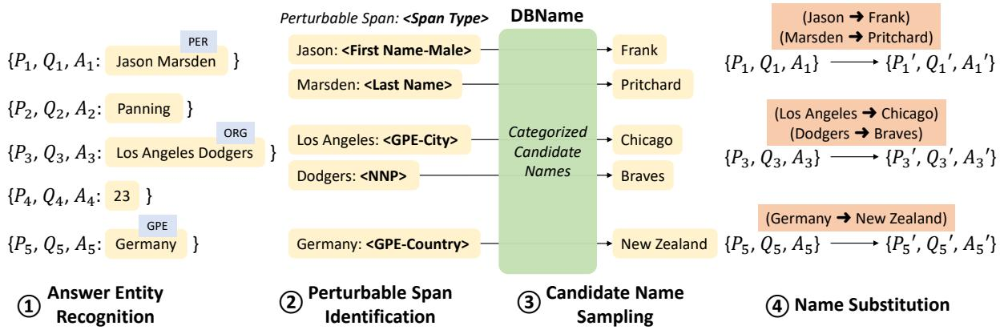
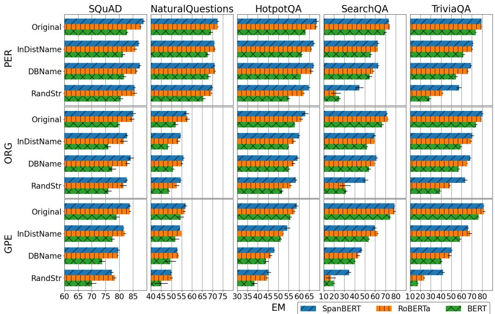

# On the Robustness of Reading Comprehension Models to Entity Renaming

Jun Yan1 Yang Xiao2 Sagnik Mukherjee3 Bill Yuchen Lin1 Robin Jia1 Xiang Ren1

University of Southern California1 Fudan University2 IIT Kanpur3 {yanjun,yuchen.lin,robinjia,xiangren}@usc.edu 17307100059@fudan.edu.cn sagnikm@iitk.ac.in

## Abstract

We study the robustness of machine read ing comprehension (MRC) models to entity renaming—do models make more wrong predictions when the same questions are asked about an entity whose name has been changed? Such failures imply that models overly rely on entity information to answer questions, and thus may generalize poorly when facts about the world change or questions are asked about novel entities. To systematically audit this issue, we present a pipeline to automatically generate test examples at scale, by replacing entity names in the original test sample with names from a variety of sources, ranging from names in the same test set, to common names in life, to arbitrary strings. Across five datasets and three pretrained model architectures, MRC models consistently perform worse when entities are renamed, with particularly large accuracy drops on datasets constructed via distant supervision. We also find large differences between models: SpanBERT, which is pretrained with span-level masking, is more robust than RoBERTa, despite having similar accuracy on unperturbed test data. We further experiment with different masking strategies as the continual pretraining objective and find that entity-based masking can improve the robustness of MRC models.1

## 1 Introduction

The task of machine reading comprehension (MRC) measures machines’ understanding and reasoning abilities. Recent research advances (Devlin et al., 2019; Yang et al., 2019; Khashabi et al., 2020) have driven MRC models to reach or even exceed human performance on several MRC benchmark datasets. However, their actual ability to solve the general MRC task is still questionable (Kaushik and Lipton, 2018; Sen and Saffari, 2020; Sugawara et al., 2020; Lai et al., 2021). While humans show robust generalization on reading comprehension, existing works have revealed that MRC models generalize poorly to out-of-domain data distributions (Fisch et al., 2019) and are brittle under test-time perturbations (Pruthi et al., 2019; Jia et al., 2019; Jia and Liang, 2017). All these issues could naturally happen to MRC systems deployed in the wild, hindering them to make reliable predictions on user inputs with great flexibility.

<table><tr><td colspan="2">[Question] Who got the first place in the game? [Passage]</td><td rowspan="2">[Answer]</td></tr><tr><td colspan="2">Original</td></tr><tr><td colspan="2">.… James beat Jack and won the championship.</td><td>Model: James</td></tr><tr><td colspan="3">Robustness Evaluation</td></tr><tr><td rowspan="2">Perturbation: InDistName</td><td></td><td>Model: 否</td></tr><tr><td>.…. Michael beat Jack and won the championship.</td><td>Michael</td></tr><tr><td rowspan="2">Perturbation: DBName</td><td></td><td>Model: 否</td></tr><tr><td>.… Ashvith beat Jack and won the championship.</td><td>Ashvith</td></tr><tr><td colspan="2">Perturbation: RandStr .…. Uqlcs beat Jack and won the championship.</td><td>Model: 雪</td></tr></table>

Figure 1: An illustrative example of the robustness to entity renaming and our proposed perturbations for robustness evaluation. “Michael” is from the answer of another test instance. “Ashvith” is a person name from an external database. “Uqlcs” is a random string with the same length as the original name.

In this work, we focus on an important but understudied type of test-time distribution shift caused by novel entity (e.g., person and company) names. Besides the evidence provided by the surrounding context, an MRC model also has the capacity to leverage the entity information to make predictions (Sugawara et al., 2018; Chen et al., 2016). The information associated with the entity name covers both world knowledge that can change over time and dataset shortcuts that are unlikely to generalize. While contributing to performance on certain benchmarks, the over-reliance on specific entity names leads to an overestimation of model’s actual ability to read and comprehend the provided passage (Peñas et al., 2011). It also hinders model generalization to novel entity names, which itself is challenging due to the large space of valid entity names induced by the flexibility of entity naming. For example, person names can be chosen from a large vocabulary depending on the country, while companies can be named in an even more creative way, not to mention new names that are being invented every day. As illustrated in Figure 1, keeping the reasoning context unchanged, a robust MRC model is supposed to correctly locate the same span of a named entity as the answer, even after it gets renamed.

To audit model robustness, we use entity renaming as test time perturbation to mimic the situation where a deployed MRC model encounters questions asking for novel entity names in the emerging data. We design a general pipeline to generate natural perturbations of MRC instances by swapping the answer entity name with another valid name throughout the passage. We design perturbation rules and collect resources for three types of entities with large name space: Person, Organization, and Geopolitical Entity.

With this proposed analysis framework, we conduct extensive experiments on five datasets and three pretrained language models. Data-wise, we find that distantly supervised MRC datasets lead to less robustness. Entity-wise, we find that geopolitical entities pose a greater challenge than people and organizations when renamed. Model-wise, we find that SpanBERT is more robust than BERT and RoBERTa, mainly due to its lower sensitivity to domain shift on names, which is likely a benefit of its span-focused pretraining objective. Inspired by this, we investigate several continual pretraining objectives and find that an entity-based masking strategy can further improve robustness.

## 2 Analysis Setup

## 2.1 Extractive MRC

The task of MRC tests a machine’ understanding and reasoning abilities by asking it to answer the question based on the provided passage. We focus on extractive MRC, where the answer is a span in the passage. Formally, given a question Q and a passage P of n tokens $P = \{ x _ { 1 } \ldots , x _ { n } \}$ a model is expected to predict an answer span $a = \{ x _ { i } , \dots , x _ { i + k } \} ( 1 \leq i \leq i + k \leq n )$ in the passage P as a response to the question Q. We use exact match (EM) as the metric for MRC evaluation, which is the percentage of test instances that the model exactly predicts one of the gold answers.

<table><tr><td>Dataset</td><td># Train</td><td># Dev</td><td># Test</td><td>DS?</td></tr><tr><td>SQuAD</td><td>77,929</td><td>8,659</td><td>10,507</td><td>x</td></tr><tr><td>NQ</td><td>84,577</td><td>9,367</td><td>12,836</td><td>x</td></tr><tr><td>HotpotQA</td><td>65,636</td><td>7,292</td><td>5,901</td><td>x</td></tr><tr><td>SearchQA</td><td>105,646</td><td>11,738</td><td>16,980</td><td>√</td></tr><tr><td>TriviaQA</td><td>42,569</td><td>4,696</td><td>7,785</td><td>√</td></tr></table>

Table 1: Evaluation datasets. “DS?” indicates whether distant supervision is used for data collection.

In both real-world scenarios and MRC datasets, a large portion of questions ask about entities like people, organizations and locations. While unmentioned background knowledge about the entities might be helpful for solving the questions, overly relying on it makes the model hard to adapt to updated facts provided by the passage and generalize to novel entities. Especially, we contrast MRC with closed-book QA, which requires a model to directly answer questions without access to any document passage. Closed-book QA tests a model’s ability to pack knowledge into its parameters and retrieve knowledge from parameters to answer the question. On the contrary, we expect an MRC model to reason based on the provided passage.

## 2.2 Evaluation Protocol

We study the robustness of MRC models via testtime perturbation. Given an original test set $D _ { \mathrm { t e s t } }$ and a perturbation function $f _ { \mathrm { p e r t u r b } }$ (detailed in §3) as inputs, we construct N perturbed test sets with N perturbation seeds. We evaluate the model on the N perturbed test sets. By averaging the results, we get the average-case EM score as the final metric, which measures the average impact on the model performance caused by the names from a certain perturbation. We set N = 5 in experiments.

## 2.3 Datasets

We choose five datasets with different characteristics from the MRQA 2019 shared task (Fisch et al., 2019): SQuAD (Rajpurkar et al., 2016), Natural Questions (NQ) (Kwiatkowski et al., 2019), HotpotQA (Yang et al., 2018), SearchQA (Dunn et al., 2017), and TriviaQA (Joshi et al., 2017). Since the official test sets of the MRQA datasets are hidden, we use the development set as the in-house test set, and hold out 10% of the training data as the in-house development set. Their statistics are shown in Table 1.

As a major difference in data collection, SQuAD, NQ, and HotpotQA employ crowdworkers to annotate the answer span in the passage, while SearchQA and TriviaQA use distant supervision to match the passage with the question. Distant supervision provides no guarantee that the passage contains enough evidence to derive the answer. The context where the entity span shows up may not even be related to the question.

## 2.4 MRC Models

We experiment with three pretrained language models that have demonstrated strong performance on popular MRC benchmarks. BERT (Devlin et al., 2019) is trained on English Wikipedia plus BookCorpus with masked language modeling (MLM) and next sentence prediction (NSP) as self-supervised objectives. RoBERTa (Liu et al., 2019) improves over BERT mainly by dropping the NSP objective and increasing the pretraining time and the size of pretraining data. SpanBERT (Joshi et al., 2020) masks random contiguous spans to implement MLM and replaces NSP with a spanboundary objective (SBO).

The pretrained language models are finetuned on the MRC dataset to predict the start and end tokens of the answer span based on the concatenated question and passage (Devlin et al., 2019). By default, all pretrained language models in the main experiments are case-sensitive and in their BASE sizes. More details are shown in Appendix §A.

## 3 Entity Name Substitution

In this section, we introduce our method for perturbing an MRC test set with substitution entity names, i.e., the instantiation of $f _ { \mathrm { p e r t u r b } }$ . Generating substitution names is at the core of our evaluation as different kinds of names measure a model’s behavior in different situations with different robustness implications. We propose three categories of perturbations on three entity types and collect the corresponding name resources, aiming to audit a model’s robustness from different perspectives.

## 3.1 Perturbation Pipeline

As illustrated in Figure 2, our perturbation pipeline consists of four steps, which are introduced below.

Step 1: Answer Entity Recognition. As we focus on the effect of answer entity renaming, we first identify entities in the answers by performing named entity recognition (NER) with spaCy (Honnibal et al., 2020) on the passage and extract the results on the answer spans. We identify three types of named entities: Person (PER), Organization (ORG), and Geopolitical Entity (GPE). All of them frequently appear as answers and have large space of valid names, making it important and challenging for models to robustly handle.

<table><tr><td rowspan=1 colspan=2>Entity Type</td><td rowspan=1 colspan=1>Applicable Types of Perturbable Spans</td></tr><tr><td rowspan=1 colspan=2>PER(4)</td><td rowspan=1 colspan=1>&lt;First Name-Male&gt; (e.g., Richard, Morton)&lt;First Name-Female&gt; (e.g., Lauren, Jennifer)&lt;First Name-Neutral&gt; (e.g., Shine, Frankie)&lt;Last Name&gt; (e.g., Marx, Winfrey)</td></tr><tr><td rowspan=2 colspan=1>ORG(5)</td><td rowspan=1 colspan=1></td><td rowspan=1 colspan=1>&lt;NNP&gt; (e.g., Celtic, Tiffany)&lt;Rare&gt; (e.g., Hufflepuff, Pokemon)</td></tr><tr><td rowspan=1 colspan=1>GPE(3)</td><td rowspan=1 colspan=1>&lt;GPE-Country&gt; (e.g., Iceland, Algeria)&lt;GPE-State&gt; (e.g., New Brunswick, Ohio)&lt;GPE-City&gt; (e.g., Boston, Sonsonate)</td></tr></table>

Table 2: Applicable metadata for each entity type in the perturbation pipeline.
<table><tr><td>Dataset</td><td>#PER</td><td># ORG</td><td># GPE</td><td>#MIX</td></tr><tr><td>SQuAD</td><td>1,170</td><td>1,095</td><td>602</td><td>2,613</td></tr><tr><td>NQ</td><td>3,257</td><td>1,207</td><td>1,414</td><td>5,150</td></tr><tr><td>HotpotQA</td><td>1,351</td><td>824</td><td>788</td><td>2,614</td></tr><tr><td>SearchQA</td><td>5,707</td><td>2,450</td><td>2,248</td><td>8,688</td></tr><tr><td>TriviaQA</td><td>2,747</td><td>1,276</td><td>1,270</td><td>4,351</td></tr></table>

Table 3: Statistics of the perturbable subsets for different entity types and their union (“MIX”).

Step 2: Perturbable Span Identification. To facilitate name substitution, we assign metadata to detected entity names by identifying perturbable spans within the entity name. For each type of entity names, we define the applicable span types in Table 2. The heuristics for identifying each type of perturbable spans are introduced in Appendix §B. Note that given one or more entity types of interest, in this step we filter the test data to only keep a subset of instances with non-empty metadata for the corresponding entity types, which are instances that are ready to be perturbed. Sizes of the perturbable subsets for different entity types and their union (MIX) are shown in Table 3.

Step 3: Candidate Name Sampling. For each perturbable span, we get its substitution name by querying an external dictionary with the span type. The substitution name is randomly sampled from a pool of names in the external dictionary with the same span type. We collect dictionaries with names of different characteristics serving for different analysis purpose, which are detailed in §3.2.

  
Figure 2: The perturbation pipeline for performing entity name substitution on MRC instances.

Step 4: Name Substitution. Once we have a candidate name for each perturbable span, we perform string mapping on the passage, question, and the gold answer, to finish the entity renaming in MRC instances. The name substitution changes all mentions of the answer entity in the passage while keeping the other reasoning context.

## 3.2 Candidate Name Collection

We consider three types of candidate names for perturbations in our main experiments to simulate the domain shift of entity names during test time.

In-Distribution Name (InDistName). The set of candidate names with their span types is the same as the perturbable spans with their types identified from the gold answers in the test set. This ensures that no new name is introduced to the test set.

Database Name (DBName). We collect names in the real world by referring to relevant databases. For PER, we collect first names2 (with gender frequency) and last names3 from the official statistics of person names in the U.S. (We experiment with names from other countries and languages in §4.5.) We regard a first name as a male/female name if its male/female frequency is two times larger than its frequency of the opposite gender. The remaining names are considered as neutral. Following the practice for identifying perturbable spans, we get the list of country/state/city names using Countries States Cities Database and the NNP list using PTB. Rare words constitute an open vocabulary so they will not be substituted under the DBName perturbation.

<table><tr><td>Accuracy</td><td>PER</td><td>ORG</td><td>GPE</td></tr><tr><td>Perturbable Span Identification</td><td>93.3%</td><td>86.7%</td><td>93.3%</td></tr><tr><td>Name Substitution</td><td>86.7%</td><td>96.7%</td><td>96.7%</td></tr></table>

Table 4: Validity of the two key steps in the perturbation pipeline on 30 randomly sampled TriviaQA instances for each entity type.

Random String (RandStr). The RandStr perturbation is different from the other two as it neglects the query span type when preparing the candidates. We generate a random alphabetical string of the same length and casing as the original perturbable span. Names from low-resource languages can look quite irregular to the pretrained language models. Random string as an extreme case provides an estimation of the performance in this scenario.

## 3.3 Perturbation Quality

The validity of the perturbed instances depends on the quality of the perturbation pipeline (§3.1). We manually check the accuracy of the perturbation steps on TriviaQA, which demonstrates the largest performance drop as we will show. Out of the four steps in the pipeline (Figure 2), we evaluate the accuracy of step 2 (“Perturbable Span Identification”) and step 4 (“Name Substituion”) while the accuracy of the other two steps can be inferred. The evaluation details are provided in Appendix §C. As shown in Table 4, our method gets acceptable accuracy on the three entity types, confirming the quality of the perturbed test sets.

## 4 Results and Analysis

The average-case EM scores on the original and perturbed test sets are presented in Figure 3. We report the mean and standard deviation over 3 train-

  
Figure 3: Main results. EM scores for MRC models evaluated on datasets under different perturbations.

<table><tr><td>BERT@MIX</td><td>SQuAD</td><td>NQ</td><td>HotpotQA</td><td>SearchQA</td><td>TriviaQA</td></tr><tr><td>Original</td><td>81.2±0.3</td><td> $6 4 . 4 { \scriptstyle \pm 1 . 0 }$ </td><td> $6 0 . 0 { \scriptstyle \pm 0 . 2 }$ </td><td> $6 9 . 5 { \scriptstyle \pm 1 . 1 }$ </td><td>73.4±0.8</td></tr><tr><td>InDistName</td><td>78.7±0.6</td><td>62.0±1.2</td><td>56.8±0.4</td><td>53.6±1.3</td><td>59.0±1.4</td></tr><tr><td>DBName</td><td>78.8±0.9</td><td>62.1±1.3</td><td>54.9±0.3</td><td> $5 0 . 2 { \scriptstyle \pm 1 . 8 }$ </td><td>50.4±1.6</td></tr><tr><td>RandStr</td><td> $7 6 . 9 { \scriptstyle \pm 1 . 0 }$ </td><td> $5 9 . 0 { \scriptstyle \pm 1 . 7 }$ </td><td> $4 9 . 5 { \scriptstyle \pm 0 . 8 }$ </td><td> $2 3 . 6 _ { \pm 1 . 2 }$ </td><td> $2 5 . 4 { \scriptstyle \pm 1 . 4 }$ </td></tr></table>

Table 5: Comparison of different datasets. EM scores of BERT on the original and perturbed test sets of the MIX entity type.
<table><tr><td>Wrong Entity Error</td><td>SQuAD</td><td>NQ</td><td>HotpotQA</td><td>SearchQA</td><td>TriviaQA</td></tr><tr><td>Original</td><td>33.9%</td><td>34.3%</td><td>27.3%</td><td>46.3%</td><td>69.0%</td></tr><tr><td>InDistName</td><td>38.4%</td><td>37.5%</td><td>32.3%</td><td>66.2%</td><td>76.6%</td></tr><tr><td>DBName</td><td>38.0%</td><td>37.3%</td><td>33.3%</td><td>67.2%</td><td>77.6%</td></tr><tr><td>RandStr</td><td>42.7%</td><td>41.2%</td><td>39.1%</td><td>84.7%</td><td>86.8%</td></tr></table>

Table 6: Error analysis. The percentage of wrong entity errors of BERT on the original and perturbed test sets of the MIX entity type.

ing seeds. We analyze the results from several angles by aggregating across certain dimensions.

## 4.1 Which datasets lead to less robustness?

Training on MRC datasets created with distant supervision leads to less robustness. In Table 5, we show the results of BERT on the original and perturbed test sets, while results of RoBERTa and SpanBERT follow similar patterns. The perturbations on all 3 entity types are combined (shown as “MIX”). We find that models trained on SQuAD, NQ, and HotpotQA (with at most 6% performance drop under the DBName perturbation)

are significantly more robust than models trained on SearchQA and TriviaQA (with about 20% performance drop under the DBName perturbation). While the first group of datasets are human-labeled, the later group of datasets are constructed using distant supervision. Such correlation indicates that training noise due to mismatched questions and passages harms model’s robustness. We hypothesize the reason to be that, the passage in the humanannotated datasets usually provides enough evidence to derive the answer, so a model is able to learn the actual task of “reading comprehension” from the data. On the contrary, SearchQA and TriviaQA use web snippets as the source of passages. The labeling process of distant supervision assumes that “the presence of the answer string implies the document does answer the question” (Joshi et al., 2017), while the document may or may not contain all facts needed to support the answer. In this case, because the actual reading comprehension task is difficult to learn due to lack of evidence, the model could be prone to use entity-specific background knowledge (e.g. assuming that “Jack Higgins” is a British author regardless of the context) or learn dataset-specific shortcuts associated with certain names via memorization (e.g., choosing “Jack Higgins” whenever it’s mentioned in the passage and the question asks for an author), which causes the robustness issue.

To better understand the failure cases, we categorize the errors made by the model into two classes: wrong entity errors and wrong boundary errors, based on whether the predicted span has any word overlap with the gold answer. We report the percentage of wrong entity errors in Table 6. On all datasets, wrong entity errors make up a larger percentage of all errors when the test sets get perturbed. This suggests that the performance drop is mainly caused by the increasing errors in identifying the correct answer entity rather than accurately predicting the boundary of a correctly-identified answer entity.

<table><tr><td>BERT</td><td>SQuAD</td><td>NQ</td><td>HotpotQA |</td><td>SearchQA</td><td>TriviaQA</td></tr><tr><td rowspan="2">PER-Original PER-DBName PER-∆</td><td> $8 2 . 8 { \scriptstyle \pm 0 . 4 }$ </td><td> $6 9 . 3 { \scriptstyle \pm 0 . 9 }$ </td><td> $6 3 . 1 _ { \pm 0 . 1 }$ </td><td> $6 9 . 7 _ { \pm 1 . 4 }$ </td><td> $7 3 . 6 { \scriptstyle \pm 0 . 7 }$ </td></tr><tr><td> $8 1 . 7 _ { \pm 0 . 8 }$  1.1</td><td> $6 8 . 0 { \scriptstyle \pm 1 . 0 }$  1.3</td><td> $6 0 . 8 { \scriptstyle \pm 0 . 2 }$  2.3</td><td> $5 4 . 6 _ { \pm 2 . 3 }$  15.1</td><td> $5 4 . 6 _ { \pm 1 . 6 }$  19.0</td></tr><tr><td rowspan="2">ORG-Original ORG-DBName</td><td> $7 9 . 7 _ { \pm 0 . 6 }$ </td><td> $5 2 . 1 _ { \pm 1 . 2 }$ </td><td> $5 8 . 0 { \scriptstyle \pm 0 . 3 }$ </td><td> $6 6 . 7 _ { \pm 1 . 5 }$ </td><td> $7 3 . 8 { \scriptstyle \pm 1 . 5 }$ </td></tr><tr><td> $7 7 . 5 { \scriptstyle \pm 1 . 4 }$ </td><td> $5 0 . 8 { \scriptstyle \pm 0 . 8 }$ </td><td> $5 5 . 0 { \scriptstyle \pm 0 . 6 }$ </td><td> $5 4 . 2 _ { \pm 1 . 6 }$ </td><td> $5 7 . 0 { \scriptstyle \pm 1 . 5 }$ </td></tr><tr><td rowspan="2">ORG-∆ GPE-Original</td><td>2.2</td><td>1.3</td><td>3.0</td><td> $1 2 . 5$ </td><td>16.8</td></tr><tr><td> $7 9 . 1 _ { \pm 1 . 0 }$ </td><td> $5 4 . 5 { \scriptstyle \pm 1 . 7 }$ </td><td> $5 5 . 8 { \scriptstyle \pm 0 . 6 }$ </td><td> $7 4 . 4 { \scriptstyle \pm 0 . 8 }$ </td><td> $7 6 . 4 \pm 0 . 6$ </td></tr><tr><td rowspan="2">GPE-DBName GPE-∆</td><td> $7 3 . 7 _ { \pm 1 . 1 }$ </td><td> $4 9 . 5 { \scriptstyle \pm 2 . 7 }$ </td><td> $4 3 . 9 { \pm } 1 . 3 $ </td><td> $4 0 . 1 _ { \pm 0 . 8 }$ </td><td> $4 0 . 1 _ { \pm 1 . 3 }$ </td></tr><tr><td>5.4</td><td>5.0</td><td>11.9</td><td> $_ { 3 4 . 3 }$ </td><td>36.3</td></tr></table>

Table 7: Comparison of different entity types. EM scores of BERT on the Original and DBName test sets.

<table><tr><td>MIX</td><td>BERT</td><td>RoBERTa</td><td>SpanBERT</td></tr><tr><td>Original</td><td> $6 9 . 5 { \scriptstyle \pm 1 . 1 } / 7 3 . 4 { \scriptstyle \pm 0 . 8 }$ </td><td> $\mathbf { 7 4 . 1 { \scriptstyle \pm 0 . 2 } / 7 8 . 6 { \scriptstyle \pm 0 . 4 } }$ </td><td> $7 3 . 2 { \scriptstyle \pm 0 . 7 } / 7 9 . 1 { \scriptstyle \pm 0 . 1 }$ </td></tr><tr><td>InDistName</td><td> $5 3 . 6 { \scriptstyle \pm 1 . 3 } / 5 9 . 0 _ { \pm 1 . 4 }$ </td><td> ${ \bf 6 0 . 7 { \scriptstyle \pm 0 . 4 } } / { 6 7 . 8 { \scriptstyle \pm 1 . 1 } }$ </td><td> $6 0 . 3 _ { \pm 1 . 4 } / 6 8 . 3 _ { \pm 0 . 8 }$ </td></tr><tr><td>DBName</td><td> $5 0 . 2 { \scriptstyle \pm 1 . 8 } / 5 0 . 4 { \scriptstyle \pm 1 . 6 }$ </td><td> $5 4 . 0 { \scriptstyle \pm 1 . 0 } / 6 0 . 5 { \scriptstyle \pm 0 . 9 }$ </td><td> $\mathbf { 5 7 . 9 { \scriptstyle \pm 1 . 0 } / 6 3 . 1 { \scriptstyle \pm 0 . 8 } }$ </td></tr><tr><td>RandStr</td><td> $2 3 . 6 _ { \pm 1 . 2 } / 2 5 . 4 _ { \pm 1 . 4 }$ </td><td> $2 1 . 0 { \scriptstyle \pm } _ { 4 . 8 } / 3 5 . 6 { \scriptstyle \pm } _ { 0 . 2 }$ </td><td> $\mathbf { 4 1 . 5 { \scriptstyle \pm 3 . 2 } / 5 1 . 9 } _ { \pm 2 . 3 }$ </td></tr></table>

Table 8: Comparison of different models. EM scores on the original and perturbed test sets of the MIX entity type on SearchQA/TriviaQA.

## 4.2 Which entity types are more challenging?

GPE renaming poses the greatest robustness challenge. The renaming of PER and ORG are similarly less challenging. In Table 7, we present the performance drop caused by the DBName perturbation for each entity type. GPE renaming shows the largest performance drop. The comparison of PER and ORG differs across datasets, but their corresponding performance drops are generally similar. The reason is likely to be that the model is only exposed to a small number of distinct GPE names during finetuning compared to PER and ORG. In the training set of TriviaQA, there are 40k ORG names and 54k PER names, but only 12k GPE names. The lack of seen names makes it hard to learn the generalization ability.

<table><tr><td>MIX V</td><td>BERT</td><td>RoBERTa</td><td>SpanBERT</td></tr><tr><td>Original 1</td><td> $7 3 . 4 { \scriptstyle \pm 0 . 8 } / 7 6 . 3 { \scriptstyle \pm 1 . 1 }$ </td><td> $7 8 . 6 _ { \pm 0 . 4 } / 8 2 . 3 _ { \pm 0 . 2 }$ </td><td> $\mathbf { 7 9 . 1 _ { \pm 0 . 1 } } / 8 2 . 8 _ { \pm 0 . 6 }$ </td></tr><tr><td>InDistName</td><td> $5 9 . 0 { \scriptstyle \pm 1 . 4 } / 6 1 . 3 { \scriptstyle \pm 0 . 4 }$ </td><td> $6 7 . 8 { \scriptstyle \pm 1 . 1 } / 7 0 . 8 { \scriptstyle \pm 0 . 6 }$ </td><td> $\mathbf { 6 8 . 3 _ { \pm 0 . 8 } / 7 2 . 1 _ { \pm 0 . 7 } }$ </td></tr><tr><td rowspan="2">DBName RandStr</td><td> $5 0 . 4 { \scriptstyle \pm 1 . 6 } / 5 2 . 6 { \scriptstyle \pm 0 . 7 }$ </td><td> $6 0 . 5 _ { \pm 0 . 9 } / 6 2 . 6 _ { \pm 1 . 3 }$ </td><td> ${ \bf 6 3 . 1 { \scriptstyle \pm } 0 . 8 } / { \bf 6 6 . 9 { \scriptstyle \pm } 0 . 6 }$ </td></tr><tr><td> $2 5 . 4 { \scriptstyle \pm 1 . 4 } / 2 7 . 9 { \scriptstyle \pm 2 . 4 }$ </td><td> $3 5 . 6 _ { \pm 0 . 2 } / 3 5 . 8 _ { \pm 3 . 1 }$ </td><td> $\mathbf { 5 1 . 9 { \scriptstyle \pm } 2 . 3 } / 5 3 . 6 _ { \pm 4 . 9 }$ </td></tr></table>

Table 9: Comparison of different model sizes. EM scores of the BASE/LARGE variants of models on the original and perturbed test sets of the MIX entity type on TriviaQA.

## 4.3 Which models are more robust?

On distantly supervised datasets, SpanBERT is more robust than RoBERTa, which is more robust than BERT. In Table 8, we show the performance of the three models under perturbations of the MIX entity type on SearchQA and TriviaQA. While RoBERTa and SpanBERT show comparable performance on the original and InDist-Name test sets, SpanBERT’s improvement over RoBERTa becomes larger with more difficult perturbations. Meanwhile, BERT shows even larger performance decreases than RoBERTa. The models’ performance differences are mainly attributed to their different pretraining strategies. RoBERTa’s improvement over BERT indicates that a better pretraining configuration (as measured by the performance on the in-domain original test set) is also beneficial to the performance on the perturbed test sets, suggesting better generalization ability to the out-of-domain data. This correlation is consistent with the findings in Miller et al. (2021). Span-BERT’s particular advantage on the perturbed test sets indicates its span-focused pretraining objective (span-based MLM and span prediction based on boundary tokens) is especially helpful for the spanrelated robustness, which is desired for the MRC task.

Larger models are not more robust. In Table 9, we compare the performance of the BASE and LARGE variants of pretrained models on TriviaQA. The performance drops from the original test sets to the perturbed test sets are similar for these two variants in most cases, suggesting that simply increasing the model size can not resolve the robustness issue.

## 4.4 How can we disentangle reasons for performance drop?

Both loss of entity knowledge and domain shift on names happen during renaming. The information associated with the entity name that can be leveraged by the model includes both entity knowledge and name clues. Entity knowledge refers to the world knowledge associated with the referred entity, like “Michelle Obama is the wife of Barack Obama,” while name clues refer to statistical clues associated with the name’s surface form, like “Barack Obama is likely to be a male name”, “Barack Obama as an in-distribution name is likely to be the answer for this dataset”. While all perturbations break the entity knowledge about the original entity, InDistName doesn’t introduce additional domain shift on names and largely preserve the name clues. Going from InDistName to other perturbations, the substitution names become more and more out of the dataset distribution. This performance drop can be attributed to the model’s sensitivity to name-related domain shift.

<table><tr><td>Unseen@MIX</td><td>Original/ InDistName</td><td>DBName</td><td>RandStr</td></tr><tr><td>SQuAD</td><td>33% / 24%</td><td>94% / 92%</td><td>100% / 100%</td></tr><tr><td>NQ</td><td>14% / 4%</td><td>95% / 89%</td><td>100% / 100%</td></tr><tr><td>HotpotQA</td><td>19% / 3%</td><td>96% / 89%</td><td>100% / 100%</td></tr><tr><td>SearchQA</td><td>7% / 0%</td><td>92% / 78%</td><td>100% / 100%</td></tr><tr><td>TriviaQA</td><td>21% / 2%</td><td>93% / 83%</td><td>100% / 100%</td></tr></table>

Table 10: The percentage of test answer entity tokens that are never seen in the training answer/passage entities.

<table><tr><td>Accuracy</td><td>Original</td><td>InDistName</td><td>DBName</td><td>RandStr</td></tr><tr><td>PER</td><td>75.6%</td><td>73.4%</td><td>58.0%</td><td>60.0%</td></tr><tr><td>ORG</td><td>60.1%</td><td>50.6%</td><td>49.2%</td><td>48.0%</td></tr><tr><td>GPE</td><td>84.4%</td><td>83.4%</td><td>43.2%</td><td>27.6%</td></tr></table>

Table 11: Accuracy of the trained NER model to recognize the original and perturbed answer entities on SQuAD.

We adopt two measurements to better understand the domain shift on names. As a token-level measurement, we calculate the percentage of test answer entity tokens that are never seen in entities in training answers and entities in training passages, as shown in Table 10. Different datasets have different percentages of unseen tokens in the original test sets, which are mainly affected by the size and diversity of training data. The number goes up with the DBName and RandStr perturbations. As an entity-level measurement, we train an NER model4 on the training passages, with named entities annotated by spaCy as ground truth. We evaluate the trained model on perturbed test sets and calculate its accuracy of recognizing the perturbed answer entity. The results are shown in Table 11. As a sign of domain shift, the recognition of answer entities become more difficult when they get perturbed. GPE shows the most significant perturbation drop, which correlate with our observation on the MRC task (§4.2).

SpanBERT’s superior robustness over RoBERTa is mainly from handling domain shift. From SearchQA and TriviaQA results in Table 8, we find that RoBERTa and SpanBERT rely similarly on the entity knowledge (\~13% performance drop from Original to InDistName on SearchQA and \~11% on TriviaQA). SpanBERT’s advantage over RoBERTa is mainly on its good robustness to domain shift on names, shown by the perfromance drop from IndistName to other perturbations. BERT relies slightly more on entity knowledge but much more sensitive to domain shift on names.

## 4.5 Bias Exhibited by Person Names

National Origins. As the DBName perturbation uses person names in the U.S., it cannot fully reflect the model’s robustness behavior when encountering real-world names of different national origins. Therefore, we additional collect names from more countries (India, China) and languages (French, Arabic) to study the potential bias in MRC models. We use the romanized form of names. Table 12 shows the performance comparison of models when evaluated with the person names from different countries and languages on SearchQA and TriviaQA. Names form the U.S. and Frenchspeaking countries generally achieve the highest EM scores. Names from China get the lowest performance for the most of time, with significant EM drop (8.4% on SearchQA and 9.8% on TriviaQA for BERT) from U.S. names. The performance gap between different countries and languages becomes smaller with more robust models.

Other Factors. We also consider other factors of a name that could be related to biased model performance. We limit our scope to the U.S. first names and sample 1500 names from the database. We consider two features for each name. Gender polarity is defined as max $\textstyle { \big ( } { \frac { f _ { m } } { f _ { f } } } , { \frac { f _ { f } } { f _ { m } } } { \big ) }$ , where $f _ { m } , f _ { f }$ are the male frequency and female frequency of a name provided by the database. It measures the gender ambiguity of the name. Popularity is defined as $f _ { m } + f _ { f }$ . We calculate the EM score for a name by evaluating on a test set where all answer first names get replaced with this name. For what we have tried, we didn’t find evidence to support a correlation between each factor and the EM score. For example, with SpanBERT on TriviaQA, names with top 20% gender polarity gets 72.7% EM on average; while the bottom 10% names gets 72.8% EM. The numbers are 73.0% vs 72.7% for popularity. We leave exploring factors that correlate with the difficulty of a name as future work.

<table><tr><td>Country/ Language</td><td>BERT</td><td>RoBERTa</td><td>SpanBERT</td></tr><tr><td>U.S.</td><td> $5 4 . 6 { \scriptstyle \pm 2 . 3 } / 5 4 . 6 { \scriptstyle \pm 1 . 6 }$ </td><td> $5 8 . 1 { \scriptstyle \pm 0 . 9 } / { \bf 6 6 . 1 } { \scriptstyle \pm 0 . 6 }$ </td><td> $6 3 . 0 { \scriptstyle \pm 1 . 1 } / 6 9 . 1 { \scriptstyle \pm 0 . 7 }$ </td></tr><tr><td>French India</td><td> $\mathbf { 5 5 . 5 { \scriptstyle \pm 2 . 2 } / 5 6 . 1 { \scriptstyle \pm 1 . 7 } }$ </td><td> $\mathbf { 5 8 . 2 _ { \pm 1 . 1 } } / 6 6 . 0 _ { \pm 0 . 5 }$ </td><td> $6 3 . 0 { \scriptstyle \pm 1 . 2 } / 6 8 . 8 { \scriptstyle \pm 0 . 9 }$ </td></tr><tr><td>Arabic</td><td> $5 3 . 5 { \scriptstyle \pm 2 . 5 } / 5 1 . 9 { \scriptstyle \pm 2 . 7 }$ </td><td> $5 6 . 5 { \scriptstyle \pm 1 . 9 } / 6 3 . 9 { \scriptstyle \pm 0 . 8 }$ </td><td>63  $\mathbf { . 0 { \scriptstyle \pm 1 . 1 } } / 6 8 . 0 _ { \pm 0 . 4 }$ </td></tr><tr><td>China</td><td> $5 3 . 3 _ { \pm 3 . 1 } / 4 8 . 8 _ { \pm 3 . 2 }$   $4 6 . 2 { \scriptstyle \pm 2 . 5 } / 4 4 . 8 { \scriptstyle \pm 3 . 6 }$ </td><td> $5 6 . 3 _ { \pm 2 . 1 } / 6 1 . 8 _ { \pm 0 . 9 }$   $5 4 . 0 { \scriptstyle \pm 0 . 8 } / 6 3 . 0 { \scriptstyle \pm 1 . 4 }$ </td><td> $6 2 . 8 { \scriptstyle \pm 1 . 0 } / 6 6 . 2 { \scriptstyle \pm 0 . 8 }$   $5 9 . 3 _ { \pm 2 . 0 } / 6 5 . 2 _ { \pm 0 . 4 }$ </td></tr><tr><td>RandStr</td><td></td><td></td><td></td></tr><tr><td></td><td> $2 5 . 0 { \scriptstyle \pm 1 . 6 } / 2 8 . 9 { \scriptstyle \pm 1 . 6 }$ </td><td> $2 2 . 0 { \scriptstyle \pm } 4 . 7  / 4 1 . 3 { \scriptstyle \pm } 0 . 8$ </td><td> $4 4 . 6 { \scriptstyle \pm 4 . 0 } / 5 7 . 4 { \scriptstyle \pm 2 . 4 }$ </td></tr></table>

Table 12: Performance comparison of person names of different national origins. EM scores on the original and perturbed test sets of the PER entity type on SearchQA/TriviaQA.

## 4.6 Improving Robustness with Continual Pretraining

SpanBERT’s advantage over BERT suggests that some variants of MLM could be helpful for model robustness. To further improve the robustness of SpanBERT, we adopt a training paradigm with an inserted continual pretraining stage and compare MLM with different masking strategies as the objectives.

Training Paradigm. Existing works mainly seek to improve model robustness during finetuning with strategies like data augmentation (Ribeiro et al., 2019; Min et al., 2020), but they usually increase finetuning time and requires additional data. Some recent works (Gururangan et al., 2020; Ye et al., 2021) have explored improving a pretrained language model with “continual pretraining”— continuing to train a pretrained model for more steps with some objective. The generated checkpoint can be used for finetuning on any dataset in the standard way with no additional cost.

Experimental Setup. The masking policy in MLM plays an important role in instructing model learning, which can be potentially used to improve model robustness. Inspired by previous works, we experiment with four heuristic masking policies to implement the MLM objective: MLM (vanilla), MLM (whole word), MLM (span), and

MLM (entity). They perform masking at token, whole-word, span, and entity level respectively. Starting from SpanBERT (-BASE), we run continual pretraining with the above objectives for 8,000 steps. More details are described in Appendix §D.

Results. The results for models finetuned from SpanBERT and different continually pretrained models are shown in Table 13. On SQuAD, all masking policies slightly downgrade the performance. With not much room for robustness improvement, running continual pretraining is probably at the cost of slightly sacrificing the performance due to the inconsistent objective and discontinuous learning rate that are applied when starting the continual pretraining. On SearchQA and TriviaQA, out of the four masking policies, the entity-based masking policy shows consistent improvement over SpanBERT. As analyzed in §4.4, name-related domain shift is a major challenge for the model to handle. By predicting the masked entity, the model is exposed to the diverse entities in the pertraining corpus in a more explicit way, and gain a better sense in recognizing entities. Note that the improvement is not statistically significant in some cases and we leave the exploration of more effective methods to improve model robustness as future work.

## 5 Related Work

Robustness of MRC Models. The robustness of MRC models are usually evaluated against testtime perturbations and out-of-domain data. Research on test-time perturbation proposes perturbation methods at different levels as attacks (Si et al., 2021), such as word replacement with neighbors in the vector space (Rychalska et al., 2018; Jia et al., 2019), question paraphrasing (Gan and Ng, 2019; Ribeiro et al., 2018), sentence distractor injection (Jia and Liang, 2017; Zhou et al., 2020). Another line of research (Fisch et al., 2019; Sen and Saffari, 2020) tests a model on data with out-of-domain passage or question distributions, usually from different datasets. Our work mainly falls into the category of test-time perturbation. We distinguish from previous work by focusing on the effect of entity renaming, with the motivation that entities can have flexible and diverse names in the real life.

Model Robustness to Entity Substitution. It is non-trivial for NLP models to be able to properly handle the large space of named entities. Previous works use entity substitution to audit or improve model robustness on different tasks like NER (Agarwal et al., 2020; Lin et al., 2021), Natural Language Inference (Mitra et al., 2020), Coreference Resolution (Subramanian and Roth, 2019), and Dialogue State Tracking (Cho et al., 2021). Shwartz et al. (2020) experiment with name swapping to show that a trained MRC model has bias on some U.S. given names due to the grounding effects that associate names with certain entities. Ribeiro et al. (2020) and Balasubramanian et al. (2020) investi gate the robustness of models on several tasks with named entity replacement. However, these works didn’t systematically test on MRC datasets with dif ferent characteristics to unveil the actual robustness challenge. Liu et al. (2021) study the novel entity generalization ability of open-domain QA models by categorizing the test questions based on whether the named entities have been seen during training. Longpre et al. (2021) analyze the memorization behavior of generative open-domain QA models using knowledge conflicts. They use entity substitution to create test passages that contain facts contradicting to what the model has learned during training time. In contrast, we analyze extractive MRC model’s robustness when encountering new entities, by evaluating on modified test sets without intentionally introduced knowledge conflicts. The extractive task formulation also makes the model unable to output its memorized knowledge as generative models, leading to different analysis questions and methods.

<table><tr><td></td><td colspan="3">SQuAD</td><td colspan="3">SearchQA</td><td colspan="3">TriviaQA</td></tr><tr><td>Model / Perturbation (MIX)</td><td>Original</td><td>DBName</td><td>RandStr</td><td>Original</td><td>DBName</td><td>RandStr | Original</td><td></td><td>DBName</td><td>RandStr</td></tr><tr><td>SpanBERT</td><td> $\mathbf { 8 6 . 8 _ { \pm 0 . 5 } }$ </td><td> ${ \bf 8 4 . 9 _ { \pm 0 . 4 } }$ </td><td> ${ \bf 8 3 . 0 _ { \pm 0 . 1 } }$ </td><td> $7 3 . 2 { \scriptstyle \pm 0 . 7 }$ </td><td> $5 7 . 9 { \pm } 1 . 0 $ </td><td> $4 1 . 5 { \scriptstyle \pm 3 . 2 }$ </td><td> $7 9 . 1 { \scriptstyle \pm 0 . 1 }$ </td><td> $6 3 . 1 { \pm } 0 . 8 $ </td><td> $5 1 . 9 { \scriptstyle \pm 2 . 3 }$ </td></tr><tr><td>SpanBERT w/ continual pretraining</td><td></td><td></td><td></td><td></td><td></td><td></td><td></td><td></td><td></td></tr><tr><td>+ MLM (vanilla)</td><td> $8 5 . 6 { \scriptstyle \pm 0 . 5 }$ </td><td> $8 3 . 9 { \scriptstyle \pm 0 . 2 }$ </td><td> $8 1 . 8 { \scriptstyle \pm 0 . 2 }$ </td><td> $7 2 . 3 { \scriptstyle \pm 0 . 8 }$ </td><td> $5 7 . 0 { \scriptstyle \pm 0 . 3 }$ </td><td> $3 4 . 8 { \scriptstyle \pm 2 . 9 }$ </td><td> $7 8 . 9 { \scriptstyle \pm 0 . 8 }$ </td><td> $6 4 . 1 { \scriptstyle \pm 0 . 2 }$ </td><td> $4 8 . 1 { \scriptstyle \pm 2 . 9 }$ </td></tr><tr><td>+ MLM (whole word)</td><td> $8 6 . 0 { \scriptstyle \pm 0 . 7 }$ </td><td> $8 4 . 5 { \scriptstyle \pm 0 . 3 }$ </td><td> $8 2 . 7 _ { \pm 0 . 4 }$ </td><td> $7 2 . 9 _ { \pm 0 . 4 }$ </td><td> $5 8 . 0 { \scriptstyle \pm 0 . 2 }$ </td><td> $4 1 . 6 _ { \pm 3 . 3 }$ </td><td> $7 9 . 1 _ { \pm 0 . 5 }$ </td><td> $6 4 . 2 _ { \pm 0 . 4 }$ </td><td> $5 0 . 1 _ { \pm 0 . 9 }$ </td></tr><tr><td>+ MLM (span)</td><td> $8 5 . 7 _ { \pm 0 . 2 }$ </td><td> $8 4 . 1 { \scriptstyle \pm 0 . 1 }$ </td><td> $8 2 . 6 { \scriptstyle \pm 0 . 1 }$ </td><td> $7 3 . 3 { \scriptstyle \pm 0 . 5 }$ </td><td> $5 7 . 9 { \scriptstyle \pm 0 . 8 }$ </td><td> $3 9 . 5 { \scriptstyle \pm 2 . 4 }$ </td><td> $7 9 . 4 { \scriptstyle \pm 0 . 8 }$ </td><td> $6 4 . 3 { \scriptstyle \pm 0 . 4 } ^ { * }$ </td><td> $5 4 . 1 { \pm } 1 . 5$ </td></tr><tr><td>+ MLM (entity)</td><td> $8 6 . 0 { \scriptstyle \pm 0 . 4 }$ </td><td> $8 4 . 3 { \scriptstyle \pm 0 . 3 }$ </td><td> $8 2 . 7 _ { \pm 0 . 1 }$ </td><td> ${ \bf 7 3 . 4 _ { \pm 0 . 4 } }$ </td><td> ${ \bf 5 9 . 3 _ { \pm 1 . 1 } }$ </td><td> ${ \bf 4 8 . 1 { \scriptstyle \pm 4 . 6 } }$ </td><td> ${ \bf 7 9 . 6 _ { \pm 0 . 6 } }$ </td><td> ${ \bf 6 5 . 9 { \pm } 1 . 1 } ^ { \ast }$ </td><td> ${ \bf 5 5 . 5 } _ { \pm 2 . 7 }$ </td></tr></table>

Table 13: EM scores of different continually pretrained models on the original and perturbed test sets. Significant improvements $( p < 0 . 0 5 )$ over SpanBERT are marked with \*.

## 6 Conclusion

In this paper, we systematically study the robustness of MRC models to entity name substitution. Specifically, we propose a substitution framework along with candidate names of different implications. We experiment with three pretrained language models on five MRC datasets. We find that models trained on distantly-supervised datasets are susceptible to entity name substitution, while models trained on human-annotated datasets are relatively robust, with GPE renaming harder than PER and ORG renaming. The lack of robustness can be further attributed to model’s overreliance on entity knowledge and name clues. We also find that SpanBERT, which is pretrained using span-level objectives, shows better robustness than BERT and RoBERTa. Leveraging these insights, we study defense approaches based on continual pretraining and demonstrate that entity-based masking policies are beneficial to model’s robustness. Future works include systematically studying the effect of background knowledge in MRC, and developing more effective methods to improve the robustness of MRC models.

## Acknowledgments

This research is supported in part by the Office of the Director of National Intelligence (ODNI), Intelligence Advanced Research Projects Activity (IARPA), via Contract No. 2019-19051600007, the DARPA MCS program under Contract No. N660011924033, the Defense Advanced Research Projects Agency with award W911NF-19-20271, NSF IIS 2048211, NSF SMA 1829268, and gift awards from Google, Amazon, JP Morgan and Sony. We would like to thank all the collaborators in USC INK research lab for their constructive feedback on the work. We would also like to thank the anonymous reviewers for their valuable comments.

## References

Oshin Agarwal, Yinfei Yang, Byron C. Wallace, and A. Nenkova. 2020. Entity-switched datasets: An approach to auditing the in-domain robustness of named entity recognition models. ArXiv preprint, abs/2004.04123.

Sriram Balasubramanian, Naman Jain, Gaurav Jindal, Abhijeet Awasthi, and Sunita Sarawagi. 2020. What’s in a name? are BERT named entity representations just as good for any other name? In Proceedings of the 5th Workshop on Representation Learning for NLP, pages 205–214, Online. Association for Computational Linguistics.

Danqi Chen, Jason Bolton, and Christopher D. Manning. 2016. A thorough examination of the CNN/Daily Mail reading comprehension task. In Proceedings of the 54th Annual Meeting of the Association for Computational Linguistics (Volume 1: Long Papers), pages 2358–2367, Berlin, Germany. Association for Computational Linguistics.

Hyundong Cho, Chinnadhurai Sankar, Christopher Lin, Kaushik Ram Sadagopan, Shahin Shayandeh, Asli Celikyilmaz, Jonathan May, and Ahmad Beirami. 2021. Checkdst: Measuring real-world generalization of dialogue state tracking performance. arXiv preprint arXiv:2112.08321.

Jacob Devlin, Ming-Wei Chang, Kenton Lee, and Kristina Toutanova. 2019. BERT: Pre-training of deep bidirectional transformers for language understanding. In Proceedings ofthe 2019 Conference of the North American Chapter of the Association for Computational Linguistics: Human Language Technologies, Volume 1 (Long and Short Papers), pages 4171–4186, Minneapolis, Minnesota. Association for Computational Linguistics.

Matthew Dunn, Levent Sagun, Mike Higgins, V Ugur Guney, Volkan Cirik, and Kyunghyun Cho. 2017. Searchqa: A new q&a dataset augmented with context from a search engine. ArXiv preprint, abs/1704.05179.

Adam Fisch, Alon Talmor, Robin Jia, Minjoon Seo, Eunsol Choi, and Danqi Chen. 2019. MRQA 2019 shared task: Evaluating generalization in reading comprehension. In Proceedings ofthe 2nd Workshop on Machine Readingfor Question Answering, pages 1–13, Hong Kong, China. Association for Computational Linguistics.

Wee Chung Gan and Hwee Tou Ng. 2019. Improving the robustness of question answering systems to question paraphrasing. In Proceedings of the 57th Annual Meeting ofthe Associationfor Computational Linguistics, pages 6065–6075, Florence, Italy. Association for Computational Linguistics.

Suchin Gururangan, Ana Marasovic, Swabha´ Swayamdipta, Kyle Lo, Iz Beltagy, Doug Downey, and Noah A. Smith. 2020. Don’t stop pretraining: Adapt language models to domains and tasks. In Proceedings of the 58th Annual Meeting of the Association for Computational Linguistics, pages 8342–8360, Online. Association for Computational Linguistics.

Kelvin Guu, Kenton Lee, Zora Tung, Panupong Pasupat, and Ming-Wei Chang. 2020. Realm: Retrieval-

augmented language model pre-training. ArXiv preprint, abs/2002.08909.

Matthew Honnibal, Ines Montani, Sofie Van Landeghem, and Adriane Boyd. 2020. spaCy: Industrialstrength Natural Language Processing in Python.

Robin Jia and Percy Liang. 2017. Adversarial examples for evaluating reading comprehension systems. In Proceedings of the 2017 Conference on Empirical Methods in Natural Language Processing, pages 2021–2031, Copenhagen, Denmark. Association for Computational Linguistics.

Robin Jia, Aditi Raghunathan, Kerem Göksel, and Percy Liang. 2019. Certified robustness to adversarial word substitutions. In Proceedings of the 2019 Conference on Empirical Methods in Natural Language Processing and the 9th International Joint Conference on Natural Language Processing (EMNLP-IJCNLP), pages 4129–4142, Hong Kong, China. Association for Computational Linguistics.

Mandar Joshi, Danqi Chen, Yinhan Liu, Daniel S. Weld, Luke Zettlemoyer, and Omer Levy. 2020. Span-BERT: Improving pre-training by representing and predicting spans. Transactions ofthe Associationfor Computational Linguistics, 8:64–77.

Mandar Joshi, Eunsol Choi, Daniel Weld, and Luke Zettlemoyer. 2017. TriviaQA: A large scale distantly supervised challenge dataset for reading comprehension. In Proceedings ofthe 55th Annual Meeting of the Associationfor Computational Linguistics (Volume 1: Long Papers), pages 1601–1611, Vancouver, Canada. Association for Computational Linguistics.

Divyansh Kaushik and Zachary C. Lipton. 2018. How much reading does reading comprehension require? a critical investigation of popular benchmarks. In Proceedings of the 2018 Conference on Empirical Methods in Natural Language Processing, pages 5010– 5015, Brussels, Belgium. Association for Computational Linguistics.

Daniel Khashabi, Sewon Min, Tushar Khot, Ashish Sabharwal, Oyvind Tafjord, Peter Clark, and Hannaneh Hajishirzi. 2020. UNIFIEDQA: Crossing format boundaries with a single QA system. In Findings ofthe Associationfor Computational Linguistics: EMNLP 2020, pages 1896–1907, Online. Association for Computational Linguistics.

Tom Kwiatkowski, Jennimaria Palomaki, Olivia Redfield, Michael Collins, Ankur Parikh, Chris Alberti, Danielle Epstein, Illia Polosukhin, Jacob Devlin, Kenton Lee, Kristina Toutanova, Llion Jones, Matthew Kelcey, Ming-Wei Chang, Andrew M. Dai, Jakob Uszkoreit, Quoc Le, and Slav Petrov. 2019. Natural questions: A benchmark for question answering research. Transactions ofthe Associationfor Computational Linguistics, 7:452–466.

Yuxuan Lai, Chen Zhang, Yansong Feng, Quzhe Huang, and Dongyan Zhao. 2021. Why machine reading

comprehension models learn shortcuts? In Findings of the Association for Computational Linguistics: ACL-IJCNLP 2021, pages 989–1002, Online. Association for Computational Linguistics.

Bill Yuchen Lin, Wenyang Gao, Jun Yan, Ryan Moreno, and Xiang Ren. 2021. Rockner: A simple method to create adversarial examples for evaluating the robustness of named entity recognition models. ArXiv preprint, abs/2109.05620.

Linqing Liu, Patrick Lewis, Sebastian Riedel, and Pontus Stenetorp. 2021. Challenges in generalization in open domain question answering. ArXiv preprint, abs/2109.01156.

Yinhan Liu, Myle Ott, Naman Goyal, Jingfei Du, Mandar Joshi, Danqi Chen, Omer Levy, Mike Lewis, Luke Zettlemoyer, and Veselin Stoyanov. 2019. Roberta: A robustly optimized bert pretraining approach. ArXiv preprint, abs/1907.11692.

Shayne Longpre, Kartik Perisetla, Anthony Chen, Nikhil Ramesh, Chris DuBois, and Sameer Singh. 2021. Entity-based knowledge conflicts in question answering. ArXiv preprint, abs/2109.05052.

Ilya Loshchilov and Frank Hutter. 2019. Decoupled weight decay regularization. In 7th International Conference on Learning Representations, ICLR 2019, New Orleans, LA, USA, May 6-9, 2019. OpenReview.net.

Mitchell P. Marcus, Beatrice Santorini, and Mary Ann Marcinkiewicz. 1993. Building a large annotated corpus of English: The Penn Treebank. Computational Linguistics, 19(2):313–330.

John P Miller, Rohan Taori, Aditi Raghunathan, Shiori Sagawa, Pang Wei Koh, Vaishaal Shankar, Percy Liang, Yair Carmon, and Ludwig Schmidt. 2021. Accuracy on the line: On the strong correlation between out-of-distribution and in-distribution generalization. In International Conference on Machine Learning, pages 7721–7735. PMLR.

Junghyun Min, R. Thomas McCoy, Dipanjan Das, Emily Pitler, and Tal Linzen. 2020. Syntactic data augmentation increases robustness to inference heuristics. In Proceedings ofthe 58th Annual Meeting of the Association for Computational Linguistics, pages 2339–2352, Online. Association for Computational Linguistics.

Arindam Mitra, Ishan Shrivastava, and Chitta Baral. 2020. Enhancing natural language inference using new and expanded training data sets and new learning models. In Proceedings ofthe AAAI Conference on Artificial Intelligence, volume 34, pages 8504–8511.

Anselmo Peñas, Eduard H Hovy, Pamela Forner, Álvaro Rodrigo, Richard Sutcliffe, Corina Forascu, and Caroline Sporleder. 2011. Overview of qa4mre at clef 2011: Question answering for machine reading evaluation. In CLEF (Notebook Papers/Labs/Workshop), pages 1–20.

Danish Pruthi, Bhuwan Dhingra, and Zachary C. Lipton. 2019. Combating adversarial misspellings with robust word recognition. In Proceedings ofthe 57th Annual Meeting of the Association for Computational Linguistics, pages 5582–5591, Florence, Italy. Association for Computational Linguistics.

Pranav Rajpurkar, Jian Zhang, Konstantin Lopyrev, and Percy Liang. 2016. SQuAD: 100,000+ questions for machine comprehension of text. In Proceedings of the 2016 Conference on Empirical Methods in Natural Language Processing, pages 2383–2392, Austin, Texas. Association for Computational Linguistics.

Marco Tulio Ribeiro, Carlos Guestrin, and Sameer Singh. 2019. Are red roses red? evaluating consistency of question-answering models. In Proceedings of the 57th Annual Meeting of the Association for Computational Linguistics, pages 6174–6184, Florence, Italy. Association for Computational Linguistics.

Marco Tulio Ribeiro, Sameer Singh, and Carlos Guestrin. 2018. Semantically equivalent adversarial rules for debugging NLP models. In Proceedings of the 56th Annual Meeting of the Association for Computational Linguistics (Volume 1: Long Papers), pages 856–865, Melbourne, Australia. Association for Computational Linguistics.

Marco Tulio Ribeiro, Tongshuang Wu, Carlos Guestrin, and Sameer Singh. 2020. Beyond accuracy: Behavioral testing of NLP models with CheckList. In Proceedings of the 58th Annual Meeting of the Associationfor Computational Linguistics, pages 4902– 4912, Online. Association for Computational Linguistics.

Barbara Rychalska, Dominika Basaj, and Przemyslaw Biecek. 2018. Are you tough enough? framework for robustness validation of machine comprehension systems. ArXiv preprint, abs/1812.02205.

Priyanka Sen and Amir Saffari. 2020. What do models learn from question answering datasets? In Proceedings ofthe 2020 Conference on Empirical Methods in Natural Language Processing (EMNLP), pages 2429–2438, Online. Association for Computational Linguistics.

Vered Shwartz, Rachel Rudinger, and Oyvind Tafjord. 2020. “you are grounded!”: Latent name artifacts in pre-trained language models. In Proceedings ofthe 2020 Conference on Empirical Methods in Natural Language Processing (EMNLP), pages 6850–6861, Online. Association for Computational Linguistics.

Chenglei Si, Ziqing Yang, Yiming Cui, Wentao Ma, Ting Liu, and Shijin Wang. 2021. Benchmarking robustness of machine reading comprehension models. In Findings ofthe Associationfor Computational Linguistics: ACL-IJCNLP 2021, pages 634–644, Online. Association for Computational Linguistics.

Sanjay Subramanian and Dan Roth. 2019. Improving generalization in coreference resolution via adversarial training. In Proceedings of the Eighth Joint Conference on Lexical and Computational Semantics (\*SEM 2019), pages 192–197, Minneapolis, Minnesota. Association for Computational Linguistics.

Saku Sugawara, Kentaro Inui, Satoshi Sekine, and Akiko Aizawa. 2018. What makes reading comprehension questions easier? In Proceedings of the 2018 Conference on Empirical Methods in Natural Language Processing, pages 4208–4219, Brussels, Belgium. Association for Computational Linguistics.

Saku Sugawara, Pontus Stenetorp, Kentaro Inui, and Akiko Aizawa. 2020. Assessing the benchmarking capacity of machine reading comprehension datasets. In Proceedings of the AAAI Conference on Artificial Intelligence, volume 34, pages 8918–8927.

Zhilin Yang, Zihang Dai, Yiming Yang, Jaime G. Carbonell, Ruslan Salakhutdinov, and Quoc V. Le. 2019. Xlnet: Generalized autoregressive pretraining for language understanding. In Advances in Neural Information Processing Systems 32: Annual Conference on Neural Information Processing Systems 2019, NeurIPS 2019, December 8-14, 2019, Vancouver, BC, Canada, pages 5754–5764.

Zhilin Yang, Peng Qi, Saizheng Zhang, Yoshua Bengio, William Cohen, Ruslan Salakhutdinov, and Christopher D. Manning. 2018. HotpotQA: A dataset for diverse, explainable multi-hop question answering. In Proceedings of the 2018 Conference on Empirical Methods in Natural Language Processing, pages 2369–2380, Brussels, Belgium. Association for Computational Linguistics.

Qinyuan Ye, Belinda Z Li, Sinong Wang, Benjamin Bolte, Hao Ma, Wen-tau Yih, Xiang Ren, and Madian Khabsa. 2021. On the influence of masking policies in intermediate pre-training. ArXiv preprint, abs/2104.08840.

Xiaorui Zhou, Senlin Luo, and Yunfang Wu. 2020. Coattention hierarchical network: Generating coherent long distractors for reading comprehension. In Proceedings ofthe AAAI Conference on Artificial Intelli gence, volume 34, pages 9725–9732.

## A Details for MRC Model Training

We train all MRC models using mixed precision, with batch size of 16 sequences for 4 epochs. The maximum sequence length is set to 256 tokens. We use the AdamW optimizer (Loshchilov and Hutter, 2019) with an initial learning rate of 2e-5 that is linearly decayed to 0 during finetuning.

## B Perturbable Span Identification

For PER, we only consider names with one or two words. A one-word name is considered as a first name, while a two-word name is considered as a full name, with the first word being the first name and the second word being the last name. We infer the gender of the detected name to be male, female, or neutral with gender-guesser5.

For GPE, we detect its contained country names, state names, and city names by string matching with the Countries States Cities Database6.

For ORG, besides mentions of GPE names, we include two additional types of perturbable words identified using Penn Treebank (PTB) (Marcus et al., 1993). Words that are annotated as NNP(S) for more than 90% of the time in PTB are considered as proper nouns (dented as <NNP>), which are usually specialized for naming an entity. Words outside PTB are considered as rare words (denoted as <Rare>), which are likely to be invented by people to name an entity. These two kinds of words are weakly related to the characteristics of the entity and thus can be flexible.

## C Evaluation of Perturbation Quality

The accuracy of step 2 is evaluated based on whether the perturbable spans and their corresponding span types are all correct for an instance, which also implies the quality of step 1 (“Answer Entity Recognition”) as different entity types have different applicable span types.

The accuracy of step 4 is evaluated based on whether the string mapping function successfully locates all mentions of the perturbable spans in the passage to perform string mapping.

The quality of step 3 can be inferred from the accuracy of step 2 for InDistName perturbation. For DBName, we assume the database is of acceptable quality in the sense that all names it provides belongs to the correct span type, which is guaranteed by the source of the data—PTB is annotated by human experts, U.S. names come from official statistics, and GPE names are actively maintained by its creator and the community for more than 3 years. RandStr is proposed to simulate the extreme case, and we therefore do not evaluate its quality.

## D Details for Continual Pretraining

MLM (vanilla) refers to the masking strategy used by BERT (Devlin et al., 2019), where the masked tokens are randomly sampled. MLM (whole word) always masks all tokens corresponding to a word at once. MLM (span) uses the masking strategy proposed by Joshi et al. (2020), which masks random spans rather than individual whole words or tokens. MLM (entity) masks a random entity for 50% of the time, and uses MLM (span) for the other 50% of the time. The idea is inspired by salient span masking proposed in Guu et al. (2020). All strategies mask 15% of the training tokens in total.

To eliminate domain shift during continual pretraining as a possible explanation for any improvements, we keep the corpus for continual pretraining consistent with the pretraining corpus used by Span-BERT, which is the concatenation of BookCorpus and English Wikipedia. We train using mixed precision, with effective batch size of 2,048 sequences for 8,000 steps, with 256 tokens per sequence. We use the AdamW optimizer with a constant learning rate of 1e-4.