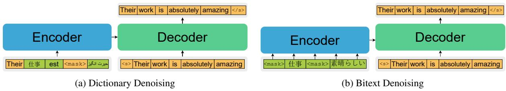

# PARADISE: Exploiting Parallel Data for Multilingual Sequence-to-Sequence Pretraining

Machel Reid The University of Tokyo machelreid@weblab.t.u-tokyo.ac.jp

Mikel Artetxe Meta AI artetxe@fb.com

## Abstract

Despite the success of multilingual sequenceto-sequence pretraining, most existing approaches rely on monolingual corpora, and do not make use of the strong cross-lingual signal contained in parallel data. In this paper, we present PARADISE (PARAllel & Denoising Integration in SEquence-to-sequence models), which extends the conventional denoising objective used to train these models by (i) replacing words in the noised sequence according to a multilingual dictionary, and (ii) predicting the reference translation according to a parallel corpus instead of recovering the original sequence. Our experiments on machine translation and cross-lingual natural language inference show an average improvement of 2.0 BLEU points and 6.7 accuracy points from integrating parallel data into pretraining, respectively, obtaining results that are competitive with several popular models at a fraction of their computational cost.1

## 1 Introduction

Multilingual sequence-to-sequence pretraining has achieved strong results both in cross-lingual classification (Xue et al., 2021) and machine translation (Liu et al., 2020). These models are usually pretrained on combined monolingual corpora in multiple languages using some form of denoising objective. More concretely, they noise each sequence x with a noising function $g _ { \phi }$ , and maximize the probability of recovering x given $g _ { \phi } ( x )$

$$
\ell _ { \mathrm { m o n o } } ( x ) = - \log P \bigl ( x | g _ { \phi } ( x ) \bigr )\tag{1}
$$

Common noising functions include sentencepermutation and span masking (Lewis et al., 2020; Liu et al., 2020).

While these methods obtain strong cross-lingual performance without parallel data, they are usually trained at a scale that is prohibitive for most NLP practitioners. At the same time, it has been argued that the strict unsupervised scenario is not realistic (Artetxe et al., 2020), and parallel data could provide a stronger signal and make training more efficient.

Motivated by this, we propose PARADISE, a pretraining method for sequence-to-sequence models that exploits both word-level and sentence-level parallel data. The core idea of our approach is to augment the conventional denoising objective introduced above by (i) replacing words in the noised sequence according to a bilingual dictionary, and (ii) predicting the reference translation rather than the input sequence. Despite their simplicity, we find that both techniques bring substantial gains over conventional pretraining on monolingual data, as evaluated both in machine translation and zero-shot cross-lingual transfer. Our results are competitive with several popular models despite using only a fraction of the compute, providing strong support for the importance of the inclusion of parallel information in smaller-scale multilingual pretraining methods.

## 2 Proposed method

As illustrated in Figure 1, we propose two methods for introducing parallel data into pretraining: dictionary denoising and bitext denoising.

Dictionary denoising. Our first method encourages learning similar representations at the wordlevel by introducing anchor words through multilingual dictionaries (Conneau et al., 2020b). Let $D _ { l } ( w )$ denote the translation of word w into language $l \in L$ according to the dictionary D. Given the source sentence $x = ( x _ { 1 } , x _ { 2 } , \ldots , x _ { n } )$ , we define its noised version $g _ { \psi } \left( x \right) = \left( \tilde { x } _ { 1 } , \tilde { x } _ { 2 } , \ldots , \tilde { x } _ { n } \right)$ where $\tilde { x } _ { i } = D _ { l } ( x _ { i } )$ with probability $\frac { p _ { r } } { | L | }$ and ${ \tilde { x } } _ { i } =$ xi otherwise (i.e. we replace each word with its translation into a random language with probability $p _ { r } )$ . We set $p _ { r } = 0 . 4$ . Given the dictionary-noised sentence, we train our model using the denoising auto-encoding objective in Eq. 1:

  
Figure 1: Our proposed techniques for integrating parallel data into sequence-to-sequence pretraining.

$$
\ell _ { \mathrm { d i c t } } ( x ) = - \log P \bigl ( x | g _ { \phi } ( g _ { \psi } ( x ) ) \bigr )\tag{2}
$$

Bitext denoising. Our second approach encourages learning from both monolingual and parallel data sources, by including translation data in the pretraining process. Given a source-target bitext pair $( x , y )$ in the parallel corpus, assumed to be semantically equivalent, we model the following:

$$
\ell _ { \mathrm { b i t e x t } } ( x , y ) = - \log P \big ( y | g _ { \phi } ( x ) \big )\tag{3}
$$

in which we optimize the likelihood of generating the target sentence $y$ conditioned on the noised version of the source sentence, $g _ { \phi } ( x )$ 2

Combined objective. Our final objective combines $\ell _ { \mathrm { m o n o } } , \ell _ { \mathrm { d i c t } }$ and $\ell _ { \mathrm { b i t e x t } } . ^ { 3 }$ Given that our corpus contains languages with varying data sizes, we sample sentences using the exponential sampling technique from Conneau and Lample (2019). We use $\alpha _ { \mathrm { m o n o } } = 0 . 5$ to sample from the monolingual corpus, and $\alpha _ { \mathrm { b i t e x t } } = 0 . 3$ to sample from the parallel corpus. To prevent over-exposure to English on the decoder side when sampling from the parallel corpus, we halve the probability of to-English directions and renormalize the probabilities. In addition, given that we have fewer amounts of parallel data (used for $\ell _ { \mathrm { b i t e x t } } )$ than monolingual data (used for $\ell _ { \mathrm { m o n o } }$ and $\ell _ { \mathrm { d i c t } } )$ , we sample between each task using $\alpha _ { \mathrm { t a s k } } = 0 . 3$

## 3 Experimental settings

We pretrain our models on 20 languages (English, French, Spanish, German, Greek, Bulgarian, Russian, Turkish, Arabic, Vietnamese, Thai, Chinese,

Hindi, Swahili, Urdu, Japanese, Basque, Romanian, Sinhala and Nepalese), and evaluate them on machine translation and cross-lingual classification.

## 3.1 Pretraining

Data. We use Wikipedia as our monolingual corpus, and complement it with OSCAR (Ortiz Suárez et al., 2020), and CC100 (Conneau et al., 2020a) for low-resource languages. For a fair comparison with monolingually pretrained baselines, we use the same parallel data as in our downstream machine translation experiments (detailed in §3.2). In addition, we train a separate variant (detailed below) using additional parallel data from ParaCrawl (Esplà et al., 2019), UNPC (Ziemski et al., 2016), CCAligned (El-Kishky et al., 2020), and OpenSubtitles (Lison and Tiedemann, 2016).4 We tokenize all data using SentencePiece (Kudo and Richardson, 2018) with a joint vocabulary of 125k subwords. We use bilingual dictionaries from FLoRes5 (Guzmán et al., 2019) for Nepalese and Sinhala, and MUSE6 (Lample et al., 2018) for the rest of languages. Refer to Appendix A for more details.

Models. We use the same architecture as BARTbase (Lewis et al., 2020), totaling 196M parameters, and train for 100k steps with a batch size of 520k tokens. This takes around a day on 32 NVIDIA V100 16GB GPUs. As discussed before, we train two variants of our full model: PARADISE, which uses the same parallel data as the machine translation experiments, and PAR-ADISE++, which uses additional parallel data. To better understand the contribution of each objective, we train two additional models without dictionary denoising, which we name PARADISE (w/o dict.) and PARADISE++ (w/o dict.), as well as a model without bitext denoising, which we name PARADISE++ (only dict.). Finally, we train a baseline system using the monolingual objective alone, which we refer to as mBART (ours). This follows the original mBART work (Liu et al., 2020), but is directly comparable to the rest of our models in terms of data and hyperparameters.

<table><tr><td rowspan="2">Languages Data Source Size Direction</td><td colspan="2">En-Vi IWSLT15 133K</td><td colspan="2">En-Tr WMT17</td><td colspan="2">En-Ja IWSLT17</td><td colspan="2">En-Ar IWSLT17</td><td colspan="2">En-Ne FLoRes</td><td colspan="2">En-Ro WMT16</td><td colspan="2">En-Si FLoRes</td><td colspan="2">En-Hi IITB</td><td colspan="2">En-Es WMT13</td><td colspan="2">En-Fr WMT14</td></tr><tr><td>←</td><td>→</td><td>←</td><td>207K →</td><td>←</td><td>223K →</td><td>←</td><td>250K →</td><td>←</td><td>564K →</td><td>←</td><td>608K →</td><td>←</td><td>647K</td><td></td><td>1.56M</td><td>→ ←</td><td>15M →</td><td></td><td>41M →</td></tr><tr><td>Random init.</td><td>23.6</td><td>24.8</td><td>12.2</td><td>9.5</td><td>10.4</td><td>12.3</td><td>27.5</td><td>16.9</td><td>7.6</td><td>4.3</td><td>34.0</td><td>34.3</td><td>7.2</td><td>1.2</td><td>10.9</td><td>14.2</td><td>32.1</td><td>31.4</td><td>37.0</td><td>38.9</td></tr><tr><td>mBART (ours)</td><td>29.1</td><td>31.5</td><td>21.3</td><td>15.8</td><td>15.7</td><td>17.3</td><td>32.1</td><td>19.2</td><td>10.3</td><td></td><td>6.1 34.3</td><td>34.9</td><td>11.0</td><td>2.7</td><td>20.2</td><td>19.0</td><td>29.8</td><td></td><td>30.4 36.0</td><td>38.2</td></tr><tr><td>PARADISE</td><td>30.0</td><td>32.6</td><td>23.5</td><td>17.2</td><td>17.2</td><td>19.2</td><td>35.3</td><td>21.1</td><td>13.7</td><td>7.9</td><td>35.9</td><td>36.5</td><td>14.0</td><td>3.7</td><td>23.6</td><td>20.7</td><td>32.6</td><td>32.7</td><td>37.8</td><td>39.8</td></tr></table>

Table 1: Machine translation results. Random initialization numbers taken from Liu et al. (2020).

## 3.2 Downstream settings

Machine translation. Following Liu et al. (2020), we evaluate our models on sentence-level machine translation from and to English using the following datasets: IWSLT (Cettolo et al., 2015, 2017) for Vietnamese, Japanese and Arabic, WMT (Callison-Burch et al., 2009a,b; Bojar et al., 2016, 2017) for Spanish, French, Romanian and Turkish, FLoRes (Guzmán et al., 2019) for Sinhala and Nepalese, and IITB (Kunchukuttan et al., 2018) for Hindi. We report performance in BLEU as detailed in Appendix C.

Cross-lingual classification. We evaluate our models on zero-shot cross-lingual transfer on XNLI (Conneau et al., 2018) and $\mathrm { P A W S } – \mathrm { X } ^ { 7 }$ (Yang et al., 2019), where we finetune on English data and test performance on other languages. We develop a new approach for applying sequence-to-sequence models for classification: feeding the sequence into both the encoder and decoder, and taking the concatenation of the encoder’s <s> representation and the decoder’s $< / \varsigma >$ representation as the input of the classification head. We provide an empirical rationale for this in Appendix E. We finetune all models with a batch size of 64 and a learning rate of $2 \times 1 0 ^ { - 5 }$ for a maximum of 100k iterations, performing early stopping on the validation set.

## 4 Results

## 4.1 Machine translation

As shown in Table 1, PARADISE consistently outperforms our mBART baseline across all language pairs. Note that these two models have seen the exact same corpora, but mBART uses the parallel data for finetuning only, whereas PARADISE also uses it at the pretraining stage. This suggests that incorporating parallel data into pretraining helps learn better representations, which results in better downstream performance.

<table><tr><td>Lang. pair (En-XX)</td><td>Tr</td><td>Ro</td><td>Si</td><td>Hi</td><td>Es</td><td> $\mathbf { A v g } _ { \Delta }$ </td></tr><tr><td>mBART (ours)</td><td>15.8</td><td>34.9</td><td>2.7</td><td>19.0</td><td>30.4</td><td> $2 0 . 6 _ { \pm 0 . 0 }$ </td></tr><tr><td>PARADISE (w/o dict.)</td><td>16.8</td><td>36.2</td><td>3.2</td><td>20.5</td><td>32.4</td><td> $2 1 . 8 _ { + 1 . 2 }$ </td></tr><tr><td>PARADISE</td><td>17.2</td><td>36.5</td><td>3.7</td><td>20.7</td><td>32.7</td><td> $2 2 . 2 _ { + 1 . 6 }$ </td></tr><tr><td>PARADISE++</td><td>19.0</td><td>37.3</td><td>4.2</td><td>20.7</td><td>33.0</td><td> $2 2 . 8 _ { + 2 . 2 }$ </td></tr><tr><td>Lang. pair (XX-En)</td><td>Tr</td><td>Ro</td><td>Si</td><td>Hi</td><td>Es</td><td> $\mathbf { A v g } _ { \Delta }$ </td></tr><tr><td>mBART (ours)</td><td>21.3</td><td>34.3</td><td>11.0</td><td>20.2</td><td>29.8</td><td> $2 3 . 3 _ { \pm 0 . 0 }$ </td></tr><tr><td>PARADISE (w/o dict.)</td><td>23.2</td><td>35.6</td><td>13.2</td><td>22.3</td><td>31.6</td><td> $2 5 . 2 _ { + 1 . 9 }$ </td></tr><tr><td>PARADISE</td><td>23.5</td><td>35.9</td><td>14.0</td><td>23.6</td><td>32.6</td><td> $2 5 . 9 _ { + 2 . 6 }$ </td></tr><tr><td>PARADISE++</td><td>24.9</td><td>36.8</td><td>15.1</td><td>23.5</td><td>32.9</td><td> $2 6 . 6 _ { + 3 . 3 }$ </td></tr></table>

Table 2: Ablation results on machine translation.

Table 2 reports additional ablation results on a subset of languages. As can be seen, removing dictionary denoising hurts, but is still better than our mBART baseline. This shows that both of our proposed approaches—dictionary denoising and bitext denoising—are helpful and complementary. Finally, PARADISE++ improves over PARADISE, indicating that a more balanced corpus with more parallel data is helpful.

## 4.2 Cross-lingual classification

We report XNLI results in Table 3 and PAWS-X results in Appendix F. Our proposed approach outperforms mBART in all languages by a large margin. To our surprise, we also observe big gains in English. We conjecture that this could be explained by bitext denoising providing a stronger training signal from all tokens akin to ELECTRA (Clark et al., 2020), whereas monolingual denoising only gets effective signal from predicting the masked portion. In addition, given that we are using parallel data between English and other languages, PARADISE ends up seeing much more English text compared to mBART—yet a similar amount in the rest of languages—which could also contribute to its better performance in this language. Finally, we observe that all of our different variants perform similarly in English, but incorporating dictionary denoising and using additional parallel data both reduce the cross-lingual transfer gap.

<table><tr><td>Model</td><td>en</td><td>zh</td><td>es</td><td>de</td><td>ar</td><td>ur</td><td>ru</td><td>bg</td><td>el</td><td>fr</td><td>hi</td><td>SW</td><td>th</td><td>tr</td><td>vi</td><td>avg</td></tr><tr><td>mBART (ours)</td><td>77.5</td><td>68.0</td><td>70.7</td><td>68.8</td><td>66.7</td><td>62.2</td><td>68.6</td><td>72.1</td><td>69.6</td><td>70.1</td><td>63.4</td><td>62.6</td><td>66.6</td><td>65.0</td><td>69.7</td><td>68.1</td></tr><tr><td>PARADISE++ (only dict.)</td><td>79.6</td><td>70.9</td><td>74.9</td><td>75.4</td><td>64.4</td><td>66.0</td><td>69.0</td><td>72.2</td><td>75.4</td><td>73.4</td><td>63.9</td><td>65.1</td><td>70.9</td><td>69.0</td><td>72.1</td><td>70.8</td></tr><tr><td>PARADISE</td><td>83.4</td><td>73.8</td><td>77.6</td><td>76.0</td><td>72.4</td><td>65.1</td><td>74.0</td><td>74.4</td><td>73.2</td><td>77.7</td><td>70.6</td><td>66.2</td><td>70.4</td><td>72.1</td><td>75.3</td><td>73.5</td></tr><tr><td>PARADISE++ (w/o dict.)</td><td>83.3</td><td>72.9</td><td>77.2</td><td>75.7</td><td>64.4</td><td>66.9</td><td>73.4</td><td>74.8</td><td>75.7</td><td>77.7</td><td>68.5</td><td>67.4</td><td>71.0</td><td>73.3</td><td>75.0</td><td>73.1</td></tr><tr><td>PARADISE++</td><td>83.0</td><td>74.0</td><td>79.0</td><td>76.5</td><td>68.5</td><td>66.8</td><td>74.3</td><td>76.0</td><td>76.4</td><td>77.7</td><td>70.2</td><td>70.5</td><td>72.3</td><td>74.2</td><td>75.4</td><td>74.3</td></tr></table>

Table 3: Accuracy of zero-shot crosslingual classification on the XNLI dataset.
<table><tr><td>Model</td><td>#Langs</td><td>Task</td><td>Params.</td><td>Est. GPU Days</td><td>Data (GB)</td><td>XNLI</td><td>PAWS-X</td><td>MT</td></tr><tr><td>mBERT (Devlin et al., 2019)†</td><td>104</td><td>MLM</td><td>179M (0.9x)</td><td></td><td>60</td><td>65.4</td><td>86.2</td><td></td></tr><tr><td>MMTE (Siddhant et al., 2019)†</td><td>102</td><td>Translation</td><td>375M (1.9x)</td><td></td><td>5000</td><td>67.4</td><td>85.6</td><td></td></tr><tr><td>mT5-small (Xue et al., 2021)</td><td>101</td><td>Eq.1</td><td>300M (1.5x)</td><td></td><td>27000</td><td>67.5</td><td>85.8</td><td></td></tr><tr><td>mT6 (Chi et al., 2021a)</td><td>94</td><td>SC+PNAT+TSC</td><td>300M (1.5x)</td><td>40 (1.3x)</td><td>2120</td><td>64.7</td><td>86.6</td><td></td></tr><tr><td>AMBER (Hu et al., 2021)</td><td>104</td><td>MLM+TLM</td><td>179M (0.9x)</td><td>1000 (31x)</td><td>100</td><td>71.6</td><td>89.2</td><td></td></tr><tr><td>XLM-15 (Conneau and Lample, 2019)‡</td><td>15</td><td>MLM+TLM</td><td>250M (1.3x)</td><td>450 (14x)</td><td>100</td><td>72.6</td><td>88.0</td><td></td></tr><tr><td>XLM-R-base (Conneau et al., 2020a)‡</td><td>100</td><td>MLM</td><td>270M (1.4x)</td><td>13K (406x)</td><td>2400</td><td>73.4</td><td>87.4</td><td></td></tr><tr><td>mBART (Liu et al., 2020)</td><td>25</td><td>Eq.1</td><td>680M (3.5x)</td><td>4.5K (140x)</td><td>2400</td><td></td><td></td><td>23.5</td></tr><tr><td>mBART (ours)</td><td>20</td><td>Eq.1</td><td>196M (1.0x)</td><td>32 (1.0x)</td><td>72</td><td>68.1</td><td>85.4</td><td>21.1</td></tr><tr><td>PARADISE</td><td>20</td><td>Eq. 1, 2, 3</td><td>196M (1.0x)</td><td>32 (1.0x)</td><td>81</td><td>73.5</td><td>89.0</td><td>23.1</td></tr><tr><td>PARADISE++</td><td>20</td><td>Eq. 1, 2, 3</td><td>196M (1.0x)</td><td>32 (1.0x)</td><td>95</td><td>74.3</td><td>89.2</td><td>23.8</td></tr></table>

Table 4: Comparison with prior work. denotes results taken from Hu et al. (2020). denotes results taken from Hu et al. (2021). 1 GPU day = 1 day on an NVIDIA V100 GPU.

## 4.3 Comparison with prior work

So as to put our results into perspective, we compare our models with several popular systems from the literature. As shown in Table 4, our proposed approach obtains competitive results despite being trained at a much smaller scale. Just in line with our previous results, this suggests that incorporating parallel data makes pretraining more efficient given that we outperform XLM-R base, mT5, and mBART despite using less data/compute/model size. Interestingly, our method also outperforms XLM-15, MMTE, and mT6 which also use parallel data, as well as AMBER, showing evidence contrary to Hu et al. (2021)’s suggestion that using dictionaries may hurt performance. Detailed per-language results for each task can be found in Appendix F.

## 5 Related work

Most prior work on multilingual pretraining uses monolingual data only (Pires et al., 2019; Conneau et al., 2020a; Song et al., 2019; Liu et al., 2020; Xue et al., 2021). There have been several proposals to incorporate parallel data into encoder-only models (Lample and Conneau, 2019; Huang et al., 2019; Hu et al., 2021; Chi et al., 2021b), with some approaches replacing words according to a bilingual dictionary, similar to our dictionary denoising objective (Conneau et al., 2020b; Chaudhary et al., 2020; Dufter and Schütze, 2020). In contrast, we focus on sequence-to-sequence models, which we believe are more flexible and provide a more natural way of integrating parallel data. In that spirit, Siddhant et al. (2019) showed that vanilla machine translation models are already competitive in cross-lingual classification. Closer to our work, Chi et al. (2021a) incorporated parallel corpora into sequence-to-sequence pretraining by feeding concatenated parallel sentences to the encoder and using different masking strategies. In contrast, our approach feeds a noised sentence into the encoder, and tries to recover its translation in the decoder side, obtaining better results with a similar computational budget. Concurrent to our work, Kale et al. (2021) extended T5 to incorporate parallel corpora using a similar approach to our bitext denoising.

## 6 Conclusions

In this work, we proposed PARADISE, which introduces two new objectives to integrate parallel data into sequence-to-sequence pretraining. Experimental results on machine translation and cross-lingual classification show that PARADISE provides significant improvements over mBART-style pretraining on monolingual corpora, obtaining results that are competitive with several popular models at a much smaller scale. Given these findings, we encourage use of parallel data in smaller-scale multilingual pretraining work. In the future, we look to see if our improvements also hold at a larger scale.

## Acknowledgements

We thank Junjie Hu, Jungo Kasai, and Victor Zhong for useful suggestions and comments. MR is grateful to the Masason Foundation for their support

## References

Mikel Artetxe, Sebastian Ruder, Dani Yogatama, Gorka Labaka, and Eneko Agirre. 2020. A Call for More Rigor in Unsupervised Cross-lingual Learning. ArXiv.

Ondˇrej Bojar, Rajen Chatterjee, Christian Federmann, Yvette Graham, Barry Haddow, Shujian Huang, Matthias Huck, Philipp Koehn, Qun Liu, Varvara Logacheva, Christof Monz, Matteo Negri, Matt Post, Raphael Rubino, Lucia Specia, and Marco Turchi. 2017. Findings of the 2017 conference on machine translation (WMT17). In Proceedings of the Second Conference on Machine Translation, pages 169– 214, Copenhagen, Denmark. Association for Computational Linguistics.

Ondˇrej Bojar, Rajen Chatterjee, Christian Federmann, Yvette Graham, Barry Haddow, Matthias Huck, Antonio Jimeno Yepes, Philipp Koehn, Varvara Logacheva, Christof Monz, Matteo Negri, Aurélie Névéol, Mariana Neves, Martin Popel, Matt Post, Raphael Rubino, Carolina Scarton, Lucia Specia, Marco Turchi, Karin Verspoor, and Marcos Zampieri. 2016. Findings of the 2016 conference on machine translation. In Proceedings of the First Conference on Machine Translation: Volume 2, Shared Task Papers, pages 131–198, Berlin, Germany. Association for Computational Linguistics.

Chris Callison-Burch, Philipp Koehn, Christof Monz, and Josh Schroeder. 2009a. Findings of the 2009 Workshop on Statistical Machine Translation. In Proceedings of the Fourth Workshop on Statistical Machine Translation, pages 1–28, Athens, Greece. Association for Computational Linguistics.

Chris Callison-Burch, Philipp Koehn, Christof Monz, and Josh Schroeder. 2009b. Findings of the 2009 Workshop on Statistical Machine Translation. In Proceedings of the Fourth Workshop on Statistical Machine Translation, pages 1–28, Athens, Greece. Association for Computational Linguistics.

M. Cettolo, Marcello Federico, L. Bentivogli, Niehues Jan, Stüker Sebastian, Sudoh Katsuitho, Yoshino Koichiro, and Federmann Christian. 2017. Overview of the iwslt 2017 evaluation campaign.

M. Cettolo, J. Niehues, S. Stüker, L. Bentivogli, R. Cattoni, and Marcello Federico. 2015. The iwslt 2015 evaluation campaign.

Aditi Chaudhary, Karthik Raman, Krishna Srinivasan, and Jiecao Chen. 2020. Dict-mlm: Improved multilingual pre-training using bilingual dictionaries.

Zewen Chi, Li Dong, Shuming Ma, Shaohan Huang Xian-Ling Mao, Heyan Huang, and Furu Wei. 2021a. mt6: Multilingual pretrained text-to-text transformer with translation pairs. arXiv preprint arXiv:2104.08692.

Zewen Chi, Li Dong, Furu Wei, Nan Yang, Saksham Singhal, Wenhui Wang, Xia Song, Xian-Ling Mao, Heyan Huang, and Ming Zhou. 2021b. InfoXLM: An information-theoretic framework for cross-lingual language model pre-training. In Proceedings ofthe 2021 Conference ofthe North American Chapter of the Association for Computational Linguistics: Human Language Technologies, pages 3576–3588, Online. Association for Computational Linguistics.

Kevin Clark, Minh-Thang Luong, Quoc V. Le, and Christopher D. Manning. 2020. ELECTRA: Pretraining Text Encoders as Discriminators Rather Than Generators. arXiv:2003.10555 [cs].

Alexis Conneau, Kartikay Khandelwal, Naman Goyal, Vishrav Chaudhary, Guillaume Wenzek, Francisco Guzmán, Edouard Grave, Myle Ott, Luke Zettlemoyer, and Veselin Stoyanov. 2020a. Unsupervised cross-lingual representation learning at scale. In Proceedings ofthe 58th Annual Meeting ofthe Association for Computational Linguistics, pages 8440– 8451, Online. Association for Computational Linguistics.

Alexis Conneau and Guillaume Lample. 2019. Crosslingual language model pretraining. In Advances in Neural Information Processing Systems 32: Annual Conference on Neural Information Processing Systems 2019, NeurIPS 2019, December 8-14, 2019, Vancouver, BC, Canada, pages 7057–7067.

Alexis Conneau, Ruty Rinott, Guillaume Lample, Adina Williams, Samuel Bowman, Holger Schwenk, and Veselin Stoyanov. 2018. XNLI: Evaluating cross-lingual sentence representations. In Proceedings of the 2018 Conference on Empirical Methods in Natural Language Processing, pages 2475–2485, Brussels, Belgium. Association for Computational Linguistics.

Alexis Conneau, Shijie Wu, Haoran Li, Luke Zettlemoyer, and Veselin Stoyanov. 2020b. Emerging cross-lingual structure in pretrained language models. In Proceedings of the 58th Annual Meeting of the Association for Computational Linguistics, pages 6022–6034, Online. Association for Computational Linguistics.

Jacob Devlin, Ming-Wei Chang, Kenton Lee, and Kristina Toutanova. 2019. BERT: Pre-training of deep bidirectional transformers for language understanding. In Proceedings of the 2019 Conference of the North American Chapter of the Association for Computational Linguistics: Human Language Technologies, Volume 1 (Long and Short Papers), pages 4171–4186, Minneapolis, Minnesota. Association for Computational Linguistics.

Philipp Dufter and Hinrich Schütze. 2020. Identifying elements essential for BERT’s multilinguality. In Proceedings of the 2020 Conference on Empirical Methods in Natural Language Processing (EMNLP), pages 4423–4437, Online. Association for Computational Linguistics.

Ahmed El-Kishky, Vishrav Chaudhary, Francisco Guzmán, and Philipp Koehn. 2020. CCAligned: A massive collection of cross-lingual web-document pairs. In Proceedings of the 2020 Conference on Empirical Methods in Natural Language Processing (EMNLP), pages 5960–5969, Online. Association for Computational Linguistics.

Miquel Esplà, Mikel Forcada, Gema Ramírez-Sánchez, and Hieu Hoang. 2019. ParaCrawl: Web-scale parallel corpora for the languages of the EU. In Proceedings ofMachine Translation Summit XVII Volume 2: Translator, Project and User Tracks, pages 118–119, Dublin, Ireland. European Association for Machine Translation.

Francisco Guzmán, Peng-Jen Chen, Myle Ott, Juan Pino, Guillaume Lample, Philipp Koehn, Vishrav Chaudhary, and Marc’Aurelio Ranzato. 2019. The FLoRes Evaluation Datasets for Low-Resource Machine Translation: Nepali-English and Sinhala-English. arXiv:1902.01382 [cs].

Junjie Hu, Melvin Johnson, Orhan Firat, Aditya Siddhant, and Graham Neubig. 2021. Explicit Alignment Objectives for Multilingual Bidirectional Encoders. arXiv:2010.07972 [cs].

Junjie Hu, Sebastian Ruder, Aditya Siddhant, Graham Neubig, Orhan Firat, and Melvin Johnson. 2020. XTREME: A Massively Multilingual Multitask Benchmark for Evaluating Cross-lingual Generalization. arXiv:2003.11080 [cs].

Haoyang Huang, Yaobo Liang, Nan Duan, Ming Gong, Linjun Shou, Daxin Jiang, and Ming Zhou. 2019. Unicoder: A universal language encoder by pretraining with multiple cross-lingual tasks. In Proceedings of the 2019 Conference on Empirical Methods in Natural Language Processing and the 9th International Joint Conference on Natural Language Processing (EMNLP-IJCNLP), pages 2485–2494, Hong Kong, China. Association for Computational Linguistics.

Mihir Kale, Aditya Siddhant, Noah Constant, Melvin Johnson, Rami Al-Rfou, and Linting Xue. 2021. nmt5 – is parallel data still relevant for pre-training

massively multilingual language models? arXiv preprint arXiv:2106.02171.

Taku Kudo and John Richardson. 2018. SentencePiece: A simple and language independent subword tokenizer and detokenizer for neural text processing. In Proceedings of the 2018 Conference on Empirical Methods in Natural Language Processing: System Demonstrations, pages 66–71, Brussels, Belgium. Association for Computational Linguistics.

Anoop Kunchukuttan, Pratik Mehta, and Pushpak Bhattacharyya. 2018. The IIT Bombay English-Hindi parallel corpus. In Proceedings of the Eleventh International Conference on Language Resources and Evaluation (LREC 2018), Miyazaki, Japan. European Language Resources Association (ELRA).

Guillaume Lample and Alexis Conneau. 2019. Cross-lingual Language Model Pretraining. arXiv:1901.07291 [cs].

Guillaume Lample, Alexis Conneau, Marc’Aurelio Ranzato, Ludovic Denoyer, and Hervé Jégou. 2018. Word translation without parallel data. In 6th International Conference on Learning Representations, ICLR 2018, Vancouver, BC, Canada, April 30 - May 3, 2018, Conference Track Proceedings. OpenReview.net.

Mike Lewis, Yinhan Liu, Naman Goyal, Marjan Ghazvininejad, Abdelrahman Mohamed, Omer Levy, Veselin Stoyanov, and Luke Zettlemoyer. 2020. BART: Denoising sequence-to-sequence pretraining for natural language generation, translation, and comprehension. In Proceedings of the 58th Annual Meeting of the Association for Computational Linguistics, pages 7871–7880, Online. Association for Computational Linguistics.

Pierre Lison and Jörg Tiedemann. 2016. OpenSubtitles2016: Extracting large parallel corpora from movie and TV subtitles. In Proceedings ofthe Tenth International Conference on Language Resources and Evaluation (LREC’16), pages 923–929, Portorož, Slovenia. European Language Resources Association (ELRA).

Yinhan Liu, Jiatao Gu, Naman Goyal, Xian Li, Sergey Edunov, Marjan Ghazvininejad, Mike Lewis, and Luke Zettlemoyer. 2020. Multilingual denoising pre-training for neural machine translation. Transactions of the Association for Computational Linguistics, 8:726–742.

Paulius Micikevicius, Sharan Narang, Jonah Alben, Gregory F. Diamos, Erich Elsen, David García, Boris Ginsburg, Michael Houston, Oleksii Kuchaiev, Ganesh Venkatesh, and Hao Wu. 2018. Mixed precision training. In 6th International Conference on Learning Representations, ICLR 2018, Vancouver, BC, Canada, April 30 - May 3, 2018, Conference Track Proceedings. OpenReview.net.

Pedro Javier Ortiz Suárez, Laurent Romary, and Benoît Sagot. 2020. A monolingual approach to contextualized word embeddings for mid-resource languages. In Proceedings of the 58th Annual Meeting of the Association for Computational Linguistics, pages 1703–1714, Online. Association for Computational Linguistics.

Myle Ott, Sergey Edunov, Alexei Baevski, Angela Fan, Sam Gross, Nathan Ng, David Grangier, and Michael Auli. 2019. fairseq: A fast, extensible toolkit for sequence modeling. In Proceedings of the 2019 Conference of the North American Chapter ofthe Associationfor Computational Linguistics (Demonstrations), pages 48–53, Minneapolis, Minnesota. Association for Computational Linguistics.

Telmo Pires, Eva Schlinger, and Dan Garrette. 2019. How multilingual is multilingual BERT? In Proceedings of the 57th Annual Meeting of the Association for Computational Linguistics, pages 4996– 5001, Florence, Italy. Association for Computational Linguistics.

Matt Post. 2018. A call for clarity in reporting BLEU scores. In Proceedings of the Third Conference on Machine Translation: Research Papers, pages 186– 191, Brussels, Belgium. Association for Computational Linguistics.

Rico Sennrich, Barry Haddow, and Alexandra Birch. 2016. Edinburgh neural machine translation systems for WMT 16. In Proceedings of the First Conference on Machine Translation: Volume 2, Shared Task Papers, pages 371–376, Berlin, Germany. Association for Computational Linguistics.

Aditya Siddhant, Melvin Johnson, Henry Tsai, Naveen Arivazhagan, Jason Riesa, Ankur Bapna, Orhan Firat, and Karthik Raman. 2019. Evaluating the crosslingual effectiveness of massively multilingual neural machine translation.

Kaitao Song, Xu Tan, Tao Qin, Jianfeng Lu, and Tie-Yan Liu. 2019. MASS: Masked Sequence to Sequence Pre-training for Language Generation. arXiv:1905.02450 [cs].

Linting Xue, Noah Constant, Adam Roberts, Mihir Kale, Rami Al-Rfou, Aditya Siddhant, Aditya Barua, and Colin Raffel. 2021. mT5: A massively multilingual pre-trained text-to-text transformer. arXiv:2010.11934 [cs].

Yinfei Yang, Yuan Zhang, Chris Tar, and Jason Baldridge. 2019. PAWS-X: A cross-lingual adversarial dataset for paraphrase identification. In Proceedings of the 2019 Conference on Empirical Methods in Natural Language Processing and the 9th International Joint Conference on Natural Language Processing (EMNLP-IJCNLP), pages 3687– 3692, Hong Kong, China. Association for Computational Linguistics.

Michał Ziemski, Marcin Junczys-Dowmunt, and Bruno Pouliquen. 2016. The United Nations parallel corpus v1.0. In Proceedings of the Tenth International Conference on Language Resources and Evaluation (LREC’16), pages 3530–3534, Portorož, Slovenia. European Language Resources Association (ELRA).

## A Data

We list data sources used for pretraining PAR-ADISE++ in Table 5 (monolingual data) and Table 6 (parallel data).

## B Pretraining hyperparameters

We use the Adam optimizer $( \epsilon ~ = ~ 1 0 ^ { - 6 } , \beta ~ =$ (0.9, 0.98)), and warm up the learning rate to a peak of $7 \times 1 0 ^ { - 4 }$ after 10K iterations and then proceed to decay the learning rate with the polynomial decay schedule up until 100K iterations. All code and experiments are performed with fairseq (Ott et al., 2019). Following Liu et al. (2020), we add an additional layer-normalization layer on top of both the encoder and decoder to stabilize training with FP16 precision (Micikevicius et al., 2018). All models are trained on 32 V100 16GB GPUs and take 24 hours to finish training.

## C Machine translation evaluation

Following Liu et al. (2020), we use detokenized SacreBLEU (Post, 2018) for all languages unless specified otherwise next. For Japanese we use KyTea8, for Nepalese, Sinhala, and Hindi we use Indic-NLP9, for Arabic we use the QCRI Arabic Normalizer10,11, and for Romanian we use Moses tokenization and script normalization following Sennrich et al. (2016); Liu et al. (2020).

## D Machine translation finetuning

We finetune our models using the same setup as mBART, warming up the learning rate to $3 \times 1 0 ^ { - 5 }$ over 2500 iterations and then decaying with a polynomial schedule. We use 0.3 dropout and label smoothing  = 0.2.

## E Comparison of finetuning approaches

Table 7 compares our proposed finetuning approach, which combines the representations from both the encoder and the decoder (see §3), to using either of them alone.12 While prior work either minimally used the decoder if at all (Siddhant et al.,

<table><tr><td>Language</td><td>Data source</td><td>Data size (GB)</td></tr><tr><td>En</td><td>Wiki</td><td>14G</td></tr><tr><td>De</td><td>Wiki</td><td>5.9G</td></tr><tr><td>Fr</td><td>Wiki</td><td>4.5G</td></tr><tr><td>Es</td><td>Wiki</td><td>3.7G</td></tr><tr><td>Ja</td><td>Wiki</td><td>3.0G</td></tr><tr><td>Ru</td><td>Wiki</td><td>6.2G</td></tr><tr><td>Ar</td><td>Wiki</td><td>1.7G</td></tr><tr><td>Ne</td><td>CC100</td><td>3.8G</td></tr><tr><td>Si</td><td>CC100</td><td>3.7G</td></tr><tr><td>Ro</td><td>Wiki+WLM</td><td>2.5G</td></tr><tr><td>Zh</td><td>Wiki+WLM</td><td>4.4G</td></tr><tr><td>El</td><td>Wiki+WLM</td><td>2.9G</td></tr><tr><td>Eu</td><td>Wiki+OSCAR</td><td>0.6G</td></tr><tr><td>Bg</td><td>Wiki+OSCAR</td><td>2.5G</td></tr><tr><td>Hi</td><td>Wiki+OSCAR</td><td>2.3G</td></tr><tr><td>Sw</td><td>Wiki+CC100</td><td>1.1G</td></tr><tr><td>Th</td><td>Wiki+OSCAR</td><td>2.4G</td></tr><tr><td>Ur</td><td>Wiki+OSCAR</td><td>1.9G</td></tr><tr><td>Vi</td><td>Wiki+OSCAR</td><td>2.8G</td></tr><tr><td>Tr</td><td>Wiki+OSCAR</td><td>2.4G</td></tr><tr><td>Total</td><td></td><td>72G</td></tr></table>

Table 5: Monolingual Data Statistics. Wiki refers to Wikipedia, and WLM refers to the News Crawl data from CommonCrawl used in WMT.

<table><tr><td>Language</td><td>Data source</td><td>Data size (GB)</td><td># Pairs</td></tr><tr><td>Ar</td><td>UNPC</td><td>2.0G</td><td>5554595</td></tr><tr><td>Bg</td><td>ParaCrawl</td><td>1.9G</td><td>6470710</td></tr><tr><td>De</td><td>ParaCrawl</td><td>2.0G</td><td>9685483</td></tr><tr><td>El</td><td>ParaCrawl</td><td>2.0G</td><td>6676200</td></tr><tr><td>Es</td><td>ParaCrawl</td><td>2.0G</td><td>9138031</td></tr><tr><td>Eu</td><td>OPUS</td><td>0.1G</td><td>585210</td></tr><tr><td>Fr</td><td>ParaCrawl</td><td>2.0G</td><td>8485669</td></tr><tr><td>Hi</td><td>IITB</td><td>0.4G</td><td>1609682</td></tr><tr><td>Ja</td><td>JParaCrawl</td><td>2.0G</td><td>6366802</td></tr><tr><td>Ne</td><td>CCAligned</td><td>0.2G</td><td>487157</td></tr><tr><td>Ro</td><td>ParaCrawl</td><td>1.3G</td><td>6160525</td></tr><tr><td>Ru</td><td>ParaCrawl</td><td>1.6G</td><td>5377911</td></tr><tr><td>Si</td><td>CCAligned</td><td>0.2G</td><td>619730</td></tr><tr><td>Sw</td><td>OPUS</td><td>0.2G</td><td>699719</td></tr><tr><td>Th</td><td>OpenSubtitles</td><td>0.4G</td><td>3281533</td></tr><tr><td>Tr</td><td>OpenSubtitles</td><td>2.0G</td><td>32077240</td></tr><tr><td>Ur</td><td>CCAligned</td><td>0.3G</td><td>1371930</td></tr><tr><td>Vi</td><td>OpenSubtitles</td><td>0.2G</td><td>3505276</td></tr><tr><td>Zh</td><td>UNPC</td><td>2.0G</td><td>7706183</td></tr><tr><td>Total</td><td>一</td><td>23G</td><td>126882448</td></tr></table>

Table 6: Parallel Data Statistics
<table><tr><td>Model</td><td>avg</td><td>∆</td></tr><tr><td>PARADISE++ (encoder-decoder)</td><td>74.3</td><td></td></tr><tr><td>decoder-only</td><td>73.8</td><td>-0.5</td></tr><tr><td>encoder-only</td><td>72.0</td><td>-2.3</td></tr></table>

Table 7: Ablation of finetuning methods on XNLI.

2019; Xue et al., 2021), or only added a classification head on top of the decoder (Lewis et al., 2020), we find that combining them both works best.

## F Additional results

We list detailed results by language in this section with results on XNLI in Table 8, PAWS-X in Table 9, and our machine translation ablation (with mBART (Liu et al., 2020) results included) in Table 10. We note that mBART underperforms XLM-Rlarge on XNLI, however that may be attributed to the fact that XLM-R was trained for much longer rather than the architectural design.

<table><tr><td>Models</td><td>en</td><td>zh</td><td>es</td><td>de</td><td>ar</td><td>ur</td><td>ru</td><td>bg</td><td>el</td><td>fr</td><td>hi</td><td>SW</td><td>th</td><td>tr</td><td>vi</td><td>avg</td></tr><tr><td>mBERT</td><td>80.8</td><td>67.8</td><td>73.5</td><td>70.0</td><td>64.3</td><td>57.2</td><td>67.8</td><td>68.0</td><td>65.3</td><td>73.4</td><td>58.9</td><td>49.7</td><td>54.1</td><td>60.9</td><td>69.3</td><td>65.4</td></tr><tr><td>MMTE</td><td>79.6</td><td>69.2</td><td>71.6</td><td>68.2</td><td>64.9</td><td>60.0</td><td>66.2</td><td>70.4</td><td>67.3</td><td>69.5</td><td>63.5</td><td>61.9</td><td>66.2</td><td>63.6</td><td>69.7</td><td>67.5</td></tr><tr><td>mT5-small</td><td>79.6</td><td>65.8</td><td>72.7</td><td>69.2</td><td>65.2</td><td>59.9</td><td>70.1</td><td>71.3</td><td>68.6</td><td>70.7</td><td>62.5</td><td>59.7</td><td>66.3</td><td>64.4</td><td>66.3</td><td>67.5</td></tr><tr><td>AMBER</td><td>84.7</td><td>71.6</td><td>76.9</td><td>74.2</td><td>70.2</td><td>61.0</td><td>73.3</td><td>74.3</td><td>72.5</td><td>76.6</td><td>66.2</td><td>59.9</td><td>65.7</td><td>73.2</td><td>73.4</td><td>71.6</td></tr><tr><td>XLM-15 (MLM+TLM)</td><td>84.1</td><td>68.8</td><td>77.8</td><td>75.7</td><td>70.4</td><td>62.2</td><td>75.0</td><td>75.7</td><td>73.3</td><td>78.0</td><td>67.3</td><td>67.5</td><td>70.5</td><td>70.0</td><td>73.0</td><td>72.6</td></tr><tr><td>XLM-100</td><td>82.8</td><td>70.2</td><td>75.5</td><td>72.7</td><td>66.0</td><td>59.8</td><td>69.9</td><td>71.9</td><td>70.4</td><td>74.3</td><td>62.5</td><td>58.1</td><td>65.5</td><td>66.4</td><td>70.7</td><td>69.1</td></tr><tr><td>XLM-R-base</td><td>83.9</td><td>73.6</td><td>78.3</td><td>75.2</td><td>71.9</td><td>65.4</td><td>75.1</td><td>76.7</td><td>75.4</td><td>77.4</td><td>69.1</td><td>62.2</td><td>72.0</td><td>70.9</td><td>74.0</td><td>73.4</td></tr><tr><td>mBART</td><td>87.7</td><td>76.4</td><td>81.5</td><td>79.8</td><td>75.5</td><td></td><td>78.9</td><td></td><td></td><td>80.6</td><td>73.0</td><td></td><td></td><td>76.1</td><td>77.4</td><td></td></tr><tr><td>XLM-R-large</td><td>88.7</td><td>78.2</td><td>83.7</td><td>82.5</td><td>77.2</td><td>71.7</td><td>79.1</td><td>83.0</td><td>80.8</td><td>82.2</td><td>75.6</td><td>71.2</td><td>77.4</td><td>78.0</td><td>79.3</td><td>79.2</td></tr><tr><td>mBART (ours)</td><td>77.5</td><td>68.0</td><td>70.7</td><td>68.8</td><td>66.7</td><td>62.2</td><td>68.6</td><td>72.1</td><td>69.6</td><td>70.1</td><td>63.4</td><td>62.6</td><td>66.6</td><td>65.0</td><td>69.7</td><td>68.1</td></tr><tr><td>PARADISE (w/o dict.)</td><td>83.3</td><td>72.9</td><td>77.2</td><td>75.7</td><td>64.4</td><td>66.9</td><td>73.4</td><td>74.8</td><td>75.7</td><td>77.7</td><td>68.5</td><td>67.4</td><td>71.0</td><td>73.3</td><td>75.0</td><td>73.1</td></tr><tr><td>PARADISE</td><td>83.0</td><td>74.0</td><td>79.0</td><td>76.5</td><td>68.5</td><td>66.8</td><td>74.3</td><td>76.0</td><td>76.4</td><td>77.7</td><td>70.2</td><td>70.5</td><td>72.3</td><td>74.2</td><td>75.4</td><td>74.3</td></tr></table>

Table 8: Accuracy of zero-shot crosslingual classification on the XNLI dataset. Bold numbers highlight the highest scores across languages on the existing models (upper part) and PARADISE variants (bottom part). Results for previous work are sourced from Hu et al. (2020, 2021); Xue et al. (2021).

<table><tr><td>Model</td><td>de</td><td>en</td><td>es</td><td>fr</td><td>zh</td><td>Avg</td></tr><tr><td>mBERT</td><td>85.7</td><td>94.0</td><td>87.4</td><td>87.0</td><td>77.0</td><td>86.2</td></tr><tr><td>MMTE</td><td>85.1</td><td>93.1</td><td>87.2</td><td>86.9</td><td>75.9</td><td>85.6</td></tr><tr><td>mT5-small</td><td>86.2</td><td>92.2</td><td>86.1</td><td>86.6</td><td>77.9</td><td>85.8</td></tr><tr><td>AMBER</td><td>89.4</td><td>95.6</td><td>89.2</td><td>90.7</td><td>80.9</td><td>89.2</td></tr><tr><td>XLM-15</td><td>88.5</td><td>94.7</td><td>89.3</td><td>89.6</td><td>78.1</td><td>88.0</td></tr><tr><td>XLM-100</td><td>85.9</td><td>94.0</td><td>88.3</td><td>87.4</td><td>76.5</td><td>86.4</td></tr><tr><td>XLM-R-base</td><td>87.0</td><td>94.2</td><td>88.6</td><td>88.7</td><td>78.5</td><td>87.4</td></tr><tr><td>XLM-R-large</td><td>89.7</td><td>94.7</td><td>90.1</td><td>90.4</td><td>82.3</td><td>89.4</td></tr><tr><td>PARADISE++</td><td>89.1</td><td>94.3</td><td>89.6</td><td>90.6</td><td>82.3</td><td>89.2</td></tr></table>

Table 9: Accuracy of zero-shot cross-lingual classification on PAWS-X. Bold numbers highlight the highest scores across languages on the existing models (upper part) and PARADISE variants (bottom part). We source baseline results from Hu et al. (2020, 2021); Xue et al. (2021).

<table><tr><td>Lang. Pair</td><td>En-Tr</td><td>En-Ro</td><td>En-Si</td><td>En-Hi</td><td>En-Es</td><td>Tr-En</td><td>Ro-En</td><td>Si-En</td><td>Hi-En</td></tr><tr><td>mBART (ours)</td><td>15.8</td><td>34.9</td><td>2.7</td><td>19.0</td><td>30.4</td><td>21.3</td><td>34.3</td><td>11.0</td><td>20.2</td></tr><tr><td>PARADISE (w/o dict.)</td><td>16.8</td><td>36.2</td><td>3.2</td><td>20.5</td><td>32.4</td><td>23.2</td><td>35.6</td><td>13.2</td><td>22.3</td></tr><tr><td>PARADISE</td><td>17.2</td><td>36.5</td><td>3.7</td><td>20.7</td><td>32.7</td><td>23.5</td><td>35.9</td><td>14.0</td><td>23.6</td></tr><tr><td>PARADISE++</td><td>19.0</td><td>37.3</td><td>4.2</td><td>20.7</td><td>33.0</td><td>24.9</td><td>36.8</td><td>15.1</td><td>23.5</td></tr><tr><td>mBART</td><td>17.8</td><td>37.7</td><td>3.3</td><td>20.8</td><td>34.0</td><td>22.5</td><td>37.8</td><td>13.7</td><td>23.5</td></tr></table>

Table 10: Ablation results on machine translation. Note that mBART is trained with 140x more compute and 3.5x more parameters.